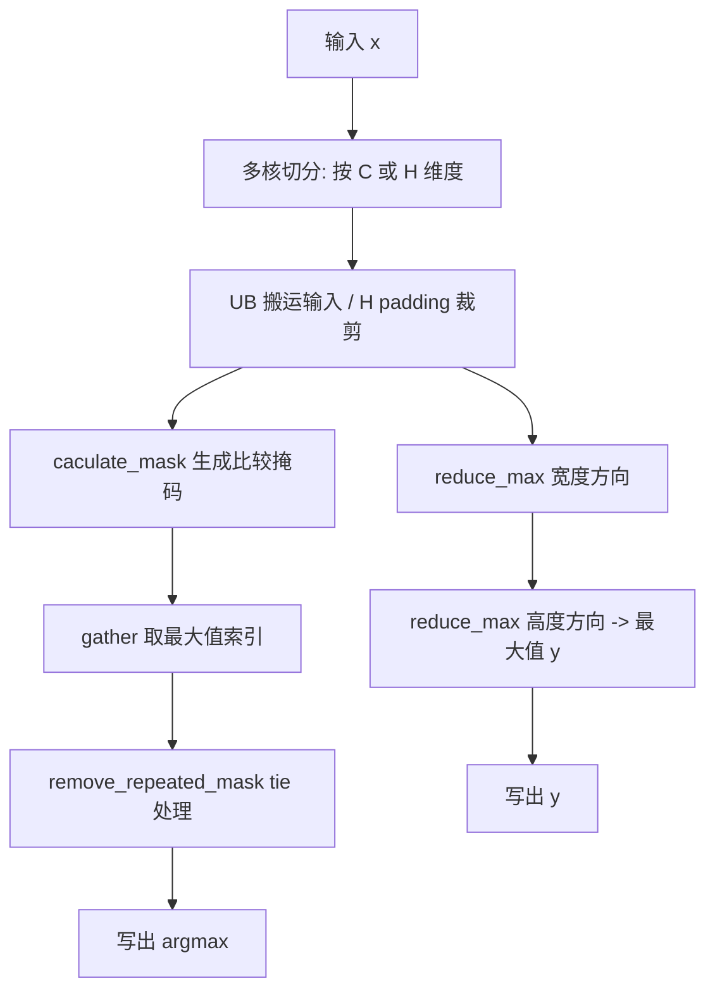
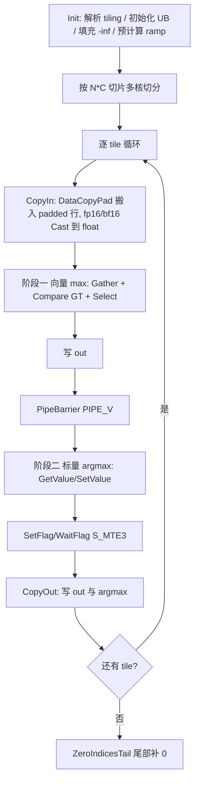

# MaxPool2dWithMask 算子设计文档

## 一、需求背景

### 1.1 需求来源

本算子为 2026 昇腾社区任务（任务编号 09-46-MaxPool2dWithMask）的算子开发任务。参考 CANN 官方接口
`aclnnMaxPool2dWithMask`，在昇腾 NPU 上基于 Ascend C 编程语言实现功能一致的 MaxPool2dWithMask 算子，
完成设计、开发、测试全流程，验收通过后提交至算子开源仓 `https://gitcode.com/cann/ops-nn`（目录
`experimental/pooling/max_pool2d_with_mask`）。

### 1.2 背景介绍

MaxPool2dWithMask 实现二维最大池化（Max Pooling 2D）：对输入张量的每个空间窗口取最大值，
并额外输出最大值在输入平面内的索引（`indices` 语义为 int32 argmax，每通道独立）。

#### 1.2.1 MaxPool2dWithMask 算子实现优化

基于标杆算子（历史 TBE 版本 `MaxPoolWithArgmaxV2`）使用 Ascend C 编程语言进行优化实现。
标杆算子相关源码路径如下：

- TBE 算子实现源码：`/usr/local/Ascend/cann-9.1.0/opp/built-in/op_impl/ai_core/tbe/impl/ops_legacy/dynamic/max_pool_with_argmaxv2.py`
  （文件 `max_pool_with_argmaxv2.py`，核心类 `MaxPoolWithargmaxPytorch`）
- 算子信息库：`/usr/local/Ascend/cann-9.1.0/opp/built-in/op_impl/ai_core/tbe/config/ascend910b/aic-ascend910b-ops-info-legacy.json`
  （`MaxPoolWithArgmaxV2` 条目）
- aclnn 接口参考：`pooling/max_pool3d_with_argmax_v2/docs/aclnnMaxPool2dWithMask.md`（aclnnMaxPool2dWithMask）

> 说明：`MaxPool2dWithMask` 的 aclnn 接口为 `aclnnMaxPool2dWithMask`，其语义与标杆算子
> `MaxPoolWithArgmaxV2`（最大池化 + argmax）一致，区别在于 `indices` 采用 int8 容器
> （前 `N*C*Ho*Wo*4` 字节为 int32 argmax，尾部补 0），详见 2.3.1。

#### 1.2.2 MaxPool2dWithMask 算子现状分析

##### 1.2.2.1 标杆算子支持的数据类型和数据格式

标杆算子 `MaxPoolWithArgmaxV2` 在算子信息库中的登记（`aic-ascend910b-ops-info-legacy.json`）：

| 参数 | 参数含义 | 数据类型 | 数据格式 | 约束 | 形状 |
| --- | --- | --- | --- | --- | --- |
| x | 输入 tensor | float16（NC1HWC0） | NC1HWC0 | 无 | all |
| ksize | 属性 | INT64 | - | 长度 1 或 2，元素 > 0 | - |
| strides | 属性 | INT64 | - | 长度 0/1/2 | - |
| pads | 属性 | INT64 | - | 长度 1 或 2 | - |
| dilation | 属性 | INT64 | - | 仅支持 1 | - |
| ceil_mode | 属性 | BOOL | - | 默认 false | - |
| y | 输出 tensor | float16 | NC1HWC0 | 无 | all |
| argmax | 输出 tensor | uint16 | NC1HWC0 | 无 | all |

`aclnnMaxPool2dWithMask` 接口对外支持（与任务书一致）：

| 参数 | 输入/输出 | 数据类型 | 数据格式 | 维度 | 约束 |
| --- | --- | --- | --- | --- | --- |
| self | 输入 | BFLOAT16、FLOAT16、FLOAT | NCHW、ND | 3-4 | 无 |
| kernelSize | 输入 | INT64 | - | - | 长度 1 或 2，元素 > 0 |
| stride | 输入 | INT64 | - | - | 长度 0/1/2，0 表示等于 kernelSize |
| padding | 输入 | INT64 | - | - | 长度 1 或 2 |
| dilation | 输入 | INT64 | - | - | 仅支持 1 |
| ceilMode | 输入 | BOOL | - | - | 默认 false |
| out | 输出 | BFLOAT16、FLOAT16、FLOAT | NCHW、ND | 3-4 | 与 self 同 dtype |
| indices | 输出 | INT8 | NCHW、ND | 4 | int32 argmax 容器 |

##### 1.2.2.2 标杆算子实现描述

标杆算子（`max_pool_with_argmaxv2.py`，类 `MaxPoolWithargmaxPytorch`）的 TBE 实现逻辑如下：

1. **多核切分**：按 C 维度（`tiling_c_dim_core_nc`）或 H 维度（`tiling_h_dim_core_nc`）把工作均分到各 AI Core。
2. **UB 搬运**：将输入按 tile 搬入 UB（`tiling_h_load_input_data`），必要时对 H 方向 padding 做裁剪
   （`tiling_h_pad_cut_data`）。
3. **最大值计算**：用 `reduce_max` 先沿宽度方向（`reduce_max_repeat_width`）再沿高度方向
   （`reduce_max_repeat_height`）做规约，得到每个输出窗口的最大值 `y`。
4. **argmax 计算**：对窗口元素做 `caculate_mask` 生成比较掩码，配合 `gather_tensor_w` /
   `caculate_mask_gather` 取出最大值对应的索引。
5. **tie 处理**：`remove_repeated_mask` 去除重复掩码（严格大于才更新），保证并列最大值取先出现的索引。
6. **写出**：将 `y` 与 `argmax` 搬出到 GM。

##### 1.2.2.3 标杆算子实现流程图



## 二、需求分析

### 2.1 外部组件依赖

| 依赖组件 | 说明 |
| --- | --- |
| CANN 工具链 | CANN 9.1.0（编译环境、算子注册、tiling、aclnn 运行时） |
| Ascend C 编译环境 | bisheng（ccec）+ ascendc kernel cmake |
| ACLNN 运行时 | libcust_opapi / libascendcl / libnnopbase / libacl_op_compiler |
| 测试框架 | AscendOpTest（自测用例）/ 自研 C++ test_runner |

### 2.2 内部适配模块

| 模块 | 说明 |
| --- | --- |
| op_host | 算子注册（def）、InferShape、Tiling |
| op_api | aclnnMaxPool2dWithMask 两层接口 + L0 算子包装 |
| op_kernel | Ascend C kernel（Init/Process） |
| tiling data/key | 分块参数与按 dtype 的模板分派 key |

### 2.3 需求模块设计

#### 2.3.1 Ascend C 算子原型

```cpp
aclnnStatus aclnnMaxPool2dWithMaskGetWorkspaceSize(
    const aclTensor* self, const aclIntArray* kernelSize, const aclIntArray* stride,
    const aclIntArray* padding, const aclIntArray* dilation, bool ceilMode,
    aclTensor* out, aclTensor* indices, uint64_t* workspaceSize, aclOpExecutor** executor);
aclnnStatus aclnnMaxPool2dWithMask(void* workspace, uint64_t workspaceSize,
                                   aclOpExecutor* executor, aclrtStream stream);
```

- `out` 输出形状（ceilMode=false）：

  ```
  H_out = floor((H + 2*padH - dH*(kH-1) - 1) / sH) + 1
  W_out = floor((W + 2*padW - dW*(kW-1) - 1) / sW) + 1
  ```

- `indices` 输出形状：`[N, C, kH*kW, maskW]`，其中 `maskW = (ceil(H_out*W_out/16)+1)*2*16`；
  容器前 `N*C*H_out*W_out*4` 字节连续存放 int32 argmax（小端，值 `ih*W+iw`），尾部补 0。

#### 2.3.2 Ascend C 算子相关约束

与标杆算子相比，本 Ascend C 实现暂不支持以下能力：

- `dilation` 仅支持 1（与标杆一致）。
- 输入数据暂不支持 NaN、-Inf（与标杆一致）。
- 暂不支持标杆算子 `MaxPoolWithArgmaxV2` 的 NC1HWC0 5D 格式（本算子按任务书仅支持 NCHW/ND 3D/4D）。

## 三、需求详细设计

### 3.1 调用方式

- 对外接口：ACLNN 两层式接口 `aclnnMaxPool2dWithMaskGetWorkspaceSize` / `aclnnMaxPool2dWithMask`。
- 内部链路：aclnn 接口 → L0 算子包装 `max_pool2d_with_mask` → 算子注册（OpDef）→ tiling → Ascend C kernel。

### 3.2 需求总体设计

#### 3.2.1 host 侧设计

##### 3.2.1.1 分核策略

将 `N*C` 个独立切片平均分配给各 AI Core：

- `totalSlices = N * C`
- `slicesPerCore = ceil(totalSlices / coreNum)`
- `blockDim = ceil(totalSlices / slicesPerCore)`（满核优先，尾核空闲）

每个 core 顺序处理 `[startSlice, endSlice)` 内的切片。

##### 3.2.1.2 数据分块和内存优化策略

按平台 UB 大小动态计算 `outputRowsPerTile`，一个 tile 处理若干输出行，滑动窗口复用相邻行的输入行：

- 输入行数：`inputRows = dH*(kH-1) + 1 + (r-1)*sH`
- 输入 buffer（float32 计算）：`inputBytes = inputRows * paddedRowAligned * ctSize`
- 非 float32 输入额外 raw buffer：`rawBytes = inputRows * inputWidthAligned * dtypeSize`
- 输出 buffer：`outBytes = r * woAligned * (dtypeSize + sizeof(int32))`（out + argmax）
- 向量临时 buffer：`scratchBytes = woAligned * (ctSize*2 + 8) + maskBytes + 32`

累加 `r` 直到 `inputBytes + rawBytes + outBytes + scratchBytes <= ubSize - UB_RESERVE`，得到最大
`outputRowsPerTile`。`outputRowsPerTile` 越大，滑动窗口复用输入行越多。

其中 `paddedRowLen` 为单行 padded 行长度，`paddedRowAligned` 为 32B 对齐后的长度；
`woAligned` 为输出宽度按 256B（64 个 float）对齐后的长度；`maskBytes` 为比较掩码 buffer 大小。

##### 3.2.1.3 tilingKey 规划策略

按输入 dtype 设置 tilingKey，走不同模板分派分支：

| dtype | tilingKey |
| --- | --- |
| float16 | MAXPOOL2DMASK_TPL_SCH_MODE_FP16 |
| float | MAXPOOL2DMASK_TPL_SCH_MODE_FP32 |
| bfloat16 | MAXPOOL2DMASK_TPL_SCH_MODE_BF16 |

三个分支共用同一套 float32 计算内核，仅输入搬入（是否 raw buffer + Cast）与输出写出（Adds 或 Cast 回转）不同。

#### 3.2.2 kernel 侧设计

##### 3.2.2.1 kernel 侧实现描述

kernel 分为 Init 和 Process，Process 内按切片逐 tile 执行 CopyIn → Compute → CopyOut：

1. **Init**：解析 tiling 参数，初始化 UB buffer（输入 padded 行、maxVal、val、offset、mask、ramp、out、
   argmax），将输入 buffer 填充 `-inf`，预计算 `ramp`（每个输出列对应的字节偏移）。
2. **CopyIn（搬入）**：每个 tile 搬入覆盖 `outputRowsPerTile` 行输出所需的输入行；每行加载到 padded 行，
   左侧 `padW`、右侧到 `paddedRowLen` 用 `-inf` 填充（`DataCopyPad` 带右 padding 值 -inf，规避读越界），
   数据区从 32B 对齐的 `dataStart` 开始。fp16/bf16 先 `DataCopy` 到 raw buffer，再 `Cast` 到 float。
3. **Compute（计算，两阶段 + PipeBarrier 隔离）**：
   - 阶段一（向量 max，V pipe）：对每个输出行按输出宽度以 64 个 float（256B）为 chunk 循环，
     `Adds` 计算偏移 → `Gather` 取窗口元素 → `Compare(GT)` 产生 mask → `Select(VSEL_TENSOR_TENSOR_MODE)`
     更新 maxVal（严格大于，与 tie 规则一致）；maxVal 写回 out。
   - 阶段二（标量 argmax，S pipe）：对每个输出位置用标量 `GetValue` 逐窗口元素读取 float 值，
     严格大于则更新 `best` 与 `bidx = ih*W + iw`，`SetValue` 写入 argmax buffer。
   - 两阶段之间用 `PipeBarrier<PIPE_V>` 隔离；S 写完后用 `SetFlag<S_MTE3>/WaitFlag<S_MTE3>` 同步到 MTE3。
4. **CopyOut（搬出）**：`DataCopyPad` 分别写出 out（按行）与 argmax（int32 连续区）。
5. **ZeroIndicesTail**：将 `indices` 容器中 argmax 数据区之后的 tail 由各核并行补 0。

##### 3.2.2.2 Ascend C 实现流程图



##### 3.2.2.3 Ascend C 实现流程图与标杆算子流程图存在的差异

| 差异点 | 标杆算子（TBE） | Ascend C 实现 | 原因 |
| --- | --- | --- | --- |
| 分核维度 | 按 C 或 H 维度切分 | 按 N*C 切片切分 | 任务书要求支持 3D/4D NCHW/ND，按切片切分更通用 |
| 最大值计算 | `reduce_max` 沿宽、高两次规约 | `Gather + Compare(GT) + Select` 逐窗口元素 | 向量化 select 更契合 arch22 指令，避免 reduce 的额外中间 buffer |
| argmax 计算 | `caculate_mask + gather + remove_repeated_mask`（向量） | 标量 `GetValue/SetValue` 逐元素扫描 | 保证 tie 规则（严格大于取先到）与 golden 完全一致 |
| 数据格式 | NC1HWC0 5D | NCHW/ND 3D/4D | 任务书约束 |
| 计算精度 | float16（内部） | 统一 float32 | 保证与 golden 的 float32 比较一致，规避 arch22 半精度比较的已知问题 |

### 3.3 支持硬件

| 支持的芯片版本 | 涉及勾选 |
| --- | --- |
| Atlas 800T A2 | √ |
| Atlas 300V Pro | √ |

### 3.4 算子约束限制

- `dilation` 仅支持 1。
- 输入数据暂不支持 NaN、-Inf。
- `indices` 为 int8 容器，argmax 数据区之外的内容为 0。
- 暂不支持 NC1HWC0 5D 格式（仅 NCHW/ND 3D/4D）。

## 四、特性交叉分析

本算子为独立新增算子，不涉及与其他算子、框架特性的交叉影响。对外仅新增
`aclnnMaxPool2dWithMask` 两层式接口，不修改已有算子与已有 aclnn 接口的注册与实现。

## 五、可维护性分析

### 5.1 精度标准/性能标准

| 验收标准 | 描述 | 标准来源 |
| --- | --- | --- |
| 精度标准 | `out` 与 `indices` 与 golden 精确一致（out 阈值 1e-5，indices 阈值 0） | 生态算子开源精度标准 |
| 性能标准 | 整体性能不低于 TBE 算子的 95% | 任务书验收标准 |

### 5.2 兼容性分析

新算子，不涉及已有接口兼容性分析；接口签名与官方 `aclnnMaxPool2dWithMask` 完全一致。
