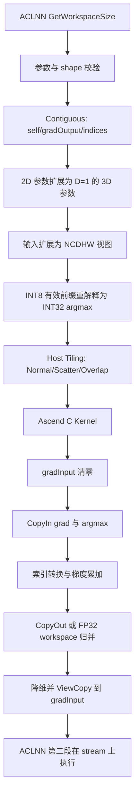

# 需求背景（required）

| 项目 | 内容 |
| --- | --- |
| 任务编号 | `09-47-MaxPool2dWithMaskBackward` |
| 任务名称 | MaxPool2dWithMaskBackward 算子开发 |
| TeamName | ATEAM |
| 文档状态 | 设计文档提交 |
| 目标代码仓 | `https://gitcode.com/cann/ops-nn.git` |
| 基线 commit | `fd2398b44` |
| 基线实现目录 | `pooling/max_pool3d_grad_with_argmax/` |
| 目标硬件 | Atlas 800T A2、Atlas 300V Pro |
| 对标接口 | `aclnnMaxPool2dWithMaskBackward` |

## 需求来源

本设计依据如下，发生冲突时按“任务书、任务原型与用例、公开接口、目标仓基线代码”的顺序处理，并在文中显式列出待确认项：

1. 任务书：`MaxPool2dWithMaskBackward_task_doc.md`；
2. 算子原型：`max_pool2d_with_mask_backward_prototype.json`；
3. 随任务提供的 140 个用例：`max_pool2d_with_mask_backward_cases.json`；
4. 随任务提供的 CPU 参考实现：`max_pool2d_with_mask_backward_golden.py`；
5. 公开接口文档：`ops-nn/pooling/max_pool3d_grad_with_argmax/docs/aclnnMaxPool2dWithMaskBackward.md`；
6. ACLNN 适配代码：`ops-nn/pooling/max_pool3d_grad_with_argmax/op_api/aclnn_max_pool2d_with_indices_backward.cpp`；
7. Ascend C Host/Kernel：`ops-nn/pooling/max_pool3d_grad_with_argmax/op_host/`、`op_kernel/`。

任务要求使用 Ascend C，在 Atlas 800T A2 和 Atlas 300V Pro 上实现正向 `aclnnMaxPool2dWithMask` 的反向传播，保持现有 ACLNN 两段式 ABI，不新增第二套用户接口。

## 背景介绍

### 算子功能

输入 `gradOutput` 表示后级传回的梯度，`self` 仅提供正向输入的 shape、dtype 和格式，`indices` 保存正向池化选中的位置。算子先将 `gradInput` 清零，再把每个输出位置的梯度回填到对应输入坐标；多个输出窗口命中同一输入坐标时需要累加：

$$
\operatorname{gradInput}[n,c,i]
=
\sum_{\{(oh,ow)\mid \operatorname{index}[n,c,oh,ow]=i\}}
\operatorname{gradOutput}[n,c,oh,ow]
$$

其中 $i=ih\times W+iw$ 是当前通道内的绝对线性索引。没有被任何索引命中的输入位置保持为 0。

### 当前基线

目标仓已经保留 `aclnnMaxPool2dWithMaskBackward` ABI。Atlas A2 且 `kernelSize != 1×1` 时，当前 API 层执行以下流程：

1. 校验指针、dtype、format、rank、属性和 shape；
2. 将 `self`、`gradOutput` 连续化；
3. 将 2D 参数扩展为 `D=1` 的 3D 参数；
4. 将输入视图扩展为 NCDHW；
5. 把 INT8 `indices` 的有效前缀按 INT32 argmax 重新解释为 `[N,C,1,Hout,Wout]`；
6. 调用 Ascend C 内部算子 `MaxPool3DGradWithArgmax`；
7. 将结果降维并通过 `ViewCopy` 写入 `gradInput`。

`MaxPool3DGradWithArgmax` 已有 Normal、Scatter、ScatterOverlap 和受限 CutK 路径，Host 根据 shape、窗口重叠、确定性开关和 UB 容量选择 Tiling，Kernel 完成输出清零、索引解码、梯度回填及重叠累加。

### 当前基线与本任务差距

| 项目 | 当前基线 | 本任务目标 |
| --- | --- | --- |
| A2 非 `1×1` | 已通过 3D Ascend C 路径实现 | 复用并补齐任务测试 |
| Atlas 300V Pro | ACLNN 文档和内部算子均未登记支持 | 新增功能、精度和模型验证 |
| `indices` 非连续 | mask 分支当前未调用 `Contiguous` | 任务书要求支持 |
| `indices` 语义 | 公开文档称 one-hot mask；A2 非 `1×1` 路径按 INT32 前缀解释 | 按任务 golden 的 INT32 argmax 前缀验收 |
| `1×1` | 当前走历史 V1 mask 路径 | 任务附件 golden 明确限制 `K>=2`，正式范围待确认 |
| padding 上限 | API 代码校验 `padding <= kernelSize/2` | 任务书文字写 `padding <= kernelSize`，需确认 |
| 实测结果 | 本设计阶段未执行 | 按精度、性能和模型标准验收 |

# 需求分析（required）

## 需求描述

在不改变 `aclnnMaxPool2dWithMaskBackward` 两段式 ABI 的前提下，基于目标仓现有 Ascend C 反向池化实现完成增量适配。输入为 4D NCHW 的 `gradOutput`、`self` 和 INT8 `indices`，输出 `gradInput` 与 `self` shape、dtype、格式一致。支持 FLOAT16、FLOAT32，Atlas 800T A2 额外支持 BFLOAT16；支持长度为 1/2 的 `kernelSize`、`padding`、`dilation`，长度为 0/1/2 的 `stride`，`dilation` 值仅为 1，并覆盖 `ceilMode` 两种取值和非连续 Tensor。

本提交范围不新增 Python/ATen 接口，不改变正向算子，不支持 NaN、`-Inf`，不把 Atlas A3、Ascend 950 或其他产品作为本任务验收硬件。

## 接口与数据契约

### ACLNN 两段式接口

```cpp
aclnnStatus aclnnMaxPool2dWithMaskBackwardGetWorkspaceSize(
    const aclTensor* gradOutput,
    const aclTensor* self,
    const aclTensor* indices,
    const aclIntArray* kernelSize,
    const aclIntArray* stride,
    const aclIntArray* padding,
    const aclIntArray* dilation,
    bool ceilMode,
    aclTensor* gradInput,
    uint64_t* workspaceSize,
    aclOpExecutor** executor);

aclnnStatus aclnnMaxPool2dWithMaskBackward(
    void* workspace,
    uint64_t workspaceSize,
    aclOpExecutor* executor,
    aclrtStream stream);
```

### 输入输出

| 名称 | 类型 | dtype | format/rank | 约束 |
| --- | --- | --- | --- | --- |
| `gradOutput` | 输入 Tensor | FLOAT16/FLOAT32/BFLOAT16 | NCHW/4D | shape 为 `[N,C,Hout,Wout]` |
| `self` | 输入 Tensor | 同 `gradOutput` | NCHW/4D | shape 为 `[N,C,H,W]` |
| `indices` | 输入 Tensor | INT8 | NCHW/4D | shape 为 `[N,C,kH*kW,maskW]` |
| `kernelSize` | 输入数组 | INT64 | 长度 1/2 | 元素大于 0 |
| `stride` | 输入数组 | INT64 | 长度 0/1/2 | 空数组时取 `kernelSize`，非空元素大于 0 |
| `padding` | 输入数组 | INT64 | 长度 1/2 | 非负；最终上限待任务方确认 |
| `dilation` | 输入数组 | INT64 | 长度 1/2 | 元素仅支持 1 |
| `ceilMode` | 输入标量 | BOOL | - | 支持 false/true |
| `gradInput` | 输出 Tensor | 同 `self` | NCHW/4D | shape 与 `self` 一致 |

BFLOAT16 仅在 Atlas 800T A2 支持。原型 JSON 使用内部名称 `MaxPool2dWithMaskBackward`，ACLNN ABI 继续使用上述公开符号。

### shape 与 indices 存储

属性长度为 1 时复制到 H/W；`stride=[]` 时使用对应 `kernelSize`。令有效窗口为：

$$
k_{eff}=dilation\times(kernelSize-1)+1
$$

输出空间维按下式计算：

$$
out=\left\lfloor
\frac{in+2\times padding-k_{eff}+(ceilMode?stride-1:0)}
{stride}
\right\rfloor+1
$$

当 `ceilMode=true` 且 `(out-1)*stride >= in+padding` 时再减 1。

$$
maskW=\left(\left\lceil\frac{Hout\times Wout}{16}\right\rceil+1\right)\times2\times16
$$

任务 golden 将 `indices` 定义为 INT8 容器：容器起始的
`N*C*Hout*Wout*sizeof(int32_t)` 字节按小端 INT32 解码，顺序为 NCHW，每个索引值以本通道 `[H,W]` 平面为原点；剩余字节不参与反向计算。

## 需求拆解

1. 保持 ACLNN 两段式函数名、参数顺序、返回码和异步 stream 语义不变；
2. 对齐三类浮点 dtype、NCHW 4D、属性长度和值域及输出 shape；
3. 第一段接口完成空指针、dtype、format、rank、shape 和属性校验；
4. A2 复用现有 2D 扩 3D 的 Ascend C 路径，Atlas 300V Pro 增量完成构建、注册和 Kernel 适配；
5. Host 根据是否存在窗口重叠、确定性开关、shape、核数和 UB 容量完成分核与 Tiling；
6. Kernel 清零输出，解码索引并回填梯度；重复索引必须累加；
7. 支持非连续输入输出；空 batch 走 quick return；
8. 覆盖任务 140 个用例，并补充属性长度、空 stride、非连续和负向测试；
9. A2 按 TBE 基线验证性能，Atlas 300V Pro 完成功能、精度、性能参考和 yolov11 模型验证；
10. 未完成的硬件适配和测试只能写为“待实现/待测”，不得写成已支持。

# 详细设计（required）

## 算子分析

### 梯度回填与重复索引

每个 `gradOutput[n,c,oh,ow]` 对应一个 INT32 索引 `idx`：

```text
0 <= idx < H*W
ih = idx / W
iw = idx % W
gradInput[n,c,ih,iw] += gradOutput[n,c,oh,ow]
```

窗口无重叠时，不同输出窗口不会命中同一输入位置，可直接写回；当 `kH>sH` 或 `kW>sW` 时窗口可能重叠，多个输出可能命中同一位置，必须累加。即使窗口不重叠，Kernel 仍不得假设外部传入的非法重复索引；索引合法性由上游正向算子契约保证，本任务不在 Device 侧增加逐元素越界校验或修复。

### dtype 与累加

- FLOAT32 直接以 FLOAT32 累加；
- FLOAT16、BFLOAT16 在发生重叠时使用 FLOAT32 中间 workspace 累加，最后一次性转换为目标 dtype，避免反复低精度舍入；
- 非重叠路径可按原 dtype 直接回填；
- `self` 的数值不参与公式，仅其 shape、dtype、format 用于校验和输出描述。

### 边界行为

- `N=0`：第一段接口返回成功，`workspaceSize=0`，第二段不启动有效计算；
- `C/H/W=0`：按现有 API 校验返回 `ACLNN_ERR_PARAM_INVALID`；
- 未命中的 `gradInput` 元素为 0；
- 重复索引对应梯度求和；
- NaN、`-Inf` 不在任务支持范围；
- INT8 容器尾部不参与计算；
- API 调用异步入 stream，调用方负责 stream、workspace 和 Tensor 生命周期。

## 算子实现

### 总体架构



不新增 TBE、Python 或 ATen 层。内部继续复用 `MaxPool3DGradWithArgmax` 时，2D 的 D 维固定为 1。

### ACLNN Host 设计

第一段接口按以下顺序执行：

1. 创建 `aclOpExecutor`；
2. 检查所有 Tensor、数组、`workspaceSize` 和 `executor` 指针；
3. 根据当前平台检查 dtype：A2 支持 FLOAT16/FLOAT32/BFLOAT16，Atlas 300V Pro 计划支持 FLOAT16/FLOAT32；
4. 检查 `self`、`gradOutput`、`gradInput` dtype 一致，`indices` 为 INT8；
5. 检查公开格式和 rank 为 NCHW/4D，拒绝私有格式；
6. 解析属性，校验长度和值域；
7. 推导 `Hout/Wout`，校验 `gradOutput`、`indices`、`gradInput` shape；
8. 以 64 位整数校验 indices 有效前缀容量，防止 shape 乘法和字节数溢出；
9. 空 batch quick return；
10. 对 `self`、`gradOutput`、`indices` 调用 `Contiguous`；
11. 构造 `{1,kH,kW}`、`{1,sH,sW}`、`{0,pH,pW}`、`{1,1,1}`；
12. 将输入扩为 NCDHW，把 indices 有效前缀重新解释为 INT32；
13. 调用内部 Ascend C 算子，结果降维后 `ViewCopy` 到用户输出；
14. 从 executor 取得 workspace 大小并返回。

第二段接口通过 `CommonOpExecutorRun` 将 executor 中的计算异步下发到用户 stream。

错误行为沿用目标仓：

| 场景 | 返回码 |
| --- | --- |
| 必选指针为空 | `ACLNN_ERR_PARAM_NULLPTR` |
| dtype/format/rank/shape/属性不合法 | `ACLNN_ERR_PARAM_INVALID` |
| executor 或内部 Tensor 创建失败 | 对应 `ACLNN_ERR_INNER_*` |

### Tiling 设计

沿用目标仓模板化 Tiling 框架，运行时获取 Vector Core 数量和 UB 大小，不硬编码具体 SKU 参数。

Host 统一记录：

- 输入：`ncDim, di=1, hi, wi`；
- 输出：`do=1, ho, wo`；
- 属性：`kd=1, kh, kw, sd=1, sh, sw, padD=0, padH, padW`；
- 分块：`baseNc/baseDo/baseHo/baseWo` 及各维 tail/count；
- 平台：`totalCoreNum/maxUbSize`；
- Scatter：`ncRound/ncRoundTail/totalRound/preCoreNum`；
- workspace：是否需要 FP32 中间区及其大小。

窗口重叠条件为：

```text
isOverlap = (kH > sH) || (kW > sW)
```

Tiling 模板与现有优先级保持一致：

1. **Scatter**：优先用于可高效按索引散射的场景；
2. **Normal**：支持通用 shape，根据 UB 依次尝试不切、切输出 H、切输出 H/W；
3. **CutK**：仅保留目标仓已有白名单，不为本任务虚构新的命中条件；
4. Atlas 300V Pro 若不能直接复用上述 Kernel，新增 arch20 实现时保持相同 TilingData 语义，具体 API 差异待编码验证。

现有 A2 TilingKey 的主要含义为：

| TilingKey | 路径 |
| ---: | --- |
| `0` | Normal，非重叠 |
| `100` | Normal，重叠 |
| `2` | Scatter，非重叠 |
| `102` | ScatterOverlap |
| `1/21/31/41/51/61/71` | CutK 的不同 UB 切轴 |
| `101/121/131/141/151/161/171` | CutNC 的重叠变体 |

是否能在 Atlas 300V Pro 原样使用这些 Key，待该硬件实现完成后确认；不得仅注册 SOC 而未验证 Kernel API 和二进制构建。

### 确定性策略

默认按任务书保持非确定性。Host 读取 `context->GetDeterministic()`：

- 非重叠场景可沿 NC 和空间维分核；
- 重叠且未开启确定性时，可使用高并行 ScatterOverlap 路径；
- 重叠且开启确定性时，限制会造成同一输出地址竞争的空间分核，确保同一 NC 平面的累加顺序固定；
- FLOAT16/BFLOAT16 重叠场景通过 FLOAT32 workspace 聚合后再转换。

确定性开关的行为需分别在两种目标硬件上验证，不能只以重复运行一次作为证明。

### Kernel 设计

#### Init

1. 解析 TilingData 和当前 block 的任务范围；
2. 绑定 `self/grad/argmax/output/workspace` GlobalTensor；
3. 初始化 `TPipe`、输入输出队列和计算 Buffer；
4. 对需要 workspace 的低精度重叠场景绑定 FP32 中间区。

#### Process

1. **初始化**：按分核区间将 `gradInput` 或 FP32 workspace 清零；
2. **CopyIn**：批量搬入连续的 `gradOutput` 与 INT32 argmax，尾块使用带 padding 的搬运；
3. **Compute**：
   - 将 NCHW/NCDHW 数据转换为 Kernel 使用的 NC 向量化布局；
   - 将索引转换为目标输入平面偏移；
   - 非重叠路径直接形成输出块；
   - 重叠路径对相同地址执行累加；低精度先累加到 FP32 workspace；
4. **CopyOut**：写回当前输出块；workspace 路径完成 FP32 到目标 dtype 的最终转换；
5. 通过队列事件完成 MTE2、Vector、MTE3 同步；只有实际初始化双 Buffer 的队列才描述为流水。

Kernel 不读取 `self` 数值做比较，不重新计算正向最大值，不检查 indices 是否真的是窗口内 argmax。

### workspace

workspace 由 executor 中的连续化、视图转换和内部 Kernel 共同决定。内部反向 Kernel 在“重叠且输出 dtype 非 FLOAT32”时申请：

$$
workspaceBytes=N\times C\times H\times W\times sizeof(float)
$$

另加平台库系统 workspace。非重叠或 FLOAT32 路径的内部用户 workspace 可为 0，但 ACLNN 返回的总 workspace 仍以 executor 实际结果为准。

### 目录与构建

本设计采用增量修改，不新建第二个公开 ACLNN 目录。计划涉及：

```text
pooling/max_pool3d_grad_with_argmax/
├── CMakeLists.txt
├── op_api/
│   ├── aclnn_max_pool2d_with_indices_backward.h
│   └── aclnn_max_pool2d_with_indices_backward.cpp
├── op_host/
│   ├── max_pool3d_grad_with_argmax_def.cpp
│   ├── max_pool3d_grad_with_argmax_tiling*.cpp
│   └── config/
├── op_kernel/
│   ├── max_pool3d_grad_with_argmax.cpp
│   └── arch20/                         # 仅在 310P 需要独立实现时新增
└── tests/
    ├── ut/
    └── st/aclnnMaxPool2dWithMaskBackward/
```

正式实现应通过 SOC/arch 配置选择源文件；公共 A2 文件不复制到新目录。Atlas 300V Pro 的准确 CMake SOC 名、Kernel 类型和二进制配置需依据实现环境验证后填写，本设计阶段不编造配置值。

## 支持硬件

| 硬件 | FLOAT16 | FLOAT32 | BFLOAT16 | 当前状态 |
| --- | :---: | :---: | :---: | --- |
| Atlas 800T A2 | √ | √ | √ | 基线已有非 `1×1` Ascend C 路径，待任务用例验证 |
| Atlas 300V Pro | √ | √ | × | 待实现、待验证 |

## 算子约束限制

1. 本任务仅支持 4D NCHW；
2. `gradOutput`、`self`、`gradInput` dtype 必须相同；
3. `indices` 必须为 INT8 容器，有效前缀按小端 INT32 解码；
4. `kernelSize` 长度 1/2，`stride` 长度 0/1/2，`padding/dilation` 长度 1/2；
5. `kernelSize/stride` 元素大于 0，`dilation` 仅为 1；
6. padding 最终上限待确认；实现前暂沿用公开 API 的 `padding<=kernelSize/2`；
7. 输入不支持 NaN、`-Inf`；
8. 只接受由匹配的正向算子生成且索引范围合法的 indices；Device Kernel 不提供越界修复；
9. 非连续 Tensor 在 ACLNN 层转为连续 Tensor，Kernel 只处理连续内存；
10. `N=0` 可 quick return，`C/H/W=0` 不支持；
11. 默认非确定性，确定性模式需显式开启；
12. 任务 golden 当前限制 `kH*kW>=2`；`1×1` 的 indices 语义和容量在确认前不作为已支持能力；
13. workspace、executor、输入输出 Tensor 和 stream 的生命周期由调用方按 ACLNN 两段式接口约定管理。

# 可维可测分析

## 精度标准/性能标准

| 验收标准 | 描述 | 标准来源 |
| --- | --- | --- |
| 精度 | 满足生态算子开源精度标准 | 任务书、opbase 实验标准 |
| A2 性能 | 整体性能不低于原 TBE 的 95% | 任务书 |
| A2 小 shape | 100 μs 以下场景若相对 TBE 劣化超过 30%，需提供仿真图与分析 | 任务书 |
| 300V Pro 性能 | 参考 A2(910B3) 耗时的 5 倍；超过基准 30% 时提供仿真图 | 任务书 |
| 模型精度 | yolov11/DOTAv1 相对 A2 的 mAP50 误差不超过 0.01 | 任务书 |

本设计阶段没有可复查的 NPU 测试报告，不填写耗时、倍率、精度误差或“已通过”结论。

## 测试设计

### 随任务用例

静态统计得到 140 个用例，全部为 4D NCHW：

| 覆盖项 | 数量/范围 |
| --- | --- |
| FLOAT32 | 59 |
| FLOAT16 | 44 |
| BFLOAT16 | 37 |
| `ceilMode=false/true` | 69/71 |
| kernel 面积 | 4～25 |
| 属性长度 | 现有用例均为 2 |
| shape 规模 | small、medium、large |

这些用例的输入由 `--prepare-data` 根据匹配的正向参考逻辑重新生成，避免使用无效历史 indices；反向 golden 使用 FLOAT32 累加并最终转换为输出 dtype。

### 必须补充的功能与边界用例

1. 四个列表属性长度为 1；
2. `stride=[]`；
3. 非方形 kernel/stride/padding；
4. `Hout=1`、`Wout=1`、非 32B 对齐尾块；
5. `N=0` quick return；
6. 非连续 `gradOutput/self/indices/gradInput`；
7. 无重叠、H 重叠、W 重叠、H/W 同时重叠；
8. 多个输出指向同一索引，校验累加；
9. 全零、正负梯度、累加后溢出边界；
10. 开启和关闭确定性后分别重复执行；
11. 两种硬件、各自支持的所有 dtype；
12. `1×1` 在任务方确认契约后补充。

### 负向用例

- 空指针；
- 不支持的 dtype、私有格式、非 4D rank；
- 输入输出 dtype 或 shape 不一致；
- indices 非 INT8、shape 不符或有效前缀容量不足；
- 属性长度非法；
- kernel/stride 非正；
- padding 为负或超过确认后的上限；
- dilation 不为 1；
- 推导出的 `Hout/Wout<=0`；
- shape 乘法或 workspace 字节数溢出。

### 精度方法

1. 使用任务 golden 生成合法 `self/indices`；
2. 将有效 indices 前缀解码为 INT32，CPU 端按 N、C、Hout、Wout 顺序执行 `np.add.at`；
3. FLOAT32 按生态标准比对；FLOAT16/BFLOAT16 按相应阈值比对；
4. 对重复索引和大累加量单独统计最大绝对误差、最大相对误差；
5. 对确定性模式逐字节比较多次输出；
6. 保存命令、软件版本、输入参数和原始日志到自测报告。

### 性能方法

1. A2 上以相同输入、相同 stream、相同预热和统计次数对比 Ascend C 与原 TBE；
2. 同时记录 ACLNN 整体耗时和 Kernel 耗时，避免把数据准备计入某一侧；
3. 分别覆盖小 shape、典型模型 shape、大空间 shape和高重叠 shape；
4. 记录 P50/P90 或任务统一口径，禁止只报告最佳单次；
5. Atlas 300V Pro 使用任务规定的 A2 五倍参考口径；
6. 未达门限时从分核利用率、UB 占用、GM 搬运、workspace 清零、尾块和重叠累加分析，并附仿真图。

### 模型验证

在 Atlas 300V Pro 上按任务书使用 yolov11 和 DOTAv1，固定模型版本、预处理、后处理和评测脚本；与 Atlas 800T A2 同口径计算 mAP50，目标误差不超过 0.01。模型接入代码贡献到任务指定的 modelzoo-GPL 路径。本项待实现和待测。

## 兼容性分析

- **新增能力**：为 Atlas 300V Pro 增加支持，A2 外部 ABI 不变；
- **增量架构**：继续复用现有 pooling 公共 Host/Kernel，不引入平行的 ACLNN 符号；
- **dtype/shape 扩展**：不扩展任务书外 dtype；本任务只承诺 4D NCHW；
- **非连续 Tensor**：补齐 indices 连续化后对用户保持支持；
- **并行贡献**：修改集中在本算子目录和对应测试，公共模块变更需运行 pooling 回归；
- **历史语义**：INT8 one-hot mask 与 INT32 argmax 前缀存在公开描述差异，合入前必须由维护者确认，不能静默改变已有 `1×1` 行为。

## 风险与对策

| 风险 | 影响 | 对策 |
| --- | --- | --- |
| 300V Pro 当前未注册内部算子 | 无法下发 Kernel | 完成 arch20 构建与注册后，在真机验证二进制加载；未完成前不宣称支持 |
| INT8 mask 描述与 INT32 前缀冲突 | 与正向输出不兼容 | 以任务 golden 和配套正向实现联调，并请维护者确认正式契约 |
| `1×1` 容器容量不足 | 可能越界读取 | 先做容量校验；任务范围未确认前保持不支持 |
| padding 上限描述冲突 | 合法性判断不一致 | 合入前由任务方确认，代码、文档和负向用例统一 |
| 重叠窗口存在写冲突 | 结果不确定或丢失累加 | 使用现有 overlap/workspace 策略；确定性模式限制冲突分核 |
| 低精度重复累加误差 | 超出精度标准 | FP32 workspace 聚合后一次转换，并覆盖高重叠压力用例 |
| 非连续 indices 当前未处理 | 解码错误 | ACLNN 层对 indices 执行 `Contiguous` 并新增专项测试 |
| 小 shape 调度开销高 | A2 性能不达标 | 复用现有轻量 Scatter/Normal 路径，以实测决定优化，不预填收益 |

## 待确认、待实现和待测

### 待确认

1. `indices` 最终采用 INT32 argmax 前缀还是历史 one-hot mask；
2. `1×1` 是否属于验收范围；
3. padding 上限采用 `kernelSize` 还是 `kernelSize/2`；
4. Atlas 300V Pro 的正式 SOC 构建标识与允许复用的公共 Kernel 范围。

### 待实现

1. Atlas 300V Pro Host 注册、构建和 Kernel 适配；
2. mask 接口的非连续 indices 处理；
3. 契约确认后的 `1×1` 和 padding 行为；
4. 补充 UT/ST、README 和复现脚本。

### 待测

1. 140 个随任务用例在目标硬件上的精度结果；
2. 负向、边界、非连续和确定性用例；
3. A2 对 TBE 的性能结果；
4. Atlas 300V Pro 性能参考结果；
5. yolov11/DOTAv1 模型精度。
