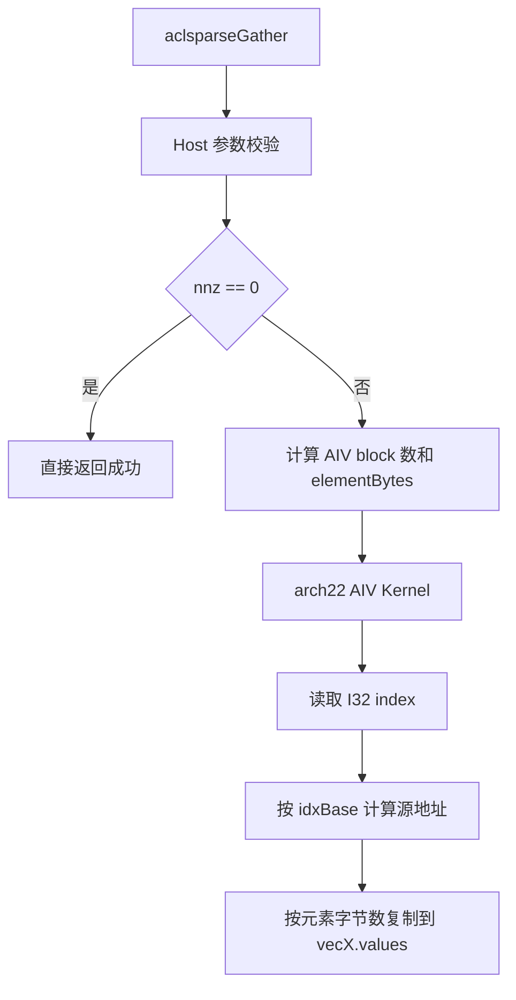

# aclsparseGather 算子设计方案

## 需求背景（required）

`aclsparseGather` 对标 cuSPARSE `cusparseGather`，从稠密向量 `vecY` 按稀疏索引读取元素，原地写入 `vecX.values`：

```text
vecX.values[i] = vecY[vecX.indices[i] - idxBase], 0 <= i < nnz
```

2026 年 9 月 A2/A3 社区任务要求在 DAV_2201（Atlas A2 训练系列和 Atlas A3）上补齐核心计算，并打通 `torch.index_select(input, 0, index)` 的 ATen NPU 适配。仓库已有 arch35 参考实现和公共 SpVec/DnVec 描述符，本设计在保持公开 C API 不变的前提下新增 arch22 路径。

## 需求分析（required）

### 算子原型

```c
aclsparseStatus_t aclsparseGather(
    aclsparseHandle_t handle,
    aclsparseConstDnVecDescr_t vecY,
    aclsparseSpVecDescr_t vecX);
```

| 参数 | 方向 | 约束 |
| --- | --- | --- |
| `handle` | 输入 | 已创建的句柄；Kernel 使用其 stream 异步下发。 |
| `vecY` | 输入 | 一维稠密向量，`size >= 0`，values 位于 Device。 |
| `vecX` | 输入/输出 | 一维稀疏向量；只写 values，indices 和 size 不变。 |

arch22 支持 `FLOAT16`、`BFLOAT16`、`FLOAT32`、`COMPLEX64`，索引类型为 `ACL_SPARSE_INDEX_32I`，index base 支持 ZERO/ONE。`vecX.valueType` 必须与 `vecY.valueType` 一致，`vecX.size <= vecY.nums`，`nnz <= size`，且 `size`、`nnz`、`vecY.nums` 不超过 `INT32_MAX`。`nnz=0` 成功返回且不启动 Kernel；`vecY.size=0` 仅允许 `nnz=0`。索引越界属于调用方输入前置条件，设备端不做同步 D2H 检查。

### Python/ATen 适配

可选适配目标为 PyTorch 2.7+ / torch_npu 26.0+ 的 `aten::index_select` Dispatcher。仅接受 NPU、连续一维 input、连续一维 I32 index 和 `dim=0`；不支持组合显式报错，不调用 CPU fallback。适配层创建输出 Tensor 和临时 Host 描述符，调用 `aclsparseGather`，并从 torch_npu 当前 stream 下发，保证异步语义和 input/index 只读属性。

## 详细设计（required）

### Host 侧

1. 校验 handle、描述符签名、dtype 一致性、I32 index、base、size/nnz 上限和非空 Device 指针。
2. 通过 `PlatformAscendCManager::GetCoreNumAiv()` 取得 AIV 核数，设置 `numBlocks=min(nnz, coreCount)`。
3. 根据 value dtype 设置单元素字节数：FP16/BF16 为 2，FP32 为 4，COMPLEX64 为 8；不申请 workspace、不执行 Host 同步。
4. 将 Device 指针、tiling 和调用方 stream 传给 arch22 Kernel。

### Kernel 侧

Kernel 采用 AIV-only 的轻量 SIMT/标量 GM 访问，每个 block 处理 `blockIdx, blockIdx + numBlocks, ...` 的输出位置：

```text
source = indices[i] - idxBase
for byte in [0, elementBytes):
    values[i * elementBytes + byte] = y[source * elementBytes + byte]
```

按字节复制避免引入 FP16/BF16/complex 主机类型，保证所有声明 dtype 的 bit-wise exact match；不使用原子操作，因此重复索引和乱序索引不会产生写冲突（每个 `values[i]` 仅由对应线程写入）。Kernel 只读取 `vecY.values` 和 `vecX.indices`，不修改输入向量或 indices。

### 数据流



### ATen 注册

`torch/aten/gather_aten.cpp` 以 `TORCH_LIBRARY_IMPL(aten, PrivateUse1, ...)` 注册 `index_select.Tensor`，适配层只处理 `dim=0` 的一维向量；values dtype 映射到 ACL_FLOAT16/ACL_BF16/ACL_FLOAT/ACL_COMPLEX64，index 必须为 int32。输出由 `input.new_empty` 创建，描述符采用 RAII 销毁，调用当前 torch_npu stream，整个路径没有 `to(cpu)`、D2H 或额外线性 Device workspace。

## 支持硬件和软件

| 项目 | 支持 |
| --- | --- |
| Atlas A2 训练系列（910B3/910B4） | 是 |
| Atlas A3 系列（任务环境具体型号） | 是 |
| DAV_2201 / CANN 9.1.0+ | 是 |
| PyTorch 2.7+ / torch_npu 26.0+ | 可选 ATen 适配 |

## 可维可测分析

### 精度

CPU Golden 逐元素比较，FP16/BF16 使用 FP32 参考、FP32 使用 FP64 参考、COMPLEX64 使用 COMPLEX128 参考；输出要求 bit-wise exact match，并检查 vecY、indices 和非目标 values 未被修改。覆盖 base 0/1、nnz=0/1、乱序/重复、首尾索引、尾块、零值、负值、离群值和允许的 INF/NAN。

### 性能与内存

性能按任务书 P-01/P-02/P-03 进行，预热至少 10 次、采样 30 次并报告 median/p90；目标为每个有效 case 达到 GPU 标杆的 0.25 倍。接口不涉及 workspace，除输出 `vecX.values` 外不分配与输入规模线性相关的 Device 内存，满足 L2 workspace 限制。

### 测试覆盖

- C++ arch22 UT：FP32、base 0/1、重复/乱序索引和 nnz=0。
- C++ arch35 回归：保留原有 FP32/FP16/BF16/DOUBLE 及 I32/I64 用例。
- ATen/Python：入口、Dispatcher、dtype/shape/stride/device 校验、输出构造、异步 stream 和 CPU fallback 反例。
- 异常：空 handle/描述符、dtype 不一致、I64 index、空指针、size/nnz 超限和非法 base。

## 兼容性分析

公开 `aclsparseGather` 签名、公共描述符布局和 arch35 源文件不变。CMake 根据 SOC 选择 arch22 或 arch35，同一时刻只链接一个 `aclsparseGather` 实现，不产生符号冲突。arch22 的限制在 Host 显式返回错误，其他算子和已有调用不受影响。

