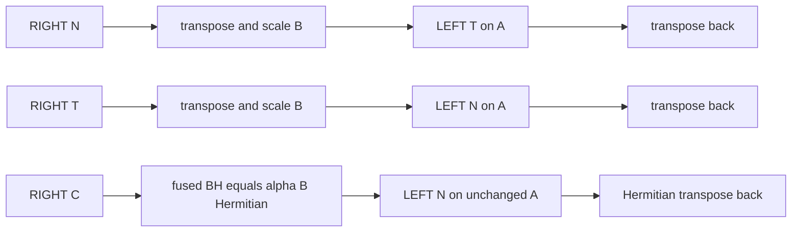
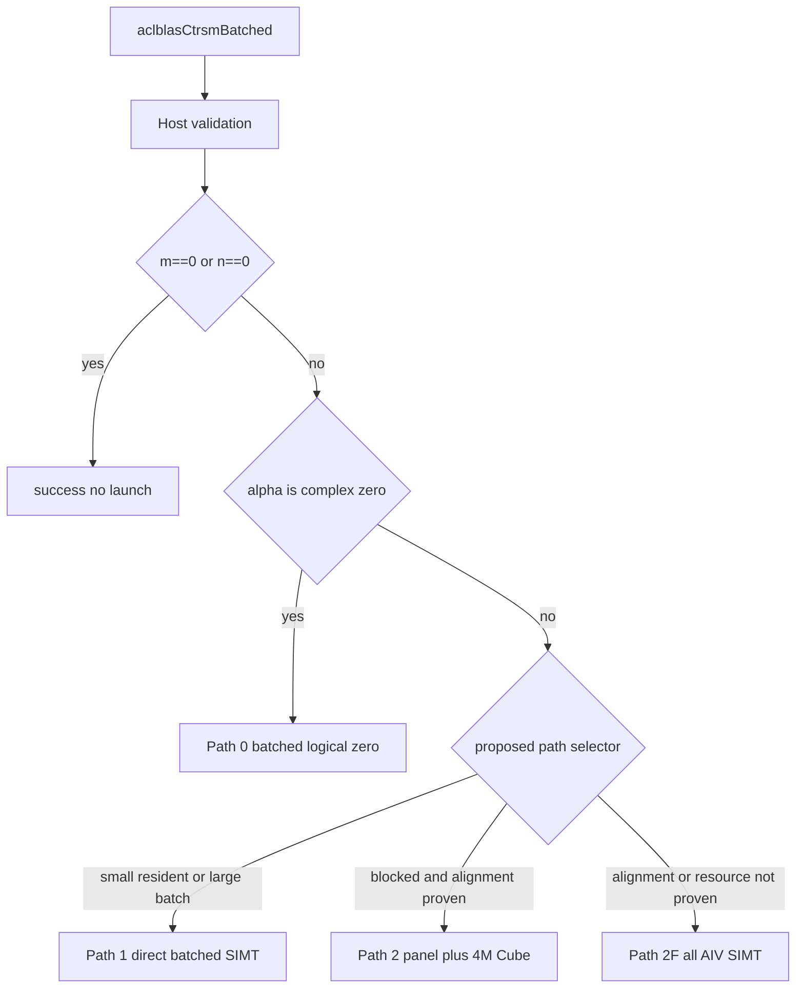
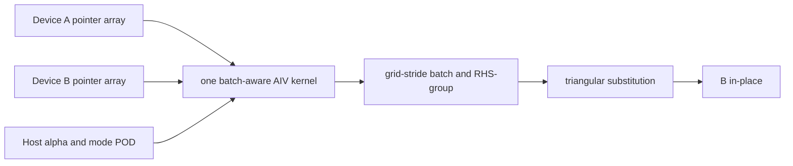
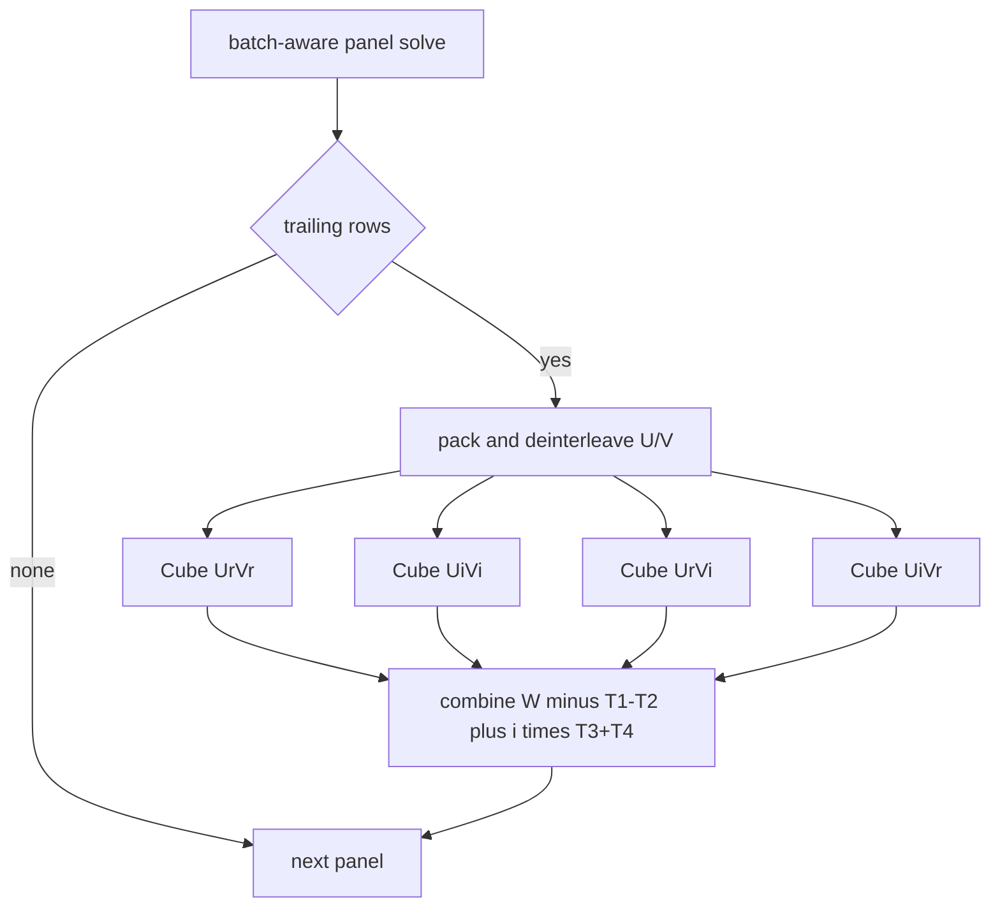

> **文档状态**：设计提案（待实现与验证）<br>
> **设计对象**：`aclblasCtrsmBatched`，Ascend 950PR，arch35 / DAV-3510，CANN 9.1.0，COMPLEX64<br>
> **ops-blas 依据**：`cann/ops-blas` `master@7eae2328a65753bf55cffc489253eb434ea3317e`<br>
> **官方模板**：`cann/cann-ops-competitions` `master@f4b451f985786e88e753e1b10c11d7c8c70b1c9b`，`04_tasks/01_community-task-2026/resources/design_template.md`<br>
> **边界**：本文不代表算子已实现、已在 950PR 验证、1200 用例已通过或性能已达标。

# 需求背景（required）

## 需求来源

本需求来自 `aclblasCtrsmBatched` 官方社区任务书，目标是在 `cann/ops-blas` 中为 Ascend 950PR 开发 COMPLEX64 批量三角矩阵求解接口 `aclblasCtrsmBatched`。接口必须进入公共头文件 `include/cann_ops_blas.h`，生产实现最终位于 `blas/trsmbatched/arch35/`，不得形成 950PR 私有平行 API。

设计模板从官方仓库当前版本直接获取，而非根据记忆重建：

| 源码与模板依据 | 固定值 |
|---|---|
| 模板仓库 | `https://gitcode.com/cann/cann-ops-competitions` |
| 模板 branch / HEAD | `master` / `f4b451f985786e88e753e1b10c11d7c8c70b1c9b` |
| 模板路径 | `04_tasks/01_community-task-2026/resources/design_template.md` |
| 模板 blob | `b2d9e2c47e2afe307a9f303735fb045011642b50` |
| ops-blas 仓库 | `https://gitcode.com/cann/ops-blas` |
| ops-blas branch / HEAD | `master` / `7eae2328a65753bf55cffc489253eb434ea3317e` |

## 背景介绍

对每个 batch `b`，算子求解：

```text
LEFT : op(A[b]) * X[b] = alpha * B[b]
RIGHT: X[b] * op(A[b]) = alpha * B[b]
```

其中 `B[b] <- X[b]` 原地写回，矩阵为 Column Major；`A[]`、`B[]` 是 Device memory 中的 pointer arrays，所有 batch 共享 `side/uplo/trans/diag/m/n/lda/ldb`。

当前 upstream 只有实数 `aclblasStrsmBatched`。其 arch35 路径包括 full-panel SIMT 与 SIMT panel + real Tensor API/Cube trailing update；它会先把 Device pointer arrays 的指针值 D2H，再由 Host 逐 batch 发射 kernels。upstream 已有 Cgeam、CgemmBatched、Cherk、GemmStridedBatchedEx 等 arch35 复数先例，但没有公共 device complex 算术库、没有 arch35 device complex division，也没有 `aclblasCtrsmBatched`。

### 信息分层与冲突处理

本文使用三种明确标签：

- **Task requirement**：官方任务书明确要求；
- **Upstream observation**：固定 SHA 中可直接验证的源码事实；
- **Proposed design**：本任务提出、尚待实现与 950PR 验证的方案。

| 主题 | Task requirement | Upstream observation | Proposed design |
|---|---|---|---|
| batch pointer | A/B 为 Device pointer arrays，含 small-shape/huge-batch 性能场景 | Strsm D2H pointer values 后 Host per-batch；CgemmBatched 可由 kernel 直接读 GM pointer arrays | Path 0/1/2 主路径都直接读 Device arrays；Host per-batch 仅作开发期参考路径 |
| RIGHT + OP_C | 必须正确求 `X*A^H=alpha*B` | real Strsm 将 T/C 合流，不能用于 complex | large path 采用 Hermitian reduction；small path 原生 RIGHT solve |
| complex divide | NON_UNIT 对角非零但不做 singularity detection | 只有 Host/test naive divide；无 arch35 device divide | 使用 Smith-style division，UNIT 完全绕过 |
| 8 对齐 | NoTrans blocked 的 lda/ldb/tail bs 非 8 对齐应 fallback SIMT | 固定 SHA 的 Strsm selector 没有此条件 | 未经实机证明时显式走 all-AIV/SIMT safe fallback |
| zero dimensions | `m==0 || n==0` 为 SUCCESS no-op | Strsm 先校验 lda/ldb；官方 CSV 的部分 zero-work case 使用 ld=0 且期待 SUCCESS | zero-work 暂定跳过 ld 下界，其余基础参数仍校验；待维护者确认 |
| UNIT diagonal | 对角逻辑为 1，存储值不可读取 | Strsm template 可绕过除法，但现有测试不足以证明地址级 no-read | compile-time UNIT specialization，在形成 diagonal address 前注入 `(1,0)` |
| CATLASS | 任务描述 Ascend C / CATLASS | ops-blas 的 Strsm 使用直接 Tensor API/Cube；固定 CATLASS submodule 无 complex/TRSM | baseline 使用有源码证据的 Ascend C + real Cube 4M；CATLASS 可作为可选 substrate |
| precision | task 指定 rtol/atol/matched ratio/max error | CSV/README 另有 MERE/MARE；Strsm 未使用 CSV MERE/MARE | task 标准为 primary，MERE/MARE 同时报告；冲突需验收方确认 |
| performance | warmup 后有效采样 >50，输出 Avg us | 随包脚本解析一次 GTest 整体整数 ms，且可能漏报失败 | 新增 ACL event benchmark，warmup 20、repeat 100、完整性强校验 |
| test path | `test/trsmbatched/ctrsm_batched/arch35/` | current discovery 按 `ctrsmbatched` literal child 搜索 | 保留官方下划线路径，在 CMake 显式映射到 conventional target/binary dir |
| memory capacity | 必须针对 CANN 9.1 / DAV-3510 设计 | `HardwareInfo` 写 L1=32 KiB，而 Strsm kernel 局部常量写 512 KiB | 不复制任一常量作为事实；由 exact compiler resource report/950PR 冻结 tiling |

# 需求分析（required）

## 需求描述

公共接口设计保持任务书签名：

```cpp
aclblasStatus_t aclblasCtrsmBatched(
    aclblasHandle_t handle,
    aclblasSideMode_t side,
    aclblasFillMode_t uplo,
    aclblasOperation_t trans,
    aclblasDiagType_t diag,
    int m,
    int n,
    const aclblasComplex* alpha,
    const aclblasComplex* const A[],
    int lda,
    aclblasComplex* const B[],
    int ldb,
    int batchCount);
```

功能要求：

- `op=N/T/C` 分别表示 `A/A^T/A^H`，T 与 C 对 COMPLEX64 必须独立；
- `uplo` 只描述 A 的物理存储三角，另一三角不访问；
- `diag=UNIT` 时逻辑对角恒为 `(1,0)`，不得读取存储对角；
- `diag=NON_UNIT` 时调用方保证对角非零，算子不检测 singularity/near-singularity；
- `m==0 || n==0` 是无计算 no-op；
- `alpha==(0,0)` 时不引用 A，只把 B 的 logical region 置为复数零；
- B batches 不得重叠；
- handle 绑定的 stream 用于所有异步 kernels；调用者读回结果前负责同步。

`aclblasComplex` 沿用 `include/cann_ops_blas_common.h`：

```cpp
typedef struct aclblasComplex {
    float real;
    float imag;
} aclblasComplex;
```

upstream static assertion 约束 `sizeof(aclblasComplex)==2*sizeof(float)`，即 8-byte interleaved real/imag。类型没有显式 `alignas`；不得把 Host 工具链观测到的 4-byte alignment 当作 DAV-3510 ABI 承诺。

## 需求拆解

| ID | 子需求 | 验收性输出 |
|---|---|---|
| R-API | 公共签名、status、stream、Column Major、in-place | header/API tests |
| R-VAL | enum、m/n、batchCount、alpha/A/B、ld、quick return | negative/boundary tests |
| R-MODE | 24 种 side×uplo×trans×diag | 24-mode table + CSV coverage |
| R-RIGHT-C | RIGHT+OP_C 独立数学归约 | 两候选对比、选型与 targeted tests |
| R-P0 | alpha-zero batch-aware zero | no A access、logical-only zero |
| R-P1 | small shape / large batch direct kernel | one/few launches、direct pointers、fused alpha |
| R-P2 | large blocked panel + complex Cube update | batch chunks、panel dependency、4M update |
| R-P2F | non-aligned correctness fallback | all-AIV/SIMT，无 Cube 假设 |
| R-CPLX | complex add/sub/mul/conj/div | split FP32 + Smith divide |
| R-UNIT | UNIT diagonal no-read | compile-time branch + poison/guard tests |
| R-WS | path-specific workspace | layout、offset、checked formula、reuse |
| R-TEST | official 1200 + supplemental gaps | cblas golden、Gaussian、special-value tests |
| R-PERF | reproducible event timing | 20 warmups、100 repeats、Avg us、case completeness |
| R-BUILD | arch35/CANN 9.1/test-path integration | proposed changed-files/build mapping |
| R-RISK | 风险与待确认事项 | 分类问题清单与验证证据 |

# 详细设计（required）

## 算子分析

### 数学公式

定义：

```text
K = (side == LEFT) ? m : n          // triangular dimension
R = (side == LEFT) ? n : m          // number of independent RHS vectors
```

统一的系数读取语义：

```text
LoadOpA(i,j,N) = A[i + j*lda]
LoadOpA(i,j,T) = A[j + i*lda]
LoadOpA(i,j,C) = conj(A[j + i*lda])
```

`op=N` 时有效三角与 physical uplo 相同，`op=T/C` 时有效三角翻转。LEFT 对 effective lower 前向求解、effective upper 后向求解；原生 RIGHT 对 effective upper 前向、effective lower 后向。

对一个 LEFT RHS vector，当前行 `r` 的更新为：

```text
v = alpha*B[r] - sum(already_solved j) op(A)[r,j] * X[j]
X[r] = v                              (UNIT)
X[r] = ComplexDivSmith(v, op(A)[r,r]) (NON_UNIT)
```

RIGHT 原生 small path 对 B 的每一行独立处理，更新逻辑等价，只是读取 `op(A)[j,c]` 且 traversal 方向与 LEFT 相反。

#### 24 种组合

`diag` 不改变 traversal，只决定是否读取/除以 diagonal。下表显式覆盖全部 `2×2×3×2=24` 组合；“large 归约”描述 Path 2 的内部 LEFT equation，small Path 1 可以原生 RIGHT 计算。对 RIGHT 行，`effective triangle` 指 public equation 中 `op(A)` 的三角方向；最后一列描述归约为 LEFT 后的 coefficient，其三角方向可能相反，但 LEFT traversal 与表中方向一致。`uplo` 始终表示 A 的物理存储三角。

| # | side | uplo | trans | diag | effective triangle | traversal | large path coefficient / transform |
|---:|---|---|---|---|---|---|---|
| 1 | LEFT | UPPER | N | NON_UNIT | upper | backward | `A`，读 diagonal + Smith divide |
| 2 | LEFT | UPPER | N | UNIT | upper | backward | `A`，constant 1/no read |
| 3 | LEFT | UPPER | T | NON_UNIT | lower | forward | `A^T`，Smith divide |
| 4 | LEFT | UPPER | T | UNIT | lower | forward | `A^T`，constant 1/no read |
| 5 | LEFT | UPPER | C | NON_UNIT | lower | forward | `A^H`，load 后 conjugate，Smith divide |
| 6 | LEFT | UPPER | C | UNIT | lower | forward | `A^H`，no diagonal read/conj/divide |
| 7 | LEFT | LOWER | N | NON_UNIT | lower | forward | `A`，Smith divide |
| 8 | LEFT | LOWER | N | UNIT | lower | forward | `A`，constant 1/no read |
| 9 | LEFT | LOWER | T | NON_UNIT | upper | backward | `A^T`，Smith divide |
| 10 | LEFT | LOWER | T | UNIT | upper | backward | `A^T`，constant 1/no read |
| 11 | LEFT | LOWER | C | NON_UNIT | upper | backward | `A^H`，load 后 conjugate，Smith divide |
| 12 | LEFT | LOWER | C | UNIT | upper | backward | `A^H`，no diagonal read/conj/divide |
| 13 | RIGHT | UPPER | N | NON_UNIT | upper | forward | `A^T*X^T=alpha*B^T`，LEFT+T |
| 14 | RIGHT | UPPER | N | UNIT | upper | forward | LEFT+T，constant 1/no read |
| 15 | RIGHT | UPPER | T | NON_UNIT | lower | backward | `A*X^T=alpha*B^T`，LEFT+N |
| 16 | RIGHT | UPPER | T | UNIT | lower | backward | LEFT+N，constant 1/no read |
| 17 | RIGHT | UPPER | C | NON_UNIT | lower | backward | `A*X^H=conj(alpha)*B^H`，LEFT+N |
| 18 | RIGHT | UPPER | C | UNIT | lower | backward | H-reduction LEFT+N，constant 1/no read |
| 19 | RIGHT | LOWER | N | NON_UNIT | lower | backward | `A^T*X^T=alpha*B^T`，LEFT+T |
| 20 | RIGHT | LOWER | N | UNIT | lower | backward | LEFT+T，constant 1/no read |
| 21 | RIGHT | LOWER | T | NON_UNIT | upper | forward | `A*X^T=alpha*B^T`，LEFT+N |
| 22 | RIGHT | LOWER | T | UNIT | upper | forward | LEFT+N，constant 1/no read |
| 23 | RIGHT | LOWER | C | NON_UNIT | upper | forward | `A*X^H=conj(alpha)*B^H`，LEFT+N |
| 24 | RIGHT | LOWER | C | UNIT | upper | forward | H-reduction LEFT+N，constant 1/no read |

`uplo` 始终描述原 A 的物理三角，不在 Host 改写；变化的是 coefficient addressing、conjugation 和 traversal。

#### RIGHT + OP_C 候选方案与选择

候选 O，对等式取普通转置：

```text
(X*A^H)^T = (alpha*B)^T
conj(A) * X^T = alpha * B^T
```

它保持 alpha 不变，B 前后只普通转置，但需要新的 internal-only `CONJ_N` coefficient mode，且 panel load、pack 和每个 4M update 都要证明 A 只共轭一次。

候选 H，对等式取 Hermitian transpose：

```text
(X*A^H)^H = (alpha*B)^H
A * X^H = conj(alpha) * B^H
```

设 `Y=X^H`。forward transform 直接形成：

```text
BH[j,i] = conj(alpha * B[i,j])
        = conj(alpha) * conj(B[i,j])
```

forward transform kernel 在一次融合操作中计算 `BH=(alpha*B)^H`。它不会先单独共轭 alpha、再对已缩放结果重复共轭；随后使用 `LEFT + OP_N + uplo unchanged + diag unchanged + alpha_internal=(1,0)` 求 `A*Y=BH`，最后 `B[i,j]=conj(Y[j,i])`。因此 alpha 只在 forward transform 中应用并共轭一次，output Hermitian transpose 不会再次处理 alpha。

**Proposed design：选择 H。** 两候选的 persistent B workspace 字节数相同。H 在两次线性 B transform 中增加 imag sign flip，但避免内部第四种 coefficient mode、避免每个 panel/update 反复 conjugate A，并直接复用 LEFT+N，数学与“exactly once conjugation”更容易审计。O 仅作为经独立数学验证与 profiling 后的优化候选，不作为首版 baseline。

RIGHT 三种 large reduction 总结：

```text
RIGHT+N: X*A   = alpha*B -> A^T*X^T = alpha*B^T -> LEFT+T
RIGHT+T: X*A^T = alpha*B -> A*X^T   = alpha*B^T -> LEFT+N
RIGHT+C: X*A^H = alpha*B -> A*X^H   = conj(alpha)*B^H -> LEFT+N
```



#### Complex arithmetic 与 division

设备侧以两个 FP32 分量表示复数：

```text
(ar+i*ai) + (br+i*bi) = (ar+br) + i*(ai+bi)
(ar+i*ai) - (br+i*bi) = (ar-br) + i*(ai-bi)
(ar+i*ai) * (br+i*bi) = (ar*br-ai*bi) + i*(ar*bi+ai*br)
conj(ar+i*ai)          = ar-i*ai
```

naive divide：

```text
den = c*c + d*d
q = ((a*c+b*d)/den, (b*c-a*d)/den)
```

该公式简单，但中间平方可在最终结果仍有限时 overflow/underflow，因此不选作 baseline。

NON_UNIT baseline 采用 Smith-style：

```text
if abs(c) >= abs(d):
    r   = d/c
    den = c + d*r
    qr  = (a + b*r)/den
    qi  = (b - a*r)/den
else:
    r   = c/d
    den = d + c*r
    qr  = (a*r + b)/den
    qi  = (b*r - a)/den
```

此时 `|r|<=1`，避免直接平方。它是 proposed baseline，不代表已获得正确舍入或极端值验证；若 CANN 9.1/950PR 的 FTZ、NaN/Inf 或 exponent range 测试仍失败，再评估 exponent-scaled/LAPACK-style guarded divide。对 `(0,0)` NON_UNIT diagonal 不做 status 检测，调用方违反 contract 时由普通 FP 运算传播结果。

UNIT 使用 compile-time specialization：先判断 `unitDiag && row==col`，直接产生 `(1,0)`；不得先形成 GM address、执行 vector transaction 再覆盖，也不进入 complex divide。

### 支持数据类型

| 输入/输出 | dtype | 存储 | 计算 |
|---|---|---|---|
| alpha | `aclblasComplex` / COMPLEX64 | Host，real/imag 两个 FP32 | Host 读取一次 |
| A/B | COMPLEX64 | Device，interleaved `{real,imag}`，Column Major | FP32 component arithmetic |
| split planes | FP32 | Device workspace | real Tensor API/Cube / AIV |
| products T1..T4 | FP32 | Device workspace | four real GEMMs |

upstream arch35 的 Cgeam/CgemmBatched/GSBEx/Cherk 可证明 add/sub/mul/conjugate 与 4M 模式可构造，但代码均 operator-local；`blas/common/helper/complex.h` 是未标注 `__aicore__` 的 Host/test helper，不能直接当 kernel primitive。

`ops-blas/.gitmodules` 固定 `cann/catlass@db93081ce9b0ad6c04e99b9ed5f2fba081ccdb00`。只读检索未发现 complex device library 或 TRSM；因此 baseline 不依赖一个不存在的 CATLASS complex TRSM。是否以 CATLASS real GEMM 替换直接 Tensor API 只能在 exact toolchain 下另行验证。

### 支持形状

- `m,n >= 0`，运行时输入；
- `batchCount >= 1`，uniform batch；
- `K=m` for LEFT，`K=n` for RIGHT；A 每 batch 为 `lda×K` storage；
- B 每 batch 为 `ldb×n` storage，logical shape `m×n`；
- positive work 时 `lda>=max(1,K)`、`ldb>=max(1,m)`；
- official accuracy/performance cases 覆盖到 2048，batchCount 到 1024；这不是公共 API 人为 hard cap；
- 不支持超出 lda/ldb 语义的 arbitrary non-contiguous view；
- B batches 不得重叠；A 可共享只读数据，但 pointer array element 必须满足访问 contract；
- 不涉及 broadcast；m/n/batchCount 是 runtime value，不是图模式 dynamic-shape inference。

## 算子实现

### 实现方案

总体提出四个内部 route，其中 Path 2F 是 Path 2 的 correctness fallback：



初始 selector 仅作为 profiling seed：

```text
K = side==LEFT ? m : n
R = side==LEFT ? n : m

residentFit = (K<=64) OR (K<=128 AND exact CANN resource check passes)
preferDirect = residentFit AND (
    (side==LEFT AND R<256) OR
    (side==RIGHT) OR
    batchCount>=64)

if preferDirect                 -> Path 1
else if blockedAlignmentSafe    -> Path 2
else                            -> Path 2F
```

它从 Strsm 的 128/256 规则出发并加入 large-batch override，但不声称阈值最优。panel size 从 64 开始，`{32,64,128}` 与 Path boundary 必须由 950PR profiling 调整。

#### 3.2.1 host侧设计：

Host 不引入框架 tiling callback；延续 upstream direct-kernel 风格，构造 POD tiling 并向 handle stream 直调 launcher。

##### Validation order

| 顺序 | 校验/动作 | 失败状态或行为 |
|---:|---|---|
| 1 | handle 非空 | `HANDLE_IS_NULLPTR` |
| 2 | side/uplo/trans/diag 合法 | `INVALID_VALUE` |
| 3 | `m,n>=0` | `INVALID_VALUE` |
| 4 | `batchCount>=1`，pointer-array bytes 不 overflow | `INVALID_VALUE` |
| 5 | alpha 非空并复制一份 Host scalar | `INVALID_VALUE` |
| 6 | top-level B pointer-array 地址非空 | `INVALID_VALUE` |
| 7 | positive work 且 alpha 非零时 top-level A 非空 | `INVALID_VALUE` |
| 8 | positive work 时严格校验 lda/ldb；zero-work 暂定跳过 ld 下界 | `INVALID_VALUE` 或进入下一步 |
| 9 | zero-work | SUCCESS；不 query core、不读 pointee、不分配、不 launch |
| 10 | alpha zero | Path 0，A 完全不可访问 |
| 11 | 查询 core/resource、选择 Path 1/2/2F、规划 workspace | internal/alloc status 或 dispatch |

zero-work 对 ld 的例外用于兼容官方 `TC_ED_180/181/182` 中的 ld=0/SUCCESS；它与任务参数表普通 ld 下界及 current Strsm 顺序冲突，必须在公共行为与验收标准冻结前由维护者确认。B top-level 仍按 task 要求校验；A 仅在 positive work 且 alpha 非零时要求。

主路径不 D2H caller pointer values，也不在 Host `for(batch)`。Host 只按 batch chunk、dependency panel 和 RHS tile 发起 batch-wide kernels。各 `A[b]/B[b]` pointee 必须有效是调用 contract；是否要求同步返回某个 individual null pointee 的 `INVALID_VALUE` 尚无明确任务条款。加入 device preflight+sync 会破坏异步和 tiny-batch 性能，不能未经确认实施。

所有 workspace 在首次修改 B 前完成 checked-size 计算与获取。若 Path 2 的 `q=1` 也无法满足 proposed workspace，优先转到 W=0 的 Path 2F；若 fallback 自身无法启动，再返回 upstream 定义的资源错误。所有 launches 使用 `h->stream`，不在 API 尾部同步。

##### 1. 分核策略：

Path 0 定义一个 `(batch,column)` logical task：

```text
zeroTasks = batchCount*n
task      = blockIdx; task<zeroTasks; task+=blockNum
batch     = task/n
column    = task%n
```

每个 SIMT thread grid-stride 写该列的 logical rows `[0,m)`；padding `[m,ldb)` 不写。`blockNum=min(aivCoreCount,zeroTasks)` 为初始值。

Path 1 令 proposed `T=64` threads，`rhsGroups=ceil(R/T)`：

```text
solveTasks = batchCount*rhsGroups
task       = blockIdx; task<solveTasks; task+=blockNum
batch      = task/rhsGroups
group      = task%rhsGroups
v          = group*T+threadIdx.x
active     = v<R
```

每个 active thread 独占一个 RHS vector 并顺序完成 dependency chain。LEFT 的 vector 是 B column，地址 `v*ldb+k`；RIGHT 的 vector 是 B row，地址 `k*ldb+v`。同一 block/core cooperative load A 的引用三角到 UB，barrier 后计算；进入下一个 logical task 前再次 barrier。`batchCount>coreCount` 由 task grid-stride 循环覆盖，而不是追加 Host launches。

该 thread-per-RHS 映射只是 Path 1 baseline，不代表已经达到最优访存效率。在 Column-Major 下，LEFT 单线程沿 `B[row+rhs*ldb]` 的一个 column 顺序求解，dependency chain 内连续；但同一 warp/thread-group 的不同 RHS threads 在同一 row 上访问 `B[row+rhs_i*ldb]`，跨线程间隔为 `ldb`。RIGHT 单线程沿一个 B row 的 `B[rhs+column*ldb]` 求解，dependency chain 本身以 `ldb` 为步长，而同一 column 的相邻 row threads 连续。实现时必须在 950PR 上比较：(1) scalar/thread-local direct B access；(2) cooperative B tile staging；(3) vectorized/shared load-store；(4) RHS group size，再依据 profiling 冻结 mapping。

Path 2 的 panel dependency 必须顺序，但每个 panel launch 同时覆盖当前 batch chunk 的所有 batches 和 RHS tiles：

```text
for b0 in 0..batchCount step q:
    qcur = min(q,batchCount-b0)
    RIGHT: batch transform+scale B -> BT/BH
    LEFT : optional one batch-wide scale
    for panel in dependency order:
        one batch-aware panel solve
        for each RHS/update tile with trailing rows:
            one pack/deinterleave
            four real batched Cube GEMMs
            one combine-update
    RIGHT: batch transpose/Hermitian-transpose back
```

Host loop数量与 `chunks×panels×tiles` 成正比，不与 `batchCount×panels` 成正比。Cube task 再映射为 `(batch,mTile,nTile)`；目标是让 AIC cores 在 batch 与 output tiles 两个维度上取并行度。

##### 2. 数据分块和内存优化策略：

Path 1 对 `K<=64` 的 simple full-A UB 上界为：

```text
UB_A_full(K) = 8*K*K
UB_A_tri(K)  = 8*K*(K+1)/2
K=64 -> 32768 bytes / 16640 bytes
```

`65..128` 只能在 compact-triangle 或 bounded tiles 的 exact compiler resource check 通过后启用；不能仅因 nominal UB=248 KiB 就假定 full complex A、queues、indices、per-thread registers 一定可容纳。

Path 2 对 panel `P` 求解后更新 trailing rows `T`：

```text
W_T <- W_T - Q_TP*Y_P
```

pack kernel 在 operator boundary 处理 address transpose 与 OP_C conjugation，产生：

```text
Ur,Ui : t*s FP32          // coefficient block
Vr,Vi : s*c FP32          // solved panel, c is RHS tile
```

4M products：

```text
T1=Ur*Vr
T2=Ui*Vi
T3=Ur*Vi
T4=Ui*Vr
P.real=T1-T2
P.imag=T3+T4
W_T -= P
```

combine kernel 直接写回 B/BT/BH，不另建 fifth complex product。LEFT+OP_C 在 pack A 时把 imag 取负一次；RIGHT+OP_C 经 H-reduction 后 coefficient 是原 A，不再共轭。

current CgemmBatched 的 workspace 是 full-matrix `Ar/Ai/Br/Bi/T1..T4`，不能照搬。本设计使用 panel/RHS-tile lifetime，精确 proposed layout 如下。定义：

```text
A8(x)=ceil(x/8)*8; A16(x)=ceil(x/16)*16
AB64(x)=ceil(x/64)*64 bytes
AB512(x)=ceil(x/512)*512 bytes

q = current batch chunk
s = actual panel rows
t = current trailing rows
c = current RHS tile width, c<=R

ldU=A8(t); ldV=A8(s); ldT=A16(t)
Us=AB512(4*ldU*s)
Vs=AB512(4*ldV*c)
Ts=AB512(4*ldT*c)
P=AB64(8*q)                    // one q-entry uint64 pointer table
tableBytes=0                   // preferred base+per-batch-stride interface
tableBytes=AB512(8*P)          // device-builder fallback: 8 tables
data0=AB512(tableBytes)
```

offsets：

```text
Ur=data0
Ui=Ur+q*Us
Vr=Ui+q*Us
Vi=Vr+q*Vs
T1=Vi+q*Vs
T2=T1+q*Ts
T3=T2+q*Ts
T4=T3+q*Ts
PanelScratch(q,t,s,c)=AB512(T4+q*Ts)
PeakScratch(q)=max over all panels/RHS tiles of PanelScratch
PeakScratch(q)=0 when there is no trailing update tile
```

```text
+---- optional pointer-table prefix: device-builder fallback only ----+
| Ur | Ui | Vr | Vi | T1 | T2 | T3 | T4                 |
+--------------------------------------------------------------------+
| q*Ur slices | q*Ui | q*Vr | q*Vi                       |
+--------------------------------------------------------+
| q*T1 slices | q*T2 | q*T3 | q*T4                       |
+--------------------------------------------------------+
```

LEFT：

```text
W0=W1=W2F=0
W2_LEFT(q)=PeakScratch(q)
```

RIGHT normalized workspace：

```text
ldBH=A8(K)
BHstride=AB512(8*ldBH*R)
BHbytes=q*BHstride
scratchBase=AB512(BHbytes)
W2_RIGHT(q)=AB512(scratchBase+PeakScratch(q))

physical(Ur)=scratchBase+Ur
physical(Ui)=scratchBase+Ui
... all other scratch offsets are rebased by scratchBase
```

RIGHT N/T 的区域内容为 scaled `B^T`；RIGHT C 为 `conj(alpha*B)^T`。value conjugation 不改变字节公式。

```text
+------------------- q*BHstride -------------------+
| BT/BH batch0 | batch1 | ... | batch(q-1)         |
+------------------- align 512 --------------------+
| optional pointer tables, device-builder fallback |
+------------------- align 512 --------------------+
| Ur Ui Vr Vi T1 T2 T3 T4 peak-reused data planes  |
+--------------------------------------------------+
```

所有 size 计算先转为 `size_t`，再使用 `CheckedMul`、`CheckedAdd` 与 `CheckedAlignUp`；align-up 自身的 `x+alignment-1` 也必须做 overflow 检查，不能先在 `int` 中计算后再转换。base/per-batch stride 以 512 bytes 对齐；device-builder fallback 的 pointer tables 每表 64 bytes 对齐。`q` 取不超过 batchCount、能满足 AIC occupancy 且适配 handle workspace 的最大值；workspace 在 panels/chunks 间依 stream order 复用。

baseline 优先让内部 real Cube interface 直接使用 `base+per-batch stride`，此时不物化 scratch pointer tables。若现有 launcher 无法表达该接口，第二选择是 tiny same-stream Device-side pointer-table builder。默认方案不在每个 panel/chunk 由 Host H2D 构造 pointer tables，以避免 Host preparation overhead、tiny-batch 拷贝/同步开销及 pointer-table lifetime/asynchrony 风险；只有源码约束证明前两种方案不可行时，Host H2D 才可作为有记录、经 profiling 的 fallback。

8-alignment gate：

- **Task requirement**：NoTrans blocked 的 `lda/ldb/tail bs` 均须 8 对齐；
- **Upstream observation**：固定 SHA 的 Strsm 没有相应 selector；
- **Proposed design**：在 CANN 9.1/950PR 证明前，internal non-transposed coefficient path 出现 `lda%8!=0 || original_ldb%8!=0 || tailPanel%8!=0` 时走 Path 2F。pack source stride/tail 若也未被 DataCopyPad/gather 实证支持，同样 fallback。

Path 2F 保留 panel dependency，但 trailing update 全用 direct complex AIV/SIMT，native LEFT/RIGHT addressing，不启动 Cube/4M、不需要 GM workspace。它优先正确性，奇数/非对齐大 shape 的性能可能下降。

##### 3. tilingkey规划策略：

本接口延续 direct-kernel host dispatch，不引入图算子 tiling registry。内部 POD 至少携带：

```text
pathKind, storedUpper, addressTranspose, conjugateValue, unitDiag,
m, n, K, R, lda, ldb, batchBase, q,
panelStart, panelSize, trailingRows, rhsTileStart, rhsTileWidth,
workspace offsets/strides, core counts
```

概念 path keys：

| key | 语义 |
|---|---|
| P0_ZERO | batch-aware logical zero |
| P1_DIRECT_RESIDENT | small direct，triangle resident/tiled in UB |
| P2_BLOCKED_LEFT | LEFT blocked + 4M Cube |
| P2_BLOCKED_RIGHT_T | RIGHT N/T ordinary transpose reduction |
| P2_BLOCKED_RIGHT_H | RIGHT C Hermitian reduction |
| P2F_AIV_ONLY | correctness fallback |

public enum 仅在薄 runtime dispatch 中解析；inner body 对 `storedUpper/addressTranspose/conjugateValue/unitDiag` 做 compile-time specialization。T 与 C 必须保持不同 key/boolean combination。维度、batch、panel 与 offsets 保持 runtime，避免为 24 modes 复制算法。

#### 3.2.2 kernel侧设计：

Path 0：一个 batch-aware AIV/SIMT kernel 直接读取 Device `B[]`，按 `(batch,column)` grid-stride 清零 logical rows；不读取 A，不改 padding。

Path 1：一个 batch-aware AIV/SIMT solve kernel 直接读取 Device `A[]/B[]`。每个 thread 负责一个 independent RHS，cooperative triangle load 后按 24-mode table traversal；alpha 与 B 首次 load 融合，UNIT 在地址生成前注入 1，NON_UNIT 调 Smith divide。small RIGHT 使用 native strided B row access，无 transpose workspace。



Path 2：Host 只控制 dependency panel order；每个 kernel 覆盖 batch chunk。panel kernel 做 complex substitution，pack kernel 做 split/conjugation，四个 real AIC kernels 做 products，combine kernel 原地减去 product。kernel boundaries 借 handle stream 提供 panel/update 顺序。



real Cube baseline 复用的是 CgemmBatched 的 task mapping 与 four-real-products 模式，不调用 public `aclblasCgemmBatched` 四次，因为 public API 会重复 full deinterleave/workspace/combine，且不能表达 panel lifetime。是否抽取 common internal component 或在 Ctrsm 内局部复刻 mapping，需 maintainer 评审。

生产 kernel 不同步；异步 execution error 由调用者/测试在 stream sync 时观察。每个 launch 的 immediate status/error visibility 是否需要额外机制，须沿用 ops-blas 规范确认。

## 支持硬件

| 支持的芯片版本 | 设计状态 | 涉及勾选 |
|---|---|---|
| Ascend 950PR / arch35 / DAV-3510，CANN 9.1.0 | 目标平台；待实现、编译、实机验证 | proposed |

本文仅给出 Ascend 950PR / CANN 9.1.0 的设计，尚未构成实现、编译或实机支持声明。CANN `<9.1` 的 current Strsm CMake 行为是过滤整个 combined operator；若 Ctrsm 的所有 path 都依赖 9.1-only Tensor API，则应注册 whole-operator gate。只有在源码真正分离并分别测试后，才能承诺低版本 SIMT fallback。

## 算子约束限制

- COMPLEX64 only；real/imag 分量为 FP32；
- Column Major，B 原地覆写；
- uniform batch；B batches 不得重叠；
- 只读取 uplo 指定三角；UNIT diagonal 与 opposite triangle 必须 no-read；
- NON_UNIT diagonal 由 caller 保证非零，不做 singularity status；
- alpha/B 为 required top-level pointers；positive work 且 alpha 非零时 A required；
- A/B pointer arrays 位于 Device；主路径不 D2H；individual pointee 同步校验 contract 未决；
- alpha zero 不访问 A；zero kernel 只改 logical B，不改 padding；
- positive work 严格校验 lda/ldb；zero-work ld=0/SUCCESS 是待确认例外；
- Path 2 对 non-8 alignment 先采用 safe AIV fallback；
- RIGHT Path 2 需要 BT/BH workspace；LEFT Path 2 需要 4M panel scratch；
- 不支持 broadcast；不支持超出 lda/ldb 语义的 arbitrary stride/view；
- 异步 enqueue；调用者在读结果前同步 handle stream；
- Inf/NaN 的 API status 与 numerical acceptance 分离；referenced exceptional values 的比较策略待确认。

# 可维可测分析

## 精度标准/性能标准

### 精度标准

golden 对每个 batch 调用一次 Column-Major `cblas_ctrsm`，输入 conditioning 与 NPU 完全相同。real/imag 分量分别执行任务书 primary 标准：

```text
rtol = 2^-10 = 9.765625e-4
atol = 2^-16 = 1.52587890625e-5
element matched iff abs(actual-golden) <= atol + rtol*abs(golden)
required_matched_ratio >= 0.99
max_abs_error <= 1e-2 or task-defined 32*ULP alternative
```

CSV 的 `mere_threshold≈2^-13` 与 `mare_multiplier=10` 不删除，作为 secondary metric 同时报告。在验收方澄清前，若 task primary 与 MERE/MARE 结论不一致，标记 `ACCEPTANCE_POLICY_CLARIFICATION`，不得静默选取更宽松者。

official `ctrsmbatched_test.csv` 的 1000 accuracy + 200 performance rows 必须完整运行；集成时仅复制 byte-identical 的官方 CSV，不修改官方原件。专用 Param 必须保留 raw invalid `batchCount`、解析 complex alpha、null flags 与 PF compact ld defaults；不得照搬 Strsm 的 real alpha 或 `max(1,batchCount)`。

必要 targeted tests：

- 24 modes，特别是 nonzero-imag A/alpha 的 LEFT+C、RIGHT+C；
- alpha zero + null A，确认无 A access，B logical zero、padding unchanged；
- UNIT diagonal 写入 NaN/Inf/garbage，opposite triangle poison，证明 no-read；
- NON_UNIT diagonal 使用 task boost。baseline host preparation 暂定仅按 real-part sign 增加 `max(5,K)`、imag 不变，使 magnitude 远离零；最终规则需维护者确认；
- zero dimensions、invalid enum/m/n/ld/batchCount、top-level nullptr；
- lda/ldb padding、odd/non-8 dimensions、batchCount 1..1024；
- finite extremes、Inf/NaN。API SUCCESS 不等于普通 finite error formula 必然适用，需明确定义 matched 分类；
- B padding 设置 sentinel 并验证不变。

任务要求 uniform 50% / true Gaussian 50%，real/imag 独立，Gaussian `mu∈[-5,5], sigma∈[0.1,2]`。随包 `gen_csv.py` 承认当前 normal 未实现而回退 uniform，因此 1200 rows 不能单独证明分布要求。补充 operator-local deterministic Gaussian suite（`std::normal_distribution<float>`，记录 mu/sigma/seed），与 uniform paired cases 做可计数的 50/50 组合；不改官方 CSV，也不必先改 shared `test/frame/fill.h`。

### 性能标准

性能必须在 950PR 以 ACL/device events 采集，不使用当前 `verify_performance.py` 的 whole-GTest integer-ms 结果作为证明。

benchmark 设计：

1. timing 前完成 handle、A/B、Device pointer arrays、workspace 与 events 创建；
2. accuracy/golden 与 H2D/D2H 不进入 timed interval；
3. warmup 20 次；每次 warmup 前恢复 B 并完成同步，再执行一次完整 API，结束后同步；
4. effective repeat 100；对 in-place B，在每次 start event 前从 Device backup 恢复并同步，restore 不计入 elapsed；
5. 在 handle stream 上 record start，调用一次 `aclblasCtrsmBatched`，API 返回后在同一 stream record stop 并同步，累积 event elapsed；该 interval 包含本次 API enqueue 的全部必要 Device 工作，包括 RIGHT BT/BH transforms、panel solves、pack/deinterleave、所有 Cube updates、combine 和最终 output transform，不得只计某个 inner kernel；
6. `average_us=sum(elapsed_ms)*1000/100`，浮点输出；
7. 任意 API/event/sync error、缺 case、重复 case、nonpositive elapsed 或未完成 200 PF cases都失败；
8. handle/workspace/event allocation、输入生成、golden、initial H2D、output D2H 与 B restore 均不计入 event interval；tiny cases 另记录 Host wall submission/end-to-end diagnostic，但不能替代 device-event acceptance。

五个硬门槛：

| case | m | n | batch | mode | target Avg us |
|---:|---:|---:|---:|---|---:|
| 1 | 256 | 256 | 32 | LEFT/UPPER/N/NON_UNIT | 540.09 |
| 2 | 512 | 512 | 16 | LEFT/LOWER/N/NON_UNIT | 1529.57 |
| 3 | 1024 | 1024 | 8 | RIGHT/UPPER/T/NON_UNIT | 3752.8 |
| 4 | 2048 | 2048 | 4 | LEFT/LOWER/C/NON_UNIT | 11062.15 |
| 5 | 2048 | 2048 | 4 | RIGHT/LOWER/N/UNIT | 10754.1 |

small-shape/huge-batch cases（8/16/32/64，batch 64/256/1024）作为 Path 1 架构诊断，必须同时记录 selected path、kernel launch count、batch chunk q、peak workspace、采用的 B 访存 mapping/RHS group size 与平均时间。

定性性能模型：

| 区域 | 主要瓶颈 | 设计杠杆 |
|---|---|---|
| tiny/small K + large batch | launch/pointer handling | direct pointer array、one launch、batch×R parallelism、fused alpha |
| small K + small batch | dependency latency/并行 RHS 不足 | resident triangle、低 launch count、同一 Path 1 |
| medium/large K | panel dependency + trailing update | panel size、4M Cube utilization、RHS tile、batch chunk |
| RIGHT blocked | 两次 full-B transform + workspace bandwidth | fused scale/conjugation、chunk reuse |
| non-aligned fallback | AIV compute/memory bound | correctness first；target proof 后缩窄 fallback |

任何“4M 一定达到目标”“direct batch 一定更快”的结论都必须由上述 event/profile evidence 后置验证。

## 兼容性分析

### upstream/test 集成

生产源码按 `blas/CMakeLists.txt` glob 可在 `blas/trsmbatched/arch35/ctrsmbatched_*.cpp` 下发现。由于 Path 2 使用 9.1 Tensor API/Cube，预计在 `cmake/asc_devkit_version.cmake` 增加 CtrsmBatched gate；确切过滤范围取决于 production translation-unit split。

official test source 路径保持：

```text
test/trsmbatched/ctrsm_batched/arch35/
```

current `TEST_NAME=ctrsmbatched` 会查找 literal `ctrsmbatched` child。建议在 `test/CMakeLists.txt` 增加显式 source-dir mapping，并给 `add_subdirectory` 指定 compatibility binary dir `trsmbatched/ctrsmbatched`，保持 target `ctrsmbatched_test`，从而尽量不修改 `build.sh`。该映射必须先通过 configure/build proof；若 upstream maintainer 不接受，该 test naming/build mapping 必须在测试集成前另行确认。

### 预计变更文件（设计提案）

| 预计路径 | Action | 目的 |
|---|---|---|
| `include/cann_ops_blas.h` | modify | public API declaration |
| `blas/trsmbatched/arch35/ctrsmbatched_host.cpp` | add | validation、dispatch、workspace/chunk、launch control |
| `blas/trsmbatched/arch35/ctrsmbatched_kernel.cpp` | add | Path 0/1/2/2F kernels/launchers |
| `blas/trsmbatched/arch35/ctrsmbatched_kernel.h` | add likely | internal launcher/helper declarations |
| `blas/trsmbatched/arch35/ctrsmbatched_tiling_data.h` | add likely | runtime flags、panel/workspace POD |
| `cmake/asc_devkit_version.cmake` | modify | CANN ≥9.1 Tensor API source/test gate |
| `test/CMakeLists.txt` | modify likely | `ctrsmbatched` -> official underscore test path mapping |
| `test/trsmbatched/ctrsm_batched/CMakeLists.txt` | add | test/benchmark targets + compatibility binary dir |
| `test/trsmbatched/ctrsm_batched/ctrsm_batched_param.h` | add | complex CSV/null/raw-invalid contract |
| `test/trsmbatched/ctrsm_batched/ctrsm_batched_golden.h` | add | validation oracle + per-batch `cblas_ctrsm` |
| `test/trsmbatched/ctrsm_batched/README.md` | add later | reproducible commands/results format |
| `test/trsmbatched/ctrsm_batched/arch35/ctrsmbatched_npu_wrapper.h` | add | Device matrices/pointer arrays/stream/copyback |
| `test/trsmbatched/ctrsm_batched/arch35/ctrsmbatched_test.cpp` | add | official CSV、poison、golden、dual metrics |
| `test/trsmbatched/ctrsm_batched/arch35/ctrsmbatched_test.csv` | add byte-identical copy | mandatory official cases |
| `test/trsmbatched/ctrsm_batched/arch35/ctrsmbatched_gaussian_test.csv` 或 local generator | add | true Gaussian supplemental coverage |
| `test/trsmbatched/ctrsm_batched/arch35/ctrsmbatched_benchmark.cpp` | add | ACL event 20/100/Avg-us benchmark |
| `blas/trsmbatched/README.md` | modify later | 只有实现和验证后才记录 Ctrsm/support |

预计不修改 `include/cann_ops_blas_common.h` 或 CATLASS；官方任务资料保持原样。表中路径均为设计提案，不表示相关代码已实现。

### 风险与待确认事项

| 风险 | 当前设计 | 所需证据/确认 |
|---|---|---|
| complex divide stability | Smith baseline | extreme exponent、FTZ、NaN/Inf cross-check |
| RIGHT+C correctness | H-reduction，A unchanged，two B H-transforms | hand cases + randomized cblas all modes |
| direct pointer scheduling | grid-stride batch×R，no caller D2H | batch 1024、pointer order/stress |
| per-pointee status | 不虚构同步 contract | maintainer/API clarification |
| tiny launch overhead | one/few Path 1 launches | event + Host wall profiling |
| 4M offsets/shapes | exact panel-local formula | checked offset unit tests + memory tooling |
| non-8 path | P2F correctness fallback | exact Tensor API tail/stride tests before narrowing |
| UNIT no-read | address-before-load compile-time branch | poison + guard/access verification |
| Inf/NaN | status/numeric policy分离 | acceptance classification clarification |
| precision dual policy | primary task + secondary MERE/MARE | maintainer decision on disagreement |
| test directory | official path + proposed mapping | configure/build acceptance |
| upstream delta | current none | 开始实现前重新 fetch/delta check |
| CANN 9.1 resources | parameterized tiling | compiler reports + 950PR resource/occupancy evidence |
| performance method | ACL events 20/100 | raw logs、all-case accounting |
| workspace cap/q | chunked peak reuse | handle policy、allocation/fallback tests |
| diagonal boost | proposed real-part sign rule | maintainer confirmation |

#### Category A — API / Acceptance blockers

以下事项必须在 public behavior 与 acceptance criteria 冻结前确认：

- zero-work `lda/ldb` policy；
- individual Device pointee null behavior；
- task primary precision criteria 与 MERE/MARE 的关系；
- Inf/NaN acceptance classification；
- complex diagonal boost rule；
- official test directory/build mapping。

#### Category B — Implementation-tunable

以下选择不阻塞 correctness prototype，可根据 compiler/resource report 与 950PR profiling 调整：

- Path 1 RHS group size 与 B-access mapping；
- 32/64/128 panel size；
- 是否抽取 common complex/Cube helpers；
- internal Cube interface 是否采用 `base+per-batch stride`；
- batch chunk `q` 与 workspace tuning；
- path/shape thresholds；
- CATLASS 是否作为可选 substrate 继续评估。

Category A 需要维护者或验收方确认。Category B 是基于证据调优的实现选择，不应成为启动 correctness prototype 的硬门槛。上述事项未取得相应证据前，不得声称支持、通过或达标。
