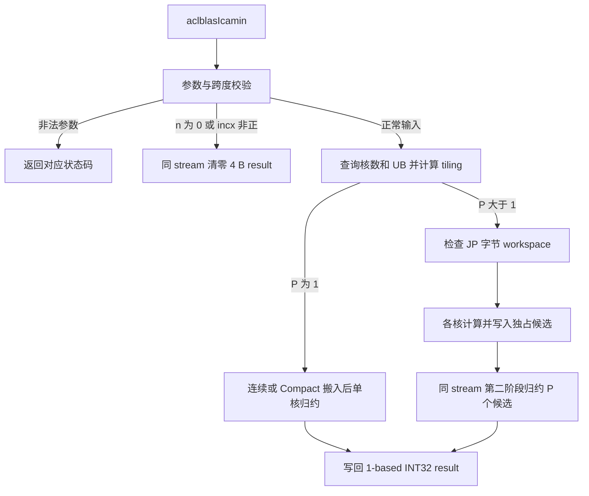

# 需求背景（required）

## 需求来源

本设计对应 CANN 社区任务 2026 的 **09-58-aclblasIcamin-950**，由团队 **aihos** 提交。
按照[社区任务提交规范](../../../../README.md)和[算子设计文档模板](../../../../resources/design_template.md)，
文档保存为 `tasklist/09-58-aclblasIcamin-950/aihos/docs/design.md`。

| 项目 | 内容 |
| --- | --- |
| 算子 | `aclblasIcamin`，单精度复数向量最小 BLAS 模元素索引 |
| TeamName | `aihos` |
| 任务目标环境 | Ascend 950PR、CANN 9.1.0、Ascend C |
| 工程模式 | ops-blas 句柄式 BLAS 接口，直接启动 Ascend C kernel |
| 目标工程 | [cann/ops-blas](https://gitcode.com/cann/ops-blas) |
| 文档用途 | 社区任务设计阶段官方评审 |
| 本文范围 | 功能契约、Host/Kernel 设计、分核与内存、性能优化方向、测试计划及验收标准 |

本文描述拟采用的算子方案。分核阈值、tile 大小、缓冲数量和候选搬运策略作为设计初值，
可依据目标平台资源与性能分析调整；调整时保持接口契约、数值语义和验收标准一致。

## 背景介绍

### aclblasIcamin 算子背景

Icamin 在一个 complex64 向量中查找 `abs(real) + abs(imag)` 最小的元素，返回其逻辑位置。
该操作用于 BLAS 向量计算，输入是交错存储的实部、虚部，输出是单个 1-based 整数索引。
相同模值必须返回最早的位置。向量可通过正 `incx` 表示非单位步长。

### 工程基础与接口范围

以 `ops-blas` 的同族实数接口 `aclblasIsamin` 为工程参考，沿用库的句柄、stream、
workspace 与构建机制，在 `blas/iamin/arch35/` 规划复数归约接口和 kernel。
归约计算拟采用 AIV 上的 `AscendC::Reg` SIMD API。

| 参数 | 参数含义 | 数据类型 | 存储位置及布局 | 约束 | 形状 |
| --- | --- | --- | --- | --- | --- |
| handle | 库上下文，绑定 stream 和 workspace | `aclblasHandle_t` | Host 句柄 | 有效、非空 | 标量 |
| n | 逻辑复数元素数量 | `int` | Host 标量 | 正常计算时大于 0；0 为 quick return；负数报错 | 标量 |
| x | 输入复数向量 | `aclblasComplex` / COMPLEX64 | Device；`real,imag` 交错，每个元素 8 B | 正常路径非空，只读 | 逻辑 `[n]`，物理跨度 `(n-1)*incx+1` |
| incx | 以复数元素为单位的步长 | `int` | Host 标量 | 正数参与计算；非正数 quick return | 标量 |
| result | 最小模元素的逻辑索引 | `int` / INT32 | Device，独立 4 B 输出 | 非空；值为 0 或 `[1,n]` | 标量 |

### 算子功能分析

- 模值采用 BLAS 的复数 L1 定义，不求平方和或平方根。
- 输入分量与模值加法均使用 FP32，输出索引用整数精确比较。
- 输出为逻辑位置，不乘 `incx`，也不返回实部/虚部在 float 数组中的位置。
- 不涉及广播、多输入 shape 对齐、原地更新或多卡通信。
- 测试使用随工程提供的 CPU 参考循环生成 golden，不依赖第三方 Icamin 参考接口。

例如 `[(3,4),(1,-1),(-2,0)]` 的模值为 `[7,2,2]`，输出为 `2`；将三个逻辑元素放在
物理位置 `0,3,6` 并设置 `incx=3`，输出仍为 `2`。

# 需求分析（required）

## 需求描述

使用 Ascend C 在 Ascend 950PR 上实现公共接口 `aclblasIcamin`。正常路径与
`cublasIcamin` 的模定义、参数顺序、1-based 索引及并列最小规则对齐；参数错误、
Device 输出和 NaN 按本任务明确的接口契约处理。原始 1000 条精度、200 条性能用例
必须完整保留，并补充正态分布、边界、特殊值和 API 定向测试。

性能测量先 warmup，再有效采样超过 50 次。三个指定规模分别满足 24.77、24.59、
29.69 μs 上限，其余必验性能项按配套基线及明确的关联关系判定。

## 需求拆解

| 编号 | 需求 | 设计与验证方式 |
| --- | --- | --- |
| R01 | COMPLEX64 输入、INT32 输出 | 公共类型布局检查；FP32 `Abs+Add`；结果仅写 4 B |
| R02 | 模最小且索引最小，输出 1-based | 保存 `(value,globalIndex)`；所有归约层使用相同的字典序规则 |
| R03 | 非单位正步长 | Compact DMA 压紧复数；孔洞填零诱饵的定向测试 |
| R04 | 零长度和非正步长 quick return | 同 stream 异步清零 Device result；不启动 Icamin 计算 kernel |
| R05 | 参数异常与整数溢出 | 固定校验优先级；64 位跨度计算；直接调用真实 API 的负向测试 |
| R06 | NaN、Inf、subnormal、舍入与并列值 | 明确候选规范化；CPU golden；特殊值及跨 lane/tile/核测试 |
| R07 | 动态资源与大规模输入 | 查询 AIV 核数和 UB；均衡分核；分块计算；两阶段归约 |
| R08 | 异步执行与内存安全 | 复用 handle workspace；显式流水同步；stream 顺序与 guard 检查 |
| R09 | 随机输入及复现 | 均匀/正态配对；实虚部独立种子；保存生成算法版本 |
| R10 | 精度和性能独立验收 | GTest XML 检查执行集合；Device 事件计时；显式 baseline manifest |
| R11 | 符合社区工程与交付规范 | 本团队 `docs/design.md`；实现及测试位于任务指定的 ops-blas 目录 |

# 详细设计（required）

## 算子分析

### 数学公式

对于正常输入 `n>0, incx>=1`，使用零基逻辑索引 `i`：

```text
z_i = x[i * incx],  i = 0 ... n-1
s_i = float32(abs(z_i.real) + abs(z_i.imag))
无 NaN 时：j = argmin_i (s_i, i)，按字典序比较
result = j + 1
```

NaN 的行为按下文候选映射定义。`+0` 与 `-0` 模值相等；FP32 相加溢出的 `+Inf`
保留为真实候选。不能用 FP64 计算模值后比较，也不能用 epsilon 判等或将索引转换为 float。

### 支持数据类型

`aclblasComplex` 包含两个 float32 字段 `real`、`imag`。设计要求在编译期检查：
`sizeof(aclblasComplex)==8`、`offsetof(imag)==4`、`sizeof(float)==sizeof(int)==4`。
归约候选索引采用 `uint32_t`，最终 1-based 索引写为 INT32。正常输入 `n` 不超过
接口 `int` 的表达范围，合法输出不会超过 `INT_MAX`。

### 支持形状

输入为逻辑一维向量 `[n]`，正步长时物理长度至少为 `(n-1)*incx+1`。`n` 为运行时
参数，每次调用重新计算 tiling。`n=0`、`incx<=0` 不读取输入；负步长不反向遍历。
不支持广播或额外 leading dimension。本算子不是图模式 Tensor shape 推导算子。

### 公共接口及参数语义

```cpp
aclblasStatus_t aclblasIcamin(
    aclblasHandle_t handle,
    int n,
    const aclblasComplex* x,
    int incx,
    int* result);
```

声明位于 `include/cann_ops_blas.h`，不增加 950PR 私有平行接口。`x`、`result` 和
workspace 均由调用方保证是合法的 Device 分配，并存活至 stream 完成；三个区间不得重叠。
Host 不解引用 Device 指针，正常路径也不逐次查询完整内存分配区间。

## 算子实现

### 实现方案

小向量使用一个 AIV kernel 直接输出，大向量使用“多核候选归约 + 同 stream 单核最终
归约”。连续及跨步输入在搬运阶段分流，后续复数计算与索引归约共用。输入缓冲从单
buffer 方案起步，并将双缓冲流水作为性能优化候选，由 UB 预算与完整接口耗时决定选型。



#### 3.2.1 host 侧设计

##### 1. 参数检查与快速返回

| 优先级 | 条件 | 处理 |
| ---: | --- | --- |
| 1 | `handle==nullptr` | 返回 `ACLBLAS_STATUS_HANDLE_IS_NULLPTR` |
| 2 | `n<0` 或 `result==nullptr` | 返回 `ACLBLAS_STATUS_INVALID_VALUE` |
| 3 | `n==0` 或 `incx<1` | 同 stream 异步写 result=0，允许 x 为空 |
| 4 | 正常路径 `x==nullptr` | 返回 `ACLBLAS_STATUS_INVALID_VALUE` |
| 5 | 输入字节跨度无法用 `size_t` 表达 | 返回 `ACLBLAS_STATUS_INVALID_VALUE` |
| 6 | 正常输入 | 查询平台、计算 tiling、检查 workspace 并提交 kernel |

快速返回调用 `aclrtMemsetAsync(result,4,0,4,handle->stream)`，只清零输出 4 B；这里
“不启动 kernel”指不下发 Icamin 计算 kernel，Device 清零由运行时实现。清零下发失败返回
`ACLBLAS_STATUS_EXECUTION_FAILED`。负 n 的优先级高于 quick return，空 result 不被豁免。

正常路径跨度使用 `uint64_t(n-1)*uint64_t(incx)+1` 计算，要求不超过 `SIZE_MAX/8`。
先检查再乘字节数，避免先用 32 位做乘法。对负 incx 不取绝对值，避免 `INT_MIN` 溢出。
设备侧源偏移也先扩位，再计算 `logicalIndex*incx*2` 个 float。

##### 2. 设计参数与分核策略

通过 `GetAivCoreCount()` 获取实际 AIV 核数 `C`，使用
`PlatformAscendCManager::GetInstance()->GetCoreMemSize(UB,...)` 获取 UB 容量 `U`。
平台无效、`C=0` 或 UB 不足时返回 `ACLBLAS_STATUS_INTERNAL_ERROR`。

为便于资源估算，给出以下初始配置。阈值、容量与批量参数可在开发和性能优化阶段
调整；具体 DMA 参数始终满足目标 SDK 和硬件约束。

| 参数 | 设计初值 | 选取依据与调整方向 |
| --- | ---: | --- |
| 分组粒度 G | 64 个复数 | 与目标 FP32 SIMD 向量宽度匹配 |
| 单核阈值 S | 8192 个复数 | 平衡小输入启动开销与多核收益 |
| 每核目标工作量 W | 8192 个复数 | 控制核数与第二阶段成本 |
| 连续路径 tile 上限 T_c | 4096 个复数 | 按 UB 容量与搬运效率调整 |
| 跨步路径 tile 上限 T_s | 4032 个复数 | 对齐 G，并使初始单批 Compact DMA 合法 |
| 输入缓冲数量 B | 1 | UB 足够且流水有收益时评估 2 |
| UB 资源余量 R | 8192 B | 结合编译器资源报告调整 |
| 候选记录槽位 J | 32 B | 对齐写回，各核独占；布局调整须同步两阶段 |
| 第二阶段批量 A | 64 条候选 | 按 UB 预算评估多个对齐分组 |

G 表示原生 FP32 SIMD 子组宽度，本方案取 64，作为 Host/Device 共享编译期常量。
较大的处理批量按 G 个元素分组累积。S、W、T_c、T_s、B、A 均为正整数，T 与 A
按 G 对齐；J 至少容纳候选的两个字段并满足 DMA 对齐要求，初始按 32 B 对齐选取。

分核按逻辑块均衡，不将硬件核数写死：

```text
L = ceil(n / G)
D = n <= S ? 1 : ceil(n / W)
P = min(C, D, L)
q = L / P
r = L % P

对核 b = 0 ... P-1：
    firstBlock = b*q + min(b,r)
    blocks = q + (b<r ? 1 : 0)
    begin = G*firstBlock
    end = min(n, begin + G*blocks)
    count = end - begin
```

先保证 `P>=1` 再除法。各核完整块数量相差最多 1，核起点按 G 个复数对齐，区间无重叠、
无遗漏且无空核。ceil-div、区间端点及上取整使用 64 位中间值。仅最后一个逻辑块可能不满 G。

##### 3. 数据分块和 UB 内存优化策略

每核保留 G 路最优值与索引，状态大小为 `G*4+G*4=8G B`，G=64 时为 512 B。
另分配 J 字节输出缓冲，并预留 R 字节资源余量。令实际 tile 大小 T 为 G 的整数倍，
单 buffer 字节数按 DMA 要求对齐。初始 G=64 时 `8T` 自然按 32 B 对齐。

```text
fixedBytes = 8*G + J + R
largestCore = G * (q + (r != 0 ? 1 : 0))
capacity = floor((U - fixedBytes) / (8*B))
pathTile = incx == 1 ? T_c : T_s
T = G * floor(min(pathTile, capacity, largestCore) / G)
inputBufferBytes = align_up(8*T, 32)
要求：B*inputBufferBytes + fixedBytes <= U
```

先检查 U 足以覆盖固定资源，再做减法。要求 `T>=G`；双缓冲容量不足时可退回单缓冲
重新计算，连一个最小 tile 都不能容纳时返回资源错误，不启动 kernel。

| 第一阶段对象 | 每核大小 | 用途 |
| --- | ---: | --- |
| 输入 buffer | `B*align_up(8*T,32)` B | tile 的复数 AoS 数据 |
| bestValue / bestIndex | `8G` B | 不同 tile 的 VF 作用域间保存候选 |
| 输出 buffer | J B | 单核结果或多核候选记录 |
| 资源余量 | R B | 为编译器及辅助资源预留 |

按初值估算，连续 T=4096 时单输入 buffer 为 32768 B，跨步 T=4032 时为 32256 B。
预留值不替代编译器资源报告。第二阶段以 A 条候选为一批，两个字段输入缓冲、累积状态
和输出缓冲的预算为 `2*align_up(4*A,32)+8G+J+R<=U`，避免随 P 线性占用 UB。

##### 4. tilingkey 规划及 TilingData

规划 Host/Device 共享的标量 TilingData，不包含按核分配数组或 Host 指针。
字段按以下信息组织，具体布局在实现时通过编译期检查保证两端一致：

| 字段 | 类型 | 含义 |
| --- | --- | --- |
| totalN / incx | 各 uint32 | 正常路径 n 和正步长 |
| usedCoreNum | uint32 | 实际启动核数 P |
| blocksPerCore / extraBlockCores | 各 uint32 | q 与 r |
| tileComplex | uint32 | 每 tile 复数数量 T |
| inputBufferCount / inputBufferBytes | 各 uint32 | 缓冲数量 B；单缓冲对齐字节数 |
| workspaceSlotBytes | uint32 | 候选记录槽位 J |
| finalBatchSize | uint32 | 第二阶段每批候选数 A |
| pathKey | uint32 | bit0 表示跨步，bit1 表示两阶段 |
| workspaceBytes | uint64 | 单核为 0，多核为 JP B |
| inputSpanElements | uint64 | 正步长输入的物理复数跨度 |

`pathKey` 的 0/1/2/3 分别描述单核连续、单核跨步、多核连续、多核跨步。
Host 决定是否下发第二阶段；搬运路径可采用运行时分支或有限的编译期特化，依据分支
开销与代码体积选择，保持四类路径的候选语义一致。

##### 5. workspace 与错误处理

单核路径不使用 workspace。多核路径从 handle 获取已有 workspace，检查指针非空且
容量至少为 `J*P` B，不足返回 `ACLBLAS_STATUS_EXECUTION_FAILED`。接口不在热路径
申请、扩容或释放 Device 内存，不调用全设备同步。

kernel launcher 应返回即时运行时状态，并通过目标 SDK 支持的错误查询接口检查提交
结果；第一阶段提交失败不继续提交第二阶段。Host 将提交错误映射为
`ACLBLAS_STATUS_EXECUTION_FAILED`。成功返回表示提交成功，异步执行错误仍由调用者
同步 stream 检查。

#### 3.2.2 kernel 侧设计

##### 1. 可并行的候选表示与数值规则

定义 `Candidate=(float value,uint32 index)`，index 为全局零基逻辑索引。
无效候选 `Identity=(+Inf,UINT32_MAX)`；规范化规则如下：

| 输入情况 | 生成的候选 |
| --- | --- |
| 非真实元素、尾部 padding | Identity |
| score 为 NaN 且全局 index=0 | `(FLT_MAX,0)` |
| score 为 NaN 且全局 index>0 | Identity |
| 其余元素，包括真实 +Inf | `(score,index)` |

合并候选时，较小 value 胜出；value 精确相等时，较小 index 胜出。规范化后不含 NaN，
合并为具有结合性和交换性的字典序 min，Identity 不会击败真实 `+Inf` 候选。
全局首元素的 NaN 特例只生成一次，不能在每核或每 tile 的首元素重复应用。

该映射等价于 CPU 参考：用首元素模值初始化，首模为 NaN 则改为 FLT_MAX，后续跳过 NaN，
仅在严格更小时更新索引。因此 `[NaN,FLT_MAX]`、`[NaN,+Inf]`、全 NaN 都返回 1；
`[NaN,5]` 返回 2；`[+Inf,+Inf]` 返回 1。本方案按任务书提供的 CPU 参考规则设计。
任务书将 NaN 契约列为研发确认项，需在设计评审中确认最终语义，并保持算子、golden
和测试预期一致。

在 FP32 score 一致的前提下，各层使用相同候选规则，因此分组、分 tile、分核不改变结果。
索引不转换为浮点数，避免大索引超过 FP32 精确整数范围后丢失并列顺序。

##### 2. Init 与 CopyIn

Init 阶段根据核号计算逻辑区间，初始化流水资源，并分配输入、状态和输出缓冲。
初始候选全部为 Identity，输出缓冲保留字节清零。流水对象和缓冲的生命周期覆盖本次
kernel 的全部搬运与计算，具体组织遵循目标 SDK 约束。

连续路径使用 `DataCopyPad` 一次搬入当前批次 `count*8` 个真实字节，UB 保持
`[re0,im0,re1,im1,...]`。跨步路径使用 `DataCopyPad<float,PaddingMode::Compact>`：

```text
blockCount = count                 # 不超过单批搬运上限
blockLen = 8                       # 每个复数的字节数
srcStride = int64(incx-1)*8         # 两个真实复数之间跳过的字节数
dstStride = 0                      # Compact 模式在 UB 中压紧
sourceFloatOffset = uint64(logicalBegin)*incx*2
```

跨步路径不主动搬入整个物理跨度的孔洞。初值 4032 小于批量 blockCount 上限 4095；所有正
int32 incx 对应的源 stride 小于 `2^40`，满足文档列出的范围。参数范围参考
[DataCopyPad 官方说明（9.1 beta2）](https://www.hiascend.com/doc_center/source/zh/CANNCommunityEdition/910beta2/API/ascendcopapi/atlasascendc_api_07_0265.html)，
实现时按 CANN 9.1.0 头文件核对 API；扩大 tile 时将搬运拆为合法批次。
设计优先使用批量 DMA，避免逐元素 GM 读取的指令开销。

按 G=64 的方案，Reg load 每组读取 128 个 float。尾组不满 G 个复数时，先在已分配
UB 内将最后一组清零，再搬入真实数据，并在计算中使用真实元素 mask。GM 仅请求真实字节，
不能用计算 mask 掩盖越界 load。

##### 3. Compute 与核内归约

按 G=64 的方案，每组从 UB 载入两个 64-lane float 寄存器，使用 `DeInterleave` 分离
实虚部，经 `Abs` 和 `Add` 得到 FP32 score。每 lane 保存当前最优的 value 和全局 index，
通过 Compare、mask 逻辑和 Select 更新。

lane 序号可用 int32 生成，再重解释为 uint32 后加全局起点；实现时核对目标 SDK 的
类型支持。索引计算应避免接近 `INT_MAX` 时无效尾 lane 的有符号溢出。

```text
每个 tile：
    从 UB 加载 bestValue[G]、bestIndex[G]
    遍历 tile 的 G 个复数组：
        计算 score 和全局逻辑 index
        按有效 mask 与 NaN 规则生成候选
        按 (value,index) 字典序更新每 lane 的最优候选
    将 8G B 候选状态存回 UB

核末：
    minValue = Reduce<MIN>(bestValue, fullMask)
    target = 广播 minValue 的 lane0
    eligible = Select(bestValue == target, bestIndex, UINT32_MAX)
    minIndex = Reduce<MIN>(eligible, fullMask)
```

不同 `__VEC_SCOPE__` 的寄存器不保证存活，跨 tile 状态显式经 UB 传递。
最后归约的是候选携带的全局索引，不能用硬件 argmin 返回的 lane 编号代替。
两次 MIN 都使用全宽 mask，未使用候选已显式填充为 Identity，避免掩蔽归约时的
隐式 FLT_MAX 影响真实全 Inf 输入。所有 SIMD 接口按 CANN 9.1.0 的 `AscendC::Reg` 命名使用。

##### 4. CopyOut 与多核第二阶段

P=1 时，从局部输出缓冲仅搬出 `minIndex+1` 的 4 B，调用方仅需分配一个 INT32 result。
P>1 时，各核独占一个 J 字节 record，按 J=32 的初始布局：

| record 偏移 | 内容 |
| --- | --- |
| +0～+3 | float 最小模值 |
| +4～+7 | uint32 全局零基索引 |
| +8～+31 | 保留字节，写前清零 |

第一阶段写入 `workspace + blockIdx*J`。每次调用覆盖本次需要的所有记录，不通过原子
竞争或全局计数器合并，不需要预先清空整个 workspace。

第二阶段在同一 stream 上以单核启动，每次处理最多 A 条候选记录。两次 Compact DMA
分别从 +0 和 +4 提取 value/index，使用 `blockLen=4`、`srcStride=J-4`，得到两个
字段缓冲。按 A=64 的初值，每个字段缓冲为 256 B。P>A 时循环累积，尾组填 Identity；
只读取本次第一阶段写入的 P 条记录。最终仍用两次 MIN 选出全局候选并写 result。
当 A>G 时，每批按 G 条候选分组更新累积状态，最后不足 G 的部分填 Identity。
扩大 A 后若超过 Compact DMA 单批参数上限，则拆分搬运，保持字段缓冲连续。

##### 5. 同步与资源生命周期

| 依赖 | 规划同步方式 |
| --- | --- |
| 输入 buffer 的 Vector 读取/初始化 → 下一次 DMA 覆盖 | `V_MTE2` 的 SetFlag/WaitFlag |
| MTE2 搬入完成 → Vector 计算 | `MTE2_V` 的 SetFlag/WaitFlag |
| 状态初始化或 VF 写回 → 后续 VF 读取 | `PipeBarrier<PIPE_V>()` |
| Vector 准备输出 → MTE3 搬出 | `V_MTE3` 的 SetFlag/WaitFlag |
| MTE3 搬出完成 → 缓冲生命周期结束 | `MTE3_V` 的 SetFlag/WaitFlag |
| 第一阶段所有核 → 第二阶段读取候选 | 同一 stream 中两个 kernel 的执行顺序 |

单 buffer 调度按上述依赖串行组织；双缓冲需为各缓冲独立管理可复用状态和事件。
同一 handle/stream 上的连续调用可按顺序复用 workspace；并发流使用独立
handle/workspace，不能在前一次执行未完成时无同步地换流并
复用存储。不采用跨核自旋 barrier 或“最后完成的核负责归约”的调度假设。

#### 3.2.3 性能优化方案

| 优化点 | 设计方案 | 评估方法 |
| --- | --- | --- |
| 小向量固定开销 | n<=S 使用单核、一个 kernel | 扫描 1K/2K/4K/8K/16K 阈值，测量与两阶段的交叉点 |
| 分核与负载 | 动态 P，按 G 个复数均衡 | 扫描每核目标工作量 4K/8K/16K/32K，比较完整接口均值 |
| 数据搬运 | 连续批量 DMA；跨步 Compact | 结合 stride、对齐和缓存分析实际事务与吞吐 |
| 模值与索引计算 | 寄存器中融合 Abs/Add/比较；不写 n 大小的模数组 | 观察 Vector 利用率、寄存器占用和候选状态读写成本 |
| tile 大小 | 按路径上限及 UB 预算确定 T | 扫描合法 tile，较大 Compact tile 必须拆为合法批次 |
| 搬运计算重叠 | 单 buffer 起步，评估双缓冲 | 在 UB 足够时使用独立事件，测量预取和计算的重叠收益 |
| 第二阶段开销 | A 条候选一批，提取字段后 SIMD 归约 | 对比不同 A、字段抽取与整 record 读取，保持候选语义 |
| 内存申请 | 热路径复用已有 workspace | 保持分配、数据准备及拷贝在计时区间外 |

性能调优使用 profiler 区分第一阶段、第二阶段和 Host 提交间隙，依据瓶颈调整核数、
tile 或流水。保留完整接口 Device event 均值，同时可记录各 kernel 耗时之和
用于定位，不用后者替换验收口径。每次优化回归特殊值、并列最小、边界、stream 与内存保护。

双缓冲必须实现“预取下一 tile—计算当前 tile—等待可复用 buffer”的真实流水，候选状态
仍按 tile 顺序推进。仅将 buffer 数改为 2 而保留串行 CopyIn/Compute 不视为有效优化。
参数调整需保持精度、数值规则、必验用例覆盖和性能判定口径一致。

## 支持硬件

| 支持的芯片版本 | 涉及勾选 | 设计范围 |
| --- | --- | --- |
| Ascend 950PR | √ | 本任务目标平台，arch35，CANN 9.1.0 |
| Ascend 950DT | — | 本任务范围外 |
| Atlas A2 / A3 产品 | — | 本任务范围外 |

## 算子约束限制

1. 仅支持 COMPLEX64 输入与 Device INT32 输出；不提供 Host result 模式。
2. 输入 n 为 int，正常计算要求 n>0、incx>0，且物理字节跨度可由 size_t 表达。
3. result 非空且至少 4 B；输入、输出、workspace 不重叠，异步执行期间保持有效。
4. 通过前置参数校验后，非正 incx 输出 0，不支持负步长反向读取；不支持广播、原地更新和额外视图变换。
5. n、incx 很大时，跨度检查只验证整数表达能力，实际分配大小仍由调用者保证。
6. 任务未设额外算法内存上限，实际可处理规模由合法分配和平台资源共同约束。

## 工程集成规划

代码与测试按任务要求集成至 ops-blas，竞赛仓按团队目录提交设计文档。
沿用工程的 arch35 源码、测试发现和构建机制，内部文件划分可随模块职责调整。

| ops-blas 规划路径 | 职责 |
| --- | --- |
| `include/cann_ops_blas.h` | 公共接口声明 |
| `blas/iamin/arch35/icamin_host.cpp` | 参数校验、快速返回、平台查询和启动 |
| `blas/iamin/arch35/icamin_host_utils.h` | 可独立测试的跨度与 tiling 算术 |
| `blas/iamin/arch35/icamin_tiling_data.h` | Host/Device 共享字段与常量 |
| `blas/iamin/arch35/icamin_kernel.cpp/.h` | Reg SIMD、两阶段 kernel 与 launcher |
| `blas/iamin/README.md` | 产品支持、接口约束与调用示例 |
| `test/iamin/icamin/` | CPU golden、输入生成、fixture、portable 检查及 CMake |
| `test/iamin/icamin/arch35/` | 精度/API/benchmark、原始及扩展 CSV、基线与 manifest |
| `test/iamin/icamin/scripts/` | 数据生成和严格精度/性能验收工具 |

# 可维可测分析

## 精度标准/性能标准

| 验收标准 | 描述 | 标准来源 |
| --- | --- | --- |
| 精度 | 实际与 golden 的 INT32 索引逐值精确相等，状态码也精确一致 | Icamin 任务书精度与异常语义要求 |
| 并列值 | 精确相等的 FP32 模值返回最小逻辑索引，不采用容差 | 任务核心功能要求 |
| 快速返回 | n=0 或 incx<1 时 result=0；负 n 返回 INVALID_VALUE | 任务参数表及配套用例 |
| 三个指定性能规模 | 平均单次 Device 时间分别不超过下表上限 | 任务书性能要求 |
| 其他必验性能 | 对应 GPU 基线 `gpu_ms*1000/0.4`，单位 μs | 配套测试指导及显式 baseline manifest |
| 采样 | 先 warmup，有效采样超过 50 次；建议配置为 warmup 20 次、采样 100 次 | 任务书自验要求 |
| 内存 | 无独立性能式上限；提供占用数据并验证访问范围 | 任务书内存要求与交付报告要求 |

输出是离散整数，不能将输入分量的 FLOAT32 rtol/atol 容差用于接受错误索引。
CPU score 显式保存为 float，测试编译应禁用影响 IEEE 语义的优化，可采用
`-fno-fast-math -ffp-contract=off` 等编译选项。

| 必验 case | n | incx | 平均 Device 耗时上限 |
| --- | ---: | ---: | ---: |
| TC_PF_1001 | 1048576 | 1 | 24.77 μs |
| TC_PF_1002 | 2097152 | 1 | 24.59 μs |
| TC_PF_1003 | 4194304 | 1 | 29.69 μs |

前三项直接使用任务书上限，不再除以 0.4。200 条原始性能用例有重复形状，尤其
`(4194304,1)` 对应 5 种填充；使用 case_name 到 baseline_id 的显式一对一映射，
不能用 `(n,incx)` 字典覆盖基线。扩展性能观测若没有独立 GPU 基线，应标记 `NO_REF`，
不替代必验性能项。

## 测试设计

### 数据集与精度覆盖

| 集合 | 覆盖要求 | 用途 |
| --- | --- | --- |
| 原始精度 CSV | 1000 | 基础、shape、stride、填充、边界与异常 |
| 扩展正态精度 CSV | 与正常均匀随机场景配对 | 保证随机精度用例的两类分布各占 50% |
| API / 特殊值定向测试 | 按下述场景补齐 | 覆盖公共接口、数值规则和资源边界 |
| 原始必验性能 CSV | 200 | 独立 benchmark，逐条关联任务配套 GPU 基线 |
| 可选扩展 benchmark | 按调优需要增加 | 观测分布、stride、对齐及不同资源配置的影响 |

原始 1200 行 case 和 200 行 GPU 基线原样保存并校验 SHA256，不由生成器覆盖。
均匀随机数据范围为 `[-5,5]`；正态实部/虚部分别记录 μ∈[-5,5]、σ∈[0.1,2] 及种子，
独立采样，不裁剪正态样本。均匀与正态在正常随机精度场景中各占 50%；quick return、
负向及特殊值用例单独覆盖。`RANDOM_NORM_5_5` 填充名称中的 NORM 不能代替
`distribution` 字段，前者在原始数据中表示均匀分布。

生成器需记录算法版本、分布参数及实虚部种子，确保输入可复现。CPU golden 按逻辑步长
读取、用严格小于更新最优值，首 NaN 以 FLT_MAX 初始化。测试 wrapper 仅管理内存和
生命周期，负向用例必须到达真实公共接口，不能由 wrapper 提前返回。

重点定向覆盖：

- L1 与欧几里得模不同的样例，stride 孔洞诱饵及逻辑索引。
- SIMD 分组 G、各路径 tile T、单核阈值 S 及其 ±1 边界，跨核与首尾并列值。
- 首/非首/全 NaN、整核 NaN、Inf、FLT_MAX 加法溢出、±0、subnormal 和舍入后相等。
- x 偏移 0/8/16/24 B，result 偏移 0/4/…/28 B；x、result、workspace 前后 guard。
- 空 handle/x/result、负 n、非正 incx、INT_MIN 与组合优先级；字节跨度溢出提前拒绝。
- 单核不依赖 workspace，多核不足容量报错，多次复用不受旧候选影响。
- 非默认 stream 的输入更新→计算→读回顺序，独立 handle/stream 的并发隔离。

测试 fixture 拟复用进程级 ACL 环境，支持显式选择设备，创建非默认 stream 和 handle。
按待测配置的 workspace 需求绑定内存，分别覆盖充足、临界和不足容量。结果预填非零
哨兵，执行后同步再读回，校验输入未修改及所有 guard。资源在成功和异常路径均应释放。

### 性能测量及完整性检查

在数据生成、分配、H2D 和 golden 完成后，先执行一次完整接口做精度预检，再 warmup
并同步。以 warmup 20 次、有效采样 N=100 次为建议配置，使用 `ACL_EVENT_TIME_LINE`
事件包围同 stream 上 N 次完整接口调用；调整采样数量时仍需满足 N>50：

```text
record(start)
repeat N:
    aclblasIcamin(handle,n,x,incx,result)
record(stop)
synchronize(stream)
device_avg_us = elapsed_ms(start,stop)*1000/N
再次检查 result 和内存 guard
```

该区间覆盖每次调用全部计算阶段和设备调度间隙，不含分配、输入准备、H2D/D2H 或逐次
同步。GTest 总耗时包含准备和检查，不能用其整数毫秒耗时推算微秒级性能。重复同一输入
的 warmup 测试记录缓存策略；冷缓存/轮转 buffer 的辅助测试单列。

benchmark 规划按 case 输出 JSONL，至少记录参数、device_avg_us、warmup、repeats、status、
actual/golden、input_bytes、workspace_bytes、device_id 和随机种子。验收工具通过
注册清单及 GTest XML 检查预期集合，超时、非零退出、缺失/重复、跳过、损坏 XML 和零用例
均判失败；性能 JSONL 再检查完整性及逐条门槛。筛选运行标记 `PARTIAL`，不当作全量验收。

### 内存与可维护性

算法总计算量 O(n+P)，全局额外空间 O(P)，每核使用受 UB 约束的 tile 与 G 路候选。

| 内存项 | 大小或计量方式 |
| --- | --- |
| 输入物理跨度 | `8*((n-1)*incx+1)` B |
| 输入逻辑有效字节 | `8*n` B；不直接等同于实际总线流量 |
| 输出 | 4 B |
| 单核算法 workspace | 0 |
| 多核算法 workspace | JP B；初始 J=32 时为 32P B |
| handle 绑定 workspace | 记录实际分配容量，与算法需要的字节数分别统计 |
| 第一阶段 UB 预算 | `B*align_up(8*T,32)+8G+J+R` B |
| 第二阶段 UB 预算 | `2*align_up(4*A,32)+8G+J+R` B |

Host 检查函数、共享常量和归约状态分别封装，日志记录 n、incx、P、q/r、tile 和路径。
独立 CPU 检查覆盖跨度、UB 下界、分核覆盖与溢出，无须为了测试极大参数实际申请巨量
Device 内存。内存报告还应包含输入/输出 guard、实际峰值 Device 内存及 Host RSS。

## 验收执行计划

1. 在 Ascend 950PR、CANN 9.1.0 环境按 ops-blas 构建流程编译公共接口、Host 和 kernel，
   检查目标架构、接口导出及资源报告。
2. 通过 CSV 驱动 GTest 调用真实公共接口，完整执行原始精度用例、分布扩展和定向测试，
   校验状态码、整数索引、stream 顺序及内存访问范围。
3. 独立执行 200 条必验性能用例，按统一计时口径关联基线并逐条判定；扩展观测单独统计。
4. 在开发机补充分核覆盖、跨度溢出、UB 预算和数据生成可复现检查；这些检查与目标设备
   的功能、性能验收分别记录。
5. 为每轮验收保留构建日志、用例清单、运行日志、XML、性能原始记录和汇总报告。报告
   应记录硬件、设备 ID、核数、驱动/固件/CANN/编译器版本、代码版本、构建选项、输入与
   基线哈希、随机种子、warmup/采样数及缓存策略。

测试工程的 README 应提供环境准备、构建、精度验证、性能验证和结果归档步骤。
功能通过与性能达标分别判定，正式报告以完整必验集合的结果为依据。

## 兼容性分析

| 项目 | 兼容性说明 |
| --- | --- |
| 公共 ABI | 新增公共函数，复用已有 handle、complex 类型和状态码，不改变既有函数签名 |
| 同族算子 | 与 Isamin 同目录共存，不替换实数实现或其测试 |
| 运行流与 workspace | 沿用 `aclblasSetStream`、`aclblasSetWorkspace`，无算子私有资源管理接口 |
| cuBLAS 核心功能 | 参数顺序、BLAS 模、1-based 和最小并列索引对齐 |
| 异常及指针模式 | 本任务负 n 报错，仅支持 Device result；不宣称与 cuBLAS 所有模式等价 |
| NaN | 按任务 CPU 参考循环设计，最终契约在设计评审中确认 |
| Ascend C API | 面向 CANN 9.1.0 的 Reg API 设计，开发时核对版本与接口约束 |
| 其他架构 | 公共声明可复用，本任务设计与验收范围为 arch35 / 950PR |

## 交付规划与验收条件

| 阶段 | 交付内容 | 评审或验收要求 |
| --- | --- | --- |
| 设计评审 | 本团队 `aihos/docs/design.md` | 按官方模板说明需求、算法、Host/Kernel 方案、优化方向及测试计划；确认 NaN 契约 |
| 工程交付 | 公共接口、arch35 算子代码、算子 README 和调用示例 | 遵循 ops-blas 工程规范，接口与产品支持范围清晰 |
| 测试交付 | 原始及补充用例、CPU golden、GTest、验收工具和测试 README | 区分精度与性能集合，覆盖任务要求，步骤可复现 |
| 验收报告 | 精确索引比较、性能、内存数据、截图及原始日志 | 全量精度通过，全部必验性能逐条达标，资源使用与测试环境可追溯 |
| 代码评审 | 待验收仓库地址、分支、算子目录及 ops-blas PR | 按社区流程完成评审和合入 |

设计稿提交至竞赛仓对应团队目录；代码、测试及使用说明按任务指定目录集成至 ops-blas。
完整作品的目录与材料按[社区任务提交规范](../../../../README.md)组织。

## 参考资料

- [社区任务说明与目录规范](../../../../README.md)。
- [算子设计模板](../../../../resources/design_template.md)。
- [社区任务列表](../../../../docs/README.md)，9 月任务 58。
- [ops-blas 官方仓库](https://gitcode.com/cann/ops-blas)。
