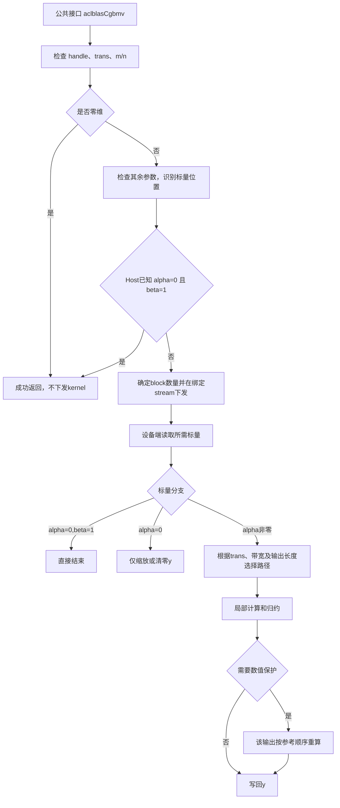

# aclblasCgbmv 算子设计文档

## 1 需求背景（required）

### 1.1 需求来源

本需求来源于社区任务《aclblasCgbmv 950 算子开发任务书》。基于 [cann/ops-blas](https://gitcode.com/cann/ops-blas) 开源仓，使用 Ascend C 在 Ascend 950PR 上实现单精度复数带状矩阵向量乘，软件环境为 CANN 9.1.0。

接口语义参考 [cuBLAS GBMV](https://docs.nvidia.com/cuda/cublas/index.html#cublas-t-gbmv) 和 [Netlib CGBMV](https://www.netlib.org/blas/cgbmv.f)。数值标杆使用 Netlib `cblas_cgbmv`；接口声明放入 `include/cann_ops_blas.h`，不定义产品私有的平行接口。

### 1.2 背景介绍

#### 1.2.1 算子实现优化

带状矩阵的有效元素集中在主对角线附近。相较于稠密矩阵，带状格式能够减少存储量和参与计算的元素数量，但不同转置模式下的访存方向不同：不转置时，每个输出需要跨列访问；转置和共轭转置时，每个输出对应一列内的连续带区。

本设计直接处理带状存储，按操作模式组织线程分工：N 模式以相邻输出行为一块合并矩阵读取，T/C 模式在线程组内并行计算一个输出列。对窄带、小输出和数值敏感场景保留有序计算路径，在精度约束下减少访存、同步和串行累加开销。

#### 1.2.2 算子实现现状分析

ops-blas 已提供同族实数接口 `aclblasSgbmv` 及句柄、stream、平台核数查询和公共状态码机制。本任务沿用其工程组织，在 `blas/gbmv/arch35/` 增加复数实现，使用公共类型 `aclblasComplex`，不修改已有实数算子的行为。

复数实现需要处理实虚交错存储、复数乘加、共轭以及复数 alpha/beta；不能仅把实数数据类型替换为复数，而忽略计算次序和特殊值传播。

#### 1.2.3 算子功能分析

算子计算 `y = alpha * op(A) * x + beta * y`，其中 A 为 m×n 带状矩阵，包含 kl 条下对角线和 ku 条上对角线。

- N：`op(A)=A`；T：`op(A)=Aᵀ`；C：`op(A)=Aᴴ`。
- A、x 只读，y 原地更新，不返回额外张量或视图。
- A/x/y/alpha/beta 均为 complex64，实部、虚部各为 float32。
- 支持矩形矩阵、lda 填充、正负向量步长，不涉及广播。
- 通过 handle 绑定的 stream 异步执行，调用方在读取结果前同步。

## 2 需求分析（required）

### 2.1 需求描述

采用 Ascend C kernel 直调方式实现公共句柄式 BLAS 接口，完成带状寻址、复数计算、参数检查和快速返回，并满足任务书精度标准及五个性能场景的耗时上限。

公共函数返回 `aclblasStatus_t`，参数顺序为 `aclblasCgbmv(handle, trans, m, n, kl, ku, alpha, A, lda, x, incx, beta, y, incy)`。

| 参数 | 方向 | 类型与位置 | 说明 |
| --- | --- | --- | --- |
| handle | 输入 | `aclblasHandle_t`，Host | 有效库上下文，携带 stream |
| trans | 输入 | `aclblasOperation_t`，Host | `ACLBLAS_OP_N/T/C` |
| m、n | 输入 | `int`，Host | A 的行、列数，均非负 |
| kl、ku | 输入 | `int`，Host | 非零维时 `0≤kl<m`、`0≤ku<n` |
| alpha、beta | 输入 | `const aclblasComplex*`，Host/Device | 各一个复数标量，允许两者位于不同位置 |
| A | 输入 | `const aclblasComplex*`，Device | 列主序带状存储，共 `lda*n` 个复数 |
| lda | 输入 | `int`，Host | `lda≥kl+ku+1`，单位为复数元素 |
| x | 输入 | `const aclblasComplex*`，Device | 输入向量，只读 |
| incx | 输入 | `int`，Host | x 的非零步长，单位为复数元素 |
| y | 输入/输出 | `aclblasComplex*`，Device | 原地覆写；beta=0 时不读取旧值 |
| incy | 输入 | `int`，Host | y 的非零步长，单位为复数元素 |

### 2.2 需求拆解

| 需求项 | 设计要求 |
| --- | --- |
| 计算语义 | 覆盖 N/T/C、复数标量乘加及 y 原地更新 |
| 存储布局 | 直接处理列主序带状格式，仅引用有效带区；支持 lda padding 和正负步长 |
| 边界处理 | 零维成功返回；alpha=0 不读 A/x；beta=0 不读旧 y；非法参数返回规定状态码 |
| 标量位置 | 识别 Host/Device 地址，Device 标量在绑定 stream 上消费，不通过 Host 同步读回 |
| 并行策略 | 输出分工唯一；按访问方向选择线程/线程组计算及块内归约 |
| 数值精度 | 使用 float32 复数运算，数值敏感输出采用有序路径，不以降低数据精度换取性能 |
| 工程集成 | 公共声明、arch35 实现、CSV 驱动测试，沿用仓库构建和日志机制 |

## 3 详细设计（required）

### 3.1 算子分析

#### 3.1.1 数学公式

$$
y \leftarrow \alpha\operatorname{op}(A)x+\beta y.
$$

采用零基下标，N 模式的输出为：

$$
y_i=\alpha\sum_{j=\max(0,i-kl)}^{\min(n-1,i+ku)}A_{i,j}x_j+\beta y_i,\quad 0\le i<m.
$$

T 模式的输出为：

$$
y_j=\alpha\sum_{i=\max(0,j-ku)}^{\min(m-1,j+kl)}A_{i,j}x_i+\beta y_j,\quad 0\le j<n.
$$

C 模式将 T 中的 A 元素替换为其共轭，即实部不变、虚部取反。求和区间为空时，乘积贡献为零，但该输出仍需执行 beta*y。

复数乘法分解为：`real=ar*br-ai*bi`，`imag=ar*bi+ai*br`。并行路径分别累加实部、虚部，最终按复数规则合并 alpha 和 beta。

#### 3.1.2 支持数据类型

使用 `cann_ops_blas_common.h` 中的 `aclblasComplex`，每个元素由两个连续 float32 组成，占8字节。计算、局部和及归约值均保持 float32，不转换为 float16、bfloat16 或 TF32。

维度和步长对外使用 `int`。涉及带宽相加、矩阵列偏移、负步长取反和存储偏移乘法时使用扩宽的整数中间量，避免在较窄整数类型中先发生溢出。

#### 3.1.3 支持形状与地址映射

A 的逻辑形状为 m×n，存储形状为 lda×n。有效元素的复数下标为：

$$
\operatorname{bandIndex}(i,j)=j\cdot lda+ku+i-j.
$$

有效带区满足 `0≤i<m`、`0≤j<n`、`j-ku≤i≤j+kl`。主对角线位于存储第ku行（零基），带外三角区域和lda多余行均不参与读取。

| 模式 | x逻辑长度 | y逻辑长度 | 每个输出的归约方向 |
| --- | ---: | ---: | --- |
| N | n | m | 固定行，沿有效列 |
| T/C | m | n | 固定列，沿有效行 |

长度 L、步长 s 的向量至少需要 `1+(L-1)*abs(s)` 个复数。第 k 个逻辑元素对应 `k*s`（s>0）或 `(L-1-k)*(-s)`（s<0）。调用方传入存储首地址，负步长起点由kernel计算。

矩阵和向量最终按相邻两个float加载，实部下标为上述复数下标乘2，虚部再加1；不要求用户地址满足额外的float2对齐。

### 3.2 算子实现

#### 3.2.1 实现方案

整体采用“单kernel、输出分区、块内归约”的结构：

该结构使每个输出只由一个线程或子组写回，不需要全局原子累加、额外的输出初始化kernel或跨核归约工作区。参数非法时按接口规则提前返回错误，图中省略错误出口。

**方案选择依据：**

- 直接使用带状存储，避免展开稠密矩阵引入的额外分配、填零和转换成本。
- N 与 T/C 分别组织线程，使每次协作读取尽量沿物理连续方向展开。
- 宽带用线程组分担归约长度；窄带或小输出减少协作成本，并保留参考累加次序。
- 使用块内归约而非跨核原子更新，避免 beta*y 初始化与累加之间的全局依赖。
- UB只保存小规模局部和，不缓存完整A/x，不引入与矩阵规模线性增长的中间结果。

#### 3.2.2 Host侧设计

##### 1. 参数检查与快速返回

| 顺序 | 条件 | 处理 |
| --- | --- | --- |
| 1 | handle为空 | 返回 `ACLBLAS_STATUS_HANDLE_IS_NULLPTR` |
| 2 | trans不为N/T/C | 返回 `ACLBLAS_STATUS_INVALID_ENUM` |
| 3 | m或n为负 | 返回 `ACLBLAS_STATUS_INVALID_VALUE` |
| 4 | m=0或n=0 | 返回成功，不检查或引用后续数据参数，不下发kernel |
| 5 | 带宽、lda、步长非法，或alpha/beta为空 | 返回 `ACLBLAS_STATUS_INVALID_VALUE` |
| 6 | Host已知alpha=0且beta=1 | 返回成功，不下发kernel |
| 7 | 需要下发时y为空；未确认alpha=0且A/x为空 | 返回 `ACLBLAS_STATUS_INVALID_VALUE` |
| 8 | 平台核数获取失败 | 返回 `ACLBLAS_STATUS_EXECUTION_FAILED` |

标量位置识别在第5项检查之后执行，识别失败传播公共辅助接口返回的错误。该顺序将“无需计算”和“无需引用数据”明确分开；零维及空指针例外的规格边界见3.4节。

##### 2. Host/Device标量

通过 `aclrtPointerGetAttributes` 识别alpha/beta位置。Host值复制到tiling；Device地址作为kernel参数传入，并设置对应标志。kernel在绑定stream上读取设备标量，保持与前序异步更新的执行顺序。

Host不直接解引用Device地址，也不为判断quick return引入设备到主机拷贝和stream同步。Device alpha未知时采用正常计算所需的指针检查；设备端读到alpha=0后仍仅执行相应特殊分支。Host已知alpha=0时允许A/x为空，启动参数借用有效y地址构造描述符，缩放分支不会读取A/x。

##### 3. 分核策略

令带宽 `B=kl+ku+1`，输出长度 `O=(trans==N ? m : n)`，可用AIV核数为C，Host分核粒度为P：未在Host确认alpha=0且B≥32时P=32，其他情况P=256。

$$
\operatorname{numBlocks}=\max\left(1,\min\left(\left\lceil O/P\right\rceil,C\right)\right).
$$

C通过 `GetAivCoreCount()` 动态获得，不固定为某一设备核数。P用于确定启动规模，实际输出分工由kernel路径决定；各路径使用网格步进循环处理超过单轮覆盖范围的输出，不在核间切换不同的输出拥有规则。

##### 4. Tiling数据与路径规划

| 字段 | 类型 | 用途 |
| --- | --- | --- |
| numThreads | uint32 | 有序、T/C及缩放路径的线程数；B<32为256，否则1024 |
| alphaIsDevice、betaIsDevice | uint32 | 独立标记标量位置 |
| m、n、kl、ku、lda | uint32 | 经Host验证后的形状和布局 |
| trans | uint32 | 内部编码0=N、1=T、2=C |
| alphaReal/Imag、betaReal/Imag | float | Host标量值；Device标量在kernel入口解析 |
| incx、incy | int64 | 含符号步长 |

采用kernel直调，不设置额外的图模式TilingKey。trans、B、O和标量条件分别派发 `TRANSPOSE/CONJUGATE`、`GROUP`、`SPLITS`、`UNIT` 模板，避免在内层循环重复判断不变的操作类型。

#### 3.2.3 Kernel侧设计

##### 1. 路径选择

解析设备标量后，首先处理alpha=0相关分支；正常计算再按下表选择路径。若alpha=1、beta=0且incx=incy=1，则宽带路径使用UNIT模板，省去通用寻址和无效复乘，但继续执行特殊值和大和检查。

| 条件 | 输出分工 | 实际线程数/block |
| --- | --- | ---: |
| alpha=0 | 每线程缩放一个输出，beta=0直接写零 | 使用numThreads |
| B<32或O<32 | 每线程有序计算一个输出 | B<32为256，否则1024 |
| N，O≥32，32≤B≤96 | 32行/tile，16个列分区 | 512 |
| N，O≥32，B>96 | 32行/tile，32个列分区 | 1024 |
| T/C，O≥32，B≥32 | 每32线程warp计算一列 | 1024 |

32/96是带宽分支配置，选择较少分区可减少窄带的归约开销，较多分区可缩短宽带的线程内累加长度。分支不依赖验收case名称或固定矩阵尺寸。

##### 2. N模式：合并读取与列分区

令tile起点为r，每tile负责32行。第b个block按 `r=32*(b+q*numBlocks)` 遍历tile，q从0递增，从而各block处理不相交的输出块。线程编号t映射为 `lane=t%32`、`split=t/32`，负责行 `i=r+lane`。设列分区数为S，则该线程遍历：

- `start=max(0,r-kl)`，`end=min(n,r+32+ku)`，采用右开区间；
- `j=start+split+q*S`，q为非负整数，且j<end；
- 只有 `i<m`、`j≤i+ku`、`i≤j+kl` 时读取A/x。

同一warp在相同迭代读取同一列的相邻有效行，使A访问连续；不同warp分担列方向工作。每个有效项恰好属于一个split，因此不需要原子操作。

每线程累加实虚局部和。N模式先计算alpha*x，再乘A；UNIT路径直接使用x。对空贡献行保留零局部和，不读取带外A或越界x。

##### 3. N模式：局部和重排与树形归约

局部实部、虚部和特殊标记分别写入布局为 `[S][33]` 的UB数组，写入位置为 `split*33+lane`。多出的一列用于打破转置访问的2次幂跨度，不参与计算。

第一次块内同步后，线程映射改为 `reduceLane=t%S`、`outputLane=t/S`。每个S线程子组读取同一输出的不同列分区，即 `partial[reduceLane][outputLane]`，并通过 `asc_shfl_down` 完成归约：

- S=16时，依次合并偏移8、4、2、1的值；
- S=32时，依次合并偏移16、8、4、2、1的值；
- 实部、虚部和特殊标记交错归约，最后仅reduceLane=0负责输出。

由此将跨分区的合并组织为log2(S)级树。输出前根据标记和数值条件选择直接写回或有序重算；第二次块内同步完成后才允许复用局部数组处理下一个tile。

##### 4. T/C模式：列内warp点积

每个32线程warp负责一个输出列j。lane按 `i=start+lane+32*q` 分担行区间，其中 `start=max(0,j-ku)`、`end=min(m,j+kl+1)`。

A的有效行在带状列内连续，线程直接按物理位置读取；x按incx映射。C模式读取后对A虚部取反，不另行转置或复制矩阵。每线程形成局部和，再做5级warp归约；lane0完成alpha乘法、beta合并和写回。

同一warp的全部lane共同参与归约，没有分配到有效行的lane贡献零。输出列越界时整个warp不执行该次计算，避免从未参与的源lane获取未初始化值。

##### 5. 有序路径与标量特殊分支

窄带、小输出和需要数值保护的输出调用有序计算：N从beta*y开始按列累加 `(alpha*x)*A`；T/C先按行求和，再计算 `alpha*sum+beta*y`。

alpha=0时只处理y；alpha=0且beta=1不读写y。beta=0不加载旧y，beta=1合并时直接使用旧y，避免额外的单位复乘改变非有限值传播。空归约区间也执行该输出对应的beta语义，不能因为矩形尾部无有效A元素而漏写。

#### 3.2.4 内存规划与同步

| 存储 | 用途 | 大小/生命周期 |
| --- | --- | --- |
| GM中的A/x/y | 调用方数据，y原地输出 | 调用方持有到stream工作完成 |
| 线程局部值 | 累加值、地址和标记 | 当前线程计算期间 |
| N路径UB | 两个float局部和数组和一个uint32标记数组 | 每block `3*S*33*4` 字节；S=16/32时为6336/12672字节 |
| 全局工作区 | 不使用 | 不增加算子GM分配 |

本设计不缓存整张矩阵或完整向量，也不使用TPipe双缓冲。UB大小由分区数确定，不随m/n增长；该大小仅指显式数组，不包括编译器溢出或SIMT运行时占用。

N路径两次barrier分别保证局部和可见和复用安全。尾块无效lane不访问GM、不写输出，但仍参加同步和必要的子组通信。T/C归约在warp内完成；输出唯一性保证不需要核间同步。

同一调用只使用handle绑定的stream。跨stream更新标量、复用输入或写同一y时，由调用方建立依赖；本算子不引入全局设备同步或跨调用共享的可写工作区。

#### 3.2.5 数值精度设计

并行树形归约适用于常规有限输入，但浮点加法重结合会影响溢出、NaN传播和固定绝对误差。因此保护逻辑以“输出”为单位，在写回前决定是否重新按参考顺序计算。

1. 有效A/x、相关标量和确实需要读取的旧y中，任一分量不在 `(-1e6,1e6)` 内时设置特殊标记；比较也将Inf/NaN归入保护范围。
2. 最终归约实部或虚部幅度超过1024时，启用大和保护。这里检查的是归约值，而不是尚未完成alpha/beta处理的最终输出。
3. 被保护输出由唯一写线程重新读取自身有效区间，采用Netlib次序计算；其他输出保持并行结果。重算之前不改写y，保证beta需要的旧值仍有效。
4. 有序复数乘法对四个float32乘积设置明确舍入点，并关闭乘加收缩；有序累加保持float32，不以double标杆替代Netlib结果。

这些阈值是路径选择参数，不是输入值域限制，也不是对所有float32组合的形式化精度保证。设计取舍为：常规数据使用并行路径，数值敏感数据接受重读和顺序累加成本，以满足同一验收标准。小输出直接有序计算，避免一个近零分量的误差就超过1%失配预算。

#### 3.2.6 工程组织

| 文件或目录 | 职责 |
| --- | --- |
| `include/cann_ops_blas.h` | 公共接口声明 |
| `blas/gbmv/arch35/cgbmv_host.cpp` | 参数处理、标量位置识别、任务划分和下发 |
| `blas/gbmv/arch35/cgbmv_tiling_data.h` | Host与Device共享的配置字段 |
| `blas/gbmv/arch35/cgbmv_kernel.cpp` | 地址映射、分支派发、计算、归约和写回 |
| `test/gbmv/cgbmv/` | CSV解析、数据生成、CBLAS标杆、精度检查及性能程序 |

### 3.3 支持硬件

| 支持的芯片版本 | 支持情况 |
| --- | --- |
| Ascend 950PR | 支持 |

软件环境为CANN 9.1.0，实现接入arch35构建目标。计算仅使用AIV向量核，不依赖Cube矩阵计算；其他产品架构不属于本次设计范围。

### 3.4 算子约束限制

1. 只支持complex64与lda/incx/incy描述的存储，不支持广播、任意张量stride或自动布局转换。
2. 输入输出须覆盖接口要求的存储范围，并满足元素类型对齐。A/x只读、y原地更新；不支持依赖A/x/y重叠存储的调用。
3. beta=0仅表示不读旧y，产生输出时仍须提供有效可写y。
4. Host已知alpha=0可传空A/x；Device alpha未知时Host要求有效A/x/y，设备读到alpha=0后不访问A/x。标量及数据的生命周期由调用方保证。
5. 本设计采用3.2.2节的检查优先级。任务书参数表与零维、alpha=0的例外描述存在组合解释空间，零维同时传非法参数及Device标量与空指针组合应按评审确认的接口约定执行；本节明确设计采用的规则，不将其表述为已经完成所有cuBLAS组合验证。
6. 结果不要求bit-exact或跨路径确定性，但应满足规定精度。数值保护可能降低极宽带、大和及特殊值密集场景的性能。

## 4 可维可测分析

### 4.1 精度标准/性能标准

| 验收标准 | 设计判定 | 标准来源 |
| --- | --- | --- |
| 精度 | Netlib `cblas_cgbmv`单标杆；有效y全量检查，实虚分别满足rtol=2^-10、atol=2^-16、匹配率≥0.99、最大绝对误差≤1e-2 | 任务书§3.2 |
| 特殊值 | NaN匹配NaN，Inf需同号；其他非有限不匹配使case失败，不由1%比例豁免 | 任务书特殊值要求与严格比较规则 |
| 性能 | 预热后有效采样>50次，平均设备kernel时间满足下表，不包含数据准备、拷贝和golden计算 | 任务书§3.3 |
| 内存 | 不设性能外的内存上限；记录请求字节、设备快照及显式UB估计，明确其统计范围 | 任务书§3.4、§4 |

| trans | m×n | kl/ku | 平均耗时上限（μs） |
| --- | --- | --- | ---: |
| N | 1024×1024 | 32/32 | 25.58 |
| N | 2048×2048 | 64/64 | 34.25 |
| T | 2048×2048 | 64/64 | 35.85 |
| C | 2048×2048 | 64/64 | 35.88 |
| N | 4096×4096 | 128/128 | 52.79 |

任务书最大误差允许“1e-2或32×ULP”，本设计的自验统一采用1e-2分支，不使用历史CSV中的MERE/MARE字段代替该标准。

### 4.2 可测试性设计

测试使用仓库CSV驱动GTest和独立CBLAS标杆；按功能契约与算法分支组织覆盖，不用设备端同源公式生成golden。

| 验证对象 | 用例设计 | 检查内容 |
| --- | --- | --- |
| 带状寻址 | N/T/C、方阵/矩形、零带宽/上界带宽、多个lda padding | 全量输出正确；带外NaN不污染有效结果 |
| 分支与尾块 | B在31/32、96/97两侧，O在31/32及32倍数附近 | 每个输出都有唯一写回，尾部无遗漏 |
| 步长和对齐 | incx/incy=±1/2/3；A/x/y独立及联合基址偏移 | 正确的逻辑起点；只读输入和y保护区/间隙保持不变 |
| 标量与异步 | zero/one/纯虚/一般复数，Host/Device/mixed位置；同stream更新设备标量后调用 | 标量值与stream顺序正确，quick return不读不应引用的数据 |
| 分布与精度 | 均匀[-5,5]及正态mu∈[-5,5]、sigma∈[0.1,2]；实虚独立 | 同shape配对、种子和标量可复现、实虚分别满足阈值 |
| 数值保护 | Inf/NaN、极大有限值、中间溢出、消去及大和 | 与Netlib传播和精度标准一致 |
| 异常参数 | 空handle/指针、非法枚举、负维度、非法带宽/lda、零stride | 返回码与参数优先级约定一致 |

保留任务提供的CSV，并单独设置非特殊随机分布验收集，使均匀/正态按case和有效tensor元素加权各占50%；历史回归、异常和定向特殊值不纳入这一比例。CSV记录分布参数、种子和具体复数标量，随机数据生成与数值标杆分离。

输出比较保留匹配率、最大误差及最差逻辑索引。保护区和毒值检查用于发现越界写及污染结果的错误读取，不替代设备内存消毒的全地址检查。

性能使用独立程序和msprof设备任务时间，默认20次预热、100次有效采样；event和Host时间另行记录，不作为纯kernel时间。全部性能形状保留原始样本、精度与内存数据，只有存在正式上限的条目判定性能达标。设备整体内存快照及UB源码估计均不冒充进程峰值实测。

### 4.3 可维护性与兼容性分析

Host参数处理、tiling和kernel计算分层，地址映射、复数乘法与有序保护集中实现，避免不同分支各自定义步长或特殊值规则。改变分区数或派发阈值时，必须同步核对线程映射、UB容量、有效lane范围及边界用例。

公共接口沿用 `aclblasComplex`、handle、stream和状态码，不改变已有BLAS接口ABI和调用流程；实现限定在 `blas/gbmv/arch35/`，不改变其他架构行为。设备端输入与输出均按既有异步生命周期约定管理。

数值标杆采用任务要求的Netlib，边界组合的cuBLAS对齐与任务书歧义项应形成明确接口约定。具体测试结果、性能样本和复现命令由自测报告及测试README承载，不作为设计方案成立的替代说明。
