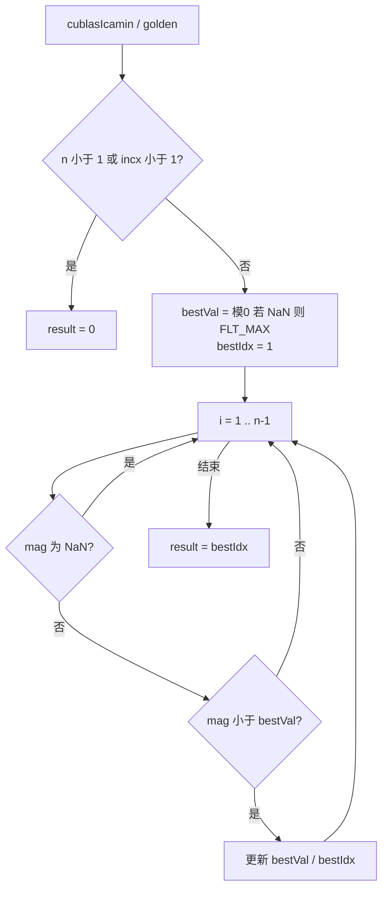
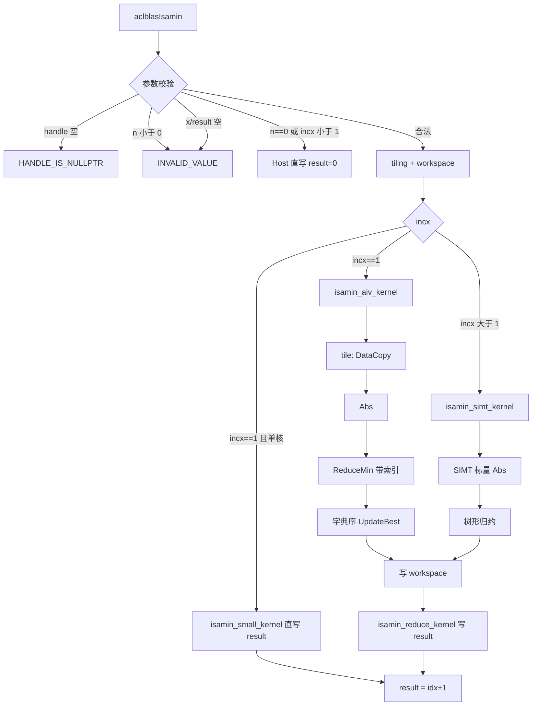
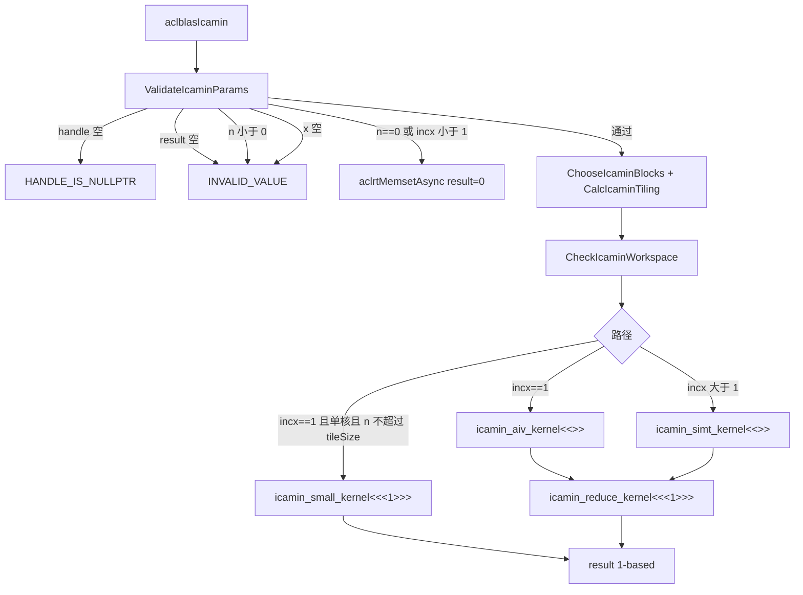
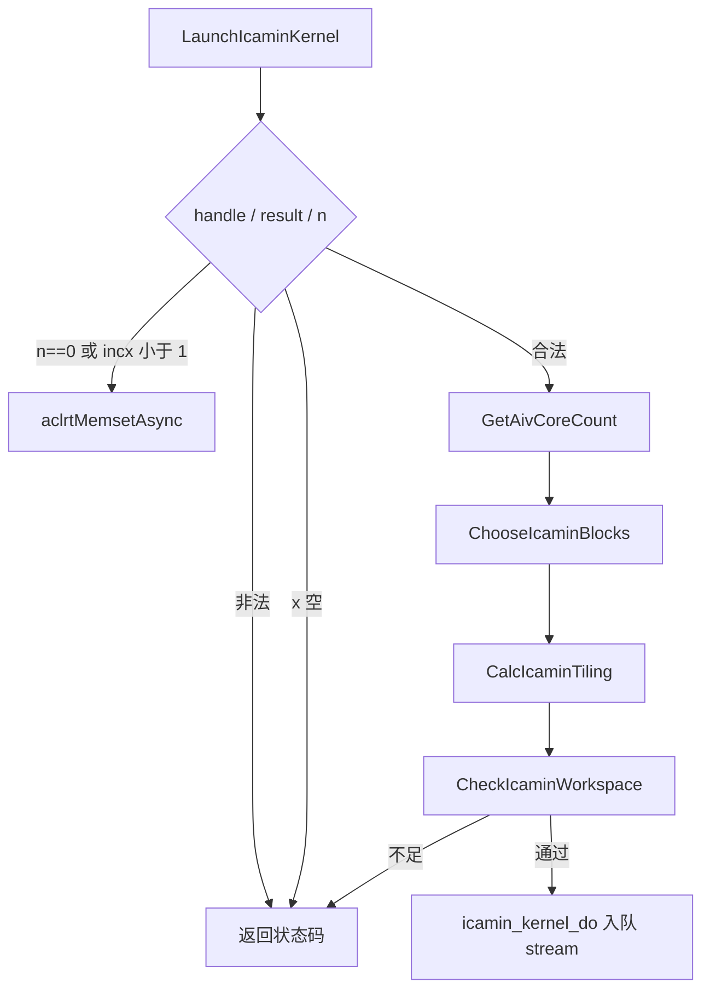
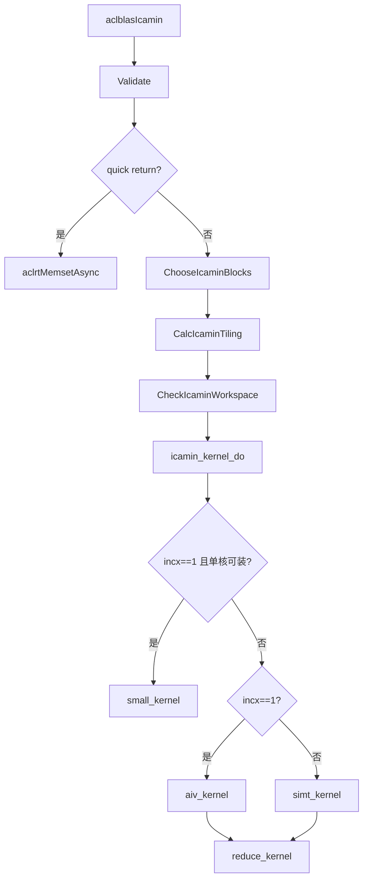
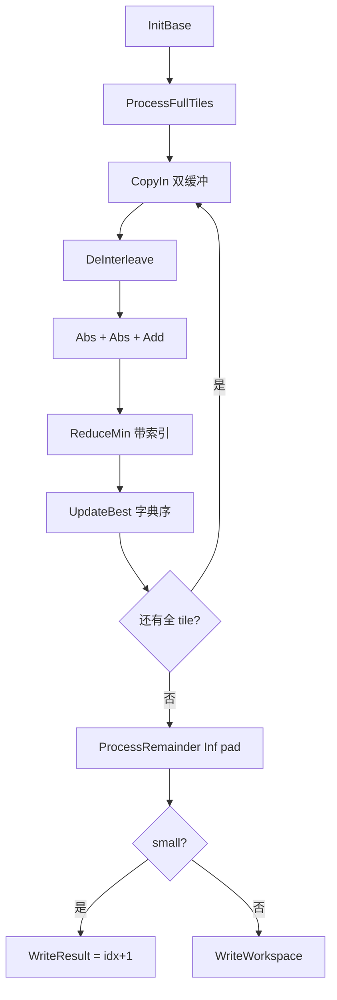
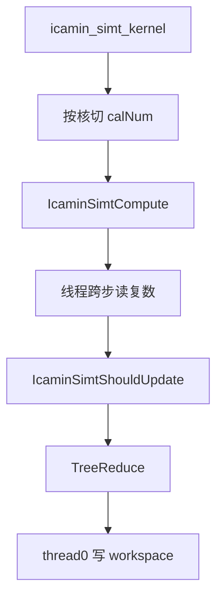

# 【社区任务】aclblasIcamin算子设计文档

| 项目 | 内容 |
| --- | --- |
| 算子 | `aclblasIcamin` |
| 任务 | 9 月社区任务-aclblasIcamin算子开发（950）（任务编号 58） |
| 目标硬件 | Ascend 950PR（arch35 / dav-3510） |
| CANN 版本 | 9.1.0 |
| 调用方式 | ops-blas 句柄式 **Kernel 直调**（非 ACLNN / 非 TBE / 非 PyTorch） |
| 代码仓 | [cann/ops-blas](https://gitcode.com/cann/ops-blas)，实现位于 `blas/iamin/arch35/` |
| 设计文档提交路径 | `04_tasks/01_community-task-2026/tasklist/09-58-aclblasIcamin-950/gcw_Xl4Jr2tu/docs/design.md` |
| PR 标题 | 【社区任务】aclblasIcamin算子设计文档 |
| 文档版本 | v1.1（2026-09-16，按审核表与当前实现） |

> 说明：本任务不是 TBE 算子改写，也没有 aclnn 接口。审核表中的「TBE 源码 / 算子信息库 / 结合 aclnn 判断文件」在 ops-blas 句柄式 BLAS 场景下 **不适用**。标杆取 **cuBLAS `cublasIcamin`**（语义）与仓内同族 **`aclblasIsamin` arch35**（实现框架与源码流程）。下文凡写「标杆」均指二者。

---

# 一、需求背景

## 1.1 需求来源

通过 CANN 社区任务完成开源仓算子贡献：在 Ascend 950PR 上使用 Ascend C 开发单精度复数向量最小模索引算子 `aclblasIcamin`，验收通过后合入 [cann/ops-blas](https://gitcode.com/cann/ops-blas)。

需求依据：

- 《aclblasIcamin 算子开发任务书》（Ascend 950PR / CANN 9.1.0）
- 社区任务流程：[2026 社区任务 README](https://gitcode.com/cann/cann-competitions/blob/master/04_tasks/01_community-task-2026/README.md)
- 设计文档模板：[design_template.md](https://gitcode.com/cann/cann-competitions/blob/master/04_tasks/01_community-task-2026/resources/design_template.md)
- 流程注意事项：https://gitcode.com/org/cann/discussions/39

## 1.2 背景介绍

`aclblasIcamin` 属于 BLAS Level 1 索引归约：在 COMPLEX64 向量中查找最小模元素的 **1-based** 索引。复数模按 BLAS icamin 惯例定义为 `|Re| + |Im|`（L1 模，非欧几里得模）；多个元素模相同时返回最小索引。

数学表达式：

```text
result = argmin_i (|Re(x[k])| + |Im(x[k])|),  i = 1..n,  k = 1+(i-1)*incx
```

输出为单个 INT32。比较在 IEEE 浮点语义下确定，归约顺序不影响最终索引，精度判定为与 golden **bit-exact**（`EXPECT_EQ`）。

### 1.2.1 aclblasIcamin 算子实现优化

审核表要求给出 **TBE 源码获取路径和算子信息库路径（需包含文件名，结合 aclnn 接口判断参考文件是否正确）**。本算子按任务书走 **Kernel 直调**，检索结论如下。

**aclnn 接口判断（用于确认有无 TBE 文件可参考）：**

| 检索文件 / 符号 | 位置 | 是否存在 | 判断 |
| --- | --- | --- | --- |
| `aclnnIcamin` / `aclnnIamin` | ops-nn / ops-math / ops-blas 公共头 | 不存在 | 无 aclnn 可反查 TBE |
| `aclblasIcamin` | `include/cann_ops_blas.h` | **任务启动时不存在，本任务新增** | 正确的接口落点是句柄式 BLAS，不是 aclnn |

**TBE 源码与算子信息库（模板路径，本任务均不存在对应文件）：**

| 类别 | 路径（含文件名） | 结论 |
| --- | --- | --- |
| TBE 实现 | `/usr/local/Ascend/ascend-toolkit/latest/opp/built-in/op_impl/ai_core/tbe/impl/icamin.py` | 无此文件 |
| TBE 实现 | `/usr/local/Ascend/ascend-toolkit/latest/opp/built-in/op_impl/ai_core/tbe/impl/iamin.py` | 无此文件 |
| TBE DSL | `/usr/local/Ascend/ascend-toolkit/latest/python/site-packages/tbe/dsl` | 不使用 |
| 算子信息库 | opp 内 icamin / iamin 的 ini、json 规格 | 无 icamin 条目 |

因此 1.2.2 的「与 TBE 源码逻辑完全一致」在本任务中落实为：**与仓内标杆 `aclblasIsamin` 的 Host/Kernel 源码流程一致**（见下表文件名），语义与 cuBLAS `cublasIcamin` 一致。

**实际参考文件（含文件名，已与 `aclblasIsamin` / 任务书接口核对）：**

| 角色 | 路径 / 文件名 | 用途 |
| --- | --- | --- |
| 语义标杆 | [cuBLAS `cublasIcamin`](https://docs.nvidia.com/cuda/cublas/index.html#cublas-t-amin) | 参数顺序、1-based 索引、`|Re|+|Im|` 模 |
| 标准 BLAS | [Netlib `isamin.f`](https://www.netlib.org/blas/isamin.f) | 仅实数同族；Netlib **无** `icamin.f` |
| 仓内标杆 Host | `blas/iamin/arch35/isamin_host.cpp` | 校验、tiling、workspace、发射 |
| 仓内标杆 Kernel | `blas/iamin/arch35/isamin_kernel.cpp` | AIV / Small / SIMT / Reduce |
| 仓内标杆 tiling | `blas/iamin/arch35/isamin_tiling_data.h` | 字段布局蓝本 |
| 仓内标杆头文件 | `blas/iamin/arch35/isamin_kernel.h` | `isamin_kernel_do` |
| 公共类型 | `include/cann_ops_blas_common.h` | `aclblasComplex { float real; float imag; }` |
| 公共声明 | `include/cann_ops_blas.h` | 新增 `aclblasIcamin`，禁止 950PR 私有平行接口 |
| 测试蓝本 | `test/isamin/isamin_param.h`、`test/isamin/arch35/isamin_test.cpp` | CSV + GTest |

本任务新增文件：

| 文件 | 说明 |
| --- | --- |
| `blas/iamin/arch35/icamin_host.cpp` | 参数校验、quick return、tiling、workspace、发射 |
| `blas/iamin/arch35/icamin_kernel.cpp` | AIV / Small / SIMT / Reduce kernel |
| `blas/iamin/arch35/icamin_kernel.h` | `icamin_kernel_do` |
| `blas/iamin/arch35/icamin_tiling_data.h` | `IcaminTilingData`，`COMPLEX64_MAX_DATA_COUNT=8192` |
| `test/iamin/icamin/` | CSV 驱动测试、CPU golden、NPU wrapper |

优化目标：在 950PR 上用 Ascend C 单遍读取 + 带索引 `ReduceMin` 完成连续路径，跨步走 SIMT，跨核二次归约合并 `(minVal, minIdx)`，性能不低于任务书 §3.3 标杆。

### 1.2.2 aclblasIcamin 算子现状分析

任务启动时：

- `include/cann_ops_blas.h` **没有** `aclblasIcamin` 声明。
- `blas/iamin/arch35/` 仅有实数 `aclblasIsamin`，无复数实现。
- 测试仓无 `test/iamin/icamin/`。
- 无 TBE/aclnn 既有实现可迁移。

#### 1.2.2.1 标杆算子支持的数据类型和数据格式

无独立 TBE 算子信息库。规格与《算子任务书》§2.4 参数表、cuBLAS `cublasIcamin` 及仓内 `aclblasComplex` **保持一致**：

| 对象 | 数据类型 | 逻辑排布 | 物理排布 |
| --- | --- | --- | --- |
| `x` | COMPLEX64（`aclblasComplex`，实部/虚部各 FP32） | 一维 `[n]` | `{real0, imag0, real1, imag1, ...}`，物理复数长度 `1+(n-1)*incx` |
| `n` / `incx` | INT32 Host 标量 | scalar | Host |
| `result` | INT32 | scalar | Device，4 字节 |
| `handle` | `aclblasHandle_t` | scalar | Host，携带 stream |

不支持：float16/bfloat16/double 复数、欧几里得模、负步长反向遍历、broadcast、非连续 Tensor 额外 leading dimension。

#### 1.2.2.2 标杆算子实现描述

**（1）cuBLAS 语义（本任务最高优先级语义来源）**

串行等价循环（cblas 风格，标准 cblas 无 icamin）：

```text
if n < 1 or incx < 1: result = 0
else:
    bestVal = |Re(x[0])| + |Im(x[0])|   # 若为 NaN 则置 FLT_MAX
    bestIdx = 1
    for i = 1 .. n-1:
        mag = |Re(x[i*incx])| + |Im(x[i*incx])|
        if mag 为 NaN: continue
        if mag < bestVal: bestVal, bestIdx = mag, i+1
    result = bestIdx
```

要点：1-based；并列取最小索引（严格小于才更新）；NaN 跳过。任务书相对 cuBLAS 的仓内差异：`n < 0` 返回 `ACLBLAS_STATUS_INVALID_VALUE`（cuBLAS 对 `n <= 0` 写 0）；`incx < 1` 不反向遍历。

**（2）仓内 `aclblasIsamin` arch35（实现蓝本，与源码一致）**

Host（`isamin_host.cpp`）：

1. `handle == nullptr` → `ACLBLAS_STATUS_HANDLE_IS_NULLPTR`
2. `n < 0` → `ACLBLAS_STATUS_INVALID_VALUE`
3. `n == 0` 或 `incx < 1`：若 `result != nullptr` 则 **Host 直写** `*result = 0`，返回成功（不检查 `x`）
4. `x == nullptr` / `result == nullptr` → `INVALID_VALUE`
5. `numBlocks = min(n, GetAivCoreCount())`
6. tiling：`perCoreN = n / numBlocks`，`lastCoreN = perCoreN + n % numBlocks`，`tileSize = FP32_MAX_DATA_COUNT`；`incx != 1` 时计算 SIMT `nthreads`
7. workspace 至少 `CeilAlign(numBlocks * 2, 64) * sizeof(float)`
8. `isamin_kernel_do` 在 `handle->stream` 上异步发射

Kernel（`isamin_kernel.cpp`，与源码一致）：

1. 连续路径 `IsaminAIVBase`：按 `blockIdx` 切 `[startOffset, startOffset+computeNum)`。全 tile 用 `DataCopy` 搬入 `tileSize` 个 FP32，原地 `Abs`，再 `ReduceMin(..., true)` 得到 `(tileMinVal, tileLocalIdx)`；尾块 `DataCopyPad`，pad 位模式 `0x7F800000`（+Inf）。NaN 用 `!(v != v)` 跳过，并列取更小全局下标。
2. `isamin_aiv_kernel` 将核内 `(bestVal, bestIdx 位模式)` 写入 workspace 槽 `blockIdx * 2`。
3. `isamin_small_kernel`：`incx == 1 && numBlocks == 1` 时直写 `result = bestIdx + 1`，不发射 reduce。
4. `incx > 1`：SIMT 按 `x[elem * incx]` 标量读绝对值，线程树归约后写 workspace。
5. `isamin_reduce_kernel` 单核读齐所有槽，按同样字典序合并，出口 `+1`。
6. 内部索引全程 0-based。UB 为单缓冲 `inBuf`（无 TQue），`REDUCE_REPEAT_BYTES = 256`。

#### 1.2.2.3 标杆算子实现流程图

cuBLAS / golden 串行语义：



仓内 `aclblasIsamin` arch35（与 `isamin_host.cpp` / `isamin_kernel.cpp` 源码一致，**本任务标杆流程图，重点**）：



---

# 二、需求分析

## 2.1 外部组件依赖

| 依赖 | 是否适配 | 说明 |
| --- | --- | --- |
| TBE / `tbe.dsl` | 否 | 非 TBE 改写 |
| ACLNN / `aclnn*` | 否 | 任务书要求句柄式 BLAS Kernel 直调 |
| PyTorch / 其他框架 | 否 | 不走框架适配 |
| cuBLAS | 语义对标，运行时不依赖 | golden 由测试工程 CPU 循环生成 |
| Netlib / cblas icamin | 无此例程 | 不链接第三方 BLAS |
| CANN Runtime（`aclrt*`） | 是 | stream、`aclrtMemsetAsync`、Device 内存 |
| Ascend C（`kernel_operator.h`、`ReduceMin`、`DataCopyPad`） | 是 | AIV 连续路径 |
| SIMT（`simt_api/asc_simt.h`） | 是 | `incx > 1` 跨步路径 |
| ops-blas handle / workspace | 是 | `GetEffectiveWorkspace` |

## 2.2 内部适配模块

| 模块 | 路径 | 适配内容 |
| --- | --- | --- |
| 公共 API | `include/cann_ops_blas.h` | 新增 `aclblasIcamin` 声明 |
| 公共类型 / 状态码 | `include/cann_ops_blas_common.h` | 复用 `aclblasComplex`、既有 `aclblasStatus_t` |
| Host 工具 | `common/helper/host_utils.h`、`aclblas_handle_internal.h` | 核数、workspace、stream |
| Kernel 常量 | `common/helper/kernel_constant.h` | `BUFFER_NUM=2`、`UB_SIZE=248KiB`、SIMT 线程上下限 |
| 同族实现 | `blas/iamin/arch35/isamin_*` | 分核、workspace 协议、ReduceMin 带索引、SIMT 树归约 |
| 测试框架 | `test/frame/`、`test/isamin/` | CSV、fill、GTest |
| 产品 README | `blas/iamin/README.md` | 标注 950PR 支持 |

不修改 `arch22` 及其他产品线实现。

## 2.3 需求模块设计

### 2.3.1 Ascend C 算子原型

除任务书明确的仓内差异外，接口与 cuBLAS `cublasIcamin` 逐参数对齐：

```cpp
aclblasStatus_t aclblasIcamin(
    aclblasHandle_t handle,
    int n,
    const aclblasComplex* x,
    int incx,
    int* result);
```

| 参数 | 方向 | 位置 | 语义 |
| --- | --- | --- | --- |
| `handle` | 入 | Host | 已创建句柄，携带 stream |
| `n` | 入 | Host | 逻辑复数个数，`n >= 0` |
| `x` | 入 | Device | COMPLEX64 只读向量 |
| `incx` | 入 | Host | 相邻逻辑元素步长，`incx >= 1` 才计算 |
| `result` | 出 | Device | 1-based 索引；quick return 写 0 |

`x`、`result` 为 Device 地址；调用成功只表示入队，读 `result` 前须同步 `handle` 绑定的 stream。

校验顺序（`ValidateIcaminParams` + `LaunchIcaminKernel`，与当前代码一致）：

| 顺序 | 条件 | 行为 |
| --- | --- | --- |
| 1 | `handle == nullptr` | `ACLBLAS_STATUS_HANDLE_IS_NULLPTR` |
| 2 | `result == nullptr` | `ACLBLAS_STATUS_INVALID_VALUE`（含 quick return，无法写 Device） |
| 3 | `n < 0` | `ACLBLAS_STATUS_INVALID_VALUE` |
| 4 | `n == 0` 或 `incx < 1` | `aclrtMemsetAsync(result, 0)`，不检查 `x`，不发射 Kernel，返回成功 |
| 5 | `x == nullptr` | `ACLBLAS_STATUS_INVALID_VALUE` |
| 6 | 核数查询失败 / workspace 不足 / stream 空 / memset 失败 | `INTERNAL_ERROR` 或 `EXECUTION_FAILED` / `INVALID_VALUE` |

相对 isamin 的有意差异：isamin 在 quick return 时 Host 直写 `*result` 且允许 `result == nullptr` 仍成功；icamin 的 `result` 必须是 Device 指针，统一 `aclrtMemsetAsync`，空指针一律报错。相对任务书：`n == 0` 且 `x == nullptr` 仍成功（quick return 优先于 `x` 检查），与配套 CSV 一致。

### 2.3.2 Ascend C 算子相关约束

相对标杆 cuBLAS / 相对「完整 BLAS 族」，本实现不覆盖：

| 相对对象 | 缺失或不做的功能 | 原因 |
| --- | --- | --- |
| cuBLAS | `n <= 0` 一律写 0 | 任务书要求 `n < 0` 返回 `INVALID_VALUE`，对齐 isamin README |
| cuBLAS 部分实现 | 负 `incx` 反向遍历 | 任务书：`incx < 1` quick return，本族不反向 |
| isamin | Host 直写 `result` | 950PR 上 `result` 为 Device，改 `aclrtMemsetAsync` |
| 通用复数 BLAS | double 复数 `izamin`、欧几里得模 | 任务书仅 COMPLEX64 + `|Re|+|Im|` |
| ACLNN / TBE | 算子信息库、broadcast、动态 shape 编译 | 非本任务模式 |
| 多产品线 | Atlas A2/A3、`arch22` | 任务书仅 950PR |

---

# 三、需求详细设计

## 3.1 调用方式

**Kernel 直调**（ops-blas 句柄式），不走 ACLNN，不走 PyTorch。

```text
应用 / GTest
  → aclblasIcamin(handle, n, x, incx, result)
    → ValidateIcaminParams
    → quick return: aclrtMemsetAsync(result)  或
    → CalcIcaminTiling + CheckIcaminWorkspace
    → icamin_kernel_do(..., handle->stream)
         icamin_small_kernel / icamin_aiv_kernel / icamin_simt_kernel
         [+ icamin_reduce_kernel]
  → 调用者 aclrtSynchronizeStream / Device 后读 result
```

测试封装 `aclblasIcamin_npu`（`test/iamin/icamin/icamin_npu_wrapper.h`）负责 Device 分配、H2D、调用、同步、D2H；**始终把 `result` 放在 Device**。

调用示例（与 `blas/iamin/README.md` 中 isamin 示例同构，复数输入）：

```cpp
aclblasHandle_t handle = nullptr;
aclblasCreate(&handle);
aclblasSetStream(handle, stream);

int n = 5;
int incx = 1;
aclblasComplex hX[5] = {{1.f, 0.f}, {-5.f, 1.f}, {3.f, 0.f}, {-4.f, 0.f}, {2.f, 0.f}};
aclblasComplex* dX = nullptr;
int* dResult = nullptr;
aclrtMalloc(reinterpret_cast<void**>(&dX), sizeof(hX), ACL_MEM_MALLOC_HUGE_FIRST);
aclrtMalloc(reinterpret_cast<void**>(&dResult), sizeof(int), ACL_MEM_MALLOC_HUGE_FIRST);
aclrtMemcpy(dX, sizeof(hX), hX, sizeof(hX), ACL_MEMCPY_HOST_TO_DEVICE);

aclblasIcamin(handle, n, dX, incx, dResult);
aclrtSynchronizeStream(stream);

int result = 0;
aclrtMemcpy(&result, sizeof(int), dResult, sizeof(int), ACL_MEMCPY_DEVICE_TO_HOST);
// result 为 1-based 最小模索引
```

## 3.2 需求总体设计

总体流程：



字典序合并规则（tile / 线程 / 跨核共用语义）：

```text
IsBetterMin(candVal, candIdx, bestVal, bestIdx, hasValue):
    若 candVal 为 NaN → false
    若 !hasValue → true
    若 candVal < bestVal → true
    若 candVal != bestVal → false
    否则 candIdx < bestIdx
```

该规则有结合律：任意分组归约等价于「跳过 NaN 后的最小模最小索引」。全 NaN 时各级不更新，出口 `bestIdx=0` 再 `+1` 得 `result=1`，与 golden「首元素 NaN 基准 FLT_MAX、无更新返回 1」一致。

SIMT 侧不能调用非 `__simt_callee__` 的 `IsBetterMin`，另实现 `IcaminSimtShouldUpdate`（控制流不同、比较语义相同）。

### 3.2.1 host 侧设计

入口：`aclblasIcamin` → `LaunchIcaminKernel`。Host 只做校验、切分、workspace 检查和发射，不做模计算。



tiling 结构（计数单位均为**复数元素**）：

```cpp
struct IcaminTilingData {
    uint32_t totalN;     // n
    uint32_t perCoreN;   // 前 useCoreNum-1 核
    uint32_t lastCoreN;  // 末核 = perCoreN + n % numBlocks
    uint32_t useCoreNum;
    uint32_t tileSize;   // COMPLEX64_MAX_DATA_COUNT = 8192
    uint32_t nthreads;   // incx>1 时使用，incx==1 为 0
    uint32_t incx;
};
```

#### 3.2.1.1 分核策略

```text
aivCoreNum = GetAivCoreCount()
numBlocks  = min(n, aivCoreNum)
若 incx == 1 且 n <= COMPLEX64_MAX_DATA_COUNT:
    numBlocks = 1          // 单核 small 直通，省 reduce 发射
perCoreN   = n / numBlocks
lastCoreN  = perCoreN + n % numBlocks
```

- 优先用满核：`n` 大于核数时 `useCoreNum = aivCoreNum`。
- 不能均分时余数给末核（`lastCoreN`），前核均为 `perCoreN`。
- `incx == 1` 且整段能装进一个 tile 时强制单核，避免「一核计算 + 一核 reduce」双发射开销。
- `incx > 1` 不走 small 直通，始终 `simt + reduce`。
- 每核处理逻辑区间 `[blockIdx * perCoreN, ...)`，末核长度为 `lastCoreN`。

#### 3.2.1.2 数据分块和内存优化策略

**核内切分（连续路径）**

`tileSize T = 8192` 个复数 = 16384 个 FP32。

| 符号 | 公式 |
| --- | --- |
| 全 tile 次数 | `repeatTimes = computeNum / T` |
| 尾块复数个数 | `remainNum = computeNum % T` |
| 尾块 FP32 个数 | `nFloat = remainNum * 2` |
| 尾块对齐 FP32 | `AlignUp(nFloat, ELEMENTS_PER_BLOCK * 2)`，且不少于一个 block 对 |
| 全 tile CopyIn | `copyBytes = T * 2 * 4 = 65536`，不 pad |
| 尾块 CopyIn | `DataCopyPad`，pad 值为 `+Inf` 位模式 `0x7F800000`，不参与最小值 |

全 tile 使用 TQue 双缓冲：先搬入第 0 块，循环内计算当前块的同时预取下一块，减少 MTE2 等待。

**LocalMemory / UB 预算（`IcaminAIVBase`，T=8192，`BUFFER_NUM=2`）**

平台 UB：`UB_SIZE = 248 * 1024` B。

| 缓冲 | 公式 | 大小 |
| --- | --- | --- |
| `inQueue_` | `BUFFER_NUM * T * 2 * 4` | 131072 B |
| `reBuf_` | `T * 4` | 32768 B |
| `imBuf_` | `T * 4` | 32768 B |
| `workBuf_` | `AlignUp(ceil(T / (VReg/4)), 8) * 4 + 32` | 约 544 B（VReg=256B 时） |
| `outBuf_` | 一个 UB block | 32 B |
| **合计** | | **约 197184 B ≈ 192.6 KiB < 248 KiB** |

模计算在 UB 内完成，不占 AIC/L1。`reBuf` 经 `DeInterleave` + `Abs` + `Add` 后即为模向量，供 `ReduceMin`。

**Workspace（GM，handle 提供）**

```text
totalFloats   = numBlocks * 2          // 每核 (minVal, idxBits)
alignedFloats = CeilAlign(totalFloats, 64)
requiredBytes = alignedFloats * 4
```

容量不足或指针空返回 `ACLBLAS_STATUS_EXECUTION_FAILED`。同一 handle 依赖 stream 顺序，不支持多 Host 线程无序复用。

**峰值内存（任务书 §3.4 写「不涉及」，交付件仍要求记录，按更严口径）**

| 类别 | 估算 |
| --- | --- |
| Device 输入 `x` | `8 * (1+(n-1)*incx)` 字节；最大性能 case n=4,194,304、incx=1 → 32 MiB |
| Device 输出 `result` | 4 字节 |
| handle workspace | `CeilAlign(2*numBlocks, 64) * 4` 字节，远小于默认 32 MiB |
| Host 测试侧 | 与 Device 输入同量级拷贝 + golden；配套约定不超过 4 GB |

**地址计算**

物理 FP32 下标 `2 * logical * incx` 在 SIMT 路径用 `uint32_t` 递推；`n` 为 INT32，任务配套 `n <= 2^24`，Host 不检查调用者实际分配长度。

#### 3.2.1.3 tilingKey 规划策略

**不设置 tilingKey。** 设置条件：Host 侧无需把「同一 kernel 内的编译期分支」编码进 key；路径选择在 Host 用不同 kernel 符号完成（与 isamin 相同）。

不使用 tilingKey 的原因：`incx`、核数、是否 small 直通都在 `icamin_kernel_do` 发射前已确定，三个入口函数即可，避免无意义的 key 组合。

| 条件 | 发射 |
| --- | --- |
| `incx == 1 && numBlocks == 1 && lastCoreN <= 8192` | `icamin_small_kernel<<<1>>>` |
| `incx == 1`（其余） | `icamin_aiv_kernel<<<numBlocks>>>` + `icamin_reduce_kernel<<<1>>>` |
| `incx > 1` | `icamin_simt_kernel<<<numBlocks>>>` + `icamin_reduce_kernel<<<1>>>` |

`nthreads`（仅 SIMT）：

```text
threadByData  = CeilDiv(perCoreN, SIMT_MIN_THREAD_NUM)     // 128
threadAligned = CeilAlign(threadByData, SIMT_MIN_THREAD_NUM)
nthreads      = min(threadAligned, SIMT_MAX_THREAD_NUM)    // 2048
```

### 3.2.2 kernel 侧设计

四个入口，全部 `KERNEL_TYPE_AIV_ONLY`：

| Kernel | 作用 |
| --- | --- |
| `icamin_aiv_kernel` | 连续多核：tile 归约写 workspace |
| `icamin_small_kernel` | 连续单核：直接写 `result = bestIdx + 1` |
| `icamin_simt_kernel` | 跨步：`asc_vf_call<IcaminSimtCompute>` |
| `icamin_reduce_kernel` | 单核读 workspace，字典序合并后写 `result` |

#### 3.2.2.1 kernel 侧实现描述

**连续路径（`IcaminAIV` / `IcaminAIVSmall` 共用 `IcaminAIVBase`）**

1. `InitBase`：按 `blockIdx` 计算 `startOffset`、`computeNum`；GM 绑定 `x` 为 `totalN * 2` 个 float；申请双缓冲 inQueue 与 re/im/work/out。
2. `ProcessFullTiles`：每次 CopyIn `2T` 个 FP32 → `FormModuli` → `ReduceModuli`。
3. `FormModuli`：`DeInterleave(re, im, in, nFloat)` → `Abs(re)` / `Abs(im)` → `Add(re, re, im)` 得到 T 个 `|Re|+|Im|`（全程 FP32）。
4. `ReduceModuli`：`ReduceMin(out, mod, work, nComplex, true)`；`out[0]` 为最小值，`out[1]` 为 tile 内索引位模式。若 `tileLocalIdx >= validNum`（尾块 pad）则丢弃；否则 `UpdateBest` 合并到核内 `(bestVal_, bestIdx_)`。
5. 尾块 `ProcessRemainder`：CopyIn 时 `+Inf` padding，`validNum = remainNum`，避免 pad 参与 argmin。
6. AIV 多核：`WriteWorkspace` 将 `(bestVal, bestIdx 位模式)` 以 8 字节 `DataCopyPad` 写入 `wsGM[blockIdx * 2]`。
7. Small：`WriteResult` 写 `bestIdx + 1` 到 Device `result`。

NaN：`IsBetterMin` 拒绝 `candVal != candVal`。若 `ReduceMin` 在某优化级别把 NaN 当作最小，随后 `UpdateBest` 仍会丢掉该候选；全 NaN 核保持 `hasValue_=false`。跨核 reduce 同样跳过 NaN。不依赖 `ReduceMin` 的 NaN 传播作为契约。

**跨步路径（`IcaminSimtCompute`）**

```text
for i = threadIdx.x; i < calNum; i += blockDim.x:
    elem = blockStartOffset + i
    fOff = elem * incx * 2
    mag  = |x[fOff]| + |x[fOff+1]|     // IcaminSimtAbsFloat
    若 IcaminSimtShouldUpdate: 更新线程局部 (bestVal, bestIdx)
写入 ubPartialVals/Idxs
IcaminSimtTreeReduce：2 的幂步长，IcaminSimtMergeNeighbor + asc_syncthreads
thread 0 写本核 workspace 槽
```

`__simt_callee__` 仅互相调用，禁止从 SIMT 调 AIV 的 `IsBetterMin`。

**跨核二次归约（`icamin_reduce_kernel`）**

单核把 `useCoreNum * 2` 个 FP32（按向量寄存器对齐）从 workspace CopyIn，标量循环 `IsBetterMin`；无有效值则 `bestIdx=0`；`result = bestIdx + 1`，`DataCopyPad` 写出 4 字节。

内部索引全程 0-based，仅出口 `+1`。

#### 3.2.2.2 Ascend C 实现流程图

Host + 发射：



连续 Kernel 核内：



SIMT Kernel：



#### 3.2.2.3 Ascend C 实现流程图与标杆算子流程图存在的差异

| 差异点 | 标杆（cuBLAS 语义 / isamin 实现） | 本算子 | 原因 |
| --- | --- | --- | --- |
| 编程模型 | cuBLAS 为 GPU 闭源；isamin 为 FP32 向量 | Ascend C AIV + SIMT，输入为交错 COMPLEX64 | 任务要求 950PR 原生实现 |
| 模计算 | cuBLAS：`|Re|+|Im|`；isamin：标量/向量 `Abs` | `DeInterleave` 后两路 `Abs` 再 `Add` | 复数 AoS，需拆实虚；保持 FP32 |
| 连续归约 | isamin 对 FP32 直接 `ReduceMin` | 先成形模量再 `ReduceMin(..., true)` | 归约对象是模不是原向量 |
| 单核直通条件 | isamin：`incx==1 && numBlocks==1` | 额外要求 `n <= tileSize`（Host 在 `n<=8192` 时已强制单核） | 小尺寸省 reduce 发射 |
| 分核 | isamin：`min(n, aivCoreNum)` | 连续小 n 强制 1 核 | 同上 |
| quick return 写 0 | isamin Host 直写 `*result` | `aclrtMemsetAsync` | `result` 是 Device |
| `result == nullptr` + quick return | isamin 仍 SUCCESS | `INVALID_VALUE` | Device 无法写空指针；任务书表「result 空则 INVALID」 |
| SIMT 比较函数 | isamin 可共用标量比较 | `IcaminSimtShouldUpdate` 与 `IsBetterMin` 拆分 | `__simt_callee__` 不能调普通 AIV 函数 |
| NaN | golden 跳过；`ReduceMin` 设备语义随优化级可能变化 | 软件侧 `IsBetterMin` 丢弃 NaN，不把指令 NaN 语义当契约 | 保证与 golden bit-exact |
| 产品范围 | cuBLAS 多 GPU | 仅 Ascend 950PR | 任务书硬件范围 |
| tilingKey | TBE 常用 | 无 | Kernel 直调按 `incx` 分符号即可 |

## 3.3 支持硬件

与任务书 §3.1 一致：

| 支持的芯片版本 | 涉及勾选 |
| --- | --- |
| Ascend 950PR | √ |
| Atlas 800I/T A2 | 不支持 |
| Atlas A3 | 不支持 |

CANN 9.1.0。公共声明可供后续产品线接入，本任务不实现其他 arch。

## 3.4 算子约束限制

1. 仅 COMPLEX64 输入、INT32 输出；不支持其他 dtype。
2. `handle` 不可空；`result` 必须为当前 Device 可访问的至少 4 字节地址。
3. `n >= 0`；`n < 0` 返回 `ACLBLAS_STATUS_INVALID_VALUE`。
4. `n == 0` 或 `incx < 1`（含 0 与负步长）quick return，写 `result=0`，不反向遍历，不检查 `x`。
5. `n > 0` 且 `incx >= 1` 时 `x` 不可空；物理长度至少 `1+(n-1)*incx` 个复数，由调用者保证。
6. 不支持 broadcast、动态 shape 编译、非连续 Tensor、原地更新。
7. 异步：依赖 `aclblasSetStream`；读回前须同步。
8. 禁止 950PR 私有平行 API；声明仅在 `include/cann_ops_blas.h`。
9. 配套测试约定单用例 Host 内存不超过 4 GB（`n <= 2^24`）。

---

# 四、特性交叉分析

| 交叉项 | 结论 |
| --- | --- |
| 与 `aclblasIsamin` / `aclblasIsamax` | 同目录、同 workspace 协议、同 1-based / 并列取最小索引；icamin 多实虚拆分与 Device memset |
| 与 axpy / nrm2 负步长 | 本族负步长不遍历，不改变其他族语义 |
| NaN / Inf / 全零 | NaN 跳过；Inf 按普通浮点比较；全零或全相同模返回 1 |
| quick return × 空指针 | `result` 空一律失败；`x` 空在 quick return 时成功 |
| 多核 × tie | 字典序保证跨 tile/跨核并列仍取全局最小索引 |
| stream × workspace | 主 kernel 与 reduce 同 stream 顺序执行；handle workspace 不可无序并发复用 |
| SIMT × AIV | 比较逻辑拆成两套函数，避免 `__simt_callee__` 调用普通 device 函数 |
| 构建类型 × 性能 | 性能验收须 Release；master 默认 Debug 会使 kernel 严重劣化（同仓 scnrm2 经验） |
| 精度 vs 性能 | 输出为离散索引，优化不得改变字典序与单遍读取原则 |

当前工程状态（截至 2026-09-16）：Host/CPU 路径已自测（GTest 无 kernel 542 条 + `cpu_formula_selftest.py`）；NPU AIV 因设备 Health=Alarm（`80CB8001`）未能跑通 kernel/性能 case，复位后按任务书补测。

---

# 五、可维护性分析

## 5.1 精度标准/性能标准

根据任务书 §3.2 / §3.3 与[生态算子开源精度标准](https://gitcode.com/cann/opbase/blob/master/docs/zh/ops_precision_standard/experimental_standard.md)填写。输入分量为 FLOAT32 档，输出为 INT32 索引，浮点阈值退化为精确相等。

### 5.1.1 精度标准

| 数据类型 | rtol | atol | required_matched_ratio | max_abs_error_limit |
| --- | --- | --- | --- | --- |
| COMPLEX64（分量 FLOAT32 档） | 2^-10 (9.77e-4) | 2^-16 (1.53e-5) | 0.99 | 1e-2 或 32 * ULP |

通过条件：`actual == golden`（1-based 索引逐位相等，`EXPECT_EQ`）。该用例通过则 matched_ratio = 1；任一用例不相等即失败。quick return 判定 `result == 0`。

Golden（`test/iamin/icamin/icamin_golden.h`）：

- 模：`fabs(real) + fabs(imag)`，严格 FP32，不得升 double 累加
- 首元素模为 NaN 时基准置 `FLT_MAX`，索引初值 1
- 后续 NaN 跳过；严格小于才更新索引（并列保留先出现者，即最小索引）
- `n < 1` 或 `incx < 1` 返回 0

| 验收标准 | 描述 | 标准来源 |
| --- | --- | --- |
| 整数索引 | `actual == golden` | 任务书 §3.2 |
| quick return | `n==0` 或 `incx<1` 时 `result==0` 且 SUCCESS | 任务书 §2.1 |
| NaN | 跳过模为 NaN 的元素；全 NaN 返回 1 | 任务书 Q7 |
| Inf | 按普通浮点值参与 `|Re|+|Im|` 比较 | 任务书 §3.5 |
| 并列 | 模相同返回最小 1-based 索引 | 任务书 §2.1 |

### 5.1.2 性能标准

测试设备：Ascend 950PR。数据为 COMPLEX64 平均单次耗时（Avg time，us）。须先 warmup 再有效采样 >50 次。本工程 `icamin_benchmark`：warmup 20 次 + 采样 64 次，ACL event 计时，打印 `[ICAMIN_PERF] avg_us=`。

| case | n | incx | 标杆耗时（Avg time，us） |
| --- | ---: | ---: | ---: |
| 1 | 1048576 | 1 | 24.77 |
| 2 | 2097152 | 1 | 24.59 |
| 3 | 4194304 | 1 | 29.69 |

其余 197 条 PF：`NPU_us <= gpu_baseline_ms * 1000 * 2.5`（与上表三行核对一致，即 H100 基线 × 2.5）。计时区不含 H2D、golden、日志。发布数据以 benchmark 的 `avg_us` 为准；官方 `verify_performance.py` 原件不改，仅作粗筛。

性能验收须 **Release** 构建。master 强制 Debug 会使 kernel 约一个数量级劣化，不能代表达标数据。

### 5.1.3 自验用例覆盖

`test/iamin/icamin/arch35/icamin_test.csv` 共 1200 条：

| 类别 | 前缀 | 条数 | 说明 |
| --- | --- | ---: | --- |
| L0 基础 | TC_L0 | 6 | n=1/8 × incx=1/2；全零 tie 期望索引 1 |
| L1 尺寸 | TC_SQ 等 | 38 | 1→2^20，质数 / 2 的幂 / ±1 / 非对齐，incx=1 |
| L2 步长 | TC_INC | 17 | 正步长计算 + 0/-1/-2/-3 quick return |
| L5 填充 | TC_FL | 12 | 均匀随机 / 全零 / 交替 / 极端值 / Inf / NaN |
| L6 边界 | TC_ED | 12 | n=0、负 n、x 空指针、quick return 优先组合 |
| EX 扩展 | TC_EX | 915 | 尺寸 × 步长 × 填充确定性采样 |
| PF 性能 | TC_PF | 200 | 含任务书 3 条典型 case，均为 incx=1 |

测试工程额外覆盖：`NullHandle`、`NullResult`、`CpuGoldenFormulaSamples`。CPU 公式脚本 `cpu_formula_selftest.py` 固化 tie / NaN / 步长。

任务书 §3.5.4 要求而 CSV 未完全覆盖的项（对齐偏移、正态分布 50%、跨 tile 大规模 tie）由后续自补用例补齐，不阻塞本设计文档合入。

截至 2026-09-16：无 kernel 路径 542/542 通过；AIV kernel / 200 条 PF 因 NPU Health=Alarm（`80CB8001`）未跑，复位后按 `docs/full_test_status.md` 补测。

## 5.2 兼容性分析

| 项目 | 结论 |
| --- | --- |
| API | 仅新增 `aclblasIcamin` 声明，签名与 cuBLAS 逐参数对齐 |
| ABI | `aclblasComplex`、`aclblasStatus_t`、handle/stream 不变 |
| 产品线 | 只编译进 `arch35`；`arch22` / A2 / A3 行为不变 |
| 同族语义 | `n<0` 报错、负步长 quick return 与 isamin README 一致；不影响 axpy/nrm2 负步长遍历 |
| 调用约定 | `result` 为 Device INT32；调用成功只表示入队，同步责任与仓内其他句柄式接口一致 |
| 依赖 | 不新增生产三方库；测试不修改官方 `verify_*.py` 原件 |
| 并发 | 同一 handle workspace 依赖 stream 顺序，不支持多线程无序复用 |

本算子为新增接口，无存量 `aclblasIcamin` 行为需要保持二进制兼容。

## 5.3 可维护性补充

- Host 校验、tiling、AIV/Small/SIMT/Reduce、golden 分文件；与 isamin 同目录、同字段名，降低族内维护成本。
- tiling 一律以复数元素计数；物理 FP32 下标只在 CopyIn / SIMT 换算点出现，防止 `n` 与 `2*n` 混用。
- SIMT 与 AIV 比较函数拆分并注释原因（`__simt_callee__` 限制），避免后续合并时再次触发编译错误。
- 测试走仓内 CMake + CSV（`--ops=icamin`），README 给出复现步骤。
- 自测报告使用任务指定腾讯文档模板，记录设备、CANN 版本、构建类型、采样方法、原始日志。

## 5.4 交付件与本地文件

| 交付件 | 内容 | 完成条件 |
| --- | --- | --- |
| 设计文档 | 本文 `design.md` | 提交 cann-competitions tasklist PR，评审合入 |
| 算子与测试代码 | `blas/iamin/arch35/icamin_*`、`test/iamin/icamin/`、公共声明、README | fork 分支 `feat/aclblas-icamin-arch35` 可构建 |
| 自测报告 | 精度 / 性能 / 内存占用 / 截图 | 任务指定表格；kernel 用例须在 NPU Health=OK 后补齐 |
| 待验收地址 | 个人仓、分支、算子目录 | 邀请 `Ascend-CANN` 为开发者 |

实现文件清单：

| 路径 | 角色 |
| --- | --- |
| `include/cann_ops_blas.h` | 公共声明 |
| `blas/iamin/arch35/icamin_host.cpp` | Host |
| `blas/iamin/arch35/icamin_kernel.cpp` | Kernel |
| `blas/iamin/arch35/icamin_kernel.h` | 发射声明 |
| `blas/iamin/arch35/icamin_tiling_data.h` | tiling |
| `blas/iamin/README.md` | 产品支持与约束 |
| `test/iamin/icamin/icamin_golden.h` | CPU golden |
| `test/iamin/icamin/icamin_npu_wrapper.h` | Device 封装 |
| `test/iamin/icamin/icamin_param.h` | CSV 参数 |
| `test/iamin/icamin/cpu_formula_selftest.py` | 公式自测 |
| `test/iamin/icamin/arch35/icamin_test.cpp` | GTest |
| `test/iamin/icamin/arch35/icamin_test.csv` | 1200 条用例 |
| `test/iamin/icamin/arch35/icamin_benchmark.cpp` | 性能计时 |

## 附录 A 审核表对照（设计文档 PR / 设计文档内容）

| 审核项 | 本文落点 | 结论 |
| --- | --- | --- |
| 必须是 PR 不是 issue | 向 cann-ops-competitions / cann-competitions 提 PR | 合入前由作者创建 PR |
| 提交到 tasklist 对应位置 | `09-58-aclblasIcamin-950/gcw_Xl4Jr2tu/docs/design.md` | 9 月任务编号 58 |
| CLA 签署 + CI（pr评论/compile） | 作者用 CLA 邮箱提交；通过网页 PR 时默认邮箱须一致 | 见提交流程 |
| 标题 `【社区任务】${算子名称}算子设计文档` | 【社区任务】aclblasIcamin算子设计文档 | 已按示例对齐 |
| 1.1 需求来源 | 第一章 1.1 | 社区任务开源贡献 |
| 1.2.1 TBE 路径 + 文件名 + aclnn 判断 | 1.2.1 检索表 | 无 TBE/aclnn 文件；列出核对过的 isamin/头文件名 |
| 1.2.2.1 与信息库一致 | 1.2.2.1 | 无信息库，与任务书 §2.4 一致 |
| 1.2.2.2 标杆实现描述与源码一致 | 1.2.2.2 | 按 `isamin_host.cpp` / `isamin_kernel.cpp` |
| 1.2.2.3 标杆流程图（重点） | 1.2.2.3 mermaid | 与 isamin 源码路径一致 |
| 2.1 / 2.2 内外部依赖 | 二章 | 已填实际适配项 |
| 2.3.1 原型 / 约束 | 2.3.1 / 2.3.2 | 除任务书差异外对标 cuBLAS |
| 3.1 调用方式 | Kernel 直调 | 非 ACLNN / 非 PyTorch |
| 3.2.1.1–1.3 分核 / UB 公式 / tilingKey | 3.2.1 | 含计算公式；明确无 tilingKey |
| 3.2.2.1–2.3 Kernel 描述、流程图、差异原因（重点） | 3.2.2 | 含 mermaid 与差异表 |
| 3.3 支持硬件 | 仅 Ascend 950PR | 与任务书一致 |
| 3.4 约束限制 | 3.4 | dtype / 步长 / 空指针等 |
| 四、特性交叉 | 第四章 | 已填 |
| 5.1 精度/性能 | 5.1 | 按任务书 §3.2 / §3.3 |
| 5.2 兼容性 | 5.2 | 新增接口，arch35 only |

# 参考资料

1. [社区任务设计文档模板](https://gitcode.com/cann/cann-competitions/blob/master/04_tasks/01_community-task-2026/resources/design_template.md)
2. [2026 社区任务参与及 PR 流程](https://gitcode.com/cann/cann-competitions/blob/master/04_tasks/01_community-task-2026/README.md)
3. [cann/ops-blas](https://gitcode.com/cann/ops-blas)
4. [cuBLAS cublasIcamin](https://docs.nvidia.com/cuda/cublas/index.html#cublas-t-amin)
5. [Netlib isamin.f](https://www.netlib.org/blas/isamin.f)
6. [生态算子开源精度标准](https://gitcode.com/cann/opbase/blob/master/docs/zh/ops_precision_standard/experimental_standard.md)
7. 《aclblasIcamin 算子开发任务书》及配套测试材料
