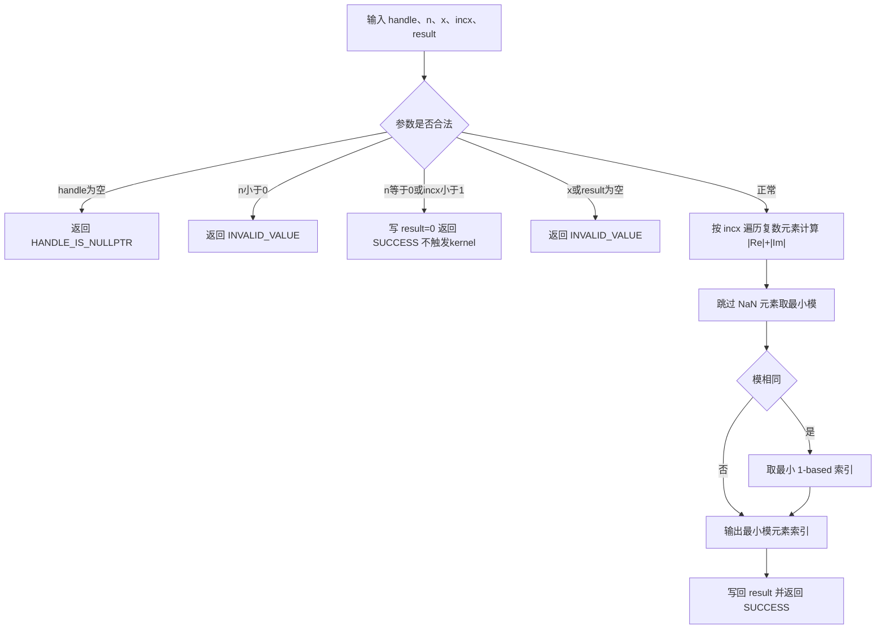

# 【社区任务】aclblasIcamin算子设计文档

## 需求背景（required）

### 需求来源

本需求来源于"9月社区任务-aclblasIcamin算子开发（950）"社区任务。任务要求基于 `cann/ops-blas` 开源仓，使用 Ascend C 编程语言为 Ascend 950PR 实现单精度复数向量最小模元素索引接口 `aclblasIcamin`，完成设计、开发、精度验证、性能验证及开源合入。

目标验收环境为 CANN 9.1.0，950PR 对应 `arch35`，实现代码与同族实数接口 `aclblasIsamin` 同目录（`blas/iamin/arch35/`）。

对标接口为 cuBLAS `cublasIcamin`，目标接口声明如下（新增声明放入 `include/cann_ops_blas.h`）：

```cpp
aclblasStatus_t aclblasIcamin(
    aclblasHandle_t handle,
    int n,
    const aclblasComplex* x,
    int incx,
    int* result);
```

### 背景介绍

#### aclblasIcamin算子功能

`aclblasIcamin` 用于查找单精度复数向量中最小模元素的 1-based 索引：

```text
result = argmin_i ( |Re(x[k])| + |Im(x[k])| )
i = 1..n,  k = 1 + (i-1)*incx
```

其中：

- `x` 为包含 `n` 个逻辑元素的 complex64 向量，实部/虚部各 float32、交错存储；
- 复数"模"按 BLAS icamin 惯例定义为 `|Re| + |Im|`，**不是**欧几里得模 `sqrt(Re^2+Im^2)`；
- 结果为 1-based 索引（兼容 Fortran 惯例）；多个元素模相同时返回**最小索引**；
- 输出为单个 INT32 整数标量（Device 内存），精度判定为与 golden **精确一致（bit-exact 整数比对）**。

#### 标杆及同族算子实现现状分析

本任务对标接口为 cuBLAS `cublasIcamin`，不是对已有 TBE 算子的改写，不存在需要保持一致的 TBE 源码路径。标准参考 BLAS（Netlib）无 icamin 例程，语义细节以 cuBLAS 官方文档为最高优先级来源，golden 由测试工程内 cblas 风格的 CPU 参考循环生成。

当前 `ops-blas` 仓中已有实数同族接口 `aclblasIsamin`，950PR 实现位于 `blas/iamin/arch35/`。该实现提供了本任务可直接复用的完整归约框架：

| 参考算子 | 可复用设计 | icamin 需扩展的部分 |
| --- | --- | --- |
| `aclblasIsamin`（arch35） | Host 参数校验顺序与 quick return、分核策略（perCoreN/lastCoreN 连续段）、多核+workspace 二阶段归约、ReduceMin(value,index) 配对归约、SIMT 步长路径、尾块 DataCopyPad 补齐 | 输入为 complex64 交错存储，模计算需先做 `|Re|+|Im|` 配对求和；tile 内索引到复数元素的映射 |
| `aclblasCsyr` 等复数算子 | complex64 实虚交错向量处理经验 | 本算子为只读归约，无矩阵更新 |

标杆语义流程如下：



#### aclblasIcamin输入输出规格

| 参数 | 含义 | 数据位置/类型 | 约束 |
| --- | --- | --- | --- |
| handle | ops-blas 上下文句柄，携带 stream | Host，`aclblasHandle_t` | 非空 |
| n | 复数元素个数 | Host，int | `n >= 0` |
| x | 输入复数向量 | Device，complex64 | 物理长度至少 `1+(n-1)*\|incx\|` |
| incx | x 的复数元素步长 | Host，int | `incx >= 1` 正常计算；`incx < 1` 为 quick return |
| result | 最小模元素 1-based 索引 | Device，INT32 标量 | quick return 时为 0，否则 `[1, n]` |

## 需求分析（required）

### 需求描述

在 Ascend 950PR 上实现 `aclblasIcamin`。接口行为与任务书及 cuBLAS `cublasIcamin` 对齐：支持 complex64、正步长 `incx`、`|Re|+|Im|` 模定义、1-based 索引与 tie 取最小索引语义，并满足规定的异常返回、quick return、bit-exact 精度和性能要求。

### 需求拆解

1. 在公共头文件 `include/cann_ops_blas.h` 中新增 `aclblasIcamin` 声明，不定义 950PR 私有平行接口。
2. 在 `blas/iamin/arch35/` 中实现 Host API、tiling 数据和 Ascend C kernel，与同族 `aclblasIsamin` 共目录。
3. 支持 complex64 交错存储的 `|Re|+|Im|` 模计算，非欧几里得模。
4. 支持正步长 `incx >= 1`（1/2/3 等）；`incx < 1`（含 0 与负步长）为合法 quick return，本族不反向遍历向量。
5. 支持 `n == 0` 的成功快速返回（result 写 0，不触发 kernel）。
6. 完成 handle、n、x、result 参数校验并返回规定状态码；`n < 0` 返回 `ACLBLAS_STATUS_INVALID_VALUE`。
7. 多元素模相同时严格返回最小 1-based 索引；NaN 元素跳过（首元素为 NaN 时基准置 FLT_MAX），全 NaN 输入行为按事实表开放问题 Q7 确认结论对齐。
8. 保持基于 handle 绑定 stream 的异步执行语义，读回 Device 结果前由调用方同步 stream。
9. 在 `test/iamin/icamin/arch35/` 建立 CSV 驱动测试，参照 `test/isamin/` 工程模式，golden 为测试工程内 CPU 参考循环。
10. 精度满足整数索引 bit-exact 精确比对；性能满足任务书给出的三个标杆 case（warmup 后采样 >50 次取平均）。
11. 算子 README 产品支持表标注 Ascend 950PR：支持；测试 README 说明可复现的测试步骤。
12. 不要求框架 dynamic shape 适配、broadcast、原地更新与确定性计算（索引结果在语义上确定，不依赖归约顺序）。

### 外部组件依赖

不新增第三方组件依赖。算子依赖目标环境已有的 CANN Runtime、Ascend C 编译器以及 `ops-blas` 公共构建基础设施；精度 golden 由测试工程自行实现的 cblas 风格循环生成（标准 cblas/Netlib 无 icamin 例程）。

### 内部适配模块

| 模块 | 适配内容 |
| --- | --- |
| `include/cann_ops_blas.h` | 新增公共接口 `aclblasIcamin` 声明 |
| `blas/iamin/arch35/` | 新增 Host、tiling 数据及 Ascend C kernel（icamin_host.cpp / icamin_kernel.cpp / icamin_kernel.h / icamin_tiling_data.h） |
| handle 公共模块 | 复用 handle 中的 stream 与 workspace，保持句柄式 BLAS 调用语义 |
| Host 公共辅助模块 | 复用核数查询（GetAivCoreCount）、workspace 获取与状态码约定 |
| `test/iamin/icamin/arch35/` | 新增 CSV 驱动测试、C++ GTest 和自实现 golden |

接口参数、返回值、调用顺序和公共头文件风格均与 `aclblasIsamin` 及 `ops-blas` 现有规范对齐。

## 详细设计（required）

### 调用方式

采用任务书指定的 Ascend C kernel 直调方式。用户调用 `aclblasIcamin` Host API；Host API 完成校验和 tiling，取得 handle 绑定的 stream 后异步启动 `arch35` kernel。不新增 ACLNN、PyTorch 或图模式算子入口。

```text
用户程序 -> aclblasIcamin Host API -> 参数校验/tiling -> handle stream -> Ascend C kernel -> result
```

### 算子分析

#### 数学公式

对每个逻辑元素 `i = 1..n`（0-based 逻辑序号 `j = i-1`，物理下标 `k = j*incx`）：

```text
value(j) = |Re(x[k])| + |Im(x[k])|
result   = 1 + argmin_j value(j)      （value 相同时取最小 j）
```

`|Re|+|Im|` 在 IEEE 浮点语义下是确定的离散比较量，归约/分块顺序不影响最终索引，支持 bit-exact 判定。

#### 支持数据类型

| 对象 | 数据类型 |
| --- | --- |
| x | `aclblasComplex`（COMPLEX64，实部/虚部 float32 交错存储，n 个复数对应 2n 个 float） |
| result | INT32 |

#### 支持形状和存储

- x 逻辑一维 `[n]`，物理长度至少 `1+(n-1)*|incx|`；
- 不涉及 leading dimension、非连续 Tensor 与 broadcast 语义。

#### 参数校验与快速返回

参数处理顺序与同族 `aclblasIsamin` 一致：

1. `handle == nullptr`：返回 `ACLBLAS_STATUS_HANDLE_IS_NULLPTR`；
2. `n < 0`：返回 `ACLBLAS_STATUS_INVALID_VALUE`；
3. `n == 0` 或 `incx < 1`：写 `result = 0`，返回 `ACLBLAS_STATUS_SUCCESS`，不触发 kernel；
4. 有效计算场景下 `x == nullptr` 或 `result == nullptr`：返回 `ACLBLAS_STATUS_INVALID_VALUE`。

quick return 的 `result = 0` 写入不采用 Host 侧直接解引用 Device 指针的方式，通过 handle 绑定 stream 的异步清零机制（如 `aclrtMemsetAsync` 4 字节）完成，保持"不触发 kernel"与异步语义；具体写入方式遵循仓内同族实现约定，以评审结论为准。

### 算子实现

#### 实现方案

##### 3.2.1 Host侧设计

Host 侧负责参数校验、获取 handle 绑定的 stream、查询 AIV 核数、生成轻量 tiling 并按路径启动 kernel。tiling 数据设计与 `IsaminTilingData` 同构：

```cpp
struct IcaminTilingData {
    uint32_t totalN;    // 复数元素总数
    uint32_t perCoreN;  // 前 useCoreNum-1 个核的元素数
    uint32_t lastCoreN; // 最后一个核的元素数（含余数）
    uint32_t useCoreNum;
    uint32_t tileElems; // 单次搬入 UB 的复数元素数
    uint32_t nthreads;  // SIMT 路径线程数（incx != 1 时使用）
    uint32_t incx;
};
```

###### 1. 分核策略

`numBlocks = min(n, GetAivCoreCount())`，`perCoreN = totalN / numBlocks`，`lastCoreN = perCoreN + totalN % numBlocks`。每个核负责一段**连续的逻辑元素区间**（incx != 1 时按逻辑区间做跨步访存），与 isamin 一致。

###### 2. 数据分块与UB规划

单核内按 `tileElems` 个复数元素分块搬入。tile 上限由两个约束决定：

- ReduceMin 单次归约的值数量上限（repeat 次数 <= 255，float 每 repeat 64 个值，即 <= 16320 个值）；
- 单核 UB 容量：输入交错缓冲 `2*tileElems` 个 float、模值缓冲 `tileElems` 个 float、归约 work 缓冲及输出缓冲。

初始 `tileElems` 取 16320 并按 UB 编译检查下调，最终值以 950PR 编译与实测为准。尾块使用 `DataCopyPad` 补齐，填充值取 `+Inf`（0x7F800000），保证填充元素在 argmin 中永远不会胜出。

###### 3. 路径规划

Host 侧按 isamin 同构的三路径启动：

| 条件 | 启动方式 |
| --- | --- |
| `incx == 1` 且 `numBlocks == 1` 且 `n <= tileElems` | 单核小规模 kernel，直接写 result |
| `incx == 1` 一般场景 | 多核归约 kernel（各核写 workspace）+ 单核 reduce kernel |
| `incx >= 2` | SIMT 跨步 kernel（各核写 workspace）+ 单核 reduce kernel |

workspace 复用 handle workspace，大小为 `numBlocks * 2` 个 float（每核一对 `{minVal, minIdx}`，索引按 float 位模式存储），按 64 float 对齐，与 isamin 一致。

##### 3.2.2 Kernel侧设计

kernel 包含 Init 和 Process 阶段。多核路径下 Process 按 CopyIn、Compute、写 workspace 组织；reduce kernel 单核完成最终归约。

###### 1. Init

- 读取 tiling，按 blockIdx 计算本核逻辑区间 `[blockId*perCoreN, +computeNum)`；
- 建立 x、workspace（或 result）的 GlobalTensor；
- 初始化 UB 缓冲与 `bestVal=FLT_MAX / bestIdx=0 / hasValue=false`。

###### 2. CopyIn

- `incx == 1`：按 tile 连续 `DataCopy` 交错 complex64（`2*tileElems` 个 float）；
- 尾块 `DataCopyPad` 补 `+Inf`；
- `incx >= 2`（SIMT 路径）：不整块搬运，线程直接按步长读 GM。

###### 3. Compute（连续路径，向量实现）

对每个 tile 执行三步向量计算：

```text
① Abs：对交错的 2*tileElems 个 float 全部取绝对值；
② 配对求和：value[j] = abs[2j] + abs[2j+1]，用 stride-2 二元加法完成
   （src0/src1 按 2 元素跨步取偶/奇分量，目的连续），得到 tileElems 个 |Re|+|Im| 值；
③ ReduceMin(out, value, work, tileElems, true)：返回 (tileMinVal, tileLocalIdx)。
```

随后标量更新本核最优（与 isamin 相同的守卫逻辑）：

```text
tileMinVal 非 NaN 且
  ( !hasValue || tileMinVal < bestVal
    || (tileMinVal == bestVal && tileGlobalIdx < bestIdx) )
→ 更新 bestVal / bestIdx = coreStart + tileOffset + tileLocalIdx
```

NaN 守卫保证含 NaN 的 tile 不污染结果；tile 内有效元素仍正常参与（配对求和后 NaN 值在 ReduceMin 中按 NaN 语义处理，标量层统一跳过）。

###### 4. 写 workspace / 写 result

- 多核路径：每核将 `{bestVal, bestIdx 位模式}` 写入 `workspace[blockId*2]`；
- 小规模路径：单核直接 `result = bestIdx + 1`。

###### 5. Reduce kernel（二阶段归约）

单核读回全部 `{val, idx}` 对，标量循环选最小值（tie 取最小 idx，NaN 跳过），`result = bestIdx + 1`（1-based）；无有效值时输出 0（全 NaN 输入的最终口径以事实表 Q7 确认结论为准，与 golden 保持一致）。

###### 6. SIMT 跨步路径（incx >= 2）

与 isamin 的 `asc_vf_call` 框架同构：每线程按 `(blockStart + i) * incx` 跨步读 GM 复数元素，标量计算 `|re| + |im|`（NaN 跳过、tie 取小全局索引），block 内树形归约后由 0 号线程写 workspace 槽位，再由 reduce kernel 汇总。`nthreads = min(CeilAlign(perCoreN/SIMT_MIN), SIMT_MAX)`。

Ascend C 实现流程如下：

```text
Host 参数校验（handle → n → quick return → x/result）
  ├─ n==0 或 incx<1 ──> 经 stream 写 result=0，返回 SUCCESS（不触发 kernel）
  └─ 合法 ──> 查询 AIV 核数，生成 tiling，按规模与步长选择路径
        ├─ 单核可容纳 ──> icamin_small_kernel（单核直出 result）
        ├─ incx==1 ────> icamin_aiv_kernel（多核各写 workspace）
        └─ incx>=2 ────> icamin_simt_kernel（跨步标量归约写 workspace）
              多核路径统一接 icamin_reduce_kernel（单核归约写 result）
        全部路径 ──> 返回 SUCCESS

单 tile 计算（icamin_aiv_kernel 每核循环体）：
  CopyIn 交错 complex64 → Abs 全部分量 → stride-2 配对求和得模值
  → ReduceMin 取值和局部索引 → 标量 tie/NaN 更新 best
```

与标杆语义流程相比，Ascend C 实现增加了 Host tiling、多核区间划分、workspace 二阶段归约和 GM/UB 分块搬运。这些差异只改变执行组织，不改变数值语义；索引型归约的离散比较在任意分块顺序下结果确定。

#### 测试设计

在 `test/iamin/icamin/arch35/` 新增 CSV 驱动测试，工程结构参照 `test/isamin/`（param 头文件解析 CSV 列 `n / incx / x`，`x` 列写 `NULLPTR` 表示空指针负向用例）。Golden 为测试工程内 cblas 风格 CPU 参考循环：

```text
best = FLT_MAX; idx = 0
for j in [0, n):
    v = |Re(x[j*incx])| + |Im(x[j*incx])|
    if v 非 NaN and v < best:  best = v; idx = j   （严格小于保最小索引）
golden = idx + 1
```

精度比对为 `EXPECT_EQ`（NPU 输出索引与 golden 整数精确相等）。测试覆盖：

1. n=0、1、小质数（2/3/5/7）、2 的幂及 2 的幂±1、非对齐尺寸，直至 >=2^20；
2. incx=1/2/3 正步长；incx=0/-1/-2/-3 quick return（期望 SUCCESS 且 result=0）；
3. 负 n（期望 INVALID_VALUE）、x 空指针（期望 INVALID_VALUE）；
4. 填充模式：均匀分布 [-5,5] 与正态分布各 50%、全零（tie 语义，期望索引 1）、正负交替、极端值、Inf/NaN 特殊值；
5. 随任务提供的 1200 条 CSV（1000 精度 + 200 性能，TC_PF 前缀）作为下限，未覆盖场景自行补充并在测试 README 列明；
6. 性能：3 个任务书标杆 case（n=1048576/2097152/4194304，incx=1），warmup 后有效采样 >50 次取平均，比对 `gpu_baseline.csv` 标杆值；
7. 使用任务提供的 `verify_accuracy.py` / `verify_performance.py` 驱动编译、执行与 PASS/FAIL 解析。

### 支持硬件

| 支持的芯片版本 | 涉及勾选 |
| --- | --- |
| Ascend 950PR | √ |

（950DT 支持标注与同族 isamin 口径一致，随实测结论在 README 产品支持表中标注。）

### 算子约束限制

1. 仅支持 `aclblasComplex`（COMPLEX64）输入、INT32 索引输出。
2. 仅支持 `incx >= 1`；`incx < 1` 为 quick return（result=0），本族不反向遍历向量（与 axpy/nrm2 族不同）。
3. `n < 0` 返回 `ACLBLAS_STATUS_INVALID_VALUE`（对齐仓内 isamin README 约束）。
4. 模定义为 `|Re|+|Im|`（BLAS icamin 惯例），非欧几里得模。
5. NaN 元素跳过；全 NaN 输入行为以事实表 Q7 确认结论为准。
6. n 是运行时参数，不要求框架层 dynamic shape 支持；不涉及广播、原地更新。
7. 读回 result 前须同步 handle 绑定的 stream。

## 特性交叉分析

| 特性 | 是否涉及 | 分析结论 |
| --- | --- | --- |
| 动态 shape | 否 | n、incx 是运行时标量，不涉及框架图模式 dynamic shape 适配 |
| 空 Tensor/no-op | 是 | n=0 或 incx<1 成功返回，result 写 0，不触发 kernel |
| 广播 | 否 | 单向量归约到标量索引 |
| 非连续内存 | 有限支持 | 仅支持接口定义的 incx 步长，不扩展到任意 Tensor stride |
| 原地更新 | 否 | x 只读，result 为独立输出标量 |
| 确定性 | 是 | 整数索引结果语义确定，归约/分块顺序不影响 bit-exact 判定 |
| Inf/NaN | 是 | NaN 跳过；Inf 作为可比值正常参与比较；尾块填充 +Inf 不胜出 |
| 对齐与尾块 | 是 | complex64 按 32 字节整块搬运，尾块 DataCopyPad 补 +Inf 防越界且不污染 argmin |
| 多 stream | 是 | 只使用 handle 绑定 stream，不使用全局同步 |
| Host/Device scalar | 否 | n/incx 为 Host 标量入参，x/result 为 Device 指针，无标量读回需求 |

## 可维可测分析

### 精度标准/性能标准

| 验收标准 | 描述(不涉及说明原因) | 标准来源 |
| --- | --- | --- |
| 精度标准 | 输出 INT32 索引与 golden **精确一致（bit-exact，EXPECT_EQ）**；生态精度标准 FLOAT32 档阈值对本算子退化为单值精确判定 | 任务书 §3.2 及生态算子开源精度标准 |
| 性能标准 | Ascend 950PR，warmup 后采样 >50 次取平均：n=1048576 ≤24.77us；n=2097152 ≤24.59us；n=4194304 ≤29.69us（均 incx=1） | aclblasIcamin 950PR 任务书 §3.3 |

性能测试只统计算子/kernel 的有效执行时间，不把 Host 数据准备、CPU golden 和结果比对计入；参考性能用例与 `gpu_baseline.csv` 关联比对，基线缺失的用例仅采集不判定。

### 兼容性分析

`aclblasIcamin` 为新增公共接口，不改变已有接口 ABI。接口签名与 cuBLAS `cublasIcamin` 参数顺序一一对应，并与仓内 `aclblasIsamin` 同构，仅将 x 扩展为 `aclblasComplex`。声明放入 `include/cann_ops_blas.h` 供其他产品线共用，禁止定义 950PR 私有平行 API；实现位于 `blas/iamin/arch35/`。

实现使用的 Ascend C API（ReduceMin/ABS/二元加法 repeat 参数/SIMT 向量函数）与构建规则在任务指定的 CANN 9.1.0、Ascend 950PR 环境验证；stride-2 配对求和的 repeat 参数细节以 950PR 编译与实测为准。

### 交付与可复现性

最终交付内容包括：

1. 本设计文档在 `cann/cann-competitions` 的 `04_tasks/01_community-task-2026/tasklist/` 指定目录以 PR 形式提交并合入；
2. `include/cann_ops_blas.h` 中的公共接口声明；
3. `blas/iamin/arch35/` 下的 Host、tiling 与 kernel 实现；
4. `test/iamin/icamin/arch35/` 下的测试工程和 CSV（含随任务提供的全部自测用例）；
5. 算子 README，产品支持表标注 Ascend 950PR：支持；接口声明说明；
6. 测试 README，包含环境准备、编译、精度测试、性能测试和结果复现命令；
7. 自测报告，包含用例参数、bit-exact 精度结果与截图、性能数据与截图、内存占用数据。

所有交付件在提交社区任务 IT 验收前完成自验证。后台测试通过后，算子代码申请合入 `cann/ops-blas` 的 `blas/iamin/arch35/`，测试代码申请合入 `test/iamin/icamin/arch35/`。

