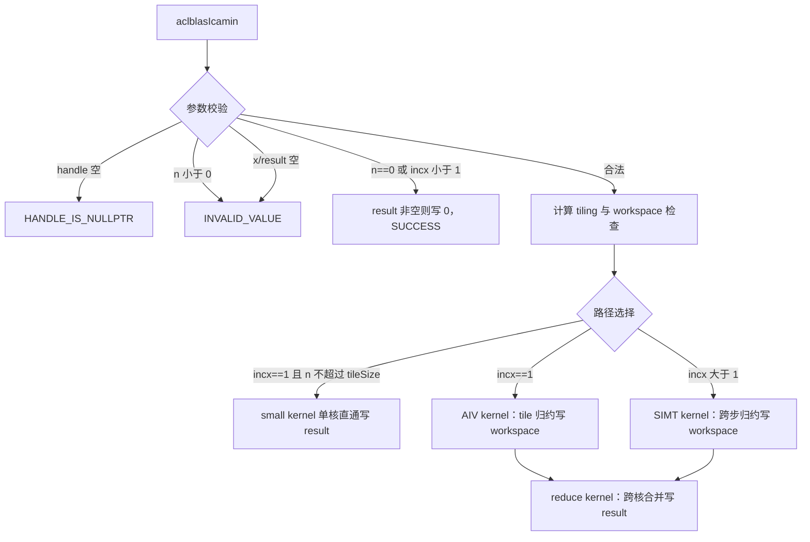
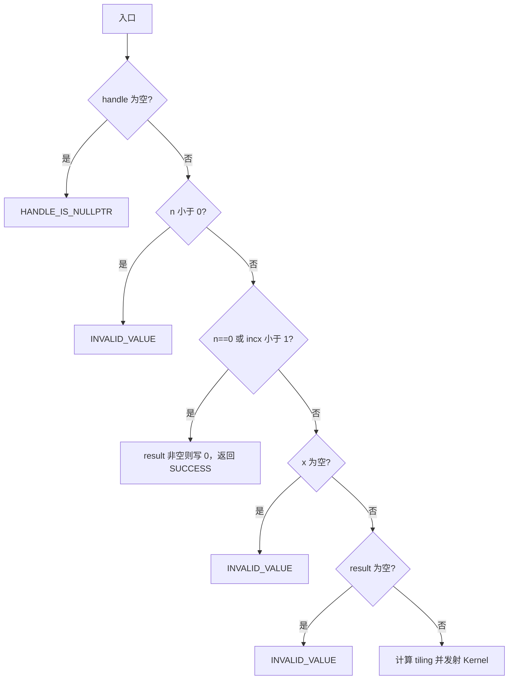

# aclblasIcamin 算子设计文档

| 项目 | 内容 |
| --- | --- |
| 算子 | `aclblasIcamin` |
| 任务 | 9月社区任务：`aclblasIcamin` 算子开发（950） |
| 目标硬件 | Ascend 950PR |
| CANN 版本 | 9.1.0 |
| 代码基线 | `cann/ops-blas` master，`7a80f5c`（2026-09-17） |
| 文档版本 | v1.0.0（2026-09-19） |

> 本文只描述本任务新增的 Ascend 950PR（`arch35`）实现与公共接口声明。其他产品线的既有实现与行为不在本任务中改动。

# 需求背景（required）

## 需求来源

- 随任务下发的《aclblasIcamin 算子开发任务书》及配套测试材料（1200 条 CSV 用例、H100 GPU 基线、验收脚本）。
- 目标代码仓：[cann/ops-blas](https://gitcode.com/cann/ops-blas)。
- 社区任务流程：[2026 社区任务参与及 PR 流程](https://gitcode.com/cann/cann-ops-competitions/blob/master/04_tasks/01_community-task-2026/README.md) 与【社区任务】流程注意事项（gitcode.com/org/cann/discussions/39）。
- 算法语义参考：cuBLAS `cublasIcamin`（[官方文档](https://docs.nvidia.com/cuda/cublas/index.html#cublas-t-amin)）。标准参考 BLAS（Netlib）无 `icamin` 例程，仅有同族实数接口 [isamin.f](https://www.netlib.org/blas/isamin.f)，语义细节以 cuBLAS 官方文档与仓内同族实现为准。

## 背景介绍

`aclblasIcamin` 在单精度复数（COMPLEX64）向量中查找最小模元素的索引，属于 BLAS Level 1 索引归约算子。数学表达式为：

```text
result = argmin_i (|Re(x[k])| + |Im(x[k])|),   i = 1..n,   k = 1+(i-1)*incx
```

复数"模"按 BLAS icamin 惯例定义为实部绝对值加虚部绝对值（L1 模），不是欧几里得模。结果为 **1-based 索引**（兼容 Fortran 惯例）；多个元素模相同时返回**最小索引**。输入的每个 `aclblasComplex` 元素由两个交错存储的 FP32 分量组成（`{real0, imag0, real1, imag1, ...}`，n 个复数对应 2n 个 float），输出为单个 INT32 整数。

与浮点归约算子不同，本算子输出是离散整数：`|Re|+|Im|` 的比较在 IEEE 浮点语义下结果确定，归约顺序不影响最终索引值，因此精度判定为与 golden **精确一致**（bit-exact 整数索引比对，`EXPECT_EQ`），浮点容差标准（rtol/atol）在本算子退化为精确相等判定。

## 任务启动基线

| 项目 | 当前状态 | 本任务处理 |
| --- | --- | --- |
| 公共 API | `include/cann_ops_blas.h` 无 `aclblasIcamin` 声明 | 本任务新增声明，与 `cublasIcamin` 逐参数对齐，供其他产品线共用；禁止 950PR 私有平行接口 |
| 复数类型 | `include/cann_ops_blas_common.h` 已定义 `aclblasComplex { float real; float imag; }` | 直接复用，按两个交错 FP32 分量读取 |
| `arch35/iamin` | 同族实数接口 `aclblasIsamin` 已有完整 arch35 实现：参数校验、tiling、`ReduceMin` 带索引归约、SIMT 跨步路径、跨核二次归约、workspace 协议 | 本任务实现框架蓝本，代码放在同目录 `blas/iamin/arch35/` |
| `arch35` 复数处理 | `blas/herk/arch35/cherk_kernel.cpp` 已使用 `DeInterleave(dstRe, dstIm, src, cplxCnt)` 拆分复数 AoS | 复用该原语做复数模计算 |
| `arch22` 等既有实现 | 与本任务无关 | 保持不变 |
| 测试工程 | `test/isamin/` 已有 CSV 驱动 GTest 模式（参数/golden/wrapper/CMake）；`test/frame/fill.h` 的 `METHOD_PATTERN_VAL` 命名规则支持任务 CSV 全部填充模式 | 参照新建 `test/iamin/icamin/`（家族嵌套目录） |
| 任务配套材料 | `icamin_test.csv` 1200 条（1000 精度 + 200 性能）、`gpu_baseline.csv`（H100 基线已回填）、`verify_accuracy.py` / `verify_performance.py` | 官方脚本原件不修改，作为验收输入 |
| API 文档 | `docs/zh/api_list.md` 当前连 `aclblasIsamin` 都未登记 | 新增 `aclblasIcamin` 条目 |

## 功能价值

完成后，Ascend 950PR 可通过统一的 ops-blas 句柄式接口执行 COMPLEX64 向量最小模索引查找，语义与 cuBLAS `cublasIcamin` 对齐（仓惯例允许的差异除外，见"参数与返回值语义"），填补公共头文件中该接口的空白，并与同族实数接口 `aclblasIsamin`/`aclblasIsamax` 形成完整的最值索引族。

# 需求分析（required）

## 需求描述

### 接口

公共头文件 `include/cann_ops_blas.h` 新增声明，签名与 cuBLAS `cublasIcamin` 逐参数对齐（handle 及参数顺序一一对应，无需额外映射）：

```cpp
aclblasStatus_t aclblasIcamin(
    aclblasHandle_t handle,
    int n,
    const aclblasComplex* x,
    int incx,
    int* result);
```

`handle` 为 Host 侧句柄，携带 stream；`x` 和 `result` 均为 Device 地址（quick return 语义例外，见下）；算子使用 `handle` 绑定的 stream 异步执行，调用者读回 `result` 前必须同步 stream。

### 数学定义

令逻辑输入向量为 `x_0, x_1, ..., x_(n-1)`，其中 `x_i = a_i + b_i*j`，定义模：

```text
m_i = |a_i| + |b_i|          （FP32 单精度加法，非欧几里得模）
result = 1 + argmin_i m_i    （1-based；m_i 相同取最小 i）
```

正步长时逻辑元素 `i`（0-based）对应物理复数下标 `i * incx`。`incx < 1`（含 0 与负步长）为合法 quick return，**本族负步长不反向遍历向量**（与 axpy/nrm2 族不同），因此不涉及负步长地址基准问题。`n > 0` 且 `incx >= 1` 时 `x` 的物理复数长度至少为 `1+(n-1)*incx`。

### 参数与返回值语义

参数校验顺序固定，与仓内 `blas/iamin/arch35/isamin_host.cpp` 中 `ValidateIsaminParams` 的实现逐条对齐（任务书明确以此为准）：

| 顺序 | 条件 | 行为 |
| --- | --- | --- |
| 1 | `handle == nullptr` | 返回 `ACLBLAS_STATUS_HANDLE_IS_NULLPTR` |
| 2 | `n < 0` | 返回 `ACLBLAS_STATUS_INVALID_VALUE` |
| 3 | `n == 0` 或 `incx < 1` | 合法 quick return：`result` 非空则写 `0`，返回 `ACLBLAS_STATUS_SUCCESS`；不检查 `x`，不触发 Kernel |
| 4 | `x == nullptr` | 返回 `ACLBLAS_STATUS_INVALID_VALUE` |
| 5 | `result == nullptr` | 返回 `ACLBLAS_STATUS_INVALID_VALUE` |
| 6 | 运行时资源失败（核数查询失败、workspace 不足等） | 映射为对应 internal/execution 状态码 |

说明：

- quick return 优先于 `x`/`result` 空指针检查：`n == 0` 或 `incx < 1` 时即使 `x == nullptr` 也返回成功（任务配套 CSV 有两条该组合用例，期望 `SUCCESS`）；`result == nullptr` 时 quick return 无法写值，仍返回成功（沿用 isamin 行为）。
- isamin 的 quick return 写 0 是 **Host 侧直接解引用 `*result = 0`**（`isamin_host.cpp`），无任何 `aclrt*` 调用。这隐含"quick return 路径的 result 指针可被 Host 直写"的契约（`test/isamin` 的 wrapper 正是如此使用：仅在 quick return 分支把 host 指针直传）。本算子完全沿用该契约，测试工程同样处理，不引入新的同步原语。
- `n < 0` 返回 `ACLBLAS_STATUS_INVALID_VALUE` 是仓内同族约定，与 cuBLAS "`n <= 0` 置 0"存在差异；任务书事实表开放问题 Q3 已明确按仓内 README 约束与 isamin arch35 实现执行。
- 状态码语义以 `include/cann_ops_blas_common.h` 为准（SUCCESS=0、INVALID_VALUE=3、EXECUTION_FAILED=5、INTERNAL_ERROR=6、HANDLE_IS_NULLPTR=9），不新增状态码。

### 特殊浮点值

复数模 `|a|+|b|` 为 NaN（任一分量为 NaN）的元素不参与比较（跳过）；任务书补充说明（开放问题 Q7 对齐结论）规定 golden 语义为：跳过 NaN 元素，首元素模为 NaN 时基准置 `FLT_MAX`。据此：

| 输入集合 | 输出 |
| --- | --- |
| 全部元素模为 NaN | `1`（基准索引初值，无任何更新） |
| 部分元素模为 NaN | 非 NaN 元素中的最小模最小索引 |
| 含 `±Inf` 分量 | `Inf` 按普通浮点值参与比较（大于任何有限值，`Inf` 模并列时取最小索引） |
| 全零 / 模全部相同 | `1`（tie 取最小索引） |
| 其余有限值 | 正常最小模索引 |

**关键工程风险**：`ReduceMin` 带索引模式对 NaN 的行为是设备语义，且社区同任务实测表明其随编译优化级别变化（Debug 下表现为跳过 NaN、Release -O2 下表现为传播 NaN）。若 NaN 在 Release 下赢得 tile 内最小值，则该 tile 全部非 NaN 候选一并被丢弃，与 golden 逐元素跳 NaN 的语义不等价。因此本设计**不把归约指令的 NaN 行为当作契约**，实现分两层：

1. **归约前向量化清洗**（主路径）：`Compare(v != v)` 生成 NaN 掩码，`Select` 将 NaN 模值置为 `+Inf`，归约输入中不含 NaN，行为在任意优化级别下确定。NaN 模置 `+Inf` 后不可能赢得最小值比较（除非全 tile 均为 NaN，此时 tile 结果 `+Inf` 经字典序规则自然落选），与 golden 语义闭合。
2. **标量重扫兜底**：tile 归约结果仍为 NaN 时（理论上不应发生）对该 tile 从 GM 逐元素重扫，正常路径不触发。

## 需求拆解

| 子任务 | 设计输出 | 验收重点 |
| --- | --- | --- |
| 公共声明 | `include/cann_ops_blas.h` 新增接口声明 | 签名与 cuBLAS 逐参数对齐，无私有平行接口 |
| Host 接口 | 校验、quick return、tiling、workspace、异步发射 | 状态码顺序、quick return 优先性、地址计算无溢出 |
| 连续 Kernel | `incx == 1` 的 AIV 单遍读取 + 带索引最小值归约 | 模计算正确、tie 取首、bit-exact、性能达标 |
| 跨步 Kernel | `incx > 1` 的 SIMT 读取和树形归约 | 与连续路径结果一致、无越界 |
| 跨核归约 | 每核 `(minVal, minIdx)` 记录 + 单核二次归约 | 合并规则保持字典序、全核记录必达 |
| 测试工程 | `test/iamin/icamin/` CSV 驱动 GTest、CPU golden | 覆盖任务书全部有效维度与官方 1200 条用例 |
| 文档 | iamin README 产品支持表与约束更新、`docs/zh/api_list.md` 补条目 | API 与实现一致，标注 950PR 支持 |

## 验收口径

### 精度

输出为单个 INT32 整数索引，按任务书与生态算子开源精度标准的退化口径执行：

```text
actual == golden    （1-based 索引逐位相等，EXPECT_EQ）
```

任一用例不相等即失败；`matched_ratio` 退化为单值判定（该用例通过即 ratio = 1）。quick return 用例（`n == 0` 或 `incx < 1`）判定 `result == 0`。golden 由测试工程内 CPU 参考实现（cblas 风格手写循环；标准 cblas 无 icamin 接口）生成，模计算严格保持 FP32 单精度（不得以 double 累加），逐元素 `|Re|+|Im|`、严格小于取最小索引、跳过 NaN（首元素 NaN 基准置 `FLT_MAX`）。

### 性能

任务书 §3.3 标杆耗时经核对为 H100 GPU 基线（`gpu_baseline.csv`，单位 ms）按倍率 0.4 调整后的值，即判定式 `NPU 平均单次耗时 <= GPU 基线 * 2.5`，三个典型 case 预计算值：

| n | incx | H100 基线 | Ascend 950PR 平均耗时上限 |
| ---: | ---: | ---: | ---: |
| 1,048,576 | 1 | 9.907 us | 24.77 us |
| 2,097,152 | 1 | 9.836 us | 24.59 us |
| 4,194,304 | 1 | 11.876 us | 29.69 us |

200 条性能用例的其余条目按同一公式 `gpu_ms * 2.5` 判定（小尺寸条目的阈值约 15.5 us，重点盯防发射开销）。计时口径：先 warmup，再有效采样 >50 次取平均；计时区只包含 stream 上的算子执行，输入生成、Host/Device 搬运、CPU golden 与结果比对不得混入。任务配套的 `verify_performance.py` 解析 GTest 行尾毫秒（含 host 准备与 golden，属保守上界），其原件不修改、PASS/FAIL 不作为发布结论；发布数据以测试工程内计时循环打印的平均单次 us 为准，msprof 作诊断。

# 详细设计（required）

## 算子分析

### 数学公式

```text
m_i    = |Re(x_i)| + |Im(x_i)|                 （L1 模，FP32 单精度）
result = 1 + argmin_{i in 0..n-1} m_i          （1-based；并列取最小索引）
x_i    = x[i * incx]                           （正步长物理复数下标）
```

推导与逐点语义见"需求描述 → 数学定义"节。

### 实现方案比较

| 方案 | GM 读取 | 索引获取 | 结论 |
| --- | --- | --- | --- |
| AIV 单遍读 + `ReduceMin`（带索引输出），逐 tile 合并 | 1 遍 | 指令直接给出 tile 内最小值与索引 | 采用（isamin 已验证的 950PR 路径） |
| AIV 求最小值后二遍找索引 | 2 遍 | 第二遍比较定位 | 带宽翻倍，不采用 |
| 全量 SIMT 直读 | 1 遍 | 标量比较 | 跨步路径采用；连续路径作为正确性交叉验证兜底 |

本算子算术强度低于同族 nrm2（无平方/开方），性能 case 均为大规模连续普通分布，理论下限由 MTE2 供数、归约与跨核尾巴决定。连续路径单遍 GM 读取即可满足性能余量。

### 950PR 编程机制取舍

| 机制 | 本算子结论 | 设计落点 |
| --- | --- | --- |
| 输入路径 | MTE2 → UB 单遍 | 连续 kernel 按 tile 搬入，无 AIC/L1 供数 |
| 复数模计算 | 交错整向量 `Abs` → `DeInterleave` 拆实虚 → `Add` | `Abs` 先于拆分做在交错向量上只需一趟（拆分后分别 `Abs` 需两趟）；`DeInterleave` 已在 `blas/herk/arch35/cherk_kernel.cpp` 验证可用。**注意 count 参数单位为源 FP32 个数**：调用形如 `DeInterleave(reBuf, imBuf, inBuf, 2*T)`，误传复数个数 T 将只拆分半个 tile |
| 带索引归约 | `ReduceMin(dst, src, work, count, true)` | isamin 同款：`dst[0]` 为最小值，`dst[1]` 为 tile 内索引（位模式）；tile 内并列取首索引的设备语义列入验证门禁 |
| NaN 处理 | 归约前 `Compare+Select` 清洗为 `+Inf` + 标量重扫兜底 | 见"特殊浮点值"节，不依赖指令 NaN 语义 |
| 跨步路径 | SIMT 逐复数标量读取 | isamin 跨步路径同构，每元素读两个分量；备选：`DataCopyPad<uint32_t, Compact>` 按 8B/复数 gather 成连续后复用主路径（`ccopy_kernel.cpp` 先例），跨步大 n 时性能更优，视实测启用 |
| 跨核归约 | 每核 2 个 FP32（值 + 索引位模式）写 workspace，单核二次归约 | 完全复用 isamin 协议 |
| AIC/Cube | 不采用 | 索引归约无矩阵结构 |

### 正确性依据（任意归约顺序 bit-exact）

定义 `(value, index)` 对的字典序合并规则：

```text
better(a, b) = (b.val < a.val) || (b.val == a.val && b.idx < a.idx)
```

逐元素更新、tile 间合并、线程树归约、跨核二次归约全部使用该规则（NaN 值不参与更新）。该规则具有结合律：任何分组/顺序的归约结果都等于"跳过 NaN 后的最小模最小索引"，与 cblas 风格串行 golden 循环（严格小于才更新，故并列保留先出现者）逐一对应，因此归约顺序不影响最终索引值，bit-exact 判定成立。

边界对应关系：所有记录初值为"无有效值"（`bestVal = FLT_MAX, hasValue = false`）；若全部元素模为 NaN，各级均无更新，最终 `hasValue == false`，按约定索引取 0，出口 `+1` 得 `result = 1`，与 golden"首元素 NaN 基准置 FLT_MAX 后无更新返回 1"一致。isamin 已在 950PR 验证该协议，本算子沿用。

### 支持数据类型和数据排布

| 对象 | 数据类型 | 逻辑排布 | 物理排布 |
| --- | --- | --- | --- |
| `x` | COMPLEX64 | `[n]` | `{real0, imag0, real1, imag1, ...}`，物理复数长度 `1+(n-1)*incx` |
| 中间记录 | FP32 值 + UINT32 索引位模式 | 每核 2 个 FP32 | handle workspace，`2*numBlocks` 个 FP32 |
| `result` | INT32 | scalar | Device 上 4 字节 |

### 支持形状与步长

| 项目 | 支持范围 |
| --- | --- |
| 逻辑 shape | 一维 `[n]`，归约为标量索引 |
| `n` | `n >= 0`；`n == 0` quick return；`n < 0` 返回 `ACLBLAS_STATUS_INVALID_VALUE` |
| `incx` | `incx >= 1` 正常计算；`incx < 1`（含 0 与负步长）quick return，不反向遍历 |
| 物理跨度 | `n > 0` 时至少 `1+(n-1)*incx` 个复数元素（`2*(1+(n-1)*incx)` 个 FP32） |
| broadcast / leading dimension / 非连续 Tensor | 不涉及 |

### 总体执行流程



## 算子实现

### Host 侧设计

#### 参数校验流程



quick return 的写零方式对齐 isamin 实现（Host 侧 `*result = 0` 直写）。该实现要求 quick return 路径的 `result` 是 Host 可写指针，与 README 参数表"Device 内存"标注存在仓内既有矛盾；本算子完全沿用 isamin 契约与测试工程的对应处理方式，不改变对外语义。

#### Tiling 策略

tiling 结构沿用 isamin 布局（字段语义不变，新增类型名 `IcaminTilingData`），所有计数单位为**复数元素**：

```cpp
struct IcaminTilingData {
    uint32_t totalN;     // 复数元素总数 n
    uint32_t perCoreN;   // 前 useCoreNum-1 核的复数元素数
    uint32_t lastCoreN;  // 末核复数元素数（perCoreN + 余数）
    uint32_t useCoreNum; // 实际使用核数
    uint32_t tileSize;   // UB 单 tile 复数元素数
    uint32_t nthreads;   // SIMT 线程数（incx > 1 时使用）
    uint32_t incx;       // 步长（1 = 连续）
};
```

```text
numBlocks = min(n, GetAivCoreCount())
perCoreN  = n / numBlocks
lastCoreN = perCoreN + n % numBlocks
tileSize  = 编译期常量（复数元素/tile，初版 4096）
nthreads  = incx > 1 时按 isamin 同款公式在 [128, 2048] 内取值（128 对齐）；incx == 1 时为 0
```

`tileSize` 的取值约束（设 T 为每 tile 复数元素数）：

- 输入搬入每 tile 共 `2T` 个 FP32，`DataCopyPad`/`DataCopy` 单次 blockLen 字段为 `uint16_t`，`2T*4B <= 65535B` → `T <= 8191`（不拆段的上限）；
- `ReduceMin` 的 `repeatTimes <= 255`，每 repeat 64 元素 → `T <= 16320`；
- 尾块 padding 与槽位合并等附加开销另计。

初版取 `T = 4096`（`2*4096*4 = 32768B`，单次搬入无拆段），按实测 A/B 调整至不超过 8191。

路径选择：

| 条件 | 发射序列 |
| --- | --- |
| `incx == 1 && n <= tileSize` | `icamin_small_kernel<<<1>>>` 直通，单核归约直接写 `result` |
| `incx == 1`（其余） | `icamin_aiv_kernel<<<numBlocks>>>` + `icamin_reduce_kernel<<<1>>>` |
| `incx > 1` | `icamin_simt_kernel<<<numBlocks>>>` + `icamin_reduce_kernel<<<1>>>` |

说明：isamin 的 small 直通条件为 `numBlocks == 1 && lastCoreN <= tileSize`，等价于"单 block 且装得下"（`numBlocks == 1` 仅当 `n == 1` 或设备只有 1 核）。本算子改为 **`incx == 1 && n <= tileSize` 时 Host 强制单核发射 small kernel**——小尺寸下省去 reduce kernel 发射与多核记录合并，是仓内既有行为的显式改进，小尺寸性能用例（阈值约 15.5us）主要受益于此。

Host 所有地址与计数中间量（`2*n`、`1+(n-1)*incx`、物理字节数、SIMT 物理下标 `2*logical*incx`）使用 UINT64 计算；`n` 为 INT32 入参，`2*n` 上界 `2^32`，UINT64 无溢出（isamin SIMT 路径用 uint32 计算 `(start+i)*stride`，复数版分量下标翻倍，溢出边界提前，必须修正为 UINT64）。Host 无法获知调用者实际分配长度，缓冲区容量由调用者保证。

#### UB 预算（连续 kernel，T = tileSize 复数元素 = 4096）

| 缓冲 | 大小 | 说明 |
| --- | --- | --- |
| inBuf | `8*T` = 32 KiB ×2（双缓冲 = 64 KiB） | 输入复数 tile（2T 个 FP32）；TQue 双缓冲流水 |
| reBuf | `4*T` = 16 KiB | 实部（`DeInterleave` 输出，原地 `Abs` 后兼作模值缓冲） |
| imBuf | `4*T` = 16 KiB | 虚部（`DeInterleave` 输出；`Add` 后复用为 +Inf 向量） |
| maskBuf | 512 B | NaN 清洗的比较掩码（Compare 输出按位打包，T=4096 → 4096 bit = 512 B；若采用 `VSEL_CMPMASK_SPR` 变体可省略此缓冲） |
| workBuf | 约 0.3 KiB | `ReduceMin` level1 对齐工作区：`align8(ceil(T/64))*4+32`，T=4096 → 64×4+32 = 288 B |
| slotBuf | 每 tile 32B，上限 K×32B | tile 归约结果槽位（值 + 索引位模式）；测试包络内（n≤2^24、40 核）约 3.2 KiB；`tiles_per_core` 超阈值（初定 512，即 16 KiB 槽位上限）时退化为每 K tile 增量合并，保证 slotBuf 有界 |
| outBuf | 32 B | 归约输出（值 + 索引位模式） |
| 合计 | 约 100 KiB | 远低于 950PR 单 AIV UB 预算（`kernel_constant.h` `UB_SIZE` = 248 KiB） |

#### Workspace

每核向 handle workspace 写 2 个 FP32（`minVal`、索引位模式），共 `2*numBlocks` 个 FP32，按 64 个 FP32 对齐后向 handle 校验容量（复用 isamin 的对齐与检查公式）；容量不足返回 `ACLBLAS_STATUS_EXECUTION_FAILED`，默认 32 MiB handle workspace 无压力。workspace 依赖同一 stream 的顺序语义，沿用仓库约束：同一 handle 不支持多 Host 线程/多 stream 无序并发复用。

注意：isamin 的 workspace 校验在路径选择**之前**无条件执行（`isamin_host.cpp:96-105`），small 直通路径同样要求 workspace ≥ 256 B；本算子沿用该顺序（默认 32 MiB 下永不失败），如需彻底免 workspace 可将校验移入非 small 分支，属实现细节，不改变对外语义。

#### 发射与异步语义

- `launchBlockNum == useCoreNum`，AIV-only kernel（`KERNEL_TASK_TYPE_DEFAULT(KERNEL_TYPE_AIV_ONLY)`）；连续路径两次发射（主 kernel + reduce kernel）在同一 stream 上顺序执行，reduce kernel 读取所有核记录后由单核写出最终索引。
- 仓内 `*_kernel_do` 发射包装返回 `void`，Host 只检查参数与前置资源，不虚构 kernel 入队状态；异步执行错误由调用者后续同步时暴露。
- 正常路径 kernel 使用 `handle->stream` 发射；quick return 不触发 kernel，Host 侧直写结果后即返回。
- 内部索引统一 0-based，出口处 `+1` 转 1-based。

### Kernel 侧设计

#### 连续 kernel（`icamin_aiv_kernel` / `icamin_small_kernel`）

每核处理 `[blockIdx*perCoreN, ...)` 区间复数元素，按 tile 循环（实现为 TQue 双缓冲流水 + 槽位化归约）：

```text
0. 初始化：inGM.SetGlobalBuffer(x, 2*totalN)          // 长度单位 FP32 个数，= 复数×2
   本核复数区间 [startOffset, startOffset+computeNum)，computeNum==0 时
   直接写哨兵槽位 (+Inf, 0) 后退出（修复 isamin 不写槽位致 reduce 读到
   陈旧值的潜在缺陷，成本一行）
1. 双缓冲队列搬入 2T 个 FP32（tile 起始 float 下标 = 2*(startOffset+i*T)）：
   GM 地址 32B 对齐走 plain DataCopy 快路径，未对齐走 DataCopyPad
2. 尾块（R 个复数，2R 个 FP32）：pad 到 ceil8(R) 个复数 = 16 float 粒度对齐，
   pad 值 +Inf 位模式 0x7F800000（Duplicate 显式填充；与 isamin 的 8-float
   粒度不同——DeInterleave 在 cherk 已验证的输入粒度为 16 float 整数倍，
   其对齐硬性要求列入编译探针验证项）
3. Abs 整向量（交错 2T，1 pass）→ DeInterleave(reBuf, imBuf, inBuf, 2*T)
   （count 为源 FP32 个数；纯排列保 Abs 语义）→ Add 得 T 个模值
4. Compare(v!=v) 生成 NaN 掩码 → Select 将 NaN 置 +Inf（向量化清洗，
   见"特殊浮点值"节；Select 调用形式与 mask 格式列入编译探针验证项）
5. ReduceMin(..., true) 得 tile 内 (minVal, localIdx)，直写本 tile 的 32B
   对齐 UB 槽位；localIdx >= 有效元素数（尾块 pad 区）时该槽位丢弃
6. 全部 tile 完成后 SetFlag/WaitFlag<HardEvent::V_S>（或 PipeBarrier<PIPE_ALL>），
   一次性标量按字典序合并各槽位；某 tile 归约结果仍为 NaN 时（理论上不应
   发生）对该 tile 从 GM 标量重扫兜底；
   tiles_per_core 超阈值（如 512）时退化为每 K tile 增量合并，slotBuf 有界
```

核内全部 tile 完成后：AIV kernel 将 `(bestVal, bestIdx)` 以 2 个 FP32（索引按位模式）经 `DataCopyPad` 写入本核 workspace 槽位（S->MTE3 屏障后搬出）；small kernel（单核直通）直接写 `result = bestIdx + 1`（`Duplicate<int32_t>` 填 8 后 `DataCopyPad` 4 字节写出，isamin 同款）。

说明：isamin 原型为单缓冲 TBuf（in/work/out 三个 TBuf，无 TQue/双缓冲）+ 每 tile `GetValue` 立即标量合并；本设计改为 TQue 双缓冲 + 槽位末尾合并，消除逐 tile 的 V/S 同步等待，是已验证的结构优化方向；两处均在 `hasValue_`/`bestVal_`/`bestIdx_` 的同一字典序协议下运行，正确性依据不变。

#### 跨步 kernel（`icamin_simt_kernel`）

`incx > 1` 时按 isamin 跨步路径同构实现，元素粒度为复数：

```text
for (t = threadIdx.x; t < calNum; t += blockDim.x):
    logical = blockStartOffset + t            // 复数逻辑下标
    scalar  = 2ULL * logical * incx           // FP32 分量下标；UINT64 字面量先行，
                                              // 防 logical*incx 的 uint32 中间量溢出
    m = |x[scalar]| + |x[scalar + 1]|         // 逐分量标量读取（两次 float 读；
                                              // aclblasComplex 仅 4B 对齐，不用 uint64 单读）
    m 非 NaN 且字典序更优则更新 (bestVal, bestIdx=logical)
```

每线程得到 `(bestVal, bestIdx)` 后在 block 内做 2 的幂树形归约（逐轮 `asc_syncthreads()`，比较规则同上），thread 0 写本核 workspace 槽位。线程数按 tiling 的 `nthreads` 配置（128~2048、128 对齐），`calNum <= 0` 时不发起 `asc_vf_call`。

#### 跨核二次归约（`icamin_reduce_kernel`）

单核执行：从 workspace 读入 `2*useCoreNum` 个 FP32（按 64 对齐整块 `DataCopy`，多读槽位不消费），逐条按字典序规则合并（跳过 NaN 值），若无有效值则索引取 0；最终 `result = bestIdx + 1`，以 4 字节 `DataCopyPad` 写出。

### 预期文件变更

| 文件 | 变更 |
| --- | --- |
| `include/cann_ops_blas.h` | 新增 `aclblasIcamin` 声明（置于同族 `aclblasIsamin` 声明邻近位置，约 :195 附近） |
| `blas/iamin/arch35/icamin_host.cpp` | 新增：Host 校验、quick return、tiling、workspace、发射 |
| `blas/iamin/arch35/icamin_kernel.cpp` | 新增：连续/跨步/二次归约 kernel 与 `icamin_kernel_do` 发射包装 |
| `blas/iamin/arch35/icamin_kernel.h` | 新增：Host 发射声明（`GM_ADDR` 宏 + `icamin_kernel_do` 原型，isamin 同款 19 行结构） |
| `blas/iamin/arch35/icamin_tiling_data.h` | 新增：`IcaminTilingData` 与 tile 常量 |
| `test/iamin/icamin/CMakeLists.txt` | 新增：测试目标注册（`"arch35" IN_LIST SOC_ARCH_DIRS` 时 `ops_blas_add_gtest_tests`） |
| `test/iamin/icamin/icamin_param.h` | 新增：CSV 参数映射（`n` / `incx` / `x` / `expect_result` / `random_seed`） |
| `test/iamin/icamin/icamin_golden.h` | 新增：cblas 风格 CPU golden（FP32 严格、NaN 跳过、并列取首） |
| `test/iamin/icamin/icamin_npu_wrapper.h` | 新增：device 分配/H2D/D2H 封装；quick return 路径按 isamin 契约传 host 指针 |
| `test/iamin/icamin/arch35/icamin_test.cpp` | 新增：CSV 驱动 GTest + 负向用例 + 特殊值/重复调用用例 + 性能计时用例 |
| `test/iamin/icamin/arch35/icamin_test.csv` | 新增：任务配套 1200 条用例入库 |
| `test/iamin/icamin/arch35/icamin_test_extra.csv` | 新增：自补用例（正态分布、对齐偏移、大规模 tie、全 NaN） |
| `test/iamin/icamin/README.md` | 新增：测试步骤与口径说明（交付件要求可复现）；注明 `verify_performance.py` 的 GTest 行尾毫秒口径含 host 开销属保守上界、发布数据以用例内计时循环为准，防验收误读 |
| `test/frame/fill.h` | 视情况新增正态分布（高斯）填充模式：现有 `BlasFillMode` 的 `RANDOM_NORM_*` 为均匀分布；任务书 §3.5 第3条要求 50% 输入为正态（μ∈[-5,5]，σ∈[0.1,2]），官方 CSV 无正态用例，需纯增量补充（不影响既有模式） |
| `blas/iamin/README.md` | 更新：接口表加 `aclblasIcamin` 行、产品支持表标注 Ascend 950PR 支持、约束说明补 icamin 段 |
| `docs/zh/api_list.md` | 新增 `aclblasIcamin` 条目（`aclblasIsamin` 本身亦缺失，一并补齐与否在 PR 评审中确认） |

`blas/CMakeLists.txt` 按 `*/${SOC_ARCH_DIRS}/*.cpp` glob 自动收集源文件，`blas/iamin/arch35/icamin_*.cpp` 无需改动即编入库。测试侧 `--ops=icamin` 时 `test/CMakeLists.txt` 的家族目录搜索命中 `test/iamin/icamin/`，源文件检查经 `blas/*/arch35/icamin_*.cpp` glob 命中（`cmake/test.cmake`），规则已在设计阶段核对存在。

## 支持硬件

| 硬件 | 支持情况 | 说明 |
| --- | --- | --- |
| Ascend 950PR | 支持 | 本任务目标，CANN 9.1.0 |
| 其他产品线 | 保持现状 | 不修改 `arch22` 等既有实现；公共声明可供后续产品线接入 |

## 算子约束限制

- `x` 和 `result` 必须是当前 Device 可访问地址，`result` 至少有 4 字节空间；二者按独立对象处理，不涉及原地更新与视图语义。quick return 路径例外：`result` 需 Host 可写（isamin 既有契约）。
- `x` 不得与 `result` 或 handle workspace 重叠；用户经 `aclblasSetWorkspace` 注入的 workspace 需 32B 对齐（reduce kernel 按 plain `DataCopy` 整块读取）。
- `n > 0` 且 `incx >= 1` 时，`x` 的物理复数长度至少为 `1+(n-1)*incx`。
- `incx < 1`（含 0 与负步长）为 quick return，不做反向遍历；`n < 0` 返回 `ACLBLAS_STATUS_INVALID_VALUE`。
- 输出为离散整数索引，语义上确定；不要求也不承诺跨版本的浮点级一致性之外的额外确定性保证。
- 调用成功只表示参数合法且工作已入队；读取 `result` 前调用者必须同步绑定 stream（stream 经 `aclblasSetStream` 绑定到 handle）。
- `n`、`incx` 为运行时标量入参，不涉及 dynamic shape、广播、非连续 Tensor 与空 Tensor 概念。
- 本任务不新增生产依赖，不改变公共 ABI（仅新增声明）。
- 配套测试材料约定单用例 Host 侧内存不超过 4 GB（向量 `n <= 2^24`）。

# 可维可测分析

## 精度标准/性能标准

| 类别 | 标准 |
| --- | --- |
| 整数索引输出 | `actual == golden`（EXPECT_EQ 精确一致），任一用例不相等即失败 |
| quick return | `n == 0` 或 `incx < 1` 时 `result == 0` 且返回成功 |
| NaN | 模为 NaN 的元素跳过；全 NaN 返回 1 |
| 性能 | 1M/2M/4M 分别不超过 24.77/24.59/29.69 us；其余 PF 用例不超过 `gpu_ms * 2.5`；warmup 后有效采样 >50 次 |
| 确定性 | 归约顺序不影响结果；逐用例精确通过，不以比例掩盖单例失败 |

## 精度分析

### Golden

- 测试工程内 cblas 风格 CPU 循环：严格 FP32（`fabsf` 级）计算 `|Re|+|Im|`；首元素模 NaN 时基准置 `FLT_MAX`；逐元素跳过 NaN、严格小于才更新索引（并列保留先出现者，即最小索引）；`n < 1` 或 `incx < 1` 返回 0。与任务书 §3.2 及 Q7 对齐结论一致，参照 `test/isamin/isamin_golden.h` 结构实现。
- golden 只用于**数值**比对。状态码比对以 NPU Host 校验顺序为准——注意仓内 `isamin_golden.h` 的 `aclblasIsamin_cpu` 参考校验顺序与 NPU 不同（先查指针再查 `n<0`，quick return + `result==nullptr` 时 CPU 参考返回 INVALID 而 NPU 返回 SUCCESS），icamin 的状态码断言不依赖 CPU 参考实现。
- `ReduceMin` 带索引模式的 tile 内并列取首、NaN 处理为设备语义，以 950PR 实测用例（全零 tie、并列最小值、NaN 混合）固化，列入验证门禁；归约前清洗使其不依赖该语义。

### 精度用例矩阵

任务配套 CSV（1200 条，`gen_csv.py` 生成种子默认 20260823 控制用例采样；运行时逐条 `random_seed` 列为 20260001~20261200，由测试工程按行消费）分类与覆盖：

| 类别 | 前缀 | 条数 | 覆盖 |
| --- | --- | --- | --- |
| L0 基础 | TC_L0 | 6 | n=1/8 × 基础步长 + 全零 tie（期望索引 1） |
| L1 尺寸 | TC_SQ | 38 | 1→2^20，质数/2 的幂/2 的幂±1/非对齐，incx=1 |
| L2 步长 | TC_INC | 17 | 正步长（1/2/3 × n∈{16,64,256}）+ 非正步长（0/-1/-2/-3）quick return |
| L5 填充 | TC_FL | 12 | 随机/全零/交替/极端值/Inf/NaN × 2 尺寸 |
| L6 边界 | TC_ED | 12 | 零维、负 n、空指针、quick return 优先于指针检查组合 |
| EX 扩展 | TC_EX | 915 | 尺寸 × 步长 × 填充的确定性采样 |
| PF 性能 | TC_PF | 200 | 3 条典型 case + 小尺寸 + 规模扫描 + 特殊填充，incx=1 |

填充模式 `RANDOM_NORM_5_5 / VALUE_NORM_0 / RANDOM_ALTER / RANDOM_EXTREME / VALUE_NORM_INF / VALUE_NORM_NAN / NULLPTR` 均被仓内 `test/frame/fill.h` 的 `METHOD_PATTERN_VAL` 规则支持（`RANDOM_NORM_5_5` = RANDOM 方法 + NORM 模式 + 值域 ±5，均匀分布），复数按 `2*xLen` 个 FP32 生成（实部虚部独立采样，`makeBlasComplexMatrix` 已有实虚独立 seed 的复数生成先例）。

按任务书 §3.5.4 自行补充的维度：

| 维度 | 覆盖 |
| --- | --- |
| 正态分布输入 | 任务书 §3.5 第3条要求 x 值域为正态（μ∈[-5,5]，σ∈[0.1,2]）占 50%，配套 CSV 仅均匀分布；在测试框架或测试工程补充确定性正态生成器（实虚独立采样），补充用例并证明均匀/正态比例 |
| 对齐偏移 | x 起始地址做 4B/32B/64B 偏移的合法性用例（覆盖 `DataCopy`/`DataCopyPad` 双路径） |
| tie 语义 | 多位置相同模（含跨 tile/跨核并列）取最小索引 |
| 特殊值组合 | 全 NaN、全 Inf、NaN+有限值、subnormal 分量（含 denormal-在-零前/零后定向用例，验证 FTZ 风险）、`|FLT_MAX|+|FLT_MAX|` 模溢出为 Inf 的行为固化 |
| 重复调用 | 同一 handle/stream 连续调用（含 quick return 与正常路径交替），确认 workspace 时序无污染 |
| 测试工程层负向 | handle 空指针、result 空指针（正常路径）期望状态码。注意 NPU wrapper 对空 handle 返回 `NOT_INITIALIZED`（`isamin_npu_wrapper.h` 同款），观测 API 层 `ACLBLAS_STATUS_HANDLE_IS_NULLPTR` 需绕过 wrapper 直调 `aclblasIcamin` |

## 性能分析

### 关键路径

性能 case 均为 `incx=1` 连续大规模，输入数据量 `8*n` 字节（1M/2M/4M 分别 8/16/32 MiB），输出与 workspace 可忽略。耗时分解：MTE2 供数 + 向量处理（Abs/DeInterleave/Add/Compare/Select/ReduceMin 共 6 趟向量 op）+ 跨核归约尾巴 + kernel 发射固定开销。

带宽账不能按 HBM 冷读估：950PR HBM 约 1.4~1.6 TB/s，32 MiB 冷读单遍即 21~24 us，贴门限（29.69us）边缘。真实依据是 **L2 常驻**：950PR L2 约 112 MiB，计时循环 >50 次采样反复读同一输入，warmup 后 8/16/32 MiB 全部驻留 L2，供数走 L2 带宽（远高于 HBM）。因此主要风险不在带宽而在**固定开销**：连续路径两次 kernel 发射（aiv + reduce）+ 末尾同步的常数项，以及 reduce kernel 的串行尾巴。小尺寸条目（阈值约 15.5us）尤其敏感——这正是 `n <= tileSize` 强制单核直通（省第二次发射）的收益点。实测需单独标定一次"发射 + stream 同步"的裸开销作为预算基线；若验收环境 L2 被刷或落到低带宽卡型，大 case 需复核冷读情形。

### 工程措施

1. **构建类型**：性能验收须 Release 构建。社区同任务实测表明 `-O0` Debug 编译会使 kernel 劣化约一个数量级；当前 master `CMakeLists.txt` 已默认 `CMAKE_BUILD_TYPE=Release`（`CMakeLists.txt:66-67`），若基线回退或本地缓存为 Debug，验收构建时显式 `-DCMAKE_BUILD_TYPE=Release` 固定。
2. **NaN 处理不依赖归约指令语义**：`ReduceMin` 带索引模式在 Debug/Release 下 NaN 行为不同；统一做归约前 `Compare+Select` 向量化清洗 + 标量重扫兜底。
3. **流水与合并**：TQue 双缓冲 DMA 流水掩盖 MTE2 延迟；tile 归约结果写 32B 对齐 UB 槽位、末尾一次性 `SetFlag/WaitFlag<HardEvent::V_S>` 后标量合并，消除逐 tile `GetValue` 同步。
4. **模计算趟数**：先 `Abs` 交错向量（1 pass）再 `DeInterleave` + `Add`（拆分后分别 Abs 需 2 pass）。
5. **发射开销**：`incx==1 && n <= tileSize` 单核直通省 reduce kernel 发射，小尺寸条目直接受益。

### 性能验证方法

1. 固定 Ascend 950PR、CANN 9.1.0、同一频率与运行环境。
2. 测试用例内预先创建 handle/stream、分配并填充输入输出。
3. warmup 不少于 3 次，有效采样 >50 次；计时区只包含重复发射与末尾同步（chrono 或 ACL event），计算单次平均 us，打印 `[ICAMIN_PERF] average_us` 供报告采集。
4. 计时区不生成 golden、不打印日志、不申请内存、不做 H2D/D2H。
5. msprof 复核 kernel 数量、GM→UB 流量与尾段耗时，仅作诊断。

### 性能回退策略

按优先级定位与优化：确认路径选择正确（small 直通/双发射）→ 核对 tileSize 与核数 A/B（单变量）→ 检查模计算指令（DINTLV/Abs/Add）的 Hardware Loop 与寄存器 spill → 分离 MTE2 供数与归约尾巴 → 小尺寸条目确认发射开销占比。任何回退不得改变字典序归约语义与单遍读取原则。

## 兼容性分析

- 仅新增公共接口声明，API 签名、`aclblasComplex` ABI、handle/stream 使用方式均不变。
- 新代码仅进入 `arch35`，不改变 `arch22` 等既有编译产物与行为。
- `n < 0` 返回 `ACLBLAS_STATUS_INVALID_VALUE` 为仓内同族约定，与 cuBLAS 的差异已在任务书层面确认；负步长 quick return 不遍历是本族语义，不影响 axpy/nrm2 族。
- result 为 Device INT32 scalar（quick return 的 Host 直写契约除外，isamin 同款）；同步责任与 ops-blas 其他句柄式接口一致。

## 可维护性分析

- Host 校验、tiling、kernel 算法与测试 golden 分文件；复用 isamin 的命名与目录结构，降低族内维护成本。
- tiling 字段统一以复数元素为单位，注释明确 `n` 与 `2*n` 的换算点，防止单位混用。
- 新增测试进入现有 CMake/CSV 流程，不依赖任务附件脚本才能运行；官方脚本原件保留作可追溯输入。
- 性能数据记录设备、软件版本、采样方法、日期与原始日志；case 主键含完整参数。

## 交付件验收矩阵

| 交付件 | 内容 | 完成条件 |
| --- | --- | --- |
| 社区设计文档 | 按 tasklist 规则提交 `docs/design.md` PR 至 cann-ops-competitions | 评审通过并合入 |
| 算子与测试代码 | 公共声明、arch35 Host/Kernel、CSV/GTest 测试工程、iamin README、api_list 补条目 | 个人 fork 明确分支可复现构建和测试 |
| 自测报告 | 全量精度 case、三项性能 case、内存占用、截图与原始日志 | 使用任务指定模板，数据可追溯 |
| 待验收地址 | 个人仓 URL、分支 `feat/aclblas-icamin-arch35`、算子/测试目录 | 邀请 `Ascend-CANN` 为开发者 |

任务书一处写"内存要求不涉及"，交付件又要求内存占用数据；本设计按更严格口径在自测报告中记录峰值 Host/Device/workspace 占用。

## 工程实现与验收门禁

| 工程项 | 影响 | 验证方式 |
| --- | --- | --- |
| `ReduceMin` 带索引的设备语义 | tile 内并列取首索引、NaN 行为随优化级别变化 | 全零 tie、跨核 tie、NaN 混合用例固化；NaN 已由归约前 `Compare+Select` 清洗兜底，不依赖指令语义；若实测非首索引语义，预案为字典序修复 pass |
| `Compare`/`Select` 原语 | NaN 清洗依赖；仓内 arch35 无使用先例 | 最小 kernel 编译探针验证可用性、mask 格式（位打包/SPR）与调用形式，随后固化 |
| `DeInterleave` 输入约束 | count 单位为源 FP32 个数（`2*T`）；输入对齐粒度（cherk 仅验证过 16 float 倍数） | 编译探针验证对齐硬性要求与 count 上限；尾块按 16 float 粒度 padding 先行规避；T 上调超过 4096 前必须验证 |
| FP32 次正规（denormal）处理 | 若 AIV `Abs`/`Add`/`ReduceMin` 对 denormal flush-to-zero，则 denormal 模变 0 与真零元素 tie，可能选出与 golden 不同索引 | 定向用例：denormal 在真零之前、denormal 在真零之后（`fill.h` `EXTREME` 模式含 denorm_min 可命中）；确认 FTZ 后按语义补救 |
| 模计算指令选择 | `Abs` 交错 → `DeInterleave` → `Add`（2 趟向量）vs 先拆后 `Abs`（3 趟）；`PairReduceSum` 在 arch35 未见使用先例 | 编译报告 + 实测择优；`DeInterleave` 在 `cherk_kernel.cpp` 已验证，作为首选 |
| 构建类型 | Debug -O0 下 kernel 劣化约一个数量级，性能验收无效 | 验收构建显式 Release；当前 master 已默认 Release |
| quick return Host 直写契约 | `*result = 0` 要求 result Host 可写 | 测试 wrapper 在 quick return 分支传 host 指针（isamin 同款）；文档与 README 注明 |
| SIMT 物理下标溢出 | `2*logical*incx` 需 UINT64 中间量（isamin uint32 直接平移会在复数场景提前溢出） | 大范围 incx 用例 + 代码审查 |
| 小尺寸直通 | `n <= tileSize` 强制单核的条件改写 | 小尺寸 PF 用例（阈值约 15.5us）+ 正确性全绿 |
| 官方脚本口径 | `verify_performance.py` 含 host 开销属保守上界 | 发布数据以测试工程内计时循环打印的 `average_us` 为准，脚本仅作粗筛 |

# 参考资料

- 《aclblasIcamin 算子开发任务书》（9月社区任务随附文档）及 `test_cases/` 配套材料（`icamin_test.csv`、`gpu_baseline.csv`、`gen_csv.py`、`verify_accuracy.py`、`verify_performance.py`）
- [cann/ops-blas](https://gitcode.com/cann/ops-blas)：`blas/iamin/arch35/isamin_*`（实现蓝本）、`blas/herk/arch35/cherk_kernel.cpp`（`DeInterleave` 先例）、`blas/copy/arch35/ccopy_kernel.cpp`（复数 Compact gather 先例）、`test/isamin/`（测试工程蓝本）、`test/frame/fill.h`（填充框架）
- [cuBLAS `cublasIcamin` 官方文档](https://docs.nvidia.com/cuda/cublas/index.html#cublas-t-amin)
- [Netlib BLAS `isamin.f`](https://www.netlib.org/blas/isamin.f)（同族实数参考）
- [2026 社区任务参与及 PR 流程](https://gitcode.com/cann/cann-ops-competitions/blob/master/04_tasks/01_community-task-2026/README.md)、[【社区任务】流程注意事项](https://gitcode.com/org/cann/discussions/39)
