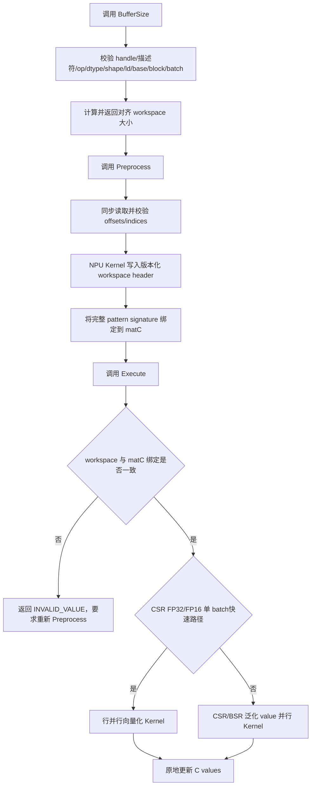
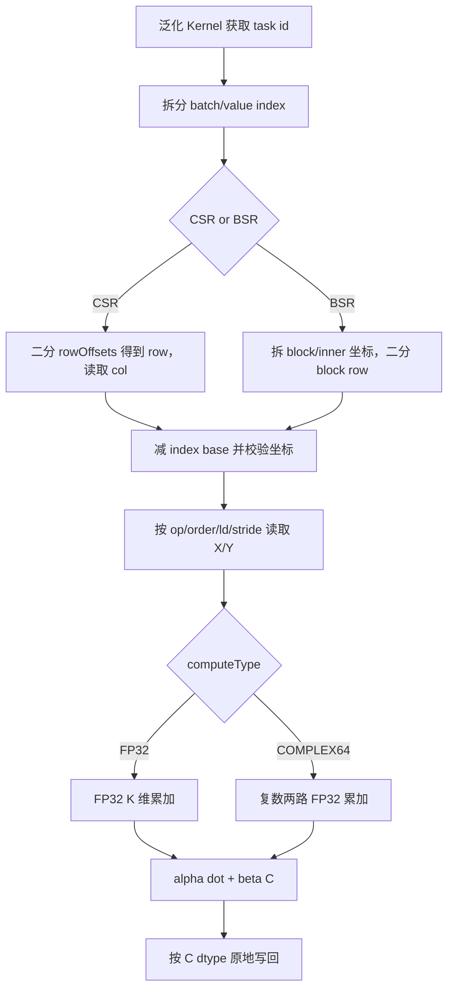

# aclsparseSDDMM算子设计方案

## 需求背景（required）

### 需求来源

现有 `ops-sparse` 仓库已经提供 `aclsparseSDDMMBufferSize`、`aclsparseSDDMMPreprocess` 和 `aclsparseSDDMM` 三阶段接口，并分别存在 `arch35` 与 `arch22` 实现。当前 `arch22` 基线仅支持 CSR、I32/base 0、`FLOAT16/FLOAT32` 同类型输入输出，不支持任务书要求的 BSR、base 1、`COMPLEX64`、BF16 混合精度和 strided batch；其 `BufferSize` 固定返回 0、`Preprocess` 不建立可复用状态，执行阶段还会同步回读 CSR row offsets。

2026 年 9 月社区任务要求面向 Atlas A2 训练系列产品和 Atlas A3 系列产品（DAV_2201，`arch22`）完善 SDDMM 全链路能力，并保持与 cuSPARSE SDDMM 对应的三阶段接口语义。交付范围包括公共描述符接口、Host 校验与调度、Ascend C Kernel、C++ 测试，以及 PyTorch 2.7+/torch_npu 26.0.0+ 的 `torch.sparse.sampled_addmm`/`aten::sparse_sampled_addmm` NPU 适配，不允许 CPU fallback。

### 背景介绍

SDDMM（Sampled Dense-Dense Matrix Multiplication）只计算稠密矩阵乘积在稀疏矩阵既有 pattern 上的值。其语义为：

$$
C_{out} = (\alpha \cdot op(X) \cdot op(Y) + \beta \cdot C_{in}) \circ spy(C)
$$

其中 `spy(C)` 表示只保留 C 已存在的 CSR 非零位置或 BSR 非零块内位置。算子不生成新的稀疏结构，row offsets、column indices 和 BSR block pattern 在执行前后保持不变，只原地更新 values。

对 CSR 中第 `i` 行、第 `j` 列的一个既有非零位置：

$$
C_{ij} \leftarrow \alpha \sum_{p=0}^{K-1} op(X)_{ip}op(Y)_{pj} + \beta C_{ij}
$$

对 BSR 中的每个非零块，先由 block row、block column 和块内坐标恢复逻辑 `(i,j)`，再执行同一公式。`TRANSPOSE` 只交换维度和访问坐标；complex64 的 `TRANSPOSE` 不执行共轭。

## 需求分析（required）

### 需求描述

本次开发在不改变既有 SDDMM 三阶段 ABI 的前提下，补齐以下能力：

1. CSR 支持 FP32、complex64、FP16 输入配 FP16/FP32 values，computeType 分别为 FP32 或 complex64。
2. BSR 支持 CSR 的全部组合，并增加 BF16 输入配 BF16/FP32 values、FP32 累加。
3. CSR/BSR 索引均为 I32，index base 支持 0 和 1。
4. X/Y 支持 ROW/COL order、合法 leading dimension、NON_TRANSPOSE/TRANSPOSE。
5. DnMat 与 BSR 支持 strided batch，batchCount 范围为 `[1,65535]`，允许 X、Y 以 batchCount=1 广播。
6. BSR 仅支持方块，block size 为 2、4、8、16、32、64、128，块内支持 ROW/COL 两种物理布局。
7. `BufferSize -> Preprocess -> Execute` 生命周期真实生效；preprocess 状态绑定 matC，不使用以 workspace 指针为 key 的进程全局无锁缓存。
8. 使用调用方 stream，核心计算全部在 NPU Kernel 完成；Preprocess 为校验设备端 pattern 会执行一次 D2H 读取，DEVICE pointer mode 下标量也会同步读取，Execute 本身保持异步。

### 算子原型

```cpp
aclsparseStatus_t aclsparseSDDMMBufferSize(
    aclsparseHandle_t handle, aclsparseOperation_t opX, aclsparseOperation_t opY,
    const void *alpha, aclsparseConstDnMatDescr_t matX,
    aclsparseConstDnMatDescr_t matY, const void *beta,
    aclsparseSpMatDescr_t matC, aclDataType computeType,
    aclsparseSDDMMAlg_t alg, size_t *size);

aclsparseStatus_t aclsparseSDDMMPreprocess(
    aclsparseHandle_t handle, aclsparseOperation_t opX, aclsparseOperation_t opY,
    const void *alpha, aclsparseConstDnMatDescr_t matX,
    aclsparseConstDnMatDescr_t matY, const void *beta,
    aclsparseSpMatDescr_t matC, aclDataType computeType,
    aclsparseSDDMMAlg_t alg, void *buffer);

aclsparseStatus_t aclsparseSDDMM(
    aclsparseHandle_t handle, aclsparseOperation_t opX, aclsparseOperation_t opY,
    const void *alpha, aclsparseConstDnMatDescr_t matX,
    aclsparseConstDnMatDescr_t matY, const void *beta,
    aclsparseSpMatDescr_t matC, aclDataType computeType,
    aclsparseSDDMMAlg_t alg, void *buffer);
```

本任务同时新增 `aclsparseCreateBsr`、`aclsparseCreateConstBsr`、`aclsparseDnMatGetStridedBatch`、`aclsparseDnMatSetStridedBatch` 和 `aclsparseBsrSetStridedBatch`。

```cpp
aclsparseStatus_t aclsparseCreateBsr(
    aclsparseSpMatDescr_t *spMatDescr, int64_t blockRows,
    int64_t blockCols, int64_t blockNnz, int64_t rowBlockSize,
    int64_t colBlockSize, void *bsrRowOffsets, void *bsrColInd,
    void *bsrValues, aclsparseIndexType_t bsrRowOffsetsType,
    aclsparseIndexType_t bsrColIndType, aclsparseIndexBase_t idxBase,
    aclDataType valueType, aclsparseOrder_t order);

aclsparseStatus_t aclsparseCreateConstBsr(
    aclsparseConstSpMatDescr_t *spMatDescr, int64_t blockRows,
    int64_t blockCols, int64_t blockNnz, int64_t rowBlockSize,
    int64_t colBlockSize, const void *bsrRowOffsets,
    const void *bsrColInd, const void *bsrValues,
    aclsparseIndexType_t bsrRowOffsetsType,
    aclsparseIndexType_t bsrColIndType, aclsparseIndexBase_t idxBase,
    aclDataType valueType, aclsparseOrder_t order);

aclsparseStatus_t aclsparseDnMatGetStridedBatch(
    aclsparseConstDnMatDescr_t dnMatDescr, int *batchCount,
    int64_t *batchStride);

aclsparseStatus_t aclsparseDnMatSetStridedBatch(
    aclsparseDnMatDescr_t dnMatDescr, int batchCount,
    int64_t batchStride);

aclsparseStatus_t aclsparseBsrSetStridedBatch(
    aclsparseSpMatDescr_t spMatDescr, int batchCount,
    int64_t offsetsBatchStride, int64_t columnsBatchStride,
    int64_t valuesBatchStride);
```

| 参数名 | 输入/输出/属性 | 是否必选 | 描述 | 数据类型/格式 | 约束 |
| --- | --- | --- | --- | --- | --- |
| `handle` | 输入 | 必选 | 保存调用方 stream 的 aclsparse handle。 | Handle | 非空且 stream 有效。 |
| `opX/opY` | 属性 | 必选 | 稠密矩阵变换。 | NON_TRANSPOSE/TRANSPOSE | 不支持共轭转置。 |
| `alpha/beta` | 输入 | 必选 | 缩放标量。 | FP32、兼容 FP16，或 complex64 | 类型由 computeType 决定，支持 Host/Device pointer mode；Device 模式在 Host 调度时同步读取。 |
| `matX/matY` | 输入 | 必选 | 稠密乘法输入。 | FP16/BF16/FP32/complex64，ROW/COL | op 后 shape 可相乘；ld 合法；batch 为 1 或输出 batch。 |
| `matC` | 输入输出 | 必选 | 固定稀疏 pattern，values 原地更新。 | CSR/BSR，I32，base 0/1 | CSR batch=1；BSR 支持 strided batch。 |
| `computeType` | 属性 | 必选 | 累加与标量类型。 | FP32/complex64 | 与支持矩阵匹配。 |
| `alg` | 属性 | 必选 | SDDMM 算法。 | DEFAULT | 其他值返回 NOT_SUPPORTED。 |
| `size` | 输出 | 必选 | workspace 精确字节数。 | size_t | 检查乘加和对齐溢出。 |
| `buffer` | 输入 | Preprocess/Execute 必选 | 保存 preprocess header 和 pattern 元数据。 | Device bytes | 按 BufferSize 分配并满足对齐。 |
| `blockRows/blockCols/blockNnz` | 属性 | BSR 必选 | BSR 压缩块结构维度。 | int64 | 非负；逻辑维度和值数量乘法不溢出。 |
| `rowBlockSize/colBlockSize` | 属性 | BSR 必选 | 方块尺寸。 | int64 | 两者相等且属于 2/4/8/16/32/64/128。 |
| `order` | 属性 | BSR 必选 | 块内物理布局。 | ROW/COL | 其他枚举返回 INVALID_VALUE。 |
| `batchCount` | 属性 | batch API 必选 | DnMat/BSR batch 数。 | int | 1..65535。 |
| `batchStride` | 属性 | DnMat batch 必选 | 相邻矩阵的元素跨度。 | int64 | 非负、覆盖矩阵存储且总跨度不溢出。 |
| `offsets/columns/valuesBatchStride` | 属性 | BSR batch 必选 | 相邻 BSR 数组的元素跨度。 | int64 | 非负、覆盖对应单 batch 数组且总跨度不溢出。 |

### 需求拆解

1. 扩展公共 SpMat 描述符，保存 BSR block 元数据、块内 order、batch strides 和 SDDMM 专用 preprocess 绑定信息。
2. 扩展 DnMat 描述符，保存 `batchCount/batchStride`，并提供读写接口。
3. Host 统一校验 CSR/BSR、dtype 组合、shape、ld、base、block size、batch 广播、指针和整数溢出。
4. `BufferSize` 返回对齐后的固定 header 空间；header 保存 magic、版本、format、base、shape、block、batch、dtype 和 K 等版本化元数据。
5. `Preprocess` 同步读取设备端 offsets/indices，校验起止端点、单调性和列范围，再由 NPU Kernel 写入 header，并把完整 pattern signature 绑定到 matC 描述符。
6. `Execute` 只接受与 matC 当前绑定一致的 workspace，并由计算 Kernel 校验/消费 header 的 magic、版本及关键 tiling 字段；pattern 指针、内容、shape、format、base、block 或 batch 属性发生变化后，调用方必须重新 preprocess。指针/描述符属性变化由库检测；同地址内容变化属于调用方生命周期约束。
7. 保留现有 CSR FP32/FP16 单 batch优化路径，并在该路径直接支持 base 0/1；其他组合进入统一泛化 Kernel。
8. 泛化 Kernel 以稀疏 value 为并行任务，通过 CSR/BSR row offsets 恢复逻辑坐标，按 order/op/ld/batchStride 访问 X/Y，以 FP32 或 complex64 累加后写回原 values。
9. Python/ATen 适配只接受 NPU CSR tensor，校验 layout/device/shape/dtype/stride，创建 aclsparse 描述符并执行三阶段接口；不支持组合显式报错。

## 详细设计（required）

### 算子分析

#### 数据类型处理

| 稀疏格式 | X/Y dtype | C values dtype | computeType | Kernel 累加 |
| --- | --- | --- | --- | --- |
| CSR/BSR | FLOAT32 | FLOAT32 | FLOAT32 | FLOAT32 |
| CSR/BSR | COMPLEX64 | COMPLEX64 | COMPLEX64 | 两路 FLOAT32 复数乘加 |
| CSR/BSR | FLOAT16 | FLOAT16 | FLOAT32 | FLOAT32，写回时转 FP16 |
| CSR/BSR | FLOAT16 | FLOAT32 | FLOAT32 | FLOAT32 |
| BSR | BFLOAT16 | BFLOAT16 | FLOAT32 | FLOAT32，写回时转 BF16 |
| BSR | BFLOAT16 | FLOAT32 | FLOAT32 | FLOAT32 |

FP16/BF16 输入在读取后提升为 FP32，点积和 alpha/beta 合并均在 FP32 完成。complex64 以 `{real, imag}` 两个连续 FP32 表示，复数乘法为：

$$
(a_r + ia_i)(b_r + ib_i) = (a_rb_r-a_ib_i) + i(a_rb_i+a_ib_r)
$$

#### 数据格式与坐标恢复

- CSR：`rowOffsets` 长度为 `M+1`，`colIndices` 长度为 `nnz`。Kernel 对 value index 在 row offsets 中二分查找所属行，column index 减去 base 得到逻辑列。
- BSR：`rowOffsets` 长度为 `blockRows+1`，`colIndices` 长度为 `blockNnz`。value index 先拆为 block index 与块内线性索引，再根据块内 ROW/COL order 恢复 inner row/column，最后组合为逻辑 `(row,col)`。
- base 0/1：row offsets 和 column indices 同步减去 `indexBase` 后参与寻址，原始结构不修改。

#### Dense order、transpose 与 batch

ROW order 的元素偏移为 `row * ld + col`，COL order 的元素偏移为 `col * ld + row`。opX/opY 先把乘积逻辑坐标映射回描述符物理坐标，再应用 order。

DnMat `batchCount=1` 时在所有输出 batch 中广播；否则必须等于 BSR matC 的 batchCount。`batchStride` 以元素为单位，0 表示按矩阵最小存储跨度推导。BSR 的 offsets/columns/values stride 同样以各自元素为单位，batchCount=1 时不偏移。

#### Workspace 与 preprocess 状态

Workspace 按 256 字节对齐，包含一个版本化 `SddmmWorkspaceHeader`。当前 arch22 泛化路径不保存完整稠密结果或 O(nnz) 中间数组，因此 workspace 为固定小空间，远小于目标硬件 L2 Cache。

Host 描述符保存以下 SDDMM 专用绑定：

- active workspace 指针；
- ptrs/idxs 指针；
- format、base、rows/cols/nnz；
- BSR block 维度、blockNnz、order；
- batchCount 与三类 stride；

这避免使用进程全局 map。不同 matC/不同 workspace 可并发；同一 matC 的 preprocess/execute 并发仍由调用方串行。任何描述符属性或 pattern 指针变化都会清除绑定。

#### 总体流程图



图 1 aclsparseSDDMM 三阶段总体流程

### 算子实现

#### 公共描述符设计

`aclsparseSpMatDescr` 新增 BSR 和 SDDMM 状态字段；`aclsparseDnMatDescr` 新增 batch 字段。创建/设置接口完成 Host 可判断的静态校验：

- blockRows/blockCols/blockNnz 非负且逻辑行列数、标量 value 数不溢出 int64；
- rowBlockSize 等于 colBlockSize，且属于 `{2,4,8,16,32,64,128}`；
- offsets/columns 类型均为 I32；
- base 为 0 或 1；order 为 ROW 或 COL；
- batchCount 范围 `[1,65535]`；stride 非负且不小于单 batch 所需元素数。

修改 CSR/BSR pointers、values 或 batch 属性时清除 SDDMM preprocess 绑定，防止复用过期状态。

#### Host 侧设计

1. 参数层：检查 handle、stream、alpha/beta、size/buffer、算法枚举和描述符签名。
2. dtype 层：按任务书矩阵匹配 X/Y/C/computeType，拒绝 CSR BF16 和未声明组合。
3. shape 层：计算 `op(X)` 与 `op(Y)` 的有效 shape，要求结果等于 C 的逻辑 `[M,N]`。
4. 存储层：校验 DnMat order/ld/batchStride，以及 CSR/BSR 索引类型、base、block 和 batch stride。
5. 溢出层：所有元素数、字节数、stride 偏移和 workspace 对齐计算使用 uint64/int64 显式防溢出。
6. pattern 层：Preprocess 校验 offsets 起止、单调性以及 columns 的 base/范围，非法结构返回 INVALID_VALUE。
7. 生命周期层：Preprocess 写入 header 并绑定 signature；Execute 校验 active workspace/signature，Kernel 再读取 header 后才计算，不再用全局 pattern cache。
8. 调度层：基础 CSR FP32/FP16 同类型、base 0/1、batch=1 使用已有优化 kernel；BSR、混合精度、BF16 和 complex64 由泛化 kernel 处理。

#### Kernel 侧设计

优化 CSR Kernel 沿用现有行并行与 K 分块策略，并把 row offsets/column indices 统一减去 `indexBase`。该路径覆盖性能基线中常见的 CSR FP32/FP16。

泛化 Kernel 将 `batch * valueCount` 展平后按 core strided 分配：

1. 根据 task id 得到 batch id 与 value index。
2. CSR 通过 row offsets 二分得到 row；BSR 得到 block index、块内坐标并二分得到 block row。
3. column index 减去 base，越界时跳过写回。
4. 依据 op/order/ld/batchStride 读取 X/Y。
5. FP16/BF16/FP32 在 FP32 中累加；complex64 分别累加实部和虚部。
6. 计算 `alpha*dot + beta*C`，按目标 dtype 写回同一 value 位置。



图 2 CSR/BSR 泛化 Kernel 流程

#### Python/ATen 适配设计

适配模块注册 `aten::sparse_sampled_addmm` 的 PrivateUse1/NPU 实现，并提供测试专用 `ops_sparse_test::sddmm_npu`。CSR tensor 的 crow/col/value、dense mat1/mat2 必须位于同一 NPU；适配层保持 crow/col 不变，构造输出 values，使用当前 NPU stream 创建 aclsparse handle，依次执行 BufferSize、Preprocess、Execute。若 dtype、layout、device、shape、stride 或 alias 语义不支持，则通过 `TORCH_CHECK` 显式报错，不转到 CPU。

### 支持硬件

| 支持的芯片版本 | 涉及勾选 |
| --- | --- |
| Atlas A2 训练系列产品（910B3/910B4） | √ |
| Atlas A3 系列产品（ascend910_93，DAV_2201） | √ |

### 支持软件版本

| 软件 | 版本 |
| --- | --- |
| CANN | 9.1.0 及后续配套版本 |
| PyTorch | 2.7 及以上 |
| torch_npu | 26.0.0 及之后 |

### 算子约束限制

- opX/opY 仅支持 NON_TRANSPOSE、TRANSPOSE。
- matC 仅支持 CSR 和方块 BSR；索引仅支持 I32，base 支持 0/1。
- CSR 支持 FP32、complex64、FP16→FP16/FP32；BSR 额外支持 BF16→BF16/FP32。
- FP16/BF16 路径 computeType 必须为 FP32；complex64 路径 computeType 必须为 COMPLEX64。
- BSR block size 仅支持 2、4、8、16、32、64、128；逻辑 M/N 必须分别等于 blockRows/Cols 与 block size 的乘积。
- DnMat batchCount 为 1 或等于 BSR batchCount；CSR matC 当前只支持单 batch。
- alpha/beta 支持 Host/Device pointer mode；complex64 alpha/beta 为 `aclsparseComplex`。DEVICE 模式会在 Host 侧同步读取标量。
- 输入 X/Y、row offsets、column indices 只读，C values 原地更新。
- 需要先按 BufferSize 分配 workspace 并调用 Preprocess；descriptor pattern/batch 属性、pointers 或 pattern 内容改变后必须重新 Preprocess。
- 同一 matC 描述符的 Preprocess/Execute 并发由调用方串行；不同 matC 可安全并发。
- 所有维度、nnz、blockNnz、batch 偏移和 workspace 大小必须在 int32/uint64/int64 对应边界内，不支持溢出输入。
- DAV_2201 泛化 Kernel 的单个 GlobalTensor 元素寻址范围限制为 uint32；complex64 按两路 FP32 计数，超过可寻址元素范围的总 batch extent 返回 NOT_SUPPORTED。

## 可维可测分析

### 精度标准/性能标准

| 验收标准 | 描述 | 标准来源 |
| --- | --- | --- |
| FP16 | CPU Golden 使用 FP32；rtol/atol=`2^-9`，匹配率不低于 0.99，绝对误差硬上限 `max(1e-1,32×ULP)`。 | 社区任务书 |
| BF16 | CPU Golden 使用 FP32；rtol/atol=`2^-6`，匹配率不低于 0.99，绝对误差硬上限 `max(1,32×ULP)`。 | 社区任务书 |
| FP32 | CPU Golden 使用 FP64；rtol=`2^-10`、atol=`2^-16`，绝对误差硬上限 `max(1e-2,32×ULP)`。 | 社区任务书 |
| complex64 | CPU Golden 使用 complex128；实部、虚部分别按 FP32 标准验收。 | 社区任务书 |
| 性能 | P-01/P-02/P-03 在 910B3、910B4、A3 上均达到对应 GPU Event 标杆的 0.25 倍以上。 | 社区任务书 |
| 内存 | 等价接口按 50% 额外峰值比较；无等价接口时 workspace 小于目标硬件 L2 Cache。 | 社区任务书 |

### 测试覆盖

1. 格式：CSR、BSR；base 0/1；BSR block 2/4/8/16/32/64/128 与 ROW/COL 块内布局。
2. dtype：FP32、FP16→FP16、FP16→FP32、complex64、BF16→BF16、BF16→FP32。
3. 矩阵：方/长/宽、K=1、非对齐 K、K>4088、nnz=0/1、空行、长尾行、每行固定 64 非零。
4. 属性：四种 opX/opY 组合、ROW/COL dense order、ld padding、alpha/beta 为 0/1/负数/一般值、complex 标量。
5. batch：X/Y/C 全 batch、X 广播、Y 广播、X/Y 同时广播、batchCount 边界与非法 stride。
6. 生命周期：精确 BufferSize、空 buffer、未 preprocess 执行、workspace 复用、pattern pointers/内容变化后重新 preprocess、不同 matC 并发。
7. 校验与标量：非法 offsets/indices、Host/Device pointer mode、stride 总跨度溢出。
8. Python/ATen：公开入口与 dispatcher、device/layout/stride/dtype/shape/异常、无 CPU fallback、Profiler NPU kernel 证据。
9. 性能：任务书 P-01/P-02/P-03 固定 shape、K=128、seed、base、dtype 与 block 参数；预热 10 次、采样 30 次，统计 median/p90。

### 兼容性分析

公共 SDDMM 函数签名保持不变。新描述符字段仅位于库内部不透明结构，不改变公开 ABI；新增 BSR/batch API 是向后兼容扩展。现有 CSR FP32/FP16 base0 单 batch继续走原优化路径。arch35 Host 改为 descriptor 绑定的 SDDMM 状态后，可删除其进程全局无锁 cache，同时保持既有 workspace 布局和 Kernel ABI，避免 A2/A3 与 A5 相互污染状态。
