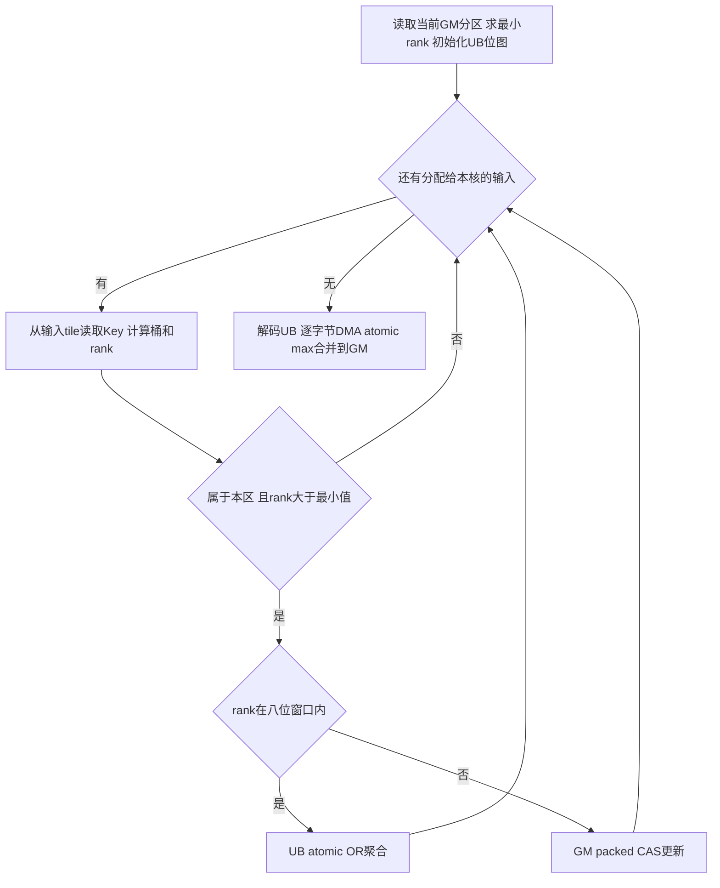

# HyperLogLog 容器设计

本方案在950PR上以单字节sketch实现近似去重计数。设计重点是：用固定hash将输入映射到桶，以UB相对rank窗口减少GM更新，同时通过字节CAS和DMA逐字节max保留完整rank。下文按一次API调用的执行顺序说明布局、计算、并发与内存。

> 同一最终实现的原始功能1280/1280、一次完整串行原始性能72/72达标，干净检出构建及补充运行通过。它们是作者自测，不代表设计评审、平台验收或代码合入通过；完整范围与版本绑定见[证据索引](evidence-index.md)。

**阅读导航**：[详细设计](#详细设计required) → [生命周期](#31-调用方式与生命周期) → [字节布局](#32-gm布局与字节更新粒度) → [hash与rank](#33-输入位表示hash与rank) → [Add分区与覆盖](#34-add的分区前段与输入覆盖) → [UB窗口与CAS](#35-addtiled核内处理与并发正确性) → [Estimate](#37-estimate的确定性归约与修正) → [内存](#39-内存规划与审计范围)。

配套材料：[接口与需求映射](requirements.md) · [72行性能附录](appendix-performance.md) · [复现步骤](reproduce.md) · [官方清单对应](review-checklist.md)。实现源码与原始证据的评审访问入口尚待补充。

# 需求背景（required）

## 1.1 需求来源

需求来源是本任务的 HyperLogLog 容器任务书及随附测试，参考 cuCollections HyperLogLog，在 Ascend 950PR 的 ops-collections 中提供近似去重计数。本文采用任务要求的纯头文件容器工程，代码目标仓为 [ops-collections](https://gitcode.com/cann/ops-collections)。

本文按 [社区设计模板](https://gitcode.com/cann/cann-ops-competitions/blob/b519c405eb235558dccf9af678c5ce17d112df49/04_tasks/01_community-task-2026/resources/design_template.md) 的必需章节组织，模板版本固定于 `b519c405eb235558dccf9af678c5ce17d112df49`；模板中的 Addcdiv 示例不构成本容器要求。

## 1.2 背景介绍

HyperLogLog 用固定大小 sketch 估算输入集合的不同元素数量，适用于无需保存全部元素的流式基数统计。输入可以分批，兼容 sketch 可逐寄存器合并。其结果保留统计误差，不提供精确集合、元素查询或删除。

# 需求分析（required）

支持I32/I64连续Device输入、按KB/标准差/precision构造，以及Create、Destroy、Clear、Add、Merge、Estimate。逻辑sketch容量为8/16/32/64/128/256KiB，`m=KB*1024=2^p`，`p=13..18`，每桶一个8-bit rank。

状态操作必须覆盖空输入、重复、分批、清空复用和兼容合并；相同Key类型、配置和hash策略下状态与估计应可重复。非空基数误差按`3*1.04/sqrt(m)`，72行性能逐行按`实测≤baseline/0.4`验证。完整接口签名、参数异常和实现/证据对应在[需求附录](requirements.md)，不以参考库的四字节布局替代任务定义。

工程采用ops-collections纯头文件模式，依赖Extent、ACL、平台AIV查询、Ascend C SIMT及DMA原子能力；Catch2仅用于测试。无ACLNN注册、广播或TilingKey下发需求。

# 详细设计（required）

## 3.1 调用方式与生命周期

`HyperLogLog<Key>`拥有一块GM存储和一个小型pinned Host统计缓冲。GM存储前部为正式sketch，尾部为统计区。对象禁复制、可移动；移动后源对象失效。构造失败会回收已申请资源，析构不抛异常，显式Destroy可报告ACL释放错误。

```text
构造：校验配置 → 分配GM和pinned Host → Clear → 同步
Add / Merge / Clear：校验状态和参数 → 设备计算 → 同步 → 返回
Estimate：设备直方图 → 小统计区D2H → 同步 → Host修正与舍入
Destroy：释放拥有的资源 → 对象失效
```

KB工厂只接受六档容量；precision工厂接受13..18；标准差工厂选择满足`1.04/sqrt(2^p)≤sd`的最小合法p，非有限/非正或无法满足的值报错。Create是KB工厂别名。调用者必须先建立有效ACL上下文，并在所有容器和输入释放后再销毁上下文。

**待评审的异常契约**：实现对重复Destroy、移动后Destroy采用幂等释放，而target通用表要求空/未初始化句柄报错；该文字差异尚待评审确认。需要有效存储的读写和配置查询会校验状态。void*不携带dtype元数据；类型由Key模板及调用者保证。非空Add校验对齐、字节/地址溢出、Device属性和ACL分配范围；非法流通过ACL调用/同步报错，不声称有额外预启动检测。

## 3.2 GM布局与字节更新粒度

正式sketch只占m字节。为使用32位CAS，把四个相邻8-bit寄存器作为一个访问字；原子访问粒度不是寄存器宽度。p≥13保证m为4的倍数，不需尾部填充。

```text
寄存器编号： 4w       4w+1      4w+2      4w+3
逻辑rank：  byte0     byte1     byte2     byte3
字内位段：  [7:0]    [15:8]   [23:16]   [31:24]

word_index = j >> 2
shift      = 8 * (j & 3)
mask       = 0xff << shift
```

所有Add路径目标相同：`M_after[j]=max(M_before[j],映射到j的全部输入rank)`。除显式Clear外，寄存器只增不减；Merge也逐桶取max。因此重复、排列变化及分批不改变该数学最终状态。

## 3.3 输入位表示、hash与rank

最终实现采用固定seed=0的整数fmix64映射。I32先转uint32再零扩展到64位；I64转uint64（模2^64）。它不是对字节串执行完整MurmurHash3，也不使用可变seed。因此相同数值的负I32和负I64不要求映射相同。

```text
h = unsigned_key_bits
h ^= h >> 33
h *= 0xff51afd7ed558ccd       # 模2^64
h ^= h >> 33
h *= 0xc4ceb9fe1a85ec53       # 模2^64
h ^= h >> 33

j = h >> (64-p)
tail = h的低(64-p)位
rank = tail在(64-p)位内的前导零数 + 1
若tail全零，rank = 65-p
```

代码在`hash_pair.h`用高低uint32及`__umulhi`实现相同模乘，在`kernels.h::Locate`用两段32位CLZ计算rank。合法rank为1..65−p，最大52；未使用寄存器值为0，uint8足够容纳。当前sketch不兼容历史xxHash版本。

## 3.4 Add的分区、前段与输入覆盖

Host入口为`hyperloglog.inl::Add`，当前批量路径调用`kernels.h::AddTiled`。N=0允许nullptr，校验对象后同步返回。非空调用将sketch分成`L=min(m,128KiB)`的分区；256KiB有两区，其余只有一区。

每区先处理`P=min(N,96*m)`个输入，再处理剩余输入。前段用于建立真实rank，后段从实际状态求过滤下界；96是全部类型/容量共用的参数，不假设前段一定得到某个rank。

```text
ValidateInput(keys, N)
P = min(N, 96*m)
for base in [0, L, ..., m-L]:
    launch AddTiled(keys[0:P],   base, L) on stream
    if N > P:
        launch AddTiled(keys[P:N], base, L) on the same stream
Synchronize(stream)
```

每段长度n采用`c=min(AIV,max(1,ceil(n/256)))`个核。令q=n/c、r=n%c，核b处理首位置`q*b+min(b,r)`，长度`q+[b<r]`。这些区间不重叠且覆盖整个段。每核tile按实际剩余长度DMA搬运，1024个SIMT线程以1024为步长遍历tile；256这一Host选核参数不等于Add的VF线程数。

**覆盖依据**：前段和剩余段的并集为[0,N)，核区间再完整分割各段，tile不丢尾部。每个分区扫描全部输入，但只接收属于该分区的桶。256KiB因此读两遍输入，每个桶只在其所属分区更新；没有采样、跳过后段或预先缓存hash数组。

## 3.5 AddTiled核内处理与并发正确性

### 3.5.1 整体流程

每核读取当前GM分区到UB，求最小rank a，再把一字节rank转为表示`a+1..a+8`的八位集合。两个固定输入buffer交替预取。下列伪代码省略事件语法；同步规则见3.8节。



```text
S = DMA_read(GM[base:base+L])
a = min(S)
for each bucket t:
    delta = S[t] - a
    bits[t] = 0 if delta == 0 else 1 << (min(delta,8)-1)

for each assigned input tile, using two fixed buffers:
    for each key in tile:
        (j, r) = Locate(key, p)
        if r <= a: continue
        if j outside [base, base+L): continue
        if r > a+8:
            PackedByteCAS(GM, j, r)
        else:
            t = j-base
            if bits[t] has no bit at or above r-a-1:
                atomic_OR(UB_word[t/4], 1 << (8*(t%4)+r-a-1))

for each bucket t:
    decoded[t] = a if bits[t] == 0 else a+1+highest_set_bit(bits[t])
DMA_byte_atomic_max(GM[base:base+L], decoded)
```

### 3.5.2 为什么最小rank过滤安全

本次内核中GM只有max更新。即使DMA读取S时其他核仍在更新，对每个桶都有`S[j]≤该桶后续GM值`，于是`a=min(S)≤每个后续GM值`。任何`r≤a`都不可能提升目标桶，过滤它不影响结果。这个证明不需要快照在同一时刻取得，也不依赖输入分布。

### 3.5.3 UB窗口怎样保留最大rank

每字节的位集合通过32位atomic OR合并。相邻字节的掩码不重叠；已看到目标rank或更高位时才省略更新，陈旧的较低读取只会增加一次冗余OR。最高置位决定解码rank。

例如a=4，一个桶先后收到rank6和rank10，其相对位为bit1和bit5，合并为`00100010`，解码为10。再收到rank5不会降低结果。

初始化时若S[t]>a+8，UB仅暂存最高位，解码值会小于原rank；原始高rank始终保留在GM，最终写回使用max而非覆盖。新输入r>a+8则直接通过GM CAS更新，不能截断到窗口。两种情况下高rank都不会丢失。

### 3.5.4 packed CAS怎样保护相邻字节

窗口外更新采用缓存一致读取`asc_ldcg`，只替换目标字节；CAS失败后以返回的最新整字重新计算。

```text
old = asc_ldcg(words + (j >> 2))
while byte(old, j & 3) < r:
    desired = (old & ~mask) | (r << shift)
    observed = atomic_CAS(words + (j >> 2), old, desired)
    if observed == old: return
    old = observed
```

例：按byte0到byte3表示一个字的rank为`[3,5,2,7]`。线程A要把byte1提升到9，线程B先把byte2提升到8。A的旧字CAS失败，读取到`[3,5,8,7]`后重算，再成功写入`[3,9,8,7]`，不会把B的8写回2。若所见目标字节已足够大，可直接退出。整个uint32的数值max没有这个逐字节语义，不能替代该协议。

### 3.5.5 DMA合并与最终不变量

核内处理结束后解码UB，使用`SetAtomicMax<int8_t>()`和DataCopy逐字节合并到GM。合法值0..52在signed int8下仍同序。较低解码值不会降低初始高rank、其他核CAS或DMA已经写入的rank，窗口内最高rank则会进入GM。

所有输入按3.4节得到处理，过滤只排除不能提升的rank，窗口内与窗口外都以max进入正式sketch，因此得到3.2节的目标状态。GM CAS和DMA字节原子之间的一致性依赖950PR硬件原子语义；相邻字节争用、高rank及完整sketch的NPU对照提供实测支持，不泛化到未经验证架构。

非拥有型`HyperLogLogRef::Add`使用相同hash/rank定义，直接执行GM字节CAS；外部调用者负责存储生命周期和依赖。文件内其他辅助Add内核不构成当前Host批量路径。

## 3.6 Clear与Merge

Clear、Merge按uint32字分配工作，每个字只有一个工作项写入；核数由`LaunchCores(m/4)`决定，核内使用256线程的grid-stride遍历。Clear写0，保留容器配置和存储。Merge要求两对象有效、同Key类型及同precision，逐字节取max；self-merge只同步返回，源容器不变。

```text
for each owned word w:
    Clear: words[w] = 0
    Merge: words[w] = pack(max(dst.byte[k], src.byte[k]) for k=0..3)
```

这些普通读写不与同对象的无序Add/ref操作重叠；阶段依赖由同步API及调用者串行化建立。Merge的数学状态具有幂等、交换、结合性，API本身是写目标容器的有状态操作。

## 3.7 Estimate的确定性归约与修正

`Histogram`内核每核使用64个uint32桶，统计不重叠的sketch字；清零、屏障、计数、屏障后输出分核直方图。统计核数`s=min(AIV,8,max(1,m/4096))`，不修改sketch。Host只接收256s字节，先合并整数计数，再按rank升序计算`Z=sum(bins[r]*2^-r)`和`V=bins[0]`。同时检查rank≤65−p、计数总和等于m。

```text
e = (0.7213 / (1+1.079/m)) * m*m / Z
bias_correct(e) = e - mean(6 nearest table biases), if e < 5*m; else e
if V > 0:
    h = m * log(m/V)
    if e <= 2.5*m: result = h
    else: result = h if h <= threshold[p] else bias_correct(e)
else:
    result = bias_correct(e)
return Round(result)
```

threshold[p13..18]为6500、15500、20000、50000、120000、350000。`finalizer.h`从固定cuCollections表按平方距离选连续六近邻并求平均偏差，只有新距离严格更小时才移动窗口，保持等距选择稳定。Round对非正值返回0，否则std::round（半值远离0）；达到uint64边界则饱和。

固定整数直方图与Host累加顺序保证已验证环境内重复性，不承诺未验证libm跨平台逐位一致。Host没有接收输入键或精确去重；HLL++表是通用统计修正表，不是测试答案缓存。

## 3.8 DMA事件、流与外部依赖

分区初始化的MTE2_V确保rank搬运完成后再求最小值；双输入buffer的MTE2_V/V_MTE2确保消费前数据就绪、复用前读者完成。解码后通过V_MTE3衔接输出，DMA max完成后等待MTE3_S，再关闭DMA原子模式。

前段、剩余段和各分区在同一流依次入队；普通计算API在返回前同步指定流。跨流顺序调用依赖前一调用完成，外部异步ref操作需要调用者建立依赖；同一对象的Host方法也必须串行，const Estimate会复用统计区，不能据const推断线程安全。补充验证覆盖有序跨流，不承诺无序Clear/Destroy与Add并发。

## 3.9 内存规划与审计范围

令s=min(AIV,8,max(1,m/4096))，L=min(m,128KiB)，B=floor((216KiB−L−256)/(2×32KiB))×32KiB。

| 区域 | 用途 | 显式大小 / 生命周期 |
| --- | --- | --- |
| GM | 唯一正式sketch及分核64桶统计 | m+256s B，构造到销毁；统计非额外sketch |
| pinned Host | 回传统计 | 256s B，最多2048 B，构造到销毁 |
| UB Add每核 | 当前分区临时rank位图、元数据、两输入tile | L+256+2B B，内核期间复用；不随N增长 |
| UB Estimate每核 | 64个uint32统计桶 | 256 B |
| 普通Host | 归约桶、对象、静态偏差表 | 64个计数及固定表/对象；不是pinned分配审计的全部Host占用 |

| Sketch KiB | s（56 AIV） | GM bytes | pinned bytes | 每核Add UB KiB |
| ---: | ---: | ---: | ---: | ---: |
| 8 | 2 | 8704 | 512 | 200.25 |
| 16 | 4 | 17408 | 1024 | 208.25 |
| 32 | 8 | 34816 | 2048 | 160.25 |
| 64 | 8 | 67584 | 2048 | 192.25 |
| 128 | 8 | 133120 | 2048 | 192.25 |
| 256 | 8 | 264192 | 2048 | 192.25 |

UB为各核临时副本，并没有增加逻辑桶数或存储更多hash信息；256KiB两分区顺序复用。输入Device内存由调用者拥有，容量N×sizeof(Key)不算容器额外分配；输入只在固定UB tile内短暂复制，不另建N规模GM副本。12配置×16轮的linker wrapper审计覆盖容器显式aclrtMalloc/Free和MallocHost/Free，不能据此声称覆盖驱动、ACL内部缓存、物理页粒度或编译器隐式UB开销。208.25KiB上限小于实测硬件248KiB；后续编译器仍需独立验证资源约束。

## 3.10 工程接入、调用示例与来源

```text
include/hyperloglog.h                         拥有型公开API
include/hyperloglog_ref.h                     非拥有型设备引用
include/detail/hyperloglog/
  hyperloglog.inl kernels.h hash_pair.h       Host与设备实现
  finalizer.h tuning.h LICENSE.cuCollections  估计修正与许可
tests/hyperloglog/                            六类原测试及独立补充测试
tests/performance/hyperloglog/                六类原性能测试
tests/common/hll_test_common.h                原helper
docs/examples/hyperloglog_example.cpp         完整可运行API示例
scripts/build_hyperloglog.sh                  构建16目标
scripts/run_hyperloglog_validation.py         原始1280/72验证与证据记录
scripts/run_hyperloglog_supplemental.py        独立补充验证
```

使用已有ops-collections的Extent、SIMT适配宏、平台查询和ACL运行时；无op_host/op_kernel、ACLNN接口或TilingKey注册需求。Host以参数传入核数、分区、tile和dtype模板实例；本任务不适用普通张量算子的广播/自动求导/TBE迁移目录。新增CMake注册对其他容器保持原路径，未重新验证整个仓库所有其他容器。

参考流程为“输入hash→桶/rank max→HLL++估计”；本实现保持该数学流程，以字节寄存器、UB位图和950 DMA原子实现代替CUDA寄存器原子路径。cuCollections参考中的存储宽度和配置常数不覆盖target。finalizer/tuning改编自cuCollections固定提交`532795b81e72e3fe4ce2b26eb0c5abc8abb1e2b4`，保留NVIDIA版权与Apache-2.0及LICENSE.cuCollections；工程其他新增代码沿用根LICENSE的CANN Open Software License 2.0。Catch2 v3.5.4仅为测试依赖，归档保留其许可证。fmix64采用MurmurHash3公开算法的常量/运算，当前word-pair实现来源说明见hash_pair.h，不将其称为cuCollections默认hash。

以下为已有ACL context/stream和Device输入下的调用片段；完整示例含初始化、错误处理和RAII，入口见上方目录树与复现说明：

```cpp
auto hll = aclco::HyperLogLog<std::int64_t>::CreateWithSketchSizeKB(8, stream);
hll.Add(device_keys, aclco::Extent<std::size_t>(count), stream);
auto estimate = hll.Estimate(stream);
auto other = aclco::HyperLogLog<std::int64_t>::CreateWithPrecision(13, stream);
other.Merge(hll, stream);
hll.Clear(stream);
hll.Destroy(); // input及所有容器释放后才能销毁ACL context
```

特性交叉：小容量/大输入由固定tile复用；256KiB由分区处理；重复与分批由max幂等保证；负数按位转换；高rank不被窗口截断；跨流需顺序；Merge不能混精度或hash策略。泛化依靠同一公式与路径，不对特定测试参数返回缓存答案。

## 3.11 支持硬件、兼容性与方案取舍

| 硬件 / 工具链 | 状态 |
| --- | --- |
| Ascend 950PR，CANN 9.1.0-beta.3，Bisheng dav-3510 | 当前实际编译和测试环境；完整通过范围见自测报告 |
| 其他 Atlas 950 型号 / 后续 SIMT 硬件 / 其他 CANN 版本 | 未验证，不由当前设备结果推断 |

不支持不同precision合并、动态扩容、精确删除或历史xxHash sketch混用；void*实际dtype和有效ACL上下文由调用者负责。

采用任务指定的单字节布局；与CUDA参考相同的主线是“hash → rank max → HLL++”，具体原子、工作区和流实现针对950PR。保持xxHash64的候选已有实测未达标记录后，才选择固定fmix64并重新验证最终状态与精度；关键失败证据见索引E6。96m前段、分区及固定UB tile均为通用参数化路径，不识别测试行或缓存结果。

# 可维可测分析

## 4.1 精度与性能标准

| 验收项目 | 标准 | 来源 |
| --- | --- | --- |
| 相对误差 | 非空真实基数 N 的误差 <=3*1.04/sqrt(m)；空 sketch 输出 0 | target 3.2 及原 helper |
| 性能 | 每行原始 API 时延 <= 该行 baseline/0.4，72 行全覆盖 | target 3.3 / 3.5 |
| 内存 | 每寄存器 1 byte；无与输入规模线性重复的额外 Device 副本 | target 3.4 |

## 4.2 验证方法与日志

原始 13 个测试源码/helper 按字节保留，哈希位于 tests/hyperloglog/target_manifest.json。原始性能表以独立 JSON 固定为 72 行。额外 listener 仅观察 Catch2 的部分执行事件，记录实际 dtype/SECTION 展开数量与断言结果。

功能分片只用 Catch2 公开的名称/标签/SECTION 选择接口，原 GENERATE 保持完整，实际覆盖1280个组合。性能与功能任务分离，在无其他测试进程时单独串行执行，逐行要求实测 <= 标杆/0.4。两类证据以同一实现SHA256绑定，不将小规模探测、CPU对照或编译通过当作平台验收。

补充检查覆盖负数/极值、完整 sketch 的 Host/Device 一致性、跨流有序调用、分批指针偏移、移动赋值、自合并、销毁后使用、Host 指针/越界/溢出和静态工作空间上界。这些不计入原始 1280。

## 4.3 实测范围与兼容性

验证环境为950PR、CANN 9.1.0-beta.3、Bisheng dav-3510、C++17、Catch2 v3.5.4。其他硬件及工具链版本未验证。

### 作者本地自测摘要

最终实现SHA256：`5107ffc5f5cda78361bc4c201d1077a486236f8a9f0cbdf86d8b55682831b05a`。

| 原始接口 | 功能组合通过数 | 原始性能行通过数 |
| --- | ---: | ---: |
| Create | 38/38 | 12/12 |
| Destroy | 24/24 | 12/12 |
| Clear | 180/180 | 12/12 |
| Add | 726/726 | 12/12 |
| Merge | 192/192 | 12/12 |
| Estimate | 120/120 | 12/12 |
| 合计 | 1280/1280，失败断言0 | 72/72，同一轮完整串行测量 |

64 KiB Add的I32实测788.940us（上限804.4625us），I64实测905.140us（上限953.9875us）。原始框架CPU/Device两列均来自Host chrono，本实现同步接口使其包含设备完成等待；这不是两个独立的设备事件计时。

补充验证包含7个展开组合、336个断言，以及原始大规模6组合（每组1亿输入）。完整sketch oracle在8KiB和256KiB分别覆盖900余万和3600余万随机键，并检查相邻字节争用、重复/分批、高rank、清空复用和移动生命周期。另有多TU、API示例、12种配置各16轮显式分配审计；审计范围为容器显式ACL分配，不包含运行时全部内部内存。

从干净Git检出全新构建固定版本Catch2及16个目标，并用新产物运行补充组合、多TU、API示例、内存审计，通过且退出码0。源码、原始测试、构建清单和运行日志已按哈希保存。上述均为作者自测，社区设计评审、平台验收与代码合入仍待各自流程完成。

完整72行见[性能附录](appendix-performance.md)。最接近门槛的Add I32/64KiB为788.940μs，上限804.4625μs，余量15.5225μs（1.9295%）。复现命令见[复现步骤](reproduce.md)，历史已执行记录与供独立复现的命令分开说明。
