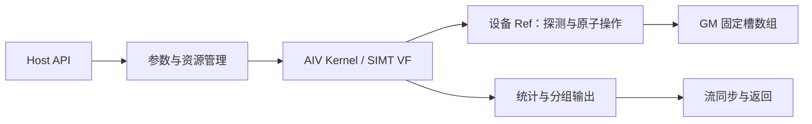

# static_multiset（950）容器设计方案

本方案提交设计评审，说明接口约定、数据结构、Ascend C 实现方法及验证计划。已有可行性原型用于辅助方案选择；设计批准、完整验证和最终验收仍待完成。接口冲突和需要评审确认的事项在下文单独列出。

## 1. 需求背景（required）

### 1.1 需求来源

本设计对应[9月社区任务—multiset容器开发（950）](https://www.hiascend.com/activities/task-center/details/214f40e300a347c7b21e445fa8671e62?menu=tasks)，以任务书及随附功能、性能测试为依据。正式容器实现接入 [cann/ops-collections](https://gitcode.com/cann/ops-collections)，采用纯头文件容器工程模式。

### 1.2 背景介绍与现状分析

静态多值集合在创建时确定容量，允许相同 key 多次出现，批量查询、计数和检索须保留每个 key 的重复次数。Key 支持 int32_t 和 int64_t。

参考 cuCollections 的 static_multiset 公开语义及 Host/Device Ref 分工。ops-collections 基线已有 StaticSet，可参考其 ACL 资源管理、散列、SIMT 发射和测试接入方式；其重复键去重逻辑不适用于本任务，需要独立的多值插入、计数和检索实现。

本方案选择每次成功插入占用一个槽位的开放寻址结构，并采用按编码值固定优先级的原子插入。选择这一方案的目的是同时保留重复键、限制额外存储，并为相同输入下的布局及检索确定性提供依据。原子竞争、满表边界和大规模检索成本是后续重点验证对象。

## 2. 需求分析

### 2.1 需求描述

实现 Create、Destroy、Clear、Insert、InsertIf、Contains、ContainsIf、Find、FindIf、Count、CountEach、CountEachOuter、Retrieve、RetrieveAll 共 14 项能力；补充附件使用的 Size 和 Capacity。Create/Destroy 通过构造和析构提供。

支持固定容量、多批插入、清空后复用、空输入、重复键、重复查询、不同重复次数、命中/未命中及容量边界。输入输出为连续 Device 数组，不涉及张量广播。任务未要求的删除、自动扩容和跨流无依赖并发不纳入本次设计。

### 2.2 功能拆解与语义

记 m(k) 为 key k 的出现次数，N 为输入或查询数量，S 为 Size，C 为实际 Capacity。

| 能力 | 状态变化或输出 | 主要约束 |
| --- | --- | --- |
| Create / Destroy | 分配并初始化固定存储 / 释放所拥有的资源 | 构造失败不泄漏，禁止隐式复制 |
| Clear | 全部槽置空，S 归零 | C 保持不变 |
| Insert / InsertIf | 每个成功插入使对应 m(k) 加一 | 条件接口只处理谓词为真的位置；返回值提案为失败数 |
| Contains / ContainsIf | 按查询位置输出 m(k)>0 | 未选中位置写 false |
| Find / FindIf | 命中返回 key，否则 emptyKey | 未选中位置写 emptyKey |
| Count | 对每个查询位置独立累加 m(k) | 重复查询重复计入；uint64 总计数 |
| CountEach | 每个查询输出 m(k) | 未命中为 0 |
| CountEachOuter | 每个查询输出 max(1,m(k)) | 未命中为 1 |
| Retrieve | 每次查询输出全部匹配的 (query,key) 对 | 返回对数 R，两路输出均容纳 R 个元素 |
| RetrieveAll | 输出所有成功插入的元素 | 保留重复次数，返回 S |
| Size / Capacity | 返回含重复的元素总数 / 实际可用槽数 | 64 位公开计数 |

例如集合为 [5,5,9]，查询为 [5,7,5]，则 CountEach=[2,0,2]，Count=4，Retrieve 输出四对 (5,5)。

### 2.3 参数与接口适配

| 参数 | 类型及排布 | 说明 |
| --- | --- | --- |
| keys / queries | Device 连续 I32/I64 数组 [N] | emptyKey 为保留值，不允许正常插入 |
| capacity / N | uint64；Host 适配 aclco::Extent<std::size_t> | 容量须为正；字节数计算检查溢出 |
| stencil | Device uint32 数组 [N] | 与输入逐项对应 |
| pred | Device 可调用谓词 | 对 stencil 元素返回 bool |
| output | bool、Key 或 uint64 数组 | Contains 为逐项 0/1，Find 为 Key，逐项计数为 uint64 |
| outputCapacity | 元素数量 | Retrieve 两路输出及 RetrieveAll 在写出前检查容量 |
| stream | aclrtStream | 同步接口返回前完成相关设备工作并检查错误 |

随附测试的调用形式如下，作为兼容层依据；这不是对 cuCollections 全部重载已经兼容的声明：

```cpp
StaticMultiset<Key>(capacity, emptyKey, stream);
Clear(stream);
Insert(keys, n, stream);
InsertIf<uint32_t, Pred>(keys, stencil, n, stream);
Contains(queries, output, n, stream);
ContainsIf<uint32_t, Pred>(queries, stencil, output, n, stream);
Find(queries, output, n, stream);
FindIf<uint32_t, Pred>(queries, stencil, output, n, stream);
Count(queries, n, stream);
CountEach(queries, output, n, stream);
CountEachOuter(queries, output, n, stream);
Retrieve(queries, n, probeOutput, matchOutput, outputCapacity, stream);
RetrieveAll(output, outputCapacity, stream);
Size(stream);
Capacity();
```

任务书要求与参考库保持参数顺序和语义，附件却采用部分不同的调用形式。正式公开接口需根据评审结论补齐参考顺序与附件顺序的映射，必要时通过 Host 转发重载兼容，不重复发射 Kernel。若保留显式谓词、哈希或等价策略对象，其状态必须传入设备计算，不能静默改为默认对象。当前原型覆盖附件的默认构造谓词调用，不将其视为全部参考接口已实现。

### 2.4 待评审确认事项

| 问题 | 本方案提案及边界 |
| --- | --- |
| Insert/InsertIf 返回值 | 按附件与目标仓调用习惯返回失败数；需明确与固定 cuco 版本的返回值差异 |
| 输入数超过剩余容量 | 允许部分成功，保留输入顺序中最先满足条件的合法元素；与任务参数表中的范围限制须统一 |
| 空指针 | 零长度允许空缓冲；非零插入 keys 为空时以 N 报告失败且不读取 stencil；keys 有效而 stencil 为空时报错；其他需要读写的非零缓冲为空时报错 |
| 非法 emptyKey | 禁止插入，报告 invalid_argument；其他合法键可能已插入，不承诺整批回滚 |
| 检索输出不足 | 先计数，容量不足时报 length_error，输出保持原内容 |
| 指针实际长度 | Host 检查非空、对齐及整数溢出；真实分配长度、可访问性和不重叠由调用者保证 |
| 确定性范围 | 保证同一软硬件配置、输入及操作序列下输出可重复；固定分组遍历，不承诺全局按键升序或跨不同核数的相同原始顺序 |
| 测试依赖与计时 | 附件公共头缺少 static_multimap 配套依赖，需确认隔离方式或官方修订包；确认标杆与附件同步接口墙钟计时的可比范围 |

以上为待本设计评审确定的契约，不能仅凭另一个参与者的设计已合入就认定这些选择已获得对本实现的批准。

## 3. 详细设计

### 3.1 工程结构与职责

```text
ops-collections/
├── include/static_multiset.h
├── include/static_multiset_ref.h
├── include/detail/static_multiset/
├── tests/static_multiset/
├── tests/performance/static_multiset/
├── docs/static_multiset_API文档和使用示例.md
└── README.md
```

Host 对象拥有设备存储，负责 RAII、参数和字节数检查、工作区管理、内核发射与结果回读；禁止复制，移动转移所有权。设备 Ref 不拥有资源，负责单键探测和原子插入；批量 Kernel 负责线程分工、条件筛选、归约和检索输出。



### 3.2 Host 侧设计

构造时将请求容量向上取为 2 的幂 C，检查容量取整和 C*sizeof(Key) 的溢出，分配槽数组及统计空间并初始化。Capacity 返回实际 C。Clear 复用存储，重置全部槽、Size 和检索元数据；析构仅释放对象持有的资源，不销毁调用方的 ACL 流。

同一对象的公开 API 由调用方串行化。每个同步接口返回前等待相关流完成，标量回读后再更新 Host 状态。初始化与使用保持有效的流依赖，不能假定不同流自动排序。ACL 失败可能发生在部分设备修改之后，调用方需处理错误并重新建立有效容器状态。

#### 分核与分块

查询平台支持的 AIV 核数，根据工作量选择实际块数；普通操作按 N 分配，Clear/RetrieveAll 按 C 分配。逻辑线程采用 grid-stride 遍历；归约和输出在 32-lane 组内协作，尾部不足整组时无效 lane 仍按算法要求参与同步操作。

普通 Kernel 每核 1024 线程、RetrieveAll 每核 2048 线程作为当前候选配置；最终选择结合编译资源与实测确定，核数不写死。公共长度、容量、偏移和计数使用 uint64；仅在 Host 证明全部相关索引及跨步计算可表示时选择 uint32 内部路径，否则使用 uint64。

#### Kernel 分派

本任务为头文件容器，不新增 ACLNN 图算子的 Tiling 注册。按操作、Key 宽度、谓词模板和经过范围检查的索引宽度选择 Kernel；Host 传入实际容量、输入数量和输出容量。不同实现路径必须遵守同一公开契约。

### 3.3 静态存储与内存预算

每个成功插入的 occurrence 占一个 Key 宽度槽。设 Word 为 Key 对应的无符号类型，编码为 Word(key)-Word(emptyKey)-1，按位宽取模；保留空键映射为 Word 最大值，作为内部空槽标记，其他 key 可逆还原。初始哈希使用原 key。无需 tombstone、删除或扩容结构。

主表占 C*sizeof(Key)，成功/失败/非法键计数占 24 字节。设 Retrieve 和 RetrieveAll 发射的组数为 Wq、Wa，额外 Device 工作区分别为 8Wq 和 8Wa 字节，同时存活时累加；Host 前缀数组按相应组数分配。工作区随发射组数而非整批输入元素数增长，不保存额外的整份 Device 输入副本。

以 56 核、普通 1024 线程和 RetrieveAll 2048 线程的候选配置为例，Wq=1792、Wa=3584，额外 Device 元数据上限为 43032 字节，不含主表、调用方输出及运行时管理开销。容量取整需计入真实占用；正式验证记录所有工作区同时存活时的峰值。

### 3.4 Kernel 侧设计

#### 插入与满表处理

采用固定编码优先级的线性探测。从原 key 的哈希位置开始，对每个槽执行同宽无符号 AscendC::Simt::AtomicMin，槽保留较小编码，线程携带较大编码继续向后探测。返回旧值为空标记时完成插入；相等编码也继续探测，保留重复次数。

一次原子交换重新分配槽和线程各自拥有的元素，不丢弃被置换的元素。插入期间槽访问使用同宽原子操作，不混入普通预读；非空槽不重新变空，槽值只会减小。查询、Clear 与插入按独立阶段执行，不使用跨核自旋屏障。

只有当本批输入数不超过剩余槽数时进入并行路径。潜在溢出路径按输入顺序选择并串行插入，填满后禁止继续替换，避免满表时丢失线程携带的元素。每次探测最多遍历 C 个槽；该路径的代价纳入完整插入耗时。成功、失败和非法计数先局部归约，再以 uint64 汇总。

布局确定性的设计依据是编码优先级：较大值不能改变较小值最终占据的位置，相同 key 的 occurrence 可互换，期望终态等价于按优先级串行插入。该推理依赖线性化原子操作、有效初始布局、容量约束与读写阶段隔离；后续需结合模型检查和 NPU 多批、碰撞及重复执行测试验证，不能由有限样本推出一般规模形式化证明。

#### 查询与计数

从查询 key 的哈希起点检查编码。若槽值大于查询编码（含空槽），可停止；否则继续，最多检查 C 个槽。某元素曾经过的槽当时必保留不大于它的值，随后槽值只会减小，这是提前结束的依据。

Contains/Find 命中一次即可返回；Count 系列累计完整探测区间内的全部相等编码，不能在首次命中或首个不相等的非空槽处停止。条件为假的位置也写入明确的 false/emptyKey。总 Count 对每个查询位置独立累计，组内与全局累计都使用 uint64。

Host 对 n*Size 做保守溢出检查。该检查可能拒绝实际匹配数未溢出但理论上界过大的输入，需作为公开限制提交评审。

#### 检索与确定输出

Retrieve 先按固定组分工计数，回读 O(Wq) 元数据并计算 uint64 排他前缀和；确认两路输出容量后，再发射写出 Kernel。组内按固定轮次和 lane 顺序分配区间，每个查询保留所有匹配次数。

RetrieveAll 按固定组序统计并压缩非空槽，利用 ballot 与位计数计算组内偏移，并解码回原 Key。容器状态未变时可复用组偏移；任意修改均使其失效，包括发生部分插入后报错的路径。首次构建、重复调用及完整调用链均纳入相应测量说明。

输出采用确定的分组遍历顺序。若维护者要求全局键排序、严格查询原顺序或跨不同发射配置的相同原始数组，应据评审结论调整输出算法并重新评估全部成本，不能仅凭排序后比较通过就声明满足更强要求。

### 3.5 性能优化方案与风险

| 路径 | 优化方向 | 需要验证的风险 |
| --- | --- | --- |
| Insert/InsertIf | 组内汇总统计，减少全局计数竞争，调节线程配置 | 重复键和高占用率导致原子竞争；溢出串行路径较慢 |
| Contains/Find | 按优先级提前结束，满足范围时使用较窄内部索引 | 提前结束条件必须正确；高命中率的探测成本 |
| Count 系列 | 局部累计与组内归约 | 64 位溢出、强碰撞时完整扫描成本 |
| Retrieve/RetrieveAll | 分组计数、前缀和及并行压缩，复用有效元数据 | 元数据失效、尾部同步、端到端带宽与回读成本 |

优化基于真实输入范围和性能分析，不按公开测试的特定数值生成结果。线程数、核数、首次/重复调用差异须有实测依据；没有采集到硬件指标时不把瓶颈归因写成已确认事实。

### 3.6 支持硬件与约束

目标为任务书指定的 Atlas 950 系列，CANN 9.0.0-beta.2 及以上，C++17，CMake ≥3.16，Catch2 ≥3.5.4。当前可行性环境为 Ascend950PR、CANN 9.1.0、Ubuntu 22.04、bisheng clang 15.0.5，编译目标 dav-3510；最低版本尚未上板验证，不能据此推断 A2/A3 支持。

Key 限 I32/I64，保留空键不可插入，容量固定。极端碰撞和高度重复会使单次探测代价与容量线性相关。裸指针接口不具有任意设备分配长度的自动识别能力；公开接口的策略对象、异常及确定性边界按第 2.4 节评审结果定案。

## 4. 可维可测分析

### 4.1 精度标准与功能验证计划

整数键、计数、布尔输出及多重集合状态要求精确一致，以 Host 多重集合 oracle 和固定版本参考语义核对，不使用浮点容差。完整执行附件 14 个功能文件覆盖的 1258 组组合，并按实际运行日志确认展开覆盖。

补充验证包括：逐 key 的完整重复次数、重复查询贡献、随机多批插入、负数/极值、空输入、满表和溢出保留前缀、保留空键、移动与异常释放、输出不足不写、元数据失效，以及独立重建后的原始输出可重复性。强制 uint64 内部路径与超过 2^32-1 的真实计数分别验证；小规模强制路径不等于测试了超过 2^32 个槽。

附件原测试与执行副本分开保存。公共测试头对 static_multimap 的缺失依赖，按维护者认可的隔离方式或修订包接入；保留改动说明，不删除原功能断言。

### 4.2 性能标准与测试方法

逐项执行附件 10 个性能文件覆盖的 44 项基线，每项满足 T950 ≤ Tbaseline/0.4。未达标项目保存原始数据及解释，由验收方判断，不能用总体平均达标率代替逐项要求。

沿用附件的输入生成、参数和统计方法，使用 Release 构建。附件以 Host 墙钟包围同步接口，CPU/Device 两列填入同一值；报告应注明，不将其称为独立设备计时。同步等待、检索前缀处理、必要输出规范化均纳入完整调用成本。性能分析工具单独采样，其结果不替换附件计时。

### 4.3 内存、兼容性与交付验证

记录主表、输出、Host/Device 工作区的分配和峰值；检索输出设置保护区，检查越界。对构造、Clear、移动、析构和错误路径验证资源释放。使用当前 CANN 支持的检测工具检查访问、初始化、同步等问题，结合工具记录及应用结果判定，不能只看退出码。

新增容器保持既有 StaticSet/StaticMap 语义不变；在 tests/CMakeLists.txt 接入功能与性能目录，公共集成改动运行对应回归。正式交付提供 API 与调用示例、构建运行说明、同一最终版本的功能/性能/内存报告和日志，并记录硬件、工具链及代码提交号。


