# static_multiset 容器设计文档（Atlas 950 / Ascend C）

> 对应任务：9月社区任务-multiset容器开发(950)（任务编号 66）
> 目标仓库：[cann/ops-collections](https://gitcode.com/cann/ops-collections)
> 对标实现：[NVIDIA cuCollections static_multiset](https://github.com/NVIDIA/cuCollections/blob/dev/include/cuco/static_multiset.cuh)

# 一、需求背景（required）

## 1.1 需求来源

通过社区任务向昇腾开源仓 ops-collections 贡献 `static_multiset` 容器：参考 cuCollections 的 `static_multiset`，在 Atlas 950 上使用 Ascend C（SIMT + SIMD 混合编程）实现功能一致的静态容量多值集合，完成设计、开发、测试并合入 ops-collections。

## 1.2 背景介绍

### 1.2.1 static_multiset 实现优化

该容器没有 TBE 版本，参考实现为 cuCollections（GPU/CUDA）。昇腾侧基于 ops-collections 已有的开放寻址基础设施（`StaticSet` / `StaticMap` 使用的 Extent、探测策略、哈希函数、SIMT 核函数调度方式）实现，不修改既有容器的公开接口。

参考实现路径（cuCollections `dev` 分支，commit `532795b81e72e3fe4ce2b26eb0c5abc8abb1e2b4`）：

| 类别 | 路径 | 说明 |
| --- | --- | --- |
| 容器接口 | `include/cuco/static_multiset.cuh` | 模板参数、构造函数与全部批量接口 |
| 容器实现 | `include/cuco/detail/static_multiset/static_multiset.inl` | 接口到 `open_addressing_impl` 的转发 |
| host 侧实现 | `include/cuco/detail/open_addressing/open_addressing_impl.cuh` | 核函数下发、计数器、`retrieve_all` / `size` 的 CUB 实现 |
| 设备侧实现 | `include/cuco/detail/open_addressing/open_addressing_ref_impl.cuh` | 探测、插入 CAS、`count` / `retrieve` 的逐 key 逻辑 |
| 核函数 | `include/cuco/detail/open_addressing/kernels.cuh` | `insert_if_n`、`contains_if_n`、`find_if_n`、`count`、`count_each`、`retrieve` |
| 比较器 | `include/cuco/detail/equal_wrapper.cuh` | `AllowsDuplicates=true` 时插入跳过 key 比较 |
| 存储 | `include/cuco/detail/storage/bucket_storage.inl` | 槽数组申请与初始化 |

昇腾侧复用的 ops-collections 基础（commit `9d12996d4317e28420d74bcb1ec4d3b3507599ce`）：

| 路径 | 复用内容 |
| --- | --- |
| `include/extent.h`、`include/detail/extent/extent.inl` | `Extent`、`MakeValidExtent`（素数桶数 × bucket 大小） |
| `include/probing_scheme.h` | `LinearProbing` / `DoubleHashing` 探测策略类型 |
| `include/hash_functions.h` | `murmurhash3_32`、`xxhash_32` |
| `include/utility/equal_wrapper.h`、`include/utility/atomic_cas_wrap.h` | key 比较、SIMT 原子 CAS |
| `include/detail/storages/bucket_storage_ref.h` | 设备端槽数组引用 |
| `include/detail/open_addressing/kernels.h` | 小表清空用的 SIMT `Clear` 核函数 |
| `include/static_set.h` | SIMT 核函数下发方式（`<<<核数, 0, stream>>>` + `VF_CALL`）与同步/异步接口风格 |
| `tests/common/*`、`tests/performance/performance_test_framework.h` | 测试公共件与性能测试框架 |

### 1.2.2 static_multiset 现状分析

#### 1.2.2.1 参考实现支持的数据类型和数据格式

| 参数 | 含义 | cuCollections 支持 | 本任务要求 | 数据排布 |
| --- | --- | --- | --- | --- |
| key | 集合元素 | 可按位比较的平凡类型（整型、自定义结构体） | I32、I64 | 一维（ND 展平） |
| stencil | `*_if` 条件模板 | 任意可被谓词调用的类型 | uint32 | 一维，与 key 等长 |
| Contains 输出 | 是否存在 | 可由 bool 赋值的类型 | bool | 一维，与 key 等长 |
| Find 输出 | 命中的 key | key 类型 | 与 key 相同 | 一维，与 key 等长 |
| Count 返回 | 匹配总数 | `size_type`（`std::size_t`） | uint64 | 标量 |
| CountEach 输出 | 每个 key 的匹配数 | 可由 `size_type` 赋值的类型 | uint64 | 一维，与 key 等长 |
| Retrieve 输出 | 查询 key / 表中 key | key 类型 | 与 key 相同 | 一维，长度 = 匹配数 |

cuCollections 默认配置：`double_hashing<4, default_hash_function<Key>>`（协作组大小 4，哈希为 xxhash_32），`storage<2>`（bucket 大小 2）。

#### 1.2.2.2 参考实现描述

cuCollections `static_multiset` 是基于开放寻址的静态容量哈希多重集合：

1. **构造 / 清空**：按 `MakeValidExtent` 规则把容量上取整为「素数 × bucket 大小」，申请槽数组后用 `thrust::for_each_n` 并行把每个槽写成空 key 哨兵。
2. **插入（insert / insert_if）**：`insert_if_n` 核函数对每个 key 计算双重哈希探测序列，逐 bucket 查找可用槽（空槽或删除墓碑），以 CAS 占用；CAS 失败继续检查后续槽。`equal_wrapper` 在 `AllowsDuplicates=true` 时跳过 key 相等比较，因此重复 key 总是占用新槽。`insert_if` 通过原子计数器返回成功插入数，`insert` 不返回值。
3. **查询（contains / find 及 `_if` 版本）**：沿探测序列遇到第一个相等 key 即命中，遇到空槽即判定不存在；`find` 输出命中的表内元素或空哨兵。
4. **计数（count / count_each / count_each_outer）**：`ref.count(key)` 沿探测序列逐 bucket 统计相等槽，直到出现空槽；`count` 核函数在线程块内求和后原子累加到全局计数器；`count_each` 逐 key 写出计数，`outer` 版本把 0 记为 1。
5. **检索（retrieve）**：单遍完成。每个线程块维护共享缓冲区，探测到的匹配先写入缓冲区，缓冲区满或结束时用原子计数器 `fetch_add` 预留输出区间再整体写出，因此输出顺序取决于线程调度。
6. **全量检索（retrieve_all）/ size**：`retrieve_all` 用 `cub::DeviceSelect::If` 以「槽非空」为谓词压缩整张表；`size` 用 `cub::DeviceReduce::TransformReduce` 统计非空槽。两者都会同步 stream。

#### 1.2.2.3 参考实现流程图

**构造 / Clear**

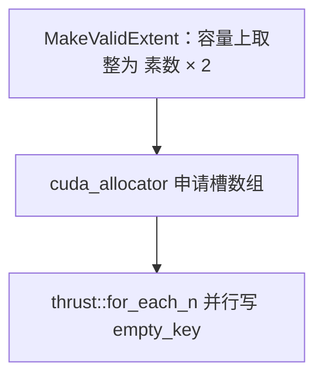

**insert / insert_if**

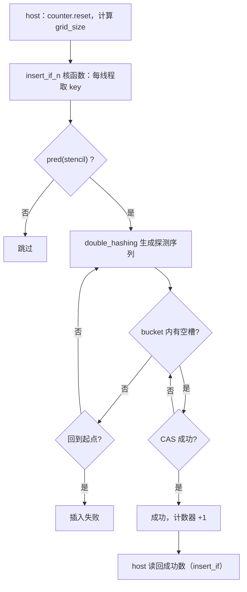

**contains / find / count / count_each**

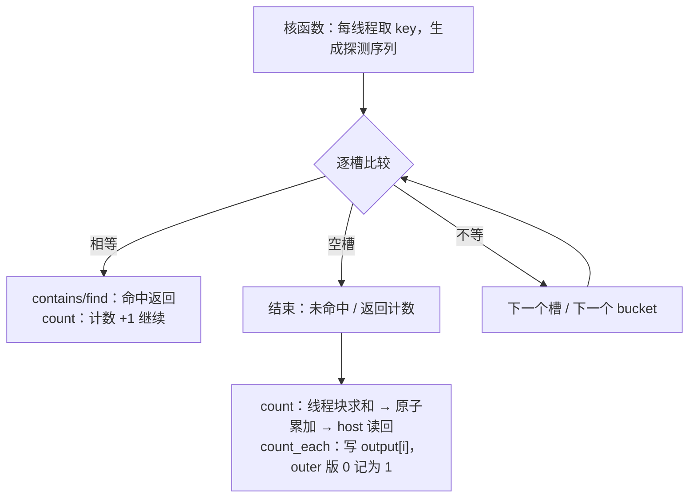

**retrieve**

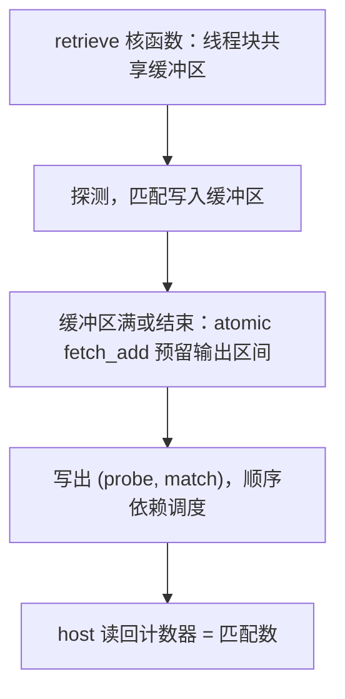

**retrieve_all / size**

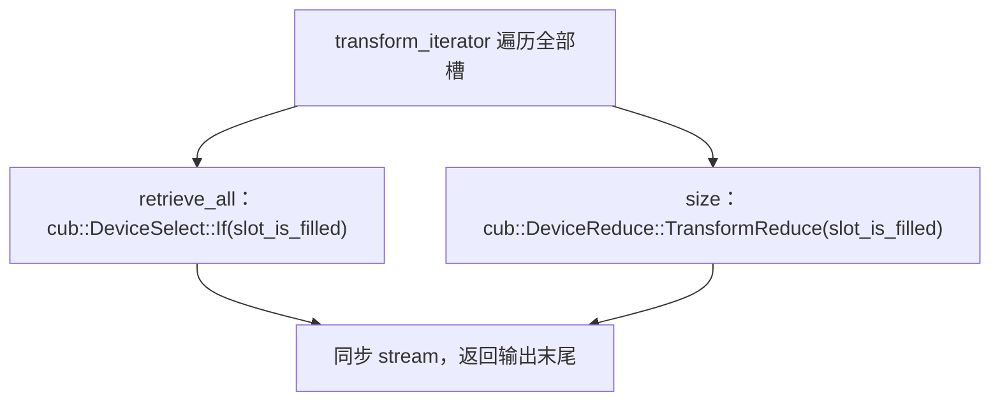

### 1.2.3 ops-collections 现状

ops-collections 已有的 `StaticSet` 基于同一套开放寻址框架，但语义为「不允许重复 key」：插入遇到相等 key 返回 DUPLICATE，`Count` 只返回 0/1，且没有 `CountEach`、`CountEachOuter`、`Retrieve`、`RetrieveAll`、`Size` 接口。因此需要新增允许重复 key 的设备端探测逻辑和配套核函数，而不是在 `StaticSet` 上加开关（避免影响已合入容器的行为与性能）。

# 二、需求分析（required）

## 2.1 外部组件依赖

| 组件 | 版本 | 用途 |
| --- | --- | --- |
| CANN Toolkit | 9.0.0-beta.2 及以上（开发验证环境为 9.1.0） | Ascend C 头文件、runtime、`platform` / `tiling_api` 库 |
| 编译器 | bisheng（`--npu-arch=dav-3510`）或 ccec（`--cce-aicore-arch=dav-c310`） | 编译 Ascend C 核函数 |
| CMake | 3.16 及以上 | 构建 |
| Catch2 | v3.5.4（仅测试） | 功能测试框架 |

不引入新的第三方组件；容器本身为纯头文件。

## 2.2 内部适配模块

| 模块 | 状态 | 说明 |
| --- | --- | --- |
| `Extent` / `MakeValidExtent` | 复用 | 容量合法化 |
| `LinearProbing` + `murmurhash3_32`（默认）、`DoubleHashing` + `xxhash_32` | 复用 | 探测策略与哈希 |
| `EqualTo` / `EqualWrapper` / `AtomicCasWrap` | 复用 | 比较与原子 CAS |
| `BucketStorageRef` | 复用 | 设备端槽数组引用 |
| `aclco::Clear`（`kernels.h`） | 复用 | 小表逐槽清空 |
| `detail/open_addressing/multi_value_*.h` | 新增 | 允许重复 key 的设备端探测、SIMT 核函数、host 侧实现（与 `StaticMultimap` 共用） |
| `static_multiset.h`、`static_multiset_ref.h`、`detail/static_multiset/*` | 新增 | 容器公开接口与设备端引用 |
| `tests/static_multiset/`、`tests/performance/static_multiset/`、`tests/common/multi_container_test_common.h` | 新增 | 任务提供的功能 / 性能用例 |
| `tests/CMakeLists.txt` | 修改 | 把新测试目录加入构建（唯一改动的既有文件） |

## 2.3 需求模块设计

### 2.3.1 容器原型

```cpp
namespace aclco {
template <class Key,
          class Extent = Extent<size_t>,
          class KeyEqual = aclco::EqualTo<Key>,
          class ProbingScheme = aclco::LinearProbing<aclco::murmurhash3_32<Key>>,
          class Storage = Storage<2>>
class StaticMultiset;
}
```

接口与 cuCollections 的对应关系（device iterator 对以「Device 首地址 + 元素个数」替代，个数的位置遵循 ops-collections `StaticSet` 与任务测试用例的约定）：

| 接口 | ops-collections 原型 | cuCollections 原型 | 说明 |
| --- | --- | --- | --- |
| Create | `StaticMultiset(Extent capacity, Key emptyKey, KeyEqual const& pred = {}, ProbingScheme const& probingScheme = {}, Storage storage = {}, aclrtStream stream = nullptr)`；`StaticMultiset(Extent capacity, Key emptyKey, aclrtStream stream)` | `static_multiset(capacity, empty_key_sentinel, pred, probing_scheme, scope, storage, alloc, stream)` | CUDA 线程作用域与 allocator 在昇腾侧不适用 |
| Destroy | `~StaticMultiset()` | `~static_multiset()` | RAII 释放 Device 内存 |
| Clear | `void Clear(aclrtStream stream)` / `ClearAsync` | `clear(stream)` / `clear_async` | |
| Insert | `SizeType Insert(void* keys, Extent keyNum, aclrtStream stream)` / `InsertAsync` | `insert(first, last, stream)` | 返回插入失败数（ops-collections 约定） |
| InsertIf | `template <StencilT, Predicate> SizeType InsertIf(void* keys, StencilT* stencil, Extent keyNum, aclrtStream stream)` / `InsertIfAsync` | `insert_if(first, last, stencil, pred, stream)` | 谓词为模板参数，在设备端构造；返回满足条件但失败的个数 |
| Contains | `void Contains(void* keys, void* output, Extent keyNum, aclrtStream stream)` / `ContainsAsync` | `contains(first, last, output_begin, stream)` | output 为 bool 数组 |
| ContainsIf | `template <StencilT, Predicate> void ContainsIf(void* keys, StencilT* stencil, void* output, Extent keyNum, aclrtStream stream)` / `ContainsIfAsync` | `contains_if(first, last, stencil, pred, output_begin, stream)` | 不满足条件的位置输出 false |
| Find | `void Find(void* keys, void* output, Extent keyNum, aclrtStream stream)` / `FindAsync` | `find(first, last, output_begin, stream)` | 命中输出表内 key，未命中输出空 key 哨兵 |
| FindIf | `template <StencilT, Predicate> void FindIf(void* keys, StencilT* stencil, void* output, Extent keyNum, aclrtStream stream)` / `FindIfAsync` | `find_if(first, last, stencil, pred, output_begin, stream)` | 不满足条件的位置输出空 key 哨兵 |
| Count | `SizeType Count(void* keys, Extent keyNum, aclrtStream stream)` | `count(first, last, stream)` | 重复查询分别计数 |
| CountEach | `void CountEach(void* keys, void* output, Extent keyNum, aclrtStream stream)` / `CountEachAsync` | `count_each(first, last, probe_key_equal, probe_hash, output_begin, stream)` | output 为 uint64 数组；使用容器自身的比较器与哈希 |
| CountEachOuter | `void CountEachOuter(void* keys, void* output, Extent keyNum, aclrtStream stream)` / `CountEachOuterAsync` | `count_each_outer(...)` | 未命中记 1 |
| Retrieve | `SizeType Retrieve(void* keys, Extent keyNum, void* probeOutput, void* matchOutput, Extent outputCapacity, aclrtStream stream)` | `retrieve(first, last, output_probe, output_match, stream)` | 返回匹配数；增加输出容量参数用于越界检查 |
| RetrieveAll | `SizeType RetrieveAll(void* output, Extent outputCapacity, aclrtStream stream) const` | `retrieve_all(output_begin, stream)` | 返回输出个数 |
| 其他 | `Size(stream)`、`Capacity()`、`Data()`、`EmptyKeySentinel()`、`KeyEq()`、`HashFunction()` | `size`、`capacity`、`data`、`empty_key_sentinel`、`key_eq`、`hash_function` | |

通用参数约束：

| 参数 | 输入/输出/属性 | 数据类型 | dtype | 值域 | 异常行为 |
| --- | --- | --- | --- | --- | --- |
| container | 输入/输出 | 句柄 | - | 非空 | 构造失败抛异常，不产生半初始化对象 |
| keys | 输入 | Device 指针 | I32、I64 | 不得等于空 key 哨兵 | keyNum > 0 且为空指针：查询类接口抛 `std::invalid_argument`，Insert/InsertIf 返回 keyNum |
| keyNum | 属性 | uint64 | - | ≥ 0 | 0 时不下发任务、允许空指针 |
| capacity | 属性 | uint64 | - | [1, 2^31]（上取整后） | 0 或超限抛 `std::invalid_argument`；Device 内存不足抛 `std::bad_alloc` |
| output | 输出 | Device 指针 | bool / key / uint64 | - | keyNum > 0 且为空指针时抛 `std::invalid_argument` |
| outputCapacity | 属性 | uint64 | - | ≥ 匹配数 | 不足时抛 `std::length_error`（不会越界写，输出内容未定义） |
| stencil | 输入 | Device 指针 | uint32 | 合法 uint32 | keyNum > 0 且为空指针：查询类抛 `std::invalid_argument`，InsertIf 返回 keyNum |
| pred | 属性 | 仿函数类型 | - | 可在设备端默认构造并以 `COLLECTION_SIMT_DEVICE` 调用 | 类型不合法时编译失败 |
| stream | 输入 | aclrtStream | - | 有效 ACL 流 | 同步失败抛 `std::runtime_error`（含 ACL 错误码） |

### 2.3.2 与参考实现相比的约束

1. 不提供任务书未要求的 `erase`、`rehash`、`for_each`、`insert_and_find`、`count_outer`、`retrieve_outer`，以及带 `ProbeKeyEqual` / `ProbeHash` 的重载。
2. key 仅支持 4 / 8 字节类型（编译期 `static_assert`），覆盖任务要求的 I32、I64。
3. 设备端按默认构造的比较器与探测策略执行（与现有 `StaticSet` 一致），自定义哈希种子只影响 host 侧 `HashFunction()` 的返回。
4. `Insert` / `InsertIf` 返回失败数（ops-collections 约定），而非 cuCollections 的 `void` / 成功数。
5. `Retrieve` / `RetrieveAll` 的输出顺序与 cuCollections 不同（两者都不保证特定顺序），但在相同输入和容器状态下确定、可复现。
6. 默认探测策略为线性探测（cuCollections 为双重哈希），双重哈希可通过模板参数选用；两者都满足多值容器的查询语义。
7. `RetrieveAll` 在 host 记录的元素个数已知时使用一块 Device 工作空间（约为输出规模的 6.4%），首次使用时申请并复用。

# 三、需求详细设计（required）

## 3.1 使能方式

纯头文件 C++ 模板库。使用者包含 `static_multiset.h`，在 host 侧调用容器接口；容器内部通过 Ascend C 核函数调用符 `kernel<<<aivCoreNum, 0, stream>>>(...)` 下发 SIMD/SIMT 任务。每个批量接口提供同步版本（返回前 `aclrtSynchronizeStream`）和 `Async` 版本（只下发）；需要回读结果的接口（`Insert`、`InsertIf`、`Count`、`Retrieve`、`RetrieveAll`、`Size`）只有同步版本（`InsertAsync` / `InsertIfAsync` 不统计失败数）。

## 3.2 需求总体设计

### 3.2.1 host 侧设计

#### 3.2.1.1 分核策略

启动全部 AIV 核（`PlatformAscendCManager::GetCoreNumAiv()`，记为 C）。SIMT 核函数在每个核上通过 `VF_CALL` 启动若干线程（均为 Warp 宽度 32 的整数倍），线程全局编号 `rank = blockIdx × 每核线程数 + threadIdx`，线程总数记为 T；同一 Warp 的 32 个线程对应连续的 32 个 rank。

| 核函数 | 每核线程数 | 说明 |
| --- | --- | --- |
| 查询、计数、检索、整表扫描 | 1024（T = C × 1024） | 以随机读为主，实测 1024 最快 |
| Insert（线性探测、无 stencil） | 1792（T = C × 1792） | 以随机写为主，每核线程越多越快（1536 起基本持平）；每核线程数增大后每个线程可用的寄存器减少，该核函数只保留最少的线程内状态，且不对局部变量取地址 |
| InsertIf（带 stencil）、双重哈希的 Insert | 1024 | 通用核函数，线程内状态较多 |
| 搬移任务（Retrieve / RetrieveAll 收尾） | 搬移量 ≤ C × 32 × 1024 时为 32，否则为 1024 | 只有少数线程有任务时，空转线程的启动开销占主导 |
| Create / Clear（向量填充） | 每核 1 个 SIMD 任务 | 每核处理 `coreWords = ⌈W / C⌉`（向上对齐到 32）个字，W 为表的总字数 |

数据划分：所有 SIMT 核函数（包括整表扫描）都按**步长交错**划分，`rank` 号线程处理下标 `rank, rank + T, rank + 2T, …`（逐输入元素的操作为输入下标：Insert、Contains、Find、Count、CountEach、Retrieve；整表扫描为槽下标：Size、RetrieveAll）。同一 Warp 的 32 个线程在每一步访问相邻的 32 个元素，输入读取、输出写出和槽读取都集中在少数缓存行内；每个线程的负载与数据分布无关。实测整表扫描用步长交错比“每线程一段连续槽”快一倍以上。

#### 3.2.1.2 数据分块和内存优化策略

1. **批次切分**：单次核函数调用最多处理 `2^30` 个元素，超过时 host 按批下发（线程内下标为 uint32，`i + T` 不溢出）。
2. **表存储**：Device 上申请 `(capacity + 64) × sizeof(Key)` 字节（I32 为 4 字节槽，I64 为 8 字节槽）（`ACL_MEM_MALLOC_HUGE_FIRST`），尾部 64 个槽容纳向量填充按 32 对齐产生的越界写。容量合法化沿用 `MakeValidExtent`：线性探测为 `⌈capacity / 2⌉ × 2`，双重哈希为「素数 × 2」。空槽哨兵即空 key 哨兵，整槽 CAS 与整槽比较的期望值即为其字节序列。
3. **向量填充的 UB 规划**（`FillWords` 核函数，单 buffer）：
   - `tileWords = ⌊ubSize / 4 / sizeof(Word) / 32⌋ × 32`（至少 32），`ubSize` 由 `GetCoreMemSize(UB)` 获取；
   - UB 占用 = `tileWords × sizeof(Word)` ≈ ubSize / 4；
   - 每核只 `Duplicate` 一次 tile，再按 tile 把同一块本地数据 `DataCopy` 到 GM 的各段，搬运次数 = `⌈coreWords / tileWords⌉`。
   - Word 的选择：哨兵的字节是 4 字节字的重复时用 uint32（I32），否则是 8 字节字的重复时用 uint64（I64）；表字数少于 `C × 32` 时改用 SIMT 逐槽清空（`aclco::Clear`）。
4. **SIMT 线程不使用 UB 静态/动态内存**（`dyn_ub_size = 0`），GM 访存走 SIMT Data Cache。
5. **每线程计数数组**：构造时申请 Device `(C × 1792 + 1) × 8` 字节和同样大小的 host 数组。核函数把线程私有计数写到 `threadData[rank]`，0 号线程把实际线程总数写到末元素；host 先读回末元素校验线程数，再只读回实际线程数个计数。另有 2 个 uint64 的 Device 状态标志（插入失败、Warp 压实自检失败），设备端只会把它们置 1。`Count` 以查询核函数的线程总数 `C × 1024` 作为槽数，哨兵写在 `threadData[C × 1024]`，计数与哨兵一次读回；逐 key 输出的核函数另由前 64 个线程把输出分布写到 `threadData[0, 128)`（见 3.2.2.1「逐 key 输出预填」）。
6. **RetrieveAll 单遍方案的溢出区**：`W × S` 个 key，W = T / 32 为 Warp 数，`S = ⌈(12 × √(N / W) + 256) / 512⌉ × 512`，N 为 host 记录的元素个数（Warp 的实际元素数约服从均值 N / W 的二项分布，线性探测的聚集会略微放大波动，取约 12 倍标准差）。N = 1e8、C = 56 时 W = 1792、S = 3584，约 640 万个元素，约为输出规模的 6.4%。首次使用时申请，之后按需扩容复用。
7. **搬移任务**：每个任务 4 个 uint64 `(src, dst, len, fromSpill)`，host 构建后一次拷贝到 Device，数组按需扩容复用。
8. **逐 key 输出预填**（Contains、Find、CountEach、CountEachOuter）：批大小 ≥ 2^24 且已选定预填值时，先用 `FillWords` 把调用方输出缓冲的前 `⌊len / 32⌋ × 32` 个元素写成预填值（Contains 的 1 字节输出按 4 字节字填充，个数按 128 对齐；均向下取整，不会写出输出区间），核函数只写与预填值不同的结果。预填直接写在调用方的输出缓冲上，不申请额外 Device 内存；抽样统计每次只读回 128 个 uint64。
   Find 选定「输入 key 的拷贝」时改用 `CopyWords` 核函数：每个 tile 经输入队列读入、拷到输出队列后写回，两个队列各占约 1/4 的 UB，拷贝的字数同样按 32 对齐向下取整。
9. **内存总量**：表 `capacity × sizeof(Key)` + 64 槽填充 + 空哨兵槽 + 状态标志 + 每线程计数数组 +（使用 RetrieveAll 单遍方案时）溢出区与搬移任务。Retrieve / RetrieveAll 直接写入调用方的输出缓冲，不产生与输入规模线性相关的额外 Device 拷贝，满足任务书 3.4 内存要求。

#### 3.2.1.3 tilingKey 规划策略

不使用 tilingKey。所有分支在编译期或下发前确定，直接选择不同的核函数实例：

| 分支 | 决定方式 |
| --- | --- |
| key 宽度（I32 / I64） | 模板参数 |
| 插入核函数 | 探测策略为线性探测且无 stencil 时用 `InsertLinear`，否则用 `InsertIf` |
| 是否读取 stencil（`Insert` vs `InsertIf` 等） | 模板参数 `Predicate` 是否为内部占位谓词 `NoStencil`，编译期消除 stencil 访存 |
| 是否统计插入失败数（同步 / 异步） | 模板参数 `CountFailures` |
| `CountEach` / `CountEachOuter` | 模板参数 `Outer` |
| Retrieve 方案 | 剩余输出容量 ≥ 本批输入数时走单遍（直接写 + 搬移），否则走两遍；单遍中某线程的匹配数超过其输入数时，按已得到的计数改走两遍 |
| RetrieveAll 方案 | host 记录的元素个数 N 已知且 `W × 256 ≤ N ≤ 输出容量` 时走单遍，否则走两遍；某个 Warp 的溢出区放不下时改走两遍；Warp 压实自检失败后改用逐线程写出 |
| 搬移启动宽度 | 按搬移量选择每核 32 或 1024 个线程 |
| 清空路径（uint32 填充 / uint64 填充 / SIMT 逐槽） | host 按哨兵字节模式与表大小选择核函数 |
| 逐 key 输出预填（Contains、Find、CountEach、CountEachOuter） | 批大小 ≥ 2^24 时由上一次同步调用的抽样统计决定预填值或不预填；Find 是否支持预填由负载类型决定（模板参数） |

### 3.2.2 kernel 侧设计

#### 3.2.2.1 kernel 侧实现描述

设备端核心为 `MultiValueRefImpl`（`detail/open_addressing/multi_value_ref_impl.h`），`StaticMultisetRef` 对其做薄封装；核函数位于 `detail/open_addressing/multi_value_kernels.h`。各操作与参考实现的对应关系：

| 操作 | 昇腾实现 | 对应参考实现 |
| --- | --- | --- |
| 探测 | 默认线性探测：起点 `FastRange(murmurhash3_32(key), 桶数) × 2`，其中 `FastRange(h, n) = (h × n) >> 32`，逐 bucket 前进，表尾用一次条件减法回绕，热路径不含除法；也支持 `DoubleHashing`：步长 `(FastRange(h2, 桶数 − 1) + 1) × 2`，桶数为素数，保证遍历全表。bucket 大小 2 | `double_hashing` + `storage<2>` |
| Insert | 精简核函数 `InsertLinear`（线性探测、无 stencil）：读整槽，等于空哨兵时整槽一次 `AtomicCas`；CAS 失败或槽非空则前进一个槽，表尾回绕，访问完全部槽仍未占到空槽即失败。通用核函数 `InsertIf`：逐 bucket 读槽，是空槽则整槽 `AtomicCas`。两者都不做 key 相等比较 | `insert_if_n` + `AllowsDuplicates` |
| 插入失败统计 | 线程私有寄存器累加，线程结束时写 `threadData[rank]`；有失败的线程另把失败标志置 1。host 同步后只读回 8 字节的标志，置位时才读回各线程计数求和并清除标志 | 原子计数器 |
| Contains / Find | 遇到相等 key 返回 true / 表内 key，遇到空槽返回 false / 空哨兵；`*If` 版本先判 `pred(stencil[i])`；输出已预填时跳过结果等于预填值的写出（见下文「逐 key 输出预填」） | `contains_if_n` / `find_if_n` |
| Count | `RetrieveCount` 逐 key 统计匹配槽直到第一个空槽，线程内累加后写 `threadData[rank]`，线程总数哨兵紧跟在计数之后，host 一次读回后求和（不使用原子操作） | `count` 核函数 |
| CountEach / Outer | 逐 key 统计后写 `output[i] = count`（步长交错，Warp 内相邻写出）；Outer 为 `count + (count == 0)`（无分支）；输出已预填时跳过结果等于预填值的写出（见下文「逐 key 输出预填」） | `count_each` |
| Retrieve | 单遍（剩余输出容量 ≥ 输入数）：`RetrieveDirect` 中 rank 号线程把第 k 个匹配直接写到下标 `rank + k × T`（与输入相同的步长交错布局），线程匹配数写 `threadData[rank]`；host 求总数 M，若某线程匹配数超过其输入数则按已得计数走两遍，否则把下标 ≥ M 的匹配搬进下标 < M 的空位（任务按步长 T 组织）。两遍：`RetrieveCount` → host 前缀和 → `RetrieveFill` 每线程从起点顺序写出 (probe, match) | `retrieve`（单遍 + 共享缓冲 + 原子预留） |
| RetrieveAll | Warp 压实扫描 `ScanFill`：同一 Warp 的 32 个线程每步读取相邻的 32 个槽，`WarpBallotSync(非空)` 返回本步非空线程的掩码 m，线程 i 的输出下标 = 本 Warp 已输出数 + `popcount(m & (2^i − 1))`，随后已输出数加 `popcount(m)`，同一 Warp 的输出是连续的一段。单遍（N 已知）：把 `[0, N)` 均分给各 Warp，超出本 Warp 区间的元素写入该 Warp 的溢出区，Warp 首线程把实际元素数写回；host 生成搬移任务，把越界元素和溢出元素搬进空洞。两遍：`CountFilled` 统计各线程非空槽 → host 前缀和 → `ScanFill` 以 Warp 首线程的起点写出 key | `cub::DeviceSelect::If` |
| Size | `CountFilled` 后 host 求和，同时更新 host 记录的元素个数 | `cub::DeviceReduce::TransformReduce` |
| Create / Clear | `FillWords`：每核 `Duplicate` 一个 tile 后循环 `DataCopy` 到 GM；其余情况走 SIMT `Clear` | `thrust::for_each_n` |

**逐 key 输出预填**：950 上核函数在随机访存之间分散写出输出的代价明显高于一次向量化顺序填充（1e8 个 8 字节输出约 2 ms 对 0.7 ms），而逐 key 输出的结果通常集中在少数取值上（是否命中、未命中的空哨兵、计数 0 或 1）。因此批大小 ≥ 2^24 时，host 先用 `FillWords` 把输出的前 `⌊len / 32⌋ × 32` 个元素预填为选定值，核函数对预填区内结果等于该值的元素跳过写出，其余元素照常写出，输出与不预填时逐位相同。预填值由上一次同步调用决定：Contains 的候选为 false 与 true；Find 的候选为空 key 哨兵与「输入 key 的拷贝」（使用默认比较器时命中 key 的结果与查询 key 按位相同，此时由向量化核函数 `CopyWords` 把输入 key 顺序拷到输出，核函数只写未命中 key 的空哨兵）；CountEach 的候选为 0 与 1；CountEachOuter 的候选为 1，且初始即预填 1（未命中与唯一命中的结果都是 1），其余初始不预填。线程号小于 64 的线程统计本线程结果中等于各候选值的个数（Contains 只统计未命中数，命中数取其余部分），写到 `threadData[2 × rank]`、`threadData[2 × rank + 1]`（步长交错划分下，这些线程负责的元素均匀分布在整个输入上）；同步接口在同步 stream 后读回这 128 个值，两个候选值中较多的一个占抽样元素的三分之一以上时作为下一次调用的预填值（一次顺序预填的代价约相当于省下三分之一的分散写出），否则下一次不预填。异步接口使用当前的选择，但不读回统计（此时核函数可能尚未执行完）。选择只影响性能，不影响结果。

**重复 key 正确性依据**：两次 `Clear` 之间槽只会由空变满。插入总是占用探测序列上第一个「CAS 时仍为空」的槽，其前面的槽在当时已满且保持为满，所以同一 key 的全部副本都位于其探测序列的第一个空槽之前；同一 bucket 内被占用的槽也构成前缀。因此查询遇到空槽即可停止，`Count` / `Retrieve` 不会漏计。精简插入核函数逐槽前进、通用核函数逐 bucket 前进，由于起点按 bucket 对齐、容量是 bucket 大小的整数倍，两者访问的槽序列相同。

**满表语义**：若某次插入失败，说明它检查过的所有槽在检查时均已满，而槽不会变空，故失败发生时整表已满；一批插入的失败数恰为 `max(0, 待插入数 − 剩余空槽数)`，满足容量边界用例。

**Warp 压实的正确性**：同一 Warp 的线程在同一步调用 `WarpBallotSync`，得到相同的掩码；非空线程的下标两两不同且连续，因此 Warp 的输出恰好填满 `[起点, 起点 + Warp 元素数)`。线程与掩码位的对应关系（第 `rank mod 32` 位）由核函数逐步自检（本线程非空当且仅当掩码对应位为 1），Warp 宽度（`GetWarpSize() == 32`）与线程总数在核函数入口校验；任一不符即置自检失败标志，host 改用逐线程写出（每线程从 `threadData[rank]` 起顺序写），此后该容器不再使用 Warp 压实。

**单遍 RetrieveAll 的收尾**：记 L = ⌊N / W⌋，Warp w 的区间为 `[w × L, w × L + L_w)`（最后一个 Warp 取余量），实际元素数为 c_w，总数 M = Σc_w。空洞为各区间中未写满且位于 M 之前的部分（M > N 时另加 `[N, M)`）；待搬元素为位于 M 及之后的区间内元素，以及各溢出区中的元素。二者个数相等，host 按顺序配对生成任务，每个任务的长度不超过「搬移量 / 线程数」（至少 256），使线程负载均衡。N 只影响方案选择与区间划分，结果只取决于扫描得到的实际计数：N 偏大时搬移量增大，N 偏小导致溢出区放不下时改走两遍。M 大于输出容量时抛 `std::length_error`；由于区间都位于 `[0, N) ⊆ [0, 输出容量)`，不会越界写。

**host 记录的元素个数**：构造与 Clear 后为 0；同步 `Insert` 累加成功数（`keyNum − 失败数`）；`InsertAsync`、带 stencil 的 `InsertIf` / `InsertIfAsync` 之后记为未知；`Size` 与 `RetrieveAll` 用扫描结果更新。通过 `Data()` 在设备端直接改表会使记录失准，但只影响方案选择，不影响结果。

**确定性**：输出位置只由输入、容器状态和线程总数决定（单遍与两遍方案的输出顺序可能不同，但相同输入与容器状态下每次的方案与输出都相同）。

#### 3.2.2.2 AscendC 实现流程图

**Create / Clear**

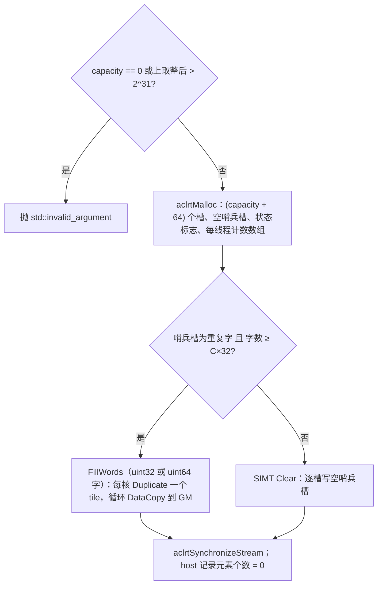

**Insert / InsertIf**

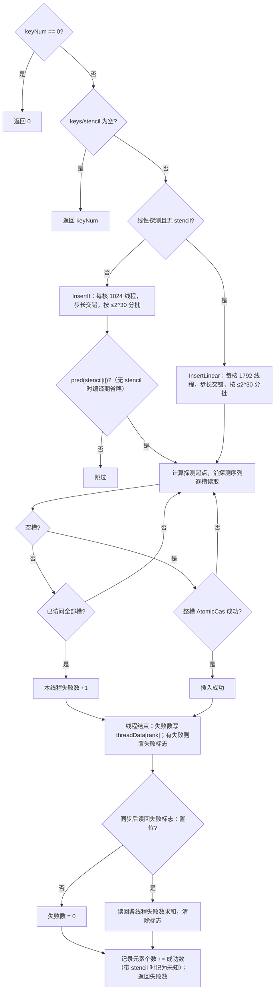

**Contains / Find / Count / CountEach(Outer)**

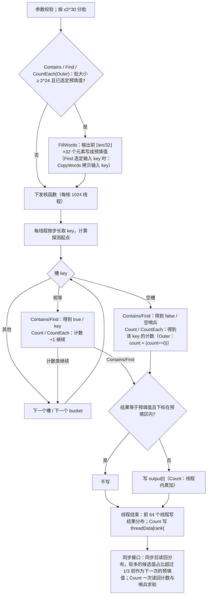

**Retrieve**

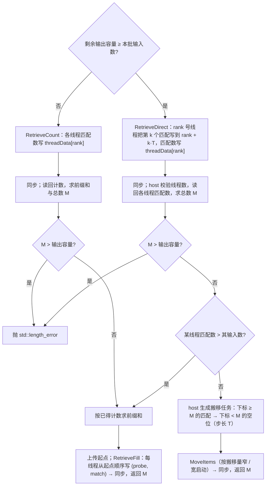

**RetrieveAll / Size**

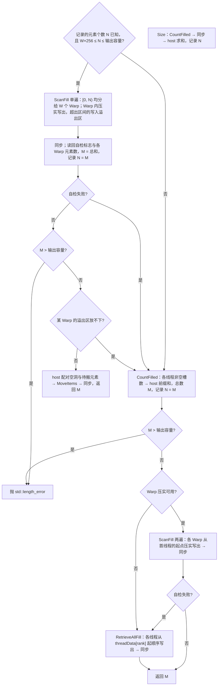

**Warp 压实扫描的一步（ScanFill）**

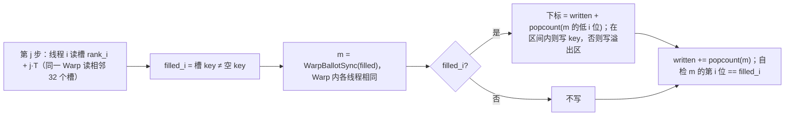

#### 3.2.2.3 AscendC 流程图与参考实现流程图的差异点和原因

| 差异点 | cuCollections | 本设计 | 原因 |
| --- | --- | --- | --- |
| 默认探测策略 | `double_hashing<4, xxhash_32>` | `LinearProbing<murmurhash3_32>`（bucket 大小 2），也支持 `DoubleHashing` | 950 上时延主要取决于随机访存次数：线性探测的后续探测大多落在同一缓存行内，双重哈希每一步都是新的随机访存，实测插入与查询都是线性探测更快；murmurhash3_32 与 ops-collections `StaticSet` 的默认值一致 |
| 探测起点与回绕 | 取模 | `FastRange` 乘法映射 + 条件减法 | 热路径不含除法 |
| 协作组 | 协作组探测 | 逐线程独立探测（bucket 大小 2 相同） | SIMT 以 32 线程 Warp 为执行单位，逐线程探测实现简单 |
| 插入 | 按槽宽选择整槽 CAS 或 key CAS 后写 value | 整槽一次 `AtomicCas`（精简核函数，每核 1792 线程） | 每个元素只做一次原子操作；随机写为主的核函数在更多线程下吞吐更高，精简核函数控制线程内状态以适应更小的寄存器预算 |
| 计数器 | 线程块内 reduce 后原子加 | 线程私有计数写 `threadData[rank]`，host 求和；插入另设失败标志 | 核函数内的原子加开销明显；插入失败罕见，无失败时不读回计数数组 |
| Retrieve | 单遍：线程块共享缓冲 + `fetch_add` 预留输出区间 | 单遍：匹配直接写到步长交错位置，host 规划搬移收尾；容量不足或某线程匹配数超过输入数时两遍 | SIMT 没有线程块共享缓冲；直接写出的布局与输入布局一致，Warp 内写出相邻；输出确定、可复现 |
| RetrieveAll / Size | CUB 的 `DeviceSelect::If` / `TransformReduce` | Warp 压实扫描（`WarpBallotSync` + popcount）；元素个数已知时单遍 + 溢出区 + 搬移，否则计数后两遍；自检失败时逐线程写出 | 昇腾侧无 CUB；逐线程写出时一个 Warp 的 32 个线程每步写 32 个不同位置，压实后写出连续；单遍省去一次整表扫描 |
| Create / Clear | `thrust::for_each_n` 逐槽写 | SIMD `Duplicate` + 分 tile `DataCopy`，按哨兵字节模式选 uint32/uint64 字；不可按字填充或小表时回退 SIMT 逐槽写 | 大表按字批量搬运，吞吐更高；现有 `ClearSIMD` 在每核块数恰为 tile 整数倍时最后一个 tile 写 0 个元素，新核函数按完整哨兵槽选择填充字并精确计算尾块 |
| 插入返回值 | `insert` 无返回、`insert_if` 返回成功数 | 均返回失败数 | 与 ops-collections `StaticSet` 约定和任务测试用例一致 |
| 输出容量 | 输出区间过小属未定义行为 | `Retrieve` / `RetrieveAll` 显式传入容量，不足时抛 `std::length_error`，不会越界写 | 满足任务书「输出空间不足时报错」 |
| 逐 key 输出 | 每个 key 写一次输出 | 批大小 ≥ 2^24 时按上一次同步调用的结果分布预填输出（向量化顺序写），核函数只写与预填值不同的结果 | 950 上核函数内分散写出的代价明显高于一次向量化顺序填充；是否命中、未命中的空哨兵、计数 0 或 1 通常占多数 |
| 批次大小 | `index_type` 64 位 | 单次核函数最多 2^30 个元素，host 自动分批 | SIMT 线程内使用 uint32 下标，寄存器受限 |

## 3.3 支持硬件

| 支持的芯片版本 | 涉及勾选 |
| --- | --- |
| Ascend 950PR / Ascend 950DT（Atlas 950 系列，SIMT） | √ |

开发验证环境：Ascend950PR，CANN 9.1.0，bisheng 编译器 `--npu-arch=dav-3510`。

## 3.4 算子约束限制

1. key 必须为 4 或 8 字节类型，且不得等于构造时指定的空 key 哨兵。
2. 容量上取整后不超过 2^31 个槽。
3. 同一时刻不应对同一容器并发执行插入与查询（与 cuCollections 相同，结果未定义）。
4. `pred` 必须可在设备端默认构造并以 `COLLECTION_SIMT_DEVICE` 修饰。
5. `Contains` 输出为 1 字节 bool；`CountEach` / `CountEachOuter` 输出为 uint64；`Find` 与 `Retrieve` 的输出类型与 key 相同。
6. 依赖 SIMT 运行时的线程布局：同一 Warp 的线程为连续的 32 个 rank（`GetWarpSize() == 32`）；不满足时 RetrieveAll 自动改用逐线程写出，结果不变。
7. `Retrieve` / `RetrieveAll` 抛出 `std::length_error` 时输出缓冲的内容未定义（不会越界写）。

# 四、特性交叉分析

| 维度 | 覆盖 |
| --- | --- |
| dtype | I32、I64 × 全部 14 个接口 |
| 输入规模 | 0（允许空指针）、1、小于 C×32 的小表（SIMT 清空路径）、1e8 大规模、> 2^30（host 分批） |
| 重复度 | multiplicity 1 / 2 / 4 / 8 / 1024，完全相同的重复 key，重复查询 |
| 命中率 | matching rate 0 / 0.1 / 0.5 / 1，命中与未命中交错 |
| 容量 | 1、5、128、1027、8192、65536、100000、1e6、1e8；占用率 0 ~ 1.0；超容量插入 |
| 条件接口 | stencil 全 0、全 1、按下标奇偶 |
| 异常 | capacity = 0、空指针、输出容量不足、stream 同步失败 |
| 接口组合 | Insert→Clear→Insert、多次 Create/Destroy、InsertIf→Contains |
| 执行路径 | 插入：精简 / 通用核函数；Retrieve：单遍 / 两遍（输出容量不足、线程匹配数超过输入数）；RetrieveAll：单遍 / 两遍 / 逐线程写出，记录的元素个数偏大、偏小、翻倍，满表。仓内功能用例规模小于单遍阈值，另用 2e7 规模的自测程序覆盖 |

# 五、可维可测分析

## 5.1 精度标准 / 性能标准

| 验收标准 | 描述 | 标准来源 |
| --- | --- | --- |
| 精度标准 | Insert/InsertIf 后的容器状态，以及 Contains、ContainsIf、Find、FindIf、Count、CountEach、CountEachOuter、Retrieve、RetrieveAll 的输出与 cuCollections 语义一致；测试以 `std::unordered_multiset` 为基准逐元素比对（Retrieve / RetrieveAll 排序后比对）；相同输入重复执行结果一致 | 任务书 3.2 |
| 性能标准 | 每个用例时延 ≤ 标杆时延 / 0.4；不达标时给出原因分析 | 任务书 3.3 |
| 内存标准 | 除表存储、输出与必要工作空间外，无与输入规模线性相关的额外 Device 拷贝 | 任务书 3.4 |

功能用例（任务提供，按 dtype × GENERATE × SECTION 展开）：

| 接口 | 用例数 | 接口 | 用例数 |
| --- | --- | --- | --- |
| Create | 14 | Find | 100 |
| Destroy | 18 | FindIf | 56 |
| Clear | 32 | Count | 124 |
| Insert | 194 | CountEach | 122 |
| InsertIf | 20 | CountEachOuter | 122 |
| Contains | 100 | Retrieve | 98 |
| ContainsIf | 56 | RetrieveAll | 202 |
| **合计** | | | **1258** |

性能用例（任务提供，共 44 个；时延为同步接口的 host 端到端时延）：

| 序号 | 接口 | Key | 场景（NumInputs=1e8） | 标杆时延(ms) | 达标上限 = 标杆/0.4 (ms) |
| --- | --- | --- | --- | --- | --- |
| 1 | Create | I32 | Capacity=1e8 | 4.152062 | 10.380 |
| 2 | Create | I64 | Capacity=1e8 | 8.740130 | 21.850 |
| 3 | Destroy | I32 | Capacity=1e8 | 4.360688 | 10.902 |
| 4 | Destroy | I64 | Capacity=1e8 | 8.580200 | 21.451 |
| 5 | Insert | I32 | UNIFORM, Occ=0.5, Mul=1 | 8.098100 | 20.245 |
| 6 | Insert | I64 | UNIFORM, Occ=0.5, Mul=1 | 8.392043 | 20.980 |
| 7 | RetrieveAll | I32 | UNIFORM, Occ=0.5, Mul=1 | 0.660264 | 1.651 |
| 8 | RetrieveAll | I64 | UNIFORM, Occ=0.5, Mul=1 | 1.016854 | 2.542 |
| 9 | Contains | I32 | UNIQUE, Occ=0.5, MR=0.1 | 4.580408 | 11.451 |
| 10 | Contains | I32 | UNIQUE, Occ=0.5, MR=0.5 | 4.310301 | 10.776 |
| 11 | Contains | I32 | UNIQUE, Occ=0.5, MR=1 | 3.855939 | 9.640 |
| 12 | Contains | I64 | UNIQUE, Occ=0.5, MR=0.1 | 4.755204 | 11.888 |
| 13 | Contains | I64 | UNIQUE, Occ=0.5, MR=0.5 | 4.470620 | 11.177 |
| 14 | Contains | I64 | UNIQUE, Occ=0.5, MR=1 | 4.000158 | 10.000 |
| 15 | Find | I32 | UNIQUE, Occ=0.5, MR=0.1 | 4.977099 | 12.443 |
| 16 | Find | I32 | UNIQUE, Occ=0.5, MR=0.5 | 4.765909 | 11.915 |
| 17 | Find | I32 | UNIQUE, Occ=0.5, MR=1 | 4.332860 | 10.832 |
| 18 | Find | I64 | UNIQUE, Occ=0.5, MR=0.1 | 5.251019 | 13.128 |
| 19 | Find | I64 | UNIQUE, Occ=0.5, MR=0.5 | 5.027173 | 12.568 |
| 20 | Find | I64 | UNIQUE, Occ=0.5, MR=1 | 4.571797 | 11.429 |
| 21 | Count | I32 | UNIFORM, Occ=0.5, Mul=1, MR=0.1 | 4.196007 | 10.490 |
| 22 | Count | I32 | UNIFORM, Occ=0.5, Mul=1, MR=0.5 | 4.435138 | 11.088 |
| 23 | Count | I32 | UNIFORM, Occ=0.5, Mul=1, MR=1 | 4.684470 | 11.711 |
| 24 | Count | I64 | UNIFORM, Occ=0.5, Mul=1, MR=0.1 | 4.508944 | 11.272 |
| 25 | Count | I64 | UNIFORM, Occ=0.5, Mul=1, MR=0.5 | 4.758779 | 11.897 |
| 26 | Count | I64 | UNIFORM, Occ=0.5, Mul=1, MR=1 | 5.010463 | 12.526 |
| 27 | CountEach | I32 | UNIFORM, Occ=0.5, Mul=1, MR=0.1 | 4.874588 | 12.186 |
| 28 | CountEach | I32 | UNIFORM, Occ=0.5, Mul=1, MR=0.5 | 5.131703 | 12.829 |
| 29 | CountEach | I32 | UNIFORM, Occ=0.5, Mul=1, MR=1 | 5.407013 | 13.518 |
| 30 | CountEach | I64 | UNIFORM, Occ=0.5, Mul=1, MR=0.1 | 5.054034 | 12.635 |
| 31 | CountEach | I64 | UNIFORM, Occ=0.5, Mul=1, MR=0.5 | 5.317555 | 13.294 |
| 32 | CountEach | I64 | UNIFORM, Occ=0.5, Mul=1, MR=1 | 5.596096 | 13.990 |
| 33 | CountEachOuter | I32 | UNIFORM, Occ=0.5, Mul=1, MR=0.1 | 5.265664 | 13.164 |
| 34 | CountEachOuter | I32 | UNIFORM, Occ=0.5, Mul=1, MR=0.5 | 5.521189 | 13.803 |
| 35 | CountEachOuter | I32 | UNIFORM, Occ=0.5, Mul=1, MR=1 | 5.788201 | 14.471 |
| 36 | CountEachOuter | I64 | UNIFORM, Occ=0.5, Mul=1, MR=0.1 | 5.443966 | 13.610 |
| 37 | CountEachOuter | I64 | UNIFORM, Occ=0.5, Mul=1, MR=0.5 | 5.708848 | 14.272 |
| 38 | CountEachOuter | I64 | UNIFORM, Occ=0.5, Mul=1, MR=1 | 5.980948 | 14.952 |
| 39 | Retrieve | I32 | UNIFORM, Occ=0.5, Mul=1, MR=0.1 | 8.770419 | 21.926 |
| 40 | Retrieve | I32 | UNIFORM, Occ=0.5, Mul=1, MR=0.5 | 9.140261 | 22.851 |
| 41 | Retrieve | I32 | UNIFORM, Occ=0.5, Mul=1, MR=1 | 10.457202 | 26.143 |
| 42 | Retrieve | I64 | UNIFORM, Occ=0.5, Mul=1, MR=0.1 | 9.133619 | 22.834 |
| 43 | Retrieve | I64 | UNIFORM, Occ=0.5, Mul=1, MR=0.5 | 9.532203 | 23.831 |
| 44 | Retrieve | I64 | UNIFORM, Occ=0.5, Mul=1, MR=1 | 10.845923 | 27.115 |

性能优化设计：

1. **按访存模式选择探测与划分**：默认线性探测，后续探测大多落在同一缓存行；所有 SIMT 核函数按步长交错划分，同一 Warp 的输入读取、输出写出与槽读取相邻。
2. **单次原子操作插入**：每个元素只做一次 `AtomicCas`（整槽 CAS）；线性探测的无条件插入使用精简核函数，每核 1792 个线程。
3. **无原子操作的计数**：失败数与计数写入线程私有位置，由 host 求和；插入只在失败标志置位时才读回计数数组。
4. **单遍检索**：Retrieve 把匹配直接写到与输入相同的步长交错位置，只搬移少量越界元素；RetrieveAll 借助 `WarpBallotSync` 在 Warp 内压实写出，元素个数已知时一次整表扫描即可完成。
5. **窄启动搬移**：少量搬移每核只启动 32 个线程，避免大量空转线程的启动开销。
6. **向量化填充**：Create / Clear 按 4 / 8 字节字批量填充，每核只生成一次 tile，再按 tile 搬运到 GM。
7. **减少分支与访存**：`Insert` / `Contains` / `Find` 等无条件接口在编译期消除 stencil 访存；计数类接口用比较结果直接累加；CountEachOuter 用 `count + (count == 0)` 无分支计算；工作数组首次申请后复用。

## 5.2 测试设计与自验

| 类型 | 目录 | 执行方式 |
| --- | --- | --- |
| 功能测试 | `tests/static_multiset/`（14 个用例文件，公共件 `tests/common/multi_container_test_common.h`） | `bash scripts/build.sh -r --test-name static_multiset` |
| 性能测试 | `tests/performance/static_multiset/`（10 个用例文件） | `bash scripts/build.sh -p`，再运行 `build/performance/static_multiset/*` |

自测报告包含每个用例的入参、结果对比、执行日志与性能数据；性能达标系数 = 标杆时延 / 实测时延。

## 5.3 兼容性分析

新增容器，不修改 `StaticSet`、`StaticMap`、`DynamicMap` 等已有容器的公开接口与实现；既有文件中仅 `tests/CMakeLists.txt` 增加测试目录。支持 CANN 9.0.0-beta.2 及以上版本，bisheng / ccec 两种编译器。
