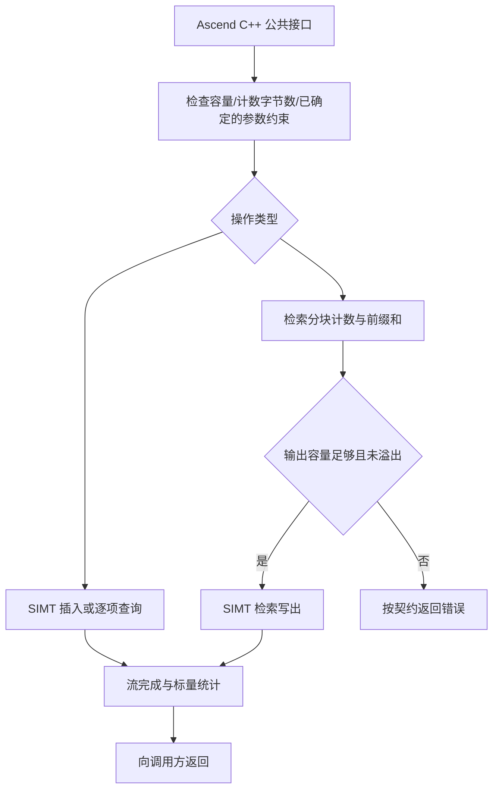

# 需求背景（required）

## 需求来源

本设计对应 [9月社区任务-multiset容器开发(950)](https://www.hiascend.com/activities/task-center/details/214f40e300a347c7b21e445fa8671e62?menu=guide)，任务书为附件 `static_multiset_task_doc.md`。任务页 ID 为 `214f40e300a347c7b21e445fa8671e62`，官方于 2026-09-16 补充任务清单第 66 项及目录 `09-66-multiset-950`。设计文档路径为 `04_tasks/01_community-task-2026/tasklist/09-66-multiset-950/qq_39362556/docs/design.md`，目录依据为[官方任务清单](https://gitcode.com/cann/cann-ops-competitions/blob/master/04_tasks/01_community-task-2026/docs/README.md)及该仓提交 `f4957f48c2a0271b74c79143792ad1a6ea3b2dcd`。

本文从 [官方设计模板](https://gitcode.com/cann/cann-ops-competitions/blob/master/04_tasks/01_community-task-2026/resources/design_template.md) 的原始副本开始填写，保留其需求背景、需求分析、详细设计、可维可测分析结构。当前是**设计准备稿，尚未评审、尚未实施**。涉及接口冲突的选择均保持待官方确认状态，不代表可提交验收。

## 背景介绍

### StaticMultiset 容器实现

在 Atlas 950 SIMT 平台上实现静态容量多值集合，保存重复 key，支持批量条件插入、查询、查找、计数和检索。对外采用 ops-collections 的纯头文件 C++ 容器模式，设备计算采用 Ascend C SIMT，生命周期及 ACL 流由 Host 侧管理。

参考实现为 [cuCollections static_multiset.cuh](https://github.com/NVIDIA/cuCollections/blob/532795b81e72e3fe4ce2b26eb0c5abc8abb1e2b4/include/cuco/static_multiset.cuh)。本文参考该公开接口的语义，不把 CUDA 设备实现或性能数字视为本项目实测结果。

目标仓库基线为 ops-collections `9d12996d4317e28420d74bcb1ec4d3b3507599ce`（2026-09-16 复核）；设计工作分支为 `design/static-multiset-950`，基于 cann-ops-competitions `18a91883f663f90354bd70e7202425fc135eccec`。相关现有实现：

- `include/static_set.h`、`include/detail/static_set/static_set.inl`：容器 Host 接口与同步调用方式。
- `include/static_set_ref.h`、`include/detail/open_addressing/open_addressing_ref_impl.h`：设备引用及开放寻址结构。
- `include/probing_scheme.h`、`include/hash_functions.h`：探测和散列策略。
- `include/utility/atomic_cas_wrap.h`：SIMT 原子 CAS；`include/utility/allocator.h`：ACL Device 分配。
- `tests/CMakeLists.txt`、`tests/performance/performance_test_framework.h`：测试集成和性能框架。

### 参考实现和现有容器分析

cuco 提供固定容量的多值集合，一个 key 的多次插入产生多个元素。现有 StaticSet 在发现相同 key 时按重复处理，不能直接用其 Insert 路径实现多值集合。候选方案复用仓库的类型、散列、分配和 SIMT 基础能力，在 `detail/static_multiset/` 内实现独立的多值插入与检索逻辑，避免改变现有 Set/Map 的去重行为。

| 参数 | 含义 | 类型 | 约束与形状 |
| --- | --- | --- | --- |
| Key | 输入或输出键 | I32、I64 | 一维连续 Device 数组；空键 sentinel 不属于合法输入 key |
| capacity | 创建时静态容量 | uint64/仓库 Extent | 正数；实际容量可按存储粒度向上取整；返回实际 Capacity |
| numInputs | 本次输入或查询数量 | uint64/仓库 Extent | 任务书给出 `[0, capacity]`，附件存在超过容量的场景，正式约束待澄清 |
| stencil | 条件数组 | uint32 | 与输入逐项对应；实际长度检测方式待澄清 |
| pred | 条件谓词 | Device 可调用对象或模板 | `pred(stencil[i])` 返回 bool；对象传参与模板适配待澄清 |
| output | bool、Key 或计数结果 | bool、I32/I64、uint64 | 固定输出通常为 N 项；Retrieve 为两组 R 项；RetrieveAll 为 Size 项 |
| outputCapacity | 可写输出元素数 | uint64/Extent | 附件 Retrieve/RetrieveAll 已传入；写入前检查需求不超过容量 |
| stream | 执行流 | aclrtStream | 有效 ACL 流；默认流及非法句柄行为按官方明确的契约处理 |

参考接口的逻辑调用链如下；该图描述接口职责，不声称逐行复现 NVIDIA 内部 Kernel：

### StaticMultiset 功能分析

令容器多值集合为 M，查询序列为 Q，`m(k)` 为 key k 在 M 中的出现次数。每次合法插入将 `m(k)` 增加 1；条件插入只处理谓词为真的项。Contains 返回存在性，Find 返回命中的 key 或 sentinel，Count/CountEach 保留重复次数，Retrieve 按查询的每次出现输出全部匹配，RetrieveAll 输出 M 中全部元素。

不包含本任务未要求的 Erase、Rehash、ForEach、CPU fallback、自动微分或新增框架算子注册。

# 需求分析（required）

## 需求描述

实现任务书列出的 14 类操作：Create、Destroy、Clear、Insert、InsertIf、Contains、ContainsIf、Find、FindIf、Count、CountEach、CountEachOuter、Retrieve、RetrieveAll。Create/Destroy 按附件体现为 C++ 构造与析构；Size/Capacity 是附件使用的状态查询接口。

功能需覆盖 I32/I64、重复 key、不同 multiplicity、空输入、命中/未命中和容量边界。查询和检索按任务书要求提供确定且可重复的输出；候选方案规定 Retrieve 按查询索引输出，RetrieveAll 按 Key 升序输出，并验证重复重建后的公开状态和输出。性能逐项对照任务书 44 行基线，内存满足 §3.4，全部测试结果绑定最终冻结代码提交。

## 需求拆解

| 能力 | Host 责任 | Device 责任 | 正确性重点 |
| --- | --- | --- | --- |
| Create/Destroy/Clear | RAII、容量及字节数校验、ACL 资源所有权 | sentinel 初始化/清空 | 构造失败不泄漏，清空后 Size=0 |
| Insert/InsertIf | 参数契约、返回统计、同步 | 原子占槽，重复 key 继续寻找空槽 | 每次成功插入仅占一个槽，满表有限终止 |
| Contains/ContainsIf | 输出及谓词契约 | 存在性查找；未选中写 false | 全部输出均被赋值 |
| Find/FindIf | 输出及谓词契约 | 查找；未命中或未选中写 sentinel | 不沿用旧输出 |
| Count | 标量统计回读 | 累加每个查询的所有匹配数 | 重复查询重复贡献，uint64 累加 |
| CountEach/Outer | N 项输出契约 | 写 m(q) 或 max(m(q),1) | 空容器、重复和乱序查询 |
| Retrieve | 先计数并核验输出容量 | 两路输出保留每个查询的所有匹配 | 不只核验总数，还验证每个 key 的 multiplicity |
| RetrieveAll | 核验容量并返回输出数 | 紧凑输出全部非空槽 | 重复不丢失，输出总数等于 Size |

以下问题已在[本任务官方讨论区提问](https://gitcode.com/cann/ops-collections/discussions/3#discussion-comment-72897cc3c6464c04a589c85fa5ced1b8)，待维护者明确，并在本设计评审中落实：

1. **官方测试依赖**：附件公共头无条件包含 `static_multimap.h`，而当前附件和目标仓基线均未提供；需要官方依赖来源或更新后的原件，才能原样编译正式测试。
2. **接口与异常契约**：任务书与附件对非零空指针、输入/查询数量超过容量、Insert/InsertIf 成功数或失败数、参数次序及谓词传递存在差异；裸指针接口还需明确输出/stencil 范围与错误反馈方式。这些选择直接影响公开接口，须在实现前通过评审明确。
3. **正式性能口径**：附件以 Host chrono 计时，标杆未注明计时范围；请确认比较范围及 UNIFORM 输入定义。原始采样保留方案需与实际执行链对应，不把框架汇总当作阈值已经通过。该项不阻止设计准备，但在正式性能判定前须确认。

候选设计通过固定输出规则满足任务书的确定性要求；相关成本纳入后续性能验证。

# 详细设计（required）

## 算子分析

### 数学公式

- `Size = Σ_k m(k)`。
- `Contains(q_i) = [m(q_i) > 0]`。
- `Find(q_i) = q_i`（命中），否则为 sentinel；自定义等价策略若允许，返回容器中相等的存储 key。
- `Count(Q) = Σ_i m(q_i)`。
- `CountEach(Q)_i = m(q_i)`。
- `CountEachOuter(Q)_i = max(1, m(q_i))`。
- `Retrieve(Q)` 中每次查询 `q_i` 对应 `m(q_i)` 个匹配对，总量 R 等于 Count(Q)。同一 key 在查询序列中重复时，其匹配也按次数重复输出。
- `RetrieveAll` 输出的多值集合等于 M；候选设计按 Key 升序输出，使相同逻辑容器状态得到相同原始数组。
- 条件操作的选择掩码为 `a_i = pred(stencil_i)`；未选中项不插入，ContainsIf 写 false，FindIf 写 sentinel。

Insert/InsertIf 的状态变化必须符合多值集合；返回值按成功数或失败数计尚未定稿，不用同名签名同时承诺两种返回语义。

### 支持数据类型

Key 仅实现任务要求的 `int32_t`、`int64_t`；stencil 为 `uint32_t`；计数与逻辑索引使用 64 位无符号数。模板在编译期限制 Key 类型；`void*` 的运行时实际 dtype 无法仅凭地址推断，其适配及校验必须遵循官方认可的接口契约。

### 支持形状

输入为一维连续数组 `[N]`，固定逐项输出为 `[N]`。Retrieve 输出两组 `[R]`，RetrieveAll 输出 `[Size]`，不需要广播或张量布局变换。空输入语义、N 与容量的关系保留为待澄清项。

## 算子实现

### 实现方案

候选存储采用固定容量的开放寻址表，每个元素占一个 Key 槽，重复 key 占独立槽。初始候选使用仓库线性探测策略和 I32/I64 对应宽度的 CAS。容量按 BucketSize 向上取整，`Capacity()` 返回实际可用槽数。BucketSize、SIMT 线程数等属于普通调优参数，最终取值需在批准的设计范围内经真机验证，不根据测试文件名、特定输入值或顺序输入走专用捷径。

任何插入、查询循环都有实际容量上界。正常插入遇到相等 key 继续探测；占槽成功即结束当前元素；穷尽槽后判满。若官方确认允许容量不足时部分插入，先按已确认的非法 Key/谓词规则得到有效输入，并按输入索引生成稳定前缀序号，只允许前 `Capacity()-Size()` 个有效输入进入占槽；容量不足时被接纳的多值集合不依赖线程竞争顺序。该预处理计入 Insert/InsertIf 完整耗时，错误、未选择项与失败数的关系仍由接口澄清确定。查询遇到空槽或遍历容量后结束，Contains/Find 可在命中后提前结束，Count 必须遍历该 key 的完整探测链。任务未要求删除，因此不引入墓碑状态。

#### 3.2.1 host侧设计：

公开声明放在 `include/static_multiset.h`，设备可用引用放在 `include/static_multiset_ref.h`，实现和 Kernel 放在 `include/detail/static_multiset/`。Host 持有容量、sentinel、策略对象、存储与必要工作区，Ref 只保存设备访问所需元数据和地址，不拥有内存。

生命周期采用 RAII；禁用隐式复制，移动转移所有权并让源对象可析构。分配前检查容量取整、乘法字节数及可表示范围；分配失败抛出可观察的 Host 错误。Clear 保留容量并重置全部槽和计数。Destroy 释放本容器资源，不销毁调用方拥有的 ACL 流。

所有需要 Host 标量返回的接口在相关流工作完成后返回，批量同步接口按参考要求同步。初始化与使用必须有同流顺序或明确事件依赖，不能假定不同流自动排序。Ref 的并发插入使用原子操作；并发读写的完整支持范围须在设计评审中明确，不能以当前用例没有交错就推断支持任意并发组合。

公开 API 定稿时逐项列出 cuco 原型、Ascend 原型、返回值、参数顺序、stream 完成条件、别名限制及异常；当前只固定不冲突的存储和算法结构。禁止用修改官方用例、默认构造假的谓词对象或无行为的 StaticMultimap 占位类消除冲突。

##### 1. 分核策略：

使用平台查询得到的 AIV 核数上限 Gmax，根据 N 和每块线程数 T 选 `G = min(Gmax, ceil(N/T))`，零工作量按批准的空输入契约提前返回。逻辑线程 `t = blockIdx*T + threadIdx` 采用步长 `G*T` 的 grid-stride 遍历，以 64 位计算索引，处理最后不足整块的输入。

Clear/RetrieveAll 按槽数 C 分工；Contains/Find/CountEach 等按 N 分工。Retrieve 及稳定插入筛选使用按输入索引递增的连续分区，各分区内部再按连续 tile 处理；前缀位置按这些连续分区/tile 的逻辑顺序计算，不能直接用交错 grid-stride 块号代替查询顺序。计数使用线程局部累积和分块归约，减少所有元素竞争单一计数器；不得把总量截断为32位。

##### 2. 数据分块和内存优化策略：

设 Key 宽度为 w（4 或 8 字节），实际容量 C，输入 N，检索输出 R。容器主要 Device 存储为 `C*w`，另加大小、错误和统计等固定元数据。读取调用方提供的输入 Device 数组，不额外复制 N 个 Key。固定输出占 `N*sizeof(OutputType)`；Retrieve 双输出占 `2*R*w`；RetrieveAll 占 `Size*w`，均由调用者提供。

Contains/Find/CountEach 为直接 GM 访问与寄存器状态，不为整批输入申请中间副本。计数归约工作区与块数量相关。Retrieve 采用分块计数、块间前缀和、块内前缀和、再查询写出流程：持久工作区保存每块 count/offset，块内临时计数按固定 tile 大小分配并复用，不保存整份输入拷贝。输出写出前以总量 R 与 outputCapacity 比较；加法/乘法溢出也必须在写出前被检测。

Retrieve 按查询索引的前缀位置输出；对默认整数相等语义，同一查询的匹配 Key 值相同，因此并发探测先后不改变最终数组。RetrieveAll 先按连续槽块计数和压缩，再在 Device 侧将输出按 Key 升序规范化。候选排序为整数基数排序，I32/I64 按符号位变换处理有符号顺序，使用一个 `Size*w` 的输出工作区及分块直方图；该工作区属于检索算法所需空间，记录峰值且不复制调用方输入。所有排序阶段计入 RetrieveAll 的完整调用成本，不能放在计时区间外。亿级输入下排序的性能和工作区尚未验证，必须在设计评审及后续真机验证中评估，不能承诺已达到标杆。

SIMT 数据主要来自 GM；仅前缀和/归约使用固定局部 tile。块内资源预算按 `T*局部计数宽度 + 归约/前缀临时空间` 计算，与平台支持能力和编译资源报告核对；不照搬模板中的向量 UB 双缓冲方案。

##### 3. tilingkey规划策略：

本项目是头文件容器，不新增 ACLNN 图算子 tiling 注册。根据操作、Key 宽度及谓词/散列模板实例选择 Kernel；Host 传入 C、N、输出容量及块配置等实际参数。一般分支为空输入、常规查询、容量不足或溢出错误；这些行为必须按公开契约统一实现。无需模板示例中的广播 tilingkey。

#### 3.2.2 kernel侧设计：

| Kernel 路径 | 处理流程 | 状态/输出 |
| --- | --- | --- |
| 初始化/清空 | 逐槽写 sentinel，重置计数 | 空表 |
| 插入 | 读取 key → 验证 sentinel → 条件选择 → 哈希探测 → 空槽 CAS | 新增元素，逐块统计成功/失败 |
| 查询/查找 | 条件选择 → 沿探测链检查 → 写逐项结果 | bool 或 Key |
| Count/CountEach/Outer | 扫描匹配槽 → 按查询计算完整 multiplicity | uint64 标量或数组 |
| Retrieve | 分块求匹配总数 → 前缀和 → 容量核验 → 再探测写配对结果 | probe 和 match 两组输出，R |
| RetrieveAll | 按槽块求非空数量 → 前缀和 → 容量核验 → 压缩 → Device Key 排序 | 按 Key 升序的全部元素，Size |

写入路径通过 32/64 位 Key 的原子 CAS 完成单槽发布；本容器没有额外 payload 字段，不需要继承 Map 的 key/payload 两阶段发布。非法 key 的处理和是否允许部分插入必须由官方异常语义确定后实现。查询在规定的流依赖下读取完成的插入状态；不通过 Host 回读整表计算结果。

与参考接口相比，迭代器按官方允许方式转换为 Device 指针及元素数，CUDA 流对应 ACL 流。Ascend 采用自己的 SIMT 线程/核分配和归约；多值集合的出现次数、条件选择、查找未命中值不改变。输出采用上述固定规则；返回统计、参数映射、策略对象与异常处理的冲突待设计评审确认后统一更新公开原型与本文。

## 支持硬件

| 支持的芯片版本 | 涉及勾选 |
| --- | --- |
| Atlas 950 及任务书所述后续支持 SIMT 的型号 | √（准备阶段已采集 Ascend950PR_9579） |

任务书要求 CANN ≥9.0.0-beta.2、CMake ≥3.16、Catch2 ≥3.5.4。环境准备实测 CANN 9.0.0、CMake 3.22.1、Catch2 v3.5.4；驱动软件 25.7.rc1.6、固件 9.0.0.100.200。这里只记录 2026-09-16 准备时版本，不代表正式测试已执行；最终验证前重新采集完整环境并核对编译架构。

## 算子约束限制

固定容量、Key 为 I32/I64、保留 sentinel 不能作为普通元素、输入输出为连续 Device 内存。整数结果要求精确相等。容量耗尽必须有限终止。CountEach 系列遵守参考的不重叠输入输出要求；其他接口的别名能力按官方契约明确后写入 API 文档。

空指针、N 超过容量、stencil/输出实际长度检测、默认流、无效流、非法输入是否部分更新尚待接口评审明确。不能将这份草案的算法候选当作已批准的限制说明。

# 可维可测分析

## 精度标准/性能标准

| 验收标准 | 描述(不涉及说明原因) | 标准来源 |
| --- | --- | --- |
| 精度标准 | I32/I64 状态与输出满足 cuco 多值集合语义，整数精确比较；完整执行附件功能范围 | 任务书 §3.2、§3.5；具体冲突待官方澄清 |
| 性能标准 | 每个官方组合性能 ≥0.4 倍标杆，即同口径时延 Tascend ≤Tbaseline/0.4；未达标原样记录并解释，不自动标通过 | 任务书 §3.3、44 行基线 |
| 内存标准 | 静态容器、输出与必要工作区之外不产生线性重复 Device 输入拷贝；记录实际分配及峰值 | 任务书 §3.4 |

功能附件声明展开总数1258：Create14、Destroy18、Clear32、Insert194、InsertIf20、Contains100、ContainsIf56、Find100、FindIf56、Count124、CountEach122、CountEachOuter122、Retrieve98、RetrieveAll202。该数字是任务书声明，尚非运行计数；实际执行按 dtype、GENERATE 与 SECTION 逐项映射。

性能附件范围44：Create/Destroy 共4；Insert/RetrieveAll 共4；Contains/Find 共12；Retrieve/Count/CountEach/CountEachOuter 共24。保存官方输入、计时和原始输出；计时口径与标杆范围确认后逐项比较。Profiler 与补充采样独立记录，不覆盖官方输出。

由任务语义驱动的补充验证包括：Retrieve 逐 key 完整重复次数、重复查询产生的配对数量、乱序/高重复/尾块、固定状态及独立重建后的重复检索原始数组比较、64位计数和字节数边界、流依赖及已明确的负例。补充数量不计入官方1258或44。对未明确的错误和并发契约先不制造通过结论。

正式验证前冻结实现提交，在干净工作区从该提交构建；官方测试原件与执行副本直接比较一致，并保存真实工作目录、命令、环境、实际加载路径、退出状态、逐用例结果与性能样本。官方依赖问题解除前不对附件做本地删改来冒充正式执行。

报告从官方提供的原始工作簿副本填写，保留 Sheet 与列含义，逐行对应真实用例及日志；示例数值全部替换为真实证据，未测试字段不填写 Pass。交付仅按任务书四项清单和实时表单限制组织，内部审计与澄清记录留在包外。

## 兼容性分析

新增独立的 StaticMultiset 接口及实现目录，不改变现有 StaticSet/StaticMap 的去重、返回值或并发语义。新增功能与性能目录需加入当前仓库显式测试目录集合，并维护仓库 README 和 `docs/static_multiset_API文档和使用示例.md`。不新增根目录独立算子工程。

cuco 参数、返回值、策略对象和 stream 语义适配尚待官方确认。外部依赖限于目标仓库既有 C++17、Ascend C/CANN/ACL 及测试用 Catch2；不引入运行时 CUDA/cuCollections 依赖。设计获批后才进入容器实现，正式验收通过通知之前不提前创建代码 PR。
