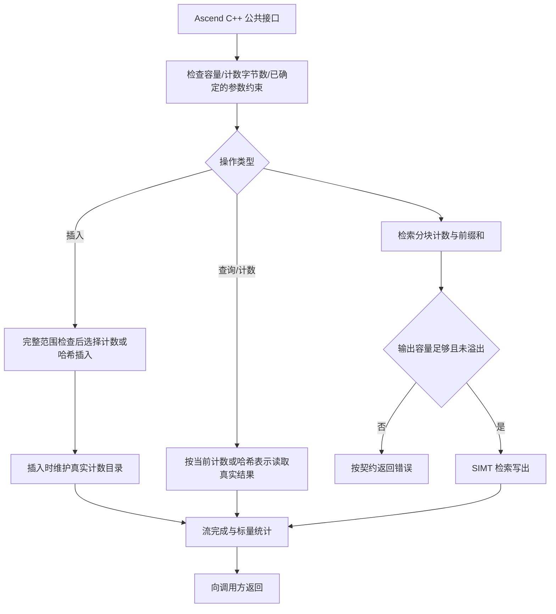

# 需求背景（required）

## 需求来源

本设计对应 [9月社区任务-multiset容器开发(950)](https://www.hiascend.com/activities/task-center/details/214f40e300a347c7b21e445fa8671e62?menu=guide)，任务书为附件 `static_multiset_task_doc.md`。任务页 ID 为 `214f40e300a347c7b21e445fa8671e62`，官方于 2026-09-16 补充任务清单第 66 项及目录 `09-66-multiset-950`。设计文档路径为 `04_tasks/01_community-task-2026/tasklist/09-66-multiset-950/qq_39362556/docs/design.md`，目录依据为[官方任务清单](https://gitcode.com/cann/cann-ops-competitions/blob/master/04_tasks/01_community-task-2026/docs/README.md)及该仓提交 `f4957f48c2a0271b74c79143792ad1a6ea3b2dcd`。

本文从 [官方设计模板](https://gitcode.com/cann/cann-ops-competitions/blob/master/04_tasks/01_community-task-2026/resources/design_template.md) 的原始副本开始填写，保留其需求背景、需求分析、详细设计、可维可测分析结构。原设计已通过 PR !1651 合入，本稿通过 PR !1678 更新。2026-09-17维护者明确允许更新测试头文件、要求输入/输出/返回值对齐cuCollections，并明确性能包含Host；本稿据此修订接口与验证方法。本稿对应最终被测实现提交 `b1e93afdc6a913188ce21604e74b3431716f9c5e`。该提交冻结后在干净工作区完成CANN编译与950真机重测：按官方回复适配的1258个功能场景全部通过，44组原参数Host性能全部满足任务书阈值。独立补充、Profiler及内存观测分别统计，原始输出和告警保留；具体范围见可维可测分析。本次全部运行数据来自该提交，旧实现的验证数据未用于本稿结论。

## 背景介绍

### StaticMultiset 容器实现

在 Atlas 950 SIMT 平台上实现静态容量多值集合，保存重复 key，支持批量条件插入、查询、查找、计数和检索。对外采用 ops-collections 的纯头文件 C++ 容器模式，设备计算采用 Ascend C SIMT，生命周期及 ACL 流由 Host 侧管理。

参考实现为 [cuCollections static_multiset.cuh](https://github.com/NVIDIA/cuCollections/blob/8ed532dc0ba3ba664d1d41027269908ddcde04c8/include/cuco/static_multiset.cuh)。本文参考该公开接口的语义，不把 CUDA 设备实现或性能数字视为本项目实测结果。

目标仓库基线为 ops-collections `9d12996d4317e28420d74bcb1ec4d3b3507599ce`（2026-09-17 复核）；本次设计修订基于 cann-ops-competitions `bad7e130f01673fbcccc55e4384261b337a0b357`。相关现有实现：

- `include/static_set.h`、`include/detail/static_set/static_set.inl`：容器 Host 接口与同步调用方式。
- `include/static_set_ref.h`、`include/detail/open_addressing/open_addressing_ref_impl.h`：设备引用及开放寻址结构。
- `include/probing_scheme.h`、`include/hash_functions.h`：探测和散列策略。
- `include/utility/atomic_cas_wrap.h`：SIMT 原子 CAS；`include/utility/allocator.h`：ACL Device 分配。
- `tests/CMakeLists.txt`、`tests/performance/performance_test_framework.h`：测试集成和性能框架。

### 参考实现和现有容器分析

cuco 提供固定容量的多值集合，一个 key 的多次插入产生多个元素。现有 StaticSet 在发现相同 key 时按重复处理，不能直接用其 Insert 路径实现多值集合。候选方案复用仓库的类型、散列、分配和 SIMT 基础能力，在 `detail/static_multiset/` 内实现独立的多值插入与检索逻辑，避免改变现有 Set/Map 的去重行为。

| 参数 | 含义 | 类型 | 约束与形状 |
| --- | --- | --- | --- |
| Key | 输入或输出键 | I32、I64 | 一维连续Device数组；被选择的插入项不得为sentinel，查询sentinel按未命中处理 |
| capacity | 创建时静态容量 | uint64/仓库 Extent | 正数；准确分配请求容量，不做容量取整 |
| numInputs | 本次输入或查询数量 | uint64/仓库 Extent | 按任务书为 `[0, capacity]`，并不得超过声明输入范围 |
| stencil | 条件数组 | uint32范围 | 与输入逐项对应；声明元素数须等于numInputs |
| pred | 条件谓词 | Device 可调用对象 | `pred(stencil[i])` 返回bool；传递实际对象及只读状态 |
| output | 布尔、Key或计数结果 | uint8（0/1）、I32/I64、uint64 | 固定输出通常为N项；Retrieve为两组R项；RetrieveAll为Size项 |
| 范围长度 | 随输入、输出、stencil指针传递的元素数 | uint64 | `MultisetDeviceSpan<T>{data,size}`；写入前检查声明容量，不增加独立输出参数 |
| stream | 执行流 | aclrtStream | 有效显式ACL流；nullptr报错，同一对象的Host调用须串行 |

参考接口的逻辑调用链如下；该图描述接口职责，不声称逐行复现 NVIDIA 内部 Kernel：

```mermaid
flowchart LR
  A[Host bulk API] --> B[输入范围与策略参数]
  B --> C[设备多值集合访问]
  C --> D[状态变化或逐项输出]
  D --> E[按接口约定完成与返回]
```

### StaticMultiset 功能分析

令容器多值集合为 M，查询序列为 Q，`m(k)` 为 key k 在 M 中的出现次数。每次合法插入将 `m(k)` 增加 1；条件插入只处理谓词为真的项。Contains 返回存在性，Find 返回命中的 key 或 sentinel，Count/CountEach 保留重复次数，Retrieve 按查询的每次出现输出全部匹配，RetrieveAll 输出 M 中全部元素。

不包含本任务未要求的 Erase、Rehash、ForEach、CPU fallback、自动微分或新增框架算子注册。

# 需求分析（required）

## 需求描述

实现任务书列出的 14 类操作：Create、Destroy、Clear、Insert、InsertIf、Contains、ContainsIf、Find、FindIf、Count、CountEach、CountEachOuter、Retrieve、RetrieveAll。Create/Destroy 按附件体现为 C++ 构造与析构；Size/Capacity 是附件使用的状态查询接口。

功能需覆盖 I32/I64、重复 key、不同 multiplicity、空输入、命中/未命中和容量边界。查询和检索按任务书要求提供确定且可重复的输出；候选方案规定 Retrieve 按查询索引输出，RetrieveAll 按 Key 升序输出，并验证重复重建后的公开状态和输出。性能逐项对照任务书 44 行基线，内存满足 §3.4，全部测试结果绑定最终冻结代码提交。

## 需求拆解

| 能力 | Host 责任 | Device 责任 | 正确性重点 |
| --- | --- | --- | --- |
| Create/Destroy/Clear | RAII、容量及字节数校验、ACL 资源所有权 | sentinel 初始化/清空 | 构造失败不泄漏，清空后 Size=0 |
| Insert/InsertIf | 参数契约、返回统计、同步 | 直接计数或原子占槽，保留每次重复 | 每次成功增加一个 occurrence，满表有限终止 |
| Contains/ContainsIf | 输出及谓词契约 | 存在性查找；未选中写 false | 全部输出均被赋值 |
| Find/FindIf | 输出及谓词契约 | 查找；未命中或未选中写 sentinel | 不沿用旧输出 |
| Count | 标量统计回读 | 累加每个查询的所有匹配数 | 重复查询重复贡献，uint64 累加 |
| CountEach/Outer | N 项输出契约 | 写 m(q) 或 max(m(q),1) | 空容器、重复和乱序查询 |
| Retrieve | 先计数并核验输出容量 | 两路输出保留每个查询的所有匹配 | 不只核验总数，还验证每个 key 的 multiplicity |
| RetrieveAll | 核验容量并返回输出末尾指针 | 按计数展开或压缩非空槽后排序 | 重复不丢失，输出总数等于 Size |

[本任务官方回复](https://gitcode.com/cann/ops-collections/discussions/3?parent_id=72897cc3c6464c04a589c85fa5ced1b8#tid-ac53737750ee48488c0ebc1017312e3b)由维护者condfuse_3给出：“头文件可以更新； 2，输入、输出、 返回值对齐cu-collections。3. 包含host”。适用方式如下：

1. **测试依赖**：保留附件原件，工作副本删除未提供且未使用的 `static_multimap.h` include和MakeMultimap工厂；不添加无行为占位类。
2. **接口契约**：以cuCollections的顺序和返回值为准，按任务书§2.4允许的类型适配提供带声明长度的Device范围，按任务书异常表实施范围检查。同步适配测试调用和有关断言，并逐文件保存diff；这属于按回复适配的任务场景，不称为原件未修改执行。
3. **性能口径**：沿用附件Host chrono计时、原始参数、输入生成、最多50次及RSD停止规则；44行逐项比较Host均值与标杆/0.4。框架CPU与Device列实际为同一Host时长，单独Profiler结果不冒充该时长。

候选设计通过固定输出规则满足任务书的确定性要求；相关成本纳入本轮Host性能计时。

# 详细设计（required）

## 算子分析

### 数学公式

- `Size = Σ_k m(k)`。
- `Contains(q_i) = [m(q_i) > 0]`。
- `Find(q_i) = q_i`（命中），否则为 sentinel；自定义等价策略若允许，返回容器中相等的存储 key。
- `Count(Q) = Σ_i m(q_i)`。
- `CountEach(Q)_i = m(q_i)`。
- `CountEachOuter(Q)_i = max(1, m(q_i))`。
- `Retrieve(Q)` 中每次查询 `q_i` 对应 `m(q_i)` 个匹配对，总量 R 等于 Count(Q)。同一 key 在查询序列中重复时，其匹配也按次数重复输出。
- `RetrieveAll` 输出的多值集合等于 M；候选设计按 Key 升序输出，使相同逻辑容器状态得到相同原始数组。
- 条件操作的选择掩码为 `a_i = pred(stencil_i)`；未选中项不插入，ContainsIf 写 false，FindIf 写 sentinel。

Insert返回void；InsertIf返回成功插入的选择项数量。Retrieve返回两路输出末尾指针组成的pair；RetrieveAll返回输出末尾指针。空结果返回原输出起点；不再以失败数量或写入数量代替这些返回类型。

### 支持数据类型

Key仅实现任务要求的 `int32_t`、`int64_t`；stencil为 `uint32_t`；计数与逻辑索引使用64位无符号数。`MultisetDeviceSpan<T>` 携带类型、Device指针和元素数，模板在编译期约束dtype。调用者须如实声明范围长度；接口检查声明范围，不能仅从地址证明实际分配的大小。

### 支持形状

输入为一维连续数组 `[N]`，固定逐项输出为 `[N]`。Retrieve输出两组 `[R]`，RetrieveAll输出 `[Size]`，不需要广播或张量布局变换。`0≤N≤capacity` 且N不得超过输入声明长度；N=0允许空指针而不访问缓冲区。stencil声明长度等于N，固定输出声明长度至少为N。

## 算子实现

### 实现方案

候选实现有两种运行时存储表示。空容器普通 Insert 先在 Device 完整扫描输入，得到有效 Key 的最小值、最大值、数量及严格升序/降序标志。若值域跨度不大于静态容量 C，则将同一静态存储解释为 uint64 计数数组，索引为 key-minimum；否则使用 xxhash_32 散列和线性探测的开放寻址槽位，每个 occurrence 占一个 Key 槽。Capacity 精确等于请求值。

范围扫描检查全部相邻输入（包含warp、block和grid-stride边界）。只有全局严格升序或降序证明当前输入无重复时，才能对直接计数元素进行非原子加一；其他输入逐Key原子累加。该路径处理任意起点、间隔、长度和方向，不按测试名称或某个特定数列触发。扫描同时统计选择项和合法项；选择项含sentinel时在任何插入写入前报错。全部扫描成本包含在Insert/InsertIf调用内部。

已经使用直接计数的容器遇到值域外新Key、InsertIf、自定义CountEach probe类型或Data(stream)设备指针访问时，在Device上将真实计数迁移为开放寻址槽位。迁移临时分配另一个容器存储，完成后释放原存储。InsertIf的预检查和插入分别调用实际谓词对象；谓词允许只读状态，但对同一输入须稳定返回，不能依赖调用次数副作用。Data首次暴露可变槽位后永久固定该对象的哈希表示，避免保留指针失效。

所有哈希探测最多访问C个槽。插入前完整统计被选择项；数量超过剩余容量时抛length_error，选择项含保留值时抛invalid_argument，两者均不进行部分插入。通过预检查后，批量成功数在warp内归约并更新共享Size，计数保持64位。InsertIf只返回实际成功的选择项数量，未选择项不计入。

直接计数插入结束前还维护按硬件 warp 分区的有序检索目录：读取真实 multiplicity，计算每段输出偏移，并记录全段计数是否均为1。RetrieveAll 可直接展开已证明的唯一连续区间；其他区间按真实次数展开。所有目录维护成本属于 Insert，不保存输入数组或准备好的输出数组。

#### 3.2.1 host侧设计：

公开声明放在 `include/static_multiset.h`，设备可用引用放在 `include/static_multiset_ref.h`，实现和 Kernel 放在 `include/detail/static_multiset/`。Host 持有容量、sentinel、策略对象、存储与必要工作区，Ref 只保存设备访问所需元数据和地址，不拥有内存。

生命周期采用 RAII；禁用隐式复制，移动转移所有权并让源对象可析构。分配前检查容量、乘法字节数及可表示范围；分配失败抛出可观察的 Host 错误。Clear 保留容量并重置全部槽和计数。Destroy 释放本容器资源，不销毁调用方拥有的 ACL 流。

所有Host bulk接口在相关流工作完成后返回。同一容器的Host调用须串行执行；不同流依次调用同步接口允许，同一表或工作区的并发读写不受支持。Ref的并发插入使用原子操作；调用者必须建立流依赖，并在Host操作、Clear、移动或析构前等待Ref Kernel完成。

公开API的映射如下，最后均为显式ACL stream，输入输出及stencil不得互相重叠或覆盖内部存储。`Input,n` 对应cuco的first,last，`Output`对应可写设备迭代器并携带声明容量。

| 接口 | Ascend参数顺序（省略末尾stream） | 返回值 |
| --- | --- | --- |
| Insert | Input,n | void |
| InsertIf | Input,n,stencil,pred | 成功数量uint64 |
| Contains | Input,n,MultisetDeviceSpan<uint8_t> | void |
| Find | Input,n,Output（Key范围） | void |
| ContainsIf | Input,n,stencil,pred,MultisetDeviceSpan<uint8_t> | void |
| FindIf | Input,n,stencil,pred,Output（Key范围） | void |
| Count | Input,n | 匹配总数uint64 |
| CountEach / CountEachOuter | Input,n,probeEqual,probeHash,MultisetDeviceSpan<uint64_t> | void |
| Retrieve | Input,n,probeOutput,matchOutput | pair<Key*,Key*>输出末尾 |
| RetrieveAll | Output | Key*输出末尾 |

CountEach默认策略为MultisetEqual<Key>与seed=0的xxhash_32<Key>，可使用等价直接计数。其他策略类型实际传入哈希查询Kernel；相等的probe/stored key必须映射到与存储哈希相同的初始槽。范围越界抛length_error，非零必需空指针或保留插入值抛invalid_argument，字节数及计数溢出抛overflow_error；普通调用的ACL运行错误保留原返回码并抛runtime_error。析构不能抛异常，释放失败将返回码写入stderr，性能比较脚本据此判ERROR。

##### 1. 分核策略：

使用平台查询得到的AIV核数上限Gmax，根据N和每块线程数T=1024选 `G=min(Gmax,ceil(N/T))`，零工作量在检查流与范围后提前返回。逻辑线程 `t=blockIdx*T+threadIdx` 采用步长 `G*T` 的grid-stride遍历，以64位计算索引，处理尾块。

Clear按槽数C分工；RetrieveAll按有效计数值域或哈希槽数分工；插入和Contains/Find/CountEach等按N分工。Retrieve使用按输入索引递增的连续分区，各分区内部再按连续tile处理；前缀位置按逻辑顺序计算，不能直接用交错grid-stride块号代替查询顺序。计数使用线程局部累积和分块归约，保持64位总量。

##### 2. 数据分块和内存优化策略：

设Key宽度w=4/8，静态容量C，输入N，检索输出R，最大逻辑线程数L=AIV核数×1024，硬件warp宽度32。Device静态存储为8C字节，同一分配用于uint64计数或Key哈希槽；固定前缀/计数工作区为 `(2*(L+1)+2+L/32)*8`，范围元数据为 `(L/32+1)*sizeof(RangeRecord<Key>)`，目录为 `(L/32+1)*8+L/32`。RangeRecord包含Key最小/最大、uint64合法数量、uint32顺序位和uint64被选择数量；本轮I32/I64布局分别32/40B。在950实测L=56×1024时，固定前缀/计数工作区931872B，范围元数据57376/71720B，目录16136B；这些是本轮分配日志记录，不沿用修订前布局。这些元数据随硬件启动宽度变化，不随N线性增长。

调用方直接提供输入和输出 Device 缓冲区。固定输出为 N 项；Retrieve 两路输出为 2Rw；RetrieveAll 为 Size×w。直接计数查询和检索不额外分配线性 Device 工作空间，Host 仅回读标量计数和范围元数据，不把整表或数组回读计算。

表示迁移峰值增加 8C 字节，旧计数完成转换后立即释放。哈希 RetrieveAll 先压缩槽位，再使用符号位变换和32/64次稳定二进制基数排序，临时分配 Size×w 排序空间；它属于确定性输出所需工作区，不是输入副本。直接计数 RetrieveAll 由真实 multiplicity 和插入维护目录生成有符号升序输出，不使用该排序空间。

Retrieve 按查询顺序分配每段的输出偏移。所有 lane 参与 warp 64位前缀和，只有运行时全32项计数恰为1的 tile 才直接使用 lane 偏移；尾块、孔洞和重复仍使用完整前缀。目录已证明的唯一全区间可直接展开 key；任何后续插入都重建目录，Clear 和哈希转换后不再使用旧目录。写出前核对总量与 outputCapacity，并检查可表示计数和字节数范围。

通过单列 LD_PRELOAD 观测程序记录真实 ACL 分配、释放、同步/异步复制、每阶段请求字节峰值，并用 aclrtGetMemInfo 记录设备实际空闲空间。调用者缓冲区、运行时分配粒度、容器存储、迁移及排序空间分别识别。补充观测不修改原始性能测试，不能用请求字节数冒充实际设备分配粒度或编造标杆内存。

##### 3. tilingkey规划策略：

本项目是头文件容器，不新增 ACLNN 图算子 tiling 注册。根据操作、Key 宽度及谓词/散列模板实例选择 Kernel；Host 传入 C、N、输出容量及块配置等实际参数。一般分支为空输入、常规查询、容量不足或溢出错误；这些行为必须按公开契约统一实现。无需模板示例中的广播 tilingkey。

#### 3.2.2 kernel侧设计：

| Kernel 路径 | 处理流程 | 状态/输出 |
| --- | --- | --- |
| 初始化/清空 | 逐槽写 sentinel，重置计数 | 空表 |
| 插入 | 范围/顺序扫描 → 直接计数或哈希 CAS → Size统计 → 直接计数目录维护 | 新增元素，逐块统计成功/失败 |
| 查询/查找 | 条件选择 → 直接计数读取或哈希探测 → 写逐项结果 | bool 或 Key |
| Count/CountEach/Outer | 读取直接计数或扫描匹配槽 → 按查询计算完整 multiplicity | uint64 标量或数组 |
| Retrieve | 分块求匹配总数 → 前缀和 → 容量核验 → 再探测写配对结果 | probe 和 match 两组输出，R |
| RetrieveAll | 直接计数目录/真实次数展开；或槽块计数 → 容量核验 → 压缩 → Device排序 | 按 Key 升序的全部元素，Size |

哈希写入路径通过32/64位Key的原子CAS完成单槽发布，直接计数按上述唯一性证明或uint64原子操作更新；本容器没有额外payload字段。非法插入值和容量不足在写入前检查，不部分更新。查询在规定流依赖下读取已完成的插入状态，不通过Host回读整表计算结果。

```mermaid
flowchart TD
  A[Ascend C++ 公共接口] --> B[检查容量/计数字节数/已确定的参数约束]
  B --> C{操作类型}
  C -->|插入| D[完整范围检查后选择计数或哈希插入]
  C -->|查询/计数| Q[按当前计数或哈希表示读取真实结果]
  C --> E[检索分块计数与前缀和]
  E --> F{输出容量足够且未溢出}
  F -->|是| G[SIMT 检索写出]
  F -->|否| H[按契约返回错误]
  D --> K[插入时维护真实计数目录]
  K --> I[流完成与标量统计]
  Q --> I
  G --> I
  I --> J[向调用方返回]
```

与参考接口相比，迭代器按任务书允许方式转换为带声明长度的Device范围及元素数，CUDA流对应ACL流。Ascend采用自身SIMT线程/核分配和归约，多值集合出现次数、条件选择、未命中值、参数顺序和返回值含义保持一致。输出按上述固定规则生成；完整原型和使用示例同步在实现仓API文档中。

## 支持硬件

| 支持的芯片版本 | 涉及勾选 |
| --- | --- |
| Atlas 950 及任务书所述后续支持 SIMT 的型号 | √（目标型号；实际设备记录绑定每次验证） |

任务书要求CANN≥9.0.0-beta.2、CMake≥3.16、Catch2≥3.5.4。每次正式验证现场记录板卡、CANN、编译器、目标架构、驱动与固件版本、Catch2路径及实际加载链。本轮现场为Ascend950PR_9579、CANN9.0.0、ccec clang15.0.5（dav-c310）、CMake3.22.1、Catch2v3.5.4、驱动25.7.rc1.6、固件9.0.0.105.229；Compatibility=OK。所有记录绑定本稿实现提交。

## 算子约束限制

固定容量、Key为I32/I64、保留sentinel不能作为普通元素，输入输出为连续Device内存。整数结果要求精确相等，容量耗尽有限终止。输入、输出、stencil及内部存储不得重叠；本任务不宣称支持原地别名写入。

按任务书实施非零必需空指针、N超过capacity/输入范围、stencil长度不符及输出容量不足的检查。范围长度由调用者如实传递，不声称能从任意裸地址推导分配长度。使用有效显式ACL流，nullptr报错；错误输入在修改容器或输出前拒绝，资源或设备执行错误如实反馈。

# 可维可测分析

## 精度标准/性能标准

| 验收标准 | 描述(不涉及说明原因) | 标准来源 |
| --- | --- | --- |
| 精度标准 | I32/I64状态与输出满足cuco多值集合语义，整数精确比较；按官方回复适配调用，完整执行附件参数范围 | 任务书§3.2、§3.5及2026-09-17官方回复 |
| 性能标准 | 每个官方组合性能 ≥0.4 倍标杆，即同口径时延 Tascend ≤Tbaseline/0.4；未达标原样记录并解释，不自动标通过 | 任务书 §3.3、44 行基线 |
| 内存标准 | 静态容器、输出与必要工作区之外不产生线性重复 Device 输入拷贝；记录实际分配及峰值 | 任务书 §3.4 |

功能附件声明展开总数1258：Create14、Destroy18、Clear32、Insert194、InsertIf20、Contains100、ContainsIf56、Find100、FindIf56、Count124、CountEach122、CountEachOuter122、Retrieve98、RetrieveAll202。本轮实际完成同样的1258场景，按dtype、GENERATE、SECTION、运行partial index和CAPTURE逐项映射，失败及跳过均为0。功能场景使用4个独立进程；性能、Profiler和内存阶段顺序执行，不与功能测试重叠。

性能附件范围44：Create/Destroy共4；Insert/RetrieveAll共4；Contains/Find共12；Retrieve/Count/CountEach/CountEachOuter共24。保存原始参数、实际输入生成方式、Host计时和完整输出；独立比较脚本检查44组完整且唯一、进程成功和提交一致后，逐项比较标杆/0.4。Profiler与补充采样独立记录，不覆盖原框架输出，也不把另一次采样当作原聚合运行的原始样本。

由任务语义驱动的补充验证包括：Retrieve逐key完整重复次数、输出末尾指针、重复查询、乱序/高重复/尾块、重复重建后原始数组比较、64位计数与字节数边界、只读状态谓词/probe、范围负例及串行流交接。补充数量不计入任务书1258或44。

正式验证前冻结实现提交，在干净工作区从该提交构建；原始任务包与保存原件直接比较，按回复生成的工作副本另存逐文件diff与provenance。保存真实工作目录、命令、环境、实际加载路径、退出状态、逐用例结果、Host样本及Profiler原始导出。原件构建入口和历史失败保留，适配执行、补充验证分别标识。

本轮功能共有1071614条通过断言；独立补充为12项、439106条断言，均无失败/跳过，不并入1258。44组Host性能的进程、参数完整性和阈值比较全部通过；warmup=0，各50次，F/E（本轮时延/任务书标杆）范围0.048372–0.919360，阈值为≤2.5。另行2200条原始样本与原聚合运行分别保存。

独立Profiler覆盖44组5858条计算事件，保留10份最终DB、逐事件CSV/JSON及完整日志。计算事件均有CANN API关联，CSV身份和时间戳与DB一致，事件顺序与当前代码匹配；260条解析WARNING及30条root启动提示原文保留。该检查不宣称补齐step-trace、PMU/频率或全部Host task元数据，Host性能通过结论来自独立计时比较。

内存观测8配置60阶段，全部ACL分配/释放/复制返回0，8个对象析构后持有字节归零；阶段内只有≤64B的Device→Host标量回读。静态存储8C、固定硬件宽度元数据、8C表示迁移和Size×Key排序工作区分别记录，未观测到线性重复输入拷贝。任务未提供数值内存标杆，报告对应比较列留空，用§3.4分配与拷贝分析说明。

本次构建和各运行子命令均成功退出，但不将退出码替代Golden或阈值判断。可运行仓库hooks通过；完整pre-commit因官方基线缺失`pre-commit/pyproject.toml`未全部通过，原输出单列保留，不宣称本地规范检查全部通过。本稿更新不代表官方验收已通过。

报告从官方提供的原始工作簿副本填写，保留 Sheet 与列含义，逐行对应真实用例及日志；示例数值全部替换为真实证据，未测试字段不填写 Pass。交付仅按任务书四项清单和实时表单限制组织，内部审计与澄清记录留在包外。

## 兼容性分析

新增独立的 StaticMultiset 接口及实现目录，不改变现有 StaticSet/StaticMap 的去重、返回值或并发语义。新增功能与性能目录需加入当前仓库显式测试目录集合，并维护仓库 README 和 `docs/static_multiset_API文档和使用示例.md`。不新增根目录独立算子工程。

公开接口已按官方回复确定参数顺序和返回值，类型适配遵循任务书§2.4。外部依赖限于目标仓库既有C++17、Ascend C/CANN/ACL及测试用Catch2，不引入运行时CUDA/cuCollections依赖。原设计已获批合入，本次修订继续通过设计PR评审；正式验收通过通知之前不提前创建实现代码PR。
