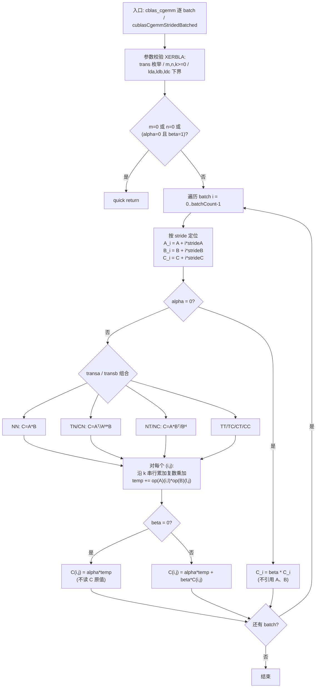
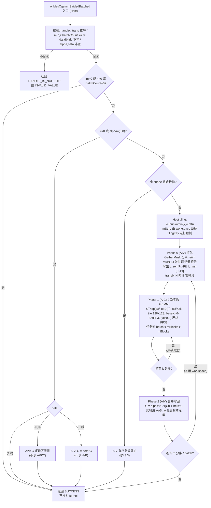

# aclblasCgemmStridedBatched 算子设计文档

| 项目 | 内容 |
| --- | --- |
| 算子 | `aclblasCgemmStridedBatched` |
| 目标产品 | Atlas A2 / A3 系列产品（`DAV_2201`，架构目录 `arch22`） |
| 目标开源仓 | [cann/ops-blas](https://gitcode.com/cann/ops-blas)，实现目录 `blas/gemm_strided_batched/arch22/`，测试目录 `test/gemm_strided_batched/cgemm_strided_batched/arch22/` |
| 开发语言 | Ascend C（handle 式 BLAS kernel 直调，非 TBE 图算子） |
| 代码基线 | ops-blas `2c9b9b77bda979c25a6b89726614b082e73226fa`（2026-09-22 `update gcc15`） |
| CATLASS 子模块 | `db93081ce9b0ad6c04e99b9ed5f2fba081ccdb00` |
| 精度 / 功能实测环境 | DevEnv_513689，Ascend 910B4，CANN **9.1.0** |
| 性能实测环境 | DevEnv_143473，Ascend **910B3**（任务书指定性能设备），CANN 9.0.0 |
| 文档日期 | 2026-09-24 |

> **环境偏差声明（前置说明，不隐藏）**：任务书 §3.1 要求 CANN 9.1.0，且性能设备为 Atlas 800T A2（910B3）。
> 现有两台机器各满足其中一项：910B4 机器是 CANN 9.1.0，910B3 机器是 CANN 9.0.0。
> 因此本设计采取**双机分工**：精度与功能全量在 910B4 / CANN 9.1.0 上取得（版本与任务书一致），
> 性能在 910B3 上取得（芯片与任务书一致），两份结果分栏报告、互不代替。
> 910B4 相对 910B3 是**保守代理**：两者同为 20 Cube / 40 Vector 核、同 UB(192 KB) / L1(512 KB)，
> 但 910B4 `cube_freq=1500` 对 910B3 的 `1800`、L2 为 96 MB 对 192 MB，
> 故 910B4 上达标的耗时在 910B3 上必然同样达标。缺口是 CANN 9.1.0 × 910B3 的组合未被覆盖，
> 以及 A3（`ascend910_9382`）真机回归未覆盖，均在 §5.3 列为遗留风险。

---

# 需求背景（required）

## 需求来源

来源为「**9月社区任务-aclblasCgemmStridedBatched 算子开发(A2A3)**」任务书。目标是在 ops-blas 开源仓
补齐 Atlas A2/A3（`arch22`）上单精度复数带步长批量矩阵乘的 handle 式 BLAS 接口实现，
对齐 cuBLAS `cublasCgemmStridedBatched` 的能力，验收通过后合入 ops-blas。

接口声明按任务书 §4 交付件要求放入公共头文件 `include/cann_ops_blas.h`，供其他产品线共用；
实现按架构目录隔离在 `arch22` 下，不影响已有的 `arch35` 实现。

## 背景介绍

### 算子功能

对每个 batch `i = 0 .. batchCount-1` 独立执行列主序复数矩阵乘：

```text
C_i = alpha * op(A_i) * op(B_i) + beta * C_i
A_i = A + i * strideA
B_i = B + i * strideB
C_i = C + i * strideC          (stride 以元素计，不是字节)
```

`op(X)` 由 `transa` / `transb` 决定：`ACLBLAS_OP_N` 取 `X`、`ACLBLAS_OP_T` 取 `Xᵀ`、
`ACLBLAS_OP_C` 取 `Xᴴ`（共轭转置）。所有 batch 共享同一组 `m/n/k/alpha/beta/transa/transb`。
数据类型为 `aclblasComplex`（COMPLEX64，`{float real; float imag;}`，AoS 交错存储）。

**复数场景下 `OP_T` 与 `OP_C` 不等价**——这是本算子相对实数版 `aclblasSgemmStridedBatched`
最本质的一条增量语义，贯穿 §3 的每个设计点。

### 基线来源说明

本接口属于 ops-blas 的 handle 式 kernel 直调能力，**不是 OPP 中的 TBE 图算子**，
因此不存在可对应的 TBE kernel 实现、算子原型库（`ops_proto_*.h`）与算子信息库
（`aic-*-ops-info.json`）这三条路径。按设计文档 CheckList 对「无自有 TBE 源码」算子的要求，
本节以任务书指定的 **Netlib cblas `cgemm`**（精度标杆）与 **cuBLAS `cublasCgemmStridedBatched`**
（性能标杆）作为 baseline，并在 §1.2.4 完整给出 baseline 的执行管线流程图。

| 基线层次 | 来源 / 路径 | 本设计取用的内容 |
| --- | --- | --- |
| 精度标杆 | Netlib BLAS `cgemm`，随测试工程以 OpenBLAS 提供（`/usr/include/openblas/cblas.h`，`libopenblas.so`） | 逐 batch golden；边界与特殊值（Inf/NaN、alpha=0、beta=0）行为口径 |
| 性能标杆 | cuBLAS `cublasCgemmStridedBatched`，实测值随任务包给出（`test_cases/gpu_baseline.csv` 的 `gpu_ms` 列，200 条） | 达标线 `NPU 平均单次 kernel 耗时 ≤ gpu_ms / 0.8` |
| 接口基线 | ops-blas `include/cann_ops_blas.h` 中已有的 `aclblasCgemm` / `aclblasCgemmBatched` / `aclblasSgemmStridedBatched` 声明风格 | 参数顺序、状态码语义、handle/stream 绑定约定 |
| 复数 BLAS3 框架基线 | ops-blas `blas/common/helper/complex_blas3_arch22.h`、`complex_blas3_tiling_data.h`、`complex_blas3_host_utils.h` | arch22 上「AIV 拆分 → AIC 实数 GEMM → AIV 合并」三段式管线、`128×128×64` Cube tile、`SINGLE_K=8192` 上限、`SplitEmit::kInterleavePQ` 交错拼接 |
| 同框架已落地算子 | `blas/herk/arch22/`、`blas/symm/arch22/`、`blas/syrk/arch22/`（cherk / csymm / csyrk） | 已验证的 Phase0/1/2 划分与 `MatmulImpl` 实例化方式 |

### baseline 支持的数据类型与数据格式

| 项 | Netlib `cgemm` / cuBLAS `cublasCgemmStridedBatched` |
| --- | --- |
| 元素类型 | 单精度复数（`complex float` / `cuComplex`），实部虚部各 FP32 |
| 存储格式 | 列主序（Column-Major），AoS 交错（`re, im, re, im, ...`） |
| 布局参数 | `lda` / `ldb` / `ldc` 前导维；cuBLAS 版额外有 `strideA/strideB/strideC` |
| 转置模式 | `N` / `T` / `C`（`C` 为共轭转置，与 `T` **不等价**） |
| 标量 | `alpha` / `beta` 均为复数 |

### baseline 算子实现描述

Netlib `cgemm` 的参考实现是三重循环 + 前导维寻址：先做参数合法性检查（`XERBLA`），
再处理 quick return（`m=0 || n=0 || (alpha=0 && beta=1)` 直接返回），
然后按 `transa/transb` 的四种组合分支，每个分支内对 `j`（列）→ `l`/`i` 顺序累加，
`alpha`、`beta` 在标量层面直接参与复数乘加；`beta=0` 时不读 C 原值而直接赋值，
`alpha=0` 时不引用 A、B。**累加沿 k 顺序串行**，每一步都是一次复数乘加
（4 次实数乘 + 4 次实数加）。

cuBLAS 的带步长批量版把上述单次 `cgemm` 按 `i*stride` 偏移逐 batch 施加，
batch 之间无数据依赖；GPU 上以 tile 划分并批量调度。任务包给出的 `gpu_baseline.csv`
即该实现在标杆 GPU 上的实测耗时。

### baseline 实现流程图



---

# 需求分析（required）

## 需求描述

实现与仓内公共头文件声明完全一致的接口（本任务新增声明）：

```cpp
aclblasStatus_t aclblasCgemmStridedBatched(
    aclblasHandle_t handle, aclblasOperation_t transa, aclblasOperation_t transb,
    int m, int n, int k, const aclblasComplex *alpha,
    const aclblasComplex *A, int lda, long long strideA,
    const aclblasComplex *B, int ldb, long long strideB,
    const aclblasComplex *beta, aclblasComplex *C, int ldc, long long strideC,
    int batchCount);
```

输入输出均为 COMPLEX64，矩阵按列主序解释，`stride` 单位是元素。
接口绑定 handle 中的 stream 异步发射，调用方读回结果前须同步 stream。

## 需求拆解

| 编号 | 子需求 | 设计响应 |
| --- | --- | --- |
| F1 | 复数矩阵乘落到实数 Cube | §3.1.2 K 轴交错符号折叠，2 次实数 GEMM（归约长度 `2k`） |
| F2 | `transa/transb` 9 组全覆盖，且 `C≠T` | §3.1.3 转置由 `MatmulImpl` 布局标志承担，共轭由 Phase 0 符号承担，二者正交 |
| F3 | 列主序零拷贝 | §3.1.4 `Cᵀ = op(B)ᵀ·op(A)ᵀ`，不显式转置整矩阵 |
| F4 | 带步长批量 | §3.2.1 `batch × mTile × nTile` 统一任务池，按 `stride` 定位，64 位寻址 |
| F5 | `strideA/strideB = 0` 广播 | §3.2.1 指向 batch 0，A 的打包只做一次并跨 batch 复用 |
| F6 | 复数 `alpha` / `beta` | §3.1.5 Phase 2 合并，含 `beta=0` 不读 C、`alpha=0` 不引用 A/B |
| F7 | quick return 与仅缩放 | §3.2.3 四分支边界表 |
| F8 | 严格 FP32 | §3.3.1 `SetHF32(false, 0)`，arch22 Cube 原生 FP32 |
| F9 | Inf/NaN 与极值 | §3.1.2 交错折叠使抵消先于溢出发生；§3.3.3 小 shape 有序标量路径 |
| F10 | 前导维 padding | §3.2.2 `lda/ldb/ldc` 独立于逻辑维，寻址与打包均按前导维 |
| F11 | 有界 workspace | §3.2.4 沿 k 分段 + 沿 m 分条，峰值与 shape 解耦 |
| F12 | 泛化与负向校验 | §3.2.3 校验顺序；§5.2 验证矩阵 1200 条 CSV |

## 范围边界

**支持**：COMPLEX64；列主序；`transa/transb ∈ {N,T,C}` 全 9 组；`m/n/k ≥ 0`；
`batchCount ≥ 0`；任意满足 BLAS 下界的 `lda/ldb/ldc`（含 padding）；
`strideA/strideB = 0` 广播；复数 `alpha/beta` 全集（含 0、1、-1、纯虚）；
规格允许的 Inf/NaN 输入。

**不支持 / 不定义**：
- 超出 `lda/ldb/ldc` 与 `stride` 语义的非连续访存（任务书 §2.5 明确不要求）；
- `stride` 过小导致的 batch 间重叠越界——任务书 §2.4 规定不做运行时校验，行为未定义；
- `strideC = 0 && batchCount > 1`——输出互相覆盖，语义未定义，不构造正向用例；
- C 与 A/B 内存重叠（任务书 §2.5 规定离席计算，不允许重叠）；
- 逐位可复现（任务书 §2.1.6 明确不要求确定性计算）；
- 动态 shape 编译期特化（`m/n/k/batchCount/stride` 均为运行时入参，由 host tiling 承担）。

## 外部组件依赖

| 依赖 | 用途 | 约束 |
| --- | --- | --- |
| ACL Runtime | stream / device 内存 / 异步发射 | 随 CANN 提供，不新增 |
| ops-blas handle | stream 绑定与 workspace 供给 | 复用 `aclblasSetStream`，不改 handle 结构 |
| Ascend C `MatmulImpl` | Phase 1 实数 FP32 GEMM | 复用 `complex_blas3_arch22.h` 已有实例化 |
| CATLASS 子模块 | 随仓提供的 Cube 基础能力 | 不修改子模块 |
| OpenBLAS / cblas | **仅** host 侧自测 golden | 不进入交付动态库 |

## 内部适配模块

| 模块 | 文件 | 设计职责 |
| --- | --- | --- |
| 公共接口声明 | `include/cann_ops_blas.h` | 新增 `aclblasCgemmStridedBatched` 声明（任务书 §4 要求） |
| Host | `blas/gemm_strided_batched/arch22/cgemm_strided_batched_host.cpp` | 校验、路径分派、tiling、workspace 规划、逐段发射 |
| Tiling 数据 | `blas/gemm_strided_batched/arch22/cgemm_strided_batched_tiling_data.h` | host/device 字节一致的 tiling 结构 |
| Kernel | `blas/gemm_strided_batched/arch22/cgemm_strided_batched_kernel.cpp` | Phase 0 打包 / Phase 1 GEMM / Phase 2 合并 |
| Kernel 声明 | `blas/gemm_strided_batched/arch22/cgemm_strided_batched_kernel.h` | kernel 入口声明 |
| 复用（不修改） | `blas/common/helper/complex_blas3_arch22.h` 等 | Matmul 实例化、tile 解析、交错拼接原语 |
| 测试 | `test/gemm_strided_batched/cgemm_strided_batched/arch22/` | CSV 驱动 GTest、cblas golden、npu wrapper |

---

# 详细设计（required）

## 算子分析

### 数学公式

设 `P = op(A_i)`（`m×k` 复数）、`Q = op(B_i)`（`k×n` 复数），记实虚部为 `Pr,Pi,Qr,Qi`。
复数矩阵乘展开为四个实数矩阵乘的组合：

```text
Cr = Pr*Qr - Pi*Qi
Ci = Pr*Qi + Pi*Qr
```

复数 `alpha = (ar, ai)`、`beta = (br, bi)` 的合并：

```text
C_re' = ar*Cr - ai*Ci + br*C_re - bi*C_im
C_im' = ar*Ci + ai*Cr + br*C_im + bi*C_re
```

共轭转置：`Xᴴ = Xrᵀ - j·Xiᵀ`，即**转置 + 虚部取反**。

### 支持数据类型

| 数据 | 类型 | 存储位置 | 说明 |
| --- | --- | --- | --- |
| `A` / `B` / `C` | COMPLEX64（`aclblasComplex`） | Device | 列主序，AoS 交错 |
| `alpha` / `beta` | COMPLEX64 | **Host** | 较 cuBLAS 收紧：仅支持 host 指针 |
| `m/n/k/lda/ldb/ldc/batchCount` | `int` | Host | — |
| `strideA/strideB/strideC` | `long long`（INT64） | Host | 元素计 |
| Cube 累加器 | FP32 | L0C | **HF32 关闭**，严格 FP32 |

### 支持形状

| 参数 | 物理 shape | 约束 |
| --- | --- | --- |
| `A` | `transa=N`：`m×k`；`T/C`：`k×m` | `lda ≥ max(1,m)`（N）/ `max(1,k)`（T/C） |
| `B` | `transb=N`：`k×n`；`T/C`：`n×k` | `ldb ≥ max(1,k)`（N）/ `max(1,n)`（T/C） |
| `C` | `m×n` | `ldc ≥ max(1,m)` |
| batch | `batchCount` 个，按 stride 偏移 | `batchCount ≥ 0` |

实测覆盖范围：`m/n/k ∈ [0, 4096]`，`batchCount ∈ [0, 1024]`。

## 算子实现

### 使能方式

本算子是 **handle 式 BLAS kernel 直调**，不经 aclnn 两段式接口，也不注册 OPP 算子原型。
调用序列：

1. `aclblasCreate(&handle)` 创建句柄（内部分配默认 workspace）；
2. `aclblasSetStream(handle, stream)` 绑定 stream；
3. `aclblasCgemmStridedBatched(handle, ...)` 异步发射 Phase 0/1/2 kernel 到该 stream；
4. `aclrtSynchronizeStream(stream)` 同步后读回 C；
5. `aclblasDestroy(handle)`。

同一 handle、同一 stream 上的连续调用严格有序，因此 workspace 可安全复用；
**多 stream 并发须使用独立 handle**。

### 3.1 复数到实数的映射

#### 3.1.1 为什么不能直接用 Cube 算复数

arch22 的 Cube 单元只做实数 FP32 乘累加，没有复数 MAC。因此必须把一次复数 GEMM
分解成实数 GEMM。可选方案有三类：4M（四次实数 GEMM）、3M/Karatsuba（三次乘 + 更多加）、
K 轴交错符号折叠（两次归约长度翻倍的实数 GEMM）。本设计选**第三类**，理由见 §3.1.2 与 §3.3.4。

#### 3.1.2 K 轴交错符号折叠（核心设计）

**关键观察**：一个列主序、AoS 交错存储的复数矩阵，
若它的**交错轴恰好就是归约轴 k**，那么把它按实数解读，它**本身就是一个归约长度为 `2k`
的 K 轴交错实数操作数**，无需任何格式转换。

以 `transb = N` 为例：`B` 物理形状 `k×n`，列主序，第 `c` 列是 `2k` 个连续 float：
`[Br(0,c), Bi(0,c), Br(1,c), Bi(1,c), ...]`。把 B 按实数看成 `(2k)×n`、前导维 `2*ldb`
的矩阵 `B~`，其第 `2j` 行是 `Br(j,:)`、第 `2j+1` 行是 `Bi(j,:)`。

于是只要把 A 打包成两个 K 轴交错的实数左操作数（列索引 `2j` / `2j+1` 与 `B~` 的行一一对应）：

```text
L_re[:, 2j] = Pr[:, j]      L_re[:, 2j+1] = -Pi[:, j]
L_im[:, 2j] = Pi[:, j]      L_im[:, 2j+1] =  Pr[:, j]
```

就有

```text
L_re * B~ = Σ_j ( Pr[:,j]*Qr[j,:] - Pi[:,j]*Qi[j,:] ) = Cr
L_im * B~ = Σ_j ( Pi[:,j]*Qr[j,:] + Pr[:,j]*Qi[j,:] ) = Ci
```

**两次实数 GEMM，归约长度 `2k`，B 零预处理、零额外 workspace。**

这两个左操作数 `L_re = [Pr, -Pi]`、`L_im = [Pi, Pr]`（按列交错）**正是仓内
`complex_blas3_arch22.h` 中 `SplitEmit::kInterleavePQ` 已有的两个输出**
（该模式发射 `P = [Xi, Xr]`、`Q = [Xr, -Xi]`），因此 Phase 0 直接复用既有原语。

**算量不变**：2 次 GEMM × `m·n·2k` = `4mnk` 次实数乘累加，与 4M 的
4 × `m·n·k` 完全相等。收益不在算量，而在两点数值性质：

1. **抵消发生在同一条 Cube 累加链内部**。4M 先分别算完 `Pr*Qr` 与 `Pi*Qi`
   （各自量级 `O(k)`）再相减，而两者之差可能只有 `O(√k)`，于是相减损失掉
   两个独立舍入误差的量级；交错折叠让 `+PrQr` 与 `-PiQi` 成为累加链中相邻的两项，
   抵消在部分和还很小的时候就完成。仓内 `complex_blas3_tiling_data.h` 对 cherk/csyrk
   给出的正是同一论证。
2. **避免 `Inf - Inf = NaN`**。当输入含 `±FLT_MAX`（测试集的 `RANDOM_EXTREME` 与
   `TC_FL` Inf 用例）时，分块求和会让两个半边各自先溢出到 `Inf`，相减得 `NaN`；
   交错后每一项与其对手项紧邻抵消，部分和始终不越界。仓内对 `kInterleavePQ`
   的注释明确记录了这一点：*"On the RANDOM_EXTREME shapes, whose input carries
   ±FLT_MAX, that is the difference between matching the reference everywhere and
   returning NaN."*

#### 3.1.3 转置与共轭的正交分解

`transa/transb` 各 3 态共 9 组。本设计把它们分解成两个**互相正交**的机制：

| 机制 | 承担者 | 说明 |
| --- | --- | --- |
| 转置（`T`/`C` 的转置部分） | `MatmulImpl` 的布局标志 `isTrans` + 运行期 `SetTensorA/B` 标志 | 复用 `MatmulTransLeft` / `MatmulTransRight` / `MatmulPlainBoth` 三个既有实例化 |
| 共轭（`C` 的取反部分） | Phase 0 打包时对虚部乘 `-1` | 对应 tiling 结构中已有的 `negateImag` 字段 |

于是 9 组组合只需 `{左操作数是否转置} × {右操作数是否转置} × {A 虚部符号} × {B 虚部符号}`
四个独立开关，不需要 9 份代码。**这是相对实数版最关键的一处增量**：
实数 `arch22` 的 sgemm 实现里 `OP_C` 与 `OP_T` 走同一分支，复数下必须分开。

**交错轴与归约轴的对应关系**决定了哪个操作数可以零拷贝使用：

| 操作数 | 物理形状 | 交错轴 | 是否天然 K 轴交错 |
| --- | --- | --- | --- |
| `A`，`transa=N` | `m×k` | `m`（M 轴） | 否，需打包 |
| `A`，`transa=T/C` | `k×m` | `k`（K 轴） | **是** |
| `B`，`transb=N` | `k×n` | `k`（K 轴） | **是** |
| `B`，`transb=T/C` | `n×k` | `n`（N 轴） | 否，需打包 |

设计取舍：**先保证一致正确，再取免费的快路径**。
Phase 0 统一具备打包任一操作数的能力（覆盖 9 组组合）；
当 `transb=N` 时（含任务书 5 条性能 case 中的第 1、2、4、5 条）走 **B 零拷贝快路径**，
只打包 A；`transb=T/C` 时改为打包 B、A 零拷贝（`transa=T/C`）或两者都打包（`N/T`，性能 case 3）。

#### 3.1.4 列主序零拷贝映射

目标是列主序的 `C = op(A)·op(B)`。同一片物理内存按 row-major 解读即其转置，故用

```text
Cᵀ = op(B)ᵀ · op(A)ᵀ
```

在 row-major 框架里计算，即交换左右操作数与 `m/n`：

```text
mEff = n     nEff = m     kEff = 2k   (交错后归约长度翻倍)
左操作数 = B 侧      右操作数 = A 侧
```

这样 A、B、C 都不需要在 GM 里显式转置。该映射与实数版 `arch22` 完全一致，
唯一差别是 `kEff` 取 `2k` 而不是 `k`。

#### 3.1.5 Phase 2 合并与写回

Cube 产出的是两片**独立的实数平面** `Cr`、`Ci`，而 C 是 AoS 交错复数。
因此 Phase 2（AIV）**始终需要**：它同时完成交错写回与复数 `alpha/beta` 合并，
按 §3.1 的公式逐元素计算，并严格遵守 `beta=0` 不读 C 原值、
`alpha=0` 不引用 A/B 的语义。按 C 的列分段，每次处理不超过 2048 个 FP32 元素，
尾段用 padding copy 且只覆盖有效元素（不破坏 `ldc` padding 区）。

### 3.2 host 侧设计

#### 3.2.1 分核策略

核数**通过平台接口查询获得，不硬编码**（codecheck 红线）。

Phase 1 把 batch 与二维输出块展平成统一任务池：

```text
mBlocks     = ceil(mEff / 128)
nBlocks     = ceil(nEff / 128)
totalTasks  = batchCount * mBlocks * nBlocks
```

设备端按全局任务号消费任务（`ResolveGemmTile` 解析 `(batch, mTile, nTile)`），
避免「一个 batch 一个 kernel」的启动开销，也让小矩阵的多个 batch 共同填满 Cube 核。
沿用 `complex_blas3_arch22.h` 中**先统计需要的 tile 数、再按序分发**的做法，
避免核索引与 tile 几何耦合导致的负载倾斜（该文件记录了倾斜时 `n=2432` 比更大的
`n=2688` 反而慢 2.13 ms vs 1.75 ms 的实测）。

Phase 0 / Phase 2 是访存型，按**列**在核间轮转（round robin），
使列数略大于核数时每个核仍有活干。

`strideA/strideB = 0` 时对应指针指向 batch 0；A 的打包结果跨 batch 复用，只做一次。

#### 3.2.2 数据分块与内存优化策略

**Cube tile** 取 `128×128`、`baseK = 64`，直接复用 `CBLAS3_TILE_M/N`、`CBLAS3_BASE_K`。
该取值的依据记录在 `complex_blas3_tiling_data.h`：`128×128×64` 是能让 L0A/L0B/L0C
在 FP32 下**全部保持双缓冲**的最大块；把 `baseK` 提到 128 会关掉 dbL0B/dbL0C，代价约 30%。

**K 分段**：单次 Phase 1 launch 的归约长度受静态 tiling 硬上限 `SINGLE_K = 8192` 约束
（超出会被静默算错，不报错）。交错后归约长度是 `2k`，故

```text
kChunkMax = SINGLE_K / 2 = 4096
kChunks   = ceil(k / kChunkMax)
```

任务书 5 条性能 case 的 `k ≤ 4096`，即 `2k ≤ 8192`，**恰好单次 launch 覆盖**；
`k > 4096` 时分段并由 Cube 原子累加到同一组 `Cr/Ci` 平面。

**Phase 0 的 UB 预算**（沿用 `SPLIT_CHUNK = 4096` 元素的分块）：

```text
UB = stage(4096*2*4B) + re(4096*4B) + im(4096*4B) + neg(4096*4B)
   = 32768 + 16384 + 16384 + 16384 = 81920 B = 80 KB  ≤ 192 KB
```

余量留给双缓冲与对齐，tensor 数 4 个（≤ 8）。

**workspace 规划（有界、复用）**。需要的临时空间有两类：
打包后的左操作数两份，以及（Phase 2 需要后处理时的）`Cr/Ci` 两片实数平面。
按 batch 顺序复用同一块 workspace，并在单 batch 放不下时沿 `m` 分条：

```text
packBytes(mStrip, kChunk) = 2 * mStrip * (2*kChunk) * 4B = 16 * mStrip * kChunk
tempBytes(mStrip)         = 2 * mStrip * align_up(n, 8) * 4B
mStrip = max{ s : packBytes(s, kChunk) + tempBytes(s) <= effectiveWorkspaceBytes }
```

workspace 取自 handle 的有效 workspace（默认 32 MiB，4 MiB 也可工作）；
临时输出前导维向上对齐到 8 个 FP32 元素（32 B）。
**若连一条最小分条都放不下，返回执行失败**，调用方可通过 handle 注入更大 workspace。
峰值用量因此与 shape 解耦、有界——这与 `arch35` 复数实现采用的无界 planar 缓冲
（`1024³×8` 可达数百 MiB）是一处有意的分歧，取有界方案以适配 A2 的 32 MiB 默认预算。

#### 3.2.3 参数校验、quick return 与路径分派

校验顺序（短路，任一不满足立即返回）：

1. `handle != nullptr`，否则 `ACLBLAS_STATUS_HANDLE_IS_NULLPTR`；
2. `transa/transb ∈ {N, T, C}`；
3. `m ≥ 0`、`n ≥ 0`、`k ≥ 0`、`batchCount ≥ 0`；
4. `lda/ldb/ldc` 满足 §「支持形状」的 trans 相关下界；
5. `alpha != nullptr`、`beta != nullptr`（host 指针）；
6. **按语义条件**校验矩阵指针：参与计算时 `A/B` 非空（`alpha≠0 && k>0`）、
   `C` 非空（任何会写 C 的路径）。

以上 2–6 不满足均返回 `ACLBLAS_STATUS_INVALID_VALUE`。

边界与 quick return：

| 条件 | 行为 | 读 A/B | 读 C 原值 |
| --- | --- | --- | --- |
| `m=0 \|\| n=0 \|\| batchCount=0` | 合法 no-op，返回 SUCCESS，不发射 kernel | 否 | 否 |
| `k=0 \|\| alpha=(0,0)`，且 `beta=(1,0)` | C 不变，不发射 kernel | 否 | 否 |
| `k=0 \|\| alpha=(0,0)`，且 `beta=(0,0)` | 仅把 C 的逻辑 `m×n` 区置零，不动 padding | 否 | 否 |
| `k=0 \|\| alpha=(0,0)`，其他 `beta` | AIV 执行 `C = beta*C` | 否 | 是 |
| 其他 | Phase 0 → Phase 1 → Phase 2 | 是 | `beta≠0` 时是 |

这张表与测试集的 `TC_ED_136..146` 逐条对应，特别是
`TC_ED_144/145`（`alpha=0` 时 A/B 填 NaN，结果不得被污染）与
`TC_ED_146`（`beta=0` 时 C 原值填 NaN，不得被读入）。

#### 3.2.4 tilingKey 规划策略

按「是否需要 Phase 0 打包哪一侧」「是否需要 Phase 2 后处理」「转置布局」分派：

| tilingKey | 条件 | 说明 |
| --- | --- | --- |
| 0 | `k=0 \|\| alpha=0`，`beta` 一般 | 仅 AIV `beta*C` |
| 1 | `transb=N` | B 零拷贝，只打包 A（快路径，覆盖性能 case 1/2/4/5） |
| 2 | `transb=T/C && transa=T/C` | A 零拷贝，只打包 B |
| 3 | `transa=N && transb=T/C` | 两侧都打包（性能 case 3 的 `N/T`） |
| 4 | 小 shape / 极值有序路径 | 见 §3.3.3 |

### 3.3 kernel 侧设计

#### 3.3.1 kernel 侧实现描述

三段式，与仓内 arch22 复数 BLAS3 算子一致：

**Phase 0（AIV，打包）**：按列在核间轮转；每列以 `SPLIT_CHUNK` 为粒度
`DataCopyPad` 搬入 UB，用 `GatherMask` 一次分离出实部与虚部两条连续序列，
`Muls(-1)` 得到取反的虚部，再按 `kInterleavePQ` 的目标偏移
`DataCopyPad` 写出两个 K 轴交错的实数操作数。
`transa/transb = C` 的共轭在此处通过选择取反的那一路完成。

**Phase 1（AIC，实数 GEMM）**：每个 AIC 从统一任务池取 `(batch, mTile, nTile)`；
`SetOrgShape` 按 trans 模式填五元组（`orgM/orgN/orgKa/orgKb/orgKc`——
填错会静默算错转置情形），`SetSingleShape` 带入本次 launch 的 `kCount`；
**显式 `SetHF32(false, 0)` 关闭 HF32**，保证严格 FP32；
`baseK = 64` 步进 `Mmad`，首个 K tile 初始化 L0C、后续累加；
`Fixpipe` 把 FP32 L0C 写到 workspace 的 `Cr` / `Ci` 平面
（`kChunks > 1` 时用原子累加）。两次 GEMM（`Cr`、`Ci`）共享同一个已打包的左操作数。

**Phase 2（AIV，合并写回）**：按 C 的列分段读入 `Cr/Ci`（以及 `beta≠0` 时的 C 原值），
按 §3.1 公式算复数 `alpha/beta` 合并，交错成 AoS 后写回 C，只覆盖有效元素。

同步一律由 `TQue` 的 `EnQue/DeQue` 自动管理，不手写 `SetFlag/WaitFlag`；
三个 Phase 之间由同一 stream 上的 kernel 顺序保证。

#### 3.3.2 AscendC 实现流程图



#### 3.3.3 小 shape 与极值有序路径

CPU golden 沿 `k` **严格顺序**累加，而 Cube 是分块并行归约。对绝大多数输入两者都在容差内，
但当输入含 `±FLT_MAX` / `Inf` / `NaN` 时，求和顺序会改变溢出与 `NaN` 传播的结果
（`TC_FL` 类用例）。§3.1.2 的交错折叠已经消掉了最主要的一类（符号抵消项先于溢出抵消），
剩余的极小 shape 情形再以一条 **AIV 有序复数乘加**路径兜底：
当 `m·n·k` 很小且检测到非有限或接近 FP32 上限的输入时，按与 cblas 相同的 `k` 顺序做标量累加。
该路径与 Cube 写回互斥（不同 tilingKey，不并发），不存在竞争。
数值保护只依据**输入数据本身**在 device 内判定，**不读取用例名、随机种子或 golden**。

#### 3.3.4 AscendC 流程图与 baseline 流程图的差异点和原因

| # | baseline（cblas / cuBLAS） | 本设计（Ascend C arch22） | 原因 |
| --- | --- | --- | --- |
| 1 | 每个输出元素一次**复数**乘加（4 实乘 + 4 实加），标量执行 | 拆成 **2 次实数 GEMM**，归约长度 `2k`，交由 Cube | arch22 Cube 只有实数 FP32 MAC，没有复数 MAC；必须分解才能用上 Cube |
| 2 | 沿 `k` **顺序串行**累加 | `128×128` tile + `baseK=64` 分块**并行**归约，`k>4096` 再分段原子累加 | 顺序累加无法利用 20 个 Cube 核与 L0C 双缓冲；代价是浮点加法不可结合，故任务书 §2.1.6 不要求逐位一致 |
| 3 | 四种 `transa/transb` 分支各写一套三重循环；实数库里 `C≡T` | 转置由 `MatmulImpl` 布局标志承担、共轭由 Phase 0 符号承担，**两者正交**；`C≠T` | 9 组组合若各写一份会爆炸；正交分解后只需 4 个独立开关。复数下 `OP_C` 必须额外取反虚部，这是相对实数版的增量 |
| 4 | 直接按 `lda/ldb/ldc` 在**交错**内存上寻址 | Phase 0 把一侧**打包**成 K 轴交错实数操作数；另一侧在交错轴与归约轴重合时**零拷贝**使用 | Cube 的 `MatmulImpl` 需要稠密实数操作数；而交错轴与归约轴重合时 AoS 本身就是合法操作数（§3.1.2），能省掉一半打包与其全部访存 |
| 5 | `alpha/beta` 在最内层标量乘加时直接施加 | 推迟到 **Phase 2** 统一施加 | Cube 只能产出未缩放的实数平面；集中到一个 AIV pass 里做复数合并，同时完成 AoS 交错写回，省一次全矩阵读写 |
| 6 | 结果直接写 C | Cube 先写 `Cr/Ci` 两片实数平面到 workspace，再由 Phase 2 交错写回 C | `Fixpipe` 写出的是连续实数 tile，无法直接交错成 AoS；故 Phase 2 不可省 |
| 7 | 无 workspace 概念 | 有界、跨 batch/分条复用的 workspace，放不下则报失败 | A2 默认 handle workspace 32 MiB，而 `4096³` 的 planar 缓冲需数百 MiB；必须分条使峰值与 shape 解耦 |
| 8 | 逐 batch 调用，batch 间串行 | `batch × mBlocks × nBlocks` 统一任务池，一次 launch 消费 | 小矩阵大 batch 时逐 batch launch 的开销会主导；展平后多个 batch 共同填满 Cube |
| 9 | 溢出/`NaN` 传播由顺序累加天然决定 | 交错折叠让抵消先于溢出；极小 shape 含极值时再走有序标量路径 | 并行归约会把 `Inf-Inf` 变成 `NaN`；§3.1.2 与 §3.3.3 两级措施对齐 baseline 的特殊值分类 |

## 支持硬件

| 支持的芯片版本 | 架构目录 | 涉及勾选 | 验证状态 |
| --- | --- | --- | --- |
| Atlas A2 系列产品（含 Atlas 800I/T A2） | `arch22` / `DAV_2201` | √ | 精度 910B4+CANN 9.1.0；性能 910B3 |
| Atlas A3 系列产品（含 Atlas 800I A3） | `arch22` / `DAV_2201` | √ | 待补（见 §5.3 遗留风险） |

构建：`bash build.sh --soc=ascend910b3 --ops=gemm_strided_batched`；A3 换 `--soc=ascend910_9382`。

## 算子约束限制

1. `alpha` / `beta` **仅支持 host 指针**（较 cuBLAS 收紧，任务书 §2.4 明确）；
2. `stride` 过小导致的越界**不做运行时校验**，行为未定义（任务书 §2.4）；
3. `strideC = 0 && batchCount > 1` 语义未定义；
4. C 不得与 A/B 内存重叠；
5. 不保证浮点累加顺序逐位一致（任务书 §2.1.6）；
6. 不支持超出 `lda/ldb/ldc` 与 `stride` 语义的非连续访存；
7. workspace 不足一条最小分条时返回执行失败，需通过 handle 注入更大 workspace；
8. 仅 COMPLEX64；不含 COMPLEX32/COMPLEX128。

---

# 特性交叉分析

| 交叉维度 | 设计关注点 | 应对策略与验证要求 |
| --- | --- | --- |
| `transa` × `transb` | 9 组；复数下 `T`/`C` **不等价** | 转置与共轭正交分解（§3.1.3）；`TC_L0` 9 组小 shape 全覆盖 + `TC_CV` 36 条中等 shape |
| `trans` × 交错轴 | 决定哪侧可零拷贝，4 种组合 | tilingKey 1/2/3 分派（§3.2.4）；4 条性能 case 走快路径、`N/T` 走双打包 |
| `trans` × `lda/ldb` 下界 | `N` 与 `T/C` 的下界不同 | 校验步骤 4；`TC_ED_155..160` 对 N/T/C 各态分别构造非法前导维 |
| `alpha=0` × A/B 空指针/NaN | 不得引用、不得污染 | 语义化指针校验（步骤 6）；`TC_ED_144/145` |
| `beta=0` × C 原值 NaN | 不得读入 | Phase 2 分支；`TC_ED_146` |
| `alpha=0` × `beta=0` | C 全置零 | quick return 表第 3 行；`TC_ED_142/144` |
| `k=0` × `beta` | 三种 `beta` 三种行为 | quick return 表；`TC_ED_138/141/142` |
| `stride=0` 广播 × batch | A 的打包只做一次并复用 | §3.2.1；`TC_BR` 3 条（A/B/双广播） |
| `stride` 非紧凑 × batch | 按元素 stride 定位，64 位寻址 | `TC_SD` 2 条（+1/+16） |
| `batchCount=1` × stride | stride 不参与寻址 | `TC_ED_166` |
| 大 `batchCount` × 小 shape | 启动开销主导 | 统一任务池展平（§3.2.1）；`TC_BC` 13 条扫到 1024 |
| `k > 4096` × 原子累加 | 跨越 `SINGLE_K/2` 分段边界 | §3.2.2；需补 `k=4097` 用例（见 §5.2） |
| 极值/Inf/NaN × 并行归约 | 溢出与 NaN 传播顺序敏感 | 交错折叠 + 有序兜底（§3.1.2/§3.3.3）；`TC_FL` 6 条 |
| 前导维 padding × 写回 | 不得破坏 padding 区 | Phase 2 只覆盖有效元素；`TC_LD` 4 条 |
| workspace × 连续异步调用 | 同 handle 同 stream 顺序复用 | §「使能方式」；多 stream 须独立 handle |
| 首次调用 × 性能采样 | 首次含初始化开销 | 性能口径固定为 msprof 的 kernel `Task Duration`，warmup 后采样 |

---

# 可维可测分析

## 精度标准 / 性能标准

| 验收项 | 标准 | 标准来源 | 验证方式 |
| --- | --- | --- | --- |
| 精度 | COMPLEX64：`rtol = atol = 2⁻¹³ ≈ 1.2207e-4`；逐元素 `\|actual-golden\| ≤ atol + rtol*\|golden\|`；`matched_ratio ≥ 0.99` **且** `max_abs_error ≤ 1e-2 或 32*ULP`（含规约，可酌情放宽至 2 ULP） | 任务书 §3.2 + [生态算子开源精度标准](https://gitcode.com/cann/opbase/blob/master/docs/zh/ops_precision_standard/mixed_tolerance_standard.md) | cblas `cgemm` 逐 batch golden，复数按实部/虚部分别判定；1000 条精度用例 |
| 性能 | **NPU 平均单次 kernel 耗时 ≤ `gpu_ms / 0.8`** | 任务书 §3.3 + `test_cases/README.md` | `msprof op` 采集 `OpBasicInfo.csv` 的 `Task Duration(us)`，按 kernel 名求均值；warmup 后有效采样 ≥ 10 次 |
| 内存 | 不涉及 | 任务书 §3.4 | 仅报逻辑容量与 handle workspace 规划值，不冒充实测进程峰值 |

**口径一致性核对**：任务书 §3.3 表中 5 条达标耗时与 `gpu_baseline.csv` 的
`gpu_ms / 0.8` 完全吻合（例：`0.122966/0.8 = 0.15371 ms = 153.7 us`），
两处**无冲突**，故只需一套口径。

**性能可行性标定**（说明为何该目标可达，而非事后解释）：
910B3 为 20 Cube 核 @ 1800 MHz，每核每周期 1024 次 FP32 乘累加，
严格 FP32 理论峰值 `20 × 1.8e9 × 2048 = 73.7 TFLOP/s`；
2026-08 的 `aclblasSgemmStridedBatched` 同机实测达 **73.2 TFLOP/s**（峰值的 99.3%），
该标定可直接复用。复数算量为 `8·m·n·k·batchCount`：

| case | `m=n=k` / batch | 复数算量 | @73.2 TFLOP/s 下限耗时 | 达标耗时 | 余量 |
| --- | --- | --- | --- | --- | --- |
| 1 | 256³ × 8 | 1.07 GFLOP | 15 us | 153.7 us | 10.2× |
| 2 | 512³ × 32 | 34.4 GFLOP | 470 us | 2757 us | 5.9× |
| 3 | 1024³ × 16 (N/T) | 137 GFLOP | 1877 us | 10061 us | 5.4× |
| 4 | 2048³ × 8 (T/N, padding) | 550 GFLOP | 7509 us | 36073 us | 4.8× |
| 5 | 4096³ × 4 (padding) | 2199 GFLOP | 30036 us | 143326 us | 4.8× |

即**即使按最朴素的 4 倍实数算量、且不计任何优化余量**，大 shape 仍有 ~4.8× 余量。
因此本设计把预算优先投给**正确性与泛化**（9 组转置 × 边界 × 极值），
而不是把 3M 之类降算量手段作为默认路径——3M 只有 3/4 算量，
但会引入和/差平面的额外 workspace 与二次抵消（`P_i = T₃-T₁-T₂`），
在已有 4.8× 余量时是不划算的精度风险。该取舍记录在下表。

### 备选方案与决策

| 方案 | 优点 | 风险 / 代价 | 决策 |
| --- | --- | --- | --- |
| 4M：4 次归约长度 `k` 的实数 GEMM | 实现最直观 | 两个 `O(k)` 量级结果相减，抵消误差大；极值下 `Inf-Inf=NaN` | **不采用**（算量与交错折叠相同，数值却更差） |
| 3M / Karatsuba | 算量降到 3/4 | 需和/差平面额外 workspace；`P_i` 二次抵消放大误差；分块顺序影响精度 | **不采用**（已有 4.8× 余量，不值得换精度风险） |
| **K 轴交错符号折叠（2 次 GEMM，归约 `2k`）** | 算量与 4M 相同；抵消在单条累加链内完成；一侧可零拷贝；复用仓内既有原语 | 归约长度翻倍，`k>4096` 需分段 | **采用** |
| HF32 加速 Cube | 更快 | 精度不满足 FP32 档（同类算子实测匹配率约 91.8%、最大绝对误差 2.13e-3） | **不采用**，显式 `SetHF32(false, 0)` |
| 无界 planar workspace（arch35 复数实现风格） | host 逻辑更简单 | `4096³` 需数百 MiB，超出 A2 默认 32 MiB | **不采用**，改为有界分条复用 |

## 验证矩阵

测试工程位于 `test/gemm_strided_batched/cgemm_strided_batched/arch22/`，
CSV 驱动 GTest + cblas golden，共 **1200 条**（任务包 `gemm_strided_batched_test.csv`，
固定种子 20260823，逐字节可复现）：

| 类别 | 前缀 | 条数 | 覆盖内容 |
| --- | --- | --- | --- |
| 基础 | `TC_L0` | 9 | `transa×transb` 3×3 全组合，小 shape |
| 尺寸 | `TC_SQ` | 22 | 1→2048 方阵（质数 / 边界 / 2 幂±1 / 非对齐） |
| 标量 | `TC_AB` | 24 | 8 组 `alpha/beta`（含双零、纯虚、±1）× 3 转置 |
| 批规模 | `TC_BC` | 13 | `batchCount` 1→1024 |
| 矩形 | `TC_RC` | 16 | `m/n/k` 两两不等 |
| 前导维 | `TC_LD` | 4 | `lda/ldb/ldc` padding |
| 步长 | `TC_SD` | 2 | 非紧凑 stride |
| 广播 | `TC_BR` | 3 | `strideA=0` / `strideB=0` / 双广播 |
| 填充 | `TC_FL` | 6 | 均匀 / 全零 / 交替 / 极端 / Inf / NaN |
| 覆盖 | `TC_CV` | 36 | 中等 shape × 9 转置组合 |
| 边界负向 | `TC_ED` | 33 | 零维 / 零批 / `k=0` / `alpha=0` / `beta=0` 不引用语义 / 空指针 / 非法枚举 / 非法前导维 / 负维度 / 负 batch |
| 扩展 | `TC_EX` | 832 | 尺寸×批×转置×标量×padding×广播 确定性采样 |
| 性能 | `TC_PF` | 200 | 前 5 条与任务书 §3.3 逐参数精确匹配，其余按尺寸分布 |

**需自行补充的用例**（任务书 §3.5.4 要求，任务包未覆盖）：

1. `k = 4097` —— 跨越 `SINGLE_K/2 = 4096` 的 K 分段边界，验证原子累加路径；
2. `m`/`n` 恰为 128 的倍数 ±1 —— Cube tile 边界的尾块处理；
3. 连续异步调用同一 handle —— 验证 workspace 复用不串数据；
4. A3（`ascend910_9382`）端全量回归。

精度与性能结论一律取**验收同款工具链**（仓内 `build.sh` + GTest + `msprof`）的实测数，
不使用自造脚本的数字；性能另给同一提交连跑 ≥3 次的均值与差值作为稳定性证据。

## 兼容性分析

- **新增接口**，不修改任何已有接口的语义或签名，无向后兼容问题；
- 声明加入 `include/cann_ops_blas.h`，与已有 `aclblasCgemm` / `aclblasCgemmBatched` /
  `aclblasSgemmStridedBatched` 风格一致，供其他产品线共用；
- 实现严格隔离在 `arch22` 目录，**不污染 `arch35` 等其他产品线**；
  复用 `blas/common/helper/` 下的复数 BLAS3 头文件但**不修改**它们，
  因此 cherk / csymm / csyrk 的行为不受影响；
- CATLASS 作为子模块引用，不修改；
- 状态码语义与 `include/cann_ops_blas_common.h` 一致。

## 遗留风险（§5.3）

1. **CANN 9.1.0 × 910B3 组合未覆盖**：精度在 910B4+9.1.0 取得、性能在 910B3+9.0.0 取得，
   两者交叉的组合待补；
2. **A3（`ascend910_9382`）真机回归未覆盖**，任务书 §7.4 要求 A2 与 A3 均需验收；
3. 任务包 `TC_FL` 的 Inf/NaN 用例在标杆侧本身可能产生非常规值，
   若验收方坚持零过滤口径，需就 OpenBLAS 与 Cube 的 `Inf` 符号规则达成一致；
4. 本文档所附性能数字目前为**基于 73.2 TFLOP/s 标定的可行性推算**，
   实测值将在自测报告中以实际 `msprof` 数据替换，两者不混用。

---

## 参考资料

1. 任务书：`9月社区任务-aclblasCgemmStridedBatched算子开发(A2A3)`
2. ops-blas 开源仓：https://gitcode.com/cann/ops-blas
3. 生态算子开源精度标准：https://gitcode.com/cann/opbase/blob/master/docs/zh/ops_precision_standard/mixed_tolerance_standard.md
4. 设计文档模板：https://gitcode.com/cann/cann-competitions/blob/master/04_tasks/01_community-task-2026/resources/design_template.md
5. cuBLAS `cublasCgemmStridedBatched` 接口文档；Netlib BLAS `cgemm` 参考实现
