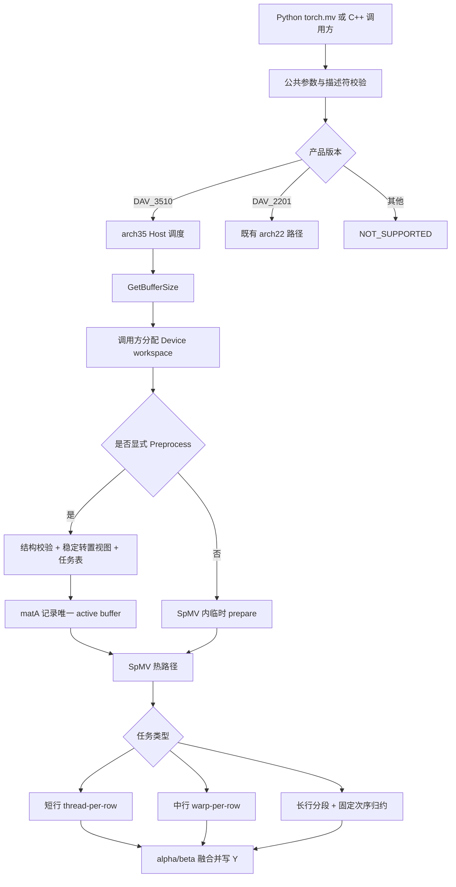
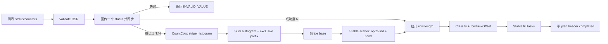
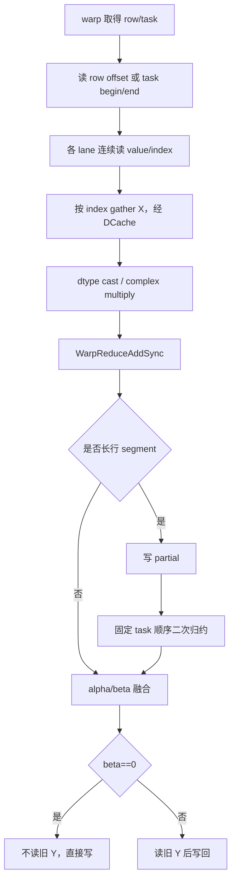

# 需求背景（required）

## 需求来源

本任务来自 2026 年 9 月社区任务“aclsparseSpMV 算子开发（950）”。目标是在 Ascend 950PR（DAV_3510，仓库目录 `arch35`）上补齐标准 `aclsparseSpMV` 的 workspace 查询、可选预处理和执行三阶段能力，并提供 PyTorch 2.7+、torch_npu 26.0.0+ 的 `torch.mv` / `aten::mv` NPU CSR 前向适配。

算子语义参考 cuSPARSE SpMV，但公开符号、描述符、状态码、stream 和 pointer mode 均复用 ops-sparse 已有 aclsparse 体系：

```text
Y = alpha * op(A) * X + beta * Y
```

其中 `A` 是二维 CSR 稀疏矩阵，`X`、`Y` 是一维稠密向量。设计文档提交到 cann-ops-competitions；后续实现代码、测试和自测报告不属于本次设计文档交付。

## 背景介绍

SpMV 是稀疏线性代数、图计算和稀疏模型计算的基础算子。CSR 用 `csrRowOffsets[M+1]`、`csrColInd[nnz]` 和 `csrValues[nnz]` 表示矩阵，不保存零元素，适合逐行点积。

本设计基于以下代码现状：

| 对象 | 当前状态 | 本设计处理 |
| --- | --- | --- |
| `sparse/spmv/arch22/` | 已有标准 SpMV 执行路径；`GetBufferSize`、`Preprocess` 尚未实现，且执行时将 row offsets 整体 D2H 后同步 | 不复制到 `arch35`；抽取仅含 ABI/参数规则的公共 Host 辅助，A5 单独实现 |
| `sparse/spmv_op/arch35/` | 已有 FP32、NonTranspose 的 SIMT 实现，但属于另一套 `aclsparseSpMVOp*` API | 只参考已验证的 arch35 SIMT 调用和 pointer mode 写法，禁止作为标准 SpMV 的替代接口 |
| `sparse/csr2csc_ex2/arch35/` | 已有稳定 CSR→CSC 的 stripe histogram、prefix sum、scatter 框架 | 将其下沉/复用为内部“结构转换”原语，并增加原始非零位置 `perm`；不复制 values |
| `include/cann_ops_sparse.h` | 已声明标准三阶段 API、SpMV 算法枚举、complex 类型及 Host/Device pointer mode | 保持已有 ABI，不新增同名接口 |

### 范围冲突与设计决议

任务材料存在两处必须在开发前保留追踪的差异：

1. 任务书 2.3 明确操作范围为 NonTranspose/Transpose，但公开枚举、任务书“complex64 正确处理共轭”的文字和随附 extra 测试均包含 `H`。本设计把 `ACL_SPARSE_OP_CONJUGATE_TRANSPOSE` 作为兼容能力：实数 `H == T`，complex64 对 values 取共轭。这样覆盖随附测试且不削弱 N/T 必选范围；若社区评审要求严格只保留 N/T，则删除 H 的 Host 分支和对应用例，不影响主体算法。
2. 任务书性能表写出的三个区间为 `89.968–425.920 us` 等，而随附 `gpu_performance_result_benchmark.md` 汇总为 P-01 `198.144–1090.752 us`、P-02 `199.120–964.496 us`、P-03 `199.312–1054.288 us`。设计与后续报告以逐 case 原始 benchmark 文件为计算输入，目标倍率仍为 `>=0.3`；提交性能验收前由维护者确认哪一份数字是规范基线。本设计不填写任何 NPU 实测结果。

# 需求分析（required）

## 需求描述

### C++ 接口原型

必须实现并沿用以下现有原型，不以 `aclsparseSpMVOp` 或自定义测试接口替换：

```cpp
aclsparseStatus_t aclsparseSpMVGetBufferSize(
    aclsparseHandle_t handle,
    aclsparseOperation_t opA,
    const void *alpha,
    aclsparseConstSpMatDescr_t matA,
    aclsparseConstDnVecDescr_t vecX,
    const void *beta,
    aclsparseDnVecDescr_t vecY,
    aclDataType computeType,
    aclsparseSpMVAlg_t alg,
    size_t *bufferSize);

aclsparseStatus_t aclsparseSpMVPreprocess(
    aclsparseHandle_t handle,
    aclsparseOperation_t opA,
    const void *alpha,
    aclsparseConstSpMatDescr_t matA,
    aclsparseConstDnVecDescr_t vecX,
    const void *beta,
    aclsparseDnVecDescr_t vecY,
    aclDataType computeType,
    aclsparseSpMVAlg_t alg,
    void *externalBuffer);

aclsparseStatus_t aclsparseSpMV(
    aclsparseHandle_t handle,
    aclsparseOperation_t opA,
    const void *alpha,
    aclsparseConstSpMatDescr_t matA,
    aclsparseConstDnVecDescr_t vecX,
    const void *beta,
    aclsparseDnVecDescr_t vecY,
    aclDataType computeType,
    aclsparseSpMVAlg_t alg,
    void *externalBuffer);
```

三阶段对应关系：

| 阶段 | 输入/输出 | 同步语义 | 目标 |
| --- | --- | --- | --- |
| `GetBufferSize` | 读取 Host 描述符元数据，写 Host `size_t` | 不访问 Device 数据，不同步 stream | 返回本次 shape/op/dtype/alg 的确定分配上界；执行期无隐藏分配 |
| `Preprocess` | 读 CSR pattern，写 Device workspace，并更新 matA 的 Host active-buffer 状态 | kernel 均入调用方 stream；为把结构错误映射成同步状态码，只回传一个 status 并同步一次 | 校验结构、构造任务表；T/H 构造稳定转置视图；允许 pattern 多次复用 |
| `SpMV` | 读 A/X，读写 Y，读写 workspace | active-buffer 热路径异步；未预处理时在当前调用内临时构造，结构校验会产生一次同步 | 在 NPU 上完成核心计算，不回退 CPU |

### 功能范围

| 维度 | 支持范围 |
| --- | --- |
| 稀疏格式 | 外部输入仅 CSR |
| 索引 | `csrRowOffsets`、`csrColInd` 均 I32；index base 0/1 |
| 操作 | N/T 必选；H 按“范围冲突与设计决议”作为兼容能力 |
| shape | `A=[M,K]`；N 时 `X=[K],Y=[M]`，T/H 时 `X=[M],Y=[K]`；动态 `M/K/nnz` |
| pattern | 有序或无序列索引、重复列、空行、单个长行、`nnz=0/1` |
| pointer mode | `ACL_SPARSE_POINTER_MODE_HOST` 与 `ACL_SPARSE_POINTER_MODE_DEVICE` |
| 算法 | `DEFAULT`、`CSR_ALG1`、`CSR_ALG2`；COO/SELL 枚举返回不支持 |
| 硬件 | Ascend 950PR，DAV_3510，CANN 9.1.0+ 配套版本 |

操作枚举与内部模式一一对应：

| 公开枚举 | 内部模式 |
| --- | --- |
| `ACL_SPARSE_OP_NON_TRANSPOSE` | N |
| `ACL_SPARSE_OP_TRANSPOSE` | T |
| `ACL_SPARSE_OP_CONJUGATE_TRANSPOSE` | H（按本设计的兼容决议） |

### 数据类型组合

| 编号 | matA/vecX | vecY | computeType | Kernel 累加/写回策略 |
| --- | --- | --- | --- | --- |
| D1 | INT8 | INT32 | INT32 | 32 位模加/乘语义；数学结果在 int32 可表示时 exact |
| D2 | INT8 | FP32 | FP32 | 输入转 FP32，FP32 树形归约 |
| D3 | FP16 | FP32 | FP32 | 输入转 FP32，输出 FP32 |
| D4 | BF16 | FP32 | FP32 | 输入转 FP32，输出 FP32 |
| D5 | FP16 | FP16 | FP32 | FP32 累加，最终一次舍入到 FP16 |
| D6 | BF16 | BF16 | FP32 | FP32 累加，最终一次舍入到 BF16 |
| D7 | FP32 | FP32 | FP32 | FP32 树形归约 |
| D8 | complex64 | complex64 | complex64 | 实部/虚部各 FP32 乘加与归约 |
| D9 | FP32 | complex64 | complex64 | A/X 提升为虚部为零的 complex64，Y 和标量按 complex64 |

未列出的格式、索引、dtype、computeType 或算法组合返回 `ACL_SPARSE_STATUS_NOT_SUPPORTED`。`alpha`、`beta` 的解释类型始终是 `computeType`。

## 需求拆解

1. 完成标准三阶段 C++ API 的参数校验、workspace 规划、active-buffer 生命周期和错误映射。
2. 新增 `sparse/spmv/arch35/` Host、tiling、kernel 和构建入口；公共 Host 代码不得含 arch22/arch35 专有 kernel 细节。
3. 设计 N/T/H 共用的“按输出行点积”模型；T/H 通过稳定 CSC 结构视图规避对 Y 的并发 atomic 累加。
4. 使用 arch35 SIMT，为短行、中等行和长尾行提供不同粒度；P-01/P-02/P-03 每行 64 个非零优先进入 warp-per-row 路径。
5. 打通九种 C++ dtype 组合、复数标量和 Host/Device pointer mode。
6. 为 `aten::mv(Tensor self, Tensor vec) -> Tensor` 增加 Sparse CSR NPU 调度，遵守 PyTorch 前向 schema 和异常语义，不做 CPU fallback。
7. 设计 C++ UT、ATen UT、端到端精度/性能/内存验证；本阶段只描述方法，不运行或填写实验结果。

### spec.yaml 一致性映射（任务书替代）

本任务包没有 CANNBot `spec-to-design` 所要求的 `spec.yaml`，因此不伪造结构化规格；以下表格以任务书和随附测试材料作为本设计的唯一需求真值映射：

| 任务书条款 | 设计承接位置 |
| --- | --- |
| 2.0 Python/ATen、PyTorch 2.7+、torch_npu 26+、禁止 CPU fallback | “PyTorch/ATen 设计”“算子约束限制” |
| 2.1 公式、CSR、动态 shape、边界 | “数学公式”“CSR 不变量与边界” |
| 2.2 工程模式、标准 SpMV 与 SpMVOp 分离、A2/A3 解耦 | “代码组织”“兼容性分析” |
| 2.3 三阶段、pointer mode、workspace、pattern 生命周期 | “Host 侧参数校验”“Workspace 设计”“Active buffer 与生命周期” |
| 2.3 九种 dtype 组合 | “数据类型组合”“Kernel 模板与 TilingKey” |
| 3.2 精度 | “精度标准”“自测设计” |
| 3.3 性能与三个固定场景 | “性能标准” |
| 3.4 内存 | “Workspace 设计”“内存标准” |
| 3.5 C++/ATen/端到端自验及 NPU 证据 | “自测设计” |
| 随附 accuracy/performance cases 的 H 与 benchmark 数据 | “范围冲突与设计决议”“风险与关闭条件” |

# 详细设计（required）

## 算子分析

### 数学公式

令 `b` 为 index base，CSR 第 `i` 行的存储区间为：

```text
[rowOffsets[i] - b, rowOffsets[i + 1] - b)
```

NonTranspose：

```text
Y[i] = alpha * sum(values[p] * X[colInd[p] - b]) + beta * Y_old[i]
       p in row i, i in [0, M)
```

Transpose：

```text
Y[j] = alpha * sum(values[p] * X[row(p)]) + beta * Y_old[j]
       colInd[p] - b == j, j in [0, K)
```

ConjugateTranspose（complex64）：

```text
Y[j] = alpha * sum(conj(values[p]) * X[row(p)]) + beta * Y_old[j]
```

实数类型的 H 与 T 相同。复数乘法显式拆成：

```text
(ar + i*ai) * (xr + i*xi)
  = (ar*xr - ai*xi) + i*(ar*xi + ai*xr)
```

`alpha`、`beta` 可为复数；共轭只作用于 `A`，不作用于 `X`、`alpha` 或 `beta`。

### CSR 不变量与边界

结构校验规则：

1. `M,K,nnz >= 0`，并受 I32 索引和 address-size 安全上限约束。
2. `rowOffsets[0] == base`，`rowOffsets[M] == nnz + base`，row offsets 单调不减。
3. 每个 `colInd[p]` 属于 `[base, base+K)`；`K==0` 时必须 `nnz==0`。
4. base 0 时 `nnz <= INT32_MAX`；base 1 时 `nnz <= INT32_MAX-1`，避免末端 offset 溢出。
5. Kernel 中 `stripe*(K+1)`、`task*sizeof(Task)`、workspace 偏移统一用 `size_t/uint64_t`，进入 I32 字段前做范围检查。
6. 不要求列索引排序；重复坐标按稳定存储顺序参与求和，不去重。
7. `X` 与 `Y`、A values 与 `Y` 不允许内存重叠；A、X 只读，Y 原地更新。

特殊值语义：

| 场景 | 处理 |
| --- | --- |
| `nnz==0` 或 `alpha==0` | `Y=beta*Y_old`；`beta==0` 时不读取 `Y_old`，直接写正零 |
| 空输出（N 的 `M==0`，T/H 的 `K==0`） | 成功返回，不启动计算 kernel |
| 空行 | 只执行 beta 项 |
| `beta==0` 且 `Y_old` 含 NaN | 不读取 `Y_old`，结果不被该 NaN 污染 |
| FP NaN/Inf | 按乘加数据流自然传播；测试按生态精度标准处理 |
| INT32 溢出 | 逐步使用 `uint32_t` 完成模 `2^32` 运算并按二进制位解释为 int32，避免 C++ 有符号溢出未定义；可表示范围内与数学整数 exact |

## 算子实现

### 总体架构



### 代码组织

后续实现建议按下表落盘；本次 PR 只包含本设计文档。

| 路径 | 职责 |
| --- | --- |
| `sparse/spmv/common/` | 与硬件无关的描述符解析、dtype/shape/枚举校验和 checked workspace 算术 |
| `sparse/spmv/arch35/spmv_host.cpp` | A5 三阶段实现、active-buffer 状态、tiling 和 kernel launch |
| `sparse/spmv/arch35/spmv_tiling_data.h` | Host/Kernel 固定宽度 ABI 数据结构 |
| `sparse/spmv/arch35/spmv_kernel.cpp/.h` | preprocess、transpose、短/中/长行 SIMT kernel |
| `test/spmv/arch35/` | C++ UT/ST、精度、边界、pointer mode、生命周期和性能入口 |
| PyTorch 适配层 | 按 ops-sparse 与 torch_npu 评审确认的桥接目录注册 Sparse CSR NPU `aten::mv`；当前 master 尚无可复用目录，合入代码前先锁定构建位置 |

公共 Host 层只决定产品路由；`arch22` 和 `arch35` 分别拥有自己的 tiling/kernel，不在一个执行函数内堆叠产品宏。标准 SpMV 可调用抽取后的内部 CSR→CSC 原语，但不调用或伪装成 `aclsparseSpMVOp`。

### Host 侧参数校验

三个阶段共用同一校验器，按以下顺序返回首个错误：

| 次序 | 检查 | 返回 |
| --- | --- | --- |
| 1 | handle 是否为空 | `ACL_SPARSE_STATUS_HANDLE_IS_NULLPTR` |
| 2 | 输出指针/描述符/alpha/beta 是否为空 | `ACL_SPARSE_STATUS_INVALID_VALUE` |
| 3 | 产品是否 DAV_3510，stream 是否有效 | 不支持产品返回 `NOT_SUPPORTED`；非法 stream 返回 `INVALID_VALUE` |
| 4 | op、alg、pointer mode 枚举 | 非法值 `INVALID_VALUE`；合法但未支持的格式算法 `NOT_SUPPORTED` |
| 5 | CSR、I32、base、shape、长度、dtype 组合 | 契约错误 `INVALID_VALUE`，能力外组合 `NOT_SUPPORTED` |
| 6 | 地址自然对齐和禁止 alias 规则 | `INVALID_VALUE` |
| 7 | checked add/multiply、I32/address 上限、workspace 上限 | `INSUFFICIENT_RESOURCES` 或 `INVALID_VALUE` |
| 8 | Device pattern 内容（只在 prepare） | `INVALID_VALUE` |

`GetBufferSize` 不读取 `alpha/beta` 的值，也不解引用 Device pointer；两种 pointer mode 下只校验非空。由于执行 ABI 没有 buffer 字节数参数，当调用方直接传入 `externalBuffer` 时只能验证非空和对齐，不能可靠发现欠配；文档和 UT 以“必须按最近一次同参数查询值分配”为前置契约。

### Workspace 设计

定义：

```text
R = (opA == N) ? M : K                      # 输出行数
S = LONG_SEGMENT_NNZ                        # 编译期固定，初值 256，调优后锁定
Pmax = min(nnz, R + ceil(nnz / S))          # 非空行/分段任务的保守上界
C = 根据 AIV 核数、nnz、K 和 scratch cap 计算的 stripeCount，C >= 1
A64(x) = align_up(x, 64)
```

workspace 按 64 字节对齐顺序布局：

| 区域 | 元素/字节 | 用途 | 生命周期 |
| --- | --- | --- | --- |
| `SpmvPlanHeader` | `A64(sizeof(header))` | magic/version、shape、dtype、op、alg、base、区域 offset、计数和完成标志 | preprocess 后只读 |
| `status` | `A64(sizeof(int32_t))` | Device 结构校验首错码 | prepare |
| `rowClass` | `A64(R*sizeof(uint8_t))` | empty/short/warp/long 分类 | active buffer |
| `rowTaskOffset` | `A64((R+1)*sizeof(int32_t))` | 每个输出行的分段范围 | active buffer |
| `tasks` | `A64(Pmax*sizeof(SpmvTask))` | `{row, begin, end, partialOffset}`，固定顺序 | active buffer |
| `partials` | `A64(Pmax*accumBytes)` | 仅长行写；`accumBytes=4/8` | execute 临时 |
| `opRowOffsets` | T/H 时 `A64((K+1)*4)` | `op(A)` 的 CSR 等价 row offsets | active buffer |
| `opColInd` | T/H 时 `A64(nnz*4)` | 原 CSR 行号 | active buffer |
| `perm` | T/H 时 `A64(nnz*4)` | 转置位置到原 values 位置的映射 | active buffer |
| `transposeScratch` | T/H 时 `A64((1+C)*(K+1)*4)` | col count 与各 stripe cursor | 仅 prepare，execute 时可复用为临时区 |

确定查询公式：

```text
bufferSize = A64(sizeof(SpmvPlanHeader))
           + A64(sizeof(int32_t))
           + A64(R)
           + A64((R + 1) * 4)
           + A64(Pmax * sizeof(SpmvTask))
           + A64(Pmax * accumBytes)
           + (opA == N ? 0 :
               A64((K + 1) * 4)
             + A64(nnz * 4)
             + A64(nnz * 4)
             + A64((1 + C) * (K + 1) * 4))
```

每一步先做 `CheckedMul`/`CheckedAdd` 再对齐；因此返回值是当前参数下实际实现所需的确定大小，而不是经验估算。`C` 取：

```text
C = (nnz == 0) ? 1 :
    min(ceil(nnz / 256), aivCoreNum,
        max(1, TRANSPOSE_SCRATCH_CAP / ((K + 1) * 4)))
```

首版 `TRANSPOSE_SCRATCH_CAP=16 MiB`，沿用当前 arch35 CSR→CSC 的保护思路。若额外内存门槛要求更小，可把 `C` 降到 1；这降低 preprocess 并行度但不改变结果和 active plan。代码不得在 workspace 之外再申请完整转置 values 或稠密矩阵。

### Active buffer 与生命周期

`SpmvPlanHeader` 和 matA 内部 Host 状态共同表达计划：

```text
signatureFields = {descr identity,
                   rowOffsets pointer, colInd pointer,
                   M, K, nnz, base, opA, alg,
                   A/X/Y dtype, computeType,
                   layout version}
```

以下字段不进入 signature：`alpha`、`beta` 的值/地址，X/Y 数据地址以及 A values 地址。它们允许在保持 pattern 的多次执行间变化。

Host 逐字段比较 `signatureFields`；可另存 hash 加速，但不能只凭 hash 判定匹配。规则如下：

1. `Preprocess(matA, bufferB)` 成功后，`bufferB` 成为该 matA 唯一 active buffer；再次用 `bufferC` preprocess 会使 B inactive。
2. 替换 values、X、Y、alpha、beta 不需要重做 preprocess；替换/原地修改 row offsets 或 column indices 必须重新 preprocess。
3. 调用方不得修改 active buffer 内容，且在 stream 完成前不得释放描述符、pattern、workspace 或向量数据。
4. 同一 matA 描述符的 preprocess/active 状态修改不是线程安全操作；需要多个并发 plan 时创建多个指向同一数据的 SpMat 描述符。
5. `SpMV` 收到 active 且 signature 匹配的 buffer 时直接执行；inactive buffer 仍允许使用，但在本次调用内 prepare 并计算，不把它登记为 active。
6. `GetBufferSize`、`Preprocess`、`SpMV` 的 shape/op/dtype/alg 必须一致；不一致时 active plan 失效并走临时 prepare 或返回参数错误，不读取陈旧 offset。
7. prepare 与 execute 默认使用同一 handle stream；切换 stream 前由调用方建立完成依赖。多个并发 execute 不能共享含 `partials` 的同一 buffer，应使用不同 SpMat 描述符和 workspace。

```mermaid
stateDiagram-v2
    [*] --> Unprepared
    Unprepared --> ActiveB: Preprocess(B) success
    ActiveB --> ActiveB: values/X/Y/alpha/beta change
    ActiveB --> Invalid: rowOffsets/colInd/op/shape/dtype/alg change
    ActiveB --> ActiveC: Preprocess(C) success
    Invalid --> ActiveB: Preprocess(B) success
    Unprepared --> Temporary: SpMV(inactive buffer)
    Invalid --> Temporary: SpMV(inactive buffer)
    Temporary --> Unprepared: execute complete; no active-state update
```

### Preprocess 数据流

Preprocess 的所有 Device kernel 按调用方 stream 顺序入队：



结构转换复用 `csr2csc_ex2/arch35` 的五阶段思想，但抽成内部 primitive：

- `CountCols` 只统计目标列。
- prefix sum 生成 `opRowOffsets`。
- 每个 stripe 使用不重叠 cursor 区，scatter 在 stripe 内按原 CSR 非零位置 `p` 单调写入。
- `opColInd[pos] = originalRow + base`，`perm[pos] = p`；不复制 values。
- 多 stripe 子段按 stripe 编号拼接，因此每个目标列内仍保持原 `p` 顺序。无序列和重复列均不影响正确性。
- T/H execute 通过 `values[perm[pos]]` 取最新 values，所以修改 values 不使 plan 失效；H 在加载后取共轭。
- task 构造先计算 `segmentCount[row]`，再对它做 exclusive prefix 得到 `rowTaskOffset`，最后每行写自己的不相交 task 区间；`rowTaskOffset[R]` 即实际 task 数且不超过 `Pmax`。

只有结构校验状态回传需要一次同步；禁止像现有 arch22 路径一样把 `M+1` 个 row offsets 整体拷回 Host。显式 preprocess 完成后，重复执行的热路径不含 Host 同步。

### 算法和任务划分

公开算法映射：

| `alg` | 路径 | 确定性承诺 |
| --- | --- | --- |
| `ACL_SPARSE_SPMV_ALG_DEFAULT` | 路由到 CSR_ALG1 | 同 CSR_ALG1 |
| `ACL_SPARSE_SPMV_CSR_ALG1` | 按 row class 的高性能路径，可调整 task/core 分配 | 按公开枚举不承诺 bit-wise |
| `ACL_SPARSE_SPMV_CSR_ALG2` | 固定 task 顺序、固定分段、固定 warp 归约树 | 仅 `opA==N` 承诺重复执行 bit-wise；T/H 按公开枚举语义与 ALG1 相同 |

任务分类初值如下，阈值作为具名常量，在实现阶段只可依据 NPU profiling 修改并同步 README/UT：

| 类别 | 初始条件 | 执行粒度 | 目的 |
| --- | --- | --- | --- |
| Empty | `rowNnz==0` | 一个线程写 beta 项 | 快速处理大量空行 |
| Short | `1<=rowNnz<=4` | 一个线程一行 | 避免 warp 大量空 lane |
| Warp | `5<=rowNnz<=512` | 一个 32-lane warp 一行 | lane-stride load + warp tree reduction；覆盖每行 64 个非零的性能锚点 |
| Long | `rowNnz>512` | 每 256 个非零一个 warp 生成 partial，再固定次序二次归约 | 避免单个长行拖住一个 core |

`Preprocess` 先生成按行号稳定的 `rowTaskOffset`，再填充 task。ALG2 以 task index 的静态 grid-stride 分配保证固定；ALG1 可按 class 分 kernel 并采用轻量动态领取提高长尾负载均衡。每个非长行只由一个 warp/thread 写 Y；长行只有最终 reduce kernel 写 Y，所以无需对浮点/复数 Y 使用 atomic。

### Kernel 模板与 TilingKey

Kernel 采用 `KERNEL_TYPE_AIV_ONLY` 和 arch35 SIMT。线程数是编译期常量：主计算 `THREADS_PER_BLOCK=1024`（32 warp），transpose 辅助 kernel 可使用 256；实现使用 `__launch_bounds__` 与相同的 `AscendC::Simt::VF_CALL(Dim3{...})` 线程数，禁止 launch 配置不一致。

TilingKey 只编码会生成不同模板的静态维度：

```text
bits [0..3]   dtypeMode: D1..D9
bits [4..5]   opMode: N/T/H
bit  [6]      algMode: ALG1/ALG2
bits [7..8]   phase: prepare/main/long-reduce
```

base、shape、task 数、pointer mode 等是 tiling data，不为其复制 kernel 二进制。模板表：

| 模板族 | 输入/累加 | 读结构 | 备注 |
| --- | --- | --- | --- |
| `SpmvInt8I32` | int8 / uint32 modular | CSR 或转置 view | exact 路径，避免 signed overflow UB |
| `SpmvRealF32<InT,OutT>` | int8/fp16/bf16/fp32 → fp32 | CSR 或转置 view | warp 固定树归约，最终统一写回 |
| `SpmvComplex<AComplex>` | complex64 或 real fp32 → complex64 | CSR 或转置 view | 两个 FP32 分量；H 对 A 共轭 |
| `SpmvScaleOnly<OutT>` | Y dtype | 无需读 A/X | `nnz==0` 或 Host mode 可判定 `alpha==0` |

Device pointer mode 下 Host 不能读取 `alpha`，因此不在 Host 选择 `alpha==0` fast path；main kernel 读取 Device scalar 后在 Device 侧走 scale-only 分支。Host mode 把标量按值复制进 tiling，Device mode 把两个 Device 地址传给 kernel，禁止 Host 解引用。

主路径伪代码：

```cpp
template <typename LoadT, typename AccT, typename StoreT,
          OpMode Op, RowMode Row, bool Deterministic>
__simt_vf__ __aicore__ __launch_bounds__(1024)
void SpmvMain(/* GM pointers, task table, scalars, tiling */) {
    // 1. 一个 thread/warp 取得唯一输出行或长行 segment。
    // 2. 从原 CSR 或 op(A) view 取得 [begin,end)。
    // 3. 直接 GM load value/index/X，转成 AccT；H 对 value 取共轭。
    // 4. Warp 路径用 WarpReduceAddSync；long 路径先写 partial。
    // 5. 唯一写者执行 alpha*sum + beta*Y_old；beta==0 不读 Y_old。
}
```

### SIMT 数据流与访存

SpMV 的 `X[col]` 是不规则 gather，不适合把大段 X 盲目搬入 UB。主计算以 SIMT 线程直接读 GM，利用 arch35 DCache；连续的 values/indices 由相邻 lane 合并访问。每个 warp 的 lane `l` 访问 `begin+l, begin+l+32, ...`，使用 `WarpReduceAddSync` 做固定树归约。



同步仅发生在 warp 内；main kernel 不需要跨 block 同步。prepare 的多个阶段由同一 stream 上的 kernel 顺序保证依赖，不在单 kernel 内实现自旋式全局 barrier。long partial 与 final reduce 也是两个 kernel，避免跨核同步死锁。

### UB 容量验证与 DCache 预算

[CANNBot `npu-arch`](https://gitcode.com/cann/cannbot-skills/tree/master/ops/npu-arch) 的 DAV_3510 架构资料给出单核 UB 标称 248 KiB，[SIMT tiling 指南](https://gitcode.com/cann/cannbot-skills/tree/master/ops/ascendc-simt-tiling-design)要求为 DCache 至少预留 32 KiB；实现仍以 `PlatformAscendCManager::GetCoreMemSize(UB, ...)` 的运行时结果作为门禁，不把容量写死为可用值。

| Kernel | 显式 LocalTensor/UB buffer | DCache 要求 | 说明 |
| --- | ---: | ---: | --- |
| Validate/Classify/Task fill | 0 B | >=32 KiB | 状态、计数和任务均在 GM；线程只保留寄存器标量 |
| CSR→CSC histogram/prefix/scatter | 0 B | >=32 KiB | 复用现有 arch35 SIMT GM 算法；histogram 位于 workspace |
| Short/Warp main | 0 B | >=32 KiB | values/index/X 直接 GM load，warp shuffle 在寄存器进行 |
| Long partial/reduce | 0 B | >=32 KiB | partial 位于 workspace GM，不分配随行长增长的 UB |

因此显式 UB 预算为 0 B，不随 `M/K/nnz` 或 dtype 增长；DCache 保留量满足 SIMT 最低要求。实现阶段的 preflight 必须检查：目标为 DAV_3510、实际 UB 查询成功、编译配置未把 DCache 压到 32 KiB 以下、`__launch_bounds__` 与 `VF_CALL` 一致。任何新增 LocalTensor 都必须重新列出逐 buffer 字节数和对齐后总量。

### API 验证记录

API 映射为“公开 aclsparse 三阶段 → arch35 Host 调度 → SIMT kernel”，PyTorch 只在适配层构造描述符，不复制一套数值实现。关键调用的验证记录如下：

| API/语义 | 可信来源 | 验证结论 |
| --- | --- | --- |
| `AscendC::Simt::VF_CALL`、`Dim3` | 云端 CANN 9.1.0 安装头 `.../asc/include/simt_api/cpp/kernel_simt_utils.h` | 已验证命名空间、模板形态和参数 |
| `GetThreadIdx/GetBlockIdx/GetThreadNum/GetBlockNum` | 云端 `kernel_simt_common_intf.h` | 已验证 arch35 安装头存在 |
| `WarpShflDownSync/WarpReduceAddSync` | 云端 `kernel_simt_warp_level_intf.h` | 已验证接口存在；具体 dtype 支持在 kernel 编译 UT 中逐模板验证 |
| GM `AtomicAdd` | 云端 `kernel_simt_atomic_intf.h` | 已验证接口存在；只用于整数 histogram/counter，不用于最终浮点/复数 Y |
| `GetCoreMemSize`、AIV core count | ops-sparse 现有 arch35/arch22 Host 实现与平台 API | 已有仓内用法；实现期继续检查返回值 |
| active buffer、可选 preprocess、alpha/beta/values 可变 | [NVIDIA cuSPARSE SpMV 官方说明](https://docs.nvidia.com/cuda/cusparse/index.html#cusparse-generic-function-spmv) | 语义用于本任务三阶段生命周期；用 aclsparse 内部状态实现 |
| `aten::mv` schema | [PyTorch v2.7.0 `native_functions.yaml`](https://github.com/pytorch/pytorch/blob/v2.7.0/aten/src/ATen/native/native_functions.yaml) | `mv(Tensor self, Tensor vec)->Tensor`；另有 `mv.out`；v2.7 文件未列 Sparse CSR 专有实现 |
| `SparseCsrPrivateUse1` dispatch key | [PyTorch v2.7.0 `DispatchKey.h`](https://github.com/pytorch/pytorch/blob/v2.7.0/c10/core/DispatchKey.h) | 已验证 PyTorch 2.7 由 `SparseCsr` 功能键与 `PrivateUse1` 后端组合生成该 runtime key |

未在该表确认的硬件 API 不写成“已支持”；实际编码若引入新 API，先补安装头/官方文档证据和编译验证。

### PyTorch/ATen 设计

PyTorch 前向入口：

```python
torch.mv(input, vec, *, out=None) -> Tensor
```

在 torch_npu 桥接层为 PyTorch 2.7 已定义的 `SparseCsrPrivateUse1` 注册 `aten::mv`。实际 ops-sparse 桥接目录、构建目标和 torch_npu allocator/stream API 仍需用 torch_npu 26 安装包锁定；不能注册到 dense `PrivateUse1` 后再在运行时猜 layout。

```cpp
TORCH_LIBRARY_IMPL(aten, SparseCsrPrivateUse1, m) {
    m.impl("mv", TORCH_FN(spmvCsrNpu));
    // mv.out 是否独立注册以目标 torch_npu dispatcher 生成结果为准。
}
```

前向流程：

1. 检查 `input.layout()==SparseCsr`、`input.dim()==2`、无 batch/dense hybrid dim，`vec.layout()==Strided`、`vec.dim()==1`。
2. 检查 `input.size(1)==vec.size(0)`，crow/col/value/vec 位于同一 NPU device；不迁移到 CPU。
3. 检查 crow/col 为 int32；非连续 vec 先在 NPU 上 contiguous，是否接受该复制与 PyTorch 2.7 行为用 UT 锁定。
4. 根据 PyTorch schema 推导 output dtype，分配同 device 的一维 strided 输出，长度为 `M`，无输入 alias。
5. 构造临时 SpMat/DnVec 描述符，固定 `opA=N`、`alpha=1`、`beta=0`、Host pointer mode，调用三阶段 aclsparse API。
6. 描述符销毁不能早于已入 stream 的 kernel 对其 Device 数据依赖；描述符本体不被 kernel 读取时可同步释放 Host 对象，workspace 通过 NPU stream-aware allocator 记录 stream 后释放。
7. 任一不支持场景抛出确定的 `TORCH_CHECK`，不得改走 dense、COO 或 CPU 计算。

接口能力必须分开声明：

| 路径 | dtype 能力 |
| --- | --- |
| aclsparse C++ | D1–D9 全部组合；`computeType` 和 Y dtype 显式传入 |
| `torch.mv` / `aten::mv` | schema 没有 alpha、beta、computeType 或 output dtype 参数，按 PyTorch 2.7 的 dtype/result 规则仅接入可无歧义表达的同 dtype FP16、BF16、FP32、complex64 |
| 专项 NPU 测试 hook | 可显式携带 Y/alpha/beta/computeType，覆盖 D1–D9，但不得冒充 `torch.mv` 公共语义 |

因此 D1/D2、D3/D4 的 FP32 输出和 D9 不强行塞进 `torch.mv`；它们通过标准 C++ API 与专项端到端 hook 验证。若验收要求所有九种组合都必须经 `torch.mv` 暴露，需要上游先定义不破坏 PyTorch dtype 语义的新 schema，不能由实现自行决定返回 dtype。

PyTorch 官方 sparse 能力表把 CSR `mv` 列为前向支持、sparse grad 为否；本任务按该范围提供前向。`requires_grad` 场景若 torch_npu 没有完全位于 NPU 的既有 autograd 公式则显式报不支持，不允许 backward CPU fallback。

## 支持硬件

| 支持的芯片版本 | 架构目录 | 涉及勾选 |
| --- | --- | --- |
| Ascend 950PR（A5，DAV_3510） | `arch35` | √ |

Host 公共入口保留对既有产品的路由，不把 A5 kernel 误发到 DAV_2201。开发和自测最低软件环境为配套 CANN 9.1.0、PyTorch 2.7、torch_npu 26.0.0。

## 算子约束限制

1. 外部稀疏输入仅支持二维、无 batch、无 dense hybrid dim 的 CSR；不支持 COO/CSC/BSR/BSC/SELL 输入。
2. row offsets 和 column indices 均为 int32，base 支持 0/1；不支持 int64 索引。
3. N/T 是任务书必选；H 依据随附测试作为兼容能力，最终以社区评审结论锁定。
4. 只支持类型组合 D1–D9，alpha/beta 类型必须与 computeType 相同。
5. X/Y 需一维、长度严格匹配；C++ 路径不接受 X/Y 或 A/Y 存储重叠。
6. `externalBuffer` 由调用方按相同参数最近一次 `GetBufferSize` 的结果分配并保持有效；执行 ABI 无 size，不能可靠检测欠配。
7. active plan 只绑定 pattern 和静态调用参数；row/column pattern 原地变化后调用方必须重新 preprocess，values 可变化。
8. `CSR_ALG2` 的 bit-wise 承诺只适用于 NonTranspose，与公开枚举注释一致；T/H 与 ALG1 同语义。
9. `torch.mv` 仅承接能符合框架 schema 的前向同 dtype 组合，固定 N、alpha=1、beta=0；其他 C++ 能力不篡改 PyTorch 公共语义。
10. 核心计算全部在 NPU；Host 只做描述符校验、tiling 和一次结构状态回传，不执行数值计算。

# 可维可测分析

## 精度标准/性能标准

### 精度标准

CPU Golden 和断言完全采用任务书：

| 组合 | Golden 累加 | 判据 |
| --- | --- | --- |
| INT8→INT32 | CPU 整数精确计算 | 每元素 exact match |
| INT8/FP16/BF16→FP32 | CPU FP32 | 浮点混合容差 |
| FP32→FP32 | CPU FP64 | 浮点混合容差 |
| complex64、FP32→complex64 | CPU complex128 | 实部、虚部分别按 FP32 判定 |

```text
abs(actual - golden) <= atol + rtol * abs(golden)
matched ratio >= 0.99
absolute error <= max(A, 32 * ULP(golden))
```

| 输出/分量类型 | rtol | atol | A |
| --- | ---: | ---: | ---: |
| FP16 | `2^-9` | `2^-9` | `1e-1` |
| BF16 | `2^-6` | `2^-6` | `1e0` |
| FP32 | `2^-10` | `2^-16` | `1e-2` |
| complex64 | 实部/虚部各用 FP32 | 实部/虚部各用 FP32 | 实部/虚部各 `1e-2` |

ALG2/N 对相同输入和相同 plan 重复执行，逐 bit 比较。FP16/BF16 在 FP32 累加后仅做一次写回转换；长行二次归约使用固定 segment/task 次序，避免结果随 core 调度变化。

### 性能标准

```text
performance ratio = GPU case median_us / NPU same-scope total-kernel median_us
target >= 0.3 for every declared dtype
```

| 场景 | shape / nnz | 行结构 | 随附 benchmark 汇总（待与任务书表确认） |
| --- | --- | --- | --- |
| P-01 Llama 3.1 70B MLP | `8192x28672`, `nnz=524288` | 每行 64 | `198.144–1090.752 us` |
| P-02 Qwen3-235B-A22B MoE | `4096x1536`, `nnz=262144` | 每行 64 | `199.120–964.496 us` |
| P-03 DeepSeek-V3 MoE | `7168x2048`, `nnz=458752` | 每行 64 | `199.312–1054.288 us` |

后续实验必须每 case 预热至少 10 次、正式采样至少 30 次，设备 Event 统计所有 NPU kernel 总耗时，报告 median/p90。描述符、workspace 和 preprocess 结果在采样期复用，不计首次编译、数据生成和 Host↔Device 输入搬运。C++ 完整流程和 Python/ATen 端到端耗时另列，禁止与 kernel 倍率混用。

本设计预期的性能抓手是：P 场景进入 warp-per-row；indices/values 相邻 lane 合并读取；X 通过 DCache gather；`beta==0` 跳过 Y 读；转置结构在 preprocess 后复用；长行跨 warp 但不使用结果 atomic。是否达到目标只能由后续 Ascend 950PR 实测确认。

主计算不设计传统 GM→UB 的 CopyIn/Compute/CopyOut 双缓冲流水线：X 是随机 gather，强行整片搬入 UB 会放大无效流量并限制长行；本方案以连续 indices/values 合并读和 DCache 命中形成访存流水线。若 profiling 证明特定 block-like pattern 的 X 局部性足够高，再新增受 workspace/UB 预算约束的可选 cache tile，不把它作为正确性依赖。

### 自测设计

| 层级 | 必测内容 |
| --- | --- |
| Host C++ UT | 空指针、非法 enum、shape/dtype/index/base、checked overflow、buffer 对齐、产品路由、状态码 |
| 生命周期 UT | query→preprocess→多次 execute、values/X/Y/标量更换、pattern 失效、新 buffer 取代旧 active buffer、跨 stream 约束 |
| Kernel 精度 | D1–D9 × N/T/H × base0/1；普通、小值、正负、零、离群、允许的 NaN/Inf |
| pattern | uniform/random/diagonal/banded/block-like/many-empty/one-long-row/power-law/skewed/duplicate/unsorted |
| 边界 | `M/K=0/1`、`nnz=0/1`、尾 warp、长行分段边界、合法 I32 上限、workspace 计算溢出 |
| pointer mode | Host/Device 的实数、整数、复数 alpha/beta；Device mode 证明 Host 不解引用 |
| 确定性 | ALG2/N 重复运行 bit-wise；T/H 按容差，不错误承诺 bit-wise |
| ATen/端到端 | `torch.mv` 和直接 `aten::mv`、layout/rank/device/dtype/stride/out/alias 异常、Profiler 证明无 CPU fallback |
| 性能/内存 | P-01/P-02/P-03 逐 case 以及 extra；所有 kernel 总时间、workspace、peak/extra peak |

随附 `accuracy_cases.json`、`performance_cases.json` 和 benchmark 文件是用例真值输入；测试代码不得自行换成更有利的 pattern。

### 内存标准

1. 输入输出总量超过 500 MB 且存在等价 GPU 接口时，NPU 额外峰值内存不超过 GPU 内存总量的 50%。
2. 无等价 GPU 接口时，固有 workspace 不超过目标硬件 L2 Cache 容量。
3. 用 `GetBufferSize` 返回值和实际 allocator 记录双重核对，无隐藏 Device 分配；记录 `input_baseline_*_bytes`、`peak_*_bytes`、`extra_peak_*_bytes`。
4. 转置只额外保存两个 I32 结构数组和一个 I32 perm，不复制 values；scratch cap 和 `C` 降级策略避免 histogram 无界增长。

## 兼容性分析

1. 不改变 `include/cann_ops_sparse.h` 已有三阶段 ABI、描述符、状态码或 `aclsparseSetPointerMode` 行为。
2. `arch35` 新实现通过产品路由进入，`arch22` 现有 kernel 独立保留；公共校验抽取后必须跑 A2/A3 回归。
3. 标准 `aclsparseSpMV` 与 `aclsparseSpMVOp` 保持接口和实现边界，后者只能作为 SIMT 代码风格参考。
4. PyTorch v2.7 `aten::mv` 是 `CompositeExplicitAutograd` 并为 Sparse COO 列出专有实现；A5 适配新增 Sparse CSR NPU dispatch，不覆盖 dense NPU `mv`。
5. PyTorch sparse CSR 前向能力和异常通过版本矩阵锁定；torch_npu 26.x 后续版本若 dispatch key/allocator API 变化，在适配层处理，不改变 aclsparse C++ ABI。
6. 合入 A5 代码前先 rebase 到届时 ops-sparse master；若 A2/A3 SpMV PR 已合入，只合并公共校验，不用任一架构的 tiling 替代另一架构。

## 本阶段交付件清单

| 交付件 | 本次状态 |
| --- | --- |
| `gcw_mP551mSI/docs/design.md` | 本次唯一拟提交文件 |
| 实现代码、测试代码、自测报告 | 本次明确不交付；设计评审通过后再进入开发阶段 |

## 风险与关闭条件

| 风险 | 影响 | 关闭条件 |
| --- | --- | --- |
| N/T 与随附 H 用例范围不一致 | 评审范围或测试数不一致 | 社区评审书面确认；默认保留 H 兼容实现 |
| 任务书与 benchmark 数字不一致 | 性能倍率计算基线不唯一 | 维护者确认 canonical 文件/版本，报告记录文件 hash |
| torch_npu 26 的桥接目录和 allocator/stream API 未在 ops-sparse master 出现 | ATen 构建位置和资源释放方式不唯一 | 用目标 torch_npu 26 安装包和最小 dispatcher UT 验证后锁定路径；dispatch key 已由 PyTorch 2.7 头确认 |
| `WarpReduceAddSync` 对各 AccT 的编译支持差异 | 某模板无法直接实例化 | 逐 dtype 编译；complex 拆双 FP32，必要时使用 `WarpShflDownSync` 手写固定树 |
| T/H workspace 对极宽矩阵偏大 | 内存门槛或 preprocess 延迟 | 降低 `C` 至 1；按 case 记录 workspace，仍超限则评审分块转换方案 |
| Device pattern 校验带一次同步 | 未 preprocess 的单次调用延迟 | 推荐显式 preprocess；热执行无同步，报告分开统计阶段时间 |
| 长尾阈值未调优 | 性能不足 | 只依据 Ascend 950PR profiler 调整具名阈值，精度/确定性回归通过后锁定 |

本文为设计阶段结论；尚未执行 NPU 精度、性能或内存实验，所有达标结论均留待实现后的自测报告。
