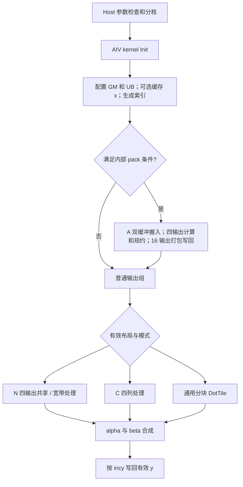

# aclblasCgbmv A2/A3 算子设计文档

本文按任务提供的设计文档模板组织，描述已实现的 host/kernel 方案。测试依据为代码提交 `28fa8feecb3ad0737a1bc346f62088c1a2d8698e`、CANN 9.1.0 下的 A2/A3 自验数据；最新精度回归已扩展为 A2/A3 各1215条通过，日志、Excel及六张截图随报告交付；设计评审状态另行记录。

## 1 需求背景（required）

### 1.1 需求来源

来源为 9 月社区任务《aclblasCgbmv_A2A3 任务书》。在 ops-blas 工程框架内使用 Ascend C kernel 直调实现单精度复数一般带状矩阵向量乘，功能语义对齐 cuBLAS `cublasCgbmv`，适配 Atlas A2/A3 系列产品。

开发仓库为 `https://gitcode.com/tinfengyu1/ops-blas`，分支为 `arch22`。验收后申请合入 `https://gitcode.com/cann/ops-blas`。

### 1.2 背景介绍

一般带状矩阵只有主对角线及其上下若干条对角线参与计算。按列打包存储后，矩阵实际分配量由密集表示的 `m×n` 缩减为 `lda×n`，其中 `lda≥kl+ku+1`。算子直接从打包数据计算，避免展开为稠密矩阵及分配对应临时矩阵。

目标表达式为：

```text
y = alpha * op(A) * x + beta * y
```

复数场景需要分别处理实部、虚部、共轭转置及复数标量运算。带状数据的访存规律还随 trans 改变：N 模式按输出行取值，行内相邻元素在 GM 中有间隔；T/C 模式按原矩阵列取值，有效带内元素连续。因此设计同时提供通用分块路径与符合访存条件时的四输出批处理路径。

### 1.3 工程现状分析

仓库已有 `blas/gbmv/arch35/` 的 Sgbmv 实现。本任务新增的是 `arch22` 下的 Cgbmv，与已有其他架构/类型实现共存。工程结构参考仓内 `gemv/arch22`、`tbmv/arch22`、`symv/arch22` 的句柄接口、stream 直调、向量计算及规约方式。

当前代码路径如下：

| 内容 | 路径 |
| --- | --- |
| 公共接口声明 | `include/cann_ops_blas.h` |
| Host 参数检查、分核和直调 | `blas/gbmv/arch22/cgbmv_host.cpp` |
| 参数传递结构 | `blas/gbmv/arch22/cgbmv_tiling_data.h` |
| Ascend C AIV kernel | `blas/gbmv/arch22/cgbmv_kernel.cpp` |
| 产品支持与接口说明 | `blas/gbmv/README.md` |
| CSV 参数解析 | `test/gbmv/cgbmv/cgbmv_param.h` |
| 测试用例与测试代码 | `test/gbmv/cgbmv/arch22/` |
| 自验步骤说明 | `test/gbmv/cgbmv/README.md` |

本实现使用 Ascend C 向量指令，不经过 TBE，也不使用 Cube 矩阵乘路径。

### 1.4 算子功能分析

| 参数 | 含义 | 类型/位置 | 约束与形状 |
| --- | --- | --- | --- |
| handle | 库句柄，携带 stream | Host 句柄 | 必须为有效句柄 |
| trans | N/T/C 运算选择 | Host 枚举 | `ACLBLAS_OP_N/T/C` |
| m、n | 原矩阵 A 的行列数 | Host int | 非负，不随 trans 翻转 |
| kl、ku | 下带数、上带数 | Host int | 非零维计算时 `0≤kl<m`、`0≤ku<n` |
| alpha、beta | 复数标量 | Host `aclblasComplex*` | 非零维计算时不可为空 |
| A | 列主序带状矩阵 | Device COMPLEX64 | 存储形状 `lda×n`，只读 |
| lda | 前导维度 | Host int | `lda≥kl+ku+1` |
| x | 输入向量 | Device COMPLEX64 | N 模式逻辑长度 n，T/C 模式逻辑长度 m，只读 |
| incx | x 元素步长 | Host int | 非零，可为负 |
| y | 输入/输出向量 | Device COMPLEX64 | N 模式逻辑长度 m，T/C 模式逻辑长度 n，原地写回 |
| incy | y 元素步长 | Host int | 非零，可为负 |

数据类型为 COMPLEX64，每个元素由 FP32 实部与 FP32 虚部组成，占 8 字节。仅支持此类型；不涉及广播。向量实际存储长度为 `1+(logicalLength-1)*abs(inc)`，负步长按 BLAS 约定从存储末端开始读取。

## 2 需求分析（required）

### 2.1 需求描述

实现句柄式 BLAS 接口 `aclblasCgbmv`，支持 N/T/C、合法带宽、矩形矩阵、lda padding、正负向量步长、复数 alpha/beta、零维 no-op 和参数异常返回。使用 handle 绑定的 stream 异步直调 NPU kernel。

自验 golden 使用 cblas/Netlib `cgbmv`。性能按任务书五条典型 case 验收，主要性能设备为 Atlas 800T A2（910B3）。内存不设置达标阈值，但交付自验内存记录。

### 2.2 需求拆解

| 需求 | 设计措施 |
| --- | --- |
| COMPLEX64 乘加 | 实虚部分离，以 FP32 Mul/Add/Sub/MulAddDst 计算并分别规约 |
| N/T/C | 使用相同带状矩阵索引；C 模式改变复数乘法中虚部的符号 |
| 矩形矩阵及宽带 | 按有效行列边界裁剪，通用路径每段最多 512 个有效元素 |
| lda padding | GM 地址始终使用实际 lda；紧凑布局批处理不适用时回到通用路径 |
| 正负步长 | 统一逻辑到物理元素索引；非单位步长 x 按有效元素装入 UB |
| alpha=0 / beta=0 | alpha=0 不读取 A/x；beta=0 不读取原 y |
| 异步执行 | Host 直调使用 `handle->stream`，不做 Host stream 同步 |
| 多核输出安全 | 以四个连续复数输出组成 32 字节基本组；非连续或未对齐 y 使用单核 |
| 典型性能 | 缓存 x、四输出联合计算、C 模式 GatherMask、16 输出打包、A 双缓冲和预取 |
| 可复现自验 | 固定 CSV、随机种子、原始日志、逐 kernel CSV、代码/二进制哈希 |

## 3 详细设计（required）

### 3.1 算子分析

#### 3.1.1 数学公式

以下坐标均采用 0-based 索引。令 A 的逻辑元素为 `A(i,j)`，其存储地址为：

```text
band_row = ku + i - j
storage_index = band_row + lda * j
```

有效元素满足：

```text
0 <= i < m
0 <= j < n
j - ku <= i <= j + kl
```

按输出编号 p，有效求和区间为：

| 模式 | 输出长度 | 输入长度 | 有效输入编号 q（半开区间） | 求和项 |
| --- | --- | --- | --- | --- |
| N | m | n | `[max(0,p-kl), min(n,p+ku+1))` | `A(p,q)*x(q)` |
| T | n | m | `[max(0,p-ku), min(m,p+kl+1))` | `A(q,p)*x(q)` |
| C | n | m | `[max(0,p-ku), min(m,p+kl+1))` | `conj(A(q,p))*x(q)` |

如果区间无有效元素，则矩阵向量乘的该输出贡献为 0，后续仍处理 beta*y。

设 `a=ar+i*ai`，`x=xr+i*xi`，则：

```text
N/T: real = ar*xr - ai*xi
     imag = ar*xi + ai*xr

C:   real = ar*xr + ai*xi
     imag = ar*xi - ai*xr
```

规约后得到 `s=sr+i*si`，再计算复数 `alpha*s+beta*y_old`。alpha/beta 为 0 或复数恒等元 1 时采用对应分支，避免无意义读取以及恒等元交叉项中的 `0*Inf`。

带状布局和接口参数顺序以任务书及 [cuBLAS gbmv 接口说明](https://docs.nvidia.com/cuda/cublas/index.html#cublas-t-gbmv) 为语义参考。

#### 3.1.2 支持数据类型

输入 A/x/y 和标量 alpha/beta 均为 COMPLEX64。kernel 将交错复数存储重解释为 float 数组进行搬运和计算，不进行低精度类型转换。

#### 3.1.3 支持形状与布局

支持运行时 m/n/kl/ku/lda 传参、矩形矩阵、紧凑带状矩阵和 lda padding。支持 incx/incy 正负步长及非 32 字节对齐的有效输入/输出地址。形状影响有效区间、分核和 kernel 分支，不依赖特定测试 case 编号。

不涉及广播，也不支持超出 lda/incx/incy 语义的任意视图步幅。y 不允许与 A/x 内存重叠；当前接口不额外检测别名关系，调用方需满足该约束。

### 3.2 算子实现

#### 3.2.1 Host 侧设计

**接口与参数检查。** 公共接口与任务书一致：

```cpp
aclblasStatus_t aclblasCgbmv(
    aclblasHandle_t handle, aclblasOperation_t trans,
    int m, int n, int kl, int ku,
    const aclblasComplex* alpha, const aclblasComplex* A, int lda,
    const aclblasComplex* x, int incx,
    const aclblasComplex* beta, aclblasComplex* y, int incy);
```

当前检查顺序为：

1. handle 为 nullptr，返回 `ACLBLAS_STATUS_HANDLE_IS_NULLPTR`。
2. m/n 为负，返回 `ACLBLAS_STATUS_INVALID_VALUE`。
3. m=0 或 n=0，返回 SUCCESS，不继续读取标量或启动 kernel。
4. 非零维时检查 trans、kl/ku、lda、incx/incy、alpha/beta。
5. y 必须非空；alpha 非零时 A/x 必须非空。alpha=0 时 A/x 不参与计算。
6. alpha=0 且 beta=1，返回 SUCCESS，不启动 kernel。
7. 获取可用 AIV 核数；平台查询失败或核数为 0，返回 `ACLBLAS_STATUS_EXECUTION_FAILED`。

零维快速返回先于 trans 等非零维参数校验，沿用当前工程 Gbmv quick-return 顺序。上述顺序与实际实现一致，不将其描述成所有参数均在零维时继续检查。

**分核策略。** 每个基础输出组包含四个复数元素，占 32 字节：

```text
outDim = (trans == N) ? m : n
groupCount = ceil(outDim / 4)

if incy == 1 and y_address % 32 == 0:
    numBlocks = min(groupCount, AIV_core_count)
else:
    numBlocks = 1
```

kernel 中第 b 核处理 `group=b, b+numBlocks, ...`。尾组只写有效元素。此策略使对齐连续 y 的 32 字节数据块由单核拥有；未对齐 y、负步长和非单位步长采用单核，避免相邻逻辑组映射到相同数据块时发生并发写回冲突。

内部满足条件的连续输出使用 16 元素 pack，按核号轮转分配。普通输出组会跳过这些已处理 pack，防止重复写回。

**Tiling 参数。** Host 将参数打包到 `CgbmvTilingData`，作为 kernel 参数按值传递：

| 字段 | 类型 | 用途 |
| --- | --- | --- |
| m/n/kl/ku/lda/trans | uint32_t | 形状、带状存储和运算选择 |
| incx/incy | int64_t | 步长及负步长地址计算 |
| alphaReal/alphaImag | float | alpha 的实虚部 |
| betaReal/betaImag | float | beta 的实虚部 |

本实现没有额外的 TilingKey，也没有 TBE/ACLNN tiling 注册流程。`cacheX`、`batchN`、`batchC` 等条件由 kernel 根据该结构决定。Host 查询核数，kernel 使用固定上限的 UB buffer；当前没有动态读取 UB 容量后重新计算 tile 的策略。

**异步与 workspace。** Host 通过 `cgbmv_kernel_do(..., numBlocks, handle->stream)` 启动 AIV kernel。数据搬运、计算及写回由同一 kernel 完成，不使用额外 GM workspace，Host 不在接口内部同步 stream。调用方读取 y 前必须同步绑定 stream。

#### 3.2.2 Kernel 侧设计

kernel 为 `KERNEL_TYPE_AIV_ONLY`，主过程包含 Init 和 Process。



**Init。** 初始化 A/x/y 的 GM 视图，按路径分配 UB buffer。incx=1、输入向量逻辑长度不超过 4096、alpha 非零时，将 x 一次搬入该核的 xCacheBuf；其余情况按 tile 装入 xBuf。生成通用 Gather 索引和批处理索引。

**CopyIn。** T/C 通用路径按有效列段连续搬入 A；N 路径使用分块非对齐 DMA，将每个带状行元素或四行共享元素搬入独立 UB 数据块。DMA srcStride 超出字段范围时，通用 N 路径使用 64 位 GM 地址标量装入回退方式。

incx=1 时 x 连续搬入或从缓存读取；其他步长通过统一物理索引读取：

```text
physical(q, dim, inc) = q * inc                      if inc > 0
                       (dim - 1 - q) * (-inc)        if inc < 0
```

物理下标以 complex64 元素计，重解释为 float 地址时乘 2。

**Compute。** A/x 使用交错实虚部存储，通用路径通过 Gather 拆分。每个 DotTile 至多处理 512 个有效复数乘积，使用向量乘加计算实虚部，并以 ReduceSum 分别规约。多个 tile 的和在核内累加，不使用跨核原子加或跨核归约。

**CopyOut。** 连续输出通常按四元素组写回；符合条件的内部区间按 16 个复数输出写回。非单位/负 incy 路径按物理地址写回单个复数。DMA blockLen 使用有效字节数，尾组不覆盖无效 y 元素或间隙。

#### 3.2.3 优化路径及适用条件

| 路径 | 主要条件 | 实现方式 |
| --- | --- | --- |
| 通用 DotTile | 不满足专用条件 | 裁剪有效带区，每段最多 512 个元素 |
| N 四输出共享 | N、缓存 x、完整四输出组、带宽≥32、lda≥5、存在共同有效区 | 一次搬入共享四行片段，分别规约各输出 |
| N 宽带边界 | 共享条件成立，方阵，kl/ku≥3，带宽≥128，`kl+ku+4≤512` | 搬入四行有效区间并集，处理各行边缘贡献与共同片段 |
| batchN / batchC | N/C、缓存 x、方阵 m≥1024、带宽 128–384、紧凑 lda、四行缓冲足够 | 四输出合并向量计算 |
| C 边界四列 | C、缓存 x、完整四输出组 | 四列有效段搬入独立 UB slice；每列仅规约其有效长度 |
| 16 输出内部 pack | batchN/C，incy=1，alpha=1，beta=0，多核，16 个输出带区完整 | 四组批计算结果汇总到连续输出，减少标量读写及 DMA 次数 |

batch 路径令 `width=kl+ku+1`，`batchWidth=ceil(width/8)*8`，并满足 `4*batchWidth≤1536`。其余输入保留通用处理能力，不以优化范围作为接口形状限制。

**N 模式共享搬运。** 四行邻近输出在一个输入列上的矩阵值相邻，使用 `width+3` 个 32 字节 DMA 数据块收集四行的并集；通过预生成索引选择各输出的有效乘积。

**C 模式列拆分。** 四个连续列各自搬入一个长度为 batchWidth 的 complex slice，DMA 每列按 32 字节补齐，再设置 dstStride 对齐到 batchWidth。使用 GatherMask 固定模式 1/2 提取偶数/奇数位置，即实部/虚部。四列拼接的复数数量为 `4*batchWidth`，始终为 32 的倍数，Normal 模式每 repeat 读取 64 个 float，不存在读取不完整 repeat 的需求。

以 width=321 为例，batchWidth=328，每列有效字节 2568，DMA 按 32 字节补齐后为 2592，再留 32 字节间隔得到 2624 字节的 UB 列跨度。乘法后的有效规约范围仍为 321，补齐位置不参与规约。

**四输出规约。** 内部 pack 使用 repeat stride 将四行同时折叠到每行 64 个 float，再用 WholeReduceSum 规约。C 路径先规约完整 64 元素片段，再单独规约非对齐尾部，避免将 padding 计入结果。小带宽 N 共享路径复用同一 x 向量，使用四个 repeat 计算及规约。

**双缓冲与预取。** 每个内部 pack 包含四组输出，两个 A slice 交替装入和消费。处理后续组时提前搬入下一组，满足条件时在当前 pack 后段预取同一核下一个 pack 的首组。输出另有两个 slot，以已处理 pack 的序号交替选取，等待对应写回完成后才能重用。

#### 3.2.4 UB 布局与同步

batchN/C 路径的固定 UB buffer 如下：

| Buffer | 字节数 | 用途 |
| --- | ---: | --- |
| aBuf | 36864 | 两个 A slice，各 4608 个 float |
| xBuf | 4096 | 非缓存路径输入片段，batch 初始化仍保留该分配 |
| calcBuf | 55296 | 9×1536 个 float，用于实虚部、乘积和规约工作区 |
| indexBuf | 4096 | 通用索引及输出打包索引 |
| batchIndexBuf | 12288 | 批处理索引 |
| outBuf | 1024 | 16 输出规约结果的分组存储 |
| yBuf | 512 | 两个输出打包 slot |
| xCacheBuf | 33280 | 4096+64 个 complex64 位置 |
| 合计 | 147456 | 144 KiB，按 InitBuffer 配置静态求和 |

通用路径使用较小 calc/out/y 分配，不分配 batchIndexBuf；xCacheBuf 只在 cacheX 条件成立时分配。表中为算法显式申请的 UB 容量，不等于进程峰值显存或编译器全部内部资源。

`Sync<EVENT>()` 使用 TPipe 事件 ID 和 SetFlag/WaitFlag 保证不同流水线的生产消费顺序：

| 同步 | 作用 |
| --- | --- |
| MTE2_V | DMA 搬入结束后向量读取 A/x |
| V_MTE2 | 向量消费完成后搬入端可重用对应 A slice |
| V_S / S_V | 向量与标量访问 UB 的顺序 |
| V_MTE3 / S_MTE3 | 计算或标量填充结果完成后 DMA 写回 |
| MTE3_V / MTE3_S | 写回结束后向量或标量可重用输出 buffer |
| PIPE_V barrier | 向量指令间存在数据依赖时排序 |

同步仅发生在 kernel 内部，不改变 Host 接口的异步 stream 语义。

#### 3.2.5 标量、极端值及边界处理

alpha=0 时跳过矩阵向量乘，处理 beta*y；beta=0 时不读原 y。alpha=1、beta=1 使用恒等分支，保持有效 Inf 分量，避免在不需要的复数交叉项中引入 NaN。

普通 N 路径若规约结果非有限或量级超出 `1e30`，尝试 ReferenceRow 回退，按列序计算 alpha*x 后再累加矩阵贡献。该回退重新计算完整输出，避免后续重复 alpha/beta 合成。若读取到显式 NaN/Inf A/x，则放弃该有限输入回退并保留向量结果。此措施只影响满足条件的 N 路径，不能表述为所有模式均保证与 Netlib 浮点顺序逐位一致。

带外三角区不被纳入有效规约。DMA/Gather 的对齐补齐位置只用于满足硬件指令布局，规约采用真实有效长度。最后不足四个输出、带宽上下边界、矩形矩阵没有完整带区等情况通过对应边界或通用路径处理。

### 3.3 支持硬件

| 支持的产品 | 支持情况 | 当前自验情况 |
| --- | --- | --- |
| Atlas A2 训练/推理系列（含 Atlas 800I A2） | 支持，arch22 | 已在 910B3 设备完成自验 |
| Atlas A3 训练/推理系列（含 Atlas 800I A3） | 支持，arch22 | 已在 ascend910_9382 设备完成自验 |

两端 CANN 均为 9.1.0。A3 build.log 确认 `SOC_VERSION=ascend910_9382`、`NPU_ARCH=dav-2201`，使用相同 arch22 源码。表中区分产品支持声明与实际已记录的 SOC，不额外声称日志已证明设备整机型号。

### 3.4 算子约束限制

1. dtype 仅为 COMPLEX64，不涉及广播或任意视图步幅。
2. 非零维参数范围和空指针要求见 1.4、3.2.1。
3. y 与 A/x 不能重叠；A/x 为只读，y 为原地输出。
4. 非单位/负 incy 或 y 地址未 32 字节对齐时使用单核，支持功能但不承诺典型连续用例的吞吐率。
5. 不要求跨不同累加顺序逐位确定；误差按任务书混合容差验证。
6. 当前 batch 优化使用固定 UB 预算，目标为任务指定 A2/A3，不宣称跨其他硬件架构适配。

## 4 可维可测分析

### 4.1 精度标准/性能标准

| 验收项 | 描述 | 标准来源 |
| --- | --- | --- |
| Golden | cblas/Netlib BLAS cgbmv，按相同列主序布局及 trans/步长计算 | 任务书 §3.1、§3.2 |
| 元素精度 | 复数模长 `abs(actual-golden)≤2^-13+2^-13*abs(golden)` | 任务书 §3.2 |
| 整体精度 | matched_ratio≥0.99，绝对误差上限采用允许的 1e-2 或 32×ULP | 任务书 §3.2 |
| 性能 | 五条典型 case 的平均单次 kernel 耗时不超过指定门限 | 任务书 §3.3 |
| 内存 | 无达标门限，报告 buffer 分配量和额外 workspace | 任务书 §3.4、§4 |

当前测试实现取绝对误差上限 `max(1e-2,32×ULP)`；ULP 取最大绝对误差位置的 golden 两个 FP32 分量间距中的较大值。显式 NaN/Inf 用例逐分量检查对应关系。

### 4.2 用例覆盖及正确性结果

测试 CSV 为1215条：1015条精度（含15条有限大数补充用例）、200条扩展性能。涵盖 N/T/C、小/大及矩形 shape、带宽扫描、padding、复数标量、零维、负向参数、正负步长、输入分布、地址偏移和特殊值。

测试同时验证 A/x 不变、y 步长间隙不变以及 Device buffer 前后保护区。每条性能 case 在计时前先执行一次正确性验证。

| 平台 | 测试工程结果 | 算子/CSV 版本 |
| --- | --- | --- |
| A2 910B3 | 1215/1215 通过 | 最新完整日志；补充精度版本5a132e1 |
| A3 ascend910_9382 | 1215/1215 通过 | 提交5a132e1；1215条CSV |

已知精度验证例外必须随报告交付：两端 TC_FL_200 的 29/32 个非有限 golden 输出被排除；TC_FL_201 的 32/32 个输出全部为非有限 golden，日志标记 `finite_reference_unverifiable`。这些 GTest PASS 不代表被排除输出已经通过数值验证。其他显式 NaN/Inf 用例不采用该极端填充排除规则。该例外需在正式验收中说明或补充验证。

### 4.3 性能测量方法和结果

任务书指定 msprof op。实际环境该模式曾导出只有 NA 的 OpBasicInfo.csv，因此本批使用 `msprof --task-time=on` 的逐 kernel op_summary CSV。最终包未包含失败 op probe 原始文件，该差异应在复现步骤中说明，必要时补存原始 probe，不把它描述成完全相同的工具调用。

每条采集运行包含 1 次正确性调用、5 次 warmup、20 次有效采样；按 Task Start Time(us) 排序后取最后 20 次 Task Duration(us) 平均值。20 次有效采样满足任务书 §4/§7 的 >10 次要求。每次调用前恢复 y，避免 beta=1 时重复累计改变输入。GTest 总耗时不作为 kernel 性能依据。

五条典型用例均使用紧凑 lda、incx=incy=1。以下为五轮平均值的中位数与最差值，单位 μs；未选取最佳轮次作为验收结论。

| Case | m/n | kl/ku | trans | alpha/beta | 门限 | A2 中位/最差 | A3 中位/最差 | 通过轮数 A2/A3 |
| --- | --- | --- | --- | --- | ---: | --- | --- | --- |
| TC_PF_1001 | 256/256 | 16/16 | N | 1/0 | 10.665 | 8.967 / 9.389 | 10.33015 / 10.41620 | 5/5、5/5 |
| TC_PF_1002 | 512/512 | 32/32 | N | 1/1 | 17.328 | 15.707 / 15.939 | 14.01325 / 15.02620 | 5/5、5/5 |
| TC_PF_1003 | 1024/1024 | 64/64 | T | 1/0 | 25.875 | 25.033 / 25.171 | 22.49550 / 23.16865 | 5/5、5/5 |
| TC_PF_1004 | 2048/2048 | 128/128 | N | 1/0 | 30.640 | 24.654 / 25.237 | 25.04545 / 25.32260 | 5/5、5/5 |
| TC_PF_1005 | 4096/4096 | 64/256 | C | 1/0 | 52.487 | 46.918 / 47.621 | 43.66995 / 46.93380 | 5/5、5/5 |

A2/A3 各保存 200 条有效扩展性能数据。其余 195 条没有真实 GPU 基线，不对占位数字判定 PASS/FAIL；作为扩展 NPU 耗时证据保留。全批共核对 445 份 profiler CSV，每份包含 26 次 kernel 调用，汇总值与原始最后 20 次调用一致。

### 4.4 内存分析

额外 GM 算子 workspace 为 0，矩阵不展开为稠密矩阵。测试的设备分配包含 A/x/y 存储、偏移和保护区，逐条输出 `[MEMORY]` 日志。

两端测试最大 buffer 合计为 134250688 字节，约 128.031 MiB，对应用例 TC_PF_1073。该值为测试显式 buffer 字节数，不含全部 Runtime 占用，也不是进程峰值显存。任务书 §3.4 不要求峰值门限，但 §4 要求将内存记录整理为报告和日志。

### 4.5 可维护性与复现

分支判断基于运行参数和存储布局，不基于用例编号。Host/kernel/tiling 三个实现文件职责独立；接口声明为公共头文件，测试文件按 arch22 与算子目录组织。

可在 ops-blas 根目录复现构建及正确性：

```bash
source /usr/local/Ascend/ascend-toolkit/set_env.sh
bash build.sh --soc=ascend910b3 --ops=cgbmv
./build/test/gbmv/cgbmv/cgbmv_test
```

A3 使用实际设备 SOC，本批为 `--soc=ascend910_9382`，其他参数不变。单条性能采集方式为：

```bash
msprof --output=/tmp/cgbmv_reproduce_1005 --task-time=on \
    ./build/test/gbmv/cgbmv/cgbmv_test --gtest_filter='*TC_PF_1005*'
```

每次使用新的输出目录。正式材料保存代码提交、CANN 版本、设备信息、内核/测试 CSV/二进制哈希及原始采集日志。测试机器需要 CANN 9.1.0 与 cblas/Netlib、LAPACK、GTest 开发依赖。

### 4.6 交付状态

已完成算子开发、CSV 驱动测试、A2/A3 自验、五条典型性能稳定性复测及本设计说明。正式提交仍需：

- 按官方 Excel 模板整理 task_submission 下的精度、性能、内存报告及对应日志，已附六张真实运行截图和最新全量日志。
- 在 cann-competitions 提交设计文档 PR 并经过评审。
- 个人仓邀请 Ascend-CANN 为开发者；准备算子/测试代码上游 PR。
- 明确极端值验证例外和 msprof 采集方式差异，不隐藏不完整验证。

本文是设计文档交付内容，不代表外部评审或 IT 系统验收已经完成。

## 5 兼容性分析

本任务新增 arch22 的 Cgbmv 实现，接口位于公共头文件，复用 ops-blas 句柄及 stream 管理。保留已有 arch35 Sgbmv 接口与实现，不改变它们的调用语义。

A2/A3 使用同一 COMPLEX64 存储及接口参数顺序，无需额外参数映射。零维 quick-return、标量指针为 Host 内存、A/x/y 为 Device 内存及异步调用要求在算子 README 中说明。

不承诺与 cuBLAS/Netlib 不同规约顺序逐位一致，兼容性通过功能语义、参数返回状态和任务精度阈值验证。其他 dtype、其他硬件架构或任意视图步幅不在本任务适配范围内。
