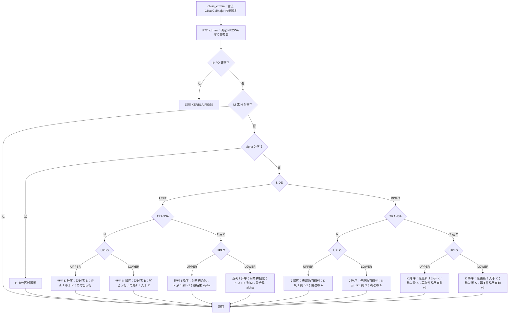
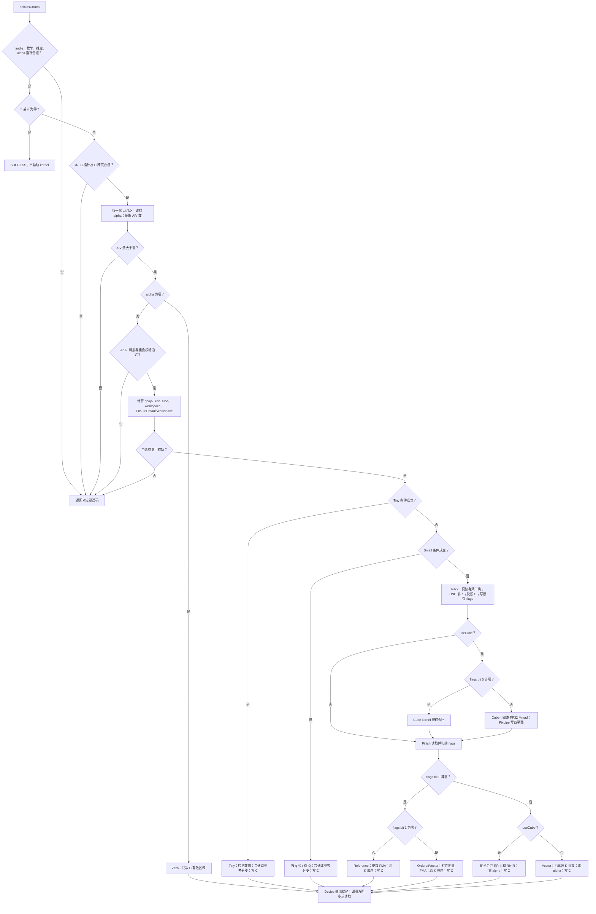

# 一、需求背景

## 1.1 需求来源

本需求对应[社区任务清单](../../../../docs/README.md)中 2026 年 9 月第 71 号“aclblasCtrmm 算子开发（A2/A3）”，依据配套《aclblasCtrmm_A2A3 任务书》：为 [ops-blas](https://gitcode.com/cann/ops-blas) 的 Atlas A2/A3 产品补齐 complex64 三角矩阵乘，完成 Ascend C Kernel 直调接口、实现和自验证，供社区评审。语义及性能标杆是 cuBLAS `cublasCtrmm`，精度 golden 是 Netlib BLAS `ctrmm`。

本设计按[社区提交说明](../../../../README.md)落在 `tasklist/09-71-aclblasCtrmm-A2A3/Xztxzt/docs/design.md`。内容参考[仓库设计模板](../../../../resources/design_template.md)，并按设计审核 Checklist 的五章结构组织。本文描述截至 2026-10-09 的精度修复候选：原始 1000 条精度用例和 11 项补充 GTest 通过，TC_PF_1005 严格精度通过；正式性能仅 **1/200** 达标，**0/200** 达到 10% 余量，A3 尚未实机验证。性能优化仍在进行，本设计提交不代表最终验收达标。

## 1.2 背景介绍

### 1.2.1 aclblasCtrmm 算子实现优化

这是句柄式 BLAS Kernel 直调任务，**不是 TBE 算子迁移，也不提供 ACLNN 接口**。因此本栏要求的 TBE 算子源码路径、算子信息库 JSON 路径、通过 ACLNN 接口核对 TBE 文件均不适用；不存在可据此填写的 TBE/ACLNN 文件。真实替代依据如下。本文以 `ops-blas/` 开头的路径均指开发工作区内的候选源码或本地验证归档，用于说明文件归属，不是本仓库中的可点击链接，也不表示这些候选文件已合入上游 master。本 PR 仅提交设计文档；算法、资源公式和关键验证结果直接列在本文中，公共引用仅使用可访问的一手资料。

| 用途 | 精确文件或一手来源 |
| --- | --- |
| 公共接口及参数契约 | `ops-blas/include/cann_ops_blas.h` 中 `aclblasCtrmm`；`ops-blas/include/cann_ops_blas_common.h` 中复数、枚举及状态码定义 |
| Host 校验、归一化与 workspace | `ops-blas/blas/trmm/arch22/ctrmm_host.cpp` |
| Ascend C 计算与分派 | `ops-blas/blas/trmm/arch22/ctrmm_kernel.cpp` |
| Host/Device 参数协议与软件舍入 | `ops-blas/blas/trmm/arch22/ctrmm_tiling_data.h`、`ops-blas/blas/trmm/arch22/ctrmm_ieee.h` |
| cuBLAS 公开语义 | NVIDIA [cublas&lt;t&gt;trmm 官方文档](https://docs.nvidia.com/cuda/cublas/index.html#cublas-t-trmm)；内部实现闭源，本文不推测其 GPU 调度、布局或舍入实现 |
| 可审阅的精度参考算法 | Reference-LAPACK/lapack **v3.10.0**：[BLAS/SRC/ctrmm.f](https://github.com/Reference-LAPACK/lapack/blob/v3.10.0/BLAS/SRC/ctrmm.f)、[CBLAS/src/cblas_ctrmm.c](https://github.com/Reference-LAPACK/lapack/blob/v3.10.0/CBLAS/src/cblas_ctrmm.c) |
| golden 接入与性能基线 | `ops-blas/test/trmm/ctrmm/ctrmm_golden.h`、任务 `ops-blas/task_submission/baselines/gpu_baseline.csv` |

优化目标是兼顾小矩阵启动时延、大矩阵计算吞吐和固定绝对误差上限：小矩阵单 kernel；一般矩阵先快照和整理布局，再用 Vector 或 FP32 Cube；敏感值保留参考算法关键求值顺序。使用四次实数乘法展开复数乘法，不采用三乘法重排。

### 1.2.2 aclblasCtrmm 算子现状分析

#### 1.2.2.1 标杆算子支持的数据类型和数据格式

本任务对标的是 `cublasCtrmm`，不是整个 S/D/C/Z TRMM 家族。无 TBE 信息库可核对，以下依据任务书、公有接口及上述 Netlib 源码。

| 项目 | cuBLAS Ctrmm / 本任务契约 | Netlib 精度参考 |
| --- | --- | --- |
| dtype | `cuComplex` / `aclblasComplex`，两个 FP32 分量，即 complex64、每元素 8 字节 | Fortran `COMPLEX`；CBLAS 通过 `void*` 传入同类复数数组 |
| 外部格式 | 列主序、全存储三角 A；B/C 为一般矩阵，无广播 | `ctrmm.f` 为列主序；`cblas_ctrmm.c` 还支持行主序适配，本任务仅调用 `CblasColMajor` |
| 形状 | LEFT：A 为 m×m；RIGHT：A 为 n×n；B/C 均 m×n | 相同数学维度，输出覆盖 B |
| 选择项 | side 两种 × uplo 两种 × trans 三种 × diag 两种，共 24 种 | 全部对应 L/R、U/L、N/T/C、N/U |
| 标量与存储 | 任务 alpha 在 Host，矩阵在 Device；步距以复数元素计 | alpha 和矩阵在 CPU；通过 lda/ldb 访问 |
| 结果 | 独立 C；允许 B 与 C 同地址 | 原地覆盖 B；测试先把 B 的有效元素按 ldc 复制到 golden C，再调用 CBLAS |

#### 1.2.2.2 标杆算子实现描述

TBE 实现描述不适用；本栏描述**可见的 Netlib 精度参考源码**，不将其当作 cuBLAS 内部实现。

`cblas_ctrmm.c` 在列主序分支把 side/uplo/trans/diag 映射成 Fortran 字符，将 M、N、lda、ldb 原样交给 `F77_ctrmm`。行主序分支交换 M/N，同时反转 side 和 uplo，trans 保持对应 N/T/C；这不是本测试的调用路径。枚举错误由 CBLAS 包装分支调用 `cblas_xerbla`；其中列主序非法 Diag 分支没有其他枚举分支那样的显式 `return`，不能把整个包装层描述成统一的状态码校验接口。

`ctrmm.f` 先确定 A 的阶数，再依次检查 side、uplo、trans、diag、M/N、LDA/LDB，失败调用 `XERBLA('CTRMM ',INFO)` 并返回。其前导维检查在零维 quick return **之前**。随后处理 M=0 或 N=0；再处理 alpha=0，直接将 B 的有效区域置零，不读取 A 或旧 B。其余分支如下，索引均为源码的 **1 起始**，所有 `diag=UNIT` 分支跳过对角读取和对角乘法。

| side / trans / uplo | 源码遍历顺序 | 实际求值及跳过规则 |
| --- | --- | --- |
| LEFT / N / UPPER | J=1…N；K=1…M；I=1…K−1 | B(K,J) 非零才令 TEMP=alpha·B(K,J)，先累加 B(I,J)+=TEMP·A(I,K)，再按 NON_UNIT 乘对角并写 B(K,J) |
| LEFT / N / LOWER | J=1…N；K=M…1；I=K+1…M | 同样先判断 B(K,J) 非零；先写当前行的 alpha/对角项，再用未乘对角的 TEMP 更新 I>K |
| LEFT / T 或 C / UPPER | J=1…N；I=M…1；K=1…I−1 | TEMP 从 B(I,J) 开始，按需乘对角，累加 A(K,I)·B(K,J)，最后 B(I,J)=alpha·TEMP；C 对 A 取 CONJG，无零系数跳过 |
| LEFT / T 或 C / LOWER | J=1…N；I=1…M；K=I+1…M | 同上，换为下三角可访问区；C 取 CONJG |
| RIGHT / N / UPPER | J=N…1；K=1…J−1；每次 I=1…M | 先用 TEMP=alpha（NON_UNIT 再乘 A(J,J)）缩放第 J 列；仅 A(K,J) 非零时，以 alpha·A(K,J) 乘第 K 列并累加 |
| RIGHT / N / LOWER | J=1…N；K=J+1…N；每次 I=1…M | 同上，依次处理下三角系数 |
| RIGHT / T 或 C / UPPER | K=1…N；J=1…K−1；每次 I=1…M | 非零 A(J,K) 才以 alpha·A(J,K) 更新第 J 列；C 用共轭系数。随后构造 alpha/对角缩放因子，因子不等于 1 才缩放第 K 列 |
| RIGHT / T 或 C / LOWER | K=N…1；J=K+1…N；每次 I=1…M | 同上，反向遍历 K，更新 J>K，再条件缩放当前列 |

这些循环方向确保覆盖 B 时仍能读取所需旧值。跳过零、UNIT 恒等操作、alpha 的乘法位置影响 Inf/NaN 传播和浮点舍入；数学表达相同不等于任意重排均具有相同数值行为。Fortran 源码本身不规定编译后使用哪条机器 FMA 指令，实际 golden 还由链接的库和编译平台决定。

#### 1.2.2.3 标杆算子实现流程图

下图对应 `ctrmm.f` 的可见控制流；入口选取本任务使用的合法 CBLAS 列主序包装。每个计算叶节点均按上一表处理 UNIT/NON_UNIT，T/C 的区别仅在 A 是否取共轭。TBE 流程图不适用，cuBLAS 闭源内部流程不画。



# 二、需求分析

## 2.1 外部组件依赖

| 组件 | 当前用途及已验证范围 |
| --- | --- |
| CANN 9.1.0 / Ascend C / ACL Runtime | 编译 arch22 kernel；分配 Device 内存；通过 stream 下发和同步；查询 AIV/AIC 数量 |
| ops-tensor 及 tensor_api | 沿用 ops-blas CMake 工程依赖，实际版本见下文；当前实现没有调用 CATLASS 高层模板 |
| Netlib BLAS 3.10.0-2ubuntu1（Ubuntu arm64） | GTest 的 CPU golden，显式指定 `REFBLAS_LIB` 和 `REFBLAS_INCLUDE_DIR`，避免误链接其他 BLAS |
| GTest 1.11.0 / CMake 3.22.1 | CSV 驱动和补充测试，仓库正常集成构建 |
| msprof / Python 报告脚本 | 已有性能采样、逐调用 kernel 分组和结果汇总；不是生产调用依赖 |
| cuBLAS 基线 | 使用任务提供的 200 行 GPU 实测 CSV；NPU 执行不依赖 CUDA/cuBLAS 库 |

具体版本以 `ops-blas/task_submission/versions.json` 和自验证步骤说明（`ops-blas/task_submission/1 自验证步骤说明.md`）为准：ops-blas 基础提交 `146a5771f9be8be4bb73609e6cd56a60bf664ab4`，ops-tensor `c1326e7a7fb30536dc3517ac40e06935aba5e88d`，tensor_api `ad3d3bf04dddfb94370c534c39bdd305d8e38d88`。保存的上游 v3.10.0 源码用于审阅算法，不冒充发行版二进制的构建产物或反汇编。

## 2.2 内部适配模块

| 模块 | 职责与边界 |
| --- | --- |
| `cann_ops_blas.h` / `cann_ops_blas_common.h` | 公开 Ctrmm 签名，复用库内句柄、complex64、枚举、错误码 |
| `ops-blas/blas/common/helper/aclblas_auxiliary.cpp` | 创建/销毁句柄、绑定 stream、设置用户 workspace |
| `ops-blas/blas/common/helper/aclblas_handle_internal.h` | `EnsureDefaultWorkspace`、`GetEffectiveWorkspace`、内存所有权和扩容同步 |
| `ops-blas/blas/common/helper/host_utils.h` | `GetAivCoreCount` / `GetAicCoreCount`；Ctrmm 没有调用 `CheckPtrLocation`，alpha 必须按契约传 Host 指针 |
| `ctrmm_host.cpp` / `ctrmm_tiling_data.h` | 校验、归一化、workspace 计算；按值传递 `CtrmmTiling` |
| `ctrmm_kernel.cpp` / `ctrmm_ieee.h` | Zero、Tiny、Small、Pack、Cube、Finish 及软件 IEEE FMA |
| `ops-blas/test/trmm/ctrmm/CMakeLists.txt` | 通过 `ops_blas_add_gtest_tests` 接入仓库测试；参数解析、golden、Device buffer 和 GTest 分文件维护 |

## 2.3 需求模块设计

### 2.3.1 Ascend C 算子原型

公开入口与 《aclblasCtrmm_A2A3 任务书》 一致：

```cpp
aclblasStatus_t aclblasCtrmm(
    aclblasHandle_t handle, aclblasSideMode_t side, aclblasFillMode_t uplo,
    aclblasOperation_t trans, aclblasDiagType_t diag, int m, int n,
    const aclblasComplex* alpha, const aclblasComplex* A, int lda,
    const aclblasComplex* B, int ldb, aclblasComplex* C, int ldc);
```

令 A 为由 uplo/diag 解释后的三角矩阵：

- LEFT：`C = alpha · op(A) · B`，A 阶数 q=m；RIGHT：`C = alpha · B · op(A)`，q=n。
- N：`op(A)=A`；T：`op(A)=Aᵀ`；C：`op(A)=Aᴴ=conj(Aᵀ)`。复共轭只对虚部取负，不能把 C 当作普通转置。
- 列主序元素地址为 `A[i+j*lda]`、`B[i+j*ldb]`、`C[i+j*ldc]`；步距单位是复数元素。非空时 `lda>=q`，`ldb>=m`，`ldc>=m`。
- UPPER 仅引用原始 A 的 i≤j，LOWER 仅引用 i≥j。UNIT 再排除 i=j，对角直接解释为 `1+0i`；NON_UNIT 读取对角且允许为零。本算子是乘法，不做三角求解、除法或奇异性检查。

下面 12 行每行分别包含 NON_UNIT 和 UNIT 两种模式，明确覆盖全部 **24 种组合**。有效三角栏描述 `op(A)`，物理读取仍受原始 uplo 限制。

| side | uplo | trans | op(A) | op(A) 有效三角 | NON_UNIT / UNIT |
| --- | --- | --- | --- | --- | --- |
| LEFT | UPPER | N | A | 上三角 | 读取 A 对角 / 不读并补 1 |
| LEFT | UPPER | T | Aᵀ | 下三角 | 读取 A 对角 / 不读并补 1 |
| LEFT | UPPER | C | Aᴴ | 下三角 | 读取并共轭对角 / 不读并补 1 |
| LEFT | LOWER | N | A | 下三角 | 读取 A 对角 / 不读并补 1 |
| LEFT | LOWER | T | Aᵀ | 上三角 | 读取 A 对角 / 不读并补 1 |
| LEFT | LOWER | C | Aᴴ | 上三角 | 读取并共轭对角 / 不读并补 1 |
| RIGHT | UPPER | N | A | 上三角 | 读取 A 对角 / 不读并补 1 |
| RIGHT | UPPER | T | Aᵀ | 下三角 | 读取 A 对角 / 不读并补 1 |
| RIGHT | UPPER | C | Aᴴ | 下三角 | 读取并共轭对角 / 不读并补 1 |
| RIGHT | LOWER | N | A | 下三角 | 读取 A 对角 / 不读并补 1 |
| RIGHT | LOWER | T | Aᵀ | 上三角 | 读取 A 对角 / 不读并补 1 |
| RIGHT | LOWER | C | Aᴴ | 上三角 | 读取并共轭对角 / 不读并补 1 |

### 2.3.1 Ascend C 算子相关约束

本栏沿用 Checklist 对“相关约束”的编号。任务范围内支持上述 24 种模式、独立 C、B=C、前导维 padding 和合法地址偏移。与 cuBLAS 相比，当前入口仅接收 Host alpha 和 32 位 `int` 维度，不提供 Device pointer mode 或独立的 64 位整数接口；不包含批量/跨批步距接口。与 CBLAS 包装相比，不提供显式 row-major 参数；不支持超出 lda/ldb/ldc 语义的任意 strides、广播或框架 Tensor 视图，这些均非本任务要求。

任务测试 `README.md` 的概要写作“不允许 C 与 A/B 重叠”，而任务书 §2.5 明确允许 B≡C；当前实现及补充测试按后者执行。B=C 时即使 ldb≠ldc 也先快照 B，但调用方必须分配能覆盖两种步距的完整缓冲区。C 与 A 重叠、C 与 B 非同址的部分重叠均拒绝；只读的 A/B 之间没有 Host 重叠检查，不据此推导额外的 cuBLAS 重叠承诺。

`m=0` 或 `n=0` 在基础参数校验后直接成功，允许 ld=0、矩阵指针为空；alpha 指针仍不可为空。非空 `alpha=(0,0)` 仍要求合法 ld 和非空 C，但不读取 A/B、允许 A/B 为 nullptr。异步与错误返回的精确边界见 3.1 和 3.4。

# 三、需求详细设计

## 3.1 调用方式

调用方初始化 ACL/设备，创建 `aclblasHandle_t`，通过 `aclblasSetStream` 绑定 stream，准备 Host alpha 和 Device A/B/C，调用 `aclblasCtrmm`，读回结果或释放相关内存前同步该 stream。生产入口由 Host 直接执行 `ctrmm_kernel_do(..., CtrmmTiling, stream)`，不经过 ACLNN 两阶段 executor、TBE 注册或 PyTorch 调度。

依据 `ops-blas/blas/common/helper/aclblas_auxiliary.cpp` 与 `ops-blas/blas/common/helper/aclblas_handle_internal.h`：`aclblasCreate` 预分配 32 MiB 库 workspace。`EnsureDefaultWorkspace` 在容量足够时直接返回；首次 Ctrmm 调用若超过该容量，或后续调用需要扩容，会先同步句柄 stream，再释放/分配。若库 workspace 尚未分配，申请也经过该同步分支。因此“stream 异步”指容量足够时的正常 kernel 下发，不承诺首次大矩阵调用或扩容完全异步。

库扩容容量为 `min(max(required, old>0 ? 2*old : 32 MiB), 2 GiB)`；用户 workspace 容量不足返回 `ACLBLAS_STATUS_ALLOC_FAILED`，不会替用户扩容。`aclblasSetStream` 会同步旧流并恢复库 workspace；`aclblasSetWorkspace` 生效时、销毁句柄时也有同步。alpha 被 Host 读入按值 tiling；A/B/C 和有效 workspace 必须活到对应 stream 完成。Host 返回 SUCCESS 表示已完成校验/下发，不保证异步设备执行成功，调用方须检查后续 ACL 同步结果。

## 3.2 需求总体设计

### 3.2.1 host侧设计

`ops-blas/blas/trmm/arch22/ctrmm_host.cpp` 的处理顺序为：

1. 检查 handle；检查四类枚举、m/n 非负和 alpha 非空；零维直接返回。
2. 检查 lda/ldb/ldc、C 非空及 C 地址跨度乘法无溢出；构造归一化参数，读取 alpha，取得 AIV 数量（为 0 时 INTERNAL_ERROR）。
3. alpha=0 直接下发 Zero，不检查 A/B 指针和重叠，不申请本次临时 workspace。
4. 检查 A/B 非空、跨度和重叠；计算 padding、依赖归约长度的 fastInputLimit、Cube 候选条件、各平面和总 workspace，调用 `EnsureDefaultWorkspace`。
5. 在同一 stream 中由 `ctrmm_kernel_do` 选择 Tiny、Small 或 Pack→可选 Cube→Finish。

统一内部问题为 `Y=alpha·T·X`，内部 T 为 q×q，X/Y 为 q×r：

| side | q / r | T | X | 输出映射 |
| --- | --- | --- | --- | --- |
| LEFT | m / n | op(A) | B | C=Y |
| RIGHT | n / m | op(A)ᵀ | Bᵀ | C=Yᵀ |

Host 设 `right=(side==RIGHT)`，`transpose=(trans!=N) XOR right`，`conjugate=(trans==C)`，`upper=(uplo==UPPER) XOR transpose`，`unit=(diag==UNIT)`。故 RIGHT+N 取 T=Aᵀ，RIGHT+T 取 T=A，RIGHT+C 取 T=conj(A)，不再转置。原始 trans 另存 `originalTrans`，用于恢复参考算法的求值分支。

归一化 T(i,k) 在 transpose 为真时读取 `A[k+i*lda]`，否则读取 `A[i+k*lda]`，conjugate 为真时虚部取负。X(i,j) 在 LEFT 时读取 `B[i+j*ldb]`，RIGHT 时读取 `B[j+i*ldb]`；写回 C 使用同样映射及 ldc。

#### 3.2.1.1 分核策略

记 V=`vectorCores`，H=`cubeCores`，来自 `GetAivCoreCount`/`GetAicCoreCount`，不写死为实测的 40/20。除 Small 直接按任务数启动外，任务通常按 `task=blockIdx; task<total; task+=blockNum` 轮转。单核完成其输出的整个 K 规约，无跨核原子累加。

| 路径 / 阶段 | 任务空间与映射 | 启动核块数 |
| --- | --- | --- |
| Zero | `ceil(m/512)*n`；`row=(task % ceil(m/512))*512`，`col=task/ceil(m/512)`，每任务写同一列最多 512 个复数 | V |
| Tiny | LEFT、q/r≤2、B≠C；一个核加载全部需要的系数和 B，生成全部 C | 1 |
| Small&lt;Q&gt; | `R=(Q==8 ? 2 : 4)`；`rowBlocks=ceil(q/R)`；`row=(blockIdx % rowBlocks)*R`，`col=(blockIdx/rowBlocks)*COLS`；每块负责最多 R 行×COLS 列 | `ceil(q/R)*ceil(r/COLS)`，不是 `min(tasks,V)`，超出物理核时由运行时调度 |
| Pack 的 T | 当 `useCube && q<=128 && r>=512`，按四行一块打包，`base=4*blockIdx`，步长 `4V`；其余按 qp 行轮转。均只搬有效三角并补 UNIT 对角 | V |
| Pack 的 X | `qp/16 * rp/W` 个矩形；`row=(task/(rp/W))*16`，`col=(task % (rp/W))*W` | 与 T 共用一次 Pack 的 V 个核块 |
| Cube | `qp/64 * rp/Nc` 个输出 tile；行块由 tile 除以列块数，列块由取余确定；沿 K 独立累加 | `min(tileCount,H)` |
| Finish 普通 Cube | `ceil(q/Rf)*ceil(r/Wf)` 个有效输出矩形，行块优先展开列块；通常 `Rf=16,Wf=W`，满足下述宽块条件时 `Rf=8,Wf=256` | V |
| Finish 通用 Vector / Reference | `q*ceil(r/1024)`；`row=task/ceil(r/1024)`，`col=(task % ceil(r/1024))*1024` | V |

其中 `Nc=128` 当 `q<=256 && r>=512`，否则 64；`W=128` 当 `rp % 128==0`，否则 64。W 是 Pack 及默认 Finish 的矩形宽度，**不等同于 Nc**，例如 Nc=64 且 rp=256 时 W 仍为 128。整行轮转与 tile 轮转分散三角 K 长度不同的任务，但不声称各核计算量完全相等。 Finish 对 `right && q<=128 && r>=512 && rp%256==0` 使用 8×256 输出块，保持最大 2048 个复数的 UB 容量，减少该范围内的尾行浪费与部分形状的执行轮次；其他范围保留 16×W。

#### 3.2.1.2 数据分块和内存优化策略

以下均从 `ops-blas/blas/trmm/arch22/ctrmm_kernel.cpp` 的 `InitBuffer`、`LocalTensor` 地址和 Host 公式推导。`ceil_a(x)=a*ceil(x/a)`，FP32/uint32 均 4 字节，complex64 为 8 字节，1 KiB=1024 字节。UB 数值是显式申请量，不含编译器寄存器/栈及框架内部开销；代码没有按运行时 UB 容量自适应扩大分块。

**GM workspace。** 非零 alpha 时 Host 无论最终是否选 Small/Tiny，均计算：

```text
qp = ceil_64(q)
Nc = (q <= 256 && r >= 512) ? 128 : 64
rp = ceil_Nc(r)
AP = qp * qp                 // t.aPlane，以 float 元素计
XP = qp * rp                 // t.xPlane，以 float 元素计
useCube = (q >= 64 && r >= 16 && H > 0)
S = useCube ? 6 : 4
flagsOffset = 2*AP + S*XP
requiredBytes = 4 * (2*AP + S*XP + 8*V)
```

| 区域 | float 起始偏移 | 长度 | 消费者 |
| --- | ---: | ---: | --- |
| Tr / Ti | 0 / AP | 各 AP | Cube、通用 Vector、Reference |
| Xr / Xi | 2AP / 2AP+XP | 各 XP | 同上，保存 B 的完整快照 |
| RR / II / RI / IR（useCube） | 2AP+2XP / 2AP+3XP / 2AP+4XP / 2AP+5XP | 各 XP | Cube 写入，普通 Finish 合并 |
| 非 Cube 的额外保留区 | 2AP+2XP | 2XP | 当前 Vector 直接写 C，这两平面未用于计算；仍按 Host 实际请求计入 |
| flags | flagsOffset | 8V 个 4 字节槽 | Pack 实际只写连续的前 V 个 uint32，即 flags[blockIdx]；剩余为保留空间，不是每个标记间隔 8 个槽 |

Host 检查 AP、XP 及最终总量不超过 2 GiB workspace 上限，地址范围用 64 位计数并检查 `size_t`。padding 区在 Pack 中生成零，不从用户 padding 读值。Cube 敏感路径虽跳过 Mmad，仍使用按 `useCube` 申请的完整 workspace。

Small/Tiny kernel 本身没有 workspace 参数，也不消费 GM workspace；**Host 仍先执行 `EnsureDefaultWorkspace`**，所以不能称“小矩阵完全无 workspace 分配”。例如 q=r=64、H>0 时即使最终命中 Small，Host 仍取 S=6。只有零维不下发，以及 alpha=0 的 Zero 路径不提出本次 workspace 请求；句柄自身仍可能持有创建或历史扩容的容量。

**Zero、Tiny 与 Small 的 LocalMemory。** Zero 的 `CHUNK=512`，UB=`2*512*4=4096` 字节。Tiny 的 `input=192`、`output=64`，合计 **256 字节 UB**；另有标量 `ComplexValue av[4],bv[4]`，源码逻辑大小合计 64 字节，实际寄存器/栈放置由编译器决定，不混入显式 UB。

Small 取 `ROWS=R=(Q==8 ? 2 : 4)`、`PACK_ROWS=4`、`COLS=CQ=(Q<=16 ? 8 : Q<=32 ? 16 : 32)`，`U=Q*CQ`，`A_SIZE=RQ`，`OUT=R*CQ`，`MASK_PITCH=max(U/8,32)`。各 TBuf 同时存在，不能只按有效尾块缩小预算：

| Small 缓冲区 | 字节公式 |
| --- | ---: |
| rawBuf | `4*(8RQ+2U)` |
| dataBuf（Ar/Ai/Br/Bi） | `4*(2RQ+2U)` |
| tmpBuf | `4*4U` |
| indexBuf | `4*2U` |
| outBuf | `4*2R*CQ` |
| packBuf | `4*8CQ` |
| maskBuf | `4*max(U/8,32)` |
| **合计** | **`4*(10RQ+10Q*CQ+2R*CQ+8CQ)+4*max(Q*CQ/8,32)`** |

| Q | ROWS | COLS | raw | data | tmp | index | out | pack | mask | 合计 / 字节 |
| ---: | ---: | ---: | ---: | ---: | ---: | ---: | ---: | ---: | ---: | ---: |
| 8 | 2 | 8 | 1024 | 640 | 1024 | 512 | 128 | 256 | 128 | **3712** |
| 16 | 4 | 8 | 3072 | 1536 | 2048 | 1024 | 256 | 256 | 128 | **8320** |
| 32 | 4 | 16 | 8192 | 5120 | 8192 | 4096 | 512 | 512 | 256 | **26880** |
| 64 | 4 | 32 | 24576 | 18432 | 32768 | 16384 | 1024 | 1024 | 1024 | **95232** |

Q 的选择同时依据 q/r，详见 3.2.1.3。例如 q=8、r=17 使用 Q=32、COLS=16；q=31、r=33 使用 Q=64、COLS=32。Q=8 每块两行，其他 Q 每块四行；输出列在 UB 中均占四个复数的 32 字节槽，`DataCopyPad` 只写有效行。64×64 的任务数由原 64 块降到 32 块，在 40 AIV 上由两轮变为一轮。三角外和 UNIT 对角在搬入时就排除，不是先读取后掩码。

敏感检查覆盖 `checked=2RQ+2U` 个 float；Compare 前将 tmp 尾部补零至 64 个 float 对齐，归约只检查有效 mask 字节。归约 scratch 起点为 `ceil_32(checked/8)` 个 half，避免 Q=64、COLS=32 时与输入 mask 重叠。

**Pack UB。** `CHUNK=512`，`RECT_ROWS=16`，`RECT_COLS=128`，`RECT_SIZE=2048`：

```text
rawBuf   = 512*8*4             = 16384
realBuf  = 512*4               =  2048
imagBuf  = 512*4               =  2048
indexBuf = 512*2*4             =  4096
absBuf   = 2*2048*4            = 16384
maskBuf  = 4*512               =  2048
rectBuf  = 4*2048*4            = 32768
总 UB                           = 75776 字节（74 KiB）
```

T 通常每行按最多 512 个系数搬入；`useCube && q<=128 && r>=512` 时，四个相邻行在原有 raw/real/imag/index 缓冲区内一次打包，`4*qp<=512`，UNIT 对角及三角边界仍逐段裁剪。X 按 16×W 打包。LEFT 的 rectBuf 后半部保存实/虚 gather 索引，前半部复用为数据或初始化 scratch；RIGHT 直接用 GatherMask 的奇偶模式拆分，不生成 X 索引。absBuf 复用归约临时区。maskBuf 的四个 512 字节段分别保存误差限界、向量 FMA 上界、下界、零值的比较结果；每个有效块分别归约两类标记。bit 0 表示不能进入重排求和路径，bit 1 表示不能使用有界向量 FMA。W=64 时缓冲区仍按最大 W=128 申请。有限值检查的 CompareScalar count 补齐至 64 个 float，尾 mask 剔除无效位；不能将短尾直接作为完整 repeat。

**Cube LocalMemory。** M=K=64，N=Nc∈{64,128}；Ar/Ai/Br/Bi 各搬一次，并在四个产品间复用。L1 为 A1/B1 共享地址空间，按显式不重叠偏移计算；L0C 同时保留 RR/II/RI/IR。

| 位置 | 字节公式 | N=64 | N=128 |
| --- | --- | ---: | ---: |
| L1 | `4*(2*64*64+2*64*N)` | 64 KiB | 96 KiB |
| L0A | `4*2*64*64` | 32 KiB | 32 KiB |
| L0B | `4*2*64*N` | 32 KiB | 64 KiB |
| L0C（CO1） | `4*4*64*N` | 64 KiB | 128 KiB |

Cube 无显式 UB TBuf。上三角输出行块 mBase 的 K 范围是 `[mBase,qp)`，下三角是 `[0,mBase+64)`，步长 64；对角 tile 内的无效三角已由 Pack 填零。禁用 HF32，使用 FP32 Mmad。

**Finish UB。** 先申请标记缓存 `F=4*ceil_64(V)+128` 字节；前部装 V 个标记并补零，通过标量 OR 汇总；后部 128 字节保留。随后仅初始化下列一个分支：

| 分支 | 除 flags 外的缓冲区 | 总 UB |
| --- | --- | --- |
| 普通 Cube 结果合并 | rectIn=`4*RECT_SIZE*4`；rectOut/rectPack/rectIndex 各 `2*RECT_SIZE*4` | `81920+F` 字节 |
| 通用 Vector 或整数 Reference | a=`2*512*4`；x/out 各 `2*1024*4`；tmp=`4*1024*4`；pack/index 各 `8*1024*4` | `102400+F` 字节 |
| 有界 OrderedVector | 上一行全部缓冲区，加 fma=`12*1024*4`、fmaMask=`4*1024/8` | `152064+F` 字节 |

实测 V=40 时 F=384，三个分支分别为 **82304、102784、152448 字节**。仅分配实际路径的缓冲区；最大占用小于本机 192 KiB UB。RHS=1024 用于跨独立输出列向量化，K 维仍按 Netlib 顺序串行，不会改变归约顺序。标量数学的寄存器/栈开销另计。

以上所有路径均**未启用 double buffer**：没有双份 TQue/ping-pong 数据块。Cube 的实/虚两份输入和四份输出是复数分解所需的不同数据，不是双缓冲；搬运、计算与写回复用单组缓存，通过事件及屏障管理生命周期。GM workspace 的全调用共享与 UB/L1/L0 的每核占用也不能相加成“单核 UB”。

#### 3.2.1.3 tilingKey规划策略

当前是 Kernel 直调，**没有框架 TilingKey、注册 key 或数值 key 编码**。真实分派依据 `ctrmm_kernel_do` 的下列有序判断；Host 已在非零 alpha 分派前完成 workspace 处理。

| 优先级 | 条件 | 实际入口 / 后续行为 |
| --- | --- | --- |
| 1 | alpha 实虚部均为 0 | `ctrmm_zero_kernel` |
| 2 | LEFT 且 q≤2、r≤2、B≠C | `ctrmm_small_scalar_kernel`（Tiny） |
| 3 | LEFT 且 q≤64、r≤64、B≠C | 下表选择 `ctrmm_small8/16/32/64_kernel` |
| 4 | 其余全部 | `ctrmm_pack_kernel` → useCube 时 `ctrmm_cube_kernel` → `ctrmm_finish_kernel` |

| Small 子条件（顺序判断） | Q | COLS |
| --- | ---: | ---: |
| q≤8 且 r≤8 | 8 | 8 |
| 否则 q≤16 且 r≤16 | 16 | 8 |
| 否则 q≤32 且 r≤32 | 32 | 16 |
| 否则（仍在 q/r≤64 内） | 64 | 32 |

`useCube=(q>=64 && r>=16)`，没有 AIC 时置 0；小矩阵优先级更高。Cube 内部再按 `q<=256 && r>=512` 选择 `RunCube<128>`，否则 `RunCube<64>`。Pack 的 flags bit 0 非零时，Cube kernel 仍已下发但立即返回；Finish 在 bit 1 为零时执行 OrderedVector，否则执行整数 Reference。bit 0 为零时继续使用原 Cube/Vector 路径。

`CtrmmTiling`（`ops-blas/blas/trmm/arch22/ctrmm_tiling_data.h`）的字段全部如下，不附加不存在的 key：

| 类型 / 字段 | 含义 |
| --- | --- |
| uint32：`m,n,lda,ldb,ldc` | 公共逻辑维度及复数元素步距 |
| uint32：`q,r,qp,rp` | 归一化维度及补齐维度 |
| uint32：`right,transpose,conjugate,upper,unit` | 归一化布局和三角语义布尔量 |
| uint32：`originalTrans` | 原始 `aclblasOperation_t` 值，区分参考路径的 N 与 T/C |
| uint32：`vectorCores,cubeCores,useCube` | 平台核数和 Cube 候选标志 |
| float：`alphaReal,alphaImag` | Host 读取后的复数标量 |
| float：`fastInputLimit` | 依赖 qp 和 alpha 的逐分量限界；0 表示不接受重排求和 |
| uint64：`aPlane,xPlane,flagsOffset` | 按 float 元素计的平面长度和标记起始偏移 |

### 3.2.2 kernel侧设计

#### 3.2.2.1 kernel侧实现描述

实现依据 `ops-blas/blas/trmm/arch22/ctrmm_kernel.cpp` 中的 `Pack`、`CtrmmBasicMmad`、`Finish`、`Small<Q>` 及各 kernel 入口。

**正常数值路径。** Tiny 在单核 UB 中加载至多 3 个有效三角系数及全部 B，标量计算后写出。Small 每核处理两行（Q=8）或四行，分别搬入有效 A 系数和至多 q×cols 的有效 B，并在 UB 内补齐容量。连续 AoS 数据使用 GatherMask 奇偶模式拆分，非转置 A 使用地址 Gather；UNIT 对角用按位掩码 Duplicate 写入 Ar，避免 Scalar 修改输入缓存。四次 Mul 得到实数产品，Sub/Add 后以 `WholeReduceSum` 沿 Q 归约。普通 alpha=1+0i 分支将归约结果直接写到输出列的复数 AoS 槽，dstRepStride=8 个 float，省去最终索引生成与 Gather；其他 alpha 和敏感路径保留缩放/重排写出。敏感检查前所有被检查的 Small 平面均已初始化；禁止读取的 A 区域通过零/UNIT 常量构造。

一般矩阵执行以下流水：

1. **Pack。** 先在内部 T 平面清零，只搬原始 A 的有效三角，UNIT 直接写 `1+0i`，C 模式对虚部取负；按 16×W 将列主序复数 B 转为补齐的行主序 Xr/Xi。Pack 完成整个 B 快照后才可能写 C，因而支持 B=C 和不同 ldb/ldc。搬运索引用 `CreateVecIndex`、移位和 Gather 构造，尾部 `DataCopyPad` 只读有效范围。
2. **Cube（可选）。** GM 行主序平面经 ND→NZ 进入 L1，再经 `LoadData3DParamsV2<float>` 形成 A 的 ZZ、B 的 ZN。每个 K tile 复用两份 A、两份 X，分别累加 `RR=Tr·Xr`、`II=Ti·Xi`、`RI=Tr·Xi`、`IR=Ti·Xr`。首个 K tile 初始化 CO1；禁用 HF32。四个累加器经 Fixpipe 写回不同 GM 平面。
3. **Finish。** 普通 Cube 分支以 16×W（满足宽块条件时 8×256）加载四平面，计算 `Yr=RR-II`、`Yi=RI+IR`，再按 `Cr=alphaReal*Yr-alphaImag*Yi`、`Ci=alphaReal*Yi+alphaImag*Yr` 缩放（alpha=1 时省略），重排回外部列主序，仅写有效 m×n。非 Cube 的 Vector 分支每次处理同一行至多 1024 个 RHS；沿有效 K 逐个读系数，系数按 512 缓存，对 RHS 向量执行四个 Muls、Sub/Add、累加，最后缩放并写出。

Cube 使用 MTE2→MTE1→M→FIX 的事件顺序，进入下一个输出 tile 前等待 FIX_M，最后也耗尽末次 Fixpipe 完成 token，避免后续调用初始化同一事件时阻塞。Finish 在复用缓冲区前使用 MTE/V/S 屏障，矩形分支在下一次输入搬入前执行 V→MTE2 同步。三阶段在同一 stream 串行下发，kernel 边界提供阶段间的全局可见性，不依赖单核 `PipeBarrier` 完成跨核同步。

**按误差预算分流。** 原先 A/B 分量≤32、alpha 分量≤8 的启发式已移除。令 `u=2^-24`、`L=qp`、`A=max(1,|alphaReal|+|alphaImag|)`。Host 计算

```text
K = 128*u*L*(L+8)*A
M = 向下取二的幂(sqrt(2^-15 / K))，并截断到不大于32
```

只有 alpha 有限且其 1-范数≤8、全部有效 A/B 分量绝对值≤M 时，才允许改变求和顺序。非有限值或不满足限界时，走参考顺序。UNIT 构造的 1 也参加检查：通用 Pack 在 limit<1 时显式置 bit 0，避免行式打包在检查后插入对角而漏判；无效三角、padding 和禁止读取的对角不参加输入读取。Tiny/Small 使用同一个 Host 限界，通用路径由 Pack 发布 flags。这是对数值和归约长度的统一规则，不识别测试编号、随机种子或指定 shape。

在关闭 HF32 的 FP32 舍入模型中，每个输出分量的展开绝对项之和≤`2*A*L*M²`。用 `gamma_n=n*u/(1-n*u)`，以 `n=2L+12` 覆盖两种求值中每项的乘法、复数组合、alpha 位置及归约舍入，两路径差异≤`4*gamma_n*A*L*M²`。workspace 上限保证 L≤16384，`n*u<1/2`，因而该界≤`8*(2L+12)*u*A*L*M²`，被选择的 K 系数保守覆盖。限界使其≤`2^-15`，为混合容差绝对项 `2^-13` 的四分之一；舍入限界独立于最终输出大小，因此相消也不使证明失效。若硬件对次正规中间结果作 flush-to-zero，每次绝对扰动小于 2^-126；连同至多32的输入分量、至多8的 alpha 范数及舍入传播，取更宽的总附加界 `1024*L²*2^-126 ≤ 2^-88`，仍远小于保留预算。快路输入及中间和处于有限低幅范围，不涉及溢出。这里没有采用统计误差或假定随机分布；该界较保守，代价是大多数原性能分布进入参考顺序。

**两种参考顺序实现。** Pack 的 bit 0 标记不能通过上述限界；bit 1 标记不能使用有界向量 FMA。后者仅允许 alpha∈{1,−1,i,−i}、输入每个分量为 0 或绝对值位于 `[2^-30,32]`。Cube 只检查 bit 0；Finish 在需要参考求值时依据 bit 1 选择向量或整数实现。通用 Reference 基于快照中的 T/X 保持以下 Netlib 求值特征：

| 原始分支 | Reference 的对应行为 |
| --- | --- |
| LEFT+N | B 元素的实/虚部同时为零时跳过；先算 alpha·B，再按需乘对角；非对角项算 `(alpha·B(k))*T(i,k)`；归一化下三角按 K 降序累加 |
| LEFT+T/C | 从当前 B 和可选对角乘积初始化；按有效非对角 K 升序累加；最后乘 alpha；UNIT 直接保留 B，不制造复数乘 1 |
| RIGHT+N | 先形成 alpha/对角因子并乘当前 B；跳过零 A 系数；非对角项用 `(alpha·T(i,k))*X(k)`，K 升序 |
| RIGHT+T/C | 对角因子为 1 时保留 B；跳过零 A 系数；归一化下三角按 K 降序，其余升序累加。每个输出从快照计算，等价展开参考源码的列更新 |

`ctrmm_ieee.h::Fma` 用整数有效数字乘积和 guard/round/sticky 信息实现 binary32 单舍入、round-to-nearest-even，处理次正规数、溢出、Inf/NaN 和零。`ComplexProduct` 先得到分别舍入的 ac/bd/ad/bc，再按分支把其中一个乘积与另一乘积做软件 FMA；这不表示整个复数乘法无限精度。出现 NaN 时先按非融合复数乘法重算，必要时以无穷分量归一化及带符号零恢复传播行为，用于匹配当前 golden 环境。

动机是固定 maxabs≤0.01 下，较大输入的复数乘法中间舍入以及 alpha 位置会放大与 golden 的差异。**不能将 A2 同类型 `MulAddDst` / `FusedMulAdd` 视为 IEEE 单舍入 FMA**；[Ascend C 官方复合计算说明](https://asc.gitcode.com/api/SIMD-API/basic_api/memory_vector_compute/composite_compute/overview.html) 说明同类型源/目的复合指令不提升精度，当前兼容路径明确采用软件实现。该官方页为持续开发文档，本文的软件实现结论同时受本地代码及独立 FMA 检查日志（`ops-blas/task_submission/ieee-fma-check.log`）支持，不据此推断 Netlib Fortran 源码必然生成某条机器指令。

`OrderedVector` 沿至多 1024 个 RHS 并行，沿 K 保留上表的方向；它没有重新归约。alpha∈{−1,i,−i} 时使用精确符号变换/实虚交换，这在当前 LEFT+N 和 RIGHT 的 FMA 方向下可与每项运算、逐次 RN 加法交换；LEFT+T/C 本来就在末尾缩放。一般 alpha 不作这种移动。复数乘法使用 Dekker 精确乘积拆分、两次 TwoSum 以及正确舍入的中点修正，依据 [Graillat/Muller 2025 原论文](https://perso.lip6.fr/Stef.Graillat/papers/NM-2025.pdf) 的算法 3/4/6/9 实现。输入范围保证所有非零中间值保持 normal（最细格点下至 2^-109），不用同类型 compound 指令替代 FMA。标量系数用整数位运算保留高 12 位有效数字；实测 Bisheng 会把普通浮点标量拆分化简为 ah=a、al=0，即使指定 `-ffp-contract=off`，因此不能依赖那种写法。向量指令之间保留 V 屏障。独立 CPU 检查和 NPU 对角乘法检查验证中点修正；有界之外仍使用原整数 FMA，并用 CountLeadingZero、有限恒等因子和精确二的幂缩放减少开销。

#### 3.2.2.2 Ascend C实现流程图

图中 Tiny/Small 条件均要求 LEFT 且 B≠C；具体 Q、核块数及 LocalMemory 见 3.2.1。Device 流水节点表示同一 stream 的执行次序，末端不表示 Host 隐式等待设备完成。



#### 3.2.2.3 Ascend C实现流程图与标杆算子流程图存在的差异点和原因

下表的“参考”均指已读取的 Netlib v3.10.0，cuBLAS 只提供公共契约和任务性能基线；其闭源内部算法不在比较范围内。

| 方面 | Netlib 可见流程 | 当前 Ascend C 流程 | 原因及影响 |
| --- | --- | --- | --- |
| 算法组织 | 分 side/trans/uplo 的八类循环，原地更新 B | 归一化为左乘，快照 X，多核独立输出；普通 Cube 四个实数矩阵乘法 | 去除原地读写依赖，复用统一 kernel；数学语义一致，运算顺序不同 |
| 调度 | Fortran 源码按循环串行更新；CPU 编译优化不由该源码保证 | Tiny/Small 单次启动；其余 2 或 3 次 kernel；每核完成一个输出 tile 的 K | 小规模减少启动开销；大规模利用 AIV/AIC，避免跨核原子及 K 归约 |
| 布局 | 直接按列主序及 ld 访问交错复数 | 外部 AoS 列主序→内部 FP32 SoA 行主序→Cube NZ/ZZ/ZN→列主序 C | 改善连续搬运和实数 Mmad 复用，代价是 Pack/Finish 与 GM workspace |
| 三角与对角 | 循环边界裁剪，UNIT 不乘对角 | 搬入前裁剪，UNIT 常量补齐；Cube 允许计算内部已清零的三角位置 | 不读取禁止区域；参考路径仍保留 UNIT 恒等操作，避免 Inf·0 引入伪 NaN |
| 零跳过与非有限值 | LEFT+N 跳过零 B；RIGHT 跳过零 A；部分分支跳过乘 1 | 正常向量化路径重排；敏感路径按原始分支恢复上述行为 | NaN/Inf 的传播不能仅靠数学等价式保证；敏感路径以兼容为先 |
| alpha 和舍入 | alpha 位于不同循环位置，机器舍入取决于具体库构建 | 普通路径通常规约后缩放；Small 用树式归约、Cube 用矩阵累加；敏感路径使用软件 FMA | 提高吞吐同时限制与 golden 的误差；通过前向误差预算限制重排；不能证明安全时保留 Netlib 求值顺序，并承担性能代价 |
| 原地与内存 | 输出覆盖 B，不需要独立 C 快照 | 支持 C 独立及 B=C；后者强制一般路径先 Pack | 可并行写 C；支持不同 ldb/ldc，增加临时内存 |
| 参数与 quick return | 先检查 LDA/LDB，再零维返回；XERBLA 报错 | 先检查 handle/枚举/维度/alpha，零维在 ld 检查前返回；状态码报错 | 遵从任务 CSV 对零维 ld=0 的约定，明确与 Fortran 参数检查顺序的差别 |
| 异步 | CPU 函数返回时 B 已完成 | stream 排队，容量足够时无 Host 同步；workspace 扩容有同步 | 适配 BLAS 句柄和 ACL 生命周期，读取结果须显式同步 |

## 3.3 支持硬件

| 产品 | 设计/工程适配 | 已有实机证据 |
| --- | --- | --- |
| Atlas A2 系列（含 Atlas 800T / 800I A2） | arch22 Ascend C | **Atlas 800T A2 910B3，CANN 9.1.0**；AIV=40、AIC=20 |
| Atlas A3 系列（含 Atlas 800I A3） | 同一 arch22 实现，目标支持 | **尚未实机验证**，不得由 A2 结果推定 A3 精度或性能通过 |

任务书 §3.1 允许自验覆盖一种款型，§7 又要求 A2/A3 均完成验收；本次证据只覆盖前者的 A2 自验，不能声称双平台验收完成。依据 `ops-blas/task_submission/versions.json` 及自验证步骤说明（`ops-blas/task_submission/1 自验证步骤说明.md`）。

## 3.4 算子约束限制

| 条件 | 当前实际行为 / 使用要求 |
| --- | --- |
| handle 为空 | `ACLBLAS_STATUS_HANDLE_IS_NULLPTR`；非空但无效的悬空指针不在可校验范围内 |
| 非法枚举、负维度、alpha 为空 | `ACLBLAS_STATUS_INVALID_VALUE`，即使另一维为零也先报错 |
| 零维 | 上述检查后 SUCCESS，不读取 alpha 的值，不检查 ld/矩阵指针，不下发 |
| 非空调用 | ld 必须合法，C 必须非空；有效区域跨度必须可表示 |
| alpha=0 | 只清零 C 的 m×n；不读 A/B，不检查其空指针/重叠；保留 C 的 padding 和 guard |
| alpha 非零 | A/B 必须非空；禁止 C/A 重叠及 B≠C 时 C/B 重叠 |
| 重叠检测 | `MatrixBytes(rows,cols,ld)=8*((cols-1)*ld+rows)`，按连续地址跨度检测，含中间列间 padding，可能保守拒绝“仅空隙重叠”的布局；不是逐个有效三角元素检测 |
| 原地 | 仅 B=C 免除 B/C 重叠拒绝，不要求 ldb=ldc；禁止 Small/Tiny，借 Pack 快照保证输入完整 |
| 格式与地址 | 仅 complex64 列主序、全存储 A；允许 ld padding 和合法元素偏移，已有 8 字节偏移验证；不承诺任意字节错位指针、越界分配或任意 strides |
| 超大 ld | 部分 DMA 跨度字段为 uint32；当前不覆盖 `(ld-span)*8 > UINT32_MAX` 的搬运范围，Host 跨度校验通过不代表该范围已适配 |
| workspace / 核数 | 请求超过 2 GiB、分配失败、用户容量不足均 ALLOC_FAILED；AIV 数为 0 报 INTERNAL_ERROR；AIC 数为 0 回退 Vector |
| 数值与性能 | 重排 FP32 路径不保证与 Netlib 逐位匹配；敏感/非有限参考分支可能显著较慢，性能通过仅针对已测分布和用例 |
| 异步错误 | `ctrmm_kernel_do` 无逐 kernel 返回码透传，SUCCESS 不是设备完成凭据；同步/读回错误由 ACL 调用方观察 |

不对 A/B/C 的实际分配长度、Device 归属或用户 workspace 与矩阵的重叠做完整运行时探测，调用方须满足内存契约。支持维度由正 `int` 范围、Host 溢出防护、workspace 容量及设备可用内存共同限制；已测原始精度尺寸至 2048，另补 4096 完整严格精度；性能尺寸至 4096，不能据此称所有可表示尺寸均经过验证。

# 四、特性交叉分析

该实现的主要交叉点是公共句柄资源、复数三角语义、异步执行和精度/吞吐取舍。没有接入 ACLNN、GE 图算子注册、广播或自动求导，不能借用这些框架的内存规划、别名检查或调度保证。

| 交叉特性 | 相互影响与实现处理 | 验证证据 / 剩余边界 |
| --- | --- | --- |
| side × trans × uplo × diag | RIGHT 改变内部转置标志；C 独立保留共轭标志；三角在归一化后翻转；UNIT 禁读原始对角 | 原始 24 组基础用例及 `SensitiveBranchCombinations`；不能仅用 LEFT+N 代表全组合 |
| UNIT / 三角禁读 × NaN/Inf | 无效区和 UNIT 对角可以存放 NaN；先裁剪再搬入。敏感路径用恒等操作处理 UNIT，避免复数乘 1 的 0×Inf | 测试统一向无效 A 区域填 NaN，数值和特殊值双重比较；padding 毒值不应误触发敏感路径 |
| alpha=0 × 空指针 × padding | 允许 A/B=null；只写 C 有效区域，仍检查 ld/C；原 workspace 保留但不使用 | 原始 alpha0 用例和 `AlphaZeroPreservesPadding`；不得通过读取 A/B 决定 Zero 分派 |
| 原地 × 多核 × 不同前导维 | Small 不快照整个 B，故 B=C 强制 Pack；一般路径在写 C 前完成所有读 B；ldc 可以不同于 ldb | `InPlaceOffsetAndPadding` 覆盖 24 组及两种 ldc；调用方保证底层容量覆盖最大步距 |
| offset / 尾块 × 写出所有权 | Small 每块连续两行或四行，其他路径按输出 tile 独占；DataCopyPad 按有效跨度写出，不能覆写 padding/guard | `SmallTileOffsetAndPadding` 含 7×8 的双行尾块、31×33 的 Q 跨档、普通/单位 alpha 及 8 字节偏移；测试不等于任意错位地址保证 |
| stream × handle workspace 复用 | 同一流 Pack→Cube→Finish 有序；每次 Pack 的所有 AIV 都重新写 flags，敏感调用不会污染下一次普通调用；tiling 按值传递 | `QueuedCallsShareWorkspace` 中两次调用间无 Host 同步；仅覆盖同句柄同流顺序调用，不证明共享 workspace 的跨流并发安全 |
| workspace × 其他 BLAS 调用 | 同句柄使用一个 active workspace，历史大容量可能保留；切换流/设置 workspace/销毁有同步及所有权规则 | 复用公共 helper，不修改其 ABI；多线程并发修改同一句柄、多个句柄共享同一用户 workspace 需由调用方隔离 |
| Cube × 精度 × 数值分流 | 四产品 FP32、关闭 HF32；限界依赖归约长度和 alpha；不能通过限界时保留分支顺序 | 旧交付版 4096 和相消输入失败已复现；修复后专项及新性能边界见 5.1 和精度复核报告 |
| kernel 生命周期 × 连续调用 | CO1 在 M→FIX 完成后复用，并等待末次 FIX_M；Finish 复用 UB 前有明确事件 | 连续调用补充测试和完整 profiler 采样支持现有场景；改动事件顺序需回归，不视为纯性能重构 |
| A2/A3 × 分块资源 | 核数从平台获取，但 UB/L1/L0 分块是固定设计；特别是 N=128 使用更大的 L0B/L0C | A2 有实机证据，A3 的资源约束、编译及运行结果仍需独立确认 |

# 五、可维可测分析

## 5.1 精度标准/性能标准

**验收标准。** 以下按 《aclblasCtrmm_A2A3 任务书》、配套 测试指导 `README.md`、当前 `ops-blas/test/trmm/ctrmm/arch22/ctrmm_test.cpp` 和 `ops-blas/task_submission/versions.json` 核定。

| 项目 | 固定口径 |
| --- | --- |
| golden | Netlib BLAS 单精度复数 CBLAS `ctrmm`；`CtrmmGolden` 先将有效 B 按 ldc 复制至 C，再原地调用 CBLAS；零维/alpha=0 单独处理 |
| 有限分量精度 | 实部和虚部分别比较：`abs(actual-golden) <= 2^-13 + 2^-13*abs(golden)`；atol=rtol=`0.0001220703125` |
| 用例通过 | 实/虚部各自 matched_ratio≥0.99，且各自 max_abs_error≤**0.01**；同时特殊值不匹配数为 0 |
| 特殊值 | NaN 对 NaN；Inf 必须同号；有限/非有限不匹配计失败。匹配分量计入比例，有限分量误差计入最大绝对误差，不比较 NaN payload |
| 内存正确性 | 全部 C 有效元素比对；输出 padding 与预期逐字节一致；前后 guard 不变；A 有效三角外和 UNIT 对角以 NaN 填充 |
| 性能 | 与 200 行 `gpu_baseline.csv` 按 m/n/side/uplo/trans/diag 对齐，`NPU kernel_mean_us <= gpu_ms*1000/0.8` |
| 样本 | 每例 **5 次预热 + 11 次有效采样**；每次调用所有 kernel 的 `Task Duration(us)` 先求和，再对 11 次调用取均值 |

当前候选验证不使用任务书中可酌情调整的 ULP/大数规约条款；**现有测试标准始终固定为上述 2^-13、0.99 和 0.01**。任务书 §3.3 的简述写作有效 10 次，§4 交付件和 §7 明确要求有效 >10 次；实际 11 次同时满足后者。随机填充只用于数据生成，算子不是随机类算子。

**验证快照与可审阅边界。** 以下是本地验证归档的摘要，原始日志、二进制和性能 CSV 未随本设计 PR 上传；未为这些文件构造公共下载地址。它们对应同一精度修复候选，不包括尚未合入该候选的后续性能实验。后续源码或平台变化必须重新自验，不能沿用本快照。

| 快照项目 | 记录 |
| --- | --- |
| 日期与环境 | 2026-10-09；Atlas 800T A2 910B3；CANN 9.1.0；Ubuntu arm64 Netlib 3.10.0-2ubuntu1 |
| kernel SHA256 | `bb3b5635040480d275bb0ec245c14778c513bca056c43aea8a7a8f9a6ad4bc41` |
| GTest 源文件 SHA256 | `cadcfc9019e0363594ca4391471ae01f4fe0c0d8250141a3d6f7ca3192f4e10c` |
| 验证库 SHA256 | `8832d858b4b3e0589951af024a647b4fb07794ece80d82306689993160864a4d` |
| 本地摘要来源 | `ops-blas/task_submission/precision-review/README.md`、`ops-blas/task_submission/precision-review/summary.json`、`ops-blas/task_submission/versions.json` |
| 完整验收状态 | `release_ready=false`；性能优化进行中；A3 未实机验证 |

**当前精度修复候选的验证。** `ops-blas/task_submission/summary.json`、`ops-blas/task_submission/accuracy.xml` 及精度复核（`ops-blas/task_submission/precision-review/README.md`）对应 A2 910B3/CANN 9.1.0 的同一正式构建：

- 原始精度1000/1000通过；982条有数值输出，18条负向/零维检查。982条实/虚最大误差均为0，特殊值不匹配数为0。
- 补充11/11个GTest通过，合计1011项；其中本次新增4项函数共264次完整Run检查。
- 性能用例TC_PF_1005另做完整严格精度，matched_real/imag均为1，max_real/imag均为0；不混入原1000条计数。
- 性能 **1/200** 达标，**0/200** 达到10%均值余量；200个内存用例执行成功。**当前修复版未满足完整性能验收，旧版200/200结果不再代表当前源码。**

本地任务原始1200行CSV未修改，仍为1000精度与200性能/内存。性能集alpha均为1，RANDOM_NORM_5_5实际为分量[-5,5]均匀分布。此分布不能代表所有数值路径。

| 补充 GTest | 关键覆盖和判定 |
| --- | --- |
| `InPlaceOffsetAndPadding` | 67×71，全部 24 模式；B=C；ldb=73、ldc=73/79；偏移一个复数（8 字节）；沿用完整精度及 padding/guard 检查 |
| `AlphaZeroPreservesPadding` | 7×9，alpha=0、A/B=null、ldb=11/ldc=13，偏移三个复数；置零及保护区检查 |
| `SensitiveBranchCombinations` | 5×7，4 类 A 填充×24 模式，alpha=100−0.25i；随机/极端/Inf/NaN 下的参考分支 |
| `RejectPartialOverlap` | C=A、C=A+1、C=B+1 的非零 alpha 调用返回 INVALID_VALUE |
| `SmallTileOffsetAndPadding` | 3×7、7×8、15×13、31×29、31×33、63×61；LEFT 的 12 组合，alpha=0.5−0.25i 和 1；Q 跨档、尾块、不同 ld 和偏移 |
| `RectangularOffsetAndPadding` | q=64/65/100/128，r=513/641；全部 24 种模式、偏移和 padding；q=65 另验证 B=C、ldb≠ldc，覆盖四行打包及 8×256 输出范围 |
| `QueuedCallsShareWorkspace` | 同句柄同流，敏感 alpha 后接普通 alpha，调用间不插 Host 同步；比较两次输出。该专项按分量 `EXPECT_NEAR(...,0.01)`，不是另一次完整 ratio 检查；完整固定阈值由主精度测试及前述 Run 路径执行 |
| `NumericalRoutingBoundaries` | 108次Run：32与8的前一值、相等、后一值；小/一般尺寸、两侧及三种转置、padding/offset |
| `CancellationAndReductionLength` | 10次Run：q=16/64/257/1024/4096，各自相消和独立随机分布 |
| `CertifiedAndOrderedBranches` | 144次Run：24模式×原地含零、alpha=-1/i/-i、低幅、极小分量；参考场景附加误差为0检查 |
| `EmulatedFmaProducts` | 2次Run：独立对角复数乘法，普通与指数/零/边界分布；要求误差为0 |


整数软件FMA的检查日志（`ops-blas/task_submission/ieee-fma-check.log`）为2744个边界组合加200万随机三元组；有界浮点FMA的检查日志（`ops-blas/task_submission/precision-review/emulfma-bitsplit-check.log`）为7,012,253组域内三元组，均与std::fma按位零不匹配。样本检查不构成全空间证明；NPU另有对角FMA专项。TRMM数值误差为0不等于所有有符号零或NaN payload位相等。

**精度问题闭环。** 历史二进制及相消输入已复现精度失败：旧交付二进制4096复现（`ops-blas/task_submission/precision-review/4096-before.log`）最大实/虚误差0.0133056640625/0.0107421875；真实NPU相消复现（`ops-blas/task_submission/precision-review/adversarial-before.log`）在分量≤32、alpha=1下，q=4096最大误差28/3.5。上述失败均按固定精度标准判定。修订版4096复验（`ops-blas/task_submission/precision-review/4096-final.log`）与长度/相消补充检查通过。历史FP64诊断仅解释为何不同顺序产生差异，不改变Netlib golden或固定阈值。

**当前性能和代价。** 以下取当前精度修复候选完整一轮 `ops-blas/task_submission/performance.json`：

| 用例 | 尺寸 | 当前候选 μs | 上限 μs | 当前候选结果 |
| --- | --- | ---: | ---: | --- |
| TC_PF_1001 | 256×256 | 1497.889 | 104.584 | 失败 |
| TC_PF_1002 | 512×512 | 6496.327 | 235.151 | 失败 |
| TC_PF_1003 | 1024×1024 | 32994.287 | 803.792 | 失败 |
| TC_PF_1004 | 2048×2048 | 256072.736 | 3240.562 | 失败 |
| TC_PF_1005 | 4096×4096 | 2035789.555 | 19930.750 | 失败 |

每例5次预热+11次有效采样，一次调用的Pack/Cube/Finish全部计入，即使Cube检查flag后早退也计其耗时；所有200例使用同一完整轮。验收为kernel_mean_us≤gpu_ms*1000/0.8；10%目标为kernel_mean_us≤0.9*limit_us。结果分别为1/200、0/200，未满足目标。原始CSV在 `ops-blas/task_submission/raw_profile/`，采集为普通msprof task-based PipeUtilization；msprof op的物理/逻辑设备映射问题未用于删除样本。device span、Host墙钟和ACL Event不代替kernel求和。

同一128×128 shape还测了10种数值分布，读取workspace flags确认快速/向量参考/通用参考三个分支，并逐例严格对照Netlib；结果、参数及均值见精度复核报告（`ops-blas/task_submission/precision-review/README.md`）。这些附加分布没有对应GPU基线，不据此宣称性能达标。旧10%优化记录（`ops-blas/task_submission/optimization/README.md`）为历史数据，不能与新源码混用。

**内存及复现维护。** 内存日志（`ops-blas/task_submission/4.2 内存自验证日志.log`）记录独立的200例同步执行。q=r=4096、V=40时workspace=4*(2AP+6XP+8V)=536872192字节，A/B/C共402653184字节，guard384字节，合计939525760字节，约896MiB。handle扩容后可保留workspace；设备空闲量是全局读数，不是本算子独占峰值。任务未规定内存上限，200例执行成功不意味着其他峰值保证。

测试README（`ops-blas/test/trmm/ctrmm/README.md`）和自验证步骤（`ops-blas/task_submission/1 自验证步骤说明.md`）给出命令；源码、二进制、XML、CSV、分组脚本及日志保存哈希对应。CTRMM_PERF_ONLY跳过golden，只能用于性能。分块/事件改动需检查padding/guard/原地/连续flags；FMA或路由改动需检查新阈值边界、相消、归约长度和24模式；更换平台/编译器/golden必须重新验证。当前没有A3实机证据，也没有性能已达硬件极限的证据。

## 5.2 兼容性分析

| 兼容维度 | 当前结论与维护要求 |
| --- | --- |
| 公共 ABI | 新增 `aclblasCtrmm` 声明，复用已有 complex64、枚举和句柄；本实现不要求改变 Strmm 等现有入口。tiling 是内部按值协议，改字段须同步编译 Host/Device，不能混用版本 |
| cuBLAS 语义 | 对齐任务内 24 模式、列主序、有效三角、UNIT、alpha=0、独立输出及 B=C；Host alpha、int 维度与本任务一致。未声称实现 cuBLAS Device 标量模式、64 位扩展或内部算法 |
| Netlib golden | 对齐指定单标杆及可见分支行为；`CtrmmGolden` 负责独立 C 与 Netlib 原地 B 的适配。更换 OpenBLAS、其他版本或其他 CPU 构建不能直接沿用当前误差报告 |
| 零维与别名 | 零维允许 ld=0 是本任务 CSV/当前 Host 的明确约定，区别于 Netlib 先校验 ld；重叠判断按地址跨度较保守。B=C、ldb≠ldc 是当前实现和补充测试支持的行为，不推导 cuBLAS 对所有步距组合的额外承诺 |
| 同流异步 | 容量足够时按同流顺序复用 workspace；换流、设置内存、扩容、销毁会同步。没有针对图捕获、跨流共享 workspace、同句柄并发修改的验证，不将其列为已适配能力 |
| 软硬件 | 当前只证实 A2 910B3、CANN 9.1.0、Ubuntu arm64 Netlib 3.10.0-2ubuntu1 组合；A3 和其他 CANN/编译器组合须补充实机验证 |
| 可观测性 | 参数问题由库状态码定位；运行时错误由 stream 同步暴露；精度日志区分实/虚误差和特殊值；性能区分 kernel 总耗时与 span；内存区分请求量、实际保留量与全局空闲量 |
| 回归范围 | 文档中的已通过结论限定于保存的验证集；A3 实机结果尚未验证；原性能报告不能替代本次分流修复后的重新采集 |
