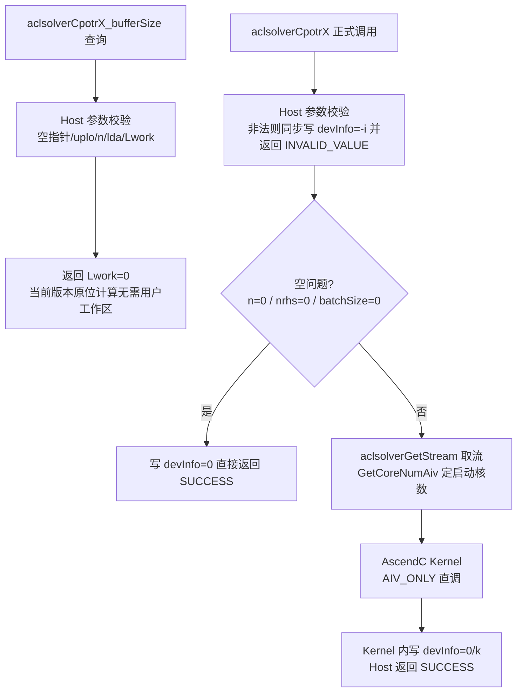

# 单精度复数Cholesky分解、求解和批量接口（950）算子设计文档

> 本文档覆盖设计阶段与实现方案。文中性能相关表述均为设计预算/待实测校准项；
> 精度与性能结论以 Ascend 950PR 实测（社区后台测试）为准，实测后同步更新本文档。

# 需求背景（required）

## 需求来源

本需求来自 2026 年 9 月 CANN 社区任务《单精度复数Cholesky分解、求解和批量接口(950)》任务书。
任务要求在 `cann/ops-solver` 仓库中，面向 Ascend 950PR，以 **ops-solver Host C API + AscendC Kernel 直调**
工程模式，全新实现稠密 Hermitian 正定（HPD）线性求解功能及批量接口，共 5 个计算接口 + 2 个 bufferSize 接口：

| NPU 交付接口 | 对标 CUDA 接口 |
|---|---|
| `aclsolverCpotrf` / `aclsolverCpotrf_bufferSize` | `cusolverDnCpotrf` / `cusolverDnCpotrf_bufferSize` |
| `aclsolverCpotrs` | `cusolverDnCpotrs` |
| `aclsolverCpotri` / `aclsolverCpotri_bufferSize` | `cusolverDnCpotri` / `cusolverDnCpotri_bufferSize` |
| `aclsolverCpotrfBatched` | `cusolverDnCpotrfBatched` |
| `aclsolverCpotrsBatched` | `cusolverDnCpotrsBatched` |

五接口作为同一社区任务一并交付，不拆分验收；验收硬件为 Ascend 950PR。

## 背景介绍

### Cholesky 分解与求解族

Hermitian 正定矩阵的 Cholesky 分解 `A = L·Lᴴ`（LOWER）或 `A = Uᴴ·U`（UPPER）是稠密线性求解的基础路径：
分解一次后，`Cpotrs` 以两次三角回代求解 `A·X = B`，`Cpotri` 以三角求逆（trtri）+ Hermitian 三角乘
（lauum）得到 `A⁻¹`。相比 LU 分解，Cholesky 无需选主元、计算量约减半，且正定性由 `info = k`
（第 k 阶顺序主子式非正定）显式报告。批量接口面向大批独立小矩阵（Device 指针数组寻址），
是图神经网络、贝叶斯推断、信号处理等场景的高频原语。

### ops-solver 仓现状

`ops-solver` 已有 `cgetrf`/`sgetrf`（LU）、`cgetri`/`sgetri`（求逆）、
`cgetri_batched`/`cmatinv_batched`（批量求逆）、`cheevj`（特征分解），**无 Cholesky 原型，本任务全新实现**。
仓内可直接复用的公共设施：

| 公共设施 | 现状 | 本任务动作 |
|---|---|---|
| `aclsolverStatus_t`（状态码族） | `cann_ops_solver_common.h` 已有 | 直接沿用 |
| `aclsolverFillMode_t`（LOWER=0/UPPER=1） | 原定义于 `cann_ops_solver.h` | 上移至 `cann_ops_solver_common.h` 统一维护 |
| `aclFloatComplex` | 仓内无公共定义 | 新增于 `cann_ops_solver_common.h`（`{float real; float imag;}`） |
| `SOLVER_ECHECK` 参数校验宏 | `src/utils/assert.h` | 直接沿用 |
| `PlatformAscendCManager::GetCoreNumAiv()` | 仓内既有用法 | 用于 AIV 启动核数 |
| CrossCore flag 跨核同步 | cgetrf 等 VEC 路径既有用法 | 复用于多核协同 |
| COMPLEX64 c64 utils（分离平面） | `src/utils/kernel/c64/` | 新增 `chol_common.hpp` 共享设备库 |

### 与 cuSolver 语义对齐要点

- 矩阵、右端、Workspace、devInfo/infoArray 均为 **Device 侧指针**；Aarray/Barray 为 **Device 侧指针数组**。
- 列主序（column-major），leading dimension（lda/ldb）允许大于 n（padding）。
- devInfo 契约：`0` 成功；`k > 0` 第 k 阶顺序主子式非正定（potri 为因子第 k 个对角元为零）；`-i` 第 i 个参数非法（不计 handle）。
- 空问题（n=0 / nrhs=0 / batchSize=0）返回成功并写 info=0。
- `CpotrsBatched` 仅支持 `nrhs = 1`。

# 需求分析（required）

## 需求描述

在 `cann/ops-solver` 仓库新增 5 个算子目录（`cpotrf`/`cpotrs`/`cpotri`/`cpotrf_batched`/`cpotrs_batched`），
实现 Host C API 与 AscendC Device Kernel，支持 COMPLEX64（interleaved complex64）列主序输入，
覆盖任务书验收范围（n ∈ [0, 4096]，nrhs ∈ [0, 128]，batchSize ∈ [0, 10^6]），
并提供 Device 指针调用的测试工程与精度验证脚本。

## 需求拆解

- 公共类型补齐：`aclFloatComplex` 入 `cann_ops_solver_common.h`；`aclsolverFillMode_t` 统一维护。
- `cpotrf`：多核右看分块 Cholesky（块宽 64），对角块由 core0 分解，面板 TRSM 与尾部更新按行块分配各核，
  失败（非正定）时按 LAPACK 语义停于第 k 列并写 info=k。
- `cpotrs`：右端列按核分配，每列两次三角解（前代 + 回代，共轭方向由 uplo 决定）。
- `cpotri`：Step1 三角求逆与 Step2 `Tᴴ·T` 合成均为**原位**算法，两步的读集合都会被前序写覆盖，
  跨核拆分存在写后读竞态；当前版本两步均由 block0 串行执行（LAPACK trtri/lauum 原位顺序，正确性优先），
  零对角检测报最小失败列。多核并行化（T 工作区 + 分块 trtri）列为已知性能迭代项。
- `cpotrf_batched`：矩阵按核独立分配（m = blockIdx; m += numBlocks），无核间同步；
  n ≤ 128 整矩阵驻留 UB 快路径，n > 128 单核分块流式回退。
- `cpotrs_batched`：同样的按核独立分配；n ≤ 128 走 UB 驻留三角解，n > 128 走 GM 流式三角解。
- 全部路径确定性：固定数据划分、无原子写竞争，同输入多次运行结果逐比特一致。

# 详细设计（required）

## 算子分析

### 数学公式

- `Cpotrf`（LOWER）：对 `j = 0..n-1`：
  `L[j,j] = sqrt(A[j,j] − Σₖ₍<j₎ |L[j,k]|²)`；`L[i,j] = (A[i,j] − Σₖ₍<j₎ L[i,k]·conj(L[j,k])) / L[j,j]`（i > j）。
  UPPER 与 LOWER 互为共轭转置关系。
- `Cpotrs`（LOWER）：`L·Y = B`（前代），`Lᴴ·X = Y`（回代）；UPPER 次序相反。
- `Cpotri`（LOWER）：`T = L⁻¹`（三角求逆），`A⁻¹ = Tᴴ·T`（只写对应三角）。
- 批量接口：对 batchSize 个独立问题分别执行上述计算，info 按矩阵独立报告。

### 支持数据类型

COMPLEX64（`aclFloatComplex`，interleaved real/imag float32 对），列主序，Device 指针。

### 支持形状/规模

| 参数 | 范围 | 说明 |
|---|---|---|
| n | [0, 4096] | 矩阵阶数；0 为空问题 |
| nrhs | [0, 128] | 仅 Cpotrs；CpotrsBatched 固定为 1 |
| batchSize | [0, 10^6] | 批量接口 |
| lda/ldb | ≥ max(1, n) | 允许 padding |

## 算子实现

### 实现方案

#### 整体执行流程

#### Host 侧设计

**参数校验策略（-i 语义，不计 handle）：**

- `handle == nullptr` → `ACLSOLVER_STATUS_HANDLE_IS_NULLPTR`（无法写 devInfo）。
- `devInfo/infoArray/info == nullptr` → 返回 `INVALID_VALUE`（无处报告 -i）。
- 其余参数按序号检查（uplo=-1, n=-2, A=-3, lda=-4, …），非法时 host 以同步 `aclrtMemcpy`
  写 `devInfo = -i` 并返回 `INVALID_VALUE`。同步写仅发生在拒绝/空问题路径，不影响成功路径性能。
- 空问题：写 `devInfo = 0` 返回 `SUCCESS`，不启动 kernel。

**bufferSize 策略：**

当前版本算法原位（in-place）计算，`Lwork = 0`；`Workspace` 允许传 `nullptr`。
`Lwork > 0` 且 `Workspace == nullptr` 判参数错误；`Lwork < 0` 判参数错误。

**UPPER 统一数值路径：**

uplo=UPPER 时，kernel 先把上三角共轭搬到下三角（`A[j,i] = conj(A[i,j])`，按核分列、读写区域不重叠），
全程以 LOWER 单一路径计算，结束后再共轭搬回。避免维护两套易错的镜像代码，保证两种 uplo 数值一致性。

**cpotri 奇异检测：**

三角求逆遇零对角时，各核把本核最小失败列写入 host 侧预申请的 per-core scratch
（`aclrtMallocAsync` 申请，每核 32 个 int 跨 cache line 防伪共享），第一次跨核同步后由 core0
归约取最小 k 写 devInfo，保证"报最小失败列"的 LAPACK 语义。

#### Kernel 侧设计

**总原则：** 全部 AIV（向量核）实现，`KERNEL_TYPE_AIV_ONLY`。GM 中矩阵为 interleaved complex64 列主序；
UB 内以实/虚双平面存放。所有 GM↔UB 搬运 helper 首尾 `PipeBarrier<PIPE_ALL>`
（v1 正确性优先，后续版本再细化为精确 event flag）。

**GM↔UB 复数搬运（`chol_common.hpp`）：**

- 连续段：`DataCopyPad` 搬 interleaved 到临时区，`GatherMask`（模式 1/2）去交织成实/虚平面。
- 行段（跨步 ld）：`DataCopyPad` 多块搬运（blockLen=8B，srcStride=(ld-1)*8B）。
- 写回：实/虚平面分别以 `DataCopyPad`（dstStride=4B）交错写回 interleaved 布局。
- 块搬运：`CholLoadBlock`/`CholStoreBlock` 按列循环上述原语。

**cpotrf 多核右看分块（块宽 bw=64）：**

1. Phase A（core0）：对角块 `A[k0:k0+bw, k0:k0+bw]` 装入 UB，无分块 potf2 分解，写回；
   遇非正定主元写 `info = k0+f+1`。
2. Phase B（全核）：面板 `A21 = A21·L11⁻ᴴ`，行块（≤64 行）按核轮转分配；
   行内以 `y·L11ᵀ = conj(a)` 前代求解再取共轭。
3. Phase C（全核）：尾部更新 `A22 −= L21·L21ᴴ`，行块按核分配，逐列 `A[i,j] −= Σₜ L21[i,t]·conj(L21[j,t])`。
4. 三个阶段之间以 CrossCore flag 全核同步；info>0 时所有核对失败面板只处理失败列之前的部分
   （bwEff = failK − k0）并统一步调退出，保证同步次数一致、无悬挂。
5. UB 预算 33152 floats ≈ 132.6 KB < 192 KB。

**cpotrs：** 右端列 `c = blockIdx; c < nrhs; c += numBlocks` 按核分配；每列装入 UB，
`CholTrsvUb` 做两次 GM 流式三角解（dot 用向量归约+标量尾，严格不写越界元素）；
core0 写 devInfo=0。共轭方向：LOWER 先 `conjTrans=false` 后 `true`；UPPER 相反。

**cpotri：**

1. Step1（trtri，block0 串行）：列 j 升序，`T[i,j] = −(Σₜ₍ⱼ..i₎ L[i,t]·T[t,j]) / L[i,i]` 自顶向下求解，
  列 j 只读列 t ≥ j（均未被覆盖），单核升序即 LAPACK ztrtri 原位顺序；零对角记录后报最小失败列。
  对角线经标量 `GetValue` 收集（对角步长 (ld+1) 无法由 DataCopyPad/GatherMask 表达，且每 launch 仅一次）。
2. 全核同步 → core0 归约最小失败列写 devInfo → 全核同步。
3. Step2（lauum，block0 串行）：`C = Tᴴ·T` 按 (iTile ≥ jTile) 块对行主序遍历，
  对角块装入 UB 后先将严格上三角清零（GM 上三角为未定义数据，T 在该处恒为 0），
  再共轭转置累加；对角块只写 `i ≥ j`。块对的访问顺序保证被覆盖的瓦片不会被后续瓦片对再读，
  与 zlauum 原位顺序一致。
4. 正确性说明：Step1/Step2 均为原位写，跨核分配会引入写后读竞态（CPU 仿真数值验证中复现并定位），
  故当前版本由 block0 执行；blockDim > 1 时其余核只参与同步与 uplo 转换搬运。
5. UB 预算 40960 floats = 160 KB < 192 KB。

**批量接口（cpotrf_batched / cpotrs_batched）：**

- Aarray/Barray 为 GM 上的 uint64 地址数组，核内 `GetValue(m)` 取地址后 `SetGlobalBuffer`。
- 矩阵按 `m = blockIdx; m < batchSize; m += numBlocks` 分配，核间零同步、天然确定性。
- 快路径（n ≤ 128）：整方阵（含 matRe/matIm 各 128×128 floats）驻留 UB，
  `CholPotf2Ub` / `CholTrsvUbResident` 就地计算；UPPER 在 UB 内标量共轭换三角。
- 回退路径（n > 128）：单核顺序执行与 cpotrf/cpotrs 相同的分块流程（无同步版本）。
- UB 预算 ≤ 41472 floats ≈ 166 KB < 192 KB。
- `cpotrf_batched` 每矩阵独立写 `infoArray[m]`（0 或 k）；`cpotrs_batched` 由 core0 写 `info=0`
  （参数已在 host 全量校验）。

#### 泛化与边界设计

- **lda padding**：所有 GM 寻址均以 `2*(i + j*ld)` 计算，天然支持 lda > n。
- **空问题**：host 短路，不落 kernel。
- **非正定/奇异**：potf2 遇 `!(d > 0)`（覆盖 0、负数、NaN）即停；potri 零对角检测报最小 k。
- **确定性**：固定分核、固定归约顺序（8 对齐主段减半规约 + 标量尾），无原子写、无动态调度。

### 数据检测

- uplo ∈ {LOWER, UPPER}；n ≥ 0；nrhs 范围；lda/ldb ≥ max(1, n)；batchSize ≥ 0；指针非空。
- 批量接口仅校验数组指针本身非空；数组内元素指针为 Device 数据，host 不做解引用校验。

### 支持硬件

| 支持的芯片版本 | 涉及勾选 |
|---|---|
| Ascend 950PR / Ascend 950DT | √ |

### 算子约束限制

- 仅支持 COMPLEX64；列主序；Device 指针。
- `CpotrsBatched` 仅支持 nrhs = 1。
- 当前版本 Lwork = 0（原位算法），后续引入 Cube 分块大图优化时再按 bufferSize 契约扩展。

# 可维可测分析

## 精度标准/性能标准

| 验收标准 | 描述 | 标准来源 |
|---|---|---|
| 精度标准 | 与 complex128 基准对比：rtol = 2⁻¹⁰、atol = 2⁻¹⁶，匹配率 ≥ 99% | 任务书 3.2.1 |
| 性能标准 | NPU 耗时 ≤ GPU 基线 / 0.35（任务书附 bench_result.json 基线） | 任务书 3.2.2 |
| 功能标准 | devInfo 0/k/-i 契约、UPPER/LOWER、lda padding、空问题、确定性 | 任务书 |

## 测试用例规划

| 测试场景分类 | 用例描述 | 规模/属性 | 预期结果 |
|---|---|---|---|
| 基础正向 | cpotrf LOWER/UPPER 分解 | n=32/257/1024 | 与 complex128 基准匹配率 ≥ 99% |
| 基础正向 | cpotrs 多右端求解 | n=32, nrhs=4 | 同上 |
| 基础正向 | cpotri 求逆 | n=32/128 | 同上 |
| 批量 | cpotrf_batched 快路径 | n=32, batch=8 | 每矩阵 info=0，精度达标 |
| 批量 | cpotrs_batched 快路径 | n=32, batch=8 | 同上 |
| 边界 | 空问题 | n=0 / nrhs=0 / batchSize=0 | 返回 SUCCESS，info=0 |
| 边界 | lda padding | lda = n+16 | 结果与 lda=n 一致 |
| 异常 | 非正定矩阵 | A 对角置负 | info = k（最小失败阶） |
| 异常 | 非法参数 | uplo 越界/lda<n/nrhs≠1(batched) | 返回 INVALID_VALUE，info=-i |
| 确定性 | 同输入重复运行 10 次 | n=256 | 输出逐比特一致 |

## 兼容性分析

新增接口与新增目录，不改动既有算子路径；`aclsolverFillMode_t` 上移至公共头（原头保留包含关系），
对既有调用方源码兼容。

## 风险与降级预案

- **编译风险（已闭环）**：初版按仓内既有 AscendC 用法编写，随后在
  `cann:9.2.0-beta.2-950-ubuntu22.04-py3.12-devel` 容器中完成两轮全量编译：
  第一轮暴露 2 处问题（CANN 驱动 API 无 `aclrtMallocAsync/aclrtFreeAsync`，已改用仓内既有的
  `aclrtMalloc/aclrtFree` + stream 同步；kernel 编译单元不应包含 `utils/gm_addr.h`，已按仓内
  cheevj/cgetrf 惯例改为本地守卫定义），修复后 `libops_solver.so`（含全部既有算子）与
  5 个测试二进制均零 error 零 warning 通过。复现步骤见私仓 `task_submission/0-容器编译复现说明.md`。
- **数值正确性风险（已闭环）**：在 tikicpulib CPU 仿真环境（`Ascend950PR_9599`，AIV 模式）中
  对五接口逐一做了 kernel 级数值验证，判定口径与任务书 3.2.1 相同（complex128 基准，
  rtol=2⁻¹⁰、atol=2⁻¹⁶、匹配率 ≥ 99%）。覆盖：cpotrf n=150 LOWER/UPPER（blockDim=1/4）与
  分块回退 n=200；cpotrs n=150、nrhs=4 LOWER/UPPER；cpotri n=32/150 LOWER/UPPER；
  cpotrf_batched 快路径 n=32×4 与回退 n=200×2；cpotrs_batched 快路径 n=32 LOWER/UPPER 与
  回退 n=140×2 LOWER/UPPER。**全部用例 0 个超标元素（匹配率 100%）通过**。
  仿真过程中发现并修复了四类真实缺陷（这些缺陷在真机上同样会出错）：
  ① cpotri Step1/Step2 原位算法的跨核写后读竞态（改为 block0 串行原位顺序）；
  ② cpotri 对角收集原语步长错误（对角步长 (ld+1) 超出 DataCopyPad/GatherMask 表达能力，改标量收集）；
  ③ lauum 对角块装入时 GM 未定义上三角混入累加（装入后 UB 内清零）；
  ④ UB 未对齐切片与小/跨步拷贝的边界行为（标量兜底 + 插排后块拷贝）。
  仿真工程与用例数据随私仓提交（`test/cpu_sim/`），可一键复现。
- **真机正确性（已闭环，2026-10-10）**：在 CANNLab 云环境（Ascend 910B3 × 1，CANN 9.0.0，
  aarch64）按 `--soc=ascend910b` 全量编译（零 error），五接口 × LOWER/UPPER × 多规模
  （n=128/512/1024，批量 64×16 与 128×4）共 20 个用例真机运行，判定口径同任务书 3.2.1，
  **20/20 全部 0 个超标元素（匹配率 100%）通过**（私仓 `task_submission/2.3-真机验证日志-910B.log`）。
  真机验证定位并修复了一类仿真无法暴露的缺陷：uplo=UPPER 的三角共轭搬移原先按行标量写 GM，
  其写缓冲与分解阶段 MTE3 块拷贝无顺序保证，滞后标量写会覆盖已分解数据（910B 实测 UPPER 全错、
  LOWER 正常）；已改为瓦片式共轭转置（`CholMoveTriangleConj`），全部 GM 访问均为连续列
  DataCopyPad，与分解阶段同一同步语义。修复后 UPPER 全部通过、LOWER 回归无变化。
  910B 验证为硬件相关正确性的补充证据，验收仍以 950PR 后台测试为准。
- **大 n 性能风险**：v1 为全 AIV 向量方案，cpotrf 大 n（如 n=2048/4096）的尾部更新为秩-1 向量更新，
  可能不优于 GPU 基线的 0.35 倍门禁；预案（已识别的迭代项）：Phase C 改用 Cube 核 HERK
  （复用仓内 `c64/gemm.hpp` 的 MIX 路径），Panel TRSM 保持 AIV；小中规模 n 与全部批量路径维持 AIV。
- **同步开销风险**：v1 全量 `PipeBarrier<PIPE_ALL>` 偏保守，小 n 时延偏高；
  预案：替换为精确 MTE2/V/MTE3 event flag 对，并裁剪冗余 barrier。
- **精度风险**：归约顺序固定但非 Kahan，极端病态矩阵（κ 接近 1/eps）可能超差；
  预案：对 dot 归约加补偿求和路径，由精度用例门禁。

# 附录：修订记录

| 日期 | 修订版本 | 修改描述 | 作者 |
|---|---|---|---|
| 2026-10-08 | v1.0.0 | 初稿：需求分析、五接口 Host/Kernel 设计、测试规划与风险预案 | gcw_CIYgiXyJ |
| 2026-10-09 | v1.1.0 | 补充容器编译验证结论与复现指引；按评审意见迁移至任务编号目录 | gcw_CIYgiXyJ |
| 2026-10-10 | v1.2.0 | cpotri 改为单核原位串行方案（修复跨核写后读竞态）；补充 CPU 仿真数值验证结论（五接口全路径 100% 匹配）与缺陷修复记录 | gcw_CIYgiXyJ |
| 2026-10-10 | v1.3.0 | 补充 910B3 真机数值验证结论（20/20 用例 100% 匹配，LOWER+UPPER 全覆盖）；修复仅真机可见的 uplo=UPPER 三角搬移写序缺陷（改为瓦片式共轭转置） | gcw_CIYgiXyJ |
| 2026-10-08 | v1.1.0 | 编译风险闭环：CANN 9.2 容器全量编译通过（含既有算子），修复 2 处工具链适配问题 | gcw_CIYgiXyJ |
