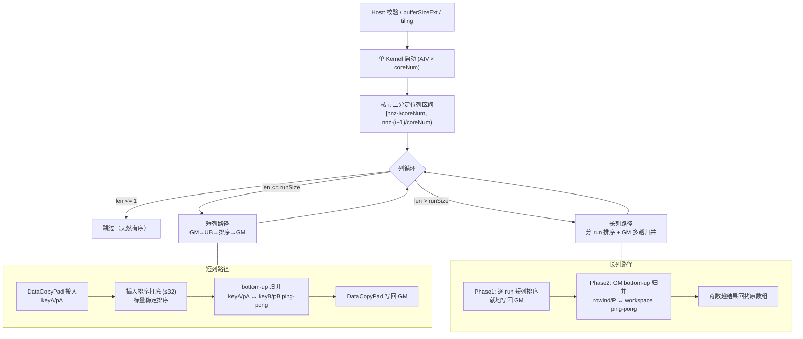
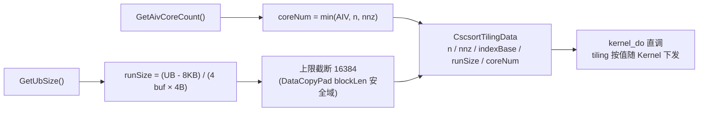
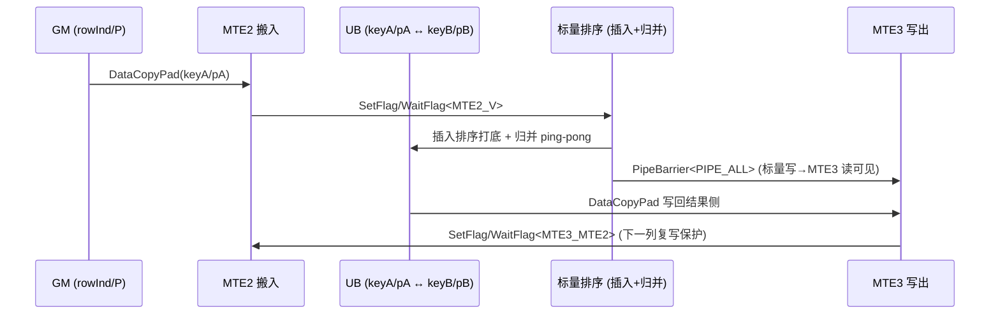
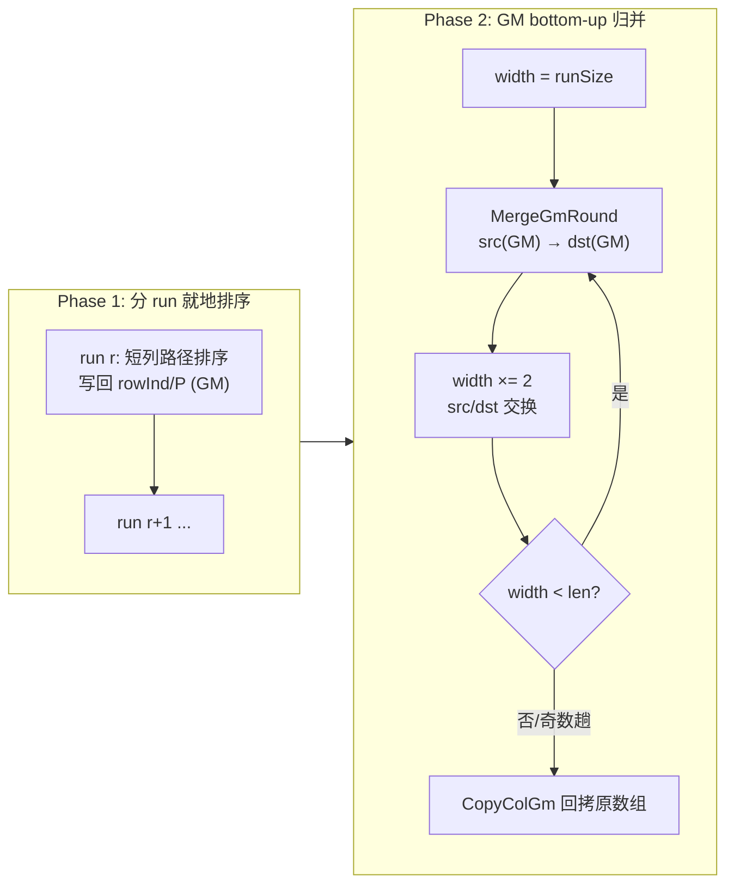

# 需求背景（required）

## 需求来源

本需求来源于 CANN 社区任务 2026 的 9 月任务——**aclsparseXcscsort 算子开发（A2/A3）**。任务要求基于 `cann/ops-sparse` 工程，在 `sparse/cscsort/arch22/` 目录使用 Ascend C 实现 CSC 纯索引稳定排序算子，并沿用 `include/cann_ops_sparse.h` 中已有的公共接口：

```cpp
aclsparseStatus_t aclsparseXcscsort_bufferSizeExt(
    aclsparseHandle_t handle, int m, int n, int nnz,
    const int *cscColPtr, const int *cscRowInd,
    size_t *pBufferSizeInBytes);

aclsparseStatus_t aclsparseXcscsort(
    aclsparseHandle_t handle, int m, int n, int nnz,
    const aclsparseMatDescr_t descrA,
    const int *cscColPtr, int *cscRowInd, int *P, void *pBuffer);
```

适配硬件为 Atlas A2 训练系列产品与 Atlas A3 系列产品（DAV_2201，`arch22`）。算子语义对齐 cuSPARSE `cusparseXcscsort`：bufferSizeExt、执行阶段、CSC 描述符、index base、workspace、stream 和错误处理保持接口语义一致。本算子仅处理 I32 索引，不存在 values 或 compute dtype。

本文档按照 CANN 社区任务算子设计文档模板编写。实现文件为：

- `sparse/cscsort/arch22/cscsort_host.cpp`：参数校验、tiling 计算与 Kernel 启动；
- `sparse/cscsort/arch22/cscsort_kernel.cpp`：设备端分核、短列 UB 内稳定排序与长列 GM 多 run 归并；
- `sparse/cscsort/arch22/cscsort_kernel.h`：`kernel_do` 声明（Host/Kernel 共用）；
- `sparse/cscsort/arch22/cscsort_tiling_data.h`：Host 与 Kernel 之间的 POD tiling 数据结构；
- `sparse/cscsort/arch22/cscsort_tiling_utils.h`：`runSize` 反推计算；
- `test/cscsort/arch22/cscsort_test.cpp` + `cscsort_golden.h`：C++ UT 与独立 golden。

## 背景介绍

### aclsparseXcscsort 算子功能

对 CSC（Compressed Sparse Column，压缩稀疏列）矩阵每一列区间内的行索引执行**原地稳定升序排序**，并使用相同排列同步重排调用方提供的置换向量 `P`。对第 $j$ 列：

$$
\begin{aligned}
I_j &= [\,\text{cscColPtr}[j]-base,\ \text{cscColPtr}[j+1]-base\,) \\
\text{cscRowInd}'[I_j] &= \mathrm{stable\_sort}(\text{cscRowInd}[I_j]) \\
P'[I_j] &= P[I_j[\sigma(k)]]
\end{aligned}
$$

其中 $\sigma$ 为稳定排序置换。当 `P` 初始化为 $0..nnz-1$ 时，排序后满足 $\text{sortedVal}[i] = \text{origVal}[P[i]]$，调用方可据此同步重排稀疏矩阵的值数组。`cscColPtr` 只读；`cscRowInd`、`P` 原地更新。

### 任务要求与现有能力分析

| 参数 | 参数含义 | 输入/输出 | 约束 |
| --- | --- | --- | --- |
| `m`/`n`/`nnz` | 行数、列数、非零数 | 属性 | 非负；`m=0` 或 `n=0` 时 `nnz` 必须为 0 |
| `descrA` | Legacy 矩阵描述符 | 输入 | 提供 index base（0 或 1） |
| `cscColPtr` | CSC 列偏移 | 输入（只读） | 长度 `n+1`，单调非降；base=0 端点为 `0/nnz`，base=1 端点为 `1/nnz+1` |
| `cscRowInd` | 行索引 | 输入输出（原地） | 长度 `nnz`，换算后位于 `[0,m)` |
| `P` | 置换向量 | 输入输出（原地） | 调用方初始化（通常 identity），同步重排 |
| `pBuffer` | workspace | workspace | `bufferSizeExt` 查询值，128 字节对齐 |

`ops-sparse` 仓库已有 arch35（Ascend 950，DAV_3510）实现，本任务以其为复用基线新增 arch22。经开发前在目标硬件上的头文件与实测验证，两个硬件范围的 Kernel 能力存在本质差异：

| 能力 | arch35（950） | arch22（A2/A3，DAV_2201） | 对本算子的影响 |
| --- | --- | --- | --- |
| `AscendC::Sort<int32_t>` 高级 API | 支持（RADIX_SORT，稳定升序） | **不支持**：`sort.h` 仅在 `__NPU_ARCH__ == 3510/5102/3003/3113` 下编译实现 | arch35 短列"UB 内调 Sort"路径不可移植，排序须自实现 |
| SIMT（`__simt_vf__`/`asc_vf_call`） | 支持 | **不支持**：`asc_vf_call` 在 2201 上为空实现 | arch35 长列 SIMT merge-path 不可移植，长列须改为纯 SIMD/标量方案 |
| `Scatter` 向量 API | 支持 | **不支持**：dav_c220 实现为 `ASCENDC_REPORT_NOT_SUPPORT` | 置换应用方式受限，`Gather`/标量访问仍可用 |


# 需求分析

## 需求描述

在 Atlas A2/A3（DAV_2201）上使用 Ascend C 实现功能完整、异步执行的 `aclsparseXcscsort` 与 `aclsparseXcscsort_bufferSizeExt`。实现需要满足以下目标：

1. 公共 API 签名、状态码、两阶段调用（bufferSizeExt → 执行）与 cuSPARSE 语义一致；
2. 精度与 CPU 稳定排序 Golden **exact match**（纯 I32 索引，无浮点容差）；
3. 覆盖空矩阵/空列、`nnz=0/1`、重复索引稳定性、单长列、多 run 归并、多核切分与 runSize 边界；
4. P 为调用方初始化的输入输出置换向量（非 workspace）；pBuffer 须 128 字节对齐；
5. 通过 handle 绑定的 stream 异步启动，不引入 Host 同步，核心计算全部在 NPU 完成；
6. A2/A3 与 A5（arch35）公共排序逻辑目录级解耦，支持交叉回归。

## 需求拆解

1. **接口与参数处理**
   - 校验 handle、维度、描述符、指针与 pBuffer 对齐；
   - `nnz=0` 时 `bufferSizeExt` 返回 0 字节、排序接口直接成功返回（早退，不启动 Kernel）；
   - workspace 按 `2*nnz*sizeof(int32_t)` 精确计算并对 `size_t` 溢出显式检查。
2. **arch22 能力适配**
   - 排序原语完全自实现：插入排序（`len<=32`）打底 + bottom-up 两路稳定归并；
   - key 与 payload P 始终成对搬运，归并比较 `left <= right` 取左保证稳定性。
3. **双路径设计**
   - 短列（`len <= runSize`）：GM→UB→GM 单趟完成，UB 内排序；
   - 长列（`len > runSize`）：按 runSize 分 run 在 UB 内排好写回 GM，再在 GM 原数组与 workspace 之间多趟归并。
4. **多核切分**
   - 以累计 nnz 为权重切完整列区间到各 AIV，列边界二分定位，单列不拆分，核间零同步；
   - 启动核数不超过 `min(n, nnz)`，空列矩阵不浪费算力。
5. **精度与性能验证**
   - C++ UT 46 用例（功能/边界/白盒/异常/性能锚点）作为精度门禁；
   - 官方 `benchmark_sparse_ops_npu.py` 三锚点 P-01/P-02/P-03 以 0.25×GPU 标杆为验收线。

# 详细设计（required）

## 算子分析

### 数学公式

对每列 $j\in[0,n)$，记列区间 $I_j$，求该区间上的稳定排序置换 $\sigma$（相等键保持原相对顺序），使得：

$$
\text{cscRowInd}'[I_j[k]] = \text{cscRowInd}[I_j[\sigma(k)]],\qquad
P'[I_j[k]] = P[I_j[\sigma(k)]]
$$

排序键为 int32 行索引，纯整数比较，无浮点参与：精度语义即与 CPU 稳定排序 Golden 的 **exact match**（行索引序列、置换序列、逐列边界逐项一致），相同输入重复执行 bit-wise 一致。

### 计算量分析

设总列数为 $n$、第 $j$ 列长度为 $l_j$、单核 run 容量为 $R$（runSize）。短列路径的排序在 UB 内完成：插入排序打底规模为 $b=\min(l,32)$，其上再做 $\lceil\log_2(l/b)\rceil$ 趟归并；长列路径增加 GM 侧 $\lceil\log_2(\lceil l/R\rceil)\rceil$ 趟归并。三锚点场景的列长分布（均匀、均值 18–224）全部落在短列路径，性能主战场即为短列路径的单列处理开销。### 支持数据类型

| 对象 | 数据类型 | 说明 |
| --- | --- | --- |
| `cscColPtr`/`cscRowInd`/`P` | int32 | 纯索引算子，无 values dtype |
| UB 缓冲 | int32 ×4 | keyIn/pIn/keyOut/pOut ping-pong |
| workspace | int32 ×2·nnz | scratchRowInd + scratchP |

### 支持形状

- `m`、`n`、`nnz` 为运行时非负整数；`n` 与 `nnz` 可达 int32 正值范围；
- 支持空矩阵、全空列、单元素列、重复行索引、单长列（可达 `nnz`）；
- index base 0/1，仅影响列偏移换算，不影响排序逻辑。

## 算子实现

### 实现方案

整体数据流与双路径结构如下：



#### 3.2.1 host侧设计

##### 1. 参数校验

`ValidateCscsortCommonParams` 在任何 Kernel 启动前完成：

1. handle 为空返回 `ACL_SPARSE_STATUS_HANDLE_IS_NULLPTR`；
2. `m/n/nnz` 为负、空矩阵（`m=0` 或 `n=0`）但 `nnz≠0` 返回 `ACL_SPARSE_STATUS_INVALID_VALUE`；
3. `n>0` 时 `cscColPtr` 非空、`nnz>0` 时 `cscRowInd` 非空；
4. `bufferSizeExt`：`nnz=0` 置 0 字节；否则返回 $2\cdot nnz\cdot 4$ 字节，并对 `size_t` 溢出显式检查（`ACL_SPARSE_STATUS_INSUFFICIENT_RESOURCES`）；
5. 执行接口：`descrA` 非空且 `indexBase ∈ {0,1}`；`nnz=0` 直接成功返回；`P`/`pBuffer` 非空；`pBuffer` 128 字节对齐，否则返回 `ACL_SPARSE_STATUS_INVALID_VALUE`。

校验逻辑与 arch35 保持逐条一致（硬件无关），保证两个架构的接口行为可交叉回归。

##### 2. tiling 策略



- **核数选择**：`coreNum = min(GetAivCoreCount(), min(n, nnz))`。每个非空列最多形成一个独立任务，限制启动核数不超过 `nnz`，避免大量空列矩阵启动无实际工作的 AIV。平台信息经 `PlatformAscendCManager` 获取，硬件无关。
- **runSize 反推**（`CscsortTiling::FindMaxRunSize`）：UB 需要 4 个 run 级 int32 buffer（keyIn/pIn/keyOut/pOut，归并 ping-pong），另预留 8 KB；同时受单次 `DataCopyPad` blockLen 安全域约束截断到 16384 元素。910B3（UB 192 KB）实测 `runSize=11760`。UB 不足最小 run 时返回 `ACL_SPARSE_STATUS_INSUFFICIENT_RESOURCES`。
- **tiling 出参**（`CscsortTilingData`）：`n / nnz / indexBase / runSize / coreNum`，POD 定长结构按值随 Kernel 启动下发，无额外 H2D 拷贝。

##### 3. tilingKey 规划

**本算子不需要 tilingKey**。短列/长列路径由 Kernel 按每列实际长度运行时自行选择，Host 无需感知列长分布；index base 差异经 tiling 出参 `indexBase` 统一处理。单 Kernel 全场景覆盖，避免多 tilingKey 的二进制膨胀与维护成本。

##### 4. Kernel 启动

按 `tiling.coreNum` 个 AIV block 在调用方 stream 上启动单个 Kernel（`KERNEL_TASK_TYPE_DEFAULT(KERNEL_TYPE_AIV_ONLY)`），全程无 Host 同步。

#### 3.2.2 kernel侧设计

##### 1. 分核策略

以**累计 nnz 为权重**把完整列区间切给各核：核 $i$ 负责元素区间 $[\,nnz\cdot i/coreNum,\ nnz\cdot(i+1)/coreNum\,)$ 覆盖的列，列边界通过在 `cscColPtr` 上二分定位（`FindColBoundary`），**单列不拆分**。各核只访问自己列区间对应的 `cscRowInd`/`P`/workspace 区域，区间天然不相交，核间无任何同步。

##### 2. 核心排序原语：插入排序打底 + bottom-up 两路稳定归并

UB 内单段排序 `SortUb` 分两级：

1. **插入排序打底**：按 32 元素分块做标量插入排序，`key > k` 才前移（严格大于），等值保持原相对顺序——稳定性的第一道保证；
2. **bottom-up 归并**：宽度从 32 起 $\times2$ 倍增，key 与 P 成对搬运，`srcKey <= dstKey` 时取左侧（相等键优先取先出现的 run）——稳定性的第二道保证；ping-pong 双缓冲，趟数为 $\lceil\log_2(l/32)\rceil$。

插入排序打底是性能关键：三锚点场景平均列长 18–224，P-01 绝大多数列 $l\le32$，**一趟插入排序直接完成、零归并趟数**；相比纯归并方案（从宽度 1 起步）省去 $\log_2 32=5$ 趟全量读写。

UB 侧标量读写（`GetValue`/`SetValue`）在 DAV_2201 上读写一致（本实现短列路径全程依赖该语义，46 项 UT 与官方脚本全量验证未发现失配；该结论与部分裸指针方案声称的"标量写 UB 仅 MTE3 可见"不同，推测与其 `__ubuf__` 裸指针与 API 访问混用的路径有关）。

##### 3. 短列路径（len ≤ runSize）

单列一趟 GM→UB→排序→GM，事件屏障按下图流水：



四块 runSize 级 UB 缓冲在 `Init` 阶段一次性分配，列循环内复用，无逐列 `pipe Reset`/`InitBuffer` 开销。

##### 4. 长列路径（len > runSize）

长列为低频路径（仅单列长度超过 UB run 容量时命中），正确性优先：



1. 按 `runSize` 分 run，逐 run 走短列路径就地排好（结果直接写回 GM 原数组）；
2. GM 上做 bottom-up 两路稳定归并（`MergeGmRound`，`__gm__` 标量循环，`srcRow[begin+i] <= srcRow[begin+j]` 取左），src/dst 在原数组与 workspace 间 ping-pong，每趟后 `PipeBarrier<PIPE_ALL>` 保证 GM 标量写读一致；
3. 奇数趟后结果位于 workspace 时回拷到原数组。

workspace 布局：`[0, nnz)` 为 scratchRowInd，`[nnz, 2·nnz)` 为 scratchP，与 `bufferSizeExt` 的 $2\cdot nnz\cdot 4$ 字节精确对应。各核列区间不相交，workspace 按全局偏移分区使用，无需核间协调。

##### 5. 片上资源规划

| 资源 | 用量 | 说明 |
| --- | ---: | --- |
| UB | 4 × runSize × 4 B ≈ 184 KB | keyA/pA/keyB/pB，一次性分配 |
| 寄存器 | 归并头/插入 key+payload | 标量局部变量 |
| workspace (GM) | 2 × nnz × 4 B | P-01 为 4 MB，远小于目标硬件 L2 Cache 容量 |

##### 6. 数据检测

- Host 在 tiling 前检查平台接口返回值（核数/UB 容量为 0 返回 `INTERNAL_ERROR`）；
- UB 容量不足最小 run 时显式返回 `INSUFFICIENT_RESOURCES`，不静默降级；
- 越界行索引属接口前置条件违反，行为不做保证（与 cuSPARSE 一致）。

## 支持硬件

| 支持的芯片版本 | 涉及勾选 |
| --- | --- |
| Atlas A2 训练系列产品（DAV_2201） | √ |
| Atlas A3 系列产品（DAV_2201） | √ |

软件约束：CANN 9.x，ops-sparse `master` 分支。

## 算子约束限制

| 约束项 | 内容 |
| --- | --- |
| 输入输出类型 | 仅 int32 索引，无 values dtype |
| 布局 | 仅 CSC（列指针+行索引），不支持 CSR/COO |
| index base | 0 或 1，来自 `descrA` |
| workspace | 按 `bufferSizeExt` 查询值足量分配，128 字节对齐，不得与输入输出重叠；执行 ABI 不传实际 size，不做欠配检测 |
| 空输入 | `nnz=0` 允许相关数据指针为空；`m=0` 或 `n=0` 时 `nnz` 必须为 0 |
| 异步语义 | Kernel 在 handle stream 上异步排队，API 内不主动同步；读取结果前调用方须同步 stream |
| 结构合法性 | `cscColPtr` 单调非降且端点与 base、`nnz` 一致，由调用方保证 |

# 可维可测分析

## 精度标准/性能标准

| 验收标准 | 描述（不涉及说明原因） | 标准来源 |
| --- | --- | --- |
| 精度标准 | `cscColPtr`/排序后 `cscRowInd`/`P` 与 CPU 稳定排序 Golden exact match；重复执行 bit-wise 一致 | 任务书精度要求 + 生态算子开源精度标准 |
| 性能标准 | P-01/P-02/P-03 各 case 均 ≥ 0.25×GPU 标杆（官方 `benchmark_sparse_ops_npu.py`，torch 设备 Event 口径，预热 10/采样 30 取中位数） | 任务书性能要求 |
| 内存标准 | 方案固有 workspace `2*nnz*4` B（P-01 为 4 MB）不超过目标硬件 L2 Cache 容量 | 任务书内存要求条件 2 |

性能倍率 = 标杆接口 GPU 设备 Event 调用耗时 / NPU 同调用范围总耗时。标杆为 cuSPARSE `cusparseXcscsort`（由官方 `benchmark_cusparse_gpu.cu` 采集，任务书已给出基准值），三个验收锚点为：

| 锚点 | 场景 | dtype/索引 | GPU 标杆 median_us（μs） | 目标 |
| --- | --- | --- | --- | --- |
| P-01 | Llama 3.1 70B MLP维度：CSC `8192×28672`，`nnz=524288` | I32 索引 | 2961.700–2969.300（2 条） | ≥0.25× 标杆 |
| P-02 | Qwen3-235B-A22B MoE维度：CSC `4096×1536`，`nnz=262144` | I32 索引 | 2595.920–2610.350（2 条） | ≥0.25× 标杆 |
| P-03 | DeepSeek-V3 MoE维度：CSC `7168×2048`，`nnz=458752` | I32 索引 | 2780.820–2783.120（2 条） | ≥0.25× 标杆 |

三锚点的列长均匀分布（均值 18–224）全部落在短列路径（`runSize=11760`），性能关键点为短列路径的单列处理开销，设计余量分析见 §3.2.2。实测数据、Profiler 证据与失败项说明将随自测报告提交。

### 测试覆盖

C++ UT（`test/cscsort/arch22/cscsort_test.cpp`，gtest，计划 46 用例）：

| 类别 | 用例（代表） | 覆盖任务书场景 |
| --- | --- | --- |
| 基础功能 | Basic / AlreadySorted / Reverse / DuplicateRows / Base1 / EmptyCols / SingleElemCols / EmptyMatrix | 空矩阵/空列、重复索引稳定性、index base 0/1 |
| P 语义 | NonIdentityP（非 identity 置换输入） | P 为调用方输入输出 |
| 多核/边界 | ManySmallCols / MultiCoreSkewedCols / LargeNnzMultiCore / RunSizeBoundaries / LastColEmpty / SingleRow | 多核切分与 nnz=0/1 |
| 长列/多 run | LongCol / LongColMultiRun / WbMergeTwoRunsNoCopyBack / WbMergeThreeRunsCopyBack / WbMergeFiveRunsNoCopyBack / WbRunSizeExactMultiple | 单长列、多 run 归并、回拷奇偶 |
| 对齐/空闲核 | NonAlignedBuffer / WbAllSingleElemMultiCore / WbEmptyMatrixZeroDims / WbIdleCoresBetweenGaps / WbTailCoreNonAligned | 128B 对齐、空列矩阵、核间隙 |
| 参数异常 | NullHandle / NullBufferSize / InvalidM/N/Nnz / EmptyMatrixWithNnz / NullColPtr / NullRowInd / NullDescr / NullP / NullBuffer | 返回码与输入校验 |

端到端：torch_npu 钩子（`torch.ops.ops_sparse_test.xcscsort_npu`）接入官方 `benchmark_sparse_ops_npu.py` 与 `performance_cases.json`，作为 NPU Dispatch 无 CPU fallback 的证据来源之一；Profiler 证据随自测报告提交。

### 自验证样例（305 条）

与官方用例并列，另建一套确定性自验证样例（固定种子生成，随 PR 以 `test_cases/aclsparseXcscsort_testCase/` 等价结构交付）：`xcscsort_cases.csv` 定义用例，`run_selftest.py` 执行并输出逐 case 结果与 `PASS/FAIL` 汇总。L1 功能用例经 torch 钩子走完整接口流程（bufferSizeExt→workspace 分配→原地排序→P 同步重排），与 CPU 稳定排序 Golden 全序列 exact 比对并做重复执行 bit-wise 一致校验；L2 异常用例经 ctypes 直调 `libops_sparse.so` C API 断言返回码。

| 类别 | 条数 | 覆盖任务书自验证场景 |
| --- | ---: | --- |
| basic（尺寸扫描×base 0/1） | 96 | 随机 CSC、index base 0/1 |
| pattern（dup/sorted/reverse/nearly_sorted/empty_mixed） | 100 | 重复行索引稳定性、空列混合、已排序/逆序 |
| edge（m/n/nnz 为 0 或 1） | 19 | 空矩阵、nnz=0/1、零维 |
| longcol（runSize=11760 边界±1、多 run） | 22 | 单长列、多 run 归并、跨 run 重复键稳定性 |
| multicore（核数边界 39/40/41、不均匀列、空列矩阵） | 26 | 多核切分与多核边界 |
| stability（非 identity P 输入） | 10 | P 为调用方输入输出、重复键稳定语义 |
| iflow（含 P-01/P-02/P-03 三锚点形状） | 8 | 接口流程 + bufferSizeExt 精确值断言（`2*nnz*4`/0） |
| precond（越界行索引） | 6 | 前置条件违反场景，验证不崩溃 |
| invalid（L2 异常） | 18 | 空指针（handle/colPtr/rowInd/descr/P/pBuffer/bufSize 共 7 类）、未对齐 pBuffer（+4B/+64B）、非法 m/n/nnz、非法 index base；ABI 无 size 参数不做欠配检测 |

全部 L1 计算经 NPU kernel 完成（measurement_target 为 libops_sparse.so 的 aclsparseXcscsort C API），无 CPU fallback，可作为 NPU Dispatch 证据之一。

## 兼容性分析

1. **API 兼容性**：复用 `include/cann_ops_sparse.h` 已有声明，零改动，不新增平行接口；
2. **语义兼容性**：参数顺序、校验、状态码、workspace 语义与 arch35 逐条一致，两架构可交叉回归；
3. **工程兼容性**：实现仅增加在 `sparse/cscsort/arch22/`、`test/cscsort/arch22/`，与 arch35 目录平级隔离，CMake 按 `SOC_ARCH_DIRS` 自动选择，不影响其他架构；
4. **stream 兼容性**：使用 handle 已绑定 stream，保持 ops-sparse 异步调用模型；
5. **维护兼容性**：A2/A3 与 A5 任务 PR 先后合入时，后合入方 rebase 处理公共 Host 冲突并完成双向回归（任务书 PR 要求 3）。

参考资料：

1. [CANN 社区任务设计文档模板](https://gitcode.com/cann/cann-ops-competitions/blob/master/04_tasks/01_community-task-2026/resources/design_template.md)
2. `aclsparseXcscsort_A2A3_task_doc.md`（9 月社区任务书）
3. [cann/ops-sparse](https://gitcode.com/cann/ops-sparse)
4. [cuSPARSE cusparseXcscsort 官方文档](https://docs.nvidia.com/cuda/cusparse/index.html#cusparsexcscsort)
5. [生态算子开源精度标准](https://gitcode.com/cann/opbase/blob/master/docs/zh/ops_precision_standard/experimental_standard.md)
