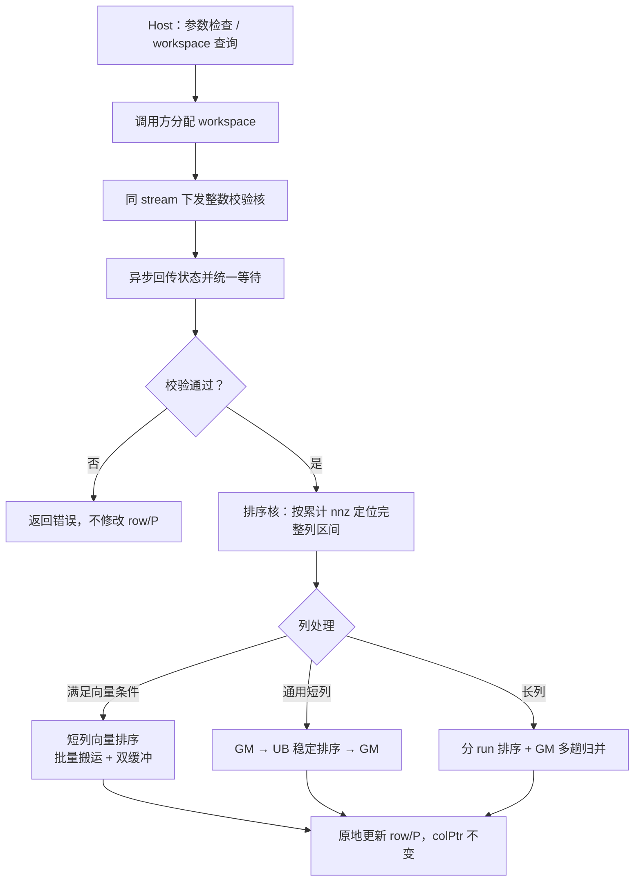
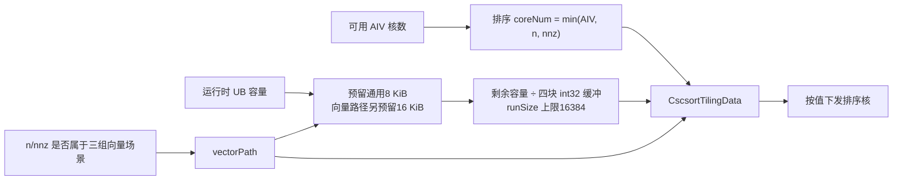
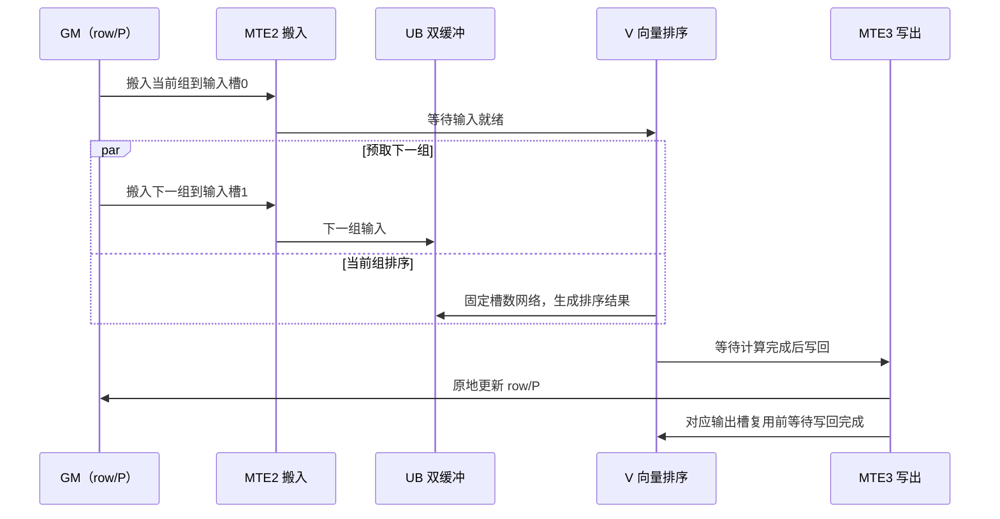
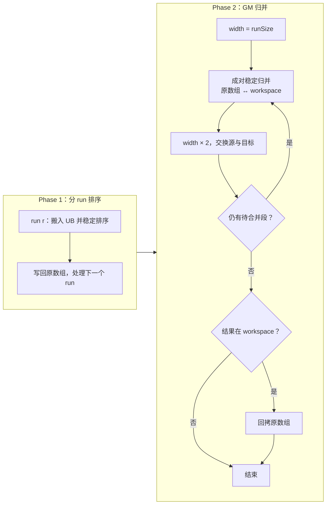

# 需求背景（required）

## 需求来源

本需求来源于 CANN 社区任务 2026 的 9 月任务——**aclsparseXcscsort 算子开发（A2/A3）**。任务基于 `cann/ops-sparse` 工程，在 `sparse/cscsort/arch22/` 使用 Ascend C 实现 CSC 纯索引稳定排序，并沿用 `include/cann_ops_sparse.h` 已有公共接口：

```cpp
aclsparseStatus_t aclsparseXcscsort_bufferSizeExt(
    aclsparseHandle_t handle, int m, int n, int nnz,
    const int *cscColPtr, const int *cscRowInd,
    size_t *pBufferSizeInBytes);

aclsparseStatus_t aclsparseXcscsort(
    aclsparseHandle_t handle, int m, int n, int nnz,
    const aclsparseMatDescr_t descrA,
    const int *cscColPtr, int *cscRowInd, int *P, void *pBuffer);
```

目标硬件为 Atlas A2/A3（DAV_2201，`arch22`）。接口签名、原地稳定排序及 permutation 语义参考 cuSPARSE `cusparseXcscsort`。本设计在排序前主动校验输入，workspace 下限和同步行为以本文说明为准，不宣称与其他架构的执行流程完全一致。本算子只处理 I32 索引，不涉及 values 或 compute dtype。

实现沿用算子目录组织：`cscsort_host.cpp` 负责接口检查、tiling 与启动，`cscsort_validate.h` 负责整数校验核，`cscsort_kernel.cpp` 负责分核和通用排序，`cscsort_batch.h` 负责短列批量向量排序。启动声明、tiling 结构及容量计算分别放在 `cscsort_kernel.h`、`cscsort_tiling_data.h`、`cscsort_tiling_utils.h`；C++ 单测和独立 Golden 放在 `test/cscsort/arch22/`。

## 背景介绍

### aclsparseXcscsort 算子功能

算子对 CSC 每列区间内的行索引执行**原地稳定升序排序**，并使用相同排列同步重排调用方提供的 `P`。`cscColPtr` 始终只读，相同行索引保持原始相对顺序。

当调用方将 `P` 初始化为 $0..nnz-1$ 时，排序后的 `P[i]` 表示输出位置对应的原始非零元素位置，调用方可据此同步重排值数组。`P` 是输入输出，不作为 workspace，也不参与重复键的先后判定。

### 任务要求与现有能力分析

输入由矩阵维度 `m/n/nnz`、CSC 列偏移、行索引、Legacy 描述符和置换向量组成。索引支持 base0/base1，列偏移需单调不减且端点与 base、nnz 一致，行索引换算后位于 `[0,m)`。

仓库已有 arch35（Ascend 950）实现，但其短列高级 `Sort` 和长列 SIMT 方案不能直接移植到目标 arch22。A2/A3 采用自实现的稳定排序原语：通用路径使用插入排序与两路归并，短列密集场景使用 `Gather`、`Min/Max`、`Select` 组成的向量排序网络。

三组目标场景的典型列长为18～224，单列计算量较小而列数较多。设计重点是减少逐元素标量排序、逐列零散搬运、映射初始化和同步开销，同时保留完整整数范围与长列的通用路径。

# 需求分析

## 需求描述

在 Atlas A2/A3 上实现 `aclsparseXcscsort_bufferSizeExt` 与 `aclsparseXcscsort`，复用已有接口，满足以下目标：

1. 按“查询 workspace → 分配 Device 内存 → 执行排序”完成接口流程。
2. 行索引、P 和列指针与 CPU 稳定排序 Golden 精确一致，重复键保持稳定性。
3. 支持空矩阵、空列、nnz=0/1、不均匀列、多核边界、单长列和 base0/base1。
4. 主动检查维度、指针、对齐、重叠、列偏移和行索引范围，非法输入在排序前返回错误。
5. 校验与排序核心在 NPU 执行，使用 handle 绑定的 stream；校验阶段等待状态回传，排序阶段异步下发。
6. 在不改变公共接口和精确排序语义的前提下，降低三组短列场景的执行开销。

## 需求拆解

接口层负责元参数检查、workspace 计算和状态处理。校验核分块读取 Device 数据，使用精确整数比较与归约判定合法性；Host 在同一 stream 排入异步状态回传后统一等待，合法输入才进入排序。

排序核按累计 nnz 分配完整列区间。满足指定 n/nnz、实际列长及编码条件时使用短列向量路径，否则使用通用 UB 排序；长列在分段排序后增加 GM 归并。所有路径均同步重排 P，保持 colPtr 不变。

测试围绕接口流程、I32 精度、重复键稳定性、workspace、回退路径和 stream 并发展开。性能与内存单独采集，NPU Dispatch 和 Profiler 用于核实核心计算执行位置。

# 详细设计（required）

## 算子分析

### 数学公式

对第 $j$ 列，定义起点和长度：

$$
b_j=\mathrm{cscColPtr}[j]-base,\qquad
l_j=\mathrm{cscColPtr}[j+1]-\mathrm{cscColPtr}[j]
$$

令 $\sigma_j$ 为该列的稳定升序排列，则输出满足：

$$
\mathrm{row}'[b_j+k]=\mathrm{row}[b_j+\sigma_j(k)],\qquad
P'[b_j+k]=P[b_j+\sigma_j(k)]
$$

相等行索引按原始列内位置排序。通用归并通过相等优先取左保证稳定性；向量网络通过行索引与原始位置的组合键保证稳定性，P 仅作为载荷搬移。

### 计算量分析

设单列长度为 $l$，UB 单段容量为 $R$。通用路径先按最多32个元素做插入排序，再进行自底向上的归并；长列增加 $\lceil\log_2\lceil l/R\rceil\rceil$ 轮 GM 归并。

短列向量路径使用固定槽数的双调网络。P-01 将八个短列合为一个256路向量块，P-02/P-03 每列使用256个槽位。固定网络减少逐元素标量比较，批量搬运及双缓冲用于摊薄小列的传输和等待成本。

### 支持数据类型

公共输入输出均为 int32：`cscColPtr`、`cscRowInd` 和 `P`。通用 UB 缓冲和排序 workspace 也使用 int32。向量路径内部仅在范围检查通过后，将行索引和原始位置精确编码为 f32 组合键；超出条件时回退，不以浮点近似代替整数排序。

### 支持形状

`m/n/nnz` 为运行时非负 int32。base0 的 nnz 最大为 INT_MAX，base1 最大为 INT_MAX-1；m=0 或 n=0 时 nnz 必须为0。支持空列、单元素列、重复行索引、不均匀列和单长列。

专用向量分支根据 n/nnz 选择，Kernel 仍检查实际列长和键值，不假设相同 shape 的所有输入都满足编码条件。

## 算子实现

### 实现方案

整体数据流如下。校验与排序是两个阶段，非法内容不进入排序路径。



#### 3.2.1 host侧设计

##### 1. 参数校验

Host 检查 handle、描述符、base、非负维度和空矩阵约束；非空输入需提供 row/P/workspace，n>0 时需提供 colPtr。索引与 P 按 int32 对齐，workspace 按128字节对齐，各有效存储区间互不重叠。

查询接口不读取 Device 内容、不同步 stream，返回大小为：

$$
W=\begin{cases}0,&nnz=0\\\max(2048,8\cdot nnz),&nnz>0\end{cases}
$$

其中2048字节容纳最多32个核的校验状态。校验结束后，排序复用同一 workspace。长度计算提升到64位 size_t，并检查乘法与地址区间溢出。

执行接口调用校验核检查 colPtr 首尾、范围、单调性及 row-base 的范围。非法内容返回 `INVALID_VALUE`，不修改 colPtr、row 或 P。nnz=0 时 row/P/workspace 可以为空；n>0 的 colPtr 仍需存在且全部等于 base；n=0 时若提供 colPtr，则检查唯一端点。需要校验但无调用方 workspace 的空矩阵使用临时状态区。

##### 2. tiling 策略



排序核数为 `min(GetAivCoreCount(), n, nnz)`。runSize 根据运行时 UB 容量计算，不写死为某一设备的结果。tiling 包括 `vectorPath / n / nnz / indexBase / runSize / coreNum`。

校验阶段独立使用最多32个 AIV 核，每块512个元素。其分块和核数保持统一配置，不随三组排序槽数变化。

##### 3. tilingKey 规划

不引入额外 tilingKey。Host 通过 `vectorPath` 标记可尝试向量排序的 n/nnz 组合，Kernel 根据实际列长与键值选择路径。base0/base1 通过 `indexBase` 统一处理。

##### 4. Kernel 启动

Host 在调用方 stream 上下发校验核，再排入状态的异步 D2H 回传，统一等待一次。每次调用使用独立锁页内存保存状态，避免不同 handle/stream 并发覆盖；即使回传入队失败，也需等待在途校验结束后再释放内部资源。

校验通过后，在同一 stream 异步启动排序核。接口因此不是全程异步返回：校验阶段同步，排序阶段异步，调用方读取最终结果前仍须同步 stream。

#### 3.2.2 kernel侧设计

##### 1. 分核策略

以累计 nnz 为权重，通过 colPtr 二分定位完整列边界。单列不拆分，各核只访问自己列区间对应的 row/P/workspace；区间互不重叠，不需要核间排序同步。空列和单元素列不执行排序。

##### 2. 核心排序原语：向量网络与稳定归并

向量路径使用 `Gather + Min/Max + Select` 构成双调排序网络。行索引与原始列内位置组合为可精确表示的键，补齐槽位使用哨兵。排序后还原源位置并重排 P，P 的整数值不转换为浮点排序键。

P-01 对应 `(n,nnz)=(28672,524288)`，每列32个槽，连续等长列按8列成组；P-02/P-03 对应 `(1536,262144)`、`(2048,458752)`，每列256个槽。实际行索引达到编码上限、列长超出槽数或不满足分组条件时，按条件进入单列或通用路径，保留完整合法 int32 范围。

通用路径按最多32元素做稳定插入排序，再进行两路归并。插入时仅严格大于才前移，归并时相等优先取左，保证跨段重复键顺序；key/P 始终成对搬移。

##### 3. 短列路径（len ≤ runSize）

短列向量路径合并连续等长列的搬运，复用固定槽数的映射和排序网络。输入、输出采用双缓冲，使当前组排序与下一组预取重叠；每个缓冲槽在对应读写完成后才复用。通用回退复用缓冲区后，重建必要映射。



通用短列执行 GM→UB→稳定排序→GM。缓冲区在 Init 阶段一次性分配，列循环内复用。同步事件按消费者选择：标量排序使用 `MTE2_S` 和 `S_MTE3`，长列后续标量读 GM 前使用 `MTE3_S`；向量路径协调 MTE2/V/MTE3，避免只等待 DMA 却提前由 V 覆写 UB。

##### 4. 长列路径（len > runSize）

长列先分 run 在 UB 内稳定排序并就地写回，再在 GM 原数组与 workspace 之间归并：



归并时相等键优先取左；阶段间保证写回对后续读取可见。workspace 的前 nnz 个 int32 存放 row 镜像，随后 nnz 个存放 P 镜像。各核按全局列区间使用对应偏移，不需要核间协调。

##### 5. 片上资源规划

通用排序使用四块 runSize 大小的 int32 UB 缓冲，保存 key/P 的输入输出并交替复用；另预留8 KiB。向量路径额外预留16 KiB辅助区域，再计算可用 runSize，输入输出槽和映射按用途划分。

校验核每核使用16 KiB UB，包含输入、相邻差分、归约结果和索引映射。GM 状态按每核64字节间隔布局，最多2048字节；校验完成后由排序复用 workspace。非空 workspace 为 `max(2048,8*nnz)` 字节，三组目标场景分别为4、2、3.5 MiB。

##### 6. 数据检测

校验每次通过 DMA 读取当前输入，避免跨调用使用旧的标量 GM 缓存数据。arch22 支持 int32 `Min/Max`，不支持 int32 `ReduceMin/ReduceMax`，因此先用向量比较逐级归约到8个整数，再由标量完成最终判定。列偏移先检查非负范围再计算相邻差分，避免减法溢出。

每次调用重新检查数据，不按 shape、指针或历史调用缓存合法性。排序内部仍检查实际键值是否满足精确编码条件，大整数走通用路径。平台核数或 UB 容量异常返回错误，容量不足不静默使用错误配置。

## 支持硬件

目标平台为 Atlas A2 训练系列产品及 Atlas A3 系列产品（DAV_2201），软件使用 CANN 9.x 和 ops-sparse 工程，采用 Release 构建。A5 继续使用独立的 arch35 实现。

## 算子约束限制

仅处理 CSC 的 I32 索引，不支持 values dtype、CSR/COO 或转置属性。m/n 的表示上限为 INT_MAX，nnz 在 base0 为 INT_MAX、base1 为 INT_MAX-1；这些是接口表示上限，不代表最大规模已完成硬件验证。

workspace 必须足量分配并128字节对齐，不与输入输出重叠。最大查询值为17179869176字节，字节数和地址区间使用64位计算并检查溢出。执行 ABI 没有实际 size 参数，无法可靠检测真实欠配或任意无效 Device 地址，调用方需保证存储可访问。

使用 handle 的 stream，其他 stream 修改同一输入时须建立依赖。主动校验会等待状态回传，排序随后异步执行；此行为需在接口文档中明确。

# 可维可测分析

## 精度标准/性能标准

纯 I32 索引采用 CPU 稳定逐列排序作为 Golden，精确比较 colPtr、row 和 P，并检查重复键稳定性、原地更新及相同输入的重复执行一致性，不适用浮点容差。

性能以 P-01（8192×28672、nnz=524288）、P-02（4096×1536、nnz=262144）、P-03（7168×2048、nnz=458752）为锚点，任务目标为各 case 不低于0.25倍GPU标杆。调优测试使用 base0、原随机数据、torch.npu.Event，同时记录绝对耗时和A100倍率；接入层计时含准备与同步，不作为纯Kernel耗时。Profiler数据与Event计时分开记录。

内存实际查询 workspace，并与设备 L2 容量比较；torch分配器可见峰值另行采集。设计文档仅说明方案和验证口径，实测数值、截图及平台覆盖范围随自测报告交付。

### 测试覆盖

C++ 单测沿用 `test/cscsort/arch22/cscsort_test.cpp` 和独立 Golden，覆盖基础排序、已排序/逆序、重复索引、base1、非identity P、空列与空矩阵、单长列、多run归并及runSize边界。

多核用例覆盖均匀和偏斜列长、空闲核、尾核与workspace区间；接口异常覆盖空指针、负维度、未对齐、非法base及必要参数组合。向量路径需同时检查槽数边界、大整数和长列回退，不能只验证三组常规随机输入。

### 自验证样例

自验证按接口、整数边界、并发和排序专项组织，与 C++ 单测共同覆盖核心场景：117项接口检查、354项整数与分块边界检查、80次独立handle/stream并发调用，以及三组shape各18项排序检查。加上46项C++单测，共651项检查；模块覆盖类别存在交叉，不作为官方ATK用例数。

专项用例使用稳定CPU Golden精确比较row/P/colPtr，并检查非法输入不修改输出。性能、内存及NPU执行证据分别提供可复现脚本。NPU证据通过真实ACL接口调用和msprof任务表对应校验核、排序核的 `AI_VECTOR_CORE` 执行及Runtime下发；Host参数处理与CPU Golden比对不属于核心计算回退。

## 兼容性分析

公开接口复用既有声明，不增加平行接口。A2/A3 与 A5 按架构目录隔离，CMake根据 `SOC_ARCH_DIRS` 自动选择，实现及单测不混入其他算子改动。

稳定排序、P重排和colPtr只读语义保持一致；A2/A3新增主动校验、workspace下限及同步阶段，在算子README和API说明中分别写明，不宣称与A5逐项相同。后续维护需同时验证向量路径和通用回退，保留整数精度与并发语义。

参考资料：

1. [CANN社区任务设计文档模板](../../../../resources/design_template.md)
2. [aclsparseXcscsort A2/A3任务目录](../../)
3. [cann/ops-sparse](https://gitcode.com/cann/ops-sparse)
