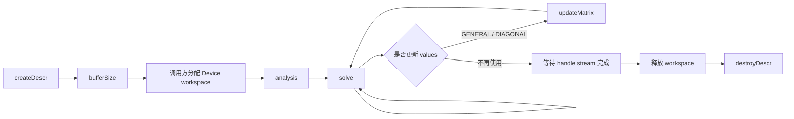
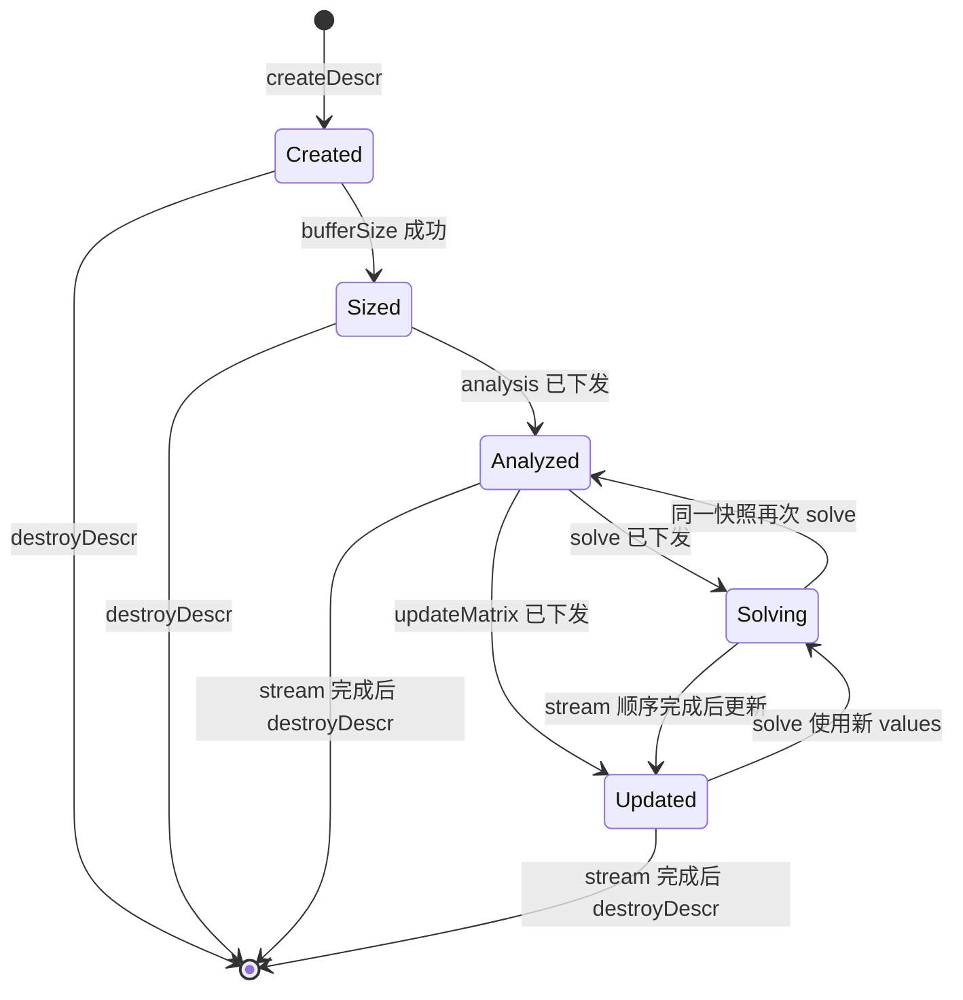
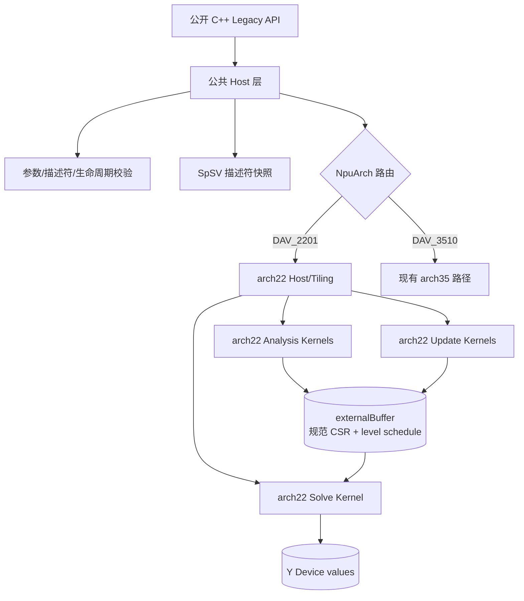
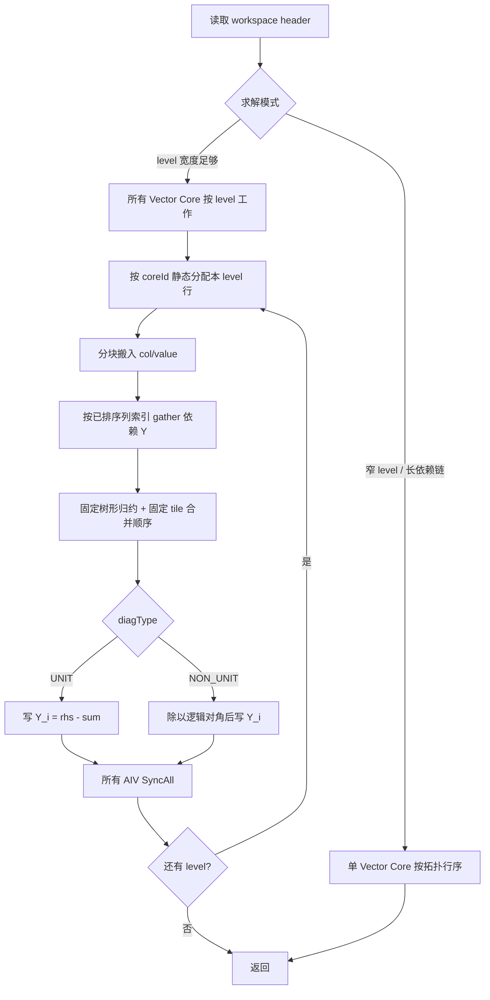

# aclsparseSpSV 算子设计文档（Atlas A2/A3）

# 需求背景（required）

## 需求来源

本设计对应 CANN 2026 年 9 月社区任务“aclsparseSpSV 算子开发（A2/A3）”。目标是在 Atlas A2/A3（`arch22` / DAV_2201）上补齐稀疏三角向量求解能力，并在 `ops-sparse` 中交付公开 C++ Legacy API、Host 参数校验与生命周期管理、Ascend C Kernel、C++ UT/ST、性能脚本和文档。

设计事实来源如下：

1. 任务书 `aclsparseSpSV_A2A3_task_doc.md`；
2. `ops-sparse/include/cann_ops_sparse.h` 中现有公开原型；
3. `ops-sparse/sparse/common/` 中现有 handle、稀疏矩阵、稠密向量和 SpSV 描述符；
4. `ops-sparse/sparse/spsv/arch35/` 的公共生命周期语义和 Host 分层方式；
5. NVIDIA cuSPARSE SpSV 官方接口说明，用于对齐 `bufferSize → analysis → solve → updateMatrix` 生命周期；
6. CANN 9.1.0 的 DAV_2201 Ascend C 头文件及平台信息接口。

本文只给出设计与验证方案，不记录尚未执行的实验结果。

## 背景介绍

### aclsparseSpSV 能力补齐

`aclsparseSpSV` 求解稀疏三角线性方程组：

\[
\operatorname{op}(A)Y=\alpha X
\]

其中 `A` 为 `m × m` 稀疏三角方阵，`X` 和 `Y` 为长度 `m` 的稠密向量。`op(A)` 支持非转置、转置和共轭转置。任务要求支持 CSR、CSC、COO、SLICED_ELL 四种稀疏格式、FP32 与 complex64、LOWER/UPPER、UNIT/NON_UNIT、base 0/1、Host/Device pointer mode、原地求解和矩阵值更新。

### 现状分析

`ops-sparse` 已有 SpSV 公开声明、通用描述符以及 `arch35` 路径，但 A2/A3 构建会选择 `arch22`，不能直接使用 `arch35` Kernel。DAV_3510 的实现采用 SIMT，而 DAV_2201 不具备 SIMT 硬件；因此本设计复用公共 ABI、描述符语义和 Host 校验框架，Device 侧采用 DAV_2201 可用的 Vector Core、GM/UB 搬运和跨 Vector Core 同步重新设计，禁止将 SIMT 代码机械移植到 `arch22`。

现有能力与目标能力的差距如下：

| 项目 | 现状 | 本任务目标 |
| --- | --- | --- |
| A2/A3 构建路径 | 无完整 `sparse/spsv/arch22/` | 建立可编译、可调用的 arch22 Host/Kernel 路径 |
| 数据类型 | 现有路径以 FP32 为主 | FP32、complex64 全生命周期一致支持 |
| 稀疏格式 | 需按平台路径补齐 | CSR、CSC、COO、SLICED_ELL |
| 操作类型 | 需按平台路径补齐 | N、T、H；complex64 的 H 执行共轭 |
| 生命周期 | 公开原型已存在 | Create、BufferSize、Analysis、Solve、UpdateMatrix、Destroy 完整闭环 |
| 确定性 | 需在 arch22 明确定义 | 未排序与重复坐标规范化；Solve 重复执行 bitwise deterministic |
| 执行位置 | 不允许 CPU 代算 | 格式转换、分析和主求解均由 NPU Kernel 完成 |

### 算子功能分析

设规范化后的 `op(A)` 第 `i` 行非对角依赖集合为 `D_i`，对角值为 `d_i`。NON_UNIT 路径逐行计算：

\[
Y_i=\frac{\alpha X_i-\sum_{j\in D_i}a_{ij}Y_j}{d_i}
\]

UNIT 路径忽略稀疏存储中的对角值，并令 `d_i=1`。LOWER 采用前向依赖，UPPER 采用后向依赖；发生 T/H 后有效三角方向翻转。对于 complex64，乘加、缩放和除法均按复数语义执行，H 路径还对 A 的值取共轭。

# 需求分析（required）

## 需求描述

在不改变公开 ABI 的前提下，为 Atlas A2/A3 提供完整、确定、可更新且以 NPU 为主执行的 `aclsparseSpSV`。设计需满足以下约束：

- Device 端规范化索引统一为 I32，输入索引 base 支持 0/1；
- A/X 只读，Y 支持独立输出和与 X 同址的原地输出；
- `bufferSize` 与 `analysis` 允许 `vecX`、`vecY` 描述符为 NULL，`solve` 不允许；
- `analysis` 生成的结构状态、描述符快照和 workspace 由后续 `solve`、`updateMatrix` 复用；
- 所有 Kernel 使用 handle 当前 stream 下发，Solve 异步返回；
- 主求解及格式相关计算不允许 CPU fallback；
- 不依赖输入索引已排序，重复坐标以确定顺序参与计算；
- 参数错误、生命周期错误、结构错误和资源错误返回稳定的 `aclsparseStatus_t`。

## 需求拆解

1. **公开接口**：六个 `aclsparseSpSV_*` 原型与头文件逐字一致。
2. **格式统一**：四种输入格式在 Analysis 中转换为零基、按有效行组织的 `op(A)` CSR。
3. **确定性规范化**：每行按 `(column, sourceOrdinal)` 全序排序；重复坐标保留并按该顺序累加。
4. **依赖分析**：生成对角位置、依赖数、row level、level row list 和求解模式摘要。
5. **arch22 求解**：按 level 并行，一行只由一个 Vector Core 负责；行内固定顺序归约，level 间同步。
6. **复杂数**：complex64 使用显式实虚部计算；H 路径在值物化或更新时共轭。
7. **指针模式**：Host alpha 在调用时读取并写入 tiling；Device alpha 将设备地址传给 Kernel 读取。
8. **生命周期**：缓存矩阵、向量、op、dtype、pointer mode、stream 和 workspace 快照并逐项校验。
9. **更新**：GENERAL 重建规范化值及值相关摘要；DIAGONAL 只替换逻辑对角并刷新对角状态。
10. **可测性**：覆盖四格式、N/T/H、fill/diag、dtype、base、pointer mode、in-place、update 和异常路径。

# 详细设计（required）

## 算子分析

### 数学公式

非转置、转置和共轭转置分别定义为：

\[
\operatorname{op}(A)=
\begin{cases}
A,&\text{N}\\
A^T,&\text{T}\\
\overline{A}^{T},&\text{H}
\end{cases}
\]

对于实数 FP32，T 与 H 数值等价，但仍保留不同枚举并参与一致性校验。对于 complex64，H 必须执行 `a+bi → a-bi` 后再进入求解。

| 记号 | 公开枚举 | 语义 |
| --- | --- | --- |
| N | `ACL_SPARSE_OP_NON_TRANSPOSE` | 使用 A |
| T | `ACL_SPARSE_OP_TRANSPOSE` | 使用 A 的转置 |
| H | `ACL_SPARSE_OP_CONJUGATE_TRANSPOSE` | 使用 A 的共轭转置 |

### 支持数据类型

| A values | X | Y | alpha | computeType | Device 索引 |
| --- | --- | --- | --- | --- | --- |
| `ACL_FLOAT` | `ACL_FLOAT` | `ACL_FLOAT` | FP32 | `ACL_FLOAT` | I32 |
| `ACL_COMPLEX64` | `ACL_COMPLEX64` | `ACL_COMPLEX64` | complex64 | `ACL_COMPLEX64` | I32 |

不允许 A、X、Y、alpha 和 `computeType` 混用不同 dtype。complex64 在 Device 侧按两个连续 FP32 分量解释，不把它降精度为 FP16。

### 支持形状与格式

| 对象 | 形状/长度 | 约束 |
| --- | --- | --- |
| A | `[m, m]` | 二维方阵，`m >= 0` |
| X | `[m]` | stride 为 1，values 位于当前 Device |
| Y | `[m]` | stride 为 1，可与 X 的 values 相同 |
| CSR | row offsets `m+1`，col/value `nnz` | row offsets 单调，首尾与 base/nnz 一致 |
| CSC | col offsets `m+1`，row/value `nnz` | 转为有效 `op(A)` CSR |
| COO | row/col/value `nnz` | 行列索引均在合法范围 |
| SLICED_ELL | slice pointer、column/value slots | slice 数、slice 宽度、padding 和有效槽符合描述符 |

fill mode 之外的存储项不参与计算。UNIT 路径不读取存储对角值。NON_UNIT 缺失或零对角不在 Host 侧伪造错误解，而是让除零按任务约定传播 INF/NAN，并由测试检查。

### 重复坐标语义

同一 `(row, column)` 可出现多次。Analysis 不依赖原始散射顺序，而是以原始物理槽编号 `sourceOrdinal` 作为稳定次关键字；Solve 按 `(column, sourceOrdinal)` 顺序处理，因此重复非对角项等价于固定顺序求和，重复对角项等价于固定顺序求和后作为逻辑对角。该规则保证输入不排序时仍可重复得到相同 bit pattern。

DIAGONAL 更新输入为 `m` 个逻辑对角值。若一行存在多个存储对角槽，更新后第一个规范化对角槽保存新值，其余重复对角槽置零，使逻辑对角恰好等于新值；若 NON_UNIT 行没有对角槽，保持“缺失对角”语义；UNIT 路径继续忽略存储对角。

## 公开接口设计

公开原型保持如下形式，不新增带 workspace 长度或 newValues 长度的变体：

```c
aclsparseStatus_t aclsparseSpSV_createDescr(aclsparseSpSVDescr_t *spsvDescr);
aclsparseStatus_t aclsparseSpSV_destroyDescr(aclsparseSpSVDescr_t spsvDescr);
aclsparseStatus_t aclsparseSpSV_bufferSize(aclsparseHandle_t handle, aclsparseOperation_t opA, const void *alpha, aclsparseConstSpMatDescr_t matA, aclsparseConstDnVecDescr_t vecX, aclsparseDnVecDescr_t vecY, aclDataType computeType, aclsparseSpSVAlg_t alg, aclsparseSpSVDescr_t spsvDescr, size_t *bufferSize);
aclsparseStatus_t aclsparseSpSV_analysis(aclsparseHandle_t handle, aclsparseOperation_t opA, const void *alpha, aclsparseConstSpMatDescr_t matA, aclsparseConstDnVecDescr_t vecX, aclsparseDnVecDescr_t vecY, aclDataType computeType, aclsparseSpSVAlg_t alg, aclsparseSpSVDescr_t spsvDescr, void *externalBuffer);
aclsparseStatus_t aclsparseSpSV_solve(aclsparseHandle_t handle, aclsparseOperation_t opA, const void *alpha, aclsparseConstSpMatDescr_t matA, aclsparseConstDnVecDescr_t vecX, aclsparseDnVecDescr_t vecY, aclDataType computeType, aclsparseSpSVAlg_t alg, aclsparseSpSVDescr_t spsvDescr);
aclsparseStatus_t aclsparseSpSV_updateMatrix(aclsparseHandle_t handle, aclsparseSpSVDescr_t spsvDescr, void *newValues, aclsparseSpSVUpdate_t updatePart);
```

### 生命周期





### SpSV 描述符状态

`aclsparseSpSVDescr` 在公共层保存以下信息，平台差异字段放在 arch22 私有状态中：

| 类别 | 缓存字段 |
| --- | --- |
| 阶段 | `created/sized/analysisEnqueued`、`valueEpoch`、`lastUpdatePart` |
| 调用环境 | handle 身份、stream、pointer mode、目标 NpuArch |
| 矩阵 | matA 描述符身份、m、nnz、format、fill、diag、base、index type、value dtype、结构指针、初始 values 指针 |
| 向量 | Analysis 时非 NULL 的 vecX/vecY 描述符身份、长度、dtype、stride、values 指针 |
| 算法 | opA、computeType、alg |
| workspace | 地址、需求字节数、布局偏移、规范化元素数、分析状态 |
| 更新 | 当前 values 指针、source permutation、逻辑对角映射、值摘要状态 |

Analysis 时 vecX/vecY 为 NULL，则对应快照标记为“未绑定”；Solve 可首次绑定合法向量。Analysis 时非 NULL，则 Solve 必须逐项匹配。无论哪种情况，Solve 均重新校验长度、dtype、stride、Device 地址和 X/Y alias 关系。

### 参数校验与错误码

| 条件 | 返回值 |
| --- | --- |
| handle 为 NULL | `ACL_SPARSE_STATUS_HANDLE_IS_NULLPTR` |
| 描述符、alpha、必需 values、输出指针为 NULL | `ACL_SPARSE_STATUS_INVALID_VALUE` |
| opA、alg、fill、diag、base、updatePart 枚举非法 | `ACL_SPARSE_STATUS_INVALID_VALUE` |
| 非 CSR/CSC/COO/SLICED_ELL、非 I32、非 FP32/complex64 | `ACL_SPARSE_STATUS_NOT_SUPPORTED` |
| A 非方阵、X/Y 长度错误、stride 非 1、索引越界、row pointer 非法 | `ACL_SPARSE_STATUS_INVALID_VALUE` |
| 当前芯片不是 DAV_2201 且无相应已构建实现 | `ACL_SPARSE_STATUS_ARCH_MISMATCH` |
| workspace 计算溢出或目标资源不足 | `ACL_SPARSE_STATUS_INSUFFICIENT_RESOURCES` |
| ACL Runtime、H2D/D2H 状态传递或 Kernel 下发失败 | `ACL_SPARSE_STATUS_EXECUTION_FAILED` |
| Analysis 前 Solve/Update、快照不一致、workspace 改变 | `ACL_SPARSE_STATUS_INVALID_VALUE` |

通过 `aclrtPointerGetAttributes` 校验 A/X/Y、Device alpha、newValues 和 externalBuffer 位于当前 Device 或可管理内存，并检查接口要求的地址对齐。

当前六函数 ABI 没有传入 `externalBuffer` 或 `newValues` 的实际分配字节数，也没有在 raw `void *` 中编码 dtype。实现可确定校验非空、地址空间、对齐、描述符继承 dtype 和期望元素数；若 ACL Runtime 能返回 allocation extent，则继续校验剩余字节数。若运行时只返回地址位置而不返回 allocation extent，实际分配长度仍属于调用方契约，不能在不改变 ABI 的情况下伪造“已精确校验”的结论。`bufferSize` 结果及对应快照会保存在描述符中，Analysis 必须与同一快照匹配。

## 总体架构

### 逻辑视图



公共 Host 层承载 ABI、通用校验、描述符状态机和错误码；`arch22` 只承载平台信息、workspace 布局、TilingData 和 DAV_2201 Kernel。这样避免复制两套生命周期逻辑，并允许 arch35 与 arch22 共同回归。

### 开发视图

```text
ops-sparse/
├── include/cann_ops_sparse.h                 # 原型保持不变
├── sparse/common/aclsparse_spsv_descr.h      # 公共快照与状态机
├── sparse/spsv/common/                       # 可共享校验、workspace 安全算术
├── sparse/spsv/arch22/
│   ├── spsv_host.cpp                         # BufferSize/Analysis/Solve/Update 路由
│   ├── spsv.h                                # arch22 常量与辅助结构
│   ├── spsv_tiling_data.h                    # TilingData 与 workspace header
│   ├── spsv_kernel.h                         # Kernel launcher 声明
│   └── spsv_kernel.cpp                       # 规范化、分析、求解、更新 Kernel
├── sparse/spsv/arch35/                       # 保持现有平台实现
└── test/spsv/
    ├── spsv_golden.h                         # 公共 Golden
    └── arch22/                               # A2/A3 C++ UT/ST
```

若仓库最终选择更细粒度文件拆分，可把 Analysis、Solve、Update Kernel 分文件，但不改变上述模块边界。

## Host 侧设计

### BufferSize

`bufferSize` 不访问 vecX/vecY values，也不读取 alpha 数值。它完成以下工作：

1. 校验 handle、opA、alpha 非空、matA、computeType、alg、spsvDescr；
2. 校验方阵、格式、fill/diag、base、I32 索引和维度可由 Device I32 表示；
3. 用 checked add/multiply 计算 workspace 上界；
4. 按 512 字节对齐各大区、按 32/64 字节对齐内部数组；
5. 缓存本次 size query 的参数快照与 `requiredBytes`；
6. 返回分析阶段峰值和求解持久区二者的最大值。

令 `V=4`（FP32）或 `V=8`（complex64），`n=nnz`。所有输入先规范到 I32，因此核心 nnz 区按下式规划：

\[
W_{nnz}=16n
\]

其组成如下：

| 区域 | 大小上界 | 生命周期 |
| --- | --- | --- |
| canonical column | `4n` | Analysis 至最后一次 Solve |
| source permutation | `4n` | Analysis 至最后一次 Update |
| canonical values | `Vn` | Analysis 至最后一次 Solve |
| sort overlay | `(8-V)n`，下限 0 | 仅 Analysis；与 values 共同组成第二组 `(col, source)` ping-pong |

行级持久区包含两个 row pointer、scatter cursor、diag first/count、row level、dependency count、level rows 等 I32 数组，上界按 `9 × 4 × (m+1)` 预留。再加 workspace header、错误状态和对齐填充：

\[
W=\operatorname{align}_{512}(H)+16n+36(m+1)+W_{align}
\]

`W_align` 由每个子区逐项 `align_up` 精确计算，不使用经验常数覆盖溢出。该布局只保留一份规范化 `op(A)`，不会同时保存 A 和转置 A 两份 values。

按最大性能场景 `m=262144`、`nnz=3932160` 做静态上界核算，nnz 区约 60 MiB，行级区约 9 MiB，加 header 与对齐后仍低于 910B4 的 96 MiB L2 参考容量。该数字是公式核算，不是性能或内存实验结果；实际验收仍以目标设备返回的 L2 信息和内存采集为准。

### Analysis

Analysis 分为同步可观察校验和异步预处理两段：

1. Host 校验描述符元数据、枚举、dtype、地址空间、对齐和 size-query 快照；
2. 在 handle stream 下发结构校验 Kernel，检查 Device 索引内容、CSR/CSC pointer 单调性、COO 范围和 SLICED_ELL 布局；
3. 将 4 字节 validation status 复制回 Host 并只对该校验点建立 stream fence；Host 把状态映射为确定错误码；
4. 校验成功后，按同一 stream 顺序下发格式规范化、分段排序、对角定位和 level schedule Kernels；
5. 缓存描述符、参数、stream 和 workspace 快照，标记 `analysisEnqueued=true` 后返回。

第 3 步是为了满足“Device 索引内容错误在接口返回时可见”。除这一个状态门禁外，预处理和后续 Solve 依靠同 stream 顺序异步衔接；格式转换与依赖分析仍在 NPU 执行，不构成 CPU fallback。

```mermaid
flowchart TD
    A[Analysis Host 校验] --> B[Validation Kernel]
    B --> C[4B 状态回传与校验门禁]
    C -->|失败| E[返回确定错误码]
    C -->|成功| N[生成有效 op(A) triplet]
    N --> H[整数 histogram + prefix]
    H --> R[散射到 CSR row bucket]
    R --> S[分段全序排序\ncolumn, sourceOrdinal]
    S --> V[物化 FP32/complex64 values\nH 路径取共轭]
    V --> D[定位/汇总逻辑对角]
    D --> L[生成 row level 和 level rows]
    L --> Q[写 workspace header]
    Q --> X[Analysis 异步返回]
```

### Solve

Solve Host 路径：

1. 完整校验 vecX/vecY 描述符、values、长度、stride、dtype 和 Device；
2. 对照 Analysis 快照校验 handle、stream、pointer mode、matA 身份与结构、opA、computeType、alg 和 workspace；
3. Host pointer mode 读取 alpha 并写入 TilingData；Device pointer mode 校验地址后传入 Kernel；
4. 根据 workspace header 的分析摘要选择单核顺序路径或 level-parallel 路径；
5. 在 handle stream 下发 Solve Kernel 并立即返回。

Solve 不在 Host 读取 level 数据，不执行 D2H 同步。Analysis 尚未执行完时，handle stream 的先后顺序保证 Solve 只在预处理完成后开始。

### UpdateMatrix

GENERAL 路径按 `sourcePermutation` 从 `newValues[nnz]` 重新物化规范 values；H 路径同时取共轭。随后刷新重复对角汇总、每行有效依赖计数、数值 epoch 和 solve tiling 摘要。结构 row/column 与保守 level schedule 不变，因为接口约定 sparsity pattern 不变。

DIAGONAL 路径读取 `newValues[m]`，按逻辑行更新规范对角并刷新对角缓存、缺失对角标志和数值 epoch。UNIT 路径仍按单位对角求解。

两类更新均使用 handle stream 异步下发；下一次 Solve 通过同 stream 顺序看到完整新值。调用方不得在 Update/Solve 完成前释放或修改 `newValues`。

### Destroy

描述符仅拥有 Host 状态，不拥有调用方 externalBuffer。Destroy 不隐式同步 stream，也不释放 workspace；调用方须先等待关联异步工作完成。对 NULL 描述符保持幂等成功语义。

## Kernel 侧设计

### DAV_2201 路线选择

DAV_2201 使用 Vector Core 的 SIMD/Scalar 控制能力，不使用 `asc_simt.h`、`__simt_vf__` 或 `asc_vf_call`。格式规范化、排序和求解拆成多个普通 Ascend C Kernel，Kernel launch 边界提供阶段间全局可见性；Solve 的 level-parallel 路径在单次持久 Kernel 中使用 `SyncAll<true>()` 作为 level 间屏障。

多核 Solve 的所有已启动 AIV 必须进入每一个 `SyncAll<true>()`：空闲核只跳过行计算，不能提前 return；错误状态也要在统一出口前经过相同屏障。单核路径使用独立 launch，`blockDim=1` 且不调用跨核同步，从而避免窄 level 的屏障开销和死锁风险。

多核路径的 `blockDim` 不超过平台报告的物理 Vector Core 数。若同一设备允许多 stream 并发下发该路径，Host launch 配置必须启用 CANN 对 `SyncAll` 所要求的 batch mode；无法满足时不并发启动多个含硬同步的 Solve Kernel。Kernel 不混用自定义 CrossCore flag，避免占用 `SyncAll<true>()` 保留的 flag 资源。

### 格式规范化

四种格式均转换为零基 `op(A)` CSR：

| 输入格式 | 有效坐标来源 | 规范化处理 |
| --- | --- | --- |
| CSR | row pointer + col index | 展开 row；base 归零；按 fill 过滤 |
| CSC | col pointer + row index | 解释为坐标后按 op 决定是否交换 row/col |
| COO | row index + col index | 校验范围后直接生成坐标 |
| SLICED_ELL | slice pointer + padded slots | 跳过 padding；校验 slice 高度/宽度和有效位置 |

对每个有效物理槽生成 `(effectiveRow, effectiveCol, sourceOrdinal)`。N 路径不交换坐标；T/H 交换 row/column，H 在 values 物化阶段取共轭。输入 fill mode 在交换前过滤，交换后有效 fill mode 翻转。

CSR row histogram 使用 I32 整数原子计数；整数计数结果与执行顺序无关。scatter cursor 只决定未排序的临时槽位，随后分段排序以 `(effectiveCol, sourceOrdinal)` 建立唯一全序，所以原子 scatter 的到达顺序不会影响最终布局或数值顺序。

分段排序采用固定 pass 顺序的 radix/merge 方案：一组 key/permutation 存在 `canonicalCol + sourcePermutation`，另一组复用 `canonicalValues + sortOverlay`。每个 pass 由独立 Kernel 下发，避免在 Kernel 内构造不可证明的全局软屏障。排序结束时结果固定落在 canonical key/permutation 区，再根据 permutation 物化 values。

### Level Scheduling

三角矩阵的有效方向天然给出拓扑序。对 LOWER：

\[
level(i)=1+\max_{j<i,a_{ij}\ne0}level(j)
\]

对 UPPER 反向遍历。UNIT/NON_UNIT 不改变 off-diagonal 依赖。Analysis 先按确定行序计算 `rowLevel`，再构建 `levelPtr` 和按行号稳定排列的 `levelRows`。同时统计 `numLevels`、`maxLevelWidth`、`averageLevelWidth` 和最大行 nnz，写入 workspace header 供 Solve 路由。

### 求解流程



同一行只由一个核写 `Y_i`，不同核不对同一浮点地址做原子累加。行内列索引已排序，tile 顺序、tile 内向量归约树和 tile 间标量合并顺序固定，因此重复运行 bitwise deterministic。level 内的行之间不存在依赖，可并行执行；level 结束后统一同步，保证后续 level 可见。

### 行内计算与 UB 搬运

每行按 `tileEntries` 分块：

1. 连续搬入 canonical column 和 values；
2. 根据排序后的 column 收集已完成的 Y。相邻列优先合并为 32B cache-line 窗口；离散或边界项使用 `DataCopyPad` 的 Ext 参数形态搬入合法字节并在 UB 补齐；所有 UB 队列首址和窗口偏移保持 32B 对齐，`blockLen` 使用字节单位，批量窗口数不超过 API 的 `blockCount` 上限；
3. FP32 执行 `a_ij * y_j`；complex64 展开实虚部：

\[
(a_r+ia_i)(y_r+iy_i)=(a_ry_r-a_iy_i)+i(a_ry_i+a_iy_r)
\]

4. 在 UB 内执行固定归约，并按 tile 编号顺序合并；
5. 读取本行 X、alpha 和逻辑对角，计算 Y 后写回 GM。

禁止在热路径逐元素调用 `GlobalTensor::GetValue/SetValue`；随机依赖读取通过 GM→UB 搬运完成。长行循环复用同一 UB 临时区，不按最大行长度一次性占满 UB。

### complex64 除法

NON_UNIT complex64 使用缩放形式避免直接计算 `d_r^2+d_i^2` 时不必要的上溢/下溢：根据 `|d_r| >= |d_i|` 选择等价分支，分支内 FP32 运算顺序固定。零或缺失对角不提前替换结果，按 IEEE 运算自然传播 INF/NAN；UNIT 不读取该对角。

### 原地求解

当 X/Y values 相同，行 `i` 在写 `Y_i` 前先把 `X_i` 搬入 UB。拓扑依赖只读取已完成行的 Y，不会再需要这些行原来的 X；同一 level 内无相互依赖，因此原地覆盖安全。X/Y 部分重叠但起始地址不同不属于支持的 alias 形式，Host 检测到地址区间重叠时返回 `INVALID_VALUE`。

### 空矩阵与空行

- `m=0`：BufferSize 返回最小 header 或 0（按仓库统一约定），Analysis/Solve 成功且不访问 X/Y；
- `nnz=0, UNIT`：`Y=alpha×X`；
- `nnz=0, NON_UNIT`：按缺失对角的除零语义产生 INF/NAN；
- 普通空行：UNIT 只使用 RHS，NON_UNIT 按缺失对角处理。

## Tiling 设计

### TilingData

Host 下发的 TilingData 至少包含：

| 字段 | 含义 |
| --- | --- |
| `m, nnz, canonicalNnz` | 规模 |
| `dtype, opA, effectiveFill, diagType` | 模板选择和语义 |
| `pointerMode, alphaHost, alphaDevicePtr` | alpha 来源 |
| `blockDim, ubBytes, tileEntries` | arch22 资源与分块 |
| `numLevels, maxLevelWidth, solveMode` | 调度摘要 |
| 各 workspace offset | canonical CSR、permutation、diag、level、status |
| `valueEpoch` | Analysis/Update/Solve 值状态一致性 |

### 多核切分

Host 通过 `PlatformAscendC` 获取实际 Vector Core 数和 UB 容量，不硬编码 20/24/48 核。Analysis 的格式展开、histogram、scatter、排序 pass 和 values 物化按 nnz 连续区间分核；row-level 后处理按行分核。Solve level-parallel 路径按 `levelRows[levelPtr[l]:levelPtr[l+1]]` 静态分配，每个核取得连续且大小相差不超过 1 的行段。

Solve 路由依据 Analysis 摘要：

| 路径 | 触发条件 | 目的 |
| --- | --- | --- |
| single-core | level 基本为单行、同步成本高于并行收益 | 避免每行一次全核屏障 |
| level-parallel | 存在足够宽的 level | 利用多 Vector Core |
| long-row chunk | 单行 nnz 超过 tileEntries | 固定 tile 顺序循环，不增加 UB |

最终阈值由 `numLevels`、`maxLevelWidth`、平均每行 nnz 和平台核数的解析成本模型计算；不把尚未实测的微秒常数写死在 ABI 或文档中。

### UB 规划

令 `U` 为 `GetCoreMemSize(UB)` 返回值，预留 `R=8192` 字节给队列元数据、同步和小标量。令 `V` 为 value 字节数。Solve 的保守上界为：

\[
UB_{solve}(E)=(8+6V)E+R
\]

其中 `E=tileEntries`，并向下对齐到 8 个元素。Host 选择：

\[
E=\operatorname{alignDown}_8\left(\frac{U-R}{8+6V}\right)
\]

| Buffer | 数量 | 大小 |
| --- | ---: | ---: |
| column ping/pong | 2 | `2 × 4E` |
| value ping/pong | 2 | `2 × VE` |
| gathered Y | 1 | `VE` |
| product / real-imag temp | 2 | `2 × VE` |
| reduction scratch | 1 | `VE` |
| 保留区 | 1 | `R` |

FP32 代入 `V=4`，complex64 代入 `V=8`。对 DAV_2201 常见的 192 KiB UB，两种 dtype 均满足上式；实现仍以运行时 U 为准。Analysis 排序的 UB 需求为 `2 × (8+V)E_sort + R`，独立计算 `E_sort`，不与 Solve tile 强行共用。

### 流水线

连续 column/value 使用 ping-pong 队列隐藏 MTE2 与 Vector 计算；gather Y 因依赖地址不连续，在当前 tile 内按有序列索引合并窗口。写回每行仅一个 FP32 或 complex64，采用合法的小块搬运。level 间同步是算法依赖，不能用 Double Buffer 跨越。

## API 与平台核验

| 能力/API | DAV_2201 证据 | 本设计用途 |
| --- | --- | --- |
| `DataCopyPad` | CANN 9.1.0 `basic_api/impl/dav_c220/kernel_operator_data_copy_impl.h` 存在 GM→UB 实现 | 非 32B 整倍数的索引、值和 Y 小块搬运 |
| `SyncAll<true>()` | CANN 9.1.0 `basic_api/impl/dav_c220/kernel_operator_sync_impl.h` 提供 AIV 同步实现 | level-parallel 的 level 间屏障 |
| `GetCoreMemSize(UB)` | `platform_ascendc.h` 公开 Host API | 运行时 UB 分块 |
| `aclrtPointerGetAttributes` | `acl/acl_rt.h` 公开 Runtime API | Device/Managed 地址与 Device id 校验 |
| SIMT | CANN 9.1.0 的 SIMT 实现目录仅面向 DAV_3510；架构资料明确 DAV_2201 无 SIMT 硬件 | arch22 禁用 SIMT 路线 |

实现阶段仍需用目标编译器对每个具体模板签名做编译核验；本表不把未经编译的函数重载标注为已完成。

## 支持硬件

| 支持的芯片范围 | 架构 | 设计状态 |
| --- | --- | --- |
| Atlas A2 训练系列（含任务验收的 910B3、910B4） | DAV_2201 / arch22 | 支持 |
| Atlas A3 训练/推理系列任务环境型号 | DAV_2201 / arch22 | 支持 |

## 算子约束限制

- 仅支持 `ACL_SPARSE_SPSV_ALG_DEFAULT`、Device I32 索引、base 0/1、FP32 与 complex64；其他算法、I64 Device 索引或混合 dtype 返回 `NOT_SUPPORTED`。
- A 必须是方阵；X/Y 为 stride=1 的连续向量。X/Y 只支持完全不同地址或 values 首址完全相同的原地形式，不支持部分重叠。
- externalBuffer 由调用方分配并从 Analysis 保持到最后一个异步 Solve 完成；接口不接管其所有权。
- UpdateMatrix 只更新 values，不允许改变 pattern、维度、格式、索引、fill/diag 或 dtype。
- NON_UNIT 的零或缺失对角按任务契约传播 INF/NAN；UNIT 忽略存储对角。
- 结构预处理与主求解只在 NPU 执行；不存在 CPU fallback。

## 性能优化方案

1. **Analysis 与 Solve 解耦**：格式转换、排序和 level schedule 只在 Analysis 做一次，重复 Solve 直接复用。
2. **单份有效矩阵**：只保存规范化 `op(A)`，避免 N/T/H 同时保留两份 values。
3. **workspace 复用**：complex64 的 values 区在排序阶段作为第二组 `(column, source)` scratch；FP32 只补足差额。
4. **宽 level 并行**：level 内按行多核，行内固定归约；不使用浮点原子。
5. **窄 level 单核**：长依赖链不承担全核 `SyncAll` 成本。
6. **有序 gather 合并**：规范化后的列索引有序，相邻依赖按 cache-line 窗口搬入，减少小 DMA。
7. **更新不重做结构排序**：GENERAL 只按 permutation 物化新值并刷新值相关摘要；DIAGONAL 只改对角。
8. **Host/Device alpha 专路**：Host 标量进入 TilingData，Device 标量由 Kernel 读取，避免错误 D2H。

性能计时严格区分 Analysis、Update 和 Solve。目标倍率按任务书定义为 GPU Event 调用耗时除以 NPU 同调用范围总耗时，P-01、P-02、P-03 的 FP32/complex64 均需达到 0.25 以上；本文不预填 NPU 实测值。

## 一致性与生命周期校验

从 Analysis 到 Solve，以下任一变化均要求重新 Analysis 或返回错误：

- matA 描述符身份、format、m、nnz、结构指针、base、fill、diag、dtype；
- opA、computeType、alg；
- handle 对应 stream 或 pointer mode；
- Analysis 时已绑定的 vecX/vecY 描述符身份及元数据；
- externalBuffer 地址；
- 在未调用 UpdateMatrix 时直接替换 A values 指针。

UpdateMatrix 是 values 变化的唯一受支持入口。它不允许改变 pattern、m、nnz、格式或 dtype。Solve 下发后，相关描述符、A/X/Y values、alpha 和 externalBuffer 必须保持有效，直至 handle stream 中该 Solve 完成。

## 工程兼容性

- `include/cann_ops_sparse.h` 的函数签名和枚举值不变；
- 公共描述符只新增内部字段，不改变外部不透明类型用法；
- arch22/arch35 通过构建系统按 SOC 选择，避免同一目标重复定义符号；
- 公共 Host 校验修改必须回归 arch35；
- arch22 只支持任务规定的 I32 Device 索引，I64 明确返回 NOT_SUPPORTED；
- 不引入 CPU 求解、CPU 格式转换或 Host 保存 O(nnz) 中间结果。

## 兼容性分析

公开函数签名、枚举和不透明描述符用法保持不变，既有调用代码不需要修改。新增状态均为内部字段；公共校验的变更需同时回归 arch35，arch22 与 arch35 由 SOC 构建路由隔离。对任务范围外的格式、dtype、索引类型和算法明确返回既有错误码，不静默改变已有平台行为。

# 可维可测分析

## 精度标准/性能标准

| 验收标准 | 描述 | 标准来源 |
| --- | --- | --- |
| FP32 精度 | float64 Golden；`rtol=2^-10`、`atol=2^-16`、匹配率不少于 0.99，单元素绝对误差不超过 `max(1e-2, 32×ULP(golden))` | 任务书、生态算子开源精度标准 |
| complex64 精度 | complex128 Golden；实部、虚部分别应用 FP32 标准 | 任务书 |
| 确定性 | 同一机器、同一可执行文件、同一输入重复 Solve bitwise 一致 | 任务书 |
| 性能 | P-01/P-02/P-03，FP32/complex64，GPU/NPU 倍率不低于 0.25 | 任务书 |
| 内存 | 按任务书的 500 MB/50% 规则或 workspace 不超过目标 L2 Cache | 任务书 |

## 测试设计

### C++ UT

| 类别 | 用例 |
| --- | --- |
| 接口 | Create/Destroy 幂等、NULL handle/descr/alpha/bufferSize |
| 生命周期 | 未 Analysis 的 Solve/Update、重复 Solve、Update 后 Solve、stream/pointer mode/描述符变化 |
| dtype | FP32、complex64、A/X/Y/computeType 不一致、非法类型 |
| 格式 | CSR、CSC、COO、SLICED_ELL，base 0/1，padding 合法/非法 |
| 三角语义 | LOWER/UPPER、UNIT/NON_UNIT、N/T/H、complex64 共轭 |
| 结构 | 未排序、重复坐标、空行、长行、缺失/零对角、越界索引、非法 row pointer |
| 指针 | Host/Device alpha、X/Y 同址、部分重叠拒绝、非当前 Device 指针 |
| 更新 | GENERAL、DIAGONAL、重复对角、缺失对角、非法 updatePart |
| 边界 | `m/nnz=0/1`、workspace 溢出、最大测试规模 |

### ST 与专项脚本

端到端 ST 使用任务包生成规则和 CPU Golden，覆盖 dtype、format、fill、diag、op、base、pointer mode、in-place 和 updatePart。性能脚本预热 10 次、采样 30 次，分别报告 Analysis、Update、Solve 的 median/P90、workspace 和峰值内存。Profiler 需证明主求解、格式规范化和更新均在 handle stream 的 NPU Kernel 上执行。

### 确定性检查

同一 case 至少重复 Solve 多次并逐字节比较 Y；另外改变 Analysis Kernel 的分核数或原子 scatter 到达顺序，最终规范化 `(column, sourceOrdinal)` 和 Solve 结果仍应一致。该测试专门防止临时 scatter 顺序泄漏到数值归约顺序。

## 可维护性

1. workspace 布局由唯一的 checked-layout 函数生成，BufferSize、Analysis、Solve、Update 共用；
2. dtype、op、format 路由集中定义，避免 Host/Kernel 枚举解释漂移；
3. 规范 CSR 是四格式共同边界，Solve 不再包含输入格式分支；
4. arch22 与 arch35 共享公共校验和状态机，平台 Kernel 独立；
5. 每个 workspace offset、TilingData 字段和错误码均有 UT；
6. 文档中的 Mermaid 图与源码模块一一对应，后续修改生命周期或数据流时同步更新。

## 风险与应对

| 风险 | 影响 | 应对 |
| --- | --- | --- |
| DAV_2201 无 SIMT，随机 gather 效率低 | Solve 性能不足 | 有序列索引、cache-line 合并、宽 level 多核、窄 level 单核、Analysis 复用 |
| level 数过多 | `SyncAll` 开销高 | 独立 single-core 路径，禁止在窄 level 强行满核 |
| 长行超出 UB | 资源超限 | 固定 tile 循环，UB 公式按运行时容量计算 |
| atomic scatter 顺序不稳定 | 破坏 bitwise deterministic | 后续按 `(column, sourceOrdinal)` 建立全序，浮点路径不使用原子累加 |
| complex64 除法数值范围大 | 上溢/下溢和 NaN 差异 | 缩放复除法、complex128 Golden、特殊值专项测试 |
| Device 内容校验与异步语义冲突 | Analysis 无法同步返回结构错误 | 仅对 4B validation status 建立门禁，其余预处理继续异步 |
| raw pointer 无长度字段 | 无法总是精确验证 allocation extent | 使用 Runtime 可见的地址属性；文档明确 ABI 边界，不伪造校验能力 |
| workspace 接近小 SKU L2 | 内存验收失败 | 单份规范 `op(A)`、scratch overlay；按精确公式和实际 SKU L2 复核 |

## 需求追踪

| 任务要求 | 设计承接 |
| --- | --- |
| 四格式与 DEFAULT | 格式规范化、公开接口设计 |
| N/T/H、LOWER/UPPER、UNIT/NON_UNIT | 数学公式、规范化、求解流程 |
| FP32/complex64 | dtype 表、复数乘除、H 共轭 |
| Host/Device pointer mode | Host Solve、TilingData |
| BufferSize→Analysis→Solve→Update | 生命周期图与状态机 |
| NULL vecX/vecY 规则 | 描述符状态、Host 校验 |
| GENERAL/DIAGONAL | UpdateMatrix 设计 |
| 未排序、重复、bitwise deterministic | 全序规范化与确定性检查 |
| A/X 只读、Y in-place | 行内计算、原地求解 |
| stream 异步 | Analysis/Solve/Update Host 设计 |
| NPU 主计算、无 CPU fallback | 总体架构、Kernel 路线 |
| workspace/L2 | BufferSize 公式、内存风险 |
| UT/ST/性能/Profiler | 可维可测分析 |

## 参考资料

1. [CANN 社区任务 2026 设计文档模板](https://gitcode.com/cann/cann-ops-competitions/blob/master/04_tasks/01_community-task-2026/resources/design_template.md)
2. [ops-sparse](https://gitcode.com/cann/ops-sparse)
3. [cuSPARSE SpSV 官方说明](https://docs.nvidia.com/cuda/cusparse/)
4. [生态算子开源精度标准](https://gitcode.com/cann/opbase/blob/master/docs/zh/ops_precision_standard/experimental_standard.md)
