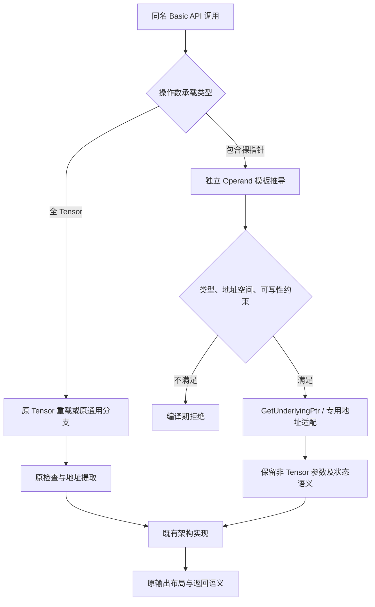

# [Requirement|需求建议]: 【社区任务】Basic API 指针化（VECTOR 分册）设计文档评审申请

# 一、需求描述

## 1.1 需求来源

本需求来源于2026年9月CANN社区任务“Ascend C Basic_API优化实现（VECTOR矢量接口扩展）”。随着算子开发采用裸指针直接管理片上缓冲区，需要扩展现有Basic API的数据入参形式，使开发者能够直接使用 `__ubuf__ T*` 等硬件地址空间指针调用矢量计算接口，并与已有 `LocalTensor` 代码协同使用。

本任务要求在保持原有Tensor接口调用方式和计算语义兼容的前提下，为VECTOR清单中的接口增加指针入参能力，支持同一次调用中各数据操作数独立选择指针或Tensor。扩展应在现有模板封装层完成，复用底层计算实现，保持标量、mask、repeat等参数语义，不因指针适配引入随输入规模增长的额外Device数据拷贝。

本次设计面向Ascend 950系列产品，改造范围以 `basic_api_list_vector_api.xlsx` 为准，共涉及85个接口名称、256条签名和20个头文件，覆盖矢量算术、类型转换、比较选择、归约、索引操作，以及清单纳入的排序、转置等接口。实现代码分别位于asc-devkit的 `include/basic_api` 与 `impl/basic_api`，并基于官方Basic API样例开展迁移验证和原Tensor用例回归。

## 1.2 需求分析

现有 Basic API 大量使用 `LocalTensor<T>` 承载片上数据。接口封装层负责类型、参数和地址处理，再调用对应架构的底层实现。当开发者采用硬件地址空间限定的裸指针管理缓冲区时，固定 Tensor 形参会阻止其直接调用同名 API。

本任务将指针支持下沉到现有封装层，使调用者能够逐个操作数选择 Tensor 或裸指针，并复用现有计算实现。它不是新增一套矢量数学算法，也不新增算子注册、host算子库或独立调度框架。

以 Add 为例，计算仍为 `dst[i] = src0[i] + src1[i]`。变化在于 dst、src0、src1 的承载类型；元素类型约束、mask、repeat、stride、计算次序和结果布局保持原接口语义。其他接口同样继承原有数学定义、舍入/饱和模式和状态作用。

### 功能需求与验收对应

| 编号 | 需求 | 设计响应 | 验证方式 |
| --- | --- | --- | --- |
| R1 | 清单每个重载支持指针与Tensor | 同名受约束适配重载或已有通用模板内编译期分派 | 逐签名编译与有效数值用例 |
| R2 | 同一调用各操作数独立混用 | 每个数据操作数使用独立模板类型 | n个可替换操作数覆盖2^n种有效组合 |
| R3 | 保持旧调用方式与语义 | 保留原Tensor重载、显式模板参数顺序与原Tensor分支 | 原官方样例回归、基线对照、显式模板编译 |
| R4 | 标量、mask、repeat等语义不变 | 非Tensor参数保持原类型、顺序与传递关系 | count、连续mask、bit mask、stride等用例 |
| R5 | 复用底层实现 | 统一取地址后调用原有`*Impl` | 源码评审及后端调用检查 |
| R6 | 不新增规模相关Device拷贝 | 不包装伪Tensor、不复制输入/输出数据 | 地址路径及临时空间审查 |
| R7 | 官方样例可以迁移 | 在原官方工程中替换清单API的数据形参 | 原构建、数据生成和校验脚本回归 |
| R8 | 设计、自测、问题可复现 | 提供范围表、源码、README、日志及问题说明 | 归档检查与社区评审 |

### 范围与非目标

范围严格限定为工作簿列出的接口，包括其中的排序、转置、数值极限、地址辅助及 Fill。任务书概述提及的其他类别不据此自动扩展为额外API清单。DataCopy等非清单接口可被样例调用，但不在本次指针化改造范围内。

| 范围划分 | 清单记录数 | 处理方式 |
| --- | ---: | --- |
| 3510活动设备接口记录 | 236 | 在950工具链下评审指针适配并建立编译/数值覆盖；含本来就接受原始地址数组的接口 |
| 旧架构分支记录 | 18 | Div、Exp、Ln、Sqrt、Rsqrt、Reciprocal的旧非Config形式；在3510不作为独立活动重载，单列适用性说明 |
| CPU_DEBUG记录 | 2 | GetAbsAddr成员/自由形式，在CPU_DEBUG环境验证 |
| 合计 | 256 | 85个名称、20个头文件 |

上述分类是对当前基线的适用性分析，旧架构条目的验收处理需要评审确认。不能把3510选择了其他活动重载的同名调用，标为旧分支已执行。

本设计不改变其他架构的支持范围，不新增隐式类型转换、广播规则或动态内存分配，不承诺所有 `const T*` 输入组合均可用，不承诺跨预编译二进制的 ABI 兼容。对已有合法 Tensor 源码调用的兼容性是必须满足的要求。

# 二、方案设计

## 2.1 接口内部实现

### 总体结构与实现位置

调用链为：`用户API调用 → 重载解析/编译期类型分派 → 元素类型和可写性约束 → GetUnderlyingPtr → 既有架构实现`。

| 层次 | 位置 | 职责 |
| --- | --- | --- |
| 对外接口 | `include/basic_api/`中清单对应头文件 | 保留原声明，增加受约束声明或扩展既有通用模板 |
| 封装实现 | `impl/basic_api/`中对应`*_intf_impl.h` | 提取地址，保留参数语义，调用既有实现 |
| 公共辅助 | `impl/basic_api/utils/kernel_vector_operand.h` | Operand Traits、元素推导、约束和指针提取 |
| 特殊辅助/后端 | 既有排序、转置、CreateVecIndex、SetDeqScale等相关文件 | 消除Tensor地址依赖，不另写数值算法 |
| 测试 | `tests/api/basic_api/`及官方examples对应目录 | 编译约束、指针/Tensor组合、数值和基线回归 |

不引入额外运行时库依赖。模板分派在编译期完成，不因选择Pointer/Tensor而新增按元素运行的分支。

### 接口实现流程



图1 同名接口的编译期分派流程。图中分支描述模板选择，不表示新增逐元素运行时判断；Fill和CPU_DEBUG地址接口按各自地址空间使用专用适配。

### 原实现与扩展方案对比

| 维度 | 原实现 | 扩展方案 |
| --- | --- | --- |
| 数据承载 | 主要固定为LocalTensor | 原Tensor形式保留，增加指针和独立混用 |
| 元素类型 | 原模板T/U约束 | 保留显式T/U，并从独立Operand推导/校验 |
| 地址获取 | Tensor.GetPhyAddr | 统一辅助或特殊接口地址适配 |
| 数值计算 | 原架构实现 | 复用相同实现及数值语义 |
| 内存元数据 | Tensor携带容量/位置等信息 | Tensor保留适用检查；裸指针前置条件由调用方保证 |
| 额外数据复制 | 原算法所需复制 | 不因承载类型适配新增规模相关复制 |


### 各类接口适配

| 类别 | 设计处理 |
| --- | --- |
| 一元、二元、标量、复合算术 | 提取各Local操作数指针，沿用原元素类型关系、scalar和mask/repeat参数 |
| 类型转换与反量化 | 源/目标分别推导，保持RoundMode、饱和和反量化配置；显式T/U语法保留 |
| 比较与选择 | 数据、比较输出mask分别约束类型；保留标量左右位置、Config和scalarTensorIndex语义 |
| Gather/Scatter及布局 | 数据和索引分别约束；保持字节偏移、stride及有效输出区定义 |
| 归约 | 不改变归约次序、有效结果数量及后端允许写入的填充区域 |
| 双输出接口 | dst0、dst1及各src独立选择承载类型；每个写入操作数都检查可写性 |
| NumericLimits | 六个静态成员新增指针形式，用原有数值位模式和Duplicate路径填充 |

### 特殊接口设计

**MrgSort。** 将源列表扩展为 `MrgSortSrcList<T, S0, S1, S2, S3>`，四个源类型分别推导，默认均为原 `LocalTensor<T>`。旧源码 `MrgSortSrcList<float>` 继续可用；混合构造可使用类型推导，推导指引带 `__aicore__`。输出与四个输入形成最多32种承载组合。扩展公共模板可能影响类型修饰名，源兼容和二进制ABI必须分开评审。

**Sort。** 新增原算法辅助函数的指针形式，保留分段排序、合并顺序、索引布局以及既有工作区搬运。不得用另一排序算法代替原实现以规避Tensor参数。

**Transpose与TransDataTo5HD。** 适配基础/增强转置需要的地址辅助函数；区分数据指针数组、UB中的uint64_t地址表、原有uint64_t标量地址数组三种形态。既有原始地址数组形式保持原样。UB地址表按原实现就地编码，因此相关源/目标地址表都必须可写；固定16项地址转换不复制矩阵数据。增强转置工作区按原转置模式和类型计算，例如当前half NCHW2NHWC路径需要 `(cSize+2)*16*16*sizeof(half)`，不能仅按输入字节数分配。

**CreateVecIndex。** 为950实现补充原始UB地址入口，保留起始值、步进和计算形式，避免上层为调用后端而临时包装Tensor。

**SetDeqScale。** 通过调用方提供的uint64_t UB缓冲区写入原格式的16项配置，并更新原内部反量化状态。它是有状态接口，不能只核对最终缓冲区而忽略状态副作用。

**Fill。** 按950现有Cube L1能力新增 `__cbuf__` 指针入口，使用原配置和填充规则。跨Cube/Vector回读测试必须保留正确的事件同步。

**GetAbsAddr。** 成员与自由函数定义放在架构选择后的公共CPU_DEBUG区域，防止3510分支遗漏定义。依据Hardware选择对应CPU仿真缓冲池，检查指针归属并返回与原Tensor形式一致的字节偏移。

### 内存、同步与复杂度

常规适配只进行编译期类型选择和地址提取，不新增随count增长的输入/输出复制，不为裸指针分配Device工作区。原API已有工作区及排序/转置复制保留，不能把算法原有开销误记为新增适配开销。

不添加隐式屏障或改变流水关系。调用者继续负责MTE2/V/MTE3依赖、mask状态、量化状态及跨核同步。指针必须在相关异步操作结束前有效；共享缓冲区别名规则沿用原接口。

## 2.2 接口设计

### Kernel侧接口

采用“保留旧Tensor重载 + 新增受约束指针/混合重载”的方式。新重载至少要求一个操作数是受支持的指针；全Tensor调用继续匹配原接口。对于已经使用通用操作数模板的标量、比较、Select等接口，在原模板中增加 `if constexpr` 指针分支，并保留原Tensor分支。

每个操作数独立设类型。任务书示例用同一个模板参数T承接dst/src0/src1，直接照搬会限制混用，因此本方案以独立Operand类型落实任务书“各操作数可独立选择”的要求。原有显式元素类型、bool及Config参数保持原顺序，新推导参数置后。

公共辅助的职责如下：

| 辅助项 | 作用 |
| --- | --- |
| `Traits` | 识别LocalTensor、UB指针及UB数组；不把任意GM指针当作UB操作数 |
| `DefaultType` / `ElementT` | 区分显式元素类型与从操作数推导元素类型 |
| `HasPointer` | 限制新增重载的参与范围，避免抢占纯Tensor重载 |
| `Matches` / `Primitive` | 根据原接口规则核对基础元素类型 |
| `IsWritable` | 阻止const元素类型作为写入目标 |
| `GetUnderlyingPtr` | 指针直接返回；Tensor调用GetPhyAddr并转换为原硬件指针形式 |
| `FitsCount` | 对适用的Tensor操作数保留容量检查；裸指针容量属于调用前置条件 |

以下为调用方式示意，变量均由调用方分配并满足原API约束：

```cpp
// Existing Tensor calls remain valid.
AscendC::Add(dstTensor, src0Tensor, src1Tensor, count);

// Each data operand may select its own representation.
AscendC::Add(dstPtr, src0Tensor, src1Ptr, count);
AscendC::Add<float, false>(dstPtr, src0Tensor, src1Ptr,
    mask, repeatTime, repeatParams);

// Conversion retains distinct destination and source element types.
AscendC::Cast<half, float>(halfDstPtr, floatSrcPtr,
    AscendC::RoundMode::CAST_NONE, count);
```

不通过构造LocalTensor来伪造容量、位置或生命周期。非法地址、越界和未对齐不能依靠裸指针类型完整检测；调用者必须遵守原底层API的前置条件。错误元素类型、地址空间或只读输出应优先由模板约束拒绝。

#### 代表性接口声明

以下为当前开发分支Add的count形式指针/混合重载，保留真实约束；其余接口按各自元素类型关系适配，不能将Add的同类型规则直接用于Cast或索引接口。

```cpp
template <typename T = VectorOperand::DefaultType,
    typename Operand0, typename Operand1, typename Operand2, typename Std::enable_if<VectorOperand::HasPointer<Operand0, Operand1, Operand2>() &&
        VectorOperand::Matches<VectorOperand::ElementT<T, Operand0>, Operand0>() && VectorOperand::IsWritable<Operand0>() &&
        VectorOperand::Matches<VectorOperand::ElementT<T, Operand0>, Operand1>() &&
        VectorOperand::Matches<VectorOperand::ElementT<T, Operand0>, Operand2>(), int>::type = 0>
__aicore__ inline void Add(
    Operand0 dst, Operand1 src0, Operand2 src1, const int32_t& count);
```

#### 模板参数说明

| 参数 | 说明 |
| --- | --- |
| T、U等原元素类型参数 | 保持原顺序与含义；适用的新增重载使用DefaultType支持自动推导 |
| Operand0、Operand1等 | 数据操作数的独立承载类型；可分别选择合法Tensor或裸指针 |
| isSetMask | 在原接口具有该参数时保留；false形式仍须满足原mask状态前置条件 |
| Config | 保留原配置对象及模板顺序；配置只对原接口支持的形式生效 |
| enable_if约束 | 新重载至少包含一个指针，类型匹配且目标可写；不增加调用方显式参数 |

#### 接口参数说明与Kernel约束


| 参数类别 | 支持形式 | 约束 |
| --- | --- | --- |
| 常规Local数据操作数 | 原LocalTensor或`__ubuf__ T*`，适用时接受UB数组 | 元素类型、对齐、容量、布局和别名条件沿用原API |
| 写入目标/工作区 | 可写Tensor或对应地址空间指针 | 拒绝只读输出；工作区容量由调用方保证 |
| 类型转换源/目标 | 分别具有原接口规定类型的操作数 | 不强制源、目标同类型；保持原舍入和饱和模式 |
| 索引、mask数据缓冲区 | 各自规定元素类型的Tensor或指针 | 索引单位和位布局不变；不能套用数据Tensor的元素类型 |
| scalar、count、mask参数、repeat参数 | 原类型 | 顺序、值域和语义不变，标量不改指针 |
| Fill目标 | 950支持的Cube L1 Tensor或`__cbuf__ T*` | 不把Fill误归为UB操作，不扩展950不支持的L0A/L0B能力 |
| GetAbsAddr | CPU_DEBUG Tensor原形式及指针形式 | 指针默认UB；L1显式指定Hardware，并做对应地址范围检查 |
| 返回值 | 原接口返回形式 | 结果仍写入原dst或按原状态/返回值生效 |

#### 支持硬件与接口限制

目标为Ascend950系列，当前实测950PR/dav-3510。CANN9.1.0属于任务书版本范围；本文不将9.0或其他950型号记为已测试。18条不活动旧架构签名和2条CPU_DEBUG签名按1.2节的范围划分独立处理。

类型、对齐、shape、步长、mask和模式支持范围均以对应接口在目标架构上的原约束为准，不能由“支持指针”推导出额外类型或形状能力。块接口需合法尺寸，例如转置16×16、Sort的32元素块、Interleave偶数长度。工作区、溢出、舍入、NaN和Infinity的处理继承原数值语义。

### Host侧接口

本项目为内联Basic API类型适配，不新增host侧算子、TilingData或TilingKey。用户kernel既有的分核、UB分块、双缓冲、任务调度与生命周期保持不变。host侧测试负责准备输入、执行kernel、回读结果并与参考值比较；这些逻辑不属于生产API新增开销。

本任务不新增临时空间大小查询接口。原API有工作区时继续遵守其容量约定，不因使用指针就声明“零工作区”；零新增适配缓冲与原算法无需工作区是不同概念。

## 2.3 测试用例设计

| 维度 | 计划覆盖 | 判定依据 |
| --- | --- | --- |
| 接口范围 | 每条活动重载、CPU_DEBUG两种形式，旧分支独立说明 | 清单行号与实际实例化/运行日志一一关联 |
| 承载组合 | 全Tensor、全指针、各有效混合组合 | 同输入对照；2^n组合去重后记录 |
| 模板调用 | 推导、显式T/U、bool、Config | 编译通过且未意外匹配其他签名 |
| 操作形式 | count、连续mask、bit mask、合法repeat/stride | 根据重载逐项覆盖 |
| 数值 | 各签名适用dtype、指定shape和值域、合法边界 | golden误差指标及精度判定 |
| 参数约束 | const输出、错误地址空间、类型不匹配等 | 有效对照编译成功，非法调用按预期拒绝 |
| 内存 | 工作区、尾部、输出范围、适用别名 | 原语义约束，禁止越界；允许填充写入区域单列 |
| 原Tensor回归 | 官方原样例在未改基线和修改树上运行 | 原调用可编译，数值和行为一致 |
| 官方迁移 | 同一官方样例改为指针调用 | 原构建、gen_data.py及结果校验完整执行 |
| 头文件来源 | 编译包含树与源码指纹 | 防止误用安装目录中的旧头文件 |

新增独立回归程序用于快速定位混合模板问题，不能代替官方样例迁移。正式回归应保留原工程结构、场景参数和数据脚本，逐场景记录基线Tensor、修改后Tensor、修改后Pointer及必要混合模式，归档构建命令、环境、输入配置、结果和真实截图。

### 代表性精度、边界和异常用例

下表是设计用例，编号不等于已执行日志编号。正式自测需展开到每条适用签名，并记录实际dtype、配置、命令和结果。涉及shape不适用时按原约束说明，不能强行构造非法调用。

| 用例编号 | 测试项 | 输入及调用表达 | 预期/判定 |
| --- | --- | --- | --- |
| VP_001 | Add承载混用 | float；N=1/32/1024/2048；[-100,100]；dst/src0/src1八种组合 | 与主机golden及未修改基线Tensor结果对照 |
| VP_002 | 显式模板兼容 | Add<float>及Add<float,false>；合法mask/repeat；预置mask状态 | 正确实例化，参数语义不变 |
| VP_003 | 一元合法域 | Ln/Sqrt/Rsqrt正值、Reciprocal非零值；四种指定N | 按各重载及标准精度判定 |
| VP_004 | scalar参数保持 | Adds/Muls/LeakyRelu；合法正负标量；指针/Tensor源目标组合 | 标量未被当作地址，结果符合原语义 |
| VP_005 | 转换类型分离 | Cast float→half及原接口支持的其他类型对；原舍入模式 | dtype独立推导，舍入/饱和与参考一致 |
| VP_006 | 比较输出掩码 | Compare/CompareScalar；float输入、原规定mask类型；四种N | 有效mask位与原Tensor结果一致 |
| VP_007 | Select配置 | 数据源指针/Tensor/合法标量；适用的scalarTensorIndex=0/1 | 各Config与左右标量选择正确 |
| VP_008 | 非默认mask/stride | 适用API；合法稀疏bit mask和非默认stride | 有效位置正确，未写区域按原约束核对 |
| VP_009 | Gather/Scatter | float数据、uint32合法字节偏移；顺序/反序索引 | 索引单位与结果布局不变 |
| VP_010 | 归约 | 有效块大小、连续/bit mask、repeat边界 | 有效结果对golden；填充区对原语义 |
| VP_011 | 双输出布局 | Interleave/DeInterleave合法偶数长度32/1024/2048 | 全有效承载组合正确；缓冲区边界符合原约束 |
| VP_012 | Sort/MrgSort | 合法32元素块或四个有序列表；键与uint32索引 | 排序键、索引及部分/全排序语义一致 |
| VP_013 | Transpose | half；16×16及多块；准确工作区与repeat stride | 基础/增强转置及各地址表形式一致 |
| VP_014 | Fill地址空间 | half；Cube L1合法块；同步后回读 | 填充值和写入范围正确；UB误用被拒绝 |
| VP_015 | SetDeqScale状态 | 16项uint64配置；原支持的scale/offset/sign | 配置位及后续反量化状态作用符合原语义 |
| VP_016 | NumericLimits | 六个清单成员；适用元素类型与四种N | 按IEEE特殊位模式及原定义比较 |
| VP_017 | GetAbsAddr | CPU_DEBUG；UB/L1；元素偏移0/1/7/31；成员/自由函数 | 与Tensor地址偏移一致 |
| VP_018 | 非法模板调用 | const目标、GM目标、显式类型不匹配；有效调用对照 | 对照成功，非法调用按预期编译失败 |
| VP_019 | 原样例兼容 | 官方样例原Tensor写法；未改基线与修改树 | 原构建及gen_data/校验脚本回归通过 |
| VP_020 | 官方指针迁移 | 同一官方样例中清单API改为指针或混用 | 两条路径可编译且符合指定精度标准 |

### 内存影响测试

对适用接口设置源/目标/工作区周围的哨兵区域，记录实际容量和允许写入范围；核对越界写、源是否允许被修改、工作区使用和尾部行为。不能统一假定所有源缓冲区只读，例如地址表原地编码或有状态接口需按原定义验证。该项为测试设计，不能用参考模板的canary实测数字代替本任务证据。


# 三、可维可测

## 3.1 精度标准/性能标准

| 验收标准 | 描述 | 标准来源 |
| --- | --- | --- |
| 精度标准 | 指针/Tensor与参考值对比；记录混合容差通过率及最大绝对误差/ULP条件；整数和位模式按接口语义判定 | 本任务书3.2节及其引用的实验精度标准第2节 |
| 性能标准 | 无额外性能指标和标杆时延；未执行性能对照时不声称无性能回退 | 本任务书3.3节 |
| 内存标准 | 不因类型适配新增随输入规模增长的Device拷贝；原工作区、别名与同步语义保持 | 本任务书3.4节 |


精度依据任务书引用的生态算子实验精度标准第2节。对浮点用例计算 `abs(actual-golden) <= atol + rtol*abs(golden)`，同时记录 `matched_ratio`、`max_abs_error`及硬上限/ULP判定。参考值使用适当的高精度主机实现；转换、舍入、饱和、排序索引和特殊位模式须按接口语义构造golden。整数及适用的布局/位模式结果使用精确比较。

本地opbase标准快照中，float32的rtol为2^-10、atol为2^-16、required_matched_ratio为0.99、最大绝对误差条件为1e-2或32×ULP；float16分别为2^-9、2^-9、0.99、1e-1或32×ULP。正式自测需锁定使用的标准版本并明确硬上限/ULP的判定方式，其他dtype使用该标准对应阈值，不套用单一float阈值。

常规数据按任务书覆盖[-100,100]和1/32/1024/2048。无符号、索引、mask、配置值及Ln/Sqrt/除法等按合法域生成，记录限制理由；对不支持的shape标记“不适用”并给出原接口约束依据，不能记为PASS。性能项为“无额外指标”，性能对照可选，未测时不声称无回退。

## 3.2 兼容性分析

| 风险 | 设计控制 | 评审/验证要求 |
| --- | --- | --- |
| 新重载歧义或改变显式模板绑定 | 至少一个指针才启用新重载；保留原参数顺序 | 推导/显式模板及原样例编译 |
| 混合元素类型推导错误 | 按每个API的源/目标关系分别约束 | 转换、mask、索引、双输出正负用例 |
| 丢失Tensor诊断能力 | 全Tensor路径保持原检查；混合路径保留适用检查 | 不将裸指针宣称为具备Tensor全部元数据检查 |
| 指针容量与对齐不可知 | 文档明确调用者前置条件 | 边界测试与工作区审查 |
| 状态与同步副作用变化 | 沿用原后端、原事件与状态语义 | Get/SetCmpMask、SetDeqScale及Fill专项验证 |
| MrgSort公共模板类型变化 | 默认源类型保持旧源码形式 | 源兼容回归和维护者ABI影响评审 |
| 生成器覆盖独立修改 | 生成基于固定基线，生成结果进入源码评审 | 生成器不是运行依赖，不在含独立修改的树上直接重生成 |
| 架构条件编译误判覆盖 | 旧分支、3510与CPU_DEBUG分列 | 不能用同名重载匹配替代目标签名证据 |

源码遵循仓库Basic API协作规范，正式代码使用英文注释。公共逻辑集中于辅助头文件；特殊算法辅助不强行套入通用生成器。移除新增指针重载和辅助路径应保留原Tensor能力，回退方案通过独立变更评审与原样例回归确认。

# 附录A：接口范围汇总

以下由附件清单对应的scope.json生成；记录数是工作簿签名条数，不是独立算法或真机测试条数。头文件位于`include/basic_api/`。

| 序号 | API名称 | 签名数 | 工作簿行号 | 头文件 |
| ---: | --- | ---: | --- | --- |
| 1 | `Abs` | 4 | 2, 3, 4, 5 | `kernel_operator_vec_unary_intf.h` |
| 2 | `AbsSub` | 1 | 6 | `kernel_operator_vec_binary_intf.h` |
| 3 | `Add` | 3 | 7, 8, 9 | `kernel_operator_vec_binary_intf.h` |
| 4 | `AddDeqRelu` | 6 | 10, 11, 12, 13, 14, 15 | `kernel_operator_vec_binary_intf.h` |
| 5 | `AddRelu` | 3 | 16, 17, 18 | `kernel_operator_vec_binary_intf.h` |
| 6 | `AddReluCast` | 3 | 19, 20, 21 | `kernel_operator_vec_vconv_intf.h` |
| 7 | `Adds` | 6 | 22, 23, 24, 25, 26, 27 | `kernel_operator_vec_binary_scalar_intf.h` |
| 8 | `And` | 3 | 28, 29, 30 | `kernel_operator_vec_binary_intf.h` |
| 9 | `Axpy` | 3 | 31, 32, 33 | `kernel_operator_vec_ternary_scalar_intf.h` |
| 10 | `Brcb` | 1 | 34 | `kernel_operator_vec_brcb_intf.h` |
| 11 | `Cast` | 3 | 35, 36, 37 | `kernel_operator_vec_vconv_intf.h` |
| 12 | `CastDeq` | 3 | 38, 39, 40 | `kernel_operator_vec_vconv_intf.h` |
| 13 | `CastDequant` | 3 | 41, 42, 43 | `kernel_operator_vec_vconv_intf.h` |
| 14 | `Compare` | 5 | 44, 45, 46, 47, 48 | `kernel_operator_vec_cmpsel_intf.h` |
| 15 | `Compares` | 3 | 49, 50, 51 | `kernel_operator_vec_cmpsel_intf.h` |
| 16 | `CompareScalar` | 3 | 52, 53, 54 | `kernel_operator_vec_cmpsel_intf.h` |
| 17 | `Copy` | 3 | 55, 56, 57 | `kernel_operator_data_copy_intf.h` |
| 18 | `CreateVecIndex` | 3 | 58, 59, 60 | `kernel_operator_vec_createvecindex_intf.h` |
| 19 | `DeInterleave` | 2 | 61, 62 | `kernel_operator_vec_duplicate_intf.h` |
| 20 | `Div` | 6 | 63, 64, 65, 66, 67, 68 | `kernel_operator_vec_binary_intf.h` |
| 21 | `Duplicate` | 4 | 69, 70, 71, 72 | `kernel_operator_vec_duplicate_intf.h` |
| 22 | `Exp` | 6 | 73, 74, 75, 76, 77, 78 | `kernel_operator_vec_unary_intf.h` |
| 23 | `ExpSub` | 1 | 79 | `kernel_operator_vec_binary_intf.h` |
| 24 | `Fill` | 1 | 80 | `kernel_operator_mm_intf.h` |
| 25 | `FusedAbsSub` | 1 | 81 | `kernel_operator_vec_binary_intf.h` |
| 26 | `FusedExpSub` | 1 | 82 | `kernel_operator_vec_binary_intf.h` |
| 27 | `FusedMulAdd` | 3 | 83, 84, 85 | `kernel_operator_vec_binary_intf.h` |
| 28 | `FusedMulAddRelu` | 3 | 86, 87, 88 | `kernel_operator_vec_binary_intf.h` |
| 29 | `Gather` | 3 | 89, 90, 91 | `kernel_operator_vec_gather_intf.h` |
| 30 | `Gatherb` | 1 | 92 | `kernel_operator_vec_gather_intf.h` |
| 31 | `GatherMask` | 2 | 93, 94 | `kernel_operator_vec_gather_mask_intf.h` |
| 32 | `GetAbsAddr` | 2 | 95, 96 | `kernel_tpipe.h` |
| 33 | `GetCmpMask` | 1 | 97 | `kernel_operator_vec_cmpsel_intf.h` |
| 34 | `Interleave` | 1 | 98 | `kernel_operator_vec_duplicate_intf.h` |
| 35 | `LeakyRelu` | 6 | 99, 100, 101, 102, 103, 104 | `kernel_operator_vec_binary_scalar_intf.h` |
| 36 | `Ln` | 6 | 105, 106, 107, 108, 109, 110 | `kernel_operator_vec_unary_intf.h` |
| 37 | `Max` | 3 | 111, 112, 113 | `kernel_operator_vec_binary_intf.h` |
| 38 | `Maxs` | 6 | 114, 115, 116, 117, 118, 119 | `kernel_operator_vec_binary_scalar_intf.h` |
| 39 | `Min` | 3 | 120, 121, 122 | `kernel_operator_vec_binary_intf.h` |
| 40 | `Mins` | 6 | 123, 124, 125, 126, 127, 128 | `kernel_operator_vec_binary_scalar_intf.h` |
| 41 | `MrgSort` | 2 | 129, 130 | `kernel_operator_proposal_intf.h` |
| 42 | `Mul` | 3 | 131, 132, 133 | `kernel_operator_vec_binary_intf.h` |
| 43 | `MulAddDst` | 3 | 134, 135, 136 | `kernel_operator_vec_binary_intf.h` |
| 44 | `MulAddRelu` | 3 | 137, 138, 139 | `kernel_operator_vec_binary_intf.h` |
| 45 | `MulCast` | 3 | 140, 141, 142 | `kernel_operator_vec_mulcast_intf.h` |
| 46 | `Mull` | 1 | 143 | `kernel_operator_vec_binary_intf.h` |
| 47 | `Muls` | 6 | 144, 145, 146, 147, 148, 149 | `kernel_operator_vec_binary_scalar_intf.h` |
| 48 | `Neg` | 1 | 150 | `kernel_operator_vec_unary_intf.h` |
| 49 | `Not` | 3 | 151, 152, 153 | `kernel_operator_vec_unary_intf.h` |
| 50 | `Or` | 3 | 154, 155, 156 | `kernel_operator_vec_binary_intf.h` |
| 51 | `Prelu` | 1 | 157 | `kernel_operator_vec_binary_intf.h` |
| 52 | `Reciprocal` | 6 | 158, 159, 160, 161, 162, 163 | `kernel_operator_vec_unary_intf.h` |
| 53 | `ReduceDataBlock` | 2 | 164, 165 | `kernel_operator_vec_reduce_intf.h` |
| 54 | `ReduceMax` | 3 | 166, 167, 168 | `kernel_operator_vec_reduce_intf.h` |
| 55 | `ReduceMin` | 3 | 169, 170, 171 | `kernel_operator_vec_reduce_intf.h` |
| 56 | `ReducePairElem` | 2 | 172, 173 | `kernel_operator_vec_reduce_intf.h` |
| 57 | `ReduceRepeat` | 2 | 174, 175 | `kernel_operator_vec_reduce_intf.h` |
| 58 | `ReduceSum` | 3 | 176, 177, 178 | `kernel_operator_vec_reduce_intf.h` |
| 59 | `Relu` | 3 | 179, 180, 181 | `kernel_operator_vec_unary_intf.h` |
| 60 | `Rsqrt` | 6 | 182, 183, 184, 185, 186, 187 | `kernel_operator_vec_unary_intf.h` |
| 61 | `Scatter` | 3 | 188, 189, 190 | `kernel_operator_vec_scatter_intf.h` |
| 62 | `Select` | 11 | 191, 192, 193, 194, 195, 196, 197, 198, 199, 200, 201 | `kernel_operator_vec_cmpsel_intf.h` |
| 63 | `SetCmpMask` | 1 | 202 | `kernel_operator_vec_cmpsel_intf.h` |
| 64 | `SetDeqScale` | 1 | 203 | `kernel_operator_vec_vconv_intf.h` |
| 65 | `ShiftLeft` | 7 | 204, 205, 206, 207, 208, 209, 210 | `kernel_operator_vec_binary_intf.h, kernel_operator_vec_binary_scalar_intf.h` |
| 66 | `ShiftRight` | 7 | 211, 212, 213, 214, 215, 216, 217 | `kernel_operator_vec_binary_intf.h, kernel_operator_vec_binary_scalar_intf.h` |
| 67 | `Sort` | 1 | 218 | `kernel_operator_proposal_intf.h` |
| 68 | `Sqrt` | 6 | 219, 220, 221, 222, 223, 224 | `kernel_operator_vec_unary_intf.h` |
| 69 | `Sub` | 3 | 225, 226, 227 | `kernel_operator_vec_binary_intf.h` |
| 70 | `SubRelu` | 3 | 228, 229, 230 | `kernel_operator_vec_binary_intf.h` |
| 71 | `SubReluCast` | 3 | 231, 232, 233 | `kernel_operator_vec_vconv_intf.h` |
| 72 | `TransDataTo5HD` | 2 | 234, 235 | `kernel_operator_vec_transpose_intf.h` |
| 73 | `Transpose` | 2 | 236, 237 | `kernel_operator_vec_transpose_intf.h` |
| 74 | `Truncate` | 1 | 238 | `kernel_operator_vec_vconv_intf.h` |
| 75 | `Divs` | 3 | 239, 240, 241 | `kernel_operator_vec_binary_scalar_intf.h` |
| 76 | `Subs` | 3 | 242, 243, 244 | `kernel_operator_vec_binary_scalar_intf.h` |
| 77 | `MulsCast` | 1 | 245 | `kernel_operator_vec_binary_scalar_intf.h` |
| 78 | `Ands` | 3 | 246, 247, 248 | `kernel_operator_vec_binary_scalar_intf.h` |
| 79 | `Ors` | 3 | 249, 250, 251 | `kernel_operator_vec_binary_scalar_intf.h` |
| 80 | `DeNormMin` | 1 | 252 | `kernel_operator_limits_intf.h` |
| 81 | `Infinity` | 1 | 253 | `kernel_operator_limits_intf.h` |
| 82 | `Lowest` | 1 | 254 | `kernel_operator_limits_intf.h` |
| 83 | `NegativeInfinity` | 1 | 255 | `kernel_operator_limits_intf.h` |
| 84 | `QuietNaN` | 1 | 256 | `kernel_operator_limits_intf.h` |
| 85 | `SignalingNaN` | 1 | 257 | `kernel_operator_limits_intf.h` |
| 合计 | 85个名称 | 256 | Sheet1第2～257行 | 20个头文件 |

# 附录B：256条原始签名

以下保留原清单的签名文本及行号，用于范围追溯，不代表每条均已通过设备测试。设备适用性见1.2节。

### B.1 Abs / 重载1

工作簿：Sheet1，第2行；头文件：`kernel_operator_vec_unary_intf.h`。

```cpp
template <typename T, bool isSetMask = true>
__aicore__ inline void Abs(const LocalTensor<T>& dst, const LocalTensor<T>& src, uint64_t mask, const uint8_t repeatTime, const UnaryRepeatParams& repeatParams);
```

### B.2 Abs / 重载2

工作簿：Sheet1，第3行；头文件：`kernel_operator_vec_unary_intf.h`。

```cpp
template <typename T, bool isSetMask = true>
__aicore__ inline void Abs(const LocalTensor<T>& dst, const LocalTensor<T>& src, uint64_t mask[], const uint8_t repeatTime, const UnaryRepeatParams& repeatParams);
```

### B.3 Abs / 重载3

工作簿：Sheet1，第4行；头文件：`kernel_operator_vec_unary_intf.h`。

```cpp
template <typename T, typename U>
__aicore__ inline void Abs(const LocalTensor<T>& dst, const LocalTensor<U>& src, const int32_t& count);
```

### B.4 Abs / 重载4

工作簿：Sheet1，第5行；头文件：`kernel_operator_vec_unary_intf.h`。

```cpp
template <typename T>
__aicore__ inline void Abs(const LocalTensor<T>& dst, const LocalTensor<T>& src, const int32_t& count);
```

### B.5 AbsSub / 重载1

工作簿：Sheet1，第6行；头文件：`kernel_operator_vec_binary_intf.h`。

```cpp
template <typename T>
__aicore__ inline void AbsSub(const LocalTensor<T>& dst, const LocalTensor<T>& src0, const LocalTensor<T>& src1, const uint32_t count);
```

### B.6 Add / 重载1

工作簿：Sheet1，第7行；头文件：`kernel_operator_vec_binary_intf.h`。

```cpp
template <typename T, bool isSetMask = true>
__aicore__ inline void Add(const LocalTensor<T>& dst, const LocalTensor<T>& src0, const LocalTensor<T>& src1, uint64_t mask, const uint8_t repeatTime, const BinaryRepeatParams& repeatParams);
```

### B.7 Add / 重载2

工作簿：Sheet1，第8行；头文件：`kernel_operator_vec_binary_intf.h`。

```cpp
template <typename T, bool isSetMask = true>
__aicore__ inline void Add(const LocalTensor<T>& dst, const LocalTensor<T>& src0, const LocalTensor<T>& src1, uint64_t mask[], const uint8_t repeatTime, const BinaryRepeatParams& repeatParams);
```

### B.8 Add / 重载3

工作簿：Sheet1，第9行；头文件：`kernel_operator_vec_binary_intf.h`。

```cpp
template <typename T>
__aicore__ inline void Add(const LocalTensor<T>& dst, const LocalTensor<T>& src0, const LocalTensor<T>& src1, const int32_t& count);
```

### B.9 AddDeqRelu / 重载1

工作簿：Sheet1，第10行；头文件：`kernel_operator_vec_binary_intf.h`。

```cpp
__aicore__ inline void AddDeqRelu(const LocalTensor<half>& dst, const LocalTensor<int32_t>& src0, const LocalTensor<int32_t>& src1, const int32_t& count);
```

### B.10 AddDeqRelu / 重载2

工作簿：Sheet1，第11行；头文件：`kernel_operator_vec_binary_intf.h`。

```cpp
template <bool isSetMask = true>
__aicore__ inline void AddDeqRelu(const LocalTensor<half>& dst, const LocalTensor<int32_t>& src0, const LocalTensor<int32_t>& src1, uint64_t mask, const uint8_t repeatTime, const BinaryRepeatParams& repeatParams);
```

### B.11 AddDeqRelu / 重载3

工作簿：Sheet1，第12行；头文件：`kernel_operator_vec_binary_intf.h`。

```cpp
template <bool isSetMask = true>
__aicore__ inline void AddDeqRelu(const LocalTensor<half>& dst, const LocalTensor<int32_t>& src0, const LocalTensor<int32_t>& src1, uint64_t mask[], const uint8_t repeatTime, const BinaryRepeatParams& repeatParams);
```

### B.12 AddDeqRelu / 重载4

工作簿：Sheet1，第13行；头文件：`kernel_operator_vec_binary_intf.h`。

```cpp
template <typename T, typename U, bool isSetMask = true>
__aicore__ inline void AddDeqRelu(const LocalTensor<T>& dst, const LocalTensor<U>& src0, const LocalTensor<U>& src1, uint64_t mask, const uint8_t repeatTime, const BinaryRepeatParams& repeatParams);
```

### B.13 AddDeqRelu / 重载5

工作簿：Sheet1，第14行；头文件：`kernel_operator_vec_binary_intf.h`。

```cpp
template <typename T, typename U, bool isSetMask = true>
__aicore__ inline void AddDeqRelu(const LocalTensor<T>& dst, const LocalTensor<U>& src0, const LocalTensor<U>& src1, uint64_t mask[], const uint8_t repeatTime, const BinaryRepeatParams& repeatParams);
```

### B.14 AddDeqRelu / 重载6

工作簿：Sheet1，第15行；头文件：`kernel_operator_vec_binary_intf.h`。

```cpp
template <typename T, typename U>
__aicore__ inline void AddDeqRelu(const LocalTensor<T>& dst, const LocalTensor<U>& src0, const LocalTensor<U>& src1, const int32_t& count);
```

### B.15 AddRelu / 重载1

工作簿：Sheet1，第16行；头文件：`kernel_operator_vec_binary_intf.h`。

```cpp
template <typename T, bool isSetMask = true>
__aicore__ inline void AddRelu(const LocalTensor<T>& dst, const LocalTensor<T>& src0, const LocalTensor<T>& src1, uint64_t mask, const uint8_t repeatTime, const BinaryRepeatParams& repeatParams);
```

### B.16 AddRelu / 重载2

工作簿：Sheet1，第17行；头文件：`kernel_operator_vec_binary_intf.h`。

```cpp
template <typename T, bool isSetMask = true>
__aicore__ inline void AddRelu(const LocalTensor<T>& dst, const LocalTensor<T>& src0, const LocalTensor<T>& src1, uint64_t mask[], const uint8_t repeatTime, const BinaryRepeatParams& repeatParams);
```

### B.17 AddRelu / 重载3

工作簿：Sheet1，第18行；头文件：`kernel_operator_vec_binary_intf.h`。

```cpp
template <typename T>
__aicore__ inline void AddRelu(const LocalTensor<T>& dst, const LocalTensor<T>& src0, const LocalTensor<T>& src1, const int32_t& count);
```

### B.18 AddReluCast / 重载1

工作簿：Sheet1，第19行；头文件：`kernel_operator_vec_vconv_intf.h`。

```cpp
template <typename T, typename U, bool isSetMask = true>
__aicore__ inline void AddReluCast(const LocalTensor<T>& dst, const LocalTensor<U>& src0, const LocalTensor<U>& src1, uint64_t mask, const uint8_t repeatTime, const BinaryRepeatParams& repeatParams);
```

### B.19 AddReluCast / 重载2

工作簿：Sheet1，第20行；头文件：`kernel_operator_vec_vconv_intf.h`。

```cpp
template <typename T, typename U, bool isSetMask = true>
__aicore__ inline void AddReluCast(const LocalTensor<T>& dst, const LocalTensor<U>& src0, const LocalTensor<U>& src1, uint64_t mask[], const uint8_t repeatTime, const BinaryRepeatParams& repeatParams);
```

### B.20 AddReluCast / 重载3

工作簿：Sheet1，第21行；头文件：`kernel_operator_vec_vconv_intf.h`。

```cpp
template <typename T, typename U>
__aicore__ inline void AddReluCast(const LocalTensor<T>& dst, const LocalTensor<U>& src0, const LocalTensor<U>& src1, const uint32_t count);
```

### B.21 Adds / 重载1

工作簿：Sheet1，第22行；头文件：`kernel_operator_vec_binary_scalar_intf.h`。

```cpp
template <
typename T, typename U, bool isSetMask = true, typename Std::enable_if<Std::is_same<PrimT<T>, U>::value, bool>::type = true> __aicore__ inline void Adds(const LocalTensor<T>& dst, const LocalTensor<T>& src, const U& scalarValue, const int32_t& count);
```

### B.22 Adds / 重载2

工作簿：Sheet1，第23行；头文件：`kernel_operator_vec_binary_scalar_intf.h`。

```cpp
template <
typename T, typename U, bool isSetMask = true, typename Std::enable_if<Std::is_same<PrimT<T>, U>::value, bool>::type = true> __aicore__ inline void Adds(const LocalTensor<T>& dst, const LocalTensor<T>& src, const U& scalarValue, uint64_t mask, const uint8_t repeatTime, const UnaryRepeatParams& repeatParams);
```

### B.23 Adds / 重载3

工作簿：Sheet1，第24行；头文件：`kernel_operator_vec_binary_scalar_intf.h`。

```cpp
template <
typename T, typename U, bool isSetMask = true, typename Std::enable_if<Std::is_same<PrimT<T>, U>::value, bool>::type = true> __aicore__ inline void Adds(const LocalTensor<T>& dst, const LocalTensor<T>& src, const U& scalarValue, uint64_t mask[], const uint8_t repeatTime, const UnaryRepeatParams& repeatParams);
```

### B.24 Adds / 重载4

工作簿：Sheet1，第25行；头文件：`kernel_operator_vec_binary_scalar_intf.h`。

```cpp
template <typename T, bool isSetMask = true>
__aicore__ inline void Adds(const LocalTensor<T>& dst, const LocalTensor<T>& src, const T& scalarValue, const int32_t& count);
```

### B.25 Adds / 重载5

工作簿：Sheet1，第26行；头文件：`kernel_operator_vec_binary_scalar_intf.h`。

```cpp
template <typename T, bool isSetMask = true>
__aicore__ inline void Adds(const LocalTensor<T>& dst, const LocalTensor<T>& src, const T& scalarValue, uint64_t mask, const uint8_t repeatTime, const UnaryRepeatParams& repeatParams);
```

### B.26 Adds / 重载6

工作簿：Sheet1，第27行；头文件：`kernel_operator_vec_binary_scalar_intf.h`。

```cpp
template <typename T, bool isSetMask = true>
__aicore__ inline void Adds(const LocalTensor<T>& dst, const LocalTensor<T>& src, const T& scalarValue, uint64_t mask[], const uint8_t repeatTime, const UnaryRepeatParams& repeatParams);
```

### B.27 And / 重载1

工作簿：Sheet1，第28行；头文件：`kernel_operator_vec_binary_intf.h`。

```cpp
template <typename T, bool isSetMask = true>
__aicore__ inline void And(const LocalTensor<T>& dst, const LocalTensor<T>& src0, const LocalTensor<T>& src1, uint64_t mask, const uint8_t repeatTime, const BinaryRepeatParams& repeatParams);
```

### B.28 And / 重载2

工作簿：Sheet1，第29行；头文件：`kernel_operator_vec_binary_intf.h`。

```cpp
template <typename T, bool isSetMask = true>
__aicore__ inline void And(const LocalTensor<T>& dst, const LocalTensor<T>& src0, const LocalTensor<T>& src1, uint64_t mask[], const uint8_t repeatTime, const BinaryRepeatParams& repeatParams);
```

### B.29 And / 重载3

工作簿：Sheet1，第30行；头文件：`kernel_operator_vec_binary_intf.h`。

```cpp
template <typename T>
__aicore__ inline void And(const LocalTensor<T>& dst, const LocalTensor<T>& src0, const LocalTensor<T>& src1, const int32_t& count);
```

### B.30 Axpy / 重载1

工作簿：Sheet1，第31行；头文件：`kernel_operator_vec_ternary_scalar_intf.h`。

```cpp
template <typename T, typename U, bool isSetMask = true>
__aicore__ inline void Axpy(const LocalTensor<T>& dst, const LocalTensor<U>& src, const U& scalarValue, uint64_t mask, const uint8_t repeatTime, const UnaryRepeatParams& repeatParams);
```

### B.31 Axpy / 重载2

工作簿：Sheet1，第32行；头文件：`kernel_operator_vec_ternary_scalar_intf.h`。

```cpp
template <typename T, typename U, bool isSetMask = true>
__aicore__ inline void Axpy(const LocalTensor<T>& dst, const LocalTensor<U>& src, const U& scalarValue, uint64_t mask[], const uint8_t repeatTime, const UnaryRepeatParams& repeatParams);
```

### B.32 Axpy / 重载3

工作簿：Sheet1，第33行；头文件：`kernel_operator_vec_ternary_scalar_intf.h`。

```cpp
template <typename T, typename U>
__aicore__ inline void Axpy(const LocalTensor<T>& dst, const LocalTensor<U>& src, const U& scalarValue, const int32_t& count);
```

### B.33 Brcb / 重载1

工作簿：Sheet1，第34行；头文件：`kernel_operator_vec_brcb_intf.h`。

```cpp
template <typename T>
__aicore__ inline void Brcb(const LocalTensor<T>& dst, const LocalTensor<T>& src, const uint8_t repeatTime, const BrcbRepeatParams& repeatParams);
```

### B.34 Cast / 重载1

工作簿：Sheet1，第35行；头文件：`kernel_operator_vec_vconv_intf.h`。

```cpp
template <typename T, typename U, bool isSetMask = true>
__aicore__ inline void Cast(const LocalTensor<T>& dst, const LocalTensor<U>& src, const RoundMode& roundMode, const uint64_t mask, const uint8_t repeatTime, const UnaryRepeatParams& repeatParams);
```

### B.35 Cast / 重载2

工作簿：Sheet1，第36行；头文件：`kernel_operator_vec_vconv_intf.h`。

```cpp
template <typename T, typename U, bool isSetMask = true>
__aicore__ inline void Cast(const LocalTensor<T>& dst, const LocalTensor<U>& src, const RoundMode& roundMode, const uint64_t mask[], const uint8_t repeatTime, const UnaryRepeatParams& repeatParams);
```

### B.36 Cast / 重载3

工作簿：Sheet1，第37行；头文件：`kernel_operator_vec_vconv_intf.h`。

```cpp
template <typename T, typename U>
__aicore__ inline void Cast(const LocalTensor<T>& dst, const LocalTensor<U>& src, const RoundMode& roundMode, const uint32_t count);
```

### B.37 CastDeq / 重载1

工作簿：Sheet1，第38行；头文件：`kernel_operator_vec_vconv_intf.h`。

```cpp
template <typename T, typename U, bool isSetMask = true, bool isVecDeq = true, bool halfBlock = true>
__aicore__ inline void CastDeq(const LocalTensor<T>& dst, const LocalTensor<U>& src, const int32_t mask, uint8_t repeatTime, const UnaryRepeatParams& repeatParams);
```

### B.38 CastDeq / 重载2

工作簿：Sheet1，第39行；头文件：`kernel_operator_vec_vconv_intf.h`。

```cpp
template <typename T, typename U, bool isSetMask = true, bool isVecDeq = true, bool halfBlock = true>
__aicore__ inline void CastDeq(const LocalTensor<T>& dst, const LocalTensor<U>& src, const uint64_t mask[], uint8_t repeatTime, const UnaryRepeatParams& repeatParams);
```

### B.39 CastDeq / 重载3

工作簿：Sheet1，第40行；头文件：`kernel_operator_vec_vconv_intf.h`。

```cpp
template <typename T, typename U, bool isVecDeq = true, bool halfBlock = true>
__aicore__ inline void CastDeq(const LocalTensor<T>& dst, const LocalTensor<U>& src, const uint32_t count);
```

### B.40 CastDequant / 重载1

工作簿：Sheet1，第41行；头文件：`kernel_operator_vec_vconv_intf.h`。

```cpp
template <typename T, typename U, bool isSetMask = true, bool isVecDeq = true, bool halfBlock = true>
__aicore__ inline void CastDequant(const LocalTensor<T>& dst, const LocalTensor<U>& src, const int32_t mask, uint8_t repeatTime, const UnaryRepeatParams& repeatParams);
```

### B.41 CastDequant / 重载2

工作簿：Sheet1，第42行；头文件：`kernel_operator_vec_vconv_intf.h`。

```cpp
template <typename T, typename U, bool isSetMask = true, bool isVecDeq = true, bool halfBlock = true>
__aicore__ inline void CastDequant(const LocalTensor<T>& dst, const LocalTensor<U>& src, const uint64_t mask[], uint8_t repeatTime, const UnaryRepeatParams& repeatParams);
```

### B.42 CastDequant / 重载3

工作簿：Sheet1，第43行；头文件：`kernel_operator_vec_vconv_intf.h`。

```cpp
template <typename T, typename U, bool isVecDeq = true, bool halfBlock = true>
__aicore__ inline void CastDequant(const LocalTensor<T>& dst, const LocalTensor<U>& src, const uint32_t count);
```

### B.43 Compare / 重载1

工作簿：Sheet1，第44行；头文件：`kernel_operator_vec_cmpsel_intf.h`。

```cpp
template <typename T, bool isSetMask = true>
__aicore__ inline void Compare(const LocalTensor<T>& src0, const LocalTensor<T>& src1, CMPMODE cmpMode, const uint64_t mask, const BinaryRepeatParams& repeatParams);
```

### B.44 Compare / 重载2

工作簿：Sheet1，第45行；头文件：`kernel_operator_vec_cmpsel_intf.h`。

```cpp
template <typename T, bool isSetMask = true>
__aicore__ inline void Compare(const LocalTensor<T>& src0, const LocalTensor<T>& src1, CMPMODE cmpMode, const uint64_t mask[], const BinaryRepeatParams& repeatParams);
```

### B.45 Compare / 重载3

工作簿：Sheet1，第46行；头文件：`kernel_operator_vec_cmpsel_intf.h`。

```cpp
template <typename T, typename U, bool isSetMask = true>
__aicore__ inline void Compare(const LocalTensor<U>& dst, const LocalTensor<T>& src0, const LocalTensor<T>& src1, CMPMODE cmpMode, const uint64_t mask, uint8_t repeatTime, const BinaryRepeatParams& repeatParams);
```

### B.46 Compare / 重载4

工作簿：Sheet1，第47行；头文件：`kernel_operator_vec_cmpsel_intf.h`。

```cpp
template <typename T, typename U, bool isSetMask = true>
__aicore__ inline void Compare(const LocalTensor<U>& dst, const LocalTensor<T>& src0, const LocalTensor<T>& src1, CMPMODE cmpMode, const uint64_t mask[], uint8_t repeatTime, const BinaryRepeatParams& repeatParams);
```

### B.47 Compare / 重载5

工作簿：Sheet1，第48行；头文件：`kernel_operator_vec_cmpsel_intf.h`。

```cpp
template <typename T, typename U>
__aicore__ inline void Compare(const LocalTensor<U>& dst, const LocalTensor<T>& src0, const LocalTensor<T>& src1, CMPMODE cmpMode, uint32_t count);
```

### B.48 Compares / 重载1

工作簿：Sheet1，第49行；头文件：`kernel_operator_vec_cmpsel_intf.h`。

```cpp
template <typename T, typename U, bool isSetMask = true>
__aicore__ inline void Compares(const LocalTensor<U>& dst, const LocalTensor<T>& src0, const T src1Scalar, CMPMODE cmpMode, const uint64_t mask, uint8_t repeatTime, const UnaryRepeatParams& repeatParams);
```

### B.49 Compares / 重载2

工作簿：Sheet1，第50行；头文件：`kernel_operator_vec_cmpsel_intf.h`。

```cpp
template <typename T, typename U, bool isSetMask = true>
__aicore__ inline void Compares(const LocalTensor<U>& dst, const LocalTensor<T>& src0, const T src1Scalar, CMPMODE cmpMode, const uint64_t mask[], uint8_t repeatTime, const UnaryRepeatParams& repeatParams);
```

### B.50 Compares / 重载3

工作簿：Sheet1，第51行；头文件：`kernel_operator_vec_cmpsel_intf.h`。

```cpp
template <typename T, typename U>
__aicore__ inline void Compares(const LocalTensor<U>& dst, const LocalTensor<T>& src0, const T src1Scalar, CMPMODE cmpMode, uint32_t count);
```

### B.51 CompareScalar / 重载1

工作簿：Sheet1，第52行；头文件：`kernel_operator_vec_cmpsel_intf.h`。

```cpp
template <typename T, typename U, bool isSetMask = true>
__aicore__ inline void CompareScalar(const LocalTensor<U>& dst, const LocalTensor<T>& src0, const T src1Scalar, CMPMODE cmpMode, const uint64_t mask, uint8_t repeatTime, const UnaryRepeatParams& repeatParams);
```

### B.52 CompareScalar / 重载2

工作簿：Sheet1，第53行；头文件：`kernel_operator_vec_cmpsel_intf.h`。

```cpp
template <typename T, typename U, bool isSetMask = true>
__aicore__ inline void CompareScalar(const LocalTensor<U>& dst, const LocalTensor<T>& src0, const T src1Scalar, CMPMODE cmpMode, const uint64_t mask[], uint8_t repeatTime, const UnaryRepeatParams& repeatParams);
```

### B.53 CompareScalar / 重载3

工作簿：Sheet1，第54行；头文件：`kernel_operator_vec_cmpsel_intf.h`。

```cpp
template <typename T, typename U>
__aicore__ inline void CompareScalar(const LocalTensor<U>& dst, const LocalTensor<T>& src0, const T src1Scalar, CMPMODE cmpMode, uint32_t count);
```

### B.54 Copy / 重载1

工作簿：Sheet1，第55行；头文件：`kernel_operator_data_copy_intf.h`。

```cpp
template <typename T, bool isSetMask = true>
__aicore__ inline __inout_pipe__(V)void Copy(const LocalTensor<T>& dst, const LocalTensor<T>& src, const uint32_t count);
```

### B.55 Copy / 重载2

工作簿：Sheet1，第56行；头文件：`kernel_operator_data_copy_intf.h`。

```cpp
template <typename T, bool isSetMask = true>
__aicore__ inline __inout_pipe__(V)void Copy(const LocalTensor<T>& dst, const LocalTensor<T>& src, const uint64_t mask, const uint8_t repeatTime, const CopyRepeatParams& repeatParams);
```

### B.56 Copy / 重载3

工作簿：Sheet1，第57行；头文件：`kernel_operator_data_copy_intf.h`。

```cpp
template <typename T, bool isSetMask = true>
__aicore__ inline __inout_pipe__(V)void Copy(const LocalTensor<T>& dst, const LocalTensor<T>& src, const uint64_t mask[], const uint8_t repeatTime, const CopyRepeatParams& repeatParams);
```

### B.57 CreateVecIndex / 重载1

工作簿：Sheet1，第58行；头文件：`kernel_operator_vec_createvecindex_intf.h`。

```cpp
template <typename T>
__aicore__ inline __in_pipe__(S)__out_pipe__(V)void CreateVecIndex(LocalTensor<T> dst, const T& firstValue, uint32_t count);
```

### B.58 CreateVecIndex / 重载2

工作簿：Sheet1，第59行；头文件：`kernel_operator_vec_createvecindex_intf.h`。

```cpp
template <typename T>
__aicore__ inline __in_pipe__(S)__out_pipe__(V)void CreateVecIndex(LocalTensor<T>& dst, const T& firstValue, uint64_t mask, uint8_t repeatTime, uint16_t dstBlkStride, uint8_t dstRepStride);
```

### B.59 CreateVecIndex / 重载3

工作簿：Sheet1，第60行；头文件：`kernel_operator_vec_createvecindex_intf.h`。

```cpp
template <typename T>
__aicore__ inline __in_pipe__(S)__out_pipe__(V)void CreateVecIndex(LocalTensor<T>& dst, const T& firstValue, uint64_t mask[], uint8_t repeatTime, uint16_t dstBlkStride, uint8_t dstRepStride);
```

### B.60 DeInterleave / 重载1

工作簿：Sheet1，第61行；头文件：`kernel_operator_vec_duplicate_intf.h`。

```cpp
template <typename T>
__aicore__ inline void DeInterleave(const LocalTensor<T>& dst0, const LocalTensor<T>& dst1, const LocalTensor<T>& src, const int32_t srcCount);
```

### B.61 DeInterleave / 重载2

工作簿：Sheet1，第62行；头文件：`kernel_operator_vec_duplicate_intf.h`。

```cpp
template <typename T>
__aicore__ inline void DeInterleave(const LocalTensor<T>& dst0, const LocalTensor<T>& dst1, const LocalTensor<T>& src0, const LocalTensor<T>& src1, const int32_t count);
```

### B.62 Div / 重载1

工作簿：Sheet1，第63行；头文件：`kernel_operator_vec_binary_intf.h`。

```cpp
template <typename T, bool isSetMask = true, const DivConfig& config = DEFAULT_DIV_CONFIG>
__aicore__ inline void Div(const LocalTensor<T>& dst, const LocalTensor<T>& src0, const LocalTensor<T>& src1, uint64_t mask, const uint8_t repeatTime, const BinaryRepeatParams& repeatParams);
```

### B.63 Div / 重载2

工作簿：Sheet1，第64行；头文件：`kernel_operator_vec_binary_intf.h`。

```cpp
template <typename T, bool isSetMask = true, const DivConfig& config = DEFAULT_DIV_CONFIG>
__aicore__ inline void Div(const LocalTensor<T>& dst, const LocalTensor<T>& src0, const LocalTensor<T>& src1, uint64_t mask[], const uint8_t repeatTime, const BinaryRepeatParams& repeatParams);
```

### B.64 Div / 重载3

工作簿：Sheet1，第65行；头文件：`kernel_operator_vec_binary_intf.h`。

```cpp
template <typename T, bool isSetMask = true>
__aicore__ inline void Div(const LocalTensor<T>& dst, const LocalTensor<T>& src0, const LocalTensor<T>& src1, uint64_t mask, const uint8_t repeatTime, const BinaryRepeatParams& repeatParams);
```

### B.65 Div / 重载4

工作簿：Sheet1，第66行；头文件：`kernel_operator_vec_binary_intf.h`。

```cpp
template <typename T, bool isSetMask = true>
__aicore__ inline void Div(const LocalTensor<T>& dst, const LocalTensor<T>& src0, const LocalTensor<T>& src1, uint64_t mask[], const uint8_t repeatTime, const BinaryRepeatParams& repeatParams);
```

### B.66 Div / 重载5

工作簿：Sheet1，第67行；头文件：`kernel_operator_vec_binary_intf.h`。

```cpp
template <typename T, const DivConfig& config = DEFAULT_DIV_CONFIG>
__aicore__ inline void Div(const LocalTensor<T>& dst, const LocalTensor<T>& src0, const LocalTensor<T>& src1, const int32_t& count);
```

### B.67 Div / 重载6

工作簿：Sheet1，第68行；头文件：`kernel_operator_vec_binary_intf.h`。

```cpp
template <typename T>
__aicore__ inline void Div(const LocalTensor<T>& dst, const LocalTensor<T>& src0, const LocalTensor<T>& src1, const int32_t& count);
```

### B.68 Duplicate / 重载1

工作簿：Sheet1，第69行；头文件：`kernel_operator_vec_duplicate_intf.h`。

```cpp
template <typename T, bool isSetMask = true>
__aicore__ inline void Duplicate(const LocalTensor<T>& dst, const T& scalarValue, uint64_t mask, const uint8_t repeatTime, const uint16_t dstBlockStride, const uint8_t dstRepeatStride);
```

### B.69 Duplicate / 重载2

工作簿：Sheet1，第70行；头文件：`kernel_operator_vec_duplicate_intf.h`。

```cpp
template <typename T, bool isSetMask = true>
__aicore__ inline void Duplicate(const LocalTensor<T>& dst, const T& scalarValue, uint64_t mask[], const uint8_t repeatTime, const uint16_t dstBlockStride, const uint8_t dstRepeatStride);
```

### B.70 Duplicate / 重载3

工作簿：Sheet1，第71行；头文件：`kernel_operator_vec_duplicate_intf.h`。

```cpp
template <typename T>
__aicore__ inline void Duplicate(const LocalTensor<T>& dst, const LocalTensor<T>& src, const int32_t& count);
```

### B.71 Duplicate / 重载4

工作簿：Sheet1，第72行；头文件：`kernel_operator_vec_duplicate_intf.h`。

```cpp
template <typename T>
__aicore__ inline void Duplicate(const LocalTensor<T>& dst, const T& scalarValue, const int32_t& count);
```

### B.72 Exp / 重载1

工作簿：Sheet1，第73行；头文件：`kernel_operator_vec_unary_intf.h`。

```cpp
template <typename T, bool isSetMask = true, const ExpConfig& config = DEFAULT_EXP_CONFIG>
__aicore__ inline void Exp(const LocalTensor<T>& dst, const LocalTensor<T>& src, uint64_t mask, const uint8_t repeatTime, const UnaryRepeatParams& repeatParams);
```

### B.73 Exp / 重载2

工作簿：Sheet1，第74行；头文件：`kernel_operator_vec_unary_intf.h`。

```cpp
template <typename T, bool isSetMask = true, const ExpConfig& config = DEFAULT_EXP_CONFIG>
__aicore__ inline void Exp(const LocalTensor<T>& dst, const LocalTensor<T>& src, uint64_t mask[], const uint8_t repeatTime, const UnaryRepeatParams& repeatParams);
```

### B.74 Exp / 重载3

工作簿：Sheet1，第75行；头文件：`kernel_operator_vec_unary_intf.h`。

```cpp
template <typename T, bool isSetMask = true>
__aicore__ inline void Exp(const LocalTensor<T>& dst, const LocalTensor<T>& src, uint64_t mask, const uint8_t repeatTime, const UnaryRepeatParams& repeatParams);
```

### B.75 Exp / 重载4

工作簿：Sheet1，第76行；头文件：`kernel_operator_vec_unary_intf.h`。

```cpp
template <typename T, bool isSetMask = true>
__aicore__ inline void Exp(const LocalTensor<T>& dst, const LocalTensor<T>& src, uint64_t mask[], const uint8_t repeatTime, const UnaryRepeatParams& repeatParams);
```

### B.76 Exp / 重载5

工作簿：Sheet1，第77行；头文件：`kernel_operator_vec_unary_intf.h`。

```cpp
template <typename T, const ExpConfig& config = DEFAULT_EXP_CONFIG>
__aicore__ inline void Exp(const LocalTensor<T>& dst, const LocalTensor<T>& src, const int32_t& count);
```

### B.77 Exp / 重载6

工作簿：Sheet1，第78行；头文件：`kernel_operator_vec_unary_intf.h`。

```cpp
template <typename T>
__aicore__ inline void Exp(const LocalTensor<T>& dst, const LocalTensor<T>& src, const int32_t& count);
```

### B.78 ExpSub / 重载1

工作簿：Sheet1，第79行；头文件：`kernel_operator_vec_binary_intf.h`。

```cpp
template <typename T, typename U>
__aicore__ inline void ExpSub(const LocalTensor<T>& dst, const LocalTensor<U>& src0, const LocalTensor<U>& src1, const uint32_t count);
```

### B.79 Fill / 重载1

工作簿：Sheet1，第80行；头文件：`kernel_operator_mm_intf.h`。

```cpp
template <
typename T, typename U = PrimT<T>, typename Std::enable_if<Std::is_same<PrimT<T>, U>::value, bool>::type = true> __aicore__ inline void Fill(const LocalTensor<T>& dst, const InitConstValueParams<U>& initConstValueParams);
```

### B.80 FusedAbsSub / 重载1

工作簿：Sheet1，第81行；头文件：`kernel_operator_vec_binary_intf.h`。

```cpp
template <typename T>
__aicore__ inline void FusedAbsSub(const LocalTensor<T>& dst, const LocalTensor<T>& src0, const LocalTensor<T>& src1, const uint32_t count);
```

### B.81 FusedExpSub / 重载1

工作簿：Sheet1，第82行；头文件：`kernel_operator_vec_binary_intf.h`。

```cpp
template <typename T, typename U>
__aicore__ inline void FusedExpSub(const LocalTensor<T>& dst, const LocalTensor<U>& src0, const LocalTensor<U>& src1, const uint32_t count);
```

### B.82 FusedMulAdd / 重载1

工作簿：Sheet1，第83行；头文件：`kernel_operator_vec_binary_intf.h`。

```cpp
template <typename T, bool isSetMask = true>
__aicore__ inline void FusedMulAdd(const LocalTensor<T>& dst, const LocalTensor<T>& src0, const LocalTensor<T>& src1, uint64_t mask, const uint8_t repeatTime, const BinaryRepeatParams& repeatParams);
```

### B.83 FusedMulAdd / 重载2

工作簿：Sheet1，第84行；头文件：`kernel_operator_vec_binary_intf.h`。

```cpp
template <typename T, bool isSetMask = true>
__aicore__ inline void FusedMulAdd(const LocalTensor<T>& dst, const LocalTensor<T>& src0, const LocalTensor<T>& src1, uint64_t mask[], const uint8_t repeatTime, const BinaryRepeatParams& repeatParams);
```

### B.84 FusedMulAdd / 重载3

工作簿：Sheet1，第85行；头文件：`kernel_operator_vec_binary_intf.h`。

```cpp
template <typename T>
__aicore__ inline void FusedMulAdd(const LocalTensor<T>& dst, const LocalTensor<T>& src0, const LocalTensor<T>& src1, const int32_t& count);
```

### B.85 FusedMulAddRelu / 重载1

工作簿：Sheet1，第86行；头文件：`kernel_operator_vec_binary_intf.h`。

```cpp
template <typename T, bool isSetMask = true>
__aicore__ inline void FusedMulAddRelu(const LocalTensor<T>& dst, const LocalTensor<T>& src0, const LocalTensor<T>& src1, uint64_t mask, const uint8_t repeatTime, const BinaryRepeatParams& repeatParams);
```

### B.86 FusedMulAddRelu / 重载2

工作簿：Sheet1，第87行；头文件：`kernel_operator_vec_binary_intf.h`。

```cpp
template <typename T, bool isSetMask = true>
__aicore__ inline void FusedMulAddRelu(const LocalTensor<T>& dst, const LocalTensor<T>& src0, const LocalTensor<T>& src1, uint64_t mask[], const uint8_t repeatTime, const BinaryRepeatParams& repeatParams);
```

### B.87 FusedMulAddRelu / 重载3

工作簿：Sheet1，第88行；头文件：`kernel_operator_vec_binary_intf.h`。

```cpp
template <typename T>
__aicore__ inline void FusedMulAddRelu(const LocalTensor<T>& dst, const LocalTensor<T>& src0, const LocalTensor<T>& src1, const int32_t& count);
```

### B.88 Gather / 重载1

工作簿：Sheet1，第89行；头文件：`kernel_operator_vec_gather_intf.h`。

```cpp
template <typename T>
__aicore__ inline void Gather(const LocalTensor<T>& dst, const LocalTensor<T>& src, const LocalTensor<uint32_t>& srcOffset, const uint32_t srcBaseOffset, const uint32_t count);
```

### B.89 Gather / 重载2

工作簿：Sheet1，第90行；头文件：`kernel_operator_vec_gather_intf.h`。

```cpp
template <typename T>
__aicore__ inline void Gather(const LocalTensor<T>& dst, const LocalTensor<T>& src, const LocalTensor<uint32_t>& srcOffset, const uint32_t srcBaseOffset, const uint64_t mask, const uint8_t repeatTime, const uint16_t dstRepStride);
```

### B.90 Gather / 重载3

工作簿：Sheet1，第91行；头文件：`kernel_operator_vec_gather_intf.h`。

```cpp
template <typename T>
__aicore__ inline void Gather(const LocalTensor<T>& dst, const LocalTensor<T>& src, const LocalTensor<uint32_t>& srcOffset, const uint32_t srcBaseOffset, const uint64_t mask[], const uint8_t repeatTime, const uint16_t dstRepStride);
```

### B.91 Gatherb / 重载1

工作簿：Sheet1，第92行；头文件：`kernel_operator_vec_gather_intf.h`。

```cpp
template <typename T>
__aicore__ inline void Gatherb(const LocalTensor<T>& dst, const LocalTensor<T>& src, const LocalTensor<uint32_t>& offset, const uint8_t repeatTime, const GatherRepeatParams& repeatParams);
```

### B.92 GatherMask / 重载1

工作簿：Sheet1，第93行；头文件：`kernel_operator_vec_gather_mask_intf.h`。

```cpp
template <typename T, GatherMaskMode mode = defaultGatherMaskMode>
__aicore__ inline void GatherMask(const LocalTensor<T>& dst, const LocalTensor<T>& src0, const uint8_t src1Pattern, const bool reduceMode, const uint32_t mask, const GatherMaskParams& gatherMaskParams, uint64_t& rsvdCnt);
```

### B.93 GatherMask / 重载2

工作簿：Sheet1，第94行；头文件：`kernel_operator_vec_gather_mask_intf.h`。

```cpp
template <typename T, typename U, GatherMaskMode mode = defaultGatherMaskMode>
__aicore__ inline void GatherMask(const LocalTensor<T>& dst, const LocalTensor<T>& src0, const LocalTensor<U>& src1Pattern, const bool reduceMode, const uint32_t mask, const GatherMaskParams& gatherMaskParams, uint64_t& rsvdCnt);
```

### B.94 GetAbsAddr / 重载1

工作簿：Sheet1，第95行；头文件：`kernel_tpipe.h`。

```cpp
template <typename T>
friend inline uint64_t GetAbsAddr(TPipe* tpipe, const LocalTensor<T>& tensor);
```

### B.95 GetAbsAddr / 重载2

工作簿：Sheet1，第96行；头文件：`kernel_tpipe.h`。

```cpp
template <typename T>
inline uint64_t GetAbsAddr(const LocalTensor<T>& tensor);
```

### B.96 GetCmpMask / 重载1

工作簿：Sheet1，第97行；头文件：`kernel_operator_vec_cmpsel_intf.h`。

```cpp
template <typename T>
__aicore__ inline void GetCmpMask(const LocalTensor<T>& dst);
```

### B.97 Interleave / 重载1

工作簿：Sheet1，第98行；头文件：`kernel_operator_vec_duplicate_intf.h`。

```cpp
template <typename T>
__aicore__ inline void Interleave(const LocalTensor<T>& dst0, const LocalTensor<T>& dst1, const LocalTensor<T>& src0, const LocalTensor<T>& src1, const int32_t count);
```

### B.98 LeakyRelu / 重载1

工作簿：Sheet1，第99行；头文件：`kernel_operator_vec_binary_scalar_intf.h`。

```cpp
template <
typename T, typename U, bool isSetMask = true, typename Std::enable_if<Std::is_same<PrimT<T>, U>::value, bool>::type = true> __aicore__ inline void LeakyRelu(const LocalTensor<T>& dst, const LocalTensor<T>& src, const U& scalarValue, const int32_t& count);
```

### B.99 LeakyRelu / 重载2

工作簿：Sheet1，第100行；头文件：`kernel_operator_vec_binary_scalar_intf.h`。

```cpp
template <
typename T, typename U, bool isSetMask = true, typename Std::enable_if<Std::is_same<PrimT<T>, U>::value, bool>::type = true> __aicore__ inline void LeakyRelu(const LocalTensor<T>& dst, const LocalTensor<T>& src, const U& scalarValue, uint64_t mask, const uint8_t repeatTime, const UnaryRepeatParams& repeatParams);
```

### B.100 LeakyRelu / 重载3

工作簿：Sheet1，第101行；头文件：`kernel_operator_vec_binary_scalar_intf.h`。

```cpp
template <
typename T, typename U, bool isSetMask = true, typename Std::enable_if<Std::is_same<PrimT<T>, U>::value, bool>::type = true> __aicore__ inline void LeakyRelu(const LocalTensor<T>& dst, const LocalTensor<T>& src, const U& scalarValue, uint64_t mask[], const uint8_t repeatTime, const UnaryRepeatParams& repeatParams);
```

### B.101 LeakyRelu / 重载4

工作簿：Sheet1，第102行；头文件：`kernel_operator_vec_binary_scalar_intf.h`。

```cpp
template <typename T, bool isSetMask = true>
__aicore__ inline void LeakyRelu(const LocalTensor<T>& dst, const LocalTensor<T>& src, const T& scalarValue, const int32_t& count);
```

### B.102 LeakyRelu / 重载5

工作簿：Sheet1，第103行；头文件：`kernel_operator_vec_binary_scalar_intf.h`。

```cpp
template <typename T, bool isSetMask = true>
__aicore__ inline void LeakyRelu(const LocalTensor<T>& dst, const LocalTensor<T>& src, const T& scalarValue, uint64_t mask, const uint8_t repeatTime, const UnaryRepeatParams& repeatParams);
```

### B.103 LeakyRelu / 重载6

工作簿：Sheet1，第104行；头文件：`kernel_operator_vec_binary_scalar_intf.h`。

```cpp
template <typename T, bool isSetMask = true>
__aicore__ inline void LeakyRelu(const LocalTensor<T>& dst, const LocalTensor<T>& src, const T& scalarValue, uint64_t mask[], const uint8_t repeatTime, const UnaryRepeatParams& repeatParams);
```

### B.104 Ln / 重载1

工作簿：Sheet1，第105行；头文件：`kernel_operator_vec_unary_intf.h`。

```cpp
template <typename T, bool isSetMask = true, const LnConfig& config = DEFAULT_LN_CONFIG>
__aicore__ inline void Ln(const LocalTensor<T>& dst, const LocalTensor<T>& src, uint64_t mask, const uint8_t repeatTime, const UnaryRepeatParams& repeatParams);
```

### B.105 Ln / 重载2

工作簿：Sheet1，第106行；头文件：`kernel_operator_vec_unary_intf.h`。

```cpp
template <typename T, bool isSetMask = true, const LnConfig& config = DEFAULT_LN_CONFIG>
__aicore__ inline void Ln(const LocalTensor<T>& dst, const LocalTensor<T>& src, uint64_t mask[], const uint8_t repeatTime, const UnaryRepeatParams& repeatParams);
```

### B.106 Ln / 重载3

工作簿：Sheet1，第107行；头文件：`kernel_operator_vec_unary_intf.h`。

```cpp
template <typename T, bool isSetMask = true>
__aicore__ inline void Ln(const LocalTensor<T>& dst, const LocalTensor<T>& src, uint64_t mask, const uint8_t repeatTime, const UnaryRepeatParams& repeatParams);
```

### B.107 Ln / 重载4

工作簿：Sheet1，第108行；头文件：`kernel_operator_vec_unary_intf.h`。

```cpp
template <typename T, bool isSetMask = true>
__aicore__ inline void Ln(const LocalTensor<T>& dst, const LocalTensor<T>& src, uint64_t mask[], const uint8_t repeatTime, const UnaryRepeatParams& repeatParams);
```

### B.108 Ln / 重载5

工作簿：Sheet1，第109行；头文件：`kernel_operator_vec_unary_intf.h`。

```cpp
template <typename T, const LnConfig& config = DEFAULT_LN_CONFIG>
__aicore__ inline void Ln(const LocalTensor<T>& dst, const LocalTensor<T>& src, const int32_t& count);
```

### B.109 Ln / 重载6

工作簿：Sheet1，第110行；头文件：`kernel_operator_vec_unary_intf.h`。

```cpp
template <typename T>
__aicore__ inline void Ln(const LocalTensor<T>& dst, const LocalTensor<T>& src, const int32_t& count);
```

### B.110 Max / 重载1

工作簿：Sheet1，第111行；头文件：`kernel_operator_vec_binary_intf.h`。

```cpp
template <typename T, bool isSetMask = true>
__aicore__ inline void Max(const LocalTensor<T>& dst, const LocalTensor<T>& src0, const LocalTensor<T>& src1, uint64_t mask, const uint8_t repeatTime, const BinaryRepeatParams& repeatParams);
```

### B.111 Max / 重载2

工作簿：Sheet1，第112行；头文件：`kernel_operator_vec_binary_intf.h`。

```cpp
template <typename T, bool isSetMask = true>
__aicore__ inline void Max(const LocalTensor<T>& dst, const LocalTensor<T>& src0, const LocalTensor<T>& src1, uint64_t mask[], const uint8_t repeatTime, const BinaryRepeatParams& repeatParams);
```

### B.112 Max / 重载3

工作簿：Sheet1，第113行；头文件：`kernel_operator_vec_binary_intf.h`。

```cpp
template <typename T>
__aicore__ inline void Max(const LocalTensor<T>& dst, const LocalTensor<T>& src0, const LocalTensor<T>& src1, const int32_t& count);
```

### B.113 Maxs / 重载1

工作簿：Sheet1，第114行；头文件：`kernel_operator_vec_binary_scalar_intf.h`。

```cpp
template <
typename T, typename U, bool isSetMask = true, typename Std::enable_if<Std::is_same<PrimT<T>, U>::value, bool>::type = true> __aicore__ inline void Maxs(const LocalTensor<T>& dst, const LocalTensor<T>& src, const U& scalarValue, const int32_t& count);
```

### B.114 Maxs / 重载2

工作簿：Sheet1，第115行；头文件：`kernel_operator_vec_binary_scalar_intf.h`。

```cpp
template <
typename T, typename U, bool isSetMask = true, typename Std::enable_if<Std::is_same<PrimT<T>, U>::value, bool>::type = true> __aicore__ inline void Maxs(const LocalTensor<T>& dst, const LocalTensor<T>& src, const U& scalarValue, uint64_t mask, const uint8_t repeatTime, const UnaryRepeatParams& repeatParams);
```

### B.115 Maxs / 重载3

工作簿：Sheet1，第116行；头文件：`kernel_operator_vec_binary_scalar_intf.h`。

```cpp
template <
typename T, typename U, bool isSetMask = true, typename Std::enable_if<Std::is_same<PrimT<T>, U>::value, bool>::type = true> __aicore__ inline void Maxs(const LocalTensor<T>& dst, const LocalTensor<T>& src, const U& scalarValue, uint64_t mask[], const uint8_t repeatTime, const UnaryRepeatParams& repeatParams);
```

### B.116 Maxs / 重载4

工作簿：Sheet1，第117行；头文件：`kernel_operator_vec_binary_scalar_intf.h`。

```cpp
template <typename T, bool isSetMask = true>
__aicore__ inline void Maxs(const LocalTensor<T>& dst, const LocalTensor<T>& src, const T& scalarValue, const int32_t& count);
```

### B.117 Maxs / 重载5

工作簿：Sheet1，第118行；头文件：`kernel_operator_vec_binary_scalar_intf.h`。

```cpp
template <typename T, bool isSetMask = true>
__aicore__ inline void Maxs(const LocalTensor<T>& dst, const LocalTensor<T>& src, const T& scalarValue, uint64_t mask, const uint8_t repeatTime, const UnaryRepeatParams& repeatParams);
```

### B.118 Maxs / 重载6

工作簿：Sheet1，第119行；头文件：`kernel_operator_vec_binary_scalar_intf.h`。

```cpp
template <typename T, bool isSetMask = true>
__aicore__ inline void Maxs(const LocalTensor<T>& dst, const LocalTensor<T>& src, const T& scalarValue, uint64_t mask[], const uint8_t repeatTime, const UnaryRepeatParams& repeatParams);
```

### B.119 Min / 重载1

工作簿：Sheet1，第120行；头文件：`kernel_operator_vec_binary_intf.h`。

```cpp
template <typename T, bool isSetMask = true>
__aicore__ inline void Min(const LocalTensor<T>& dst, const LocalTensor<T>& src0, const LocalTensor<T>& src1, uint64_t mask, const uint8_t repeatTime, const BinaryRepeatParams& repeatParams);
```

### B.120 Min / 重载2

工作簿：Sheet1，第121行；头文件：`kernel_operator_vec_binary_intf.h`。

```cpp
template <typename T, bool isSetMask = true>
__aicore__ inline void Min(const LocalTensor<T>& dst, const LocalTensor<T>& src0, const LocalTensor<T>& src1, uint64_t mask[], const uint8_t repeatTime, const BinaryRepeatParams& repeatParams);
```

### B.121 Min / 重载3

工作簿：Sheet1，第122行；头文件：`kernel_operator_vec_binary_intf.h`。

```cpp
template <typename T>
__aicore__ inline void Min(const LocalTensor<T>& dst, const LocalTensor<T>& src0, const LocalTensor<T>& src1, const int32_t& count);
```

### B.122 Mins / 重载1

工作簿：Sheet1，第123行；头文件：`kernel_operator_vec_binary_scalar_intf.h`。

```cpp
template <
typename T, typename U, bool isSetMask = true, typename Std::enable_if<Std::is_same<PrimT<T>, U>::value, bool>::type = true> __aicore__ inline void Mins(const LocalTensor<T>& dst, const LocalTensor<T>& src, const U& scalarValue, const int32_t& count);
```

### B.123 Mins / 重载2

工作簿：Sheet1，第124行；头文件：`kernel_operator_vec_binary_scalar_intf.h`。

```cpp
template <
typename T, typename U, bool isSetMask = true, typename Std::enable_if<Std::is_same<PrimT<T>, U>::value, bool>::type = true> __aicore__ inline void Mins(const LocalTensor<T>& dst, const LocalTensor<T>& src, const U& scalarValue, uint64_t mask, const uint8_t repeatTime, const UnaryRepeatParams& repeatParams);
```

### B.124 Mins / 重载3

工作簿：Sheet1，第125行；头文件：`kernel_operator_vec_binary_scalar_intf.h`。

```cpp
template <
typename T, typename U, bool isSetMask = true, typename Std::enable_if<Std::is_same<PrimT<T>, U>::value, bool>::type = true> __aicore__ inline void Mins(const LocalTensor<T>& dst, const LocalTensor<T>& src, const U& scalarValue, uint64_t mask[], const uint8_t repeatTime, const UnaryRepeatParams& repeatParams);
```

### B.125 Mins / 重载4

工作簿：Sheet1，第126行；头文件：`kernel_operator_vec_binary_scalar_intf.h`。

```cpp
template <typename T, bool isSetMask = true>
__aicore__ inline void Mins(const LocalTensor<T>& dst, const LocalTensor<T>& src, const T& scalarValue, const int32_t& count);
```

### B.126 Mins / 重载5

工作簿：Sheet1，第127行；头文件：`kernel_operator_vec_binary_scalar_intf.h`。

```cpp
template <typename T, bool isSetMask = true>
__aicore__ inline void Mins(const LocalTensor<T>& dst, const LocalTensor<T>& src, const T& scalarValue, uint64_t mask, const uint8_t repeatTime, const UnaryRepeatParams& repeatParams);
```

### B.127 Mins / 重载6

工作簿：Sheet1，第128行；头文件：`kernel_operator_vec_binary_scalar_intf.h`。

```cpp
template <typename T, bool isSetMask = true>
__aicore__ inline void Mins(const LocalTensor<T>& dst, const LocalTensor<T>& src, const T& scalarValue, uint64_t mask[], const uint8_t repeatTime, const UnaryRepeatParams& repeatParams);
```

### B.128 MrgSort / 重载1

工作簿：Sheet1，第129行；头文件：`kernel_operator_proposal_intf.h`。

```cpp
template <typename T, bool isExhaustedSuspension = false>
__aicore__ inline void MrgSort(const LocalTensor<T>& dst, const MrgSortSrcList<T>& sortList, const uint16_t elementCountList[4], uint32_t sortedNum[4], uint16_t validBit, const int32_t repeatTime);
```

### B.129 MrgSort / 重载2

工作簿：Sheet1，第130行；头文件：`kernel_operator_proposal_intf.h`。

```cpp
template <typename T>
__aicore__ inline void MrgSort(const LocalTensor<T>& dst, const MrgSortSrcList<T>& src, const MrgSort4Info& params);
```

### B.130 Mul / 重载1

工作簿：Sheet1，第131行；头文件：`kernel_operator_vec_binary_intf.h`。

```cpp
template <typename T, bool isSetMask = true>
__aicore__ inline void Mul(const LocalTensor<T>& dst, const LocalTensor<T>& src0, const LocalTensor<T>& src1, uint64_t mask, const uint8_t repeatTime, const BinaryRepeatParams& repeatParams);
```

### B.131 Mul / 重载2

工作簿：Sheet1，第132行；头文件：`kernel_operator_vec_binary_intf.h`。

```cpp
template <typename T, bool isSetMask = true>
__aicore__ inline void Mul(const LocalTensor<T>& dst, const LocalTensor<T>& src0, const LocalTensor<T>& src1, uint64_t mask[], const uint8_t repeatTime, const BinaryRepeatParams& repeatParams);
```

### B.132 Mul / 重载3

工作簿：Sheet1，第133行；头文件：`kernel_operator_vec_binary_intf.h`。

```cpp
template <typename T>
__aicore__ inline void Mul(const LocalTensor<T>& dst, const LocalTensor<T>& src0, const LocalTensor<T>& src1, const int32_t& count);
```

### B.133 MulAddDst / 重载1

工作簿：Sheet1，第134行；头文件：`kernel_operator_vec_binary_intf.h`。

```cpp
template <typename T, typename U, bool isSetMask = true>
__aicore__ inline void MulAddDst(const LocalTensor<T>& dst, const LocalTensor<U>& src0, const LocalTensor<U>& src1, const uint64_t mask[], const uint8_t repeatTime, const BinaryRepeatParams& repeatParams);
```

### B.134 MulAddDst / 重载2

工作簿：Sheet1，第135行；头文件：`kernel_operator_vec_binary_intf.h`。

```cpp
template <typename T, typename U, bool isSetMask = true>
__aicore__ inline void MulAddDst(const LocalTensor<T>& dst, const LocalTensor<U>& src0, const LocalTensor<U>& src1, uint64_t mask, const uint8_t repeatTime, const BinaryRepeatParams& repeatParams);
```

### B.135 MulAddDst / 重载3

工作簿：Sheet1，第136行；头文件：`kernel_operator_vec_binary_intf.h`。

```cpp
template <typename T, typename U>
__aicore__ inline void MulAddDst(const LocalTensor<T>& dst, const LocalTensor<U>& src0, const LocalTensor<U>& src1, const int32_t& count);
```

### B.136 MulAddRelu / 重载1

工作簿：Sheet1，第137行；头文件：`kernel_operator_vec_binary_intf.h`。

```cpp
template <typename T, bool isSetMask = true>
__aicore__ inline void MulAddRelu(const LocalTensor<T>& dst, const LocalTensor<T>& src0, const LocalTensor<T>& src1, uint64_t mask, const uint8_t repeatTime, const BinaryRepeatParams& repeatParams);
```

### B.137 MulAddRelu / 重载2

工作簿：Sheet1，第138行；头文件：`kernel_operator_vec_binary_intf.h`。

```cpp
template <typename T, bool isSetMask = true>
__aicore__ inline void MulAddRelu(const LocalTensor<T>& dst, const LocalTensor<T>& src0, const LocalTensor<T>& src1, uint64_t mask[], const uint8_t repeatTime, const BinaryRepeatParams& repeatParams);
```

### B.138 MulAddRelu / 重载3

工作簿：Sheet1，第139行；头文件：`kernel_operator_vec_binary_intf.h`。

```cpp
template <typename T>
__aicore__ inline void MulAddRelu(const LocalTensor<T>& dst, const LocalTensor<T>& src0, const LocalTensor<T>& src1, const int32_t& count);
```

### B.139 MulCast / 重载1

工作簿：Sheet1，第140行；头文件：`kernel_operator_vec_mulcast_intf.h`。

```cpp
template <typename T, typename U, bool isSetMask = true>
__aicore__ inline void MulCast(const LocalTensor<T>& dst, const LocalTensor<U>& src0, const LocalTensor<U>& src1, uint64_t mask, const uint8_t repeatTime, const BinaryRepeatParams& repeatParams);
```

### B.140 MulCast / 重载2

工作簿：Sheet1，第141行；头文件：`kernel_operator_vec_mulcast_intf.h`。

```cpp
template <typename T, typename U, bool isSetMask = true>
__aicore__ inline void MulCast(const LocalTensor<T>& dst, const LocalTensor<U>& src0, const LocalTensor<U>& src1, uint64_t mask[], const uint8_t repeatTime, const BinaryRepeatParams& repeatParams);
```

### B.141 MulCast / 重载3

工作簿：Sheet1，第142行；头文件：`kernel_operator_vec_mulcast_intf.h`。

```cpp
template <typename T, typename U>
__aicore__ inline void MulCast(const LocalTensor<T>& dst, const LocalTensor<U>& src0, const LocalTensor<U>& src1, uint32_t count);
```

### B.142 Mull / 重载1

工作簿：Sheet1，第143行；头文件：`kernel_operator_vec_binary_intf.h`。

```cpp
template <typename T>
__aicore__ inline void Mull(const LocalTensor<T>& dst0, const LocalTensor<T>& dst1, const LocalTensor<T>& src0, const LocalTensor<T>& src1, const uint32_t count);
```

### B.143 Muls / 重载1

工作簿：Sheet1，第144行；头文件：`kernel_operator_vec_binary_scalar_intf.h`。

```cpp
template <
typename T, typename U, bool isSetMask = true, typename Std::enable_if<Std::is_same<PrimT<T>, U>::value, bool>::type = true> __aicore__ inline void Muls(const LocalTensor<T>& dst, const LocalTensor<T>& src, const U& scalarValue, const int32_t& count);
```

### B.144 Muls / 重载2

工作簿：Sheet1，第145行；头文件：`kernel_operator_vec_binary_scalar_intf.h`。

```cpp
template <
typename T, typename U, bool isSetMask = true, typename Std::enable_if<Std::is_same<PrimT<T>, U>::value, bool>::type = true> __aicore__ inline void Muls(const LocalTensor<T>& dst, const LocalTensor<T>& src, const U& scalarValue, uint64_t mask, const uint8_t repeatTime, const UnaryRepeatParams& repeatParams);
```

### B.145 Muls / 重载3

工作簿：Sheet1，第146行；头文件：`kernel_operator_vec_binary_scalar_intf.h`。

```cpp
template <
typename T, typename U, bool isSetMask = true, typename Std::enable_if<Std::is_same<PrimT<T>, U>::value, bool>::type = true> __aicore__ inline void Muls(const LocalTensor<T>& dst, const LocalTensor<T>& src, const U& scalarValue, uint64_t mask[], const uint8_t repeatTime, const UnaryRepeatParams& repeatParams);
```

### B.146 Muls / 重载4

工作簿：Sheet1，第147行；头文件：`kernel_operator_vec_binary_scalar_intf.h`。

```cpp
template <typename T, bool isSetMask = true>
__aicore__ inline void Muls(const LocalTensor<T>& dst, const LocalTensor<T>& src, const T& scalarValue, const int32_t& count);
```

### B.147 Muls / 重载5

工作簿：Sheet1，第148行；头文件：`kernel_operator_vec_binary_scalar_intf.h`。

```cpp
template <typename T, bool isSetMask = true>
__aicore__ inline void Muls(const LocalTensor<T>& dst, const LocalTensor<T>& src, const T& scalarValue, uint64_t mask, const uint8_t repeatTime, const UnaryRepeatParams& repeatParams);
```

### B.148 Muls / 重载6

工作簿：Sheet1，第149行；头文件：`kernel_operator_vec_binary_scalar_intf.h`。

```cpp
template <typename T, bool isSetMask = true>
__aicore__ inline void Muls(const LocalTensor<T>& dst, const LocalTensor<T>& src, const T& scalarValue, uint64_t mask[], const uint8_t repeatTime, const UnaryRepeatParams& repeatParams);
```

### B.149 Neg / 重载1

工作簿：Sheet1，第150行；头文件：`kernel_operator_vec_unary_intf.h`。

```cpp
template <typename T>
__aicore__ inline void Neg(const LocalTensor<T>& dst, const LocalTensor<T>& src, const uint32_t count);
```

### B.150 Not / 重载1

工作簿：Sheet1，第151行；头文件：`kernel_operator_vec_unary_intf.h`。

```cpp
template <typename T, bool isSetMask = true>
__aicore__ inline void Not(const LocalTensor<T>& dst, const LocalTensor<T>& src, uint64_t mask, const uint8_t repeatTime, const UnaryRepeatParams& repeatParams);
```

### B.151 Not / 重载2

工作簿：Sheet1，第152行；头文件：`kernel_operator_vec_unary_intf.h`。

```cpp
template <typename T, bool isSetMask = true>
__aicore__ inline void Not(const LocalTensor<T>& dst, const LocalTensor<T>& src, uint64_t mask[], const uint8_t repeatTime, const UnaryRepeatParams& repeatParams);
```

### B.152 Not / 重载3

工作簿：Sheet1，第153行；头文件：`kernel_operator_vec_unary_intf.h`。

```cpp
template <typename T>
__aicore__ inline void Not(const LocalTensor<T>& dst, const LocalTensor<T>& src, const int32_t& count);
```

### B.153 Or / 重载1

工作簿：Sheet1，第154行；头文件：`kernel_operator_vec_binary_intf.h`。

```cpp
template <typename T, bool isSetMask = true>
__aicore__ inline void Or(const LocalTensor<T>& dst, const LocalTensor<T>& src0, const LocalTensor<T>& src1, uint64_t mask, const uint8_t repeatTime, const BinaryRepeatParams& repeatParams);
```

### B.154 Or / 重载2

工作簿：Sheet1，第155行；头文件：`kernel_operator_vec_binary_intf.h`。

```cpp
template <typename T, bool isSetMask = true>
__aicore__ inline void Or(const LocalTensor<T>& dst, const LocalTensor<T>& src0, const LocalTensor<T>& src1, uint64_t mask[], const uint8_t repeatTime, const BinaryRepeatParams& repeatParams);
```

### B.155 Or / 重载3

工作簿：Sheet1，第156行；头文件：`kernel_operator_vec_binary_intf.h`。

```cpp
template <typename T>
__aicore__ inline void Or(const LocalTensor<T>& dst, const LocalTensor<T>& src0, const LocalTensor<T>& src1, const int32_t& count);
```

### B.156 Prelu / 重载1

工作簿：Sheet1，第157行；头文件：`kernel_operator_vec_binary_intf.h`。

```cpp
template <typename T>
__aicore__ inline void Prelu(const LocalTensor<T>& dst, const LocalTensor<T>& src0, const LocalTensor<T>& src1, const uint32_t count);
```

### B.157 Reciprocal / 重载1

工作簿：Sheet1，第158行；头文件：`kernel_operator_vec_unary_intf.h`。

```cpp
template <typename T, bool isSetMask = true, const ReciprocalConfig& config = DEFAULT_RECIPROCAL_CONFIG>
__aicore__ inline void Reciprocal(const LocalTensor<T>& dst, const LocalTensor<T>& src, uint64_t mask, const uint8_t repeatTime, const UnaryRepeatParams& repeatParams);
```

### B.158 Reciprocal / 重载2

工作簿：Sheet1，第159行；头文件：`kernel_operator_vec_unary_intf.h`。

```cpp
template <typename T, bool isSetMask = true, const ReciprocalConfig& config = DEFAULT_RECIPROCAL_CONFIG>
__aicore__ inline void Reciprocal(const LocalTensor<T>& dst, const LocalTensor<T>& src, uint64_t mask[], const uint8_t repeatTime, const UnaryRepeatParams& repeatParams);
```

### B.159 Reciprocal / 重载3

工作簿：Sheet1，第160行；头文件：`kernel_operator_vec_unary_intf.h`。

```cpp
template <typename T, bool isSetMask = true>
__aicore__ inline void Reciprocal(const LocalTensor<T>& dst, const LocalTensor<T>& src, uint64_t mask, const uint8_t repeatTime, const UnaryRepeatParams& repeatParams);
```

### B.160 Reciprocal / 重载4

工作簿：Sheet1，第161行；头文件：`kernel_operator_vec_unary_intf.h`。

```cpp
template <typename T, bool isSetMask = true>
__aicore__ inline void Reciprocal(const LocalTensor<T>& dst, const LocalTensor<T>& src, uint64_t mask[], const uint8_t repeatTime, const UnaryRepeatParams& repeatParams);
```

### B.161 Reciprocal / 重载5

工作簿：Sheet1，第162行；头文件：`kernel_operator_vec_unary_intf.h`。

```cpp
template <typename T, const ReciprocalConfig& config = DEFAULT_RECIPROCAL_CONFIG>
__aicore__ inline void Reciprocal(const LocalTensor<T>& dst, const LocalTensor<T>& src, const int32_t& count);
```

### B.162 Reciprocal / 重载6

工作簿：Sheet1，第163行；头文件：`kernel_operator_vec_unary_intf.h`。

```cpp
template <typename T>
__aicore__ inline void Reciprocal(const LocalTensor<T>& dst, const LocalTensor<T>& src, const int32_t& count);
```

### B.163 ReduceDataBlock / 重载1

工作簿：Sheet1，第164行；头文件：`kernel_operator_vec_reduce_intf.h`。

```cpp
template <ReduceType reduceType, typename T, typename U, bool isSetMask = true>
__aicore__ inline void ReduceDataBlock(const LocalTensor<T>& dst, const LocalTensor<U>& src, const int32_t mask, const int32_t repeatTime, const int32_t dstRepStride, const int32_t srcBlkStride, const int32_t srcRepStride);
```

### B.164 ReduceDataBlock / 重载2

工作簿：Sheet1，第165行；头文件：`kernel_operator_vec_reduce_intf.h`。

```cpp
template <ReduceType reduceType, typename T, typename U, bool isSetMask = true>
__aicore__ inline void ReduceDataBlock(const LocalTensor<T>& dst, const LocalTensor<U>& src, const uint64_t mask[], const int32_t repeatTime, const int32_t dstRepStride, const int32_t srcBlkStride, const int32_t srcRepStride);
```

### B.165 ReduceMax / 重载1

工作簿：Sheet1，第166行；头文件：`kernel_operator_vec_reduce_intf.h`。

```cpp
template <typename T>
__aicore__ inline void ReduceMax(const LocalTensor<T>& dst, const LocalTensor<T>& src, const LocalTensor<T>& sharedTmpBuffer, const int32_t count, bool calIndex = 0);
```

### B.166 ReduceMax / 重载2

工作簿：Sheet1，第167行；头文件：`kernel_operator_vec_reduce_intf.h`。

```cpp
template <typename T>
__aicore__ inline void ReduceMax(const LocalTensor<T>& dst, const LocalTensor<T>& src, const LocalTensor<T>& sharedTmpBuffer, const int32_t mask, const int32_t repeatTime, const int32_t srcRepStride, bool calIndex = 0);
```

### B.167 ReduceMax / 重载3

工作簿：Sheet1，第168行；头文件：`kernel_operator_vec_reduce_intf.h`。

```cpp
template <typename T>
__aicore__ inline void ReduceMax(const LocalTensor<T>& dst, const LocalTensor<T>& src, const LocalTensor<T>& sharedTmpBuffer, const uint64_t mask[], const int32_t repeatTime, const int32_t srcRepStride, bool calIndex = 0);
```

### B.168 ReduceMin / 重载1

工作簿：Sheet1，第169行；头文件：`kernel_operator_vec_reduce_intf.h`。

```cpp
template <typename T>
__aicore__ inline void ReduceMin(const LocalTensor<T>& dst, const LocalTensor<T>& src, const LocalTensor<T>& sharedTmpBuffer, const int32_t count, bool calIndex = 0);
```

### B.169 ReduceMin / 重载2

工作簿：Sheet1，第170行；头文件：`kernel_operator_vec_reduce_intf.h`。

```cpp
template <typename T>
__aicore__ inline void ReduceMin(const LocalTensor<T>& dst, const LocalTensor<T>& src, const LocalTensor<T>& sharedTmpBuffer, const int32_t mask, const int32_t repeatTime, const int32_t srcRepStride, bool calIndex = 0);
```

### B.170 ReduceMin / 重载3

工作簿：Sheet1，第171行；头文件：`kernel_operator_vec_reduce_intf.h`。

```cpp
template <typename T>
__aicore__ inline void ReduceMin(const LocalTensor<T>& dst, const LocalTensor<T>& src, const LocalTensor<T>& sharedTmpBuffer, const uint64_t mask[], const int32_t repeatTime, const int32_t srcRepStride, bool calIndex = 0);
```

### B.171 ReducePairElem / 重载1

工作簿：Sheet1，第172行；头文件：`kernel_operator_vec_reduce_intf.h`。

```cpp
template <ReduceType reduceType, typename T, typename U, bool isSetMask = true>
__aicore__ inline void ReducePairElem(const LocalTensor<T>& dst, const LocalTensor<U>& src, const int32_t mask, const int32_t repeatTime, const int32_t dstRepStride, const int32_t srcBlkStride, const int32_t srcRepStride);
```

### B.172 ReducePairElem / 重载2

工作簿：Sheet1，第173行；头文件：`kernel_operator_vec_reduce_intf.h`。

```cpp
template <ReduceType reduceType, typename T, typename U, bool isSetMask = true>
__aicore__ inline void ReducePairElem(const LocalTensor<T>& dst, const LocalTensor<U>& src, const uint64_t mask[], const int32_t repeatTime, const int32_t dstRepStride, const int32_t srcBlkStride, const int32_t srcRepStride);
```

### B.173 ReduceRepeat / 重载1

工作簿：Sheet1，第174行；头文件：`kernel_operator_vec_reduce_intf.h`。

```cpp
template <ReduceType reduceType, typename T, typename U, bool isSetMask = true>
__aicore__ inline void ReduceRepeat(const LocalTensor<T>& dst, const LocalTensor<U>& src, const int32_t mask, const int32_t repeatTime, const int32_t dstRepStride, const int32_t srcBlkStride, const int32_t srcRepStride, ReduceOrder order = ReduceOrder::ORDER_VALUE_INDEX);
```

### B.174 ReduceRepeat / 重载2

工作簿：Sheet1，第175行；头文件：`kernel_operator_vec_reduce_intf.h`。

```cpp
template <ReduceType reduceType, typename T, typename U, bool isSetMask = true>
__aicore__ inline void ReduceRepeat(const LocalTensor<T>& dst, const LocalTensor<U>& src, const uint64_t mask[], const int32_t repeatTime, const int32_t dstRepStride, const int32_t srcBlkStride, const int32_t srcRepStride, ReduceOrder order = ReduceOrder::ORDER_VALUE_INDEX);
```

### B.175 ReduceSum / 重载1

工作簿：Sheet1，第176行；头文件：`kernel_operator_vec_reduce_intf.h`。

```cpp
template <typename T, bool isSetMask = true>
__aicore__ inline void ReduceSum(const LocalTensor<T>& dst, const LocalTensor<T>& src, const LocalTensor<T>& sharedTmpBuffer, const int32_t count);
```

### B.176 ReduceSum / 重载2

工作簿：Sheet1，第177行；头文件：`kernel_operator_vec_reduce_intf.h`。

```cpp
template <typename T>
__aicore__ inline void ReduceSum(const LocalTensor<T>& dst, const LocalTensor<T>& src, const LocalTensor<T>& sharedTmpBuffer, const int32_t mask, const int32_t repeatTime, const int32_t srcRepStride);
```

### B.177 ReduceSum / 重载3

工作簿：Sheet1，第178行；头文件：`kernel_operator_vec_reduce_intf.h`。

```cpp
template <typename T>
__aicore__ inline void ReduceSum(const LocalTensor<T>& dst, const LocalTensor<T>& src, const LocalTensor<T>& sharedTmpBuffer, const uint64_t mask[], const int32_t repeatTime, const int32_t srcRepStride);
```

### B.178 Relu / 重载1

工作簿：Sheet1，第179行；头文件：`kernel_operator_vec_unary_intf.h`。

```cpp
template <typename T, bool isSetMask = true>
__aicore__ inline void Relu(const LocalTensor<T>& dst, const LocalTensor<T>& src, uint64_t mask, const uint8_t repeatTime, const UnaryRepeatParams& repeatParams);
```

### B.179 Relu / 重载2

工作簿：Sheet1，第180行；头文件：`kernel_operator_vec_unary_intf.h`。

```cpp
template <typename T, bool isSetMask = true>
__aicore__ inline void Relu(const LocalTensor<T>& dst, const LocalTensor<T>& src, uint64_t mask[], const uint8_t repeatTime, const UnaryRepeatParams& repeatParams);
```

### B.180 Relu / 重载3

工作簿：Sheet1，第181行；头文件：`kernel_operator_vec_unary_intf.h`。

```cpp
template <typename T>
__aicore__ inline void Relu(const LocalTensor<T>& dst, const LocalTensor<T>& src, const int32_t& count);
```

### B.181 Rsqrt / 重载1

工作簿：Sheet1，第182行；头文件：`kernel_operator_vec_unary_intf.h`。

```cpp
template <typename T, bool isSetMask = true, const RsqrtConfig& config = DEFAULT_RSQRT_CONFIG>
__aicore__ inline void Rsqrt(const LocalTensor<T>& dst, const LocalTensor<T>& src, uint64_t mask, const uint8_t repeatTime, const UnaryRepeatParams& repeatParams);
```

### B.182 Rsqrt / 重载2

工作簿：Sheet1，第183行；头文件：`kernel_operator_vec_unary_intf.h`。

```cpp
template <typename T, bool isSetMask = true, const RsqrtConfig& config = DEFAULT_RSQRT_CONFIG>
__aicore__ inline void Rsqrt(const LocalTensor<T>& dst, const LocalTensor<T>& src, uint64_t mask[], const uint8_t repeatTime, const UnaryRepeatParams& repeatParams);
```

### B.183 Rsqrt / 重载3

工作簿：Sheet1，第184行；头文件：`kernel_operator_vec_unary_intf.h`。

```cpp
template <typename T, bool isSetMask = true>
__aicore__ inline void Rsqrt(const LocalTensor<T>& dst, const LocalTensor<T>& src, uint64_t mask, const uint8_t repeatTime, const UnaryRepeatParams& repeatParams);
```

### B.184 Rsqrt / 重载4

工作簿：Sheet1，第185行；头文件：`kernel_operator_vec_unary_intf.h`。

```cpp
template <typename T, bool isSetMask = true>
__aicore__ inline void Rsqrt(const LocalTensor<T>& dst, const LocalTensor<T>& src, uint64_t mask[], const uint8_t repeatTime, const UnaryRepeatParams& repeatParams);
```

### B.185 Rsqrt / 重载5

工作簿：Sheet1，第186行；头文件：`kernel_operator_vec_unary_intf.h`。

```cpp
template <typename T, const RsqrtConfig& config = DEFAULT_RSQRT_CONFIG>
__aicore__ inline void Rsqrt(const LocalTensor<T>& dst, const LocalTensor<T>& src, const int32_t& count);
```

### B.186 Rsqrt / 重载6

工作簿：Sheet1，第187行；头文件：`kernel_operator_vec_unary_intf.h`。

```cpp
template <typename T>
__aicore__ inline void Rsqrt(const LocalTensor<T>& dst, const LocalTensor<T>& src, const int32_t& count);
```

### B.187 Scatter / 重载1

工作簿：Sheet1，第188行；头文件：`kernel_operator_vec_scatter_intf.h`。

```cpp
template <typename T>
__aicore__ inline void Scatter(const LocalTensor<T>& dst, const LocalTensor<T>& src, const LocalTensor<uint32_t>& dstOffset, const uint32_t dstBaseAddr, const uint32_t count);
```

### B.188 Scatter / 重载2

工作簿：Sheet1，第189行；头文件：`kernel_operator_vec_scatter_intf.h`。

```cpp
template <typename T>
__aicore__ inline void Scatter(const LocalTensor<T>& dst, const LocalTensor<T>& src, const LocalTensor<uint32_t>& dstOffset, const uint32_t dstBaseAddr, const uint64_t mask, const uint8_t repeatTime, const uint8_t srcRepStride);
```

### B.189 Scatter / 重载3

工作簿：Sheet1，第190行；头文件：`kernel_operator_vec_scatter_intf.h`。

```cpp
template <typename T>
__aicore__ inline void Scatter(const LocalTensor<T>& dst, const LocalTensor<T>& src, const LocalTensor<uint32_t>& dstOffset, const uint32_t dstBaseAddr, const uint64_t mask[], const uint8_t repeatTime, const uint8_t srcRepStride);
```

### B.190 Select / 重载1

工作簿：Sheet1，第191行；头文件：`kernel_operator_vec_cmpsel_intf.h`。

```cpp
template <
typename T0 = BinaryDefaultType, typename T1 = BinaryDefaultType, bool isSetMask = true, const BinaryConfig& config = DEFAULT_BINARY_CONFIG, typename T2, typename T3, typename T4> __aicore__ inline void Select(const T2& dst, const LocalTensor<T1>& selMask, const T3& src0, const T4& src1, SELMODE selMode, uint64_t mask, uint8_t repeatTime, const BinaryRepeatParams& repeatParams);
```

### B.191 Select / 重载2

工作簿：Sheet1，第192行；头文件：`kernel_operator_vec_cmpsel_intf.h`。

```cpp
template <
typename T0 = BinaryDefaultType, typename T1 = BinaryDefaultType, bool isSetMask = true, const BinaryConfig& config = DEFAULT_BINARY_CONFIG, typename T2, typename T3, typename T4> __aicore__ inline void Select(const T2& dst, const LocalTensor<T1>& selMask, const T3& src0, const T4& src1, SELMODE selMode, uint64_t mask[], uint8_t repeatTime, const BinaryRepeatParams& repeatParams);
```

### B.192 Select / 重载3

工作簿：Sheet1，第193行；头文件：`kernel_operator_vec_cmpsel_intf.h`。

```cpp
template <
typename T0 = BinaryDefaultType, typename T1 = BinaryDefaultType, const BinaryConfig& config = DEFAULT_BINARY_CONFIG, typename T2, typename T3, typename T4> __aicore__ inline void Select(const T2& dst, const LocalTensor<T1>& selMask, const T3& src0, const T4& src1, SELMODE selMode, uint32_t count);
```

### B.193 Select / 重载4

工作簿：Sheet1，第194行；头文件：`kernel_operator_vec_cmpsel_intf.h`。

```cpp
template <typename T, SELMODE selMode>
__aicore__ inline void Select(const LocalTensor<T>& dst, const LocalTensor<T>& src0, const LocalTensor<T>& src1, uint8_t repeatTime, const BinaryRepeatParams& repeatParams);
```

### B.194 Select / 重载5

工作簿：Sheet1，第195行；头文件：`kernel_operator_vec_cmpsel_intf.h`。

```cpp
template <typename T, typename U, bool isSetMask = true>
__aicore__ inline void Select(const LocalTensor<T>& dst, const LocalTensor<U>& selMask, const LocalTensor<T>& src0, T src1, SELMODE selMode, uint64_t mask, uint8_t repeatTime, const BinaryRepeatParams& repeatParams);
```

### B.195 Select / 重载6

工作簿：Sheet1，第196行；头文件：`kernel_operator_vec_cmpsel_intf.h`。

```cpp
template <typename T, typename U, bool isSetMask = true>
__aicore__ inline void Select(const LocalTensor<T>& dst, const LocalTensor<U>& selMask, const LocalTensor<T>& src0, T src1, SELMODE selMode, uint64_t mask[], uint8_t repeatTime, const BinaryRepeatParams& repeatParams);
```

### B.196 Select / 重载7

工作簿：Sheet1，第197行；头文件：`kernel_operator_vec_cmpsel_intf.h`。

```cpp
template <typename T, typename U, bool isSetMask = true>
__aicore__ inline void Select(const LocalTensor<T>& dst, const LocalTensor<U>& selMask, const LocalTensor<T>& src0, const LocalTensor<T>& src1, SELMODE selMode, uint64_t mask, uint8_t repeatTime, const BinaryRepeatParams& repeatParams);
```

### B.197 Select / 重载8

工作簿：Sheet1，第198行；头文件：`kernel_operator_vec_cmpsel_intf.h`。

```cpp
template <typename T, typename U, bool isSetMask = true>
__aicore__ inline void Select(const LocalTensor<T>& dst, const LocalTensor<U>& selMask, const LocalTensor<T>& src0, const LocalTensor<T>& src1, SELMODE selMode, uint64_t mask[], uint8_t repeatTime, const BinaryRepeatParams& repeatParams);
```

### B.198 Select / 重载9

工作簿：Sheet1，第199行；头文件：`kernel_operator_vec_cmpsel_intf.h`。

```cpp
template <typename T, typename U>
__aicore__ inline void Select(const LocalTensor<T>& dst, const LocalTensor<U>& selMask, const LocalTensor<T>& src0, T src1, SELMODE selMode, uint32_t count);
```

### B.199 Select / 重载10

工作簿：Sheet1，第200行；头文件：`kernel_operator_vec_cmpsel_intf.h`。

```cpp
template <typename T, typename U>
__aicore__ inline void Select(const LocalTensor<T>& dst, const LocalTensor<U>& selMask, const LocalTensor<T>& src0, const LocalTensor<T>& src1, SELMODE selMode, uint32_t count);
```

### B.200 Select / 重载11

工作簿：Sheet1，第201行；头文件：`kernel_operator_vec_cmpsel_intf.h`。

```cpp
template <typename T, typename U>
__aicore__ inline void Select(const LocalTensor<T>& dst, const LocalTensor<U>& selMask, const LocalTensor<T>& src0, uint8_t repeatTime, const BinaryRepeatParams& repeatParams);
```

### B.201 SetCmpMask / 重载1

工作簿：Sheet1，第202行；头文件：`kernel_operator_vec_cmpsel_intf.h`。

```cpp
template <typename T>
__aicore__ inline void SetCmpMask(const LocalTensor<T>& src);
```

### B.202 SetDeqScale / 重载1

工作簿：Sheet1，第203行；头文件：`kernel_operator_vec_vconv_intf.h`。

```cpp
template <typename T>
__aicore__ inline void SetDeqScale(const LocalTensor<T>& vdeq, const VdeqInfo& vdeqInfo);
```

### B.203 ShiftLeft / 重载1

工作簿：Sheet1，第204行；头文件：`kernel_operator_vec_binary_intf.h`。

```cpp
template <typename T, typename U>
__aicore__ inline void ShiftLeft(const LocalTensor<T>& dst, const LocalTensor<T>& src0, const LocalTensor<U>& src1, const int32_t& count);
```

### B.204 ShiftLeft / 重载2

工作簿：Sheet1，第205行；头文件：`kernel_operator_vec_binary_scalar_intf.h`。

```cpp
template <
typename T, typename U, bool isSetMask = true, typename Std::enable_if<Std::is_same<PrimT<T>, U>::value, bool>::type = true> __aicore__ inline void ShiftLeft(const LocalTensor<T>& dst, const LocalTensor<T>& src, const U& scalarValue, const int32_t& count);
```

### B.205 ShiftLeft / 重载3

工作簿：Sheet1，第206行；头文件：`kernel_operator_vec_binary_scalar_intf.h`。

```cpp
template <
typename T, typename U, bool isSetMask = true, typename Std::enable_if<Std::is_same<PrimT<T>, U>::value, bool>::type = true> __aicore__ inline void ShiftLeft(const LocalTensor<T>& dst, const LocalTensor<T>& src, const U& scalarValue, uint64_t mask, const uint8_t repeatTime, const UnaryRepeatParams& repeatParams);
```

### B.206 ShiftLeft / 重载4

工作簿：Sheet1，第207行；头文件：`kernel_operator_vec_binary_scalar_intf.h`。

```cpp
template <
typename T, typename U, bool isSetMask = true, typename Std::enable_if<Std::is_same<PrimT<T>, U>::value, bool>::type = true> __aicore__ inline void ShiftLeft(const LocalTensor<T>& dst, const LocalTensor<T>& src, const U& scalarValue, uint64_t mask[], const uint8_t repeatTime, const UnaryRepeatParams& repeatParams);
```

### B.207 ShiftLeft / 重载5

工作簿：Sheet1，第208行；头文件：`kernel_operator_vec_binary_scalar_intf.h`。

```cpp
template <typename T, bool isSetMask = true>
__aicore__ inline void ShiftLeft(const LocalTensor<T>& dst, const LocalTensor<T>& src, const T& scalarValue, const int32_t& count);
```

### B.208 ShiftLeft / 重载6

工作簿：Sheet1，第209行；头文件：`kernel_operator_vec_binary_scalar_intf.h`。

```cpp
template <typename T, bool isSetMask = true>
__aicore__ inline void ShiftLeft(const LocalTensor<T>& dst, const LocalTensor<T>& src, const T& scalarValue, uint64_t mask, const uint8_t repeatTime, const UnaryRepeatParams& repeatParams);
```

### B.209 ShiftLeft / 重载7

工作簿：Sheet1，第210行；头文件：`kernel_operator_vec_binary_scalar_intf.h`。

```cpp
template <typename T, bool isSetMask = true>
__aicore__ inline void ShiftLeft(const LocalTensor<T>& dst, const LocalTensor<T>& src, const T& scalarValue, uint64_t mask[], const uint8_t repeatTime, const UnaryRepeatParams& repeatParams);
```

### B.210 ShiftRight / 重载1

工作簿：Sheet1，第211行；头文件：`kernel_operator_vec_binary_intf.h`。

```cpp
template <typename T, typename U>
__aicore__ inline void ShiftRight(const LocalTensor<T>& dst, const LocalTensor<T>& src0, const LocalTensor<U>& src1, const int32_t& count);
```

### B.211 ShiftRight / 重载2

工作簿：Sheet1，第212行；头文件：`kernel_operator_vec_binary_scalar_intf.h`。

```cpp
template <
typename T, typename U, bool isSetMask = true, typename Std::enable_if<Std::is_same<PrimT<T>, U>::value, bool>::type = true> __aicore__ inline void ShiftRight(const LocalTensor<T>& dst, const LocalTensor<T>& src, const U& scalarValue, const int32_t& count);
```

### B.212 ShiftRight / 重载3

工作簿：Sheet1，第213行；头文件：`kernel_operator_vec_binary_scalar_intf.h`。

```cpp
template <
typename T, typename U, bool isSetMask = true, typename Std::enable_if<Std::is_same<PrimT<T>, U>::value, bool>::type = true> __aicore__ inline void ShiftRight(const LocalTensor<T>& dst, const LocalTensor<T>& src, const U& scalarValue, uint64_t mask, const uint8_t repeatTime, const UnaryRepeatParams& repeatParams, bool roundEn);
```

### B.213 ShiftRight / 重载4

工作簿：Sheet1，第214行；头文件：`kernel_operator_vec_binary_scalar_intf.h`。

```cpp
template <
typename T, typename U, bool isSetMask = true, typename Std::enable_if<Std::is_same<PrimT<T>, U>::value, bool>::type = true> __aicore__ inline void ShiftRight(const LocalTensor<T>& dst, const LocalTensor<T>& src, const U& scalarValue, uint64_t mask[], const uint8_t repeatTime, const UnaryRepeatParams& repeatParams, bool roundEn);
```

### B.214 ShiftRight / 重载5

工作簿：Sheet1，第215行；头文件：`kernel_operator_vec_binary_scalar_intf.h`。

```cpp
template <typename T, bool isSetMask = true>
__aicore__ inline void ShiftRight(const LocalTensor<T>& dst, const LocalTensor<T>& src, const T& scalarValue, const int32_t& count);
```

### B.215 ShiftRight / 重载6

工作簿：Sheet1，第216行；头文件：`kernel_operator_vec_binary_scalar_intf.h`。

```cpp
template <typename T, bool isSetMask = true>
__aicore__ inline void ShiftRight(const LocalTensor<T>& dst, const LocalTensor<T>& src, const T& scalarValue, uint64_t mask, const uint8_t repeatTime, const UnaryRepeatParams& repeatParams, bool roundEn = false);
```

### B.216 ShiftRight / 重载7

工作簿：Sheet1，第217行；头文件：`kernel_operator_vec_binary_scalar_intf.h`。

```cpp
template <typename T, bool isSetMask = true>
__aicore__ inline void ShiftRight(const LocalTensor<T>& dst, const LocalTensor<T>& src, const T& scalarValue, uint64_t mask[], const uint8_t repeatTime, const UnaryRepeatParams& repeatParams, bool roundEn = false);
```

### B.217 Sort / 重载1

工作簿：Sheet1，第218行；头文件：`kernel_operator_proposal_intf.h`。

```cpp
template <typename T, bool isFullSort>
__aicore__ inline void Sort(const LocalTensor<T>& dst, const LocalTensor<T>& concat, const LocalTensor<uint32_t>& index, LocalTensor<T>& tmp, const int32_t repeatTime);
```

### B.218 Sqrt / 重载1

工作簿：Sheet1，第219行；头文件：`kernel_operator_vec_unary_intf.h`。

```cpp
template <typename T, bool isSetMask = true, const SqrtConfig& config = DEFAULT_SQRT_CONFIG>
__aicore__ inline void Sqrt(const LocalTensor<T>& dst, const LocalTensor<T>& src, uint64_t mask, const uint8_t repeatTime, const UnaryRepeatParams& repeatParams);
```

### B.219 Sqrt / 重载2

工作簿：Sheet1，第220行；头文件：`kernel_operator_vec_unary_intf.h`。

```cpp
template <typename T, bool isSetMask = true, const SqrtConfig& config = DEFAULT_SQRT_CONFIG>
__aicore__ inline void Sqrt(const LocalTensor<T>& dst, const LocalTensor<T>& src, uint64_t mask[], const uint8_t repeatTime, const UnaryRepeatParams& repeatParams);
```

### B.220 Sqrt / 重载3

工作簿：Sheet1，第221行；头文件：`kernel_operator_vec_unary_intf.h`。

```cpp
template <typename T, bool isSetMask = true>
__aicore__ inline void Sqrt(const LocalTensor<T>& dst, const LocalTensor<T>& src, uint64_t mask, const uint8_t repeatTime, const UnaryRepeatParams& repeatParams);
```

### B.221 Sqrt / 重载4

工作簿：Sheet1，第222行；头文件：`kernel_operator_vec_unary_intf.h`。

```cpp
template <typename T, bool isSetMask = true>
__aicore__ inline void Sqrt(const LocalTensor<T>& dst, const LocalTensor<T>& src, uint64_t mask[], const uint8_t repeatTime, const UnaryRepeatParams& repeatParams);
```

### B.222 Sqrt / 重载5

工作簿：Sheet1，第223行；头文件：`kernel_operator_vec_unary_intf.h`。

```cpp
template <typename T, const SqrtConfig& config = DEFAULT_SQRT_CONFIG>
__aicore__ inline void Sqrt(const LocalTensor<T>& dst, const LocalTensor<T>& src, const int32_t& count);
```

### B.223 Sqrt / 重载6

工作簿：Sheet1，第224行；头文件：`kernel_operator_vec_unary_intf.h`。

```cpp
template <typename T>
__aicore__ inline void Sqrt(const LocalTensor<T>& dst, const LocalTensor<T>& src, const int32_t& count);
```

### B.224 Sub / 重载1

工作簿：Sheet1，第225行；头文件：`kernel_operator_vec_binary_intf.h`。

```cpp
template <typename T, bool isSetMask = true>
__aicore__ inline void Sub(const LocalTensor<T>& dst, const LocalTensor<T>& src0, const LocalTensor<T>& src1, uint64_t mask, const uint8_t repeatTime, const BinaryRepeatParams& repeatParams);
```

### B.225 Sub / 重载2

工作簿：Sheet1，第226行；头文件：`kernel_operator_vec_binary_intf.h`。

```cpp
template <typename T, bool isSetMask = true>
__aicore__ inline void Sub(const LocalTensor<T>& dst, const LocalTensor<T>& src0, const LocalTensor<T>& src1, uint64_t mask[], const uint8_t repeatTime, const BinaryRepeatParams& repeatParams);
```

### B.226 Sub / 重载3

工作簿：Sheet1，第227行；头文件：`kernel_operator_vec_binary_intf.h`。

```cpp
template <typename T>
__aicore__ inline void Sub(const LocalTensor<T>& dst, const LocalTensor<T>& src0, const LocalTensor<T>& src1, const int32_t& count);
```

### B.227 SubRelu / 重载1

工作簿：Sheet1，第228行；头文件：`kernel_operator_vec_binary_intf.h`。

```cpp
template <typename T, bool isSetMask = true>
__aicore__ inline void SubRelu(const LocalTensor<T>& dst, const LocalTensor<T>& src0, const LocalTensor<T>& src1, uint64_t mask, const uint8_t repeatTime, const BinaryRepeatParams& repeatParams);
```

### B.228 SubRelu / 重载2

工作簿：Sheet1，第229行；头文件：`kernel_operator_vec_binary_intf.h`。

```cpp
template <typename T, bool isSetMask = true>
__aicore__ inline void SubRelu(const LocalTensor<T>& dst, const LocalTensor<T>& src0, const LocalTensor<T>& src1, uint64_t mask[], const uint8_t repeatTime, const BinaryRepeatParams& repeatParams);
```

### B.229 SubRelu / 重载3

工作簿：Sheet1，第230行；头文件：`kernel_operator_vec_binary_intf.h`。

```cpp
template <typename T>
__aicore__ inline void SubRelu(const LocalTensor<T>& dst, const LocalTensor<T>& src0, const LocalTensor<T>& src1, const int32_t& count);
```

### B.230 SubReluCast / 重载1

工作簿：Sheet1，第231行；头文件：`kernel_operator_vec_vconv_intf.h`。

```cpp
template <typename T, typename U, bool isSetMask = true>
__aicore__ inline void SubReluCast(const LocalTensor<T>& dst, const LocalTensor<U>& src0, const LocalTensor<U>& src1, uint64_t mask, const uint8_t repeatTime, const BinaryRepeatParams& repeatParams);
```

### B.231 SubReluCast / 重载2

工作簿：Sheet1，第232行；头文件：`kernel_operator_vec_vconv_intf.h`。

```cpp
template <typename T, typename U, bool isSetMask = true>
__aicore__ inline void SubReluCast(const LocalTensor<T>& dst, const LocalTensor<U>& src0, const LocalTensor<U>& src1, uint64_t mask[], const uint8_t repeatTime, const BinaryRepeatParams& repeatParams);
```

### B.232 SubReluCast / 重载3

工作簿：Sheet1，第233行；头文件：`kernel_operator_vec_vconv_intf.h`。

```cpp
template <typename T, typename U>
__aicore__ inline void SubReluCast(const LocalTensor<T>& dst, const LocalTensor<U>& src0, const LocalTensor<U>& src1, const uint32_t count);
```

### B.233 TransDataTo5HD / 重载1

工作簿：Sheet1，第234行；头文件：`kernel_operator_vec_transpose_intf.h`。

```cpp
template <typename T>
__aicore__ inline __check_sync_alias__ __in_pipe__(S)__out_pipe__(V)void TransDataTo5HD(const LocalTensor<uint64_t>& dst, const LocalTensor<uint64_t>& src, const TransDataTo5HDParams& nchwconvParams);
```

### B.234 TransDataTo5HD / 重载2

工作簿：Sheet1，第235行；头文件：`kernel_operator_vec_transpose_intf.h`。

```cpp
template <typename T>
__aicore__ inline __check_sync_alias__ void TransDataTo5HD(const LocalTensor<T>(&dstList)[NCHW_CONV_ADDR_LIST_SIZE], const LocalTensor<T>(&srcList)[NCHW_CONV_ADDR_LIST_SIZE], const TransDataTo5HDParams& nchwconvParams);
```

### B.235 Transpose / 重载1

工作簿：Sheet1，第236行；头文件：`kernel_operator_vec_transpose_intf.h`。

```cpp
template <typename T>
__aicore__ inline void Transpose(const LocalTensor<T>& dst, const LocalTensor<T>& src);
```

### B.236 Transpose / 重载2

工作簿：Sheet1，第237行；头文件：`kernel_operator_vec_transpose_intf.h`。

```cpp
template <typename T>
__aicore__ inline void Transpose(const LocalTensor<T>& dst, const LocalTensor<T>& src, const LocalTensor<uint8_t>& sharedTmpBuffer, const TransposeParamsExt& transposeParams);
```

### B.237 Truncate / 重载1

工作簿：Sheet1，第238行；头文件：`kernel_operator_vec_vconv_intf.h`。

```cpp
template <typename T, RoundMode roundMode>
__aicore__ inline void Truncate(const LocalTensor<T>& dst, const LocalTensor<T>& src, const uint32_t count);
```

### B.238 Divs / 重载1

工作簿：Sheet1，第239行；头文件：`kernel_operator_vec_binary_scalar_intf.h`。

```cpp
template <typename T = BinaryDefaultType, bool isSetMask = true, const BinaryConfig& config = DEFAULT_BINARY_CONFIG, typename U, typename S, typename V>
__aicore__ inline void Divs(const U& dst, const S& src0, const V& src1, const int32_t& count)
```

### B.239 Divs / 重载2

工作簿：Sheet1，第240行；头文件：`kernel_operator_vec_binary_scalar_intf.h`。

```cpp
template <typename T = BinaryDefaultType, bool isSetMask = true, const BinaryConfig& config = DEFAULT_BINARY_CONFIG, typename U, typename S, typename V>
__aicore__ inline void Divs(const U& dst, const S& src0, const V& src1, uint64_t mask[], const uint8_t repeatTime, const UnaryRepeatParams& repeatParams)
```

### B.240 Divs / 重载3

工作簿：Sheet1，第241行；头文件：`kernel_operator_vec_binary_scalar_intf.h`。

```cpp
template <typename T = BinaryDefaultType, bool isSetMask = true, const BinaryConfig& config = DEFAULT_BINARY_CONFIG, typename U, typename S, typename V>
__aicore__ inline void Divs(const U& dst, const S& src0, const V& src1, uint64_t mask, const uint8_t repeatTime, const UnaryRepeatParams& repeatParams)
```

### B.241 Subs / 重载1

工作簿：Sheet1，第242行；头文件：`kernel_operator_vec_binary_scalar_intf.h`。

```cpp
template <typename T = BinaryDefaultType, bool isSetMask = true, const BinaryConfig& config = DEFAULT_BINARY_CONFIG, typename U, typename S, typename V>
__aicore__ inline void Subs(const U& dst, const S& src0, const V& src1, const int32_t& count)
```

### B.242 Subs / 重载2

工作簿：Sheet1，第243行；头文件：`kernel_operator_vec_binary_scalar_intf.h`。

```cpp
template <typename T = BinaryDefaultType, bool isSetMask = true, const BinaryConfig& config = DEFAULT_BINARY_CONFIG, typename U, typename S, typename V>
__aicore__ inline void Subs(const U& dst, const S& src0, const V& src1, uint64_t mask[], const uint8_t repeatTime, const UnaryRepeatParams& repeatParams)
```

### B.243 Subs / 重载3

工作簿：Sheet1，第244行；头文件：`kernel_operator_vec_binary_scalar_intf.h`。

```cpp
template <typename T = BinaryDefaultType, bool isSetMask = true, const BinaryConfig& config = DEFAULT_BINARY_CONFIG, typename U, typename S, typename V>
__aicore__ inline void Subs(const U& dst, const S& src0, const V& src1, uint64_t mask, const uint8_t repeatTime, const UnaryRepeatParams& repeatParams)
```

### B.244 MulsCast / 重载1

工作簿：Sheet1，第245行；头文件：`kernel_operator_vec_binary_scalar_intf.h`。

```cpp
template <typename T0 = BinaryDefaultType, typename T1 = BinaryDefaultType, const BinaryConfig &config = DEFAULT_BINARY_CONFIG, typename T2, typename T3, typename T4>
__aicore__ inline void MulsCast(const T2 &dst, const T3 &src0, const T4 &src1, const uint32_t count)
```

### B.245 Ands / 重载1

工作簿：Sheet1，第246行；头文件：`kernel_operator_vec_binary_scalar_intf.h`。

```cpp
template <typename T = BinaryDefaultType, bool isSetMask = true, const BinaryConfig& config = DEFAULT_BINARY_CONFIG, typename U, typename S, typename V>
__aicore__ inline void Ands(const U& dst, const S& src0, const V& src1, const int32_t& count)
```

### B.246 Ands / 重载2

工作簿：Sheet1，第247行；头文件：`kernel_operator_vec_binary_scalar_intf.h`。

```cpp
template <typename T = BinaryDefaultType, bool isSetMask = true, const BinaryConfig& config = DEFAULT_BINARY_CONFIG, typename U, typename S, typename V>
__aicore__ inline void Ands(const U& dst, const S& src0, const V& src1, uint64_t mask[], const uint8_t repeatTime, const UnaryRepeatParams& repeatParams)
```

### B.247 Ands / 重载3

工作簿：Sheet1，第248行；头文件：`kernel_operator_vec_binary_scalar_intf.h`。

```cpp
template <typename T = BinaryDefaultType, bool isSetMask = true, const BinaryConfig& config = DEFAULT_BINARY_CONFIG, typename U, typename S, typename V>
__aicore__ inline void Ands(const U& dst, const S& src0, const V& src1, uint64_t mask, const uint8_t repeatTime, const UnaryRepeatParams& repeatParams)
```

### B.248 Ors / 重载1

工作簿：Sheet1，第249行；头文件：`kernel_operator_vec_binary_scalar_intf.h`。

```cpp
template <typename T = BinaryDefaultType, bool isSetMask = true, const BinaryConfig& config = DEFAULT_BINARY_CONFIG, typename U, typename S, typename V>
__aicore__ inline void Ors(const U& dst, const S& src0, const V& src1, const int32_t& count)
```

### B.249 Ors / 重载2

工作簿：Sheet1，第250行；头文件：`kernel_operator_vec_binary_scalar_intf.h`。

```cpp
template <typename T = BinaryDefaultType, bool isSetMask = true, const BinaryConfig& config = DEFAULT_BINARY_CONFIG, typename U, typename S, typename V>
__aicore__ inline void Ors(const U& dst, const S& src0, const V& src1, uint64_t mask[], const uint8_t repeatTime, const UnaryRepeatParams& repeatParams)
```

### B.250 Ors / 重载3

工作簿：Sheet1，第251行；头文件：`kernel_operator_vec_binary_scalar_intf.h`。

```cpp
template <typename T = BinaryDefaultType, bool isSetMask = true, const BinaryConfig& config = DEFAULT_BINARY_CONFIG, typename U, typename S, typename V>
__aicore__ inline void Ors(const U& dst, const S& src0, const V& src1, uint64_t mask, const uint8_t repeatTime, const UnaryRepeatParams& repeatParams)
```

### B.251 DeNormMin / 重载1

工作簿：Sheet1，第252行；头文件：`kernel_operator_limits_intf.h`。

```cpp
__aicore__ static inline void DeNormMin(const LocalTensor<T>& dstLocal, uint32_t count)
```

### B.252 Infinity / 重载1

工作簿：Sheet1，第253行；头文件：`kernel_operator_limits_intf.h`。

```cpp
__aicore__ static inline void Infinity(const LocalTensor<T>& dstLocal, uint32_t count)
```

### B.253 Lowest / 重载1

工作簿：Sheet1，第254行；头文件：`kernel_operator_limits_intf.h`。

```cpp
__aicore__ static inline void Lowest(const LocalTensor<T>& dstLocal, uint32_t count)
```

### B.254 NegativeInfinity / 重载1

工作簿：Sheet1，第255行；头文件：`kernel_operator_limits_intf.h`。

```cpp
__aicore__ static inline void NegativeInfinity(const LocalTensor<T>& dstLocal, uint32_t count)
```

### B.255 QuietNaN / 重载1

工作簿：Sheet1，第256行；头文件：`kernel_operator_limits_intf.h`。

```cpp
__aicore__ static inline void QuietNaN(const LocalTensor<T>& dstLocal, uint32_t count)
```

### B.256 SignalingNaN / 重载1

工作簿：Sheet1，第257行；头文件：`kernel_operator_limits_intf.h`。

```cpp
__aicore__ static inline void SignalingNaN(const LocalTensor<T>& dstLocal, uint32_t count)
```
