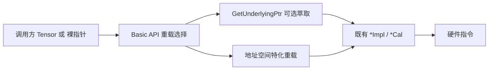

# 【社区任务】Ascend C Basic API 指针化扩展（CUBE）设计文档

> 参与任务昵称：Baibai_Hei；GitCode 账号：Baibai_Hei。  
> 代码仓 PR：https://gitcode.com/cann/asc-devkit/merge_requests/6066  
> 设计评审 Issue：https://gitcode.com/cann/asc-devkit/issues/1675

# 需求背景（required）

## 需求来源

本需求来源于 CANN 社区任务「Ascend C Basic API 指针化扩展（CUBE · 矩阵 / ISASI）」。要求在保持 `LocalTensor` / `GlobalTensor` 兼容的前提下，为类型码 **C** 的矩阵相关 Basic API 增加硬件指针入参能力，支持开发者直接使用 `__cbuf__` / `__ca__` / `__cb__` / `__cc__` / `__gm__` / `__ubuf__` 调用 LoadData、Mmad、Fixpipe 等接口。

交付仓：`cann/asc-devkit` 的 `include/basic_api`、`impl/basic_api`。

## 背景介绍

### 现有 Basic API（CUBE）现状

现有 CUBE 类 Basic API 对外签名固定为 Tensor 包装类型（`LocalTensor` / `GlobalTensor`），调用侧必须维护 Tensor 对象与 `TPosition`。底层 `*Cal` / `*Impl` 实际已按硬件指针封装，上层 Tensor 接口通过 `GetPhyAddr()` 取址后下沉。

样例与任务包 `test-cases` 中已出现指针化调用写法（`GetPhyAddr()` + 地址空间强转），但 `include/basic_api` / `impl/basic_api` 尚未提供正式的指针重载，导致：

1. 调用方无法以裸指针直接表达 L0A/L0B/L0C/L1/GM/UB 通路；
2. 与 VECTOR / DMA 姊妹册的「双轨（Tensor + Pointer）」扩展目标不一致；
3. 依赖非官方强转写法，易用性与可维护性不足。

### 功能分析

本任务**不是**新建独立算子，而是对 Basic API 做非破坏式接口扩展：

| 维度 | 说明 |
|------|------|
| 扩展对象 | CUBE（类型码 C）矩阵 / ISASI 相关 API |
| 兼容性 | 保留全部原 Tensor 签名与实现 |
| 新增能力 | 按地址空间限定符区分的指针重载 |
| 数值语义 | 复用既有 `*Cal` / `*Impl`，不改计算行为 |
| 边界 | 仅改 mm / fixpipe 相关文件，不改 VECTOR/DMA 他册 |

# 需求分析（required）

## 需求描述

为 Ascend C Basic API 中 CUBE 类接口增加硬件指针入参重载，使同一 API 名支持 Tensor 与 Pointer 双输入；指针路径由 `__ca__` / `__cb__` / `__cc__` / `__cbuf__` / `__gm__` / `__ubuf__` 区分硬件通路；底层指令封装保持不变。

## 需求拆解

1. 提供公共工具 `GetUnderlyingPtr`（指针直传 / Tensor 走 `GetPhyAddr()`）。
2. 为 LoadData / LoadDataWithStride / LoadDataWithTranspose / LoadDataWithSparse 增加指针重载。
3. 为 Mmad / MmadMx / MmadWithSparse 增加指针重载。
4. 为 Fixpipe / SetFixPipeConfig 增加指针重载。
5. 保留原 LocalTensor / GlobalTensor 签名与 Debug 检查。
6. 仅修改 CUBE 相关文件，避免与 VECTOR / DMA 姊妹册冲突。
7. 改造 `examples/.../03_matrix_compute` 样例演示指针路径（DataCopy 仍走 Tensor）。
8. 自验覆盖代表性接口，精度对标 Tensor 路径同输入对比。

# 详细设计（required）

## 总体架构



采用 **双轨重载**（非破坏式）：

- **保留**原 `LocalTensor` / `GlobalTensor` 签名与实现（兼容性）；
- **新增**按地址空间限定符区分的指针重载，直接调用既有 `LoadData2D*Cal` / `MmadCal` / `FixpipeL0C2*Impl` 等。

公共工具：

```cpp
template <typename U>
__aicore__ inline auto GetUnderlyingPtr(const U& val) {
    if constexpr (Std::is_pointer_v<U>) { return val; }
    else { return val.GetPhyAddr(); }
}
```

## 接口设计

| API | 指针典型签名 | 分发依据 |
|-----|--------------|----------|
| LoadData | `(__ca__/__cb__ T*, __cbuf__ T*, LoadData2DParams[ V2])` | dst 地址空间 |
| LoadData | `(__ca__/__cb__ T*, __cbuf__ T*, LoadData3DParamsV2)` | dst 地址空间 |
| LoadDataWithStride | `(__ca__/__cb__ T*, __cbuf__ T*, LoadData3DParamsV2)` | dst 地址空间 |
| LoadDataWithTranspose | `(__ca__/__cb__ T*, __cbuf__ T*, LoadData2dTransposeParams*)` | dst 地址空间 |
| LoadDataWithSparse | `(__cb__ int8_t*, __cbuf__ int8_t*, __cbuf__ uint8_t*, …)` | 固定 L0B |
| Mmad / MmadMx | `(__cc__*, __ca__*, __cb__*, [bias __cc__*], params)` | 固定 L0C/A/B |
| MmadWithSparse | `(__cc__ int32_t*, __ca__/__cb__ int8_t*, …)` | 2201 |
| Fixpipe | `(__gm__/__cbuf__/__ubuf__*, __cc__*, [cbufWorkspace], params)` | dst 地址空间 |
| SetFixPipeConfig | `(__cc__ T*, bool)` | SPR 配置 |

约束：

- 不修改 `*Cal` 数值行为；
- Debug 检查在 Tensor 路径保留；指针路径依赖调用方保证对齐与合法地址空间；
- Bias 指针默认按 L0C（`cmatrixSource=false`），与样例一致。

## 文件落点

| 路径 | 说明 |
|------|------|
| `include/basic_api/kernel_operator_ptr_utils.h` | `GetUnderlyingPtr` / 类型萃取 |
| `impl/basic_api/kernel_operator_mm_ptr_impl.h` | LoadData* / Mmad* 指针重载 |
| `impl/basic_api/kernel_operator_fixpipe_ptr_impl.h` | Fixpipe / SetFixPipeConfig 指针重载 |
| `include/basic_api/kernel_operator_{mm,fixpipe}_intf.h` | 引入 ptr utils |
| `impl/basic_api/kernel_operator_{mm,fixpipe}_intf_impl.h` | include 指针实现 |
| `examples/.../03_matrix_compute/**/*.asc` | 指针路径样例改造 |

## 测试用例设计

基于官方 `examples/.../03_matrix_compute` 样例改造为指针调用（DataCopy 仍走 Tensor）：

| 样例 | 覆盖点 |
|------|--------|
| mmad / mmad_gemv / mmad_unitflag | LoadData、Mmad、Fixpipe |
| mmad_mx | MmadMx + Fixpipe |
| mmad_with_sparse | LoadDataWithSparse、MmadWithSparse |
| mmad_load3dv2 / load_data_with_stride | LoadData3D / WithStride |
| load_data_* | LoadData 2D/2DV2/MX |
| fixpipe_l0c2{gm,l1,ub} | Fixpipe 三通路 |
| batch_matmul | 批量 Fixpipe + Mmad |

精度：对标生态实验标准；指针路径与改造前 Tensor 路径同输入对比。本任务无单独性能测试 case 要求。

## 兼容与风险

| 风险 | 缓解 |
|------|------|
| 重载歧义 | 指针带地址空间限定符，与 Tensor 签名不重叠 |
| 跨册冲突 | 仅改 mm / fixpipe 相关文件 |
| 对齐/位置错误 | 样例与文档强调调用方责任；Tensor 路径检查不变 |

## 可维可测

- 编译：与仓库毕昇 ASC 工具链一致，目标架构匹配 CANN 9.0~9.1；
- 回归：原 Tensor 样例/单测不改签名即可继续通过；
- 自测：按各样例 README 的 `gen_data` / 编译 / `verify` 执行。

## 关联交付

| 交付件 | 链接 / 说明 |
|--------|-------------|
| 设计文档（本文件） | `cann-competitions` PR |
| 设计评审 Issue | https://gitcode.com/cann/asc-devkit/issues/1675 |
| 代码 PR | https://gitcode.com/cann/asc-devkit/merge_requests/6066 |
| 个人分支 | `qq_53202098/asc-devkit:feature/cube-basic-api-pointerization`（协作者 Baibai_Hei） |
