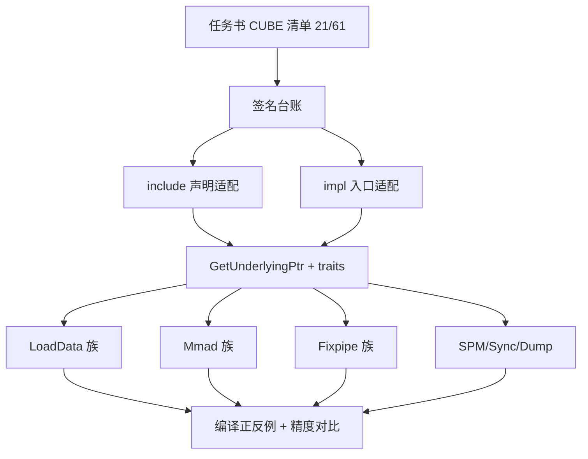
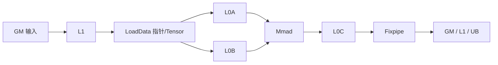
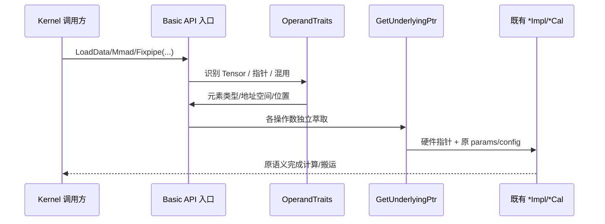
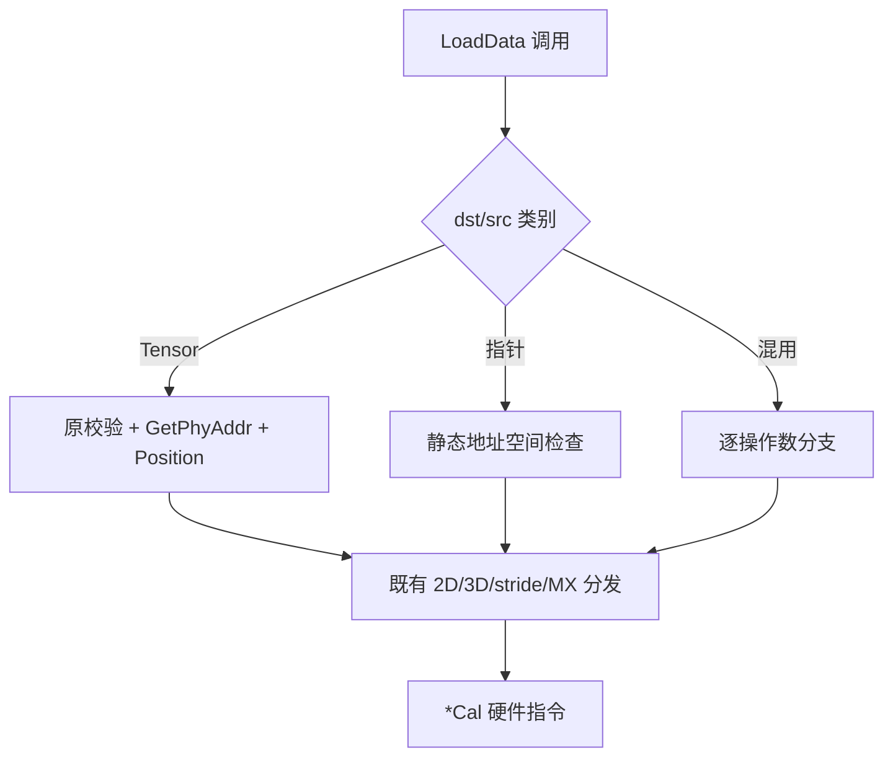
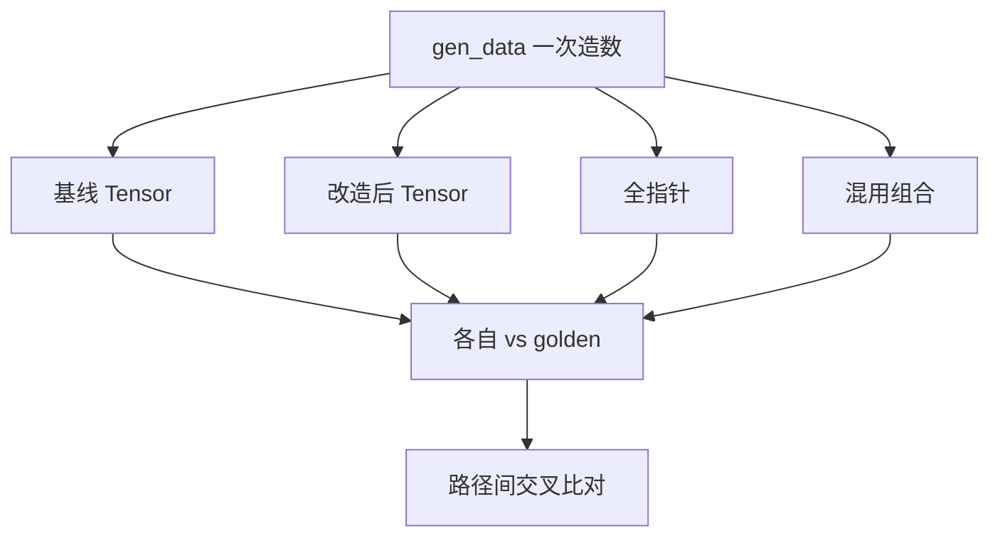
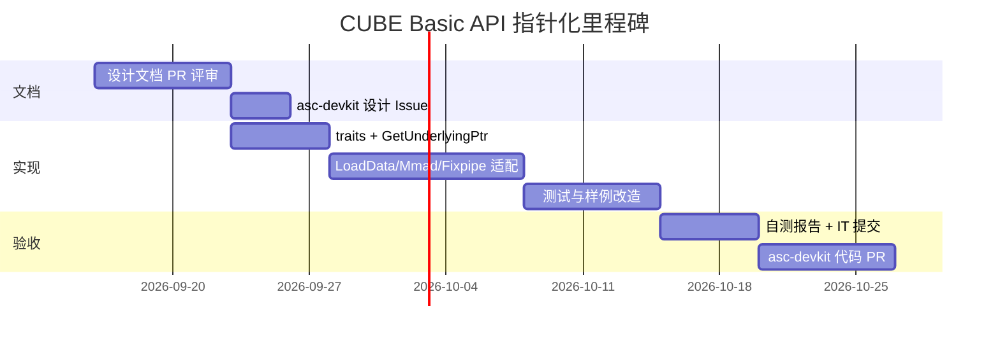

# 【CANN社区任务】Ascend C Basic API 指针化扩展（CUBE）详细设计文档

| 项目 | 内容 |
| --- | --- |
| 任务名称 | Ascend C Basic API 指针化扩展（CUBE · 矩阵 / ISASI） |
| 任务目录 | `09-AscendC-Basic-API-CUBE` |
| 提交账号 / 团队目录 | `hongwei-2026` |
| 文档路径 | `04_tasks/01_community-task-2026/tasklist/09-AscendC-Basic-API-CUBE/hongwei-2026/docs/design.md` |
| 目标代码仓 | https://gitcode.com/cann/asc-devkit |
| 目标代码目录 | `include/basic_api/`、`impl/basic_api/`（测试 `tests/api/basic_api/`） |
| 目标硬件 | Ascend 950 系列 |
| 目标 CANN | 9.0.0 ~ 9.1.0 |
| 接口范围 | 官方 CUBE 表类型码 **C**：21 个 API 名称、61 个重载签名 |
| 文档版本 | v1.0（设计阶段，不含已实现结论） |

---

## 文档导读

| 章节 | 内容 | 关键图 |
| --- | --- | --- |
| 一、需求背景 | 来源、现状、对标、难点 | 图 1-1 |
| 二、需求分析 | F1~F8、边界、姊妹册隔离 | 图 2-1 |
| 三、详细设计 | 地址萃取、模板、LoadData/Mmad/Fixpipe/SPM | 图 3-x |
| 四、可维可测 | 精度/性能/内存、F/Q/B/N 用例 | 图 4-x |
| 五、交付计划 | 里程碑 | 图 5-1 |

> **声明**：本文为**实现前设计**。精度/性能章节写的是**验证方案与门禁口径**，不表示真机已通过。


**图 1-1 任务定位与交付链路**

---

# 需求背景（required）

## 需求来源

本需求来源于 CANN 社区任务 **「Ascend C Basic API 指针化扩展（CUBE）」**。压缩包目录名为 9 月任务材料，任务书正文标题写「8 月」；**技术范围以任务书 §2.4 CUBE 接口清单为准**，提交目录采用上游现网名：

```text
04_tasks/01_community-task-2026/tasklist/09-AscendC-Basic-API-CUBE/hongwei-2026/docs/design.md
```

- 官方接口表（类型码 **C**）：https://docs.qq.com/sheet/DYWVocVFXamRFQXBD?tab=000001  
- 总表：https://docs.qq.com/sheet/DYXpIenNSTkp4SXBh（C=CUBE，D=DMA，V=VECTOR）  
- 合入仓：`cann/asc-devkit` → `include/basic_api` + `impl/basic_api`  
- 设计评审模板参考：https://gitcode.com/cann/asc-devkit/issues/1222  
- 社区流程：https://gitcode.com/org/cann/discussions/39  

**姊妹任务**：VECTOR、DMA 分册并行，接口范围互不重叠；本设计**禁止**改动他册文件。

## 背景介绍

### CUBE Basic API 指针化扩展

Ascend C Basic API 的 CUBE 类接口覆盖矩阵搬运（LoadData 族）、矩阵乘（Mmad 族）、写回（Fixpipe 族）以及 SPM / 同步 / Dump 等辅助能力。当前对外入口以 `LocalTensor` / `GlobalTensor` 为主；底层 `*Impl` / `*Cal` 往往已使用硬件指针，但**封装层未统一开放裸指针入参**。

开发者希望在 kernel 中直接使用 `__gm__` / `__cbuf__` / `__ca__` / `__cb__` / `__cc__` / `__ubuf__` 等指针与 Tensor 混用，例如：

```cpp
template <uint32_t m, uint32_t k, uint32_t n>
__aicore__ __global__ void matmul_ptr_kernel(__gm__ half* aGm, __gm__ half* bGm, __gm__ half* cGm)
{
    AscendC::InitSocState();
    __cbuf__ half l1aBuf[m * k];
    __cbuf__ half l1bBuf[k * n];
    __ca__ half l0aBuf[m * k];
    __cb__ half l0bBuf[k * n];
    __cc__ float l0cBuf[m * n];
    AscendC::DataCopy(l1aBuf, aGm, m * k);          // DMA 册接口，可联调，本册不改 DataCopy
    AscendC::LoadData(l0aBuf, l1aBuf, loadParamsA); // 本册：指针路径
    AscendC::LoadData(l0bBuf, l1bBuf, loadParamsB);
    AscendC::Mmad(l0cBuf, l0aBuf, l0bBuf, mmadParams);
    AscendC::Fixpipe(cGm, l0cBuf, cbufWorkspace, fixpipeParams);
}
```

### 现状分析（相对 asc-devkit）

| 层次 | 代表路径 | 现有职责 | 本设计关注点 |
| --- | --- | --- | --- |
| 声明 | `include/basic_api/kernel_operator_mm_intf.h` 等 | LoadData / Mmad 等模板声明与架构门控 | 保留重载顺序、默认实参、宏门控 |
| 入口 | `impl/basic_api/kernel_operator_mm_intf_impl.h` | Tensor 校验与转发 | 增加受约束的指针 / 混合入参适配 |
| 分发 | `kernel_operator_mm_load2d_impl.h` 等 | 按 `GetPosition()` 选通路 | **地址与位置分离**，复用 `*Cal` |
| Fixpipe | `kernel_operator_fixpipe_intf*.h` | L0C 写回、量化工作区 | 每操作数独立萃取；保留 config / cache |
| Tensor | `kernel_tensor*.h` | `GetPhyAddr()` / 位置 / 容量 | Global 必须走 `GetPhyAddr()`；Local 设备模式地址可能是整数 |
| SPM / Sync / Dump | `kernel_tpipe.h`、sync / dump 相关 | 工作区与调试 | 只适配官方 C 清单内签名 |

**关键事实**：部分 `LoadDataImpl` 仍吃 Tensor，并非一律存在 `LoadDataImpl(ptr, ptr, params)`。实施时必须沿调用链定位可复用的指针层，禁止假设「全局机械替换」即可。

### 功能分析

| 维度 | 说明 |
| --- | --- |
| 目标 | Tensor / 裸指针 / 混用调用同一套对外 API |
| 数值语义 | **不改** `*Impl` 计算、布局、量化、同步 |
| 兼容性 | 原 Tensor 用例必须回归通过 |
| 范围 | 仅 CUBE 表 21 名 / 61 签名；不碰 VECTOR / DMA |
| 性能 | 任务书**无**强制标杆；要求无额外线性 Device 拷贝 |

---

# 需求分析（required）

## 需求描述

在官方 CUBE 清单范围内，完成 Basic API 指针化扩展：相同数据布局、配置与同步顺序下，指针路径与 Tensor 路径数值一致；原 Tensor 路径行为与检查机制不变；适配发生在编译期模板层，不引入与输入规模线性相关的额外 Device 内存拷贝。

## 需求拆解

| ID | 需求点 | 验收口径 |
| --- | --- | --- |
| F1 | 范围管控 | 仅改 C 类清单接口；他册零改动 |
| F2 | 双路径等价 | 同输入下指针 vs Tensor 满足精度标准；Tensor 回归全过 |
| F3 | 独立操作数推导 | dst/src/bias/scale/workspace 各自推导，允许合法混用 |
| F4 | 地址空间正确 | `__gm__`/`__cbuf__`/`__ca__`/`__cb__`/`__cc__`/`__ubuf__` 不混淆 |
| F5 | 缓存属性 | GM 路径在清地址编码前抽取 cache mode |
| F6 | 模板兼容 | 不抢占既有全 Tensor 重载；保留显式模板与默认配置 |
| F7 | 架构门控 | 如 `MmadWithSparse` 的 `__NPU_ARCH__==2201` 等**不删除** |
| F8 | 可测可复现 | 签名台账 + F/Q/B/N 用例 + README 命令 |



**图 2-1 需求追溯**

### 范围分组（设计用，不替代官方 61 签名）

| 接口组 | 代表入口（任务附件 / 源码核对） | 处理策略 |
| --- | --- | --- |
| 矩阵加载 | `LoadData`、`LoadDataWithStride`、`LoadDataWithTranspose`、2D/3D/MX 变体 | 分版本适配参数结构体 |
| 矩阵计算 | `Mmad`、`MmadMx`、`MmadWithSparse` | dst/L0A/L0B/bias 独立校验 |
| 写回 | `Fixpipe`（GM / L1 / UB） | 目的地与 `FixpipeConfig` 一致 |
| SPM | `InitSpmBuffer` / `WriteSpmBuffer` / `ReadSpmBuffer` | 生命周期与容量语义不变 |
| 同步 / 调试 | 清单内 sync、`DumpTensor` 等 | 只适配列入签名 |

实施前将腾讯文档逐行固化为台账列：`行号 | 完整签名 | 架构宏 | dtype | 通路 | 源码入口 | 测试编号`，并核对名称数=21、签名数=61。

---

# 详细设计（required）

## 算子分析

### 数学及数据流语义

本任务**不修改**矩阵数学。常规 Mmad：

$$
C_{i,j} = C^{\mathrm{init}}_{i,j} + \sum_{k=0}^{K-1} A_{i,k}\,B_{k,j}
$$

bias、累加、MX scale、稀疏编码、Fixpipe 量化/布局转换均遵循**现有重载**语义。



**图 3-1 CUBE 典型数据通路**

> GM→L1 的 `DataCopy` 属 DMA 分册；CUBE 变更**不修改** DataCopy 对外接口，可与 DMA 册联调。

### 支持数据类型与地址空间

| 操作数 | Tensor | 裸指针 | 约束 |
| --- | --- | --- | --- |
| GM | `GlobalTensor<T>` | `__gm__ T*` | 读写角色与 cache 属性 |
| L1 | `LocalTensor<T>` | `__cbuf__ T*` | 对齐 / 容量 |
| L0A | `LocalTensor<T>` | `__ca__ T*` | 勿与 L0B 混淆 |
| L0B | `LocalTensor<T>` | `__cb__ T*` | 勿与 L0A 混淆 |
| L0C | `LocalTensor<T>` | `__cc__ T*` | 累加 dtype 合法 |
| UB | `LocalTensor<T>` | `__ubuf__ T*` | 仅原接口允许通路 |

不新增 dtype 承诺；FP16/BF16/FP32/整型/FP4/FP8 仅在原接口+架构共同支持时接受。

### 支持形状

保留原接口对分形、步长、repeat、对齐、工作区容量的约束。测试建议逻辑规模 `1 / 32 / 1024 / 2048`（按 M/K/N 等价缩放）；大矩阵走既有 tiling，**禁止**假设整张 2048 方阵可直接放入 L0。

## 算子实现

### 实现方案总览



**图 3-2 调用时序**

#### 3.2.1 Host 侧

本任务是**设备侧头文件库扩展**，不新增 aclnn / OpDef / Host tilingKey。  
样例 Host 仅负责：分配、造数、launch、同步、对比。分核与 buffer 规划与改造前一致，以便隔离「参数表示」变量。

#### 3.2.2 Kernel 侧

**（1）统一地址萃取 `GetUnderlyingPtr`**

可与 VECTOR 册共用唯一实现（优先复用仓库已有 helper；禁止多分册重复定义）。

| 输入 | 萃取结果 | 额外保留 |
| --- | --- | --- |
| `LocalTensor<T>` | `GetPhyAddr()` | `PrimT<T>`、`GetPosition()`、容量 |
| `GlobalTensor<T>` | `GetPhyAddr()` | cache mode、GM 属性 |
| 硬件指针 | 原指针 | 静态地址空间、const/写属性 |

注意：设备模式下 Local `GetPhyAddr()` 可能返回 `uint64_t`，**不能**只用 `ElemType<decltype(ptr)>` 推导元素类型；元素类型来自操作数 traits。普通 `void*` / 丢失地址空间的指针不得作为绕过校验入口。

**（2）模板与重载策略**

- 每操作数独立模板参数（概念上 `DstOp` / `SrcOp` / `BiasOp` / `WsOp`）。  
- **新增入口至少含一个硬件指针操作数**，避免与全 Tensor 重载竞争。  
- 保留 `FixpipeConfig`、`FixpipeParamsArch3510<...>`、`__inout_pipe__` 等非类型实参与生命周期。  
- 纯控制接口无操作数则不加假指针重载。

**（3）LoadData / Mmad**



**图 3-3 LoadData 适配**

Mmad：dst / L0A / L0B / bias 独立萃取；unitFlag、GEMV(M=1)、MX、sparse 开关原样下传；不减少流水等待点。

**（4）Fixpipe 与 cache**

按目标地址空间选择 L0C→GM / L1 / UB，并与 `config.isToUB`、format 一致。  
`GlobalTensor::GetPhyAddr()` 可能剥离 cache 编码：必须在清理前用 `ExtractCacheMode` / `ExtractL2CacheGmAddr` 分离模式与物理地址；禁止从已清理地址反推模式。

**（5）SPM / Sync / Dump**

- SPM：保留 TPipe 状态；偏移/大小单位不变；裸指针不伪造完整 capacity。  
- Sync：保留事件协议，不用裸读写冒充同步。  
- Dump：保留 desc / size / ShapeInfo / 开关宏；指针路径长度由调用者保证；低比特偏移按存储粒度，禁止无条件 `ptr + countOff`。

**（6）资源与调试**

Tensor 分支保留 CPU debug / 边界 / 原子锁语义。指针分支不调用 `.GetSize()`。不额外分配 device buffer 做适配拷贝。

### 变更文件边界

| 目录 | 计划修改 |
| --- | --- |
| `include/basic_api/` | 清单内声明、约束与注释 |
| `impl/basic_api/` | traits、地址适配、CUBE 入口/分发 |
| `tests/api/basic_api/` | 编译正反例、一致性、回归 |
| `examples/.../03_basic_api/` | 代表性指针/混用样例（是否合入听从评审） |

### 支持硬件

| 项 | 要求 | 验证 |
| --- | --- | --- |
| Ascend 950 系列 | 主目标 | 记录型号 / SoC / 驱动 |
| CANN 9.0.0~9.1.0 | 编译运行 | 尽量覆盖两端点 |
| 毕昇 ASC | 与 CANN 匹配 | 不以 Host g++ 替代 |
| 其他架构 | 保持既有 | **保留宏门控**；不适用项登记跳过原因 |

### 约束限制

1. 裸指针生命周期、容量、对齐、布局由调用者保证。  
2. 错误地址空间 / dtype / const 目标等应**编译失败**。  
3. 不新增原接口没有的别名、任意 broadcast、自动 padding。  
4. 不做「删门控换可编译」的表面通过。  
5. 一致性对比必须同 cache / 量化 / 布局 / 同步配置。

---

# 可维可测分析

## 精度标准 / 性能标准 / 内存

| 验收标准 | 描述 | 来源 |
| --- | --- | --- |
| 数值精度 | 指针路径 vs Tensor 路径 vs golden，按 dtype/算子类判定 | 任务书 + [opbase 实验标准](https://gitcode.com/cann/opbase/blob/master/docs/zh/ops_precision_standard/experimental_standard.md) |
| Tensor 回归 | 改造后原用例全部通过 | 任务书 §2/§3 |
| 性能 | **无强制标杆**；证明无额外无关拷贝/同步；对比选填 | 任务书 §3.3 |
| 内存 | 无随规模线性增长的适配临时 buffer | 任务书 §3.4 |

建议取值域 `[-100,100]`（或接口合法域）；逻辑 shape `1/32/1024/2048`。



**图 4-1 验证流水线**（避免双错互证）

## 详细测试用例设计（F / Q / B / N）

### F 功能（代表性，实施按 61 签名台账补齐）

| ID | 场景 | 输入要点 | 期望 |
| --- | --- | --- | --- |
| F-01 | LoadData L1→L0A 全 Tensor | half，tile 32 | 与基线一致 |
| F-02 | LoadData L1→L0A 全指针 | `__cbuf__`/`__ca__` | 与 F-01 一致 |
| F-03 | LoadData 混用 dst 指针 src Tensor | 合法组合 | 一致 |
| F-04 | LoadDataWithStride | stride/repeat 边界 | 一致 |
| F-05 | LoadData 3D V2 | padding / 复位配置 | 一致 |
| F-06 | Mmad 初始化 | C_init=0 | 精度达标 |
| F-07 | Mmad 累加 | 多轮 K tile | 精度达标 |
| F-08 | Mmad + bias | bias 独立指针/Tensor | 精度达标 |
| F-09 | Mmad GEMV M=1 | 向量乘 | 精度达标 |
| F-10 | Batch Matmul 多 batch | 循环调用 | 各 batch 正确 |
| F-11 | Mmad unitFlag | 流水依赖 | 无死锁、结果正确 |
| F-12 | Fixpipe L0C→GM | ND/NZ 按接口 | 输出正确 |
| F-13 | Fixpipe L0C→L1 | A2/A3/950 差异登记 | 按产品能力 |
| F-14 | Fixpipe L0C→UB | isToUB | 正确 |
| F-15 | Fixpipe + 量化 workspace | uint64 工作区 | 边界不被破坏 |
| F-16 | MmadMx FP4/FP8+scale | MX 布局 | 量化精度达标 |
| F-17 | LoadData 2D MX | scale 类型 | 一致 |
| F-18 | SPM 写后读 | 合法偏移 | 哨兵不变 |
| F-19 | Sync 最小用例 | 事件配对 | 无超时 |
| F-20 | DumpTensor | 开关宏开/关 | 导出符合预期 |

### Q 精度 / 量化

| ID | 场景 | 判定 |
| --- | --- | --- |
| Q-01 | FP16 Mmad 随机 [-100,100] | 实验标准阈值 |
| Q-02 | BF16 / FP32 累加路径 | 按标准 |
| Q-03 | INT8 稀疏 MmadWithSparse（架构允许时） | 按标准；950 不可用则登记跳过 |
| Q-04 | FP8 MX | 量化参考 |
| Q-05 | 纯搬运无转换 | **逐位一致** |

### B 边界

| ID | 场景 | 期望 |
| --- | --- | --- |
| B-01 | shape 逻辑 1 | 通过或原接口拒绝语义不变 |
| B-02 | tile 对齐边界 | 与基线一致 |
| B-03 | 尾块 / 非满 K | 一致 |
| B-04 | 零 / 极值（接口定义时） | 符合原语义 |
| B-05 | 工作区恰好满容量 | 不越界 |
| B-06 | const 源指针 | 可编译；写 const 目标应失败 |

### N 负例（编译期）

| ID | 非法组合 | 期望 |
| --- | --- | --- |
| N-01 | L0A 指针误作 L0B | 编译失败 |
| N-02 | `__ubuf__` 用于仅 L1 通路 | 编译失败 |
| N-03 | 错误 dtype 组合 | 编译失败 |
| N-04 | 写 `const T*` 目标 | 编译失败 |
| N-05 | 普通 `void*` 冒充硬件指针 | 编译失败 |
| N-06 | 删门控前的架构禁用接口强行实例化 | 保持失败/不可用 |

### 附件样例映射（任务包 `test-cases/`）

| 样例目录 | 覆盖 | 测试编号映射 |
| --- | --- | --- |
| `load_data_l12l0` / `load_data_2dv2_l12l0` | L1→L0 | F-01~03, C03 |
| `load_data_with_stride` | stride | F-04 |
| `mmad_load3dv2` | 3D load | F-05 |
| `mmad` / `mmad_gemv` / `batch_matmul` | 计算 | F-06~10 |
| `mmad_unitflag` | 流水 | F-11 |
| `fixpipe_l0c2gm/l1/ub` | 写回 | F-12~15 |
| `mmad_mx` / `load_data_2dmx_l12l0` | MX | F-16~17, Q-04 |
| `mmad_with_sparse` | 稀疏（多 A2/A3） | Q-03, 架构登记 |

> 附件样例**不足以**证明 61 签名全覆盖；缺项按台账补测。

### 自测报告字段（IT）

每条记录：`完整签名 | 源码 commit | 硬件/CANN/ASC | dtype | 逻辑/tile shape | 布局 | 组合类型 | seed | 命令 | 精度指标 | PASS/FAIL | 截图`。  
汇总必须分列：通过 / 失败 / 架构不适用 / 环境未覆盖；**未跑不得计入通过**。

## 兼容性分析

- 函数名、params/config、显式模板调用、Tensor 语义保持。  
- 主要风险：地址空间 traits、重载冲突、GM cache 丢失、低比特偏移、跨册 helper 重复定义。  
- 对策：ASC 编译正反例、旧调用回归、cache 对照、低比特边界、helper 单一定义检查。

---

# 交付计划



**图 5-1 交付路线图（示意）**

| 阶段 | 产出 |
| --- | --- |
| 设计 | 本文 + competitions PR；通过后 asc-devkit Issue |
| 实现 | `include/basic_api` + `impl/basic_api` 变更 |
| 验证 | 签名台账、F/Q/B/N、Tensor 回归、README |
| 合入 | asc-devkit PR + 测试报告；邀请 `Ascend-CANN` |

---

## 参考链接

1. 任务书：压缩包内 `basic_api_optimize_cube.md`  
2. 设计模板：https://gitcode.com/cann/cann-ops-competitions/blob/master/04_tasks/01_community-task-2026/resources/design_template.md  
3. 社区任务 README：https://gitcode.com/cann/cann-ops-competitions/blob/master/04_tasks/01_community-task-2026/README.md  
4. asc-devkit 协作规范：https://gitcode.com/cann/asc-devkit/wiki/05_%E7%A0%94%E5%8F%91%E5%8D%8F%E4%BD%9C%E8%A7%84%E8%8C%83.md  
5. 精度标准：https://gitcode.com/cann/opbase/blob/master/docs/zh/ops_precision_standard/experimental_standard.md  
6. 样例参考：https://gitcode.com/cann/asc-devkit/tree/master/examples/01_simd_cpp_api/03_basic_api/  
