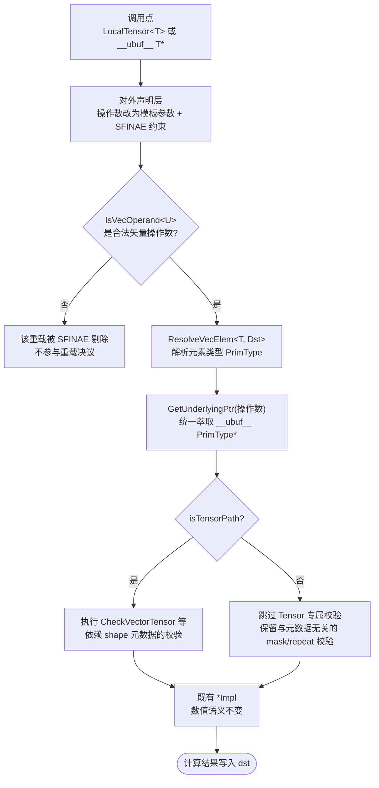

# 【社区任务】Ascend C Basic API 指针化（VECTOR 分册）设计文档

| 文档属性 | 内容 |
| --- | --- |
| 任务书 | 社区任务 - Ascend C Basic API 指针化扩展任务书（VECTOR / 矢量计算分册） |
| 参与账号 | Ivyalways |
| 目标代码仓 · 分支 | `cann/asc-devkit` · `master` |
| 目标目录 | `include/basic_api/`、`impl/basic_api/`、`tests/api/`、`examples/01_simd_cpp_api/03_basic_api/` |
| 适配硬件 | Ascend 950PR（`dav-3510`） |
| CANN 版本 | CANN 9.0.0 ~ CANN 9.1.0（本设计验证环境为 CANN 9.1.0，`innerversion=V100R001C11B063`） |
| 开发语言 | Ascend C / C++，毕昇 ASC 编译器 |
| 设计文档仓 | `cann/cann-ops-competitions` |
| 设计文档路径 | `04_tasks/01_community-task-2026/tasklist/09-BasicAPI-Pointer-VECTOR/Ivyalways/docs/design.md` |

---

# 一、需求描述

## 1.1 需求来源

社区任务书要求基于 Ascend C **Basic API**，对 **VECTOR / 矢量计算分册** 所列接口进行指针化扩展：使开发者既可以继续传入 `LocalTensor<T>`，也可以直接传入裸指针（如 `__ubuf__ T*`），二者调用**同一套对外 API**。核心约束是**只增加指针入参能力，不得破坏原有 LocalTensor / GlobalTensor 接口的行为与兼容性**。

交付目标仓为 `cann/asc-devkit`，变更落在 `include/basic_api`（对外声明）与 `impl/basic_api`（接口封装实现）两个目录，合入 `master` 分支。本任务**不注册 GE / aclnn 算子**，没有 `op_host / op_kernel / op_api` 三段式，也不涉及 Host 侧 Tiling。

任务书给出的目标编程范式：

```cpp
template <uint32_t blockLength>
__vector__ __global__ void add_custom(__gm__ float* x, __gm__ float* y, __gm__ float* z)
{
    AscendC::InitSocState();
    __ubuf__ float xPtr[blockLength];
    __ubuf__ float yPtr[blockLength];
    __ubuf__ float zPtr[blockLength];
    ...
    AscendC::Add(zPtr, xPtr, yPtr, blockLength);
    ...
}
```

## 1.2 需求分析

### 1.2.1 现状：三层结构与 Tensor-only 签名

仓内 Basic API 是**声明与定义分离**的三层结构，这一点与任务书 §2.3 示意的「单文件定义」不同，改造须两侧同步：

| 层次 | 路径 | 职责 |
| --- | --- | --- |
| 对外声明层 | `include/basic_api/kernel_operator_vec_*_intf.h` | 只有函数原型与 doxygen 注释，以 `;` 结尾 |
| 接口封装层 | `impl/basic_api/kernel_operator_vec_*_intf_impl.h` | 参数校验、DFX 上报，并把 Tensor 下沉为裸指针后调用 `*Impl` |
| 硬件实现层 | `impl/basic_api/dav_3510/` 等架构目录 | `*Impl`，本任务**不修改** |

以 `Add` 的封装层实现为例（`impl/basic_api/kernel_operator_vec_binary_intf_impl.h:69`）：

```cpp
template <typename T, bool isSetMask>
__aicore__ inline void Add(
    const LocalTensor<T>& dst, const LocalTensor<T>& src0, const LocalTensor<T>& src1, uint64_t mask[],
    const uint8_t repeatTime, const BinaryRepeatParams& repeatParams)
{
    using PrimType = PrimT<T>;
#if defined(ASCENDC_DEBUG) || defined(ASCENDC_CPU_DEBUG)
    CheckVectorTensor("Add", NamedTensor(dst, "dst"), NamedTensor(src0, "src0"), NamedTensor(src1, "src1"));
    CheckMaskRepeat<PrimType, isSetMask>(mask, repeatTime, "Add");
#endif
#if ASCENDC_CPU_DEBUG
    MaskSetter::Instance().SetMask(isSetMask);
    if (!CheckFuncVecBinary(dst, src0, src1, mask, repeatTime, repeatParams, "Add")) { ... }
#endif
#ifdef __MSTX_DFX_REPORT__
    MstxTensor::GetMstxVecBinaryInfo(dst, src0, src1, mask[0], mask[1], repeatTime, repeatParams, isSetMask, "Add");
#endif
    AddImpl<PrimType, isSetMask>(
        (__ubuf__ PrimType*)dst.GetPhyAddr(), (__ubuf__ PrimType*)src0.GetPhyAddr(),
        (__ubuf__ PrimType*)src1.GetPhyAddr(), mask, repeatTime, repeatParams);
}
```

可见：**指针下沉的动作封装层本来就在做**，本任务的实质是把「下沉的起点」从固定的 `LocalTensor<T>` 放宽为「LocalTensor 或裸指针」，而 `*Impl` 与其数值语义完全不动。

### 1.2.2 范围界定与接口清单口径

对本册 18 个 VECTOR 头文件（含排序类 `kernel_operator_proposal_intf.h`）逐文件统计公开接口，实测结果如下（共 3982 行声明）：

| 头文件（`kernel_operator_*_intf.h`） | 接口名 | 重载 | 接口清单 |
| --- | --- | --- | --- |
| `vec_binary_scalar` | 13 | 68 | `Adds`、`Muls`、`Maxs`、`Mins`、`ShiftLeft`、`ShiftRight`、`LeakyRelu`、`Subs`、`Divs`、`Ands`、`Ors`、`MulsCast`、`FusedMulsCast` |
| `vec_binary` | 23 | 59 | `Add`、`Sub`、`Mul`、`Div`、`MulAddDst`、`Max`、`Min`、`And`、`Or`、`ShiftLeft`、`ShiftRight`、`AddRelu`、`AddDeqRelu`、`FusedMulAdd`、`MulAddRelu`、`FusedMulAddRelu`、`SubRelu`、`Prelu`、`Mull`、`AbsSub`、`FusedAbsSub`、`ExpSub`、`FusedExpSub` |
| `vec_unary` | 9 | 41 | `Relu`、`Exp`、`Ln`、`Abs`、`Reciprocal`、`Rsqrt`、`Sqrt`、`Not`、`Neg` |
| `vec_cmpsel` | 6 | 30 | `Compare`、`GetCmpMask`、`SetCmpMask`、`Compares`、`CompareScalar`、`Select` |
| `vec_reduce` | 10 | 21 | `ReduceDataBlock`、`ReducePairElem`、`ReduceRepeat`、`ReduceMax`、`ReduceMin`、`ReduceSum`、`GetReduceRepeatMaxMinSpr`、`GetReduceMaxMinCount`、`GetReduceRepeatSumSpr`、`GetAccVal` |
| `vec_vconv` | 7 | 19 | `Cast`、`CastDequant`、`CastDeq`、`AddReluCast`、`SubReluCast`、`SetDeqScale`、`Truncate` |
| `proposal` | 12 | 13 | `MrgSort4`、`RpSort16`、`MrgSort`、`Sort32`、`ProposalConcat`、`ProposalExtract`、`Concat`、`Extract`、`Sort`、`GetSortOffset`、`GetSortLen`、`GetMrgSortResult` |
| `vec_duplicate` | 3 | 7 | `Duplicate`、`Interleave`、`DeInterleave` |
| `vec_transpose` | 2 | 5 | `Transpose`、`TransDataTo5HD` |
| `vec_gather` | 2 | 4 | `Gatherb`、`Gather` |
| `vec_scatter` | 1 | 3 | `Scatter` |
| `vec_mulcast` | 1 | 3 | `MulCast` |
| `vec_createvecindex` | 1 | 3 | `CreateVecIndex` |
| `vec_vpadding` | 1 | 3 | `VectorPadding` |
| `vec_ternary_scalar` | 1 | 3 | `Axpy` |
| `vec_gather_mask` | 1 | 2 | `GatherMask` |
| `vec_bilinearinterpolation` | 1 | 2 | `BilinearInterpolation` |
| `vec_brcb` | 1 | 1 | `Brcb` |
| **合计** | **95（去重 93）** | **287** | —— |

任务书 §1 给出的口径是 **79 个接口名 / 245 个重载签名**。实测 93 / 287 高于该口径，差异来源于本册明确排除项与查询辅助接口：

| 差异来源 | 说明 | 处理 |
| --- | --- | --- |
| Proposal 拆分接口 | `ProposalConcat`、`ProposalExtract` 被任务书 §1 明确排除 | 不改造 |
| Atlas 推理系列专属 | `RpSort16` 及 `region_proposal_sort` 样例仅支持 Atlas 推理系列 AI Core，非 950PR | 不改造 |
| 无 Tensor 操作数的查询/设置接口 | `GetCmpMask`、`SetCmpMask`、`GetAccVal`、`GetSortOffset`、`GetSortLen`、`GetReduce*Spr`、`SetDeqScale` 等，签名里没有 Tensor 操作数 | 天然无需改造，仅纳入回归 |
| 已具备泛型操作数的接口 | 见 1.2.3 | 无需改签名，仅纳入回归 |

> **待核对**：任务书 §2.4.2 的权威清单位于腾讯文档表格（`docs.qq.com/sheet/DYVNBU3BUUVdVRFRu`），任务书 §4/§7 又引用了一份 `./api_list_vector.md`，该文件未随任务书下发。本文附录 A 给出的是**按真实头文件实测**的逐接口清单与改造分级；最终交付前将以官方清单为准做一次对账，差异项在自测报告中列出。

### 1.2.3 部分接口已经是泛型操作数

实测发现下列接口的部分或全部重载**已经不是固定 `LocalTensor<T>`**，而是泛型操作数（`typename T = BinaryDefaultType, const BinaryConfig& config = DEFAULT_BINARY_CONFIG, typename U, typename S, typename V` 形态）：

| 头文件 | 已泛型接口 |
| --- | --- |
| `vec_binary_scalar` | `Subs`、`Divs`、`Ands`、`Ors`、`MulsCast`、`FusedMulsCast` |
| `vec_cmpsel` | `Compares`、`CompareScalar`、`Select` |

这说明**指针化范式在仓内已有先例**，本设计的正确做法是向这些既有写法收敛，而不是另起一套。`Adds`/`Muls`/`Maxs`/`Mins` 则处于「一半固定 Tensor、一半已泛型」的混合状态——这正是 2.2 节重载消歧要重点处理的对象。

## 1.3 模板适用性说明

本任务是**既有接口的签名扩展**，不是新增算子。官方算子设计文档模板中的「数学公式」「TBE 版本对标」「Host 侧 Tiling 策略」「Kernel 侧分核 / UB 切分」「广播规则」等章节对本任务**不适用**，原因：

1. 本任务不改变任何一个接口的数值语义，`*Impl` 一行不动，因此没有独立的数学公式需要论证；
2. Basic API 是指令级封装，不存在 Host 侧 Tiling 与分核策略；
3. 数据搬运、UB 分配由调用方 kernel 负责，不在本册接口职责内。

相应地，本文以**接口签名映射、模板参数语义、重载消歧、兼容性回归矩阵**替代上述章节。

---

# 二、方案设计

## 2.1 接口内部实现

### 2.1.1 总体流程

改造只发生在**对外声明层与接口封装层**，硬件实现层零改动：



图1 指针化接口的内部实现流程

### 2.1.2 操作数萃取设施

新增公共头 `include/basic_api/kernel_operand_traits.h`，提供四件设施：

```cpp
namespace AscendC {

// 1) 合法矢量操作数判定：LocalTensor 或裸指针
template <typename U>
struct IsLocalTensorOperand { static constexpr bool value = false; };
template <typename T>
struct IsLocalTensorOperand<LocalTensor<T>> { static constexpr bool value = true; };

template <typename U>
struct IsVecOperand {
    static constexpr bool value = Std::is_pointer<U>::value || IsLocalTensorOperand<U>::value;
};

// 2) 元素类型萃取。
// 注意：Std::remove_pointer 不脱地址空间，remove_pointer<__ubuf__ half*>::type
// 得到的是 __ubuf__ half 而非 half，因此必须用偏特化。
template <typename U>
struct VecOperandElem { using Type = typename U::PrimType; };
template <typename E>
struct VecOperandElem<__ubuf__ E*> { using Type = E; };
template <typename E>
struct VecOperandElem<const __ubuf__ E*> { using Type = E; };

// 3) 元素类型解析：显式给出的 T 优先，否则从操作数推导。
// 这是保住 Add<half, false>(...) 这类既有写法的关键。
template <typename T, typename Operand>
struct ResolveVecElem { using Type = T; };
template <typename Operand>
struct ResolveVecElem<void, Operand> { using Type = typename VecOperandElem<Operand>::Type; };

// 4) 统一萃取底层硬件指针，并补回 GetPhyAddr() 不携带的 __ubuf__ 地址空间
template <typename U>
__aicore__ inline auto GetUnderlyingPtr(const U& val)
{
    if constexpr (Std::is_pointer<U>::value) {
        return val;
    } else {
        return (__ubuf__ typename U::PrimType*)val.GetPhyAddr();
    }
}

}  // namespace AscendC
```

该头文件须自包含（显式 include `kernel_tensor.h` 与 `utils/std/type_traits.h`），且在各 `*_intf.h` 中**必须置于 `#pragma begin_pipe(V)` 之前**，否则其内容会被并入 pipe 区导致符号不可见。

### 2.1.3 与任务书示例方案的四处修正

任务书 §2.3 给出的 `GetUnderlyingPtr` + 单一模板参数 `T` 方案，在真实头文件上有四个必须修正的问题。以下每一条都有实测依据。

| 编号 | 问题 | 后果 | 本设计的处理 |
| --- | --- | --- | --- |
| R1 | 模板实参语义翻转 | 现状 `template <typename T, bool isSetMask>` 中 T 是**元素类型**，既有调用可写 `Add<half, false>(...)`；任务书改为 `void Add(const T& dst, ...)` 后 T 变成**操作数类型**，所有显式指定模板实参的既有调用编译失败，与「零语义变更」要求冲突 | `typename T = void` 哨兵 + `ResolveVecElem<T, Dst>`，T 始终保持「元素类型」语义 |
| R2 | 单一 T 覆盖异构操作数 | `Cast`、`CastDeq`、`MulCast`、`Compare`（dst 为 mask）等 dst 与 src 元素类型不同，`const T& dst, const T& src0` 无法表达 | 每个操作数独立模板参数 `Dst`/`Src0`/`Src1`，元素类型按操作数各自解析 |
| R3 | `remove_pointer` 不脱地址空间 | `Std::remove_pointer<__ubuf__ half*>::type` == `__ubuf__ half`，直接用作元素类型会导致 `*Impl` 实例化失败 | `VecOperandElem` 用 `__ubuf__ E*` 偏特化取 `E` |
| R4 | `GetPhyAddr()` 不带 `__ubuf__` | 既有 impl 全部显式写 `(__ubuf__ PrimType*)dst.GetPhyAddr()`；任务书版本直接 `return val.GetPhyAddr();` 会丢地址空间限定 | 萃取器内部补回 `__ubuf__` 转换 |

> R3 的实测证据：`static_assert(Std::is_same<Std::remove_pointer<__ubuf__ half*>::type, half>::value)` 在 `dav-3510` 上编译失败，错误信息为 `requirement 'AscendC::Std::is_same<__ubuf__ half, half>::value'`。而 `Std::is_pointer<__ubuf__ half*>::value` 为 `true`，该项无需特殊处理。

### 2.1.4 校验与 DFX 层的降级（任务书未覆盖）

封装层的三段校验/上报都**依赖 LocalTensor 携带的 shape / size 元数据**，裸指针不具备：

| 代码 | 开关宏 | 对元数据的依赖 |
| --- | --- | --- |
| `CheckVectorTensor(apiName, NamedTensor(dst, "dst"), ...)` | `ASCENDC_DEBUG` / `ASCENDC_CPU_DEBUG` | 需要 Tensor 的 buffer 归属与长度 |
| `CheckFuncVecBinary(dst, src0, src1, ...)` | `ASCENDC_CPU_DEBUG` | 需要 Tensor 的 size 做越界判定 |
| `MstxTensor::GetMstxVecBinaryInfo(dst, src0, ...)` | `__MSTX_DFX_REPORT__` | 需要 Tensor 地址与长度做 DFX 上报 |

本设计以编译期常量 `isTensorPath` 分流，**Tensor 路径校验能力完全不退化，指针路径仅跳过依赖元数据的部分**，与元数据无关的 `CheckMaskRepeat` / `CheckMaskValue` 对两条路径一律保留：

```cpp
constexpr bool isTensorPath = IsLocalTensorOperand<Dst>::value && IsLocalTensorOperand<Src>::value;
#if defined(ASCENDC_DEBUG) || defined(ASCENDC_CPU_DEBUG)
    if constexpr (isTensorPath) {
        CheckVectorTensor("LeakyRelu", NamedTensor(dst, "dst"), NamedTensor(src, "src"));
    }
    CheckMaskValue<PrimType, isSetMask>(mask, "LeakyRelu");   // 与元数据无关，两路都做
#endif
```

> 该取舍属于**能力边界**而非缺陷：裸指针本身不携带长度信息，越界检测在指针路径上不可能实现。将作为易用性反馈提交 Issue（见 3.3）。

## 2.2 接口设计

### 2.2.1 Kernel 侧接口

统一改造范式（以 `LeakyRelu` 的 `uint64_t mask` 重载为例，该形态已在 950PR 真机验证）：

```cpp
namespace AscendC {

// 改造前：操作数固定为 LocalTensor，且存在 T-标量 / U-标量 两个重载
template <typename T, bool isSetMask = true>
__aicore__ inline void LeakyRelu(const LocalTensor<T>& dst, const LocalTensor<T>& src, const T& scalarValue,
    uint64_t mask, const uint8_t repeatTime, const UnaryRepeatParams& repeatParams);
template <typename T, typename U, bool isSetMask = true,
    typename Std::enable_if<Std::is_same<PrimT<T>, U>::value, bool>::type = true>
__aicore__ inline void LeakyRelu(const LocalTensor<T>& dst, const LocalTensor<T>& src, const U& scalarValue,
    uint64_t mask, const uint8_t repeatTime, const UnaryRepeatParams& repeatParams);

// 改造后：两个重载收敛为一个，操作数泛化且 T 仍是元素类型
template <typename T = void, bool isSetMask = true, typename Dst, typename Src,
    typename Std::enable_if<IsVecOperand<Dst>::value && IsVecOperand<Src>::value, bool>::type = true>
__aicore__ inline void LeakyRelu(const Dst& dst, const Src& src,
    const typename ResolveVecElem<T, Dst>::Type& scalarValue,
    uint64_t mask, const uint8_t repeatTime, const UnaryRepeatParams& repeatParams);

}  // namespace AscendC
```

表1 模板参数说明

| 模板参数 | 含义 | 默认值 | 说明 |
| --- | --- | --- | --- |
| `T` | **元素类型**（语义与改造前一致） | `void` | `void` 为哨兵，表示「未显式指定，从操作数推导」。显式写 `LeakyRelu<half>(...)` 时 T 即 `half`，与改造前完全一致 |
| `isSetMask` | 是否设置 mask | `true` | 位置与语义均不变，保证 `LeakyRelu<half, false>(...)` 继续可用 |
| `Dst` / `Src` | 操作数类型 | —— | 由实参推导，可为 `LocalTensor<E>` 或 `__ubuf__ E*`，各操作数可独立选择 |
| SFINAE 约束 | 合法性约束 | —— | `IsVecOperand` 保证模板不会劫持无关调用，并使错误信息停留在调用点 |

表2 接口参数说明

| 参数 | 输入/输出 | 改造前类型 | 改造后类型 | 说明 |
| --- | --- | --- | --- | --- |
| `dst` | 输出 | `const LocalTensor<T>&` | `const Dst&` | UB 侧目的操作数 |
| `src` / `src0` / `src1` | 输入 | `const LocalTensor<T>&` | `const Src&` | UB 侧源操作数 |
| `scalarValue` | 输入 | `const T&` / `const U&` | `const ResolveVecElem<T, Dst>::Type&` | **非推导位置**，标量类型由元素类型决定，不参与模板推导，避免与操作数争夺推导权 |
| `mask` / `mask[]` | 输入 | `uint64_t` / `uint64_t[]` | 不变 | 语义、类型、位置均不变 |
| `repeatTime` | 输入 | `const uint8_t` | 不变 | 不变 |
| `*RepeatParams` | 输入 | `const BinaryRepeatParams&` 等 | 不变 | 不变 |
| `count` | 输入 | `const int32_t&` | 不变 | 不变 |

### 2.2.2 重载消歧（本设计的核心技术难点）

把固定 `LocalTensor<T>` 放宽为无约束模板参数后，原本靠参数类型区分的重载会发生碰撞。实测识别出三类：

**(a) 同名接口内部：Family A（固定 Tensor）与 Family B（已泛型）碰撞。**
`Adds`/`Muls`/`Maxs`/`Mins` 各有 9 个重载，其中 6 个是固定 `LocalTensor<T>`（Family A），3 个已是泛型操作数且受架构宏保护（Family B）。若把 Family A 直接泛化，会在 `mask[]`、`mask`、`count` 三个形态上与 Family B 逐一碰撞。
**处理**：这四个接口**不新增重载**，而是把 Family A 的 6 个重载**并入 Family B 既有的泛型形态**（Family B 已支持 `BinaryConfig` 与标量/单点 Tensor 操作数），使每种参数形态只保留一个实现。`Subs`/`Divs`/`Ands`/`Ors` 已全部是 Family B 形态，**不做签名改动**，仅纳入回归。

**(b) 跨重载：标量与 Tensor 占据同一参数位。**
`Duplicate(dst, const T& scalarValue, count)` 与 `Duplicate(dst, const LocalTensor<T>& src, count)` 参数个数相同，改造前靠第 2 个参数是标量还是 Tensor 区分；一旦 src 泛化为无约束模板参数，二者完全相同。
**处理**：靠 `IsVecOperand` 约束消歧——Tensor 版本要求第 2 个操作数满足 `IsVecOperand`，标量版本的标量参数置于非推导位置。`Select`、`Compare`/`Compares` 同理。

**(c) 同名接口内部：`mask[]` 与 `mask` 形态。**
二者仅靠第 4 个参数 `uint64_t*`（数组退化）与 `uint64_t` 区分。该区分**不受操作数泛化影响**，改造后依然成立，无需额外处理。

> 消歧机制统一采用仓内既有惯用法 `typename Std::enable_if<...>::type = true`（`LeakyRelu` 的 U-标量重载已在用），不引入新的 C++ 设施。

**架构宏可见性风险**：Family B 的部分重载位于 `#if (__NPU_ARCH__ == 3510) || ...` 保护内，因此 (a) 类碰撞**只在特定架构上出现**。仅在单一目标上编译无法暴露该问题，回归须覆盖多架构编译（见 2.5.3）。

### 2.2.3 分族改造策略

| 接口族 | 代表接口 | 操作数特征 | 改造要点 |
| --- | --- | --- | --- |
| 二元 | `Add`、`Sub`、`Mul`、`Div`、`Max`、`Min`、`And`、`Or` | dst/src0/src1 同元素类型 | 标准范式，三操作数各自独立模板参数 |
| 一元 | `Relu`、`Exp`、`Ln`、`Abs`、`Sqrt`、`Neg`、`Not` | dst/src 同元素类型 | 标准范式，风险最低，建议首批改造 |
| 二元标量 | `Adds`、`Muls`、`Maxs`、`Mins`、`ShiftLeft`、`ShiftRight`、`LeakyRelu` | Tensor + 标量 | 标量置于非推导位置；`Adds`族按 2.2.2(a) 合并 |
| 类型转换 | `Cast`、`CastDeq`、`CastDequant`、`Truncate`、`MulCast` | **dst 与 src 元素类型不同** | 禁用单一 T，dst/src 元素类型各自解析（R2） |
| 归约 | `ReduceMax`、`ReduceMin`、`ReduceSum`、`ReduceRepeat`、`ReduceDataBlock`、`ReducePairElem` | 含 `sharedTmpBuffer` 等辅助 Tensor | 辅助缓冲同样是 UB 操作数，一并泛化 |
| 比较选择 | `Compare`、`Compares`、`CompareScalar`、`Select` | dst 可能是 mask（元素类型不同） | 已部分泛型；按 R2 处理异构类型 |
| Gather/Scatter | `Gather`、`Gatherb`、`GatherMask`、`Scatter` | 含 offset/index Tensor | index 操作数元素类型独立解析 |
| 填充广播 | `Duplicate`、`Brcb`、`CreateVecIndex`、`VectorPadding` | 标量/Tensor 双形态 | 按 2.2.2(b) 消歧 |
| 交织 | `Interleave`、`DeInterleave` | 4 操作数、2 输出 | **声明无架构保护、定义有**，改造须保持该条件编译范围 |
| 排序 | `Sort`、`Sort32`、`MrgSort`、`MrgSort4`、`Concat`、`Extract` | 含队列/Proposal 结构 | `ProposalConcat`/`ProposalExtract` 排除在外 |
| 转置 | `Transpose`、`TransDataTo5HD` | dst/src 同类型 | 标准范式 |
| 双线性插值 | `BilinearInterpolation` | 多操作数 | 标准范式 |

> 已有样例佐证：`examples/.../interleave_pair/interleave_pair.asc` 目前已经写成
> `AscendC::Interleave(dst0Local.GetPhyAddr(), dst1Local.GetPhyAddr(), src0Local.GetPhyAddr(), ...)`，
> 即**官方样例本身已在使用裸指针形态**，本任务是把这种用法从个别接口推广为全册统一能力。

### 2.2.4 Host 侧接口

**本任务不涉及 Host 侧接口。** Basic API 是指令级 Kernel 侧封装，无 Tiling、无 workspace 查询接口，不注册 GE/aclnn 算子，因此没有 Host 侧 API 需要设计或改造。

### 2.2.5 接口约束说明

1. 裸指针操作数须指向**有效的 UB 缓冲区**，且满足与原 `*Impl` 完全一致的对齐与地址范围要求；非法地址或未对齐的行为与改造前一致，不新增也不减少约束。
2. 同一次调用中各操作数**可独立选择**指针或 Tensor；但参与同一运算的操作数其**元素类型须满足原模板约束**，不匹配时编译期失败。
3. 指针路径**不提供**依赖 shape 元数据的越界检测（见 2.1.4），调用方自行保证缓冲区长度足够。
4. `mask`、`repeatTime`、`*RepeatParams` 的取值约束与改造前完全一致，须满足各 API 文档要求。
5. 原 `LocalTensor` / `GlobalTensor` 调用方式**零语义变更**，包括显式指定模板实参的写法。
6. 跨地址空间不可混用：`GlobalTensor<T>::GetPhyAddr()` 返回 `const __gm__ PrimType*`，与 UB 侧 `__ubuf__` 操作数类型不同，矢量接口只接受 UB 侧操作数。

## 2.3 支持硬件

| 支持的芯片版本 | 涉及勾选 |
| --- | --- |
| Atlas 950 系列产品 | √ |

即任务书 §3.1 的「Ascend 950 系列产品」，本设计的验证型号为 **Ascend950PR**，编译架构值 `dav-3510`。

## 2.4 算子约束限制

| 类型 | 限制 | 不满足时行为 |
| --- | --- | --- |
| 操作数类型 | 仅接受 `LocalTensor<T>` 或 `__ubuf__ T*`（含 `const` 限定形态） | SFINAE 剔除该重载，调用点报「无匹配函数」 |
| 元素类型 | 与改造前各接口支持的 dtype 集合完全一致，不扩不缩 | 由既有模板约束与 `*Impl` 在编译期拒绝 |
| 地址空间 | 矢量操作数须位于 UB（`__ubuf__`） | 类型不匹配，编译期失败 |
| 越界检测 | 指针路径不提供基于 shape 的越界检测 | 行为与直接调用 `*Impl` 一致 |
| 数值语义 | `*Impl` 不修改，指针路径与 Tensor 路径结果按位一致 | 视为回归失败 |
| 排除接口 | `ProposalConcat`、`ProposalExtract`、`RpSort16` 及他分册（搬运、矩阵）接口 | 不在本 PR 范围 |

## 2.5 测试用例设计

### 2.5.1 精度用例

按任务书 §3.2：数据取值范围 `[-100, 100]`，shape 取 `1`、`32`、`1024`、`2048`。每个接口对**指针路径**与 **Tensor 路径**各执行一次，比对二者输出以及与 golden 的误差。

| 用例编号 | 测试项 | 测试前端表达 |
| --- | --- | --- |
| L0_001 | 最小可跑通路径，单元素 | 输入 x，dtype = half，shape = [1]，value = uniform(-100,100) |
| L0_002 | 单 repeat 对齐规模 | 输入 x，dtype = half，shape = [32]，value = uniform(-100,100) |
| L0_003 | 多 repeat 规模 | 输入 x，dtype = float，shape = [1024]，value = uniform(-100,100) |
| L0_004 | 大规模 | 输入 x，dtype = float，shape = [2048]，value = uniform(-100,100) |
| L1_001 | 指针路径 vs Tensor 路径逐位一致 | 同一输入分别走两条路径，比对输出 bit-exact |
| L1_002 | 操作数混用：Tensor dst + 指针 src | 输入 x，dtype = half，shape = [1024]，value = uniform(-100,100) |
| L1_003 | 显式模板实参兼容性 | 调用 `Add<half, false>(...)`，验证编译通过且结果不变 |
| L1_004 | 异构元素类型接口 | `Cast`：输入 dtype = half，输出 dtype = float，shape = [1024] |
| L1_005 | 边界取值 | 输入 x，dtype = float，shape = [32]，value = explicit_list(-100, 0, 100) |
| L2_001 | 既有 Tensor 用例全量回归 | 本册接口的原有测试用例全部重跑，须全部通过 |
| L2_002 | 多架构编译回归 | 对 `dav-3510` 与其余受支持架构分别编译，覆盖架构宏保护的重载（见 2.2.2） |

### 2.5.2 样例改造

复用官方样例，不新增独立样例工程。改造范围为 `examples/01_simd_cpp_api/03_basic_api/01_memory_vector_compute/` 与 `02_reg_vector_compute/` 下调用本册接口的用例，以 `script/gen_data.py` + `verify_result.py` 完成精度校验。

> **范围冲突说明**：任务书 §3.5 给出的样例改造示例中，`AscendC::DataCopy(srcPtr, src, count)` 也使用裸指针，但 `DataCopy` 属于**搬运分册**，而 §7.3 明确要求「勿将他分册（搬运、矩阵等）混入本 PR 范围」。实测确认：将样例 kernel 改为纯裸指针形态后 `DataCopy` 编译失败（`could not match 'LocalTensor<T>' against '__ubuf__ half[512]'`）。
> **本设计的处理**：样例中数据搬运保持 Tensor 路径，仅矢量计算接口走指针路径，即任务书 §2.4.1 自述的「同一调用中各操作数可独立选择指针或 Tensor」。该冲突将作为易用性反馈提交 Issue。

### 2.5.3 回归门禁

| 门禁项 | 判据 |
| --- | --- |
| 原 Tensor 用例回归 | 本册接口既有用例全部通过，无一例外 |
| 指针/Tensor 一致性 | 相同输入下两条路径输出 bit-exact |
| 精度标准 | 满足生态算子开源精度标准（实验标准） |
| 编译回归 | `tests/api/ascendc_case_ascend950pr_9599/` 及 `ascendc_header_checker` 通过 |
| 多架构编译 | 受架构宏保护的重载在各目标架构上均无歧义 |

---

# 三、可维可测

## 3.1 精度标准/性能标准

| 验收标准 | 描述(不涉及说明原因) | 标准来源 |
| --- | --- | --- |
| 精度标准 | 对标生态算子开源精度标准（实验标准）；指针路径与改造前 Tensor 路径在相同输入下须满足该标准，且本册接口原有 Tensor 用例回归全部通过。数据范围 `[-100,100]`，shape `1/32/1024/2048` | 任务书 §3.2；`gitcode.com/cann/opbase/blob/master/docs/zh/ops_precision_standard/experimental_standard.md` |
| 性能标准 | **无**。本任务为编译期入参类型适配，不引入与输入规模线性相关的额外 Device 内存拷贝，无额外性能指标与标杆时延要求。自测报告中将说明相对改造前无明显性能回退 | 任务书 §3.3「性能项为「无」」、§3.4 |

### 验证环境与已完成的前置验证

| 项 | 值 |
| --- | --- |
| 硬件 | Ascend950PR（`npu-smi 25.7.rc1.6`） |
| CANN | 9.1.0（`innerversion=V100R001C11B063`） |
| 编译架构 | `dav-3510` |

**已完成（真机实测）**：官方样例 `01_memory_vector_compute/element_wise_arithmetic` 基线编译运行通过（`error ratio: 0.0000, tolerance: 0.0010` / `test pass!`）；在该样例上完成 `LeakyRelu` 指针化原型，下列四种调用形态**同时编译通过并数值验证通过**：

```cpp
AscendC::LeakyRelu(dstPtr,   srcPtr,   scalar, mask, 4, {1,1,8,8});  // 纯指针，元素类型推导
AscendC::LeakyRelu<half>(dstPtr, srcPtr, scalar, mask, 4, {1,1,8,8}); // 指针 + 显式模板实参（R1 兼容性）
AscendC::LeakyRelu(dstLocal, srcPtr,   scalar, mask, 4, {1,1,8,8});  // 混用：Tensor dst + 指针 src
AscendC::LeakyRelu(dstLocal, srcLocal, scalar, mask, 4, {1,1,8,8});  // 原 Tensor 写法，零改动
```

> **该验证的边界**：`LeakyRelu` 属于 2.2.3 中风险最低的一档（无 Family B 对应重载，无异构元素类型）。它证明的是**萃取与解析机制成立**；2.2.2 所述的重载消歧、以及 `Cast`/`Compare` 等异构类型接口，仍需在全量改造中逐族验证，状态为**待验证**。

## 3.2 兼容性分析

本设计对既有代码的兼容性保证与验证方式：

| 兼容性维度 | 保证方式 | 验证方式 |
| --- | --- | --- |
| 隐式调用 `Add(dst, src0, src1, ...)` | 操作数由实参推导，Tensor 实参推导为 `LocalTensor<T>` | 原有用例全量回归 |
| 显式模板实参 `Add<half, false>(...)` | `T` 保持元素类型语义，`isSetMask` 位置不变（R1） | L1_003 用例；已在原型上验证 |
| 标量参数类型 | 置于非推导位置，由元素类型决定，隐式转换行为不变 | 原有用例回归 |
| 调试与 DFX 能力 | Tensor 路径校验完全保留，仅指针路径跳过依赖元数据的部分 | 分别以 `ASCENDC_DEBUG` / `ASCENDC_CPU_DEBUG` 构建回归 |
| 数值结果 | `*Impl` 零改动 | 指针/Tensor 双路径 bit-exact 比对 |
| 他分册接口 | 不修改搬运、矩阵等分册文件 | PR diff 范围审查 + 全仓编译 |
| 多架构 | 保持既有架构宏条件编译范围不变 | L2_002 多架构编译回归 |

`GetUnderlyingPtr` 与操作数 traits 为**新增公共设施**，不改变任何既有符号的签名以外行为；新增头文件须按仓内规范接入 `impl/basic_api/CMakeLists.txt` 的 `CREATE_LINK` 清单（**待核对**：未找到强制该规则的书面要求，将在 PR 评审中确认）。

## 3.3 交付件

评审通过后进入开发/验收阶段的交付件，对齐任务书 §4：

| 序号 | 交付件 | 状态 |
| --- | --- | --- |
| 1 | 算子设计文档（本文）+ 评审通过后在 asc-devkit 提交 Issue | 本文即交付件 1 |
| 2 | 自测用例及测试代码（含 README：使用方法、编译步骤、测试命令） | 待开发 |
| 3 | 自测报告（用例参数、精度对比结果及截图；性能项注明「无」） | 待开发 |
| 4 | 易用性 Issue（格式「【AscendC CAPI社区任务】xxx」） | 待提交，已识别两项：<br/>① 指针路径无 shape 元数据导致 debug/DFX 校验能力边界（2.1.4）<br/>② 任务书 §3.5 样例与 §7.3 分册范围自相矛盾（2.5.2） |
| 5 | 待验收代码地址（个人仓链接、分支、`include/basic_api` 与 `impl/basic_api` 变更；邀请 **Ascend-CANN** 为开发者）+ README | 待开发 |

## 3.4 风险与规避

| 风险 | 触发条件 | 影响 | 设计措施 |
| --- | --- | --- | --- |
| 重载歧义 | Family A 泛化后与 Family B 碰撞 | 编译失败或选错重载 | 2.2.2(a) 合并而非新增重载；`IsVecOperand` 约束 |
| 架构宏遮蔽 | 歧义只在特定 `__NPU_ARCH__` 下出现 | 单架构编译无法暴露 | L2_002 多架构编译回归 |
| 异构类型误用单一 T | 对 `Cast`/`Compare` 套用二元范式 | 编译失败或静默错值 | 分族改造，元素类型逐操作数解析 |
| 显式模板实参破坏 | T 语义翻转 | 大面积既有调用编译失败 | `T = void` 哨兵；已在原型验证 |
| 接口清单口径不一致 | 实测 93/287 与任务书 79/245 不符 | 交付范围争议 | 附录 A 给出实测清单，交付前与官方清单对账 |
| 批量改写误伤 | `__ASC_USE_RESERVED_UBUF__` 跨物理行、`roundEn` 等额外参数 | 宏/默认参数丢失 | 逐接口改造，禁止无差别正则批量替换 |

---

# 附录 A：本册接口改造分级

按改造风险与工作量分级，作为开发排期依据（清单以真实头文件实测为准，交付前与官方清单对账）：

| 级别 | 判据 | 接口 |
| --- | --- | --- |
| **A. 无需改签名** | 已是泛型操作数，或签名中无 Tensor 操作数 | `Subs`、`Divs`、`Ands`、`Ors`、`MulsCast`、`FusedMulsCast`、`Compares`、`CompareScalar`、`Select`、`GetCmpMask`、`SetCmpMask`、`GetAccVal`、`GetSortOffset`、`GetSortLen`、`GetMrgSortResult`、`GetReduceRepeatMaxMinSpr`、`GetReduceMaxMinCount`、`GetReduceRepeatSumSpr`、`SetDeqScale` |
| **B. 标准范式** | 同元素类型、无 Family B 对应重载 | `Add`、`Sub`、`Mul`、`Div`、`Max`、`Min`、`And`、`Or`、`MulAddDst`、`AddRelu`、`SubRelu`、`FusedMulAdd`、`MulAddRelu`、`FusedMulAddRelu`、`Prelu`、`Mull`、`AbsSub`、`FusedAbsSub`、`ExpSub`、`FusedExpSub`、`Relu`、`Exp`、`Ln`、`Abs`、`Reciprocal`、`Rsqrt`、`Sqrt`、`Not`、`Neg`、`ShiftLeft`、`ShiftRight`、`LeakyRelu`、`Transpose`、`TransDataTo5HD`、`Brcb`、`CreateVecIndex`、`VectorPadding`、`Axpy`、`BilinearInterpolation` |
| **C. 需消歧** | Family A/B 碰撞，或标量与 Tensor 同位 | `Adds`、`Muls`、`Maxs`、`Mins`、`Duplicate`、`Compare` |
| **D. 异构元素类型** | dst 与 src 元素类型不同 | `Cast`、`CastDeq`、`CastDequant`、`Truncate`、`MulCast`、`AddReluCast`、`SubReluCast` |
| **E. 结构化操作数** | 含辅助缓冲、索引或队列结构 | `ReduceMax`、`ReduceMin`、`ReduceSum`、`ReduceRepeat`、`ReduceDataBlock`、`ReducePairElem`、`Gather`、`Gatherb`、`GatherMask`、`Scatter`、`Sort`、`Sort32`、`MrgSort`、`MrgSort4`、`Concat`、`Extract`、`Interleave`、`DeInterleave` |
| **X. 排除** | 任务书明确排除或非 950PR | `ProposalConcat`、`ProposalExtract`、`RpSort16` |

建议开发顺序：**B → A（回归验证）→ D → C → E**，即先用标准范式固化流程，再处理异构类型，最后攻消歧与结构化操作数。
