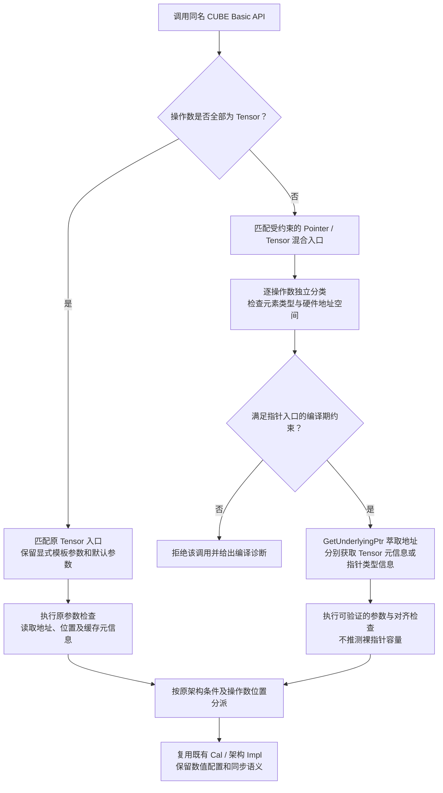
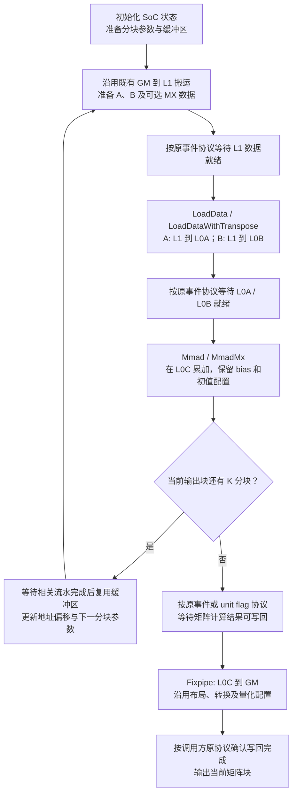
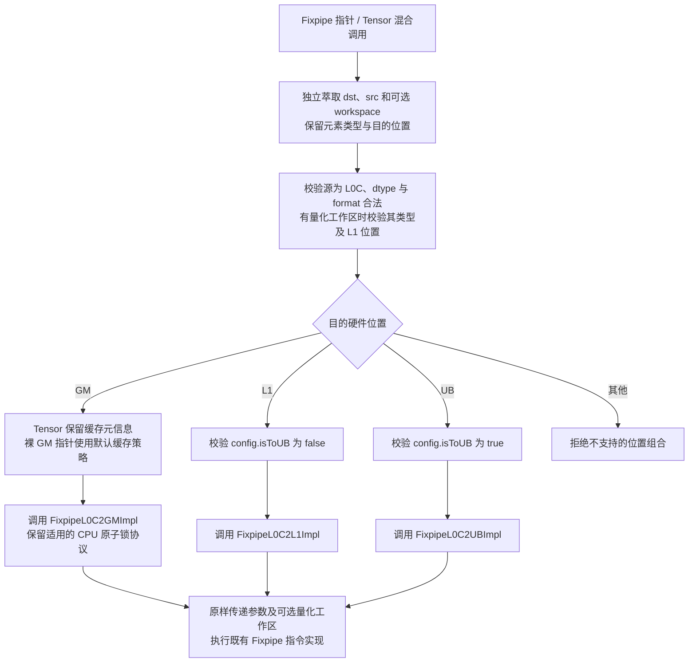

# AscendC Basic_API 优化实现（CUBE 侧矩阵类接口扩展）设计文档

开发者：Elyen41

目标代码仓：`cann/asc-devkit`，目标分支：`master`。

## 一、需求描述

### 1.1 需求来源

本设计对应[9 月社区任务：AscendC Basic_API 优化实现（CUBE 侧矩阵类接口扩展）](https://www.hiascend.com/activities/task-center/details/c30d2a46ff41457489bb552286986829?menu=tasks)。以[官方任务书](https://www.hiascend.com/p/resource/202609/e92f9622e9a64cb19ed8f9b0b0c6bca8.zip)及其第 2.4 节链接的 [CUBE 接口表](https://docs.qq.com/sheet/DYWVocVFXamRFQXBD?tab=000001)为需求依据。

现有 CUBE Basic API 使用 LocalTensor、GlobalTensor 表达操作数。使用硬件地址空间指针组织内存的 Kernel 需要自行构造 Tensor 才能调用矩阵接口。本任务扩展同名 API 的入参适配能力，使每个操作数能够独立使用 Tensor 或硬件指针，同时保留原有 Tensor 调用、参数结构、指令选择和数值语义。

本任务属于 Basic API 扩展，不新增 GE/aclnn 算子，不引入独立 op_host、tiling 或算子注册工程。VECTOR、DMA 分册中未列入 CUBE 表的接口不在修改范围内。

### 1.2 范围与口径

任务页描述 64 个接口，附件正文描述 21 个 API 名称、61 个重载；接口表 Sheet1 的第 2～61 行列出 60 个条目、18 个名称。条目数不等于独立 C++ 重载数：表中包含重复声明、CPU/Device 条件声明和成员函数。设计与覆盖矩阵保留原始行号，不将重复条目计为新增实现，也不据此宣称 64 个接口已经覆盖。数量口径及遗漏接口须在需求评审中确认。

| API 名称 | 接口表行号 | 条目数 | 设计关注点 |
| --- | --- | ---: | --- |
| DumpAccChkPoint | 2～3 | 2 | GM/Local 调试路径、index、countOff、dumpSize |
| DumpTensor | 4～7 | 4 | GM/Local、有无 ShapeInfo |
| Fixpipe | 8～23 | 16 | GM/L1/UB、量化工作区、各架构参数结构 |
| IBSet / IBWait | 24 / 25 | 各 1 | GM/UB 工作区、事件与核间可见性 |
| InitConstValue | 26 | 1 | L1/L0A/L0B 路由与元素类型 |
| InitDetermineComputeWorkspace | 27 | 1 | 工作区初始化与引用参数语义 |
| LoadData | 28～38 | 11 | 2D、3D、bit mode、MX、GM/Local 来源 |
| LoadDataWithTranspose | 39～40 | 2 | V1/V2 转置布局及步长单位 |
| LoadImageToLocal | 41 | 1 | 图像配置寄存器与目的地址空间 |
| Mmad | 42～45、58、60 | 6 | 普通/bit mode、有无 bias，保留重复条目映射 |
| MmadMx | 46～49、59、61 | 6 | MX 类型、有无 bias、普通/bit mode |
| NotifyNextBlock | 50 | 1 | 确定性核间同步 |
| PopStackBuffer | 51 | 1 | 输出引用、栈分配状态和生命周期 |
| SetAddrWithOffset | 52～53 | 2 | LocalTensor 成员、CPU/Device 声明、弃用标注 |
| SetFixPipeConfig | 54～55 | 2 | 单/双预处理缓冲区及 setRelu 模板参数 |
| SyncAll | 56 | 1 | isAIVOnly、usedCores、工作区隔离 |
| WaitPreBlock | 57 | 1 | 等待次序和同步配对 |

表中第 44/58、48/59、47/61 行存在相同签名；第 42/60 行的 MmadBitModeParams 引用 const 性不同，不能不经核对直接去重。SetAddrWithOffset 是 LocalTensor 成员，不能按同名自由函数处理。PopStackBuffer 是有输出与状态副作用的接口，不能按纯输入指针萃取处理。

### 1.3 产品与版本约束

目标产品为 Ascend 950 系列（950PR/950DT，`__NPU_ARCH__ == 3510`，编译目标 `dav-3510`）。新增能力不等于为其他架构开放原本不支持的指令。

任务书正文要求 CANN 9.0.0～9.1.0，附件中的矩阵样例 README 标注 CANN ≥9.2.0。该冲突需由任务维护者明确验收版本。实现保留各重载原有架构宏；例如当前源码中带 Nd2NzParamsV2 的 LoadData 重载仅在 5102 条件下声明，不得为满足条目计数而在 3510 下强行开放。测试应分别记录任务要求、编译器支持和样例实际依赖，不能将不支持条目作为通过项。

## 二、方案设计

### 2.1 整体结构

扩展遵循 `include/basic_api` 对外声明、`impl/basic_api` 模板实现、架构相关底层指令实现的层次。公开入口仍为 `kernel_operator.h`，调用名称仍为 LoadData、Mmad、Fixpipe 等。

调用过程为：操作数类型约束 → 独立萃取各操作数的地址、元素类型及必要元信息 → 按地址空间/架构分派 → 复用既有指令实现。适配层不分配 Device 缓冲区、不复制矩阵数据、不改变 DMA/CUBE 的同步次序。

源码中的部分 `*Impl` 仍接收 LocalTensor，并通过 GetPosition 决定硬件路由。因此不能只将外层参数替换成模板类型后直接传入指针；需要在这些共享封装层拆出地址与元信息适配，保留原有参数配置和底层 `*Cal`/架构 `*Impl` 调用。

| 模块 | 声明及实现位置 | 修改责任 |
| --- | --- | --- |
| 操作数适配 | 新增 CUBE 专用内部工具头，位于 `impl/basic_api/utils` | GetUnderlyingPtr、元素/操作数分类、硬件地址空间约束 |
| 矩阵加载/计算 | `kernel_operator_mm_intf.h`、`kernel_operator_mm_intf_impl.h`、`kernel_operator_mm_base_impl.h`、`kernel_operator_mm_load2d_impl.h` | CUBE 表内 LoadData、Mmad、MmadMx、InitConstValue 等适配 |
| Fixpipe | `kernel_operator_fixpipe_intf.h`、`kernel_operator_fixpipe_intf_impl.h` | 多操作数、目的路由、配置/量化/缓存策略 |
| 同步 | 对应 sync 与 determine_compute_sync 声明及实现 | 指针工作区、类型与对齐检查、原协议复用 |
| 调试 | `kernel_operator_dump_tensor_intf.h` 及对应实现 | 明确长度和 ShapeInfo，保留编译开关 |
| 状态接口 | `kernel_tensor.h`、`kernel_tensor_impl.h`、`kernel_pop_stack_buffer.h` 等表内符号 | 仅修改评审确认的成员/输出形式，保留状态语义 |
| 测试 | `tests/api/basic_api` 与相关官方矩阵样例 | 编译覆盖、负例、Tensor 回归、数值对比 |

同一头文件包含其他分册接口时，仅改动本表相关符号，不进行整文件机械泛化。

**图 1：同名 API 的调用分派与兼容路径。** 类型分类和指针重载选择发生在编译期；Tensor 的位置、缓存等元信息仍按原接口语义获取。

原调用路径仅包含图中的全 Tensor 分支；扩展增加受约束的指针/混合分支，在底层实现处汇合。图中的检查应遵循原调试开关和错误处理规则，不将运行期参数检查误作编译期常量检查。

### 2.2 操作数萃取与类型约束

每个操作数采用独立模板参数，例如 Dst、SrcA、SrcB、Bias、Workspace，不能要求 L0A、L0B、L0C 和 GM 指针共用同一个 T。已有显式元素模板参数和非类型模板参数的次序保持兼容；新增泛化入口通过约束仅在至少一个操作数为裸指针时参与重载决议，使全 Tensor 调用继续落在原有入口。

GetUnderlyingPtr 的规则如下：

1. 对硬件裸指针直接返回原地址，保留地址空间及 pointee const 属性；数组输入按地址空间指针退化处理。
2. 对 GlobalTensor 必须调用 GetPhyAddr，不使用对象地址或重新解释对象内存。
3. 对 LocalTensor 必须调用 GetPhyAddr。Device 模式下其返回值是整数地址，CPU 调试模式下为宿主指针，因此不能通过 `decltype(GetPhyAddr())` 无条件推导元素类型，也不能假定返回类型自带 L0A/L0B 信息。
4. 元素类型分别从 Tensor 的 PrimT 和裸指针的 pointee 提取；硬件位置分别来自 Tensor 元数据和裸指针的地址空间。packed 类型的存储与偏移单位仍以现有实现为准。
5. 多路径共享工具使用仓库 AscendC::Std 类型特征，避免给 Device 头文件增加宿主 STL 依赖。

| 地址空间 | 硬件位置 | 常见用途 |
| --- | --- | --- |
| `__gm__` | GM | LoadData 源、Fixpipe 目的、同步工作区 |
| `__cbuf__` | L1 | LoadData 源/目的、MX/量化数据 |
| `__ca__` | L0A | 左矩阵 |
| `__cb__` | L0B | 右矩阵 |
| `__cc__` | L0C | 累加结果及支持的 bias 来源 |
| `__ubuf__` | UB | Fixpipe 目的、同步工作区及允许的搬运目的 |
| bias 专用地址空间 | BIAS | 使用目标编译器正式支持的 bias 指针类型 |

无地址空间信息的普通 Device 指针不自动猜测为 L1 或 L0。CPU 模式抹去地址空间时，不能定义会重合的多个指针特化；使用具备显式位置的测试夹具验证分类，在 ASC 编译器上验证真实硬件指针重载。

只读源可在底层 API 支持的范围内接受 const pointee；目的指针指向 const 数据时给出编译诊断。裸指针不提供缓冲区容量，调用方负责有效长度、生命周期及对齐，适配层不得伪造 GetSize 或填入虚构的最大容量来绕过边界检查。片上地址 0 可以是有效本地地址，不能以普通宿主空指针规则统一拒绝。

### 2.3 矩阵类接口

**LoadData / LoadDataWithTranspose。** 保留原有 2D/3D 参数结构、defaultConfig、DstPos/SrcPos 模板位置、转置配置、MX 参数和 `__inout_pipe__(MTE2)` 标注。指针目的空间明确区分 L0A 与 L0B，GM 来源和 L1 来源分别走既有分支。3D 路径保留 FMatrix、padding 寄存器配置及 reset 配置行为。MX 的数据和 scale 操作数分别进行类型与位置约束。对 Tensor 保留原检查；对指针检查能够验证的参数、位置和对齐，不假造容量。

**Mmad / MmadMx。** 目的为 L0C，左右输入分别为 L0A、L0B。普通参数与 bit mode 参数保留原签名和 const 属性；复用原 MmadCal/MmadMxCal 数值逻辑。带 bias 路径须区分 BIAS 和 L0C，不能仅按 bias 的元素类型决定 cmatrixSource，也不能忽略 bit mode 中已经编码的配置。Tensor/Pointer 混合组合中，所有操作数均独立萃取。

**InitConstValue / LoadImageToLocal。** 保留原本允许的目的空间、数据类型与架构开关；指针适配不修改初始化数值、图像配置寄存器或填充布局。

**图 2：代表性矩阵乘的加载、计算与写回流程。** 图示选用 GM→L1→L0A/L0B→L0C→GM 通路；每个 CUBE API 的操作数可独立使用 Tensor 或对应地址空间指针。

本图表达数据依赖，不新增统一的全流水屏障；具体事件及缓冲区复用时序沿用各原始样例。GM→L1 搬运作为既有依赖使用，不扩展 DMA 分册接口。指针化改变的是 CUBE API 操作数的表达方式，矩阵分块、数据布局和数值计算顺序保持一致。

### 2.4 Fixpipe 与配置接口

Fixpipe 保留 T、U、config 及原量化工作区约束。目的端 GM、L1、UB 分别复用 FixpipeL0C2GMImpl、FixpipeL0C2L1Impl、FixpipeL0C2UBImpl；源必须对应 L0C。量化工作区仍为 L1 上符合原类型约束的数据，不将任意整数指针强转为 uint64_t 指针。

`FixpipeParamsArch3510<config.format>` 与 config.format 保持绑定；config.isToUB 必须与指针目的空间一致。M300/M310/V220 参数重载保留原版本适用性，不能仅根据结构体名称复制到所有目标架构。

GlobalTensor 的缓存策略继续使用其元数据；裸 GM 指针采用对应默认策略。参数结构包含的量化、relu、布局、stride、unit flag 均原样传递。CPU 调试模式已有的原子操作锁定与解锁行为不得因泛化而丢失。SetFixPipeConfig 保留单/双缓冲区形式与 setRelu 非类型模板参数。

**图 3：Ascend 950 Fixpipe 指针/混合入口的目的路由。** 对应 `FixpipeParamsArch3510<config.format>`；其他版本参数继续使用原有架构条件。

图中可由指针类型与 config 确定的非法组合在编译期拒绝；依赖 Tensor 运行期元信息的检查沿用原机制。图 3 的强化约束用于新增入口，全 Tensor 调用继续遵循图 1 的兼容路径。

### 2.5 同步、调试及状态接口

IBSet、IBWait、SyncAll 及确定性同步接口只适配工作区获取方式，保留 GM/UB 协议、int32_t 类型、blockIdx、eventID、usedCores、isAIVOnly 和原来的内存可见性操作。禁止用空函数或单核分支代替跨核协议。运行用例须包含多核生产者/消费者和重复轮次，并设置外部超时检测失配或死锁。

DumpTensor 和 DumpAccChkPoint 保留调试开关与原输出格式，长度从 dumpSize/countOff/ShapeInfo 获得。带 ShapeInfo 的路径需检验维度与数据长度的一致性，不从裸指针推测形状；地址越界责任与公开约束应清楚区分。

PopStackBuffer 的指针输出设计必须以引用或等价显式输出形式返回分配地址，成功状态与原栈分配机制一致，失败时输出不得引用无效新缓冲区。管理对象和生命周期仍由既有栈机制负责，不能对已经拥有的指针调用 GetUnderlyingPtr 来冒充一次弹栈。

SetAddrWithOffset 的两条记录是成员声明，且 Device 路径已有弃用标注。原成员接口与弃用信息保留。若要求新增裸指针源成员重载，必须明确源容量、位置和目标 Tensor 元信息的来源；只提供指针及 offset 不能恢复全部 Tensor 元数据。该条目的新增签名与容量契约在评审时单独确认，不引入语义不同的同名自由函数充数。

### 2.6 兼容性与资源

全 Tensor 入口维持现有显式模板调用方式、默认参数、架构宏和调试行为。约束化指针重载避免捕获标量、配置参数或不相关类型。内部共享实现仅提取重复的地址适配，不更改底层数值指令和同步语义。

适配阶段只涉及地址和固定规模元数据，额外 Device 数据内存为零，不增加随 M/N/K 线性增长的拷贝或工作区。保持 `__aicore__ inline` 和原有流水线属性，使编译器能够消除类型适配。

### 2.7 测试用例设计

建立“原始表行号 → 声明/架构条件 → 对应实现 → 编译用例 → 运行用例”的覆盖矩阵。重复记录映射到同一实现，非 3510 重载明确记录其限制；覆盖统计不将跳过、不可用、未执行计为通过。

| 测试组 | 参数与覆盖内容 | 预期判定 |
| --- | --- | --- |
| 编译正例 | 所有表内有效重载；全 Tensor、全 Pointer、逐操作数混合；原显式模板参数；普通/bit mode；有无 bias/workspace | 符合所属架构的调用编译成功，无歧义 |
| 编译负例 | 错误 GM/L1/L0A/L0B/L0C/UB 组合、const 目的、错误 dtype/MX 类型、量化工作区类型、config 与目的空间不符 | 编译阶段拒绝或按原公开约束给出诊断 |
| 原始样例回归 | 附件全部官方工程及各自 SCENARIO_NUM；使用改造前与改造后的 Tensor 入口 | 原始精度校验通过且行为一致 |
| 指针迁移 | 官方矩阵加载、Mmad/MmadMx、Fixpipe 样例的独立副本 | 相同输入下与 Tensor 路径符合精度标准 |
| 数据与形状 | 合法数值域内的 [-100,100]、0、符号变化；1/32/1024/2048 按矩阵维度与硬件对齐限制等价缩放 | 数值满足标准，逻辑尾部与 padding 无越界影响 |
| 配置分支 | 转置、padding、非单位 stride、累加初值、bias 来源、量化、relu、unit flag | 与对应 Tensor 设置一致 |
| 边界与存储 | 合法非零偏移、片上首地址、packed 类型、MX scale、guard 区域 | 指针定位正确，目标范围外数据不变 |
| 同步 | 单核合法调用、多核配对、多轮次、合法不同 usedCores | 数据可见、顺序正确、无超时 |
| 调试与状态 | Dump 开关、ShapeInfo、检查点偏移、栈成功/失败、成员偏移契约 | 输出内容及状态副作用符合公开定义 |

每个数值用例使用固定随机种子生成一次输入，分别运行上游 Tensor、扩展后 Tensor、Pointer 和混合版本。原始官方目录保持只读，构建和迁移在独立工作目录进行。最终验收从个人仓指定提交重新克隆，使用新的构建目录，确保测试对象与交付代码一致。

## 三、可维可测分析

### 3.1 精度与性能标准

精度遵循任务书引用的[生态算子开源精度实验标准](https://gitcode.com/cann/opbase/blob/master/docs/zh/ops_precision_standard/experimental_standard.md)。使用接口对应 dtype 的标准，不用一个统一的宽松 allclose 阈值覆盖所有类型。纯数据搬运/调试输出在格式与位表示不变的前提下逐元素或逐字节对比；涉及浮点累加、转换和量化时使用对应精度判据。

本任务无额外性能标杆要求。可选对比使用相同输入、配置、同步和编译选项的 Tensor/Pointer 路径，评估适配是否产生额外指令或拷贝。性能测量属于测试报告内容，不作为设计文档中的实测结论。

### 3.2 工程质量

遵循 asc-devkit 基础 API 贡献指南、代码规范、Header Checker 和仓库测试要求。检查公开头文件自包含关系、内部头保护、模板默认参数重复定义、架构宏及 CPU/Device 编译分支。对全 Tensor 与原显式模板调用提供编译回归，防止新重载静默改变既有调用选择。

### 3.3 评审需确认的技术事项

1. 64/61/60 的接口数量差异，18/21 个 API 名称差异及缺失接口列表。
2. 任务正文 CANN 9.0～9.1 与附件样例 CANN ≥9.2 的验收版本冲突。
3. 表内非 3510 架构接口的交付口径，以及 SetAddrWithOffset 的成员指针扩展签名和元信息契约。
4. PopStackBuffer 裸指针输出的生命周期与容量契约，以及与其他分册共享 GetUnderlyingPtr 工具的归属边界。

这些事项不改变明确的基本要求：保留 Tensor 兼容性，支持硬件指针输入，复用底层数值语义，并在 Ascend 950 上完成对应测试。
