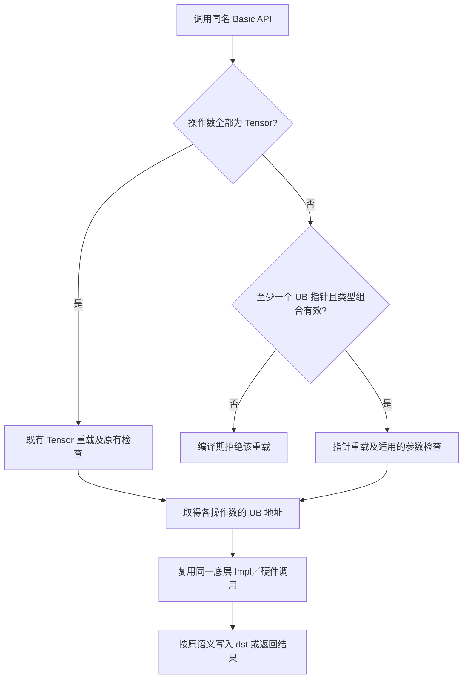
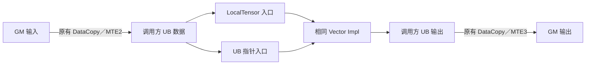

# Ascend C Basic API指针化扩展（VECTOR分册）设计文档

> 社区任务：09-Basic_API_VECTOR；参与任务昵称／GitCode账号：LL233LL。本文是设计方案，尚未实现代码或执行实验。拟支持Ascend 950系列、CANN 9.0.0～9.1.0；具体编译能力以交付时仓库版本为准。

# 一、需求描述

## 1.1需求来源

社区任务要求将Ascend C Basic API的VECTOR分册由仅接受`LocalTensor`操作数，扩展为同名API可接受UB裸指针（如`__ubuf__ T*`），并允许同一次调用中指针和Tensor操作数混用。已有Tensor调用的参数、结果、调试行为和同步语义应保持兼容。对外封装及硬件实现分别位于`asc-devkit/include/basic_api`、`asc-devkit/impl/basic_api`；本设计不新增框架算子、aclnn接口、Host Tiling、Kernel算法或数值公式。

本设计依据任务书、[VECTOR官方接口表](https://docs.qq.com/sheet/DYVNBU3BUUVdVRFRu?tab=000001)、[社区设计文档模板](https://gitcode.com/cann/cann-ops-competitions/blob/master/04_tasks/01_community-task-2026/resources/design_template.md)及[已评审设计实例](https://gitcode.com/cann/asc-devkit/issues/1222)。2026年9月16日再次逐行核对接口表，得到 **256行重载签名、85个不同接口名**。任务书仍称“79个接口名、245个重载签名”；当前表格比任务书多6个接口名和11行签名。与前次读取的78个名称、245行签名相比，表格新增`Ors`及6个`NumericLimits<T>`缓冲写入接口，同时将`Ands`从1行扩为3行。交付范围以官方表格当前实际列出的签名为准；不擅自补入未列出的符号。若社区再次更新表格，应先核对差异再修订清单。

## 1.2需求分析与功能边界

本需求改变的是 **Basic API的操作数表示方式**，而不是计算函数本身。例如`Add(dst, src0, src1, ...)`仍逐元素相加，`Cast`仍按`RoundMode`转换，`ReduceSum`仍按已有归约规则工作。指针仅取代指向UB数据的`LocalTensor`形参；标量、`mask`、`repeatTime`、`*RepeatParams`、模式、计数和返回值保持原有类型、顺序与含义。

既有硬件调用通常已经将`LocalTensor<T>`通过`GetPhyAddr()`转为`__ubuf__ PrimType*`再进入底层实现，因此指针路径应在公开封装层完成静态适配，复用相同硬件路径。Tensor路径保留原有重载和检查，避免泛型重载改变重载决议或跳过既有诊断。新重载仅在至少一个可指针化操作数为UB指针时参与重载决议；每个操作数独立推导类型，以支持混用。

清单包括逐元素、复合计算、比较选择、类型转换、归约、Gather／Scatter、填充广播、排序和数据重排等接口。`MrgSort`的`MrgSortSrcList<T>`、`Sort`的可写临时Tensor、`Select`的标量源、`TransDataTo5HD`的固定长度Tensor数组、`NumericLimits<T>`的静态成员、`GetCmpMask`／`SetCmpMask`等需要按现有签名分别处理，不能机械地把每个模板类型或结构体改成指针。接口表中的两行`GetAbsAddr`属于`kernel_tpipe.h`的CPU Debug地址换算入口，且现有接口已标记废弃；它们不进入Vector硬件`*Impl`，需独立保留条件编译、返回值及废弃标记。官方表格未列出的矩阵／Cube、搬运分册、Proposal拆分符号，以及任务书概述中出现但表格没有签名的双线性插值／队列同步符号，不纳入本PR。

## 1.3验收目标与约束

| 目标 | 设计约束 |
| --- | --- |
| 指针调用 | 表中每个含Local UB操作数的重载提供对应指针入口；特殊容器签名提供等价的指针表示 |
| 混合调用 | 各数据操作数可独立采用Tensor或UB指针；相应数据类型与原API约束一致 |
| Tensor兼容 | 旧重载、模板默认值、返回值、检查、目标架构分支及同步属性保持不变 |
| 数值一致 | 相同地址、布局、参数下，两条入口进入同一硬件实现；不调整底层`*Impl`数值逻辑 |
| 内存与性能 | 适配为编译期静态分派，不新增随输入长度增长的Device拷贝、临时UB或Host工作区 |
| 支持环境 | Ascend 950系列；CANN 9.0.0～9.1.0；地址空间、对齐和数据类型服从每个既有API约束 |

# 二、方案设计

## 2.1接口内部实现与数据流

对普通单个UB操作数，在封装层定义指针／Tensor萃取规则：UB指针保持原值；`LocalTensor<T>`取得物理地址。原Tensor重载继续执行已有`CheckVectorTensor`、`CheckTensorAlign`、`CheckTensorPos`、CPU Debug与DFX检查；新指针重载静态限制为UB地址空间和允许的数据类型，并保留可用于指针的`mask`、计数、repeat等公共检查。不能把只接受Tensor的检查函数直接用于指针。裸指针的容量、生命周期和实际地址有效性由调用方按原硬件API合同保证；必要的指针诊断以当前Debug能力实现，不改变Release数值路径。



图1：普通Vector计算API的对外入口、类型约束与底层复用流程。图中的“编译期拒绝”仅表示模板不匹配或静态断言，不是新增Device运行时分支。`GetAbsAddr`按下文的CPU Debug流程单独处理。

封装层的内部辅助类型需要分别识别：`LocalTensor<T>`的元素类型、`__ubuf__ T*`的被指向类型、带地址空间限定的指针，以及是否有任一UB指针。Tensor实参应优先命中原重载；不允许`__gm__`、L1／L0指针冒充Local UB操作数。具体trait名称和地址空间识别方式由实现阶段对照仓库所用的Ascend C编译器类型系统确定，不把普通主机C++ 的`std::is_pointer`结果当作唯一依据。

## 2.2算子原型与公开接口设计

下列是拟增加的 **公开重载形态**；`EnableUbPointerOperands`表示仅当至少一个UB操作数为裸指针、且元素类型／地址空间满足该API原约束时使重载有效的内部trait。实际trait写法应遵循`asc-devkit`的C++ 方言。所有列出的原Tensor重载继续保留；表中没有列出的变体仍须逐行对照官方256行表格实现，而不是只实现示例。

### 2.2.1普通逐元素、类型转换与索引接口

```cpp
namespace AscendC {

// Add 的 mask-count、mask-bit 和 count 三种既有参数形式分别保留。
template <typename Dst, typename Src0, typename Src1, bool isSetMask = true,
          typename = EnableUbPointerOperands<Dst, Src0, Src1>>
__aicore__ inline void Add(const Dst& dst, const Src0& src0, const Src1& src1,
    uint64_t mask, uint8_t repeatTime, const BinaryRepeatParams& repeatParams);

template <typename Dst, typename Src0, typename Src1, bool isSetMask = true,
          typename = EnableUbPointerOperands<Dst, Src0, Src1>>
__aicore__ inline void Add(const Dst& dst, const Src0& src0, const Src1& src1,
    uint64_t mask[], uint8_t repeatTime, const BinaryRepeatParams& repeatParams);

template <typename Dst, typename Src0, typename Src1,
          typename = EnableUbPointerOperands<Dst, Src0, Src1>>
__aicore__ inline void Add(const Dst& dst, const Src0& src0, const Src1& src1,
    const int32_t& count);

// Cast 的目的和源数据类型分别推导；RoundMode 不改变。
template <typename Dst, typename Src, bool isSetMask = true,
          typename = EnableUbPointerOperands<Dst, Src>>
__aicore__ inline void Cast(const Dst& dst, const Src& src, const RoundMode& roundMode,
    uint64_t mask, uint8_t repeatTime, const UnaryRepeatParams& repeatParams);

// Gather 的 offset 操作数保持 uint32_t 元素类型，可独立采用指针。
template <typename Dst, typename Src, typename Offset,
          typename = EnableUbPointerOperands<Dst, Src, Offset>>
__aicore__ inline void Gather(const Dst& dst, const Src& src, const Offset& srcOffset,
    uint32_t srcBaseOffset, uint32_t count);

// Scatter 对称处理 dstOffset，原地址单位及越界合同不改变。
template <typename Dst, typename Src, typename Offset,
          typename = EnableUbPointerOperands<Dst, Src, Offset>>
__aicore__ inline void Scatter(const Dst& dst, const Src& src, const Offset& dstOffset,
    uint32_t dstBaseAddr, uint32_t count);

// Ands 和 Ors 均有 count、mask[]、mask 三种当前签名。
template <typename T = BinaryDefaultType, bool isSetMask = true,
          const BinaryConfig& config = DEFAULT_BINARY_CONFIG,
          typename Dst, typename Src0, typename Src1,
          typename = EnableUbPointerOperands<Dst, Src0, Src1>>
__aicore__ inline void Ands(const Dst& dst, const Src0& src0, const Src1& src1,
    const int32_t& count);

template <typename T = BinaryDefaultType, bool isSetMask = true,
          const BinaryConfig& config = DEFAULT_BINARY_CONFIG,
          typename Dst, typename Src0, typename Src1,
          typename = EnableUbPointerOperands<Dst, Src0, Src1>>
__aicore__ inline void Ors(const Dst& dst, const Src0& src0, const Src1& src1,
    uint64_t mask, const uint8_t repeatTime, const UnaryRepeatParams& repeatParams);

} // namespace AscendC
```

`Add`同类型操作数要求`dst`／`src0`／`src1`的底层元素类型一致；`Cast`保留原有源、目标数据类型及`RoundMode`组合；`Gather`／`Scatter`的offset始终是`uint32_t`，不能因它被指针化而放宽索引规则。`Ands`／`Ors`保留`BinaryConfig`、`isSetMask`及目标架构的`__ASC_USE_RESERVED_UBUF__`属性；`src0`／`src1`仍须恰有一方为标量或单点Local UB数据，不能把标量值误判为指针操作数。`__ubuf__ T*`的`T`应与现有`PrimT<T>`和芯片支持的数据类型集合相容。示例中省略的`mask[]`、repeat或count变体均采用相同参数位置和类型。

### 2.2.2归约、比较选择及特殊操作数

```cpp
namespace AscendC {

// 临时空间是 UB 数据操作数，不新增或隐式申请新的空间。
template <typename Dst, typename Src, typename Tmp, bool isSetMask = true,
          typename = EnableUbPointerOperands<Dst, Src, Tmp>>
__aicore__ inline void ReduceSum(const Dst& dst, const Src& src,
    const Tmp& sharedTmpBuffer, int32_t count);

// Select 的 selMask 是数据操作数；若原签名的 src1 为标量，保持标量 T。
template <typename Dst, typename SelMask, typename Src0, typename Src1,
          bool isSetMask = true,
          typename = EnableUbPointerOperands<Dst, SelMask, Src0, Src1>>
__aicore__ inline void Select(const Dst& dst, const SelMask& selMask,
    const Src0& src0, const Src1& src1, SELMODE selMode,
    uint64_t mask, uint8_t repeatTime, const BinaryRepeatParams& repeatParams);

// GetCmpMask 和 SetCmpMask 各自只有一个 Local UB 操作数。
template <typename Dst, typename = EnableUbPointerOperands<Dst>>
__aicore__ inline void GetCmpMask(const Dst& dst);
template <typename Src, typename = EnableUbPointerOperands<Src>>
__aicore__ inline void SetCmpMask(const Src& src);

// Compare 没有 dst 形参，结果写入比较掩码寄存器；CMPMODE 和 mask 保留。
template <typename Src0, typename Src1, bool isSetMask = true,
          typename = EnableUbPointerOperands<Src0, Src1>>
__aicore__ inline void Compare(const Src0& src0, const Src1& src1,
    CMPMODE cmpMode, const uint64_t mask, const BinaryRepeatParams& repeatParams);

// Select 的标量源版本不能把 T src1 解释为 UB 地址。
template <typename T, typename U, bool isSetMask = true,
          typename Dst, typename Mask, typename Src0,
          typename = EnableUbPointerOperands<Dst, Mask, Src0>>
__aicore__ inline void Select(const Dst& dst, const Mask& selMask,
    const Src0& src0, T src1, SELMODE selMode, uint64_t mask,
    uint8_t repeatTime, const BinaryRepeatParams& repeatParams);

template <typename T>
__aicore__ inline void SetDeqScale(__ubuf__ T* vdeq, const VdeqInfo& vdeqInfo);

} // namespace AscendC
```

以上`Select`仅展示四个 **数据操作数** 都可采用指针的形式。官方表中的`Select`共11行，其中第191～193行已有模板化的`dst`／`src0`／`src1`，但`selMask`仍固定为`LocalTensor<T1>`；第195、196、199行的`T src1`为标量。实现必须保留各版本原有`T0`／`T1`／`BinaryConfig`默认值、`SELMODE`、mask形式与标量语义，并从指针版`selMask`的元素类型推导原`T1`语义。不能将标量`T src1`变为地址操作数。`GetCmpMask`／`SetCmpMask`的16字节对齐合同及寄存器副作用需保持；原Tensor诊断继续执行。

### 2.2.3排序、列表与固定数组

```cpp
namespace AscendC {

// 指针列表只保存四个 UB 地址；原 MrgSortSrcList<T> 仍保持原形。
template <typename T> struct MrgSortSrcPtrList {
    __ubuf__ T* src1;
    __ubuf__ T* src2;
    __ubuf__ T* src3;
    __ubuf__ T* src4;
};

// 混合列表的四个成员分别推导，可在同一列表中混用 Tensor 和 UB 指针。
template <typename T, typename Src1, typename Src2, typename Src3, typename Src4>
struct MrgSortSrcMixedList {
    Src1 src1;
    Src2 src2;
    Src3 src3;
    Src4 src4;
};

template <typename T, bool isExhaustedSuspension = false, typename Dst,
          typename = EnableUbPointerOperands<Dst, MrgSortSrcPtrList<T>>>
__aicore__ inline void MrgSort(const Dst& dst, const MrgSortSrcPtrList<T>& sortList,
    const uint16_t elementCountList[4], uint32_t sortedNum[4], uint16_t validBit,
    int32_t repeatTime);

template <typename T, bool isExhaustedSuspension = false, typename Dst,
          typename Src1, typename Src2, typename Src3, typename Src4,
          typename = EnableUbPointerOperands<Dst, Src1, Src2, Src3, Src4>>
__aicore__ inline void MrgSort(const Dst& dst,
    const MrgSortSrcMixedList<T, Src1, Src2, Src3, Src4>& sortList,
    const uint16_t elementCountList[4], uint32_t sortedNum[4], uint16_t validBit,
    int32_t repeatTime);

// dst 为指针、四个源仍为原 MrgSortSrcList<T> 时也必须可调用。
template <typename T, bool isExhaustedSuspension = false, typename Dst,
          typename = EnableUbPointerOperands<Dst>>
__aicore__ inline void MrgSort(const Dst& dst, const MrgSortSrcList<T>& sortList,
    const uint16_t elementCountList[4], uint32_t sortedNum[4], uint16_t validBit,
    int32_t repeatTime);

template <typename T, bool isFullSort, typename Dst, typename Concat,
          typename Index, typename Tmp,
          typename = EnableUbPointerOperands<Dst, Concat, Index, Tmp>>
__aicore__ inline void Sort(const Dst& dst, const Concat& concat, const Index& index,
    Tmp& tmp, int32_t repeatTime);

template <typename Dst, typename Src, typename Tmp,
          typename = EnableUbPointerOperands<Dst, Src, Tmp>>
__aicore__ inline void Transpose(const Dst& dst, const Src& src,
    const Tmp& sharedTmpBuffer, const TransposeParamsExt& transposeParams);

} // namespace AscendC
```

`MrgSortSrcList<T>`是内含四个`LocalTensor<T>`的结构，不能直接向`GetUnderlyingPtr`传整个结构。全指针版用明确的四地址列表；混合版逐成员萃取地址，四个源的底层元素类型仍须为`T`且指针必须位于UB，另为指针`dst`加原列表提供受限入口。各入口与旧路径共用地址数组打包及`Vmrgsort4Cal`硬件调用。原有`validBit`、元素长度、耗尽暂停和`sortedNum`语义不变；CPU Debug中对未启用列表项的处理需要与原路径一致。`Sort`的`index`固定为`uint32_t`，`tmp`是可写临时缓冲区；不能将原`LocalTensor<T>& tmp`意外变为只读数据。`Sort<T, isFullSort>`和`MrgSort<T, isExhaustedSuspension>`的显式模板实参顺序必须与旧入口一致；普通指针接口若无法同时自动推导元素类型并保留旧式显式实参写法，应提供受限转发重载，不能让已有显式调用失效。`Transpose`的另一行无临时空间签名亦需扩展。`TransDataTo5HD`的固定长度`LocalTensor<T>(&list)[NCHW_CONV_ADDR_LIST_SIZE]`应新增同长度UB指针数组入口，不改变数组长度、流水线属性与同步标注。其具体地址表示需随原声明中的`__check_sync_alias__`等属性一并核对。

`TransDataTo5HD`的两行现有原型分别为单对`LocalTensor<uint64_t>`数据地址和两组定长`LocalTensor<T>`数组。拟增加的指针入口形态如下，两个数组可分别取Tensor元素或UB指针元素，但数组内仍为同一元素类型；`EnableUbPointerOperands`只在至少一个数组使用指针时有效。

```cpp
namespace AscendC {

template <typename T, typename Dst, typename Src,
          typename = EnableUbPointerOperands<Dst, Src>>
__aicore__ inline __check_sync_alias__ __in_pipe__(S) __out_pipe__(V)
void TransDataTo5HD(const Dst& dst, const Src& src,
    const TransDataTo5HDParams& nchwconvParams);

template <typename T, typename DstEntry, typename SrcEntry,
          typename = EnableUbPointerOperands<DstEntry, SrcEntry>>
__aicore__ inline __check_sync_alias__
void TransDataTo5HD(const DstEntry (&dstList)[NCHW_CONV_ADDR_LIST_SIZE],
    const SrcEntry (&srcList)[NCHW_CONV_ADDR_LIST_SIZE],
    const TransDataTo5HDParams& nchwconvParams);

} // namespace AscendC
```

单对入口的底层元素类型固定为`uint64_t`，不能因原模板形参`T`未用于数据类型而放宽。数组入口继续验证数组长度和每项元素类型，不用退化为指向首元素的裸指针以免丢失长度合同。两行的同步／流水线属性必须与各自原声明一致。

### 2.2.4CPU Debug地址接口

```cpp
#if defined(ASCENDC_CPU_DEBUG) && ASCENDC_CPU_DEBUG == 1
namespace AscendC {

// 与现有 TPipe* + LocalTensor<T>、TPipe::GetAbsAddr(LocalTensor<T>) 两行对应。
template <typename T>
inline uint64_t GetAbsAddr(TPipe* tpipe, __ubuf__ T* tensor);

template <typename T>
inline uint64_t TPipe::GetAbsAddr(__ubuf__ T* tensor);

} // namespace AscendC
#endif
```

这两行只在CPU Debug构建中有效，保留已有废弃属性／提示，不新增Device侧Vector计算入口。现有Tensor实现读取`GetPosition()`和`GetPhyAddr()`，支持UB或L1；新指针入口只接受已知UB地址，以`TPipe`持有的UB基址求相对偏移，沿用原有UB范围与基址检查，不能从裸指针臆造Tensor位置元数据，也不能让L1指针命中该入口。成员版本访问自身缓冲池，非成员版本通过`TPipe*`访问相同缓冲池；调用方须保证`TPipe*`非空且指针来自对应的UB缓冲池，偏移范围断言不能证明裸指针的缓冲池归属。`__ubuf__`限定在CPU Debug编译路径中的可用性、旧版CANN声明差异以及废弃接口是否仍要求新增重载，需在实现前与`asc-devkit`当前头文件和社区维护者确认；若版本不提供对应旧入口，不凭表格单独造出新API。

### 2.2.5数值极限填充接口

最新接口表在`kernel_operator_limits_intf.h`中新增6行`NumericLimits<T>`静态成员。它们不是无参的标量查询函数，而是把对应常量填充到Local UB目的缓冲区。指针重载保持类模板和`count`语义，复用已经完成指针适配的`Duplicate`入口。

```cpp
namespace AscendC {

template <typename T>
struct NumericLimits {
    __aicore__ static inline void DeNormMin(__ubuf__ T* dst, uint32_t count);
    __aicore__ static inline void Infinity(__ubuf__ T* dst, uint32_t count);
    __aicore__ static inline void Lowest(__ubuf__ T* dst, uint32_t count);
    __aicore__ static inline void NegativeInfinity(__ubuf__ T* dst, uint32_t count);
    __aicore__ static inline void QuietNaN(__ubuf__ T* dst, uint32_t count);
    __aicore__ static inline void SignalingNaN(__ubuf__ T* dst, uint32_t count);
};

} // namespace AscendC
```

每个入口调用同名无参成员获得标量位模式，再调用`Duplicate(dst, value, count)`。原有Tensor成员继续保留。不同目标架构对整数、`half`、`float`及`bfloat16_t`的支持集合和静态断言保持不变；无意义的NaN／无穷值数据类型不得因指针重载而获得新支持。

按接口族逐行映射的规则如下；附录A列出全部名称与重载行数，官方表格的各行原型仍是实现时的逐项核对依据。

| 接口族 | 代表接口 | 指针化形参及保留项 |
| --- | --- | --- |
| 一元／二元／标量 | `Abs`、`Add`、`Adds`、`Axpy` | Local UB数据操作数独立推导；`scalarValue`、mask与repeat配置保持 |
| 类型转换／复合计算 | `Cast`、`CastDequant`、`AddReluCast` | 源／目标底层类型分别校验；`RoundMode`、deq配置及返回语义保持 |
| 比较／选择／掩码 | `Compare`、`Select`、`GetCmpMask`、`SetCmpMask` | `selMask`等Local UB数据缓冲可选指针；模式、普通`mask[]`及标量版本保持 |
| 索引／填充／广播 | `Gather`、`Scatter`、`Duplicate`、`Brcb` | offset／index的`uint32_t`约束、地址单位和有效长度保持 |
| 归约 | `ReduceSum`、`ReduceMax`、`ReducePairElem` | 目的、源和临时UB缓冲分别适配；归约布局与临时空间容量保持 |
| 排序／重排 | `MrgSort`、`Sort`、`Transpose`、`TransDataTo5HD` | 列表、可写tmp及定长数组单独设计；同步属性与底层指令保持 |
| 位运算标量／数值极限 | `Ands`、`Ors`、`NumericLimits<T>`的6个填充成员 | 标量／单点数据不误判；数值位模式、dtype和架构约束保持 |
| CPU Debug地址换算 | `GetAbsAddr`的两行 | 仅UB指针、相对地址返回值、条件编译与废弃标记保持；不进入Vector`*Impl` |

## 2.3形参语义、约束及异常行为

| 形参／属性 | 原语义与新指针语义 | 约束和不满足时的行为 |
| --- | --- | --- |
| `dst`／`src`／`src0`／`src1` | UB上输出／输入数据；Tensor或`__ubuf__ T*`可独立选用 | 非UB地址空间、错误元素类型在编译期拒绝；无效地址、容量不足及未对齐遵守原硬件API合同 |
| offset／index／selMask／tmp | 仍为数据操作数，仅其UB表示可选 | `uint32_t` offset／index、mask类型及tmp容量等专属规则保持 |
| `scalarValue`／标量`src1` | 标量值，不指针化 | 类型、转换和取值约束保持原签名 |
| `mask`／`mask[]`／`repeatTime`／`*RepeatParams` | 掩码和重复执行配置 | 原mask模式、步长、取值与诊断保持；不将mask数组误认作数据指针 |
| `count`／模式／`RoundMode` | 有效元素数及操作模式 | 类型、单位、合法集合和默认值保持 |
| 地址重叠与同步 | 原API允许或禁止的别名关系及PIPE依赖 | 不增添新的重叠许可；调用方按既有同步规则安排MTE／V流水 |
| 返回值或寄存器副作用 | 原API输出方式 | 不改为统一`void`／`dst`写回；`GetCmpMask`等副作用与原行为一致 |
| `GetAbsAddr`的UB指针 | CPU Debug中以对应`TPipe`的UB基址计算相对地址 | 仅接受UB缓冲池地址；保留废弃标记与范围断言，不承诺L1裸指针换算 |

指针传值不提供Tensor的长度、位置或对齐元数据，故设计不能承诺自动发现所有非法指针。Debug路径可校验可观测的地址对齐和公共参数；无法从裸指针验证的UB容量、生命周期与数据布局须在接口说明中明确由调用方保证。Tensor路径的现有Debug检查不能删除以追求统一封装。

## 2.4工程落点与实现顺序

1. 在`include/basic_api`对照官方256行清单，标记每个真正的Local UB数据形参、标量及特殊容器；保持原Tensor声明不变。
2. 在`impl/basic_api`建立地址／元素类型萃取及指针重载使能trait；普通接口按一元、二元、标量、类型转换、比较选择、归约等族复用既有`*Impl`。
3. 对`MrgSort`、`Sort`、`Select`、`TransDataTo5HD`逐个处理结构、可写临时空间、标量及数组形参，保留原硬件调用与同步属性；为`NumericLimits<T>`的6个填充成员复用指针版`Duplicate`；对`GetAbsAddr`单独核对CPU Debug条件、基址换算和废弃状态。
4. 将Tensor和指针路径的参数校验分离：Tensor的现有检查继续保留，指针路径使用能够接受地址的校验；检查所有模板默认参数、混合调用及架构条件编译。
5. 实现阶段再使用`asc-devkit/examples/01_simd_cpp_api/03_basic_api/`的官方矢量样例验证；本设计阶段不执行或声称任何精度、性能实验。

## 2.5性能与内存方案

这里不存在算子级Host分核、Tiling Key或Kernel CopyIn／Compute／CopyOut的新算法。调用方原有分核、UB分配、`DataCopy`和PIPE同步仍负责数据流。指针入口在编译期选择类型并提取现有UB地址，应生成与Tensor入口相同的底层硬件调用；不分配新UB缓冲区，不为指针转Tensor而搬运输入。数值、掩码和重复执行参数不变。任务书性能指标为“无”；实现阶段可比较指令序列及官方样例执行时间以检查回退，但本设计不填报实测值。



图2：已有样例的数据路径；本需求只在UB到Vector Impl的入口处改变操作数表示。

# 三、可维可测

## 3.1精度标准与后续验证设计

精度对照按任务书引用的[生态算子开源实验标准](https://gitcode.com/cann/opbase/blob/master/docs/zh/ops_precision_standard/experimental_standard.md)执行。预定输入范围`[-100, 100]`，元素数`1`、`32`、`1024`、`2048`；每组相同地址布局和参数比较：改造前／保留的Tensor入口、指针入口、混合入口，并核对官方样例的基准结果。比较或位运算类按原API的离散结果检查，浮点类按引用标准和现有样例的dtype规则检查，不自行更改`*Impl`容差。

| 用例族 | 拟覆盖重点 | 判定目标 |
| --- | --- | --- |
| 一元、二元、标量 | `Abs`、`Add`、`LeakyRelu`；mask-count、mask-bit、count重载 | 旧Tensor调用回归；指针／混合结果与对应Tensor结果一致 |
| 类型转换与复合计算 | `Cast`、`CastDequant`、`AddReluCast`；合法`RoundMode`与dtype组合 | 源／目标类型约束及结果一致 |
| 比较选择 | `Compare`、`Select`、`GetCmpMask`／`SetCmpMask`；标量源与数据源区分 | mask、模式、寄存器副作用一致 |
| 索引与归约 | `Gather`／`Scatter`的`uint32_t`偏移；`ReduceSum`的tmp | 索引单位、临时空间及输出一致 |
| 排序和重排 | `MrgSort`列表、`Sort`的tmp、`Transpose`与指针数组 | 列表次序、固定长度、同步／别名合同一致 |
| 标量位运算与极限值 | `Ands`／`Ors`三种参数形式；6个`NumericLimits<T>`填充成员 | 标量／单点约束、常量位模式、dtype和架构分支一致 |
| CPU Debug地址 | `GetAbsAddr(TPipe*, ...)`与成员入口 | UB相对偏移、越界断言、废弃标记及条件编译一致 |
| 编译期负例 | GM指针、错误dtype、错误offset类型、无合法重载 | 不错误选中指针重载；Tensor-only原重载仍可编译 |

上表是**测试设计**，没有测试代码、日志、截图或结果。实现后才可据此执行自验证并填写报告。官方样例目录`01_memory_vector_compute`、`02_reg_vector_compute`可用于覆盖基础矢量场景；未列入本册的样例API不在本任务中单独改造，但应保持回归正常。

## 3.2性能标准与内存检查

任务书无额外性能指标或标杆时延要求。实现阶段应检查指针重载没有产生线性规模Device拷贝和额外UB空间，并核对同参数下Tensor／指针路径汇入相同底层调用；必要时以官方样例做可选时延比较。文档评审阶段不提供性能数字，性能测试case可记为“无”。

## 3.3兼容性与可维护性分析

保留Tensor-only公共重载是兼容性的首要措施。适配trait与各族封装要共享同一元素类型、地址空间和`*Impl`路由规则，同时避免让泛型重载优先于旧Tensor重载。新增入口出现问题时可单独定位到trait、参数校验或特殊容器转换；既有Tensor路径仍能作为数值和诊断基线。所有形参变更应在接口文档中标注指针可用性、地址空间、对齐、容量和不支持的混用组合。

当前设计需在实现前重点复核五项风险：其一，Ascend C编译器对`__ubuf__ T*`的trait识别和`PrimT<T>`萃取；其二，`MrgSortSrcList<T>`等特殊容器及`TransDataTo5HD`数组入口是否可以在不改变原Debug／流水线行为的前提下共享硬件调用；其三，`GetAbsAddr`的两行旧签名只存在于CPU Debug路径且已废弃，指针形参不能复用依赖Tensor位置的旧实现；其四，`NumericLimits<T>`的指针成员应保留各架构数据类型集合和常量位模式；其五，官方清单名称数及签名行数与任务书数字不一致。若发现接口文档歧义或设计缺陷，应按任务书要求向`asc-devkit`提交易用性Issue；本文不把尚未确认的行为写成已验证事实。

## 附录A：VECTOR接口名与重载行数

以下按2026年9月16日重新读取的[官方接口表](https://docs.qq.com/sheet/DYVNBU3BUUVdVRFRu?tab=000001)顺序列出；同名接口的每一行均为需逐项设计和实现的独立签名。合计85个不同名称、256行签名。此表包含清单中的`MrgSort`／`Sort`／`Transpose`等排序及重排项，并不意味着包含同目录全部Proposal API。

| 接口名 | 重载行数 | 接口名 | 重载行数 | 接口名 | 重载行数 |
| --- | ---: | --- | ---: | --- | ---: |
| Abs | 4 | AbsSub | 1 | Add | 3 |
| AddDeqRelu | 6 | AddRelu | 3 | AddReluCast | 3 |
| Adds | 6 | And | 3 | Axpy | 3 |
| Brcb | 1 | Cast | 3 | CastDeq | 3 |
| CastDequant | 3 | Compare | 5 | Compares | 3 |
| CompareScalar | 3 | Copy | 3 | CreateVecIndex | 3 |
| DeInterleave | 2 | Div | 6 | Duplicate | 4 |
| Exp | 6 | ExpSub | 1 | Fill | 1 |
| FusedAbsSub | 1 | FusedExpSub | 1 | FusedMulAdd | 3 |
| FusedMulAddRelu | 3 | Gather | 3 | Gatherb | 1 |
| GatherMask | 2 | GetAbsAddr | 2 | GetCmpMask | 1 |
| Interleave | 1 | LeakyRelu | 6 | Ln | 6 |
| Max | 3 | Maxs | 6 | Min | 3 |
| Mins | 6 | MrgSort | 2 | Mul | 3 |
| MulAddDst | 3 | MulAddRelu | 3 | MulCast | 3 |
| Mull | 1 | Muls | 6 | Neg | 1 |
| Not | 3 | Or | 3 | Prelu | 1 |
| Reciprocal | 6 | ReduceDataBlock | 2 | ReduceMax | 3 |
| ReduceMin | 3 | ReducePairElem | 2 | ReduceRepeat | 2 |
| ReduceSum | 3 | Relu | 3 | Rsqrt | 6 |
| Scatter | 3 | Select | 11 | SetCmpMask | 1 |
| SetDeqScale | 1 | ShiftLeft | 7 | ShiftRight | 7 |
| Sort | 1 | Sqrt | 6 | Sub | 3 |
| SubRelu | 3 | SubReluCast | 3 | TransDataTo5HD | 2 |
| Transpose | 2 | Truncate | 1 | Divs | 3 |
| Subs | 3 | MulsCast | 1 | Ands | 3 |
| Ors | 3 | DeNormMin | 1 | Infinity | 1 |
| Lowest | 1 | NegativeInfinity | 1 | QuietNaN | 1 |
| SignalingNaN | 1 |  |  |  |  |
