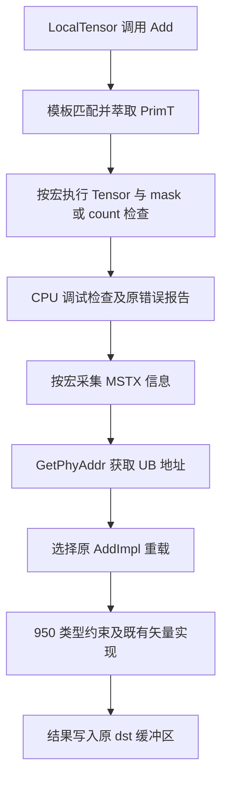
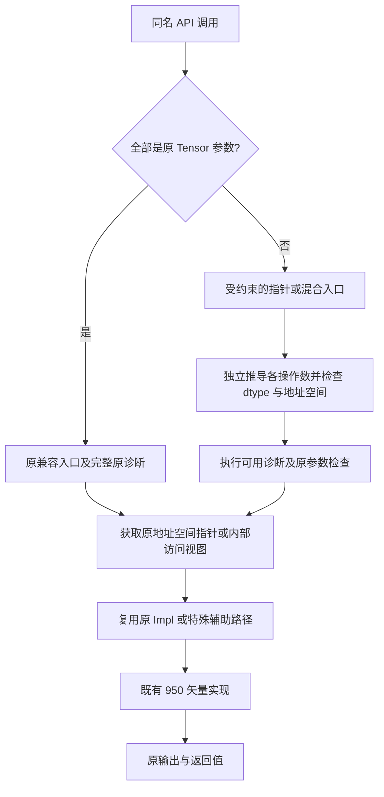

# 【社区任务】Basic API 指针化（VECTOR 分册）算子设计文档

> 文档版本：v2.0；编写日期：2026-09-16；状态：设计内容完成（按当前官方在线清单 85 个接口 / 256 条签名）；实现、编译与板卡验收另行执行。
> 本文交付对象是 Ascend C Basic API 矢量接口扩展。按照《设计文档 CheckList》逐项组织；单算子专用条目给出适用性说明及本任务对应设计，不虚构 TBE、ACLNN 或 tiling 实现。

## 一、需求背景

### 1.1 需求来源

根据附件 `basic_api_optimize_vector.md`，在 asc-devkit 的 Basic API 封装层增加裸指针入参能力，在保留 LocalTensor 调用兼容性的同时支持 Tensor / Pointer 混合调用。任务书声明规模为 **79 个接口名、245 个重载签名**，包含 VECTOR 类型 V 以及明确纳入清单的排序类型 N。任务指定的在线表当前为 **85 个接口名、256 条签名**（最后保存时间 2026-09-11 10:21）；本设计按该表完整覆盖，差异不通过删减条目凑数。原始签名、表格行号、声明定位及验证 ID 见[全量接口设计附件](basic_api_vector_pointer_api_inventory.md)，机器可核对快照见[接口清单 JSON](basic_api_vector_pointer_api_inventory.json)。

附件目录以“9月社区任务”命名，文件正文标题仍为“8月社区任务”。本文使用中性任务名称；月份差异仅登记为资料问题，不改变技术范围。附件中的提交 PR、Issue、邀请开发者等内容是后续交付要求，不代表本次本地文档生成已执行这些外部操作。

### 1.2 背景介绍

#### 1.2.1 Basic API 实现优化及源码依据

现有 Tensor 封装最终将物理地址传入 `*Impl`。扩展目标是复用该底层实现，增加编译期类型萃取与约束，避免用户为了调用 API 而额外构造 Tensor。

v1 参考仓库为 `asc-devkit`，commit `e4c72b11ad06dda7b14916e8b5c0b2a13c2be57a`。本次补全以现有 `asc-devkit-dls`、commit `78630029a07b5d9bd7a27de593c402c47dcf8e37` 重新定位全量声明；该工作树检查时无未提交改动。此值仅标识本地参考版本，不声称是远端最新 master。以下路径相对 asc-devkit 根目录，均包含具体文件名。

| 依据 | 路径 | 用途 |
| --- | --- | --- |
| Add 对外声明 | `include/basic_api/kernel_operator_vec_binary_intf.h` | count、连续 mask、逐 bit mask 三类入口及默认模板参数 |
| Add 封装 | `impl/basic_api/kernel_operator_vec_binary_intf_impl.h` | Tensor 检查、mask/count 检查、CPU 调试、MSTX、GetPhyAddr 与下沉逻辑 |
| 950 Add 底层实现 | `impl/basic_api/dav_3510/kernel_operator_vec_binary_impl.h` | mask 重载类型约束及 Reg::Add 下沉 |
| 950 连续计算实现 | `impl/basic_api/dav_3510/kernel_operator_vec_binary_continuous_impl.h` | count 路径参考 |
| Add 文档 | `docs/zh/api/SIMD-API/basic_api/memory_vector_compute/basic_arithmetic/Add.md` | 产品、dtype、对齐、mask、地址重叠约束 |
| 950 架构说明 | `docs/zh/guide/programming_guide/advanced_programming/hardware_implementation/architecture_spec/npu_arch_3510.md` | UB 容量、系统预留及编译选项 |
| 头文件检查入口 | `tests/api/basic_api/ascendc_header_checker/kernel_operator_vec_binary_intf.cpp` | 声明兼容性测试接入位置 |

**TBE 源码、算子信息库、ACLNN 对应关系：不适用。** 本任务不新增注册算子或 `aclnnXXX`，基线是上述 Basic API 声明与实现，不能借用 Add 算子的 TBE 文件作为整套 API 的统一参考。数据类型与支持范围以每个 Basic API 的目标架构文档和源码共同确定。

另已检索本地 9.1.0-beta.1 `api_constraints.jsonl`：内存矢量 Add 对应第 429–431 页，存在对齐、dtype、mask/repeat、地址重叠风险标记。该手册产品名称与当前仓库 950 标记并不完全一致，因此以当前仓库显式 950 产品说明和 `dav_3510` 实现交叉核查，不能仅凭手册中同名 Reg::Add 条目推断支持范围。

#### 1.2.2 现状分析

##### 1.2.2.1 数据类型和数据格式

本扩展不增加数据类型或格式。对每个重载，指针元素类型、Tensor 的 `PrimT<T>`、输入输出类型组合必须符合原接口约束。Add 的 950 mask 实现显式允许 `half、uint16_t、int16_t、bfloat16_t、uint32_t、int32_t、float`；不能将此集合直接外推到其他接口或重载。

数据布局是原接口要求的 UB 元素序列或特定结构；不引入 ND/NCHW 格式注册。Add 文档列出的 Tensor 位置为 VECIN / VECCALC / VECOUT，起始地址需 32 字节对齐；其指针入口保持等价 UB 布局。Cast 的输入输出类型可以不同，Gather 的索引类型、比较结果的位布局、排序记录布局均独立遵守原重载。

##### 1.2.2.2 现有实现描述

以已检查的 Add 为具体基线：

1. 通过 `LocalTensor<T>` 接收三个操作数，以 `PrimT<T>` 萃取基础类型。
2. `ASCENDC_DEBUG` 或 `ASCENDC_CPU_DEBUG` 分支执行 `CheckVectorTensor` 及 mask/repeat 或 count 检查。
3. CPU 调试分支调用 `CheckFuncVecBinary`；mask 重载还设置 `MaskSetter`，失败走原错误报告机制。
4. `__MSTX_DFX_REPORT__` 分支记录 Tensor 和参数信息。
5. 调用 `GetPhyAddr()` 并转换为底层 UB 指针，进入相应 `AddImpl`。
6. 已核查的 950 mask `AddImpl` 使用 `SupportType` 静态检查，通过 `Internal::VecBinaryImplTemplate` 调用 `Reg::Add`，保留原 mask 与重复计算语义。

此处是 Add 的源码事实，不代表其他接口均有相同检查顺序。全量附件逐条列出 256 个签名（包含返回类型和参数结构），按 85 个名称关联实现和约束来源；特殊辅助缓冲区、状态副作用及非 UB 路径在 3.2.2.5 单独设计。

##### 1.2.2.3 基线实现流程图（替代 TBE 流程图）



### 1.3 范围基线与全量清单

| 项目 | 范围约定 |
| --- | --- |
| 当前设计基线 | 官方 Sheet1 A1:E257，表头 1 行、签名 256 行、接口名 85 个；所有行均纳入附件 |
| 逐签名定位 | 250 条按函数名、形参及模板前缀去空白匹配；6 条 NumericLimits 仅 `dstLocal`/`dst` 形参名不同，已定位类成员 |
| 模板与属性基线 | 在线表是范围依据，模板前缀已核对以区分相同形参的架构变体；架构宏、同步属性、deprecated 标记以该 commit 的声明为准 |
| 历史数字差异 | 85/256 比任务书 79/245 多 6 名、11 条；去掉六个 NumericLimits 成员后仍为 79/250，不能推断哪 11 条是历史新增 |
| 纳入的特殊入口 | Fill（L1/L0A/L0B）、GetAbsAddr（CPU 调试）、NumericLimits 类成员、MrgSort/Sort 聚合操作数 |
| 不自动纳入 | adv_api/RegTensor 的同名 API、清单外 Proposal 拆分接口、其他矩阵及搬运接口；任务书的双线性插值/队列同步类别描述不替代具体签名 |
| 范围决策 | 本设计覆盖当前表全部条目，不等待历史清单而遗漏现有条目；正式验收归档此快照，任务方若指定另一版，以集合差异调整，保留变更记录 |

按声明条件，236 条在 950 条件下可见，18 条为其他架构兼容分支，2 条仅 CPU_DEBUG；可见性不替代 dtype/模式合法性。Div、Exp、Ln、Reciprocal、Rsqrt、Sqrt 的 18 条不带 Config 变体在 950 不实例化，在对应架构保持原 Tensor 回归；950 使用各自带 Config 的变体。每条 ID 固定为 `VEC-001`～`VEC-256`，同时保存源表行号、函数名、重载序号、头文件和完整签名。新增指针/混合入口数量不计入这 256 条原始范围记录。`GetAbsAddr` 的两个签名分别为友元自由函数和 TPipe 成员；六个数值极限接口归属 `NumericLimits<T>`，不能误生成为 AscendC 自由函数。

### 1.4 任务引用模板对照

已读取 [asc-devkit Issue 1222](https://gitcode.com/cann/asc-devkit/issues/1222) 当前正文。它是 BesselI0 的具体评审申请与示例，不是本 VECTOR 任务本身；其正文采用以下三章结构。按用户指定 checklist 保留本文五章结构，内容对应如下，既不缺模板内容，也不把示例算子的算法/测试结果复制成本任务事实。

| 示例模板内容 | 本文对应 |
| --- | --- |
| 一、需求描述：1.1 需求来源、1.2 需求分析 | 第一、二章 |
| 二、方案设计：2.1 接口内部实现 | 3.2、3.3、3.4 |
| 二、方案设计：2.2 接口设计 | 2.3、全量接口附件 |
| 二、方案设计：2.3 测试用例设计 | 5.1.1、5.1.2、附件各 ID 的 T/P/M/N/D 设计 |
| 三、可维可测：3.1 精度/性能、3.2 兼容性 | 5.1、5.2 |
| 用户 checklist 额外关注项 | 第四章、附录 A 全部保留 |

## 二、需求分析

### 2.1 外部组件依赖

| 依赖 | 设计约束 |
| --- | --- |
| Ascend 950 系列与驱动/固件 | 在实际目标设备记录产品型号；不能用 2201 运行结果替代 3510 验收 |
| CANN 9.0.0～9.1.0 | 任务要求版本范围；在拟支持的实际版本分别编译验证，不预先宣称全版本通过 |
| 毕昇 ASC、C++ 工具链、CMake | 复用仓库配置，950 使用 `dav-3510`；地址空间类型 trait 行为以真实编译器验证 |
| ACL Runtime | 样例 Host 分配 GM、传输、启动 kernel、同步及释放资源 |
| Python / NumPy | 复用各样例数据生成与结果校验脚本，记录版本和随机种子 |

### 2.2 内部适配模块

对外声明位于 `include/basic_api`，模板封装位于 `impl/basic_api`。新增内部文件规划为 `impl/basic_api/utils/kernel_utils_operand.h`（操作数识别、地址空间与元素类型萃取、内部访问视图）以及 `impl/basic_api/utils/kernel_check_pointer.h`（debug 诊断桥接）；在对应 intf_impl 引用，不要求用户额外 include。它们是拟新增文件，不冒充已存在的源码；不增加公共 ABI。复用各架构 `*Impl`、原调试检查、MSTX 与编译属性；测试接入 `tests/api/basic_api` 及官方 `examples/01_simd_cpp_api/03_basic_api/`。

### 2.3 需求模块设计

#### 2.3.1 Ascend C API 原型

保留原调用方式，包括模板推导、显式元素类型、显式 `isSetMask`、默认参数、返回值与参数顺序。以下为已存在的 Add 代表性原型：

```cpp
template <typename T>
__aicore__ inline void Add(const LocalTensor<T>& dst,
    const LocalTensor<T>& src0, const LocalTensor<T>& src1, const int32_t& count);
template <typename T, bool isSetMask = true>
__aicore__ inline void Add(const LocalTensor<T>& dst,
    const LocalTensor<T>& src0, const LocalTensor<T>& src1,
    uint64_t mask, const uint8_t repeatTime, const BinaryRepeatParams& repeatParams);
// The bit-mask overload retains uint64_t mask[] in the same argument position.
```

**设计选择：兼容入口 + 受约束的独立操作数模板 + 共用内部执行层。** 每个 Local 操作数独立推导类型 D/S0/S1；对纯 Tensor 原型保留兼容入口，其余入口限定“至少一个指针”，避免同时命中两个等价候选。推导型入口与显式元素类型入口也须互斥；保留 `Add<half>`、`Add<half, false>` 等原有模板参数位置。采用 2.3.3 所列模板布局和互斥约束；下表是设计契约，实施阶段通过 ASC 编译器确认地址空间 trait，文档不冒充已编译实现。

| 调用 | 应有行为 |
| --- | --- |
| `Add(dstTensor, src0Tensor, src1Tensor, count)` | 与改造前一致 |
| `Add<half>(dstTensor, src0Tensor, src1Tensor, count)` | 原显式模板调用不破坏 |
| `Add(dstPtr, src0Ptr, src1Ptr, count)` | 推导指针元素类型并调用原 Impl |
| `Add<half>(dstPtr, src0Ptr, src1Ptr, count)` | 保留与附件样例相容的显式元素类型形式 |
| `Add(dstTensor, src0Ptr, src1Tensor, count)` | 每个操作数独立推导；三者基础类型一致 |
| `Add<half, false>(dstPtr, src0Tensor, src1Ptr, mask, repeat, params)` | 保留显式 mask 模式及其调用方设置责任 |

不直接照搬任务书单一 `const T&` 模板：它不能让 Pointer 和 Tensor 独立推导，且可能破坏原 `Add<half>` 的含义。若评审要求删除旧声明，必须证明统一新模板能完整保留上述源码兼容性后再替换；不能以“原型统一”为由降低兼容要求。

指针萃取规则：只对明确支持的 LocalTensor 与 UB 指针提供适配；Tensor 通过原 `PrimT<T>` 与 `GetPhyAddr()`，指针保留 pointee cv 与地址空间；不把任意有 `GetPhyAddr()` 的对象视作合法输入。输出必须可写。输入 const 指针仅在原底层签名允许时支持，不能强制去 const 后冒充兼容。C 数组须通过正确的地址空间数组适配或显式退化为指针；单纯 `is_pointer_v<U>` 无法覆盖绑定到 `const U&` 的数组。

#### 2.3.2 相关约束与功能差异

计算能力保持原重载，不隐式广播、转换 dtype 或分配数据缓冲。裸指针不携带分配长度，完整分配边界诊断只能在存在真实元数据时执行。最终采用“保留 Tensor 原诊断 + 指针地址空间/参数/访问模式检查 + 已知容量时才做容量判断”的方案，具体见 3.2.2.4。该限制是接口表示的固有差异，不是待定的实现方案；不得伪造 Tensor 长度。

#### 2.3.3 模板匹配与类型萃取定稿

以 Add 为例，新入口的模板参数布局为 `template<class T = Internal::DeducedElem, bool isSetMask = true, class D, class S0, class S1, enable_if_t<条件, int> = 0>`；count 入口保留原来仅显式指定 T 的形式，mask 入口保留 T/bool 的顺序。T 是显式元素类型或默认推导哨兵，D/S0/S1 始终由各操作数推导，避免把 `Add<half>` 误解为 D=half。约束为：三者均为合法 Local 表示、至少一个非 Tensor、按 Add 规则基础类型一致、显式 T 若非哨兵则与基础类型相符、dst 可写。纯 Tensor 仍唯一进入旧入口。

有 T/U 双类型、RoundMode、ReduceType、BinaryConfig 的接口分别保留原模板前缀，再追加操作数推导参数；不统一改成 Add 的模板头。已有 `BinaryDefaultType` 与 `BinaryConfig` 的泛型入口直接复用原推导规则并扩展合法表示，不再额外添加同等候选。声明和定义同步修改，默认值只放声明。数值极限成员仅泛化成员的操作数形参，不重复增加类模板 T。

内部 trait 按 `LocalTensor<T>`、编译器支持的 `__ubuf__ E*`（Fill 另含 `__cbuf__`/`__ca__`/`__cb__`）、相应定长数组专门化，拒绝仅凭同名成员函数成立的 duck typing。输出可写性检查 pointee const；参数本身 `const D&` 不代表 pointee 为 const。输入 const 的接纳由原 Impl 签名决定，不使用 const_cast。定长数组保留 N 作为真实容量信息，再萃取地址；指针变量只保留地址，不臆造 N。

类型关系由每个原重载固定的模板关系定义：如 `LocalTensor<uint32_t>` 索引始终是 uint32_t，ExpSub 的 T/U 不强制相等。属性检查和 `__ASC_USE_RESERVED_UBUF__`、同步 alias 属性与原入口一致。所有新增入口只在原重载的架构条件内可见，不能把“当前在线表存在”解释为所有平台都支持。

## 三、需求详细设计

### 3.1 使能方式

调用方包含原 `kernel_operator.h` 或对应 Basic API 头文件，在合法的 device kernel 调用层级使用指针或 Tensor。Host 通过现有 `<<<>>>` 启动样例 kernel，不直接调用 `__aicore__` 函数。不新增 ACLNN、算子注册、图融合 pass 或开关；类型适配在编译期完成。

### 3.2 需求总体设计

#### 3.2.1 Host 侧设计

##### 3.2.1.1 分核策略

本 API 不拥有 Host 调度，不新增分核算法。原 kernel 的 block 数与数据归属保持不变。附件 compound 样例当前 `numBlocks=1`、`totalLength=512`，适合作为基线，不能声称已覆盖任务要求的四种长度。

用于后续多核回归的 element-wise 调用方可按对齐单位分配：令元素字节数为 s、对齐字节数 A、`q=A/gcd(A,s)`、元素总数 N、可用核数 P，`M=ceil(N/q)`；N>0 时 `K=min(P,M)`，第 i 核处理对齐块 `[floor(iM/K), floor((i+1)M/K))`，其元素区间截断到 N。N=0 不启动 kernel。此为样例测试策略，不是库接口内部的新增行为；归约、排序、转置按原算法的数据依赖划分，不能机械套用 element-wise 分核。

##### 3.2.1.2 数据分块及 LocalMemory 优化

基础地址适配层不分配 Device 工作区、不新增数据搬运；原 Sort 等内部已有的数据搬运与临时区继续保留。相对原实现的理想增量为 `ΔUB=0、ΔGM=0、额外数据拷贝=0`，最终通过编译产物与运行核实。

设可用 UB 为 U、固定临时开销 H、各缓冲区元素字节数为 s_j、每块 B 个元素、缓冲份数 d_j、地址对齐 A_j，则调用方必须满足：

`Σ_j d_j × align_up(B × s_j, A_j) + H ≤ U`。

对三个等长、同类型、单缓冲的 Add，`3 × align_up(Bs,A)+H≤U`；无额外特殊布局时可先取 `B=q×floor((U−H)/(3sq))`，再按原 API 限制截断。归约/排序的中间工作区应加入 H 或独立项；不能假定所有 API 只有三份缓冲。

950 物理 UB 为 256 KiB。当前架构文档给出默认普通 UB 248 KiB，另有 6 KiB VF 栈与 2 KiB Ascend C API 预留；实际预算按编译选项及 Data Cache 划分重新计算。不能为了扩大 B 随意关闭预留：Add 的两个 mask 声明带 `__ASC_USE_RESERVED_UBUF__(3510, ...)`，禁用 ASC 预留 UB 时相应调用应继续编译报错。新增入口必须继承此限制。

尾块按实际有效元素数执行，GM 搬运长度与缓冲区大小仍遵守搬运 API。长度 1 等场景采用合法的补齐分配与搬运，只比较有效输出；归约填充值须是对应操作的单位元，排序填充不得进入有效结果，不能一律补零。

##### 3.2.1.3 tilingKey 规划

不适用运行时 tilingKey：本任务没有 Host tiling 数据、workspace 查询或 tilingKey 注册。分派条件为编译期的 API 重载、操作数表示类型、基础 dtype、`isSetMask` 等模板参数及原架构宏。不得为了区分 Pointer/Tensor 新增 Device 运行时分支。

#### 3.2.2 Kernel 侧设计

##### 3.2.2.1 实现描述

执行层对各操作数独立做合法性约束，按 API 语义验证类型关系。普通矢量接口萃取 UB 指针后进入原 `*Impl`；Fill、SetDeqScale、排序等特殊入口按 3.2.2.5 保留原辅助逻辑，不能声称所有 Impl 都只接受裸指针。以下是内部逻辑伪代码，不是可直接提交的头文件实现：

```text
MatchOriginalSemanticOverload(args)
CheckSupportedOperandRepresentations(args)
CheckApiSpecificElementTypeRelations(args)
PreserveTensorDiagnosticsForTensorOperands(args)
CheckAvailablePointerAndScalarConstraints(args)
PreserveSupportedDebugAndMstxReporting(args)
ptrs = ExtractUnderlyingPointersInOriginalAddressSpace(args)
return OriginalImpl(ptrs, unchanged_non_tensor_arguments)
```

保留数据依赖与流水线时序：搬入完成后才能计算，计算完成后才能搬出，调用方已有 SetFlag/WaitFlag、PipeBarrier 或 Mutex 不能因指针化而删除。封装层不插入新的隐式全流水屏障。

| 接口类别 | 必须独立处理的语义 |
| --- | --- |
| 一元 / 二元 / 标量 | 输入输出类型关系、原地使用、别名限制；标量仍为原类型 |
| Cast / 转换 | 目的和源类型独立，舍入模式及饱和语义不变，不能用 Add 同类型规则 |
| 归约 | 输出元素数、结果与索引类型、临时缓冲、重复顺序、返回标量与写回保持原样 |
| 比较 / Select | 比较结果位布局、选择模式、mask 存储含义与输入类型分别检查 |
| Gather / Scatter | 索引/偏移类型、单位、边界和重复索引语义保持原约束 |
| 填充 / 广播 / 双线性插值 | 描述结构、坐标与步长单位、临时区不作统一线性 count 推断 |
| MrgSort / Sort / Transpose | 仅改官方清单对应的 basic_api 入口，记录结构、指针列表、模板参数顺序和临时区按原签名适配 |
| 队列 / 同步相关 | 保持返回值、事件和生命周期；没有可指针化 Local 操作数的入口先核对清单归属 |

**调试与诊断设计已定稿：** 采用 3.2.2.4 的分层检查，不直接把 Pointer 传给仅接受 Tensor 的检查器。全 Tensor 分支保持原顺序；指针与混用分支通过真实地址及可用元数据构建独立检查描述，不伪造容量。

##### 3.2.2.2 Ascend C 实现流程图



##### 3.2.2.3 与基线流程的差异及原因

新增编译期操作数表示分派和混用约束；Tensor 获取地址的方式保持不变，Pointer 直接提供地址。数值计算、迭代顺序、数据布局、同步职责、输出和返回值均不应改变。Pointer 缺少元数据，诊断能力差异须显式说明。本文对照 Basic API 基线而非 TBE，因为任务没有 TBE 实现；两张图不应被解释为单一算子的 TBE→Ascend C 算法迁移。

##### 3.2.2.4 Pointer 调试与 MSTX 方案定稿

源码依据为 `impl/basic_api/kernel_check.h`、`kernel_check_util.h`、`utils/kernel_check_vec_binary.h` 和 `mstx_local_tensor_info.h`。当前 MSTX 的 `MstxTensorDesc` 包含 `space/addr/size/dataBits`，`From(LocalTensor)` 读取位置和大小；不能假装普通指针自带这些信息。

| 场景 | 最终设计 |
| --- | --- |
| 全 Tensor | 继续原 NamedTensor、CheckFunc 与 MSTX From，不重排检查和上报 |
| Pointer 常规编译 | 仅编译期类型/地址空间/可写性检查与原必需的参数检查；不引入容量表或额外 device 分配 |
| Pointer 的 Debug | 按具体 API 检查 alignment、mask/count/repeat/stride、地址区间算术溢出及可知的别名条件；UB 地址 0 可能是合法物理偏移，不能机械使用 `ptr != nullptr` 判断物理地址有效性 |
| Pointer 的容量 | 数组 N、真实 Tensor 元数据或 CPU 模拟分配记录存在时检查；只有裸地址时标记 capacityKnown=false，报告“分配边界不可观测”，不打印虚假的“容量检查通过” |
| CPU Debug | 新的检查桥接读取 CPU 模拟分配器的真实基址、空间和分配长度，对物理偏移/CPU 地址作原映射；只有在分配器/测试夹具真实分配时登记映射，严禁用 API count 反推分配大小。未知映射明确报地址不可解析；不是把 Host 数值地址当 NPU 地址 |
| 混用 | 保留各 Tensor 的容量检查；跨操作数检查按已知信息执行，不能因为一个 Pointer 就删除全部诊断 |
| MSTX | 对已知真实长度沿用原描述；裸指针只上报地址空间、地址、位宽和参数可计算的访问范围，不将访问范围写成分配容量。内部新增明确的 pointer 描述/版本字段 `capacityKnown` 与 `accessSpanKnown`，与 Tensor 记录区分；对应 debug reader 同步识别，不用原 size=0 偷偷表达未知 |
| 外部 mask / Gather 动态索引 | 无法由静态参数计算完整访问范围时 `accessSpanKnown=false`；保留原 mask 状态和索引参数，不能为补诊断额外扫描 Device 数据或插入流水屏障 |

这里选择对诊断内部生产者与消费者一并适配；若上游不接纳新的 MSTX pointer 描述，提交时必须保留为明确的不支持诊断功能，而不能无声落回伪造 Tensor 描述。Tensor 旧记录格式不改变。该兼容决策及所需模块是明确设计，不声称这些新增模块已经实现。

访问范围可计算时，连续入口使用 `count×sizeof(E)`；规则 strided 入口按每个 operand 的 repeat stride、block stride 和有效 mask 最大 lane 计算最高实际访问字节，且所有加乘在足够宽的整数类型中先检查溢出。该“访问上界”只用于参数与重叠检查，不能替代 allocation extent。不同类接口的索引/记录布局按附件原签名处理。

##### 3.2.2.5 元数据、聚合参数及非 UB 特殊路径

| 接口 / 路径 | 基线事实 | 明确适配方案 |
| --- | --- | --- |
| Gather / Gatherb | 封装读取 src.GetSize；3510 的 Gather mask 分支未使用 srcLength，Gatherb 显式 `(void)srcLength` | 3510 Pointer 入口向该未使用参数传内部“未提供”值 0，并在代码注释注明其仅占位；不得把 0 用于容量检查，也不外推其他架构。count Gather 复用无 srcLength 的 Impl。索引边界仍属调用者责任/已知容量诊断 |
| SetDeqScale | 3510 Impl 使用 SetValue 写入 VDEQ_TENSOR_SIZE 个配置值，再更新 Internal::g_deqScale 为地址 | 增加内部 typed-pointer 写入入口，复用 MakeDeqScaleConfig、固定循环及 g_deqScale 更新；Tensor 原入口转发，读写顺序不变，不能仅返回指针而漏掉寄存器/状态设置 |
| MrgSort | MrgSortSrcList<T> 固定含四个 LocalTensor 成员 | 保留原结构和构造方式；新增可由四个独立 Local 表示构造的内部/辅助源列表适配，四个成员独立推导并萃取为固定四个地址，不要求用户为指针重新构造 Tensor。列表内混用、有效位和耗尽计数按原逻辑处理 |
| Sort | 3510 先 Sort32；isFullSort 时调用 Tensor 形式 DoFullSort，内含 DataCopy/屏障和归并循环 | 泛化私有的 Sort32/DoFullSort 辅助层，使其接收内部 LocalOperandView；保留原分块、循环、DataCopy、屏障与临时区，复用底层排序指令。view 只含地址、类型和真实可用信息，不伪造 allocation size。由 repeatTime 计算的 dstElementCount 是算法工作量，单独存储 |
| TransDataTo5HD | 一个重载接收 LocalTensor<uint64_t> 地址表，另一个接收固定长度 Tensor 数组 | 两个重载独立设计：前者指针的元素类型固定 uint64_t；后者增加固定长度 pointer 列表和混合列表适配，保留 NCHW_CONV_ADDR_LIST_SIZE 和原同步属性；不能把地址表当普通 T 数据 |
| Fill | 列表来自 kernel_operator_mm_intf.h；FillImpl 根据位置进入 InitL1BufferCal / InitL0ANzMatrixCal / InitL0BNzMatrixCal | 为 `__cbuf__`、`__ca__`、`__cb__` 分别增加受约束入口，编译期选择原 Cal；UB 指针明确拒绝。保留 T/U 匹配、参数范围及 AIC 调用层级。L1 按 32B 块，L0A/B 按 512B 块，repeatTimes/blockNum/dstGap 为 0～32767，零工作量遵循 NOP |
| GetAbsAddr 两项 | CPU_DEBUG 条件下的 deprecated 辅助接口，按 TPipe 的 UB/L1 pool 基址求偏移；并非 device 矢量计算 | 保留原友元与成员归属；CPU 指针通过真实 pool 映射确定 UB/L1 与相对偏移，越界明确报错。禁止用 reinterpret_cast 直接返回 Host 指针数值。NPU 编译不新增入口，不制造假的输出 Tensor |
| NumericLimits 六项 | NumericLimits<T> 成员通过 Duplicate 写入标量极限值 | 仅泛化 dst 表示，复用原类标量值和 Duplicate；NaN payload、Inf 符号及最小非规格值按原位模式，不用数学近似替代 |
| Mull、Cast、ExpSub | 多输出或异型类型关系 | Mull 的 dst0/dst1 都写回；ExpSub/FusedExpSub 在 3510 是 half/float 输入、float 输出；Cast 对各合法类型对及 roundMode 单独保留，不套用 Add 同 dtype 规则 |
| 兼容旧名 | FusedAbsSub/FusedExpSub 等仍在表内 | 保留旧名入口及其原实现，不因有新名称而从覆盖分母删除 |

这些适配可修改私有模板封装和诊断设施，但不得替换底层数值算法或改变共享其他架构的 Tensor 路径。Fill 是当前清单明确列入的例外，因此本文不再把整个清单统称为“所有 Local 操作数均为 UB”。

##### 3.2.2.6 全量测试 ID 与失效定位

全量附件为每个 VEC ID 定义 T/P/M/N/D 五组用例，共 1280 个设计分组（不是 1280 个已运行用例）。每组按该条签名有效的 dtype、mask/count、模板枚举和四种任务长度展开。18 条非 950 分支的 Pointer/Mixed 950 测试标为“架构条件不适用”，在原支持架构保留 Tensor 回归，不将它们计作 950 测试通过。若 k 个可独立选择的 Local 操作数，M 组覆盖其 2^k 种表示组合；聚合列表按成员展开。原签名仅用于 CPU Debug 的 GetAbsAddr，其正常用例在 CPU 模式执行，不要求伪造 NPU kernel。Fill 使用合法 AIC/L1/L0A/L0B 场景；纯标量配置/特殊值用原参数结构，不机械塞入负数或非法 NaN。编译失败用例记录预期错误类别，不能只统计命令返回非零。

### 3.3 支持硬件

目标为任务书规定的 **Ascend 950 系列**，当前仓库 Add 文档明确标注 Ascend 950PR/950DT 支持，对应 `dav-3510`。每个 API 的合法 dtype 与架构分支仍须逐项登记。其他架构原 Tensor 行为要保持兼容，但本任务不承诺新增指针能力的跨架构验收。普通 SIMD 不额外启用 SIMT 编译选项。

### 3.4 算子/API 约束限制

1. Pointer 指向原 API 要求的内存空间：常规 Vector 是 UB，Fill 是 L1/L0A/L0B；CPU-only GetAbsAddr 使用模拟 pool 地址。GM/普通 Host 指针不能冒充 Device Local 指针。
2. 保持对齐、地址重叠、repeat、mask、count 与 stride 单位。Add 的连续 mask 对 16/32 位元素分别为 1～128 / 1～64；该值不自动适用于所有 API。
3. `isSetMask=false` 时调用者仍负责外部 mask 状态；不将占位 mask 当作有效掩码重新解释。
4. dst 指向足够大的可写缓冲；输入、临时区、索引区在调用期间有效。指针偏移后仍必须满足对齐和容量约束。
5. 不通过强制类型转换放宽 unsupported dtype、地址空间或 const 约束；不把所有 API 输入输出强制成同一 PrimType。
6. 不改变已有 TensorTrait 路径；共享封装变化不得误伤 GlobalTensor、RegTensor 或其他分册调用。
7. 全量附件保存当前官方 256 签名，真实声明的宏、模板、返回值及类归属保持不变；在线表和任务书数字差异已记录，不能宣称已复原历史 245 签名集合。

## 四、特性交叉分析

| 交叉特性 | 风险 | 处理与验证 |
| --- | --- | --- |
| 旧模板显式参数 | 泛化后改变 `T` 的含义 | 保留兼容入口，验证显式与推导调用 |
| 多操作数混用 | 单模板参数推导冲突 | 每操作数独立模板，按 API 检查基础类型关系 |
| TensorTrait | 去包装丢失 PrimT 语义 | 沿用原萃取，保留 TensorTrait 编译回归 |
| const / 地址空间 / 数组 | std trait 识别不完整或误去限定 | ASC 编译器专项正反例；不以 Host C++ 编译替代 |
| Debug / CPU Debug / MSTX | 指针无长度与位置元数据 | 保留 Tensor 路径，指针诊断单独适配并报告能力差异 |
| mask 与预留 UB | 新入口绕过属性或状态管理 | 同步声明属性，验证禁用预留 UB 的预期失败 |
| 多架构共用头文件 | 新候选污染旧重载 | 按仓库支持范围进行原 Tensor 编译回归 |
| 多流、多核与异步 | 数据生存期不足或同步缺失 | 不引入全局可变状态，复用原事件链和缓冲所有权 |
| 同名 Basic/Reg/Advanced API | 改错接口层级 | 使用命名空间和完整签名 ID 审核，限制文件范围 |

## 五、可维可测分析

### 5.1 精度标准与性能标准

**验收基线：** 改造前 Tensor、改造后 Tensor、改造后 Pointer，以及混用入口使用相同数据、dtype、有效长度和布局比较。任务要求输入范围 `[-100,100]`，Shape 为 `1、32、1024、2048`；有定义域限制的算术接口、索引/位掩码/排序参数应使用其合法子域或结构，不能直接把全部参数均随机生成为浮点区间值。对受固有块大小限制的接口记录补齐与有效区间，若某 Shape 无合法表达，须逐签名给出原因并由评审确认，不能静默漏测。

已从官方 opbase 仓取得 [实验精度标准](https://gitcode.com/cann/opbase/blob/1cc94d9dda647ceb3e83094fa2c0f548d0dc4df2/docs/zh/ops_precision_standard/experimental_standard.md)，固定 commit 为 `1cc94d9dda647ceb3e83094fa2c0f548d0dc4df2`。标准针对浮点计算；整数、搬运、位图、索引采用本任务的精确等价规则。

**浮点与高精度 golden 的判定：** 单元素满足 `abs(actual−golden) ≤ atol + rtol×abs(golden)`；用例必须同时满足 `matched_ratio ≥ 0.99` 和最大绝对误差硬上限。采用精确的 2 的幂计算阈值，不使用表中的舍入十进制近似。

| 输出 dtype | rtol | atol | 本设计采用的 max_abs_error_limit |
| --- | --- | --- | --- |
| FLOAT16 | 2^-9 | 2^-9 | 0.1 |
| BFLOAT16 | 2^-6 | 2^-6 | 1.0 |
| FLOAT32 | 2^-10 | 2^-16 | 0.01 |
| HiFLOAT32（仅原接口支持时） | 2^-9 | 2^-10 | 0.1 |
| FLOAT8 E4M3（仅原接口支持时） | 2^-2 | 2^-4 | 1.0 |
| FLOAT8 E5M2（仅原接口支持时） | 2^-1 | 2^-3 | 0.1 |

官方硬上限同时列有“固定值 or 32×ULP”。本设计固定采用上述绝对值分支，避免临时切换宽松判据；不需要额外定义 ULP 口径。该表不增加任何 API 的 dtype 支持。complex 输出按相应分量 dtype 分别检查实部和虚部，Pointer/Tensor 等价仍逐元素严格检查；不在表内的输出类型不自行类推阈值，采用与原 Tensor 位级一致的扩展回归规则及该 API 现有专项 golden 标准。

**扩展兼容性判定更严格：** 改造前 Tensor、改造后 Tensor、Pointer、Mixed 在相同输入、相同配置下，整数/索引/位图/数据整理输出全部精确一致；浮点有限值和正负零要求位级一致，不允许靠 0.99 通过率掩盖指针适配错误。普通浮点计算的 NaN 对比先验证对应位置为 NaN，Inf 验证符号；NumericLimits、Copy 等直接构造/搬运操作另外比较 NaN payload 位模式。逐项报告所有差异。高精度 golden 与路径等价两个判据均要满足，任何一个失败不能判通过。

**非有限值与空输出：** NaN/Inf 先按上段规则检查位置/符号，不直接代入减法。非有限位置匹配后，有限子集计算 matched_ratio 和 max_abs_error；没有有限元素时不生成除零指标，以特殊值检查结果判定。零有效元素只对原 API 定义为 NOP 的入口验证无写入，不计算空数组通过率。输出长度、文件字节数、dtype、有效区间必须先匹配，否则立即失败。排序允许的相同键顺序按原实现和路径等价规则判断，不以“值集合相同”掩盖索引错误。

任务书的 `[-100,100]` 与 `1/32/1024/2048` 是必须执行的任务集合；官方标准的 dtype、属性等价类、特殊值要求作为补充，不能删掉原合法类型组合。对定义域受限 API 使用合法数据；空输入/非规格值/极值与普通随机数据分组，不能制造无意义精度统计。

附件 compound 校验脚本当前仅检查 `rtol=1e-3、atol=1e-3、error_ratio≤1e-3`，缺少官方最大绝对误差硬上限，因此它不能直接作为最终验收器。实施时统一增加上述长度/特殊值/硬上限及四路径等价检查，按输出 dtype 选择阈值，原脚本结果只作为辅助记录。报告字段固定为 VEC-ID、参数、dtype、shape、seed、基线版本、matched_ratio、max_abs_error、硬上限、路径差异数、特殊值检查、返回码与日志路径。

性能项按任务书为“无额外指标”，不套用 checklist 中“性能不低于 TBE”的单算子硬指标。设计目标是保持原 Impl 和零额外数据拷贝；可选在同设备、编译选项、输入和预热条件下比较指令、UB 用量及 kernel 延迟，报告中区分测量结果与设计预期。

#### 5.1.1 验证覆盖计划

| 编号 | 内容 | 通过标准 |
| --- | --- | --- |
| V01 | 官方当前 85 名称 / 256 原始签名映射 | 按已归档快照集合一致，每个 ID 有声明、约束来源和测试关联；与任务书历史数字差异独立记录 |
| V02 | 原 Tensor 调用，显式/推导模板，原宏配置 | 编译成功，原用例全部通过，诊断行为不退化 |
| V03 | 每个清单重载的 Pointer 调用 | 合法类型和参数编译通过，满足精度标准 |
| V04 | 各 Local 操作数位置的混用 | 每个位置均覆盖 Pointer/Tensor 选择；三操作数 Add 检查 8 种组合 |
| V05 | 四种长度与 count/mask 重载 | 合法场景全部覆盖，尾块和 padding 不污染有效结果 |
| V06 | Cast 异型、索引、比较位图、归约输出、排序布局 | 输出类型、布局、返回值和状态不变 |
| V07 | 编译失败用例 | 错误地址空间、输出 const、非法 dtype、冲突显式模板等按约束失败 |
| V08 | 资源与编译属性 | 无新增规模相关 workspace / 拷贝；保留 UB 禁用限制 |
| V09 | CANN 与 950 实际环境 | 每次记录版本、架构、宏、精度编译选项、命令和日志 |
| V10 | CPU 调试 / MSTX 与其他架构旧 Tensor 回归 | 支持情况可追溯，未支持项明确登记，不标为通过 |

以上为自验证设计矩阵，本次不生成测试实现或扩展 UT 目录。未运行项全部保持“未执行”。

#### 5.1.2 附件样例可复用性

附件提供多个样例目录，但目录存在不代表构建或验收成功。自动盘点见附录 B。已抽查 compound 样例：源代码已使用 `AddRelu<half>(...GetPhyAddr()...)` 和 `Axpy<half,half>(...)`，而数据管理仍使用 Tensor；它是指针调用材料，不是本地基线接口已支持指针的证明。其 CMake 默认架构为 `dav-2201`，验收必须显式改为 `dav-3510`；`totalLength=512` 需与数据脚本一起参数化覆盖四种目标长度。

测试实施时从原官方 Tensor 样例保留基线，在同一工程增加 Pointer / Mixed 模式，保留 GM 搬运的 Tensor 写法也可隔离 VECTOR 改造效果。若改为 GM 裸指针搬运，必须检查元素类型；不能照抄将 `__gm__ uint8_t*` 与 `__ubuf__ half*` 直接配对的示意代码。

compound 样例构建命令示意（在已配置 CANN/ASC 的目标环境及样例目录执行）：

```bash
cmake -S . -B build_950_s1 -DCMAKE_ASC_ARCHITECTURES=dav-3510 -DSCENARIO_NUM=1
cmake --build build_950_s1 -j
```

运行和生成数据按各样例 README 的实际参数执行；先核对 `scripts/gen_data.py` 和 `scripts/verify_result.py`，不能声称 `gen_data.py` 本身已经完成输出校验。报告记录完整工作目录、命令、返回码、随机种子、输入输出文件及日志。

### 5.2 兼容性分析

源码兼容覆盖旧 Tensor 推导调用、显式模板、默认参数、返回值、TensorTrait、按 dtype 的能力、调试宏和编译属性。模板函数通常在调用方实例化，不能仅以“无动态库 ABI 修改”代替源码兼容回归。API 不新增持久状态、不改变内存所有权，不影响线程/流资源管理。

CANN 9.0.0～9.1.0 的编译器对地址空间指针、trait、数组推导可能存在差异，必须分别验证实际计划支持的版本。若诊断功能或某版本不支持指针路径，应登记具体 ID 与环境，形成评审结论后收敛方案，不应泛称“完全兼容”。

### 5.3 可维护性与交付

每个原始签名维护同一条追踪记录，新增入口复用公共萃取和约束设施，避免给所有组合复制计算实现。版本升级时以官方签名快照与原 Tensor 编译回归检查漂移。

后续提交设计文档到 cann-competitions 对应 tasklist 位置，形式为 PR；标题建议使用本文标题。按 checklist 完成 CLA 和 PR `/compile` 构建。任务书另要求设计评审通过后在 asc-devkit 创建评审 Issue，其标题格式为 `[Requirement|需求建议]: 【社区任务】Basic API 指针化（VECTOR 分册）设计文档评审申请`；它是补充交付，不能替代设计文档 PR。代码、样例、自测日志、报告、易用性 Issue 等按任务书分阶段交付。本次仅生成本地文档。

## 附录 A：设计文档 CheckList 逐项核对

状态说明：“已覆盖”表示文档已提供对应设计，不表示实现或测试已完成；“不适用并替代”给出本任务依据；“待执行”是提交或验收环节；设计项与后续执行项分开核对。

| 原行号 | 审核要求 | 对应章节 | 核对结论 |
| --- | --- | --- | --- |
| 2 | PR 位置、CLA、/compile | 5.3 | 已写明；外部提交待执行 |
| 3 | PR 标题 | 标题、5.3 | 已覆盖；与 Issue 标题分开 |
| 4 | 需求来源 | 1.1 | 已覆盖 |
| 5 | TBE 源码和信息库具体文件、ACLNN 对应 | 1.2.1 | TBE/ACLNN 不适用，提供真实 Basic API 文件替代 |
| 6 | dtype 与格式 | 1.2.2.1、3.4 | 全量附件已列 256 签名、类型关系与 950 约束来源 |
| 7 | 基线实现描述 | 1.2.2.2 | Add 流程及特殊实现已核查；全量附件定位各接口 |
| 8 | 基线流程图 | 1.2.2.3 | 已覆盖 Basic API 基线；TBE 不适用 |
| 9 | 外部组件依赖 | 2.1 | 已覆盖，未声称已适配 |
| 10 | 内部适配模块 | 2.2 | 已覆盖 |
| 11 | 原型及能力对齐 | 2.3.1、1.3 | 兼容契约和官方当前完整签名集合已覆盖 |
| 12 | 与原实现相比的功能缺失 | 2.3.2、3.2.2.1 | 指针元数据诊断差异已明确 |
| 13 | 使能方式 | 3.1 | device API 直接调用；ACLNN 不适用 |
| 14 | 分核策略 | 3.2.1.1 | 库不分核；提供调用方策略与公式 |
| 15 | 分块及 LocalMemory 公式 | 3.2.1.2 | 已覆盖通用预算、Add 特例、预留与尾块 |
| 16 | tilingKey 条件 | 3.2.1.3 | 运行时不适用，列明编译期分派条件 |
| 17 | kernel 实现 | 3.2.2.1 | 已覆盖统一下沉、类别差异和诊断 |
| 18 | Ascend C 流程图 | 3.2.2.2 | 已覆盖 |
| 19 | 流程差异及原因 | 3.2.2.3 | 已覆盖与真实基线比较 |
| 20 | 支持硬件 | 3.3 | Ascend 950，与任务书对齐 |
| 21 | 约束限制 | 3.4 | 已覆盖；全量附件关联每条原型与约束来源 |
| 22 | 特性交叉分析 | 四 | 已覆盖 |
| 23 | 精度 / 性能标准 | 5.1 | 官方阈值与判据已补齐；任务无额外性能指标，测试未执行 |
| 24 | 兼容性 | 5.2 | 已覆盖 |

**核对结果：23 项的文档内容均已闭环。** 当前清单、逐签名设计附件、精度判据、诊断方案及模板对应关系已完成。外部 PR/CLA/构建、实现正确性和设备测试属于后续执行状态，不能将设计完成写成验收通过。历史任务数量与当前清单差异有明确处理方案，正式任务归档时保留该差异。

## 附录 B：附件样例盘点

以下从附件 `.asc` 文件提取直接 `AscendC::` 调用，仅用于定位样例；不构成官方范围清单，不把 InitSocState/DataCopy 等依赖自动纳入本任务。

| 样例目录 | 源文件中直接出现的调用名（去重） |
| --- | --- |
| `brcb/brcb.asc` | `Brcb`, `DataCopy`, `InitSocState`, `LocalTensor`, `PipeBarrier`, `SetFlag`, `WaitFlag` |
| `cast/cast.asc` | `Cast`, `DataCopy`, `GetBlockIdx`, `InitSocState`, `LocalTensor`, `PipeBarrier`, `SetFlag`, `WaitFlag`, `printf` |
| `compare/compare.asc` | `Compare`, `Compares`, `DataCopy`, `Duplicate`, `GetCmpMask`, `InitSocState`, `LocalTensor`, `PipeBarrier`, `SetFlag`, `WaitFlag` |
| `copy_ub2ub/copy.asc` | `Copy`, `DataCopy`, `InitSocState`, `LocalTensor`, `PipeBarrier`, `ResetMask`, `SetFlag`, `SetMaskCount`, `SetMaskNorm`, `SetVectorMask`, `WaitFlag` |
| `create_vec_index/create_vec_index.asc` | `CreateVecIndex`, `DataCopy`, `Duplicate`, `InitSocState`, `LocalTensor`, `PipeBarrier` |
| `duplicate/duplicate.asc` | `DataCopy`, `Duplicate`, `InitSocState`, `LocalTensor`, `PipeBarrier`, `SetFlag`, `WaitFlag` |
| `element_wise_arithmetic/element_wise_arithmetic.asc` | `DataCopy`, `InitSocState`, `LeakyRelu`, `LocalTensor`, `PipeBarrier`, `SetFlag`, `WaitFlag` |
| `element_wise_compound_compute/element_wise_compound_compute.asc` | `AddRelu`, `Axpy`, `DataCopy`, `InitSocState`, `LocalTensor`, `PipeBarrier`, `SetFlag`, `WaitFlag`, `printf` |
| `element_wise_logic/element_wise_logic.asc` | `And`, `DataCopy`, `InitSocState`, `LocalTensor`, `Ors`, `PipeBarrier`, `SetFlag`, `ShiftLeft`, `ShiftRight`, `WaitFlag` |
| `gather/gather.asc` | `DataCopy`, `Duplicate`, `Gather`, `GatherMask`, `Gatherb`, `InitSocState`, `LocalTensor`, `PipeBarrier`, `SetFlag`, `WaitFlag` |
| `interleave_pair/interleave_pair.asc` | `DataCopy`, `DeInterleave`, `Duplicate`, `InitSocState`, `Interleave`, `LocalTensor`, `PipeBarrier`, `SetFlag`, `WaitFlag` |
| `mrg_sort/mrg_sort.asc` | `DataCopy`, `InitSocState`, `LocalTensor`, `MrgSort`, `PipeBarrier`, `SetFlag`, `Sort32`, `WaitFlag` |
| `reduce/reduce.asc` | `Add`, `DataCopy`, `Duplicate`, `GetSystemCycle`, `LocalTensor`, `PipeBarrier`, `ReduceDataBlock`, `ReduceRepeat`, `ResetMask`, `SetMaskCount`, `SetMaskNorm`, `SetVectorMask` |
| `reduce_computation/reduce_computation.asc` | `DataCopy`, `GetReduceRepeatSumSpr`, `InitSocState`, `LocalTensor`, `PipeBarrier`, `ReduceMax`, `ReduceMin`, `ReduceSum`, `SetFlag`, `WaitFlag` |
| `reduce_data_block/reduce_data_block.asc` | `DataCopy`, `Duplicate`, `InitSocState`, `LocalTensor`, `PipeBarrier`, `ReduceDataBlock`, `SetFlag`, `WaitFlag` |
| `reduce_pair_elem/reduce_pair_elem.asc` | `DataCopy`, `Duplicate`, `InitSocState`, `LocalTensor`, `PipeBarrier`, `ReducePairElem`, `SetFlag`, `WaitFlag` |
| `reduce_repeat/reduce_repeat.asc` | `DataCopyPad`, `InitSocState`, `LocalTensor`, `PipeBarrier`, `ReduceRepeat` |
| `region_proposal_sort/region_proposal_sort.asc` | `DataCopy`, `InitSocState`, `LocalTensor`, `MrgSort4`, `PipeBarrier`, `ProposalConcat`, `ProposalExtract`, `RpSort16`, `SetFlag`, `WaitFlag` |
| `select/select.asc` | `DataCopy`, `DataCopyPad`, `InitSocState`, `LocalTensor`, `PipeBarrier`, `Select`, `SetFlag`, `SetPadValue`, `WaitFlag` |
| `transpose/transpose.asc` | `DataCopy`, `InitSocState`, `LocalTensor`, `PipeBarrier`, `TransDataTo5HD`, `Transpose` |

## 附录 C：设计关闭记录与后续实施验证

| 原设计缺口 | 本次完成内容 | 剩余事项性质 |
| --- | --- | --- |
| 官方接口明细缺失 | 已取得完整 Sheet1；85/256 全部定位并纳入设计附件，保存 JSON 快照 | 历史 79/245 与当前表不同；任务方可在正式归档时指定基线，不阻止本文覆盖现有全量 |
| Issue 1222 未读取 | 已读取其正文，完成三章示例与本文五章的内容对应 | 外部评审另行进行 |
| 官方精度细则未知 | 固定 opbase commit，补齐 rtol/atol/0.99/硬上限、非有限值与四路径比较 | 依设计实现校验器并运行 |
| 指针诊断方案待定 | 明确真实容量可观测性、CPU 映射、MSTX pointer 描述与旧 Tensor 兼容策略 | 新辅助设施与 reader 需实现/集成测试 |
| 特殊元数据接口未展开 | Fill、GetAbsAddr、NumericLimits、Gather、SetDeqScale、Sort/MrgSort、地址表均有专门方案 | 实施和目标平台验证 |
| 模板混用易歧义 | 固定模板前缀、独立操作数推导、哨兵类型和至少一个非 Tensor 的互斥条件 | ASC 编译器正反例验证 |
| 样例架构与长度 | 明确覆盖 3510、四种长度、合法 padding 与类型匹配 | 样例修改及自验尚未执行 |
| PR/CLA/构建/Issue | 交付流程已明确写入 5.3 | 本次不操作外部提交 |

最终静态检查通过：85 个名称、256 个源表签名及重载总数一致；256 条声明均唯一定位；1280 个测试设计分组均有 ID；checklist 第 2～24 行共 23 项无缺失；源码链接可定位，Markdown 代码围栏配对。上述数量为静态核对与计划数量，不是设备测试通过数量。

本次完成设计文档内容及全量静态追踪，不修改 API 源码；没有进行 ASC 编译、CPU 仿真、NPU 精度或性能测试。后续按每条 ID 的 T/P/M/N/D 计划执行并记录真实结果。设计完成与代码验收分开记录。

## 附录 D：参考资料

- 任务书：[basic_api_optimize_vector.md](../../../operator_development_workspace/basic_vector_workspace/9月社区任务-AscendC%20Basic_API优化实现(VECTOR矢量接口扩展)/basic_api_optimize_vector.md)。
- 用户指定审查依据：[设计文档CheckList.md](../official/设计文档CheckList.md)。
- [官方 VECTOR 接口清单](https://docs.qq.com/sheet/DYVNBU3BUUVdVRFRu?tab=000001)：已读取 Sheet1 A1:E257；本地归档为[签名与设计映射](basic_api_vector_pointer_api_inventory.md)及[结构化快照](basic_api_vector_pointer_api_inventory.json)。
- [设计模板 Issue 1222](https://gitcode.com/cann/asc-devkit/issues/1222)：已读取并用于本文。
- [设计文档 PR 提交目录](https://gitcode.com/cann/cann-competitions/tree/master/04_tasks/01_community-task-2026/tasklist)：任务书指定，具体任务子目录应在提交时核实。
- 本地 API 约束索引：`docs/ascendc_api_ref_9_1_0_beta_1_01_ai/api_constraints.jsonl`（路径相对 cann 工作区）。
- 源码、API 文档和架构文档的精确文件名见 1.2.1；均作为本地版本证据，在线清单与模板已取得正文；精度标准使用已固定 commit 的官方源码。
