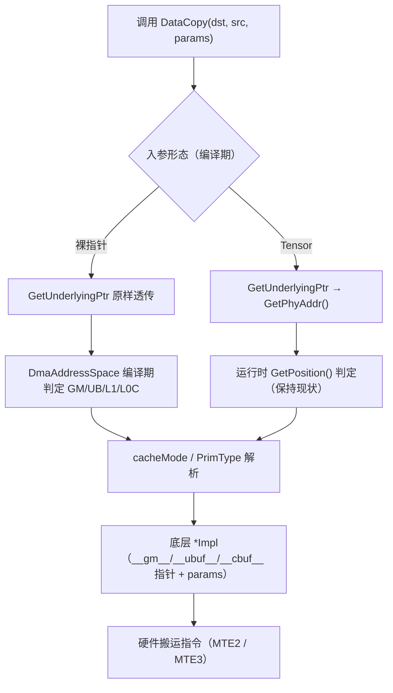

# Ascend C Basic API 指针化扩展（DMA · 数据搬运 / 缓存）设计文档

> 【参与任务昵称】baicai-1145　【gitcode 账号】baicai-1145　【任务】9 月社区任务 - Ascend C Basic API 指针化扩展（DMA · 数据搬运 / 缓存）分册
>
> 提交路径：`cann-ops-competitions` → `04_tasks/01_community-task-2026/tasklist/09-Basic_API指针化扩展-DMA搬运类/baicai-1145/docs/design.md`
>
> 目标仓：`asc-devkit`（`include/basic_api`、`impl/basic_api`、`tests/api/basic_api`）
> 目标硬件：Ascend 950 系列（`__NPU_ARCH__ == 3510`），CANN 9.0.0 ~ 9.1.0

---

# 一、需求描述

## 1.1 需求来源

CANN 社区任务书《9 月社区任务 - Ascend C Basic API 指针化扩展任务书（DMA · 数据搬运 / 缓存分册）》要求在 Ascend C Basic API 的 DMA（数据搬运 / 缓存）类接口上进行**指针化扩展**：在**保持原有 LocalTensor / GlobalTensor 接口功能与兼容性不变**的前提下，允许开发者直接使用 `__ubuf__` / `__gm__` / `__cbuf__` / `__cc__` 等硬件地址空间指针调用 DataCopy、DataCopyPad、DataCopyL1ToUB、DataCachePreload、DataCacheCleanAndInvalid，在 `__aicore__` 代码中以「裸指针 + 编译期 blockLength」的范式完成搬运与缓存控制。

本册范围为 **5 个 API 名称、44 个重载签名**（类型码 **D**，清单见任务书 2.4 节接口总表），改造后代码须合入 `asc-devkit` 仓 `master` 分支 `include/basic_api` 与 `impl/basic_api`，并在 `tests/api/basic_api` 补充测试。

目标编程范式（任务书示例）：

```cpp
template <uint32_t blockLength>
__vector__ __global__ void dma_ptr_kernel(__gm__ float* x, __gm__ float* y, __gm__ float* z)
{
    AscendC::InitSocState();
    __ubuf__ float xPtr[blockLength];
    __ubuf__ float yPtr[blockLength];
    __ubuf__ float zPtr[blockLength];
    auto offset = block_idx * blockLength;
    auto mutexId = 0;
    AscendC::Mutex::Lock<PIPE_MTE2>(mutexId);
    AscendC::DataCopy(xPtr, x + offset, blockLength);
    AscendC::Mutex::Unlock<PIPE_MTE2>(mutexId);
    // 计算处理，忽略
    AscendC::Mutex::Lock<PIPE_MTE3>(mutexId);
    AscendC::DataCopy(z + offset, zPtr, blockLength);
    AscendC::Mutex::Unlock<PIPE_MTE3>(mutexId);
}
```

姊妹任务 VECTOR（矢量计算）、CUBE（矩阵 / ISASI）分册并行开发，三册接口范围互不重叠。

## 1.2 需求分析

**现状**：asc-devkit `include/basic_api` 中 DMA 类接口的对外声明全部以 `LocalTensor<T>` / `GlobalTensor<T>` 为操作数类型。以 `DataCopy` 的 Level 2 count 形式为例：

```cpp
template <typename T>
__aicore__ inline __inout_pipe__(MTE2) void DataCopy(
    const LocalTensor<T>& dst, const GlobalTensor<T>& src, const uint32_t count);
```

Tensor 入参承担了两类职责：一是**数据本体**（最终都要通过 `GetPhyAddr()` 退化为硬件指针）；二是**元信息载体**（`GetPosition()` 决定 GM/UB/L1 分发、`ExtractCacheMode()` 提供 L2 cache hint、size 元信息支撑 `ASCENDC_CPU_DEBUG` 越界检查、MSTX 维度上报）。

**痛点**：在 SPMD 指针范式（`__global__` kernel + `__ubuf__`/`__gm__` 裸指针 + 编译期 shape）下，开发者被迫先构造 LocalTensor / GlobalTensor 才能调用搬运接口，Tensor 对象的构造、TPosition 绑定与 TPipe/TQue 生命周期在同一 kernel 内并不总是成立（例如任务书示例中 `__ubuf__ float xPtr[blockLength]` 这类编译期数组不需要也不适合包装为 TBuf/LocalTensor）。指针范式已成为 950 上 SIMT / 向量化编程的推荐写法，Basic API 必须与之对齐。

**改造后的关键不变量**：

1. **等价性**：`DataCopy(ubPtr, gmPtr, count)` 与 `DataCopy(ubTensor, gmTensor, count)`（两者底层地址与 TPosition 语义等价时）必须走同一条底层 `*Impl` 路径，数值行为逐位一致。
2. **兼容性**：原有 Tensor 代码零改动可编译、可运行，行为不变；这是验收的硬门槛（原有用例回归失败即不通过）。
3. **零运行时开销**：指针 / Tensor 的选择是**编译期**入参类型适配，不得引入运行时分发、分支或额外 Device 内存。

**本册边界**：仅改造接口清单中的 5 个 API 名称（DataCopy / DataCopyPad / DataCopyL1ToUB / DataCachePreload / DataCacheCleanAndInvalid）的 44 个重载签名；不改动 `*Impl` 的数值语义与底层 intrinsic 调用，不触碰 VECTOR / CUBE 分册接口。

---

# 二、方案设计

## 2.1 接口内部实现

### 2.1.1 总体思路：在模板包装层统一「指针萃取」

asc-devkit 的 Basic API 是**三层结构**：

| 层次 | 位置 | 职责 |
| --- | --- | --- |
| 对外声明层 | `include/basic_api/kernel_operator_data_copy_intf.h` | 声明对外重载集合、pipe 属性、条件编译 |
| 模板包装层 | `impl/basic_api/kernel_operator_data_copy_intf_impl.h`（缓存类为 `kernel_operator_cache_intf_impl.h`） | 元信息解析（TPosition 分发、cacheMode 提取、debug 检查、DFX 上报）后调用底层 `*Impl` |
| 底层实现层 | `impl/basic_api/dav_3510/kernel_operator_data_copy_impl.h` 等 | 直接调用硬件 intrinsic，入参已经是硬件指针 |

关键事实：**底层实现层的入参本来就是硬件指针**。模板包装层当前所做的，正是把 Tensor 退化为指针：

```cpp
// impl/basic_api/kernel_operator_data_copy_intf_impl.h（现状，节选）
if (dstHWPos == Hardware::UB) {
    DataCopyGM2UBImpl((__ubuf__ PrimType*)dst.GetPhyAddr(), (__gm__ PrimType*)src.GetPhyAddr(), repeatParams, cacheMode);
} else if (dstHWPos == Hardware::L1) {
    DataCopyGM2L1Impl((__cbuf__ PrimType*)dst.GetPhyAddr(), (__gm__ PrimType*)src.GetPhyAddr(), repeatParams, cacheMode);
}
```

因此本设计**不新增平行实现，也不改动底层 `*Impl`**：只在模板包装层引入统一萃取模板 `GetUnderlyingPtr`，把「Tensor 或指针」两种入参折叠为同一个底层指针，其余逻辑（位置分发、cacheMode、检查、DFX）按入参形态做编译期分支。

### 2.1.2 指针萃取与类型契约

新增一个仅有模板 trait 的轻量公共头，供本册与 VECTOR 姊妹册共用（避免两册各自实现、重复评审）：

```cpp
// 建议新增：impl/basic_api/utils/kernel_ptr_utils.h（header guard 保护，两册共用）
namespace AscendC {

// 1) 指针萃取：指针原样透传，Tensor 退化为物理地址
template <typename U>
__aicore__ inline constexpr auto GetUnderlyingPtr(const U& val)
{
    if constexpr (Std::is_pointer_v<U>) {
        return val;                       // __gm__ T* / __ubuf__ T* / __cbuf__ T* / __cc__ T*
    } else {
        return val.GetPhyAddr();          // LocalTensor<T> / GlobalTensor<T>
    }
}

// 2) 元素类型萃取（供 PrimT<T> / dtype 校验复用）
template <typename U, typename = void>
struct DmaOperandElemT { using type = Std::remove_cv_t<Std::remove_pointer_t<U>>; };   // 指针：元素类型取 pointee
template <typename U>
struct DmaOperandElemT<U, Std::void_t<decltype(Std::declval<const U&>().GetPhyAddr())>> {
    using type = typename U::PrimType;                            // Tensor：取 PrimType
};

// 3) 操作数形态判定与地址空间判定（用于 SFINAE 约束与编译期分发）
template <typename U> struct IsDmaOperand : Std::false_type {};
template <typename U> struct IsDmaOperand<LocalTensor<U>> : Std::true_type {};
template <typename U> struct IsDmaOperand<GlobalTensor<U>> : Std::true_type {};
template <typename U> struct IsDmaOperand<U*> : Std::true_type {};   // 含地址空间限定指针

template <typename U> struct DmaAddressSpace;   // 见 2.1.4：Tensor→TPosition，指针→地址空间限定符

} // namespace AscendC
```

设计约定：

- `GetUnderlyingPtr` 为 `constexpr` + `if constexpr`，编译期完全内联，**不产生任何运行时指令**；
- 指针分支不做任何 reinterpret 或 offset 修正，指针语义与 Tensor 的 `GetPhyAddr()` 完全等价；
- 元素类型：`LocalTensor<T>` / `GlobalTensor<T>` 均已有 `using PrimType = PrimT<T>;`（已在现状代码中核对：`include/basic_api/kernel_tensor.h:149`、`:256`），指针则用 `Std::remove_pointer_t` 取 pointee，二者统一到 `DmaPrimT<>`；
- **地址空间 cast 仍保留在调用点**。当前仓库中两个 Tensor 的物理地址接口返回类型并不一致（已在现状代码中核对）：
  - `GlobalTensor<T>::GetPhyAddr()` 返回 `const __gm__ PrimType*`（`impl/basic_api/kernel_tensor_impl.h:1316`）；
  - `LocalTensor<T>::GetPhyAddr()` 在 `__NPU_DEVICE__` 路径下返回 `uint64_t`（`kernel_tensor_impl.h:741`），仅在 `ASCENDC_CPU_DEBUG` 路径下返回 `PrimType*`（`kernel_tensor_impl.h:166`）。
  这正是现状 `*Impl` 调用点写成 `(__ubuf__ PrimType*)dst.GetPhyAddr()` 的原因。因此 `GetUnderlyingPtr` 只承担「指针透传 / Tensor 取物理地址」的**统一化**职责，地址空间与元素类型的显式 cast 维持在调用点，保持与现状逐字一致的形态：`(__ubuf__ PrimType*)GetUnderlyingPtr(dst)`。对纯指针入参而言该 cast 是恒等转换（编译期 no-op），不产生任何指令；两者结合后，Tensor 与指针两条路径收敛到**同一行**底层 `*Impl` 调用。

### 2.1.3 声明改造范式

以 `DataCopy`（GM → UB，Level 2 count 形式）为例，改造前后：

```cpp
// 改造前
template <typename T>
__aicore__ inline __inout_pipe__(MTE2) void DataCopy(
    const LocalTensor<T>& dst, const GlobalTensor<T>& src, const uint32_t count);

// 改造后（dst / src 可为 Tensor，也可为等价地址空间的裸指针）
template <typename DstT, typename SrcT,
          typename Std::enable_if<IsUbOrUbPtr<DstT>::value && IsGmOrGmPtr<SrcT>::value, bool>::type = true>
__aicore__ inline __inout_pipe__(MTE2) void DataCopy(
    const DstT& dst, const SrcT& src, const uint32_t count);
```

`DataCopyPad`（GM → UB，Ext 参数形式）：

```cpp
// 改造前
template <typename T, PaddingMode mode = PaddingMode::Normal>
__aicore__ inline __inout_pipe__(MTE2) void DataCopyPad(
    const LocalTensor<T>& dst, const GlobalTensor<T>& src,
    const DataCopyExtParams& dataCopyParams, const DataCopyPadExtParams<T>& padParams);

// 改造后
template <typename DstT, typename SrcT, PaddingMode mode = PaddingMode::Normal,
          typename Std::enable_if<IsUbOrUbPtr<DstT>::value && IsGmOrGmPtr<SrcT>::value, bool>::type = true>
__aicore__ inline __inout_pipe__(MTE2) void DataCopyPad(
    const DstT& dst, const SrcT& src,
    const DataCopyExtParams& dataCopyParams, const DataCopyPadExtParams<DmaOperandElemT<SrcT>::type>& padParams);
```

**必须保持不变的三件事**：

1. **pipe 属性**：`__inout_pipe__(MTE2)` / `__inout_pipe__(MTE3)` / `__inout_pipe__(V)` 一律原样保留，不因入参泛化而退化为无 pipe 标注；
2. **架构条件编译**：`__NPU_ARCH__` 分组、`enableSmallC0`、`PaddingMode`、`subBlockId`、`NdDmaConfig` 等模板参数与守卫宏逐条保留（本册 44 条签名中相当一部分正是架构差异变体）；
3. **SFINAE 约束**：dtype 转换类重载（`float→half`、`int32→int8` 等）依赖 `PrimT<T>` 的 `enable_if` 组合，改造后其约束语义不得放宽，否则会与泛化签名产生重载歧义（见 2.1.5）。

### 2.1.4 位置与地址空间的编译期分发

Tensor 路径的 GM/UB/L1 分发依赖运行时 `dst.GetPosition()`（`GetPhyType((TPosition)dst.GetPosition())`）。裸指针不含 TPosition 元信息，但**地址空间限定符本身即位置信息**，可在编译期完成等价分发：

| 地址空间限定符 | 硬件位置 | TPosition 等价 |
| --- | --- | --- |
| `__gm__ T*` | GM | GM / GLOBAL |
| `__ubuf__ T*` | UB | VECIN / VECCALC / VECOUT |
| `__cbuf__ T*` | L1（含 A1/B1/C1） | A1 / B1 / C1 / TSCM |
| `__cc__ T*` | L0C | CO1 / CO2 |
| `__fbuf__ T*` | FB | — |

实现方式为 `DmaAddressSpace<U>` trait（Tensor 特化读 `TPosition`、指针特化读地址空间限定符）+ `if constexpr` 分发。这样指针路径的 `if (dstHWPos == ...)` 判断在编译期折叠为单一分支，不引入运行时开销——这是 2.1.2「零运行时开销」约束的具体落点：**Tensor 路径的运行时判断保持原样（行为不变），指针路径的判断在编译期完成**。

```cpp
// 模板包装层改造后（DataCopy GM→UB/L1 家族示意）
template <typename DstT, typename SrcT, ...>
__aicore__ inline __inout_pipe__(MTE2) void DataCopy(const DstT& dst, const SrcT& src, const DataCopyParams& repeatParams)
{
    using PrimType = DmaPrimT<SrcT>;                      // Tensor 或指针均可得 PrimType
    const auto cacheMode = ExtractCacheModeFor(src);      // 见 2.1.5，Tensor / 指针双支持
    if constexpr (IsGmPtr<SrcT>::value) {                 // 指针路径：编译期分发
        if constexpr (IsUbPtr<DstT>::value) {
            DataCopyGM2UBImpl((__ubuf__ PrimType*)GetUnderlyingPtr(dst),
                              (__gm__ PrimType*)GetUnderlyingPtr(src), repeatParams, cacheMode);
        } else {
            static_assert(IsL1Ptr<DstT>::value, "DataCopy GM->dst: dst must be UB or L1 pointer");
            DataCopyGM2L1Impl((__cbuf__ PrimType*)GetUnderlyingPtr(dst),
                              (__gm__ PrimType*)GetUnderlyingPtr(src), repeatParams, cacheMode);
        }
    } else {                                             // Tensor 路径：保留原有运行时逻辑与检查
        // ... 与现状逐行一致的 GetPosition 分发、debug 检查、DFX 上报 ...
    }
}
```

### 2.1.5 元信息依赖的等价替代与降级策略

Tensor 入参携带的元信息在指针路径下需要等价物或明确的降级声明，逐项设计如下：

| 元信息 | Tensor 路径来源 | 指针路径方案 | 结论 |
| --- | --- | --- | --- |
| 硬件位置 | `GetPosition()` / `GetPhyType()` | 地址空间限定符 + `if constexpr` | **等价**，编译期完成 |
| L2 cache hint | `ExtractCacheMode(const GlobalTensor<T>&)` | `ExtractCacheMode(__gm__ T* addr)`（`kernel_utils_macros.h:250` 已有该重载，从地址高位 `L2_CACHE_OFFSET` 提取） | **等价**，`ExtractCacheModeFor(src)` 按入参形态二选一 |
| dtype | `PrimT<T>` | `DmaPrimT<SrcT>`（指针取 pointee） | **等价** |
| 越界 / 对齐检查 | `CheckDataCopyTensor`、`CheckDataCopyTensorSizeOverflow`（依赖 Tensor size 元信息） | 参数自身范围检查保留（如 `CheckNd2NzParams`）；Tensor size 相关检查对指针路径不可用，改为编译期 `static_assert`（地址空间、元素类型一致性）+ 文档化约束 | **降级**：指针路径不做 Tensor 尺寸推导，调用方对长度负责 |
| MSTX / DFX 维度上报 | `MstxTensor::GetMstxDataCopyInfo(dst, src, repeatParams, "DataCopy")` | 指针路径不参与 Tensor 维度上报（无 shape 元信息），保留 `ASCENDC_TIME_STAMP_ON` 打点 | **降级**，后续可按 DFX 需求补充基于指针的轻量上报 |
| CPU debug stub | `ASCENDC_CPU_DEBUG` 下 `CheckFuncDataCopy` | 指针路径直通底层，CPU debug 下指针用例以参数范围检查 + 结果比对覆盖 | **降级**，Tensor 路径 CPU debug 能力不受影响 |

降级项均**只作用于指针路径**，Tensor 路径的检查强度保持改造前水平。

### 2.1.6 重载决议安全性（本设计最关键的风险点）

泛化签名可能与既有 44 条签名（尤其 dtype 转换家族、`enable_if` 约束家族）产生候选冲突。控制手段：

1. **地址空间互斥约束**：泛化签名一律带 `IsXxxOrXxxPtr<>` 约束（2.1.3），不同家族的约束集合**两两互斥**（如 `DstUb × SrcGm`、`DstGm × SrcUb`、`DstUb × SrcL1`），不存在两个泛化签名同时为可行候选的情况；
2. **Tensor 专用签名优先**：既有 Tensor 专用重载（dtype 转换、`DataCopyParams` + `DataCopyEnhancedParams`、`DataCopyCO12DstParams` 等）保持其更具体的形参模式，在偏序规则（partial ordering）下比泛化签名更特化，优先被选中；
3. **不删除、不放宽**：任何既有签名都不删除；本次改造只**新增可达性**（使指针也能匹配），不缩减既有约束；
4. **决议验证**：为每条改造签名补充编译期决议断言用例（同一调用表达式在改造前后解析到同一条底层 `*Impl`，通过 950 真机/CPU debug 行为一致 + UT 回归验证），并在 `tests/api/basic_api/ascendc_header_checker/` 下补充头文件自包含性检查。

若评审认为泛化签名对既有决议风险过高，本设计保留**备选方案 B**：不泛化既有签名，而是为每个家族追加**指针专用重载**（形参直接写 `__ubuf__ T*` / `__gm__ T*` 等），Tensor 签名逐字不动。备选方案 B 决议风险最低，但新增签名数量翻倍、与「改造原有接口」的任务书表述略有偏离；本设计推荐方案 A（泛化 + 互斥约束），并以方案 B 作为风险回退。

### 2.1.7 改造流程图



## 2.2 接口设计

### 2.2.1 Kernel 侧接口（改造后原型）

共 5 个 API 名称、44 个重载签名（含按 `__NPU_ARCH__` 条件编译的架构差异变体与模板变体）。下表按功能家族归纳，改造时逐条与任务书 2.4 接口清单对照；「950」列标注该条目在 `__NPU_ARCH__ == 3510` 下是否参与编译。

**DataCopy（搬运，含格式转换）**

| # | 改造后原型（省略 template 约束与默认模板参数） | pipe | 950 |
| --- | --- | --- | --- |
| 1 | `DataCopy(Dst, Src, const DataCopyParams&)` — GM → UB / L1 | MTE2 | ✔ |
| 2 | `DataCopy(Dst, Src, const Nd2NzParams&)` — ND → NZ（GM → L1 / UB，含 `enableSmallC0` 变体） | MTE2 | ✔ |
| 3 | `DataCopy(Dst, Src, const Nd2NzParams&)` — UB → L1（TSCM） | — | ✔ |
| 4 | `DataCopy(Dst, Src, const Dn2NzParams&)` — DN → NZ（含 `enableSmallC0` 变体） | MTE2 | ✔ |
| 5 | `DataCopy(Dst, Src, const DataCopyParams&)` — UB / L1 → GM | MTE3 | ✔ |
| 6 | `DataCopy(Dst, Src, const DataCopyParams&)` — UB → UB | — | ✔ |
| 7 | `DataCopy(Dst<T>, Src<U>, const DataCopyParams&)` — L1 → UB（跨 dtype） | — | ✔ |
| 8 | `DataCopy(Dst, Src, const SliceInfo[], const SliceInfo[], uint32_t dimValue)` — 多维切片 GM → UB | MTE2 | ✔ |
| 9 | `DataCopy(Dst, Src, const SliceInfo[], const SliceInfo[], uint32_t dimValue)` — 多维切片 UB → GM | MTE3 | ✔ |
| 10 | `DataCopy(Dst, Src, uint32_t count)` — GM → UB | MTE2 | ✔ |
| 11 | `DataCopy(Dst, Src, uint32_t count)` — UB → GM | MTE3 | ✔ |
| 12 | `DataCopy(Dst, Src, uint32_t count)` — UB → UB | — | ✔ |
| 13 | `DataCopy(Dst, Src, const Nz2NdParamsFull&)` — NZ → ND（L0C → GM 等） | MTE3 | ✔ |
| 14 | `DataCopy(Dst, Src, const Nz2DnParamsFull&)` — NZ → DN | MTE3 | ✘（5101/5161/5165/5163） |
| 15 | `DataCopy(Dst, Src, const DataCopyParams&, const DataCopyEnhancedParams&)` — GM → UB / L1（Enhanced） | MTE2 | ✔ |
| 16 | `DataCopy(Dst, Src, const DataCopyParams&, const DataCopyEnhancedParams&)` — UB / L1 → GM（Enhanced） | MTE3 | ✔ |
| 17 | `DataCopy(Dst, Src, const DataCopyParams&, const DataCopyEnhancedParams&)` — UB → UB（Enhanced） | — | ✔ |
| 18 | `DataCopy(Dst, Src, const DataCopyCO12DstParams&)` — L0C → UB | — | ✔ |
| 19 | `DataCopy(Dst, Src, const DataCopyCO12DstParams&)` — L0C → GM | — | ✔ |
| 20–25 | dtype 转换家族：`float→bf16`（2201 仅）、`float→half`、`int32→half`、`int32→int16`、`int32→int8`、`int32→uint8`、`half→float` 的 `DataCopy(Dst, Src, const DataCopyParams&, const DataCopyEnhancedParams&)` | MTE2/MTE3/V | 部分 |
| 26 | `DataCopy(Dst, Src, const MultiCopyParams<T, dim>&, const NdDmaConfig&)` — 多维 ND DMA | MTE2 | ✔（3510/5102） |

**DataCopyPad（非对齐搬运）**

| # | 改造后原型 | pipe | 950 |
| --- | --- | --- | --- |
| 27 | `DataCopyPad(Dst, Src, const DataCopyParams&, const DataCopyPadParams&[, PaddingMode])` — GM → UB / L1 | MTE2 | ✔ |
| 28 | `DataCopyPad(Dst, Src, const DataCopyParams&[, PaddingMode])` — UB / L1 → GM | MTE3 | ✔ |
| 29 | `DataCopyPad(Dst, Src, const DataCopyParams&, const Nd2NzParams&)` — UB → L1 | — | ✔ |
| 30 | `DataCopyPad(Dst, Src, const DataCopyExtParams&, const DataCopyPadExtParams<T>&[, PaddingMode])` — GM → UB / L1 | MTE2 | ✔ |
| 31 | `DataCopyPad(Dst<T>, Src<T>, const DataCopyExtParams&, const DataCopyPadExtParams<U>&)` — trait 变体 | MTE2 | ✔ |
| 32 | `DataCopyPad(Dst, Src, const DataCopyExtParams&[, PaddingMode])` — UB / L1 → GM | MTE3 | ✔ |
| 33 | `DataCopyPad(Dst, Src, const DataCopyExtParams&, const Nd2NzParams&)` — UB → L1 | — | ✔ |

**DataCopyL1ToUB**

| # | 改造后原型 | pipe | 950 |
| --- | --- | --- | --- |
| 34 | `DataCopyL1ToUB(Dst, Src, uint32_t count[, uint8_t subBlockId])` | — | ✔ |
| 35 | `DataCopyL1ToUB(Dst, Src, const DataCopyParams&[, uint8_t subBlockId])` | — | ✔ |

**DataCachePreload / DataCacheCleanAndInvalid（缓存类）**

| # | 改造后原型 | pipe | 950 |
| --- | --- | --- | --- |
| 36 | `DataCachePreload(const GlobalTensor<uint64_t>& \| __gm__ uint64_t*, T cacheOffset)` | — | ✔ |
| 37 | `DataCacheCleanAndInvalid(Dst, CacheLine entireType, DcciDst dcciDst)` — GM | — | ✔ |
| 38 | `DataCacheCleanAndInvalid(Dst, CacheLine entireType, DcciDst dcciDst)` — UB | — | ✔ |
| 39 | `DataCacheCleanAndInvalid(Dst, CacheLine entireType)` — GM | — | ✔ |

> 说明：表中 `Dst` / `Src` 表示「改造后可由 Tensor 或等价地址空间指针充任」的位置。任务书清单共 5 个 API 名称、44 个重载签名（`enableSmallC0`、`PaddingMode`、`subBlockId`、架构差异等模板/条件编译变体按清单计入）；本表按当前 `master` 头文件归纳家族，逐条改造时以清单为准一一对照并登记。

**表 1 模板参数说明**

| 参数名 | 描述 |
| --- | --- |
| `DstT` / `SrcT` | 目的 / 源操作数类型。可为 `LocalTensor<T>`、`GlobalTensor<T>`，或对应地址空间的硬件指针（`__ubuf__ T*`、`__gm__ T*`、`__cbuf__ T*`、`__cc__ T*`）。两者位宽必须兼容；Tensor 与指针混用允许（如 `DataCopy(ubPtr, gmTensor, count)`） |
| `T` / `U` | 元素类型（`half`、`float`、`bfloat16_t`、`int8_t`、`uint8_t`、`int16_t`、`int32_t`、`uint16_t`、`uint32_t` 等，按各重载原有支持范围不变） |
| `enableSmallC0` | 保留原语义与默认值 `false`（3510/5102/5101/5161/5165/5163 ND2NZ 小 C0 模式） |
| `mode` | `PaddingMode`，保留原语义与默认值 `PaddingMode::Normal`（3510/5102） |
| `subBlockId` | `DataCopyL1ToUB` 的 sub-block 选择，保留原语义与默认值 `0` |
| `dim` / `config` | `MultiCopyParams<T, dim>` 维度与 `NdDmaConfig`，保留原语义（默认 `kDefaultNdDmaConfig`） |

**表 2 接口参数说明（以 `DataCopy(Dst, Src, const DataCopyParams&)` 为例）**

| 参数名 | 输入/输出 | 描述 |
| --- | --- | --- |
| `dst` | 输出 | 目的操作数。Tensor：`LocalTensor<T>`（TPosition 决定 UB / L1）；指针：`__ubuf__ T*` / `__cbuf__ T*` |
| `src` | 输入 | 源操作数。Tensor：`GlobalTensor<T>`；指针：`__gm__ T*` |
| `repeatParams` | 输入 | `DataCopyParams{blockCount, blockLen, srcGap, dstGap}`，语义与改造前完全一致 |
| 返回值 | — | `void` |

**Kernel 接口约束说明**

1. **地址对齐**：块搬运按 32B 对齐（`DataCopyPad` 支持非对齐尾块）；指针路径的对齐要求与对应 Tensor 路径一致，由调用方保证。
2. **地址空间与位置一致性**：指针路径下操作数位置由地址空间限定符决定；Tensor 路径下由 `TPosition` 决定。**混用**时以各自元信息为准（例如 `__ubuf__` 指针 + UB 位置 Tensor 等价；`__ubuf__` 指针 + L1 位置 Tensor 属非法组合，行为未定义）。
3. **长度与容量**：指针路径无 shape 元信息，`count` / `blockCount × blockLen` / slice 维度均由调用方保证不超过目的 buffer 容量；越界不做运行时报错（Tensor 路径的 `ASCENDC_CPU_DEBUG` 检查保持有效）。
4. **不支持源与目的地址重叠**（与改造前一致）。
5. **不支持跨地址空间非法搬运**：如 `__gm__ → __gm__`、`__ubuf__ → __cbuf__` 之外的未定义组合，编译期 `static_assert` 拦截。
6. **pipe 语义**：`__inout_pipe__` 属性与改造前逐条一致，调用方仍需按流水要求用 `TQue` / `Mutex` / event 保护真实依赖（任务书示例中的 `Mutex::Lock<PIPE_MTE2>` 正是该语义）。
7. **缓存类约束**：`DataCachePreload` 仅接受 GM 侧操作数（`GlobalTensor<uint64_t>` 或 `__gm__ uint64_t*`）；`DataCacheCleanAndInvalid` 的 `entireType` / `dcciDst` 语义不变，UB 特化对指针路径同样成立。
8. **硬件支持**：本设计面向 Ascend 950 系列（`__NPU_ARCH__ == 3510`），其余架构按各自既有条件编译分支保留。

### 2.2.2 Host 侧接口

**无新增 Host 侧接口。** 本册 5 个 API 均为设备侧 `__aicore__` 接口，不涉及 tiling、临时空间申请或算子注册：指针化改造仅为编译期入参类型适配，不改变任何 Host 侧可见行为（无 tmp buffer 查询、无 tiling 结构体、无算子原型变化）。既有 Host 侧接口（如 `GetDataCopyMaxMinTmpSize` 等）保持原样。

调用层级遵循 Ascend C 约束：Host / 普通 C++ 代码仅通过 `<<<>>>` 启动 kernel；`__global__` 函数只调用 `__aicore__` 函数；改造后的接口均为 `__aicore__ inline`，可被 `__global__` 与其它 `__aicore__` 函数直接调用。

## 2.3 测试用例设计

测试分三层：**既有回归**（证明兼容性）、**新增指针路径用例**（证明扩展有效性）、**样例改造**（证明真实范式可用）。

### 2.3.1 既有回归（Tensor 路径不变性）

| 用例集 | 位置 | 目的 |
| --- | --- | --- |
| `test_data_copy.cpp` / `test_data_copy_pad.cpp` / `test_data_copy_slice.cpp` / `test_copy.cpp` / `test_data_copy_nddma.cpp` | `tests/api/basic_api/ascendc_case_ascend950pr_9599/`、`ascendc_case_common/` | 覆盖 DataCopy / DataCopyPad / Slice / NDDMA 的 Tensor 路径，全量回归必须通过 |
| `test_operator_cache.cpp` | 同上 | DataCachePreload / DataCacheCleanAndInvalid 既有行为 |
| 头文件自包含检查 | `tests/api/basic_api/ascendc_header_checker/` | 改造后头文件仍可独立包含，无隐式依赖 |

### 2.3.2 新增指针路径用例（950 真机）

用例设计围绕「同一输入下指针路径与 Tensor 路径逐位一致」这一核心断言，并覆盖 shape 与 dtype 分档（任务书 3.2 要求）：

| 维度 | 取值 |
| --- | --- |
| 数据 Shape | `1`、`32`、`1024`、`2048`（矩阵类按 M/K/N 等价缩放） |
| 数据取值范围 | `[-100, 100]`（按接口合法域，如 `uint8_t` 用 `[0, 255]`） |
| dtype | `half`、`float`、`int16_t`、`int32_t`（按各重载支持范围裁剪） |
| 对齐 | 32B 对齐、非对齐尾块（`DataCopyPad` 专用） |
| 对照基准 | ① Tensor 路径输出；② 仓库 `scripts/gen_data.py` 生成的 golden |

代表性用例（数值为 `padding` 用例，其余类推）：

| 编号 | 测试项 | 指针写法 | 断言 |
| --- | --- | --- | --- |
| PTR-DC-01 | GM → UB，count 模式，float·shape 1024 | `DataCopy(ubPtr, gmPtr + offset, 1024)` | 与 Tensor 路径逐位一致；与 golden 一致 |
| PTR-DC-02 | GM → L1 ND2NZ，half·shape 32×32 | `DataCopy(l1Ptr, gmPtr, nd2nzParams)` | NZ 布局与 Tensor 路径逐位一致 |
| PTR-DC-03 | UB → GM，count 模式，float·shape 2048 | `DataCopy(gmPtr + offset, ubPtr, 2048)` | 与 Tensor 路径逐位一致 |
| PTR-DC-04 | L0C → GM，NZ2ND，float·shape 16×16 | `DataCopy(gmPtr, l0cPtr, nz2ndParams)` | 与 Tensor 路径逐位一致 |
| PTR-DC-05 | UB → L1 ND2NZ（TSCM） | `DataCopy(l1Ptr, ubPtr, nd2nzParams)` | 与 Tensor 路径逐位一致 |
| PTR-DC-06 | 多维切片 GM → UB | `DataCopy(ubPtr, gmPtr, dstSlice, srcSlice, dim)` | 与 Tensor 路径逐位一致 |
| PTR-DC-07 | ND DMA（`MultiCopyParams`）GM → UB | `DataCopy(ubPtr, gmPtr, params)` | 与 Tensor 路径逐位一致 |
| PTR-PAD-01 | `DataCopyPad` GM → UB，非对齐尾块 + pad 值 | `DataCopyPad(ubPtr, gmPtr, extParams, padParams)` | 有效区与 Tensor 路径一致；pad 区等于指定 pad 值 |
| PTR-PAD-02 | `DataCopyPad` UB → GM，非对齐尾块 | `DataCopyPad(gmPtr, ubPtr, extParams)` | 与 Tensor 路径逐位一致 |
| PTR-L1UB-01 | `DataCopyL1ToUB` count / `DataCopyParams` 两种形式 | `DataCopyL1ToUB(ubPtr, l1Ptr, count)` | 与 Tensor 路径逐位一致 |
| PTR-CACHE-01 | `DataCacheCleanAndInvalid` GM / UB 特化 | `DataCacheCleanAndInvalid<__gm__ float, CacheLine::ENTIRE_DATA_CACHE, DcciDst::CACHELINE_OUT>(gmPtr)` | 功能可用、结果与 Tensor 路径一致 |
| PTR-CACHE-02 | `DataCachePreload` | `DataCachePreload(gmPtr, offset)` | 功能可用、后续读取结果一致 |
| PTR-MIX-01 | Tensor / 指针混用（`ubPtr` + `gmTensor`、`ubTensor` + `gmPtr`） | 见 2.2.1 表 1 | 与全 Tensor 路径逐位一致 |
| PTR-MUTEX-01 | 任务书范式：`Mutex::Lock/Unlock<PIPE_MTE2/MTE3>` + 指针搬运 | 任务书示例 kernel | 端到端结果与 Tensor 版本一致 |
| PTR-REG-01 | 每条改造签名的决议回归（编译期） | 同一表达式同时以 Tensor / 指针形式实例化 | 编译期零歧义；Tensor 形式行为不变 |

测试实现复用任务提供的 `test-cases/` 工程（`data_copy_gm2l1`、`data_copy_gm2ub_nddma`、`data_copy_gm2ub_slice`、`data_copy_l0c2gm`、`data_copy_pad_gm2ub_ub2gm`、`data_copy_ub2l1`）与 `examples/01_simd_cpp_api/03_basic_api/00_data_movement/`，在其上增补指针路径调用并与 Tensor 路径对拍；`scripts/gen_data.py`、`scripts/verify_result.py` 作为 golden 生成与校验入口。

---

# 三、可维可测

## 3.1 精度标准 / 性能标准

| 验收标准 | 描述 | 标准来源 |
| --- | --- | --- |
| 精度标准 | **搬运类接口无数值变换，理想结果应为逐位一致（bit-exact）**：① 指针路径与等价 Tensor 路径输出逐位一致；② 与 `gen_data.py` golden 逐位一致。dtype 转换类重载（`float→half`、`int32→int8` 等）按生态算子开源实验标准误差判据（双万分之一）校验。Tensor 路径既有用例回归 100% 通过 | 任务书 3.2 节精度要求 + 生态算子开源精度标准（实验标准） |
| 性能标准 | 本任务**无**额外性能指标与标杆时延要求。设计要求为「相对改造前无明显性能回退」，机理上由**编译期类型适配**保证：指针路径无运行时类型判断、无额外指令、无非线性 Device 内存开销；自测报告将给出 Tensor / 指针两种路径的搬运耗时对比作为佐证 | 任务书 3.3 节性能要求 |
| 内存要求 | 指针化不引入与输入规模线性相关的额外 Device 内存；内存使用语义与原 Tensor 接口一致 | 任务书 3.4 节 |
| 自验要求 | 覆盖本册 5 个 API 名称的重载家族；至少对 6 个代表性路径完成指针 / Tensor 对拍；`gen_data.py` 或等价脚本输出精度结果 | 任务书 3.5 节 |

## 3.2 兼容性分析

| 维度 | 结论 | 依据 / 保障手段 |
| --- | --- | --- |
| 源码兼容 | 既有 Tensor 调用零改动可编译，行为不变 | 泛化签名仅在**地址空间/类型约束**下扩增可达集合；Tensor 专用签名全部保留且更特化，偏序优先；`tests/api/basic_api` 全量回归 |
| 决议兼容 | 新增泛化候选不改变既有调用的决议结果 | 2.1.6：家族约束两两互斥 + 专用签名优先 + 编译期决议回归用例（PTR-REG-01） |
| ABI / 链接 | 无影响 | 全部为 header-only `__aicore__ inline` 模板，改动不产生新符号、不改变既有符号 |
| 底层语义 | 无影响 | 不修改 `impl/basic_api/dav_3510/*_impl.h` 及更底层 `*Impl` 的数值语义与 intrinsic 调用 |
| 架构兼容 | 按架构条件编译逐条保留 | `__NPU_ARCH__` 守卫、`enableSmallC0`、`PaddingMode`、`subBlockId`、`NdDmaConfig` 等变体全部保留；本设计在 950（3510）验证 |
| 姊妹册边界 | 互不冲突 | 仅改动 DMA 5 个 API 的头文件区域；`kernel_ptr_utils.h` 为共享 trait 头（header guard 保护），VECTOR 册复用即可，不要求其修改本册文件；`*Impl` 与 VECTOR / CUBE 分册文件无交集 |
| 调试能力 | Tensor 路径不降级；指针路径按 2.1.5 表降级并文档化 | `ASCENDC_CPU_DEBUG` / `ASCENDC_DEBUG` 检查逻辑保留在 Tensor 分支 |
| 风险与回退 | 主方案（泛化 + 互斥约束）若在评审中判定决议风险不可接受，切换至备选方案 B（指针专用重载，Tensor 签名逐字不动），可保证决议零风险 | 2.1.6 方案 B |

**验证门禁（提交 PR 前）**：

1. `tests/api/basic_api` 中 Tensor 路径相关用例（`test_data_copy*`、`test_copy`、`test_operator_cache`）全量通过；
2. 新增指针路径用例全部通过，且指针 / Tensor 逐位一致；
3. `ascendc_header_checker` 头文件检查通过；
4. 任务书 `test-cases/` 六个工程改造后精度自测通过（`verify_result.py`）；
5. CI 评审规范检查通过（参照 asc-devkit 研发协作规范）。
