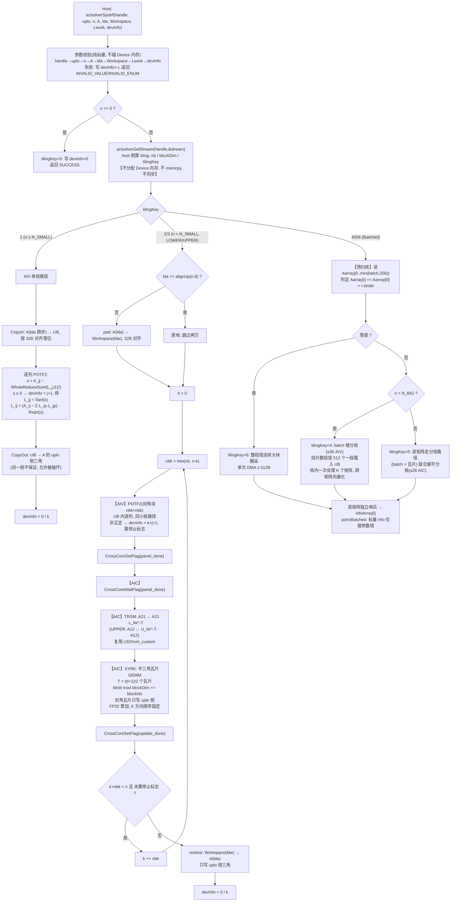

# Atlas 950 单精度实数 Cholesky 分解、求解和批量接口 设计文档

> 本文档覆盖同一社区任务的五个接口，五者作为同一任务一并交付、不拆分验收：
> `aclsolverSpotrf`、`aclsolverSpotrs`、`aclsolverSpotri`、`aclsolverSpotrfBatched`、`aclsolverSpotrsBatched`
>
> | 项 | 值 |
> | --- | --- |
> | 任务书 | 9月社区任务-单精度实数Cholesky分解、求解和批量接口(950) |
> | 目标硬件 | Ascend 950PR（Atlas 950） |
> | 合入仓 | https://gitcode.com/cann/ops-solver |
> | 工程模式 | ops-solver Host C API + AscendC/CATLASS Kernel 直调（非 aclnn 两段式、非 PyTorch） |

---

# 一、需求背景（required）

## 1.1 需求来源

通过 CANN 社区任务完成开源仓算子贡献。`gitcode.com/cann/ops-solver` 当前提供 LU 系（`sgetrf`/`sgetri`/`cgetrf`/`cgetri`）与特征值（`cheevj`）能力，**尚无任何 Cholesky 原型**。稠密对称正定线性系统求解是科学计算、最小二乘、卡尔曼滤波、高斯过程等场景的基础能力，需要在昇腾上补齐与 cuSolver DN 对齐的 `potrf`/`potrs`/`potri` 及其批量接口。

## 1.2 背景介绍

### 1.2.1 Cholesky 系列接口实现优化

本任务的算子在 CANN 中**没有 TBE 历史版本**（`ops-solver` 是纯 AscendC/CATLASS 仓，不存在 `op_impl/ai_core/tbe` 下的对应实现）。因此对标基线取任务书 §2.1 指定的 **NVIDIA cuSolver DN 稠密 Cholesky 接口**，同时以仓内既有的 LU 系实现作为**工程形态参考**。

**基线与参考实现路径：**

| 类别 | 路径 / 链接 |
| --- | --- |
| 功能与接口基线（cuSolver DN legacy API） | https://docs.nvidia.com/cuda/cusolver/index.html#cuSolverDN-legacy-api |
| 功能与接口基线（cuSolver DN batched） | https://docs.nvidia.com/cuda/cusolver/index.html#cusolverdn-potrfbatched |
| 数值基线（CPU golden） | LAPACK `spotrf`/`spotrs`/`spotri`，经 SciPy `scipy.linalg.cholesky` / `cho_solve` 以 FLOAT64 计算 |
| 仓内工程形态参考（列主序 + uplo + LAPACK 式 info） | `ops-solver/src/cheevj/cheevj_host.cpp`、`ops-solver/src/cheevj/cheevj_kernel.cpp` |
| 仓内可复用 FP32 kernel 组件 | `ops-solver/src/utils/kernel/c32/gemm.hpp`（`MatmulCustom`）、`trsm.hpp`、`trsm_custom.hpp`、`trsm_upper_custom.hpp`、`pad.hpp` |
| 仓内分块分解流程参考 | `ops-solver/src/sgetrf/sgetrf_kernel.cpp`、`ops-solver/src/utils/kernel/c32/lu_custom.hpp` |
| 公开头文件 | `ops-solver/include/cann_ops_solver.h`、`ops-solver/include/cann_ops_solver_common.h` |

### 1.2.2 基线现状分析

#### 1.2.2.1 基线支持的数据类型和数据格式

| 基线接口 | 数据类型 | 数据格式 | leading dimension | 指针归属 | workspace |
| --- | --- | --- | --- | --- | --- |
| `cusolverDnSpotrf` / `_bufferSize` | FLOAT32 | 列主序 ND，`lda × n` | `lda >= max(1,n)` | Device | 由 `_bufferSize` 给出 |
| `cusolverDnSpotrs` | FLOAT32 | 列主序 ND，A `lda × n`、B `ldb × nrhs` | `lda,ldb >= max(1,n)` | Device | 无 |
| `cusolverDnSpotri` / `_bufferSize` | FLOAT32 | 列主序 ND，`lda × n` | `lda >= max(1,n)` | Device | 由 `_bufferSize` 给出 |
| `cusolverDnSpotrfBatched` | FLOAT32 | Device 指针数组，每阵 `lda × n` | `lda >= max(1,n)` | Device | 无 |
| `cusolverDnSpotrsBatched` | FLOAT32 | Device 指针数组，A `lda × n`、B `ldb × nrhs` | `lda,ldb >= max(1,n)` | Device | 无 |

补充说明（与本设计直接相关的基线语义）：

1. **仅处理 `uplo` 指定的三角**，分解结果原地覆盖该三角；**未使用的另一半三角可作为 workspace 被破坏**，验收时只比较 `uplo` 指定的三角部分。
2. `potrs` / `potri` / `potrsBatched` 的输入是**已由 `potrf` 分解出的 Cholesky 因子**，不是未分解的原始 A。
3. `cusolverDnSpotrsBatched` **仅支持 `nrhs = 1`**；其 `info` 为标量，只报告非法参数，正定性由 `potrfBatched` 的 `infoArray` 反映（cuSOLVER 手册 Remark 2 同口径）。
4. `info` 语义为 LAPACK 约定：`0` 成功；`-i` 第 i 个参数非法；`i > 0` 第 i 阶顺序主子式不正定。

#### 1.2.2.2 基线算子实现描述

cuSolver DN 的稠密 Cholesky 走的是 **LAPACK 右看型（right-looking）分块算法**，以 `uplo = LOWER` 为例：

**potrf（`A = L·Lᵀ`）** 按块宽 `nb` 自左上向右下推进，第 `k` 步（记 `nbk = min(nb, n-k)`）：

1. **POTF2**：对对角块 `A[k:k+nbk, k:k+nbk]` 做非分块 Cholesky。逐列计算
   `L_jj = sqrt(A_jj - Σ_{p<j} L_jp²)`，随后 `L_ij = (A_ij - Σ_{p<j} L_ip·L_jp) / L_jj`。
   一旦出现 `A_jj - Σ L_jp² <= 0`，置 `info = k + j + 1`（1-based）并终止分解。
2. **TRSM**：`A[k+nbk:n, k:k+nbk] ← A[k+nbk:n, k:k+nbk] · L_kk^{-T}`（右乘下三角的转置逆）。
3. **SYRK**：`A[k+nbk:n, k+nbk:n] ← A[k+nbk:n, k+nbk:n] − A21·A21ᵀ`，**只更新下三角**。

总计算量 `n³/3` FLOP，其中 SYRK 占绝大部分。

**potrs（`A·X = B`）** 分解为两趟三角求解：`L·Y = B`（前代）后 `Lᵀ·X = Y`（回代），各 `n²·nrhs` FLOP，X 原地覆盖 B。`uplo = UPPER` 时对应 `Uᵀ·Y = B`、`U·X = Y`。

**potri（`A^{-1}`）** 分两阶段：① **TRTRI** 把三角因子就地求逆 `L → L^{-1}`；② **LAUUM** 计算 `A^{-1} = L^{-T}·L^{-1}`，结果只写 `uplo` 指定的三角。两阶段各 `n³/3` FLOP。`uplo = UPPER` 时为 `U → U^{-1}`、`A^{-1} = U^{-1}·U^{-T}`。

**potrfBatched / potrsBatched** 对 Device 指针数组里的每个矩阵独立执行上述流程。`potrfBatched` 逐矩阵写 `infoArray[i]`，某个矩阵非正定不影响其余矩阵照常分解；`potrsBatched` 的 `info` 是标量，只报参数错。

#### 1.2.2.3 基线实现流程图 ⭐

```mermaid
flowchart TD
    subgraph POTRF["cusolverDnSpotrf：右看型分块 Cholesky"]
        A0["输入 A(n×n, 列主序, lda)<br/>uplo / Workspace / Lwork"] --> A1{"k = 0"}
        A1 --> A2["nbk = min(nb, n-k)"]
        A2 --> A3["POTF2：对角块非分块 Cholesky<br/>L_jj=sqrt(A_jj-ΣL_jp²)<br/>L_ij=(A_ij-ΣL_ip·L_jp)/L_jj"]
        A3 --> A4{"A_jj-ΣL_jp² ≤ 0 ?"}
        A4 -- 是 --> A5["devInfo = k+j+1<br/>终止分解<br/>(前 k+j 列因子已算出)"]
        A4 -- 否 --> A6["TRSM：A21 ← A21·L_kk^-T"]
        A6 --> A7["SYRK：A22 ← A22 − A21·A21ᵀ<br/>(只更新 uplo 侧三角)"]
        A7 --> A8{"k+nbk < n ?"}
        A8 -- 是 --> A9["k += nbk"] --> A2
        A8 -- 否 --> A10["devInfo = 0<br/>L 原地覆盖 A 的 uplo 侧"]
    end

    subgraph POTRS["cusolverDnSpotrs：两趟三角求解"]
        B0["输入 因子 A / B(n×nrhs) / uplo"] --> B1{"uplo"}
        B1 -- LOWER --> B2["前代：解 L·Y = B"] --> B3["回代：解 Lᵀ·X = Y"]
        B1 -- UPPER --> B4["前代：解 Uᵀ·Y = B"] --> B5["回代：解 U·X = Y"]
        B3 --> B6["X 原地覆盖 B<br/>devInfo = 0 / -i"]
        B5 --> B6
    end

    subgraph POTRI["cusolverDnSpotri：TRTRI + LAUUM"]
        C0["输入 因子 A / uplo / Workspace"] --> C1{"因子对角有 0 ?"}
        C1 -- 是 --> C2["devInfo = k"]
        C1 -- 否 --> C3["TRTRI：三角因子就地求逆<br/>L → L^-1 (或 U → U^-1)"]
        C3 --> C4["LAUUM：A^-1 = L^-T·L^-1<br/>(UPPER: A^-1 = U^-1·U^-T)"]
        C4 --> C5["只写 uplo 侧三角<br/>devInfo = 0"]
    end

    subgraph BATCH["cusolverDnSpotrfBatched / SpotrsBatched"]
        D0["Device 指针数组 Aarray[] / Barray[]"] --> D1["对 i = 0..batchSize-1"]
        D1 --> D2["取 Aarray[i] 指向的矩阵"]
        D2 --> D3{"接口"}
        D3 -- potrfBatched --> D4["对 A[i] 执行 POTRF<br/>逐阵写 infoArray[i]<br/>非正定不影响其余矩阵"]
        D3 -- potrsBatched --> D5["nrhs 必须 = 1<br/>对 A[i]/B[i] 执行 POTRS<br/>info 为标量, 仅报参数错"]
    end
```



---

# 二、需求分析（required）

## 2.1 外部组件依赖

| 依赖 | 说明 |
| --- | --- |
| ACL Runtime（`acl/acl.h`） | stream / Device 内存语义；本设计仅使用 `aclrtMemsetAsync` 等异步接口 |
| AscendC（`kernel_operator.h`） | Kernel 直调编程模型 |
| CATLASS / 仓内 `src/utils/kernel/c32/` | FP32 矩阵乘与三角求解基础件 |
| CANN Toolkit | ≥ 9.0.0，与 ops-solver README 版本配套表一致 |

均为已适配依赖，无新增外部组件。

## 2.2 内部适配模块

| 模块 | 说明 |
| --- | --- |
| `aclsolver` handle 管理 | 复用既有 `aclsolverCreate` / `aclsolverDestroy` / `aclsolverSetStream` / `aclsolverGetStream`，不新增 handle 类型 |
| `aclsolverStatus_t` | 复用 `include/cann_ops_solver_common.h` 既有状态码枚举，不新增状态码 |
| `aclsolverFillMode_t` | 仓内已存在（值 `LOWER=0` / `UPPER=1`，与 `cublasFillMode_t` 对齐），本任务按任务书 §2.3 要求将其**声明位置移入 `cann_ops_solver_common.h`**，`cann_ops_solver.h` 通过 include 保持原有可见性，枚举名与取值不变，对既有 `aclsolverCheevj` 完全兼容 |
| 构建系统 | `build.sh --pkg --soc=ascend950 --ops=<op>`，`src/CMakeLists.txt` / `test/CMakeLists.txt` 追加五个算子目录 |

## 2.3 需求模块设计

### 2.3.1 AscendC 算子原型

参数名、顺序、含义、Device/Host 归属与任务书 §2.3 完全一致，维数类型与 cuSolver legacy API 一致使用 `int`（32-bit）。

```c
/* cann_ops_solver_common.h：与 cublasFillMode_t 对齐 */
typedef enum {
    ACLSOLVER_FILL_MODE_LOWER = 0,  /* 下三角，对齐 CUBLAS_FILL_MODE_LOWER */
    ACLSOLVER_FILL_MODE_UPPER = 1   /* 上三角，对齐 CUBLAS_FILL_MODE_UPPER */
} aclsolverFillMode_t;

/* cann_ops_solver.h：五个计算接口 + 两个 bufferSize */
aclsolverStatus_t aclsolverSpotrf_bufferSize(aclsolverHandle_t handle, aclsolverFillMode_t uplo,
                                             int n, float *A, int lda, int *Lwork);

aclsolverStatus_t aclsolverSpotrf(aclsolverHandle_t handle, aclsolverFillMode_t uplo,
                                  int n, float *A, int lda,
                                  float *Workspace, int Lwork, int *devInfo);

aclsolverStatus_t aclsolverSpotrs(aclsolverHandle_t handle, aclsolverFillMode_t uplo,
                                  int n, int nrhs, const float *A, int lda,
                                  float *B, int ldb, int *devInfo);

aclsolverStatus_t aclsolverSpotri_bufferSize(aclsolverHandle_t handle, aclsolverFillMode_t uplo,
                                             int n, float *A, int lda, int *Lwork);

aclsolverStatus_t aclsolverSpotri(aclsolverHandle_t handle, aclsolverFillMode_t uplo,
                                  int n, float *A, int lda,
                                  float *Workspace, int Lwork, int *devInfo);

aclsolverStatus_t aclsolverSpotrfBatched(aclsolverHandle_t handle, aclsolverFillMode_t uplo,
                                         int n, float *Aarray[], int lda,
                                         int *infoArray, int batchSize);

aclsolverStatus_t aclsolverSpotrsBatched(aclsolverHandle_t handle, aclsolverFillMode_t uplo,
                                         int n, int nrhs, float *Aarray[], int lda,
                                         float *Barray[], int ldb, int *info, int batchSize);
```

**参数归属与语义表**（`aclsolverSpotrf` 为例，其余四个接口逐项见任务书 §2.4，实现与之一一对齐）：

| 参数名 | 输入/输出/属性 | 描述 | 数据类型 | dtype | 排布 | shape | 值域 | 异常行为 |
| --- | --- | --- | --- | --- | --- | --- | --- | --- |
| handle | 输入 | aclsolver 上下文 | scalar | 句柄 | - | - | 非空 | 空句柄返回 `HANDLE_IS_NULLPTR` |
| uplo | 输入 | 使用下三角或上三角 | attr | `aclsolverFillMode_t` | - | - | LOWER / UPPER | 非法枚举返回 `INVALID_ENUM` |
| n | 输入 | 方阵阶数 | scalar | int | - | - | `n >= 0` | `n < 0` 返回 `INVALID_VALUE`，devInfo = -3 |
| A | 输入/输出（原地） | 对称正定矩阵；输出为 Cholesky 因子 | tensor | FLOAT32 | 列主序 ND | `lda × n` | 有限浮点 | 空指针且 n>0 报错，devInfo = -4 |
| lda | 输入 | A 的 leading dimension | scalar | int | - | - | `lda >= max(1,n)` | 不满足报错，devInfo = -5 |
| Workspace | 输入 | Device 工作空间 | tensor | FLOAT32 | ND | `[Lwork]` | - | 指针为空且 `Lwork>0` 报错，devInfo = -6 |
| Lwork | 输入 | workspace 元素个数 | scalar | int | - | - | `Lwork >= 0` | 小于所需返回 `INVALID_VALUE`，devInfo = -7 |
| devInfo | 输出 | 分解信息 | tensor | INT32 | ND | `[1]` | 0 / -i / i | 空指针返回 `INVALID_VALUE` |

**`info` 的 `-i` 参数编号表**（`i` 按本接口原型的参数序号计，**不计 handle**，与 cuSolver 一致）：

| 接口 | 1 | 2 | 3 | 4 | 5 | 6 | 7 | 8 |
| --- | --- | --- | --- | --- | --- | --- | --- | --- |
| `Spotrf` | uplo | n | A | lda | Workspace | Lwork | devInfo | - |
| `Spotrs` | uplo | n | nrhs | A | lda | B | ldb | devInfo |
| `Spotri` | uplo | n | A | lda | Workspace | Lwork | devInfo | - |
| `SpotrfBatched` | uplo | n | Aarray | lda | infoArray | batchSize | - | - |
| `SpotrsBatched` | uplo | n | nrhs | Aarray | lda | Barray | ldb | info（第 8）/ batchSize（第 9） |

**`info` 正值语义**：

| 接口 | 正值含义 |
| --- | --- |
| `Spotrf` | `info = k`：第 k 阶顺序主子式不正定（k 为最小不正定阶数），分解止于第 k 行，前 k−1 列因子已算出 |
| `SpotrfBatched` | `infoArray[i] = k`：第 i 个矩阵的第 k 阶顺序主子式不正定，其余矩阵照常分解；参数错写 `infoArray[0] = -i` |
| `Spotri` | `info = k`：输入因子的第 k 阶顺序主子式为零（第 k 个对角元为 0） |
| `Spotrs` | 无正值语义（输入已是因子，正定性由 potrf 阶段保证），仅 0 / −i |
| `SpotrsBatched` | 标量，无正值语义，仅 0 / −i |

### 2.3.2 AscendC 算子相关约束

与 cuSolver 基线相比**无功能缺失**，五个接口的参数、语义、`info` 约定、`uplo` 覆盖、`lda` padding 支持全部对齐。差异仅在：

| 项 | cuSolver | 本实现 |
| --- | --- | --- |
| 命名前缀 | `cusolverDn` | `aclsolver` |
| 三角枚举 | `cublasFillMode_t` | `aclsolverFillMode_t`（枚举值 0/1 一致） |
| 返回码 | `cusolverStatus_t` | `aclsolverStatus_t`（仓内既有枚举） |

> **与仓内既有算子的返回值差异说明**：`ops-solver` 既有的 6 个计算接口（`aclsolverSgetrf` 等）返回 `aclError`。按任务书 §2.2 要求，本任务五个接口统一返回 `aclsolverStatus_t`。两者对照表随算子 README 一并交付：
>
> | `aclsolverStatus_t` | 语义 | 对应 `aclError` |
> | --- | --- | --- |
> | `ACLSOLVER_STATUS_SUCCESS` | 成功 | `ACL_SUCCESS` |
> | `ACLSOLVER_STATUS_INVALID_VALUE` | 非法数值 / shape / 指针 | `ACL_ERROR_INVALID_PARAM` |
> | `ACLSOLVER_STATUS_INVALID_ENUM` | 非法枚举 | `ACL_ERROR_INVALID_PARAM` |
> | `ACLSOLVER_STATUS_HANDLE_IS_NULLPTR` | handle 为空 | `ACL_ERROR_INVALID_PARAM` |
> | `ACLSOLVER_STATUS_EXECUTION_FAILED` | kernel 下发/执行失败 | `ACL_ERROR_*`（透传） |

---

# 三、需求详细设计（required）

## 3.1 使能方式

本任务**不走 aclnn 两段式**，按任务书 §2.2 采用 **ops-solver Host C API + AscendC Kernel 直调**：

- Host 侧：参数校验 → workspace 尺寸计算 → tiling 计算 → 核函数下发，**全程不做 Device 内存分配、不做 Host↔Device 拷贝、不做 stream 同步**；
- Kernel 侧：AscendC 实现 POTRF / TRSM / SYRK / TRTRI / LAUUM 及批量调度；
- 计算走调用方 stream（`aclsolverGetStream` 取出），调用返回后由调用方自行同步。

> **重要设计约束**：任务书 §2.1.2 要求「矩阵、info、workspace 均为 Device 指针；Host 侧仅传入标量维数、枚举和 handle」，§2.1.5 要求「禁止无必要的 Host 同步」。仓内既有 `src/sgetrf/sgetrf_host.cpp` 是 Host 指针 + 内部 `aclrtMalloc`/`aclrtMemcpy` + `aclrtSynchronizeStream` 的形态，**与本任务要求不兼容，故本设计的 host 层不沿用该形态**，仅复用其 kernel 侧组件。

## 3.2 需求总体设计

### 3.2.1 host 侧设计

#### 3.2.1.1 分核策略

目标硬件 Ascend 950PR 的实测拓扑：**28 个 AIC（Cube）核、56 个 AIV（Vector）核，主频 1650 MHz**。实测 AIC 的 blockDim 在 28→29 处出现整倍台阶（428 ns → 853 ns），因此 **Cube 侧 blockDim 上限取 28、Vector 侧取 56**，不超发。

| 接口 / 路径 | 分核维度 | blockDim |
| --- | --- | --- |
| `Spotrf` / `Spotri` 小规模路径（`n ≤ N_SMALL`） | 不分核，单核完成整个分解 | 1（AIV） |
| `Spotrf` / `Spotri` 分块路径（`n > N_SMALL`） | 尾部更新的**半三角瓦片**按行优先展平后取模分核 | `min(瓦片数, 28)`（AIC） |
| `Spotrs`（`nrhs ≥ 2`） | 右端项列方向（各列互相独立） | `min(nrhs, 28)` |
| `Spotrs`（`nrhs = 1`） | 三角求解块内并行、块间串行 | `min(⌈n/nb⌉, 28)` |
| `SpotrfBatched` / `SpotrsBatched` 小矩阵路径（`n < N_BIG`） | **batch 维**，每核负责一段连续 batch，核内跨矩阵向量化 | `min(batchSize, 56)`（AIV） |
| `SpotrfBatched` / `SpotrsBatched` 大矩阵路径（`n ≥ N_BIG`） | （batch × 半三角瓦片）联合展平 | `min(总瓦片数, 28)`（AIC） |

分核公式（以分块路径的半三角瓦片为例）：设当前尾部块数 `t = ⌈(n-k-nbk)/nb⌉`，则需更新的瓦片数
`T = t·(t+1)/2`（含对角瓦片），第 `b` 号核处理 `{ tileId | tileId mod blockDim == b }`。
**瓦片到核的映射只依赖 `(n, k, nb, blockDim)`，与数据无关**，从而保证相同输入的归约顺序固定（满足任务书 §2.1.7 的 bit-wise 确定性要求）。

#### 3.2.1.2 数据分块和内存优化策略

Ascend 950PR 片上资源：**UB 248 KB（253952 B）、L1 512 KB、L0A/L0B 各 64 KB、L0C 256 KB**，Cube 分形 16×16×16。

**(1) 分块宽度 `nb` 的取值公式**

POTF2 需要把整个 `nb × nb` 对角块载入 UB：

```
UB_potf2 = nb · nb · sizeof(float) + nb · sizeof(float) · C_tmp     // C_tmp 为列内积与对角倒数的临时缓冲，C_tmp = 3
         ≤ 253952 B
⇒  nb ≤ 250（取 32 对齐后 nb ≤ 224）
```

Cube 侧 L0C 对单个输出瓦片的约束：

```
L0C_tile = nb · nb · sizeof(float) ≤ 262144 B  ⇒  nb ≤ 256
L1_AB    = 2 · nb · nb · sizeof(float) ≤ 524288 B  ⇒  nb ≤ 256（A、B 各一块，不开 double buffer）
           4 · nb · nb · sizeof(float) ≤ 524288 B  ⇒  nb ≤ 181（开 double buffer，取 128）
```

综合取 **`nb = 128`**（`128·128·4 = 64 KB`，UB 占用 `64 KB + 1.5 KB ≈ 65.5 KB`，为 double buffer 留足余量），
候选集 `{64, 128, 256}` 在 950PR 上实测标定后定稿，标定结果写入 README。

**(2) workspace 尺寸公式（仅 `Spotrf` / `Spotri` 有 workspace 参数）**

workspace 用于承接 **`lda` padding 与 32 B 对齐**：任意 `lda`（如 `n+8`、`n+32`）会使列首地址不落 32 B 边界，而 AIV 的向量操作数必须 32 B 对齐。

```
ldw       = alignUp(n, 8)                      // 8 个 float = 32 B
Lwork     = ldw · ldw                          // 元素个数（FLOAT32）
```

- `n = 4096` → `Lwork = 16,777,216` 个 float = 64 MB；按实测 HBM 1.63 TB/s，拷入拷出各约 40 µs，
  相对该规模的性能预算（potrf 12.38 ms / potri 35.37 ms）占比 < 0.7%，可接受。
- **当 `lda == ldw` 时跳过拷贝，直接原地计算**，省掉这部分开销。
- `Spotrs` / `SpotrfBatched` / `SpotrsBatched` 的原型中**没有 workspace 参数**，必须就地 + 片上完成，
  非对齐列通过 `DataCopyPad` 的跨步搬运处理（复用 `src/utils/kernel/c32/pad.hpp` 的手法）。

**(3) 批量接口的指针数组处理**

`Aarray` / `Barray` 是 **Device 上的指针数组**（长度 `batchSize`，每元素 8 B），不是 `[batch, n, n]` 连续张量。
指针数组本身按 `P = 4096 / 8 = 512` 个指针一段载入 UB：

```
UB_ptr = P · 8 B = 4096 B
UB_mat = K · n · n · sizeof(float)             // K = 单次处理的矩阵数
K = min(P, ⌊(253952 - 4096 - C_tmp) / (n·n·4)⌋)
```

`n = 2` 时 `K` 受 `P` 限制取 512；`n = 128` 时 `K = ⌊249856/65536⌋ = 3`。

#### 3.2.1.3 tilingKey 规划策略

tilingKey 由 host 侧根据 `n` / `nrhs` / `batchSize` / `uplo` 生成，kernel 侧据此走不同分支：

| tilingKey | 触发条件 | kernel 分支 | 引擎 |
| --- | --- | --- | --- |
| `0` | `n == 0` 或 `nrhs == 0` 或 `batchSize == 0` | 空问题，只写 `info = 0` 后返回 | AIV |
| `1` | `n ≤ N_SMALL` | 非分块 Cholesky / 三角求解，单核完成 | AIV only |
| `2` | `n > N_SMALL`，`uplo = LOWER` | 右看型分块，LOWER 路径 | mix（AIC + AIV） |
| `3` | `n > N_SMALL`，`uplo = UPPER` | 右看型分块，UPPER 路径 | mix |
| `4` | 批量，`n < N_BIG` | batch 维分核，核内跨矩阵向量化 | AIV only |
| `5` | 批量，`n ≥ N_BIG` | 逐矩阵走分块路径，(batch × 瓦片) 联合分核 | mix |
| `6` | 批量，且设备侧预扫判定指针数组**等距** | 整段退化为连续大块搬运 | AIV / mix |

**设置 tilingKey 的理由**：

1. **`1` vs `2/3`（小规模走纯 AIV）**：950PR 的 `cube_vector_combine = split`，AIC 与 AIV 是独立核，
   mix 形态的核函数自带固定启动开销；而小规模用例的性能预算本身只有几十微秒量级
   （如 `n = 2` 的预算 35 µs），mix 的固定开销与跨核同步在此区间不划算，单核 AIV 直接算完更快。
2. **`2` vs `3`（uplo 分路径）**：LOWER 与 UPPER 的 TRSM 方向、SYRK 的转置侧、瓦片遍历方向都不同，
   分成两个模板实例比在内循环里判断更省标量开销。
3. **`4` vs `5`（批量按 n 分路径）**：小矩阵批量是**取数受限**（每矩阵计算量极小、瓶颈在指针解引用
   与小块搬运），应当 batch 维分核并跨矩阵向量化；大矩阵批量是**算力受限**，单个矩阵已能喂满 Cube，
   应当逐矩阵走分块路径。两者的最优形态相反，必须分流。
4. **`6`（等距指针快路径）**：实测 `DataCopyPad` 的 GM→UB 每个 block 落在 32 B 边界，`n=2` 时每矩阵
   仅 16 B，小块搬运无法打包；而批量接口的调用方绝大多数是从一整块 Device 显存切出的等距指针。
   因此先用一个轻量预扫核判定 `Aarray[i] == Aarray[0] + i·stride`，命中则整段退化为连续大块搬运。
   **判定在 Device 上做**——若在 Host 上读指针数组则需要 D2H + 同步，违反任务书 §2.1.5。

**Host 侧参数校验顺序**（决定 `-i` 的取值，须与 2.3.1 的参数编号表一致）：
`handle → uplo → n → 指针非空 → lda/ldb → workspace/Lwork → info 指针`，先发现先返回。

### 3.2.2 kernel 侧设计

#### 3.2.2.1 kernel 侧实现描述

与基线流程的对应关系（基线步骤 ↔ 本实现）：

| 基线步骤（1.2.2.2） | 本实现 | 引擎 | 复用件 |
| --- | --- | --- | --- |
| POTF2（对角块非分块 Cholesky） | UB 内逐列计算，`Sqrt`/`Rsqrt` 求对角，`WholeReduceSum` 求列内积 | AIV | 新写（参考 `c32/getf2.hpp` 的 UB 组织） |
| TRSM（`A21 ← A21·L_kk^{-T}`） | 分块三角求解 | AIC | `c32/trsm_custom.hpp`、`c32/trsm_upper_custom.hpp` |
| SYRK（`A22 ← A22 − A21·A21ᵀ`） | 半三角瓦片 GEMM，对角瓦片只写 uplo 侧 | AIC | `c32/gemm.hpp` 的 `MatmulCustom`（扩出半三角写回与 `C -= A·Aᵀ` 变体） |
| TRTRI（三角求逆） | 分块前代求逆 | AIC + AIV | 新写 |
| LAUUM（`L^{-T}·L^{-1}`） | 复用半三角瓦片 GEMM 调度 | AIC | 同 SYRK |
| 批量逐矩阵循环 | 指针数组分段载入 UB 后解引用 | AIV / mix | 新写 |

**三段式与同步**：每个 kernel 内部按 `CopyIn → Compute → CopyOut` 组织，队列同步由 `TQue` 的
`EnQue`/`DeQue` 自动管理，不手写 `SetFlag`/`WaitFlag`；**仅在 mix 路径的 panel（AIV）↔ update（AIC）
之间使用 `CrossCoreSetFlag` / `CrossCoreWaitFlag`**，这是跨引擎依赖，无法由队列覆盖。

**数值与确定性**：全程 FLOAT32 累加，不降精度到 FP16/BF16（理由见 §5.1）；POTF2 的列内积求和顺序、
SYRK 的 K 方向累加顺序、瓦片到核的映射均与数据无关，不使用原子加，从而满足 bit-wise 确定性要求。

**`info` 写入**：POTF2 在检出 `A_jj − Σ L_jp² ≤ 0` 时把 `k+j+1` 写入 `devInfo` 并置停止标志，
后续块不再更新；批量路径每个矩阵持有独立哨兵，写各自的 `infoArray[i]`。

#### 3.2.2.2 AscendC 实现流程图 ⭐



#### 3.2.2.3 AscendC 流程图与基线流程图的差异点和原因 ⭐

| # | 基线（cuSolver / LAPACK） | 本 AscendC 实现 | 差异原因 |
| --- | --- | --- | --- |
| **D1** | 单一分块算法，`nb` 由启发式选取，所有规模同一条路径 | **按 `n` 分成"小规模单核 AIV"与"分块 mix"两条路径**（tilingKey 1 vs 2/3） | 950PR 的 AIC/AIV 是 `split` 形态独立核，mix 核函数自带固定启动开销与跨核同步；小规模用例的整体预算只有几十微秒量级（`n=2` 仅 35 µs），mix 的固定成本占比过高。单核 AIV 直接算完反而更快 |
| **D2** | SYRK 调用 BLAS 库，由库内部决定并行 | **半三角瓦片显式展平 + `tileId mod blockDim` 静态映射到 28 个 AIC 核** | ① 只更新半三角能省掉约一半的 FLOP 与写回带宽；② 实测 blockDim 在 28→29 处耗时翻倍，必须显式钉住上限；③ 静态映射与数据无关，是满足 bit-wise 确定性要求的前提（动态负载均衡会让归约顺序随运行时变化） |
| **D3** | POTF2 在 GPU 上由单个 thread block 完成，寄存器/共享内存承载 | **POTF2 在 AIV 上做，整块进 UB，列内积用 `WholeReduceSum`、对角用 `Sqrt`/`Rsqrt`** | 昇腾无共享内存概念，UB 是唯一的核内可寻址暂存；`nb` 的上界由 UB 容量公式 `nb·nb·4 + 3·nb·4 ≤ 253952` 直接给出（`nb ≤ 224`），这是与 GPU 完全不同的约束来源 |
| **D4** | `lda` padding 由库内部按跨步访问直接处理 | **非对齐 `lda` 先 pad 到 `ldw = alignUp(n,8)` 的 workspace，算完 restore 回去**（`lda == ldw` 时跳过） | AIV 的向量操作数要求 32 B 对齐，任意 `lda` 会使列首地址错位；`n=4096` 时一次 pad+restore 约 80 µs，占该规模预算 <0.7%，用一次拷贝换掉整个内循环的非对齐处理是划算的。无 workspace 参数的三个接口（`Spotrs`/两个 Batched）则只能靠 `DataCopyPad` 跨步搬运处理 |
| **D5** | 批量接口逐矩阵派发 CUDA kernel / 用统一 batched kernel，指针解引用成本被 GPU 的高并发掩盖 | **先用预扫核判定指针数组是否等距，命中则整段退化为连续大块搬运**（tilingKey 6） | 实测 `DataCopyPad` 的 GM→UB 每个 block 固定落 32 B 边界，`n=2` 时每矩阵仅 16 B，小块搬运无法打包；而 `batch = 1,000,000`、`n = 2` 的用例预算折合每矩阵仅 3.5 ns（摊到 56 个 AIV 核约 325 拍）。不做等距判定则取数开销直接吃掉全部预算。判定必须在 Device 上做，Host 读指针数组会引入 D2H + 同步，违反任务书 §2.1.5 |
| **D6** | 批量接口对所有 `n` 用同一套 batched 实现 | **按 `n` 分成"batch 维分核 + 跨矩阵向量化"与"逐矩阵分块 + (batch×瓦片) 联合分核"两条路径**（tilingKey 4 vs 5） | 两个区间的瓶颈相反：小矩阵批量是取数受限（`n=2` 时每矩阵仅 4 FLOP），大矩阵批量是算力受限（`n=4096, batch=63` 需要 5.39 TFLOP/s，占 950PR FP32 Cube 峰值 22.8%）。同一套代码无法同时最优 |
| **D7** | 库内部可能使用 TF32 / 混合精度加速 | **全程 FLOAT32 累加，不降精度** | 950PR 的 Cube FP16 算力是 FP32 的 16 倍（378.4 vs 23.6 TFLOP/s），降精度诱惑很大；但任务书 §3.2.2 的残差门是 `max(5·ratio_cpu, 3·ratio_cpu_mean)`，`spotrf` 的 `ratio_cpu_mean = 0.01716`，即多数用例阈值仅 0.0515——这是"与 CPU FP32 参考同量级"的门，直接降 FP16 必然超阈。此外当前 CANN 版本在 950PR 上未提供可用的 TF32/HF32 `Mmad` 接口 |
| **D8** | host 侧可自由分配临时显存 | **host 侧零 `aclrtMalloc` / 零 `aclrtMemcpy` / 零 `aclrtSynchronizeStream`**，tiling 标量随核函数参数直传 | 任务书 §2.1.2 要求矩阵/info/workspace 全部由调用方以 Device 指针传入，§2.1.5 要求禁止无必要的 Host 同步。这也是与仓内既有 `sgetrf_host.cpp` 形态的主要区别 |

## 3.3 支持硬件

| 支持的芯片版本 | 是否涉及 |
| --- | --- |
| Ascend 950PR（Atlas 950） | √ |
| Atlas 800I/T A2（ascend910b） | × |
| Atlas A3（ascend910_93） | × |

编译命令：`bash build.sh --pkg --soc=ascend950 --ops=spotrf`（五个算子同理）。

## 3.4 算子约束限制

| # | 约束 |
| --- | --- |
| 1 | 仅支持 **FLOAT32**（对齐 cuSolver 的 `S` 前缀单精度实数接口） |
| 2 | 数据排布仅支持**列主序 ND**；`lda >= max(1,n)`、`ldb >= max(1,n)`，支持 padding |
| 3 | `aclsolverSpotrsBatched` **仅支持 `nrhs = 1`**；`nrhs ≠ 1` 且 `n > 0`、`batchSize > 0` 时返回 `INVALID_VALUE` |
| 4 | `Spotrs` / `Spotri` / `SpotrsBatched` 的输入 A 必须是已由 `potrf` / `potrfBatched` 分解出的 Cholesky 因子，且 `uplo` 与分解时一致 |
| 5 | **未使用的另一半三角可被破坏**（作为 workspace），只保证 `uplo` 指定的三角正确 |
| 6 | 不支持 broadcast；不要求图融合 |
| 7 | `Aarray` / `Barray` 是 **Device 上的指针数组**，不是 `[batch, n, n]` 连续张量 |
| 8 | 空问题（`n = 0` / `nrhs = 0` / `batchSize = 0`）成功返回并写 `info = 0` |

**支持范围声明**（任务书 §2.4 规模表给出的是验收下限，本实现支持范围如下）：

| 接口 | n | nrhs | batchSize |
| --- | --- | --- | --- |
| `Spotrf` / `Spotri` | `[0, 4096]` | - | - |
| `Spotrs` | `[0, 4096]` | `[0, 128]` | - |
| `SpotrfBatched` | `[0, 4096]` | - | `[0, 1000000]` |
| `SpotrsBatched` | `[0, 4096]` | `1` | `[0, 1000000]` |

> `batchSize` 的上限取 **1,000,000** 而非任务书规模表写的 30,000：任务书提供的精度用例清单中
> 最大批量用例即为 `batch = 1,000,000`（`spotrfBatched-0001` / `spotrsBatched-0001`），
> 性能对比表 P-09/P-11 也已使用 `batchSize = 102774` / `99659`。故按用例实际规模设计并在此声明。

---

# 四、特性交叉分析

| 维度 | 取值 | 覆盖方式 |
| --- | --- | --- |
| 接口 | `Spotrf` / `Spotrs` / `Spotri` / `SpotrfBatched` / `SpotrsBatched` | 五者独立用例集，共 768 条精度用例 + 15 条 info 契约用例 |
| dtype | FLOAT32 | 全量 |
| `uplo` | LOWER / UPPER | 全量交叉（任务包用例中 L/U 各约一半） |
| `n` | 0, 1, 2, 2^k, 2^k−1, …, 4096 | 覆盖 2 的幂与 2 的幂−1（任务包用例的 n 已覆盖 145 个不同取值） |
| `nrhs` | 0, 1, 8, 16, 32, 64, **128** | 任务包用例覆盖 1/8/16/32/64；**128 与 0 由自建用例补齐** |
| `lda` / `ldb` | 最小合法值、**+8**、**+32** | 任务包用例全部为 `lda == n`；**padding 由自建用例补齐** |
| `batchSize` | 0, 1, 8, 32, 128, 1024, 3000, …, 1000000 | 任务包覆盖 32~1000000 共 151 个取值；**0 与 1 由自建用例补齐** |
| 矩阵性质 | 对角占优 SPD、随机 SPD（均匀/正态各半，`A = BᵀB + nI`）、故意构造的非正定 | 任务包 `gen_data.py` 生成；非正定用于 `info` 正值下标验证 |
| `info` | 0 / `-i` / `k` | 成功、非正定、非法 `lda`/`nrhs`/`n`/空指针各一组 |
| stream | 默认 stream / 非默认 stream | 两组 |
| 确定性 | 同输入重复 3 次 | 输出 hash 逐位比对 |

**已识别的覆盖缺口与补齐方案**（任务书 §3.5 要求、但任务包 canonical 用例未覆盖的组合）：

| 缺口 | 任务书要求 | 任务包实际 | 补齐 |
| --- | --- | --- | --- |
| `lda`/`ldb` padding | §3.5 "等于最小合法值，以及 +8 / +32 padding" | 768 条用例全部 `lda == n` | 自建 padding 用例集 |
| `nrhs = 128` / `nrhs = 0` | §3.5 "nrhs 覆盖 1、8、32、128 及边界 0" | 仅 1/8/16/32/64 | 自建用例 |
| `batchSize = 0` / `1` | §3.5 "batchSize 1、8、128、1024、3000 及 0" | 最小 32 | 自建用例 |
| `SpotrsBatched` 的 `nrhs = 2` 负例 | §2.4 "nrhs=2 必须报错" | 无负例 | 自建负例 |

---

# 五、可维可测分析

## 5.1 精度标准 / 性能标准

| 验收标准 | 描述 | 标准来源 |
| --- | --- | --- |
| **精度标准（第一层）** | FLOAT32 混合容差逐元素判定：`\|actual − golden\| ≤ atol + rtol·\|golden\|`，`matched_ratio ≥ 0.99` 且 `max_abs_error ≤ max(1e-2, 32·ULP)` | 任务书 §3.2.1；生态算子开源精度标准 `cann/opbase` `experimental_standard.md` |
| **精度标准（第二层）** | 第一层不过时按 LAPACK 残差复核：`potrf` 用 `‖F·Fᵀ−A‖₁/(n·‖A‖₁·ε)`，`potrs` 用 `max_j‖B_j−A·X_j‖₁/(‖A‖₁·‖X_j‖₁·ε)`，阈值 `max(5·ratio_cpu, 3·ratio_cpu_mean)`；`potri` 用 `‖I−A·C‖₁/(n·‖A‖₁·‖C‖₁·ε)`，阈值 `max(5·ratio_cpu, 0.1)`。`ε = 2^-23` | 任务书 §3.2.2 |
| **golden 来源** | FLOAT64 CPU 参考：NumPy/SciPy `cholesky` / `cho_solve` / `inv`（等价 LAPACK `dpotrf`/`dpotrs`/`dpotri`） | 任务书 §3.2.1.1 |
| **`info` 正确性** | 非正定矩阵须给出正确的正值下标 `k`；参数错须给出正确的 `-i` | 任务书 §3.2.1.3 |
| **确定性** | 合法 SPD 用例重复执行 bit-wise 一致 | 任务书 §2.1.7、§3.2.5 |
| **性能标准** | 对每一个 case，`T_NPU ≤ T_GPU数据 / 0.35`（即 ≥ 0.35 倍 GPU 数据）。统计量为 **NPU 平均单次 kernel 耗时**，由 `msprof op` 采集后从 `OpBasicInfo.csv` 按 kernel 名取 `Task Duration(us)` 求平均 | 任务书 §3.3 |
| **性能基线** | 各算子目录 `bench_result.json` 的 `perf.avg_ms`（CUDA cuSolver 同 shape / 同 dtype / 同列主序实测） | 任务书 §3.3 |

**混合容差口径说明（需评审确认）**：任务书 §3.2.1.2 的表格写 `rtol = 2^-10 (9.77e-4)`、`atol = 2^-16 (1.53e-5)`；
而随任务包交付的判定脚本 `verify_accuracy.py` 实际使用 `rtol = atol = 2^-13 (1.22e-4)`（脚本注释标注
「HT-14：双套收单套」）。两者在 `rtol` 上相差 8 倍（脚本更严）。**本实现按两者取严自测**，
即同时满足 `rtol ≤ 2^-13` 与 `atol ≤ 2^-16`，`matched_ratio ≥ 0.99`、`max_abs ≤ max(1e-2, 32·ULP)`
（这两项两边一致）。自测报告将同时给出两套口径下的结果。

**性能可达性论证**（基于 Ascend 950PR 实测标定）：

| 实测项 | 值 |
| --- | --- |
| Cube FP32 峰值（`f322f32`） | **23.6 TFLOP/s** |
| Cube FP16/BF16 峰值 | 378.4 TFLOP/s（FP32 为其 1/16） |
| HBM 可达带宽 | **1.63 TB/s**；L2 4.57 TB/s |
| AIC / AIV 核数 | 28 / 56 @ 1650 MHz |

把任务书全部性能用例的 GPU 基线按 `T_GPU/0.35` 换算成"NPU 必须达到的吞吐"后：

| 接口 | 最苛刻用例 | 预算 | 需达到 | 占 FP32 峰值 |
| --- | --- | --- | --- | --- |
| `Spotrf` | `n = 4096` | 12.38 ms | 1850 GFLOP/s | 7.8% |
| `Spotrs` | `n = 3788, nrhs = 64` | 7.99 ms | 230 GFLOP/s | 1.0% |
| `Spotri` | `n = 4096` | 35.37 ms | 1295 GFLOP/s | 5.5% |
| `SpotrfBatched` | `n = 4096, batch = 63` | 267.9 ms | **5387 GFLOP/s** | **22.8%** |
| `SpotrsBatched` | `n = 1040, batch = 1884` | 33.80 ms | 121 GFLOP/s | 0.5% |

全部用例中最高的带宽要求约 **240 GB/s**（占实测 HBM 的 15%），**带宽不是约束**。
算力上最苛刻的一条需要 22.8% 的 FP32 Cube 峰值，对分块 Cholesky 是可达区间（尾部 SYRK 占总
FLOP 的绝大部分且天然是高效的 GEMM 形态）。批量小矩阵路径的瓶颈是指针数组解引用与小块搬运，
对策见 §3.2.1.3 的 tilingKey `6`。

**自测方式**：使用任务包自带的 `gen_data.py` + `verify_accuracy.py` + `verify_perf.py`
（先造数、后测试、判定侧现场重生成输入），另用 ops-solver 仓测试工程与 AscendOpTest 跑功能自验。
性能按《性能自测采集说明》每 case 正式采样 30 次报中位数。

## 5.2 兼容性分析

| 项 | 分析 |
| --- | --- |
| 新增接口 | 五个计算接口 + 两个 `_bufferSize` 均为**新增**，不改变任何既有接口的签名与行为，无兼容性风险 |
| `aclsolverFillMode_t` 迁移 | 仅把声明从 `cann_ops_solver.h` 移入 `cann_ops_solver_common.h`，后者被前者 include，**枚举名与取值不变**；既有使用者（`aclsolverCheevj`）源码级与 ABI 级均兼容 |
| 返回值类型 | 新接口返回 `aclsolverStatus_t`（仓内 `cann_ops_solver_common.h` 既有枚举），既有接口仍返回 `aclError`，互不影响；README 提供对照表 |
| CANN 版本 | 按 ops-solver README 版本配套表，要求 CANN ≥ 9.0.0 |
| 硬件 | 仅声明支持 Ascend 950PR；其他芯片版本不在本任务范围 |
