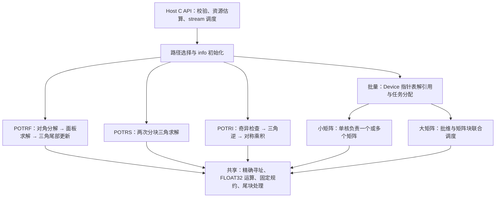

# 单精度实数 Cholesky 分解、求解和批量接口设计文档（Atlas 950）

本文依据《9月社区任务-单精度实数Cholesky分解、求解和批量接口(950)任务书》，
设计 `aclsolverSpotrf`、`aclsolverSpotrs`、`aclsolverSpotri`、
`aclsolverSpotrfBatched`、`aclsolverSpotrsBatched` 五个计算接口，
以及 POTRF、POTRI 配套的两个 workspace 查询接口。
文档按照官方模板组织需求背景、需求分析、详细设计和可维可测分析。

| 项目 | 内容 |
| --- | --- |
| 文档版本 | V1.0 |
| 编写日期 | 2026-09-28 |
| 目标硬件 | Ascend 950PR（Atlas 950） |
| 数据类型 | FLOAT32；维数为 32 位 `int`；info 为 INT32 |
| 工程模式 | ops-solver Host C API + Ascend C/CATLASS kernel 直调 |
| 软件版本 | CANN 9.0.0 及以上，与目标 ops-solver 分支验证版本配套 |
| 交付范围 | 五个计算接口和两个查询接口整体交付，不拆分验收 |

## 1. 需求背景（required）

本任务补齐 ops-solver 的单精度实数稠密 Cholesky 接口族，
支持对称正定矩阵的分解、基于因子的求解和求逆，以及独立矩阵的批量处理。

### 1.1 需求来源

设计以任务书为接口与正式验收依据，以配套包作为测试接入和参考数据来源。

| 材料 | 用途 |
| --- | --- |
| [Atlas 950 Cholesky 任务书](./Atlas950_Spotrf_Spotrs_Spotri_SpotrfBatched_SpotrsBatched_task_doc.md) | 接口、语义、精度、性能、硬件及交付要求 |
| [统一交付说明](./DELIVERY_NOTE.md) | 五包组织、批量抽样映射、info 和确定性说明 |
| [性能采集补充说明](./PERF_COLLECTION_SUPPLEMENT.md) | msprof 采集与包内性能对照格式 |
| [工程快速入门](./QUICKSTART.md) | ops-solver 工程组织与构建方式参考 |
| [现有接口列表](./api_list.md) | 句柄设施和公共接口风格参考 |
| [POTRF 测试包](./spotrf/package/README.md) | 分解测试接入 |
| [POTRS 测试包](./spotrs/package/README.md) | 多右端求解测试接入 |
| [POTRI 测试包](./spotri/package/README.md) | 求逆测试接入 |
| [POTRF Batched 测试包](./spotrfbatched/package/README.md) | 批量分解测试接入 |
| [POTRS Batched 测试包](./spotrsbatched/package/README.md) | 批量单右端求解测试接入 |
| [官方设计文档模板](https://gitcode.com/cann/cann-competitions/blob/master/04_tasks/01_community-task-2026/resources/design_template.md) | 文档结构 |

测试前准备目标 ops-solver 源码、950PR 工具链及完整测试包，
检查底层 API、资源容量、workspace 分区和调度配置的兼容性。

### 1.2 背景与实现重点

Cholesky 分解将对称正定矩阵转化为三角因子，
后续求解通过两次三角求解完成，求逆通过三角逆及其乘积完成。
三者复用面板处理、三角求解和矩阵更新能力，可以统一设计并分别测试。

大矩阵的尾部更新具有较高并行度，适合按输出矩阵块分核；
对角分解和三角求解存在先后依赖，需要明确的阶段同步。
小矩阵批量场景则主要利用矩阵之间的独立性，避免为每个矩阵单独下发接口。
所有路径都必须满足相同输入重复执行逐位一致的要求。

## 2. 需求分析（required）

本节定义公共接口的契约，明确五个接口之间的输入衔接、错误信息和设备内存归属。

### 2.1 功能需求拆解

五个计算接口共用同一套基础数值模块，但输入、输出及 info 语义分别保持独立。

| 编号 | 接口或能力 | 必须实现的行为 |
| --- | --- | --- |
| R01 | `Spotrf` | 对指定三角进行 Cholesky 分解，原地输出因子；报告首个非正定主元 |
| R02 | `Spotrs` | 输入已分解因子，对 `n×nrhs` 右端求解，原地覆盖 B；A 只读 |
| R03 | `Spotri` | 输入已分解因子，输出逆矩阵指定三角；报告奇异因子 |
| R04 | `SpotrfBatched` | Device 指针数组输入，每个矩阵独立分解和写 info |
| R05 | `SpotrsBatched` | Device 指针数组输入，非空问题仅支持 `nrhs=1`，info 为标量 |
| R06 | workspace 查询 | POTRF/POTRI 均提供 `_bufferSize`，Lwork 单位为 FLOAT32 元素 |
| R07 | 数据布局 | 列主序，支持合法 lda/ldb padding，不能只支持紧凑矩阵 |
| R08 | 执行模型 | 复用 handle 和 stream；核心计算在 NPU AI Core；无 CPU fallback |
| R09 | 状态与确定性 | info 真实写入；合法输入重复执行输出与 info 逐位一致 |
| R10 | 泛化与验收 | 覆盖任务规模、零尺寸、负向场景、配套全量用例及补充用例 |

### 2.2 公开接口

公共类型及声明分别放入 `cann_ops_solver_common.h`、`cann_ops_solver.h`。
若目标分支已有等价类型则直接复用，避免重复定义。

```cpp
typedef enum {
    ACLSOLVER_FILL_MODE_LOWER = 0,
    ACLSOLVER_FILL_MODE_UPPER = 1
} aclsolverFillMode_t;

aclsolverStatus_t aclsolverSpotrf_bufferSize(
    aclsolverHandle_t handle, aclsolverFillMode_t uplo,
    int n, float *A, int lda, int *Lwork);

aclsolverStatus_t aclsolverSpotrf(
    aclsolverHandle_t handle, aclsolverFillMode_t uplo,
    int n, float *A, int lda,
    float *Workspace, int Lwork, int *devInfo);

aclsolverStatus_t aclsolverSpotrs(
    aclsolverHandle_t handle, aclsolverFillMode_t uplo,
    int n, int nrhs, const float *A, int lda,
    float *B, int ldb, int *devInfo);

aclsolverStatus_t aclsolverSpotri_bufferSize(
    aclsolverHandle_t handle, aclsolverFillMode_t uplo,
    int n, float *A, int lda, int *Lwork);

aclsolverStatus_t aclsolverSpotri(
    aclsolverHandle_t handle, aclsolverFillMode_t uplo,
    int n, float *A, int lda,
    float *Workspace, int Lwork, int *devInfo);

aclsolverStatus_t aclsolverSpotrfBatched(
    aclsolverHandle_t handle, aclsolverFillMode_t uplo,
    int n, float *Aarray[], int lda,
    int *infoArray, int batchSize);

aclsolverStatus_t aclsolverSpotrsBatched(
    aclsolverHandle_t handle, aclsolverFillMode_t uplo,
    int n, int nrhs, float *Aarray[], int lda,
    float *Barray[], int ldb, int *info, int batchSize);
```

接口参数的名称、顺序和宽度不变，不增加调用方 workspace、stride 或 stream 参数。
`SpotrsBatched` 的原型虽使用 `float *Aarray[]`，其因子数据仍按只读输入处理。

### 2.3 内存、形状和原地语义

以下归属以公开调用时的地址为准，不能照搬快速入门中其他算子的 Host 数据示例。

| 对象 | 内存位置 | 形状或约束 |
| --- | --- | --- |
| handle、uplo、n、nrhs、lda、ldb、batchSize | Host 元数据 | 枚举合法；维数、batchSize 非负 |
| `_bufferSize` 的 `Lwork` 输出指针 | Host | 一个位于 Host 的 `int`，查询直接写入；这是查询接口的标量输出 |
| 计算接口的 `Lwork` | Host 标量 | workspace 中 FLOAT32 元素个数，非字节数 |
| A 或单个 `Aarray[t]` | Device | 列主序 `[lda,n]`；`lda≥max(1,n)` |
| B 或单个 `Barray[t]` | Device | 列主序 `[ldb,nrhs]`；`ldb≥max(1,n)` |
| Workspace | Device | `[Lwork]` FLOAT32；非空计算时容量满足查询值 |
| devInfo、POTRS Batched 的 info | Device | 一个 INT32 |
| POTRF Batched 的 infoArray | Device | `batchSize` 个 INT32 |
| Aarray、Barray 本身 | Device | `batchSize` 个 Device 地址，不是连续三维 tensor |

`A(i,j)` 的 FLOAT32 线性下标为 `int64_t(j)×lda+i`，
`B(i,r)` 为 `int64_t(r)×ldb+i`。字节跨度和地址加法使用受检的 64 位算术。
Host 不解引用 Device 数据或 Device 指针数组。

POTRF/POTRI 原地改写指定三角，另一侧三角允许作为临时空间被破坏，
但不能将其原始值当作有效输入。
POTRS 类只改写 B，保持因子 A，包括未使用三角和 padding，不变。
所有路径均不写入 `i≥n` 的 leading-dimension padding。

A、B、Workspace、info 及指针表应保持有效、互不产生冲突写入，
生命周期覆盖 stream 上的异步操作。批量可写矩阵之间不得重叠。
调用方可在同一分配中放置多个矩阵，但设备地址必须正确，不能假设固定矩阵间距。

### 2.4 规模与泛化

任务书所列规模是验收下限，不是允许拒绝更大配套性能用例的上限。

| 接口 | 必测范围 | 扩展设计 |
| --- | --- | --- |
| POTRF/POTRI | `1≤n≤4096`，LOWER/UPPER，lda padding | 不写死仅支持 2 的幂，使用分块尾部处理 |
| POTRS | `1≤n≤4096`，`1≤nrhs≤128` | 包含 0、1、8、32、128 与非对齐右端数 |
| POTRF Batched | `1≤n≤4096`，`1≤batchSize≤30000` | 同时覆盖配套用例中最大 1,000,000 的 batchSize |
| POTRS Batched | 同上，非空问题 `nrhs=1` | 大 batch 采用网格步进，`nrhs=2` 必须报错 |

形状由本次调用的 Host 参数生成 tiling，不涉及广播或图融合。
大规模限制来自合法地址、可分配存储和底层启动能力，不以测试抽样数代替实际 batch。

### 2.5 参数校验、状态码与 info

`aclsolverStatus_t` 表示 Host 可发现的参数问题、资源问题或下发结果；
Device info 表示数值阶段结果以及可写入的参数错误序号。
数值非正定或奇异不等同于 Host 下发失败。

下表给出参数序号，统一不计 handle；非法参数写入其序号的负值。

| 接口 | 参数序号 |
| --- | --- |
| POTRF/POTRI 查询 | 1:uplo，2:n，3:A，4:lda，5:Lwork 输出指针 |
| POTRF/POTRI 计算 | 1:uplo，2:n，3:A，4:lda，5:Workspace，6:Lwork，7:devInfo |
| POTRS | 1:uplo，2:n，3:nrhs，4:A，5:lda，6:B，7:ldb，8:devInfo |
| POTRF Batched | 1:uplo，2:n，3:Aarray，4:lda，5:infoArray，6:batchSize |
| POTRS Batched | 1:uplo，2:n，3:nrhs，4:Aarray，5:lda，6:Barray，7:ldb，8:info，9:batchSize |

例如，POTRF 的非法 lda 写 `-4`，POTRS 的非法 ldb 写 `-7`，
POTRS Batched 的非空问题 `nrhs=2` 写 `-3`。
Workspace 非空但长度不足时写 `-6`，不能因指针非空就继续运行。

Host 校验流程如下。

1. 检查 handle，取得绑定 stream；空句柄使用仓库公共错误语义，
   不杜撰新的状态码或不计 handle 规则之外的负序号。
2. 检查枚举、非负维数、合法 lda/ldb，以及计算接口 info 指针。
3. 判定是否为空问题；其余按 §2.6 的规则处理。
4. 检查本次计算实际需要的顶层 A/B/指针表/Workspace 非空，
   workspace 容量、地址跨度及已知存储范围冲突。
5. 参数错误返回 `ACLSOLVER_STATUS_INVALID_VALUE`。
   若 handle 有效且 info 可写，在同一 stream 上下发轻量状态写入操作。
   POTRF Batched 的参数错误写 `infoArray[0]=-i`，其余项不作要求。
6. 合法计算先初始化 info 为 0，再下发计算阶段。
   查询接口只写 Host Lwork，没有 Device info，也不读取矩阵值。

info 为空时不能回写错误码；无有效 handle/stream 时不能承诺完成 Device 写入。
调用方同步后读取 info，禁止把栈上临时变量地址用于生命周期不足的异步 H2D 拷贝。
可以将状态值作为 kernel 启动标量传入，避免此类生命周期问题。

Device 指针表中的元素只能在 Device 上检查。
对顶层指针可在 Host 同步返回 INVALID_VALUE；
对内层无效指针若要求同一次 API 同步返回 INVALID_VALUE，则需额外同步，
与异步要求存在冲突。默认合法调用必须提供有效内层地址，
可增加 Device 预检并通过 info 报错；该额外负向行为在评审中固定，
Device 指针有效性须由调用方保证，并由测试侧检查非法访问。
接口也没有 dtype/shape 描述符，不能通过裸指针自动证明实际分配类型和长度。

### 2.6 空问题和边界

空问题不启动数值计算，但可启动轻量 info 写入，保证成功状态真实可读。

| 场景 | 设计行为 |
| --- | --- |
| POTRF/POTRI 的 `n=0` | 合法标量、有效 info 下写 0；不读取 A；查询返回 Lwork=0 |
| POTRS 的 `n=0` 或 `nrhs=0` | 写 info=0，不求解；按任务参数表，`n>0` 时仍检查 A 非空；无有效 RHS 时 B 可空 |
| POTRF Batched 的 `n=0,batchSize>0` | 将全部 infoArray 元素写 0，不读取矩阵内容 |
| `batchSize=0` | 不读取指针表、不写零长度 infoArray；POTRS Batched 的标量 info 仍写 0 |
| 非空 POTRS Batched | 仅接受 `nrhs=1`；`nrhs=0` 也报错 |
| `n=0` 或 `batchSize=0` 的 POTRS Batched | 允许非负 nrhs，不执行数值计算 |
| 空问题同时有非法枚举、负维数或非法 leading dimension | 先报标量错误，不以空问题掩盖非法输入 |

任务书对零长度指针豁免和 `nrhs=0` 的表述不完全一致，
上表是本设计的明确默认行为；验收前按 §4.1 固定例外组合的期望。

## 3. 详细设计（required）

实现以固定顺序的三角运算为基础，以输出块的独立性提供多核并行，
对小矩阵批量和大矩阵分别选用不同粒度。

### 3.1 数学模型

用 `A0` 表示原始对称正定矩阵，用 `F` 表示接口实际接收或输出的三角因子。
这两个对象在求解、求逆和残差计算中不能混用。

| 操作 | LOWER | UPPER |
| --- | --- | --- |
| 分解 | `A0=L Lᵀ` | `A0=Uᵀ U` |
| 求解第一步 | `L Y=B`，前代 | `Uᵀ Y=B`，前代 |
| 求解第二步 | `Lᵀ X=Y`，回代 | `U X=Y`，回代 |
| 三角逆 | `Z=L⁻¹` | `Z=U⁻¹` |
| 对称逆 | `C=Zᵀ Z` | `C=Z Zᵀ` |

POTRS 和 POTRI 不重新分解输入，不接收未分解的 A0 代替 F。
同一物理数组在 POTRF 调用前表示 A0，完成后才表示 F。

LOWER 的逐列 Cholesky 基础公式为：

\[
d_j=A^0_{jj}-\sum_{p=0}^{j-1}L_{jp}^2,\qquad
L_{jj}=\sqrt{d_j},\qquad
L_{ij}=\frac{A^0_{ij}-\sum_{p=0}^{j-1}L_{ip}L_{jp}}{L_{jj}}\quad(i>j).
\]

当首个 `d_j≤0` 时，报告 `info=j+1`。
分块实现使用已更新的 Schur 补，不能再次扣减前面面板已扣除的贡献。
UPPER 采用转置对应公式与地址映射，结果为 U，不把下三角结果直接写入错误位置。

### 3.2 总体架构与模块

五个接口共享逻辑模块，避免各自复制完整的分解、求解和访存代码。



模块职责包括三角访存、对角分解、TRSM、三角逆、SYRK/GEMM、
info 写入和批量索引。不要求为每个逻辑模块单独创建源文件。
先提供严格 FLOAT32 路径；矩阵计算使用经 950PR 验证的 Ascend C/CATLASS 能力。

### 3.3 Host tiling 与 workspace

Host 仅根据 n、nrhs、batchSize、uplo 和平台能力选择固定执行方案。
不读取矩阵数值决定路径，不在运行中基于时间测量选择不同规约顺序。

#### 3.3.1 Tiling 字段与路径

以下内部信息通过仓库已有直调机制传递，字段名为设计名。

| 字段 | 用途 |
| --- | --- |
| `n,nrhs,lda,ldb,batchSize` | 接口元数据；下标运算前扩展为 64 位 |
| `uplo,opKind` | 确定实际访问三角和运算类型 |
| `panelSize` | Cholesky/TRSM 对角面板宽度 |
| `tileM,tileN,tileK` | 尾部更新和对称乘积的矩阵块大小 |
| `rhsTile` | 每个求解任务处理的右端列数 |
| `batchGroup,workerCount` | 单核处理的批量矩阵组与启动规模 |
| `workspaceOffsets` | 调用方 workspace 内各缓冲区偏移 |
| `algorithm` | 小矩阵、一般分块、批量小矩阵、批量分块路径 |

候选面板宽度可从 16、32、64 开始调优，最终按资源报告和性能结果固定。
这些值是候选配置，不构成对 n 或尾块的整除要求。

#### 3.3.2 Workspace 契约与容量

查询和计算复用同一个容量计算函数，保证查询值与实际 kernel 路径一致。
查询不执行分解、不读取 Device A、不修改 A，也不进行 Host/Device 同步。

设 `b` 为面板宽度，`c` 为配置的工作核数，`a` 为对齐所需 FLOAT32 元素数，
`R(x)=ceil(x/a)×a`。每核可选打包空间按以下保守表达式估算：

\[
s=2b_Mb_K+2b_Kb_N+b_Mb_N.
\]

首版建议采用以下可实现的分区；实际路径若无需某项，其容量记 0。

| 接口 | workspace 分区 | FLOAT32 元素数上界 |
| --- | --- | --- |
| POTRF 小矩阵 | 本地缓冲完成，无全局打包 | 0 |
| POTRF 分块 | 面板打包 P、每核独占打包区 | `(a-1)+R(n×b)+c×R(s)` |
| POTRI | 三角逆 Z、每核独占打包区 | `(a-1)+R(n×n)+c×R(s)` |

`a-1` 留作调整实际 Workspace 起始地址的余量，避免假设所有调用方指针
天然满足内部分块对齐。对齐需求、各缓冲实际大小由底层 API 确认。
若计算需要控制信息，其字节空间也必须计入查询值并按正确类型访问。

以 `n=4096` 为例，单个完整 FLOAT32 三角逆缓冲按稠密分配为 64 MiB，
此外还有对齐和打包空间。Lwork 返回元素数，调用方分配字节数为
`sizeof(float)×Lwork`。
容量计算使用受检的 64 位算术，返回前检查可由 32 位 Lwork 表达。

不足的 Lwork 在 Host 拒绝，不能依靠越界写入或静默选择未验证的算法。
所需容量为 0 时允许 Workspace 为空；非零容量要求有效 Device 指针。
调用方在 stream 操作完成前不得释放或并发复用同一 workspace。

POTRS 和两个批量接口没有公开 workspace 参数。
首版使用 B/A 的合法原地更新及片上缓冲完成这些路径，
矩阵块在使用时从 Device 原位置搬入并转换布局，不强制为整批申请全局副本。
不能通过调用带 workspace 的公开 POTRF 函数来假装实现无 workspace 的批量接口。

#### 3.3.3 片上资源与数据搬运

单个小矩阵若完整常驻片上，基础矩阵空间约为 `4n²` 字节；
批量求解另需向量和计算临时区。
例如 `n=128` 的矩阵本体为 65,536 字节，
是否常驻需加上双缓冲、临时结果和底层 API 空间后核验，不能只看矩阵本体。

大矩阵计算按 UB、L1、L0 各自容量分别预算，
不能把 GEMM 的全部 A/B/C tile 都错误计入同一存储层。
Host 查询目标平台能力，编译时查看实际资源占用。
列主序与内部矩阵布局的转换只做局部打包，不要求调用方先转行主序。

尾块按实际行列数搬运、计算和写回；padding 与未使用三角不作为有效数据读取。
不能仅设置计算 mask，却让 GM 搬运跨过分配边界。

### 3.4 POTRF：分块 Cholesky

POTRF 采用右看分块算法，每次完成一个对角块、对应面板和尾部更新。
小矩阵将相同步骤融合到单个 kernel，以减少下发开销。

#### 3.4.1 正常分解路径

以 LOWER 为例，当前已完成的列为 `[0,j)`，当前对角块宽度为
`bcur=min(b,n-j)`。已完成面板的贡献已更新到后续存储三角。

\[
L_{11}=\operatorname{chol}(A_{11}),\qquad
L_{21}=A_{21}L_{11}^{-T},\qquad
A_{22}\leftarrow A_{22}-L_{21}L_{21}^{T}.
\]

```text
初始化 devInfo=0
for j = 0,b,2b,...:
    若前一面板已失败，则本面板全部阶段跳过
    对角阶段：按固定主元顺序分解 A[j:j+bcur,j:j+bcur]
    面板阶段：完成剩余行到当前有效因子列的三角求解
    若本面板完整成功：更新 A22 的指定三角
    在同一 stream 上完成上述阶段，再进入下一面板
```

UPPER 对应为：

\[
U_{11}=\operatorname{chol}_{U}(A_{11}),\qquad
U_{12}=U_{11}^{-T}A_{12},\qquad
A_{22}\leftarrow A_{22}-U_{12}^{T}U_{12}.
\]

对角块由固定规约的 FLOAT32 内核完成。
面板按独立行块或列块分核，尾部更新按输出三角 tile 分核。
每个输出元素只有一个工作核负责，K 方向由该核按固定顺序累加。
不采用多个核浮点 atomicAdd 更新同一结果的方案。

一般路径可将分解后的面板打包到查询提供的 P 缓冲；
批量无 workspace 路径则在计算 tile 时直接加载 A 内已完成的面板。
对角 tile 只写选定三角；非对角 tile 完成所属矩形区域。

#### 3.4.2 首个失败主元与部分结果

对角块内按主元从小到大检查，首个非正定主元的全局位置写入
`devInfo=j+r+1`，其中 r 是本面板已成功的主元数。
后续阶段不覆盖已经写入的失败信息。

需要特别处理“对角块在中间失败”的情况：
如果只停止在对角块，块外前 r 列因子可能尚未算完，
这不满足任务书的已完成前缀要求。
因此本面板的面板求解仍需完成前 r 列对应的块外元素，
只跳过失败列及其后的列，不执行不完整面板的尾部更新。

面板阶段可由 devInfo 推导处理宽度：

| 状态 | 当前面板行为 |
| --- | --- |
| `devInfo=0` | 处理全部 bcur 列 |
| `j<devInfo≤j+bcur` | 处理 `devInfo-j-1` 个成功列 |
| `0<devInfo≤j` | 失败来自更早面板，本面板跳过 |

LOWER 最终保留前 `info-1` 列的完整有效因子；
UPPER 对应前 `info-1` 行，而不是把 LOWER 的列布局直接套用。
失败主元之后的未完成区域不作有效因子承诺。

Host 不为读取 info 逐面板同步。
各阶段在同一 stream 按静态序列下发，Device 根据 info 决定是否跳过。
失败数据只影响数值输出，不阻断其他独立批量矩阵的工作。

### 3.5 POTRS：基于因子的多右端求解

POTRS 使用输入 F 完成两次 TRSM，不显式构造逆矩阵。
按 §3.1 的方向依次得到中间解 Y 和最终解 X，均使用 B 原地存储。

以 LOWER 第一遍前代为例：

\[
L_{jj}Y_j=B_j,\qquad
B_i\leftarrow B_i-L_{ij}Y_j\quad(i>j).
\]

第二遍使用 `Lᵀ`，逆序遍历块行并执行对应更新。
UPPER 则先解 `Uᵀ`，再解 U，所有系数均从 uplo 指定侧读取。

```text
初始化 devInfo=0
第一遍：按前代顺序遍历对角块
    各 rhs tile 完成当前对角块求解
    更新尚未求解的块行
第二遍：按回代顺序遍历对角块
    各 rhs tile 完成当前对角块求解
    更新尚未求解的块行
B 的有效 n×nrhs 区域即为 X
```

不同右端 tile 可并行；同一右端的块行具有依赖。
同阶段输出 tile 独占写回，通过 stream 阶段边界保证后续读到更新值。
`nrhs=1` 优先使用适合向量更新的路径，多右端使用矩阵更新路径。
不为利用矩阵指令而把一个真实右端扩成会改变语义的多个右端。

POTRS 的 info 仅为 0 或参数错误负值。
因子来自成功分解是调用前提，不在该接口重新判定原始矩阵是否正定，
也不把除以零或 NaN 结果臆造为新的正值 info。

### 3.6 POTRI：三角逆与对称乘积

POTRI 使用 workspace 保存三角逆 Z，之后计算对应 Gram 乘积并覆盖 A。
该结构避免写回逆矩阵时破坏仍需使用的输入因子。

#### 3.6.1 奇异检查

求逆前在 Device 检查全部因子对角元素，
取首个精确为零的对角下标 k，写 `devInfo=k+1`。
多个零主元通过固定的整数最小值规约选择最小下标。
info 非零时后续求逆和乘积阶段跳过。

这里检查的是三角因子的奇异性，不是对因子本身执行一次 Cholesky 分解。
非零但很小的对角可能造成病态放大，不能擅自使用经验阈值将其改判为零。

#### 3.6.2 三角逆

LOWER 的 Z 满足 `LZ=I`，只计算下三角。
对第 q 列有：

\[
Z_{qq}=1/L_{qq},\qquad
Z_{iq}=-\frac{\sum_{p=q}^{i-1}L_{ip}Z_{pq}}{L_{ii}},\quad i>q.
\]

UPPER 使用 `UZ=I` 的回代形式，只计算上三角。
实现复用 TRSM 的块内求解和块间更新，仅生成所需单位阵块，
不额外申请完整 I，也不在每一列上调用一次公开 POTRS 接口。
不同逆矩阵列块独立调度；每个元素的求和顺序固定。

Z 的非三角部分在初始化时置零，或者在所有消费者中使用严格三角掩码。
不能让未初始化的 workspace 数据参与后续全矩阵乘法。

#### 3.6.3 对称乘积与原地写回

Z 全部就绪后计算：

\[
C=\begin{cases}
Z^TZ,&\text{LOWER},\\
ZZ^T,&\text{UPPER}.
\end{cases}
\]

按输出三角 tile 分核，各核完整负责自身输出的固定 K 规约。
结果只需写回 A 的 uplo 指定三角，不要求镜像填充另一侧。
这一阶段只依赖 Z，可以安全覆盖输入因子所在 A。

三角逆和三角 Gram 运算都利用结构省去必为零的项，
预期主计算量为 `O(n³)`，不采用通用矩阵求逆或 CPU fallback。
若后续选择更节省 workspace 的原地三角逆算法，
必须重新证明读写依赖、容量查询和逐位确定性，不能仅修改查询返回值。

### 3.7 批量接口

批量接口共享 n、uplo、lda 等标量，
每个矩阵地址从 Device 指针数组中读取，矩阵可以分别分配、乱序排列。

#### 3.7.1 Device 指针数组协议

测试执行器在 Host 准备每个矩阵的 Device 地址列表，
再将地址列表本身上传到 Device，传入 Aarray/Barray。
Kernel 根据 batch 下标读取对应地址后，按列主序访问该矩阵。

仅将一个连续三维数组的首地址强制转换为 `float**` 是错误用法。
指针数组必须按目标平台的指针宽度构造，不能按 FLOAT32 数组存地址。
NPU 实现不得通过 D2H 把整张表搬回 Host 后逐矩阵调用标量接口。

#### 3.7.2 小矩阵批量调度

当矩阵及临时区满足片上资源约束时，一个工作核负责一个或多个完整矩阵。
对很小的 n，多个矩阵打包为一组，按矩阵维度做独立的向量并行，
避免每个矩阵只占少量有效 lane。

物理核采用固定网格步进，例如按 `t=coreId+q×workerCount` 领取批量下标。
每个矩阵的内部计算顺序相同，与所在槽位、指针地址或实际运行先后无关。
尾组中无效矩阵不能产生数据访问或 info 写入。

POTRF Batched 在核内完成因子求解，写 `infoArray[t]`。
同一批中的失败矩阵提前停止，其余矩阵继续；
不能将一个矩阵失败升级为整批数值失败后全部跳过。

POTRS Batched 对每个矩阵执行两次单右端三角求解，只改写 `Barray[t]`。
标量 info 由初始化或参数错误路径写入一次，
不能让每个矩阵并发写一个所谓“自己的 info[t]”。

#### 3.7.3 大矩阵批量调度

矩阵不能整体常驻时，将批量维与矩阵 tile 联合形成逻辑任务网格。
POTRF Batched 仍按“对角分解、面板、尾部更新”分阶段，
每个阶段一次覆盖全部 batch 的相应任务，
以 `infoArray[t]` 独立控制各矩阵是否继续。

某个矩阵在当前对角面板失败时，同样完成其有效前缀面板求解，
随后跳过该矩阵的尾部更新和后续面板。
POTRS Batched 在各自矩阵内维持前代、回代顺序。

每个输出 tile 由唯一工作核处理，不将 batchSize 限制为物理核数，
也不以 30000 为编译期最大批量。
配套小 n 用例可达百万矩阵，采用 64 位任务总数和下标计算，
通过网格步进覆盖超出一次物理 grid 大小的逻辑任务。

正式性能测量维持原始 batchSize 的一次公开 API 调用。
内部采用多阶段 kernel 或网格步进属于实现策略；
不能在测试端拆为较小 API 调用后只上报其中一段耗时。

### 3.8 精度、确定性与流水

确定性是硬要求，不能沿用“不保证浮点计算顺序”的一般 BLAS 策略。

#### 3.8.1 计算精度

输入、输出和主要工作区均使用 FLOAT32。
面板分解、sqrt、除法和规约采用单精度实现，并按 §4.3 检查数值精度。
对于矩阵计算，不将“FLOAT32 输出”误认为乘法输入必然保留完整 FLOAT32 精度。

首版要求明确每个 Ascend C/CATLASS 模式的乘法、累加和舍入语义。
若使用 Cube，需要确认该 950PR 工具链模式是否满足所需 FLOAT32 精度。
TF32/HF32 或 FP16/BF16 转换不能作为未经说明的默认路径；
低精度近似模式只可在明确说明算法并通过正式精度和确定性门槛后评估。
若某种矩阵模式不适用，则以 AI Vector 上的 FLOAT32 路径保证功能覆盖，
并按 §4.8 评估性能；各精度模式均须检查目标硬件与工具链支持。

不在生产接口内部对 A 加正则项、修改对角或改变 B 来改善精度。
病态矩阵可能放大舍入误差，“数学解唯一”不代表任意算法都自动满足误差门槛。

#### 3.8.2 逐位确定性

相同输入、同一 stream 串行重复调用，采用以下措施保持一致。

- 按固定规则选择 tiling；一个输出元素只由一个工作核完成。
- 固定面板遍历、K 分块遍历和块内规约树，不使用浮点原子累加。
- 若必须分段规约，固定分段和合并顺序，不能按核完成顺序合并。
- 初始化所有会被消费的 workspace 区域，不读取 padding 或历史缓冲内容。
- 数值失败下标按首个主元或固定整数最小值选择，不由竞争写入决定。
- 固定编译选项、数学模式及融合运算策略；同内容的批量矩阵使用相同计算路径。

确定性验证前必须恢复原输入。
POTRF/POTRI 及 B 原地覆盖后的再次调用不属于“相同输入”，
不能拿这种运行方式证明或否定确定性。
POTRF/POTRI 对有效输出三角和 info 逐位比较；
若验收要求比较整个分配，测试序列化阶段将未定义三角规范为零，
不把接口未承诺的临时区内容作为数学输出。

#### 3.8.3 同步与数据搬运

Host 将各阶段下发到 handle 绑定的 stream，
使用阶段间顺序保证跨核生产者/消费者依赖，避免无界跨核自旋。
同一 kernel 内遵守各搬运、矩阵、向量和标量流水之间的事件关系。

双缓冲只预取下一块只读输入；缓冲被重用前等待消费完成。
对角分解完成后才能开始面板 TRSM，面板就绪后才能更新尾部，
全部相关尾部更新完成后才分解下一对角块。
TRSM 当前解块写回后，后续块行更新才能读取。
POTRI 的 Z 全部完成后才启动会覆盖 A 的对称乘积。

Host 不在每个面板间读取 info 或同步 Device。
调用方在需要 Host 读结果、释放内存或跨 stream 使用数据时建立同步依赖。

### 3.9 复杂度与调优重点

以下为主项估算，用于选择性能路径，不代替实际 profiling。

| 操作 | 主计算量 | 主要瓶颈与优化点 |
| --- | --- | --- |
| POTRF | 约 `n³/3` 次实数 FLOP | 小 n 下发/面板开销；大 n 三角尾部更新 |
| POTRS | 约 `2n²×nrhs` 次 FLOP | 单 RHS 带宽与依赖；多 RHS 分块复用因子 |
| POTRI | 利用三角结构约 `2n³/3` 次 FLOP | 三角逆依赖、Gram 乘积和 Z 访存 |
| POTRF Batched | 约 `batchSize×n³/3` | 小 n 批间并行与指针访问；大 n tile 调度 |
| POTRS Batched | 约 `2×batchSize×n²` | 指针数组、因子读取、两次单 RHS 求解 |

性能调优优先完成固定正确路径、阶段耗时归因、矩阵大小分界和面板配置，
再优化局部打包、矩阵块复用和小矩阵融合。
更换数学模式或规约顺序后，重做精度和确定性验证。
不以去掉 info 写入、数据依赖或合法布局支持来换取性能。

### 3.10 工程组织与支持范围

建议目录遵循本任务书的 ops-solver 组织方式，
不套用前一份 BLAS 任务的 `blas/.../arch22` 路径。

```text
ops-solver/
├── include/
│   ├── cann_ops_solver.h
│   └── cann_ops_solver_common.h
├── src/
│   ├── spotrf/
│   ├── spotrs/
│   ├── spotri/
│   ├── spotrf_batched/
│   └── spotrs_batched/
├── test/
│   ├── spotrf/
│   ├── spotrs/
│   ├── spotri/
│   ├── spotrf_batched/
│   └── spotrs_batched/
└── docs/
    ├── api_list.md
    └── zh/<五个接口的说明文档>
```

必要的共享函数按仓库现有公共层组织，避免重复实现或建立无用的新框架。
同步更新公共声明、符号导出、构建入口、README 和接口列表。
若仓库原型仍返回 `aclError`，仅在内部适配处转换，
最终公开接口以 `aclsolverStatus_t` 为准并说明对应关系。

| 硬件 | 设计支持 | 验证要求 |
| --- | --- | --- |
| Ascend 950PR（Atlas 950） | 是 | 五个接口的功能、精度、确定性和性能全部在此平台验证 |
| A2/A3 及其他型号 | 不属于本设计支持范围 | 功能、精度、确定性和性能均以 950PR 为测试平台 |

## 4. 可维可测分析

验证分为接口契约、数值精度、确定性和性能四部分。
数值、状态码和 950PR 性能将分别测试，并按各自标准判定。

### 4.1 材料差异与统一口径

下表规定任务书与配套脚本存在不同口径时的测试处理方式。
测试前应固定所采用的判定版本及差异处理依据。

| 项目 | 材料口径 | 设计与测试处理 |
| --- | --- | --- |
| 混合容差 | 任务书为 `rtol=2^-10,atol=2^-16`；包内 `verify_accuracy.py` 为二者均 `2^-13` | 正式报告按任务书出结果，保留包内参考结果；不能混为同一门槛，两者不存在简单的整体更严格关系 |
| 最大绝对误差 | 任务书写 `1e-2 or 32×ULP`；脚本取误差最大点的 `max(1e-2,32×ULP)` | 默认正式检查先用 `1e-2`；使用 ULP 分支前明确取点、舍入和最大值规则 |
| 残差 ε | 任务书明确为 `2^-23`；脚本使用 `2^-24` | 正式残差、CPU 对照及均值均使用同一套 ε；不得只替换 NPU 的分母 |
| UPPER 分解残差 | 任务书统一写 `F Fᵀ` | UPPER 必须计算 `Uᵀ U`，LOWER 必须计算 `L Lᵀ`，分别核对比较器公式 |
| POTRI 残差中的 A | 任务书公式为 `I-A C`，说明却将 A 称为输入因子 | 公式中的 A 必须是原始 SPD 矩阵或由因子重建的 SPD 矩阵，不能直接以三角因子乘 C；包内脚本使用原始 A32 |
| 性能统计量 | 任务书要求平均耗时；补充说明采 30 次报中位数并填入 avg_ms | 采集 30 个有效样本，同时报告平均值和中位数；正式门槛使用平均值，字段含义不能偷换 |
| 批量规模 | 泛化表列 30000，典型 case 超过该值，实际包最大 1,000,000 | 按完整用例泛化，不能以 30000 上限拒绝已发布 case |
| 输入内存 | 任务书建议验证输入在 4G 内，批量规格可能超出该容量 | 测试前逐 case 估算完整内存并确认设备资源；超预算 case 先明确测试安排，不以缩小 batch 替代原规格性能测试 |
| 空问题 | 一般说明将 nrhs=0 视为空；批量求解又要求非空矩阵仅 nrhs=1 | 按 §2.6 区分普通求解与批量求解，固定零长度指针豁免规则 |
| POTRI 正值 info | 概述混称为“不正定”；精度节说明因子奇异 | 检查第一个零对角，报告 1 起始下标，不重新检查 SPD |
| 残差均值 | 任务书要求按完整集合计算；包内逐项 ratio 现场计算，mean 读取冻结索引 | 包内参考报告保持其版本；正式报告在一致环境、输入、ε 下计算同源 ratio 和 mean |
| 另一侧三角 | 通用注意事项允许另一半被破坏，但 POTRS 因子为只读输入 | 仅 POTRF/POTRI 类可写 A；POTRS 两接口不改写因子 |

CPU 同精度残差均值必须关联完整 case 集，不只选取逐元素失败的 case。
这会影响阈值，不能把运行中的部分结果均值当作最终均值。

### 4.2 Golden 与执行器输入衔接

正式高精度参考使用 NumPy/SciPy 的 FLOAT64 或等价 LAPACK
`dpotrf/dpotrs/dpotri`。同精度残差对照使用对应 `s` 前缀链路。

| 测试接口 | NPU 实际输入准备 | 参考与比较对象 |
| --- | --- | --- |
| POTRF | 上传 A32 的指定三角 | FLOAT64 Cholesky 因子的同侧三角 |
| POTRS | 先得到成功的 FLOAT32 因子 F32，再上传原始 B32 | FLOAT64 链路求解结果；另做使用同一个 F32 的独立接口测试 |
| POTRI | 输入已成功分解的 F32 | FLOAT64 链路逆矩阵的同侧三角；另做同因子求逆测试 |
| POTRF Batched | 每槽独立 Device 矩阵及 Device 地址表 | 逐矩阵比较因子与 infoArray |
| POTRS Batched | 每槽成功因子、单列 B、两张 Device 地址表 | 逐矩阵解、全局标量 info |

配套普通精度用例中的 `A32` 通常仍是原始 SPD 矩阵，
不能因为文件键名为 A32 就直接传给 POTRS/POTRI。
执行器必须先分解，并在报告中注明因子来自 NPU 还是 CPU 单精度链路。
POTRI 的 `singular_factor` 契约用例是例外：文件中 A32 已是对角置零的因子，
不得再次分解后再调用 POTRI。

负向用例分别保存原始 API 返回码和 Device info。
归档中的 `status=ok` 表示执行器完成了预期试验，不等于 API 必须返回 SUCCESS；
预期 INVALID_VALUE 且 info 正确的调用不能被执行器误记为基础执行失败。
反之，也不能只满足 info 就忽略错误的 API 返回码。

将 NumPy 数组打包为实际列主序并处理 lda/ldb padding，
不能把默认 C-order 的 `tobytes()` 当作 column-major 布局。
输出回传后按逻辑形状解析；POTRF/POTRI 的非输出三角可在测试文件中置零，
这是结果规范化，不是要求计算接口额外清零。

参考矩阵来源分别记录 A64、A32、实际因子 F32 和 B32，避免概念混淆。
包内参考链路通常由构造侧 A64/B64 生成 golden，按其脚本保持一致；
正式残差使用约定的实际输入来源并升到 FLOAT64 计算。
单接口同因子测试与 POTRF→POTRS/POTRI 的全链路测试都需覆盖，
前者定位求解或求逆错误，后者验证接口衔接。

### 4.3 精度判定

先检查执行状态、输出形状和 info，再进行逐元素比较。
info 契约用例独立判定，不参与正定数值用例的残差均值。

#### 4.3.1 逐元素混合容差

正式默认门槛按任务书设置如下。

| 指标 | 值 |
| --- | --- |
| rtol | `2^-10 = 0.0009765625` |
| atol | `2^-16 = 0.0000152587890625` |
| required_matched_ratio | `0.99` |
| max_abs_error_limit | 默认 `1e-2`；ULP 替代口径按 §4.1 固定 |

有限元素的通过条件为：

\[
|x-\hat{x}|\le \mathrm{atol}+\mathrm{rtol}|\hat{x}|.
\]

匹配率与最大绝对误差两项同时通过，才能判定逐元素通过。
POTRF/POTRI 只统计指定三角的 `n(n+1)/2` 个元素，
POTRS 统计 `n×nrhs` 个元素，不能把 padding 或另一侧补零纳入分母来稀释错误。
批量按矩阵分别判定，不能以整批平均掩盖个别矩阵失败。

NaN/Inf 用例独立记录分类、符号及 info 行为，不直接套用有限误差公式。
任务参数表以有限数为主，同时要求特殊值覆盖，因此需固定特殊值参考行为。
不得将包含非有限值的残差计算失败自动记为通过，
也不得将非有限数据扫描搬到 Host 造成隐式同步。

#### 4.3.2 LAPACK 残差复核

逐元素未通过时，按任务书给出的残差规则复核。
以下范数均为 1-范数，计算使用 FLOAT64 算术；
ε 按正式默认口径取 `2^-23`，不将术语“单位舍入”造成的二倍差异隐去。

分解残差为：

\[
\rho_{\mathrm{potrf}}=
\frac{\|\mathcal{R}(F)-A_0\|_1}{n\|A_0\|_1\epsilon},\qquad
\mathcal{R}(F)=
\begin{cases}LL^T,&\text{LOWER},\\U^TU,&\text{UPPER}.\end{cases}
\]

求解残差为：

\[
\rho_{\mathrm{potrs}}=
\max_{1\le q\le nrhs}
\frac{\|B_q-A_0X_q\|_1}{\|A_0\|_1\|X_q\|_1\epsilon}.
\]

求逆残差为：

\[
\rho_{\mathrm{potri}}=
\frac{\|I-A_0C\|_1}
{n\|A_0\|_1\|C\|_1\epsilon}.
\]

其中 C 由输出三角镜像补全，A0 使用原始 SPD 矩阵。
若独立接口测试只有输入因子，先从该因子重建 A0，
并在报告中注明此残差对应同因子问题，不能混入原始问题的参考均值。
POTRS 必须保存被覆盖前的 B32；不能对输出 B 当作原始右端计算残差。

| 接口 | 通过阈值 | CPU 均值范围 |
| --- | --- | --- |
| POTRF/POTRS | `ρ≤max(5ρ_cpu,3ρ_cpu_mean)` | 本接口完整正定数值 case 集的同精度参考均值 |
| POTRF/POTRS Batched | 每个矩阵满足同式 | 当前 case 的全部槽位均值，不跨 case |
| POTRI | `ρ≤max(5ρ_cpu,0.1)` | 不使用均值分支 |

对于批量代表内容映射，均值为
`Σ(内容出现次数×该内容ρ_cpu)/batchSize`，
不是最多五个代表内容的简单平均，除非它们出现次数恰好相同。
不得用 NPU 自身残差构造 CPU 基线或调整阈值。

分母为零、参考链路失败、均值缺失等情况需要专门判定。
例如零右端和零解不直接做 `0/0`；逐元素已通过时不必启动残差复核。
若必须复核，则记录零残差情形或证据不足，不能自动放宽阈值。

### 4.4 配套用例与测试范围

测试将按五套包的 JSON 清单覆盖下列用例，普通包包含两个标准分布用例，
批量精度按去重后的 canonical 清单执行，性能保留原始规格条目。

| 接口 | 计划性能用例 | canonical 精度用例 | 需关联基线的 canonical 用例 | info 契约用例 |
| --- | ---: | ---: | ---: | ---: |
| POTRF | 143 | 145 | 143 | 3 |
| POTRS | 174 | 176 | 174 | 3 |
| POTRI | 143 | 145 | 143 | 3 |
| POTRF Batched | 154 | 151 | 151 | 1 |
| POTRS Batched | 154 | 151 | 151 | 1 |
| 合计 | 768 | 768 | 762 | 11 |

计划覆盖 canonical 精度与派生 info 共 779 项，并增加 §4.5 的边界用例。
批量重复规格仍须逐条执行性能测试，按 `bench_key` 和原始序号关联基线。
无 GPU 基线的标准分布用例用于精度检查，不判定性能达标。

配套范围包括 n=2～4096、`lda=n`，普通 POTRS 的 nrhs=1、8、16、32、64。
补充测试将覆盖 n=0/1、非紧凑 leading dimension、nrhs=128，
并独立构造均匀/正态各半的随机 SPD 数据，覆盖对角占优构造之外的场景。

### 4.5 必补测试矩阵

保留全部配套 case，在此基础上增加下列针对契约与实现风险的测试。

| 主题 | 必补场景 | 检查重点 |
| --- | --- | --- |
| 基础退化 | n=1；n=0；普通 nrhs=0；batchSize=0/1 | 成功状态、info 真正写入、数据不被访问 |
| 尺寸与尾块 | 2 的幂±1、质数、panelSize±1、tile 边界 | 不要求整除，无尾块遗漏 |
| leading dimension | lda/ldb=n、n+8、n+32，部分自然对齐偏移 | 列主序寻址、padding 哨兵保持 |
| 多右端 | nrhs=1、8、32、128、非对齐值 | 两次 TRSM、右端分块和全覆盖 |
| 非正定 | 失败位于 1、中间、n，以及跨面板边界 | 最小 info 下标；LOWER 已完成列、UPPER 已完成行正确 |
| 奇异因子 | 对角第 k 项精确置零，多处为零 | POTRI 选择最小零对角；不重新分解因子 |
| 参数负向 | 非法 uplo、负 n/nrhs/batch、非法 lda/ldb、空顶层指针 | `aclsolverStatus_t` 与 `info=-i` 分别正确 |
| workspace | 查询返回值、少一元素、空指针、反复复用、尾部保护 | 容量一致、元素与字节单位正确 |
| 批量求解约束 | n>0 且 batch>0 时 nrhs=0/2 | INVALID_VALUE，标量 info=-3 |
| 批量地址 | 独立分配、乱序 Device 地址表、不同矩阵间距 | 不假设连续三维存储，不串写矩阵 |
| 混合批量失败 | 指定几个真实槽位失败、不同失败主元 | infoArray 逐槽正确，其余槽正常；补充 A0 代表内容模式之外的用例 |
| A/B 原地契约 | 保存 A、B、padding 前后快照 | POTRS 因子只读，输出只覆盖允许区域 |
| 未引用三角 | 另一侧填 NaN/Inf 或哨兵 | 输入不引用另一侧，输出仅比较定义区域 |
| 随机分布 | `RᵀR+nI`，R 均匀/正态各半；B 同样各半 | 记录分布与种子，另加非正定 info 用例 |
| 病态与特殊值 | 明确非奇异病态、极值、NaN/Inf | 分开记录有限误差、特殊值分类与参考失败 |
| 确定性 | 恢复相同输入后重复至少 10 次 | 有效输出与 info 逐位相同 |
| stream | 非默认 stream、独立 stream 并发、下游消费 | 无隐式 Host 同步，workspace 不跨调用竞争 |

“另用 10% 非正定”作为额外 info 测试集合统计，
不破坏正常随机精度数据均匀/正态各 50% 的比例。
不将奇异、非法参数或尚无参考数据的 case 混入残差均值。

### 4.6 批量 A0 测试接入

配套 A0 机制每个 case 构造 `min(5,batchSize)` 种代表内容，
通过 sample_map 展开到全部槽位。该机制只减少数据生成和高精度参考的成本，
不授权计算接口只运行五个矩阵。

1. 按同一 seed 生成代表内容和槽位映射，展开每个真实 Device 矩阵。
2. 每个可写槽位提供独立存储，不能把同内容的多个 Aarray 项指向同一个可写矩阵。
3. 按原始 batchSize 调用 NPU，回收所有槽位的输出与对应 info。
4. 先核对同内容槽位的定义输出逐位一致，再对代表内容执行完整精度判定。
5. POTRF Batched 的 infoArray 按槽位逐项比较；
   POTRS Batched 保持标量 info，不能扩展为一批正定性结果。

包内输出归档为批维堆叠的 NumPy 数组，这是测试文件格式，
不改变生产接口使用 Device 指针数组的契约。
同内容一致性检查不能替代所有独立随机矩阵的覆盖，因此还需 §4.5 的补充批量用例。

### 4.7 测试前置条件与接入检查

执行前将检查文件完整性、数据选择范围、资源容量和执行器类型。

- 检查批量包 `cases/index.json.gz` 是否为真实压缩文件；
  若为 Git LFS 指针，先取得实体文件并核验摘要，再解压使用。
- 核对 README、manifest、生成器、比较器、canonical 和基线的版本及摘要；
  若不一致，先确定匹配版本，不直接改写摘要掩盖差异。
- 使用 `gen_data.py --select all` 生成正式全量输入，并核对 canonical 清单。
- 按原始 batchSize 估算全部矩阵、Device 地址表、info、workspace、
  输入恢复副本和参考数据的容量；不能只按代表内容数估算整批占用。
- CPU 模拟器可用于检查文件接入，设备精度、确定性及性能必须使用 NPU 执行器测试。
- 性能按 §4.8 的 0.35 门槛逐项比较；无基线、待定或缺少结果时不得判为达标。

### 4.8 性能目标与采集

正式性能按任务书在 950PR 上测量，
要求每个 case 的 NPU 平均单次 kernel 耗时满足：

\[
T_{\mathrm{NPU,avg}}\le T_{\mathrm{GPU,avg}}/0.35.
\]

GPU 参考来源为各接口配套的 `bench_result.json`，测试前按参数和原始序号关联。
下表列出典型测试规格及按公式换算的 NPU 耗时上限；
上限单位为 μs，小数显示不改变精确判定公式。

| 编号 | 接口 | n | nrhs / batchSize | uplo | NPU 上限约（μs） |
| --- | --- | ---: | --- | --- | ---: |
| P-01 | POTRF | 1024 | — | LOWER | 1122.000 |
| P-02 | POTRF | 4096 | — | UPPER | 12383.143 |
| P-03 | POTRF | 2048 | — | LOWER | 2256.857 |
| P-04 | POTRS | 1024 | nrhs=1 | UPPER | 378.286 |
| P-05 | POTRS | 4096 | nrhs=32 | LOWER | 8602.571 |
| P-06 | POTRS | 2048 | nrhs=8 | LOWER | 3381.714 |
| P-07 | POTRI | 1024 | — | LOWER | 2997.143 |
| P-08 | POTRI | 4096 | — | UPPER | 35372.000 |
| P-09 | POTRF Batched | 32 | batch=102774 | LOWER | 6063.143 |
| P-10 | POTRF Batched | 128 | batch=46256 | LOWER | 30346.286 |
| P-11 | POTRS Batched | 32 | nrhs=1，batch=99659 | LOWER | 4235.143 |
| P-12 | POTRS Batched | 128 | nrhs=1，batch=45897 | LOWER | 13645.429 |

典型 case 的 leading dimension 为紧凑值；完整性能验证还需关联所有配套记录。

采样与统计采用以下规则。

1. 固定代码 commit、硬件、CANN、编译选项和数值模式，
   明确配置 warmup，建议不少于 5 次，并记录实际工具行为。
2. 获取 30 次有效调用的 kernel 记录，统计平均值、中位数、最小值和最大值。
   正式 avg_ms 字段存平均值；若按补充工具用中位数对照，另存文件并标注。
3. 查询 workspace、申请内存、生成数据、H2D/D2H 均在计时外，
   Workspace 和 Device 指针表复用。
4. 每次测量恢复同一份原始输入：POTRF 恢复 A0，POTRI 恢复因子 F，
   POTRS 恢复 B；批量逐槽恢复。恢复操作不计入目标数值接口耗时。
5. POTRS/POTRI/POTRS Batched 的准备分解不计入被测接口耗时。
   POTRF/POTRI 的 bufferSize 调用单独记录，不算 kernel 时间。
6. 一次接口若启动多个阶段，按调用序号汇总该接口全部必要 kernel，
   包括状态初始化、打包、对角分解、TRSM、矩阵更新等。
   不能只选择最耗算力的 GEMM kernel 代表完整接口。
7. 原始 profiler 明细按 case_id、参数和调用序号关联；
   ms 与 μs 正确转换，重复规格记录保留对应关系。

小矩阵融合与大矩阵多阶段都遵循同一计时边界。
同时记录设备侧完整调用区间有助于分析阶段间空隙，
但不能用包含 CPU golden 的测试程序墙钟替代 kernel 平均耗时。

### 4.9 自验证流程

执行前准备实际 950PR 设备、匹配的 CANN 和 ops-solver 源码。
下列命令说明构建、数据生成、比较和采集的方法。

```bash
# 在 ops-solver 仓中逐接口构建，实际入口以目标分支 build.sh 为准。
bash build.sh --pkg --soc=ascend950 --ops=spotrf

# 在某个完整任务包的 package 目录中生成全量数据。
python3 gen_data.py --canonical canonical_cases.json --out data --select all

# 使用真正的 NPU 执行器生成 dut_out 后运行包内参考检查。
python3 verify_accuracy.py --package . --dut-out dut_out --report self_report.json
python3 verify_perf.py --package . --dut-perf my_perf.json --report perf_report.json

# 在 ops-solver 仓执行 profiling；测试程序需支持指定单 case 和采样次数。
msprof op --application="./build/test/spotrf/spotrf_test" --output=./prof_spotrf
```

其余四个接口分别使用对应构建目标和测试包。
批量包应先核验 LFS 实体完整性，再按代表内容映射和整批调用流程接入。
msprof 命令须检查引号闭合，并将 application 和 output 分别传入。
具体筛选与 warmup 参数以现场 `msprof op --help` 和测试程序支持项为准。

测试报告须同时记录计划、执行、通过、失败、缺失、跳过和证据不足数量。
比较器退出码 2 可能不生成报告，外层流程不能读入旧报告冒充本次结果。
验证包内参考口径后，还需输出任务书门槛对应的正式统计，
并记录 §4.1 的差异处理结果。

### 4.10 内存与访问正确性

内存测试将检查容量、workspace 契约与访问范围；任务书不设独立内存性能门槛。
对矩阵分别估算 Device 数据量：

\[
M_A=4\,lda\,n,\qquad M_B=4\,ldb\,nrhs.
\]

批量数据量为各矩阵之和，另加地址表、info 和实现实际需要的空间。
若设备地址宽度为 8 字节，一张 batch 指针表为 `8×batchSize` 字节；
POTRF Batched 的 infoArray 为 `4×batchSize` 字节。
此处指针宽度在目标环境核实，不能按 FLOAT32 大小计算。

记录查询 workspace 与实际使用量、UB/L1/L0 资源、运行时分配增量及峰值。
输入数据、恢复副本、CPU golden 和输出归档空间分开统计。
使用 padding 哨兵、workspace 前后保护区、A 只读快照和可用内存检查工具，
验证无越界、无未初始化读取、无批量矩阵串写。

### 4.11 兼容性和风险闭环

接口只提供本任务的 FLOAT32 Cholesky 能力，复用现有 handle 与 stream 管理。
不新增图模式两段式 API，不依赖 CUDA 完成 NPU 计算。

| 风险 | 控制措施 | 验证方法与判定标准 |
| --- | --- | --- |
| 三角方向或列主序错误 | 统一地址函数，LOWER/UPPER 对照与 padding 毒化 | 全模式输出须满足 §4.3，只读因子和 padding 保持不变 |
| 失败主元前缀不完整 | 当前失败面板仍完成成功列的块外求解 | 构造跨面板失败，info 须指向首个失败主元，成功前缀须与参考一致到精度标准 |
| workspace 查询与使用不符 | 共用容量函数、受检算术、边界用例 | 查询容量须覆盖执行需求，保护区不得被改写 |
| 批量指针误当连续 tensor | Device 解引用，独立分配和乱序地址测试 | 非连续批量和大 batch 须逐槽正确，无矩阵串写 |
| 多核规约不确定 | 输出独占、固定 K 次序、禁止浮点竞争累加 | 恢复原输入后重复至少 10 次，有效输出与 info 须逐位一致 |
| 低精度矩阵模式误差 | 明确乘法与累加模式，保留严格 FLOAT32 路径 | 各数学模式均按 §4.3 判定精度与残差 |
| 包内口径与正式口径混淆 | 固定比较器版本并区分判定规则 | 阈值、ε、mean 来源和统计量须符合 §4.1 与 §4.3 |
| 大 batch 内存与性能不达标 | 逐 case 容量估算、完整调用计时 | 原规格测试须满足 §4.8 耗时上限及 §4.10 内存访问要求 |

### 4.12 小规模算法对照测试

将使用固定随机种子测试数学公式、三角方向和失败前缀策略。
n 取 1、2、3、5、9、17，面板宽度取 1、2、4、8，
覆盖 LOWER/UPPER、均匀/正态构造、只初始化指定三角及 padding 毒化。
各项测试的方法与判定标准如下。

| 测试项目 | 方法 | 判定标准 |
| --- | --- | --- |
| 分块 Cholesky | 指定三角因子与 FLOAT64 参考分解比较 | 按 §4.3 判定输出精度与分解残差 |
| 两次三角求解 | nrhs=1/3/8，与 FLOAT64 参考解比较 | 按 §4.3 判定解的精度与方程残差 |
| 三角逆及对称乘积 | 同侧逆矩阵与 FLOAT64 参考比较 | 按 §4.3 判定精度及逆矩阵残差 |
| 非正定 info 与成功前缀 | 构造不同位置失败，与逐列参考计算比较 | info 须等于首个失败主元的 1 起始下标，成功前缀须满足精度标准 |
| 多个零对角 | 在输入因子多个位置置零 | POTRI 的 info 须等于最小零对角的 1 起始下标 |
| 存储保护 | 指定三角之外和 padding 毒化，检查只读因子 | 无效输入不影响定义输出，POTRS 因子及 padding 保持不变 |

CPU 对照用于定位算法问题；NPU 指令、Device 指针表、跨核同步、
设备内存、确定性和性能分别按 §4.5～§4.11 测试。

## 5. 测试判定汇总

测试将覆盖五个计算接口及两个 workspace 查询接口，各项标准独立判定。

| 测试项目 | 方法 | 判定标准 |
| --- | --- | --- |
| 接口与异常 | 覆盖空问题、非法参数、非正定及奇异因子 | 返回码、info 和成功前缀符合 §2 与 §3 |
| 数值精度 | 配套及补充用例对照高精度 golden，按规则复核残差 | 输出满足 §4.3，特殊值按分类规则判定 |
| 批量与泛化 | 独立 Device 地址、乱序槽位、padding、多右端和大 batch | 每槽按原规格执行，无串写和用例遗漏 |
| 确定性 | 恢复相同输入后重复至少 10 次 | 有效输出与 info 逐位一致 |
| 内存与 workspace | 查询/执行容量对照、保护区和只读快照检查 | 查询契约一致，无越界与未初始化读取 |
| 性能 | 在 950PR 按 §4.8 采集全部必要 kernel | 每个 case 的平均耗时满足 GPU 参考平均耗时除以 0.35 的上限 |
| 流程完整性 | 核对计划用例、执行数量、返回码及基线关联 | 缺少结果、异常退出或缺少所需基线时不得判为通过 |

## 6. 参考资料

本地任务书和测试包链接见 §1.1；实现与验收还参考以下公开资料。

1. [NVIDIA cuSolver 文档](https://docs.nvidia.com/cuda/cusolver/index.html)。
2. [ops-solver 仓库](https://gitcode.com/cann/ops-solver)。
3. [生态算子精度标准](https://gitcode.com/cann/opbase/blob/master/docs/zh/ops_precision_standard/experimental_standard.md)。
4. [Ascend C 开发文档入口](https://www.hiascend.com/document)。
5. [CATLASS 仓库](https://gitcode.com/cann/catlass)。
6. [AscendOpTest](https://gitcode.com/HIT1920/AscendOpTest)。
7. [社区任务设计模板](https://gitcode.com/cann/cann-competitions/blob/master/04_tasks/01_community-task-2026/resources/design_template.md)。
