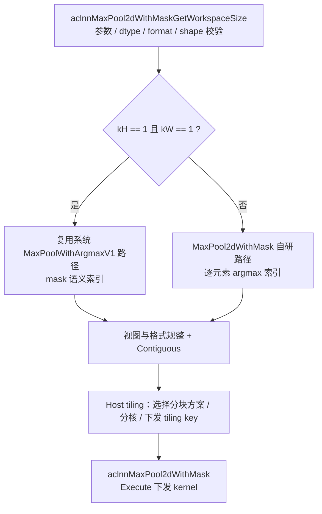
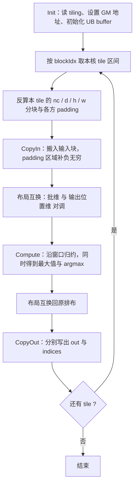

# 需求背景（required）

## 需求来源

CANN 社区任务 2026 算子开发任务：MaxPool2dWithMask。要求参考 `aclnnMaxPool2dWithMask` 接口说明，在昇腾 NPU 上使用 Ascend C 编程语言实现功能一致的算子，完成后提交至昇腾算子开源仓 `ops-nn`。

## 背景介绍

### 原实现现状分析

MaxPool2dWithMask 为带索引输出的二维最大池化算子，在 PyTorch 侧对应 `torch.nn.functional.max_pool2d(..., return_indices=True)` 的底层实现，常用于分割类网络的反池化（unpool）与梯度回传。系统侧该类能力由已有池化算子承载，本次任务以 Ascend C 重新实现，并保持对外接口与语义一致。

参考实现与资料：

- 系统侧接口说明：`aclnnMaxPool2dWithMask`
- 开源仓已有 Ascend C 池化类实现：`https://gitcode.com/cann/ops-nn/tree/master/experimental/pooling`

原实现支持能力如下：

| 参数 | 参数含义 | 输入/输出 | 数据类型 | 形状 | 非连续 Tensor |
| --- | --- | --- | --- | --- | --- |
| self | 输入 tensor | 输入 | BFLOAT16、FLOAT16、FLOAT | (N, C, H, W) | √ |
| kernelSize | 池化窗口大小（长度 1 或 2，元素 > 0） | 输入 | INT64 | -- | -- |
| stride | 窗口移动步长（长度为 0 时取 kernelSize） | 输入 | INT64 | -- | -- |
| padding | 各边补充层数，补负无穷 | 输入 | INT64 | -- | -- |
| dilation | 窗口内元素步幅，仅支持 1 | 输入 | INT64 | -- | -- |
| ceilMode | 输出形状取整方式 | 输入 | BOOL | -- | -- |
| out | 池化结果 | 输出 | BFLOAT16、FLOAT16、FLOAT | (N, C, H_out, W_out) | √ |
| indices | 最大值索引组成的 tensor | 输出 | INT8 | mask 公式 shape | -- |

### 算子功能分析

算子在每个通道的二维平面上做滑窗取最大值，并把窗口内最大值所在位置以索引形式输出，供反向/反池化使用：

- 输出 `out` 为每个窗口的最大值，shape 由池化几何公式推导；
- 输出 `indices` 为索引信息，容器 dtype 为 INT8，其 shape 由 mask 公式给出，用于兼容上层框架的既有内存布局；
- 索引按通道独立编号，窗口内出现多个相同最大值时取首个（最小）命中位置；
- 支持 `ceilMode` 向上/向下取整两种输出形状推导方式，并需处理最后一个窗口滑出边界的情形。

# 需求分析（required）

## 需求描述

使用 Ascend C 编程语言实现 MaxPool2dWithMask 算子，覆盖 FLOAT16、FLOAT、BFLOAT16 三种数据类型，支持 NCHW/ND 数据格式与任意合法的 kernelSize / stride / padding 组合（泛化），输出池化结果与索引 tensor，并保证精度与性能达标。

## 需求拆解

1. 支持 FLOAT16、FLOAT、BFLOAT16 输入与输出（BFLOAT16 仅 Atlas 800T A2）；
2. 支持 NCHW / ND 格式、4 维输入，支持非连续输入 tensor；
3. 支持任意合法 kernelSize / stride / padding 组合与 ceilMode 两种取整方式，满足泛化验收；
4. 输出索引 tensor，语义与上层框架使用方式一致；
5. 性能：Atlas 800T A2 上不劣于原 TBE 实现（不低于 95%）；
6. 精度：满足生态算子开源精度标准；
7. 适配 Atlas 300V Pro，完成功能与精度验收。

# 详细设计（required）

## 算子分析

### 数学公式

输出 tensor 每个元素：

$$out(N, C, h, w) = \max_{\substack{m \in [0, k_H-1] \\ n \in [0, k_W-1]}} input(N, C, stride[0] \times h + m, stride[1] \times w + n)$$

输出 shape（`ceilMode=False`）：

$$[N, C, H_{out}, W_{out}] = \left[N, C, \left\lfloor\frac{H_{in} + 2 \times padding[0] - dilation[0] \times (k_H - 1) - 1}{stride[0]}\right\rfloor + 1, \left\lfloor\frac{W_{in} + 2 \times padding[1] - dilation[1] \times (k_W - 1) - 1}{stride[1]}\right\rfloor + 1\right]$$

`ceilMode=True` 时改为向上取整，并额外判断最后一个窗口是否整体落在 padding 区域，若是则输出尺寸减一。

indices tensor 的 shape：

$$[N, C, H_{indices}, W_{indices}] = \left[N, C, k_H \times k_W, \left(\left\lceil\frac{H_{out} \times W_{out}}{16}\right\rceil + 1\right) \times 2 \times 16\right]$$

### 支持数据类型

| 输入/输出 | 数据类型 |
| --- | --- |
| self（x） | FLOAT16、FLOAT、BFLOAT16 |
| out（y） | FLOAT16、FLOAT、BFLOAT16 |
| indices | INT8（容器） |

### 支持形状

- self：4 维，NCHW / ND，形状 `[N, C, H_in, W_in]`；
- out：4 维，与上述公式推导一致；
- indices：4 维，与上述 mask 公式推导一致。

## 算子实现

### 整体方案

算子采用「aclnn 接口层 + Host tiling 层 + Ascend C kernel 层」三段式结构：接口层负责参数校验、形状推导与执行路径选择；tiling 层按输入几何与 UB 资源选择分块方案；kernel 层按分块完成搬入、归约、写出。

考虑到窗口大小为 1×1 时索引容器的容量不足以承载逐元素索引，接口层按窗口尺寸做路径分流：

### Host 侧设计

**1. 接口层（aclnn）**

- 两段式接口：`GetWorkspaceSize` 阶段完成入参非空校验、dtype 与 format 校验、shape 与容器 shape 校验，并计算所需 workspace；`Execute` 阶段下发执行；
- 参数校验覆盖：kernelSize / stride / padding / dilation 数组长度（1 或 2，stride 为 0 时退化为 kernelSize）、`0 <= padding <= kernelSize / 2`、dilation 必须为 1、indices 容器 shape 必须与 mask 公式一致；
- 输入非连续时先做连续化处理；索引输出要求连续，非连续场景直接拦截；
- 索引 tensor 的 storage 直接复用调用方传入的 INT8 容器，不额外分配与拷贝，避免一次冗余搬运；
- workspace 仅在部分 kernel 分支需要，其余分支为 0。

**2. Tiling 层**

tiling 采用注册式多模板：每个模板以 `IsCapable()` 声明自己能覆盖的场景，框架按优先级依次尝试，第一个通过者胜出并确定 tiling key。这样可以把「数据能否一次装入 UB」「需要按哪个维度切分」等问题解耦成互相独立、可回退的若干方案。

分块思路：

- 将 `N`、`C` 合并为批维，输出按 `(D, H, W)` 三方向分块（2D 场景下 D 维恒为 1，保留该维以便复用通用池化分块框架）；
- 以二分搜索在 UB 预算内求最大的输出分块 `(partD, partH, partW)`：每块所需 UB 由输入块、输出块、索引块及若干临时 buffer 组成，搜索目标是让总量尽量贴近但不超过可用 UB（可用量 = 平台 UB 大小 - 预留）；
- 分核：所有分块 tile 拉平为一维索引，按核数均分，余数分给前若干个核；核数不足以铺满时按 tile 粒度再细分，保证负载均衡。

tiling key 按场景分档：

| 适用场景 | kernel 分支 | 说明 |
| --- | --- | --- |
| 通用主路径（无 padding / 有 padding） | 主路径 kernel | 覆盖绝大多数常规 shape，按输出方向分块 |
| 窗口极大、单点归约更划算 | BigKernel | 每个输出点独立归约，适合大 kernel 且数据复用低的场景 |
| padding 后整块输入 + 全部输出可一次装入 UB | NoSplit | 无切分，一次搬入一次算出 |
| 需沿 D / H / W 维切分才可装入 UB | SplitD / SplitH / SplitW | 按维度递进切分，切分点由二分搜索给出 |
| 窗口本身超过 UB 容量 | HugeKernel | 切分 kernel 而非切分输入，分片结果经 workspace 归约合并（唯一需要 workspace 的分支） |

主路径下发的关键 tiling 字段（节选）：

| 字段 | 含义 |
| --- | --- |
| nc / dx / hx / wx | 输入批维与输入 D/H/W 尺寸 |
| kd / kh / kw、sd / sh / sw | 窗口与步长 |
| pf / pb / pt / pd / pl / pr | 六个方向的 padding 量（含 ceilMode 修正） |
| dy / hy / wy | 输出 D/H/W 尺寸 |
| ncFactor / dyFactor / hyFactor / wyFactor | 各维分块大小，及对应的 tail 与 outer 份数 |
| blockFactor / blockTail / coreNums | 分核参数 |

**3. 精度与 dtype 处理**

- BFLOAT16 输入在计算前提升到 FLOAT 进行归约，写出前再转回 BFLOAT16，避免低精度累加误差；
- FLOAT16 与 FLOAT 按原类型计算；
- padding 区域以负无穷填充，保证窗口内 padding 位置不参与取最大值。

### Kernel 侧设计

主路径 kernel 采用「Init + Process」结构，`Process` 内为标准的 CopyIn / Compute / CopyOut 三段流水：

- 关键设计点是**在 UB 内做一次布局互换**：搬入后把「批维」与「输出位置维」互换，使向量归约沿连续方向进行，从而用少量向量指令完成整批窗口的取最大值与取索引；归约完成后再互换回原布局写出。

各阶段要点：

1. **CopyIn**：按当前 tile 的输入范围从 GM 搬入，边界越界部分与 padding 一起填负无穷；块内按需做对齐处理，保证后续搬运与向量访问的地址对齐；
2. **Compute**：在互换后的布局上按窗口元素逐个累积比较，同步维护「当前最大值」与「当前最大值的索引」两份中间结果，索引在整个批维上并行推进；
3. **CopyOut**：最大值与索引分别经过反向布局互换后写回 GM，索引按通道内展平下标写出；
4. **其余分支**：NoSplit 不做任何切分；SplitD / SplitH / SplitW 在外层增加对应维度的循环并对每片重新计算 padding；HugeKernel 改为按窗口分片累积、结果经 workspace 合并；BigKernel 退化为逐输出点归约。

## 支持硬件

| 支持的芯片版本 | 涉及勾选 | 说明 |
| --- | --- | --- |
| Atlas 800T A2 | √ | 本文展开其设计与实现方案 |
| Atlas 300V Pro | √ | 功能与精度适配中，其实现细节不在本文档展开 |

## 算子约束限制

- 暂不支持 `dilation != 1`；
- 暂不支持 regbase 架构（该平台请使用 `aclnnMaxPool2dWithIndices`）；
- 输入数据不支持 NaN、-Inf；
- BFLOAT16 数据类型仅 Atlas 800T A2 支持；
- `ceilMode=True` 时，若步长过大导致最后一个窗口整体落在 padding 区域，输出尺寸按减一处理；
- indices 输出不支持非连续 tensor；
- 索引 tensor 容器的尾部字节不保证被清零，调用方只应读取有效前缀部分。

# 可维可测分析

## 精度标准/性能标准

| 验收标准 | 描述 | 标准来源 |
| --- | --- | --- |
| 精度标准 | 满足生态算子开源精度标准（AscendOpTest 默认阈值） | 任务书 |
| 性能标准（Atlas 800T A2） | 整体性能不低于原 TBE 实现的 95% | 任务书 |
| 性能标准（小 shape） | 100us 以下场景若超出 TBE 耗时 30% 以上，需提供性能仿真图与分析结论 | 任务书 |
| 性能标准（Atlas 300V Pro） | 耗时基准参考 Atlas 800T A2 的 5 倍，超出 30% 需提供性能仿真图 | 任务书 |

精度与性能的自测用例、实测数据及对比结果见配套自测报告。

## 兼容性分析

本算子为新增 Ascend C 实现，对外接口与 `aclnnMaxPool2dWithMask` 保持一致：

- 接口层保持原有参数列表、dtype 与 shape 语义，上层框架无需改动；
- 索引 tensor 沿用原有 mask 公式 shape 与 INT8 容器类型，与既有反向/反池化算子的数据约定兼容；
- 底层算子独立命名，不覆盖系统已有算子，卸载自研包后即回退到系统实现。
