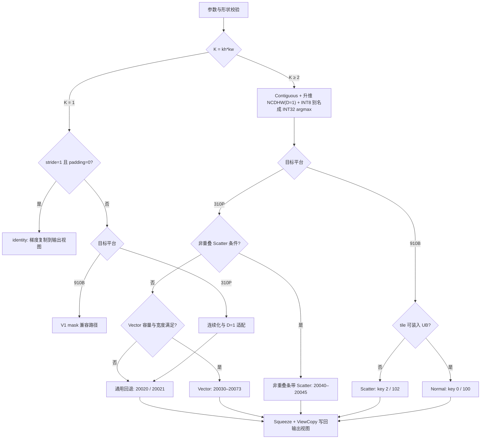

# 需求背景（required）

## 需求来源

Atlas 800T A2（910B）+ Atlas 300V Pro（310P）MaxPool2dWithMaskBackward 算子开发社区任务：参考 [aclnnMaxPool2dWithMaskBackward 接口说明](https://www.hiascend.com/document/detail/zh/CANNCommunityEdition/latest/API/aolapi/context/ops-nn/aclnnMaxPool2dWithMaskBackward.md)，在昇腾 NPU 上使用 Ascend C 实现正向 MaxPool2dWithMask 的反向算子。

## 背景介绍

### MaxPool2dWithMaskBackward 算子分析

正向 MaxPool2dWithMask 为每个池化窗口选出最大值并记录其在输入平面内的位置。反向算子接收上游梯度 `gradOutput`，依据正向保存的 `indices`（mask）将梯度回填并累加到 `gradInput`：未被选中的输入位置输出 0，多个窗口选中同一输入位置时累加全部贡献。

| 参数 | 参数含义 | 数据类型 | 支持数据类型 | 约束 | 形状 |
| --- | --- | --- | --- | --- | --- |
| gradOutput | 输入，上一步的梯度 | tensor | FLOAT32、FLOAT16、BFLOAT16 | 与正向输出一致 | `[N,C,Ho,Wo]` |
| self | 输入，正向输入 | tensor | 与 gradOutput 相同 | 提供输出形状与校验依据 | `[N,C,H,W]` |
| indices | 输入，最大值索引（mask） | tensor | INT8 | 承载 INT32 argmax，见[字节契约](#indices-字节契约) | `[N,C,kh*kw,M]` |
| kernelSize | 属性，窗口大小 | attr | INT64 list | 长度 1 或 2，取值为正 | — |
| stride | 属性，窗口步长 | attr | INT64 list | 长度 0/1/2；长度为 0 时取 kernelSize | — |
| padding | 属性，填充量 | attr | INT64 list | 长度 1 或 2，非负 | — |
| dilation | 属性，窗口元素步幅 | attr | INT64 list | 长度 1 或 2，值仅支持 1 | — |
| ceilMode | 属性，输出尺寸取整方式 | attr | BOOL | 默认 false | — |
| gradInput | 输出，回填后的梯度 | tensor | 与 gradOutput 相同 | 与 self 同 shape、同 dtype | `[N,C,H,W]` |

### 计算特征

算子属于按索引回填并归约的操作，主要开销为梯度与索引搬运、输出清零、索引匹配、重叠累加、布局转换及输出搬运。小 shape 受调用与指令组织开销限制，大 shape 受多核并行、UB 容量与重复读取的共同约束，故按平台分别设计。

# 需求分析（required）

## 需求描述

使用 Ascend C 实现 NCHW 语义的 MaxPool2dWithMaskBackward，支持合法的 kernelSize、stride、padding、ceilMode、重叠窗口与非连续 Tensor；910B 支持 FP32/FP16/BF16，310P 支持 FP32/FP16；对所有未命中优化条件的合法场景保留通用实现。

## 需求拆解

1. 消费匹配正向的 INT32 argmax mask，正确清零、回填并累加重叠窗口的贡献。
2. 支持 FP32/FP16/BF16（BF16 仅 Atlas 800T A2）与 310P 的 FP32/FP16。
3. 支持 kernelSize/stride/padding/dilation 长度 1、2 展开及 stride 长度 0（dilation 仅 1），按正向规则推导输出形状并处理 ceilMode 末窗口修正。
4. 支持非连续 Tensor（含 storage offset）；默认非确定性实现，支持通过 `aclrtCtxSetSysParamOpt` 开启确定性计算。
5. 实现算子泛化，覆盖各类合法 shape 与尾块。
6. 精度满足[生态算子开源精度标准](https://gitcode.com/cann/opbase/blob/master/docs/zh/ops_precision_standard/experimental_standard.md)；性能 A2 不低于 TBE 的 95%，310P 参考 A2 自研的 5 倍、超出 30% 须提供仿真图与分析。
7. 在 yolov11 + DOTAv1 上完成模型验证，与 A2 对比 mAP50 误差不超过 0.01。

# 详细设计（required）

## 算子分析

### 数学公式

计算公式：设 `q = oh*Wo + ow`，第 `(n,c)` 通道的 argmax 为 `a[n,c,q]`，则

$$
\mathrm{gradInput}[n,c,u] = \sum_{q=0}^{H_o W_o-1} \mathbf{1}\{a[n,c,q]=u\}\,\mathrm{gradOutput}[n,c,q],\quad 0 \le u < HW .
$$

反向不重新比较 self 的数值，也不对并列最大值再作选择，而是沿用正向结果（行优先扫描、严格大于才更新，即首个最大值）。argmax `a[n,c,q]` 为**通道内**线性索引 `ih*W+iw`（不含 N/C 偏移），合法值满足 `0 ≤ a < HW` 且解码后的 `(a//W, a%W)` 落在对应池化窗口与有效输入区域内。

### 支持数据类型

K≥2 自研计算路径采用 FP32 累加：910B 覆盖 FP32、FP16、BF16，310P 覆盖 FP32、FP16，低精度输出在全部贡献累加完成后转换为目标 dtype。K=1 的 identity 路径直接复制梯度，其余兼容路径单独处理。310P 的 OpDef、dtype 检查与 Tiling 均排除 BF16。

### 支持形状

dilation=1，对 H/W 轴分别计算：

$$
H_o^{\text{floor}} = \left\lfloor \frac{H+2p_h-k_h}{s_h} \right\rfloor + 1,\qquad
H_o^{\text{ceil}} = \left\lfloor \frac{H+2p_h-k_h+s_h-1}{s_h} \right\rfloor + 1 .
$$

ceilMode=true 时，若 `(Ho-1)*sh ≥ H+ph` 则 `Ho--`，W 轴同理，保证窗口起点不落入纯 padding 区。要求推导出的 `Ho`、`Wo` 为正，gradOutput 的 N/C 与 self 一致，gradInput 与 self 同 shape。输出形状由 self 与属性推导并校验输入，不以用户传入的 shape 替代合法性推导；乘积与字节数按 64 位整数计算。

### indices 字节契约

设 `Q = Ho*Wo`，`M = (ceil(Q/16)+1)*32`。公开 INT8 容器 shape 为 `[N,C,kh*kw,M]`；当 `K = kh*kw ≥ 2` 时：

1. 容器按逻辑连续顺序展平，其前 `4*N*C*Q` 字节为 little-endian INT32 的连续 argmax 前缀；
2. 第 `(n*C+c)*Q+q` 个 INT32 是当前通道内的 argmax，值为 `ih*W+iw`；
3. 该前缀是**全容器连续字节流**，不能按 `[kh*kw, M]` 的通道跨度寻址；
4. 剩余空间不参与反向计算，Golden 置零。

L2 先使 indices 连续，再建立 INT32、`[N,C,1,Ho,Wo]` 的描述符并引用原存储地址——这是元数据别名，不是数值 Cast，也不需要把 argmax 展开成 bitmap。`K=1` 使用单独契约，不沿用上述容量假设。

## 算子实现

两平台共用外部 ACLNN 签名与 mask 契约，由 Host 平台路由与 Kernel 架构宏隔离：910B 保留 Normal / Scatter 及仓内池化公共模板，310P 增加独立的输出分块、向量化与非重叠 Scatter 实现。

### Host 侧设计

**Tiling 路由流程图：**

**校验与适配：** 校验空指针、dtype、维度、属性长度、步长、dilation、padding 与各 Tensor 形状。K≥2 路径对 self、gradOutput、indices 做 `Contiguous`，经 `UnsqueezeNd/ReFormat` 表示成 NCDHW（`D=1`；kernel、stride 首维补 1，padding 首维补 0，dilation 为 `[1,1,1]`），结果 Squeeze 后由 ViewCopy 写回用户视图，Kernel 只处理连续内部布局。310P 上不足 32 字节的私有中间 Tensor 至少占一个完整搬运块，短输出用精确字节复制而非整块 DMA 覆盖。平台信息经 PlatformAscendC 获取（310P 取 AI Core 数、910B 取 Vector Core 数），Kernel 以 `__DAV_M200__ / __DAV_M200_VEC__ / __NPU_ARCH__==2002` 隔离 310P。

**分核策略：**

| 路径 | 任务划分 | 进入条件 |
| --- | --- | --- |
| 910B Normal | NC 优先，不足时增加空间轴切分 | tile 可装入 UB |
| 910B Scatter | 按通道 / 轮次组织，复用 `pool_3d_common` | Normal 容量不足 |
| 310P 非重叠 Scatter | 通道完整宽度条带，高取 `sh` 整数倍；任务量 `NC*ceil(H/stripeH)` | `kh≤sh && kw≤sw`、padding=0、`K≥2` 且条带可装入 UB |
| 310P Vector | 一个 NC 块 × 一个输出矩形，每输出元素单写者 | 容量与宽度满足 |
| 310P 通用回退 | 4096 个线性输出元素 / 块，尾块吸收余数（最长 8191） | 其余场景，含 K=1 与窄宽度 |

910B Normal 需区分池化窗口重叠与核间输出重叠；确定性模式经 `context_->GetDeterministic()` 约束会产生核间重叠的空间切分，具体累加方式见 Kernel 侧设计。

310P Vector 的通道块 `C_b` 在 `NC>4 && H*W<16384` 时取 16，否则取 8；任务量 `T = ceil(NC/C_b)·ceil(H/T_h)·C_w`，`usedCoreNum = min(coreNum, T)`，核号 b 处理 `b, b+usedCoreNum, ...`，宽度尾块吸收余数且 Host 按最大实际宽度校验容量。Workspace 由用户计算 workspace 加平台 `GetLibApiWorkSpaceSize()` 构成，执行器还可能为 Contiguous、Pad、ViewCopy 分配中间 Tensor；310P 主路径无需跨核 FP32 GM 归约，910B 低精度跨核重叠 Normal 需要全输出 FP32 暂存。

**切块容量：** 输出矩形 `Th×Tw` 的候选输入行列上界为 `C_in ≤ ceil((Tw+kw-1)/sw)`、`R_in ≤ ceil((Th+kh-1)/sh)`；取 `Pout = AlignUp(Tw,16)`，FP32 与 `C_b=8` 按 8 元素对齐、其余按 16 元素对齐得 `Pin`，需同时满足 `C_b·R_in·P_in ≤ I` 与 `C_b·T_h·P_out ≤ O`，Host 从输出容量给出的候选高度向下搜索。默认 tileW 取 64 / 96 / 128 / 256，`K7×3/S4×2` 在整行输入 pitch ≤ 264 时用整宽；方案仅按参数结构与容量选择，不读取用例编号。

**代表性 TilingKey（区间为分类简写，不表示其中每个编号都有效）：**

| 平台 | key | 路径 |
| --- | --- | --- |
| 910B | 0 / 100；2 / 102 | Normal（无 / 有核间重叠）；Scatter（无 / 有重叠，Normal 的兜底） |
| 910B | 1、21…71 及 +100 | 保留 CutK 模板，当前 2D 任务不满足历史入口条件，不生效 |
| 310P | 20020 / 20021；20030–20039 | 通用回退；C16/C8 与密集 / 稀疏 Vector 布局 |
| 310P | 20040–20045；20047–20062 | 非重叠条带 Scatter；容量与缓存变体 |
| 310P | 20063、20068、20069、20071、20073 | 共享 buffer 专用布局：K3×3/S2×2、FP16 K4×4/S3×3、K7×3/S4×2、K5×3/S4×2 |

### Kernel 侧设计

K≥2 自研路径主要按 Init → 逐 tile { CopyIn grad 与 INT32 argmax → Compute → 必要时一次 Cast → CopyOut } 组织。K=1 identity 不进入该累加流程；310P 其他 K=1 场景由通用回退根据输出位置和步长推导目标位置，不读取 INT32 argmax 前缀。

**310P Vector 计算流程：**

从输出矩形反推有贡献的 grad 行列范围，仅搬入覆盖该矩形的候选区域；预生成空间 ramp 构造各窗口起点的输入平面偏移，从绝对 argmax 减去基址得到相对值，对每个 kernel 位置 `(a,b)` 比较相对索引与 `a*W+b`，Select 保留匹配梯度后 Add 进 FP32 accumulator。K 循环按 kh/kw 递减遍历，使同一输出像素的贡献按 grad 行列递增顺序进入同一 accumulator，避免原子竞争与低精度中间累加；Host 限制 `kh*W+kw < 2^24`，保证相对索引在 FP32 中精确表达。

**UB 规划：** 记 I、O 为含所有 `C_b` 通道的元素容量，R 为 ramp 元素数，两个 Copy32 对象共 192 字节。

| 缓冲 | 大小 | 用途与复用 |
| --- | --- | --- |
| shared | `max(16I, 4O)` | 存放 grad/argmax 的 planar 与转置数据，输入消费完后作为 planar 输出 |
| ot / accumulator | `4O` | FP32 交错布局累加；转置完成后 FP16 复用为 Cast 目标，FP32 复用为尾块暂存 |
| mask | `I/8` | Compare/Select 掩码，搬出前复用为尾块选择 pattern |
| ramp | `4R` | 每行索引基址，tile 计算期间保持有效 |
| Copy32 scratch | 192 | 搬运尾部与 pattern，两个类型独立使用 |

共享布局 `B_UB = max(16I,4O) + 4O + I/8 + 4R + 192`；非共享布局为 `GP_BYTES + 12I + 8O + I/8 + 4R + 192`（FP32 取 `4I`，FP16 取 `max(4I, 2O)`）。各主要布局均以 245760 字节为预算选择参数，并由模板 `static_assert` 校验实际分配。容量不足、参数超出向量表达范围或输入过窄时回退通用路径；复用 shared 或 accumulator 前须经 `WaitOut()` 等待上次 MTE3 结束。

**非对齐与安全尾块：** 主体搬运采用 32 字节整数块；对逻辑尾部，从有效分配内读最后一个完整块并在 UB 选择有效片段，搬出时允许同一输出所有者用最后一个块覆盖自己已写的部分（需 MTE3 顺序屏障），但不可用于原子 Add 模式或跨越其他核的输出区间。Vector 输出按行准备尾块（FP32 每块 8 元素、FP16 每块 16 元素），通道尾只写有效通道。为减少宽度尾段造成的额外向量调用，K5 可将列数补齐到 8，条件是补齐后的额外列不得落到有效输出范围内、最大目标仍在当前行 opitch 内、源访问不超暂存容量。

**310P 非重叠 Scatter 与通用回退：** Scatter 先清零条带，批量搬入梯度（必要时转 FP32）后按 argmax 定位唯一输出；无重叠且无 padding 保证不同窗口不会累加到同一位置。默认取 16384 输出元素、2048 输入元素，FP32 流水变体用两个 25600 元素 accumulator，由 MTE3_V 事件管理槽复用。通用回退每块拥有完整线性输出区间，grad 每次最多搬入 1024 元素，只累加目标落在本块内的贡献；相邻块可能重复读取 grad，但不会共同写同一输出元素。

**910B：** Normal 搬入梯度与 INT32 索引并转置到便于向量比较的布局，以相对索引、CompareScalar、Select 与 Add 累加到输出块，低精度输入先在 FP32 中累加；无核间重叠普通写回，有核间重叠使用 FP32 原子累加与初始化 / 同步，FP16/BF16 通过 FP32 workspace 完成累加后再转换。Scatter 复用公共模板，重叠实现按通道 / 轮次规则处理 GM 暂存。搬入、标量 / 向量访问与写回分别遵守对应队列与事件依赖。

## 支持硬件

| 支持的芯片版本 | 涉及勾选 | 支持 dtype |
| --- | --- | --- |
| Atlas 800T A2（910B3） | √ | FP32、FP16、BF16 |
| Atlas 300V Pro（310P3） | √ | FP32、FP16 |

## 算子约束限制

1. 按四维 NCHW 语义实现，不支持广播；输出与 self 同 shape、同 dtype。
2. dilation 仅支持 1，kernel 与 stride 合法展开后为正；不支持 NaN / -Inf 输入，非法索引不作为正常计算输入。
3. padding 取 `0 ≤ padding ≤ floor(kernelSize/2)`；任务书的 `padding ≤ kernelSize` 更宽上界尚待与前向契约、空窗口处理及泛化测试对齐。
4. 310P 不支持 BF16。K≥2 只接受匹配正向生成的 INT32 argmax-prefix，不能混入历史 bitmap；K=1 走独立兼容路由，不沿用 K≥2 的容量假设。
5. 310P Vector / Scatter 的容量、相对索引（`kh*W+kw < 2^24`）与宽度限制是分支限制，不满足时进入通用回退，并非对合法 shape 的整体拒绝；任意大 shape 仍受设备内存、INT32 argmax 表示范围与框架 Tensor 约束。
6. 内部 OpDef 为 `x,grad,argmax`、五维 NCDHW、INT32 argmax，由 ACLNN 层适配公开原型，直接按其调用的验收方式需另行对齐。

# 可维可测分析

## 精度标准/性能标准

| 验收标准 | 描述 | 标准来源 |
| --- | --- | --- |
| 精度标准 | 满足生态算子开源精度标准：`abs(actual-golden) ≤ atol + rtol*abs(golden)`，且匹配率 ≥ 0.99、最大绝对误差不超上限 | 任务书 |
| A2 性能标准 | 不低于 TBE 的 95%，即 `Tcustom/Ttbe ≤ 1/0.95 ≈ 1.05263` | 任务书 |
| A2 小 shape | 100us 以下场景若超过 TBE 30%，须提供性能仿真图与分析结论 | 任务书 |
| 310P 性能标准 | 参考 `5*T910B_custom`；超出 30%（比例 > 6.5）须提供仿真图，分母须为 910B 自研 | 任务书 |

正式性能验收统计一次 ACLNN 调用内全部设备任务耗时，包括实际启动的 Cast、TransData、Contiguous 等辅助任务；主 kernel 耗时仅作优化诊断，不能替代完整调用耗时。跨卡比较的分母使用 910B 自研实现，不使用 910B 系统/TBE。重复采样报告中位数、范围和分轮差异，不选最快一次。

逐元素容差：

| dtype | rtol | atol | 最大绝对误差限 |
| --- | --- | ---: | --- |
| FP16 | 2^-9 | 2^-9 | 1e-1 或 32×ULP |
| BF16 | 2^-6 | 2^-6 | 1e0 或 32×ULP |
| FP32 | 2^-10 | 2^-16 | 1e-2 或 32×ULP |

## 测试覆盖与当前状态

社区提供140例：FP32 59例、FP16 44例、BF16 37例。其中103个FP32/FP16用例的参数与已有310P验证集合对应，但编号不同、重新生成的数据也可能不同，正式测试按参数映射关联证据。

测试覆盖固定用例，并补充非连续Tensor及storage offset、确定性开关、通道和空间尾块、ceil末窗口、属性长度展开、K=1兼容路径及非法参数。运行后复查输出、guard和输入不变；非连续与确定性的完整交叉组合尚需专项验证。

| 项目 | 已有证据 | 范围说明 |
| --- | --- | --- |
| 双平台编译 | 提交 `9f0baf19d` 在CANN 9.1.0上通过310P、910B编译 | 不代表CANN 9.0.0已验证 |
| 310P精度 | 原103例及179个边界检查通过 | 对应已记录输入；不替代社区重新生成数据后的测试 |
| 310P性能 | 103例自研主kernel跨卡比例按合并中位数均≤6.5 | 不是完整调用验收；历史036（社区026）中位6.4941，样本存在超过6.5的波动 |
| 910B功能 | 真实前向→反向4/4 PASS | 当前提交4个FP32示例；社区140例及完整调用性能报告待补齐 |

## 兼容性分析

公开ACLNN两段式签名及NCHW输入输出语义保持一致，内部D=1视图和INT32索引适配不改变用户接口。310P与910B通过Host平台判断和Kernel架构宏隔离；BF16仅在910B启用。K≥2必须使用匹配前向生成的argmax-prefix，不能与历史bitmap互换；K=1保留独立兼容路由。直接按社区prototype调用内部OpDef的方式仍需对齐，见算子约束限制。

## 模型验证

- 验证模型：yolov11
- 验证数据集：DOTAv1
- 精度标准：与 Atlas 800T A2 对比，mAP50 误差不超过 0.01

当前模型验证尚未完成。后续需固定模型版本、权重、数据划分及评估配置，并确认流程实际执行本反向算子；仅运行推理不能证明反向算子接入有效。
