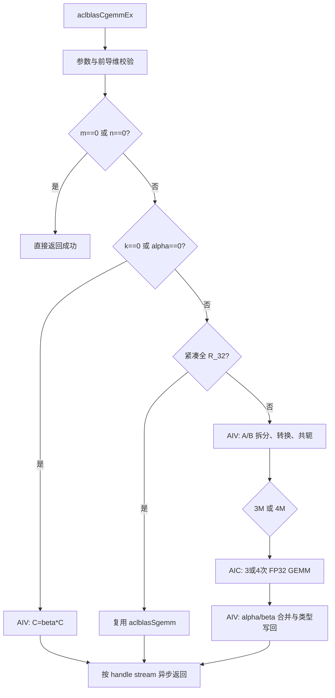

# 需求背景（required）

## 需求来源

2026 昇腾算子社区任务“算子实操工坊-上海站-aclblasCgemmEx 算子开发（950）”。
目标是在 [ops-blas](https://gitcode.com/cann/ops-blas) 仓库中新增
`aclblasCgemmEx`，使用 Ascend C kernel 直调方式适配 Ascend 950PR / CANN
9.1.0，完成设计、开发、功能精度自验和性能验收。

设计与验收依据：

- 社区任务书：`aclblasCgemmEx 950 算子开发任务书`；
- 接口标杆：[cuBLAS cublasCgemmEx](https://docs.nvidia.com/cuda/cublas/index.html#cublas-c-gemmex)；
- 单批复数 GEMM 语义：[Netlib CGEMM](https://www.netlib.org/blas/cgemm.f)；
- 精度标准：[生态算子开源精度标准](https://gitcode.com/cann/opbase/blob/master/docs/zh/ops_precision_standard/experimental_standard.md)；
- 设计结构：[社区任务设计文档模板](https://gitcode.com/cann/cann-ops-competitions/blob/master/04_tasks/01_community-task-2026/resources/design_template.md)。

本任务的标杆是 cuBLAS Legacy API，而不是原有 TBE 算子；对外接口是 ops-blas
句柄式 BLAS API，不经过 ACLNN，因此“TBE 原型对齐”和“复用已有 ACLNN 源码”
不适用。实现必须与任务书给出的 `cublasCgemmEx` 参数顺序和列主序语义对齐，
且禁止定义 Ascend 950PR 私有平行接口。

## 背景介绍

### aclblasCgemmEx 算子功能

算子执行：

```text
C = alpha * op(A) * op(B) + beta * C
```

其中 `alpha`、`beta` 是 Host 侧单精度复数标量；`A`、`B`、`C` 是 Device
侧列主序矩阵。`op(X)` 支持原矩阵、转置和共轭转置。与普通
`aclblasCgemm` 相比，扩展接口允许 A/B/C 分别使用 FP32/FP16 的实数或交错复数
存储，内部统一使用 FP32 累加。

### 标杆接口与调用流程

cuBLAS 的内部 GPU kernel 为闭源实现，本文只对齐其公开接口、参数和输出语义，
不推断其内部复数 GEMM 算法。


Ascend 侧保持相同调用序列：创建 handle、绑定 stream、准备 Device 矩阵、调用
`aclblasCgemmEx`，读取结果前由调用者同步 stream。

### ops-blas 现状分析

`blas/gemm/arch35` 已有 FP32 Cube GEMM、alpha/beta 后处理、handle/stream 和
workspace 管理机制，也已有 `aclblasSgemm` 与 `aclblasCgemm`。缺失能力是：

1. `aclblasCgemmEx` 对外接口和四类矩阵存储枚举；
2. FP16/FP32、实数/交错复数的统一 Device 侧拆分与写回；
3. N/T/C 下复数共轭处理；
4. 面向扩展类型的精度、异常和性能测试。

若在 Host 侧拆分 Device 复数矩阵，会引入 D2H/H2D 往返、破坏异步执行并形成
性能瓶颈。本设计复用现有 FP32 Cube GEMM，在 AIV 上完成类型转换、复数拆分与
结果合并，整个计算链路不离开 Device。

### 参数能力

| 参数 | 参数含义 | 数据类型/位置 | 支持范围 | 约束或形状 |
| --- | --- | --- | --- | --- |
| handle | ops-blas 上下文与 stream | Host handle | 有效句柄 | 不可为空 |
| transa/transb | A/B 操作 | Host attr | N、T、C | 复数 C 表示共轭转置 |
| m/n/k | 逻辑维度 | Host int | 非负 | 运行时传入 |
| alpha/beta | 复数缩放系数 | Host COMPLEX64 | FP32 实部/虚部 | 指针不可为空 |
| A/B | 输入矩阵 | Device tensor | R_32、C_32、H_R_32、H_C_32 | 列主序，受 lda/ldb 约束 |
| C | 输入输出矩阵 | Device tensor | R_32、C_32、H_R_32、H_C_32 | 列主序，原地覆写 |
| lda/ldb/ldc | 前导维度 | Host int | BLAS 合法范围 | 支持列间 padding |

# 需求分析（required）

## 需求描述

在 Ascend 950PR 上实现公开接口 `aclblasCgemmEx`，保持现有 handle/stream
调用方式，覆盖 N/T/C、四种矩阵存储类型及其组合、非对齐前导维度、quick
return、异常参数，并满足任务书给出的 COMPLEX64/FP32/FP16 精度标准和四个
性能门槛。

## 需求拆解

1. 在公共头文件中增加四种矩阵类型枚举和接口声明，不引入 arch35 私有接口。
2. 对 handle、操作枚举、维度、前导维度、标量指针、类型枚举和矩阵指针分层校验。
3. 在 AIV 上将四类存储统一拆成 FP32 实部/虚部/和矩阵，`OP_C` 同时完成虚部取反。
4. 复用 arch35 FP32 Cube GEMM；性能主路径使用 3M，对特定大尺寸转置复数场景
   使用 4M 精度路径。
5. 在 AIV 上执行复数 alpha/beta 合并，并按 typeC 写回 FP32/FP16、实数/复数格式。
6. 复用 handle workspace，支持默认 workspace 按需增长，不执行 Host 数据往返。
7. 提供 CSV 驱动的精度、异常和性能测试，CBLAS 生成单一 Golden。
8. 在提交验收前完成最终源码重编译、全量功能回归、性能复测和静态检查。

## 外部依赖与内部模块

| 模块 | 文件/组件 | 责任 |
| --- | --- | --- |
| 公共接口 | `include/cann_ops_blas.h` | 声明 `aclblasCgemmEx` |
| 公共类型 | `include/cann_ops_blas_common.h` | 声明 `aclblasType_t` 四类矩阵类型 |
| Host | `blas/gemm/arch35/gemm_host.cpp` | 校验、路径选择、workspace、Tiling 与 kernel launch |
| Kernel 声明 | `blas/gemm/arch35/gemm_kernel.h` | 暴露 AIV/Cube launch wrapper |
| Kernel 实现 | `blas/gemm/arch35/gemm_kernel.cpp` | 拆分、Cube GEMM、合并与类型转换 |
| Tiling 数据 | `blas/gemm/arch35/gemm_tiling_data.h` | 三类直调 TilingData |
| 构建 | 根 `CMakeLists.txt`、`cmake/asc_devkit_version.cmake` | arch35 与 CANN 9.1 能力选择 |
| 运行时 | ACL Runtime | stream、异步 memset、Device 内存 |
| Cube Tiling | `platform_ascendc`、`matmul_tiling` | 高阶 Matmul 路径的核数和切分 |
| 测试 | `test/gemm/cgemm_ex`、CBLAS、GTest | CSV 解析、Golden、精度与性能验证 |

## 接口原型

```cpp
aclblasStatus_t aclblasCgemmEx(
    aclblasHandle_t handle,
    aclblasOperation_t transa,
    aclblasOperation_t transb,
    int m, int n, int k,
    const aclblasComplex* alpha,
    const void* A, aclblasType_t typeA, int lda,
    const void* B, aclblasType_t typeB, int ldb,
    const aclblasComplex* beta,
    void* C, aclblasType_t typeC, int ldc);
```

该原型与任务书一致；维度与前导维均为 `int`，矩阵指针保持 `void*` 扩展类型
语义，alpha/beta 使用仓内 `aclblasComplex`。

## 参数与异常行为

| 参数 | 合法范围 | 关键语义 | 非法行为 |
| --- | --- | --- | --- |
| handle | 已创建句柄 | 携带 stream/workspace | 空指针返回 `ACLBLAS_STATUS_HANDLE_IS_NULLPTR` |
| transa/transb | N/T/C | T 不共轭，C 共轭转置 | 非法值返回 `ACLBLAS_STATUS_INVALID_ENUM` |
| m/n/k | ≥0 | m/n 为 0 时 no-op；k 为 0 时执行 beta*C | 负数返回 `ACLBLAS_STATUS_INVALID_VALUE` |
| alpha/beta | 非空 | Host COMPLEX64 | 空指针返回 `ACLBLAS_STATUS_INVALID_VALUE` |
| typeA/B/C | 四种 `aclblasType_t` | 三者可独立组合 | 非法值返回 `ACLBLAS_STATUS_INVALID_ENUM` |
| lda/ldb/ldc | 满足 BLAS 下界 | 描述列主序物理跨度 | 不满足时返回 `ACLBLAS_STATUS_INVALID_VALUE` |
| A/B | 条件有效 Device 指针 | 当 k>0 且 alpha!=0 时参与读取 | 必需时为空返回 `ACLBLAS_STATUS_INVALID_VALUE` |
| C | 有效 Device 指针 | 原地输入输出；beta=0 时不读取旧值 | m,n 非零时为空返回 `ACLBLAS_STATUS_INVALID_VALUE` |

返回类型为 `aclblasStatus_t`。除成功、非法值、非法枚举、空 handle 外，
workspace 超过上限或分配失败返回 `ACLBLAS_STATUS_ALLOC_FAILED`，运行时发射或
异步清零失败返回执行失败状态。

# 详细设计（required）

## 算子分析

### 数学公式

令经 N/T/C 处理后的输入为 `A=Ar+iAi`、`B=Br+iBi`。3M 分解为：

```text
P1 = Ar * Br
P2 = Ai * Bi
P3 = (Ar + Ai) * (Br + Bi)
Pr = P1 - P2
Pi = P3 - P1 - P2
P  = Pr + iPi
C  = alpha * P + beta * C
```

相较传统 4M，3M 把主路径的 FP32 GEMM 次数从四次降为三次。代价是两个输入和
矩阵及结果合并的逐元素运算；这些运算在 AIV 上完成。3M 的额外相消误差由任务
配套精度用例验证。

当 A/B/C 均为复数、`transb=T/C` 且 `m,n,k>=2048` 时改用 4M：

```text
P1 = Ar * Br
P2 = Ai * Bi
P3 = Ar * Bi
P4 = Ai * Br
Pr = P1 - P2
Pi = P3 + P4
```

该路径避免 3M 的两次求和相消，且不命中任务书中的四个性能验收形状。输入为
实数类型时虚部平面置零；输出为实数类型时仅写回结果实部。FP16 输入先转换为
FP32，GEMM 和 alpha/beta 均按 FP32 计算，最后按需转换回 FP16。

### 支持数据类型

| aclblasType_t | 物理存储 | 输入读取 | 内部计算 | 输出写回 |
| --- | --- | --- | --- | --- |
| `ACLBLAS_R_32` | float | float | float | float |
| `ACLBLAS_C_32` | 交错 float 实/虚部 | float | float | 交错 float |
| `ACLBLAS_H_R_32` | half | half→float | float | float→half |
| `ACLBLAS_H_C_32` | 交错 half 实/虚部 | half→float | float | 交错 half |

### 支持形状和数据排布

支持运行时 m/n/k 和 BLAS 列主序 padding：

- transa=N：A 物理矩阵为 `lda*k`，`lda>=max(1,m)`；
- transa=T/C：A 物理矩阵为 `lda*m`，`lda>=max(1,k)`；
- transb=N：B 物理矩阵为 `ldb*n`，`ldb>=max(1,k)`；
- transb=T/C：B 物理矩阵为 `ldb*k`，`ldb>=max(1,n)`；
- C 物理矩阵为 `ldc*n`，逻辑区域为 `m*n`，`ldc>=max(1,m)`。

复数元素按 `real, imag, real, imag, ...` 交错存储。`lda/ldb/ldc` 只描述列间
跨度；不支持超出该 BLAS 语义的任意非连续视图或 broadcast。

## 算子实现

### 总体架构



所有 memset 和 kernel 均在 handle 绑定的同一 stream 上顺序提交，接口内部不
调用 stream synchronize；因此 A/B/C 与 workspace 必须在该 stream 工作完成前
保持有效。

### 3.2.1 Host 侧设计

#### 参数校验与 quick return

校验顺序为：

1. handle；
2. transa/transb；
3. m/n/k；
4. lda/ldb/ldc；
5. alpha/beta；
6. typeA/typeB/typeC；
7. m/n 的 no-op；
8. 按 k、alpha、beta 判定 A/B/C 是否需要有效。

`m==0 || n==0` 在属性和标量校验完成后返回成功。`k==0 || alpha==(0,0)`
不发射 Cube GEMM，只执行 `C=beta*C`；`beta==(0,0)` 的合并 kernel 不读取旧 C。

#### 路径选择

| 条件 | 执行路径 | 原因 |
| --- | --- | --- |
| m=0 或 n=0 | no-op | 对齐 BLAS quick return |
| k=0 或 alpha=0 | AIV scale/zero | 跳过无效矩阵乘 |
| A/B/C 全 R_32、紧凑且 M/N 16 对齐 | `aclblasSgemm` | 复用成熟 FP32 性能路径 |
| A/B/C 全 C_32 | `aclblasCgemm`→统一平面路径 | 普通与扩展复数接口共用实现 |
| 其他合法组合 | CgemmEx 平面路径 | 支持 FP16/FP32 和实/复数组合 |
| 复数且 transb=T/C、m/n/k≥2048 | 4M | 控制大尺寸相消误差 |
| 其他复数/混合类型 | 3M | 减少一次 Cube GEMM |

#### 补齐与 Cube 路径

通常将 `M/N` 向上补到 16 的倍数、`K` 向上补到 8 的倍数，padding 区通过
`aclrtMemsetAsync` 在当前 stream 清零。`transb=T/C` 且短 K 的场景使用
tensor_api 精确形状路径，避免高阶 Matmul 的短 K 布局限制，不做 M/N/K 补齐。

高阶 Matmul 仅处理紧凑、可表达的步长与对齐输出；非对齐尾块、带 A/B padding
或短 K 转置场景使用 stride-aware tensor_api fallback。高阶 Tiling 失败时也回退，
3M/4M 的所有乘积数量保持不变。

#### Workspace 布局与公式

令 `M'`、`N'`、`K'` 为上述补齐后维度；精确路径中三者等于原始维度。令：

```text
RA = transa==N ? M' : K'    CA = transa==N ? K' : M'
RB = transb==N ? K' : N'    CB = transb==N ? N' : K'
SA = 4 * RA * CA
SB = 4 * RB * CB
SC = 4 * M' * N'
```

`SA/SB/SC` 单位为字节，4 表示 FP32 元素大小。输入始终各分配 real、imag、sum
三个平面；输出临时矩阵在 3M 下为三组、4M 下为四组：

```text
W3 = 3*SA + 3*SB + 3*SC
W4 = 3*SA + 3*SB + 4*SC
```

连续布局为：

```text
realA | imagA | sumA | realB | imagB | sumB | t1 | t2 | t3 [| t4]
```

每次加法先检查 `size_t` 溢出和 2 GiB 上限；默认 workspace 使用 grow-only
机制按需扩容，分配失败返回错误。若存在补齐，整个实际 workspace 通过异步
memset 清零。alpha-zero 的半精度输出路径只申请一个 `align16(m)*n` FP32 零平面。

#### TilingData 与分支表达

本算子是 Legacy API kernel 直调，不经过 GE 算子注册，因此没有传统
`TilingKey`/`TILING_KEY_IS`。Host 通过不同 kernel 入口与 TilingData 字段表达
分支，避免虚构 TilingKey。

| 结构 | 关键字段 | 用途 |
| --- | --- | --- |
| `GemmTilingData` | m/n/k、lda/ldb/ldc、usedCoreNum、mBlocks/nBlocks、baseM/N/K、isTransA/B | FP32 Cube GEMM 切分和地址计算 |
| `GemmDeinterleaveTilingData` | physicalRows/Cols、leadingDim、outputLeadingDim、conjugate | A/B 拆分、padding 与共轭 |
| `GemmComplexCombineTilingData` | m/n/ldc/tempLdc、hasBeta、useFourM、alpha/beta | 结果重建、缩放和写回 |

`typeA/typeB/typeC` 选择四个编译期特化 AIV 入口；`useFourM` 控制结果公式；
`PrepareMatmulTiling` 的结果控制高阶 Matmul 或 tensor_api fallback。

#### 分核策略

- AIV 拆分：`totalTiles=physicalCols*ceil(physicalRows/2048)`，
  `blockDim=min(AIV核数,totalTiles)`，各核按 blockIdx 循环跨步领取 tile；
- AIV 合并：`totalTiles=n*ceil(m/2048)`，采用相同跨步分配；
- AIC GEMM：基础块为 `baseM=128`、`baseN=128`、`baseK=64`；高阶
  `MultiCoreMatmulTiling` 选择核网格，fallback 根据 mBlocks/nBlocks 分配；
- 小 shape 允许少核，避免大量空核；大 shape 尽量使用可用 AIV/AIC 核。

### 3.2.2 Kernel 侧设计

#### 拆分 kernel

`DeinterleaveKernel<SRC_T, IS_COMPLEX>` 的 tile 为 2048 个逻辑元素：

1. 使用 `DataCopyPad` 搬入列内连续数据并处理不足 32B 的尾部；
2. 复数输入通过 `Gather` 提取实部/虚部，实数输入将虚部置零；
3. half 使用 `Cast` 转换为 float；
4. `OP_C` 对虚部乘 -1，转置地址语义由后续 Cube Tiling 表达；
5. 计算 `sum=real+imag`，写回三个 FP32 平面。

#### Cube GEMM kernel

高阶路径使用 CANN 9.1 `MultiCoreMatmulTiling` 与 Matmul kernel，fallback 复用
arch35 FP32 tensor_api：

- 3M 发射 `Ar*Br`、`Ai*Bi`、`(Ar+Ai)*(Br+Bi)`；
- 4M 发射 `Ar*Br`、`Ai*Bi`、`Ar*Bi`、`Ai*Br`；
- 为适配库内行主序 Cube 视图，Host 交换 M/N 与 A/B 角色，保持对外列主序结果；
- Cube 中只处理 N/T，C 的共轭已经在拆分阶段完成。

#### 合并 kernel

`CombineKernel<DST_T, IS_COMPLEX>` 同样按 2048 元素 tile：

1. 读取三组或四组 FP32 临时乘积；
2. 重建 `Pr/Pi`；
3. 计算 `alpha*(Pr+iPi)`；
4. 仅在 `hasBeta!=0` 时读取旧 C 并计算 `beta*C`；
5. 实数 typeC 丢弃虚部，half typeC 转换为 FP16；
6. 复数输出通过 `Scatter` 恢复交错布局，再用 `DataCopyPad` 写回。

#### AIV LocalMemory/UB 预算

令 `T=2048`、对齐余量 `A=32`、FP32 字节数 `F=4`、源/目标元素字节数
`S∈{2,4}`、复数宽度 `W∈{1,2}`。根据 `TPipe::InitBuffer`：

```text
U_deinterleave =
  2*(T*W*S+A)              # src 双缓冲
  + 3*2*(T*F+A)            # real/imag/sum 双缓冲
  + (2*T*S+A)              # half/complex 临时分量
  + (2*T*4+A)              # Gather/Scatter offset

U_combine =
  (P+4)*2*(T*F+A)          # P个乘积 + pr/pi/cr/ci，均双缓冲
  + 2*2*(T*W*S+A)          # 原 C 与输出双缓冲
  + (2*T*S+A)              # 类型转换临时分量
  + (2*T*4+A)              # offset
```

其中 `P=3` 或 `4`。最坏的 float 复数拆分约为 115008B；float 复数 4M 合并约为
230080B。具体可用 UB、队列元数据和编译期复用由目标 CANN 编译器最终校验；
最终验收源码必须在 Ascend 950PR / CANN 9.1.0 上重新构建通过。

## 支持硬件

| 支持的芯片版本 | 架构 | 本任务状态 |
| --- | --- | --- |
| Ascend 950PR | arch35 / NpuArch 3510 | 目标平台，已完成阶段性真机验证 |

当前任务不声明 A2/A3、Ascend 910B 或其他架构支持。公共声明可被其他产品线看到，
但实现和测试通过 arch35/CANN 9.1 构建条件隔离。

## 算子约束限制

- 仅支持任务书列出的四种矩阵存储类型，内部计算固定为 FP32；
- 仅支持 N/T/C、BLAS 列主序和 lda/ldb/ldc padding，不支持 broadcast 或任意 view；
- m/n/k 使用 int 且必须非负；所有 workspace 乘加进行溢出与 2 GiB 上限检查；
- 3M 在极端相消输入上可能放大误差，指定大尺寸转置复数场景切换 4M；
- 高阶 Matmul 无法表达的尾块/步长/短 K 场景走 tensor_api fallback；
- 接口异步返回，调用者负责 stream 同步和输入输出生命周期；
- NaN/Inf 的传播按 FP32 算术和 Golden 特殊值比较规则验证，不提供 bit-exact 保证；
- `alpha=0` 的 `C=beta*C` 特例按任务书要求验证 exact 行为。

# 可维可测分析

## 精度、性能与内存标准

| 验收标准 | 判据 | 标准来源 |
| --- | --- | --- |
| COMPLEX64/FP32 | rtol=2^-10、atol=2^-16、matched ratio≥0.99，max abs≤max(0.01,32*ULP) | 任务书/生态标准 |
| FLOAT16/COMPLEX32 | rtol=2^-9、atol=2^-9、matched ratio≥0.99，max abs≤max(0.1,32*ULP) | 任务书/生态标准 |
| C_32 1024³ NN | 平均≤415.95us | 任务书 GPU 标杆 |
| C_32 2048³ NN | 平均≤3243.65us | 任务书 GPU 标杆 |
| C_32 1024³ TN | 平均≤411.27us | 任务书 GPU 标杆 |
| R_32 2048³ NN | 平均≤851.86us | 任务书 GPU 标杆 |
| 内存 | 任务书标记“不涉及” | 任务书 |

Golden 使用 CBLAS complex GEMM。FP16 输入先量化到实际表示后再生成 Golden；
输出的实部和虚部分别比较。性能测试先 warmup 10 次，再进行 60 次 Device 计时并
取平均，满足“有效采样>50次”。

## 测试覆盖设计

CSV 共 1208 条，其中任务配套 1200 条、自补 FP16/混合类型 8 条：

| 用例组 | 数量 | 覆盖内容 |
| --- | ---: | --- |
| L0 | 8 | 小 shape 基础 N/T 与实数/复数 |
| AB | 48 | alpha/beta 组合 |
| CV | 144 | 尺寸扫描与 N/T/C 组合 |
| ED | 31 | 零维、负维、空指针、非法枚举/前导维 |
| FL | 12 | 随机、零、交替、极值等填充 |
| RC | 48 | 矩形矩阵和不同转置 |
| LD | 24 | lda/ldb/ldc 边界与 padding |
| EX | 271 | 非对齐、长宽极端及扩展边界 |
| SQ | 414 | 1、质数、2的幂及±1等方阵扫描 |
| PF | 200 | 4条正式门槛与196条扩展性能形状 |
| EXT | 8 | H_R_32/H_C_32 及混合输入输出 |

功能/精度、异常、特殊值和性能分组执行，避免把超大性能扫描混入普通精度回归。
`test/gemm/cgemm_ex/README.md` 和 `verify_cgemm_ex.py` 提供统一复现入口与 JSON
结果输出。

## 阶段性真机证据

2026-09-10 在 Ascend 950PR_9579 / NpuArch 3510、CANN 9.1.0、x86_64 环境上，
对当时设备源码基线完成以下验证：

| 项目 | 阶段性结果 |
| --- | --- |
| 构建 | `libops_blas.so` 与 `cgemm_ex_test` 构建成功 |
| 非 PF 功能用例 | 1008/1008 PASS |
| C_32 1024³ NN | 353.548us ≤ 415.95us |
| C_32 2048³ NN | 2457.36us ≤ 3243.65us |
| C_32 1024³ TN | 356.094us ≤ 411.27us |
| R_32 2048³ NN | 760.28us ≤ 851.86us |

1208 条 CSV 中另有 200 条 PF；目前仅四条正式性能门槛完成独立验收测试，不能
表述为“1208 条全部已执行”。上述是阶段性证据，不替代提交验收前的最终回归。

阶段性验证后，Host 侧又补充了高阶 Matmul 失败时的 4M fallback、stream 上异步
workspace 清零和 workspace 溢出检查。由于这些变更之后尚未重新执行完整设备
回归，最终验收报告必须以重新构建和复测结果覆盖本节，不把静态检查当成真机通过。

## 复现步骤

在 Ascend 950PR、CANN 9.1.0 环境检出最终待验收分支，从 ops-blas 根目录执行：

```bash
source /usr/local/Ascend/cann-9.1.0/set_env.sh
export EAGER_LIBRARY_PATH=$ASCEND_HOME_PATH/lib64
export LINUX_INCLUDE_PATH=$ASCEND_HOME_PATH/$(uname -m)-linux/include

python3 test/gemm/cgemm_ex/verify_cgemm_ex.py \
  --repo . --soc ascend950 --mode all \
  --report cgemm_ex_self_test.json
```

也可分组运行：

```bash
bash build.sh --soc=ascend950 --ops=cgemm_ex
export LD_LIBRARY_PATH="$PWD/build:$ASCEND_HOME_PATH/lib64:$LD_LIBRARY_PATH"

./build/test/gemm/cgemm_ex/cgemm_ex_test \
  --gtest_filter='*-*TC_PF*'

./build/test/gemm/cgemm_ex/cgemm_ex_test \
  --gtest_filter='CgemmExTest.TC_PF_PerformanceAcceptance'
```

保留构建日志、GTest XML/控制台结果、JSON 报告、性能截图、环境版本和最终 commit
SHA/文件清单。测试通过以精度报表和每条性能判据为准，不能只依据命令退出码。

## 可维护性与兼容性分析

- 新增公共接口和新枚举，不修改既有函数签名；
- `aclblasCgemm` 内部复用统一 Device 平面路径，对外数值、列主序与异步语义不变；
- 源码由 `ASC_DEVKIT_GE_9_1` 和 arch35 筛选保护，低版本 devkit 明确跳过测试；
- TilingData 仅在同一 Host/Kernel 源码版本间按值传递，不作为跨版本持久 ABI；
- 3M/4M、Matmul/fallback 和四类存储的分支集中在 Host，Kernel 使用编译期特化，
  便于单独回归；
- 公共头文件改动会影响全仓消费者，最终提交前必须执行全仓头文件编译与已有 GEMM
  回归，确认没有枚举值冲突和 ABI 破坏。

## 特性交叉分析

| 特性交叉 | 风险 | 验证/处理 |
| --- | --- | --- |
| N/T/C × 复数 | T 与 C 虚部符号不同 | 共轭在拆分阶段完成，九种组合覆盖 |
| 类型 × 输出 | FP16 转换和实数丢弃虚部 | EXT 混合类型定向用例 |
| shape × padding | Cube 对齐与 BLAS 前导维不同 | LD/EX/SQ 与 exact fallback |
| alpha/beta × 空指针 | quick return 改变读指针条件 | ED/AB 分层校验 |
| beta=0 × C | 旧 C 不应被读取 | 合并 TilingData 的 hasBeta 分支 |
| 3M × 精度 | 求和产生相消 | SQ/EX 扫描，大尺寸转置复数用 4M |
| 4M × fallback | fallback 仍需四次 GEMM | Host 两条发射路径均显式发射 t3/t4 |
| stream × memset | 默认流会破坏依赖 | `aclrtMemsetAsync(...,handle->stream)` |
| 大 shape × workspace | 乘法溢出或超过 2 GiB | 逐平面上限检查并返回分配错误 |
| 高阶 Matmul × lda/ldb | Tiling 元数据不能表达任意 padding | 带 padding 场景走 stride-aware fallback |
| 架构 × 公共头 | 公共接口影响其他产品线 | arch35 构建保护与跨架构编译回归 |

## 已知限制与验收前待闭环项

| 项目 | 当前状态 | 验收前动作 |
| --- | --- | --- |
| 最终设备回归 | 最后 Host 修正后未完整重跑 | 重编译并重跑1008条功能及关键定向用例 |
| 完整 PF 扫描 | 200条中仅4条正式门槛已测 | 按验收时间预算补测或明确报告覆盖范围 |
| 静态检查 | pre-commit/OAT 已有阶段性结果 | 对最终提交 diff 重跑 pre-commit、pre-push-build、OAT |
| 源码可追溯性 | 本地工作树尚未形成最终验收提交 | 固化私仓分支、commit SHA 与文件 manifest |
| 验收材料 | 当前为草稿 | 加入最终日志、截图、PR“审核通过”证明和复现说明 |
| 设计评审 | PR 已提交，等待人工结论 | 按评论逐条修改并 @ 对应审核人 |

## 设计检查表对应关系

| 检查项目 | 本文位置 |
| --- | --- |
| 需求来源、标杆接口、TBE/ACLNN 适用性 | 需求来源、标杆接口与调用流程 |
| 算子功能、参数、类型、格式、shape、约束 | 背景介绍、参数能力、参数与异常行为、算子分析 |
| 外部依赖、内部模块、接口原型与返回值 | 外部依赖与内部模块、接口原型、参数与异常行为 |
| Host Tiling、分核、workspace、TilingKey | Host 侧设计 |
| Kernel CopyIn/Compute/CopyOut 与 LocalMemory | Kernel 侧设计 |
| 标杆与 Ascend 实现流程图、方案差异 | 标杆接口与调用流程、总体架构、数学公式 |
| 支持硬件、限制、特性交叉 | 支持硬件、算子约束限制、特性交叉分析 |
| 精度、性能、内存、测试证据与复现 | 可维可测分析 |
| 兼容性、维护性、已知限制 | 可维护性与兼容性分析、待闭环项 |

本文用于设计评审，不表示算子已经完成最终验收。只有在 PR 评论区取得明确的
“评审通过”结论，并完成最终源码真机自验、验收材料、私仓分支和成员邀请后，
才进入验收提交阶段。
