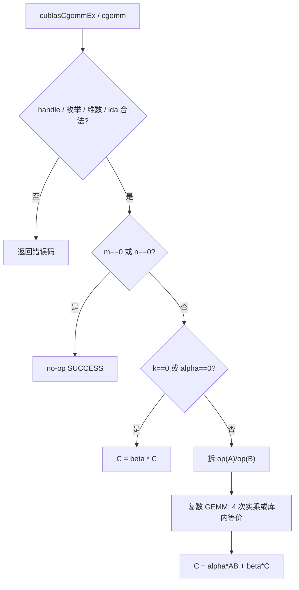
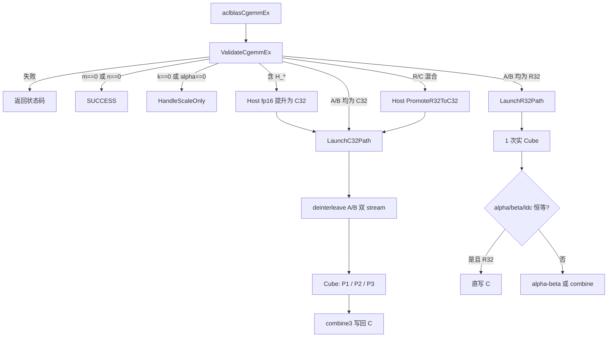
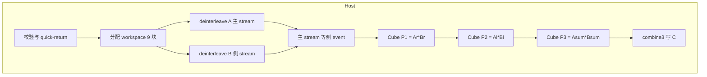
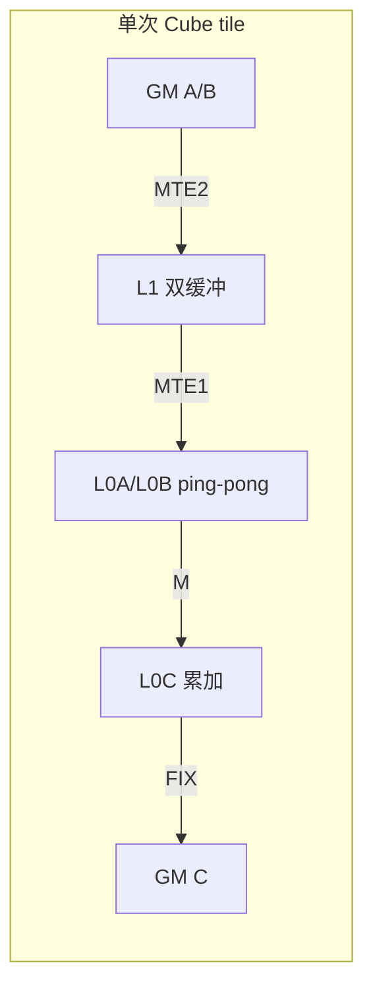

# aclblasCgemmEx 算子设计文档

| 项目 | 内容 |
|------|------|
| 算子名称 | `aclblasCgemmEx` |
| 适配硬件 | Ascend 950PR |
| CANN 版本 | 9.1.0 |
| 开源仓 | [ops-blas](https://gitcode.com/cann/ops-blas)（实现目录 `blas/gemm/arch35/`） |
| 对标接口 | cuBLAS `cublasCgemmEx`；单批语义参考 Netlib `cgemm` |
| 调用方式 | Ascend C Kernel 直调（句柄 + stream，非 ACLNN / 非 PyTorch） |
| 文档版本 | 2026-09-06 |

---

## 一、需求背景

### 1.1 需求来源

社区任务「aclblasCgemmEx 算子开发（Ascend 950PR）」：在 ops-blas 开源仓实现公共 BLAS 接口 `aclblasCgemmEx`，完成设计、开发、测试后合入 [cann/ops-blas](https://gitcode.com/cann/ops-blas)。

任务只要求这一个公共算子。接口声明必须放在 `include/cann_ops_blas.h`，禁止定义 950PR 私有平行 API。

### 1.2 背景介绍

#### 1.2.1 对标实现获取路径与算子信息

本任务**不是 TBE / aclnn 算子迁移**，工程模式为 ops-blas **Kernel 直调**。不存在可对照的 TBE 源码目录或 `xxx.json` 算子信息库。对标基线如下。

| 角色 | 路径 / 说明 |
|------|-------------|
| 语义对标 | NVIDIA cuBLAS `cublasCgemmEx`（[官方文档](https://docs.nvidia.com/cuda/cublas/index.html#cublas-c-gemmex)） |
| 单批 / quick-return 语义 | Netlib BLAS `cgemm.f`（[源码](https://www.netlib.org/blas/cgemm.f)） |
| 精度 golden | 测试工程内 `cblas_cgemm`（Netlib 复数 GEMM） |
| 仓内接口声明 | `ops-blas/include/cann_ops_blas.h` → `aclblasCgemmEx` |
| 类型与状态码 | `ops-blas/include/cann_ops_blas_common.h` → `aclblasType_t` / `aclblasStatus_t` / `aclblasComplex` |
| 本实现 | `ops-blas/blas/gemm/arch35/cgemm_ex_host.cpp` |
| Vector kernel | `ops-blas/blas/gemm/arch35/cgemm_ex_kernel.cpp` |
| Cube kernel | `ops-blas/blas/gemm/arch35/cgemm_ex_cube_kernel.cpp` |
| 小 shape 实 GEMM 复用 | `ops-blas/blas/gemm/arch35/gemm_kernel.cpp`（`gemm_kernel_do`） |
| 测试 | `ops-blas/test/gemm/cgemm_ex/arch35/` |

结合任务书接口判断：参考对象是 **cuBLAS 扩展 GEMM + Netlib cgemm**，不是 TBE `matmul` / aclnn `aclnnCgemm`。仓内已有 `aclblasCgemm`（固定 COMPLEX64），本算子是其扩展级版本（`typeA/typeB/typeC` 可选）。

#### 1.2.2 标杆算子现状分析

##### 1.2.2.1 标杆算子支持的数据类型和数据格式

与任务书 / 仓内类型枚举一致：

| typeT | 含义 | 元素位宽 | 存储 |
|-------|------|----------|------|
| `ACLBLAS_C_32` | COMPLEX64 | 8 B | 列主序，实/虚交错（interleaved） |
| `ACLBLAS_R_32` | FLOAT32 | 4 B | 列主序 |
| `ACLBLAS_H_C_32` | COMPLEX32（fp16 实/虚） | 4 B | 列主序，实/虚交错 |
| `ACLBLAS_H_R_32` | FLOAT16 | 2 B | 列主序 |

- 默认主路径：`typeA = typeB = typeC = ACLBLAS_C_32`
- `op` ∈ {N, T, C}（C 为共轭转置，复数路径下 T 与 C 语义不同）
- 矩阵格式：ND、列主序；前导维 `lda/ldb/ldc` 允许 padding
- 标量 `alpha/beta`：始终为 Host 侧 `aclblasComplex`（FLOAT32 实/虚）
- 不要求超出 lda/ldb/ldc 的非连续访问，无 broadcast，无动态 shape 描述符

##### 1.2.2.2 标杆算子实现描述

**cuBLAS `cublasCgemmEx`（功能语义）**

计算：

```
C = alpha * op(A) * op(B) + beta * C
```

- `op(X) = X` / `X^T` / `X^H`
- A、B、C 为 Device 指针；类型由 `Atype/Btype/Ctype` 指定
- 列主序；`beta = 0` 时 C 不必作为有效输入初始化

**Netlib `cgemm.f`（quick-return / 边界，测试 golden 对齐此语义）**

1. 校验 `TRANSA/TRANSB` 枚举与 `LDA/LDB/LDC`、负维。
2. `M = 0` 或 `N = 0`：直接返回，不写 C。
3. `(ALPHA = 0 且 BETA = 1) 或 K = 0` 的组合下，按 `BETA` 缩放或保持 C：
   - `BETA = 0`：将 C 置零
   - `BETA = 1`：C 不变
   - 其他：`C := BETA * C`
4. 否则做列主序复数 GEMM（标准 4 次实乘展开，或库内等价实现）。

本实现的 Host 校验与 quick-return 对齐上述规则；设备侧用 **Gauss / Karatsuba 三乘** 替代 4 次实 GEMM，数值上等价：

```
P1 = Ar * Br
P2 = Ai * Bi
P3 = (Ar + Ai) * (Br + Bi)
Re(AB) = P1 - P2
Im(AB) = P3 - P1 - P2
C      = alpha * AB + beta * C
```

##### 1.2.2.3 标杆算子实现流程图



---

## 二、需求分析

### 2.1 外部组件依赖

| 依赖 | 用途 | 适配情况 |
|------|------|----------|
| CANN 9.1.0 / AscendCL | `aclrt` 内存、stream、event、同步 | 已适配 |
| Ascend C（arch35 / 950PR） | Vector `GatherMask` / Cube `Te::Mmad` | 已适配 |
| ops-blas handle | `aclblasCreate/Destroy/SetStream`、默认 workspace | 复用，无新接口 |
| cblas（仅测试） | golden `cblas_cgemm` | 测试工程依赖，运行时不算子依赖 |
| PyTorch / torch_npu | 任务书提到版本要求 | **不依赖**；验收走 C++ GTest |

### 2.2 内部适配模块

| 模块 | 路径 | 作用 |
|------|------|------|
| Host 调度 | `cgemm_ex_host.cpp` | 校验、路径分发、workspace、launch |
| Vector | `cgemm_ex_kernel.cpp` | 拆交错复数、融合 `Ar+Ai`、3M combine |
| Cube 快路径 | `cgemm_ex_cube_kernel.cpp` | 大 shape 实 GEMM（L1 双缓冲 + L0 ping-pong） |
| Cube 小 tile | `gemm_kernel.cpp` | `m,n,k < 64` 时 `gemm_kernel_do` |
| 公共 tiling | `gemm_tiling_data.h` | `GemmTilingData`、分形对齐常量 |
| 句柄 / workspace | `aclblas_handle_internal.h`、`host_utils.h` | stream、AIC/AIV 核数、默认 workspace |

### 2.3 需求模块设计

#### 2.3.1 Ascend C 算子原型

与任务书 / 仓声明一致，无裁剪：

```cpp
aclblasStatus_t aclblasCgemmEx(
    aclblasHandle_t handle,
    aclblasOperation_t transa,
    aclblasOperation_t transb,
    int m, int n, int k,
    const aclblasComplex* alpha,
    const void* A, aclblasType_t typeA, int lda,
    const void* B, aclblasType_t typeB, int ldb,
    const aclblasComplex* beta,
    void* C, aclblasType_t typeC, int ldc);
```

类型路径：

| 组合 | 设备路径 |
|------|----------|
| 三者均为 `C_32` | 设备拆分 + Gauss 3M + combine（主路径） |
| 三者均为 `R_32` | 1 次实 GEMM；`alpha=(1,0), beta=(0,0)` 且 `ldc` 分形对齐时 Cube 直写 C |
| 任一侧为 `H_*` | Host fp16↔fp32 提升到 `C_32` 后再走主路径 |
| 混合 `R_32` + `C_32` | Host 将实矩阵提升为复数（虚部 0）再走主路径 |

#### 2.3.2 Ascend C 算子相关约束（相对标杆缺失或弱化）

相对 cuBLAS `cublasCgemmEx` 全量能力，本实现按任务书范围交付，下列不作为本批次目标：

| 项 | 说明 |
|----|------|
| 非 lda/ldb/ldc 语义的非连续访问 | 任务书明确不要求 |
| 批量 / strided-batched | 另有 `CgemmBatched` 等接口，本算子单批 |
| `computeType` / algo 选择 | 本接口无这两参；内部固定 fp32 Cube |
| H_* / 混合类型的设备核 | 走 Host 转换，功能具备，性能不在 §3.3 硬标内 |
| 确定性计算 / 多 stream 可重入侧 stream | 侧 stream/event 为进程内静态对象，单句柄常规用法足够 |

功能上 N/T/C、四类 type、quick-return、校验码与任务书对齐，无任务书要求而缺失的接口行为。

---

## 三、需求详细设计

### 3.1 调用方式

**Kernel 直调 + 句柄式 BLAS**，不是 ACLNN，也不经过 PyTorch。

典型调用：

```cpp
aclblasCreate(&handle);
aclblasSetStream(handle, stream);
aclblasCgemmEx(handle, transa, transb, m, n, k, &alpha,
    dA, typeA, lda, dB, typeB, ldb, &beta, dC, typeC, ldc);
aclrtSynchronizeStream(stream);   // 读回 C 前必须同步
```

测试包装（`cgemm_ex_npu_wrapper.h`）负责 Host↔Device 拷贝，并在返回前 `aclrtSynchronizeDevice`。

### 3.2 需求总体设计



#### 3.2.1 Host 侧设计

入口：`cgemm_ex_host.cpp` → `aclblasCgemmEx`。

校验（`ValidateCgemmEx`）按任务书返回：

| 条件 | 返回码 |
|------|--------|
| `handle == nullptr` | `HANDLE_IS_NULLPTR` |
| trans / type 非法枚举 | `INVALID_ENUM` |
| 负维、lda/ldb/ldc 不足、alpha/beta 空、需计算时 A/B/C 空 | `INVALID_VALUE` |

quick-return：

- `m==0` 或 `n==0`：成功返回，不访问 C
- `k==0` 或 `alpha==(0,0)`：`HandleScaleOnly`（`beta==(1,0)` 则直接返回；否则 Vector `gemm_scale_do`；半精度先升 C32 再 scale 再写回）

##### 3.2.1.1 分核策略

硬件：AIC = 28，AIV ≈ 56（arch35 1:2）。

**Vector（拆分 / combine / scale）**

- 默认 `numBlocks = AIV`
- 紧凑布局（`lda==physRows` 且拆分不转置）：按 `physRows*physCols` 一维均分
- 有 padding：按列均分，`colsPerCore = ceil(physCols / blockNum)`
- combine 紧凑（`tempLdc==ldc==m`）：按 `m*n` 一维均分；否则按 C 的列均分

**Cube**

Host 先交换 `(m,n)`、`(lda,ldb)`、`(isTransA,isTransB)`，使 Cube 按 `C^T = B^T * A^T` 习惯吃数（`LaunchRealGemm` 传入 `aPtr=B, bPtr=A`）。

分核搜索（`CalcMultiCorePartition`）：

```
mTiles = ceil(m / baseM)
nTiles = ceil(n / baseN)
maxCores = AIC
在 mb ∈ [1, min(mTiles, maxCores)] 上取
    nb = min(nTiles, maxCores / mb)
使 utilization = mb * nb 最大且 ≤ maxCores
usedCoreNum = mb * nb
```

快路径实际 launch 核数：

```
tiles = ceil(m/BM) * ceil(n/BN)
blocks = min(AIC, tiles)
```

核内按 `idx = blockIdx, blockIdx+blockNum, ...` 扫 MN tile，奇数 M 行反向扫 N（蛇形），降低 L2 抖动。

##### 3.2.1.2 数据分块和内存优化策略

**Workspace（Device，默认 handle workspace）**

`C_32` 路径：

```
tempLdc = CeilAlign(m, GEMM_FRACTAL)    // GEMM_FRACTAL = 16
mk = m * k
kn = k * n
mn = tempLdc * n
need = (mk*3 + kn*3 + mn*3) * sizeof(float)
```

布局：`reA | imA | sumA | reB | imB | sumB | t1 | t2 | t3`。  
`sumA/sumB` 在拆分时融合写出 `Ar+Ai` / `Br+Bi`，不再单独 launch vec_add。

`R_32` 非直写：`need = tempLdc * n * 4`（实 C）或 `*8`（要拼复数 C）。

**Cube 分块（快路径，`m,n,k ≥ 64`）**

```
t256 = ceil(m/256) * ceil(n/256)
if t256 < 4 * AIC:
    BM, BN, BK, KL1 = 128, 128, 64, 64
else:
    BM, BN, BK, KL1 = 256, 256, 32, 128
```

小 shape：`baseM/K/N = 32/8/16`，走 `gemm_kernel_do`。

**LocalMemory（单核）**

| 缓冲 | 公式 | 128 档 | 256 档 | 容量约束 |
|------|------|--------|--------|----------|
| L1 总池 | 固定 512 KB，2 slot 双缓冲 | 512 KB | 512 KB | 整核 L1 |
| L1A / slot | `BM * KL1 * 4` | 32 KB | 128 KB | 两份 A+B ≤ 256 KB/slot |
| L1B / slot | `BN * KL1 * 4` | 32 KB | 128 KB | 同上 |
| L0A / ping | `BM * BK * 4` | 32 KB | 32 KB | L0A 64 KB，两半 ping-pong |
| L0B / ping | `BK * BN * 4` | 32 KB | 32 KB | L0B 64 KB |
| L0C | `BM * BN * 4` | 64 KB | 256 KB | L0C 256 KB |

Vector `TILE = 2048`（fp32）：

- 拆分：输入 `TILE*2` 复数元素 + 实/虚/和 各 `TILE`，`BUF_NUM=2`，远小于 UB 248 KB
- combine：`t1/t2/c/out` 队列 + `TILE*6` 计算 buf + `TILE*2` gather 索引

**数据搬运要点**

- 紧凑 `lda==physRows`：整段 1D `GatherMask` 拆交错
- 有 padding：按列 `DataCopyPad`
- 转置不在 Vector 做物理转置，保持物理布局，Cube `isTransA/B` 用 DN/ND 布局吃数
- 共轭：拆分时对虚部 `Muls(-1)`
- A/B 拆分双 stream 重叠；Cube 三次串行（AIC 独占）

##### 3.2.1.3 tilingKey 规划策略

本算子是 Kernel 直调，**不使用 TBE / GE 的 tilingKey 注册表**。运行时分支等价于隐式 key：

| 条件 | 行为 |
|------|------|
| `m==0 \|\| n==0` | 空操作 |
| `k==0 \|\| alpha==0` | scale-only |
| 存在 `H_*` | Host 转换 + C32 路径 |
| A/B 均为 `R_32` | 单次实 GEMM |
| A/B 均为 `C_32` | Gauss 3M |
| R/C 混合 | Promote 后 3M |
| `m,n,k ≥ 64` | `cgemm_ex_cube_do`，再按 `t256 < 4*AIC` 选 128 或 256 档 |
| 否则 | `gemm_kernel_do`（32×16×8） |
| `R_32 && alpha=1 && beta=0 && ldc==tempLdc` | Cube 直写 C |

`GemmTilingData` 随 launch 传入 kernel（维数、lda/ldb/ldc、trans、tile、alpha/beta），无需编译期 key 组合爆炸。

#### 3.2.2 Kernel 侧设计

##### 3.2.2.1 Kernel 侧实现描述

**1）`cgemm_ex_deinterleave_kernel`（AIV）**

- 输入：交错复数 GM（`lda` 列主序）
- 输出：紧凑实部、虚部；可选 `sum = re+im`
- `GatherMask` 奇偶抽取；`conjFlag` 时虚部取负
- 紧凑路径按线性 offset 切 `TILE`；padding 路径按列切

**2）`cgemm_ex_cube_kernel`（AIC only）**

- `InitSocState` + `SetMMLayoutTransform(true)`
- GM→L1（MTE2）双缓冲；L1→L0A/L0B（MTE1）ping-pong；`Te::Mmad` 累加 L0C
- K 维：外层 `KL1`，内层 `BK`；`unitFlag` 区分非最后 / 最后拍
- Fixpipe 写出 ND 的 C tile
- 转置：`MakeGmB` / `MakeGmA` 在 `NDExt` 与 `DNExt` 间切换

**3）`cgemm_ex_combine3_kernel`（AIV）**

```
abR = t1 - t2
abI = t3 - t1 - t2
若 C 为实且 alpha/beta 虚部为 0:
    out = ar * abR + br * C
若 C 为复:
    (oR, oI) = alpha * (abR + i abI) + beta * C
    Gather 交错写回
```

**4）`gemm_scale_do` / `gemm_alpha_beta_do`**

scale-only 与 R32 非直写的 `alpha*AB+beta*C` 复用仓内 Vector 核。

##### 3.2.2.2 Ascend C 实现流程图





##### 3.2.2.3 与标杆流程图的差异及原因

| 差异点 | 标杆（cuBLAS / Netlib） | 本实现 | 原因 |
|--------|-------------------------|--------|------|
| 编程模型 | CUDA / 厂商闭源 kernel | Ascend C Kernel 直调 | 任务书指定 ops-blas + 950PR |
| 复数乘法次数 | 通常 4 次实 GEMM 或 Tensor Core 复数指令 | Gauss 3 次实 GEMM | 950PR AIC 无原生 COMPLEX64 MMA，3M 少约 25% Cube FLOP |
| 拆分 / 转置 | 库内融合或使用复杂指令 | Vector 拆交错；转置交给 Cube 布局 | 先得到实平面再复用实 GEMM 流水 |
| 半精度 / 混合类型 | 设备内核直接支持更多 type | Host D2H/H2D 转到 C32 | 主路径与 §3.3 标杆均为 C32/R32；H_* 功能对齐、不占硬性能表 |
| tilingKey / GE | 无（cuBLAS）或 TBE key | 运行时 if 分发 | 非 TBE 图模式 |
| 三次 Cube 串行 | 可能单 kernel 融合 | 三次 `cgemm_ex_cube_do` | AIC 独占，P1/P2/P3 无法多核并行；单核融合工作量大且已回退过相关尝试 |
| golden | 厂商实现 | `cblas_cgemm` | 任务书指定 Netlib 比对 |

数值目标与 Netlib `cgemm` 一致；算法从 4M 改为 3M 是代数恒等变形，不是功能裁剪。

### 3.3 支持硬件

与任务书一致：

| 产品 | 支持 |
|------|------|
| Ascend 950PR | 支持 |
| Ascend 950DT | 仓 README 标注支持（与 950PR 同 arch35） |
| Atlas A2 / A3 | 不支持 |

运行环境：CANN 9.1.0；实测 1×950PR，AIC 28，AIV ≈ 56，UB 248 KB，L0A/L0B 64 KB，L0C 256 KB。

### 3.4 算子约束限制

| 约束 | 内容 |
|------|------|
| 维数 | `m,n,k ≥ 0`；负维 `INVALID_VALUE` |
| 前导维 | transa=N：`lda ≥ max(1,m)`；T/C：`lda ≥ max(1,k)`；transb 对称；`ldc ≥ max(1,m)` |
| 枚举 | trans ∈ {N,T,C}；type ∈ {R_32, C_32, H_R_32, H_C_32} |
| 指针 | handle / alpha / beta 不可空；`m>0,n>0` 时 C 不可空；需要 GEMM 时 A/B 不可空 |
| 存储 | 列主序 ND；不支持任意 stride（仅 lda/ldb/ldc） |
| 原地 | 只覆写 C；A/B 只读 |
| 异步 | 结果可见性依赖绑定 stream；半精度写回前 Host 会 `SynchronizeStream` |
| 性能承诺范围 | §3.3 四条（1024/2048 的 C32 NN、C32 TN、R32 NN）；H_* / 混合不在硬标内 |
| 精度特例 | `alpha==(0,0)` 的 `C=beta*C` 须位精确 |

---

## 四、特性交叉分析

| 交叉项 | 结论 |
|--------|------|
| 与 `aclblasCgemm` | 独立入口；Cgemm 固定 COMPLEX64。本算子不改 Cgemm 行为 |
| 与 `aclblasSgemm` | R32 路径复用部分 Cube/tiling 常量，不改 Sgemm 对外语义 |
| handle / stream / workspace | 只复用已有 `aclblasCreate/SetStream` 与默认 workspace grow；无新公共 API |
| 多算子同 stream | Cube/Vector 都挂在 handle->stream（B 拆分用静态侧 stream + event） |
| 图模式 / ACLNN | 不接入，无图编译交叉 |
| 确定性 / 溢出 | 浮点累加非 bit-exact（scale-only 除外）；Inf/NaN 输入不额外处理，与 BLAS 惯例一致 |

无与其他已合入 BLAS 算子冲突的平行符号或 950PR 私有头文件。

---

## 五、可维可测分析

### 5.1 精度标准 / 性能标准

**精度（任务书 §3.2）**

逐元素 `|actual-golden| ≤ atol + rtol×|golden|`，且 `matched_ratio ≥ 0.99`，`max_abs_error` 不超过下表。

| 类型 | rtol | atol | max_abs_error |
|------|------|------|----------------|
| COMPLEX64 / FLOAT32 | 2^-10（9.77e-4） | 2^-16（1.53e-5） | 1e-2 或 32×ULP |
| FLOAT16 | 2^-9（1.95e-3） | 2^-9 | 1e-1 或 32×ULP |

`alpha==(0,0)` 时 `C=beta*C`：**EXACT**。

自测：`--gtest_filter='-:*TC_PF*'` **1019/1019 PASS**（官方精度 1000 + `NullHandle` + 自补 `TC_HX` 18）。

**性能（任务书 §3.3，warmup 8 + 采样 50）**

| case | shape | 标杆 us | 实测 avg us |
|------|-------|---------|-------------|
| 1 | 1024 NN C_32 | 415.95 | 400.29 |
| 2 | 2048 NN C_32 | 3243.65 | 2532.48 |
| 3 | 1024 TN C_32 | 411.27 | 401.09 |
| 4 | 2048 NN R_32 | 851.86 | 802.24 |

### 5.2 兼容性分析

- **接口兼容**：签名与 `cann_ops_blas.h` 已有声明一致，可供其他产品线共用。
- **ABI / 头文件**：未新增 950PR 专用导出；类型枚举落在 `cann_ops_blas_common.h`。
- **行为兼容**：quick-return 与 Netlib `cgemm`、校验码与任务书表一致；golden 为 cblas，不绑定某一版 cuBLAS 二进制误差。
- **构建兼容**：`#if ASC_DEVKIT_GE_9_1` 包裹 arch35 实现；低版本工具链不编译本文件。
- **测试兼容**：CSV 驱动，过滤 `TC_PF` 即可复现精度集；微基准见 `/root/docs/bench_cgemm_ex.cpp`。

### 5.3 可演进点（非阻塞）

1. 三次 Cube 仍串行，2048 C32 主耗时约为 3× 单次实 GEMM。
2. lda padding 时 Vector 仍按列拷；紧凑 1D 路径已覆盖 §3.3 场景。
3. H_* / 混合仍 Host 拷贝；若后续纳入性能表，需设备侧 cast kernel。
4. 单 Cube 核融合 3M 可摊 launch，实现复杂，曾作相关尝试后回退。

---

## 附录 A 关键文件清单

| 文件 | 职责 |
|------|------|
| `include/cann_ops_blas.h` | 公共声明 |
| `include/cann_ops_blas_common.h` | 类型 / 状态码 |
| `blas/gemm/arch35/cgemm_ex_host.cpp` | Host |
| `blas/gemm/arch35/cgemm_ex_kernel.cpp` | Vector |
| `blas/gemm/arch35/cgemm_ex_cube_kernel.cpp` | Cube |
| `blas/gemm/arch35/cgemm_ex_kernel.h` | kernel 入口 |
| `blas/gemm/README.md` | 仓内算子说明 |
| `test/gemm/cgemm_ex/arch35/` | CSV + GTest |

## 附录 B 参考资料

1. 任务书：`aclblasCgemmEx_task_doc.md`
2. cuBLAS `cublasCgemmEx`
3. Netlib `cgemm.f`
4. 生态算子开源精度标准（opbase experimental_standard）
5. Ascend C 算子开发文档 / CANN 9.1.0
