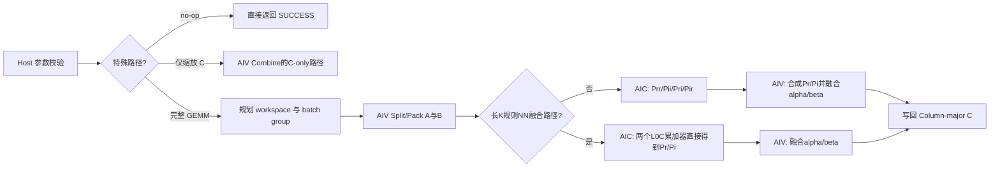
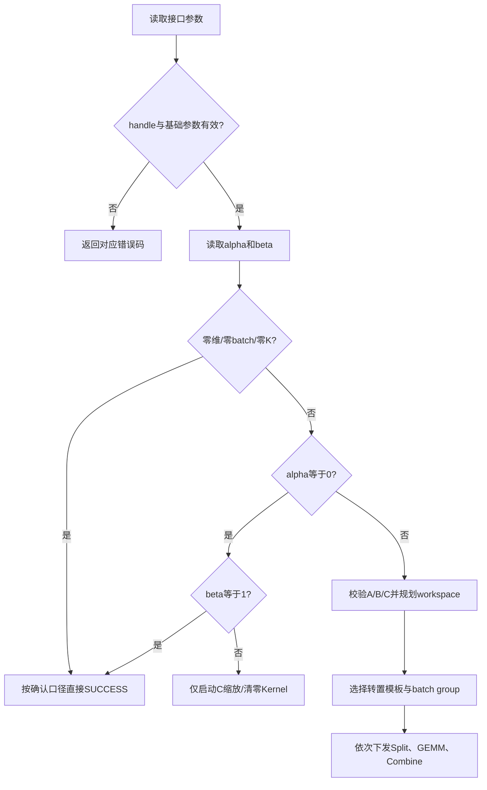

# aclblasCgemmStridedBatched 算子设计文档

## 需求背景（required）

### 需求来源

本需求来源于 HiAscend 社区任务“aclblasCgemmStridedBatched 算子开发（A2/A3）”。任务要求在昇腾 NPU 上，基于 Ascend C/CATLASS 和 `cann/ops-blas` 工程框架，实现单精度复数带步长批量矩阵乘接口 `aclblasCgemmStridedBatched`。

任务页：<https://www.hiascend.com/activities/task-center/details/e8758137d0ad4238b05b1614cea925da?menu=trends>。

设计输入包括下载任务书、`gemm_strided_batched_test.csv`、`gpu_baseline.csv`、`gen_csv.py`、`verify_accuracy.py` 和测试指导 `README.md`。首版接口、异常行为、精度阈值和性能硬指标以任务包为准；对任务书与测试材料存在差异的条目，在正式编码前向任务发布方确认，并在自测报告中记录最终采用的验收口径。

算子代码目标仓库为 `cann/ops-blas`，计划落点如下：

```text
ops-blas/
├── include/cann_ops_blas.h
├── blas/gemm_strided_batched/arch22/
└── test/gemm_strided_batched/cgemm_strided_batched/arch22/
```

本文件仅描述开发前的方案、接口契约和验证计划，不包含实现完成状态、实机测试结果或验收结论。

### 背景介绍

#### 对标接口与计算语义

`aclblasCgemmStridedBatched` 对标 cuBLAS `cublasCgemmStridedBatched`，对 `batchCount` 组形状相同的复数矩阵执行：

```text
A_i = A + i * strideA
B_i = B + i * strideB
C_i = C + i * strideC

C_i = alpha * op(A_i) * op(B_i) + beta * C_i
```

所有 batch 共享 `m/n/k/alpha/beta/transa/transb`。A、B、C 使用 Column-major 布局，类型为 COMPLEX64；`op(X)` 支持不转置 N、转置 T 和共轭转置 C。`strideA/strideB/strideC` 均以复数元素为单位，而不是字节数。

任务定义了以下关键语义：

- A/B 的 N、T、C 九种组合全部支持；
- 支持非紧凑 `lda/ldb/ldc` 和 batch stride；
- `strideA=0` 或 `strideB=0` 表示 batch 间复用同一只读矩阵；
- `m=0`、`n=0`、`k=0` 或 `batchCount=0` 为合法 no-op；
- `alpha=0` 时不引用 A、B，`beta=0` 时不读取 C 原值；
- handle 通过 `aclblasSetStream` 绑定 stream，接口按异步方式下发。

#### 任务包与验证边界

| 文件 | 作用 |
| --- | --- |
| 任务书 | 定义接口、异常行为、适配硬件、精度与性能验收标准和交付件 |
| `gemm_strided_batched_test.csv` | 1200 条 CSV 用例，包含 1000 条精度/边界用例和 200 条性能用例 |
| `gpu_baseline.csv` | 200 条 GPU 基线；前 5 条与任务书性能硬点对应 |
| `gen_csv.py` | 使用固定随机种子生成可复现 CSV |
| `verify_accuracy.py` | 构建并执行 ops-blas GTest，解析精度用例结果 |
| 测试指导 `README.md` | 说明用例分类、精度阈值和 msprof 性能统计方法 |

任务材料中需要在实现前确认的边界包括：

1. 任务书将 `k=0` 定义为 no-op，但 CSV 同时存在 `k0_beta0_C_zeroed` 描述。设计以任务书正文为主：`k=0` 不读取或修改 C，对应测试描述应为 `C_unchanged`，不得按普通 GEMM 的 `beta*C` 路径执行。
2. 任务书参数表将 `strideC=0` 列为整型合法取值，测试指导将 `strideC=0 && batchCount>1` 定义为未定义语义且不构造用例；首版不承诺该组合的确定结果。
3. 任务书一处写“自验证只需覆盖一种款型”，特别注意事项又写 A2/A3 均需验收；设计保留 A2/A3 双平台构建与验证路径，最终交付范围以任务发布方确认为准。

#### 接口定义

```cpp
aclblasStatus_t aclblasCgemmStridedBatched(
    aclblasHandle_t handle,
    aclblasOperation_t transa,
    aclblasOperation_t transb,
    int m,
    int n,
    int k,
    const aclblasComplex *alpha,
    const aclblasComplex *A,
    int lda,
    long long strideA,
    const aclblasComplex *B,
    int ldb,
    long long strideB,
    const aclblasComplex *beta,
    aclblasComplex *C,
    int ldc,
    long long strideC,
    int batchCount);
```

## 需求分析（required）

### 需求描述

在不改变任务书接口与参数顺序的前提下，在 `cann/ops-blas` 中新增 COMPLEX64 Column-major 带步长批量 GEMM。实现需覆盖 N/T/C 九种转置组合、复数 alpha/beta、padding leading dimension、非紧凑 batch stride、A/B 广播 stride、空问题和负向校验，并在 Atlas A2/A3 arch22 平台满足任务书规定的精度标准；性能验收在 Atlas 800T A2（Ascend 910B3）、CANN 9.1.0 环境按任务书五个硬点执行。

### 接口与参数分析

| 参数 | 内存位置 | 含义 | 主要约束 |
| --- | --- | --- | --- |
| `handle` | Host | BLAS 上下文和 stream | 不得为空，否则返回 `ACLBLAS_STATUS_HANDLE_IS_NULLPTR` |
| `transa/transb` | Host | A/B 的 N、T、C 操作 | 必须为合法枚举 |
| `m/n/k` | Host | 输出行、输出列和归约维 | 均大于等于 0 |
| `alpha/beta` | Host | 复数缩放系数 | 指针不得为空 |
| `A/B` | Device | 批量只读 COMPLEX64 输入 | 参与计算时不得为空 |
| `C` | Device | 批量 COMPLEX64 输入输出 | 有效输出存在时不得为空 |
| `lda/ldb/ldc` | Host | Column-major 前导维 | 满足物理矩阵最小前导维 |
| `strideA/B/C` | Host | 相邻 batch 的复数元素偏移 | 地址范围由调用方保证有效 |
| `batchCount` | Host | batch 数量 | 大于等于 0 |

物理矩阵 shape 与 leading dimension 下界为：

| 矩阵 | N 模式物理 shape | T/C 模式物理 shape | leading dimension 下界 |
| --- | --- | --- | --- |
| A | `[m,k]` | `[k,m]` | N：`lda>=max(1,m)`；T/C：`lda>=max(1,k)` |
| B | `[k,n]` | `[n,k]` | N：`ldb>=max(1,k)`；T/C：`ldb>=max(1,n)` |
| C | `[m,n]` | 不适用 | `ldc>=max(1,m)` |

### 支持范围

| 维度/能力 | 首版支持范围 | 依据 |
| --- | --- | --- |
| 数据类型 | COMPLEX64 | 任务书 |
| 布局 | Column-major | 任务书 |
| `transa/transb` | N、T、C 的 9 种组合 | 任务书、CSV |
| shape | `m/n/k/batchCount` 为运行时参数 | 任务书、CSV |
| leading dimension | 紧凑及合法 padding | 任务书、CSV |
| batch stride | 紧凑、非紧凑、A/B 的 stride=0 广播 | 任务书、CSV |
| 标量 | 一般复数及 0、1、-1、纯虚数 | 任务书、CSV |
| 特殊值 | 任务用例定义的 Inf/NaN | 任务书、CSV |
| 执行方式 | handle 绑定 stream，异步下发 | 任务书 |

### 需求拆解

1. **公共接口**：在 `include/cann_ops_blas.h` 增加接口声明，保持任务书参数顺序。
2. **Host 校验**：实现 handle、枚举、维度、leading dimension、标量和参与计算指针校验，并对地址与 workspace 算术做溢出保护。
3. **特殊路径**：实现零维/零 batch no-op、`alpha=0` 的 C-only 路径和 `beta=0` 的免读 C 路径。
4. **数据准备**：按 Column-major、ld、stride 和转置属性将 COMPLEX64 A/B 拆分为可供 Cube 使用的 FP32 实部/虚部平面，共轭模式对虚部取反。
5. **矩阵乘**：使用 AIC/CATLASS 完成复数乘法所需的 FP32 GEMM，并覆盖 K 分片与尾块。
6. **结果融合**：在 AIV 上完成实虚部组合、alpha/beta 复数融合和 Column-major 写回。
7. **批量调度**：使 batch 进入 Device 任务空间，避免逐 batch Host launch；按 workspace 上限分组复用临时空间。
8. **测试交付**：接入 CSV 驱动 GTest，以 Netlib BLAS `cblas_cgemm` 逐 batch 生成 Golden，覆盖正式用例与补充边界用例。
9. **双平台验证**：完成 A2/A3 目标构建与精度验证，并在 910B3 上完成五个性能硬点验证。

### 交付件与证据规划

| 任务书交付件 | 设计/验证落点 |
| --- | --- |
| 算子设计文档 | 按官方模板提交至社区任务仓并完成评审 |
| 自测用例及测试代码 | 覆盖任务包 CSV，README 说明构建、运行、Golden 和性能采集步骤 |
| 自测报告 | 保存逐 case 参数、精度指标、原始性能样本、日志、截图和环境信息 |
| 待验收代码地址 | 提供个人仓链接、分支、算子目录及 ops-blas 规范 README |
| `task_submission` | 按任务书目录整理自验证步骤、精度/性能/内存报告与原始日志 |

## 详细设计（required）

### 算子分析

#### 数学公式

设经过 N/T/C 处理后的矩阵为：

```text
A' = op(A) = Ar + i*Ai
B' = op(B) = Br + i*Bi
P  = A' * B' = Pr + i*Pi
```

复数矩阵乘拆为四个 FP32 实数矩阵乘：

```text
Prr = Ar * Br
Pii = Ai * Bi
Pri = Ar * Bi
Pir = Ai * Br

Pr = Prr - Pii
Pi = Pri + Pir
```

令 `alpha=alpha_r+i*alpha_i`、`beta=beta_r+i*beta_i`、原 C 为 `Cr+i*Ci`，输出为：

```text
out_r = alpha_r*Pr - alpha_i*Pi + beta_r*Cr - beta_i*Ci
out_i = alpha_r*Pi + alpha_i*Pr + beta_r*Ci + beta_i*Cr
```

首版采用四次实数 GEMM，不采用三次 GEMM 的 Gauss 复数乘法。四次方案无需额外输入预加减，数值路径更直接，便于按 COMPLEX64 标准与 Netlib Golden 对齐。

#### 转置与共轭

对于 Column-major 输入，split 阶段按 `row + col*ld` 读取物理矩阵：

```text
N: dst(row,col) = src(row,col)
T: dst(row,col) = src(col,row)
C: dst_real(row,col) =  src_real(col,row)
   dst_imag(row,col) = -src_imag(col,row)
```

Cube 计算可利用：

```text
(op(A) * op(B))^T = op(B)^T * op(A)^T
```

将逻辑 `m×n` 结果按 `n×m` 连续物理视图计算，使结果连续方向与 Column-major C 的列内连续方向一致。Host 根据 `transa/transb` 选择对应的静态 Matmul 模板入口，Kernel 热路径不解析动态转置枚举。

#### 支持数据类型

| 对象 | GM 数据类型 | 计算/临时类型 |
| --- | --- | --- |
| A/B/C | COMPLEX64 交织存储 | FP32 实部/虚部 |
| alpha/beta | Host COMPLEX64 | Host 拆为 FP32 实部/虚部 |
| Cube 输入/输出 | FP32 | FP32 累加 |
| 地址与 workspace 算术 | INT64 输入 | checked uint64/size_t |

### 算子实现

#### 实现方案

算子采用 Host 统一调度、AIV 数据拆分、AIC 实数矩阵乘和 AIV 结果融合的多 Kernel 流水。临时结果仅保存在 Device workspace，不回传 Host。通用路径优先保证 N/T/C、padding、非紧凑 stride 和 K 尾块的泛化；对满足约束的长 K、N/N 规则 shape，再选择减少中间结果和 Kernel 启动数的融合路径。



通用路径使用四个结果平面，避免依赖实数 Matmul 对已有 GM 结果做带符号累加：

```text
Prr = Ar*Br
Pii = Ai*Bi
Pri = Ar*Bi
Pir = Ai*Br
Pr  = Prr - Pii
Pi  = Pri + Pir
```

长 K 的四个独立 GEMM 若到最后才执行 `Prr-Pii`、`Pri+Pir`，在两个大数相消时会放大绝对误差。设计采用两级控制：

1. 通用长 K 路径按 K 分片，每个分片完成四路 GEMM 后立即在 Combine 中合成为复数部分和；首片使用用户 `beta`，后续分片令 `beta=1+0i` 累加到 C。这样保持一般 shape、转置和尾块支持，并缩短独立实数部分的累加区间。
2. 对 N/N、M/N 为 64 的整数倍、K 为 128 的整数倍且 K 足够大的规则 shape，使用融合 AIC 路径。在两个 L0C 累加器中交错执行 `Ar*Br + (-Ai)*Bi` 与 `Ai*Br + Ar*Bi`，直接得到 `Pr/Pi`，只落盘两个结果平面。未满足条件时必须回退到通用路径，不得补齐后越界读取。

该选择只改变内部执行计划，不改变接口、精度阈值或异步语义。

#### Host 侧设计

##### 参数校验与路径选择

Host 计划按以下顺序执行：

1. 校验 `handle`，为空返回 `ACLBLAS_STATUS_HANDLE_IS_NULLPTR`；
2. 校验 `transa/transb`；
3. 校验 `m/n/k/batchCount` 非负；
4. 校验 `lda/ldb/ldc` 满足物理 shape 下界；
5. 校验 `alpha/beta` Host 指针并读取标量；
6. 对 `m==0 || n==0 || k==0 || batchCount==0` 按任务书正文直接返回 no-op；
7. 根据 alpha/beta 和 problem size 判断 A/B/C 是否会被访问，再校验相应 Device 指针；
8. 对矩阵元素数、batch 末地址、字节换算、对齐和 workspace 做 checked 计算；
9. 选择 no-op、C-only 或完整 GEMM 路径，使用 handle stream 异步下发。

不支持的参数必须返回任务书定义的状态码，不得修改维度、截断 stride 或继续启动 Kernel。



##### Batch 分组与 workspace

设 A、B 的物理行列数分别为 `rowsA/colsA`、`rowsB/colsB`，临时结果 leading dimension 向 128 个 FP32 元素对齐。令：

```text
Aplane = align512(rowsA * colsA * sizeof(float))
Bplane = align512(rowsB * colsB * sizeof(float))
tempLdc = align128(m)
Cplane = align512(tempLdc * n * sizeof(float))

genericPerBatch = 2*Aplane + 2*Bplane + 4*Cplane
fusedPerBatch   = genericPerBatch + optionalNegAiPlane
```

`optionalNegAiPlane` 用于融合长 K 路径保存 `-Ai`；当空闲结果平面足够容纳时复用该区域，否则额外分配一个 `Aplane`。所有乘法、加法、对齐及 batch 末地址计算均使用 checked `uint64_t/size_t`，任何溢出或单 batch 超出仓库 workspace 上限的情况均返回分配失败，不允许截断。

Host 根据可配置 workspace 上限计算：

```text
groupCapacity = min(batchCount, floor(workspaceLimit / perBatch))
groupCount    = ceilDiv(batchCount, groupCapacity)
```

每个 group 复用相同 workspace，并在同一 stream 中按 Split → GEMM → Combine 的依赖顺序执行。若单 batch 所需 workspace 已超出上限，返回明确的内存或执行失败状态，不发生整数溢出和静默截断。

workspace 概念布局为：

| 区域 | 内容 | 生命周期 |
| --- | --- | --- |
| A 实部/虚部 | `Ar/Ai` 紧凑 FP32 平面 | 当前 batch group 的四路 GEMM |
| B 实部/虚部 | `Br/Bi` 紧凑 FP32 平面 | 当前 batch group 的四路 GEMM |
| 通用结果平面 | `Prr/Pii/Pri/Pir` FP32 平面 | 当前 K 分片的四路 GEMM与 combine |
| 融合结果平面 | `Pr/Pi`，复用通用结果区 | 规则长 K N/N 路径 |
| 可选负虚部平面 | `-Ai`，优先复用空闲结果区 | 融合长 K N/N 路径 |
| 对齐保留区 | 512B 对齐和目标模板要求的附加空间 | 当前 batch group |

##### Tiling 与静态分派

| Tiling 数据 | 关键字段 | 用途 |
| --- | --- | --- |
| `SplitTilingData` | 物理 rows/cols/ld、源 stride、packed stride、batch 数、共轭标记 | COMPLEX64 解交织；C 模式虚部取反 |
| `GemmTilingData` | m/n/k、M/N tile、K 起点/长度、转置模式、batch stride | AIC 实数 GEMM或规则长 K 融合 GEMM |
| `CombineTilingData` | m/n/ldc/strideC、alpha/beta、结果平面 stride、`skipProduct/skipCRead/productPrecombined` | 通用四平面组合、融合两平面读取及 C-only 写回 |

Host 将逻辑 `C(m,n)` 转换为连续方向更适合 Column-major 写回的转置视图，针对左右操作数是否转置选择 NN/TN/NT/TT 四个预编译 Matmul 入口；共轭已经由 Split 的虚部符号处理，因此不增加 Cube 动态分支。任务空间为 `batch × mTile × nTile`，核心以步进方式领取 tile，避免逐 batch 启动 GEMM Kernel。

每个 batch group 的 Kernel 数量可提前确定，用于约束启动开销和 profiling 统计口径：

| 路径 | Kernel 序列 | 单 group 启动数 |
| --- | --- | ---: |
| no-op | 无 | 0 |
| C-only | Combine（`skipProduct=1`） | 1 |
| 通用完整 GEMM | SplitA + SplitB + `Kchunk × (4×GEMM + Combine)` | `2 + 5×Kchunk` |
| 规则长 K N/N 融合 | SplitA + NegateAi + SplitB + FusedGEMM + Combine | 5 |

性能统计必须把一次接口调用中所有 group、所有 K 分片的上述 Kernel 相加。任何只报告某个 GEMM Kernel 的方法都会低估算子耗时。

#### Kernel 侧设计

##### AIV Split/Pack

1. 以 `(batch, logical column tile)` 为工作单元，多核步进领取任务。
2. 根据 batch 起点 `base + batch*stride` 和 Column-major 地址 `row + col*ld` 读取 COMPLEX64 的物理矩阵。
3. 将交织实部/虚部分离为连续 FP32 平面；Split 不改变物理行列顺序，T 由 Matmul 静态模板解释，C 只在 Split 阶段对虚部取反后复用同一转置模板。
4. `strideA=0` 或 `strideB=0` 时，每个逻辑 batch 从同一源地址读取。首版仍为每个逻辑 batch 保留独立 packed 区，使 GEMM 的 batch stride 保持统一；是否进一步复用 packed 平面只在证明不会改变任务划分且 profiling 有收益后启用。
5. 非 32B 对齐尾块使用安全搬运和有效元素控制，不读取或写入 padding 之外的地址。

##### AIC/CATLASS GEMM

通用路径中，每个 batch、每个 K 分片的复数乘法映射为以下四次 FP32 GEMM：

```text
Prr = Ar * Br
Pii = Ai * Bi
Pri = Ar * Bi
Pir = Ai * Br
```

主要设计点：

- batch、M tile 和 N tile 共同进入任务空间，避免逐 batch Host launch；
- K 较小时一次完成；K 较大时按精度策略分片，每片在 Combine 后累加到 C，尾 K 使用模板支持的安全路径；
- 对 N/T/C 组合使用静态模板，实际 Cube 看到的是已经 pack 好的连续 FP32 平面；
- 小矩阵大 batch 优先增加 batch 并行度，大矩阵优先提高单 GEMM Cube 利用率；
- 规则长 K N/N shape 使用两个 L0C 累加器直接产生 `Pr/Pi`，减少两次结果落盘及 Combine 读流量；不满足约束时保持通用路径。

##### AIV Combine

通用路径先从 `Prr/Pii/Pri/Pir` 得到 `Pr/Pi`；融合路径直接读取预组合的 `Pr/Pi`。随后按复数 alpha/beta 公式融合并写回 C：

```text
outReal = alphaReal*Pr - alphaImag*Pi
        + betaReal*oldReal - betaImag*oldImag

outImag = alphaReal*Pi + alphaImag*Pr
        + betaReal*oldImag + betaImag*oldReal
```

当 `beta==0+0i` 时设置 `skipCRead`，不加载旧 C，避免无意义带宽和 `0*NaN` 污染。输出只覆盖 C 的有效 `m×n` 区域，不改写 `ldc-m` 的 padding。

##### 特殊标量路径

| 场景 | 设计行为 |
| --- | --- |
| `m==0 || n==0 || k==0 || batchCount==0` | 按任务书正文返回 SUCCESS，不读取 alpha/beta/A/B/C |
| `alpha==0 && beta==1` | 返回 SUCCESS，不读取 A/B/C 数值 |
| `alpha==0 && beta!=1` | 仅启动 C 缩放路径，不读取 A/B |
| `beta==0` | Combine 不读取旧 C |
| `alpha==0 && beta==0` | C 有效区域写入复数零 |

##### 异步与资源生命周期

- alpha/beta 位于 Host，入口在返回前完成读取；
- A/B/C 和 workspace 位于 Device；
- 所有 Kernel 使用 `handle` 绑定的 stream 异步下发；
- Host 不插入额外 `aclrtSynchronizeStream`；
- batch group 在同一 stream 中顺序复用 workspace；
- 调用方在读回 C 前负责同步，并保证 A/B/C 与 workspace 生命周期覆盖异步执行。

### 复杂度与数据量

每个 batch 的复数 GEMM 计算复杂度为 `O(m*n*k)`，四次 FP32 GEMM 的主要实数运算量约为：

```text
8 * m * n * k FLOPs
```

不计缓存复用时，Split 至少读取 A/B 的 COMPLEX64 有效区并写出四个 FP32 输入平面。通用路径再写出并读取四个 FP32 结果平面；融合长 K 路径只写出两个结果平面。Combine 在 `beta!=0` 时读取 C，再写回 COMPLEX64 C。大 shape 性能对 K 分片次数、重复 pack、结果平面带宽和 workspace 分组敏感，因此优化顺序为：减少 Host 启动、增加 `batch×tile` 并行度、降低 K 分片开销、对规则长 K 使用融合 AIC 路径，最后才考虑广播 packed 复用。

### 支持硬件

| 支持的芯片版本 | 编译配置 | 验证目标 |
| --- | --- | --- |
| Atlas 800I/T A2，含 Atlas 800T A2（910B3） | arch22 / `ascend910b` 系列目标 | 构建、精度；910B3 执行性能硬点 |
| Atlas 800I A3 及 Atlas A3 系列 | arch22 对应 A3 目标 | 构建、精度和兼容性 |

Host 从平台信息获取核数和内存能力，Tiling 不硬编码只适用于单一机器的核数。A2/A3 分别构建和验证，不以任一平台结果替代另一平台证据。

### 算子约束限制

- 仅支持 COMPLEX64、Column-major 和 N/T/C；
- 不支持 A/B 与 C 内存重叠；
- 不保证浮点逐位确定性；
- alpha/beta 按 Host 指针解释，不支持 Device pointer mode；
- 调用方负责保证基址、ld、stride 和 batchCount 组合覆盖全部有效访问；stride 过小导致越界属于未定义行为；
- `strideA=0`、`strideB=0` 支持只读广播；`strideC=0 && batchCount>1` 暂不作为首版确定语义；
- 输出 batch 区域不得相互重叠，否则并行写回存在数据竞争；
- 单 batch workspace 超过实现上限时返回明确失败状态；
- 仅保证 handle 所绑定 stream 内的异步顺序，不建立跨 stream 同步关系。

## 可维可测分析

### 精度标准/性能标准

#### 精度标准

Golden 由 Netlib BLAS `cblas_cgemm` 逐 batch 生成，对输出 C 的有效 `m×n` 区域全矩阵验证。COMPLEX64 实部和虚部分别按 FLOAT32 mixed tolerance 判定：

| rtol | atol | required matched ratio | max abs error limit |
| ---: | ---: | ---: | ---: |
| `2^-13` | `2^-13` | `>=0.99` | `1e-2` 或 `32*ULP` |

逐元素通过条件为：

```text
abs(actual - golden) <= atol + rtol * abs(golden)
```

整体用例需同时满足 matched ratio 和最大绝对误差限制。涉及大数规约时，如按任务书将最大误差放宽至 2ULP，必须逐 case 说明理由和实际阈值，不得全局放宽。

#### 正式性能用例与目标

性能设备为 Atlas 800T A2（Ascend 910B3），CANN 9.1.0。任务书 §3.3 写有效采样 10 次，§7.4 要求有效采样大于 10 次；设计采用更严格口径：5 次 warmup 后至少 11 次有效样本，推荐固定 15 次。NPU 平均单次 Kernel 耗时不得高于下表目标：

| case | batchCount | m | n | k | transa/transb | stride 形态 | 目标 Avg time (us) |
| --- | ---: | ---: | ---: | ---: | --- | --- | ---: |
| 1 | 8 | 256 | 256 | 256 | N/N | 紧凑 | `<=153.7` |
| 2 | 32 | 512 | 512 | 512 | N/N | 紧凑 | `<=2757` |
| 3 | 16 | 1024 | 1024 | 1024 | N/T | 紧凑 | `<=10061` |
| 4 | 8 | 2048 | 2048 | 2048 | T/N | padding | `<=36073` |
| 5 | 4 | 4096 | 4096 | 4096 | N/N | padding | `<=143326` |

五个目标来自任务书，并对应 `gpu_baseline.csv` 前五条 GPU 时间除以 0.8。正式判断使用任务方确认的 NPU Kernel 统计口径，不用 Host 端到端耗时替代。

#### 精度测试设计

1. **任务包主线**：运行 CSV 中 1000 条精度、边界和负向用例，保留完整命令、环境信息和日志。
2. **转置组合**：覆盖 N/T/C 九种组合，使用可辨识数据单独验证转置与共轭虚部取反。
3. **形状扫描**：覆盖 0、1、质数、2 的幂及其 ±1、非对齐值、矩形和任务最大精度 shape。
4. **布局覆盖**：覆盖紧凑及 padding ld、非紧凑 stride、A/B 单独或同时 stride=0 广播。
5. **标量覆盖**：覆盖一般复数、0、1、-1、纯虚数以及 alpha/beta 的组合；用真实空 A/B 指针验证 `alpha=0` 不引用输入，用 NaN C 验证 `beta=0` 不读取旧值。
6. **特殊值**：按任务用例覆盖全零、交替值、极值、Inf 和 NaN；非有限结果逐元素区分 NaN、正无穷和负无穷，不以“均为非有限”替代传播语义校验。
7. **Host 反例**：覆盖空 handle、空标量/矩阵指针、非法枚举、负维度、负 batchCount 和非法 leading dimension。
8. **地址边界**：使用 guard 区检查有效矩阵之外的 padding、相邻 batch 和尾块未被越界改写。

精度日志至少记录 case 名、全部参数、状态码、matched ratio、max absolute error、首个失败位置及其 actual/golden。

#### 性能测试设计

性能对比固定以下条件：

- 同一 910B3 设备和 CANN 9.1.0 环境；
- 与正式 CSV 相同的 shape、转置、ld、stride、batch 和数据类型；
- 固定 stream、同步边界、构建模式和频率环境；
- 以 `msprof op` 的 `OpBasicInfo.csv` 统计 Device Kernel 时间；
- 5 次 warmup 后至少 11 次有效样本，固定交付建议使用 15 次，报告全部原始样本和平均值；
- 多 Kernel 实现按一次接口调用涉及的全部 Kernel 时延求和，不只选择其中单个 GEMM Kernel。

Profiling 重点观察：

- AIC/AIV 核利用率与 batch/tile 负载均衡；
- Split/Combine 的 GM 带宽占比；
- 四路 GEMM 的 Cube 利用率和 K 分片开销；
- A/B 广播时 packed 平面是否被实际复用；
- batch group 边界是否产生额外 launch 和空闲；
- case 1 小矩阵的下发开销，以及 case 4/5 padding 和大 workspace 的影响。

### 分层验证计划

| 层级 | 用例范围 | 验证目标 |
| --- | --- | --- |
| API/Host UT | handle、枚举、负维、非法 ld、空指针、溢出 | 状态码、校验顺序、no-op 和引用规则 |
| Tiling UT | N/T/C、padding、非紧凑 stride、K 尾块、workspace 分组 | 物理 shape、地址、分组容量和路径选择 |
| Kernel 单测 | Split、共轭、四平面组合、融合长 K、C-only | 各阶段独立正确性及 guard 区不越界 |
| A2 真机精度 | 任务 CSV 非 `TC_PF` 的 1000 条，外加专项回归 | Netlib Golden、状态码、特殊值与边界 |
| A3 真机精度 | 与 A2 相同的 1000 条及专项回归 | arch22 双平台兼容性，不用 A2 结果替代 |
| A2 性能网格 | `TC_PF_1001`～`TC_PF_1200` 共 200 条 | 单条运行、核函数正确性、逐条关联 `gpu_baseline.csv`；前五条为任务书硬门槛 |
| A3 PF 兼容性 | 200 条 `TC_PF` 的功能执行 | 验证大 shape、转置与 batch 兼容性；性能门槛仍绑定 910B3 |
| 910B3 正式跑分 | 任务书前五条硬点 | 每点独立 profiling，统计一次 API 的全部 Kernel，总耗时与阈值比较 |
| 工程回归 | 公共头、目标构建和既有 BLAS 接口 | 新增接口不影响其他架构和既有算子 |

任务包的 1200 条 CSV 必须按 case 名建立结果清单。精度脚本按官方指导排除 `TC_PF`，因此“1000 条精度通过”不能替代“200 条性能网格已执行”；同样，五个硬点达标也不能替代其余 195 条 PF 用例的覆盖记录。

任务包固定用例分类如下，扩展精度用例不得掩盖固定边界类别的遗漏：

| 类别 | 条数 | 主要覆盖 |
| --- | ---: | --- |
| `TC_L0` | 9 | N/T/C 九种组合的小 shape 基础用例 |
| `TC_SQ` | 22 | 1～2048 的方阵尺寸扫描 |
| `TC_AB` | 24 | 一般复数与 0、1、-1、纯虚数标量组合 |
| `TC_BC` / `TC_RC` | 29 | batchCount 扫描与非方阵 |
| `TC_LD` / `TC_SD` / `TC_BR` | 9 | leading dimension padding、非紧凑 stride、A/B 广播 |
| `TC_FL` / `TC_CV` | 42 | 填充值、Inf/NaN 和中等尺寸转置覆盖 |
| `TC_ED` | 33 | no-op、空指针、非法枚举、负维和非法 leading dimension |
| `TC_EX` | 832 | 固定随机种子的组合扩展精度集 |
| `TC_PF` | 200 | 五个任务书硬点及其余性能 shape 网格 |

### 兼容性分析

本算子为新增公开接口，不修改已有接口签名、枚举值或行为。实现复用 ops-blas 既有 handle、stream、状态码、构建和测试框架；新增 arch22 源文件不改变其他架构或其他数据类型的 GEMM 路径。

A2/A3 的核数、片上存储和实际带宽可能不同，Host Tiling 使用平台信息计算调度和资源预算，不共享未经验证的硬编码参数。两个平台的构建、功能和精度分别记录，性能结论仅绑定实际测量的设备、软件版本和计时口径。

## 参考资料

- 社区任务随附《aclblasCgemmStridedBatched_A2A3 任务书》及 `test_cases` 目录：接口、用例和验收要求的直接依据。
- [社区任务提交规范](https://gitcode.com/cann/cann-ops-competitions/blob/master/04_tasks/01_community-task-2026/README.md)与[设计文档模板](https://gitcode.com/cann/cann-ops-competitions/blob/master/04_tasks/01_community-task-2026/resources/design_template.md)。
- [ops-blas 仓库](https://gitcode.com/cann/ops-blas)：handle、stream、状态码、arch22 工程和测试框架依据。
- [生态算子开源精度标准](https://gitcode.com/cann/opbase/blob/master/docs/zh/ops_precision_standard/mixed_tolerance_standard.md)：COMPLEX64 mixed tolerance 判定依据。
- [Ascend C 官方开发文档](https://www.hiascend.com/document)：AIV 数据搬运、AIC Matmul、同步及平台能力查询依据。
