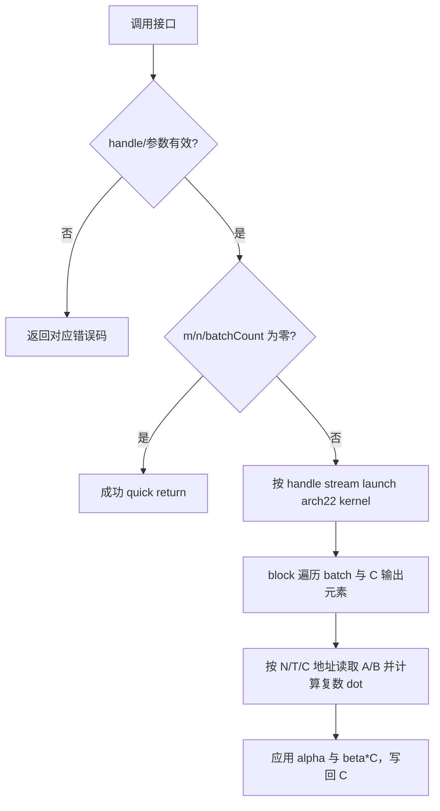

# aclblasCgemmStridedBatched 算子设计方案

## 需求背景（required）

### 需求来源

实现 2026 年 9 月 ops-blas 社区任务「aclblasCgemmStridedBatched 算子开发（A2/A3）」，在 Atlas A2/A3 的 arch22 路径新增单精度复数、列主序、带元素步长 batch 的 GEMM 句柄接口，接口语义对齐 cuBLAS `cublasCgemmStridedBatched`。公开声明位于 `include/cann_ops_blas.h`，实现位于 `blas/gemm_strided_batched/arch22/`。

### 背景介绍

给定 `batchCount` 组矩阵，对每组执行：

$$
C_i = \alpha \, op(A_i) op(B_i) + \beta C_i,
\quad i = 0,\ldots,batchCount-1
$$
`A_i=A+i*strideA`、`B_i=B+i*strideB`、`C_i=C+i*strideC`，stride 以 COMPLEX64 元素计。矩阵列主序；`op` 支持 N、T、C，其中 C 为共轭转置。alpha/beta 为 host 侧复数 scalar，输入输出矩阵为 device 侧 `aclblasComplex`。

## 需求分析（required）

### 算子原型

```cpp
aclblasStatus_t aclblasCgemmStridedBatched(
    aclblasHandle_t handle, aclblasOperation_t transa, aclblasOperation_t transb,
    int m, int n, int k, const aclblasComplex* alpha,
    const aclblasComplex* A, int lda, int64_t strideA,
    const aclblasComplex* B, int ldb, int64_t strideB,
    const aclblasComplex* beta, aclblasComplex* C, int ldc,
    int64_t strideC, int batchCount);
```

| 参数 | 说明 |
| --- | --- |
| handle | 由 ops-blas 创建的句柄，提供异步执行 stream；不可为空。 |
| transa/transb | N、T、C；其他枚举返回 INVALID_VALUE。 |
| m/n/k/batchCount | 非负维度；任一 m/n/batchCount 为 0 时合法 quick return；k=0 时乘积为 0。 |
| alpha/beta | host 侧 COMPLEX64，指针必需。 |
| A/B/C | device 侧 COMPLEX64；A/B 在 alpha 非零且 k>0 时必需，C 必需（输出区）。 |
| lda/ldb/ldc | 列主序 leading dimension，分别满足 transa=N 时 `lda>=max(1,m)`，否则 `max(1,k)`；transb=N 时 `ldb>=max(1,k)`，否则 `max(1,n)`；`ldc>=max(1,m)`。 |
| strideA/B/C | batch 起始偏移，单位为 COMPLEX64 元素；A/B stride=0 允许广播。C batch 重叠属于调用方未定义行为。 |

### 需求拆解

1. 导出 cuBLAS 参数顺序的 CgemmStridedBatched API，并沿用库句柄的 stream。
2. 对维度、转置枚举、leading dimension、host scalars 和参与运算的数据指针做 host 校验。
3. 对每个 batch 严格使用各自 stride；N/T/C 物理地址正确对应列主序矩阵，C 模式对虚部取共轭。
4. 遵循特殊值语义：alpha=0 不读取 A/B；beta=0 不读取旧 C；k=0 退化为 beta*C；同时 alpha/beta 为零时写零。
5. m/n/batchCount 为零时成功返回，异步提交到 handle stream，不在算子内同步。

## 详细设计（required）

### 算子分析

对输出 C 的逻辑坐标 `(row,col)`，N 转置的物理列主序下标为 `col*ld + row`；T 下标为 `row*ld + col`；C 与 T 地址相同，但读取后将虚部取负。A 对应 `(row,p)`，B 对应 `(p,col)`。复乘按 `(ar*br-ai*bi, ar*bi+ai*br)` 累加，最后分别乘以复数 alpha，并在 beta 非零时读取和复乘 C。

stride 用 int64_t 计算元素偏移后再换算为 float 分量索引，每个复数连续存储 real/imag 两个 float。单个输出由一个 AICore block 负责，block 以 `blockIdx, blockNum` 跨步遍历线性化的 batch/m/n 输出，不存在跨 block 写冲突（调用方提供不重叠的 C batch 时）。

### Host 侧设计

- 校验空 handle 返回 `ACLBLAS_STATUS_HANDLE_IS_NULLPTR`；其余非法枚举、负尺寸、空 alpha/beta、非法 ld 和必需矩阵空指针返回 `ACLBLAS_STATUS_INVALID_VALUE`。
- 对合法 no-op 尺寸直接返回 SUCCESS。k=0/alpha=0 时不要求 A/B；beta=0 时不读取 C 旧值，但 C 输出地址仍必须存在。
- 读取 handle 内部 stream 并通过 arch22 launch wrapper 下发 kernel。主机只传递 scalar 值和矩阵/stride 元数据，无临时 device workspace。
- A2/A3 由仓库 SOC 到架构映射选择 arch22；声明置于公共 `cann_ops_blas.h`，使其他产品也可见接口，产品能力由 README 标注。

### Kernel 侧设计

- `cgemm_strided_batched_kernel.cpp` 是 Ascend C AICore kernel，支持运行时 m/n/k、leading dimension、stride、batchCount 与转置标志。
- block 负责若干输出复数，每个输出对 k 维做串行 FP32 复数乘加。T 与 C 地址映射相同，C 在加载时共轭；N 不变换。
- alpha 复数零时跳过 A/B 地址计算与加载；beta 复数零时跳过 C 原值加载；否则按复数乘法累加 beta*C。
- 每个输出只由一个 block 写入。浮点累加顺序固定为递增 p，但不承诺与不同 BLAS 实现逐位相同。
- 当前版本采用通用标量累加以先完成 A2/A3 功能路径和地址语义。它未使用 cube Mmad/分块复用，不能据此宣称达到任务书性能门槛；大矩阵验收前需在 910B3/A3 上测量并继续做 cube 复数分解、L1/L0 tiling 与 epilogue 融合优化。

### 执行流程



### 支持硬件与软件

| 项目 | 支持范围 |
| --- | --- |
| Atlas A2 | 训练/推理系列，arch22；任务指定性能卡 Atlas 800T A2 (910B3) |
| Atlas A3 | 训练/推理系列，arch22 |
| CANN | 任务书要求 CANN 9.1.0 |

### 算子约束

- COMPLEX64 输入输出，列主序；`aclblasComplex` 布局为连续 real/imag float。
- stride 单位是复数元素；strideA/strideB=0 表示只读矩阵广播。C 重叠、A/B/C 互相别名或过小 stride 导致越界均由调用方避免，不做指针范围推断。
- 零维 no-op、k=0、alpha=0 与 beta=0 的行为按任务书要求。
- 运行时异步语义依赖 `aclblasSetStream`；读回结果前调用方同步 stream。

## 可维可测分析

### 精度和性能标准

| 验收项 | 标准 |
| --- | --- |
| 精度 | Netlib CBLAS cgemm 逐 batch golden；实虚分量分别使用 rtol=atol=2^-13，匹配率≥0.99，最大误差≤1e-2 或 32 ULP。 |
| 性能 | Atlas 800T A2 (910B3)，任务书五组 case 的 NPU kernel 平均耗时分别不高于 153.7、2757、10061、36073、143326 us；有效采样至少 10 次。 |
| 异步/边界 | 零维、空指针、非法转置、负维度、ld 下界和 alpha/beta 快路径符合任务书状态码/数据语义。 |

### 测试覆盖

随任务包 `test_cases/` 提供固定随机种子 CSV 生成器、1200 条精度/性能用例及验证指导。应覆盖 N/T/C 的 9 种组合、矩形与边界尺寸、batch/stride/leading dimension padding、A/B 零步长广播、alpha/beta 复数及零值、Inf/NaN、负参数/非法枚举/空指针。五个典型性能 case 覆盖 N/N、N/T、T/N 和 padding。用 CBLAS golden 检查全 C 矩阵；msprof 采集有效 kernel 调用并统计平均耗时，性能结论必须在远端 A2/A3 设备实测后填写。

### 兼容性分析

新增 API 不改变已有 `aclblasCgemm`/`aclblasSgemmStridedBatched` 的原型和实现；新增 arch22 符号通过公共头文件提供。其他架构可编译公共声明，但只有包含 arch22 实现的产品具备此符号实现，因此调用应限定于 Atlas A2/A3。当前实现的主要限制是未做 cube tile 优化，不能视为性能验收完成。
