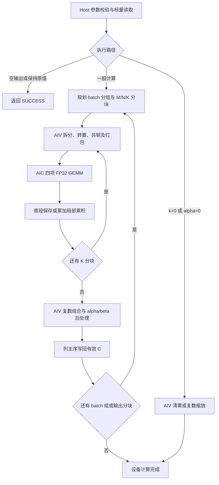

# aclblasCgemmStridedBatched 算子设计文档（Atlas A2/A3）

| 项目 | 内容 |
|---|---|
| 社区任务 | 09-aclblasCgemmStridedBatched-A2A3 |
| 贡献者 | QianYiPan |
| 文档版本 | 1.0，设计评审稿 |
| 编写日期 | 2026-09-23 |
| 开发环境 | CANN 9.1.0、Ascend C、ops-blas、arch22 |
| 目标产品 | Atlas A2、Atlas A3，包含任务指定的 Atlas 800I A2/A3 |
| 指定性能设备 | Atlas 800T A2（910B3） |
| 参考代码版本 | ops-blas `2c9b9b77bda979c25a6b89726614b082e73226fa` |

本文依据[社区任务提交要求](../../../../README.md)和[算子设计文档模板](../../../../resources/design_template.md)编写，用于设计评审。文中的性能数据为验收目标；实现及实测结果随自测报告提交。

## 1. 需求背景

### 1.1 需求来源

本需求来自 CANN 社区 2026 年 9 月 `aclblasCgemmStridedBatched`（Atlas A2/A3）算子开发任务。目标是在 ops-blas 框架下提供单精度复数带步长批量矩阵乘接口，完成 Ascend C 实现、功能与精度验证、性能优化，以及 A2/A3 双平台验收。

算子采用句柄式 BLAS 接口，经 handle 绑定的 stream 直接下发 NPU kernel。输入输出遵循列主序 BLAS 布局，核心功能参考 `cublasCgemmStridedBatched`，边界行为优先保持与 ops-blas 同家族 S 接口一致。

### 1.2 背景介绍

带步长批量 GEMM 对多个相同形状的矩阵乘使用统一参数，各矩阵通过基址和固定 stride 定位。与逐次调用普通 GEMM 相比，接口能够统一处理参数检查、tiling、workspace 和批量调度，适用于批量复数线性代数计算。

参考版本的 `gemm_strided_batched` 家族已提供 arch35 的 `aclblasSgemmStridedBatched`，尚未提供本任务所需的 arch22 复数接口。已有 [S 实现][sgemm-host]可复用接口约定、列主序地址模型、参数检查结构和测试组织；其 arch35 Tensor API kernel 及实数转置处理不能直接用于 A2/A3 复数计算。

arch22 已有复数 BLAS-3 辅助组件，可参考复数拆分、FP32 Matmul、分块和后处理方式。本算子需要补充通用矩形矩阵、N/T/C 九种组合、stride 广播和设备端 batch 调度，并按目标 SDK 验证 tiling 与资源约束。

## 2. 需求分析

### 2.1 需求描述

对 `b=0,...,batchCount-1`，执行：

```text
A_b = A + b * strideA
B_b = B + b * strideB
C_b = C + b * strideC
C_b_new = alpha * op(A_b) * op(B_b) + beta * C_b_old
```

其中 `op(X)` 为不转置、转置或共轭转置。所有 batch 共用 m/n/k、转置模式、前导维、stride 和 alpha/beta，不同 batch 之间没有归约。

### 2.2 需求拆解

| 类别 | 需求 | 实现与验证安排 |
|---|---|---|
| 数据类型 | 输入、输出和标量为 COMPLEX64 | 每个元素由两个 FP32 分量组成；复数拆分与 FP32 计算 |
| 运算模式 | N/T/C 九种组合，通用复数 alpha/beta | Pack 阶段完成转置/共轭，后处理完成复数标量运算 |
| 存储布局 | 列主序、合法 ld padding、非紧凑 batch stride | 显式地址映射，仅访问和写回有效元素 |
| 输入共享 | A/B 的 stride 可分别或同时为零 | 共用只读输入，减少重复打包 |
| 边界行为 | 空输出、零 K、零标量、非法参数及空指针 | Host 分支和独立状态码测试 |
| 执行方式 | handle stream 异步下发 | 分阶段 kernel 在同一 stream 顺序执行，管理临时缓冲生命周期 |
| 泛化能力 | m/n/k/batchCount 为运行时参数 | 支持尾块、非方阵、batch 分组及 M/N/K 分块 |
| 精度 | Netlib `cblas_cgemm` 单标杆、COMPLEX64 混合容差 | 实部/虚部分别校验，特殊值和内存保护区单独检查 |
| 性能 | 任务给定的 200 条性能用例 | 5 次以上 warmup、20 次有效采样，统计完整调用 |
| 平台与交付 | A2/A3 均验收 | 分平台构建、测试、报告、日志与复现说明 |

### 2.3 规格一致性说明

任务材料存在部分互相不一致的描述。本设计按现有 S 接口及其公共测试框架确定下列实现口径，列入设计评审，作为接口与测试的一致依据；以下说明不代表任务书正文已经修订。

| 项目 | 本设计采用的口径 | 依据及与任务材料的关系 |
|---|---|---|
| k=0 | 执行 beta-only：beta=0 清零、beta=1 保持、其余值缩放 C | 对齐 S Host、golden 和 k0 用例；区别于任务书部分章节的无条件 no-op 描述 |
| A/B 广播 | 支持 strideA/B=0，允许单侧和双侧共享 | 对齐 S 地址模型和广播测试；采用任务参数表与用例的广播要求 |
| 输出重叠 | 零 strideC 不增加专门的 INVALID_VALUE；非空多 batch 共享 C 不保证数值结果 | 对齐 S README 的未定义语义；不采用任务参数表中“C 合法广播”的描述 |
| stride 范围与类型 | 三个 stride 均为非负 `int64_t`；负值返回 INVALID_VALUE | 对齐 S Host 与公共头；任务原型中的 `long long` 改为明确的 64 位类型 |
| 指针条件 | 按第 3.2.1 节校验；alpha=0 不自动豁免 k>0 时的空 A/B | 区分“不读取矩阵内容”和“允许空指针”，与 S 的检查顺序一致 |
| 代码与测试布局 | 实现、测试均置于 `gemm_strided_batched/arch22/` | 对齐现有 family/arch 结构，并为 C 增加独立测试目标 |
| 精度上限 | 每个有限分量采用 max(1e-2,32×ULP)，实/虚分别统计 | 复用公共 MixedToleranceStrategy；COMPLEX64 的 atol/rtol 显式设置为 2^-13 |
| 验收范围 | A2/A3 均验收；至少 5 次 warmup、20 次有效采样 | 覆盖任务双平台和有效采样大于 10 次的要求 |
| 性能 case 5 | ld=4352、stride=4096×4352 | 保持随任务提供的 CSV 布局，在报告中记录完整参数 |
| 内存 | 不设额外数值门槛，仍提交占用与峰值报告 | 同时满足任务的内存说明和交付清单 |

S 当前按 batch 在同一 stream 串行下发，零 strideC 可能表现为同一 C 的顺序更新；该行为不属于其受保证的输出契约。本设计对独立输出采用设备 batch 并行，不定义跨 batch 累加或“最后一批胜出”语义。

## 3. 详细设计

### 3.1 算子分析

#### 3.1.1 数学公式

令 `X=op(A_b)=Xr+iXi`、`Y=op(B_b)=Yr+iYi`，采用四项实数 GEMM：

```text
P0 = Xr * Yr                 P1 = Xi * Yi
P2 = Xr * Yi                 P3 = Xi * Yr
Zr = P0 - P1                Zi = P2 + P3
```

设 `alpha=a+ib`、`beta=c+id`、`C_old=u+iv`，后处理为：

```text
C_new.real = a*Zr - b*Zi + c*u - d*v
C_new.imag = a*Zi + b*Zr + c*v + d*u
```

beta=0 时省略旧 C 的加载；k=0 或 alpha=0 时跳过矩阵乘。对零和一采用分量精确比较：零为 real=imag=0，一为 real=1、imag=0。

#### 3.1.2 支持数据类型与接口

```cpp
aclblasStatus_t aclblasCgemmStridedBatched(
    aclblasHandle_t handle,
    aclblasOperation_t transa, aclblasOperation_t transb,
    int m, int n, int k,
    const aclblasComplex* alpha,
    const aclblasComplex* A, int lda, int64_t strideA,
    const aclblasComplex* B, int ldb, int64_t strideB,
    const aclblasComplex* beta,
    aclblasComplex* C, int ldc, int64_t strideC,
    int batchCount);
```

| 参数 | 类型/位置 | 含义 |
|---|---|---|
| handle | aclblasHandle_t，Host | 库句柄，携带 stream 与 workspace |
| transa/transb | aclblasOperation_t，Host | ACLBLAS_OP_N/T/C |
| m/n/k、batchCount | int，Host | 输出尺寸、归约维和批次数，均不小于零 |
| alpha/beta | const aclblasComplex*，Host | 所有 batch 共用的复数标量指针 |
| A/B | const aclblasComplex*，Device | 列主序输入，指向逻辑 batch 0 |
| C | aclblasComplex*，Device | 列主序输出；beta≠0 时读取旧值 |
| lda/ldb/ldc | int，Host | 物理矩阵的列间跨度 |
| strideA/B/C | int64_t，Host | 相邻 batch 起点偏移，单位为 complex64 元素 |

沿用库内 `aclblasComplex` 的 real/imag 布局，一个元素为 8 字节；通过编译期检查确认尺寸与字段偏移。公开声明、定义、golden 和 wrapper 统一使用 `int64_t`，避免与平台相关的 `long long` typedef 混用。alpha/beta 在 Host 校验并按值传入 launch 参数。

#### 3.1.3 支持形状与地址映射

`op(A_b)` 为 m×k，`op(B_b)` 为 k×n，C_b 为 m×n。支持方阵、矩形、padding、尾块及任意合法运行时尺寸；可见测试中的最大尺寸不作为公共接口硬上限。

| 对象 | 物理形状 | 前导维约束 |
|---|---|---|
| A，N | m×k | lda≥max(1,m) |
| A，T/C | k×m | lda≥max(1,k) |
| B，N | k×n | ldb≥max(1,k) |
| B，T/C | n×k | ldb≥max(1,n) |
| C | m×n | ldc≥max(1,m) |

对输出坐标 `(r,c)` 和归约坐标 p：

| 读取/写回 | complex64 元素偏移 | 附加处理 |
|---|---|---|
| X(r,p)，A/N | b×strideA+r+p×lda | 无 |
| X(r,p)，A/T 或 C | b×strideA+p+r×lda | C 模式虚部取负 |
| Y(p,c)，B/N | b×strideB+p+c×ldb | 无 |
| Y(p,c)，B/T 或 C | b×strideB+c+p×ldb | C 模式虚部取负 |
| C(r,c) | b×strideC+r+c×ldc | 仅写有效 m×n 区域 |

物理矩阵的有效地址跨度为 `(cols-1)*ld+rows`。调用方保证分配足够且输出互不重叠；Host 对偏移乘法、字节换算和 workspace 累加进行溢出检查。batchCount=1 时仍校验 stride 非负。

### 3.2 算子实现

整体采用 AIV Pack、AIC FP32 GEMM、AIV Epilogue 三阶段结构。阶段间使用同一 stream 的提交顺序，阶段内使用事件、队列和局部双缓冲管理搬运与计算依赖。



图中的保持原值分支仍执行指针检查；`k=0、beta=0、C=nullptr` 的兼容特例在 Host 返回，不启动清零 kernel。

#### 3.2.1 Host 侧设计

**参数检查与快速分支。** 检查顺序与 S 接口保持一致：

| 顺序 | 条件/操作 | 行为 |
|---:|---|---|
| 1 | handle 为空 | 返回 ACLBLAS_STATUS_HANDLE_IS_NULLPTR |
| 2 | 非法转置枚举，或 m/n/k/batchCount 为负 | 返回 ACLBLAS_STATUS_INVALID_VALUE |
| 3 | lda/ldb/ldc 不满足约束 | 返回 ACLBLAS_STATUS_INVALID_VALUE |
| 4 | 任一 stride 为负 | 返回 ACLBLAS_STATUS_INVALID_VALUE |
| 5 | alpha/beta 指针为空 | 返回 ACLBLAS_STATUS_INVALID_VALUE |
| 6 | m=0、n=0 或 batchCount=0 | 返回 SUCCESS，不读取标量值或矩阵，不启动计算 |
| 7 | k>0，A/B 为空 | 返回 INVALID_VALUE，包括 alpha=0 场景 |
| 8 | 读取 beta；C 为空且 k>0 或 beta≠0 | 条件为 C==nullptr 且 (k>0 或 beta≠0)，返回 INVALID_VALUE |
| 9 | 读取 alpha；k=0 或 alpha=0 | 分派 beta-only；其他输入进入 GEMM 规划 |

beta-only 路径：beta=1 直接返回；beta=0 且 C 非空时只清零有效元素；其他 beta 启动复数 scale。保留 S 的 `k=0、beta=0、C=nullptr` 特例，返回 SUCCESS 且无输出写入，该特例不扩展到 k>0。k=0 时 A/B 可空；k=0、beta=1 时 C 仍须非空。

偏移不可表示返回 INVALID_VALUE；workspace 分配失败返回 ALLOC_FAILED；平台查询和下发错误按库约定映射为 INTERNAL_ERROR 或 EXECUTION_FAILED。SUCCESS 表示检查及异步提交成功，设备完成与异步错误由调用方同步确认。

**分核策略。** 将 batch、输出 tile 和实数乘积编号组成设备任务空间。设组内批数为 q、输出分块尺寸为 mp×np、tile 为 BM×BN：

```text
TM = ceil(mp/BM), TN = ceil(np/BN), T = TM*TN
J = 4*q*T
for taskId = coreId; taskId < J; taskId += activeAic:
    tileId = taskId % T
    batchId = (taskId/T) % q
    product = taskId/(q*T)
    tileM = tileId/TN
    tileN = tileId%TN
```

任务编号采用足够宽的整数；每个乘积 tile 由唯一核心负责。根据实际平台核数和任务数选择 activeAic，首版不做跨核 Split-K。AIV 按打包片段和有效输出区分核，尾部使用有效长度控制。

**分块与内存策略。** tile 初始候选为 128×128×64，并比较 64×64、64×128 等形状。Host 查询目标平台的核心数量、UB/L1 等资源，结合 Matmul tiling 合法性、对齐、双缓冲及中间数据空间选型；不直接复制 arch35 的容量常量。

设 padded 分块尺寸为 mp/kp/np，qa/qb 在对应输入广播时取 1，否则取 q，完整 K 路径的 scratch 预算为：

```text
W_packA = 8 * qa * mp * kp
W_packB = 8 * qb * kp * np
W_prod  = 16 * q * mp * np
W_total = 各缓冲区分别对齐后的总和 + 必要 SDK/系统空间
```

无广播时，4096³ 单批约需 512 MiB，四批约 2 GiB，尚未计入额外空间。因此采用有界规划：先减少组内 q，再切 M/N 输出分块，必要时切 K。最小合法块仍不能容纳时返回 workspace/分配失败，不截断计算范围。

参考版本 handle 默认 workspace 为 32 MiB，库自动扩容上限为 2 GiB。首版使用已有容量分块，避免计算路径调用会同步 stream 的自动扩容。用户可提前提供 workspace；性能报告同时记录容量配置，并验证默认调用配置。

**K 分块累加。** 保留 P0～P3 累加平面；每段产生 Q0～Q3，首段赋值、后续累加，全部 K 段结束后执行一次 epilogue。该通用路径的乘积缓冲预算增至 `32*q*mp*np` 字节。beta 只在最终后处理应用一次，不对每段重复缩放 C。

**TilingKey/路径规划。** 本接口为 kernel 直调，不依赖图算子注册的 TilingKey；Host 使用内部路径编号与模板参数完成等价分流：

| 路径 | 选择条件 | 下发内容 |
|---|---|---|
| NoOp | 空输出，或校验后的 beta-only 且 beta=1，以及空 C 兼容特例 | 无计算 kernel |
| Zero | beta-only、beta=0、C 非空 | 有效区清零 |
| Scale | beta-only、beta 非零非一 | 复数缩放 |
| PackedGemm | 一般非空输入 | Pack、GEMM、必要的 K 累加、Epilogue |
| SmallVector（候选） | 小矩阵，经实测确定适用范围 | 直接 AIV 复数乘加与后处理 |

TilingData 记录原始尺寸/ld/stride/转置、batch 与 M/N/K 分块范围、packed 布局、workspace offset、tile/核数、标量四分量和首末 K 段标志。Host/device 共享结构定义并检查字段宽度与对齐；原始地址偏移与 packed 局部偏移分别保存。

#### 3.2.2 Kernel 侧设计

**Pack。** 按物理连续片段从 GM 搬入 UB，拆分 real/imag，在 UB 完成必要的转置和共轭，输出独立 row-major FP32 平面：

```text
packedX[r*packedK+p] = X(r,p) 的实部或虚部
packedY[p*packedN+c] = Y(p,c) 的实部或虚部
```

内部对齐区域写零，仅从用户输入读取有效元素。A/B 零 stride 时每组只打包一份对应输入。现有 arch22 helper 的 packed column-major 输出需适配，不能直接视为上述布局；不缓存跨 API 调用的输入内容。

**GEMM。** 使用 FP32 输入、FP32 乘法及累加完成四项实数乘积，不默认降低为 half/BF16/HF32。任务按前述统一编号分配到 AIC；归约在各 tile 内完成。具体 FP32 模式与 Matmul API 在 CANN 9.1.0 环境编译并验证。

**Epilogue。** 将四项乘积读入 UB，计算 Zr/Zi，再计算复数 alpha/beta，按列主序写回 C。beta≠0 时在覆盖前取得旧 C 的两个分量；beta=0 不加载旧 C。M/N 尾块仅写有效区，对非对齐基址、ld 和 stride 使用精确范围写回，保护列 padding 和相邻 batch。

**Zero/Scale。** 按 batch×有效元素分核，支持复数 beta，只处理 m×n 有效区。清零直接写零，避免旧 C 中的 NaN/Inf 经乘零传播。共享物理搬运块的尾部须分配唯一写入者，或采用经过验证的串行尾部写回。

**同步与生命周期。** Pack、GEMM、累加、Epilogue 和下一组输入复用按同一 stream 顺序提交，计算路径不进行逐 batch 的 Host 同步或 Device 标量回读。tiling/标量使用按值 launch 参数或具备明确异步生命周期的存储；workspace 在最后使用它的任务完成前保持有效。不同 handle 使用独立 workspace，不额外承诺同一 handle 的多线程、多 stream 并发重入。

#### 3.2.3 性能优化与数值策略

| 方向 | 优化方案 | 验证重点 |
|---|---|---|
| 小矩阵、多 batch | 合并 batch/product 下发，评估直接 AIV 路径 | launch 开销及分流阈值 |
| 中大矩阵 | tile、核数、K 块与双缓冲调优 | 搬运/计算重叠、核利用率及资源占用 |
| A/B 广播 | 组内输入只打包一次 | 减少转换流量，不引入跨调用缓存 |
| workspace | 在容量约束下选择 q 和 M/N/K 分块 | 临时空间与重复打包开销的平衡 |
| 转置与 padding | UB 内批量重排、共轭融合、尾部专门处理 | 非方阵和非对齐访问正确性 |
| 标量后处理 | beta=0 省去旧 C 读取，常用标量适度特化 | 复数与特殊值语义一致 |

四项独立 GEMM 在抵消场景可能放大误差，需提前验证大 K、近零结果和极值。必要时评估两次 2K GEMM：`U=[Xr|Xi]`、`Vr=[Yr;-Yi]`、`Vi=[Yi;Yr]`，计算 `Zr=U*Vr`、`Zi=U*Vi`。该方法不减少乘法量，属于累加顺序与缓冲方案的备选；2K 超出单次 Matmul 范围时继续分块。首版不采用三实乘 Gauss 算法，也不以放宽验收阈值替代数值验证。

#### 3.2.4 工程组织

实现使用 ops-blas 现有构建与架构筛选机制，计划新增或修改：

```text
ops-blas/
├── include/cann_ops_blas.h
├── blas/gemm_strided_batched/
│   ├── README.md
│   └── arch22/
│       ├── cgemm_strided_batched_host.cpp
│       ├── cgemm_strided_batched_kernel.cpp
│       ├── cgemm_strided_batched_kernel.h
│       └── cgemm_strided_batched_tiling_data.h
└── test/gemm_strided_batched/
    ├── CMakeLists.txt
    ├── README.md
    ├── cgemm_strided_batched_param.h
    ├── cgemm_strided_batched_golden.h
    └── arch22/
        ├── cgemm_strided_batched_test.cpp
        ├── cgemm_strided_batched_npu_wrapper.h
        └── cgemm_strided_batched_test.csv
```

S 的 arch35 实现和测试保持独立；family CMake 按架构注册 `cgemm_strided_batched_test`。任务原始 CSV 在安装时映射为 C 测试同名 CSV，保持内容与 case ID 可追溯，并同步包装脚本中的目标、路径和设备参数。本次设计文档按社区要求存放在贡献者 `docs/design.md`；后续算子代码按任务指定的 ops-blas kernel 直调工程组织。

### 3.3 支持硬件

| 目标硬件 | 设计覆盖 | 验证安排 |
|---|---|---|
| Atlas A2 系列，含任务指定的 Atlas 800I A2 | 是，arch22 | 功能、精度、异步、内存及性能数据采集 |
| Atlas 800T A2（910B3） | 是，arch22 | 指定性能门槛判定设备 |
| Atlas A3 系列，含任务指定的 Atlas 800I A3 | 是，arch22 | 独立构建和完整自验，单独形成报告 |

两平台均需验收。具体 SOC 编译名称及资源信息由目标环境核实，测试结果在交付报告中记录。

### 3.4 算子约束限制

1. 仅提供 COMPLEX64 StridedBatched 接口，不增加指针数组 Batched、Grouped 或 Ex 接口。
2. A/B/C 为列主序；alpha/beta 为 Host 指针，矩阵为 Device 指针，均由调用方保证相应访问期内有效。
3. 支持 A/B 零 stride 只读共享；调用方保证非空批次的有效 C 区域互不重叠，不支持 C 与 A/B 别名。
4. 不对调用方显存分配范围或输出重叠做完整运行时检测；检查参数合法性及实际访问所需的整数表示范围。
5. 不承诺逐位确定性；所有分块及优化路径须满足统一精度规则。
6. 性能和支持范围以 A2/A3 的验收证据为准，其他产品不在本任务范围内。

## 4. 可维可测分析

### 4.1 精度标准/性能标准

| 验收标准 | 描述 | 标准来源 |
|---|---|---|
| 功能与状态码 | 完成原始 1000 条精度/功能用例及补充测试，逐条核对结果和状态码 | 任务书、配套 CSV；第 2.3 节语义说明 |
| 精度 | Netlib `cblas_cgemm` 逐 batch；实/虚分别满足 atol=rtol=2^-13、匹配率≥0.99 和逐元素误差上限 | 任务书 COMPLEX64 表；ops-blas 公共 MixedToleranceStrategy |
| 性能 | 910B3 上满足五个典型 case 门槛及其余 195 条 PF 基线要求 | 任务书 §3.3、配套 `gpu_baseline.csv` |
| 平台覆盖 | A2/A3 各自完成构建、功能、精度、异步、内存及性能数据采集 | 任务验收范围 |
| 内存与完整性 | 记录输入输出、workspace 和峰值占用；保护 padding、间隙及邻接输出 | 任务交付要求、算子地址约束；无额外内存数值门槛 |

#### 4.1.1 Golden 与有限值判定

记录实际链接的 Netlib BLAS 版本、路径和构建方式。一般计算调用列主序 `cblas_cgemm`，逐 batch 使用真实 ld/stride，NPU 和 golden 从同一份 C 初值出发。k=0 或 alpha=0 显式执行 beta-only，beta=0 写零、beta=1 保持、其余 beta 复数缩放；非法参数和空指针由独立契约层校验，不传给 cblas。

仅提取各 batch 的 m×n 有效输出，将实部、虚部分别统计。对于每个有限 FP32 分量：

```text
diff = abs(double(actual) - double(golden))
matched = diff <= 2^-13 + 2^-13 * abs(golden)
limit = max(1e-2, 32 * ULP_FP32(golden))

实部 matched_ratio >= 0.99，且每个实部分量 diff <= limit
虚部 matched_ratio >= 0.99，且每个虚部分量 diff <= limit

ULP_FP32(0) = 2^-149
ULP_FP32(g != 0) = 2^(max(floor(log2(abs(g))), -126) - 23)
```

复用[公共精度框架][verify]的逐元素 ULP 算法，显式配置 rtol/atol=2^-13、fixedLimit=1e-2、mantissaBits=23、emin=-126。参考版本没有 COMPLEX64 mixed 默认配置，不能通过传入该枚举使用其他类型的默认值；也不使用 S 的 FP32 默认 rtol/atol 代替本任务阈值。

误差上限对每个分量独立检查，不将全局最大误差与全局最大 ULP 比较。报告输出整体及逐 batch 的匹配率、最大绝对误差、上限违规数量和最差位置；padding 与 batch 间空隙不计入匹配率，另作严格完整性检查。

#### 4.1.2 非有限值与数值风险

先对 real/imag 独立分类：同号 Inf、对应 NaN 可按 golden 分类匹配；有限值与非有限值不一致、Inf 符号不一致或 NaN 分类不一致均判失败，不计入可容忍的 1% 数值误差。有限分量为空时，相应数值指标标记不适用，仍执行全部分类检查。

重点验证大 K、强抵消、极大/极小数、非正规数、一般复数 alpha/beta，以及 NaN/Inf 传播。复数拆分表达式与 Netlib 的运算顺序不同，发现异常值分类或误差差异时分析计算顺序并修正实现，所有优化路径使用同一判定标准。

### 4.2 功能与测试工程

测试链路为：CSV 解析 → 安全构造数据 → Host/Device 缓冲准备 → 调用算子 → 同步检查 → golden 与状态码校验 → 精度/保护区检查 → 逐条结果及汇总。

原始精度/功能清单共 1000 条，其中 981 条预期 SUCCESS、18 条 INVALID_VALUE、1 条 HANDLE_IS_NULLPTR；性能清单为 200 条 PF。保存原始文件哈希、case ID 和参数，补充用例单列。对第 2.3 节涉及的语义差异记录处理依据，保持原始附件可追溯。

| 测试类别 | 覆盖内容 |
|---|---|
| 形状与转置 | 九种 N/T/C 组合；m/n/k 两两不同；非零虚部与共轭符号；非方阵与尾块 |
| 地址与广播 | ld padding、非紧凑 stride、基址偏移、非对齐访问、A/B 单/双广播 |
| batch 与分块 | batch=1、质数、超过核数、末组不足 q；q 与 M/N/K 分块切换 |
| 空操作和标量 | m/n/batch=0；k=0；alpha=0；beta=0/1/一般复数；清零和保持原值 |
| 指针及错误码 | 空 handle/标量/矩阵、负尺寸、非法枚举/ld/stride、整数溢出；第 3.2.1 节各组合 |
| 不读取语义 | alpha=0 时非空 A/B 含 NaN/Inf；beta=0 时旧 C 含 NaN/Inf |
| 内存保护 | 有效区前后哨兵、列尾 padding、batch 间隙、邻接但不重叠的输出块 |
| 数值压力 | 大 K、相消、极值、非正规数、非有限数及随机复数标量 |
| 异步与资源 | 非默认 stream、先写后算、连续调用、不同形状交替、独立 handle、workspace 不足 |

随机数据包含均匀/正态各 50%，实虚部独立生成，并记录种子。负参数用例在构造缓冲前采取安全分配策略，避免负 stride 或负尺寸引起测试端越界。多 batch 零 strideC 不设指定数值 golden；其未定义结果不作为精度通过条件。

补齐复数 CSV 参数解析、golden 和 verifier 配置，保留 S 测试独立目标。包装脚本检查进程退出码、预期/实际 case 数、重复与漏跑、超时和零用例，异常均返回失败并保留 stdout/stderr。

测试设备与编译配置保持一致：使用编译期 TEST_DEVICE_ID 时，将 `--device` 传递到构建入口；`--skip-build` 时核对已有二进制的设备配置，不一致则要求重建。异步测试直接调用绑定 stream 的接口，功能 wrapper 的同步不作为算子自身同步行为。

### 4.3 性能验证方案

#### 4.3.1 典型用例与门槛

| case | batchCount | m=n=k | transa/transb | ld/stride 布局 | 910B3 平均耗时上限（μs） |
|---:|---:|---:|---|---|---:|
| 1 | 8 | 256 | N/N | 紧凑 | 153.7 |
| 2 | 32 | 512 | N/N | 紧凑 | 2757 |
| 3 | 16 | 1024 | N/T | 紧凑 | 10061 |
| 4 | 8 | 2048 | T/N | lda/ldb/ldc=2056，stride=2048×2056 | 36073 |
| 5 | 4 | 4096 | N/N | lda/ldb/ldc=4352，stride=4096×4352 | 143326 |

同时验证其余 195 条 PF。配套基线 `gpu_ms` 的单位为毫秒，比较式为 `NPU_us <= gpu_ms*1000/0.8`。前五项基线换算值为 153.7075、2756.875、10060.9625、36072.75、143326.25 μs；报告同时记录任务表和 CSV 换算门槛，并核对两者。

配套 GPU 基线未包含设备型号、软件版本、原始采样及完整 ld/stride 的证明材料。报告保留该来源限制，记录 NPU 的实际完整布局；基线复测或更换时单独保存版本及原因。

#### 4.3.2 计时范围

1. 固定设备、CANN/驱动、代码版本、编译选项、workspace 配置及 case manifest。
2. 每个 case 至少 5 次 warmup、20 次完整有效调用，核实 msprof 的实际采样与重放次数。
3. 一次调用包含全部 Pack、四项 GEMM、K 累加、Epilogue、batch 组和 M/N/K 分块。按完整调用聚合各阶段后取平均，不对 kernel 明细直接混合求平均。
4. 单独记录 stream 事件覆盖的设备调用时间及 Host 调用时间，用于观察 launch 间隙、分配或同步开销。后续若引入并行重叠，按时间区间统计，避免重复累加。
5. golden、外部 H2D/D2H 和测试数据准备不计入 kernel 耗时。beta≠0 的精度验证保持 C 初值一致；性能重复中的 C 恢复操作单独标记。
6. 输出有效次数、平均值、最小值、波动、GPU 基线、门槛和结论，保留完整 profiling 明细。采样失败或无法对应到完整调用时，不生成通过结论。

### 4.4 内存、平台与交付验证

分别记录用户 A/B/C、库初始 workspace、实际峰值 scratch、SDK 系统空间和 Host 测试内存，通过分配账本及设备工具核对。测试缓冲复用、连续调用、分配失败、用户 workspace 不足和 handle 销毁后的释放；不设置任务未规定的额外内存门槛。

| 验收项 | A2 | A3 |
|---|---|---|
| 编译、接口、测试工程 | 须通过 | 须通过 |
| 1000 条功能/精度及补充测试 | 须完整执行 | 须完整执行 |
| 异步、尾部、workspace 和内存完整性 | 须验证 | 须验证 |
| 200 条 PF 与内存数据 | 完整采集；910B3 判定指定性能门槛 | 完整采集与报告，不另造未给定的 A3 专属门槛 |
| 设备、软件、提交号、日志、截图 | 分平台记录 | 分平台记录 |

上表为验收计划。两平台分别形成证据，不以共用 arch22 或单平台通过替代双平台验证。

后续交付包括设计评审 PR、算子与测试代码、API/使用说明、构建与复现步骤、个人仓与 ops-blas 合入 PR，以及任务要求的报告和原始日志：

```text
task_submission/
├── 1 自验证步骤说明.md
├── 2.1 精度自验证报告.xlsx
├── 2.2 精度自验证日志.log
├── 3.1 性能自验证报告.xlsx
├── 3.2 性能自验证日志.log
├── 4.1 内存自验证报告.xlsx
└── 4.2 内存自验证日志.log
```

复现说明包含硬件/SOC、CANN/驱动、代码及基线版本、Netlib 来源、完整命令、设备选择、精度规则、计时范围和截图位置。按任务流程向个人仓同步交付件，邀请 Ascend-CANN 作为开发者，并提交社区任务验收申请。

### 4.5 兼容性分析

本设计新增 C 接口，不改变已有 S 接口及 arch35 kernel。公共头新增声明，源码按 arch22 筛选；S/C 的参数、golden、CSV 和测试目标独立。共享辅助代码如需修改，需回归已有依赖算子；复数专属精度配置不修改其他类型默认值。

接口语义与 S 家族保持一致的内容包括列主序、非负 64 位 stride、A/B 广播、beta-only 分支和指针校验顺序。复数 C 模式必须执行共轭，不能沿用实数 T/C 等价处理。与任务材料的差异集中在第 2.3 节，可在评审中独立核对。

cuBLAS 当前文档要求非零 stride 且输出不重叠；本接口的 A/B 零 stride 属于明确扩展。k=0 的 beta*C 与 ROCm 的检查/缩放实现一致，但空指针检查遵循本接口，不承诺与 cuBLAS/ROCm 所有状态码和 quick-return 条件完全相同。

所有内部阶段沿 handle stream 异步执行，用户缓冲区与 workspace 的生命周期遵循库约定。参考库的 workspace 扩容可能同步 stream，首版以已有容量分块；若后续引入扩容路径，将其同步边界纳入接口说明和测试。

### 4.6 风险与验证安排

| 风险 | 控制措施与完成依据 |
|---|---|
| 四项实乘抵消误差、K 分块舍入 | 前置大 K/相消测试；必要时比较两次 2K 路径，完整回归统一阈值 |
| SDK API、FP32 模式及资源合法性 | 在 CANN 9.1.0 对 A2/A3 分别编译和执行，记录 tile 及资源配置 |
| 非对齐写回影响邻接区域 | padding/哨兵检查，精确范围写回及尾部唯一写入者 |
| 多阶段 launch 与重复打包开销 | 按阶段 profiling，调整 batch/product 合并、分组与分块 |
| NaN/Inf 传播与 Netlib 差异 | 按分量分类测试，核对运算顺序，禁止以容差掩盖分类错误 |
| 基线或用例信息不完整 | 保存原始文件、哈希和参数映射，差异及缺失证据进入报告 |

实现按接口/测试工程接入、功能基线、数值与内存泛化、性能优化、双平台验收推进。当前文档处于设计阶段，CANN 编译、NPU 精度与性能结果在后续报告中提供。

### 4.7 参考资料

- [社区任务 README](../../../../README.md)及[设计模板](../../../../resources/design_template.md)。
- 2026 年 9 月社区任务书 `aclblasCgemmStridedBatched_A2A3_task_doc.md`，以及随任务提供的测试 README、`gemm_strided_batched_test.csv`、`gpu_baseline.csv`、`gen_csv.py` 和 `verify_accuracy.py`。
- ops-blas 固定提交 `2c9b9b77bda979c25a6b89726614b082e73226fa`：[公共接口][blas-api]、[S 算子说明][sgemm-readme]、[S Host][sgemm-host]、[S 测试工程][sgemm-tests]。
- 同一提交的 [arch22 复数辅助组件][complex-helper]、[handle/workspace][workspace]及[公共精度框架][verify]。
- [cuBLAS StridedBatched 接口说明](https://docs.nvidia.com/cuda/cublas/index.html#cublas-t-gemmstridedbatched)。
- [rocBLAS typed GEMM 参数检查](https://github.com/ROCm/rocm-libraries/blob/bf56af2e53b7ba22b4ac86e8d8cd25df8040b0f2/projects/rocblas/library/src/blas3/rocblas_gemm.hpp#L68-L140)及[beta-only 分派](https://github.com/ROCm/rocm-libraries/blob/bf56af2e53b7ba22b4ac86e8d8cd25df8040b0f2/projects/rocblas/library/src/blas3/Tensile/gemm_templates.cpp#L224-L227)。
- [Netlib CGEMM 参考实现](https://www.netlib.org/blas/cgemm.f)。

[blas-api]: https://gitcode.com/cann/ops-blas/blob/2c9b9b77bda979c25a6b89726614b082e73226fa/include/cann_ops_blas.h
[sgemm-readme]: https://gitcode.com/cann/ops-blas/blob/2c9b9b77bda979c25a6b89726614b082e73226fa/blas/gemm_strided_batched/README.md
[sgemm-host]: https://gitcode.com/cann/ops-blas/blob/2c9b9b77bda979c25a6b89726614b082e73226fa/blas/gemm_strided_batched/arch35/gemm_strided_batched_host.cpp
[sgemm-tests]: https://gitcode.com/cann/ops-blas/tree/2c9b9b77bda979c25a6b89726614b082e73226fa/test/gemm_strided_batched
[complex-helper]: https://gitcode.com/cann/ops-blas/blob/2c9b9b77bda979c25a6b89726614b082e73226fa/blas/common/helper/complex_blas3_arch22.h
[workspace]: https://gitcode.com/cann/ops-blas/blob/2c9b9b77bda979c25a6b89726614b082e73226fa/blas/common/helper/aclblas_handle_internal.h
[verify]: https://gitcode.com/cann/ops-blas/blob/2c9b9b77bda979c25a6b89726614b082e73226fa/test/frame/verify.h
