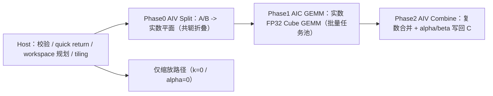

# aclblasCgemmStridedBatched 算子设计文档（Atlas A2/A3）

| 版本 | 日期 | 作者 | 说明 |
| --- | --- | --- | --- |
| v1.0 | 2026-09-24 | gcw_FGO3DNh6 | 面向 Atlas A2/A3（arch22）的带步长批量单精度复数矩阵乘算子设计 |

> 对标接口：cuBLAS `cublasCgemmStridedBatched`
> 目标算子目录：`blas/gemm_strided_batched/arch22/`（任务书 §5）
> 目标测试目录：`test/gemm_strided_batched/cgemm_strided_batched/arch22/`（任务书 §5）
> 开发环境：CANN 9.1.0 + ops-blas 工程框架，Ascend C kernel 直调

---

# 需求背景（required）

## 需求来源

9 月社区任务要求在昇腾 Atlas A2/A3（arch22）上，基于 Ascend C（kernel 直调）、使用 ops-blas 工程框架，开发单精度复数（COMPLEX64 / `aclblasComplex`）带步长批量矩阵乘算子 `aclblasCgemmStridedBatched`，对齐 cuBLAS `cublasCgemmStridedBatched` 语义，完成设计、开发、测试全流程，验收通过后向 [ops-blas](https://gitcode.com/cann/ops-blas) 提交 PR。

## 背景介绍

### 算子目标

对一批规格一致、地址按固定步长分布的复数矩阵，逐 batch 执行

$$C_i = \alpha\,op(A_i)\,op(B_i) + \beta\,C_i,\qquad i=0,1,\ldots,batchCount-1$$

其中 $A_i = A + i\cdot strideA$、$B_i = B + i\cdot strideB$、$C_i = C + i\cdot strideC$。所有 batch 共享同一组 `m/n/k/alpha/beta/transa/transb`；矩阵列主序；`stride` 以复数元素个数计；`strideA/strideB=0` 表示该输入在 batch 间广播复用；`op(X)` 由 `N/T/C` 决定原矩阵、转置、共轭转置。

### 算子现状分析

| 项 | 现状 |
| --- | --- |
| `aclblasCgemmStridedBatched` | 仓内不存在（头文件、实现、测试均无），需新增 |
| `gemm_strided_batched` | 仅 arch35，且为实数 FP32 实现 |
| arch22 复数 BLAS-3 | 已有成熟三相流水引擎（Split → 实数 Cube GEMM → Combine），被 csymm/cherk/csyrk 等已交付算子复用 |
| arch22 strided/批量复数 GEMM | 无先例，本算子为该能力组合在 arch22 上的首次落地 |

可复用的仓内基础：arch22 复数 BLAS-3 公共引擎与同族算子的 host 编排范式（校验顺序、workspace 规划、分相 launch）；arch35 strided 系列的接口语义与负向行为范式；`gemm_batched` 家族的批量任务分派思想；`cgemm_batched` 的复数测试夹具（cblas golden、CSV 驱动 GTest）。

### 算子功能分析

- 输入：`A`、`B`（device 只读，batch0 首址），`C`（device 输入/输出），`alpha/beta`（device 复数标量，全批共用），其余为 host 标量参数。
- 输出：`C` 逐 batch 写回 $m\times n$ 逻辑区域。
- 特殊语义：`alpha=0` 时 A/B 不被引用；`beta=0` 时不读原 C；两者皆 0 时 C 置零；`m/n/k/batchCount=0` 为合法 no-op；`op=C` 为共轭转置（复数下与 `T` 不等价）。

# 需求分析（required）

## 需求描述

使用 Ascend C 在 arch22 实现句柄式 `aclblasCgemmStridedBatched`：复数矩阵乘按经典分解化为若干实数 FP32 Cube GEMM，经「AIV 拆分 → Cube 实数 GEMM → AIV 复数合并（含 alpha/beta）」三相流水完成，批量由一次编排覆盖，通过 handle 绑定 stream 异步执行，并完整对齐 cuBLAS 的参数校验与边界语义。

## 需求拆解

1. 公共接口与参数校验：新增声明与实现，非法参数/枚举/前导维/空指针返回码对齐 `cann_ops_blas_common.h`。
2. Quick return 与仅缩放：`m/n/k/batch=0`、`k=0`、`alpha=0` 分支按 cuBLAS 语义处理 C。
3. 复数数学分解与共轭转置支持（虚部取负在拆分阶段折叠）。
4. 批量步长遍历：基址 + stride 定址，A/B 支持 0 步长广播；地址越界不做运行时校验（与 cuBLAS 一致）。
5. Padding/ld：lda/ldb/ldc 由 tiling 保留，仅写 C 逻辑区域。
6. 精度：满足生态 COMPLEX64 混合容差标准（真机验证）。
7. 性能：达到任务书 §3.3 五个 case 的达标耗时（GPU 实测 ÷0.8，真机验证）。

## 算子接口原型

```cpp
aclblasStatus_t aclblasCgemmStridedBatched(
    aclblasHandle_t handle,
    aclblasOperation_t transa, aclblasOperation_t transb,
    int m, int n, int k,
    const aclblasComplex* alpha,
    const aclblasComplex* A, int lda, long long strideA,
    const aclblasComplex* B, int ldb, long long strideB,
    const aclblasComplex* beta,
    aclblasComplex* C, int ldc, long long strideC,
    int batchCount);
```

在 `include/cann_ops_blas.h` 的 `extern "C"` 块内、`aclblasSgemmStridedBatched` 声明附近新增，参数顺序与 cuBLAS 一致。

### 参数说明与异常行为

| 参数 | 类别/位置 | 语义与异常返回 |
| --- | --- | --- |
| handle | 输入 Host | 携带 stream；`nullptr`→`HANDLE_IS_NULLPTR` |
| transa/transb | 属性 Host | {N,T,C}；否则 `INVALID_VALUE` |
| m/n/k | 输入 Host | ≥0；`<0`→`INVALID_VALUE`；`=0` 合法 no-op |
| alpha/beta | 输入 Host | `nullptr`→`INVALID_VALUE` |
| A/B | 输入 Device 列主序 | `k>0` 且参与计算时 `nullptr`→`INVALID_VALUE` |
| lda | 输入 Host | N:`≥max(1,m)`，T/C:`≥max(1,k)`；否则 `INVALID_VALUE` |
| ldb | 输入 Host | N:`≥max(1,k)`，T/C:`≥max(1,n)`；否则 `INVALID_VALUE` |
| strideA/B/C | 输入 Host | 复数元素偏移；0=广播（A/B）；越界不校验 |
| C / ldc | 输入/输出 Device | ldc `≥max(1,m)`；参与计算时 C 非空 |
| batchCount | 输入 Host | ≥0；`=0` 合法 no-op |

校验顺序对齐 arch35 strided 系列：句柄 → 枚举 → 维度非负 → 前导维 → 标量指针 →（quick return 判定）→ 参与计算时的矩阵指针。

## 设计范围与约束

| 类别 | 约束 |
| --- | --- |
| dtype | 仅 COMPLEX64（两 FP32 分量） |
| 布局 | 列主序；仅 lda/ldb/ldc + stride 表达的布局 |
| 转置 | A/B 各 {N,T,C}，共 9 组 |
| 动态 shape | 运行时入参，host tiling，不要求 dynamic shape 编译 |
| 确定性 | 不要求（浮点累加顺序不保证逐位一致） |
| workspace | 受 handle workspace 约束，不足返回 `ALLOC_FAILED` |

# 详细设计（required）

## 算子分析

### 数学公式

设 $A=A_r+jA_i$、$B=B_r+jB_i$，则

$$op(A)\,op(B)=(op(A_r)op(B_r)-op(A_i)op(B_i)) + j\,(op(A_r)op(B_i)+op(A_i)op(B_r))$$

即复数乘归约为四条实数 GEMM $T_1..T_4$，复数合并（含标量）：

$$C_r'=\alpha_r (T_1-T_2)-\alpha_i (T_3+T_4)+\beta_r C_r-\beta_i C_i$$
$$C_i'=\alpha_r (T_3+T_4)+\alpha_i (T_1-T_2)+\beta_r C_i+\beta_i C_r$$

共轭转置 $X^H=X_r^T-jX_i^T$：`op=C` 在拆分阶段对虚部取负、按转置视图进 Cube；Cube 只处理实数 FP32 矩阵。

### 支持数据类型

COMPLEX64（`aclblasComplex`）。

### 支持形状

$op(A)$ 为 m×k、$op(B)$ 为 k×n、C 为 m×n；列主序，lda/ldb/ldc 允许 padding；batch 以固定复数步长分布，支持 A/B 步长为 0 的广播。

## 算子实现

### 整体架构



三相各自单次 launch 覆盖全部 batch：Phase1 以「product × batch × tile」全局任务池 grid-stride 分派到 AIC 核，`taskId` 解码选平面基址与块偏移；广播输入只拆分一份、全部 batch 复用。与「一 batch 一次 launch」相比把 launch 数压缩为与 batchCount 无关的常数，小矩阵多 batch 场景为达标前提。Cube 全程严格 FP32（不启用 HF32）。

#### host 侧设计

1. **参数校验与 quick return**：按上文校验顺序返回状态码；`m/n/batchCount=0` 直接 SUCCESS；`k=0` 或 `alpha=0` 走仅缩放路径（`beta=0` 置零 / `beta=1,0` 原样返回 / 其余以零乘积进 Combine 做 `C=beta·C`）。
2. **物理形状推导**：`rowsA/colsA`、`rowsB/colsB` 按 op 取转置视图；平面行列与步长（复数元素计）折算进 tiling。
3. **Workspace 规划**：实数平面 + 中间结果按「唯一 batch 数 × 平面大小」估算，512B 对齐、溢出安全乘加；超过 handle 上限返回 `ALLOC_FAILED`。大 batch × 大平面按组分批执行（每组工作区受限），组内保持单-launch 融合收益；组间按全局 batch 序号定址，输出落位与不分批时逐位一致。
4. **Tiling 传递**：沿用 arch22 复数族「按值传 tiling + GM 传基址」约定，三相各一 POD。

#### kernel 侧设计

1. **Phase0（AIV）**：按列读取交错复数数据，去交织为实/虚平面并写入 workspace；`op=C` 分支对虚部取负；广播 batch 跳过重复拆分。
2. **Phase1（AIC）**：`MatmulImpl` 静态 tiling（块尺寸/迭代 K 深与 arch22 复数族一致），四个 product 复用同一 kernel 实例化集合，输出实数中间平面；K 超过单迭代深度时分块并以原子累加合并。
3. **Phase2（AIV）**：读取实数中间平面，按合并公式施加复数 alpha/beta，重新交织为 complex64 写回 `C + b·strideC` 的逻辑 $m\times n$ 区域，不触碰 padding。
4. **精度控制**：全程 FP32 累加；中间结果行距按 16 元素对齐以适配 Cube 读出粒度；INF/NAN 输入按统一复数公式自然传播，`alpha=0` 路径显式处理避免 `0·NaN` 扩散。

#### 文件组织

```
blas/gemm_strided_batched/arch22/
├── cgemm_strided_batched_host.cpp        # 校验/编排/workspace/launch
├── cgemm_strided_batched_kernel.cpp      # 三相 kernel 与 launcher
├── cgemm_strided_batched_kernel.h        # launcher 原型
└── cgemm_strided_batched_tiling_data.h   # 三相 tiling POD
test/gemm_strided_batched/cgemm_strided_batched/  # 复数 param/golden/wrapper/test + CSV + README
include/cann_ops_blas.h                    # 新增声明
blas/gemm_strided_batched/README.md        # 接口与产品支持表更新
```

## 支持硬件

| 芯片 | 支持 | 说明 |
| --- | --- | --- |
| Atlas A2 系列（910B，含 800I/800T A2） | 支持 | 开发验收目标机型 |
| Atlas A3 系列（ascend910_93*） | 支持 | 与 A2 同属 arch22（dav-2201 指令集），同一实现 |
| Ascend 950PR（arch35） | 不适用 | 另有实数 strided 实现，本任务不涉及 |

## 算子约束限制

1. 仅 COMPLEX64、列主序；`transa/transb` 仅 {N,T,C}。
2. lda/ldb/ldc 满足 BLAS 最小值；stride 以复数元素计，不做地址范围校验，越界责任归调用方。
3. `strideC=0 且 batchCount>1` 的输出重叠未定义（cuBLAS 同语义）。
4. 异步执行：读回前需同步 stream；同 handle 同 stream 顺序调用，跨 stream 并发使用独立 handle。
5. workspace 受 handle 上限约束，不足返回 `ALLOC_FAILED`。

# 可维可测分析

## 精度标准 / 性能标准

| 验收项 | 标准 | 来源 |
| --- | --- | --- |
| 精度 | COMPLEX64 混合容差：rtol=atol=2⁻¹³、matched_ratio≥0.99、max_abs≤1e-2 或 32·ULP；实/虚分量分渠道逐元素比对，逐 batch 覆盖 m×n 全矩阵 | 任务书 §3.2 / opbase 标准 |
| 性能 | 5 个 case 平均单次设备耗时 ≤ 达标耗时（GPU 实测 ÷0.8），msprof 采样均值口径 | 任务书 §3.3 |

性能标杆（任务书 §3.3）：

| case | batch | m=n=k | trans | 形态 | 达标(us) |
| --- | --- | --- | --- | --- | --- |
| 1 | 8 | 256 | N/N | 紧凑 | 153.7 |
| 2 | 32 | 512 | N/N | 紧凑 | 2757 |
| 3 | 16 | 1024 | N/T | 紧凑 | 10061 |
| 4 | 8 | 2048 | T/N | padding | 36073 |
| 5 | 4 | 4096 | N/N | padding | 143326 |

达标可行性：arch22 复数 BLAS-3 同族算子（csymm/cherk 等）已在 A2 交付达标，同量级实数 Cube GEMM 能力已被验证；本算子增量为批量步长编排与低 launch 数分派。

## 测试设计

ops-blas `test/frame` CSV 驱动 GTest 框架，golden 由 CPU 侧 cblas `cgemm` 逐 batch 生成；自带复数 param/golden/wrapper 测试夹具，不改动上游共享实数夹具。

用例集采用随任务提供的 1200 条 CSV（1000 精度 + 200 性能），覆盖：9 组转置组合、尺寸扫描（1/质数/2 幂±1/非对齐/大尺寸）、批规模（1~1024）、标量分支（0/1/纯虚/general）、padded ld、stride 间隙与广播、quick return、非法参数负向、INF/NAN 特殊值，以及 5 个硬性能 case。特殊值与负向行为对齐 cuBLAS。

复现步骤与逐条判定见测试目录 README（`verify_accuracy` 等价命令 + msprof 解析口径）。

## 兼容性分析

1. 仅新增公共接口声明与 arch22 新文件，不改动既有 `aclblasSgemmStridedBatched`/`aclblasCgemmBatched` 签名与行为，无 ABI 变更。
2. 复用 arch22 复数 BLAS-3 公共引擎的既有对外语义；如需扩展仅做附加式字段新增（默认关闭），不影响 csymm/cherk/csyr2k 等存量算子。
3. 构建系统按 `blas/CMakeLists.txt` 既有 arch 目录收集规则自动纳入，无构建脚本改动。
4. A2 与 A3 同为 arch22 目标，同一份产物；对 arch35 实数路径零影响。
