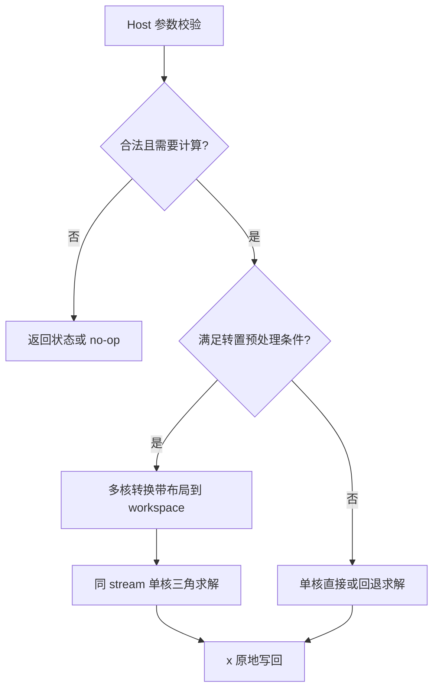

# 需求背景（required）

## 需求来源

本设计对应 CANN 2026 年 9 月社区任务“aclblasCtbsv 算子开发（A2A3）”，依据任务附件《aclblasCtbsv_A2A3 任务书》编写。目标代码仓为 [cann/ops-blas](https://gitcode.com/cann/ops-blas)，采用 Ascend C kernel 直调模式，目标架构目录为 `blas/tbsv/arch22/`。

文档遵循 [官方设计模板](https://gitcode.com/cann/cann-competitions/blob/master/04_tasks/01_community-task-2026/resources/design_template.md) 的章节组织，提交规则参见 [社区任务说明](https://gitcode.com/cann/cann-competitions/blob/master/04_tasks/01_community-task-2026/README.md)。版本：v1.1；日期：2026-09-29；状态：实现完成、A2 自验证完成，待设计评审。本文测试结果不代表已通过社区验收。

## 背景介绍

### aclblasCtbsv 算子实现优化

三角带状线性系统只在主对角线及其一侧有限条对角线上存在有效元素。使用带状存储能够将矩阵存储量从 O(n²) 降至 O(n(k+1))，适用于带状线性系统求解中的前代、回代步骤。

本任务新增单精度复数 BLAS 接口 `aclblasCtbsv`，语义对齐 `cublasCtbsv`，精度参考为 Netlib BLAS 的 `cblas_ctbsv`。实现不依赖 TBE；工程组织参考 ops-blas 现有 Tbsv 接口、句柄与测试框架。

实现文件：

| 文件 | 职责 |
| --- | --- |
| `include/cann_ops_blas.h` | 公共接口声明 |
| `blas/tbsv/arch22/ctbsv_host.cpp` | 参数检查、workspace 选择和调度 |
| `blas/tbsv/arch22/ctbsv_tiling_data.h` | Host/Device 参数结构 |
| `blas/tbsv/arch22/ctbsv_kernel.cpp` | 带布局转换、复数三角求解 |
| `test/tbsv/ctbsv/` | GTest、CBLAS golden、CSV 用例、有限值补充验证 |

### aclblasCtbsv 算子实现现状分析

接口定义如下，参数顺序与任务书一致：

```cpp
aclblasStatus_t aclblasCtbsv(
    aclblasHandle_t handle, aclblasFillMode_t uplo,
    aclblasOperation_t trans, aclblasDiagType_t diag,
    int n, int k, const aclblasComplex* A,
    int lda, aclblasComplex* x, int incx);
```

| 参数 | 参数含义 | 数据类型 | 支持数据类型 | 约束 | 形状 |
| --- | --- | --- | --- | --- | --- |
| handle | 携带 stream 和 workspace 的上下文 | Host 句柄 | aclblasHandle_t | 有效句柄 | 标量 |
| uplo | 原矩阵的上/下三角选择 | Host 枚举 | aclblasFillMode_t | UPPER / LOWER | 标量 |
| trans | 不转置/转置/共轭转置 | Host 枚举 | aclblasOperation_t | N / T / C | 标量 |
| diag | 单位/非单位对角 | Host 枚举 | aclblasDiagType_t | UNIT / NON_UNIT | 标量 |
| n | 矩阵阶数 | Host 整数 | int | n≥0 | 标量 |
| k | 主对角一侧的带宽 | Host 整数 | int | k≥0 | 标量 |
| A | 只读带状矩阵 | Device 数组 | complex64 | 列主序，n>0 时非空 | 物理 lda×n |
| lda | 带状数组前导维度 | Host 整数 | int | lda≥k+1 | 标量 |
| x | 输入右端项及原地输出解 | Device 数组 | complex64 | n>0 时非空，与 A 不重叠 | 逻辑 n，物理 1+(n−1)·abs(incx) |
| incx | 向量步长 | Host 整数 | int | 非零；当前实现另拒绝 INT_MIN，见约束 | 标量 |

### aclblasCtbsv 算子功能分析

求解 `op(A)·x=b`。调用前 x 存储 b，调用后在原地址存储解；A 不修改。`op(A)` 为 A、Aᵀ 或 Aᴴ。每个复数由两个 FP32 分量组成。UNIT 模式将对角视为 1，不读取或写入 A 的对角存储。支持 lda padding 与正负 incx，不支持广播或批量输入。

# 需求分析（required）

## 需求描述

使用 Ascend C 在 Atlas A2/A3 的 arch22 路径实现 complex64 三角带状求解，保持句柄绑定 stream 的异步执行语义，完成合法参数、边界、异常参数、精度与性能覆盖。

## 需求拆解

1. 实现 UPPER/LOWER × N/T/C × UNIT/NON_UNIT 的全部 12 种组合。
2. 正确处理列主序带状存储、lda padding、正负 incx、n=0、k=0、k≥n 和非 32 字节对齐地址。
3. 保持 A 只读、x 原地更新、x 非逻辑元素不变；UNIT 不读对角。
4. Host 校验枚举、维度、指针与步长；设备计算按三角依赖顺序执行。
5. 利用 UB 驻留向量、带内向量化，以及转置场景多核布局转换降低访存与标量开销。
6. 按 Netlib CBLAS golden 验证精度，按任务指定 case 和附件 GPU 基线检查性能。

# 详细设计（required）

## 算子分析

### 数学公式

令 B=op(A)，所有索引从 0 开始，q=min(k,n−1)。若 B 为下三角，按 i=0,…,n−1 前代：

```text
x[i] = (b[i] - Σ B[i,j]·x[j]) / d[i]
        j=max(0,i-q),…,i-1
```

若 B 为上三角，按 i=n−1,…,0 回代：

```text
x[i] = (b[i] - Σ B[i,j]·x[j]) / d[i]
        j=i+1,…,min(n-1,i+q)
```

其中 UNIT 时 d[i]=1，NON_UNIT 时 d[i]=B[i,i]。实现可采用等价的列更新形式：先解出 x[j]，再对仍未求解的带内行执行 `x[i] -= B[i,j]*x[j]`。不同迭代之间存在真实数据依赖，不能将求解行任意分给多个核。

A 的原始带存储地址（以复数为单位）：

```text
UPPER: A(i,j) = A_band[j*lda + k+i-j], max(0,j-k) ≤ i ≤ j
LOWER: A(i,j) = A_band[j*lda + i-j],   j ≤ i ≤ min(n-1,j+k)
```

上三角对角在带数组第 k 行，下三角对角在第 0 行；原始 k≥n 时仍按原始 k 寻址，不能直接缩减原矩阵 lda 或对角位置。

逻辑向量地址为 `x[base+i*incx]`，incx>0 时 base=0，incx<0 时 base=(n−1)·abs(incx)。跨度、GM 偏移采用 64 位整数。

复数乘法 `(a+bi)(c+di)=(ac−bd)+(ad+bc)i`。向量路径通过 Gather 交换实虚分量并配合符号向量、Muls/Mul/Add/Sub 完成运算。非单位对角采用按分母实虚分量大小选择比例的复数除法，避免直接计算分母平方和；这不构成对所有极端数值均不溢出的保证。

### 支持数据类型

A、x 均为 `aclblasComplex`，即 complex64。实部、虚部使用 FP32 计算，不降低到 FP16/BF16。当前实现没有其他 dtype 分支。

### 支持形状

逻辑矩阵 n×n，物理带数组 lda×n，逻辑向量长度 n。n、k、lda、incx 为运行时参数；不涉及广播或图模式动态 shape 注册。k≥n 的有效运算带宽截断至 n−1，但原始存储地址保持任务定义。

## 算子实现

### 实现方案

#### 3.2.1 host侧设计：

校验顺序为：有效 handle → 枚举与 n/k/lda/incx → n=0 返回成功 → A/x 非空 → k=0 且 UNIT 返回成功 → 组织参数并异步发射 kernel。使用 `lda<=k` 检测非法 lda，避免计算 `k+1` 溢出。空 handle 返回 `ACLBLAS_STATUS_HANDLE_IS_NULLPTR`，其他已检查的非法输入返回 `ACLBLAS_STATUS_INVALID_VALUE`。

Tiling 参数直接作为 kernel 参数传入，不使用图模式 tiling 注册：

| 字段 | 类型 | 用途 |
| --- | --- | --- |
| a、x | uint64_t | Device 地址 |
| n、k、lda、incx | int32_t | 原始维度与步长 |
| uplo、trans、diag | uint32_t | 枚举选择 |
| scratch | uint64_t | 可选转换矩阵地址；0 表示直接求解 |
| prepareBlocks | uint32_t | 转换 kernel 核数 |
| fromTranspose | uint32_t | 标记转换后的求解，保持转置路径处理顺序 |

当且仅当 trans≠N、k≥64、n≥128、行采集 DMA stride 可表达、打包 lda 可表达且 handle workspace 足够时，启用布局转换。令 `q=min(k,n-1)`，`packedLda=4*ceil((q+1)/4)`，所需空间为 `8*n*packedLda` 字节。容量检查使用 `packedLda <= workspaceBytes/8/n`，避免容量乘法溢出，同时要求 packedLda≤INT_MAX。

当前实现只借用已有 workspace，不在单次调用中分配设备内存或执行主机同步。workspace 不足时选择直接求解，结果语义不变。

##### 1. 分核策略：

- 求解 kernel：1 个 AIV 核。前代/回代的顺序依赖决定串行外循环，带内独立更新使用向量指令。
- 转换 kernel：核数 `min(n,max(1,AIV核数))`。核 b 处理输出列 b、b+核数、b+2·核数……，列数差至多 1；边界列有效带长度可能不同。
- 转换输出每列以 32 字节对齐，不同核拥有不同整列，不跨核写同一列；转换与求解在同一 stream 顺序发射，不使用跨核自旋同步。

##### 2. 数据分块和内存优化策略：

采用 `X_CAPACITY=8192`、`BAND_CHUNK=512`，固定面向 arch22 的 192 KiB UB 预算。

| 求解 Buffer | 大小（字节） | 用途 |
| --- | ---: | --- |
| aBuf | (512+4)×32 = 16512 | 连续/带 stride 的矩阵读取及 padding |
| rowIndexBuf | (512+4)×8 = 4128 | 将每个 32 字节块中的复数压紧的 Gather 索引 |
| vectorBuf | 4×(512+4)×8 = 16512 | product、交换分量、符号、索引四个子区 |
| xBuf | 8192×8 = 65536 | 逻辑向量驻留 |
| physicalBuf | 8192×8 = 65536 | 含 incx 间隔的物理向量暂存 |
| singleBuf | 32 | 单复数读取/写回 |
| 合计 | 168256 | 约 164.31 KiB，占 192 KiB 的 85.58% |

转换 kernel 单独发射，使用 input=16384、output=4096、index=4096、sign=4096 字节，合计 28672 字节；不与求解 kernel 的 UB 占用相加。

n≤8192 时 x 驻留 UB：incx=1 连续搬运；非单位步长且物理跨度≤8192 时先搬入 physicalBuf，再压紧到 xBuf，写回时保留间隔元素；物理跨度更大时逐个复数收集和散写。n>8192 时走 GM 访问回退，保持可用性，其性能不等同于驻留路径。

带内按最多 512 个复数切块，最后一块取实际长度。对 trans=N、UNIT、2<n≤8192、k>0 的驻留路径，在现有 aBuf 前 8256 字节中划分两个各 4128 字节、32 字节对齐的缓冲；等待当前块就绪后，先发起下一块只读 A 的搬运，再计算当前块。预取可跨列，也可位于同列的相邻带块；不提前读取尚未更新完成的下一主元 x，保持原有浮点计算顺序。

对 trans=N、NON_UNIT、n≤2、incx=1 的标量路径，只初始化 aBuf、xBuf、singleBuf 各 32 字节，总计 96 字节，跳过向量索引、符号表和步长暂存初始化。其他分支继续使用表中完整 Buffer 预算。

##### 3. tilingkey规划策略：

kernel 直调不注册数值 TilingKey，以 `CtbsvKernel<UPPER,TRANS,UNIT>` 模板完成 2×3×2 分派。数据规模和 workspace 条件使用运行时分支：

| 条件 | 路径 |
| --- | --- |
| n=0；或 k=0 且 UNIT（其余参数合法） | Host no-op |
| trans=N、NON_UNIT、n≤2、incx=1 | 轻量标量初始化及求解 |
| trans=N、UNIT、2<n≤8192、k>0 | 双缓冲带块预取及驻留列更新 |
| 其他 trans=N | 直接列更新求解 |
| trans=T/C，满足预处理条件 | 多核转换 op(A)，翻转 uplo 后使用 N 路径 |
| trans=T/C，x 驻留且 DMA stride 可表达 | 直接跨列采集原矩阵行，按列更新求解 |
| 其他 trans=T/C | 列点积回退；视条件采用向量或标量计算 |
| n>8192 | x 不驻留的通用回退 |

#### 3.2.2 kernel侧设计：

1. **Init / CopyIn**：绑定 GM；按通用或小输入路径分配 UB；通用路径构造实虚交换和行压紧索引；按 incx 读取逻辑向量。
2. **可选 prepare**：按目标列采集原矩阵行，C 模式对虚部取反，将 op(A) 写入 32 字节对齐的带状 workspace。UNIT 跳过对角读取和写入。完成后使用有效 k、packedLda、翻转后的 uplo，以 N 模式求解。
3. **Compute**：按有效三角方向遍历主元；NON_UNIT 执行复数除法，UNIT 不读取对角；各带块执行复数乘减。N 路径中 UNIT 使用向量更新，NON_UNIT 的短块（≤8）使用标量以控制开销，较长块使用向量。对齐前缀产生的中间结果在更新前置零，避免无效元素影响输出。
4. **CopyOut**：只更新 x 的逻辑元素，保留步长间隔。UNIT 不修改 A，对角是否为 NaN/Inf 不应影响单位对角求解。
5. **同步**：依据数据流使用 MTE2→V、V→MTE2、S→V、V→S 和写回相关事件；同一 stream 保证 prepare 先于 solve，调用者读回结果前同步 stream。



## 支持硬件

| 支持的芯片版本 | 涉及勾选 |
| --- | --- |
| Atlas A2 系列（含 Atlas 800I/T A2） | √，已在 Ascend 910B3 自验证 |
| Atlas A3 系列（含 Atlas 800I A3） | √，目标适配 arch22 |

开发与自验证环境为 CANN 9.1.0、GCC/GFortran 10.3.1、CMake 3.22、Netlib Reference-LAPACK 3.12.1、GTest 1.14.0。

## 算子约束限制

- 仅支持 complex64、单矩阵和单向量，不涉及广播、批量、任意高维非连续视图。
- A 与 x 不允许重叠；调用者负责提供足够的 Device 存储及有效句柄/stream。Host 不扫描设备内容，不检测奇异性或实际分配长度。
- NON_UNIT 的零对角、NaN/Inf 或高度病态输入可能产生非有限结果，不提供数值稳定性保证。
- 任务文字规定 incx≠0；当前代码及配套负向用例另将 INT_MIN 作为非法值。这是需要评审确认的边界差异，不能视为完全覆盖所有非零 int 步长。
- workspace 应在异步计算结束前保持有效，同一 workspace 不可被并发调用覆盖。
- 当前采用固定 arch22 UB 配置；移植其他架构需要重新评估 Buffer 和 DMA 参数。

# 可维可测分析

## 精度标准/性能标准

| 验收标准 | 描述(不涉及说明原因) | 标准来源 |
| --- | --- | --- |
| 精度标准 | 实部、虚部分量分别按 abs(actual−golden)≤2^-13+2^-13·abs(golden) 比对；匹配比例≥0.99，当前自验最大绝对误差上限固定 0.01 | 任务书 §3.2 及其引用的生态算子精度标准 |
| 性能标准 | 910B3 上任务指定 5 个 case 满足下表；附件扩展 case 按 gpu_ms×1000/0.8 μs 检查 | 任务书 §3.3、附件 gpu_baseline.csv |
| 内存标准 | 任务书无独立门限；检查 A 不变、x 间隔及前后哨兵不变、workspace 不足回退 | 任务书 §3.4、自验要求 |

### 自验覆盖与结果

测试以 ops-blas GTest 读取 CSV，调用真实接口并同步对应 stream，golden 使用 `cblas_ctbsv`。保留原附件 1200 条参数（1000 条精度、200 条性能），新增 60 条覆盖 k≥n、n=8193、大跨度和全部枚举组合。

| 自验项目 | 结果 |
| --- | --- |
| 均匀分布完整测试 | 1260/1260 通过 |
| 正态分布完整测试 | 1260/1260 通过 |
| 小输入初始化分支专项 | 85/85 通过 |
| 有限值扩展 shape，含默认/32 字节 workspace | 672/672 通过，最大分量绝对误差 1.1920928955078125e−7 |
| 性能 case 的执行前正确性检查 | 200/200 通过 |

随机填充分别使用均匀 [-5,5] 和正态 N(0,1)；后者是任务允许 μ/σ 范围中的一个取值，未遍历全部 μ/σ。NON_UNIT 测试对角实部按符号增加 max(5,n)。UNIT 对角污染场景只将对角设为 NaN/Inf，验证“不读对角”。其他 NaN/Inf 输出按同类与同号规则比较，不将非有限结果计为有限值精度证据。另以输出全部有限的补充矩阵检查误差与重复运行一致性。


### 性能目标与自测

| case | n | k | uplo | trans | diag | 目标 μs | 自测均值 μs |
| --- | ---: | ---: | --- | --- | --- | ---: | ---: |
| 1 | 256 | 8 | UPPER | N | NON_UNIT | 254.5 | 173.867 |
| 2 | 512 | 32 | LOWER | N | NON_UNIT | 493.8 | 306.505 |
| 3 | 1024 | 16 | UPPER | T | UNIT | 695.5 | 480.168 |
| 4 | 2048 | 64 | LOWER | C | NON_UNIT | 2265 | 1383.442 |
| 5 | 4096 | 128 | UPPER | N | UNIT | 2468 | 1177.118 |

扩展 200 个性能 case 均低于对应目标。使用 msprof op 自带的 5 次 warmup，每次恢复原始 b，跳过初始正确性调用后采样 20 次取均值；预处理路径合计 prepare+solve 两个 kernel 的 Task Duration。结果为设备执行时间，不含主机调度及输入拷贝。


### 可维护性与复现

功能按 Host、TilingData、Kernel 分离；模板约束枚举分支，显式记录运行时回退条件。构建与执行步骤见代码仓 `test/tbsv/ctbsv/README.md`。测试保留 CSV 参数、种子、GTest XML、逐项有限值误差和原始 profiler CSV，便于重新核算。

本次实现基于 ops-blas 提交 `0465b1bc8317a5a41687621edd2adfbd388fbb85`。本地证据保存在工作区 `task_submission/`：`accuracy_uniform_prepared.xml`、`accuracy_normal_prepared.xml`、`accuracy_review.xml`、`finite_results.json`、`performance.csv`、`prof_prepared/` 和 `summarize_results.py`；正式代码提交时应同步自测材料或补充可访问的提交链接。

## 兼容性分析

新增 `aclblasCtbsv` 声明与 arch22 实现，不修改已有 BLAS 接口签名。复用 ops-blas 的 handle、stream、workspace 和状态码体系；不引入 TBE、图模式算子注册或运行时第三方 BLAS 依赖。Netlib/GTest 仅用于测试。

目标硬件为 Atlas A2/A3 系列的 arch22 架构。INT_MIN 步长边界见“算子约束限制”；设计 PR 的合入状态与代码、自验验收状态分别管理。
