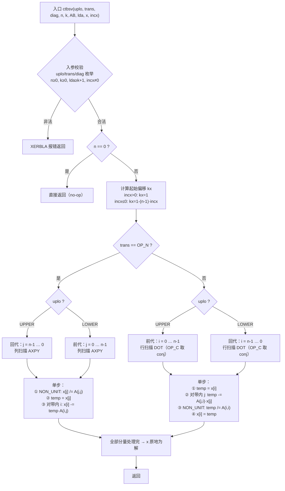
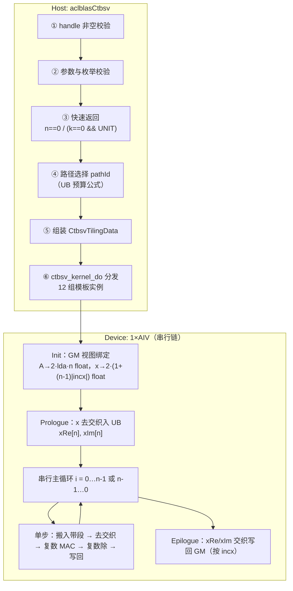
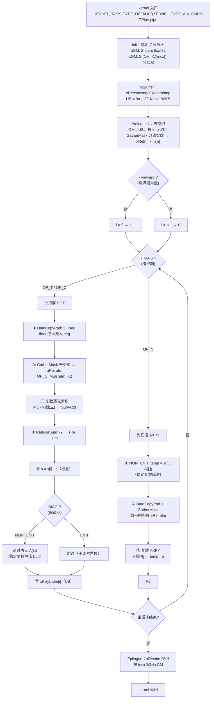

# aclblasCtbsv 算子设计文档（Atlas A2/A3）

| 项目 | 内容 |
| --- | --- |
| 算子名称 | `aclblasCtbsv` |
| 任务名称 | 9 月社区任务 - aclblasCtbsv 算子开发(A2/A3) |
| 目标仓库 | `gitcode.com/cann/ops-blas`，实现目录 `blas/tbsv/arch22/`，测试目录 `test/tbsv/ctbsv/arch22/` |
| 适配硬件 | Atlas A2 系列产品（性能测试设备 Atlas 800T A2 / 910B3）、Atlas A3 系列产品 |
| CANN 版本 | 9.1.0 |
| 数据类型 | COMPLEX64（单精度复数，实部/虚部各 float32） |
| 工程模式 | kernel 直调（Ascend C），句柄式 BLAS 接口，handle 绑定 stream |

---

# 一、需求背景

## 1.1 需求来源

通过社区任务完成昇腾算子开源仓（`cann/ops-blas`）的算子贡献：在 Atlas A2/A3 系列产品上以
Ascend C 实现单精度复数三角带状线性方程组求解算子 `aclblasCtbsv`，对齐 cuBLAS `cublasCtbsv`
的功能与参数语义，补齐 ops-blas 仓 Level-2 BLAS 复数带状求解能力（当前 `blas/tbsv/` 仅有
arch35 的实数档 `stbsv`，A2/A3 的 arch22 目录与复数档均缺失）。

## 1.2 背景介绍

### 1.2.1 aclblasCtbsv 实现参考路径

本算子属 BLAS 库函数，**昇腾侧无对应 TBE 单算子实现**（`ai_core/tbe/impl` 下无 `tbsv` 类算子，
算子信息库 `aic-ascend910b-ops-info*.json` 中亦无对应 OpType）。按社区任务对「无自有 TBE kernel」
类算子的要求，本节改附**标杆实现与仓内同族参考实现**的源码路径，作为 1.2.2.3 baseline 流程图的依据：

1. **标杆语义与 golden 来源**：Netlib BLAS 参考实现 `ctbsv.f`（随测试工程提供的 cblas 复数实现，
   精度比对 golden 由其生成）；对标接口文档 cuBLAS `cublasCtbsv`（参数序列与本算子一一对应）。
2. **仓内同算子参考实现（实数档、异架构）**：
   - `blas/tbsv/arch35/stbsv_host.cpp`（参数校验、快速返回、TilingData 组装）
   - `blas/tbsv/arch35/stbsv_kernel.cpp`（带状下标换算 `TbsvBandIdx`、前/回代方向选择、逐行求解）
   - `blas/tbsv/arch35/stbsv_tiling_data.h`（TilingData 结构）
3. **仓内同架构参考实现（arch22）**：
   - `blas/trsv/arch22/strsv_host.cpp`、`blas/trsv/arch22/strsv_kernel.cpp`（arch22 上三角求解类
     算子的 kernel 骨架与模板化枚举分发）
   - `blas/tbmv/arch22/stbmv_host.cpp`、`blas/tbmv/arch22/stbmv_kernel.cpp`（arch22 上**带状存储**
     的下标换算与搬运组织）
   - `blas/gerc/arch22/cgerc_kernel_impl.h`、`blas/gemv/arch22/cgemv_no_trans_kernel.cpp`
     （arch22 上 **complex64 交织存储**的读写与复数乘法写法）
   - `blas/common/helper/complex.h`、`blas/common/helper/kernel_constant.h`（复数辅助与平台常量）

### 1.2.2 现状分析

#### 1.2.2.1 标杆支持的数据类型和数据格式

| 项 | 内容 |
| --- | --- |
| 数据类型 | COMPLEX64（`aclblasComplex`，实部/虚部各 float32，**内存中实虚交织**） |
| 数据排布 | ND；A 为列主序**束带存储**（banded column-major），逻辑 `n×n`，物理 `lda×n`，`lda ≥ max(1, k+1)` |
| 向量排布 | x 逻辑长度 `n`，物理占位 `1 + (n-1)·|incx|`，`incx ≠ 0` 且可为负 |
| 枚举 | `uplo ∈ {UPPER, LOWER}`、`trans ∈ {OP_N, OP_T, OP_C}`、`diag ∈ {NON_UNIT, UNIT}`，共 2×3×2 = 12 组 |

#### 1.2.2.2 baseline（Netlib `ctbsv`）实现描述

Netlib `ctbsv` 的实现逻辑（与随任务提供的 golden 严格一致）：

1. **入参校验**：依次校验 `uplo / trans / diag / n / k / lda / incx`，任一非法即通过 `XERBLA` 报错返回；
   `n == 0` 直接返回（合法 no-op）。
2. **起始偏移**：`incx <= 0` 时起始索引 `kx = 1 - (n-1)·incx`，即负步长从物理末尾反向取值；
   `incx > 0` 时 `kx = 1`。
3. **方向选择**：`x := op(A)^{-1} · x`，按 `uplo` 与 `trans` 组合确定前代（forward）或回代（backward）：
   - `LOWER + OP_N`、`UPPER + OP_T/OP_C` → 前代，`i` 自 0 递增到 `n-1`；
   - `UPPER + OP_N`、`LOWER + OP_T/OP_C` → 回代，`i` 自 `n-1` 递减到 0。
4. **逐分量求解**（以 `UPPER + OP_N` 回代为例，0 基）：对 `j = n-1 … 0`
   - `diag == NON_UNIT` 时 `x[j] /= A(j,j)`（`A(j,j)` 取自带内 `AB[k + j·lda]`）；
   - 取 `temp = x[j]`，对 `i = max(0, j-k) … j-1` 做 `x[i] -= temp · A(i,j)`，
     `A(i,j)` 取自 `AB[(k + i - j) + j·lda]`——**即沿带内一列连续访问**。
5. **`OP_C` 共轭**：复数档在读取 `A` 元素时取共轭 `conjg(A(·,·))`，对角元也取共轭后再参与除法；
   `OP_T` 不取共轭。
6. **`diag == UNIT`**：对角视为 1，**不读取** `AB` 的对角位置（该位置可为 NaN/Inf 而不影响结果）。
7. **奇异性**：求解类对奇异矩阵无定义，参考实现不做奇异/近奇异检测，除零行为未定义。

#### 1.2.2.3 baseline 实现流程图 ⭐



---

# 二、需求分析

## 2.1 外部组件依赖

| 依赖 | 说明 | 适配状态 |
| --- | --- | --- |
| ACL runtime（`acl/acl.h`） | stream / device 内存管理 | 已适配 |
| Ascend C kernel 框架（`kernel_operator.h`） | AIV 向量编程、UB 管理、搬运接口 | 已适配 |
| ops-blas 公共层 | `cann_ops_blas.h`、`cann_ops_blas_common.h`、`common/helper/*` | 已适配 |
| cblas（Netlib BLAS 复数实现） | 精度比对 golden，随测试工程提供 | 已适配 |

## 2.2 内部适配模块

| 模块 | 说明 |
| --- | --- |
| `aclblasHandle_t` | 携带 stream 与 workspace，通过 `aclblasSetStream` 绑定；本算子读取 `h->stream` |
| `blas/tbsv/` | 本算子新增 `arch22/` 子目录，与既有 `arch35/`（实数档）并列 |
| `include/cann_ops_blas.h` | 新增 `aclblasCtbsv` 接口声明，供其他产品线共用 |
| `test/tbsv/ctbsv/arch22/` | CSV 驱动的 GTest 测试工程（含 `tbsv_test.csv`） |

## 2.3 需求模块设计

### 2.3.1 AscendC 算子原型

与 cuBLAS `cublasCtbsv` 参数序列一一对应（无额外映射）：

```cpp
aclblasStatus_t aclblasCtbsv(aclblasHandle_t handle, aclblasFillMode_t uplo,
                             aclblasOperation_t trans, aclblasDiagType_t diag,
                             int n, int k, const aclblasComplex* A, int lda,
                             aclblasComplex* x, int incx);
```

| 参数 | 输入/输出 | 类型 | dtype | 排布 | shape | 值域 | 异常行为 |
| --- | --- | --- | --- | --- | --- | --- | --- |
| handle | 输入 | scalar | - | - | - | 有效句柄 | nullptr → `ACLBLAS_STATUS_HANDLE_IS_NULLPTR` |
| uplo | 输入(attr) | scalar | int | - | - | `{UPPER, LOWER}` | 非枚举 → `INVALID_VALUE` |
| trans | 输入(attr) | scalar | int | - | - | `{OP_N, OP_T, OP_C}` | 非枚举 → `INVALID_VALUE` |
| diag | 输入(attr) | scalar | int | - | - | `{NON_UNIT, UNIT}` | 非枚举 → `INVALID_VALUE` |
| n | 输入 | scalar | int | - | - | `n ≥ 0` | `n < 0` → `INVALID_VALUE`；`n = 0` 合法 no-op |
| k | 输入 | scalar | int | - | - | `k ≥ 0` | `k < 0` → `INVALID_VALUE` |
| A | 输入 | tensor | COMPLEX64 | ND | `lda × n`（带状列主序） | COMPLEX64 全集 | `n>0` 且 nullptr → `INVALID_VALUE` |
| lda | 输入 | scalar | int | - | - | `lda ≥ max(1, k+1)` | 不满足 → `INVALID_VALUE` |
| x | 输出(原地) | tensor | COMPLEX64 | ND | 逻辑 `n`，物理 `1+(n-1)·|incx|` | COMPLEX64 全集 | `n>0` 且 nullptr → `INVALID_VALUE` |
| incx | 输入 | scalar | int | - | - | `incx ≠ 0` | `incx = 0` → `INVALID_VALUE` |

**返回值**：`aclblasStatus_t`，语义与 `include/cann_ops_blas_common.h` 一致。

### 2.3.2 AscendC 算子相关约束

与 baseline（Netlib `ctbsv` / cuBLAS `cublasCtbsv`）相比**无功能缺失**，12 组枚举、负步长、
`k=0`、满带 `k=n-1`、`lda` padding、`n=0` 全部支持。仅有如下与 baseline 一致的「非功能」差异：

| 项 | baseline | 本算子 | 说明 |
| --- | --- | --- | --- |
| 奇异性检测 | 不做 | 不做 | 求解类对奇异矩阵无定义，行为对齐 |
| 浮点累加顺序 | 顺序累加 | 向量化累加 | 任务书 §2.5「确定性计算：不要求」，误差在 §五 精度标准内 |
| 非连续访存 | 仅 `lda`/`incx` 语义 | 同 | 任务书 §2.5 明确不要求超出该语义的非连续访问 |

## 2.4 数学模型与依赖方向

求解 `op(A) · x = b`（`b` 入口存于 `x`，解原地写回 `x`）。

**带状存储下标换算（0 基）**：

| uplo | 被引用元素范围 | `A(i,j)` 的存储位置 | 对角元位置 |
| --- | --- | --- | --- |
| UPPER | `max(0, j-k) ≤ i ≤ j` | `AB[(k + i - j) + j·lda]` | `AB[k + j·lda]` |
| LOWER | `j ≤ i ≤ min(n-1, j+k)` | `AB[(i - j) + j·lda]` | `AB[j·lda]` |

`op(A)` 通过**下标行列互换**实现，无需物理转置：`idx_op(i,j) = idx(i,j)`（`OP_N`）或
`idx(j,i)`（`OP_T`/`OP_C`）；`OP_C` 额外对读出的元素取共轭。

**代入方向**：

```
kForward = (LOWER && OP_N) || (UPPER && (OP_T | OP_C))    → i: 0 → n-1
否则                                                      → i: n-1 → 0
```

**依赖链**：第 `i` 步依赖前 `min(i, k)` 个已解分量，故 `n` 步之间**严格串行**，
单步内的 `≤ k+1` 个元素可向量化。这一结构决定了整体设计（见 3.2.1.1）。

## 2.5 边界与负向行为（对齐 cuBLAS）

| 场景 | 期望返回 | 说明 |
| --- | --- | --- |
| `handle == nullptr` | `HANDLE_IS_NULLPTR` | 最先校验 |
| `n == 0` | `SUCCESS` | 合法 no-op，不访问 A/x（A 允许 nullptr） |
| `k == 0 && diag == UNIT` | `SUCCESS` | 单位对角阵求解 = 恒等，x 不变，不读 A |
| `n < 0` / `k < 0` | `INVALID_VALUE` | - |
| `lda < max(1, k+1)` | `INVALID_VALUE` | - |
| `incx == 0` | `INVALID_VALUE` | - |
| `incx == INT_MIN` | `INVALID_VALUE` | 取负溢出，参考 arch35 实现显式拦截 |
| 非法枚举（如 999） | `INVALID_VALUE` | uplo/trans/diag 三者 |
| `n > 0` 且 `A`/`x` 为 nullptr | `INVALID_VALUE` | - |
| `diag == UNIT` 且对角位为 NaN/Inf | `SUCCESS`，结果不受影响 | 不读取对角位置 |
| `x` 含 Inf/NaN | 按 IEEE-754 传播 | 与 baseline 一致 |

## 2.6 需求拆解

1. 实现 `aclblasCtbsv` 句柄式接口与 arch22 kernel，覆盖 12 组枚举全组合；
2. 支持 `incx` 正负步长、`k ∈ [0, n-1]`（含 `k=0` 与满带）、`lda` padding；
3. 完成 2.5 全部边界与负向行为，对齐 cuBLAS；
4. 精度满足 §5.3 COMPLEX64 混合容差标准（golden = cblas `ctbsv`）；
5. 性能满足 §5.4 任务书 §3.3 五条判据用例达标线，并给出 200 条参考用例的逐条数据；
6. 交付算子 README、`include/cann_ops_blas.h` 接口声明、CSV 驱动测试工程。

---

# 三、需求详细设计

## 3.1 使能方式

kernel 直调：`aclblasCtbsv`（host）完成校验与 TilingData 组装 → `ctbsv_kernel_do` 按
`uplo/trans/diag` 分发到模板实例化的 kernel → 通过 `h->stream` 异步下发。
不经过 aclnn 两段式，异步语义依赖 `aclblasSetStream`，读回 device 结果前需同步 stream。

## 3.2 需求总体设计



### 3.2.1 host 侧设计

#### 3.2.1.1 分核策略

**本算子的求解主循环固定使用 1 个 AIV block（`<<<1, nullptr, stream>>>`），不做行间分核。**

依据（这是本设计最关键的取舍，必须给出理由）：

- 2.4 已说明 `n` 步之间严格串行，任何跨核切分行区间都需要**每行一次核间同步**；
- A2/A3 上核间同步（`SyncAll` / `CrossCoreSetFlag+WaitFlag`）的单次代价在**微秒量级**，
  而任务书 §3.3 五条判据用例的**每行时间预算仅 0.60 ~ 1.11 µs**（见 §5.4 表），
  即一次核间同步就会吃掉整行预算甚至更多；
- 单步的并行度只有 `k+1 ≤ 4096` 个复数元素，单个 AIV 的 128 lane×fp32 已足够覆盖，
  多核对单步吞吐没有实质收益。

结论：**并行度放在「单步内向量化」而非「行间分核」**。仓内 arch35 参考实现（`stbsv_kernel_do`
的 `<<<1, ...>>>`）与 arch22 的 `strsv` 同样采用单 block，本设计与之一致。

> 可选的多核前置通路（`pathId=2`，见 3.2.1.3）：当带体积较大且实测收益为正时，用多核对
> A 的整带做一次性「去交织 + 按 op(A) 重排」写入 workspace，再由单核串行求解。该通路的
> 一次性成本 `O(lda·n)` 与主循环 `n` 步分摊相比可忽略（n=4096,k=128 时约 4.2 MB，
> 双向搬运 ≈ 10 µs，对 2468 µs 的达标线占比 0.4%），但**是否启用以实测为准**，默认关闭。

#### 3.2.1.2 数据分块和内存优化策略

**核心设计：按 `trans` 选择扫描形式，使 A 的访问恒为单位步长。**

由 2.4 的下标公式可直接推出（`Kseg = 当前步被引用的带内元素数 ≤ k+1`）：

| trans | 扫描形式 | 固定量 / 变化量 | A 的访问步长 |
| --- | --- | --- | --- |
| `OP_N` | **列扫描（AXPY）**：解出 `x[j]` 后更新带内其余分量 | 固定 `j`，`i` 变化 | UPPER `(k+i-j)+j·lda`、LOWER `(i-j)+j·lda` → **步长 1（连续）** |
| `OP_T` / `OP_C` | **行扫描（DOT）**：先规约再解出 `x[i]` | 固定 `i`，`j` 变化 | UPPER `(k+j-i)+i·lda`、LOWER `(j-i)+i·lda` → **步长 1（连续）** |

即两种形式各自都让 A 落在**一段连续的 `2·Kseg` 个 float32** 上，可用单次
`DataCopyPad` 从 GM 搬入 UB，无需 stride gather。若反过来（`OP_N` 用行扫描、`OP_T` 用列扫描）
步长会变成 `lda-1`，小块 strided 搬运在 GM→UB 时每块按 32B 边界落位、无法紧密打包，
是必须避开的写法。

**complex64 交织存储的处理**：`aclblasComplex` 在内存中实虚交织。向量化复数乘加需要实虚分离，
故设计为：

- `x`（长度 `n` 复数，仅 `8n` 字节）在 **Prologue 一次性去交织**为 `xRe[n]`、`xIm[n]` 两个
  UB 平面，全程常驻，主循环只读写 UB；Epilogue 再一次性交织写回 GM（按 `incx` 落位）。
- A 的带段按步搬入后用 `GatherMask`（pattern 1 取偶下标=实部、pattern 2 取奇下标=虚部）
  分离为 `aRe/aIm`。`GatherMask` 为 **repeat 粒度**（每 repeat 固定 256 B = 64 个 float32），
  故 UB 上的带段缓冲长度按 64 个 float32 向上对齐、尾部按整 repeat 处理，避免槽位不整
  导致的静默越界写。

**UB 占用公式**（A2 单 AIV 可用 UB = 192 KB，预留 2 KB）：

```
Kp      = align_up(k + 1, 64)                 # 以 float32 元素为单位，64 float = 256 B = 1 个 GatherMask repeat
UB_x    = 2 · n  · 4 B          = 8n          # xRe + xIm
UB_seg  = 2 · Kp · 4 B          = 8·Kp        # 带段原始交织缓冲（2 float / 复数）
UB_aRe  = UB_aIm = Kp · 4 B     = 8·Kp        # 去交织后的实部/虚部平面
UB_tmp  = 2 · Kp · 4 B          = 8·Kp        # 复数 MAC 的中间量（ac, bd / ad, bc 复用）
------------------------------------------------------------------
UB_total = 8n + 32·Kp  ≤  190 KB              # 主路径（pathId=0）成立条件
```

- 判据用例最坏点 `n=4096, k=128` → `Kp=192`，`UB_total = 32 KB + 6 KB = 38 KB` ✓；
- 扫描用例最坏点 `n=2048, k=n-1=2047`（满带）→ `Kp=2048`，`UB_total = 16 KB + 64 KB = 80 KB` ✓；
- 理论边界：`n ≤ 4096` 且满带时 `8·4096 + 32·4096 = 160 KB` ✓ 仍可容纳；
- `UB_total > 190 KB`（超大 `n` 与超大 `k` 同时出现）时降级到 `pathId=1`（x 分段流式）。

tensor 数量：`xRe, xIm, seg, aRe, aIm, tmp0, tmp1` = 7 个，满足 ≤ 8 的约束。

#### 3.2.1.3 tilingKey 规划策略

分两层：**编译期模板**（消除主循环内的分支）+ **运行期 pathId**（UB 预算分流）。

**编译期**：`CtbsvKernel<UPLO, TRANS, DIAG>`，`UPLO ∈ {UPPER, LOWER}`、
`TRANS ∈ {NO_TRANS, TRANS, CONJ_TRANS}`、`DIAG ∈ {NON_UNIT, UNIT}` → **12 个 kernel 实例**，
由 host 的 `ctbsv_kernel_do` 按枚举三重分发（与 arch35 `stbsv` 的 8 实例分发同构，复数档
多出 `CONJ_TRANS` 一档）。这样 `kForward`、是否取共轭、是否读对角全部在编译期确定，
主循环内无枚举判断。

**运行期 pathId**（写入 TilingData）：

| pathId | 触发条件 | 策略 |
| --- | --- | --- |
| 0（主路径） | `8n + 32·Kp ≤ 190 KB` | x 全程 UB 常驻；A 带段逐步 `DataCopyPad` 搬入 |
| 1（x 流式） | `8n + 32·Kp > 190 KB` | x 按段驻留（段长 `≥ k+1`，保证单步依赖窗口在段内），跨段时换段 |
| 2（带预处理，可选） | `pathId==0` 且 `lda·n ≥ 阈值` 且实测收益为正 | 多核一次性去交织 A 整带到 workspace，主循环免去逐步 `GatherMask` |

`pathId=2` 依赖 handle 的 workspace（`aclblas_handle_internal.h`，默认 32 MiB、上限 2 GiB），
需要 `16·lda·n` 字节；**默认关闭**，阈值由 3.4 的探针实测确定后再开启。

### 3.2.2 kernel 侧设计

#### 3.2.2.1 kernel 侧实现描述

与 1.2.2.2 baseline 的步骤逐条对应：

| baseline 步骤 | AscendC 实现 | 对应关系 |
| --- | --- | --- |
| ① 入参校验 | host `ValidateCtbsvParams`（3.2.1） | 由 kernel 前移到 host，kernel 内无校验 |
| ② 起始偏移 `kx` | `XOffset(idx) = incx≥0 ? idx·incx : (n-1-idx)·(-incx)` | 等价闭式，`incx<0` 时反向落位 |
| ③ 方向选择 | 编译期常量 `kForward`（2.4 公式） | 一致 |
| ④ 逐分量求解 | 串行主循环，单步向量化（见下） | **循环结构一致，单步从标量改为向量** |
| ⑤ `OP_C` 共轭 | 编译期 `if constexpr (TRANS == CONJ_TRANS)` 对 `aIm` 取负 | 一致 |
| ⑥ `diag == UNIT` | 编译期跳过除法与对角元读取 | 一致（对角位 NaN/Inf 不读） |
| ⑦ 奇异性 | 不检测 | 一致 |

**单步（`OP_T`/`OP_C` 行扫描 DOT 形式，`Kseg` 为本步带内元素数）**：

1. `DataCopyPad`：GM 上 `2·Kseg` 个连续 float32 → UB `seg`（按 32 B 对齐搬入，尾部 pad）；
2. `GatherMask`(pattern=1/2)：`seg` → `aRe[Kseg]`、`aIm[Kseg]`；`OP_C` 时 `Muls(aIm, aIm, -1.0f)`；
3. 复数点积（`s = Σ a·x`，`a=aRe+i·aIm`，`x=xRe+i·xIm`，两者均为 UB 平面的连续片段）：
   - `Mul(t0, aRe, xRe)`；`Mul(t1, aIm, xIm)`；`Sub(t0, t0, t1)` → 实部逐元素积
   - `Mul(t1, aRe, xIm)`；`Mul(t2, aIm, xRe)`；`Add(t1, t1, t2)` → 虚部逐元素积
   - `ReduceSum(t0) / ReduceSum(t1)` → 标量 `sRe, sIm`
   （4 次 `Mul` 相互独立、可连续发射，只有 `Sub/Add` 与 `ReduceSum` 在关键路径上）
4. `bRe = xRe[i] - sRe`、`bIm = xIm[i] - sIm`（标量）；
5. `DIAG == NON_UNIT` 时读对角元（一次 2-float 标量读）并做**稳定复数除法**（见 3.2.2.4）；
6. `xRe.SetValue(i, ·)`、`xIm.SetValue(i, ·)`（写 UB，不写 GM）。

**单步（`OP_N` 列扫描 AXPY 形式）**：先对 `x[j]` 除对角元得 `temp`，再对带内其余分量做
`x[i] -= temp · A(i,j)`——即步骤 3 换成以 `temp` 为标量的复数 AXPY（`Muls`+`Sub`/`Add`，
无 `ReduceSum`，关键路径更短）。

#### 3.2.2.2 AscendC 实现流程图 ⭐



#### 3.2.2.3 AscendC 流程图与 baseline 流程图的差异点和原因 ⭐

| # | baseline（Netlib `ctbsv`） | AscendC（本设计） | 原因 |
| --- | --- | --- | --- |
| 1 | 单步内对 `≤ k+1` 个元素**逐个标量**乘减 | 单步内**一次向量运算**覆盖全部 `Kseg` 个元素 | CPU 上标量乘减即峰值；AIV 上标量取数代价高。仓内现有求解类参考实现（`trsv/arch22`、`tbsv/arch35` 非 SIMT 档）均为逐元素 `GetValue` 标量循环，按其量级折算（实测 ~74 cycle/复数标量 MAC）在 `k=32/64/128` 档需 1.5 ~ 5.8 µs/行，而达标线仅 0.58 ~ 1.11 µs/行，**标量写法必然不达标**；向量化后单步关键路径降到数百 cycle 量级 |
| 2 | `OP_N` 与 `OP_T` 都按同一套下标逐元素取 A | **按 `trans` 切换扫描形式**：`OP_N` 用列扫描、`OP_T/OP_C` 用行扫描 | 使 A 的访问恒为步长 1（3.2.1.2 推导）。若沿用同一形式，另一档的步长为 `lda-1`；GM→UB 的小块 strided 搬运每块按 32 B 边界落位、无法紧密打包，搬运效率与 UB 占用都会劣化 |
| 3 | 复数按 `complex` 标量类型直接运算 | 实虚**去交织**为两个 float32 平面后做 4 次 `Mul` + `Sub/Add` | AIV 的向量指令面向同类型连续元素；交织布局无法直接做复数乘。`x` 只去交织一次（`8n` 字节），A 的带段按步用 `GatherMask` 分离（repeat 粒度、按 64 float 对齐，避免槽位不整的静默越界） |
| 4 | `x` 每步读写主存 | `x` **全程 UB 常驻**（`xRe/xIm`），主循环不碰 GM，仅 Prologue/Epilogue 各一次 | 串行链上每步一次 GM 往返会把 MTE2/MTE3 延迟串进关键路径；`x` 仅 `8n` 字节，`n=4096` 时 32 KB，完全可常驻 |
| 5 | 直接 `/` 做复数除法 | **Smith 稳定算法**（3.2.2.4） | 朴素 `(ac+bd)/(c²+d²)` 在 `|c|,|d|` 接近 float32 上下限时中间量溢出/下溢；测试用例含极端填充与 `[-5,5]`、`σ∈[0.1,2]` 正态分布，对角加偏移 `max(5,n)` 后 `|d|` 可达 4096 量级，`c²+d²` 有平方放大风险 |
| 6 | `uplo/trans/diag` 运行期分支 | **编译期模板 12 实例** | 主循环体执行 `n` 次，运行期分支会在每步付出判断与取指代价；`if constexpr` 后循环体是直线代码 |
| 7 | 不做快速返回优化 | 增加 `k==0 && diag==UNIT → SUCCESS` | 此时 `op(A)=I`，解即 `b`，`x` 无需改动，可完全跳过 kernel 下发（与 arch35 参考实现一致） |
| 8 | 单线程顺序执行 | 求解主循环仍单 AIV，**不做行间分核** | 见 3.2.1.1：每行预算 0.60~1.11 µs，一次核间同步即超预算 |

#### 3.2.2.4 稳定复数除法

`q = (a + bi) / (c + di)`，采用 Smith 算法避免 `c² + d²` 的中间溢出：

```
if |c| >= |d|:  r = d / c;  den = c + d·r;  q = ((a + b·r)/den, (b - a·r)/den)
else:           r = c / d;  den = c·r + d;  q = ((a·r + b)/den, (b·r - a)/den)
```

`OP_C` 时对角元先取共轭再入除法（与 baseline 的 `conjg(A(j,j))` 一致）。

## 3.3 支持硬件

| 支持的芯片版本 | 勾选 | SocVersion | 架构目录 |
| --- | --- | --- | --- |
| Atlas A2 训练系列 / Atlas 800I A2 推理系列 | √ | `ascend910b` (910B3 / 910B4) | `arch22` |
| Atlas A3 训练系列 / Atlas 800I A3 推理系列 | √ | `ascend910_93` | `arch22` |

算子 README 的产品支持表按上表标注「支持」；接口声明放入 `include/cann_ops_blas.h` 供其他产品线共用。

## 3.4 算子约束限制

| 约束项 | 内容 |
| --- | --- |
| dtype | 仅 COMPLEX64（本任务范围）；实数档由既有 `stbsv` 承担 |
| 数据格式 | 仅 ND，A 为列主序带状存储；不支持其他 format |
| 非连续 Tensor | 仅支持 `lda` / `incx` 语义内的跨步，不支持任意非连续 |
| broadcast | 不涉及 |
| dynamic shape | `n`/`k`/`lda`/`incx` 均为运行期入参，由 host tiling 支持，无需重新编译 |
| 原地与重叠 | `x` 原地读写；**A 与 x 不允许内存重叠**（重叠行为未定义） |
| 确定性计算 | 不保证逐位一致（任务书 §2.5 明确不要求） |
| 奇异矩阵 | 不做奇异/近奇异检测，除零行为未定义（对齐 cuBLAS） |
| UB 上限 | 主路径要求 `8n + 32·align_up(k+1,64) ≤ 190 KB`，超出时自动降级到 `pathId=1` |

---

# 四、特性交叉分析

## 4.1 枚举 × 形状 × 步长 交叉覆盖

| 维度 | 取值 | 交叉说明 |
| --- | --- | --- |
| uplo | UPPER / LOWER | 与 trans 组合决定前代/回代方向（2.4 公式），4 种组合全覆盖 |
| trans | OP_N / OP_T / OP_C | OP_N 走列扫描，OP_T/OP_C 走行扫描；OP_C 额外共轭。3 档全覆盖 |
| diag | NON_UNIT / UNIT | UNIT 不读对角位，需验证对角位填 NaN/Inf 时结果不受影响 |
| n | 0, 1, 质数, 2^p, 2^p±1, 非对齐值, 2048 / 4096 | `n=0` 走快速返回；`n=1` 单分量；非对齐值验证 pad 逻辑 |
| k | 0, 1, 小值, 半带, 满带 `n-1` | `k=0` 退化对角阵（且 UNIT 时快速返回）；满带时 `Kseg` 最大，验证 UB 公式边界 |
| lda | 紧凑 `k+1` / padding `k+1+4` | 验证列间跨步与「步长 1」推导在 padding 下依然成立 |
| incx | ±1, ±2, ±3, 小质数 | 负步长验证 `XOffset` 反向落位；非 1 步长验证 Prologue/Epilogue 的交织读写 |
| 填充 | 均匀 `[-5,5]` / 正态 `μ∈[-5,5],σ∈[0.1,2]` / 交替 / 极端 / Inf / NaN | 求解类 NON_UNIT 不含全零/Inf/NaN 对角（避免除零未定义）；UNIT 档验证对角不读 |

**关键交叉风险点**：

1. `k = n-1`（满带）+ 大 `n`：`Kseg` 最大，UB 公式边界，且单步向量长度最长 → 用 3.2.1.2 公式校核；
2. `lda` padding + `OP_T`：行扫描的步长 1 结论依赖 `idx(j,i) = (k+j-i) + i·lda` 中 `i` 固定，
   padding 只改变 `lda` 不改变步长，需用例实证；
3. 负步长 + `n=1`：`XOffset(0) = 0`，与正步长一致，需边界用例；
4. `diag=UNIT` + `k=0`：走 host 快速返回，**不下发 kernel**，需验证返回 SUCCESS 且 `x` 不变。

## 4.2 兼容性分析

| 项 | 说明 |
| --- | --- |
| 接口兼容 | 新增接口，无既有接口变更；声明加入 `include/cann_ops_blas.h`，不影响其他算子 |
| 目录兼容 | 新增 `blas/tbsv/arch22/`，与既有 `blas/tbsv/arch35/`（实数 `stbsv`）并列，互不影响 |
| 架构兼容 | arch22 覆盖 A2（`ascend910b`）与 A3（`ascend910_93`）；arch35/950 不在本任务范围 |
| CANN 版本 | 目标 CANN 9.1.0；仅使用通用 AIV 向量接口与 `DataCopyPad` / `GatherMask`，不使用 arch35 专有的 SIMT 通路 |
| 数据兼容 | `aclblasComplex` 交织布局与仓内既有复数算子（`caxpy` / `cgemv` / `cgerc`）一致 |

## 4.3 风险与规避

| 风险 | 影响 | 规避措施 |
| --- | --- | --- |
| 串行链每步延迟超预算 | 性能不达标（这是本算子的**唯一**性能风险） | 实现第一步先做「单步关键路径探针」：单核空转 `n` 步 + 一次 `Kseg` 宽向量运算，实测 cycles/step，再据此定单步结构（见 §5.4） |
| `GatherMask` 槽位不整 | 静默越界写、结果错乱且难定位 | UB 带段缓冲按 64 个 float32（1 repeat = 256 B）向上对齐，尾部按整 repeat 处理 |
| 向量操作数未 32 B 对齐 | aivec 异常（运行期崩溃） | 所有 UB buffer 起址按 32 B 对齐申请；`DataCopyPad` 搬入按 32 B 边界落位 |
| 复数除法中间溢出 | 精度用例 FAIL | Smith 稳定算法（3.2.2.4） |
| 大 `n` + 满带超 UB | 编译/运行失败 | `pathId=1` 降级通路 + host 侧 UB 预算公式判定 |
| 910B3 为共享设备 | 性能数据被并发污染（曾实测出数十倍离群值） | 性能采集全程持 NPU 互斥锁独占，并在计时前做连续空闲采样 |

---

# 五、可维可测分析

## 5.1 可维护性

- 文件结构对齐仓内同族算子，**不引入冗余文件**（对照 arch35 `stbsv` 的 4 文件结构）：

  ```
  blas/tbsv/arch22/
  ├── ctbsv_host.cpp          # 接口 + 校验 + 快速返回 + TilingData + 分发
  ├── ctbsv_kernel.cpp        # 12 组模板实例 + ctbsv_kernel_do
  ├── ctbsv_kernel.h          # 模板类声明与带状下标换算
  └── ctbsv_tiling_data.h     # CtbsvTilingData POD
  test/tbsv/ctbsv/arch22/     # CSV 驱动 GTest 工程（含 tbsv_test.csv）
  ```

- 带状下标换算集中在 `ctbsv_kernel.h` 的 `CtbsvBandIdx<UPLO, TRANS>` 单一函数，
  与 arch35 的 `TbsvBandIdx` 同构，便于对照审阅；
- 枚举组合由模板参数表达，新增枚举只需增加实例化，主循环体不变；
- 无硬编码 SocVersion / 核数 / UB 大小：核数与 UB 由平台接口查询，UB 预算走 3.2.1.2 公式。

## 5.2 测试设计

使用 ops-blas 仓 `test/` 测试框架：CSV 描述用例 → python 脚本调用 C++ GTest 工程加载 CSV →
调用 `aclblasCtbsv` → golden 由 cblas（Netlib `ctbsv`）生成并逐元素比对。

| 层级 | 前缀 | 覆盖内容 |
| --- | --- | --- |
| L0 基础 | `TC_L0` | 12 组枚举全组合 × 小尺寸（n=8, k=2） |
| L1 尺寸 | `TC_SQ` | 23 种尺寸（1→2048，含奇数/质数/2^p±1/非对齐）× 枚举轮转 |
| L2 带宽 | `TC_BD` | k = 0 / 1 / 小值 / 半带 / 满带 `n-1` × n ∈ {4,8,16,32,64} |
| L2 对角 | `TC_DG` | `diag=UNIT` 下 A 全零（对角不读，退化恒等）与 NON_UNIT 对照 |
| L4 前导维/步长 | `TC_LD` / `TC_INC` | `lda = k+1+pad`；`incx ∈ ±1/±2/±3` |
| L5 填充 | `TC_FL` | A 均匀/交替/极端；x 均匀/全零/交替/极端/Inf/NaN；UNIT 档对角 NaN/Inf 不读验证 |
| L5b 覆盖 | `TC_CV` | 中等尺寸（24/96）× 12 组枚举全组合 |
| L6 边界负向 | `TC_ED` | 零维、`k=0&&UNIT`、空指针、非法枚举 999、非法前导维、负维度、负带宽、零步长、`INT_MIN` 步长、handle 空指针 |
| EX 扩展 | `TC_EX` | 尺寸池 × 带宽 × 枚举 × 步长 × padding 的确定性采样 |
| PF 性能 | `TC_PF` | 5 条任务书判据用例 + 小尺寸延迟区 + 规模对数扫描 + 带宽网格 + 大尺寸混合 |

精度用例 1000 条、性能用例 200 条，固定随机种子（同种子输出逐字节一致）。

## 5.3 精度标准

golden 由 cblas（Netlib BLAS `ctbsv`）单标杆生成，对输出向量 `x` 全元素验证；
按生态算子开源精度标准 COMPLEX64 档（复数按实部/虚部分别套用 FLOAT32 容差）判定：

| 数据类型 | rtol | atol | required_matched_ratio | max_abs_error_limit |
| --- | --- | --- | --- | --- |
| COMPLEX64 | 2⁻¹³ (1.22e-4) | 2⁻¹³ (1.22e-4) | 0.99 | 1e-2 或 32 × ULP |

- 逐元素通过条件：`|actual - golden| ≤ atol + rtol × |golden|`；
- 整体通过条件：`matched_ratio ≥ 0.99` **且** `max_abs_error ≤ max_abs_error_limit`；
- 本算子含规约（带内多元素求和叠加），大数规约可能引入更大误差，
  `max_abs_error_limit` 按任务书 §3.2.4 可酌情放宽至 2 ULP；
- 测试工程对被引用对角元加保号偏移 `boost = max(5, n)`（复数对实部加偏移）保证对角非零，
  golden 使用**同一强化后的矩阵**回代，两侧输入严格一致。

## 5.4 性能标准

测试设备 Atlas 800T A2 (910B3)；口径为 COMPLEX64 场景下的平均单次 kernel 耗时
（msprof `OpBasicInfo.csv` 的 `Task Duration(us)`，先 warmup 再有效采样 > 10 次取平均）。
达标线 = 任务书 §3.3 表（= 任务包 `gpu_baseline.csv` 的 `gpu_ms ÷ 0.8`）。

**判据用例与本设计的时间预算核算**（AIV 频率按 910B3 实测 ≈ 1.65 GHz 折算）：

| case | n | k | uplo | trans | diag | 达标耗时 (µs) | 每行预算 (µs) | 每行预算 (cycle) | 单步向量宽度 |
| --- | --- | --- | --- | --- | --- | --- | --- | --- | --- |
| 1 | 256 | 8 | UPPER | N | NON_UNIT | 254.5 | 0.994 | ≈ 1640 | 9 复数 |
| 2 | 512 | 32 | LOWER | N | NON_UNIT | 493.8 | 0.964 | ≈ 1591 | 33 复数 |
| 3 | 1024 | 16 | UPPER | T | UNIT | 695.5 | 0.679 | ≈ 1121 | 17 复数 |
| 4 | 2048 | 64 | LOWER | C | NON_UNIT | 2265 | 1.106 | ≈ 1825 | 65 复数 |
| 5 | 4096 | 128 | UPPER | N | UNIT | 2468 | 0.603 | ≈ 994 | 129 复数 |

结论与设计取舍的对应关系：

1. **本算子是延迟主导、不是吞吐主导**。单步只有 `k+1 ≤ 129` 个复数元素，
   即使按 6 个 float32 向量 pass 计算，吞吐项也只有约 `6·129/128 ≈ 6` cycle/行，
   相对 994 ~ 1825 cycle 的预算可以忽略；时间几乎全部花在**串行链的单步关键路径**上。
   这正是 3.2.1.1（不分核）、差异点 1（向量化单步）、差异点 4（x 常驻 UB）三项设计的依据。
2. **标量写法必然不达标**：按仓内现有求解类参考实现的标量量级折算（~74 cycle/复数标量 MAC），
   五条用例需 0.40 / 1.48 / 0.76 / 2.9 / 5.8 µs/行，对应 case 2~5 超标 1.2 ~ 10 倍。
3. **向量化后的余量**：单步关键路径为
   `DataCopyPad → GatherMask×2 → Mul×4(可并发) → Sub/Add → ReduceSum×2 → 标量除 → SetValue`，
   按 AIV 短向量依赖链约 80 cycle/拍的量级估算在 400 ~ 600 cycle，对最紧的 994 cycle 仍有
   1.7 ~ 2.5 倍余量。**该估算是设计期模型，不是实测**；实现的**第一步**即为 4.3 表中的
   「单步关键路径探针」，实测 cycles/step 后再定单步结构（必要时以 `pathId=2` 的带预处理
   通路把 `GatherMask` 移出串行链）。
4. 200 条参考用例按 `NPU 平均单次 kernel 耗时 ≤ gpu_ms / 0.8` 逐条关联比对，
   逐条数据随自测报告提交；其中 `n ≤ 8` 的极小用例达标线为 4.5 ~ 11 µs，接近 kernel 下发地板，
   将在报告中单独说明成因（非实现缺陷），达标结论以任务书 §3.3 明列的五条判据用例为准。

**测量纪律**（910B3 为共享设备）：全部性能数据在 NPU 互斥锁下独占采集，计时前连续 3 次
空闲采样；每条用例 ≥ 11 次有效采样；同一提交连测 3 次以区分离群与真实回退。

## 5.5 交付件

| 序号 | 交付件 | 位置 |
| --- | --- | --- |
| 1 | 算子设计文档 | 本文档（cann-ops-competitions PR） |
| 2 | 自测用例及测试代码 | fork 仓 `test/tbsv/ctbsv/arch22/`（含 CSV 与 README 测试步骤） |
| 3 | 自测报告 | 精度/性能/内存自验证报告 + 完整日志 + 截图 |
| 4 | 待验收代码地址 | fork 仓分支 + 算子目录 `blas/tbsv/arch22/` + 算子 README（产品支持表标注 A2/A3 支持）+ `include/cann_ops_blas.h` 接口声明 |
| 5 | PR 申请合入 | 验收通过后提交至 `cann/ops-blas` |
