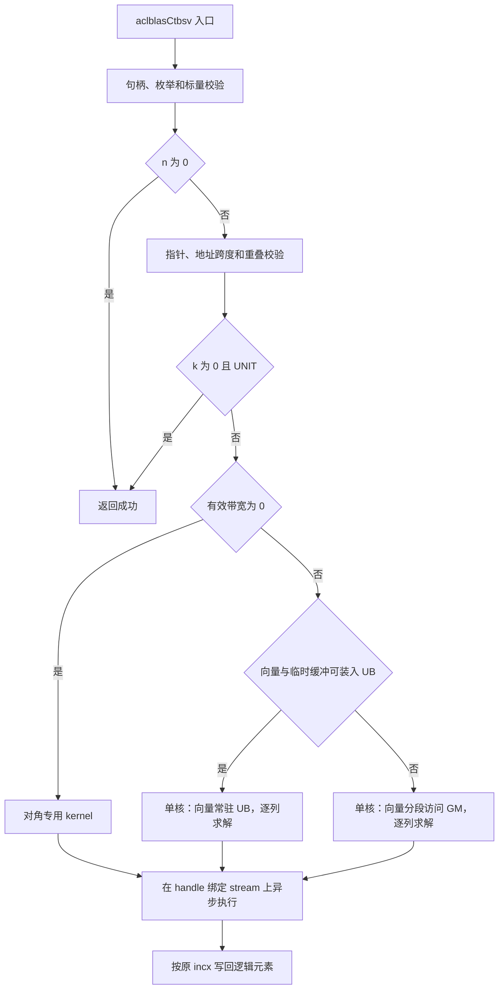

# aclblasCtbsv 算子设计文档（Atlas A2/A3）

本文依据《9月社区任务-aclblasCtbsv算子开发(A2A3)任务书》，
设计基于 Ascend C、采用 kernel 直调模式的单精度复数三角带状求解算子。
内容覆盖接口语义、带状存储、求解算法、Host 与 Kernel 实现、精度和性能验证。
文档结构对齐任务书指定的官方设计模板。

| 项目 | 内容 |
| --- | --- |
| 文档版本 | V1.0 |
| 编写日期 | 2026-09-28 |
| 算子接口 | `aclblasCtbsv` |
| 数据类型 | COMPLEX64，实部、虚部均为 FLOAT32 |
| 目标平台 | Atlas A2/A3 系列，架构目录 `arch22` |
| 软件环境 | CANN 9.1.0、ops-blas 工程框架 |

## 1. 需求背景（required）

本算子用于求解复数三角带状线性方程组，为带状线性代数计算提供基础 BLAS 能力。

### 1.1 需求来源

需求和验收依据来自以下任务材料；实现参考采用 Netlib CTBSV。

| 材料 | 用途 |
| --- | --- |
| [aclblasCtbsv_A2A3 任务书](./aclblasCtbsv_A2A3_task_doc.md) | 功能、接口、硬件、性能门槛和交付要求 |
| [测试指导](./test_cases/README.md) | 用例运行方式、golden、性能统计口径 |
| [tbsv_test.csv](./test_cases/tbsv_test.csv) | 1000 条功能/精度用例、200 条性能/内存用例 |
| [gpu_baseline.csv](./test_cases/gpu_baseline.csv) | GPU 参考耗时，字段单位为 ms |
| [gen_csv.py](./test_cases/gen_csv.py) | 用例生成规则与现有覆盖范围 |
| [verify_accuracy.py](./test_cases/verify_accuracy.py) | 编译、安装 CSV 和执行精度测试的脚本 |
| [官方设计模板](https://gitcode.com/cann/cann-competitions/blob/master/04_tasks/01_community-task-2026/resources/design_template.md) | 设计文档结构 |
| [Netlib CTBSV](https://www.netlib.org/blas/ctbsv.f) | 带状存储、求解顺序、负步长和零值分支的参考 |
| [ops-blas 仓库](https://gitcode.com/cann/ops-blas) | 目标工程、公共类型和 kernel 直调约定 |

文件划分、内部字段和调度键按目标 ops-blas 分支的公共设施接入。
测试前准备目标源码及 CANN 9.1.0 编译环境，检查底层 API 和构建配置的兼容性。

### 1.2 背景介绍

`aclblasCtbsv` 对齐 cuBLAS `cublasCtbsv` 的单精度复数求解语义，
求解 `op(A) × x = b`。调用前向量 `x` 保存右端项 `b`，调用后原地保存解。
矩阵使用三角带状列主序格式，只需保存主对角线及一侧的 `k` 条带，
紧凑存储量为 `n × (k + 1)` 个复数。

三角求解的分量之间存在依赖，不能将整个向量按普通逐元素算子任意分核。
设计的重点是保持前代/回代顺序，利用每一列带内的并行性，
并减少矩阵搬运、非连续向量访问以及标量与向量流水间的同步开销。

## 2. 需求分析（required）

本节将任务书要求拆解为明确的接口契约和可检查的开发目标。

### 2.1 需求描述与拆解

实现必须覆盖下表能力，不能仅支持任务书列出的五个性能 shape。

| 编号 | 需求 | 设计对应 |
| --- | --- | --- |
| R01 | COMPLEX64 输入输出，求解 `op(A) × x = b` | FLOAT32 实虚分离计算，结果原地写回 |
| R02 | UPPER/LOWER、N/T/C、UNIT/NON_UNIT 全覆盖 | 12 种枚举组合，区分求解方向和共轭 |
| R03 | 带状列主序、合法 `lda` padding | 使用显式带状下标，只引用有效矩阵元素 |
| R04 | 正负非零 `incx` | 64 位逻辑到物理下标映射，保留间隔元素 |
| R05 | `n=0`、`k=0`、`n=1` | Host 快速返回与对角专用路径 |
| R06 | 合法输入泛化、非法参数返回明确错误 | Host 校验；超出 UB 的合法输入使用分段路径 |
| R07 | `x` 原地读写，`A` 只读且与 `x` 不重叠 | 明确输入生命周期、地址范围和回写范围 |
| R08 | handle 绑定 stream，异步执行 | 在绑定 stream 上下发，不在接口内部同步 |
| R09 | CANN 9.1.0、A2/A3、kernel 直调 | `blas/tbsv/arch22/`，公共头文件声明接口 |
| R10 | Netlib golden 和混合容差精度标准 | 分实部、虚部检查，单独检查 NaN/Inf |
| R11 | 五项性能门槛与配套性能用例 | 单次 API 的全部计算 kernel 耗时纳入统计 |
| R12 | 测试可复现性 | 固定测试工程、执行步骤、环境版本和随机种子 |

### 2.2 接口定义

接口参数顺序与任务书及 `cublasCtbsv` 对齐，无额外标量参数和调用方 workspace 参数。

```cpp
aclblasStatus_t aclblasCtbsv(
    aclblasHandle_t handle,
    aclblasFillMode_t uplo,
    aclblasOperation_t trans,
    aclblasDiagType_t diag,
    int n,
    int k,
    const aclblasComplex* A,
    int lda,
    aclblasComplex* x,
    int incx);
```

公共声明放入 `include/cann_ops_blas.h`。
句柄、枚举、复数和状态码复用 ops-blas 定义，不重复定义 ABI 类型。

| 参数 | 位置与方向 | 合法值和语义 |
| --- | --- | --- |
| `handle` | Host，输入 | 有效库句柄，携带绑定的 stream |
| `uplo` | Host，属性 | `ACLBLAS_UPPER` / `ACLBLAS_LOWER`，描述原矩阵 `A` |
| `trans` | Host，属性 | `ACLBLAS_OP_N` / `ACLBLAS_OP_T` / `ACLBLAS_OP_C` |
| `diag` | Host，属性 | `ACLBLAS_NON_UNIT` / `ACLBLAS_UNIT` |
| `n` | Host，标量 | `n ≥ 0`，方阵阶数和向量逻辑长度 |
| `k` | Host，标量 | `k ≥ 0`，存储带宽参数；主对角以外最多 `k` 条带 |
| `A` | Device，只读 | COMPLEX64，带状数组逻辑形状 `[lda, n]`，列主序 |
| `lda` | Host，标量 | `lda ≥ max(1, k+1)`，单位为复数元素 |
| `x` | Device，输入输出 | COMPLEX64，逻辑长度 `n`；输入 `b`，输出解 |
| `incx` | Host，标量 | 非零整数，单位为复数元素，允许负值 |

`diag=UNIT` 时主对角视为 `1+0i`，不引用其存储值。
所有模式均不得改写 `A`，也不得写入 `x` 物理存储中的非逻辑元素。

### 2.3 参数校验与异常处理

Host 在下发前完成可由标量和地址判断的校验。
下述顺序同时定义 `n=0` 与非法参数同时出现时的处理方式。

1. 检查 `handle`。为空时返回 `ACLBLAS_STATUS_HANDLE_IS_NULLPTR`。
2. 检查 `uplo`、`trans`、`diag` 是否属于规定枚举。
3. 检查 `n ≥ 0`、`k ≥ 0`、`incx ≠ 0`、
   `int64_t(lda) ≥ max(1, int64_t(k)+1)`。
   第 2、3 步不满足时返回 `ACLBLAS_STATUS_INVALID_VALUE`。
4. 若 `n=0`，返回 `ACLBLAS_STATUS_SUCCESS`，不检查 `A/x` 非空，
   不申请数据缓冲、不启动计算 kernel。
5. 若 `n>0`，检查 `A/x` 非空；为空时返回 `ACLBLAS_STATUS_INVALID_VALUE`。
6. 用受检的 64 位算术计算地址跨度。乘法、加法或基地址加偏移不可表示时，
   返回 `ACLBLAS_STATUS_INVALID_VALUE`。检查 `A/x` 的存储范围不重叠。
7. 完成分派并在 handle 绑定的 stream 上启动；返回成功表示下发成功。
   其他运行时错误按照目标仓库已有错误映射处理，不引入自定义状态码。

地址范围校验不能替代对 Device 分配大小、设备归属或指针生命周期的保证。
调用方必须提供足够且有效的 Device 内存。
不通过同步拷回 `A` 的方式检查奇异性、近奇异性或数据内容。

`n>0` 的 `A/x` 非空校验仍适用于 `k=0 && diag=UNIT`。
该场景在合法性检查后直接返回成功，保留原 `x` 的位模式。

### 2.4 材料差异与本设计口径

任务书和配套材料存在以下差异。设计明确默认行为，并保留需要验收方确认的项目，
避免将测试脚本中的限制误认为接口规格。

| 项目 | 材料差异 | 本设计采用的口径 |
| --- | --- | --- |
| 带宽上界 | 任务书只要求 `k≥0`，测试 README 写 `k≤n-1` | 按任务书及 Netlib 接受 `k≥n`；有效依赖带宽为 `min(k,n-1)`，存储定位仍使用原始 `k` |
| `incx=INT_MIN` | 任务书只禁止 0，CSV 的 `incx_intmin` 期望 INVALID_VALUE | 按任务书先转 64 位再计算，不仅因数值为 INT_MIN 拒绝；不可表示的地址跨度仍拒绝。测试前澄清该 CSV 的额外限制并固定期望返回码 |
| `n=0` 的校验优先级 | 任务书未说明同时有非法标量时的优先级 | 对齐 Netlib 的先校验标量、再空输入返回流程；合法标量时允许 `A/x=nullptr` |
| 性能采样次数 | 任务书第 3.3 节写 10 次，交付要求和特别注意事项写大于 10 次 | 采用至少 5 次 warmup、20 次有效采样，满足更严格要求 |
| 硬件覆盖 | 任务书第 3.1 节允许一种款型自验证，第 7 章要求 A2/A3 均验收 | 分别在 A2/A3 执行验证，性能主门槛在 910B3 上评估 |
| 误差上限 | 同时出现 `1e-2`、`32×ULP` 和放宽至 `2ULP` 的描述 | 默认锁定最大绝对误差 `1e-2`；若采用 ULP 口径，先明确算法、尺度及批准口径，禁止用例失败后临时放宽 |
| 内存报告 | 内存要求写“不涉及”，交付清单仍要求内存报告 | 不设额外性能式内存门槛，记录理论占用、实际增量及越界检查 |

## 3. 详细设计（required）

设计以带状列连续访问为基础，保留求解依赖，并针对退化场景和片上容量选择不同路径。

### 3.1 算子分析

本节统一数学符号和存储下标。除特别说明外，所有下标均从 0 开始。

#### 3.1.1 数学定义

令 `B=op(A)`，求解：

\[
B x=b,\qquad
\operatorname{op}(A)=
\begin{cases}
A, & \text{trans=N},\\
A^T, & \text{trans=T},\\
A^H, & \text{trans=C}.
\end{cases}
\]

设 `keff=min(k,n-1)`，有效矩阵为下三角时按 `i=0,1,…,n-1` 前代：

\[
x_i=\frac{b_i-
\sum_{j=\max(0,i-k_{\mathrm{eff}})}^{i-1}B_{ij}x_j}{d_i}.
\]

有效矩阵为上三角时按 `i=n-1,n-2,…,0` 回代：

\[
x_i=\frac{b_i-
\sum_{j=i+1}^{\min(n-1,i+k_{\mathrm{eff}})}B_{ij}x_j}{d_i},
\qquad
d_i=\begin{cases}1,&\text{diag=UNIT},\\B_{ii},&\text{diag=NON\_UNIT}.\end{cases}
\]

这些公式定义结果；实际 kernel 对 `trans=N` 使用列更新，
对 `trans=T/C` 使用列内点积，以匹配 `A` 的连续存储。

#### 3.1.2 带状列主序寻址

用 `AB[r,j]` 表示 Device 数组 `A` 中的带状存储元素，
其线性下标为 `int64_t(j) × lda + r`，字节偏移再乘 8。

| 模式 | 有效矩阵坐标 | 带状行号 `r` | 主对角下标 |
| --- | --- | --- | --- |
| UPPER | `max(0,j-k) ≤ i ≤ j` | `k+i-j` | `j×lda+k` |
| LOWER | `j ≤ i ≤ min(n-1,j+k)` | `i-j` | `j×lda` |

因此：

\[
A_{ij}=\begin{cases}
\mathrm{AB}[k+i-j,j],&\text{UPPER 且坐标有效},\\
\mathrm{AB}[i-j,j],&\text{LOWER 且坐标有效},\\
0,&\text{带外或未指定三角部分}.
\end{cases}
\]

当 `diag=UNIT` 时，以 `1+0i` 替换对角定义，不读取上述对角地址。
`lda>k+1` 产生的 padding、带状矩形边角的无效位置都不参加计算。
转置仅改变访问语义，不创建转置矩阵，不将 `uplo` 误作存储格式翻转。

以 `n=5,k=2,lda=3` 为例，上三角存储如下，`—` 表示未引用位置。

| 带状行 \ 列 | 0 | 1 | 2 | 3 | 4 |
| --- | --- | --- | --- | --- | --- |
| 0 | — | — | `a02` | `a13` | `a24` |
| 1 | — | `a01` | `a12` | `a23` | `a34` |
| 2 | `a00` | `a11` | `a22` | `a33` | `a44` |

同一规模的下三角存储如下。

| 带状行 \ 列 | 0 | 1 | 2 | 3 | 4 |
| --- | --- | --- | --- | --- | --- |
| 0 | `a00` | `a11` | `a22` | `a33` | `a44` |
| 1 | `a10` | `a21` | `a32` | `a43` | — |
| 2 | `a20` | `a31` | `a42` | — | — |

特别地，`k≥n` 时不能将寻址中的 `k` 替换为 `keff`。
例如 `n=3,k=5` 的 UPPER 主对角仍在带状第 5 行。

#### 3.1.3 负步长和原地向量

接口指针 `x` 指向向量物理存储区的起始地址。
定义逻辑元素 `x_i` 的物理复数下标：

\[
s=\begin{cases}0,&\mathrm{incx}>0,\\
-(n-1)\mathrm{incx},&\mathrm{incx}<0,
\end{cases}
\qquad p(i)=s+i\mathrm{incx}.
\]

计算时先将 `n`、`incx` 转为 64 位，禁止对 32 位 `INT_MIN` 直接取绝对值或负号。
`n>0` 时物理元素跨度为 `1+(n-1)×abs(int64_t(incx))`。

例如 `n=4,incx=-2` 时，逻辑元素依次位于物理下标 `6,4,2,0`。
Gather 和 Scatter 必须使用同一映射；物理下标 `1,3,5` 保持不变。
负步长不改变数学上的求解方向。

#### 3.1.4 求解方向

Host 计算 `effectiveUpper = (uplo==UPPER) XOR (trans!=N)`，
Kernel 按下表遍历主元列。

| 原始 `uplo` | `trans` | 有效三角 | 主元遍历方向 | 矩阵元素处理 |
| --- | --- | --- | --- | --- |
| UPPER | N | 上三角 | `n-1 → 0` | 原值，列更新 |
| LOWER | N | 下三角 | `0 → n-1` | 原值，列更新 |
| UPPER | T | 下三角 | `0 → n-1` | 原值，列点积 |
| LOWER | T | 上三角 | `n-1 → 0` | 原值，列点积 |
| UPPER | C | 下三角 | `0 → n-1` | 共轭，列点积 |
| LOWER | C | 上三角 | `n-1 → 0` | 共轭，列点积 |

`trans=C` 时非对角项与 NON_UNIT 主对角均取共轭，
右端项和向量本身不取共轭。

#### 3.1.5 数据类型与形状

外部存储复用 `aclblasComplex` 的二进制布局。
按预期的实部、虚部各 4 字节进行 8 字节复数访问，集成时验证类型大小、
字段顺序及与测试工程复数类型的转换，避免依赖未验证的 `std::complex` ABI。

片上计算采用 FLOAT32 的实部数组和虚部数组；复数运算不经 FP16/BF16 降精度。
`n/k/lda/incx` 为运行时标量，不需要图模式 dynamic shape 或广播机制。
除合法 `lda/incx` 所表达的布局外，不支持额外的任意 stride tensor。

### 3.2 算子实现

实现分为 Host 调度、对角专用路径、向量常驻 UB 路径和超容量分段路径。
一般带状求解只启动一个承担求解链的 AI Vector 核，带内计算使用向量指令。

#### 3.2.1 总体流程

下图描述一次接口调用的数据流和分派关系。



图中的 kernel 均由绑定 stream 调度。调用方同步后读取结果；
Host 接口不因计算完成检查而等待 Device。

#### 3.2.2 Host 侧设计

Host 只处理元数据、资源选择和 kernel 启动，输入数值不参与 Host 决策。

| 内部字段 | 建议类型 | 用途 |
| --- | --- | --- |
| `n,k,lda,incx` | 扩展为 64 位后运算 | 保留接口原参数，避免寻址溢出 |
| `effectiveK` | 64 位整数 | `min(k,n-1)`，限制真实依赖长度 |
| `xStart` | 64 位整数 | 负步长的逻辑首元素位置 |
| `uplo,trans,diag` | 枚举编码 | 分支特化，避免内部循环反复解码 |
| `algorithm` | 枚举 | 对角、UB 常驻、GM 分段 |
| `tileLen` | 正整数 | 一次搬运和计算的带内复数元素数 |
| `xTileLen` | 正整数 | 非连续向量分段收集和回写长度 |
| `blockDim` | 正整数 | 一般求解为 1；对角路径按长度和资源选择 |

这里的字段不要求各自创建独立结构或文件。
采用目标仓已有的启动参数和 tiling 设施，避免增加无用的封装层。

分派规则如下。

| 条件 | 路径 | 分核与处理方式 |
| --- | --- | --- |
| `n=0` | Host 返回 | 不启动 kernel |
| `k=0 && diag=UNIT` | Host 返回 | 校验后恒等返回 |
| `effectiveK=0` | 对角路径 | 独立复数除法；UNIT 不运算；小输入可单核 |
| 一般带状且 UB 容量满足 | UB 常驻路径 | 单核保留完整逻辑向量，按列搬运矩阵 |
| 一般带状且 UB 容量不足 | GM 分段路径 | 单核按依赖顺序处理，带内切片 |

内部调度键按“算法路径、N/T/C、uplo、diag”表达，
是否编码成整数 tiling key 或模板参数遵循直调框架，不虚构固定的仓库键值。
公共接口不增加 `n≤4096`、`k≤512` 或固定步长等测试集专用限制。

#### 3.2.3 `trans=N` 的列更新算法

列更新避免逐行跨列读取带状矩阵。
令 `w` 初始保存 `b`，已解分量保存解，未解分量保存扣除已解贡献后的残差。

```text
w <- 按 p(i) 读取 x 的逻辑元素
order <- UPPER: n-1,...,0；LOWER: 0,...,n-1
for j in order:
    if w[j].real == 0 and w[j].imag == 0:
        continue
    if diag == NON_UNIT:
        w[j] <- complex_div(w[j], A[j,j])
    t <- w[j]
    I <- UPPER: [max(0,j-keff), j)
         LOWER: (j, min(n-1,j+keff)]
    for 每个 I 内的连续切片:
        w[I] <- w[I] - A[I,j] * t
    等待本列更新完成，再进入下一主元
按 p(i) 将 w 原地写回 x
```

同一列内不同 `w[i]` 的更新彼此独立，可以向量化。
不同主元列依赖残差更新结果，不能无同步地同时推进。
零值分支参考 Netlib：检查当前残差而不是原始 `b[j]`，
零复数时跳过该列除法和更新，以保留 `0×Inf/NaN` 等场景的参考分支行为。

#### 3.2.4 `trans=T/C` 的列内点积算法

转置模式的第 `j` 行来自原矩阵第 `j` 列，可连续读取矩阵带内片段。

```text
w <- 按 p(i) 读取 x 的逻辑元素
order <- UPPER: 0,...,n-1；LOWER: n-1,...,0
for j in order:
    I <- UPPER: [max(0,j-keff), j)
         LOWER: (j, min(n-1,j+keff)]
    q <- 读取 A[I,j]
    if trans == C:
        q <- conjugate(q)
    t <- w[j] - sum(q * w[I])
    if diag == NON_UNIT:
        d <- A[j,j]
        if trans == C:
            d <- conjugate(d)
        t <- complex_div(t, d)
    w[j] <- t
    保证 w[j] 对下一主元可见
按 p(i) 将 w 原地写回 x
```

上三角转置的参考顺序为带内下标递增；下三角转置为递减。
小带宽优先顺序累减，常规带宽采用 FLOAT32 向量乘积和分层规约。
不要求逐位确定性，但所有规约策略都必须通过同一精度门槛。

T/C 路径不能直接套用 N 路径的 `w[j]==0` 整列跳过逻辑，
因为即使当前右端项为零，也可能有非零的已解分量贡献。
涉及非有限值或有限值乘积溢出的列，采用保留参考次序的兼容分支，
从原始当前右端项重新累减，避免直接重排导致 NaN/Inf 分类变化。

#### 3.2.5 复数基础运算与精度设计

普通复数乘法以四个实数乘法及实虚加减实现：

\[
(a_r+ia_i)(b_r+ib_i)
=(a_rb_r-a_ib_i)+i(a_rb_i+a_ib_r).
\]

共轭通过虚部取负实现，不对 `x` 做额外变换。
N 路径优先对一列使用向量乘标量及残差更新；
T/C 路径分别累加实部和虚部乘积。
是否使用融合乘加由精度结果和工具链能力决定，保留非融合参考分支便于定位误差。

复数除法禁止仅使用直接计算 `c²+d²` 的朴素公式。
正常有限值路径采用比例型复数除法，例如分母为 `c+id` 且 `|c|≥|d|` 时：

\[
r=d/c,\quad h=c+dr,\quad
\Re(z)=\frac{a+br}{h},\quad
\Im(z)=\frac{b-ar}{h}.
\]

当 `|c|<|d|` 时：

\[
r=c/d,\quad h=d+cr,\quad
\Re(z)=\frac{ar+b}{h},\quad
\Im(z)=\frac{br-a}{h}.
\]

上述公式减少平方导致的溢出，但并不覆盖全部极值。
对分子、分母接近 FLOAT32 上下界的输入，还需按指数进行缩放、恢复，
并单独处理零、Inf、NaN。优先复用目标仓的复数除法实现；
若无可复用实现，则将健壮除法作为必须单独验证的基础能力。
用极值与特殊值用例检查指数缩放、分类处理及数值稳定性。

本算子不估计条件数、不修正输入矩阵，也不自动添加对角偏移。
有限非奇异输入仍可能存在病态放大、输出溢出或对规约次序敏感的问题，
需在测试中区分实现错误、基准非有限结果和数学病态。
测试工程的对角强化只属于数据构造，golden 与 NPU 必须使用完全相同的强化结果。

#### 3.2.6 对角专用路径

`effectiveK=0` 时各元素独立，可以分核计算。
NON_UNIT 场景计算 `x_i=b_i/d_i`，C 模式使用共轭后的 `d_i`，
T 模式与 N 使用同一个对角值。

`n=1,k>0` 也进入此路径，UPPER 对角地址仍为 `A[k]`。
保留 N 路径对零右端项的参考分支。
UNIT 场景不读取任何对角值；`k=0 && UNIT` 已由 Host 返回。

每个核只处理自己的逻辑下标区间。
分核写回必须使用不越界、不覆盖相邻核数据的写法，
不能用扩展到整块的写入覆盖步长空隙或其他核负责的元素。
核数阈值通过实测确定，小输入不强制满核。

#### 3.2.7 UB 常驻路径与分块

对于片上容量允许的输入，先将完整逻辑向量搬入 UB，
以实虚分离格式完成全部求解，最后统一写回。
矩阵只按列读取有效带内片段，不展开为 `n×n` 稠密矩阵。

采用以下保守预算，实际分配还需逐缓冲区对齐：

| 缓冲区 | 估算字节数 | 作用 |
| --- | --- | --- |
| `x` 交错暂存及实虚分离工作区 | `16n` | 输入输出格式转换和残差/解常驻 |
| 两组矩阵片段缓冲 | `32L` | 每组含 `8L` 交错数据及 `8L` 实虚数据 |
| 乘积和规约临时区 | `12L` | 复数乘积及向量指令中间结果 |
| 其他固定开销 | `S` | 标量、事件相关数据、对齐与 API 所需临时空间 |

其中 `L` 为本次带内切片长度，必须满足：

\[
16n+44L+S\le U_{\mathrm{available}}.
\]

`U_available` 来自目标平台能力及实际可分配 UB，不能将某个芯片容量写死。
对每块缓冲区向上对齐后重新核验总量。
`tileLen` 依据该容量约束、向量对齐要求及实测选取；
不能为满足最小 tile 长度而越过可用容量。

例如 `n=4096,L=128` 时，未计 `S` 的预算为 71,168 字节。
这只是分配测算，能否启用此配置还需通过 CANN 9.1.0 编译资源报告确认。

`incx=1` 时连续搬运；`incx=-1` 可连续读取物理区间后按逻辑顺序反转。
其他步长采用分段收集与散写，不将整个巨大物理跨度复制到 UB。
地址偏移不满足高速搬运约束时，使用 CANN 支持的精确长度或标量尾部处理。
任何向量掩码都不能作为允许 GM 越界读写的理由。

UNIT 模式将矩阵非对角区和对角处理分开，不把对角存储值搬入计算路径。
首列、末列和带宽不足的片段单独计算有效范围；
无效 lane 在片上设为运算单位元，不能读取 padding 后再用乘零掩盖。

#### 3.2.8 超出 UB 的通用路径

当完整逻辑向量无法常驻 UB，采用固定大小缓冲，保留相同的主元顺序。
该路径保证泛化，不以 UB 容量限制公共接口的 `n/k`。

- N 模式：读取当前主元残差并求解，再分段读入尚未求解的向量元素，
  完成本列更新并写回。下一主元开始前确保这些写回可见。
- T/C 模式：按段读取已解向量和当前矩阵列，完成乘积规约，
  分段结果按规定顺序累计，求得当前分量后写回。
- 使用 `p(i)` 处理所有向量读写；不申请与物理步长跨度等大的中间数组。
- `tileLen` 与 `xTileLen` 由固定缓冲容量限制，大带宽由多个 tile 覆盖。

该路径的向量 GM 访问量上升到 `O(n×keff)`，预期慢于常驻路径。
首版不为单个求解链引入跨核同步、全局原子或多个 kernel 的逐主元调度。
若后续实测需要分块算法，必须连同额外 kernel、workspace 和同步成本一起评估。

#### 3.2.9 流水与同步

矩阵数据只读，可预取下一片段；残差和解具有读写依赖，必须显式管理可见性。

1. 使用两组矩阵缓冲，在计算当前片段时预取下一片段。
2. 计算消费缓冲前，等待该缓冲的 GM→UB 搬运完成。
3. 重用缓冲前，等待其计算消费完成。
4. N 模式进入下一主元前，等待当前列对工作向量的更新完成。
5. T/C 模式在标量读取规约结果前等待向量规约，
   将当前解分量发布后再供下一列向量运算读取。
6. GM 分段路径增加写回完成与后续读取之间的必要同步；
   最终输出搬出前等待对应计算完成。

采用 CANN 9.1.0 支持的队列或事件设施表达上述关系。
具体事件类型随实际使用的搬运、向量和标量 API 确定。
双缓冲只重叠独立的矩阵搬运，不推测执行尚未满足依赖的下一主元求解。

#### 3.2.10 性能模型与调优顺序

对 `n>0`，实际非对角复数乘加项数为：

\[
E=nk_{\mathrm{eff}}
-\frac{k_{\mathrm{eff}}(k_{\mathrm{eff}}+1)}{2}.
\]

主计算量为 `O(E+n)`，每个非对角复数乘加约含 8 次实数浮点运算，
另有 NON_UNIT 的至多 `n` 次复数除法。
忽略对齐和缓存粒度，UB 常驻路径的理想 GM 数据量约为
`8(E+Dn)+16n` 字节，`D=1` 表示 NON_UNIT，否则为 0。

一般路径性能由每主元串行开销、矩阵搬运、带内计算及同步共同决定。
N 模式主要优化向量更新；T/C 还需控制规约结果返回标量流水的成本。

调优按以下顺序推进，每次更换数值算法后重新检查精度。

1. 固定正确的带状、负步长和枚举语义，打通五个典型 case。
2. 实现向量常驻 UB、有效片段搬运和 UNIT 去除对角访问。
3. 比较小带宽顺序计算与向量化阈值，减少无效同步。
4. 调整矩阵 tile、双缓冲及实虚转换，剖析搬运与计算空隙。
5. 必要时优化规约与稳健复数除法，保留可复现的精度和性能对照。

各优化路径均按 §4.4 判定性能，并保持复数单精度求解的计算要求。

### 3.3 支持硬件

代码统一落入 `arch22`，分别记录设备型号和验证结果。

| 支持的产品 | 设计支持 | 验证安排 |
| --- | --- | --- |
| Atlas A2 系列，含 Atlas 800I A2 | 是 | 功能与精度；主性能数据使用 Atlas 800T A2（910B3） |
| Atlas A3 系列，含 Atlas 800I A3 | 是 | 功能、精度及性能记录；SOC 参数按实际构建系统选择 |

分别在上述平台执行测试，算子 README 的产品支持表应与目标支持范围一致。

### 3.4 算子约束限制

本设计遵守任务书的输入和异步约束，不增加测试 shape 专用限制。

- 只支持 COMPLEX64、单个矩阵和单个向量，无广播、批量接口及额外 tensor stride。
- `A/x` 必须位于有效 Device 内存且不重叠；输入生命周期覆盖异步执行期间。
- `x` 原地输出，Host 读回或复用其存储前需遵守 stream 顺序或完成同步。
- 不检查奇异性和近奇异性；零主对角的求解结果不作有限精度保证，
  不能将其杜撰为接口定义的奇异矩阵错误码。
- 不要求浮点逐位确定性；要求所有正式精度用例满足约定标准。
- 同一 `x` 在不同 stream 上存在竞争写入时，由调用方建立执行依赖。

### 3.5 工程组织

下列结构描述职责和交付位置，文件名按目标仓库现有命名规范收敛。
不为每个枚举组合复制整套文件，不引入没有用途的编译文件或通用框架。

```text
ops-blas/
├── include/
│   └── cann_ops_blas.h             # 增加公共接口声明
├── blas/tbsv/
│   ├── README.md                  # 接口、带状格式、约束、支持产品
│   └── arch22/
│       ├── <host入口与调度实现>
│       └── <ctbsv kernel与必要内部定义>
└── test/tbsv/ctbsv/arch22/
    ├── <GTest测试实现与仓内构建接入>
    ├── ctbsv_test.csv              # 配套tbsv_test.csv按测试工程约定安装
    └── <补充用例与精度、性能统计支持>
```

没有额外的调用方 workspace。
首版 UB 常驻和 GM 分段方案均不申请与矩阵大小相关的额外 Device 全局缓冲。
测试 golden、性能采集和结果分析仅属于测试侧，不进入生产 kernel。

## 4. 可维可测分析

验证以任务书门槛为准，同时审计配套脚本是否真正覆盖并正确执行这些门槛。

### 4.1 精度标准与判定

正式 golden 由 Netlib BLAS 的 CBLAS `ctbsv` 复数接口生成。
NPU 和 golden 使用相同的矩阵、初始 `b`、带状存储和正负步长。
输出按逻辑顺序提取，实部和虚部各自按 FLOAT32 标准检查。

| 指标 | 默认值 |
| --- | --- |
| `atol` | `2^-13 = 0.0001220703125` |
| `rtol` | `2^-13 = 0.0001220703125` |
| `required_matched_ratio` | `0.99` |
| `max_abs_error_limit` | `1e-2`；ULP 替代口径须先澄清 |

对有限分量 `g` 和 `a`，通过条件为：

\[
|a-g|\le 2^{-13}+2^{-13}|g|.
\]

默认分别计算实部、虚部的匹配率和最大绝对误差，二者均需通过。
同时可记录全部 `2n` 个实分量的汇总结果，
不能以复数模长误差替代实虚分量检查。
`n=0` 验证状态码和无计算行为，不构造除以零的匹配率。

NaN/Inf 单独处理：golden 为 NaN 时要求 actual 对应分量也为 NaN；
golden 为 Inf 时要求对应符号的 Inf；有限分量与非有限分量不匹配时失败。
特殊值分类必须逐项通过，不可被 1% 容差预算掩盖。
有限分量再计算混合容差与最大绝对误差；无有限分量时该数值指标记为不适用。

除正式 golden 外，有限可解用例可记录归一化残差：

\[
\eta=\frac{\|\operatorname{op}(A)x-b\|_\infty}
{\|\operatorname{op}(A)\|_\infty\|x\|_\infty+\|b\|_\infty}.
\]

残差用于定位问题，不代替任务书规定的输出比对。
全零分母且零残差的情形单独记为零。

### 4.2 测试范围与补充覆盖

测试将覆盖 `tbsv_test.csv` 中的 1000 条功能/精度用例和 200 条性能/内存用例，
并增加下表之后列出的补充场景。

| 类别 | 前缀 | 条数 |
| --- | --- | ---: |
| 12 种枚举基础组合 | `TC_L0` | 12 |
| 尺寸扫描 | `TC_SQ` | 23 |
| 带宽扫描 | `TC_BD` | 22 |
| 对角语义 | `TC_DG` | 12 |
| 前导维 padding | `TC_LD` | 6 |
| 正负步长 | `TC_INC` | 12 |
| 数据填充 | `TC_FL` | 11 |
| 中等尺寸枚举组合 | `TC_CV` | 24 |
| 边界与负向 | `TC_ED` | 14 |
| 扩展精度 | `TC_EX` | 864 |
| 性能/内存 | `TC_PF` | 200 |

以下补充用例针对契约和实现风险，需在开发阶段加入测试工程。

| 测试主题 | 补充内容 | 检查方法与预期行为 |
| --- | --- | --- |
| 手算小矩阵 | `n=1/2/3`、复数主对角和非零虚部 | 检查 T 与 C、求解方向和带状寻址 |
| 扩展带宽 | `n=3,k=3/5`，UPPER/LOWER，12 组合 | 验证不拒绝合法 `k≥n`，不重定位 UPPER 对角 |
| 空输入组合 | `n=0` 配合空 `A/x`；再分别搭配非法枚举、lda、incx | 验证校验顺序和 no-op |
| UNIT 对角毒化 | 仅对角写入 NaN/Inf，非对角保持有限 | 输出与未毒化版本一致，验证不引用对角 |
| 未引用存储毒化 | 带状无效边角、lda padding 写入 NaN/Inf | 不污染结果，A 内容保持不变 |
| 负步长和间隔保护 | `incx=±1/±2/±3/±5/±7`，间隔放哨兵 | 按相同逻辑 b 得到同解，哨兵不变 |
| 对齐偏移 | 在较大分配内部偏移整数个复数元素，保持自然对齐 | 搬运不越界，尾部及保护区不被改写 |
| 分块边界 | `tileLen±1`、UB 常驻切换前后、大 n/k | 两条路径语义一致，无缓冲复用错误 |
| 零值分支 | N 模式零残差；T/C 模式零 b 但非零前驱贡献 | 检查分支条件，不误跳过求解 |
| 极值与特殊值 | 极大/极小有限值、非对角 NaN/Inf、x 的 NaN/Inf | 与 golden 分量分类和有限值误差一致 |
| 混合分布 | 实虚部分别生成均匀与正态数据，随机类各占 50% | 记录分布、μ、σ、种子，双方输入一致 |
| 非奇异病态 | 分别设置温和与病态矩阵、UNIT 长依赖链 | 记录误差放大和残差，不静默删除失败用例 |
| 地址与重叠 | 零步长、溢出跨度、A/x 重叠；INT_MIN 用例按澄清口径 | 返回码明确，不实际访问非法存储 |
| 异步与多 stream | 同 stream 串联消费、不同 stream 使用独立 x | 接口不隐式同步，结果顺序正确 |

随机分布统计针对随机类测试，负向、哨兵和确定性特例单独计数。
NON_UNIT 对角强化使用相同的符号保持偏移 `max(5,n)`，
需同时保留未强化但明确非奇异的诊断用例，避免只验证容易求解的矩阵。

### 4.3 配套测试材料的接入检查

接入时检查数据生成、比较器和执行器，按以下要求判定测试流程是否有效。

- 检查 `--dist mixed` 对应的数据填充逻辑，要求随机类用例的均匀和正态分布各占 50%。
- `unit_diag_nan/inf` 应仅毒化对角，保持有效非对角有限，以验证 UNIT 对角不读。
- 按 §4.1 检查实虚部匹配率、最大绝对误差及特殊值，不能以 MERE/MARE 字段替代。
- 核对原始进程返回码、超时、GTest 汇总和计划 case 清单；
  超时、异常退出、缺少结果或执行 `0 case` 均不得判为测试通过。
- 固定随机种子；生成扩展 CSV 时使用新输出文件，避免覆盖配套 GPU 基线。
- 按目标构建系统检查 A2/A3 的 SOC 参数，分别执行对应平台的测试。

### 4.4 性能标准与采样方法

性能主验收设备为 Atlas 800T A2（910B3）。
典型用例均取 `lda=k+1,incx=1`，对应配套 CSV 的前五个 `TC_PF` 用例。

| case | n | k | uplo | trans | diag | NPU 耗时上限（μs） |
| --- | ---: | ---: | --- | --- | --- | ---: |
| 1 | 256 | 8 | UPPER | N | NON_UNIT | 254.5 |
| 2 | 512 | 32 | LOWER | N | NON_UNIT | 493.8 |
| 3 | 1024 | 16 | UPPER | T | UNIT | 695.5 |
| 4 | 2048 | 64 | LOWER | C | NON_UNIT | 2265 |
| 5 | 4096 | 128 | UPPER | N | UNIT | 2468 |

表中耗时上限为任务书规定的判定阈值；GPU 参考来源为配套 `gpu_baseline.csv`。
对典型 case 使用任务书表中阈值；其他基线用例按测试指导计算：

\[
T_{\mathrm{NPU,avg}}(\mu s)
\le \frac{1000\times T_{\mathrm{GPU}}(ms)}{0.8}.
\]

不得忽略 ms 到 μs 的换算，也不能以全部用例平均通过掩盖单项不达标。
典型表的显示值有舍入，不能以公式中的额外小数放宽任务书门槛。

采样按以下步骤执行。

1. 先确认对应输入的精度通过，固定设备、CANN、编译选项和代码提交版本。
2. 每个 case 至少 warmup 5 次，并取 20 次有效调用；
   确认 msprof 的预热记录是否已经剔除，避免重复计入或重复剔除。
3. 每次调用前将 `x` 恢复为同一个原始 `b`。
   在相同 stream 上保证恢复先于求解，输入恢复耗时不计入求解 kernel。
   不将前一次的解反复用作下一次右端项。
4. 使用 `msprof op` 采集逐 kernel 数据，从 `OpBasicInfo.csv` 提取
   `Task Duration(us)`，按完整 GTest case 和调用序号关联。
5. 一般路径设计为一个计算 kernel；若实现增加 gather、solve、scatter 等多个
   kernel，则累加同一 API 调用的全部必要 kernel，不能只报 solve 阶段。
6. 记录有效样本数、平均值及原始数据，可附最小值、最大值和标准差辅助定位抖动。
   不把包含 golden 和 Host 准备的 GTest 用例总时长作为 kernel 耗时。

性能用例关联使用 `(n,k,uplo,trans,diag,incx)` 加 CSV 序号等唯一标识，
保留对应关系；不能只按 `n/k` 合并不同模式的记录。
重复参数组也需保持 case 身份，避免样本误归属。

### 4.5 内存与访问正确性

内存测试将检查资源占用与访问保护；任务书不设独立内存性能门槛。

对 `n>0`，调用方存储量为：

\[
M_A=8\,lda\,n,\qquad
M_x=8[1+(n-1)|incx|].
\]

首版设计的额外 Device 全局数据 workspace 为 0；
实际运行时、句柄和框架自身占用独立记录，不能直接宣称进程显存零增量。
UB 占用按 §3.2.7 或分段路径实际分配报告。
`n=0` 无数据缓冲要求，不能套用上式产生负跨度。

通过 A 内容快照、padding/间隔哨兵、前后保护区以及可用的内存检查工具，
验证只读与写回范围。UNIT 对角不读除毒化用例外还需检查搬运范围和代码路径，
因为数值不受影响本身不足以证明没有发生不必要读取。

### 4.6 自验证流程与复现要求

以下命令沿用配套脚本接口，须在已安装 CANN 9.1.0 且有对应 NPU 的 Linux 环境执行。
实际 repo 路径、二进制路径和 A3 SOC 参数以构建产物为准。

```bash
# 将当前工作目录切换到随任务提供的 test_cases 目录。
python verify_accuracy.py \
  --repo /path/to/ops-blas \
  --soc ascend910b3 \
  --csv ./tbsv_test.csv

# 精度接入通过后，单独选择典型性能用例进行采集。
# 路径为配套指导给出的候选位置，执行前确认实际产物。
msprof op \
  --application="/path/to/ops-blas/build/test/tbsv/ctbsv/ctbsv_test --gtest_filter=*TC_PF_1001*" \
  --output=./prof_ctbsv_case1
```

采样循环、恢复 `b` 和结果关联需由测试工程实现，上述命令本身不保证采满 20 次。
精度脚本完成 §4.3 的接入修正后再用于正式验收，保留原始 stdout/stderr 和返回码。
未筛选的功能/精度运行应覆盖配套 1000 条及全部补充用例，
并输出“计划、执行、通过、失败、跳过”数量和失败 case 名称。

对于 `incx_intmin` 等规格差异，必须单独列出处理依据与确认记录。
任何基准异常或不适用特殊值 case 都需保留输入、golden 行为和处理说明，
不能静默过滤后将其记为全量通过。

自测报告记录设备型号、SOC、驱动/固件、CANN、编译器、仓库 commit、
构建选项、用例 CSV 版本、随机种子、执行命令及日志路径。

### 4.7 兼容性与可维护性

公共接口保持任务书的句柄式 BLAS 签名，复用 ops-blas 的类型、状态码和 stream 语义。
原地输出、列主序带状格式及负步长行为与目标 BLAS 语义一致。
不引入图模式 `aclnn` 两阶段接口或额外的 Host 同步。

将带状寻址、向量地址映射和复数基础运算集中为少量可复用内部函数，
用统一求解框架承载 12 种模式，避免模式间修复不一致。
编译期特化用于去掉循环内枚举判断，不能造成整套 kernel 文件重复。

集成时检查公共声明、符号导出、目标架构构建规则和测试安装路径。
A2/A3 的代码选择使用仓库平台能力信息，不依赖产品名称字符串猜测资源。

### 4.8 主要风险与验证闭环

下表将正确性和性能风险对应到验证方法与判定标准。

| 风险 | 应对方案 | 验证方法与判定标准 |
| --- | --- | --- |
| 上三角带偏移、转置方向或负步长错误 | 统一公式，手算矩阵和 12 组合验证 | 小矩阵和扩展 k 用例须满足 §4.1，步长间隔哨兵保持不变 |
| UNIT 读取到毒化对角 | 分离对角搬运，UNIT 去除对角访问 | 对角毒化前后输出一致，搬运范围不包含对角 |
| 标量与向量同步遗漏 | 明确每主元依赖及缓冲生命周期 | 分块边界与大规模重复运行均须满足精度和访问范围要求 |
| 单链串行开销高 | UB 常驻、带内向量化、小带宽阈值与双缓冲 | 对典型 case 及全体 PF 采集完整调用耗时，按 §4.4 逐项判定 |
| 复数除法极值失稳、规约误差放大 | 稳健除法、顺序兼容分支、极值和病态用例 | 按 §4.1 检查分量误差和特殊值分类，残差用于诊断 |
| 测试脚本少跑或误报成功 | 检查返回码、数量和超时 | GTest 清单须覆盖计划用例，缺失或异常退出不得判为通过 |
| 任务书和 CSV 口径冲突 | 按 §2.4 固定契约 | 测试前确定用例期望，执行时使用同一判定版本 |

### 4.9 小规模算法对照测试

将对带状寻址、逻辑步长映射和列更新/点积算法进行独立对照测试。
使用固定随机种子，覆盖 `n∈{1,2,3,5,9}`、
`k∈{0,1,n-1,n,n+2}` 的去重集合、全部 12 种枚举组合、
`lda` 的 0/3 padding，以及 `incx∈{±1,±2,±5}`。
无效存储与 UNIT 对角用 NaN 毒化，向量间隔使用哨兵。

将单精度复数算法输出与对应稠密 COMPLEX128 参考解比较，
按 §4.1 的实虚部分量容差、匹配率和最大误差阈值判定；
毒化前后有效输出应一致，步长间隔哨兵应保持不变。
该测试用于检查公式、方向和下标；NPU 测试仍按 §4.1～§4.6 执行，
覆盖指令、UB 分配、流水同步、特殊值和性能。

## 5. 测试判定汇总

测试将同时检查以下项目，各项按对应标准独立判定。

| 测试项目 | 方法 | 判定标准 |
| --- | --- | --- |
| 接口与边界 | 覆盖 12 组合、空输入、非法参数和扩展带宽 | 返回码、原地语义和访问范围符合 §2 |
| 数值精度 | 配套及补充用例与 Netlib golden 比较 | 实虚部均满足 §4.1，特殊值分类一致 |
| 内存与异步 | 检查哨兵、只读 A、缓冲生命周期和多 stream | 无越界、无非逻辑元素写入，无隐式 Host 同步 |
| 平台覆盖 | 分别在 A2/A3 执行功能与精度测试 | 两个平台均满足接口和数值标准 |
| 性能 | 按 §4.4 在 910B3 采集完整调用的平均 kernel 耗时 | 典型及配套性能用例逐项满足对应上限 |
| 流程完整性 | 对照计划清单核对执行数量、返回码和比较器输出 | 用例不得遗漏，异常退出或缺少结果不得判为通过 |

## 6. 参考资料

实现和验收使用以下资料；本地任务书与测试文件的直接链接见 §1.1。

1. [Ascend C 开发文档入口](https://www.hiascend.com/document)。
2. [ops-blas 开源仓库](https://gitcode.com/cann/ops-blas)。
3. [Netlib CTBSV 参考实现](https://www.netlib.org/blas/ctbsv.f)。
4. [cuBLAS CTBSV 接口文档](https://docs.nvidia.com/cuda/cublas/index.html#cublas-t-tbsv)。
5. [生态算子混合容差精度标准](https://gitcode.com/cann/opbase/blob/master/docs/zh/ops_precision_standard/mixed_tolerance_standard.md)。
6. [社区任务设计文档模板](https://gitcode.com/cann/cann-competitions/blob/master/04_tasks/01_community-task-2026/resources/design_template.md)。
7. [社区任务提交流程](https://gitcode.com/cann/cann-competitions/blob/master/04_tasks/01_community-task-2026/README.md)。
