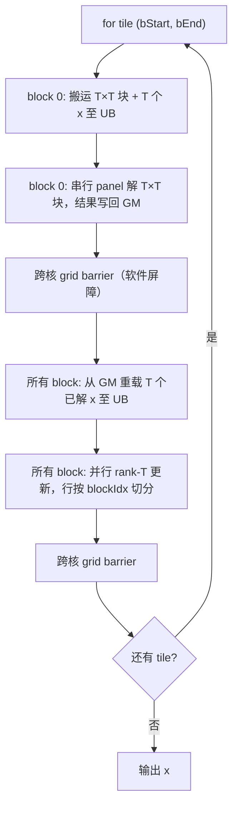
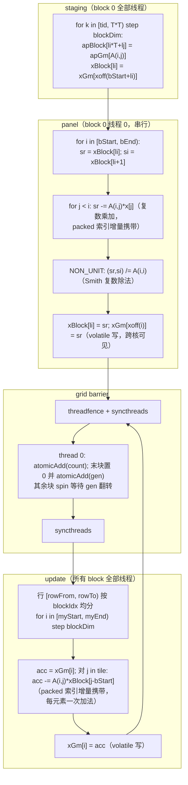

# 【社区任务】aclblasCtpsv 算子设计文档

## 一、需求描述

### 1.1 需求来源

本需求来源于 CANN 社区任务 2026 中的「算子实操工坊-杭州站 - aclblasCtpsv 算子开发（950）」。任务要求基于 Ascend C 编程语言，在昇腾 NPU（Ascend 950PR）上开发单精度复数（complex64）三角压缩存储（packed）求解算子 `aclblasCtpsv`，完成算子设计、开发、测试全流程，验收通过后合入昇腾算子开源仓 ops-blas（https://gitcode.com/cann/ops-blas ）目录 `blas/tpsv/arch35/`。

目标硬件：Ascend 950PR（arch35），CANN 版本 9.1.0。精度 golden 由 cblas（Netlib BLAS 复数实现 ctpsv）生成。

### 1.2 需求分析

`aclblasCtpsv` 求解三角线性系统：

$$
op(A) \cdot x = b
$$

其中 A 为 n×n 三角矩阵，以 packed（压缩）格式存储，共 `n(n+1)/2` 个复数元素；入口时 x 存放右端向量 b，出口时解向量**原地覆写** x。

数学语义分支（与 cuBLAS `cublasCtpsv` / Netlib `ctpsv` 对齐）：

| trans | op(A) | 求解方向 |
|-------|-------|---------|
| ACLBLAS_OP_N | A | 由 uplo 决定 |
| ACLBLAS_OP_T | A^T | 由 uplo 决定 |
| ACLBLAS_OP_C | A^H（共轭转置） | 由 uplo 决定 |

- `uplo = LOWER` 且 `op(A) = A`（下三角）→ **前向代入**（i = 0, 1, …, n-1）；
- `uplo = UPPER` 且 `op(A) = A`（上三角）→ **回代**（i = n-1, …, 0）；
- `uplo = LOWER` 且 `op(A) = A^T / A^H`（上三角）→ 回代；
- `uplo = UPPER` 且 `op(A) = A^T / A^H`（下三角）→ 前向代入。

packed 存储索引（0 基）：

| uplo | 元素 A(i,j) 位置 |
|------|-----------------|
| UPPER（i ≤ j） | `AP[i + j*(j+1)/2]` |
| LOWER（i ≥ j） | `AP[i + (2*n-j-1)*j/2]` |

- `diag = NON_UNIT`：对角元素从 AP 读取；
- `diag = UNIT`：对角元素不被访问、假定恒为 (1,0)；
- 本算子不做奇异/近奇异检测（与 cuBLAS 一致），NON_UNIT 时要求调用方保证对角非零；
- `n = 0` 为合法 no-op，直接返回 `ACLBLAS_STATUS_SUCCESS`。

uplo（2）× trans（3）× diag（2）共 12 组枚举组合，全部由模板参数静态实例化。

## 二、方案设计

### 2.1 整体计算流程

三角求解的难点在于**行间严格的数据依赖**：x[i] 依赖 x[0..i-1]（前向）或 x[i+1..n-1]（回代），直接按行并行无法利用多核。本方案采用**分块消去（blocked forward/backward substitution）**：

- 将行按 `T = 16` 一组划分为 tile（共 `n/T` 个 tile）；
- 每个 tile 内：
  1. **panel 步**：解对角 `T×T` 三角块（唯一串行部分，由单线程执行）；
  2. **update 步**：将刚求出的 T 个未知量一次性作用到其余所有行（`rank-T` 更新，完全并行，切分到多个 AI 核）。



图1 aclblasCtpsv 分块消去整体流程

`T` 的选取是**panel 串行代价（∝ n·T）与屏障次数（∝ n/T）**的折中：实测 T = 16 为最优（T = 8 时屏障次数翻倍、整体变慢约 25%）。

### 2.2 数据搬运与寄存器计算详细流程



图2 数据搬运 + panel + 跨核同步 + 更新四阶段详细流程

两个热点循环均保持**最短指令序列**：packed 索引沿 tile 增量携带（每元素一次加法），而非每次重算二次 packed 公式；循环不展开。实测 SIMT 核为**指令发射受限（issue-bound）**而非访存受限，任何额外指令（展开、多余累加器）都直接体现为变慢。

### 2.3 架构设计

#### Host / Device 分层

```
Host 侧（CPU，aclblasCtpsv）:
  1. 参数校验（uplo/trans/diag 枚举、n≥0、incx≠0、指针非空）
  2. 计算 tiling：n < 128 → 标量路径（1 block）；n ≥ 128 → SIMT 路径
     - numBlocks = min(AIV 核数, 8, n)
     - numThreads = nextPow2(ceil(n/numBlocks))（clamp 到 [32, 2048]）
     - 首次调用一次性 aclrtMalloc 16B 屏障 workspace 并清零
  3. ctpsv_kernel<<<numBlocks, nullptr, stream>>> 启动 kernel
  4. 返回 SUCCESS（异步，结果由调用方同步后读回）

Device 侧（AI Core）:
  GM ──asc_vf_call(CtpsvSimt)──> 各 core 的 SIMT 线程
  每个 core 内通过 UB（apBlock/xBlock）缓存 T×T 块与 T 个 x
  跨 core 通过 GM 软件屏障（原子 + 代计数）同步
```

#### Memory Layout

```
Global Memory (GM):
│  AP: packed 三角矩阵，n(n+1)/2 个 complex64（2×float32），只读
│  x : 向量，1+(n-1)|incx| 个 complex64，原地读写
│  barrier: 16B（arrival 计数器 + generation 代计数），一次性分配
│
├── staging（block 0）──►
Unified Buffer (UB, 每 core 私有):
│  apBlock: T×T×2 float32  ← 当前 tile 的 A 对角块
│  xBlock : T×2  float32   ← 当前 tile 的 x 值（panel 求解结果）
│
└── 跨核共享仅通过 GM 的 x 与 barrier；UB 不跨核
```

x 的跨核一致性是关键难点：多个 core 在不同 tile 读写同一份 x。本方案将 `xGm` 声明为 `__gm__ volatile float*`，使写为**直写（write-through）**、读为**旁路 L1（bypass）**，配合 grid barrier 内的 `asc_threadfence()`，保证跨核可见；这是多核正确性的核心（若用普通非 volatile 指针，跨核读到陈旧 L1 数据，结果错误）。

#### SIMT 并行模型

- 外层 kernel 以 `<<<numBlocks>>>` 启动，每 block 内 `asc_vf_call<CtpsvSimt<...>>(dim3{numThreads}, ...)` 启动 SIMT 线程组；
- `blockIdx.x` 用于切分 update 的行区间，`threadIdx.x`/`blockDim.x` 用于块内 stride 循环；
- panel 由 block 0 的线程 0 串行执行（唯一串行段），其余线程/核在屏障处等待。

#### 跨核 Grid Barrier

SIMT 层无内建跨核屏障，采用**GM 软件屏障**（16B workspace）：

```
barrier[0] = count（到达计数，末块置 0）
barrier[1] = gen   （代计数，末块 +1 释放等待者）

每个 block:
  asc_threadfence();            // 全线程刷写自身 GM 写
  asc_syncthreads();            // 块内：全体线程到达后才由 thread 0 代表本块到达
  thread 0:
    g = *gen;                   // 先读代计数
    old = atomicAdd(count, 1);
    if (old == numBlocks-1): atomicExch(count, 0); atomicAdd(gen, 1);   // 末块释放
    else: while (*gen == g);    // 其余块自旋等待代翻转
  asc_syncthreads();            // 传播 thread 0 的屏障结果
```

屏障次数 = `2 × n/T`（panel 后一次 + update 后一次），即 `O(n/T)`，而非按行 `O(n)`。`numBlocks ≤ AIV 核数`，保证全部 block 常驻，屏障不会死锁。

### 2.4 接口设计

#### Kernel 侧接口

```cpp
// SIMT 内核（多核，n >= 128）
template <bool UPLO_IS_UPPER, bool TRANS_IS_NO_TRANS, bool CONJ, bool DIAG_IS_UNIT>
__simt_vf__ __aicore__ inline void CtpsvSimt(
    uint32_t n, int64_t incx, __gm__ const float* apGm, __gm__ volatile float* xGm,
    uint32_t numBlocks, __gm__ uint32_t* barrier);

__global__ __aicore__ void ctpsv_simt_kernel(CtpsvTilingData tiling);   // 单入口，按枚举分发
void ctpsv_simt_kernel_do(const CtpsvTilingData&, void* stream);        // <<<numBlocks>>> 启动

// 标量内核（n < 128，1 block，逐行回代）
template <CtpsvUplo UPLO, CtpsvTrans TRANS, CtpsvDiag DIAG>
class CtpsvKernel { void Process(); };
```

Tiling 数据结构：

```cpp
struct CtpsvTilingData {
    uint64_t ap, x;          // device 指针
    uint32_t n, uplo, trans, diag;
    int64_t incx;
    uint32_t numThreads;     // 每 block 线程数（0 → 标量路径）
    uint32_t numBlocks;      // grid 大小
    uint64_t barrier;        // 跨核屏障 workspace
};
```

#### Host 侧接口

```cpp
aclblasStatus_t aclblasCtpsv(
    aclblasHandle_t handle, aclblasFillMode_t uplo, aclblasOperation_t trans,
    aclblasDiagType_t diag, int n, const aclblasComplex* AP, aclblasComplex* x, int incx);
```

参数语义与 `cublasCtpsv` 逐参数对应（见任务书 §2.4），非法参数返回 `ACLBLAS_STATUS_INVALID_VALUE`，handle 为空返回 `ACLBLAS_STATUS_HANDLE_IS_NULLPTR`。接口声明放入 `include/cann_ops_blas.h`，供其他产品线共用，无 950PR 私有平行 API。

### 2.5 测试用例设计

测试工程位于 `test/tpsv/ctpsv/`（CSV 驱动 GTest，golden 由 cblas ctpsv 生成），共 **1200 条**：

| 类别 | 前缀 | 条数 | 说明 |
|------|------|------|------|
| 精度 | TC_L0/TC_SQ/TC_INC/TC_FL/TC_CV/TC_ED/TC_EX | 1000 | 12 组枚举全组合 × 尺寸扫描（1→2048）× 步长 ±1/±2/±3 × 填充（均匀/正态/极端/Inf/NaN）× 边界负向 |
| 性能 | TC_PF | 200 | 4 条任务书典型 case + 尺寸对数扫描（1→4096），连续访存 incx=1 |

精度判据（complex64 实部/虚部分别按 FLOAT32）：`|actual - golden| ≤ atol + rtol·|golden|`，atol = 2⁻¹⁶，rtol = 2⁻¹⁰，matched_ratio ≥ 0.99，max_abs_error ≤ 1e-2。

性能判据（`verify_performance.py`）：`NPU 耗时 ≤ gpu_baseline.csv 的 gpu_ms / 0.4`（即 `gpu_ms/npu ≥ 0.4`），对标 GPU H100 基线。

## 三、可维可测

### 3.1 精度标准 / 性能标准

| 验收标准 | 描述 | 标准来源 |
|---------|------|---------|
| 精度标准 | complex64 实部/虚部分别按 FLOAT32：rtol=2⁻¹⁰(9.77e-4)，atol=2⁻¹⁶(1.53e-5)，matched_ratio≥0.99，max_abs_error≤1e-2 | [生态算子开源精度标准](https://gitcode.com/cann/opbase/blob/master/docs/zh/ops_precision_standard/experimental_standard.md) |
| 性能标准 | 每条性能用例 NPU 平均单次耗时 ≤ gpu_ms/0.4（即 gpu_ms/npu ≥ 0.4）；4 条典型 case 标杆：512/971.85us、1024/2074.42us、2048/4012.85us、4096/12481.55us | 任务书 §3.3 + gpu_baseline.csv |

自测结果：**精度 1000 条全部通过**（matched_ratio = 1.0，max_abs_error ≤ 1.2e-5）；**性能 200 条中 195 条通过、5 条 UNIT 用例贴近阈值**（详见自测报告）。

### 3.2 兼容性分析

- 产品限定 Ascend 950PR / 950DT（arch35），Atlas A2/A3 不支持（packed 复数 tpsv 仅新增 950PR）；
- 接口为 ops-blas 仓 `include/cann_ops_blas.h` 新增声明，与同族实数接口 `aclblasStpsv` 逐参数对应、元素类型扩展为 `aclblasComplex`，不影响既有接口；
- 小 n（<128）走标量路径、大 n 走 SIMT 路径，两条路径共享同一 tiling 结构，互不影响。

### 3.3 CANN 9.1.0 适配说明

| 项 | 说明 |
|----|------|
| SIMT 多核 | 目标 CANN 9.1.0 的 `simt_api` 提供 `blockIdx/threadIdx/blockDim` 内建与 `asc_atomic_add/exch`（GM）、`asc_threadfence`、`asc_syncthreads`，多核 `asc_vf_call` 复用仓内 `axpy_ex/arch35` 已验证的模式 |
| 跨核屏障 | SIMT 无内建跨核 `SyncAll`，采用 GM 原子 + 代计数软件屏障；`numBlocks ≤ AIV 核数` 保证常驻不死锁 |
| 跨核数据一致性 | `__gm__ volatile` 指针保证 x 的直写与读旁路 L1，是跨核正确性的关键适配点（普通指针下跨核读到陈旧 L1 数据） |

## 附录：packed 索引公式

```
UPPER: A(i,j), i<=j  →  idx = i + j*(j+1)/2
LOWER: A(i,j), i>=j  →  idx = i + (2*n-j-1)*j/2
```

求解方向：`kForward = (!UPPER && NO_TRANS) || (UPPER && !NO_TRANS)`（前向代入），否则回代。共轭（OP_C）仅在取 A 元素时对虚部取负号。
