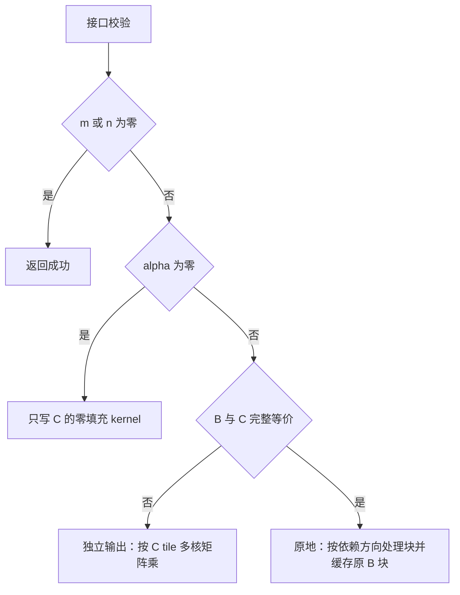

# aclblasCtrmm 算子设计文档（Atlas A2/A3）

本文依据 9 月社区任务书，设计 COMPLEX64 三角矩阵乘算子 `aclblasCtrmm`。
方案覆盖左右乘、上下三角、转置/共轭转置、单位对角、独立输出及 B=C 原地输出，
并明确 A2/A3 的 kernel 直调实现和验收流程。

| 项目 | 内容 |
| --- | --- |
| 版本、日期 | V1.0，2026-09-28 |
| 目标平台 | Atlas A2/A3，主性能设备 Atlas 800T A2（910B3） |
| 工具链与目录 | CANN 9.1.0，Ascend C/CATLASS，`blas/trmm/arch22/` |
| 输入输出 | COMPLEX64，实部/虚部各 FLOAT32，列主序 |

## 1. 需求背景（required）

TRMM 计算三角矩阵与一般矩阵的乘积，不进行前代、回代或除法。
利用三角结构可省去约一半内积项，但输出 C 仍为完整的 m×n 一般矩阵。
NON_UNIT 的零对角是合法输入，不能套用三角求解的非零对角限制。

### 1.1 需求依据

以任务书确定接口契约，以配套测试材料构建验证矩阵。

| 材料 | 用途 |
| --- | --- |
| [任务书](./aclblasCtrmm_A2A3_task_doc.md) | 接口、原地语义及正式门槛 |
| [测试指导](./test_cases/README.md) | GTest 与 profiler 流程 |
| [用例 CSV](./test_cases/trmm_test.csv) | 1000 条功能/精度、200 条性能用例 |
| [GPU 基线](./test_cases/gpu_baseline.csv) | 200 条参考耗时，单位 ms |
| [生成器](./test_cases/gen_csv.py) | 枚举、形状、alpha 和填充规则 |
| [精度驱动](./test_cases/verify_accuracy.py) | 安装 CSV、构建和执行 |
| [官方模板](https://gitcode.com/cann/cann-competitions/blob/master/04_tasks/01_community-task-2026/resources/design_template.md) | 文档结构 |

测试前准备目标 ops-blas 工程和 A2/A3 环境，
检查底层矩阵计算 API、分块缓冲和资源配置的兼容性。

### 1.2 实现重点

离席计算可按 C 的输出 tile 多核并行；原地计算则有覆盖依赖，必须使用独立路径。
复数矩阵乘采用实虚分解，三角和 UNIT 语义在搬运及运算范围上落实，
不能只在读取无效数据后乘零。alpha=0 直接写零，完全不引用 A/B。

## 2. 需求分析（required）

算子必须覆盖 side×uplo×trans×diag 的 24 种组合和合法的矩形形状。

### 2.1 接口与维数

公开声明放入 `include/cann_ops_blas.h`，复用公共复数、枚举、句柄和状态码类型。

```cpp
aclblasStatus_t aclblasCtrmm(
    aclblasHandle_t handle,
    aclblasSideMode_t side,
    aclblasFillMode_t uplo,
    aclblasOperation_t trans,
    aclblasDiagType_t diag,
    int m,
    int n,
    const aclblasComplex *alpha,
    const aclblasComplex *A,
    int lda,
    const aclblasComplex *B,
    int ldb,
    aclblasComplex *C,
    int ldc);
```

令 q 为 A 的阶数，LEFT 时 q=m，RIGHT 时 q=n。

| 参数 | 内存与方向 | 约束 |
| --- | --- | --- |
| handle | Host 输入 | 有效句柄，携带 stream |
| side | Host 属性 | `ACLBLAS_SIDE_LEFT/RIGHT` |
| uplo | Host 属性 | `ACLBLAS_UPPER/LOWER`，描述原始 A |
| trans | Host 属性 | `ACLBLAS_OP_N/T/C` |
| diag | Host 属性 | `ACLBLAS_NON_UNIT/UNIT` |
| m、n | Host 标量 | 非负，B/C 的行数与列数 |
| alpha | Host 复数指针 | 非空；本任务未要求 Device alpha 模式 |
| A | Device，只读 | 列主序 `[lda,q]`，逻辑 q×q；lda≥max(1,q) |
| B | Device，输入 | 列主序 `[ldb,n]`，逻辑 m×n；ldb≥max(1,m) |
| C | Device，输出 | 列主序 `[ldc,n]`，逻辑 m×n；ldc≥max(1,m) |

C 为纯输出，没有 beta 项，不读取旧 C 参与运算。
允许完整等价的 B=C，默认要求指针相等且 ldb=ldc；
除此之外 C 不得与 A/B 重叠，部分重叠不属于合法原地输入。
不因 A/B 只读地址之间重合而凭空增加限制；关键是输出不可破坏仍需引用的输入。

### 2.2 校验与短路

Host 采用以下处理顺序，所有元素跨度、字节数和指针范围计算使用受检 64 位算术。

1. handle 为空返回 `ACLBLAS_STATUS_HANDLE_IS_NULLPTR`。
2. 检查 side/uplo/trans/diag、m/n、lda/ldb/ldc 和 alpha 非空。
   不合法返回 `ACLBLAS_STATUS_INVALID_VALUE`。
3. 若 m=0 或 n=0，直接返回成功，不访问 A/B/C，不启动 kernel。
4. 读取 Host alpha 的实虚部快照，作为 kernel 启动参数传递，
   不让异步 kernel 解引用已经失效的 Host 标量地址。
5. 非空输出必须有有效 C。若 alpha 实虚部均为零，启动精确写零路径，
   允许 A/B=nullptr，不读取 A/B/旧 C。前导维度仍需合法。
6. 非零 alpha 检查 A/B 非空，以及输出范围、原地等价条件和禁止重叠的范围。
7. 按是否原地及形状分派，在 handle 绑定 stream 异步执行。

alpha 的正负零均按零处理；NaN 或 Inf 不判为零。
UNIT 不意味着 A 整体可为空，因为一般仍需引用非对角元素。
状态码表示 Host 校验和下发结果，不在接口内同步等待输出。

### 2.3 需求差异与约束

任务书与 README 不一致处按下表处理，不静默删除任务能力。

| 项目 | 本设计口径 |
| --- | --- |
| README 写 C 与 A/B 均不得重叠，任务书允许 B≡C | 必须实现完整等价 B=C，新增原地测试；部分重叠仍拒绝 |
| 空问题是否豁免 alpha | 任务书明确 alpha 不可空，默认先校验 alpha，再空输入返回 |
| 仅自验一款与双平台验收 | 开发可先验证一款，最终提供 A2/A3；性能主门槛用 910B3 |
| 10 次与大于 10 次有效采样 | 采用至少 5 次 warmup、20 次有效样本 |
| 多种 ULP 表述 | 默认最大绝对误差 1e-2；ULP 口径需固定，不能事后放宽 |

支持 lda/ldb/ldc 表达的非紧凑列主序矩阵，不支持额外 tensor stride 或广播。
不要求逐位确定性，仍必须达到逐元素精度门槛。

## 3. 详细设计（required）

以下下标从 0 开始。用 D=op(A) 表示运算三角矩阵，
原始 A 的存储格式始终由 uplo 决定。

### 3.1 数学公式与引用范围

左右乘分别为：

\[
C_{ij}=\alpha\sum_{k\in K_i}D_{ik}B_{kj}\quad(LEFT),\qquad
C_{ij}=\alpha\sum_{k\in K_j}B_{ik}D_{kj}\quad(RIGHT).
\]

`effectiveUpper=(uplo==UPPER) XOR (trans!=N)`。
有效内积范围如下，包含对角项。

| side | D 的有效三角 | K 范围 |
| --- | --- | --- |
| LEFT | UPPER | k=i…m-1 |
| LEFT | LOWER | k=0…i |
| RIGHT | UPPER | k=0…j |
| RIGHT | LOWER | k=j…n-1 |

A 的线性下标为 `j×lda+i`，B/C 分别为 `j×ldb+i`、`j×ldc+i`。
D 元素的实际读取映射如下。

| trans | D(i,j) |
| --- | --- |
| N | A(i,j) |
| T | A(j,i) |
| C | conjugate(A(j,i)) |

若 i=j 且 UNIT，直接构造 `1+0i`，不读取 A 对角。
原矩阵未指定侧的元素不存在于运算支持集，不读取其存储值。
对非方阵尤其要区分 LEFT 的 q=m 与 RIGHT 的 q=n。

### 3.2 路径选择

Host 根据 alpha、别名和形状选择路径，不把矩阵数值搬回 Host 决策。



内部 tiling 包含 m/n/q、各 leading dimension、alpha 实虚部、
有效三角、side/trans/diag、tileM/tileN/tileK、是否原地和工作核数。
公共接口不增加 workspace 参数，不限制矩形比例或只支持性能表中的正方形。

### 3.3 离席计算：输出 tile 独占

将 C 按 `Mt×Nt` 分块，每个工作核独立负责一个或多个输出 tile，
K 方向在该核内分段累加，不需要输出浮点原子加。

```text
for 当前核负责的每个 C tile:
    实部、虚部累加器置零
    for K tile 与三角支持集的有效交集:
        精确加载并变换 A 的指定部分
        加载本次内积真正需要的 B 部分
        执行复数乘加
    将复数累加结果乘 alpha
    写出 C 的有效 tile，不读取旧 C，不覆盖 padding
```

完整位于结构零区域的 tile 直接跳过。
完整有效的非对角 tile 采用一般复数矩阵乘；跨对角 tile 单独裁剪。
有限输入可在片上填充结构零供矩阵指令使用，
但若 B 有 Inf/NaN，填零后计算 `0×Inf` 可能污染本不应引用的结果，
此时必须使用严格有效区间的计算路径，不能仅靠稠密 GEMM 加零填充。

### 3.4 复数矩阵乘和计算精度

对每个实虚分离的乘积 X·Y，采用四个实矩阵乘积组合：

\[
R=X_rY_r-X_iY_i,\qquad I=X_rY_i+X_iY_r.
\]

最后对每个结果乘 alpha：

\[
C_r=\alpha_rR-\alpha_iI,\qquad
C_i=\alpha_rI+\alpha_iR.
\]

首版不采用三实数乘的 3M 变换，以减少额外加减导致的消去误差。
四实数乘的底层后端仍须明确乘法输入、累加和舍入精度。
不能仅因为输出为 FLOAT32，就假定 A2/A3 的某个 Cube 模式保留完整 FLOAT32 乘法。

优先选用工具链支持且通过验证的 FLOAT32 后端；
若使用拆分补偿或低精度 Cube 加速，需单独说明分解/缩放算法、误差界及回退条件，
并通过本任务全部误差门槛。未证明前使用 FLOAT32 向量路径保证正确性。
各矩阵模式须在目标硬件上按相同精度标准验证。

小形状、对角交叉 tile、极值和非有限输入保留逐项复数运算路径。
特殊值路径按 Netlib 相应 side/trans 的运算顺序和零值分支对齐，
不依赖复数代数重排在 Inf/NaN 下仍然等价。
若需从快路径转入兼容路径，在输出写回前完成判定，不能使用已覆盖的输入重算。

### 3.5 B=C 原地计算

原地计算采用按独立行/列组划分的所有权，
并在每个工作组内部按三角依赖顺序推进，无需完整 B 副本。

| side | D 的有效三角 | 输出覆盖顺序 | 可并行维度 |
| --- | --- | --- | --- |
| LEFT | UPPER | 行从小到大 | 不同 B/C 列组 |
| LEFT | LOWER | 行从大到小 | 不同 B/C 列组 |
| RIGHT | UPPER | 列从大到小 | 不同 B/C 行组 |
| RIGHT | LOWER | 列从小到大 | 不同 B/C 行组 |

例如 LEFT/UPPER 的第 i 行只需要原 B 的第 i 行及其下方，
先覆盖小行号不会影响后续大行号的计算。
RIGHT/UPPER 的第 j 列需要原 B 的 0…j 列，因此先覆盖大列号。
此顺序与三角求解的方向不同，不能复用求解方向表。

分块时，即使块间顺序正确，同一对角块内仍有原 B 读写依赖。
每个工作组先完整缓存当前 B 块，再计算整个对应 C 块，最后统一覆盖。

```text
LEFT：一个工作组拥有一组输出列
for 行块 I in 依赖允许的方向:
    originalBI = 当前行块、当前列组的原 B 快照
    accumulator = D[I,I] * originalBI
    累加三角支持集内其余尚未覆盖的 B 行块贡献
    accumulator *= alpha
    完成全部读取后覆盖 B[I,当前列组]
```

RIGHT 将行列角色互换：工作组拥有一组输出行，按列块推进。
块内乘法可使用局部矩阵计算，其他工作组不读取本组的 B 元素，
因此不需要跨工作组逐块同步。
精确长度写回不能跨过行组、列组或 padding 的边界。

当片上容量不足以缓存候选块时缩小块，不扩大到完整 m×n 全局副本。
原地 kernel 可比离席 kernel 并行度低，但功能必须完整，不能因性能模板只测离席而省略。

### 3.6 缓冲、流水与尾部

外部 `aclblasComplex` 使用仓库布局，集成时确认实虚顺序及 8 字节大小。
片上数据转为实虚分离形式，用双缓冲预取下一组 A/B tile。

纯向量后端可采用保守 UB 预算：

\[
U\approx32(M_tK_t+K_tN_t)+12M_tN_t+S.
\]

其中输入各含交错暂存、实虚分离及双缓冲，
输出含两个实数累加器与可复用乘积临时区，S 包括对齐和 API 临时空间。
原地路径另计当前 B 块快照；若已由输入缓冲持有，应明确生命周期后才可复用。
采用 Cube 时将 UB、L1、L0 分别预算，不能沿用单一存储层假设。

实际 tile 由平台能力和编译资源选择，不写死硬件容量。
K 尾块、矩形边缘和对角边界均按有效范围处理。
搬运完成后才消费，累加结果完成后才写回，输入缓冲消费结束后才预取覆盖。
原地路径当前块所有贡献完成后才能推进到下一个块。

### 3.7 复杂度与实现目录

LEFT 的有效复数乘积项为 `n×m(m+1)/2`，
RIGHT 为 `m×n(n+1)/2`，每个普通复数乘加约为 8 次实数运算，
另有每个输出一次 alpha 乘法。
UNIT 可省去对角乘法但不能省去对应 B 的贡献。

```text
ops-blas/
├── include/cann_ops_blas.h
├── blas/trmm/arch22/             # Host、离席/原地kernel、共享复数计算
└── test/trmm/ctrmm/arch22/       # ctrmm_test.csv、GTest及补充用例
```

本地 `trmm_test.csv` 按配套驱动安装为 `ctrmm_test.csv`。
复用矩阵加载、实虚变换和三角掩码模块，不为 24 组合复制 24 套源码。
接口内部不必申请额外 Device 全局数据 workspace，运行时自身开销另记。

## 4. 可维可测分析

验收以完整 C 为对象，独立验证三角引用、alpha、原地读写、复数精度及性能。

### 4.1 Golden 和精度

正式 golden 使用 Netlib `cblas_ctrmm`。
由于经典 CBLAS TRMM 原地覆盖 B，测试侧先将原 B 复制到 golden 工作矩阵，
执行参考乘法，再与 NPU 的 C 比较；不得把已被 NPU 改写的 B 用于生成参考。

COMPLEX64 按实部、虚部分别检查 rtol=atol=2^-13、匹配率≥0.99，
默认最大绝对误差≤1e-2。比较完整 m×n 输出，不能只比较三角部分。
特殊值按分量分类和 Inf 符号检查，不让 NaN 参与普通误差统计。
不要求逐位一致，但各模式均须通过精度门槛。

### 4.2 测试范围与补充场景

测试将覆盖配套 CSV 的 1200 条用例，类别如下，并增加后文列出的补充场景。

| 类别 | 条数 | 类别 | 条数 |
| --- | ---: | --- | ---: |
| L0 基础 | 24 | SQ 尺寸 | 23 |
| AB 标量 | 24 | WS 宽矩阵 | 12 |
| TH 窄矩阵 | 12 | LD padding | 12 |
| FL 填充 | 13 | CV 枚举 | 24 |
| ED 边界 | 23 | EX 扩展 | 833 |
| PF 性能 | 200 | 功能/精度合计 | 1000 |

必须增加以下针对性用例。

- 全 24 组合的 B=C，含矩形、padding、块宽±1、单行/单列和多核所有权边界。
- B=C 但 ldb≠ldc、C 与 B 部分重叠、C 与 A 重叠，检查明确拒绝策略。
- 非方阵 LEFT/RIGHT 对同一 m/n 的 A 阶数和转置寻址，避免仅验证 A 较小的形状。
- alpha=0 搭配空 A/B、A/B 含 NaN/Inf、旧 C 为 NaN，结果有效区域必须为零。
- UNIT 仅毒化对角、未引用三角毒化、padding/保护区哨兵。
- NON_UNIT 全零 A 和零对角，确认乘法接口不做奇异性拒绝或对角强化。
- alpha=1、-1、i、1+i、一般复数、极值及特殊值，分别验证实虚部。
- 均匀/正态各半的 A/B、长 K 规约、消去误差和非有限的结构零边界。
- 非默认 stream、Host alpha 快照、并发独立输出和原地输入恢复。

原地别名测试应使用专用用例或显式别名配置。
null_handle 由 description 触发；null_alpha 使用 `alpha_real=null` 编码，
不能只将它当浮点文本解析失败。空 lda/ldb/ldc 表示采用最小合法值，
显式的非法值不能被同一默认逻辑修正。

### 4.3 测试材料接入检查

接入时将检查数据分布、比较器、执行器及原地别名支持。

- 检查 `--dist mixed` 对应的填充逻辑，要求随机类数据的均匀和正态分布各占 50%。
- 按 §4.1 检查 C++ 比较器，覆盖混合容差、匹配率、最大误差和特殊值分类。
- 核对执行数量与子进程返回码；超时、零用例、缺少结果和异常退出均不得判为通过。
- 生成扩展 CSV 时另存文件，避免覆盖配套 GPU 基线。
- 按任务书验证合法 B=C 原地输出，对部分重叠及非法 leading dimension 检查拒绝行为。

### 4.4 性能目标与采样

前五条性能用例 alpha=1，leading dimension 取最小合法值。
下表规定 NPU 平均单次 kernel 耗时的判定上限。

| case | m | n | side | uplo | trans | diag | NPU 上限（μs） |
| --- | ---: | ---: | --- | --- | --- | --- | ---: |
| 1 | 256 | 256 | LEFT | UPPER | N | NON_UNIT | 104.6 |
| 2 | 512 | 512 | LEFT | LOWER | C | NON_UNIT | 235.2 |
| 3 | 1024 | 1024 | LEFT | UPPER | T | UNIT | 803.8 |
| 4 | 2048 | 2048 | RIGHT | LOWER | N | NON_UNIT | 3241 |
| 5 | 4096 | 4096 | LEFT | UPPER | C | NON_UNIT | 19931 |

GPU 参考来源为配套 `gpu_baseline.csv`。
其他用例按 `T_NPU(μs)≤1000×gpu_ms/0.8` 对照；典型表使用任务书门槛。
先验证精度，至少 warmup 5 次、有效采样 20 次，逐 case 统计平均值。
离席重复运行可复用不变 A/B；原地每次必须恢复原 B，不能反复乘上一次结果。

若实现有独立打包、实矩阵乘、复数组合或写回 kernel，
计时需汇总一次 API 的全部必要 kernel。
不能只取四实数乘中的一个时间，也不能忽略原地缓冲相关的必要设备开销。
Host 数据准备、参考计算和输入恢复不计入 kernel 时间。

```bash
python verify_accuracy.py --repo /path/to/ops-blas --soc ascend910b3 --csv ./trmm_test.csv
msprof op --application="/path/to/ops-blas/build/test/trmm/ctrmm/ctrmm_test --gtest_filter=*TC_PF_1001*" --output=./prof_ctrmm
```

实际程序需提供正确采样循环和 case 关联；保存 profiler 明细、有效样本数及均值。
主性能在 910B3 测量，最终提供 A2/A3 两款平台验证记录。

### 4.5 内存与风险

非空问题的存储跨度为 `8×lda×q`、`8×ldb×n`、`8×ldc×n` 字节。
原地 B=C 只统计一个共享分配，不重复计算显存占用。
检查 A/B 只读、C 全量覆盖、padding 不变、原地块快照和工作核写回范围。

主要风险为原地覆盖方向、转置后三角裁剪、复杂矩阵模式的精度、
alpha=0 的无引用保证及 Inf/NaN 与结构零的相互作用。
通过全组合原地用例、非方阵、毒化、严格参考路径和完整 profiling 分别闭环。

### 4.6 小规模算法对照测试

将使用固定随机种子，在 1×1、1×5、5×1、3×5、5×3、7×9、17×13
七种形状上覆盖全部 24 种枚举组合，alpha 至少取 1、-1、i、1+i。
分别测试独立输出和 B=C 原地输出；原地路径按块宽 1/2/4/8
检查四种覆盖方向及块内原 B 快照，并加入 UNIT 对角毒化与 padding 哨兵。

将输出与稠密 COMPLEX128 参考乘法比较，按 §4.1 的实虚部分量标准判定。
要求原地与独立输出均满足精度门槛，毒化前后有效输出一致，padding 保持不变。
NPU 矩阵后端、并发搬运、特殊值与性能按 §4.1～§4.5 分别测试。

## 5. 测试判定汇总

测试将覆盖完整 C、原地输出和两个目标平台，并按以下标准分别判定。

| 测试项目 | 方法 | 判定标准 |
| --- | --- | --- |
| 接口与原地语义 | 24 组合覆盖左右乘、矩形、B=C 和非法重叠 | 输出范围、返回码和别名行为符合 §2 |
| 数值精度 | 配套及补充用例与 Netlib golden 比较 | 完整 C 的实虚部均满足 §4.1，特殊值分类一致 |
| 内存与短路 | 对角毒化、padding 哨兵、alpha=0 与多 stream 测试 | 不引用禁止读取的区域，不越界，不发生原地数据覆盖错误 |
| 平台覆盖 | 分别在 A2/A3 执行功能与精度测试 | 两个平台均满足接口和数值标准 |
| 性能 | 按 §4.4 在 910B3 采集完整调用耗时 | 每个 case 的平均 kernel 耗时满足对应上限 |
| 流程完整性 | 核对计划用例、执行数量及返回码 | 用例不得遗漏，异常退出或缺少结果不得判为通过 |
