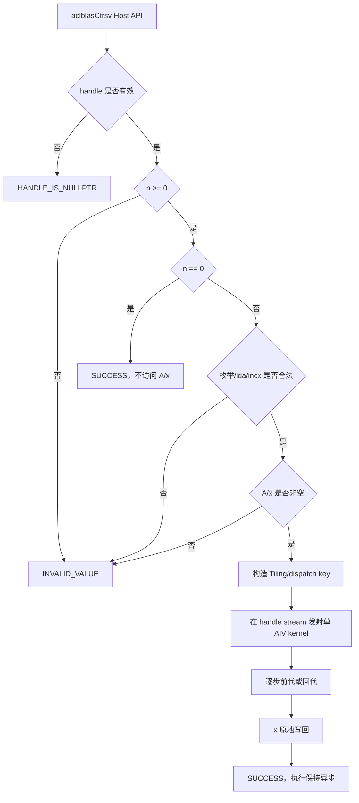
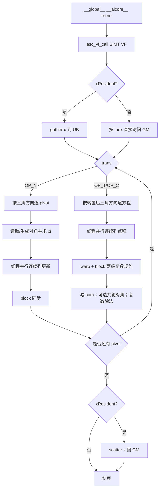

# aclblasCtrsv 算子开发方案（Ascend 950PR）

> 文档状态：开发前设计方案，尚未完成代码实现、编译、真机精度或性能验证。  
> 目标平台：Ascend 950PR，arch35 / DAV_3510，CANN 9.1.0。  
> 目标代码仓：`cann/ops-blas`。  
> 任务依据：`aclblasCtrsv_Atlas950PR_task_doc.md` 及其配套 `test_cases/`。  
> 仓库参考快照：ops-blas commit `621aafdbac67d19169b7ec2c589ee3efaf02c679`（2026-08-17）。实现前必须以实际开发分支最新代码复核本文所列路径、接口和构建规则。

## 文档结论摘要

本任务在 ops-blas 中新增公共接口 `aclblasCtrsv`，并在 `blas/trsv/arch35/` 增加 Ascend 950PR 的 Host、Tiling 和 Kernel 实现。算子求解列主序 complex64 三角线性系统 `op(A)·x=b`，支持 UPPER/LOWER、N/T/C、UNIT/NON_UNIT、正负 `incx`，结果原地写回 x。

首版采用单 AIV block 的 SIMT 实现。三角求解在步间存在严格依赖，不对求解步做无同步的多核拆分；在步内利用 SIMT 线程并行：

- `OP_N` 使用右看式（scatter）连续列更新；
- `OP_T/OP_C` 使用左看式（gather）连续列点积，`OP_C` 对矩阵元素及非单位对角取共轭；
- `n <= 4096` 时将逻辑 x 驻留 UB，入口 gather、出口 scatter，避免每一步反复访问 GM；
- 超过 UB 驻留上限时保留 GM 正确性回退路径；
- 仅访问 `uplo` 指定三角，`diag=UNIT` 时不读取对角；
- 复数除法采用缩放分支算法，避免朴素公式中 `c²+d²` 的中间溢出。

性能优化必须由 Ascend 950PR 真机 Profiling 驱动。若单 block 路径未达到五个硬门槛，再按“减同步—调线程数—分块更新—多 AIV 波前”的顺序迭代，不能在没有板端数据时宣称达标。

# 一、需求背景

## 1.1 需求来源

需求来源于 2026 年 9 月社区任务“aclblasCtrsv 算子开发（950）”。目标是在 Ascend 950PR 上使用 Ascend C/SIMT 编程模型完成单精度复数三角矩阵求解算子的设计、开发和自验，并按 ops-blas 社区规范提交代码、测试、README、设计文档和自测报告。

## 1.2 背景介绍

### 1.2.1 aclblasCtrsv 实现及参考路径

`aclblasCtrsv` 是 BLAS Level-2 三角求解接口，语义对齐 cuBLAS `cublasCtrsv` 与 Netlib BLAS `ctrsv`：

```text
op(A) · x = b
```

A 是 n×n complex64 上/下三角矩阵，按列主序存储；x 入口为右端 b，出口原地覆写为解。`op(A)` 分别为 A、A^T 或 A^H。

本任务不是 TBE/aclnn 算子迁移，而是 ops-blas 句柄式 API 的 Ascend C kernel 直调开发，因此不存在可作为源实现的 TBE Python 文件和算子信息库 JSON。Checklist 中“TBE 源码路径、信息库路径、TBE 流程”在本任务中判定为不适用，不能虚构路径。替代的、可核验的参考源如下：

| 参考对象 | 路径/来源 | 用途 |
| --- | --- | --- |
| 公共声明 | `include/cann_ops_blas.h` | 新增 `aclblasCtrsv`，签名与现有 `aclblasStrsv` 对齐 |
| 复数类型与状态码 | `include/cann_ops_blas_common.h` | `aclblasComplex {float real; float imag;}`、枚举和返回码 |
| 同族 Host | `blas/trsv/arch35/strsv_host.cpp` | 参数校验、Handle stream、Tiling 传递和 kernel 直调 |
| 同族 Kernel | `blas/trsv/arch35/strsv_kernel.cpp` | 950 SIMT VF、UB 驻留、步内归约和单 block 发射方式 |
| 同族 Tiling | `blas/trsv/arch35/strsv_tiling_data.h` | Host/Kernel POD 协议 |
| 同族测试 | `test/trsv/strsv/` | CSV 参数读取、CBLAS Golden、正负步长和返回码测试框架 |
| 复数 arch35 实现 | `blas/herk/arch35/cherk_*` | complex64 交织布局、实虚拆分及 950 AIV 工程写法 |
| 语义基线 | Netlib `ctrsv.f` | 三角引用、单位对角、步长和 quick return 语义 |
| 对标接口 | cuBLAS `cublasCtrsv` | 参数顺序、枚举和异常语义 |

### 1.2.2 现状分析

#### 1.2.2.1 已有实现支持的数据类型和格式

当前参考快照中 `include/cann_ops_blas.h` 只有 `aclblasStrsv`，`blas/trsv/arch35/` 只有 FP32 实数实现；尚无 `aclblasCtrsv` 公共声明和 arch35 complex64 实现。

| 能力 | 现有 `aclblasStrsv` | 本任务 `aclblasCtrsv` |
| --- | --- | --- |
| 元素类型 | float32 | complex64（两个 float32 分量） |
| A 布局 | ND，列主序，物理 `lda×n` | 同左 |
| x 布局 | 一维，支持正负 incx | 同左 |
| uplo | UPPER / LOWER | UPPER / LOWER |
| trans | N / T / C；实数 T 与 C 等价 | N / T / C；C 必须共轭 |
| diag | NON_UNIT / UNIT | NON_UNIT / UNIT |
| 输出 | x 原地覆写 | x 原地覆写 |

#### 1.2.2.2 参考实现逻辑

由于无 TBE 版本，本文以 Netlib 语义和仓内 arch35 `aclblasStrsv` 工程结构为参考。逻辑为：

1. Host 先校验 Handle 与 `n>=0`；
2. `n=0` 直接返回成功，不再校验 uplo/trans/diag/lda/incx/A/x，也不发射 kernel；
3. `n>0` 时校验枚举、lda、incx 和指针；
4. Host 将运行时参数写入紧凑 Tiling POD，通过 Handle 中的 stream 异步发射；
5. Kernel 根据 uplo/trans/diag 选择模板实例；
6. 按有效三角和求解方向逐步前代或回代；
7. 每步并行更新剩余 x，或并行计算当前方程的复数点积；
8. NON_UNIT 执行复数除法，UNIT 跳过对角读取和除法；
9. 将结果按 incx 映射原地写回。

#### 1.2.2.3 参考实现流程图（TBE 项替代说明）



该图是 BLAS 直调等价流程，不是 TBE 流程。正式评审时应在 PR 说明中保留此“不适用”结论，防止审核者误以为遗漏 TBE 分析。

# 二、需求分析

## 2.1 外部组件依赖

| 依赖 | 版本/用途 | 约束 |
| --- | --- | --- |
| CANN Toolkit | 9.1.0，Ascend C 编译、Runtime、ACL | 目标架构必须为 DAV_3510 / ascend950 |
| Ascend 950PR | 精度、性能、内存和 Profiler 验证 | 本机无可用 950 环境时只能做静态审查，不能宣称通过 |
| Netlib/CBLAS | `cblas_ctrsv` Golden | 输入必须与 NPU 完全一致 |
| GoogleTest | ops-blas 测试框架 | 复用仓内 CSV 驱动模式 |
| cuBLAS/H100 基线数据 | 性能对标 | 使用任务配套 `gpu_baseline.csv`，不要求运行时依赖 CUDA |

不依赖 TBE、GE 图编译、aclnn 或第三方复数库完成 NPU 计算。

## 2.2 内部适配模块

| 模块 | 计划改动 |
| --- | --- |
| `include/cann_ops_blas.h` | 新增公共 `aclblasCtrsv` 声明，不定义 950 私有 API |
| `blas/trsv/arch35/ctrsv_host.cpp` | 参数校验、Tiling、路径选择、kernel launch |
| `blas/trsv/arch35/ctrsv_tiling_data.h` | Host/Kernel 固定宽度协议 |
| `blas/trsv/arch35/ctrsv_kernel.cpp` | complex64 SIMT 前代/回代 |
| `blas/trsv/README.md` | 增加 Ctrsv 语义、参数、约束和 950PR 支持表 |
| `test/trsv/ctrsv/CMakeLists.txt` | 接入测试构建 |
| `test/trsv/ctrsv/ctrsv_param.h` | CSV 参数解析 |
| `test/trsv/ctrsv/ctrsv_golden.h` | CBLAS complex64 Golden 和异常口径 |
| `test/trsv/ctrsv/arch35/*` | NPU wrapper、GTest、1200 条 CSV |
| `docs/zh/api_list.md` | 若仓库规范要求，新增接口索引 |

实现前需检查最新分支是否已由其他产品线添加 `aclblasCtrsv`。若声明已存在，只复用并保证 ABI 一致，禁止重复声明或改变既有签名。

## 2.3 需求模块设计

### 2.3.1 Ascend C 算子原型

```cpp
aclblasStatus_t aclblasCtrsv(
    aclblasHandle_t handle,
    aclblasFillMode_t uplo,
    aclblasOperation_t trans,
    aclblasDiagType_t diag,
    int n,
    const aclblasComplex* A,
    int lda,
    aclblasComplex* x,
    int incx);
```

| 参数 | I/O | 类型/位置 | 语义与约束 |
| --- | --- | --- | --- |
| handle | 输入 | Host handle | 非空，携带 stream |
| uplo | 输入 | Host enum | UPPER(121) 或 LOWER(122) |
| trans | 输入 | Host enum | OP_N(111)、OP_T(112) 或 OP_C(113) |
| diag | 输入 | Host enum | NON_UNIT(131) 或 UNIT(132) |
| n | 输入 | Host int | n≥0；n=0 为合法 no-op |
| A | 输入 | Device complex64* | n>0 时非空；列主序，物理 `lda×n` |
| lda | 输入 | Host int | `lda >= max(1,n)` |
| x | 输入/输出 | Device complex64* | n>0 时非空；物理长度 `1+(n-1)|incx|` |
| incx | 输入 | Host int | 非零，可正可负 |

### 2.3.2 与参考能力对齐及缺失项

相对 cuBLAS/Netlib：功能、参数顺序、三角引用、UNIT、不检测奇异性、正负步长和原地语义全部对齐。相对任务书不缺失功能。

明确不支持或不承诺的能力：

- 仅支持 complex64，不扩展 complex128；
- 不支持超出 lda/incx 语义的任意 Tensor view；
- 不做奇异或近奇异检测；
- 不提供广播、batch 或 out-of-place 变体；
- 不保证与 CBLAS bit-exact，只按任务书 FP32 分量精度标准验收；
- 仅承诺任务要求的 Ascend 950PR，950DT 不能因同为 arch35 而自动宣称已验证。

# 三、需求详细设计

## 3.1 使能方式

算子使用 ops-blas Handle API 直接调用：调用方通过 `aclblasCreate` 创建 Handle，使用 `aclblasSetStream` 绑定 stream，再调用 `aclblasCtrsv`。Host 仅通过 `<<<>>>` 启动 `__global__ __aicore__` kernel；Host 不直接调用 `__aicore__`/VF 函数。接口在传入 stream 上异步执行，算子内部不执行 `aclrtSynchronizeStream`。

SIMT 编译目标必须与 950 一致：

```text
--npu-arch=dav-3510 --enable-simt
```

实际参数由 ops-blas 构建系统生成，开发时应检查编译命令而不是另建绕过仓库的私有构建入口。普通 SIMD 文件不得无条件继承 `--enable-simt`。

## 3.2 需求总体设计

### 3.2.1 Host 侧设计

#### 3.2.1.1 参数校验和分核策略

校验顺序：

1. `handle == nullptr`：返回 `ACLBLAS_STATUS_HANDLE_IS_NULLPTR`；
2. `n < 0`：返回 `ACLBLAS_STATUS_INVALID_VALUE`；
3. `n == 0`：直接返回 SUCCESS，不再检查 uplo/trans/diag/lda/incx/A/x，不发射 kernel；该顺序与仓内 arch35 `aclblasStrsv` 及任务书“直接返回”口径一致；
4. `n > 0` 时校验 uplo/trans/diag、`incx != 0`、`lda >= max(1,n)`；
5. `n > 0` 时 A 或 x 为空：返回 INVALID_VALUE；
6. 64 位计算 A/x 最大物理偏移，防止 `int` 乘法溢出后生成错误地址。

采用一个 AIV block。原因是第 k 个未知量依赖此前已解结果，跨 block 直接切分求解步会引入全局同步和可见性问题。单 block 内由 T 个 SIMT 线程并行处理当前步的点积或尾向量更新。

初始线程数为 128，与仓内 `strsv/arch35` 保持一致；在真机上对 T∈{64,128,256,512} 做参数扫描。Host 选择结果需固定为可解释规则，不能按测试 case ID 特判。

#### 3.2.1.2 数据分块和 Local Memory 优化策略

逻辑 x 下标到物理复数元素偏移为：

```text
p(i) = i * incx                       , incx > 0
p(i) = (n - 1 - i) * abs(incx)       , incx < 0
```

`n <= 4096` 时，入口将逻辑 x gather 到 UB 连续数组，求解完成后 scatter 回原物理位置。`abs(incx)==1` 仍按统一逻辑处理，但可增加连续批量搬运快路。x 的空洞元素不得改写。

UB/Data Cache 预算按最坏 n=4096、T=128 计算：

```text
xUb             = n * sizeof(complex64)      = 4096 * 8 = 32768 B
partial real/imag = 2 * T * sizeof(float)    = 2 * 128 * 4 = 1024 B
固定预留          = 8192 B
静态合计          = 41984 B（约 41 KiB，另加对齐余量）
```

所有 UB 起始地址按 32B 对齐。Ascend 950 的 UB 总量为 256 KiB；SIMT Data Cache 还需保留 32–128 KiB。即使按 64 KiB Data Cache 核算，`41 KiB + 64 KiB < 256 KiB`，仍有充足余量。实际编译后必须检查静态 UB、栈和寄存器报告；若编译器为 SIMT 保留更大 Data Cache，则据报告调整数组上限，不能只按 256 KiB 名义容量设计。

当 n 超过 x 驻留上限时，使用 GM 正确性回退路径，仍按 p(i) 访问 x。该路径优先保证接口完整性，不作为任务性能 case 的快路。

A 不整体搬入 UB。每一步只流式访问有效列段：complex64 在 GM 中为 `{real,imag}` 交织的 8B 元素；地址为 `2*(row + col*lda)` 个 float。不得读取另一三角、UNIT 对角或 lda padding。

#### 3.2.1.3 TilingKey / dispatch key 规划

本算子是 kernel 直调，不使用通用算子框架的 TilingKey 注册机制。为满足分支可审计性，在 TilingData 中设置 `dispatchKey`，Host 与 Kernel 共用位定义：

| bit | 含义 |
| ---: | --- |
| 0 | `uplo==UPPER` |
| 1 | `trans!=OP_N` |
| 2 | `trans==OP_C` |
| 3 | `diag==UNIT` |
| 4 | x 走 UB resident 快路 |

Kernel 外层仅按 dispatchKey 选择模板实例，热循环不反复判断枚举。TilingData 建议为：

```cpp
struct CtrsvTilingData {
    uint32_t n;
    uint32_t dispatchKey;
    int32_t lda;
    int32_t incx;
    uint32_t numThreads;
    uint32_t reserved;
};
```

字段使用固定宽度、自然对齐并在 Host/Kernel 两侧 `static_assert(sizeof(...))`。若实际仓库要求保留原始 uplo/trans/diag 便于日志，可加入字段，但不能同时保留可推导的冗余 64 位数据。

### 3.2.2 Kernel 侧设计

#### 3.2.2.1 数学与实现描述

定义复数乘法：

```text
(ar + i ai) * (xr + i xi)
= (ar*xr - ai*xi) + i(ar*xi + ai*xr)
```

复数除法使用 Smith 风格缩放分支。令 z=(a+ib)/(c+id)：

```text
若 |c| >= |d|：r=d/c，den=c+d*r，z=((a+b*r)/den) + i((b-a*r)/den)
否则：        r=c/d，den=d+c*r，z=((a*r+b)/den) + i((b*r-a)/den)
```

任务不检测 `c+id==0`；调用方保证 NON_UNIT 对角非零。UNIT 时直接跳过除法且禁止读取 A(i,i)。OP_C 的非单位对角也必须先共轭再除。

求解方向：

| uplo | trans | 有效三角 | 方向 |
| --- | --- | --- | --- |
| LOWER | N | 下三角 | i=0→n-1 |
| UPPER | N | 上三角 | i=n-1→0 |
| UPPER | T/C | 转为下三角 | i=0→n-1 |
| LOWER | T/C | 转为上三角 | i=n-1→0 |

`OP_N` 采用右看式连续列更新：

```text
xi = UNIT ? x[i] : x[i] / A(i,i)
对尚未求解的 r 并行：x[r] -= A(r,i) * xi
```

列主序下 A(r,i) 连续，线程按 `r = begin + threadIdx.x + k*blockDim.x` 访问。每个线程写互不重叠的 x[r]，无需原子操作。pivot 发布与本步更新之间、当前步完成与下一步之间使用全 block 同步。

`OP_T/OP_C` 采用左看式连续列点积：

```text
sum = Σ solved j op(A)(i,j) * x[j]
xi  = x[i] - sum
xi  = UNIT ? xi : xi / op(A)(i,i)
```

实际读取 A(j,i)，仍是一段连续列。每线程累加 real/imag 两个 float，先做 warp 内 `asc_shfl_down` 规约，再由各 warp lane0 写入 UB partial，block 同步后由首个 warp完成二级规约，并把唯一结果广播。所有线程必须以一致的循环次数到达 `asc_syncthreads`，同步不得放入线程分歧分支。

首版可用较保守的两阶段同步确保正确性；Profiler 证明同步为瓶颈后，再引入 pivot 软件流水和单 barrier 版本。任何减同步优化都必须通过重复运行、不同 stream 和 NaN/Inf 用例排除竞态。

#### 3.2.2.2 Ascend C 实现流程图



#### 3.2.2.3 与参考流程的差异及原因

| 差异 | 参考 `aclblasStrsv` | `aclblasCtrsv` 设计 | 原因 |
| --- | --- | --- | --- |
| 数据表示 | 单 float | 交织 real/imag 两个 float | complex64 ABI |
| OP_C | 与 T 等价 | 对 A 及对角取共轭 | 复数数学语义 |
| 乘减 | 实数 FMA/加减 | 四次实乘和两次加减 | 复数乘法 |
| 除法 | float 除法 | 缩放式复数除法 | 降低中间溢出/下溢风险 |
| OP_N 访存 | 参考实现可按方程读取 | 右看式连续列 scatter | 列主序中连续列更利于 950 Data Cache/GM 合并访问 |
| T/C 规约 | 一个实数 partial | real/imag 双 partial | 复数点积 |
| UB x | 最多 4096 float | 最多 4096 complex64 | 容量翻倍但仍满足 950 预算 |
| TBE 流程 | 不存在 | 以 Netlib + ops-blas 同族为基线 | 本任务不是 TBE 迁移 |

## 3.3 支持硬件

| 硬件 | 支持结论 | 说明 |
| --- | --- | --- |
| Ascend 950PR | 计划支持 | 本任务唯一要求，arch35 / DAV_3510 |
| Ascend 950DT | 未验证，不宣称支持 | 即使同属 3510，也需构建和板端验证后更新 |
| Atlas A2/A3 | 本 arch35 实现不适配 | 由 arch22 或其他对应目录负责 |

## 3.4 算子约束限制

- A、x 均为 Device 指针；Handle、枚举和整数参数为 Host 值；
- A 为列主序，`lda >= max(1,n)`；
- x 仅支持 incx 表达的一维步长，incx 可正可负但不能为 0；
- n=0 合法返回成功，不访问 A/x；n>0 时 A/x 不能为空；
- 仅引用 uplo 指定三角；UNIT 对角不读取；
- 不检查奇异或近奇异矩阵；
- 输入输出仅为 complex64；
- 不涉及 broadcast、batch、dynamic Tensor shape 或额外 workspace；
- 接口异步执行，调用方在 stream 完成前必须保持 A、x、Handle 有效；
- 不允许 Host 端计算结果或隐式同步来规避 Kernel 实现。

## 3.5 API 合法性与 950 专项证据

实现时每个新增 device API 必须形成“文档—声明—仓内样例/测试”证据链。首版计划仅使用仓内 `strsv/arch35` 已采用的 SIMT 能力：

| 能力 | 证据/约束 | 本设计用法 |
| --- | --- | --- |
| `asc_vf_call` | 9.1.0-beta.1 SIMT API §3.2.1；线程总数≤2048；950 类产品支持；仓内 strsv 已使用 | 单 AIV 启动 SIMT VF，T≤512 |
| `asc_syncthreads` | SIMT API §3.3.1.1；所有线程必须到达，禁止分歧死锁 | pivot/更新及两级规约同步 |
| `asc_shfl_down`/`asc_shfl` | SIMT API §3.5.2；float 支持；width∈(0,32] 且为 2 的幂 | warp 内 real/imag 规约和广播 |
| `__gm__`/`__ubuf__` | 950 SIMT 内存层次文档 | A 从 GM 流式读取，x/partial 驻留 UB |

编译必须验证 `--npu-arch=dav-3510 --enable-simt`。禁止把 2201 的 UB bank、Membase 或直连数据通路假设迁移到 3510。当前方案仅使用 GM↔UB/SIMT Data Cache，不依赖 3510 已删除的 GM→L0A/L0B 或 L1→GM 路径。

# 四、特性交叉分析

## 4.1 功能组合分析

| 交叉特性 | 主要风险 | 设计与验证措施 |
| --- | --- | --- |
| U/L × N/T/C | 求解方向或地址转置错误 | 方向表驱动模板；3×3 手工可算用例覆盖 6 组合 |
| OP_C × NON_UNIT | 对角忘记共轭 | 对角与非对角统一 `conj` helper |
| UNIT × NaN 对角 | 错误读取导致 NaN 传播 | 先判断 UNIT 再形成对角地址；对角填 NaN 的保护用例 |
| 未引用三角 × NaN | 越界三角被误读 | 另一三角填 NaN/canary，结果须不受影响 |
| incx<0 × 前/回代 | 逻辑方向和物理方向混淆 | 求解方向只使用逻辑下标，物理映射集中在 p(i) helper |
| lda padding × 大 n | 跨列地址错误 | lda=n/n+4/n+8 与 padding canary |
| Inf/NaN × 复数运算 | 非有限传播与 CBLAS 细节不同 | 实虚分量分别判定；仅按任务书明示口径验收，差异留痕 |
| stream × 原地写 | 未完成结果被提前读取 | 算子保持异步；测试在 D2H 前显式同步调用方 stream |
| n=0 × 空指针 | quick return 顺序错误 | 标量合法后、指针校验前返回 |

## 4.2 安全与资源分析

- 使用 64 位临时量计算 `lda*n`、`1+(n-1)*abs(incx)` 和字节数；特别处理 `incx==INT_MIN`，避免 `abs(INT_MIN)` 溢出；
- Kernel 地址偏移使用足够宽的无符号类型，并在 Host 拒绝无法安全表示的范围；
- x 的各线程写区间互斥，不使用原子；
- 所有 block barrier 必须由全体线程无条件到达；
- UB 数组、SIMT Data Cache、8KiB 预留和栈/寄存器同时核算；
- 检查编译器 register spill，避免 spill 把预期 UB/寄存器访问退化为 Data Cache；
- A 为只读，x 只修改逻辑元素，stride 空洞和前后 canary 保持不变。

## 4.3 兼容性分析

新增公共 API，不修改 `aclblasStrsv` 及其他既有接口的参数、符号或行为。声明放在公共 `include/cann_ops_blas.h`，arch35 实现仅在 950 构建目标参与编译。若其他产品线后续实现相同 API，应共用同一声明，通过 arch 目录选择实现，不得增加 `aclblasCtrsv950` 等私有符号。

## 4.4 可维护性与可观测性

- 复数 load/store、乘减、共轭、缩放除法、步长映射分别封装为小型 device helper；
- 方向、共轭和 UNIT 使用模板参数，减少热循环分支；
- TilingData 固定宽度并做大小断言；
- Host 日志记录 n、lda、incx、dispatchKey、threads 和 resident/fallback 路径，不记录用户数据；
- 测试失败报告 case 名、随机种子、参数、首个失败下标及 real/imag 误差；
- 性能报告区分 Host/GTest 总时延和 kernel 平均时延，不能混用。

## 4.5 风险清单与决策门

| 风险 | 触发信号 | 处置 |
| --- | --- | --- |
| 每步 barrier 过多 | Profiler 显示同步/空泡主导 | pivot 软件流水，减少为每步一次 barrier |
| T/C 规约开销大 | n=2048/4096 T/C 不达标 | 调 T、warp 数；固定规约树；必要时分 panel |
| OP_N GM 合并率低 | MTE/Data Cache 吞吐低 | 确认连续列 scatter；增大每线程连续工作量/向量化 |
| 单 AIV 不达标 | 五项性能门槛仍失败 | 引入 blocked TRSV：单核解对角块、多 AIV 更新尾块、阶段同步 |
| 复数除法误差/溢出 | 极值或纯虚对角失败 | 对照双精度参考检查缩放分支与舍入顺序 |
| CBLAS 非有限值差异 | Inf/NaN case 结果类别不同 | 明确判定规则，不通过放宽正常有限值门槛掩盖问题 |
| 最新仓结构变化 | 路径/API 与参考快照不一致 | 以开发分支为准重新做同族代码和 CMake 审查 |

# 五、可维可测分析

## 5.1 精度标准与性能标准

### 5.1.1 精度标准

Golden 使用 Netlib/CBLAS `cblas_ctrsv`。输出 complex64 的实部、虚部分别按 FLOAT32 判定：

| 指标 | 门槛 |
| --- | ---: |
| rtol | `2^-10 = 9.765625e-4` |
| atol | `2^-16 = 1.52587890625e-5` |
| required matched ratio | ≥0.99 |
| max abs error | ≤`1e-2` 或 `32*ULP`（按验收工具最终规则） |

逐分量通过条件为 `|actual-golden| <= atol + rtol*|golden|`。同时计算归一化残差用于诊断，但残差不替代任务书规定的逐点 Golden 判定：

```text
residual = ||op(A)x-b||∞ / (||A||∞·||x||∞ + ||b||∞)
```

NON_UNIT 正常随机用例按任务书对角增强 `boost=max(5,n)`，避免病态系统把实现误差无限放大；UNIT 对角填 NaN 验证“不读取”。

### 5.1.2 性能标准

Ascend 950PR 上先 warmup，再有效采样至少 51 次，报告 kernel 平均时间。硬门槛为：

| case | n | uplo | trans | diag | incx | Avg time 上限 |
| ---: | ---: | --- | --- | --- | ---: | ---: |
| 1 | 512 | UPPER | N | NON_UNIT | 1 | 146.33 us |
| 2 | 1024 | LOWER | N | NON_UNIT | 1 | 272.53 us |
| 3 | 2048 | UPPER | T | NON_UNIT | 1 | 526.22 us |
| 4 | 4096 | LOWER | C | NON_UNIT | 1 | 1177.84 us |
| 5 | 4096 | UPPER | N | UNIT | 1 | 1030.61 us |

配套 `gpu_baseline.csv` 中前五项为 0.058531/0.109014/0.210489/0.471136/0.412242 ms；按任务脚本 0.4 倍率换算即上述 NPU 上限。验收报告应直接使用任务书上限，并同时保存原始基线和换算公式，避免 ms/us 或倍率方向错误。

## 5.2 测试矩阵

任务配套 CSV 已包含 1200 条：1000 条精度和 200 条性能。接入仓内测试后必须保持 case 名、随机种子和参数可追溯。

| 类别 | 已提供数量 | 必须验证的内容 |
| --- | ---: | --- |
| L0 基础 | 12 | U/L×N/T/C×UNIT/NON_UNIT 全组合 |
| Shape | 23 | n=1 到 2048，奇数、2 次幂、±1 和非对齐值 |
| 对角 | 12 | UNIT 不读对角、NON_UNIT 对角增强 |
| lda | 18 | 紧凑与 padding |
| incx | 12 | ±1/±2/±3 |
| 填充/特殊值 | 9 | 均匀、正态、零、交替、极值、Inf/NaN |
| 边界/负向 | 11 | n=0、空指针、非法枚举、负 n、非法 lda、incx=0 |
| 扩展精度 | 903 | 组合扫描 |
| 性能 | 200 | 五项硬门槛及规模扫描 |

### 5.2.1 配套测试材料预检发现的问题

以下问题来自当前附件快照，接入仓内测试前必须修复并重新生成/审计 CSV；不得把附件内容直接视为已经可验收的测试实现：

1. `gen_csv.py` 的 `Gen.add()` 使用 `max(lda, 1)` 写出 lda。虽然 `l6_edge()` 为 `lda0_n1` 传入 `lda=0`，生成的 `ctrsv_test.csv` 中该行实际却是 `n=1, lda=1, expect=INVALID_VALUE`。这组参数按接口约束是合法的，会造成必然误判。应允许负向 case 原样写出 0，并重新生成 CSV。
2. `verify_performance.py` 当前从 GTest 的 `[ OK ] ... (N ms)` 行读取整个测试用例耗时，且转换为整数 ms；该时间包含 Host 准备、CBLAS Golden、拷贝和比对，不能与 `gpu_baseline.csv` 的单次 kernel 毫秒值比较。测试二进制应在内部完成 warmup 和至少 51 次采样，输出可机器解析的 `avg_us`；脚本解析该字段并保留原始样本。
3. 任务书要求 A/x 的均匀分布与正态分布各占约 50%，而当前 CSV 的绝大多数 A/x 都标为 `RANDOM_NORM_5_5`，生成器注释又说明该标记当前按 `[-5,5]` 均匀分布生成、正态分布待扩展。需要在测试框架中增加明确且名称不歧义的 uniform/normal fill，并重新统计覆盖率。
4. `gpu_baseline.csv` 当前 200 行已有数值，但其单位、采样条件和前五项的 0.4 倍率换算仍应在自测报告中固定。脚本不得把“有基线”误当成“NPU 已达标”。

修复测试材料时应保留原始附件，只在 ops-blas 测试目录或单独修订副本中变更，并在自测报告列出修订 diff 和原因。

还需在 GTest 中增加不适合 CSV 表达的直接契约用例：

1. null Handle；
2. n=0 且 A/x 为空、incx 为负时成功；另加非法枚举/lda/incx 的 n=0 直接返回用例，锁定 quick-return 优先级；
3. UNIT 对角和未引用三角填 signaling/quiet NaN；
4. incx<0 时 stride 空洞和首尾 canary 不变；
5. `incx=INT_MIN`、最大可安全地址范围的 Host 拒绝逻辑；
6. 非默认 stream，调用后不隐式同步；
7. 同一输入重复执行，排查同步竞态；
8. 纯实、纯虚、接近量程上下界的复数除法专项。

## 5.3 验证步骤和证据要求

### 5.3.1 静态审查

- 检查公共声明与实现签名完全一致；
- 检查 CMake 只将 arch35 文件加入 950 目标；
- 检查 SIMT 编译参数包含 `--npu-arch=dav-3510 --enable-simt`；
- 对每个 Ascend C/SIMT API 核对平台、头文件、参数范围和风险标记；
- 检查所有 A 地址只落在有效三角，UNIT 分支在地址形成前生效；
- 检查 UB/Data Cache/8KiB 预留、寄存器和对齐报告；
- 使用 clang-format、仓内 lint/format 规则。

### 5.3.2 构建与功能

建议命令以实际仓 README 为准，预期入口：

```bash
bash build.sh --soc=ascend950 --ops=ctrsv
```

依次运行 L0、边界、全量精度；保存命令、commit、CANN/驱动固件版本、设备信息、stdout/stderr、逐 case CSV 结果和失败复现种子。未实际执行时统一标记“未验证”，禁止填写 PASS。

### 5.3.3 性能和 Profiling

1. 独立构建 Release 版本；
2. 固定设备频率/负载条件，预热后采样≥51次；
3. 记录 kernel time，不以包含数据准备、CBLAS Golden 和 GTest 的总耗时代替；
4. 对五个硬门槛保存原始样本、均值、P50/P90、标准差；
5. 使用 msprof 观察 Data Cache/GM、SIMT occupancy、barrier stall、寄存器 spill；
6. 每次优化只改变一个主要变量，并保留前后对照。

### 5.3.4 内存与可靠性

- n=4096、lda=4096 的 A 占约 128 MiB（4096²×8B），加 x、Golden 和测试副本后控制单 case Host 预算≤512 MiB；
- 检查 Device 分配、拷贝和 stream API 返回值；
- 使用 canary/越界检测验证 A 只读、x 空洞不写；
- 连续多轮运行确认无泄漏、无随机失败；
- 自测报告附精度 real/imag、性能和内存证据截图及原始日志。

## 5.4 开发实施阶段

| 阶段 | 工作项 | 完成判据 |
| --- | --- | --- |
| P0 基线确认 | 更新 ops-blas；复核声明、strsv、CMake、API 支持 | 路径/API 证据表完成 |
| P1 公共层 | 声明、Host 校验、Tiling、README | Host 负向测试设计审查通过 |
| P2 正确性 Kernel | 单 block SIMT、12 模板、UB/GM 两路径 | L0/边界/步长用例通过 |
| P3 全量精度 | CBLAS Golden、1200 CSV 接入 | 1000 精度全部满足门槛 |
| P4 性能 | 五项基线、Profiler、逐项优化 | 五项平均耗时均不高于门槛 |
| P5 交付 | 报告、日志、README、PR | Checklist 和证据索引完整 |

## 5.5 交付件

1. 本设计文档及评审记录；
2. 公共声明、Host/Tiling/Kernel、CMake 和 README；
3. `test/trsv/ctrsv/arch35/` 下的 CSV、GTest、CBLAS Golden 和 wrapper；
4. 可复现的精度、性能、内存自测报告及原始日志；
5. 个人仓地址、分支、commit、算子目录和 PR；
6. 社区任务系统要求的截图、Ascend-CANN 开发者邀请和 CLA/构建证据。

# 六、PR 与验收提交规范

## 6.1 设计文档 PR

- 必须提交 PR，不以 issue 代替；
- 提交到 `cann-ops-competitions/04_tasks/01_community-task-2026/tasklist` 中该任务对应目录；
- PR 标题：`【社区任务】aclblasCtrsv 算子设计文档`；
- 签署 CLA；
- 在 PR 评论 `/compile` 并保存构建结果；
- 正式提交前将本文“文档状态”更新为真实状态，不能把本地静态审查写成真机通过。

## 6.2 代码 PR

- 目标仓为 `cann/ops-blas`；实现目录 `blas/trsv/arch35/`；
- 测试目录 `test/trsv/ctrsv/arch35/`；
- 公共声明位于 `include/cann_ops_blas.h`；
- README 产品支持表仅对实际验证平台标记支持；
- PR 关联设计文档、自测报告和原始证据索引。

# 七、设计文档 Checklist 逐项闭环

| 原 Checklist 行号 | 审核要求 | 本文落点 | 状态/说明 |
| ---: | --- | --- | --- |
| 2 | PR 位置、CLA、`/compile` | §6.1 | 已规划，提交时执行 |
| 3 | PR 标题 | §6.1 | 已给出精确标题 |
| 4 | 1.1 需求来源 | §1.1 | 已覆盖 |
| 5 | TBE 源码和信息库路径 | §1.2.1 | 不适用；已说明本任务为 ops-blas 直调并列替代参考路径 |
| 6 | TBE 数据类型/格式 | §1.2.2.1 | 不适用；已列现有 Strsv 与目标 Ctrsv 对照 |
| 7 | TBE 实现描述 | §1.2.2.2 | 不适用；已用 Netlib+同族 arch35 流程替代 |
| 8 | TBE 流程图 | §1.2.2.3 | 不适用；已给直调等价流程图和原因 |
| 9 | 外部组件依赖 | §2.1 | 已覆盖 |
| 10 | 内部适配模块 | §2.2 | 已覆盖到文件级 |
| 11 | Ascend C 算子原型 | §2.3.1 | 已覆盖完整签名和参数 |
| 12 | 与参考相比缺失功能 | §2.3.2 | 已明确无缺失及不支持项 |
| 13 | 使能方式 | §3.1 | 已覆盖 Handle/stream/kernel 直调 |
| 14 | Host 分核策略 | §3.2.1.1 | 已说明单 AIV block 与线程策略 |
| 15 | 数据分块和 LocalMemory 公式 | §3.2.1.2 | 已给 x 映射、UB 公式及 Data Cache 预算 |
| 16 | TilingKey 规划 | §3.2.1.3 | 已给 direct-launch dispatchKey 位定义 |
| 17 | Kernel 实现描述 | §3.2.2.1 | 已覆盖方向、复数运算、scatter/gather、规约和同步 |
| 18 | Ascend C 流程图 | §3.2.2.2 | 已覆盖 |
| 19 | Ascend C 与参考流程差异 | §3.2.2.3 | 已逐项说明；TBE 不适用原因明确 |
| 20 | 支持硬件 | §3.3 | 与任务书 Ascend 950PR 一致 |
| 21 | 算子约束限制 | §3.4 | 已覆盖 |
| 22 | 特性交叉分析 | §4 | 已覆盖功能、安全、兼容、风险和可维护性 |
| 23 | 精度/性能标准 | §5.1 | 已列精确阈值及五项性能门槛 |
| 24 | 兼容性分析 | §4.3 | 已覆盖公共 ABI 与 arch 隔离 |

# 八、评审前最终核对项

- [ ] 开发分支与本文参考快照差异已重新审查；
- [ ] 公共头文件中没有重复/私有 950 API；
- [ ] n=0 的校验顺序与任务书、测试 Golden 一致；
- [ ] OP_C 的非对角和对角都执行共轭；
- [ ] UNIT 对角、未引用三角、lda padding 均不读取；
- [ ] incx<0、INT_MIN 和地址乘法无溢出；
- [ ] SIMT 所有线程一致到达 barrier；
- [ ] `asc_vf_call` 线程数不超过 2048，warp width 合法；
- [ ] 编译命令包含 DAV_3510 和 `--enable-simt`；
- [ ] UB、Data Cache、8KiB 预留、栈、寄存器和 spill 已从编译报告复核；
- [ ] 1000 精度 case 有逐 case 结果，实/虚分别判定；
- [ ] 200 性能 case 已运行，五项硬门槛采用 kernel 平均时间；
- [ ] warmup 与有效采样次数满足要求；
- [ ] 内存、canary、非默认 stream 和重复运行证据完整；
- [ ] 未执行项目明确标为“未验证”，没有以计划冒充结果；
- [ ] 设计 PR、代码 PR、CLA、`/compile`、README、自测报告和原始日志齐全。

