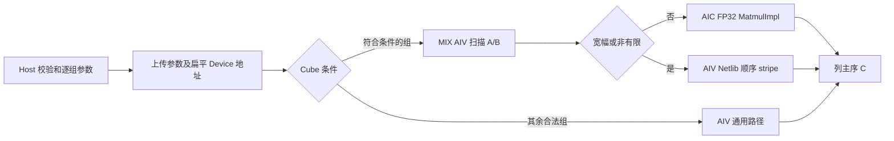

# aclblasSgemmGroupedBatched 算子设计文档（Atlas A2/A3）

# 需求背景（required）

## 需求来源

本设计针对任务书 `aclblasSgemmGroupedBatched_A2A3_task_doc.md`，在 `cann/ops-blas` 现有公共 API 中新增 `arch22` 实现，目标 CANN 9.1.0、Atlas A2/A3。以任务书和随包 1200 条 CSV 为功能与数值边界，以现有 `arch35` Host 实现复用句柄、工作区、Host 指针数组的调用形式。社区设计及贡献流程参照[社区任务说明](https://gitcode.com/org/cann/discussions/39)、[本任务官方目录](https://gitcode.com/cann/cann-ops-competitions/tree/master/04_tasks/01_community-task-2026/tasklist/09-aclblasSgemmGroupedBatched-A2A3)和[ops-blas 贡献指南](https://gitcode.com/cann/ops-blas/blob/master/CONTRIBUTING.md)。

## 背景介绍

主仓已有 `aclblasSgemmGroupedBatched` 公共声明和 `arch35` 实现，算子 README 原先将 Atlas A2/A3 标为不支持。社区任务要求在保持句柄式接口和分组列主序 GEMM 语义的前提下，补充适配 A2/A3 的 `arch22` 实现、测试及自验证材料。现有 `arch35` 只能作为接口和仓库结构参考，设备路径、非法参数返回码和任务书精度/性能要求均须针对 A2/A3 单独落实。

# 需求分析（required）

## 需求描述与接口契约

公开接口为 `aclblasSgemmGroupedBatched(handle, groupCount, transaArray, transbArray, mArray, nArray, kArray, alphaArray, Aarray, ldaArray, Barray, ldbArray, betaArray, Carray, ldcArray, groupSizeArray)`，保持主仓签名与 `aclblasStatus_t`。各标量和形状数组在 Host，长度为 `groupCount`；`Aarray/Barray/Carray` 是 Host 端扁平数组，元素是 Device 矩阵地址，总长度为 `sum(groupSizeArray)`。矩阵数据为 FP32、列主序，各组可有独立的 N/T、尺寸、前导维、alpha、beta、batch 数；不支持 stride 或 broadcast。

组 `g` 的每个 batch `b` 计算：

```
C[g,b] = alpha[g] * op(A[g,b]) * op(B[g,b]) + beta[g] * C[g,b]
op(A): m[g] × k[g]; op(B): k[g] × n[g]; C: m[g] × n[g]
```

`groupCount=0` 成功返回；`m=0`、`n=0`、`groupSize=0` 的组不计算；`k=0` 或 `alpha=0` 的非空输出组执行 `C=beta*C`。`ACLBLAS_OP_C` 不在任务书支持范围内，随包负向用例指定 `ACLBLAS_STATUS_INVALID_VALUE`。现有 arch35 对此返回 `INVALID_ENUM`，正式公共接口兼容性需任务方确认；本实现按新任务书执行。

## 外部组件依赖与内部适配模块

运行依赖 CANN 9.1.0 的 ACL Runtime、ops-blas 句柄/stream 与工作区接口，以及 Ascend C 的 AIV 和 Matmul Kernel 能力；测试依赖 GTest、CSV 装载器、Netlib BLAS `cblas_sgemm` 和 msprof。生产算子不依赖测试用的 Netlib 或 GPU。内部适配只新增 `arch22` Host、Kernel 与 tiling 数据结构，复用 `include/cann_ops_blas.h` 的现有声明，不新增 ACLNN、op_graph、shape 推导或自动生成接口。

## 需求拆解

| 任务书要求 | 实现位置与做法 | 本地验证依据 |
|---|---|---|
| 异构分组 FP32 列主序 GEMM、N/T 四组合与非对齐 LD | `arch22` Host 建逐组参数；Cube 和 AIV 按组分派 | A2/A3 同版各完成 1000/1000 条非性能 CSV |
| 零维、空组、`k=0`、`alpha=0` 和指定错误码 | Host 校验与 no-op 判定；AIV 处理 `C=beta*C` | 原始边界、负向 CSV；`OP_C` 按任务书返回 `INVALID_VALUE` |
| Netlib golden 与混合容差、Inf/NaN/极值 | C++ GTest 逐组生成 Netlib 结果并比较有效 C；低工作量组顺序累加，Cube 组按扫描成本选择完整扫描、条带局部扫描或独立并行预检，并按需切换 Netlib 顺序路径 | A2/A3 同版各完成 1000 条非性能 CSV 与 14 项补例；最新修订各完成 13 条受影响 CSV 和 3 项边界补例；官方特殊值口径待确认 |
| 910B3 上五项硬性能指标及 200 条性能用例 | Cube tile 与多核 stripe；扫描调度按重复元素数、batch 数及 K 决策，性能脚本按一次 API 首末任务跨度计时 | A2 前一受测版 200/200 条性能 CSV 达标；最新修订版抽测 50/50 条达标，包含五项硬指标；各版分开记录，每例 11 次有效采样 |
| Atlas A2/A3 与 CANN 9.1.0 | `arch22` 共用实现，README 标注两系列支持 | A2/A3 均已构建和上板实测；官方双款型验收仍待执行 |

## spec.yaml 一致性映射

`spec.yaml` 在本地工作流中记录数学和测试契约；本算子为句柄式 BLAS 五逻辑输入接口，通用两输入广播校验器的 Stage 5 不适用。不能把该机器门禁的失败解释成矩阵广播需求，也不能据此改写任务书。

| 契约字段 | 设计承接位置 | 状态 |
|---|---|---|
| dtype、公式、shape | FP32 列主序、逐组 `m/n/k` 与 `C=alpha·op(A)·op(B)+beta·C` | 与任务书及测试数据一致 |
| layout、batch | Host 扁平 Device 指针数组、逐组前缀和、无 stride/broadcast | 与接口签名一致 |
| boundary、errors | 零组、零维、零 K/alpha、N/T、LD 和空指针校验 | `OP_C` 返回码与 arch35 冲突，按任务书实现，待官方确认 |
| tolerance、special values | Netlib golden、`2^-13` 混合容差、0.99 匹配率及最大误差；NaN/Inf 分类比较 | 运行器解释与任务方正式口径待确认 |
| performance、hardware | 910B3 上五项硬阈值；A2/A3 最终验收 | A2/A3 自测已有证据；官方双款型验收未完成 |
| batch_partition_independence | 每个 `(group, batch)` 独立计算，扁平化只改变调度索引，不改变矩阵值或组参数 | 分组/拆分 batch 的变形测试可逐项比对输出；当前自动门禁未执行此性质 |
| c_output_shape_per_item | 每个有效 batch 的 C 逻辑形状为 `m×n`；前导维仅改变物理存储间距 | 仅比较有效元素，不把 padding 当输出 |

# 详细设计（required）

## 算子分析

输入为各组 Host 参数数组及扁平 Device 矩阵指针数组，输出为原位更新的 `Carray`。每组独立选择 N/T、矩阵尺寸、前导维、标量及 batch 数；数据类型固定为 FP32，矩阵采用列主序，不支持广播、跨 batch stride 或共轭转置。数学公式和零值语义见“需求描述与接口契约”，异常输入先由 Host 拦截；需读取矩阵数据的组再交给 AIV 或 Cube 路径。

任务书以 cuBLAS 的分组 GEMM 数学行为为参考，但 cuBLAS 的内部实现不是公开的 TBE 标杆源码，不能编造其内核流程。本设计与已有 `arch35` 的共同点是公共句柄接口、Host 参数数组和列主序分组语义；差别是 A2/A3 需用 `arch22` 的 AIV/Cube 路径处理硬件资源、尾块和任务书指定的精度性能要求。下文流程图是本实现的可审查数据流，不冒充 cuBLAS 或 TBE 源码流程图。

## 算子实现

### Host 侧设计

Host 先检查 handle、组数、必需数组、逐组尺寸及批次数累加溢出；对 `groupSize>0` 的组再检查转置与前导维，最后对有效输出组逐元素检查 A/B/C 的 Device 地址。对无效值返回 `INVALID_VALUE`，空 handle 返回 `HANDLE_IS_NULLPTR`；零组在数组判空之前返回成功。零维和空组不读取其矩阵地址；`k=0` 或 `alpha=0` 不读取 A/B 的矩阵数据，但有效输出组的 A/B/C 地址仍按任务书 §2.4 判空。所有分配与调用错误按主仓状态码传播。空 batch 组的转置与 LD 当前不校验，此优先级属于验收待确认边界。

逐组建立 `GroupParam`（形状、N/T、alpha/beta、LD、扁平 batch 起始位置及路径标记）。将 Host 端指针值展平为三个 `uint64_t` 数组，与 tiling 和逐组参数一起复制到句柄关联 Device 工作区，再在句柄 stream 上发起所需的内核。工作区布局为 20 字节 tiling、对齐至 256 字节后的 `60×groupCount` 字节组参数、再次对齐至 256 字节后的三个 `8×totalBatchCount` 字节指针数组；有 Cube 工作项时还需对齐并追加决策区。Host 调用主仓 `EnsureDefaultWorkspace`：库管理的工作区可按需扩容，用户提供的工作区不足时返回该函数的错误码。异步执行期间工作区须保持有效。Host 不重新分配矩阵或修改用户数据。

通用 AIV 路径的 Host 分核公式为 `coreNum=GetAivCoreCount()`、`batchPerCore=ceil(totalBatchCount/coreNum)`、`usedCoreNum=ceil(totalBatchCount/batchPerCore)`、`batchTail=totalBatchCount-(usedCoreNum-1)×batchPerCore`。`totalBatchCount=0` 时直接跳过下发，避免除零。每核依分配的扁平 batch 索引查找所属组，组内矩阵仍独立计算。Cube 工作项按 `group×batch×stripe` 展开，各核以 `core, core+coreNum, ...` 遍历，不把不同组混成同一个 Matmul tile。本句柄式接口以运行时 `GroupParam.useCube` 按组分派 Cube/AIV，不设置框架算子的静态 TilingKey；20 字节 tiling 与组参数承担运行时路径和分核信息。

| 资源 | 预算与边界 | 验证方式 |
|---|---|---|
| 显式 UB/LocalTensor | Cube AIV 与独立预检内核各自分配输入、绝对值、归约工作区各 48 KiB（`SCAN_TILE=12288` 个 FP32 元素，合计 `3×48 KiB`），另有约 64 B 状态缓冲；两个内核分次下发，分别计算预算 | 核端代码检查与 A2/A3 编译 |
| Cube 内部 UB | `MatmulImpl`/`TPipe` 管理，未暴露可精确声明的独立字节数；静态 tile 上限为 128×128、K 上限 4096 | CANN 9.1.0 A2 构建和 Cube 用例实测；不虚构库内部容量 |
| 句柄 Device 工作区 | 布局包含 tiling、组参数和三组指针数组；有 Cube 工作项时再按 256 字节对齐，追加 `64×cubeWorkCount` 字节决策区 | Host 调用 `EnsureDefaultWorkspace`；库工作区按需扩容，用户工作区不足时返回分配错误；大规模实测内存记录归档 |

分派规则按组进行：有效组满足 `alpha=1`、`beta=0`、`m/n/k>=8` 且 `k<=4096` 时走 Cube；其中 `m/n/k≤16、groupSize≤4`，或 `m/n≤64、m×n≤1536、k≤64、groupSize≤2` 的低工作量组走 AIV 顺序累加，以保留 Netlib 的 FP32 溢出次序。其它合法组走通用 AIV 路径，零计算组跳过。Cube 的 `SetSingleShape/SetOrgShape` 处理非对齐尺寸、LD 与尾块。若一次调用同时包含两类组，Host 在同一 stream 上顺序发起两个内核，各内核只处理自己的组；仅有一类时只发一个。

Cube 内核采用 AIC:AIV 为 1:1 的 MIX 模式。每个 `cubeWork` 对应一组的一个 batch 和一个输出 stripe，两侧按相同的 `core, core+cores, ...` 次序处理。Host 估算同一 batch 的重复扫描元素数 `k×(m+n)×(cubeSplit-1)`；组有多个 stripe，且重复扫描超过 1000 万元素，或者重复扫描超过 100 万元素并满足 `groupSize≥8` 或 `groupSize≥4 且 k≥256` 时，在同一 stream 先下发独立 MIX 预检内核并行扫描，再下发 Cube 内核。此时 Cube AIV 对同一 batch 的 stripe 决策取 OR。其余场景在 Cube 内核扫描：单 stripe 扫完整逻辑 A/B；多 stripe 且物理切片适合连续读取时，仅扫描该输出 stripe 实际使用的 op(A) 行和 op(B) 列；其他多 stripe 场景保守地扫描完整 A/B。局部切片中的宽幅值只影响依赖该切片的输出，其他 stripe 可继续用 Matmul。扫描中的 `max(abs(x))` 达到 `1.0e9f`，或出现 NaN/Inf（比较不成立），就将相应输出判为宽幅。紧凑 LD 连续扫描，带 padding 的矩阵仅扫描有效行，均不读取无效填充。独立预检结果写在每个工作项 64 字节决策区的第 8 个字位置，与 Cube AIV 的 8 字状态写区分离；同 stream 的预检完成后 Cube 才读取。Cube AIV 通过 `Duplicate` 生成 8 个状态元素，以 `V_MTE3` 事件保证矢量写完成，再通过 `DataCopy` 的 MTE3 路径把 32 字节决策写入 GM；随后以 `CrossCoreSetFlag<2, PIPE_MTE3>(10)` 发布。AIC 在 `CrossCoreWaitFlag<2>(10)` 返回后读取决策。普通输入由 AIC 运行 Matmul；宽幅或非有限输入由 AIV 按 Netlib 的 K 更新顺序计算该 stripe，AIC 跳过对应 Matmul。是否下发预检由重复扫描估算决定，不能仅凭 stripe 数判定一个或两个内核任务。

核间标志采用双向窗口协议：每核最多连续处理 8 个工作项；若仍有后续项，AIC 消费第 8 个决策并完成相应计算后以 `CrossCoreSetFlag<2, PIPE_FIX>(9)` 回执，AIV 在 `CrossCoreWaitFlag<2>(9)` 返回后继续下一窗口。两侧仅在确有下一窗口时配对等待/发送，宽幅和普通分支都执行同样的回执计数。标志 9/10 与 Matmul 内部使用的 0–7、`SyncAll` 使用的 11–14 错开，使未消费的前向通知不超过 8 次，低于模式 2 的 15 次计数上限。扫描 LocalTensor 的显式预算约 `3×48 KiB + 64 B`，小于 2201 可用 UB 下界 `192 KiB - 256 B - 8 KiB`；Cube 高阶 API 自身资源由编译器分配，A2/A3 实际构建和运行是最终依据。

### Kernel 侧设计与数据流



#### Cube 路径与性能优化

Cube 路径按组规划 batch 和输出 tile 工作项。每个 batch 在核内按 128×128 输出块遍历；组内 batch 少于 AIC 核数且输出 tile 多于 1 时，同一 batch 分配多个 tile stripe，不同核心写互不重叠的 C 区域。大 batch 则每 batch 一个 stripe，保持原有分配效率。Host 将各组 `cubeWorkOffset/cubeSplit` 写入 `GroupParam`，核端按工作项映射到组、batch 和 stripe。通过把列主序 `op(A)×op(B)` 解释为行主序 `op(B)^T×op(A)^T`，交换左右输入，在 `N/N、N/T、T/N、T/T` 四种组合中选用对应 `MatmulImpl` 静态模板。alpha=1、beta=0 时直接写回 C，避免中间输出与二次缩放。8×8 大 batch 路径另设补例逐元素核对。

API 参数演练：取 `m=130、n=129、k=64、transA=N、transB=T、lda=136、ldb=132、ldc=136`。列主序重解释后，Cube 左操作数来自 B、右操作数来自 A；`transB=T` 对应左侧转置模板。核端调用 `SetOrgShape(132,136,132,136,136)` 保留输入与输出的物理 LD。128×128 tile 的末块从逻辑行 128、列 128 开始，实际 `rows=1、cols=2`，因此调用 `SetSingleShape(1,2,64)`，左侧地址偏移为 128，右侧为 128，C 地址偏移为 `128×136+128`。这组参数由当前实现的尾块、N/T 分派和地址公式推导，A2 已编译并执行对应路径。五参数原型及调用先后顺序见[官方 Matmul Kernel `SetOrgShape` 说明（CANN 9.0）](https://www.hiascend.com/doc_center/source/en/CANNCommunityEdition/900/API/ascendcopapi/atlasascendc_api_07_0651.html)，CANN 9.1 的[Matmul Kernel 实现指南](https://www.hiascend.com/document/detail/en/CANNCommunityEdition/910/programug/Ascendcopdevg/docs/en/guide/operator_practice/simd_operator_impl/matrix_advanced_api/operator_implementation.md)说明 `SetSingleShape` 在运行时更新单核 M/N/K；本地 CANN 9.1.0 构建已验证实际调用签名。该数值演练用于解释参数映射，不声明它是一条单独实测的原始 CSV 用例。

#### AIV 泛化路径

通用 AIV 路径按 batch 和组分配核心，处理不对齐、padding、任意 alpha/beta、零 k 与特殊数值。当前采用直接 GM FP32 标量循环以保证列主序和尾块语义：C 的有效元素按 `col*ldc+row` 索引，A/B 按各自 N/T 与 LD 索引；一般组采用四路部分和后合并 alpha/beta，低工作量分支在 `alpha=1、beta=0` 时按 Netlib SGEMM 的 K 顺序逐次更新，避免极值中间溢出的顺序差异；`k=0/alpha=0` 仅做 beta 缩放。它不覆盖 padding。

## 支持硬件

算子实现位于 ops-blas `arch22`，目标为 CANN 9.1.0 的 Atlas A2/A3 系列。A2/A3 同哈希受测版各完成 1000/1000 条非性能 CSV 与 14 项补例；最新修订在两款设备上各完成 13 条受影响 CSV 和 3 项边界补例。A2 前一受测版完成 200/200 条性能 CSV，最新修订版完成含五项硬指标的 50/50 条抽测，各版证据分开。编译器目标为 `dav-2201`。Atlas 800I A2/A3 的官方双款型验收尚未取得。任务书五项性能上限仅在指定的 Atlas 800T A2（910B3）设备上判定。

## 算子约束限制

公开接口仅接受 FP32 列主序矩阵和逐组 `ACLBLAS_OP_N/T`；矩阵地址数组位于 Host，矩阵数据位于 Device；支持异构组，不支持 stride、broadcast 或 `OP_C`。每组允许零维、零 batch、零 K 或零 alpha 并按前述数学契约处理。Cube 分派的 `k≤4096` 是内部优化范围，不限制接口合法 K；其它合法形状由 AIV 路径承接。

# 特性交叉分析

| 交叉场景 | 设计处理 | 验证入口 |
| --- | --- | --- |
| N/T 四组合 × 异构组 × 非对齐 LD/尾块 | Host 逐组保存转置和物理 LD，Cube 交换左右输入并显式设置原始/单次 tile 尺寸；AIV 使用列主序索引 | 随包 EX/LD/AB 与当前版分层用例 |
| 零维或空 batch × 空矩阵地址 | 无输出组不读取矩阵地址；仅有输出的组检查有效 C | L0/BC/GC 和空指针负例 |
| `k=0` 或 `alpha=0` × `beta` | 仍校验有效输出组的 A/B/C 地址，不读取 A/B 矩阵数据，计算 `C=beta*C` | L0/BC 及具名空地址补例 |
| NaN/Inf/极值 × 多 stripe × Cube | 对依赖的输入切片做扫描；受影响 stripe 顺序累加，其余 stripe 保持 Matmul 路径；padding 不参与扫描 | FL、`TC_FL_134` 与新增条带特殊值补例 |
| 多组混合 AIV/Cube × 异步 stream | 同一 stream 顺序上传参数并发起各类内核，工作区生命周期由句柄管理 | 混合分组用例、构建与 profiler 任务序列 |

# 可维可测分析

## 精度标准、性能标准与边界

| 验收项 | 具体判据 | 来源与待确认范围 |
| --- | --- | --- |
| 精度 | Netlib BLAS golden；`atol=rtol=2^-13`，匹配率 ≥0.99，并满足最大误差界 | 任务书 §3.2；“或”的数值解释及 NaN/Inf 比较口径待任务方确认 |
| 五项硬性能 | 910B3 上 `TC_PF_1001`—`1005` 分别不高于 351.3/3714/37652/298380/1188440 μs，预热后 >10 次有效采样 | 任务书 §3.3、§7；`msprof op` 与本地普通 `msprof` 口径待确认 |
| 其余性能和内存 | 195 条参考比值与逐例耗时留存；内存提供真实占用数据，无数值上限 | 任务书 §3.3、§4；其余 195 条是否逐条拒收待确认 |

准确性以 Netlib BLAS `cblas_sgemm` 按组逐 batch 生成 golden，仅比对每个 C 的有效 `m×n` 元素。单例逐元素容差 `atol=rtol=2^-13`，匹配率至少 0.99，同时检查每元素绝对误差上限 `max(1e-2, 32×ULP(|golden|))`。这是本地依据仓库混合容差实现采用的暂定解释；官方“或”的选取方式仍待确认。NaN 按同类、Inf 按同符号比较，正式口径待确认。`RANDOM_EXTREME` 的 `TC_FL_134` 有 1024 个非有限 Netlib 参考输出，旧测试曾跳过；现全部进入比较，小组顺序累加后 1024/1024 匹配，有限的 1e18 量级补例亦通过。合法非空用例不得跳过比较。

性能在确认整机型号的 Atlas 800T A2（910B3）上，对任务书 `TC_PF_1001`—`1005` 的阈值依次为 351.3、3714、37652、298380、1188440 μs。保存逐次 msprof 原始记录；每例预热后取 11 次有效采样。若一次调用包含多个任务，以首任务开始到末任务结束的跨度判定，正式汇总口径仍需任务方确认。A2 上 `msprof op` 的 profiling 通道启动失败，本地自验使用常规 `msprof`；与官方工具口径的等同性仍需确认。内存无硬阈值，仍测量峰值并报告。

边界用例覆盖 `groupCount=0`、零维/零 batch、`k=0`、`alpha=0`、四种转置组合、异构组、LD padding、不对齐及尾块、负尺寸、LD 不足、数组或有效矩阵地址为空、Inf/NaN、极端有限值。对 Host 工作区和批次计数做溢出检查，不以过滤原始 CSV 代替支持能力。

## 测试设计与可复现交付

当前主仓测试树采用 `test/gemm_grouped_batched/arch22/`，故在此路径使用随包冻结的 1200 条 CSV（保留原始哈希）；任务书 §5 写 `test/gemm_grouped_batched/sgemm_grouped_batched/arch22/`，随包 README 又要求以主仓最新结构为准。正式提交前须请任务方确认目录冲突。测试程序逐例核对返回码；1000 条非 `TC_PF` 用例比对有效 C 元素，Netlib `libblas` 作 golden。200 条 `TC_PF` 用例供 profiler 测量。GTest XML、进程退出码和 CSV case ID 三方交叉核对，确保选中的用例实际发现、执行且无重复、遗漏；随包 `verify_accuracy.py` 的提示本身不作为通过证据。已完成 A2/A3 同版 1000/1000 非性能 CSV 与 14 项补例；最新修订在两款设备上各完成 13 条受影响 CSV 和 3 项边界补例。性能证据按实际受测版本单独记录；官方验收仍以任务方在 Atlas 800I A2/A3 的判定为准。

代码交付包含 `blas/gemm_grouped_batched/arch22/`、`test/gemm_grouped_batched/arch22/`、算子 README 更新及必要的构建接入。提交前按仓库贡献要求完成本地代码检查、构建、测试和评审。[官方任务](https://www.hiascend.com/activities/task-center/details/e531ef0ad20a4896a31654798c933d43?menu=trends)与用户任务书已核对，任务 ID 为 `e531ef0ad20a4896a31654798c933d43`，[专属讨论帖](https://gitcode.com/cann/ops-blas/discussions/36)已定位。`OP_C` 返回码、性能计时口径与测试目录的已知冲突均以官方评审结论为最终依据。

## 兼容性分析

接口声明复用主仓 `include/cann_ops_blas.h`，没有新增不兼容的公共符号。`arch22` 与既有 `arch35` 是按产品架构选择的实现；`OP_C` 返回码存在任务书与 arch35 的已知冲突，需在官方评审中明确。A2 与 A3 均已上板自验，但开发者自验不能替代任务书 §7 的双款型官方验收。

## 参考资料

直接判据为用户提供的 A2/A3 任务书及随包 CSV、`gpu_baseline.csv`；工程规范参考 [ops-blas README](https://gitcode.com/cann/ops-blas/blob/master/README.md)、[贡献指南](https://gitcode.com/cann/ops-blas/blob/master/CONTRIBUTING.md)和[社区任务说明](https://gitcode.com/cann/cann-ops-competitions/blob/master/04_tasks/01_community-task-2026/README.md)。
