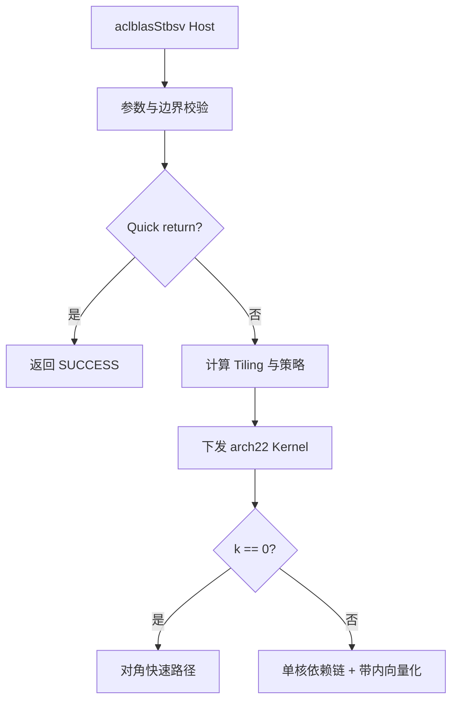

# aclblasStbsv 算子（Atlas A2/A3）设计文档

| 项目 | 内容 |
| --- | --- |
| 任务名称 | aclblasStbsv 算子开发（A2/A3） |
| 任务编号 | 2026 年社区任务第 9 批 |
| 贡献者目录 | `Aiminer` |
| 目标仓库 | `cann/ops-blas` |
| 目标架构 | Atlas A2/A3，`arch22` |
| CANN 版本 | 9.1.0 |
| 文档状态 | 设计阶段；功能、精度与性能数据待编码及真机验证 |

## 一、需求背景（required）

### 1.1 需求来源

本任务来自 CANN 社区算子开发活动，目标是在 `ops-blas` 仓库中补齐 Atlas A2/A3 上的
`aclblasStbsv` 实现。设计文档计划放置于：

- [活动报名页](https://www.hiascend.com/developer/activities/details/11014a50a8794171a4a08688fd398774#tab2)
- [任务详情页](https://www.hiascend.com/activities/task-center/details/29c59d7ef9fa4aa8ad26b82969c5e2b6?menu=tasks)
- [设计文档提交参考 PR #1157](https://gitcode.com/cann/cann-ops-competitions/pull/1157)
- [ops-blas 仓库](https://gitcode.com/cann/ops-blas)
- [Netlib STBSV 参考语义](https://www.netlib.org/lapack/explore-html/d0/d24/group__tbsv_ga2d339ef6ec7c2462086a8f8a6fd1c32c.html)

```text
04_tasks/01_community-task-2026/tasklist/09-aclblasStbsv-A2A3/Aiminer/docs/design.md
```

算子代码与测试计划分别放置于：

```text
blas/tbsv/arch22/
test/tbsv/stbsv/arch22/
```

### 1.2 背景与价值

`STBSV` 是 BLAS Level 2 中的单精度三角带状方程求解接口，用于求解：

\[
\operatorname{op}(A)x=b
\]

其中，`A` 为实数三角带状矩阵，`op(A)` 可为 `A`、`A^T` 或 `A^H`。由于本算子的数据类型
为 `float32`，共轭转置 `A^H` 与转置 `A^T` 等价。输入向量 `x` 初始保存右端项 `b`，计算完成
后原地覆盖为方程的解。

带状存储仅保留主对角线及相邻 `k` 条对角线，存储量由稠密三角矩阵的 `O(n²)` 降为
`O(nk)`。该接口可用于有限差分、局部耦合线性系统和预条件求解等场景。

### 1.3 仓库现状

- 公共头文件中已经声明 `aclblasStbsv` 接口。
- `blas/tbsv/` 当前已有其他架构实现，可用于对齐公共 API、参数校验和目录组织。
- Atlas A2/A3 对应的 `arch22` 实现和专项测试尚需补充。
- 本设计只复用公共语义和可移植的组织方式，不直接照搬依赖其他架构能力的内核实现。

### 1.4 接口定义

```cpp
aclblasStatus_t aclblasStbsv(
    aclblasHandle_t handle,
    aclblasFillMode_t uplo,
    aclblasOperation_t trans,
    aclblasDiagType_t diag,
    int n,
    int k,
    const float* A,
    int lda,
    float* x,
    int incx);
```

| 参数 | 输入/输出 | 含义 |
| --- | --- | --- |
| `handle` | 输入 | aclBLAS 上下文，提供执行流等信息 |
| `uplo` | 输入 | `ACLBLAS_UPPER` 或 `ACLBLAS_LOWER` |
| `trans` | 输入 | `ACLBLAS_OP_N`、`ACLBLAS_OP_T` 或 `ACLBLAS_OP_C` |
| `diag` | 输入 | `ACLBLAS_NON_UNIT` 或 `ACLBLAS_UNIT` |
| `n` | 输入 | 方阵阶数，要求 `n >= 0` |
| `k` | 输入 | 带宽，要求 `k >= 0` |
| `A` | 输入 | 设备侧三角带状矩阵，列主序，逻辑形状为 `lda × n` |
| `lda` | 输入 | `A` 的主维度，要求 `lda >= max(1, k + 1)` |
| `x` | 输入/输出 | 设备侧向量；输入为 `b`，输出为解 `x` |
| `incx` | 输入 | 向量逻辑相邻元素的步长，允许正数或负数，不允许 0 |

## 二、需求分析（required）

### 2.1 功能需求

1. 支持 `float32` 数据类型。
2. 支持上三角和下三角带状矩阵。
3. 支持不转置、转置和共轭转置；实数场景下 `OP_C` 按 `OP_T` 执行。
4. 支持单位对角和非单位对角。
5. 支持正、负 `incx`，且只修改 `x` 的逻辑元素，不修改步长空洞。
6. 支持 `n = 0` 的合法空操作和 `k = 0` 的对角矩阵退化场景。
7. `A` 只读，`x` 原地更新，不申请用户可见工作空间。
8. 通过 `handle` 中的 stream 异步下发，不在接口内部做无必要的流同步。

### 2.2 参数校验与边界语义

主机侧按确定顺序校验，确保非法参数不会进入核函数。计划语义如下：

| 条件 | 处理方式 |
| --- | --- |
| `handle == nullptr` | 返回 `ACLBLAS_STATUS_HANDLE_IS_NULLPTR` |
| `n < 0` 或 `k < 0` | 返回 `ACLBLAS_STATUS_INVALID_VALUE` |
| `uplo`、`trans`、`diag` 不在合法枚举内 | 返回 `ACLBLAS_STATUS_INVALID_VALUE` |
| `lda < max(1, k + 1)` | 返回 `ACLBLAS_STATUS_INVALID_VALUE` |
| `incx == 0` | 返回 `ACLBLAS_STATUS_INVALID_VALUE` |
| `incx == INT_MIN` | 为避免取负值溢出，返回 `ACLBLAS_STATUS_INVALID_VALUE` |
| `n > 0` 且 `A == nullptr` 或 `x == nullptr` | 返回 `ACLBLAS_STATUS_INVALID_VALUE` |
| `n == 0` | 完成标量参数校验后直接成功返回，不访问 `A`、`x` |
| `k == 0 && diag == ACLBLAS_UNIT` | 完成指针校验后直接成功返回，不读取 `A`、不修改 `x` |

`k` 不额外限制为小于 `n`。计算中使用 `min(k, n - 1)` 限制实际参与运算的带宽，但上三角
矩阵的主对角线仍位于物理存储第 `k` 行，不能用有效带宽替换物理偏移。

按照 BLAS 语义，不检测非单位对角线上的零元素。如果矩阵奇异，结果可能出现 `Inf` 或
`NaN`，接口不额外返回奇异状态。调用者需保证 `A` 和 `x` 的有效存储区域不重叠。

### 2.3 任务拆解

| 模块 | 主要工作 |
| --- | --- |
| Host | 参数校验、quick return、平台信息获取、tiling 计算、核函数下发 |
| Tiling | 保存地址、维度、枚举、步长、逻辑起点、分块长度和策略标志 |
| Kernel | 四种三角/转置方向求解、单位对角、任意步长和尾块处理 |
| Test | 正确性、异常参数、边界、特殊值、内存保护和性能用例 |
| Document | 设计、接口覆盖、精度与性能报告、活动交付材料 |

## 三、详细设计（required）

### 3.1 数学定义与带状存储

以下索引均采用 0-based。矩阵 `A` 以列主序保存，每列占用 `lda` 个 `float`。

上三角存储（`ACLBLAS_UPPER`）：

\[
A_{i,j}=A_{\mathrm{storage}}[j\cdot lda+k+i-j],\quad
\max(0,j-k)\le i\le j
\]

主对角线位于每列的第 `k` 行。

下三角存储（`ACLBLAS_LOWER`）：

\[
A_{i,j}=A_{\mathrm{storage}}[j\cdot lda+i-j],\quad
j\le i\le \min(n-1,j+k)
\]

主对角线位于每列的第 0 行。每列中参与一次带内运算的系数均连续，这使系数段可以按块搬入
Unified Buffer（UB）。`lda` 大于 `k + 1` 时，多出的 padding 不得参与运算。

对于负步长，传入的 `x` 指向底层存储的起始地址，逻辑向量的首元素位置为：

\[
xStart=\begin{cases}
0,&incx>0\\
(n-1)\cdot(-incx),&incx<0
\end{cases}
\]

逻辑第 `i` 个元素的地址偏移为：

\[
p(i)=xStart+i\cdot incx
\]

`xStart` 和后续地址计算统一使用 64 位有符号整数，避免 `int` 乘法溢出。

### 3.2 求解顺序

三角求解存在严格的数据依赖，外层未知量顺序不能并行重排：

| `trans` | `uplo` | 外层方向 | 核心操作 |
| --- | --- | --- | --- |
| `OP_N` | `UPPER` | `j = n-1 ... 0` | 先解 `x[j]`，再更新前方最多 `k` 个元素 |
| `OP_N` | `LOWER` | `j = 0 ... n-1` | 先解 `x[j]`，再更新后方最多 `k` 个元素 |
| `OP_T/OP_C` | `UPPER` | `j = 0 ... n-1` | 对已求解的前方元素做点积，再解 `x[j]` |
| `OP_T/OP_C` | `LOWER` | `j = n-1 ... 0` | 对已求解的后方元素做点积，再解 `x[j]` |

#### 3.2.1 不转置路径

以上三角为例，令 `len = min(k, j)`：

1. 读取逻辑元素 `x[j]`。
2. 若 `x[j] == 0`，按参考 BLAS 语义跳过本列的除法和更新，防止无意义的
   `0 × Inf` 传播。
3. 若为非单位对角，执行 `x[j] /= A[k, j]`；单位对角不读取主对角存储。
4. 对 `x[j-len : j)` 执行向量更新：

\[
x_{j-len:j}\leftarrow x_{j-len:j}
-A_{k-len:k,j}\cdot x_j
\]

下三角流程对称，使用当前列连续的 `A[1 : len+1, j]` 更新
`x[j+1 : j+len+1]`。

#### 3.2.2 转置/共轭转置路径

以上三角为例，按正向顺序处理，令 `len = min(k, j)`：

\[
temp=x_j-
\sum_{r=1}^{len}A_{j-r,j}\cdot x_{j-r}
\]

若为非单位对角，再执行：

\[
x_j=temp/A_{j,j}
\]

下三角按反向顺序使用当前列对已求解的后方元素做点积。由于输入为实数，`OP_C` 直接复用
`OP_T` 分支，不额外执行共轭操作。

### 3.3 总体实现架构



计划新增以下文件：

```text
blas/tbsv/arch22/stbsv_host.cpp
blas/tbsv/arch22/stbsv_kernel.cpp
blas/tbsv/arch22/stbsv_tiling_data.h
test/tbsv/stbsv/arch22/test_aclblas_stbsv.cpp
test/tbsv/stbsv/arch22/test_aclblas_stbsv_wrapper.cpp
test/tbsv/stbsv/arch22/test_aclblas_stbsv.csv
```

同时更新 `blas/tbsv/README.md` 中 A2/A3 的支持状态和必要的构建清单。

#### 3.3.1 Host 设计

Host 侧承担以下职责：

1. 按 2.2 节完成参数校验。
2. 执行 `n == 0`、`k == 0 && unit` 两类 quick return。
3. 从 `handle` 获取 stream，并从平台信息获得 UB 容量和可用 AIV 核数。
4. 根据 `n`、`k`、`incx`、UB 容量生成 tiling。
5. 一般带状求解仅下发 1 个 block，保持外层依赖顺序；`k == 0` 的非单位对角快速路径可按
   元素切分到多个 AIV 核。
6. 在同一 stream 上异步下发核函数；Host 返回只表示下发状态，不代表设备计算已完成。

Host 不把设备数据拷回主机，也不主动同步 stream。

#### 3.3.2 Tiling 设计

Tiling 数据拟包含：

| 字段 | 用途 |
| --- | --- |
| `aAddr`、`xAddr` | 设备地址 |
| `n`、`k`、`lda`、`incx` | 问题尺寸和步长 |
| `uplo`、`trans`、`diag` | 算子分支 |
| `xStart` | 负步长下的逻辑首元素偏移 |
| `tileLen` | 带内向量分块长度 |
| `cacheX` | 是否将逻辑向量缓存到 UB |
| `vectorPath` | 标量/向量内层策略 |
| `blockCount` | 对角路径的核间划分数量 |

`tileLen` 按 32 Byte 对齐和 UB 预算计算，至少为 1。阈值由算子维度和可用存储推导，并结合
A2/A3 真机 profiling 调优，不针对某个测试用例编号硬编码。

#### 3.3.3 Kernel 分层策略

Kernel 采用三类路径：

1. **对角快速路径**：`k == 0` 且非单位对角时，各元素互不依赖，可多核并行执行
   `x[i] /= A[i * lda + diagRow]`。单位对角在 Host 侧直接返回。
2. **向量缓存路径**：当逻辑 `x` 可安全放入 UB 时，先加载 `x`，完成求解后写回。
   `incx == 1` 使用连续搬运；其他步长使用 gather/scatter 或显式步长访问，并保证空洞不被写入。
3. **流式回退路径**：当完整 `x` 不能放入 UB 时，仅缓存当前带宽窗口和系数 tile，其余元素
   从 Global Memory（GM）按逻辑索引读取/写回，保证任意合法规模可运行。

对于 `k > 0`，使用单个 AIV 核维护外层依赖链，在每一步的带内连续区间使用向量指令：

- 不转置分支使用标量乘向量和向量减完成带内更新。
- 转置分支使用向量乘与归约求和完成点积。
- 小 `k` 或尾部过短时采用标量循环，减少搬运和归约开销。
- 尾块可以补齐至对齐长度，但只对有效元素计算和写回。

这种设计不试图并行化有依赖的外层循环，而是利用每列带内连续存储实现可控的 SIMD 加速。

### 3.4 数据搬运与内存安全

1. `A` 始终只读；仅搬运当前列的有效带内区间，忽略 padding。
2. `diag == ACLBLAS_UNIT` 时绝不读取主对角位置，确保其中的任意填充值不会污染结果。
3. `x` 的读取和写回都使用逻辑索引 `p(i)`；对 `abs(incx) > 1` 的空洞区设置哨兵测试。
4. 计算 GM 偏移时统一提升为 64 位，Host 同时检查可推导的地址计算不会发生有符号溢出。
5. 内核不越过 `n`、当前列有效带宽和 UB 分配边界。
6. 算子不需要额外用户 workspace；UB 仅保存向量缓存、系数 tile 和归约临时空间。

### 3.5 精度策略

- 输入、输出和主体计算均使用 `float32`。
- 不转置路径保持逐列消元次序；每个输出位置在同一步中只做一次乘减。
- 转置路径的向量归约可能与串行参考实现具有不同加法顺序，误差以任务要求的混合容差判定。
- 对很短的点积使用标量顺序累加，有利于减少启动开销并贴近参考顺序。
- 不使用 TF32、FP16 等降低精度的计算模式。
- 特殊值遵循 IEEE-754 基本传播规则，不额外截断 `Inf` 或 `NaN`。

### 3.6 硬件资源使用

| 资源 | 使用方式 |
| --- | --- |
| AIV | 一般路径单核执行外层依赖链；对角路径可多核 |
| UB | 缓存 `x`、当前列系数分块和归约临时数据 |
| GM | 保存输入带状矩阵和原地向量 |
| DMA/搬运单元 | 连续系数段、连续 `x` 的批量搬运 |
| 向量单元 | 乘、减、除和归约 |

主要性能瓶颈是三角求解的串行依赖、窄带场景下的小粒度搬运，以及转置路径的逐列归约。
优化重点依次为：减少 GM 往返、降低每列启动开销、让连续带内计算进入向量路径。

## 四、可维可测分析

### 4.1 测试环境与基准

| 项目 | 计划配置 |
| --- | --- |
| 目标设备 | Atlas 800T A2（Ascend 910B3）及任务要求的 A3 环境 |
| CANN | 9.1.0 |
| 参考实现 | CPU 侧 CBLAS/Netlib `stbsv` 语义 |
| 算子调用 | Kernel 直调模式 |
| 性能采样 | 预热 5 次，至少 11 次有效采样，报告稳定统计量 |
| 性能工具 | `msprof`，以设备侧 kernel 时间为主 |

每次性能调用前必须恢复原始右端项 `b`，避免把上一次输出解当作下一次输入。首次运行、编译及初始化
开销不计入稳定性能统计。

### 4.2 精度验收

任务要求的单精度混合误差阈值为：

\[
rtol=atol=2^{-13}\approx1.2207\times10^{-4}
\]

计划同时检查：

- 满足混合容差的元素比例 `matched_ratio >= 0.99`；
- 最大绝对误差 `max_abs_error <= 1e-2`，或满足任务规定的 32 ULP 判据；
- `A` 保持不变；
- `x` 的非逻辑步长位置保持不变；
- `Inf`、`NaN` 用例按任务脚本的分类规则比较。

最终报告以活动提供的校验脚本和 CSV 字段为准。

### 4.3 性能目标

以下为任务基准门槛，不是当前实测结果：

| 序号 | `n` | `k` | `uplo` | `trans` | `diag` | 目标时间上限 |
| --- | ---: | ---: | --- | --- | --- | ---: |
| 1 | 256 | 8 | Upper | N | Non-unit | 198.0 μs |
| 2 | 512 | 32 | Lower | N | Non-unit | 379.8 μs |
| 3 | 1024 | 16 | Upper | T | Unit | 659.5 μs |
| 4 | 2048 | 64 | Lower | T | Non-unit | 1725 μs |
| 5 | 4096 | 128 | Upper | N | Unit | 2365 μs |

开发阶段还将运行任务包提供的 200 条性能用例，并与其 GPU baseline 字段对照。若 A2 与 A3 的最佳
`tileLen` 不同，优先使用平台信息生成可解释的差异化 tiling，而不是复制两套按用例特判的代码。

### 4.4 功能用例设计

以任务包提供的 1000 条精度用例和 200 条性能用例为主，并补充以下定向测试：

| 类别 | 覆盖点 |
| --- | --- |
| 枚举组合 | Upper/Lower × N/T/C × Unit/Non-unit 全组合 |
| 小规模 | `n = 0/1/2`，`k = 0/1`，用于逐项核对索引 |
| 带宽边界 | `k < n-1`、`k = n-1`、`k > n-1` |
| 主维度 | `lda = k+1` 和 `lda > k+1`，padding 填毒 |
| 步长 | `incx = 1/2/-1/-2` 及较大绝对值，空洞设置哨兵 |
| 单位对角 | 主对角填入 `NaN`，验证内核完全不读取该位置 |
| 稀疏右端项 | `x[j] = 0`，验证不转置路径的 zero-skip 语义 |
| 特殊值 | 合法位置中的 `Inf`、`-Inf`、`NaN` |
| 非法参数 | 空 handle、非法枚举、负 `n/k`、错误 `lda`、0/`INT_MIN` 步长、空指针 |
| 内存保护 | `A` 前后保护区、`x` 前后保护区、只读 A 校验 |
| 重复执行 | 同一 shape 多次恢复输入运行，排查未初始化状态和越界 |

### 4.5 调试与定位能力

- Host 日志打印错误参数名和必要的取值，不打印设备数据或大数组。
- Debug 构建可记录选中的 `cacheX`、`vectorPath`、`tileLen` 和 `blockCount`。
- Kernel 错误通过运行时返回值、`aclGetRecentErrMsg` 和 profiling 时间线定位。
- 对索引问题先用小矩阵打印 CPU 展开矩阵与带状存储映射，再进入真机调试。
- 性能回归保留原始命令、设备型号、CANN 版本、采样次数和逐次数据，确保可复现。

### 4.6 兼容性与维护性

1. 不修改公共 API 签名和枚举定义。
2. `arch22` 代码与其他架构隔离，公共 README 只更新支持矩阵。
3. Host 的返回码和参数边界与仓库现有 `stbsv` 语义保持一致。
4. 算法分支以 `uplo/trans/diag` 明确组织，共享地址计算和分块工具，避免四套重复实现。
5. 优化阈值集中在 tiling 逻辑中，并以硬件容量和 profiling 结果为依据，便于后续维护。

## 五、交付件与计划

| 阶段 | 交付内容 | 完成标准 |
| --- | --- | --- |
| 设计 | 本设计文档及设计文档 PR | 社区评审意见闭环 |
| 基础实现 | Host、tiling、四种求解方向、步长支持 | 编译通过，小规模用例与 CPU 一致 |
| 完整测试 | CSV、wrapper、单元测试和任务包用例 | 功能、异常、边界和特殊值通过 |
| 性能优化 | UB 缓存、带内向量化、对角多核路径 | 关键用例达到任务门槛 |
| 真机验证 | A2/A3 精度和性能报告 | 记录环境、命令、原始数据和结论 |
| 最终提交 | 代码 PR、设计/测试/性能材料 | 满足活动仓库交付规范 |

## 六、风险与应对

| 风险 | 影响 | 应对措施 |
| --- | --- | --- |
| 外层强依赖限制多核扩展 | 一般路径无法按行列直接多核并行 | 单核维护依赖，集中优化带内向量运算和数据驻留 |
| 小 `k` 时向量启动成本偏高 | 小规模性能下降 | tiling 选择标量内层；基于 profiling 调阈值 |
| 转置归约顺序不同 | 与 CPU 参考存在舍入差异 | 小带宽标量累加，大带宽按规定混合容差验证 |
| 负步长地址错误 | 越界或结果倒序 | 64 位 `xStart` 公式、正负步长对称用例及保护区检查 |
| `k > n-1` 混淆物理和有效带宽 | 上三角主对角定位错误 | 物理对角固定使用 `k`，循环长度单独使用 `min(k, n-1)` |
| UB 容量不足 | 大规模无法整向量缓存 | 使用流式窗口回退路径，不把可运行性绑定到完整缓存 |
| A2/A3 性能特征不同 | 单一参数不能同时最优 | 根据平台信息生成 tiling，并分别保存 profiling 证据 |

## 七、评审检查项

- [ ] 公共接口、枚举和返回码与仓库定义一致。
- [ ] 上/下三角带状存储公式已用小矩阵手工核对。
- [ ] `OP_N`、`OP_T`、`OP_C` 的求解方向正确。
- [ ] 单位对角不读取主对角存储。
- [ ] 正、负步长只更新逻辑元素。
- [ ] `n = 0`、`k = 0`、`k >= n` 均有明确语义和测试。
- [ ] 无 Host 侧数据回拷和非必要 stream 同步。
- [ ] 精度、性能、异常参数和内存保护测试齐全。
- [ ] 性能表中的目标与实测结果明确区分。
- [ ] A2/A3 真机验证材料可复现。
