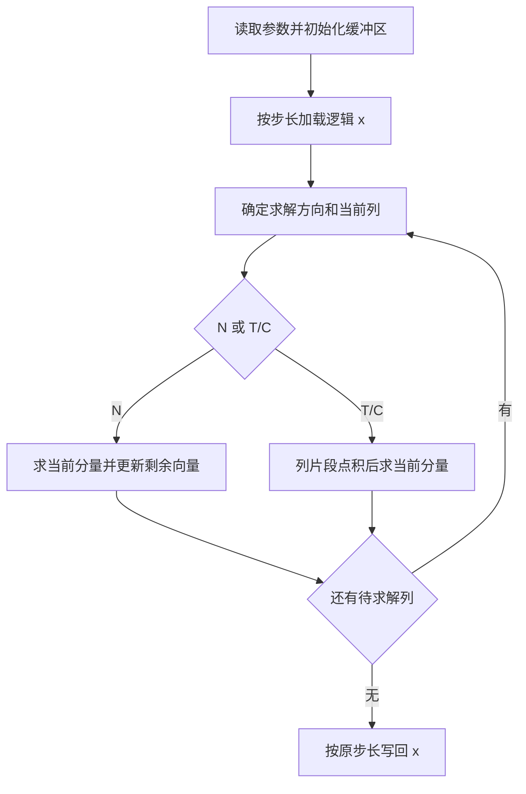

# aclblasStpsv A2/A3 算子设计文档

| 项目 | 内容 |
| --- | --- |
| 对应任务 | 算子实操工坊-北京-aclblasStpsv算子开发(A2/A3) |
| 提交者 | [zhangwei0402](https://gitcode.com/zhangwei0402) |
| 文档版本 | v0.1，设计评审稿 |
| 编写日期 | 2026-09-14 |
| 目标仓库 | `cann/ops-blas` |
| 实现目录 | `blas/tpsv/arch22/` |
| 测试目录 | `test/tpsv/stpsv/arch22/` |

## 1. 需求背景

### 1.1 需求来源

本任务为 `aclblasStpsv` 补充 Atlas A2/A3 实现，功能对齐 cuBLAS `cublasStpsv`，精度结果与 cblas/Netlib `stpsv` 比较。需求、性能门槛和交付范围以[官方任务书及测试包][task-package]为依据。

### 1.2 背景介绍

Stpsv 求解三角线性系统 `op(A) × x = b`。矩阵按列打包，只保存上三角或下三角，存储量为 `n(n+1)/2` 个 float32 元素。调用时 `x` 存放右端向量 `b`，计算完成后，解直接写回这段存储。

截至本稿编写时，主仓 TPSV README 列出的支持范围为 950PR/950DT，A2/A3 尚未支持。已有 `arch35` 实现可参考接口和求解流程；同族 TRSV 已包含 `arch22` 实现，可参考目标架构的工程组织。本任务需要结合 packed 布局重新安排搬运和计算。

三角求解的主要限制在于前后向依赖：一个未知量求出后，后续步骤才能继续。首版采用单核控制求解顺序，在每一步内部用 Vector 指令处理向量更新或点积。这样能够先建立完整的功能与性能基线，再根据大尺寸用例的耗时决定分块优化的范围。

## 2. 需求分析

### 2.1 需求描述

实现公共 BLAS 接口，使用 handle 绑定的 stream 直接启动 Ascend C kernel。输入和计算类型均为 float32。

```cpp
aclblasStatus_t aclblasStpsv(
    aclblasHandle_t handle,
    aclblasFillMode_t uplo,
    aclblasOperation_t trans,
    aclblasDiagType_t diag,
    int n,
    const float* AP,
    float* x,
    int incx);
```

函数声明沿用 `include/cann_ops_blas.h`。对角枚举使用当前公共头文件中的 `ACLBLAS_NON_UNIT`、`ACLBLAS_UNIT`，分别对应任务书的非单位对角、单位对角语义。

| 参数 | 位置/类型 | 含义与约束 |
| --- | --- | --- |
| `handle` | Host，库句柄 | 已创建的上下文，携带执行 stream |
| `uplo` | Host，枚举 | `ACLBLAS_UPPER` 或 `ACLBLAS_LOWER` |
| `trans` | Host，枚举 | `ACLBLAS_OP_N`、`ACLBLAS_OP_T`、`ACLBLAS_OP_C`；实数下 C 与 T 等价 |
| `diag` | Host，枚举 | `ACLBLAS_NON_UNIT` 读取对角并作除法；`ACLBLAS_UNIT` 按对角为 1 求解 |
| `n` | Host，int | 矩阵阶数，`n ≥ 0`；0 为空操作 |
| `AP` | Device，`const float*` | 一维 packed 三角矩阵，长度 `n(n+1)/2` |
| `x` | Device，`float*` | 输入为 b，输出为解；`n > 0` 时物理长度至少为 `1+(n-1)×abs(incx)` |
| `incx` | Host，int | 任意非零步长，支持正向和反向存储 |

### 2.2 需求拆解

| 工作项 | 完成条件 |
| --- | --- |
| 功能 | 覆盖上/下三角、N/T/C、单位/非单位对角的 12 组组合，支持正负步长和原地写回 |
| 边界 | 覆盖 n=0、n=1、非法参数、空指针及规定的 Inf/NaN 场景 |
| 工程 | 接入 `ops-blas` 的公共接口、handle/stream 和 arch22 构建流程 |
| 精度 | 跑完配套 1000 条精度用例及补充用例，按任务书标准形成逐用例结果 |
| 性能 | 跑完配套 200 条性能用例，记录超过 50 次有效采样的平均耗时，并与对应基线比较 |
| 交付 | 设计文档、接口/算子说明、测试代码、复现步骤、自测报告及待验收代码分支 |

### 2.3 支持硬件与环境

| 项目 | 设计目标 |
| --- | --- |
| 产品支持 | Atlas A2 / Atlas A3 系列，arch22 |
| 主性能验证设备 | 910B3 |
| CANN | 9.1.0 |
| 三方依赖 | torch 2.1.0 及以上，torch_npu 2.1.0.post3 及以上；cblas/Netlib 用于 golden |
| B4 验证 | 配套脚本包含 `ascend910b4` 映射，可作为补充验证环境；性能验收设备口径见第 6 节 |

首轮在 910B3 上完成编译、精度和性能验证，再在 A3 上进行功能回归并记录实际设备型号。硬件支持表随自测报告一起提交。

## 3. 详细设计

### 3.1 算子分析

#### 数学公式

令 `B = op(A)`，则求解过程为：

```text
B 为下三角：x[j] = (b[j] - Σ(k<j) B[j,k] × x[k]) / B[j,j]
B 为上三角：x[j] = (b[j] - Σ(k>j) B[j,k] × x[k]) / B[j,j]
```

单位对角时，分母取 1。每个求解步骤使用已经求出的分量，总计算量为 O(n²)。

#### Packed 地址映射

以下均为零基索引：

```text
UPPER，i ≤ j：p(i,j) = j×(j+1)/2 + i
LOWER，i ≥ j：p(i,j) = j×(2n-j-1)/2 + i
```

以 n=3 为例，两种布局分别是：

```text
UPPER：AP = [a00, a01, a11, a02, a12, a22]
LOWER：AP = [a00, a10, a20, a11, a21, a22]
```

上下三角每列的有效区间均连续。kernel 按这些区间搬运 AP，直接在 packed 格式上计算。

任务书下三角公式中重复出现了一个 `i`，本稿采用上述与列打包定义、Netlib 一致的公式，并列入设计评审确认项。

#### x 的地址映射

```text
xStart = 0                         ，incx > 0
xStart = (n-1) × (-int64(incx))     ，incx < 0
xOffset(j) = xStart + j × int64(incx)
```

`x` 指向整段物理缓冲区的起点。负步长的起始偏移由 kernel 计算，最终只更新 n 个逻辑位置，步长间隙保持原值。长度和偏移计算先扩展到 64 位，再做乘法和取负；字节数转换使用溢出检查。

#### 求解方向

| uplo | trans | 遍历 j 的顺序 | 每一步的主要计算 |
| --- | --- | --- | --- |
| LOWER | N | 0 → n-1 | 求出 x[j]，更新 x[j+1:n] |
| UPPER | N | n-1 → 0 | 求出 x[j]，更新 x[0:j] |
| UPPER | T/C | 0 → n-1 | 当前列前缀与已求解 x[0:j] 点积，求出 x[j] |
| LOWER | T/C | n-1 → 0 | 当前列后缀与已求解 x[j+1:n] 点积，求出 x[j] |

### 3.2 Host 侧设计

Host 负责参数检查、路径选择和 kernel 启动。AP、x 保持 Device 指针，由 kernel 访问；输入数据准备和结果读回放在调用方或测试工程中。

本稿建议按 `handle → n → 枚举与 incx → n=0 返回 → AP/x 指针` 的顺序检查。空规模在参数有效时直接返回成功，允许 AP、x 为空。与现有实现不同的复合错误场景在第 6 节统一确认。

| 条件 | 设计返回值 |
| --- | --- |
| handle 为空 | `ACLBLAS_STATUS_HANDLE_IS_NULLPTR` |
| n<0、incx=0，或 n>0 时 AP/x 为空 | `ACLBLAS_STATUS_INVALID_VALUE` |
| uplo、trans、diag 非法 | 按任务书暂定 `ACLBLAS_STATUS_INVALID_ENUM`，与现有测试期望的差异见第 6 节 |
| 参数有效且 n=0 | `ACLBLAS_STATUS_SUCCESS` |
| kernel 正常提交 | `ACLBLAS_STATUS_SUCCESS`；设备执行错误由调用方同步时检查 |

路径先分为三类：

| 路径 | 选择条件 | 处理方式 |
| --- | --- | --- |
| 小规模 | 初始取 n≤8，后续按实测调整 | 单核标量求解，减少搬运和向量启动开销 |
| x 常驻 UB | 完整逻辑 x 与工作缓冲区能放入 UB | x 搬入一次，逐列处理 AP，完成后写回 |
| 分段访问 x | 完整 x 超出 UB 预算 | x 保留在 GM，逐段读入、计算、写回；列间保持求解顺序 |

任务书未给 n 设置固定上限，4096 是当前性能用例的最大尺寸。路径选择以实际 UB 容量为依据。

Tiling 数据在 kernel 启动时按值传递，启动接口完成参数复制后 Host 返回。字段计划如下：

```cpp
struct StpsvTilingData {
    uint64_t apAddress;
    uint64_t xAddress;
    uint64_t packedElements;
    uint64_t vectorSpan;
    int64_t n;
    int64_t incx;
    int64_t xStart;
    uint32_t isUpper;
    uint32_t isTranspose;
    uint32_t isUnit;
    uint32_t tileLength;
    uint32_t path;          // 小规模、x常驻、x分段
    uint32_t bufferDepth;
};
```

启动使用 handle 中的 stream。Host 返回前完成本次启动参数的交付，设备侧按 stream 顺序执行；调用方读取结果前同步该 stream。

### 3.3 Kernel 侧设计

#### 执行流程



上图对应 x 常驻路径；分段路径在每次更新中写回 GM，并在进入下一列前完成本列的数据依赖。

#### N 路径：列更新

每一步先求出 x[j]，再将当前列对其余未知量的贡献减去。LOWER 更新列后缀，UPPER 更新列前缀。

```text
for j in 求解顺序:
    t = x[j]
    if t != 0:
        if NON_UNIT:
            t = t / AP[p(j,j)]
        x[j] = t
        for 当前列的非对角片段:
            x[片段] = x[片段] - t × AP[片段]
```

保留 Netlib N 路径对零分量的跳过行为。这样在零右端分量和 Inf 等特殊值同时出现时，运算路径也能与参考实现对应。

向量主体采用以下 API 序列。`xPart`、`aPart`、`product`、`outPart` 均指向对齐的 LocalTensor，`count` 为本段实际参与计算的元素数。

```cpp
AscendC::Muls(product, aPart, t, count);
AscendC::Sub(outPart, xPart, product, count);
// 等待计算完成；常驻路径拷回 xLocal，分段路径按原步长写回 GM。
```

#### T/C 路径：列点积

原矩阵当前列的非对角部分，恰好对应转置求解所需的系数。AP 仍按连续列片段读取。

```text
for j in 求解顺序:
    t = x[j]
    for 当前列中对应已求解分量的片段:
        t = t - dot(AP[片段], x[片段])
    if NON_UNIT:
        t = t / AP[p(j,j)]
    x[j] = t
```

向量点积使用乘法和归约：

```cpp
AscendC::Mul(product, aPart, xPart, count);
AscendC::ReduceSum(sumLocal, product, reduceScratch, count);
// 等待归约结果可读，再将 sumLocal[0] 从当前 t 中减去。
```

C 与 T 共用这条路径。空片段直接进入对角处理。

#### 对角、精度和同步

NON_UNIT 对角单独读取，在 float32 下完成除法；UNIT 路径只搬运非对角区间。单值除法可用对齐 LocalTensor 上的 `AscendC::Div` 完成，短标量路径保持相同计算语义。

全部乘法、更新、归约和除法使用 float32。T/C 的向量归约会改变加法顺序，首先用固定分段长度建立误差基线。若单位对角或较大规模的用例暴露累计误差，优先缩短归约分段、按求解方向累加片段结果，再比较精度与耗时。

DMA 与 Vector 的交接通过队列或事件同步；标量读取 Vector 结果、Vector 读取标量写入数据时分别建立依赖。N 路径在完成当前列的全部更新后推进 j。分段 x 路径还需保证本列 GM 写回对下一列读取可见。

### 3.4 数据分块与 UB 规划

#### 分核策略

首版 `blockDim=1`。求解顺序由这个核推进，当前列内部的独立元素交给 Vector 处理。该方式省去逐未知量的核间同步，也便于保留原地更新顺序。

#### 搬运与对齐

AP 的列起点会随 j 变化，使用 `DataCopyPad` 按有效字节数搬入对齐 UB。UNIT 场景的区间从非对角位置开始，padding 在 UB 内完成。

x 常驻路径先按 `xOffset(j)` 收集为连续逻辑向量。`incx=1` 使用连续搬运，其余步长首版采用逐逻辑元素收集/写回。对于 `incx=-1` 和较小固定步长，后续可比较连续搬入后重排的收益。

当前列对应的 x 片段起点也会变化。每段先处理最多 7 个元素的标量头部，使向量主体从 8 个 float 的边界开始；主体按 tile 切分，剩余最多 7 个元素作标量尾部。AP 从匹配的 GM 位置搬入新缓冲区，保证两个向量输入的 UB 起点均满足对齐要求。

#### 缓冲区分配

记 `A(s)=ceil(s/32)×32`，T 为每段元素数，D 为 AP 缓冲份数。首轮使用 T=256、D=1，性能比较时加入 T=512 和 D=2。

| 缓冲区 | 数量 | 字节数 | 用途 |
| --- | --- | --- | --- |
| `xLocal` | 1 | 常驻路径为 A(4n)，分段路径为 A(4T) | 逻辑 x 或当前片段 |
| `apTile` | D | D×A(4T) | 当前列片段，D=2 时作双缓冲 |
| `product` | 1 | A(4T) | Muls/Mul 的结果 |
| `outTile` | 1 | A(4T) | N 路径 Sub 的结果 |
| `reduceScratch` | 1 | R(T) | ReduceSum 临时空间 |
| `sumLocal` | 1 | 32 | 单段归约结果 |
| `pivotBuffers` | 3 | 96 | 当前分量、对角值和除法结果 |

四参数基础 `ReduceSum` 接口的临时空间按文档公式保守向上取整：

```text
R(T) = A(4 × max(1, ceil(T/64)))
```

T=256、512 时，R(T) 均取 32 字节。实现时再与 CANN 9.1.0 的实际接口约束核对。

两条主要路径的预算为：

```text
U_resident = A(4n) + (D+2)×A(4T) + R(T) + 128
U_streamed = (D+3)×A(4T) + R(T) + 128
```

例如 n=4096、T=256、D=1 时，常驻路径占 19616 字节；D=2 时占 20640 字节。这是本方案的缓冲区预算，最终分配还计入实际框架和编译器的资源需求。

Host 通过平台接口取得 UB 容量，并扣除实际保留空间后决定常驻路径是否成立。tileLength 取 8 的倍数，逐项核对队列深度、归约临时空间和输出缓冲区。对应 float32 的 tile 部分系数为：常驻路径 `4(D+2)` 字节/元素，分段路径 `4(D+3)` 字节/元素。

#### Workspace

首版额外 Device workspace 为 0。常驻路径的逻辑 x 位于 UB；分段路径在输入输出 x 的原地址上完成更新。AP 保持 packed 存储，原矩阵不展开。算子执行中产生的资源与当前调用绑定。

### 3.5 性能优化安排

第一轮先分别看 N、T/C 的耗时构成：列片段搬运、标量/向量交接、向量更新、归约、步长处理。优化依照 profiling 结果推进。

| 观察到的开销 | 优化方向 | 验证重点 |
| --- | --- | --- |
| 小 n 的启动和交接占比高 | 调整标量路径阈值，合并短片段处理 | 小尺寸耗时及所有枚举组合 |
| AP 搬运等待较多 | 比较 T=256/512，开启双缓冲预取下一片段 | DMA 与计算重叠、UB 占用、尾部正确性 |
| T/C 归约占比高 | 调整归约粒度，比较基础与分层归约 | 累计误差、Inf/NaN 行为、平均耗时 |
| 连续 x 的写回占比高 | 在 API 允许的重叠方式下合并更新缓冲区 | 原地结果、片段边界、缓冲区依赖 |
| 大规模 N 路径仍超出目标 | 评估对角块求解与剩余向量更新分离 | 总启动开销、块间依赖和整体耗时 |

最后一项作为大规模 N 路径的候选方案：以 64/128 阶对角块为起点，单核求出当前块，各核按互不重叠的行段更新剩余向量；同一 stream 上先完成更新，再启动下一对角块求解。AP 按列读取各行段，x 在 GM 中保存当前残差，每块的分核范围和尾段显式计算。

对角块求解时同时保存 `active[j]=(除法前的 t != 0)`，更新核按这个标记执行。这样即使非零 t 除以 Inf 或下溢后变成零，仍能保留参考实现原有的更新行为。每个对角块需要 A(B) 字节的标记区，B 为块阶数；这部分 Device workspace 属于候选路径，按单次调用分配，在对应 stream 执行完成后回收，各调用独立使用。是否保留该路径，由包含所有 kernel 的总耗时和精度回归决定。

### 3.6 工程组织与兼容性

计划新增或调整的文件如下，实际文件命名随目标分支现有构建规则统一：

```text
ops-blas/
├── include/cann_ops_blas.h             # 沿用现有公共声明
├── blas/tpsv/
│   ├── README.md                      # 接口说明及A2/A3支持范围
│   └── arch22/
│       ├── stpsv_host.cpp             # 参数检查、分派和启动
│       ├── stpsv_kernel.cpp           # 四种求解方向与搬运计算
│       └── stpsv_tiling_data.h        # 传参结构
└── test/tpsv/stpsv/arch22/
    ├── stpsv_test.cpp
    └── stpsv_test.csv
```

构建配置、测试参数解析和公共测试填充能力按需要补充。既有 950 路径保留，通过架构构建分派接入 A2/A3。接口签名、参数顺序和 Device 指针语义保持公共 API 约定。

本任务范围为单精度实数、单矩阵单向量求解。广播、batch 和其他 dtype 不在此次接口范围内；调用方保证 NON_UNIT 的对角非零，算子沿用 BLAS 的求解语义。

## 4. 可维可测分析

### 4.1 精度标准

Golden 使用任务书指定的 cblas/Netlib `stpsv`，与 NPU 接收完全相同的 AP 和原始 b。对 n 个逻辑输出位置逐元素比较。

有限值的匹配条件为：

```text
abs(actual - golden) ≤ 2^-16 + 2^-10 × abs(golden)
matched_ratio ≥ 0.99
```

最大绝对误差按任务书给出的 `1e-2 或 32×ULP` 口径记录。评审明确 ULP 判定细节前，首轮按 `max_abs_error ≤ 1e-2` 检查，同时保存 ULP 诊断数据。仓内 MERE/MARE 结果单独保留，便于与现有测试框架对照。

NaN 比较位置，Inf 比较位置和符号，有限部分继续计算误差。n=0 和参数错误用例按返回码、访存和缓冲区状态判断。

### 4.2 用例设计

配套 1000 条精度用例和 200 条性能用例保留原编号。补充用例单独编号，报告列出计划数、执行数、通过数、失败数和跳过数。

| 测试维度 | 具体安排 |
| --- | --- |
| 功能组合 | UPPER/LOWER × N/T/C × NON_UNIT/UNIT 的 12 组组合，用小矩阵覆盖全部路径 |
| Packed 地址 | 3×3、5×5 手算样例；核对各列首尾、对角位置、首元素和末元素 |
| 地址偏移 | AP、x 在分配缓冲区内偏移 1～7 个 float 后调用，检查有效区间及两端保护区；x 始终指向本次物理向量的起点 |
| 尺寸 | 0、1、小质数、2 的幂及 ±1、非对齐值；精度扫描至 2048，4096 性能用例同时验证结果 |
| 路径覆盖 | kernel 级测试用内部 Tiling 参数强制覆盖小规模、常驻和分段路径，以相同 golden 检查四类求解方向、步长及特殊值；另外选择实际 UB 驻留边界两侧的尺寸进行设备验证 |
| 步长 | ±1、±2、±3；补齐 T/C 与两类 diag 的组合，尤其是配套 CSV 缺少的 C 非单位步长 |
| 原地写回 | 比较 n 个输出，检查 AP、x 间隙及缓冲区两端保护区保持原值 |
| UNIT | 对角分别填 0、NaN、Inf，保持非对角和 b 相同，检查结果与读取路径 |
| 输入分布 | 随机有限值用例中均匀 [-5,5] 与正态分布各 50%；正态参数按任务书范围取值，保存随机种子 |
| NON_UNIT | 对角按符号加 `max(5,n)` 偏移，NPU 与 golden 使用同一份处理后的输入 |
| 特殊值 | 被引用的 AP 非对角位置及 x 逻辑位置覆盖 ±Inf/NaN；补充全零向量和零分量跳过路径 |
| 参数错误 | 空 handle、非法枚举、n<0、incx=0、n>0 时 AP/x 为空；增加复合错误优先级用例 |
| 空规模 | 有效参数下 n=0、AP/x 为空，以及带哨兵的缓冲区，检查返回值和缓冲区状态 |
| 执行与资源 | 绑定 stream、同 stream 连续调用、独立缓冲区的多 stream 调用、重复调用资源占用和越界检查 |

配套生成器目前仍按均匀分布生成数据。本次测试工作补充正态填充和对应解析，覆盖任务书要求的混合分布。

自测驱动按目标 SoC 选择 arch22 CSV，检查测试进程退出码和实际用例数量。精度明细与性能样本以结构化文件保存，超时、未执行和缺失数据在报告中单列。

### 4.3 性能标准与测量

主性能环境为 910B3、CANN 9.1.0。四条明确给出的验收目标如下：

| case | n | uplo | trans | diag | incx | 平均耗时上限/μs |
| --- | ---: | --- | --- | --- | ---: | ---: |
| 1 | 512 | LOWER | N | NON_UNIT | 1 | 432.71 |
| 2 | 1024 | UPPER | N | NON_UNIT | 1 | 941.23 |
| 3 | 2048 | LOWER | T | NON_UNIT | 1 | 1690.94 |
| 4 | 4096 | UPPER | C | NON_UNIT | 1 | 5185.20 |

200 条性能用例全部采样，按配套 `gpu_baseline.csv` 比较。该文件已经包含 200 行基线数据，前四行按 `gpu_ms / 0.8 × 1000` 换算后与上表一致，其余用例的验收地位见第 6 节。

每个 case 保留原始 b。初始测量配置为预热 20 次、有效采样 100 次；预热阶段同样在每次调用前恢复 x，保证求解的是同一个系统。

```text
每次有效采样：
    同一stream上恢复 x=b
    记录起始设备事件
    调用一次 aclblasStpsv
    记录结束设备事件并等待本次执行完成
    读取本次耗时
```

输入恢复位于计时区间外。若优化版本由多个 kernel 组成，计时覆盖整个算子设备执行路径。数据生成、内存分配、golden 和 D2H 比对分开记录。设备事件用于采样，msprof 用于分析各阶段耗时。

任一次接口提交或 stream 同步失败，该 case 记为执行失败，保存日志和失败样本；性能判定以完整成功执行的 case 为单位。

自测报告保存每次有效样本和平均值，并记录设备完整型号、CANN/驱动版本、代码提交、CSV 校验值及测量配置。

### 4.4 内存与维护

记录 AP、x、UB 和额外 workspace 的使用量，以及重复调用前后的资源变化。任务书未单列内存性能阈值，配套说明中的 512 MB 是测试数据生成预算。

地址映射、参数检查和四种求解方向分别组织为可独立验证的代码单元。测试报告保留失败 case 的完整参数和随机种子，便于从具体用例复现精度或访存问题。

## 5. 开发安排与交付

开发与交付周期安排为一周，即 2026 年 9 月 14 日至 20 日。第 1 天推进设计评审，落实 910B3、CANN 9.1.0 开发环境及当周的 A3 验证资源；后续开发以设计评审通过、环境就绪为前提。第 7 天完成代码、自测报告、验收材料和 PR 提交，社区验收审核及 PR 合入按实际评审进度跟进。

| 时间 | 工作 | 阶段产出 |
| --- | --- | --- |
| 第1天（9月14日） | 提交设计 PR，确认接口与验收口径，准备开发环境和测试工程 | 设计稿及评审记录、可用环境、工程分支 |
| 第2天（9月15日） | 接入 arch22，完成小规模和 x 常驻路径 | 可编译调用的首版、基础用例结果 |
| 第3天（9月16日） | 完成分段路径、正负步长和边界处理，补充测试分布与驱动 | 完整功能实现、补充用例及测试驱动 |
| 第4天（9月17日） | 执行 1000 条精度用例及新增覆盖，定位并修复失败项 | 精度结果明细、问题修复及复测记录 |
| 第5天（9月18日） | 910B3 性能采样、profiling 和优化，执行 200 条性能用例 | 性能样本、优化对比和设备记录 |
| 第6天（9月19日） | 全量回归、A3 功能验证，整理接口说明、截图和自测报告 | 最终回归结果、文档与自测报告 |
| 第7天（9月20日） | 核对复现步骤和交付件，提交验收材料及代码 PR | 完整交付包、验收提交记录、代码 PR |

设计文档按社区目录规范放在对应任务的 `zhangwei0402/docs/design.md`，以 PR 形式提交评审。开发代码按本任务指定的 ops-blas 工程结构提交。

以下交付材料统一在第 7 天提交：

1. 本设计文档及评审修改记录。
2. 公共接口说明、算子 README 和调用样例。
3. 精度/性能 CSV、补充用例、测试驱动及复现说明。
4. 自测报告，包含精度明细、精度与性能结果截图、性能样本、内存记录和环境信息。
5. 个人仓库地址、分支、代码提交及算子目录；按验收流程配置代码访问权限。
6. 测试通过后，按社区流程提交 ops-blas 合入 PR。

## 6. 评审时需要统一的口径

| 问题 | 材料现状 | 本稿处理及需要确认的内容 |
| --- | --- | --- |
| 下三角地址 | 任务书公式重复写入 i | 使用第 3.1 节列打包公式，请确认任务材料修正 |
| 非法枚举返回码 | 任务书为 INVALID_ENUM，当前 arch35 实现和配套 CSV 为 INVALID_VALUE | 暂按任务书设计，评审统一返回码后同步测试期望 |
| n=0 校验顺序 | 当前 arch35 在 n=0 时提前返回，跳过枚举与 incx 检查 | 本稿建议先检查标量参数；需确认跨架构的复合错误行为 |
| 性能设备 | 任务书分别出现 800T A2、800I A2，均注明 910B3 | 以 910B3+CANN 9.1.0 准备测试，请确认服务器型号及 B4 替代测试是否被接受 |
| 最大误差 | 任务书写为 1e-2 或 32×ULP，仓内框架另用 MERE/MARE | 首轮按 1e-2 检查并保存两类统计，请明确 ULP 定义、适用条件和特殊值判定 |
| 其余性能 case | 正文明确四条阈值，配套文件另有 196 条基线 | 全部测量并比对，请确认其余用例是否逐条作为硬性验收门槛 |

## 7. 参考资料

1. [官方任务页面][task-page]及[任务书、用例和基线][task-package]。
2. [社区任务流程][community-guide]、[设计文档模板][design-template]。
3. [ops-blas 公共接口][blas-header]、[公共枚举定义][blas-common]。
4. [TPSV 算子说明][tpsv-readme]、[TRSV 算子说明][trsv-readme]。
5. [cuBLAS tpsv 接口][cublas-tpsv]、[Netlib STPSV 参考实现][netlib-stpsv]。
6. [生态算子开源精度标准][precision-standard]。
7. 设计阶段的 KG 文档及 API 核对记录见 [references.md](references.md)。

[task-page]: https://www.hiascend.com/activities/task-center/details/f5d4a88ec52f4508a489ef53f8e534a1?menu=tasks
[task-package]: https://www.hiascend.com/p/resource/202609/88e97c82a4274bed8dc0b6ab6091f322.zip
[community-guide]: https://gitcode.com/cann/cann-ops-competitions/blob/master/04_tasks/01_community-task-2026/README.md
[design-template]: https://gitcode.com/cann/cann-ops-competitions/blob/master/04_tasks/01_community-task-2026/resources/design_template.md
[blas-header]: https://gitcode.com/cann/ops-blas/blob/master/include/cann_ops_blas.h
[blas-common]: https://gitcode.com/cann/ops-blas/blob/master/include/cann_ops_blas_common.h
[tpsv-readme]: https://gitcode.com/cann/ops-blas/blob/master/blas/tpsv/README.md
[trsv-readme]: https://gitcode.com/cann/ops-blas/blob/master/blas/trsv/README.md
[cublas-tpsv]: https://docs.nvidia.com/cuda/cublas/index.html#cublas-t-tpsv
[netlib-stpsv]: https://www.netlib.org/blas/stpsv.f
[precision-standard]: https://gitcode.com/cann/opbase/blob/master/docs/zh/ops_precision_standard/experimental_standard.md
